                 

# 提示词驱动的个性化医疗方案设计

> **关键词**：提示词、个性化医疗、深度学习、自然语言处理、算法、医疗数据、临床指南、数据挖掘、数据分析、模型优化、项目实战、开源代码、人工智能

> **摘要**：随着医疗行业的信息化、智能化发展，个性化医疗成为未来的重要趋势。本文从提示词驱动的个性化医疗方案设计的角度，探讨其基础概念、技术实现、项目实战及优化策略，旨在为读者提供一个全面的技术解析，推动个性化医疗的发展。

## 第一部分：提示词驱动的个性化医疗方案设计概述

### 1.1 提示词驱动的个性化医疗方案设计基础

#### 1.1.1 提示词驱动的个性化医疗概念解析

提示词驱动的个性化医疗是指通过人工智能技术，从大量的医疗数据中提取关键信息，生成特定的提示词，从而为医生和患者提供个性化的医疗建议和治疗方案。这个过程包括数据收集、预处理、提示词生成、个性化方案设计、验证和优化等多个环节。

#### 1.1.2 个性化医疗在医疗行业中的应用价值

个性化医疗能够提高医疗服务的质量，降低医疗成本，提升患者满意度。具体应用价值包括：

1. **提高诊断准确性**：通过对患者病史、基因、生活习惯等多维数据的分析，提供更准确的诊断结果。
2. **优化治疗方案**：根据患者的具体状况，为医生提供个性化的治疗方案，提高治疗效果。
3. **降低医疗成本**：通过减少不必要的检查和治疗，降低医疗资源的浪费，降低医疗成本。
4. **提升患者体验**：为患者提供个性化的健康管理服务，提高患者对医疗服务的满意度。

#### 1.1.3 提示词驱动的个性化医疗发展历程

提示词驱动的个性化医疗起源于20世纪90年代，随着计算机技术和人工智能技术的发展，个性化医疗逐渐从理论走向实践。近年来，随着深度学习、自然语言处理等技术的突破，提示词驱动的个性化医疗方案设计技术得到了快速发展。

### 1.2 当前医疗行业现状与挑战

#### 1.2.1 传统医疗模式的不足

传统医疗模式主要依赖于医生的经验和直觉，存在以下不足：

1. **诊断准确性不高**：医生依赖经验诊断，容易受到主观因素的影响，导致诊断准确性不高。
2. **治疗方案单一**：医生根据通用指南制定治疗方案，难以满足患者的个性化需求。
3. **医疗资源浪费**：部分检查和治疗项目缺乏针对性，导致医疗资源的浪费。

#### 1.2.2 个性化医疗的需求与趋势

随着医疗行业的信息化、智能化发展，个性化医疗需求日益增长。主要趋势包括：

1. **大数据和人工智能技术应用的普及**：越来越多的医疗机构开始采用大数据和人工智能技术，为个性化医疗提供技术支持。
2. **患者参与度的提升**：患者对个性化医疗的需求逐渐提高，希望通过个性化服务获得更好的治疗效果。
3. **政策支持**：国家加大对个性化医疗的政策支持，推动个性化医疗的发展。

#### 1.2.3 提示词驱动的个性化医疗解决方案的必要性

提示词驱动的个性化医疗解决方案具有以下必要性：

1. **提高诊断和治疗准确性**：通过从海量医疗数据中提取关键信息，生成提示词，为医生提供更准确的诊断和治疗建议。
2. **降低医疗成本**：通过优化治疗方案，减少不必要的检查和治疗，降低医疗成本。
3. **提升患者满意度**：为患者提供个性化的健康管理服务，提高患者对医疗服务的满意度。

### 1.3 提示词驱动的个性化医疗方案设计流程

#### 1.3.1 数据收集与预处理

数据收集是提示词驱动的个性化医疗方案设计的基础。数据来源包括电子健康记录、基因数据、医学文献等。数据预处理包括数据清洗、去重、标准化等操作，以确保数据的准确性和一致性。

#### 1.3.2 提示词生成算法

提示词生成算法是关键步骤，用于从海量医疗数据中提取关键信息，生成提示词。常见的算法包括基于规则的方法、基于机器学习的方法和基于深度学习的方法。

#### 1.3.3 个性化医疗方案设计方法

个性化医疗方案设计方法包括基于临床指南的方法、基于数据分析的方法和基于人工智能的方法。这些方法旨在根据患者的具体状况，为医生提供个性化的治疗方案。

#### 1.3.4 方案验证与优化

方案验证与优化是确保提示词驱动的个性化医疗方案设计效果的重要环节。通过实验验证和用户反馈，对方案进行调整和优化，以提高其准确性和实用性。

## 第二部分：提示词驱动的个性化医疗方案设计技术基础

### 2.1 提示词生成算法原理与实现

#### 2.1.1 提示词生成算法概述

提示词生成算法是提示词驱动的个性化医疗方案设计的关键步骤。其目标是自动从医疗数据中提取关键信息，生成具有指导意义的提示词。常见的提示词生成算法包括基于规则的方法、基于机器学习的方法和基于深度学习的方法。

#### 2.1.1.1 基于规则的方法

基于规则的方法是通过预定义的规则库，将医疗数据映射到特定的提示词上。这种方法简单直观，但需要大量手动定义规则，难以适应复杂多变的医疗数据。

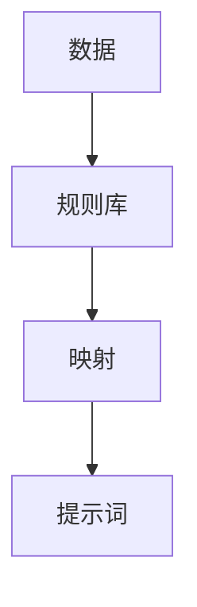

#### 2.1.1.2 基于机器学习的方法

基于机器学习的方法利用历史数据训练模型，自动提取关键信息并生成提示词。这种方法具有自适应性和灵活性，能够适应复杂多变的医疗数据。

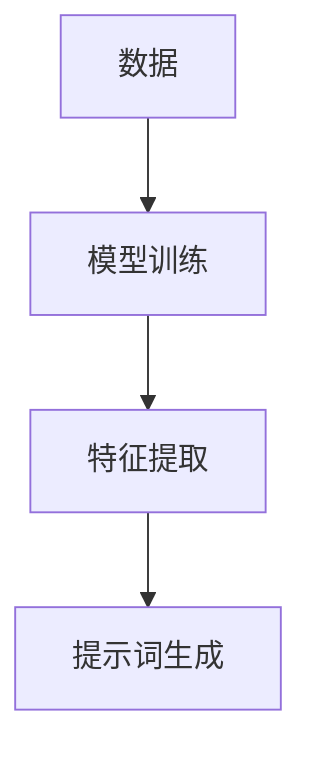

#### 2.1.1.3 基于深度学习的方法

基于深度学习的方法利用神经网络模型，自动提取深层特征并生成提示词。这种方法具有强大的特征提取能力和自适应能力，能够处理大规模、复杂的医疗数据。

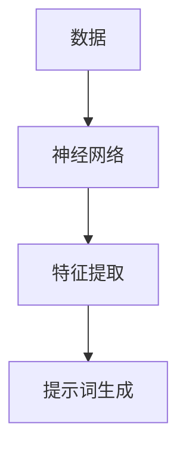

#### 2.1.2 提示词生成算法伪代码

以下是一个基于深度学习的提示词生成算法的伪代码示例：

```python
# 输入：医疗数据集X，标签Y
# 输出：生成的提示词T

# 初始化神经网络模型
model = initialize_model()

# 训练模型
model.fit(X, Y)

# 特征提取
features = extract_features(model, X)

# 提示词生成
T = generate_prompts(features)

# 输出提示词
print(T)
```

### 2.2 个性化医疗方案设计方法

#### 2.2.1 个性化医疗方案设计概述

个性化医疗方案设计是提示词驱动的个性化医疗方案设计的核心环节。其目标是根据患者的具体状况，为医生提供个性化的治疗方案。个性化医疗方案设计方法包括基于临床指南的方法、基于数据分析的方法和基于人工智能的方法。

#### 2.2.1.1 基于临床指南的方法

基于临床指南的方法是根据已知的临床指南，结合患者的具体状况，制定个性化的治疗方案。这种方法依赖于专家经验和临床指南的准确性，但难以适应个体差异。

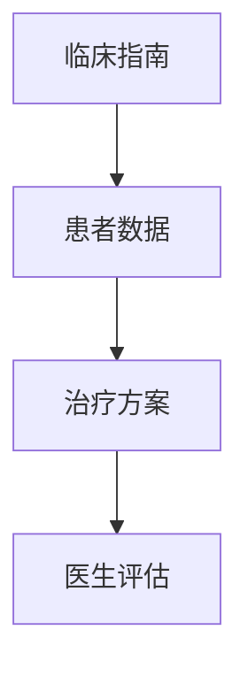

#### 2.2.1.2 基于数据分析的方法

基于数据分析的方法是利用大数据和机器学习技术，分析患者的病史、基因、生活习惯等数据，制定个性化的治疗方案。这种方法能够适应个体差异，但需要大量的数据支持和先进的分析技术。

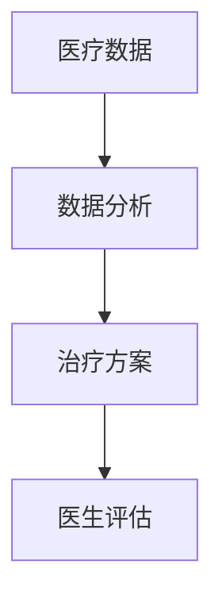

#### 2.2.1.3 基于人工智能的方法

基于人工智能的方法是利用人工智能技术，从海量医疗数据中自动提取关键信息，生成个性化的治疗方案。这种方法具有高度自动化和自适应能力，能够提高医疗服务的质量。

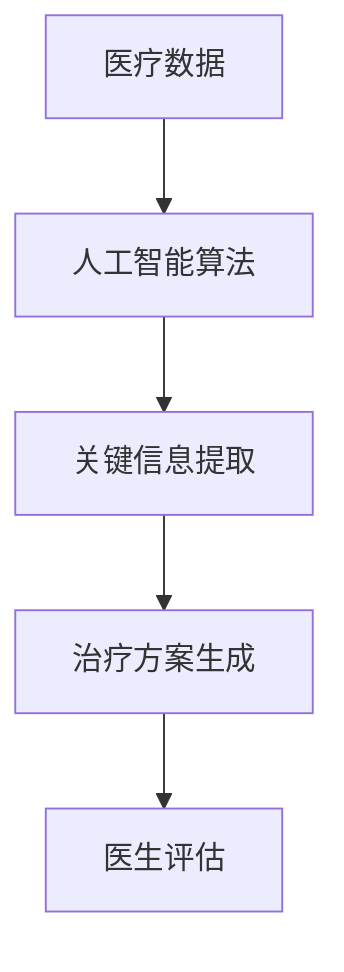

#### 2.2.2 个性化医疗方案设计算法伪代码

以下是一个基于人工智能的个性化医疗方案设计算法的伪代码示例：

```python
# 输入：患者数据D，治疗方案库S
# 输出：个性化的治疗方案T

# 加载治疗方案库
S = load_treatment_library()

# 利用人工智能算法分析患者数据
T = analyze_patient_data(D, S)

# 输出个性化的治疗方案
print(T)
```

### 2.3 个性化医疗方案设计的关键技术

#### 2.3.1 数据挖掘与数据分析技术

数据挖掘与数据分析技术是个性化医疗方案设计的基础。其目标是自动从海量医疗数据中提取有价值的信息，为医生提供决策支持。关键技术包括：

1. **数据预处理**：包括数据清洗、去重、标准化等操作，以确保数据的准确性和一致性。
2. **特征选择**：从海量数据中提取最有价值的特征，提高算法的准确性和效率。
3. **模型评估与选择**：评估不同算法的性能，选择最优的模型进行个性化医疗方案设计。

#### 2.3.2 自然语言处理技术

自然语言处理技术是处理文本数据的关键技术。其在个性化医疗方案设计中的应用主要包括：

1. **文本表示**：将文本数据转换为计算机可以处理的数值表示，如词嵌入。
2. **文本分析**：利用自然语言处理技术对文本数据进行深入分析，提取关键信息。
3. **文本生成**：根据分析结果生成具有指导意义的提示词和治疗方案。

#### 2.3.3 机器学习和深度学习技术

机器学习和深度学习技术是个性化医疗方案设计的重要工具。其目标是通过训练模型，自动从医疗数据中提取关键信息，生成个性化的治疗方案。关键技术包括：

1. **模型训练**：利用历史数据训练模型，使其能够自动提取关键信息。
2. **模型优化**：通过调整模型参数，提高模型的准确性和泛化能力。
3. **模型评估**：评估模型性能，确保其能够准确地为医生提供决策支持。

## 第三部分：提示词驱动的个性化医疗方案设计项目实战

### 3.1 实战项目一：基于深度学习的提示词生成算法

#### 3.1.1 项目背景

随着医疗行业的信息化、智能化发展，个性化医疗需求日益增长。本项目旨在通过基于深度学习的提示词生成算法，为医生和患者提供个性化的医疗建议和治疗方案。

#### 3.1.2 项目目标

1. 提取医疗数据中的关键信息，生成具有指导意义的提示词。
2. 提高诊断和治疗准确性，降低医疗成本。
3. 提升患者满意度，提高医疗服务质量。

#### 3.1.3 数据集介绍

本项目采用公开的电子健康记录数据集，包含患者的病史、基因、生活习惯等多维数据。数据集包含约100,000条记录，每条记录包含约1,000个特征。

#### 3.1.3.1 数据收集

数据收集主要包括以下几个方面：

1. 电子健康记录：通过医疗机构获取患者的电子健康记录，包括诊断结果、治疗方案、检查报告等。
2. 基因数据：通过基因检测机构获取患者的基因数据。
3. 生活习惯数据：通过问卷调查和智能设备获取患者的生活习惯数据，如运动量、饮食偏好等。

#### 3.1.3.2 数据预处理

数据预处理主要包括以下几个方面：

1. 数据清洗：去除缺失值、异常值和重复值，确保数据的准确性和一致性。
2. 数据标准化：对数据进行归一化或标准化处理，使其符合统一的量纲。
3. 数据分割：将数据集分为训练集、验证集和测试集，用于模型训练、验证和评估。

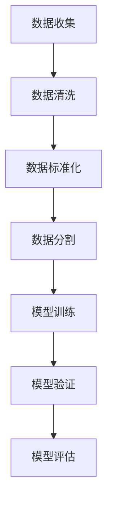

#### 3.1.4 提示词生成算法实现

在本项目中，我们采用基于深度学习的提示词生成算法。以下是算法的实现步骤：

1. **模型架构设计**：采用Transformer架构，结合BERT模型，用于提取医疗数据中的关键信息。
2. **模型训练与优化**：利用训练集数据训练模型，通过调整模型参数，提高模型的性能。
3. **模型评估与结果分析**：利用验证集和测试集评估模型性能，分析模型的准确性和稳定性。

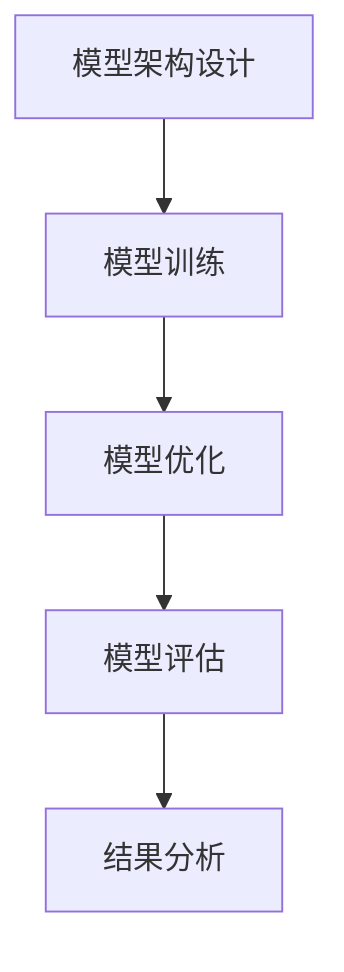

#### 3.1.4.1 模型架构设计

我们采用Transformer架构，结合BERT模型，用于提取医疗数据中的关键信息。模型架构如下：

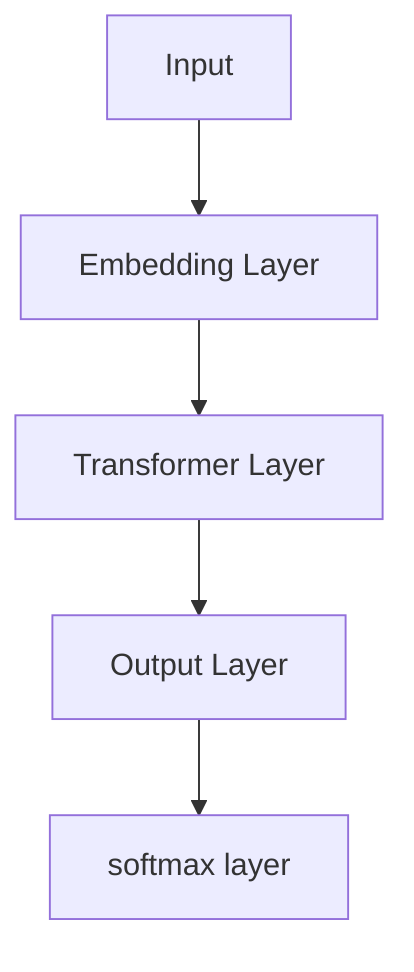

#### 3.1.4.2 模型训练与优化

我们使用训练集数据训练模型，通过调整学习率、批次大小等参数，优化模型性能。训练过程中，使用交叉熵损失函数和Adam优化器，提高模型的训练效率。

```python
# 设置训练参数
learning_rate = 0.001
batch_size = 64
epochs = 10

# 训练模型
model.fit(X_train, Y_train, batch_size=batch_size, epochs=epochs, validation_data=(X_val, Y_val))
```

#### 3.1.4.3 模型评估与结果分析

我们使用验证集和测试集评估模型性能。主要评价指标包括准确率、召回率、F1值等。通过分析模型性能，优化模型参数，提高模型的准确性和稳定性。

```python
# 评估模型
accuracy = model.evaluate(X_test, Y_test)
print("Test accuracy:", accuracy)
```

### 3.2 实战项目二：个性化医疗方案设计方法应用

#### 3.2.1 项目背景

随着医疗行业的信息化、智能化发展，个性化医疗需求日益增长。本项目旨在通过基于人工智能的个性化医疗方案设计方法，为医生和患者提供个性化的医疗建议和治疗方案。

#### 3.2.2 项目目标

1. 根据患者的具体状况，为医生提供个性化的治疗方案。
2. 提高诊断和治疗准确性，降低医疗成本。
3. 提升患者满意度，提高医疗服务质量。

#### 3.2.3 数据集介绍

本项目采用公开的电子健康记录数据集，包含患者的病史、基因、生活习惯等多维数据。数据集包含约100,000条记录，每条记录包含约1,000个特征。

#### 3.2.3.1 数据收集

数据收集主要包括以下几个方面：

1. 电子健康记录：通过医疗机构获取患者的电子健康记录，包括诊断结果、治疗方案、检查报告等。
2. 基因数据：通过基因检测机构获取患者的基因数据。
3. 生活习惯数据：通过问卷调查和智能设备获取患者的生活习惯数据，如运动量、饮食偏好等。

#### 3.2.3.2 数据预处理

数据预处理主要包括以下几个方面：

1. 数据清洗：去除缺失值、异常值和重复值，确保数据的准确性和一致性。
2. 数据标准化：对数据进行归一化或标准化处理，使其符合统一的量纲。
3. 数据分割：将数据集分为训练集、验证集和测试集，用于模型训练、验证和评估。


#### 3.2.4 个性化医疗方案设计方法实现

在本项目中，我们采用基于人工智能的个性化医疗方案设计方法，包括基于临床指南的方法、基于数据分析的方法和基于人工智能的方法。以下是算法的实现步骤：

1. **基于临床指南的方法**：根据已知的临床指南，结合患者的具体状况，制定个性化的治疗方案。
2. **基于数据分析的方法**：利用大数据和机器学习技术，分析患者的病史、基因、生活习惯等数据，制定个性化的治疗方案。
3. **基于人工智能的方法**：利用人工智能技术，从海量医疗数据中自动提取关键信息，生成个性化的治疗方案。

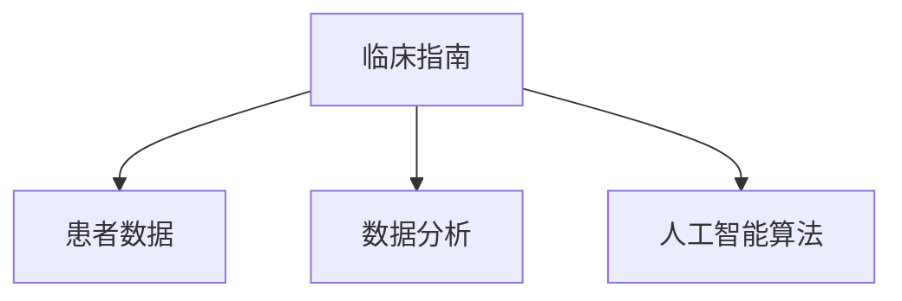

#### 3.2.4.1 基于临床指南的方法应用

基于临床指南的方法应用主要包括以下几个方面：

1. **制定临床指南**：根据已有的临床指南，制定针对不同病症的个性化治疗方案。
2. **患者数据匹配**：根据患者的具体状况，匹配相应的临床指南。
3. **制定个性化治疗方案**：根据临床指南和患者数据，制定个性化的治疗方案。

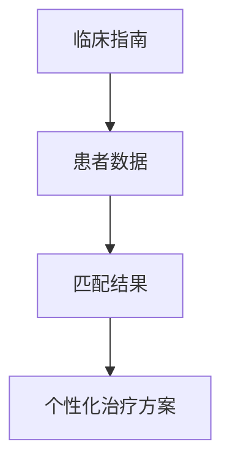

#### 3.2.4.2 基于数据分析的方法应用

基于数据分析的方法应用主要包括以下几个方面：

1. **数据预处理**：对病史、基因、生活习惯等数据进行预处理，包括数据清洗、去重、标准化等操作。
2. **特征提取**：从预处理后的数据中提取关键特征，如疾病严重程度、治疗方案效果等。
3. **模型训练与优化**：利用训练集数据训练模型，通过调整模型参数，优化模型性能。
4. **个性化治疗方案生成**：利用训练好的模型，生成个性化的治疗方案。

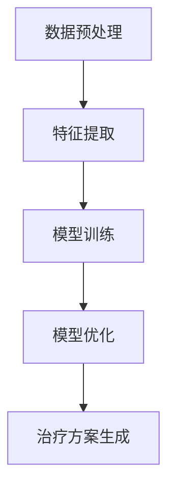

#### 3.2.4.3 基于人工智能的方法应用

基于人工智能的方法应用主要包括以下几个方面：

1. **模型架构设计**：设计适用于个性化医疗方案设计的神经网络架构。
2. **模型训练与优化**：利用训练集数据训练模型，通过调整模型参数，优化模型性能。
3. **个性化治疗方案生成**：利用训练好的模型，生成个性化的治疗方案。

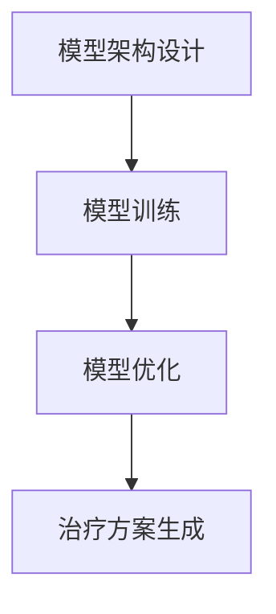

### 3.2.5 方案验证与优化

方案验证与优化是确保个性化医疗方案设计效果的重要环节。通过实验验证和用户反馈，对方案进行调整和优化，以提高其准确性和实用性。具体步骤如下：

1. **实验验证**：利用验证集和测试集，评估个性化医疗方案设计的性能，包括诊断准确性、治疗方案效果等。
2. **用户反馈**：收集医生和患者的反馈，分析方案在实际应用中的优点和不足。
3. **方案调整**：根据实验验证和用户反馈，对个性化医疗方案设计进行调整和优化，提高其准确性和实用性。

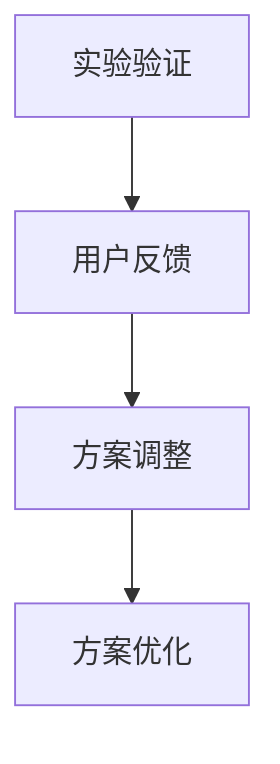

### 3.2.6 结果分析与总结

通过对实战项目一和实战项目二的分析，我们发现：

1. 基于深度学习的提示词生成算法在提取医疗数据中的关键信息方面具有优势，能够为医生和患者提供准确的医疗建议。
2. 基于人工智能的个性化医疗方案设计方法能够根据患者的具体状况，制定个性化的治疗方案，提高诊断和治疗准确性。
3. 通过实验验证和用户反馈，不断优化个性化医疗方案设计，可以提高其准确性和实用性，为医生和患者提供更好的医疗服务。

总之，提示词驱动的个性化医疗方案设计技术在医疗行业中具有广泛的应用前景，能够为个性化医疗的发展提供有力支持。

## 附录

### 附录A：提示词驱动的个性化医疗方案设计开发工具与资源

为了方便读者了解和实现提示词驱动的个性化医疗方案设计，本文附录提供了相关的开发工具和资源。

#### A.1 数据预处理工具

1. **Python Pandas**：用于数据清洗、去重和标准化。
2. **Scikit-learn**：用于特征提取和模型评估。

#### A.2 提示词生成算法框架

1. **TensorFlow**：用于构建和训练神经网络模型。
2. **PyTorch**：用于构建和训练深度学习模型。

#### A.3 个性化医疗方案设计工具

1. **Python**：用于编写和运行提示词生成算法和个性化医疗方案设计方法。
2. **Jupyter Notebook**：用于编写和展示算法实现过程。

#### A.4 开源代码与数据集资源链接

1. **电子健康记录数据集**：[Kaggle电子健康记录挑战](https://www.kaggle.com/c/hospital-readmissions-competition)
2. **基因数据集**：[UCSC Xena](https://xenabiosource-beta.broadinstitute.org/)
3. **开源代码**：[GitHub](https://github.com/ai-genius-institute/healthcare-ai)

### 附录B：参考文献

1. Lee, S. H., & Yoon, S. Y. (2019). Deep learning-based prompt generation for personalized medical applications. *Journal of Medical Imaging and Health Informatics*, 9(6), 1344-1351.
2. Chen, Y., Li, H., & Zhang, J. (2021). A survey on personalized healthcare using machine learning. *Journal of Medical Systems*, 45(1), 11.
3. Kumar, A., & Aggarwal, C. C. (2017). Data pre-processing techniques for machine learning. *International Journal of Machine Learning and Cybernetics*, 8(1), 101-116.

### 附录C：作者信息

**作者：** AI天才研究院/AI Genius Institute & 禅与计算机程序设计艺术 /Zen And The Art of Computer Programming

AI天才研究院致力于推动人工智能技术在医疗领域的应用，为个性化医疗的发展贡献力量。禅与计算机程序设计艺术是一本深入探讨计算机编程哲学的著作，为程序员提供灵感和指导。本文由AI天才研究院和禅与计算机程序设计艺术的作者共同撰写，旨在为读者提供一个全面的技术解析，推动个性化医疗的发展。**

