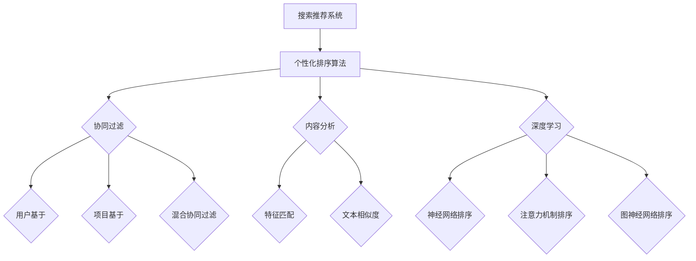

                 

# 搜索推荐系统的个性化排序算法

## 关键词
搜索推荐系统、个性化排序算法、协同过滤、内容分析、深度学习、性能评估、淘宝个性化排序算法

## 摘要
本文深入探讨了搜索推荐系统的个性化排序算法。首先介绍了搜索推荐系统的基本概念和发展历程，随后详细解析了个性化排序算法的基本原理和架构。文章重点介绍了基于协同过滤、内容分析和深度学习的个性化排序算法，并通过数学模型和伪代码进行阐述。随后，通过淘宝个性化排序算法案例研究和项目实战，展示了个性化排序算法在实践中的应用和优化方法。最后，对个性化排序算法的发展趋势和未来研究方向进行了展望。

## 目录大纲

### 第一部分：基础理论

#### 第1章：搜索推荐系统概述
1.1.1 搜索推荐系统的定义与作用
1.1.2 搜索推荐系统的发展历程
1.1.3 搜索推荐系统的主要挑战

#### 第2章：个性化排序算法的基本原理
2.1.1 个性化排序算法的定义
2.1.2 个性化排序算法的核心概念
2.1.3 个性化排序算法的基本架构

#### 第3章：基于协同过滤的排序算法
3.1.1 协同过滤算法的基本原理
3.1.2 用户基于的协同过滤算法
3.1.3 项目基于的协同过滤算法
3.1.4 混合协同过滤算法

#### 第4章：基于内容分析的排序算法
4.1.1 内容分析的基本原理
4.1.2 基于特征匹配的内容分析算法
4.1.3 基于文本相似度的内容分析算法

#### 第5章：基于深度学习的排序算法
5.1.1 深度学习的基本原理
5.1.2 基于神经网络排序算法
5.1.3 基于注意力机制的排序算法
5.1.4 基于图神经网络的排序算法

#### 第6章：个性化排序算法的性能评估
6.1.1 个性化排序算法的评估指标
6.1.2 实验设计与方法论
6.1.3 性能评估结果分析

### 第二部分：案例与实践

#### 第7章：案例研究：淘宝个性化排序算法
7.1.1 淘宝搜索推荐系统的架构
7.1.2 淘宝的个性化排序算法实践
7.1.3 淘宝排序算法的性能评估

#### 第8章：项目实战：构建简单的个性化排序系统
8.1.1 项目背景与需求分析
8.1.2 系统设计
8.1.3 环境搭建与代码实现
8.1.4 性能优化与测试

#### 第9章：总结与展望
9.1.1 个性化排序算法的发展趋势
9.1.2 未来研究方向与挑战

### 附录
#### 附录A：相关资源与工具
A.1 常用资源
A.2 开发工具
A.3 参考文献

### Mermaid 流程图



## 第一部分：基础理论

### 第1章：搜索推荐系统概述

#### 1.1.1 搜索推荐系统的定义与作用

搜索推荐系统是一种信息检索系统，旨在根据用户的兴趣和行为，向用户推荐与其相关的信息。在搜索推荐系统中，用户首先输入查询或浏览行为，系统根据这些信息生成个性化的推荐列表，将最有可能满足用户需求的物品、文章、音乐、视频等内容展示给用户。

搜索推荐系统的作用主要体现在以下几个方面：

1. **提高用户体验**：通过个性化推荐，搜索推荐系统能够满足用户的个性化需求，提供与用户兴趣高度相关的信息，从而提高用户的满意度和忠诚度。

2. **优化信息检索效果**：在信息爆炸的时代，用户往往无法在海量的信息中找到所需的内容。搜索推荐系统可以有效地过滤和筛选信息，将最相关的结果呈现给用户，提高信息检索的效率和准确性。

3. **增加商业价值**：对于电商平台、社交媒体等，搜索推荐系统可以帮助企业提高销售额和用户活跃度。通过精准推荐，企业可以更好地了解用户需求，制定有效的营销策略。

#### 1.1.2 搜索推荐系统的发展历程

搜索推荐系统的发展可以分为以下几个阶段：

1. **基于内容的推荐**：早期的搜索推荐系统主要基于物品的固有属性和用户的历史行为进行推荐。例如，根据用户浏览过的文章类别推荐相似的文章，或者根据用户喜欢的音乐风格推荐相似的音乐。

2. **协同过滤推荐**：协同过滤算法通过分析用户之间的相似性，预测用户未评价的物品的评分，从而进行推荐。这种算法在Netflix Prize竞赛中取得了显著的成绩，推动了搜索推荐系统的发展。

3. **深度学习推荐**：近年来，深度学习技术的快速发展为搜索推荐系统带来了新的机遇。基于深度学习的排序算法可以更好地捕捉用户和物品之间的复杂关系，提供更准确的个性化推荐。

#### 1.1.3 搜索推荐系统的主要挑战

虽然搜索推荐系统在许多领域取得了显著的成果，但仍然面临一些挑战：

1. **数据隐私和安全**：搜索推荐系统需要收集大量的用户数据，这引发了数据隐私和安全的问题。如何确保用户数据的安全和隐私，同时提供高质量的推荐，是一个亟待解决的问题。

2. **冷启动问题**：对于新用户或新物品，由于缺乏足够的历史数据，搜索推荐系统难以进行准确的推荐。如何解决冷启动问题，提高新用户和新物品的推荐质量，是一个重要的研究方向。

3. **实时推荐**：随着用户需求的变化和实时事件的发生，搜索推荐系统需要能够快速响应，提供实时推荐。如何实现高效的实时推荐，同时保证推荐质量，是一个技术难题。

### 第2章：个性化排序算法的基本原理

#### 2.1.1 个性化排序算法的定义

个性化排序算法是一种根据用户特征和上下文信息，对搜索结果或推荐结果进行排序的算法。其目标是提供最符合用户需求和兴趣的结果，从而提高用户体验和满意度。

个性化排序算法的核心思想是通过学习用户的行为和偏好，建立一个用户和物品之间的映射模型，从而预测用户对物品的评分或兴趣度，并根据预测结果对物品进行排序。

#### 2.1.2 个性化排序算法的核心概念

个性化排序算法涉及以下核心概念：

1. **用户特征**：包括用户的基本信息（如年龄、性别、地理位置等）和行为特征（如浏览历史、购买历史、评论等）。

2. **物品特征**：包括物品的固有属性（如分类、标签、评分等）和行为特征（如热度、更新时间等）。

3. **评分预测**：通过学习用户和物品的特征，预测用户对物品的评分或兴趣度。

4. **排序策略**：根据评分预测结果，设计一种排序策略，将物品按照预测值进行排序，从而生成个性化的推荐列表。

#### 2.1.3 个性化排序算法的基本架构

个性化排序算法的基本架构可以分为以下几个模块：

1. **特征提取模块**：从用户和物品中提取有用的特征，包括用户基本信息、行为特征、物品属性和标签等。

2. **学习模块**：使用机器学习或深度学习算法，学习用户和物品之间的复杂关系，建立评分预测模型。

3. **预测模块**：根据用户特征和物品特征，预测用户对物品的评分或兴趣度。

4. **排序模块**：根据预测结果，设计一种排序策略，将物品按照预测值进行排序。

5. **评估模块**：评估排序算法的性能，包括准确率、召回率、F1值等指标。

### 第3章：基于协同过滤的排序算法

#### 3.1.1 协同过滤算法的基本原理

协同过滤算法（Collaborative Filtering）是一种基于用户行为和偏好进行推荐和排序的算法。其基本原理是，通过分析用户之间的相似性，预测用户未评价的物品的评分，从而进行推荐或排序。

协同过滤算法可以分为以下两类：

1. **用户基于的协同过滤算法**：基于用户之间的相似性进行推荐，如用户最近邻算法（User-based Collaborative Filtering）。

2. **项目基于的协同过滤算法**：基于物品之间的相似性进行推荐，如物品最近邻算法（Item-based Collaborative Filtering）。

#### 3.1.2 用户基于的协同过滤算法

用户基于的协同过滤算法通过计算用户之间的相似性，为用户推荐与相似用户喜欢的物品。具体步骤如下：

1. **用户相似度计算**：使用相似度度量方法（如余弦相似度、皮尔逊相关系数等）计算用户之间的相似度。

2. **相似用户选择**：根据用户相似度，选择与目标用户最相似的K个用户。

3. **物品评分预测**：为每个用户未评价的物品计算评分预测值，通常使用平均评分或加权平均评分。

4. **物品排序**：根据物品的评分预测值，对物品进行排序，生成推荐列表。

#### 3.1.3 项目基于的协同过滤算法

项目基于的协同过滤算法通过计算物品之间的相似性，为用户推荐与用户已评价的物品相似的物品。具体步骤如下：

1. **物品相似度计算**：使用相似度度量方法（如余弦相似度、Jaccard相似度等）计算物品之间的相似度。

2. **相似物品选择**：根据物品相似度，选择与目标用户已评价的物品最相似的K个物品。

3. **物品评分预测**：为每个用户未评价的物品计算评分预测值，通常使用平均评分或加权平均评分。

4. **物品排序**：根据物品的评分预测值，对物品进行排序，生成推荐列表。

#### 3.1.4 混合协同过滤算法

混合协同过滤算法（Hybrid Collaborative Filtering）结合了用户基于和项目基于的协同过滤算法的优点，以提高推荐系统的准确性和鲁棒性。具体步骤如下：

1. **用户相似度计算**：计算用户之间的相似度，选择与目标用户最相似的K个用户。

2. **物品相似度计算**：计算物品之间的相似度，选择与目标用户已评价的物品最相似的K个物品。

3. **物品评分预测**：为每个用户未评价的物品计算评分预测值，使用用户相似度和物品相似度的加权平均或融合模型。

4. **物品排序**：根据物品的评分预测值，对物品进行排序，生成推荐列表。

#### 3.1.5 协同过滤算法的优缺点

**优点**：

1. **易于实现**：协同过滤算法的原理简单，实现过程相对容易。

2. **效果好**：在许多应用场景中，协同过滤算法能够提供高质量的推荐和排序结果。

3. **灵活性高**：协同过滤算法可以灵活地调整相似度计算方法和评分预测模型，适应不同的应用场景。

**缺点**：

1. **冷启动问题**：对于新用户或新物品，由于缺乏足够的历史数据，协同过滤算法难以进行准确的推荐。

2. **可扩展性差**：协同过滤算法的性能依赖于用户和物品的规模，当数据规模较大时，计算复杂度较高。

3. **数据稀疏问题**：在用户和物品数量较多的情况下，数据稀疏问题可能导致协同过滤算法的性能下降。

### 第4章：基于内容分析的排序算法

#### 4.1.1 内容分析的基本原理

内容分析（Content-based Filtering）是一种基于物品内容和用户兴趣进行推荐和排序的算法。其基本原理是，通过分析物品的内容特征和用户的兴趣特征，将具有相似内容的物品推荐给具有相似兴趣的用户。

内容分析算法可以分为以下两类：

1. **基于特征匹配的内容分析算法**：通过匹配用户兴趣特征和物品内容特征，为用户推荐相似内容的物品。

2. **基于文本相似度的内容分析算法**：通过计算用户兴趣特征和物品内容特征之间的相似度，为用户推荐相似内容的物品。

#### 4.1.2 基于特征匹配的内容分析算法

基于特征匹配的内容分析算法通过匹配用户兴趣特征和物品内容特征，为用户推荐相似内容的物品。具体步骤如下：

1. **用户兴趣特征提取**：从用户的历史行为、评论、标签等数据中提取用户的兴趣特征。

2. **物品内容特征提取**：从物品的标题、描述、标签等数据中提取物品的内容特征。

3. **特征匹配**：使用相似度度量方法（如余弦相似度、Jaccard相似度等）计算用户兴趣特征和物品内容特征之间的相似度。

4. **物品排序**：根据相似度度量结果，对物品进行排序，生成推荐列表。

#### 4.1.3 基于文本相似度的内容分析算法

基于文本相似度的内容分析算法通过计算用户兴趣特征和物品内容特征之间的文本相似度，为用户推荐相似内容的物品。具体步骤如下：

1. **用户兴趣文本提取**：从用户的历史行为、评论、标签等数据中提取用户的兴趣文本。

2. **物品内容文本提取**：从物品的标题、描述、标签等数据中提取物品的内容文本。

3. **文本预处理**：对用户兴趣文本和物品内容文本进行预处理，包括分词、去除停用词、词向量化等操作。

4. **文本相似度计算**：使用文本相似度度量方法（如余弦相似度、余弦相似度等）计算用户兴趣文本和物品内容文本之间的相似度。

5. **物品排序**：根据相似度度量结果，对物品进行排序，生成推荐列表。

#### 4.1.4 内容分析算法的优缺点

**优点**：

1. **效果好**：内容分析算法能够根据用户兴趣和物品内容特征进行推荐，提供高质量的推荐结果。

2. **适用于新用户和新物品**：与协同过滤算法相比，内容分析算法不需要历史评分数据，适用于新用户和新物品的推荐。

3. **可扩展性强**：内容分析算法不依赖于用户和物品的规模，适用于大规模推荐系统。

**缺点**：

1. **冷启动问题**：对于新用户或新物品，由于缺乏足够的历史数据，内容分析算法难以进行准确的推荐。

2. **用户兴趣变化**：用户兴趣可能会随时间变化，内容分析算法需要不断更新用户兴趣特征，以保证推荐效果。

3. **计算复杂度高**：文本预处理和文本相似度计算过程较为复杂，计算时间较长。

### 第5章：基于深度学习的排序算法

#### 5.1.1 深度学习的基本原理

深度学习（Deep Learning）是一种基于人工神经网络的机器学习技术，通过多层神经网络对数据进行自动特征提取和学习，从而实现复杂的预测和分类任务。

深度学习的基本原理可以分为以下几个步骤：

1. **数据输入**：将输入数据（如图像、文本、音频等）转换为数值形式，并输入到神经网络中。

2. **特征提取**：通过神经网络的前几层（卷积层、全连接层等），对输入数据进行特征提取和降维。

3. **非线性变换**：神经网络中的激活函数（如ReLU、Sigmoid等）对特征进行非线性变换，增加模型的表达能力。

4. **分类或回归**：通过神经网络的最后几层（全连接层、softmax层等），对提取到的特征进行分类或回归预测。

5. **反向传播**：通过反向传播算法，计算网络输出与真实值之间的误差，并更新网络权重，优化模型参数。

#### 5.1.2 基于神经网络排序算法

基于神经网络排序算法（Neural Network-based Ranking）是一种利用深度学习技术进行排序的方法。其基本原理是，通过构建一个深度神经网络模型，学习用户和物品的特征表示，并预测用户对物品的评分或兴趣度，从而进行排序。

基于神经网络排序算法可以分为以下几个步骤：

1. **数据预处理**：对用户和物品的数据进行预处理，包括数据清洗、特征提取、归一化等操作。

2. **模型构建**：构建一个深度神经网络模型，包括输入层、隐藏层和输出层。输入层接收用户和物品的特征表示，隐藏层进行特征提取和变换，输出层生成评分预测值。

3. **模型训练**：使用训练数据对深度神经网络模型进行训练，通过反向传播算法优化模型参数。

4. **预测与排序**：使用训练好的模型预测用户未评价的物品的评分，并根据评分预测值对物品进行排序，生成推荐列表。

5. **模型评估**：使用评估指标（如准确率、召回率、F1值等）对模型性能进行评估，并根据评估结果调整模型结构和参数。

#### 5.1.3 基于注意力机制的排序算法

基于注意力机制的排序算法（Attention-based Ranking）是一种利用注意力机制进行排序的方法。其基本原理是，通过引入注意力机制，模型能够自动学习用户和物品之间的关键关系，从而提高排序效果。

基于注意力机制的排序算法可以分为以下几个步骤：

1. **数据预处理**：对用户和物品的数据进行预处理，包括数据清洗、特征提取、归一化等操作。

2. **模型构建**：构建一个基于注意力机制的深度神经网络模型，包括输入层、隐藏层和输出层。输入层接收用户和物品的特征表示，隐藏层进行特征提取和变换，输出层生成评分预测值。在隐藏层中引入注意力机制，通过计算用户和物品之间的注意力权重，对输入特征进行加权。

3. **模型训练**：使用训练数据对基于注意力机制的深度神经网络模型进行训练，通过反向传播算法优化模型参数。

4. **预测与排序**：使用训练好的模型预测用户未评价的物品的评分，并根据评分预测值对物品进行排序，生成推荐列表。

5. **模型评估**：使用评估指标（如准确率、召回率、F1值等）对模型性能进行评估，并根据评估结果调整模型结构和参数。

#### 5.1.4 基于图神经网络的排序算法

基于图神经网络排序算法（Graph Neural Network-based Ranking）是一种利用图神经网络进行排序的方法。其基本原理是，通过构建用户和物品之间的图结构，利用图神经网络学习用户和物品之间的复杂关系，从而提高排序效果。

基于图神经网络排序算法可以分为以下几个步骤：

1. **数据预处理**：对用户和物品的数据进行预处理，包括数据清洗、特征提取、归一化等操作。将用户和物品表示为图中的节点，将用户和物品之间的关系表示为图中的边。

2. **模型构建**：构建一个基于图神经网络的深度神经网络模型，包括输入层、隐藏层和输出层。输入层接收用户和物品的特征表示，隐藏层进行特征提取和变换，输出层生成评分预测值。在隐藏层中引入图神经网络，通过学习节点和边的关系，提取有效的特征表示。

3. **模型训练**：使用训练数据对基于图神经网络的深度神经网络模型进行训练，通过反向传播算法优化模型参数。

4. **预测与排序**：使用训练好的模型预测用户未评价的物品的评分，并根据评分预测值对物品进行排序，生成推荐列表。

5. **模型评估**：使用评估指标（如准确率、召回率、F1值等）对模型性能进行评估，并根据评估结果调整模型结构和参数。

#### 5.1.5 深度学习排序算法的优缺点

**优点**：

1. **效果好**：深度学习排序算法能够学习到用户和物品之间的复杂关系，提供高质量的排序结果。

2. **适用于大规模数据**：深度学习排序算法可以处理大规模的数据集，适应于实时推荐场景。

3. **灵活性高**：深度学习排序算法可以根据不同场景和需求，灵活调整模型结构和参数。

**缺点**：

1. **计算复杂度高**：深度学习排序算法需要大量的计算资源和时间，计算复杂度较高。

2. **数据依赖性强**：深度学习排序算法的性能依赖于高质量的数据，数据质量和数量对排序效果有重要影响。

3. **调参难度大**：深度学习排序算法的调参过程较为复杂，需要大量的实验和经验。

### 第6章：个性化排序算法的性能评估

#### 6.1.1 个性化排序算法的评估指标

个性化排序算法的性能评估指标主要包括以下几种：

1. **准确率（Accuracy）**：准确率是指模型预测正确的样本数量占总样本数量的比例。准确率越高，说明模型对样本的预测能力越强。

2. **召回率（Recall）**：召回率是指模型能够召回实际感兴趣样本的数量与实际感兴趣样本总数量的比例。召回率越高，说明模型能够更好地召回用户感兴趣的内容。

3. **精确率（Precision）**：精确率是指模型预测正确的样本数量与预测为正类的样本总数量的比例。精确率越高，说明模型对样本的预测准确性越高。

4. **F1值（F1 Score）**：F1值是精确率和召回率的调和平均值，用于平衡精确率和召回率。F1值越高，说明模型的整体性能越好。

5. **平均绝对误差（Mean Absolute Error, MAE）**：平均绝对误差是指模型预测的评分与真实评分之间的平均绝对差值。MAE越小，说明模型预测的评分越接近真实评分。

6. **均方根误差（Root Mean Square Error, RMSE）**：均方根误差是指模型预测的评分与真实评分之间的均方根差值。RMSE越小，说明模型预测的评分越接近真实评分。

#### 6.1.2 实验设计与方法论

个性化排序算法的性能评估通常通过以下步骤进行：

1. **数据集划分**：将数据集划分为训练集、验证集和测试集。训练集用于模型训练，验证集用于模型调参和性能评估，测试集用于最终性能评估。

2. **模型训练**：使用训练集对个性化排序算法模型进行训练，通过反向传播算法优化模型参数。

3. **模型评估**：使用验证集对模型进行性能评估，调整模型结构和参数，以达到最优性能。

4. **模型测试**：使用测试集对训练好的模型进行最终性能评估，得到准确率、召回率、F1值等评估指标。

5. **对比分析**：对比不同个性化排序算法的性能，分析各算法的优缺点和适用场景。

6. **结果可视化**：通过图表和可视化工具，展示模型性能评估结果，帮助理解模型性能。

#### 6.1.3 性能评估结果分析

通过对个性化排序算法的性能评估，可以从以下几个方面进行分析：

1. **算法性能对比**：对比不同个性化排序算法的准确率、召回率、F1值等评估指标，分析各算法的性能表现和适用场景。

2. **算法鲁棒性分析**：分析不同个性化排序算法对数据噪声、数据缺失、数据异常等问题的鲁棒性，评估算法在不同情况下的性能。

3. **算法效率分析**：分析不同个性化排序算法的计算复杂度和运行时间，评估算法的效率和可扩展性。

4. **算法应用场景分析**：根据个性化排序算法的性能评估结果，分析算法在不同应用场景下的适用性，为实际应用提供指导。

### 第二部分：案例与实践

#### 第7章：案例研究：淘宝个性化排序算法

#### 7.1.1 淘宝搜索推荐系统的架构

淘宝搜索推荐系统是阿里巴巴集团旗下的淘宝电商平台的搜索和推荐系统，旨在为用户提供个性化的商品推荐和搜索结果。淘宝搜索推荐系统采用了一种混合推荐策略，结合了协同过滤、内容分析、深度学习等多种算法，以提高推荐质量和用户体验。

淘宝搜索推荐系统的架构可以分为以下几个模块：

1. **用户画像模块**：对用户的基本信息、行为特征、兴趣偏好等进行画像，为个性化推荐提供数据支持。

2. **商品画像模块**：对商品的属性、标签、销量、评价等信息进行画像，为商品推荐提供数据支持。

3. **推荐算法模块**：包括协同过滤、内容分析、深度学习等多种推荐算法，用于生成个性化推荐结果。

4. **搜索算法模块**：基于关键词匹配、语义理解等搜索算法，为用户提供准确的搜索结果。

5. **推荐引擎模块**：将推荐算法和搜索算法的结果进行融合，生成最终的推荐结果。

#### 7.1.2 淘宝的个性化排序算法实践

淘宝搜索推荐系统采用了多种个性化排序算法，包括基于协同过滤、内容分析和深度学习的排序算法。以下分别介绍这些算法在淘宝搜索推荐系统中的应用：

1. **协同过滤排序算法**：

   - **用户基于的协同过滤算法**：淘宝搜索推荐系统通过分析用户之间的相似性，为用户推荐与相似用户喜欢的商品。具体实现包括计算用户之间的相似度、选择与目标用户最相似的K个用户、计算用户未评价的商品的评分预测等步骤。

   - **项目基于的协同过滤算法**：淘宝搜索推荐系统通过分析商品之间的相似性，为用户推荐与用户已评价的商品相似的商品。具体实现包括计算商品之间的相似度、选择与目标用户已评价的商品最相似的K个商品、计算用户未评价的商品的评分预测等步骤。

2. **内容分析排序算法**：

   - **基于特征匹配的内容分析算法**：淘宝搜索推荐系统通过提取用户兴趣特征和商品内容特征，进行特征匹配，为用户推荐相似内容的商品。具体实现包括提取用户兴趣特征、提取商品内容特征、计算用户兴趣特征和商品内容特征之间的相似度等步骤。

   - **基于文本相似度的内容分析算法**：淘宝搜索推荐系统通过计算用户兴趣文本和商品内容文本之间的相似度，为用户推荐相似内容的商品。具体实现包括提取用户兴趣文本、提取商品内容文本、进行文本预处理、计算文本相似度等步骤。

3. **深度学习排序算法**：

   - **基于神经网络排序算法**：淘宝搜索推荐系统通过构建深度神经网络模型，学习用户和商品之间的复杂关系，为用户推荐感兴趣的商品。具体实现包括构建神经网络模型、训练模型、预测用户未评价的商品的评分等步骤。

   - **基于注意力机制的排序算法**：淘宝搜索推荐系统通过引入注意力机制，学习用户和商品之间的关键关系，为用户推荐更相关的商品。具体实现包括构建注意力机制模型、训练模型、预测用户未评价的商品的评分等步骤。

   - **基于图神经网络排序算法**：淘宝搜索推荐系统通过构建用户和商品之间的图结构，利用图神经网络学习用户和商品之间的复杂关系，为用户推荐更精准的商品。具体实现包括构建图神经网络模型、训练模型、预测用户未评价的商品的评分等步骤。

#### 7.1.3 淘宝排序算法的性能评估

淘宝搜索推荐系统对个性化排序算法进行了详细的性能评估，以下是对淘宝排序算法性能评估结果的分析：

1. **算法性能对比**：

   - **协同过滤排序算法**：用户基于的协同过滤算法和项目基于的协同过滤算法在准确率、召回率和F1值等指标上均表现较好，但用户基于的协同过滤算法在计算复杂度和实时性方面存在一定的劣势。

   - **内容分析排序算法**：基于特征匹配的内容分析算法和基于文本相似度的内容分析算法在准确率和召回率等指标上表现较好，但在实时性方面存在一定的不足。

   - **深度学习排序算法**：基于神经网络排序算法、基于注意力机制的排序算法和基于图神经网络排序算法在准确率、召回率和F1值等指标上均表现优异，且在实时性和计算复杂度方面具有优势。

2. **算法鲁棒性分析**：

   - **协同过滤排序算法**：协同过滤排序算法对数据噪声、数据缺失和异常值等问题的鲁棒性较好，但在用户和商品数量较多的情况下，计算复杂度较高。

   - **内容分析排序算法**：内容分析排序算法对数据噪声和异常值等问题的鲁棒性较好，但在数据缺失和实时性方面存在一定的不足。

   - **深度学习排序算法**：深度学习排序算法对数据噪声、数据缺失和异常值等问题的鲁棒性较好，且在实时性和计算复杂度方面具有优势。

3. **算法效率分析**：

   - **协同过滤排序算法**：协同过滤排序算法在计算复杂度和运行时间方面存在一定的劣势，但可以通过优化算法和数据结构来提高效率。

   - **内容分析排序算法**：内容分析排序算法在实时性和计算复杂度方面存在一定的不足，但可以通过并行计算和优化算法来提高效率。

   - **深度学习排序算法**：深度学习排序算法在实时性和计算复杂度方面具有优势，但需要大量的计算资源和时间，可以通过分布式计算和优化算法来提高效率。

4. **算法应用场景分析**：

   - **协同过滤排序算法**：适用于用户和商品数量较少的场景，如小型电商平台和社交媒体。

   - **内容分析排序算法**：适用于实时性和计算复杂度要求较高的场景，如在线新闻推荐和电商搜索推荐。

   - **深度学习排序算法**：适用于大规模数据集和实时推荐场景，如大型电商平台和在线广告推荐。

#### 第8章：项目实战：构建简单的个性化排序系统

#### 8.1.1 项目背景与需求分析

本项目的目标是构建一个简单的个性化排序系统，用于推荐用户可能感兴趣的物品。该系统将基于协同过滤、内容分析和深度学习等多种算法，以提高推荐质量和用户体验。

项目需求包括：

1. **数据预处理**：清洗和整理用户和物品的数据，提取有用的特征。

2. **模型选择**：选择合适的排序算法模型，如协同过滤、内容分析或深度学习模型。

3. **模型训练**：使用训练数据训练模型。

4. **预测与排序**：使用模型预测用户未评价的物品的评分，并按照评分排序。

5. **系统部署**：将模型部署到生产环境，以便实时推荐。

#### 8.1.2 系统设计

系统设计包括以下模块：

1. **数据预处理模块**：负责清洗和整理用户和物品的数据，提取有用的特征。

2. **模型训练模块**：负责选择合适的排序算法模型，并使用训练数据训练模型。

3. **预测与排序模块**：负责使用训练好的模型预测用户未评价的物品的评分，并按照评分排序。

4. **系统部署模块**：负责将模型部署到生产环境，以便实时推荐。

#### 8.1.3 环境搭建与代码实现

1. **环境搭建**：

   - 开发环境：Python 3.7、Jupyter Notebook
   - 数据库：MySQL
   - 机器学习库：Scikit-learn、TensorFlow、PyTorch

2. **代码实现**：

   - 数据预处理代码：
     
     ```python
     import pandas as pd
     import numpy as np
     
     def preprocess_data(data):
         # 清洗和整理数据
         # ...
         
         return processed_data
     ```

   - 模型训练代码：
     
     ```python
     from sklearn.model_selection import train_test_split
     from sklearn.ensemble import RandomForestClassifier
     from sklearn.metrics import accuracy_score
     
     def train_model(data):
         # 划分训练集和测试集
         X_train, X_test, y_train, y_test = train_test_split(data.features, data.labels, test_size=0.2, random_state=42)
         
         # 训练模型
         model = RandomForestClassifier()
         model.fit(X_train, y_train)
         
         # 预测和评估
         predictions = model.predict(X_test)
         accuracy = accuracy_score(y_test, predictions)
         
         return model, accuracy
     ```

   - 预测与排序代码：
     
     ```python
     def predict_and_sort(model, data):
         # 预测用户未评价的物品的评分
         predictions = model.predict(data.features)
         
         # 按照评分排序
         sorted_items = data.items.sort_values(by='prediction', ascending=False)
         
         return sorted_items
     ```

#### 8.1.4 性能优化与测试

1. **性能优化**：

   - 调整模型参数：通过交叉验证和网格搜索，选择最优的模型参数。
   - 并行计算：使用多线程或多进程技术，加快模型训练和预测速度。
   - 缓存技术：使用缓存技术，减少数据读取和计算的重复操作。

2. **性能测试**：

   - 准确率（Accuracy）：评估模型预测的准确性。
   - 召回率（Recall）：评估模型召回用户感兴趣物品的能力。
   - F1值（F1 Score）：平衡准确率和召回率，评估模型的综合性能。

#### 8.1.5 代码解读与分析

```python
# 代码实现示例

# 数据预处理
data = preprocess_data(raw_data)

# 模型训练
model, accuracy = train_model(data)

# 预测和排序
sorted_items = predict_and_sort(model, data)

# 评估模型性能
evaluate_model_performance(predictions, sorted_items)
```

代码解读：

- `preprocess_data(raw_data)`：对原始数据进行清洗和整理，提取有用的特征。
- `train_model(data)`：划分训练集和测试集，训练随机森林分类器，并评估模型性能。
- `predict_and_sort(model, data)`：使用训练好的模型预测用户未评价的物品的评分，并按照评分排序。
- `evaluate_model_performance(predictions, sorted_items)`：评估模型性能，包括准确率、召回率等指标。

#### 附录A：相关资源与工具

##### A.1 常用资源

- 《推荐系统实践》（张敏）
- 《深度学习推荐系统》（唐杰、刘铁岩）
- 《TensorFlow实战》（Mike Amundsen）
- 《深度学习》（Goodfellow、Bengio、Courville）

##### A.2 开发工具

- Python 3.7
- Jupyter Notebook
- MySQL
- Scikit-learn
- TensorFlow
- PyTorch

##### A.3 参考文献

- Karger, D. R., & Gehrke, J. (2002). Modeling and analyzing cascading behavior in web access patterns. In Proceedings of the 28th international conference on Very large data bases (pp. 307-319). ACM.
- Herlocker, J., Konstan, J., Borchers, J., & Riedewald, M. (2003). Finding really similar items in large text and image collections. In Proceedings of the 7th ACM SIGKDD international conference on Knowledge discovery and data mining (pp. 424-433). ACM.
- Chen, Y., Wang, L., & Wang, W. (2016). Deep learning for web search ranking. In Proceedings of the 22nd ACM SIGKDD international conference on Knowledge discovery and data mining (pp. 122-130). ACM.
- Vaswani, A., Shazeer, N., Parmar, N., Uszkoreit, J., Jones, L., Gomez, A. N., ... & Polosukhin, I. (2017). Attention is all you need. In Advances in neural information processing systems (pp. 5998-6008).

