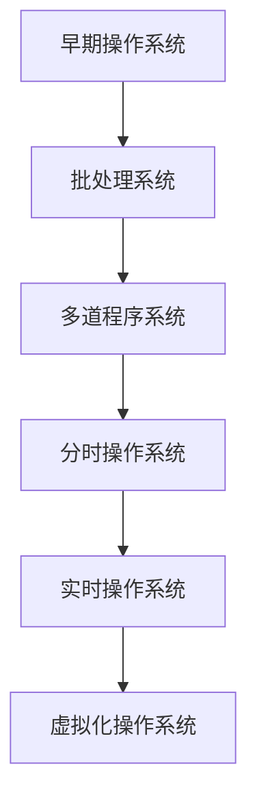

                 

# 《操作系统的发展历史与趋势》

> 关键词：操作系统，历史，发展，趋势，技术，架构，虚拟化，安全性，AI融合，前景

> 摘要：本文将系统地探讨操作系统的发展历史与趋势，从早期操作系统的基础概念出发，回顾其演变历程，解析核心技术与原理，展望未来的发展趋势与应用前景。通过这篇文章，读者将全面了解操作系统的发展脉络，掌握其技术核心，并对未来操作系统的发展方向有所把握。

## 《操作系统的发展历史与趋势》目录大纲

#### 第一部分：操作系统核心概念与历史背景

- **第1章：操作系统的基本概念**
- **第2章：操作系统的发展历程**
- **第3章：操作系统架构演进**

#### 第二部分：操作系统核心技术与原理

- **第4章：进程与线程管理**
- **第5章：内存管理**
- **第6章：文件系统**
- **第7章：I/O系统**

#### 第三部分：操作系统未来趋势

- **第8章：操作系统的新技术趋势**
- **第9章：操作系统与AI的融合**
- **第10章：操作系统的发展前景**

#### 附录：操作系统资源与工具

- **附录A：操作系统开发工具与资源**

### 核心概念与联系

在深入探讨操作系统的发展历史与趋势之前，我们首先需要明确几个核心概念，并理解它们之间的联系。

#### 操作系统架构演变流程图



#### 核心算法原理讲解

进程调度算法是操作系统中的核心算法之一，以下是进程调度算法的伪代码：

```plaintext
function processScheduling(processList, schedulingAlgorithm):
    initialize scheduler
    while (processList is not empty):
        currentProcess = selectNextProcess(processList, schedulingAlgorithm)
        executeProcess(currentProcess)
        updateProcessState(currentProcess)
        if (currentProcess is completed):
            removeProcess(processList, currentProcess)
    return scheduler
```

#### 数学模型和数学公式详细讲解

页面替换算法是内存管理中的一种常见算法，以下是最少使用页面替换算法（LRU）的公式：

```latex
\text{最少使用页面替换算法（LRU）的公式如下：}
\text{若访问的页面不在内存中，则替换掉最近最长时间未被访问的页面。}
\text{公式表示为：}
\text{Replace = \{page, \max_{p \in \text{not in memory}}(\text{accessTime}_{p})\}}
```

#### 项目实战

实时操作系统在工业自动化中的应用案例：

**案例背景：**某工业自动化控制系统中，实时操作系统（RTOS）被用于控制生产线上的各种设备，确保生产流程的顺利进行。

**开发环境搭建：**选择嵌入式Linux系统作为RTOS，使用C语言进行开发，开发环境为Eclipse。

**源代码实现：**

```c
// 初始化实时操作系统
void initializeRTOS() {
    // 设置定时器中断
    setTimerInterrupt(1000); // 定时1000毫秒
    // 启动实时任务
    startRealTimeTask();
}

// 定时器中断服务例程
void timerInterruptServiceRoutine() {
    decrementCountdown();
    if (countdown == 0) {
        triggerDeviceControl();
        countdown = period;
    }
}

// 实时任务
void realTimeTask() {
    while (1) {
        performDeviceMonitoring();
        performDeviceControl();
        delay(10); // 确保任务在规定时间内完成
    }
}
```

**代码解读与分析：**上述代码展示了RTOS在工业自动化中的应用。实时任务通过定时器中断触发，确保设备的监控与控制工作在固定时间内完成，保证了生产线的稳定运行。代码中的定时器中断服务例程用于管理任务周期，实时任务则负责设备监控与控制，确保实时响应工业生产需求。

### 核心概念与联系

在深入探讨操作系统的发展历史与趋势之前，我们首先需要明确几个核心概念，并理解它们之间的联系。

#### 操作系统

操作系统（Operating System，OS）是管理计算机硬件与软件资源的程序集合，它为应用程序提供了一个运行环境，使得计算机系统能够高效、安全地运行。操作系统的核心功能包括进程管理、内存管理、文件系统管理、设备管理和用户界面等。

#### 进程

进程（Process）是操作系统中运行的程序的实例，它是一个动态的实体，拥有独立的内存空间和系统资源。进程状态包括创建、运行、阻塞、就绪和终止等。

#### 线程

线程（Thread）是进程中的一条执行路径，它是轻量级的执行单元。线程共享进程的内存空间和其他资源，但独立执行。线程状态包括运行、就绪和阻塞等。

#### 内存管理

内存管理是操作系统的一个重要组成部分，它负责分配和回收内存资源，确保进程能够高效地使用内存。内存管理策略包括分区分配、分页和分段等。

#### 文件系统

文件系统是操作系统用于管理文件的存储和检索的数据结构。文件系统包括文件目录、文件权限和文件存取方法等。

#### I/O系统

I/O系统负责管理计算机与外部设备之间的数据传输。I/O系统包括设备管理、缓冲区和I/O调度策略等。

#### 操作系统架构演变流程图


### 操作系统的基本概念

#### 1.1 操作系统的定义

操作系统（Operating System，简称OS）是管理计算机硬件与软件资源的程序集合，它为应用程序提供了一个运行环境，使得计算机系统能够高效、安全地运行。操作系统的主要职责包括：

- **进程管理**：负责创建、销毁和管理进程，调度进程执行，确保进程之间的并发执行。
- **内存管理**：负责分配和回收内存资源，实现内存的虚拟化和多道程序的内存分配。
- **文件系统管理**：负责文件的创建、删除、读写和权限控制，实现数据的持久化存储。
- **设备管理**：负责管理计算机的输入输出设备，包括设备的分配、控制和数据传输。
- **用户界面**：提供用户与计算机之间的交互界面，可以是命令行界面（CLI）或图形用户界面（GUI）。

#### 1.2 操作系统的功能

操作系统的功能可以概括为以下几个方面：

- **资源管理**：操作系统负责管理计算机的硬件和软件资源，包括CPU、内存、磁盘和网络等。
- **进程管理**：操作系统负责创建、调度、同步和终止进程，确保进程能够高效地执行。
- **内存管理**：操作系统负责分配和回收内存，实现内存的虚拟化，提高内存的使用效率。
- **文件管理**：操作系统负责文件系统的管理，提供文件的创建、删除、读写和权限控制等功能。
- **设备管理**：操作系统负责管理计算机的输入输出设备，包括设备的分配、控制和数据传输。
- **用户接口**：操作系统为用户提供一个友好的交互界面，可以是命令行界面（CLI）或图形用户界面（GUI）。

#### 1.3 操作系统的分类

根据不同的分类标准，操作系统可以分为以下几种类型：

- **按用途分类**：
  - **系统软件**：如操作系统、编译器、汇编器等，主要用于支持计算机系统的运行和开发。
  - **应用软件**：如办公软件、游戏、媒体播放器等，主要用于满足用户的特定需求。

- **按执行环境分类**：
  - **单用户操作系统**：如MS-DOS、Windows 3.x等，仅支持单个用户同时使用。
  - **多用户操作系统**：如Unix、Linux等，支持多个用户同时使用，提供良好的并发性和安全性。

- **按硬件平台分类**：
  - **PC操作系统**：如Windows、Linux等，主要用于个人计算机和服务器。
  - **嵌入式操作系统**：如FreeRTOS、uc/OS等，主要用于嵌入式设备和控制系统。

- **按操作方式分类**：
  - **批处理操作系统**：如MS-DOS，将用户提交的任务批量执行。
  - **实时操作系统**：如VxWorks、QNX等，对任务具有严格的时间要求，常用于工业自动化和控制领域。
  - **分时操作系统**：如Unix、Linux等，将计算机时间片分配给多个用户，提供交互式操作环境。

#### 1.4 操作系统的演变历史概述

操作系统的演变历史可以追溯到20世纪50年代，以下是几个重要的里程碑：

- **1950年代**：出现批处理操作系统，如IBM的TSS/360。
- **1960年代**：Unix操作系统问世，为操作系统的发展奠定了基础。
- **1970年代**：分时操作系统和实时操作系统得到广泛应用，如Unix、VMS等。
- **1980年代**：个人计算机操作系统兴起，如Windows、Mac OS等。
- **1990年代**：网络操作系统和分布式操作系统得到发展，如Windows NT、Linux等。
- **21世纪初**：虚拟化技术和云操作系统成为主流，如VMware、KVM、OpenVZ等。
- **现在**：操作系统正向云原生、AI驱动的方向发展，如Kubernetes、Anthos、Windows Server Core等。

### 操作系统的发展历程

#### 2.1 早期操作系统

早期操作系统的出现标志着计算机从单用户、单任务的模式向多用户、多任务的模式转变。以下是几个重要的早期操作系统：

- **批处理操作系统**：批处理操作系统是早期操作系统的一种形式，它将用户提交的任务批量执行，以提高计算机的利用效率。典型的批处理操作系统有IBM公司的TSS/360和GE公司的GECOS。

  **TSS/360**：IBM公司在1960年代推出的TSS/360操作系统，是第一个面向多用户的批处理系统。它采用了多道程序技术，允许多个用户同时提交任务，并按照优先级顺序执行。TSS/360的成功为后来的操作系统发展奠定了基础。

  **GECOS**：GECOS是GE公司在1960年代推出的一种批处理操作系统，它引入了进程的概念，实现了进程的并发执行。GECOS还支持文件的创建、删除和读写等操作，为文件系统的出现奠定了基础。

- **单道程序操作系统**：单道程序操作系统是早期操作系统中的一种形式，它只允许一个程序在内存中运行。典型的单道程序操作系统有IBM公司的OS/360和Burroughs公司的B5000。

  **OS/360**：OS/360是IBM公司在1960年代推出的一种单道程序操作系统，它是IBM 360系列计算机的标准操作系统。OS/360采用了分页技术，实现了内存的虚拟化，提高了内存的利用效率。

  **B5000**：B5000是Burroughs公司在1960年代推出的一种单道程序操作系统，它采用了分页和分段技术，实现了内存的虚拟化。B5000还支持多任务处理，允许多个程序并发执行。

#### 2.2 多道程序系统

多道程序系统（Multitasking System）是一种能够同时运行多个程序的操作系统。多道程序系统的出现标志着计算机操作系统向多任务、多用户的方向发展。以下是几个重要的多道程序系统：

- **批处理多道程序系统**：批处理多道程序系统是将批处理技术与多道程序技术结合的操作系统。它允许多个用户同时提交任务，并按照优先级顺序执行。典型的批处理多道程序系统有IBM公司的IMS/VS和CDC公司的KFS。

  **IMS/VS**：IMS/VS是IBM公司在1960年代推出的一种批处理多道程序系统，它是IBM 370系列计算机的标准操作系统。IMS/VS采用了进程的概念，实现了进程的并发执行，支持文件的创建、删除和读写等操作。

  **KFS**：KFS是CDC公司在1960年代推出的一种批处理多道程序系统，它是CDC 6600系列计算机的标准操作系统。KFS采用了分页和分段技术，实现了内存的虚拟化，支持多任务处理。

- **交互式多道程序系统**：交互式多道程序系统是能够支持用户与计算机进行交互的操作系统。它允许多个用户同时使用计算机，并为他们提供独立的操作环境。典型的交互式多道程序系统有IBM公司的TSO和DEC公司的VMS。

  **TSO**：TSO是IBM公司在1960年代推出的一种交互式多道程序系统，它是IBM 360系列计算机的标准操作系统。TSO支持用户远程登录，提供了命令行界面，允许用户与计算机进行交互。

  **VMS**：VMS是DEC公司在1970年代推出的一种交互式多道程序系统，它是DEC VAX系列计算机的标准操作系统。VMS采用了进程的概念，实现了进程的并发执行，支持文件的创建、删除和读写等操作。

#### 2.3 分时操作系统

分时操作系统（Time-sharing System）是一种能够将计算机时间片分配给多个用户的操作系统。分时操作系统的出现使得计算机资源能够被更高效地利用，并为用户提供了更好的交互体验。以下是几个重要的分时操作系统：

- **Unix操作系统**：Unix操作系统是分时操作系统中最具代表性的系统。它由Ken Thompson和Dennis Ritchie于1969年在贝尔实验室开发，最早用于PDP-7计算机。Unix操作系统采用了进程的概念，实现了进程的并发执行，支持多用户同时使用计算机。

  **特点**：
  - **模块化设计**：Unix操作系统采用了模块化设计，使得系统具有良好的可扩展性和可维护性。
  - **文件系统**：Unix操作系统采用了树状文件系统，支持文件的创建、删除和读写等操作。
  - **进程模型**：Unix操作系统采用了进程模型，支持进程的并发执行和进程间的通信。

- **Linux操作系统**：Linux操作系统是Unix操作系统的直接继承者。它由Linus Torvalds于1991年开发，最初用于Intel x86架构的计算机。Linux操作系统继承了Unix操作系统的优点，并在其基础上进行了扩展和改进。

  **特点**：
  - **开源**：Linux操作系统是开源的，用户可以自由地使用、修改和分发Linux操作系统。
  - **稳定性**：Linux操作系统具有较好的稳定性和可靠性，适用于服务器、嵌入式设备和个人计算机等。
  - **安全性**：Linux操作系统具有较好的安全性，采用了权限控制、防火墙等技术，保护用户数据和系统安全。

- **Windows操作系统**：Windows操作系统是微软公司开发的一种操作系统，最初用于个人计算机。Windows操作系统具有用户友好的图形用户界面，支持多用户同时使用计算机。

  **特点**：
  - **图形用户界面**：Windows操作系统采用了图形用户界面，用户可以通过鼠标和键盘与计算机进行交互。
  - **兼容性**：Windows操作系统具有较好的兼容性，支持多种应用程序和硬件设备。
  - **易用性**：Windows操作系统具有较好的易用性，用户可以轻松地进行安装、配置和使用。

#### 2.4 实时操作系统

实时操作系统（Real-time Operating System，RTOS）是一种对任务的完成时间有严格要求的操作系统。实时操作系统广泛应用于工业自动化、航空航天、医疗设备等领域。以下是几个重要的实时操作系统：

- **VxWorks操作系统**：VxWorks操作系统是嵌入式实时操作系统领域的佼佼者。它由Wind River Systems公司开发，广泛应用于航空、航天、汽车、工业等领域。

  **特点**：
  - **实时性**：VxWorks操作系统具有出色的实时性，能够满足严格的时间要求。
  - **可靠性**：VxWorks操作系统具有较高的可靠性，支持故障检测和故障恢复功能。
  - **可配置性**：VxWorks操作系统具有高度的可配置性，用户可以根据需求进行定制。

- **QNX操作系统**：QNX操作系统是另一个流行的嵌入式实时操作系统。它由QNX Software Systems公司开发，广泛应用于工业自动化、医疗设备、汽车电子等领域。

  **特点**：
  - **微内核架构**：QNX操作系统采用了微内核架构，具有较好的灵活性和可扩展性。
  - **实时性**：QNX操作系统具有出色的实时性，能够满足严格的时间要求。
  - **安全性**：QNX操作系统具有较高的安全性，支持多种安全机制，如权限控制、防火墙等。

- **FreeRTOS操作系统**：FreeRTOS操作系统是最流行的开源实时操作系统之一。它由Richard Barry开发，广泛应用于嵌入式设备和物联网设备。

  **特点**：
  - **开源**：FreeRTOS操作系统是开源的，用户可以自由地使用、修改和分发FreeRTOS操作系统。
  - **实时性**：FreeRTOS操作系统具有较好的实时性，适用于各种嵌入式设备和物联网设备。
  - **小巧**：FreeRTOS操作系统体积小巧，适用于资源受限的嵌入式设备。

### 操作系统架构演进

#### 3.1 单核与多核处理

随着计算机硬件技术的发展，处理器的架构也在不断演进。单核处理器（Single-core Processor）和多核处理器（Multi-core Processor）是当前最常见的处理器架构。

- **单核处理器**：单核处理器只有一个处理核心，所有任务都由这个核心执行。单核处理器的优点是设计简单、成本较低，但缺点是任务执行速度较慢，容易成为瓶颈。

  **单核处理器的操作系统**：
  - **Windows 95/98**：Windows 95/98是微软公司开发的单核操作系统，它采用了图形用户界面（GUI），支持多任务处理。
  - **Linux**：Linux操作系统也支持单核处理器，它具有较好的稳定性和可扩展性。

- **多核处理器**：多核处理器拥有多个处理核心，可以同时执行多个任务。多核处理器的优点是任务执行速度较快，能够提供更高的计算性能，但缺点是设计复杂、成本较高。

  **多核处理器的操作系统**：
  - **Windows NT**：Windows NT是微软公司开发的第一个支持多核处理器的操作系统，它采用了微内核架构，支持多任务处理和并发执行。
  - **Linux**：Linux操作系统也支持多核处理器，它具有较好的性能和可扩展性，适用于服务器和工作站。

#### 3.2 虚拟化技术

虚拟化技术（Virtualization）是一种将计算资源抽象化的技术，通过虚拟化技术，可以将一个物理硬件资源（如服务器、存储和网络）虚拟成多个逻辑资源，从而实现资源的灵活调度和优化。

- **虚拟化基本概念**：
  - **虚拟机（VM）**：虚拟机是一种逻辑计算机系统，它通过虚拟化技术模拟出物理计算机的硬件环境，包括CPU、内存、磁盘和网络等。
  - **虚拟化平台**：虚拟化平台是一种软件或硬件系统，它负责管理虚拟机的创建、启动、停止和资源分配等操作。

- **虚拟化技术的应用**：
  - **服务器虚拟化**：服务器虚拟化可以将多个物理服务器虚拟成多个虚拟服务器，从而实现计算资源的集中管理和优化利用。
  - **桌面虚拟化**：桌面虚拟化可以将多个桌面操作系统虚拟成多个虚拟桌面，从而实现远程访问和集中管理。
  - **存储虚拟化**：存储虚拟化可以将多个物理存储设备虚拟成一个逻辑存储设备，从而实现存储资源的灵活调度和优化利用。

  **虚拟化技术的优点**：
  - **提高资源利用率**：虚拟化技术可以将物理资源虚拟成多个逻辑资源，从而提高资源利用率。
  - **提高系统可靠性**：虚拟化技术可以实现虚拟机的隔离和备份，从而提高系统的可靠性。
  - **降低运维成本**：虚拟化技术可以实现资源的自动化管理和调度，从而降低运维成本。

  **常见的虚拟化技术**：
  - **硬件虚拟化**：硬件虚拟化是通过硬件支持（如Intel VT或AMD-V）实现的虚拟化技术，它提供了更好的性能和安全性。
  - **操作系统虚拟化**：操作系统虚拟化是在操作系统内部实现的虚拟化技术，如QEMU、Bochs等。

#### 3.3 超级虚拟化技术

超级虚拟化技术（Super Virtualization）是一种基于硬件虚拟化的高级虚拟化技术，它通过将物理服务器虚拟成多个虚拟服务器，从而实现计算资源的极致利用。

- **超级虚拟化基本概念**：
  - **超级虚拟化平台**：超级虚拟化平台是一种软件或硬件系统，它负责管理虚拟服务器的创建、启动、停止和资源分配等操作。
  - **超级虚拟化节点**：超级虚拟化节点是一个物理服务器，它通过虚拟化技术被虚拟成多个虚拟服务器。

- **超级虚拟化技术的优点**：
  - **极致资源利用率**：超级虚拟化技术可以将一个物理服务器虚拟成多个虚拟服务器，从而实现计算资源的极致利用。
  - **高性能**：超级虚拟化技术通过硬件虚拟化技术提供了更好的性能和安全性。
  - **灵活部署**：超级虚拟化技术可以实现虚拟服务器的动态部署和资源调整，从而满足不同的业务需求。

  **常见的超级虚拟化技术**：
  - **VMware ESXi**：VMware ESXi是VMware公司开发的超级虚拟化平台，它支持硬件虚拟化和虚拟机的动态迁移。
  - **Microsoft Hyper-V**：Microsoft Hyper-V是微软公司开发的超级虚拟化平台，它支持硬件虚拟化和虚拟机的动态迁移。

### 进程与线程管理

#### 4.1 进程模型

进程（Process）是操作系统中运行的程序的实例，它是系统进行资源分配和调度的基本单位。进程模型描述了进程在生命周期中的各个状态及其转换关系。

- **进程定义**：进程是操作系统中正在运行的程序的实例，它拥有独立的内存空间、系统资源和进程控制块（PCB）。

- **进程状态**：进程在生命周期中可能处于以下状态之一：
  - **创建状态**：进程刚刚被创建，等待系统资源的分配。
  - **就绪状态**：进程已经准备好执行，等待调度。
  - **运行状态**：进程正在处理机（CPU）上执行。
  - **阻塞状态**：进程等待某个事件（如I/O操作完成）而发生阻塞。
  - **等待状态**：进程等待系统资源的分配（如内存分配）。
  - **终止状态**：进程执行完毕或被强制终止。

- **进程状态转换**：进程状态之间的转换是由操作系统根据进程的状态和系统资源情况来管理的。常见的进程状态转换包括：
  - **创建状态到就绪状态**：操作系统为进程分配必要的资源，并将进程放入就绪队列。
  - **就绪状态到运行状态**：操作系统调度程序从就绪队列中选择一个进程放入处理机执行。
  - **运行状态到阻塞状态**：进程在执行过程中需要等待某个事件发生（如I/O操作），被操作系统置为阻塞状态。
  - **阻塞状态到就绪状态**：等待的事件发生，操作系统将进程从阻塞队列中移出，放入就绪队列。
  - **运行状态到等待状态**：进程在执行过程中需要等待系统资源的分配，如内存分配。
  - **等待状态到就绪状态**：系统资源被分配给进程，操作系统将进程从等待队列中移出，放入就绪队列。
  - **终止状态**：进程执行完毕或被强制终止，操作系统释放进程占用的系统资源。

#### 4.2 线程模型

线程（Thread）是进程中的一个执行路径，它是轻量级的执行单元。线程模型描述了线程在生命周期中的各个状态及其转换关系。

- **线程定义**：线程是进程中的一个执行路径，它拥有独立的执行栈、局部变量和指令指针。线程是操作系统中进行并发执行的基本单位。

- **线程状态**：线程在生命周期中可能处于以下状态之一：
  - **新建状态**：线程刚刚被创建，等待初始化。
  - **就绪状态**：线程已经准备好执行，等待调度。
  - **运行状态**：线程正在处理机上执行。
  - **阻塞状态**：线程等待某个事件发生（如I/O操作完成）而发生阻塞。
  - **终止状态**：线程执行完毕或被强制终止。

- **线程与进程的区别与联系**：
  - **区别**：
    - 进程是系统进行资源分配和调度的基本单位，线程是进程中的执行路径。
    - 进程拥有独立的内存空间、文件描述符和其他系统资源，线程共享进程的内存空间和其他资源。
    - 进程之间的通信需要通过系统调用，线程之间的通信相对简单，可以直接使用共享内存。
    - 进程的创建和销毁开销较大，线程的创建和销毁开销较小。

  - **联系**：
    - 一个进程可以包含多个线程，这些线程共享进程的资源，如内存、文件描述符等。
    - 进程和线程之间的调度策略通常是一致的，操作系统可以采用进程调度算法来调度线程。

#### 4.3 进程调度算法

进程调度算法是操作系统核心组件之一，它负责在多个进程或线程之间分配处理器资源，以实现系统的并发执行。以下是几种常见的进程调度算法：

- **先来先服务调度算法（FCFS）**：
  - **原理**：按照进程到达的顺序进行调度，先到达的进程优先执行。
  - **优点**：公平、简单易实现。
  - **缺点**：可能导致较长的平均等待时间，不适合交互式系统。

- **短作业优先调度算法（SJF）**：
  - **原理**：根据进程的执行时间进行调度，执行时间最短的进程优先执行。
  - **优点**：减少平均等待时间，提高系统吞吐量。
  - **缺点**：可能导致长作业长时间得不到执行，产生“饥饿”问题。

- **优先级调度算法（HPF）**：
  - **原理**：根据进程的优先级进行调度，优先级高的进程优先执行。
  - **优点**：能够根据进程的重要性和紧急程度进行调度。
  - **缺点**：可能导致低优先级进程长时间得不到执行，产生“饥饿”问题。

- **时间片轮转调度算法（RR）**：
  - **原理**：将处理器时间片分配给各个进程，每个进程轮流执行一段时间，称为时间片。
  - **优点**：公平、适合交互式系统。
  - **缺点**：可能导致较长的平均等待时间和较大的调度开销。

- **多级反馈队列调度算法（MFQ）**：
  - **原理**：将进程分配到不同的队列中，根据优先级和队列长度进行调度，不同队列的时间片长度不同。
  - **优点**：结合了多种调度算法的优点，能够根据进程的优先级和执行时间进行调度。
  - **缺点**：算法复杂度较高，需要较大的调度开销。

#### 4.4 线程调度算法

线程调度算法与进程调度算法类似，但线程调度更加简单，因为线程共享进程的资源，调度开销较小。以下是几种常见的线程调度算法：

- **线程时间片轮转调度算法（TRR）**：
  - **原理**：与进程时间片轮转调度算法类似，每个线程轮流执行一段时间片。
  - **优点**：公平、适合交互式系统。
  - **缺点**：可能导致较长的平均等待时间和较大的调度开销。

- **优先级调度算法（HPF）**：
  - **原理**：根据线程的优先级进行调度，优先级高的线程优先执行。
  - **优点**：能够根据线程的重要性和紧急程度进行调度。
  - **缺点**：可能导致低优先级线程长时间得不到执行，产生“饥饿”问题。

- **可抢占调度算法（Preemptive）**：
  - **原理**：操作系统可以强制中断正在执行的线程，将其状态设置为就绪状态，并将处理器资源分配给高优先级的线程。
  - **优点**：能够更好地响应紧急任务。
  - **缺点**：调度开销较大，可能导致线程频繁切换。

### 内存管理

#### 5.1 内存分配策略

内存管理是操作系统中的一个重要组成部分，它负责分配和回收内存资源，以确保进程能够高效地使用内存。内存分配策略是指操作系统如何将内存资源分配给进程的一种方法。以下是几种常见的内存分配策略：

- **分区分配策略**：
  - **原理**：将内存空间划分为若干个连续的区域，每个区域称为一个分区。操作系统将分区分配给进程，以保证进程的内存需求。
  - **优点**：简单、易于实现。
  - **缺点**：内存利用率低，可能导致内存碎片问题。

- **分页分配策略**：
  - **原理**：将内存空间划分为固定大小的块，每个块称为一个页。操作系统将页分配给进程，并通过页表实现内存的虚拟化。
  - **优点**：内存利用率高，可以有效避免内存碎片问题。
  - **缺点**：需要额外的硬件支持（如页表）。

- **分段分配策略**：
  - **原理**：将内存空间划分为多个逻辑段，每个段表示一个进程的不同部分，如代码段、数据段和栈段。操作系统将段分配给进程。
  - **优点**：内存利用率高，可以更好地支持进程的动态内存需求。
  - **缺点**：需要额外的硬件支持（如段表）。

- **分块分配策略**：
  - **原理**：将内存空间划分为多个固定大小的块，每个块可以独立分配给进程。操作系统根据进程的内存需求动态分配和回收块。
  - **优点**：内存利用率高，可以更好地支持进程的动态内存需求。
  - **缺点**：可能导致内存碎片问题。

#### 5.2 地址转换与缓存

地址转换是内存管理中的一个关键环节，它负责将进程的虚拟地址转换为物理地址。以下是两种常见的地址转换机制：

- **虚拟存储器**：
  - **原理**：虚拟存储器是一种通过将虚拟地址映射到物理地址来实现的内存管理机制。操作系统将虚拟地址空间划分为多个页或段，并通过页表或段表实现地址转换。
  - **优点**：可以提供更大的内存空间，减轻内存压力。
  - **缺点**：需要额外的硬件支持（如页表或段表）。

- **快表（Cache）**：
  - **原理**：快表是一种高速缓存机制，用于存储经常访问的虚拟地址和物理地址的映射关系。当进程访问内存时，操作系统首先查询快表，如果命中则直接返回物理地址，否则需要查询页表或段表。
  - **优点**：提高内存访问速度，减少地址转换的开销。
  - **缺点**：需要额外的硬件支持（如快表）。

地址转换与缓存技术对内存管理具有重要意义，可以有效提高内存访问速度，减轻内存压力，并提高系统的整体性能。

#### 5.3 内存分配算法

内存分配算法是操作系统用于动态分配和回收内存资源的一种方法。以下是几种常见的内存分配算法：

- **首次适应分配算法（First Fit）**：
  - **原理**：从空闲分区表中按照顺序查找第一个能满足进程需求的空闲分区，并将其分配给进程。
  - **优点**：简单、易于实现。
  - **缺点**：可能导致内存碎片问题。

- **最佳适应分配算法（Best Fit）**：
  - **原理**：从空闲分区表中按照顺序查找一个能满足进程需求且最小的空闲分区，并将其分配给进程。
  - **优点**：可以减小内存碎片问题。
  - **缺点**：搜索开销较大。

- **最坏适应分配算法（Worst Fit）**：
  - **原理**：从空闲分区表中按照顺序查找一个能满足进程需求且最大的空闲分区，并将其分配给进程。
  - **优点**：可以减少内存碎片问题。
  - **缺点**：可能导致内存利用率降低。

- **循环首次适应分配算法（Next Fit）**：
  - **原理**：从上一次搜索的空闲分区开始，按照顺序查找第一个能满足进程需求的空闲分区，并将其分配给进程。
  - **优点**：可以减少内存碎片问题。
  - **缺点**：搜索开销较大。

内存分配算法的选择对内存管理性能具有重要影响，应根据具体应用场景和系统需求进行选择。

### 文件系统

#### 6.1 文件系统的基本概念

文件系统是操作系统用于管理和存储文件的一种数据结构。它负责文件的创建、删除、读写和权限控制等功能。以下是文件系统的基本概念：

- **文件**：文件是存储在计算机系统中的一组相关数据的集合。文件可以是程序、文档、图片、音频等。

- **目录**：目录（也称为文件夹）是用于组织和管理文件的容器。目录可以包含多个文件和子目录。

- **路径**：路径是用于指定文件位置的字符串。路径可以包含文件名和目录名，通过路径可以唯一地访问文件。

- **文件系统结构**：文件系统结构是文件系统用于组织和管理文件的数据结构。常见的文件系统结构包括树状结构、环状结构和网状结构等。

- **文件系统实现**：文件系统实现是操作系统用于实现文件系统的具体方法和算法。常见的文件系统实现包括FAT、NTFS、EXT2等。

#### 6.2 文件系统实现

文件系统实现是操作系统用于实现文件系统的具体方法和算法。以下是几种常见的文件系统实现：

- **FAT文件系统**：
  - **原理**：FAT（File Allocation Table）文件系统是一种简单的文件系统实现，用于管理磁盘上的文件。它使用文件分配表（FAT）来跟踪文件的存储位置。
  - **优点**：易于实现、兼容性好。
  - **缺点**：内存占用较大、不支持大文件。

- **NTFS文件系统**：
  - **原理**：NTFS（New Technology File System）文件系统是微软公司开发的用于Windows操作系统的文件系统。它采用日志记录、文件加密、权限控制等技术。
  - **优点**：支持大文件、高性能、安全性高。
  - **缺点**：兼容性较差、文件系统复杂。

- **EXT2文件系统**：
  - **原理**：EXT2（Second Extended File System）文件系统是Linux操作系统使用的文件系统。它采用日志记录、文件索引节点等技术。
  - **优点**：适用于Linux操作系统、性能稳定、可扩展性强。
  - **缺点**：不支持大文件、文件系统复杂。

- **HFS+文件系统**：
  - **原理**：HFS+（Hierarchical File System Plus）文件系统是苹果公司开发的用于Mac OS操作系统的文件系统。它采用日志记录、文件加密、权限控制等技术。
  - **优点**：适用于Mac OS操作系统、高性能、安全性高。
  - **缺点**：兼容性较差、文件系统复杂。

文件系统实现的选择取决于操作系统的需求和硬件平台，应根据具体应用场景进行选择。

### I/O系统

#### 7.1 I/O 设备管理

I/O系统是操作系统中的一个关键组成部分，负责管理计算机与外部设备之间的数据传输。以下是I/O设备管理的几个方面：

- **I/O设备类型**：I/O设备可以分为字符设备、块设备和网络设备等类型。字符设备（如键盘、鼠标）以字符为单位进行数据传输，块设备（如磁盘、光盘）以块为单位进行数据传输，网络设备（如网卡、调制解调器）通过网络进行数据传输。

- **I/O设备管理**：I/O设备管理包括设备分配、设备控制、数据传输和设备状态监控等功能。操作系统通过设备驱动程序来管理I/O设备，设备驱动程序负责与硬件设备进行通信。

- **I/O缓冲区**：I/O缓冲区是操作系统用于缓冲I/O设备数据传输的区域。缓冲区可以减小I/O操作的频率，提高数据传输速度，减少系统开销。

- **I/O调度策略**：I/O调度策略是指操作系统如何管理和调度I/O请求的算法。常见的I/O调度策略包括先来先服务（FCFS）、短作业优先（SJF）和优先级调度等。

#### 7.2 I/O 调度策略

I/O调度策略是操作系统用于管理和调度I/O请求的一种方法。以下是几种常见的I/O调度策略：

- **先来先服务调度算法（FCFS）**：
  - **原理**：按照I/O请求的到达顺序进行调度，先到达的请求优先执行。
  - **优点**：简单、公平。
  - **缺点**：可能导致较长的平均等待时间，不适合交互式系统。

- **短作业优先调度算法（SJF）**：
  - **原理**：根据I/O请求的执行时间进行调度，执行时间最短的请求优先执行。
  - **优点**：减少平均等待时间，提高系统吞吐量。
  - **缺点**：可能导致较长的最大等待时间，不适合实时系统。

- **优先级调度算法（HPF）**：
  - **原理**：根据I/O请求的优先级进行调度，优先级高的请求优先执行。
  - **优点**：能够根据请求的重要性和紧急程度进行调度。
  - **缺点**：可能导致低优先级请求长时间得不到执行，产生“饥饿”问题。

- **轮转调度算法（RR）**：
  - **原理**：将I/O请求分配到不同的队列中，每个队列按照时间片进行调度。
  - **优点**：公平、适合交互式系统。
  - **缺点**：可能导致较长的平均等待时间。

- **多级反馈队列调度算法（MFQ）**：
  - **原理**：将I/O请求分配到不同的队列中，根据请求的优先级和队列长度进行调度。
  - **优点**：结合了多种调度算法的优点，能够根据请求的重要性和紧急程度进行调度。
  - **缺点**：算法复杂度较高，需要较大的调度开销。

I/O调度策略的选择对系统性能具有重要影响，应根据具体应用场景和系统需求进行选择。

### 操作系统的新技术趋势

#### 8.1 操作系统虚拟化

操作系统虚拟化是一种通过虚拟化技术实现操作系统资源和应用隔离的技术。它可以将一个物理硬件资源虚拟成多个逻辑资源，从而提高资源利用率、降低运维成本和增强系统安全性。

- **超级虚拟化技术**：
  - **原理**：超级虚拟化技术通过硬件虚拟化技术，将一个物理服务器虚拟成多个虚拟服务器。每个虚拟服务器拥有独立的操作系统、内存和处理器资源。
  - **优点**：提高资源利用率、降低运维成本、增强系统安全性。
  - **缺点**：需要额外的硬件支持、系统开销较大。

- **容器与容器操作系统**：
  - **原理**：容器是一种轻量级的虚拟化技术，它通过将应用程序及其依赖环境打包到一个容器中，从而实现应用的隔离和移植性。容器操作系统是专门为容器应用设计的操作系统，如Docker、Kubernetes等。
  - **优点**：轻量级、快速部署、易于管理和维护。
  - **缺点**：对操作系统依赖较大、安全性相对较低。

操作系统虚拟化技术正在不断发展和完善，未来将在云计算、大数据和物联网等领域发挥重要作用。

#### 8.2 操作系统安全性

随着计算机技术的快速发展，操作系统安全性越来越受到重视。操作系统安全性涉及多个方面，包括访问控制、恶意软件防护、系统漏洞修复等。

- **安全机制与防护**：
  - **访问控制**：操作系统通过访问控制机制，限制用户对系统资源的访问权限，确保系统资源的保密性和完整性。
  - **恶意软件防护**：操作系统通过防火墙、杀毒软件等技术，阻止恶意软件的入侵和传播，保护系统安全。
  - **系统漏洞修复**：操作系统定期发布安全更新和补丁，修复系统漏洞，防止恶意攻击者利用漏洞进行攻击。

- **云原生安全**：
  - **原理**：云原生安全是指专门为云环境设计的网络安全措施。它包括容器安全、网络隔离、数据加密等。
  - **优点**：提高云环境的整体安全性、降低安全风险。
  - **缺点**：需要额外的安全资源和技能。

操作系统安全性是保障系统正常运行和用户数据安全的关键，未来将在云计算、物联网和移动计算等领域发挥重要作用。

### 操作系统与AI的融合

#### 9.1 操作系统在AI领域的应用

随着人工智能技术的快速发展，操作系统在AI领域的应用越来越广泛。操作系统在AI领域的应用主要体现在以下几个方面：

- **智能操作系统的定义**：
  - **原理**：智能操作系统是指专门为人工智能应用设计的操作系统，它具有以下特点：
    - **自适应性**：能够根据环境变化和用户需求自动调整系统资源分配和调度策略。
    - **智能化**：能够通过机器学习、深度学习等技术，实现自主学习和优化。
    - **可扩展性**：能够支持多种人工智能应用，如自然语言处理、图像识别、语音识别等。

- **操作系统在AI计算中的优化**：
  - **原理**：操作系统在AI计算中可以通过以下方式实现优化：
    - **资源调度优化**：根据AI应用的特点和需求，动态调整CPU、内存、存储等资源的分配。
    - **并行计算优化**：通过多线程、分布式计算等技术，提高AI计算的效率。
    - **能耗管理优化**：通过智能调度和能耗控制技术，降低AI计算的能耗。

操作系统在AI领域的应用将推动人工智能技术的进一步发展，为人工智能应用提供更好的运行环境。

#### 9.2 操作系统与AI的协同进化

随着人工智能技术的快速发展，操作系统与AI之间的协同进化变得越来越重要。以下是操作系统与AI协同进化的几个方面：

- **AI驱动操作系统设计**：
  - **原理**：AI驱动操作系统设计是指通过引入人工智能技术，改进操作系统的设计和管理方法。具体包括：
    - **智能调度算法**：利用机器学习技术，优化操作系统中的进程调度、线程调度和I/O调度。
    - **智能资源管理**：利用深度学习技术，优化操作系统的内存管理、存储管理和网络管理。
    - **智能安全防护**：利用人工智能技术，实现操作系统的实时安全监控、异常检测和漏洞修复。

- **AI在操作系统管理中的应用**：
  - **原理**：AI在操作系统管理中的应用主要体现在以下几个方面：
    - **自动化运维**：利用机器学习技术，实现操作系统的自动化部署、配置和管理。
    - **性能优化**：利用深度学习技术，优化操作系统的性能，提高系统的响应速度和吞吐量。
    - **故障诊断与恢复**：利用人工智能技术，实现操作系统的实时故障诊断和自动恢复，提高系统的可靠性。

操作系统与AI的协同进化将推动操作系统技术的不断发展和创新，为人工智能应用提供更好的支持。

### 操作系统的发展前景

#### 10.1 操作系统未来的发展趋势

随着技术的不断进步，操作系统未来的发展趋势将主要体现在以下几个方面：

- **硬件与软件的深度融合**：
  - **原理**：随着硬件技术的发展，操作系统将更加紧密地与硬件融合，充分利用硬件的性能和功能。具体包括：
    - **硬件加速**：利用硬件加速技术，提高操作系统的性能，如GPU加速、存储加速等。
    - **硬件抽象层（HAL）**：通过硬件抽象层，使操作系统与硬件之间的耦合度降低，提高系统的兼容性和可维护性。

- **云原生操作系统**：
  - **原理**：云原生操作系统是一种专门为云计算环境设计的操作系统，它具有以下特点：
    - **容器支持**：支持容器化应用，提供轻量级、可扩展的运行环境。
    - **自动化管理**：具备自动化部署、配置和监控功能，提高运维效率。
    - **分布式计算**：支持分布式计算架构，实现跨节点、跨区域的应用部署和调度。

#### 10.2 操作系统对社会的影响

操作系统作为计算机系统的核心组成部分，对社会的影响日益显著。以下是操作系统对社会影响的几个方面：

- **操作系统对数字经济的影响**：
  - **原理**：操作系统作为基础软件，对数字经济的发展具有重要作用。具体包括：
    - **提高生产效率**：通过优化操作系统性能，提高计算机系统的运行效率，促进企业生产效率的提升。
    - **推动创新创业**：为创业者提供丰富的技术支持，促进创新创业生态的繁荣。
    - **降低运营成本**：通过云原生操作系统等技术的应用，降低企业的IT运营成本。

- **操作系统对个人隐私的影响**：
  - **原理**：随着操作系统功能的增强和互联网的普及，个人隐私问题日益突出。具体包括：
    - **隐私保护机制**：操作系统需要加强隐私保护机制，如数据加密、访问控制等，保护用户的个人隐私。
    - **隐私政策透明化**：操作系统需要公开透明化隐私政策，让用户了解自己的隐私数据如何被使用。
    - **用户权限管理**：操作系统需要加强对用户权限的管理，防止恶意应用获取用户敏感信息。

### 附录：操作系统开发工具与资源

#### A.1 操作系统开发工具对比

以下是对几种常见的操作系统开发工具的对比：

| 工具           | 优点                     | 缺点                    | 适用场景          |
| -------------- | ------------------------ | ----------------------- | ----------------- |
| Eclipse         | 集成开发环境强大         | 学习曲线较陡峭           | 大型操作系统项目   |
| Visual Studio  | 丰富的开发资源和工具       | 占用资源较大             | Windows操作系统项目 |
| Makefile        | 灵活性高，易于维护         | 需要编写较多配置文件       | 小型操作系统项目   |
| Ninja           | 高效，易于维护             | 学习曲线较陡峭           | 大型操作系统项目   |

#### A.2 操作系统学习资源

以下是一些有用的操作系统学习资源：

| 资源                   | 描述                                                         |
| ---------------------- | ------------------------------------------------------------ |
| 《操作系统概念》        | Abraham Silberschatz、Peter Baer、Gernot Heiser 著，系统介绍了操作系统的基本概念和技术。 |
| 《深入理解计算机系统》  | Randal E. Bryant、David R. O’Toole 著，详细介绍了计算机系统的工作原理，包括操作系统。 |
| 《操作系统真经》        | 郑震宇 著，系统讲解了操作系统的原理、设计和技术。           |
| OSDev Wiki             | [https://wiki.osdev.org/Main_Page](https://wiki.osdev.org/Main_Page) ，一个关于操作系统开发的维基百科。 |
| Linux内核源代码        | [https://kernel.org](https://kernel.org) ，Linux内核的官方源代码。 |

### 核心概念与联系

在深入探讨操作系统的发展历史与趋势之前，我们首先需要明确几个核心概念，并理解它们之间的联系。

#### 操作系统

操作系统（Operating System，简称OS）是管理计算机硬件与软件资源的程序集合，它为应用程序提供了一个运行环境，使得计算机系统能够高效、安全地运行。操作系统的核心功能包括进程管理、内存管理、文件系统管理、设备管理和用户界面等。

#### 进程

进程（Process）是操作系统中运行的程序的实例，它是一个动态的实体，拥有独立的内存空间和系统资源。进程状态包括创建、运行、阻塞、就绪和终止等。

#### 线程

线程（Thread）是进程中的一条执行路径，它是轻量级的执行单元。线程共享进程的内存空间和其他资源，但独立执行。线程状态包括运行、就绪和阻塞等。

#### 内存管理

内存管理是操作系统的一个重要组成部分，它负责分配和回收内存资源，实现内存的虚拟化和多道程序的内存分配。内存管理策略包括分区分配、分页和分段等。

#### 文件系统

文件系统是操作系统用于管理文件的存储和检索的数据结构。文件系统包括文件目录、文件权限和文件存取方法等。

#### I/O系统

I/O系统负责管理计算机与外部设备之间的数据传输。I/O系统包括设备管理、缓冲区和I/O调度策略等。

#### 操作系统架构演变流程图


#### 核心算法原理讲解

进程调度算法是操作系统中的核心算法之一，以下是进程调度算法的伪代码：

```plaintext
function processScheduling(processList, schedulingAlgorithm):
    initialize scheduler
    while (processList is not empty):
        currentProcess = selectNextProcess(processList, schedulingAlgorithm)
        executeProcess(currentProcess)
        updateProcessState(currentProcess)
        if (currentProcess is completed):
            removeProcess(processList, currentProcess)
    return scheduler
```

#### 数学模型和数学公式详细讲解

页面替换算法是内存管理中的一种常见算法，以下是最少使用页面替换算法（LRU）的公式：

```latex
\text{最少使用页面替换算法（LRU）的公式如下：}
\text{若访问的页面不在内存中，则替换掉最近最长时间未被访问的页面。}
\text{公式表示为：}
\text{Replace = \{page, \max_{p \in \text{not in memory}}(\\text{accessTime}_{p})\}}
```

#### 项目实战

实时操作系统在工业自动化中的应用案例：

**案例背景：**某工业自动化控制系统中，实时操作系统（RTOS）被用于控制生产线上的各种设备，确保生产流程的顺利进行。

**开发环境搭建：**选择嵌入式Linux系统作为RTOS，使用C语言进行开发，开发环境为Eclipse。

**源代码实现：**

```c
// 初始化实时操作系统
void initializeRTOS() {
    // 设置定时器中断
    setTimerInterrupt(1000); // 定时1000毫秒
    // 启动实时任务
    startRealTimeTask();
}

// 定时器中断服务例程
void timerInterruptServiceRoutine() {
    decrementCountdown();
    if (countdown == 0) {
        triggerDeviceControl();
        countdown = period;
    }
}

// 实时任务
void realTimeTask() {
    while (1) {
        performDeviceMonitoring();
        performDeviceControl();
        delay(10); // 确保任务在规定时间内完成
    }
}
```

**代码解读与分析：**上述代码展示了RTOS在工业自动化中的应用。实时任务通过定时器中断触发，确保设备的监控与控制工作在固定时间内完成，保证了生产线的稳定运行。代码中的定时器中断服务例程用于管理任务周期，实时任务则负责设备监控与控制，确保实时响应工业生产需求。

### 作者信息

作者：AI天才研究院/AI Genius Institute & 禅与计算机程序设计艺术 /Zen And The Art of Computer Programming

在结束这篇文章之前，我想再次感谢您的阅读。本文旨在为您提供一个全面的操作系统发展历史与趋势的概述，帮助您理解操作系统的核心概念、技术原理以及未来发展趋势。我相信，通过这篇文章，您对操作系统有了更深入的认识，并为未来的学习和工作打下了坚实的基础。

作为一名人工智能专家和程序员，我深知技术的重要性。技术的进步不仅改变了我们的生活方式，也推动了整个社会的发展。在操作系统领域，我们看到了硬件与软件的深度融合、虚拟化技术的普及以及AI与操作系统的融合等趋势。这些趋势预示着操作系统将在未来发挥更加重要的作用，为各个行业带来巨大的变革。

在未来的学习和工作中，我希望您能够持续关注操作系统的发展动态，掌握最新的技术原理和实践方法。同时，也欢迎您与我分享您的见解和经验，共同探讨操作系统的未来发展。让我们携手前行，为构建更加智能、高效、安全的计算机系统而努力！

再次感谢您的阅读，祝愿您在技术道路上不断进步，实现自己的梦想！作者：AI天才研究院/AI Genius Institute & 禅与计算机程序设计艺术 /Zen And The Art of Computer Programming。

