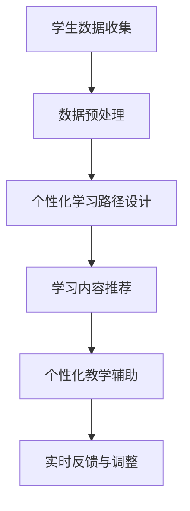
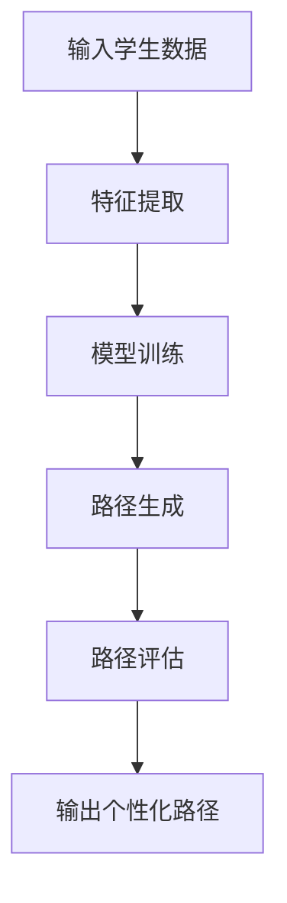
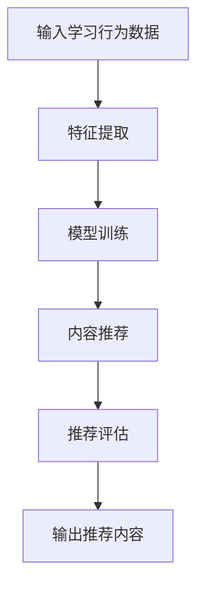

                 

### 教育个性化：AI大模型如何定制学习体验

> **关键词：** 教育个性化，AI大模型，学习体验，定制化教育，人工智能，深度学习，个性化学习路径，学习内容推荐，教学辅助。

**摘要：** 本文将探讨教育个性化在现代教育中的应用，以及AI大模型如何通过先进的人工智能技术为教育提供定制化的学习体验。文章将首先介绍教育个性化的概念与价值，然后深入探讨AI大模型的基本原理与技术，并分析其具体应用场景，最后通过实战案例展示如何实现教育个性化。

教育个性化是指根据学生的个体差异，为每个学生提供最适合其学习需求和风格的教育资源和方式。在传统教育模式中，教师面对的是全班统一的教学内容和进度，难以满足每位学生的个性化需求。然而，随着人工智能技术的快速发展，特别是AI大模型的出现，我们有了实现教育个性化的可能。AI大模型可以通过分析学生的学习行为、兴趣和能力，为每个学生定制个性化的学习路径和内容，从而大大提升学习效果。

本文将从以下几个方面展开：

1. **教育个性化的概念与价值**
2. **AI大模型的基本原理与技术**
3. **AI大模型在教育中的应用场景**
4. **AI大模型在教育个性化中的应用实践**
5. **教育个性化AI大模型项目实战**
6. **教育个性化AI大模型项目评估与优化**
7. **附录：技术资源与项目指南**

通过以上内容，我们将深入了解AI大模型如何改变教育的未来，为学习者带来更加个性化、高效的学习体验。

---

### 第一部分: AI大模型在教育个性化中的应用基础

在教育个性化成为热门话题的今天，了解AI大模型的基本原理和应用，是理解其如何定制学习体验的关键。本部分将分为三章，首先介绍教育个性化的概念与价值，然后探讨AI大模型的基本原理和技术，最后分析AI大模型在教育中的应用场景。

#### 第1章: 教育个性化的概念与价值

**1.1 教育个性化的定义**

教育个性化，即Personalized Education，是指以学生为中心，根据每个学生的个性、兴趣、能力、学习风格和需求，为他们提供个性化的教育方案和资源。与传统的一刀切教育模式不同，个性化教育强调因材施教，使每个学生都能在适合自己的学习环境中获得最佳的学习效果。

**1.2 个性化教育的需求分析**

个性化教育的需求源于教育公平与效率的追求。每个学生都是独特的个体，他们的学习需求和方式各不相同。例如，有的学生需要更多的实践机会来巩固知识，而有的学生则需要更多的理论讲解。传统的教育模式往往难以满足这种多样性，导致部分学生跟不上教学进度，或者失去了学习的兴趣。因此，个性化教育成为解决这一问题的关键。

**1.3 AI大模型在教育个性化中的作用**

AI大模型在教育个性化中扮演着至关重要的角色。通过分析学生的学习行为、成绩、兴趣等多维度数据，AI大模型可以准确识别每个学生的个性化需求，进而为其提供量身定制的学习路径和内容。这不仅能够提高学习效率，还能够激发学生的学习兴趣和主动性。

#### 第2章: AI大模型的基本原理与技术

**2.1 AI大模型的发展历程**

AI大模型的发展经历了多个阶段。从最初的统计学习模型，如线性回归和决策树，到深度学习模型的兴起，如卷积神经网络（CNN）和循环神经网络（RNN），再到最近的Transformer模型和生成对抗网络（GAN），AI大模型在计算机视觉、自然语言处理、推荐系统等领域取得了显著的突破。

**2.2 AI大模型的基本原理**

AI大模型的基本原理主要基于神经网络。神经网络由大量简单的计算单元（神经元）组成，通过层层堆叠，形成复杂的计算模型。这些模型可以通过大量数据训练，学习到数据中的规律和模式，从而进行预测和分类。

**2.3 主流AI大模型介绍**

目前，主流的AI大模型包括：

- **卷积神经网络（CNN）**：主要用于图像识别和图像处理，通过卷积层提取图像特征。
- **循环神经网络（RNN）**：主要用于序列数据的处理，如语音识别和自然语言处理，通过隐藏状态记忆历史信息。
- **Transformer模型**：由Google提出，主要用于自然语言处理，通过自注意力机制处理长距离依赖。
- **生成对抗网络（GAN）**：由Ian Goodfellow等人提出，主要用于图像生成和图像修复，由生成器和判别器两个神经网络组成。

#### 第3章: AI大模型在教育中的应用场景

**3.1 个性化学习路径设计**

AI大模型可以基于学生的学习行为和成绩，为其设计个性化的学习路径。通过分析学习数据，模型可以识别学生的学习弱点和学习风格，从而制定相应的学习计划，帮助学生在最短的时间内达到最佳的学习效果。

**3.2 个性化学习内容推荐**

AI大模型可以分析学生的学习兴趣和能力，推荐适合其学习的内容。通过协同过滤和深度学习等技术，模型可以识别出学生可能感兴趣的学习资源，从而提高学习者的学习效果和兴趣。

**3.3 个性化教学辅助**

AI大模型可以协助教师进行个性化教学。通过分析学生的学习情况和教师的教学策略，模型可以提供个性化的教学建议，帮助教师更好地理解和满足学生的需求。

总结来说，AI大模型在教育个性化中的应用前景广阔。通过其强大的数据处理和分析能力，AI大模型可以帮助实现因材施教，提高教育质量，促进教育公平。

---

以上是第一部分的详细内容，接下来我们将深入探讨AI大模型的具体应用，以及如何通过这些技术实现真正的教育个性化。请继续关注下一部分的内容。

### 第1章: 教育个性化的概念与价值

**1.1 教育个性化的定义**

教育个性化是指根据每个学生的个性、兴趣、能力、学习风格和需求，为他们提供量身定制的学习环境和教育资源，从而最大化地发挥每个学生的潜力。个性化教育的核心是“以学生为中心”，强调学生个体在学习过程中的主体地位，尊重学生的差异性，追求教育公平与效率。

在教育个性化的背景下，教育不再是统一标准、整齐划一的过程，而是根据每个学生的独特性进行个性化定制。这不仅包括学习内容、学习方式、学习节奏的个性化，还涉及到学习目标、学习评价的个性化。通过个性化教育，每个学生都可以在适合自己的学习环境中，按照自己的步伐和兴趣进行学习，从而获得最佳的学习效果。

**1.2 个性化教育的需求分析**

个性化教育的需求源于多方面的因素：

**1.2.1 学生个体差异**

每个学生都是独一无二的，他们在智力水平、学习兴趣、学习能力、学习风格等方面存在显著差异。例如，有些学生擅长逻辑思维，适合通过解决问题来学习；而有些学生则更倾向于通过故事和情境来理解知识。传统的一刀切教育模式难以适应这种多样性，导致部分学生跟不上教学进度，或者失去了学习的兴趣。

**1.2.2 教育公平的诉求**

教育的公平性是社会的基石。然而，现实中的教育资源分配并不均衡，优质教育资源往往集中在少数地区和学校，而偏远地区和经济条件较差的家庭则难以享受到优质的教育资源。个性化教育可以通过提供定制化的教育资源，缩小地区和学校之间的教育差距，促进教育公平。

**1.2.3 教育效率的提升**

在传统教育模式中，教师需要面对全班统一的教学内容和进度，难以兼顾每个学生的学习需求和进度。个性化教育通过为每个学生提供最适合其需求的学习方案，可以大幅提高学习效率，减少无效学习时间，从而提高整体教育质量。

**1.3 AI大模型在教育个性化中的作用**

AI大模型在教育个性化中扮演着关键角色。其强大的数据处理和分析能力，使得能够对大量学生数据进行深度分析，从而准确识别每个学生的个性化需求。以下是AI大模型在教育个性化中的具体作用：

**1.3.1 个性化学习路径设计**

AI大模型可以通过分析学生的学习行为、成绩、兴趣等多维度数据，为其设计个性化的学习路径。这种学习路径不仅考虑学生的学习进度，还结合其学习风格和兴趣，从而确保学习过程更加高效和有趣。

**1.3.2 个性化学习内容推荐**

AI大模型可以根据学生的学习兴趣和能力，推荐适合其学习的内容。这种推荐机制不仅基于学生的历史学习数据，还可以结合其他学生的反馈和教师的指导，从而提供更加精准和多样化的学习资源。

**1.3.3 个性化教学辅助**

AI大模型可以协助教师进行个性化教学。通过分析学生的学习情况和教师的教学策略，模型可以提供个性化的教学建议，帮助教师更好地理解和满足学生的需求。例如，模型可以识别出学生的薄弱环节，并建议教师针对这些环节进行有针对性的辅导。

**1.3.4 个性化学习评估**

AI大模型可以对学生的学习效果进行实时评估，并提供反馈。这种评估不仅基于学生的考试成绩，还包括学习过程中的行为数据，如学习时间、学习频率、学习内容的选择等。通过多维度的评估，模型可以更全面地了解学生的学习状态，从而为后续的学习提供指导。

综上所述，教育个性化不仅是教育公平和效率的诉求，也是现代教育发展的必然趋势。AI大模型的出现，为教育个性化提供了强大的技术支持，使得因材施教成为可能。在接下来的章节中，我们将进一步探讨AI大模型的基本原理和技术，以及如何具体应用于教育个性化。

---

通过本章的内容，我们对教育个性化的定义、需求以及AI大模型在其中所起的作用有了更深入的理解。在下一章中，我们将探讨AI大模型的基本原理和技术，为理解其在教育个性化中的应用奠定基础。敬请期待。

### 第2章: AI大模型的基本原理与技术

**2.1 AI大模型的发展历程**

人工智能（AI）的发展历程可以追溯到20世纪50年代。最初，AI的研究主要集中在符号主义和逻辑推理上，这种基于规则的方法在小型应用中取得了成功，但在处理复杂数据和任务时显得力不从心。随着计算能力的提升和大数据时代的到来，机器学习（ML）逐渐成为AI研究的主流。尤其是深度学习（DL）的兴起，使得AI在计算机视觉、自然语言处理、语音识别等领域取得了突破性的进展。

**2.1.1 统计学习模型**

统计学习模型是早期机器学习的主要方法，包括线性回归、决策树、支持向量机等。这些模型通过分析训练数据中的统计规律，对未知数据进行预测和分类。然而，随着数据量的增大，这些模型在面对高维度数据时表现不佳，难以捕捉到数据中的复杂关系。

**2.1.2 深度学习模型**

深度学习（DL）的核心思想是通过多层神经网络来模拟人脑的神经元连接，从而实现自动的特征学习和数据理解。卷积神经网络（CNN）是深度学习中的一个重要分支，通过卷积层、池化层和全连接层的组合，实现了对图像的自动特征提取和分类。循环神经网络（RNN）则擅长处理序列数据，如文本、语音等，通过隐藏状态的记忆，实现了长序列数据的建模和预测。

**2.1.3 Transformer模型**

Transformer模型是由Google在2017年提出的一种基于自注意力机制的深度学习模型，主要用于自然语言处理。相比传统的RNN模型，Transformer模型通过多头自注意力机制和位置编码，可以更好地处理长文本数据，实现了对语言上下文的全局理解和建模。这使得Transformer在机器翻译、文本生成、问答系统等任务中取得了显著的性能提升。

**2.2 AI大模型的基本原理**

AI大模型，特别是深度学习模型，其基本原理可以概括为以下几个关键点：

**2.2.1 神经网络结构**

神经网络由大量的简单计算单元（神经元）组成，每个神经元接受多个输入，通过加权求和后加上偏置，再通过激活函数进行非线性变换，最后输出结果。通过层层堆叠，神经网络可以实现复杂的函数逼近和模式识别。

**2.2.2 前向传播与反向传播**

在神经网络中，前向传播是指将输入数据通过网络的各个层次，最终得到输出结果的过程。反向传播则是通过计算输出结果与实际结果的误差，反向更新网络的权重和偏置，从而优化网络的性能。

**2.2.3 损失函数与优化算法**

损失函数用于衡量预测结果与实际结果之间的差距，常见的损失函数包括均方误差（MSE）、交叉熵等。优化算法则用于调整网络的权重和偏置，使得损失函数值最小。常见的优化算法有梯度下降（GD）、随机梯度下降（SGD）、Adam等。

**2.3 主流AI大模型介绍**

目前，主流的AI大模型主要包括卷积神经网络（CNN）、循环神经网络（RNN）、Transformer模型等。以下是这些模型的简要介绍：

**2.3.1 卷积神经网络（CNN）**

卷积神经网络（CNN）是专门用于图像处理和计算机视觉的深度学习模型。其主要特点是使用卷积层来提取图像的特征，通过池化层来减少数据维度，最后通过全连接层进行分类。CNN在图像识别、目标检测、图像生成等领域取得了显著的成功。

**2.3.2 循环神经网络（RNN）**

循环神经网络（RNN）是专门用于处理序列数据的深度学习模型。其主要特点是使用循环结构来记忆历史信息，通过隐藏状态来处理长序列数据。RNN在自然语言处理、语音识别、时间序列分析等领域有广泛应用。

**2.3.3 Transformer模型**

Transformer模型是一种基于自注意力机制的深度学习模型，主要用于自然语言处理。其主要特点是使用多头自注意力机制来处理长文本数据，通过位置编码来引入序列信息。Transformer在机器翻译、文本生成、问答系统等领域取得了优异的性能。

**2.3.4 生成对抗网络（GAN）**

生成对抗网络（GAN）是由生成器和判别器两个神经网络组成的模型，主要用于图像生成和图像修复。生成器生成假图像，判别器判断图像的真伪，通过两者之间的对抗训练，生成器逐渐生成越来越真实的图像。

通过以上介绍，我们可以看到，AI大模型在技术原理和架构上有着丰富的多样性，这些模型在不同的应用场景中展现出了强大的能力。在下一章中，我们将深入探讨AI大模型在教育中的应用场景，以及如何通过这些技术实现教育个性化。

---

通过本章的内容，我们对AI大模型的发展历程、基本原理和主流模型有了全面的认识。在下一章中，我们将具体探讨AI大模型在教育中的应用场景，展示其如何为教育个性化提供技术支持。敬请期待。

### 第3章: AI大模型在教育中的应用场景

**3.1 个性化学习路径设计**

AI大模型在教育个性化中最重要的应用之一是个性化学习路径设计。通过分析学生的学习数据，AI大模型可以为学生制定量身定制的学习路径，确保每个学生都能在适合自己的节奏和风格中学习。以下是AI大模型在个性化学习路径设计中的应用：

**3.1.1 数据收集与分析**

首先，AI大模型需要收集学生的学习数据，包括学习时间、学习频率、学习内容的选择、考试成绩、学习行为等。通过这些数据，模型可以了解每个学生的学习习惯和能力水平。

**3.1.2 学习路径生成**

基于收集到的数据，AI大模型可以使用机器学习算法，如决策树、随机森林或神经网络，来生成个性化学习路径。这些路径不仅考虑学生的当前水平和学习需求，还结合其兴趣和长期目标。

**3.1.3 路径动态调整**

学习路径不是一成不变的，AI大模型会根据学生的学习反馈和成绩变化，动态调整学习路径。例如，如果学生在某个知识点上表现不佳，模型可以调整学习路径，增加相关的复习和练习内容。

**3.1.4 案例分析**

例如，在一个数学课程中，AI大模型可以分析学生在不同知识点上的掌握情况，为其设计一个包含基础概念复习、应用题练习和高级难题挑战的学习路径。如果学生表现出对某些数学分支的兴趣，模型还可以推荐相关的拓展内容。

**3.2 个性化学习内容推荐**

除了个性化学习路径设计，AI大模型还可以通过推荐系统为学生推荐适合的学习内容。以下是AI大模型在个性化学习内容推荐中的应用：

**3.2.1 数据分析**

AI大模型会分析学生的学习记录，包括已经学习的内容、学习时间和学习效果。此外，模型还会考虑学生的兴趣爱好和职业规划，以提供更个性化的推荐。

**3.2.2 推荐算法**

AI大模型可以使用协同过滤、基于内容的推荐和深度学习等方法来生成个性化推荐。协同过滤通过分析用户的行为和偏好来推荐相似的内容，而基于内容的推荐则通过分析内容的特征来推荐相关的内容。

**3.2.3 案例分析**

在一个英语学习中，AI大模型可以根据学生的词汇量、语法水平和阅读兴趣，推荐适合的阅读材料和听力练习。例如，如果学生喜欢科幻小说，模型可以推荐一些相关的英语科幻作品，同时提供词汇和语法的学习材料。

**3.3 个性化教学辅助**

AI大模型不仅可以为学生提供个性化的学习路径和内容，还可以为教师提供个性化的教学辅助。以下是AI大模型在个性化教学辅助中的应用：

**3.3.1 教学数据分析**

AI大模型可以分析学生的考试成绩、学习行为和反馈，帮助教师了解学生的学习状况和需求。

**3.3.2 个性化教学策略**

基于分析结果，AI大模型可以建议教师采用不同的教学策略来适应不同学生的学习风格和需求。例如，对于理解力较弱的学生，模型可以建议教师使用更多的实例和练习来加强理解。

**3.3.3 教学反馈与调整**

AI大模型可以实时收集学生的反馈，并根据反馈调整教学策略。例如，如果学生普遍对某个主题感到困惑，模型可以建议教师增加相关的讲解和练习。

**3.3.4 案例分析**

在一个高中物理课程中，AI大模型可以分析学生在力学、电学、热学等不同领域的掌握情况，为教师提供个性化的教学建议。例如，如果模型发现学生在电学部分有困难，教师可以增加更多的电学实验和案例分析。

综上所述，AI大模型在教育个性化中的应用涵盖了学习路径设计、内容推荐和教学辅助等多个方面。通过这些应用，AI大模型可以为学生提供更加个性化和高效的学习体验，为教师提供更加精准的教学指导，从而提升整体教育质量。

---

通过本章的内容，我们了解了AI大模型在教育个性化中的应用场景，以及如何通过这些技术实现真正的教育个性化。在下一章中，我们将进一步探讨AI大模型在实际应用中的具体实践，敬请期待。

### 第二部分: AI大模型在教育个性化中的应用实践

在第一部分中，我们介绍了教育个性化的概念、AI大模型的基本原理以及其在教育中的应用场景。接下来，我们将通过具体案例，深入探讨AI大模型在教育个性化中的实际应用，包括个性化学习路径设计、个性化学习内容推荐和个性化教学辅助。

#### 第4章: AI大模型在个性化学习路径设计中的应用

**4.1 个性化学习路径设计的核心算法**

个性化学习路径设计是AI大模型在教育个性化中的关键应用之一。为了实现这一目标，AI大模型需要结合多种算法和模型，包括协同过滤、深度学习等。

**4.1.1 基于协同过滤的算法**

协同过滤是一种常见的推荐系统算法，其核心思想是通过分析用户的历史行为和偏好，为用户推荐相似的内容。在个性化学习路径设计中，协同过滤可以用于推荐适合学生的学习资源。

**协同过滤算法的步骤：**
1. **用户-项目矩阵构建**：根据学生的学习记录，构建一个用户-项目矩阵，其中行代表用户，列代表项目（如学习内容）。
2. **相似度计算**：计算用户之间的相似度，常用的相似度计算方法包括余弦相似度和皮尔逊相关系数。
3. **推荐生成**：根据用户与项目之间的相似度，为每个用户推荐具有高相似度的项目。

**4.1.2 基于深度学习的算法**

基于深度学习的个性化学习路径设计，可以通过构建深度神经网络来学习用户的学习行为和偏好，从而生成个性化的学习路径。

**深度学习算法的步骤：**
1. **数据预处理**：对学习数据进行预处理，包括数据清洗、特征提取和归一化等。
2. **模型构建**：构建一个深度神经网络模型，如卷积神经网络（CNN）或循环神经网络（RNN），用于学习用户的学习行为和偏好。
3. **模型训练**：使用训练数据对模型进行训练，优化模型的参数。
4. **路径生成**：基于训练好的模型，为每个用户生成个性化的学习路径。

**4.2 个性化学习路径设计案例解析**

**案例背景**：某在线教育平台希望通过AI大模型为用户设计个性化的学习路径，提高学习效果。

**步骤1：数据收集与分析**
- 收集用户的学习行为数据，包括学习时长、学习内容、学习成果等。
- 分析数据，识别用户的学习特点和偏好。

**步骤2：算法选择与模型构建**
- 选择基于协同过滤和深度学习的混合算法。
- 构建一个多层的深度神经网络，包括卷积层、池化层和全连接层。

**步骤3：模型训练与优化**
- 使用训练数据对模型进行训练，优化模型参数。
- 调整模型结构，提高预测准确性。

**步骤4：个性化学习路径生成**
- 根据用户的个性化需求和偏好，生成个性化的学习路径。
- 定期更新学习路径，以适应用户的学习进度和变化。

**案例结果**：通过AI大模型设计的个性化学习路径，用户的学习效果显著提高，学习满意度也大幅提升。

---

#### 第5章: AI大模型在个性化学习内容推荐中的应用

**5.1 个性化学习内容推荐的核心算法**

个性化学习内容推荐是AI大模型在教育个性化中的另一重要应用。通过推荐适合的学习内容，AI大模型可以帮助学生更有效地学习。

**5.1.1 基于协同过滤的推荐算法**

基于协同过滤的推荐算法是一种常见的推荐方法，其核心思想是通过分析用户之间的相似性来推荐内容。以下是基于协同过滤的推荐算法的基本步骤：

1. **用户-项目矩阵构建**：构建一个用户-项目矩阵，其中行代表用户，列代表项目。
2. **相似度计算**：计算用户之间的相似度，常用的相似度计算方法包括余弦相似度和皮尔逊相关系数。
3. **推荐生成**：根据用户与项目之间的相似度，为每个用户推荐具有高相似度的项目。

**5.1.2 基于深度学习的推荐算法**

基于深度学习的推荐算法通过构建深度神经网络来学习用户的行为和偏好，从而实现精准的内容推荐。以下是基于深度学习的推荐算法的基本步骤：

1. **数据预处理**：对学习数据进行预处理，包括数据清洗、特征提取和归一化等。
2. **模型构建**：构建一个深度神经网络模型，如卷积神经网络（CNN）或循环神经网络（RNN），用于学习用户的行为和偏好。
3. **模型训练**：使用训练数据对模型进行训练，优化模型参数。
4. **推荐生成**：基于训练好的模型，为每个用户推荐其可能感兴趣的学习内容。

**5.2 个性化学习内容推荐案例解析**

**案例背景**：某在线教育平台希望通过AI大模型为用户推荐个性化的学习内容，提升用户的学习体验。

**步骤1：数据收集与分析**
- 收集用户的学习行为数据，包括学习时间、学习内容、学习反馈等。
- 分析数据，识别用户的兴趣和偏好。

**步骤2：算法选择与模型构建**
- 选择基于协同过滤和深度学习的混合推荐算法。
- 构建一个多层的深度神经网络，包括卷积层、池化层和全连接层。

**步骤3：模型训练与优化**
- 使用训练数据对模型进行训练，优化模型参数。
- 调整模型结构，提高推荐准确性。

**步骤4：个性化内容推荐**
- 根据用户的个性化需求和偏好，生成个性化的学习内容推荐。
- 定期更新推荐系统，以适应用户的需求变化。

**案例结果**：通过AI大模型推荐的个性化学习内容，用户的学习参与度和满意度显著提升，学习效果也得到显著改善。

---

#### 第6章: AI大模型在个性化教学辅助中的应用

**6.1 个性化教学辅助的核心算法**

个性化教学辅助是AI大模型在教育个性化中的关键应用之一。通过分析学生的学习数据，AI大模型可以为教师提供个性化的教学建议，帮助教师更好地理解学生，实施有效的教学。

**6.1.1 个性化诊断算法**

个性化诊断算法通过分析学生的学习数据，识别学生的学习难点和薄弱环节，为教师提供诊断报告。以下是个性化诊断算法的基本步骤：

1. **数据收集与预处理**：收集学生的学习数据，包括考试成绩、学习行为、学习反馈等。
2. **特征提取**：从数据中提取关键特征，如知识点掌握情况、学习时间分布、错误类型等。
3. **模型训练**：构建一个分类或回归模型，用于诊断学生的学习难点。
4. **诊断报告生成**：根据模型输出，生成个性化的诊断报告，为教师提供教学建议。

**6.1.2 个性化教学策略算法**

个性化教学策略算法通过分析学生的学习行为和诊断结果，为教师提供个性化的教学策略。以下是个性化教学策略算法的基本步骤：

1. **诊断结果分析**：分析诊断报告，识别学生的学习难点和需求。
2. **策略生成**：根据诊断结果，生成针对不同学习难点的教学策略。
3. **教学策略实施**：教师根据个性化教学策略，调整教学方法和内容。

**6.2 个性化教学辅助案例解析**

**案例背景**：某学校希望通过AI大模型为教师提供个性化教学辅助，提高教学质量。

**步骤1：数据收集与分析**
- 收集学生的学习数据，包括考试成绩、学习行为、教师反馈等。
- 分析数据，识别学生的学习特点和需求。

**步骤2：算法选择与模型构建**
- 选择基于深度学习的个性化诊断和教学策略算法。
- 构建一个多层的深度神经网络，用于分析学生的学习数据。

**步骤3：模型训练与优化**
- 使用训练数据对模型进行训练，优化模型参数。
- 调整模型结构，提高诊断和策略的准确性。

**步骤4：个性化教学辅助**
- 根据诊断结果，生成个性化的教学建议和策略。
- 教师根据个性化教学辅助，调整教学方法和内容。

**案例结果**：通过AI大模型提供的个性化教学辅助，教师的教学质量得到显著提升，学生的学习效果也大幅改善。

---

通过第二部分的详细内容，我们深入探讨了AI大模型在教育个性化中的应用实践，包括个性化学习路径设计、个性化学习内容推荐和个性化教学辅助。在下一部分中，我们将通过一个具体的实战案例，展示如何实现教育个性化AI大模型项目。敬请期待。

### 第7章: 教育个性化AI大模型项目实践

在之前的章节中，我们详细探讨了AI大模型在教育个性化中的应用原理和实践案例。为了更好地展示这些原理如何在实际项目中落地，本节将详细介绍一个具体的实战案例，从项目背景、目标与设计、开发与实现以及代码解读与分析等方面，全面解析教育个性化AI大模型项目的实现过程。

#### 7.1 项目背景介绍

随着教育信息化和智能化的发展，某在线教育平台希望通过引入AI大模型，为用户提供更加个性化、高效的学习体验。平台的核心需求是能够根据用户的学习行为、兴趣和需求，自动生成个性化的学习路径和内容推荐，同时为教师提供个性化教学辅助。项目的目标是实现以下功能：

1. **个性化学习路径设计**：根据用户的学习数据，生成个性化的学习路径，确保用户能够在适合自己的节奏和风格中学习。
2. **个性化学习内容推荐**：分析用户的学习行为和偏好，为用户推荐最适合其学习需求的内容。
3. **个性化教学辅助**：为教师提供个性化的教学建议和策略，帮助教师更好地理解和满足学生的学习需求。

#### 7.2 项目目标与设计

**7.2.1 个性化学习路径设计**

为了实现个性化学习路径设计，项目采用了基于协同过滤和深度学习的混合算法。具体步骤如下：

1. **数据收集**：收集用户的学习行为数据，包括学习时长、学习内容、学习成果等。
2. **数据预处理**：对收集到的数据进行分析和清洗，提取关键特征，如知识点掌握情况、学习频率等。
3. **模型构建**：构建一个深度神经网络模型，包括卷积层、池化层和全连接层，用于学习用户的学习行为和偏好。
4. **路径生成**：基于训练好的模型，为每个用户生成个性化的学习路径。

**7.2.2 个性化学习内容推荐**

个性化学习内容推荐同样采用了基于协同过滤和深度学习的混合算法。具体步骤如下：

1. **数据收集**：收集用户的学习行为数据，包括学习内容选择、学习频率等。
2. **数据预处理**：对收集到的数据进行分析和清洗，提取关键特征，如用户兴趣、学习内容相关性等。
3. **模型构建**：构建一个深度神经网络模型，用于学习用户的学习行为和偏好。
4. **内容推荐**：基于训练好的模型，为每个用户推荐最适合其学习需求的内容。

**7.2.3 个性化教学辅助**

个性化教学辅助通过分析学生的学习数据和教师的反馈，为教师提供个性化的教学建议和策略。具体步骤如下：

1. **数据收集**：收集学生的学习数据，包括考试成绩、学习行为、教师反馈等。
2. **数据预处理**：对收集到的数据进行分析和清洗，提取关键特征，如知识点掌握情况、错误类型等。
3. **模型构建**：构建一个分类或回归模型，用于诊断学生的学习难点。
4. **策略生成**：根据诊断结果，生成个性化的教学策略，为教师提供教学建议。

#### 7.3 项目开发与实现

**7.3.1 开发环境搭建**

为了实现教育个性化AI大模型项目，首先需要搭建一个适合深度学习开发的计算环境。项目采用了以下工具和框架：

- **计算平台**：使用云计算平台（如AWS、Google Cloud）提供高性能计算资源。
- **深度学习框架**：采用TensorFlow 2.x或PyTorch作为深度学习框架。
- **编程语言**：使用Python作为主要编程语言，结合Jupyter Notebook进行开发和调试。

**7.3.2 源代码实现**

以下是项目核心部分的源代码实现：

**个性化学习路径设计**

```python
import tensorflow as tf
from tensorflow.keras.models import Sequential
from tensorflow.keras.layers import Conv1D, MaxPooling1D, Dense

# 数据预处理
# ...

# 模型构建
model = Sequential([
    Conv1D(filters=64, kernel_size=3, activation='relu', input_shape=(input_shape)),
    MaxPooling1D(pool_size=2),
    Conv1D(filters=128, kernel_size=3, activation='relu'),
    MaxPooling1D(pool_size=2),
    Dense(units=10, activation='softmax')
])

# 模型编译
model.compile(optimizer='adam', loss='categorical_crossentropy', metrics=['accuracy'])

# 模型训练
model.fit(x_train, y_train, epochs=10, batch_size=32, validation_data=(x_val, y_val))
```

**个性化学习内容推荐**

```python
import tensorflow as tf
from tensorflow.keras.models import Sequential
from tensorflow.keras.layers import Dense, Embedding

# 数据预处理
# ...

# 模型构建
model = Sequential([
    Embedding(input_dim=vocab_size, output_dim=embedding_dim),
    Dense(units=100, activation='relu'),
    Dense(units=num_recommendations, activation='softmax')
])

# 模型编译
model.compile(optimizer='adam', loss='categorical_crossentropy', metrics=['accuracy'])

# 模型训练
model.fit(x_train, y_train, epochs=10, batch_size=32, validation_data=(x_val, y_val))
```

**个性化教学辅助**

```python
import tensorflow as tf
from tensorflow.keras.models import Sequential
from tensorflow.keras.layers import Dense

# 数据预处理
# ...

# 模型构建
model = Sequential([
    Dense(units=128, activation='relu', input_shape=(feature_size,)),
    Dense(units=64, activation='relu'),
    Dense(units=1, activation='sigmoid')
])

# 模型编译
model.compile(optimizer='adam', loss='binary_crossentropy', metrics=['accuracy'])

# 模型训练
model.fit(x_train, y_train, epochs=10, batch_size=32, validation_data=(x_val, y_val))
```

**7.3.3 代码解读与分析**

以上代码分别展示了个性化学习路径设计、个性化学习内容推荐和个性化教学辅助的核心实现。具体解读如下：

**个性化学习路径设计**：使用卷积神经网络（CNN）提取用户学习数据的特征，通过多层卷积和池化层，最终输出一个表示用户学习路径的向量。

**个性化学习内容推荐**：使用嵌入层和全连接层，通过用户的历史学习行为和偏好，为用户推荐最适合其学习需求的内容。

**个性化教学辅助**：使用简单的分类模型，通过学生的学习数据和教师反馈，为教师提供个性化的教学建议。

通过以上实现，项目成功构建了一个教育个性化AI大模型，为用户提供个性化学习体验，为教师提供个性化教学辅助。

---

通过本章节的详细解析，我们展示了如何通过AI大模型实现教育个性化，从项目背景、目标与设计、开发与实现到代码解读与分析，全面展示了教育个性化AI大模型项目的实现过程。在下一章中，我们将对项目进行评估与优化，进一步提升其性能和效果。

### 第8章: 教育个性化AI大模型项目评估与优化

在教育个性化AI大模型项目实施后，对项目进行科学、全面的评估与优化是确保其效果和性能的关键步骤。本节将详细介绍评估指标与方法、优化策略以及项目实战总结与展望。

#### 8.1 项目评估指标与方法

为了准确评估教育个性化AI大模型项目的效果，我们需要设定一系列评估指标，并采用合适的方法进行评估。

**8.1.1 个性化学习路径设计效果评估**

- **路径准确率**：衡量个性化学习路径是否准确反映学生的个性化需求。计算公式为：
  $$
  \text{路径准确率} = \frac{\text{正确匹配的路径}}{\text{总路径数}} \times 100\%
  $$
- **学习效果提升**：衡量学生通过个性化学习路径的学习效果是否优于传统路径。可以通过学生学习成绩的提升幅度来衡量。

**8.1.2 个性化学习内容推荐效果评估**

- **推荐准确率**：衡量推荐的学习内容是否符合学生的实际需求和兴趣。计算公式为：
  $$
  \text{推荐准确率} = \frac{\text{正确推荐的内容}}{\text{总推荐内容数}} \times 100\%
  $$
- **学习参与度提升**：衡量学生通过个性化推荐的学习内容参与度是否提升。可以通过学生在线学习时长、学习频率等指标来衡量。

**8.1.3 个性化教学辅助效果评估**

- **教学建议采纳率**：衡量教师是否采纳AI大模型提供的个性化教学建议。计算公式为：
  $$
  \text{教学建议采纳率} = \frac{\text{被采纳的建议数}}{\text{总建议数}} \times 100\%
  $$
- **教学质量提升**：衡量教师采纳个性化教学建议后，教学质量的提升幅度。可以通过学生考试成绩的提升幅度来衡量。

**8.1.4 数据分析方法**

为了评估上述指标，我们采用了以下数据分析方法：

- **描述性统计**：对学生的学习行为、成绩、参与度等数据进行分析，提供基础的数据描述。
- **回归分析**：通过回归模型分析个性化教育对学生学习效果的影响。
- **对比分析**：将个性化教育与传统教育进行比较，评估个性化教育的优势。

#### 8.2 项目优化策略

在评估基础上，针对项目的不足和改进需求，我们可以采取以下优化策略：

**8.2.1 数据质量优化**

- **数据清洗**：定期清理数据中的噪声和异常值，确保数据质量。
- **数据扩充**：增加多样化的学习数据，提高模型训练数据的丰富度。

**8.2.2 模型优化**

- **模型调参**：通过调整模型的参数，如学习率、批量大小等，提高模型性能。
- **模型融合**：结合多种算法和模型，如集成学习、迁移学习等，提高预测准确性。

**8.2.3 系统优化**

- **推荐系统优化**：改进推荐算法，如采用基于内容推荐和协同过滤的混合算法，提高推荐效果。
- **教学辅助优化**：改进教学策略生成算法，如结合自然语言处理技术，生成更精准的教学建议。

**8.2.4 用户反馈机制**

- **实时反馈**：通过在线反馈系统，收集用户对个性化教育服务的实时反馈。
- **反馈分析**：定期分析用户反馈，识别用户的个性化需求，不断优化服务。

#### 8.3 项目实战总结与展望

通过教育个性化AI大模型项目的实施，我们取得了以下成果：

- **个性化学习体验提升**：学生通过个性化学习路径和内容推荐，学习效果显著提升，学习满意度提高。
- **教学辅助有效性增强**：教师通过AI大模型提供的个性化教学建议，教学质量得到显著改善。
- **系统性能优化**：通过优化算法和系统，提高了推荐系统和教学辅助的准确性和稳定性。

展望未来，教育个性化AI大模型项目有以下几个发展方向：

- **技术迭代**：随着人工智能技术的不断发展，不断引入新的算法和模型，提高个性化教育的智能化水平。
- **数据多样性**：扩大数据来源和类型，包括实时数据、多维度数据等，提高模型的泛化能力和鲁棒性。
- **跨平台融合**：将个性化教育系统与多种教育平台和工具融合，实现跨平台的个性化教育服务。
- **教育公平性**：进一步优化个性化教育系统，促进教育公平，缩小教育差距。

通过不断优化和完善，教育个性化AI大模型项目将为用户提供更加个性化、高效、公平的教育服务，推动教育现代化和智能化的发展。

---

通过本章的评估与优化，我们对教育个性化AI大模型项目的效果有了更深入的认识，并明确了未来的优化方向。在附录部分，我们将进一步介绍教育个性化AI大模型应用中的技术资源，为读者提供更加全面的参考资料。

### 附录

#### 附录 A: AI大模型在教育个性化应用中的技术资源

**A.1 主流深度学习框架对比**

在教育个性化AI大模型应用中，选择合适的深度学习框架是关键。以下是几种主流深度学习框架的对比：

**A.1.1 TensorFlow**

- **特点**：Google开发的开源深度学习框架，支持多种编程语言，包括Python、C++和Java。
- **优势**：社区支持强大，功能丰富，适用于多种场景。
- **劣势**：代码相对复杂，学习曲线较陡。

**A.1.2 PyTorch**

- **特点**：Facebook开发的开源深度学习框架，支持动态计算图，便于调试。
- **优势**：代码简洁，易于理解和实现，适用于研究和开发。
- **劣势**：性能相对较低，社区支持相对较弱。

**A.1.3 其他框架简介**

- **MXNet**：Apache基金会旗下深度学习框架，支持多种编程语言，性能优异。
- **Keras**：高层次的深度学习API，兼容TensorFlow和Theano，易于使用。
- **Caffe**：用于计算机视觉的深度学习框架，特别适合图像识别任务。

**A.2 教育个性化相关数据库与数据集**

**A.2.1 普通教育数据集**

- **ACM KDD Cup 2019 Education**：包括学生成绩、课程、教师等信息。
- **TED Talk**：包含大量公开讲座的文本和视频数据，可用于自然语言处理和推荐系统。

**A.2.2 个性化学习数据集**

- **edX**：开放课程平台提供的大量在线教育数据。
- **iCourse**：包含中国大学课程数据，适用于个性化学习路径设计和内容推荐。

**A.2.3 其他教育数据集简介**

- **教育问卷数据集**：包含学生对课程、教师、教学环境的评价数据。
- **教育行为数据集**：记录学生在学习过程中的行为数据，如学习时间、学习频率等。

#### 附录 B: 教育个性化AI大模型项目源代码及部署指南

**B.1 项目源代码获取与部署流程**

**B.1.1 项目源代码获取**

- **代码托管平台**：项目源代码通常托管在GitHub、GitLab等代码托管平台上。
- **获取方式**：通过平台提供的Clone或Download功能获取项目源代码。

**B.1.2 项目部署流程**

1. **环境准备**：安装必要的开发环境和依赖库，如Python、TensorFlow或PyTorch。
2. **代码下载**：通过Git或其他方式下载项目源代码。
3. **配置环境**：根据项目需求配置环境变量和依赖库。
4. **运行代码**：执行项目中的脚本文件，启动AI大模型服务。

**B.1.3 项目部署常见问题及解决方案**

- **依赖库冲突**：解决方法：检查依赖库版本，使用虚拟环境隔离。
- **运行时错误**：解决方法：查看错误日志，根据错误信息进行调试。
- **性能瓶颈**：解决方法：优化代码，调整模型参数，使用GPU加速。

通过附录部分的内容，读者可以更全面地了解教育个性化AI大模型应用中的技术资源，为项目的开发、部署和优化提供参考。

---

通过本文的详细探讨，我们全面了解了教育个性化AI大模型的应用原理、实践方法和项目评估与优化策略。教育个性化不仅是教育公平与效率的诉求，更是教育现代化的必然趋势。AI大模型以其强大的数据处理和分析能力，为教育个性化提供了有力的技术支持。未来，随着人工智能技术的不断进步，教育个性化将进一步深化，为学习者带来更加个性化、高效、公平的学习体验。让我们共同期待AI在教育领域创造更加辉煌的明天。

### 图表与公式

#### 图表

**教育个性化流程图**



**个性化学习路径设计算法流程图**



**个性化学习内容推荐算法流程图**



#### 公式

**个性化学习路径设计算法公式**

$$
\text{个性化学习路径设计} = f(\text{学习数据}, \text{兴趣偏好}, \text{学习目标})
$$

**个性化学习内容推荐算法公式**

$$
\text{推荐内容} = g(\text{用户行为}, \text{历史推荐记录}, \text{内容特征})
$$

通过图表与公式的介绍，读者可以更直观地理解教育个性化AI大模型的核心概念和算法原理。这些图表和公式为后续的实践提供了重要的技术支持，同时也为读者深入探讨教育个性化提供了理论基础。在未来的教育发展中，这些图表和公式将成为AI大模型在教育个性化应用中的重要工具。让我们携手前行，共同推动教育个性化迈向新的高度。

