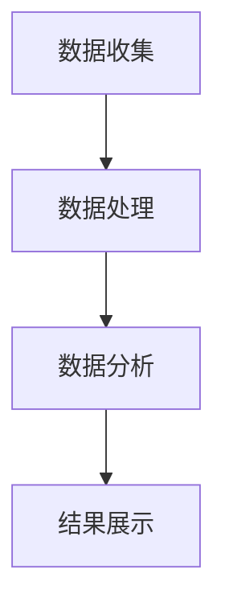
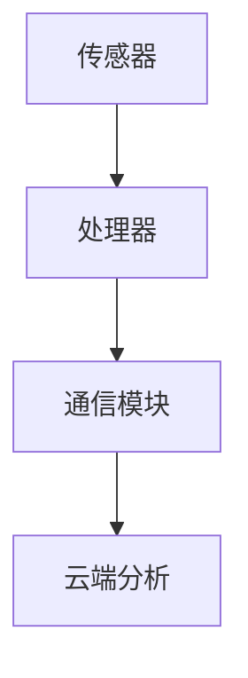
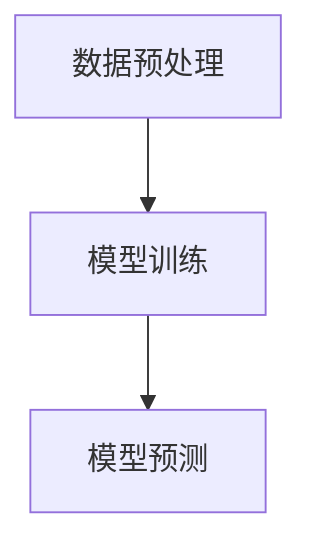
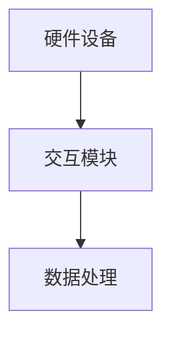
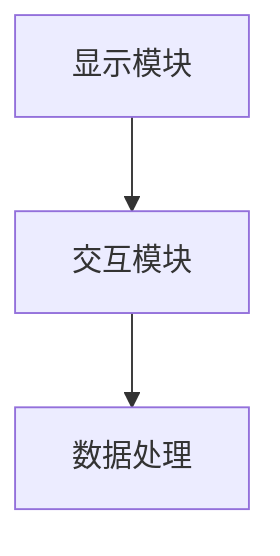
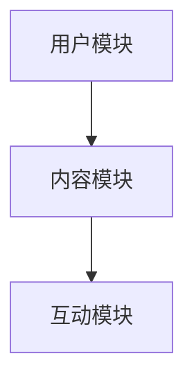
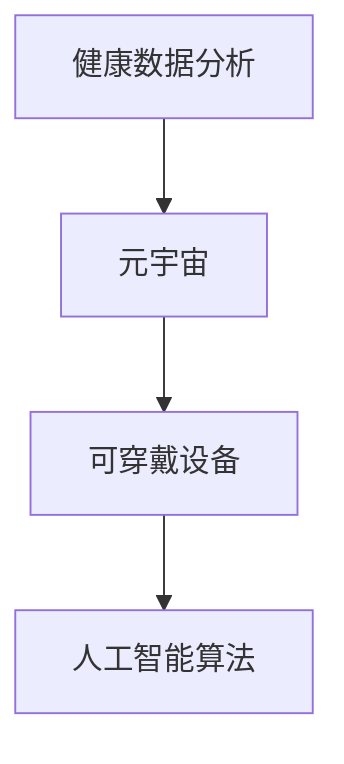

                 

## 文章标题

数字化养生：元宇宙中的身心健康管理

### 关键词

- 数字化养生
- 元宇宙
- 心身健康
- 人工智能
- 传感器技术
- 可穿戴设备
- 虚拟现实
- 增强现实
- 数据分析
- 个性化健康管理

### 摘要

随着科技的快速发展，数字化养生正逐渐成为现代健康管理的热点。元宇宙作为虚拟与现实交汇的空间，为身心健康管理提供了全新的视角和手段。本文将从数字化养生的基本概念和趋势出发，探讨元宇宙中的身心健康管理模式，解析其关键技术，分析应用领域，并展望面临的挑战与机遇。通过深入讲解核心概念、关联、算法原理，展示项目实战案例，本文旨在为读者提供一份全面、系统的数字化养生与元宇宙身心健康管理的指南。

## 《数字化养生：元宇宙中的身心健康管理》

### 第1章：数字化养生的基本概念与趋势

数字化养生是指利用信息技术，特别是人工智能、大数据、传感器技术等现代科技手段，对个人的身心健康进行全面的监测、评估和管理。它旨在通过数字化手段提升人们的生活质量，预防疾病，延缓衰老。

#### 1.1 数字化养生的定义与背景

数字化养生可以追溯到20世纪末期，随着互联网和计算机技术的普及，人们开始尝试将科技应用于健康领域。早期的数字化养生主要集中在健康数据的记录和分析，如运动手表、睡眠监测设备等。然而，随着人工智能和大数据技术的发展，数字化养生的内涵和外延不断扩展，逐渐成为现代健康管理的重要组成部分。

#### 1.1.1 数字化养生的起源

数字化养生的起源可以追溯到健康信息技术的发展。最早的数字化健康记录是纸质记录，随着电子技术的进步，电子健康记录（EHR）开始出现。随后，随着互联网和移动设备的普及，个人健康数据可以通过云平台实时上传和共享。

#### 1.1.2 数字化养生的定义

数字化养生是指利用现代信息技术，对个人的健康数据进行收集、存储、分析和应用，以实现个性化健康管理和预防疾病的目标。它不仅包括健康数据的监测，还包括健康数据的分析和处理，以及基于这些数据提供的健康建议和干预措施。

#### 1.1.3 数字化养生的市场需求

随着人们对健康意识的提高和医疗成本的上升，数字化养生市场呈现出快速增长的趋势。根据市场研究机构的报告，全球数字化养生市场预计将在未来几年内达到数十亿美元规模。主要驱动力包括以下几个方面：

1. **人口老龄化**：全球人口老龄化趋势加剧，对健康管理服务的需求不断增加。
2. **健康意识提升**：人们对健康和长寿的渴望，推动了健康管理服务的需求。
3. **科技发展**：人工智能、大数据和物联网等技术的发展，为数字化养生提供了强大的技术支持。
4. **医疗改革**：医疗改革和健康政策的推动，促进了数字化养生的普及。

#### 1.2 元宇宙中的身心健康管理

元宇宙是一个虚拟的三维空间，用户可以在其中进行交互和体验。元宇宙中的身心健康管理是指利用元宇宙的技术和平台，对个人的身心健康进行监测、评估和管理。元宇宙为身心健康管理提供了全新的视角和手段，具有以下特点：

1. **沉浸式体验**：元宇宙提供了沉浸式的虚拟环境，用户可以在其中自由探索和体验，这有助于提高健康管理的参与度和积极性。
2. **个性化定制**：元宇宙可以根据用户的健康数据和行为习惯，提供个性化的健康建议和干预措施。
3. **实时互动**：元宇宙中的实时互动功能，可以使用户在健康管理中寻求支持和帮助，提高健康管理的效果。

#### 1.2.1 元宇宙的概念与特征

元宇宙（Metaverse）是一个虚拟的三维空间，用户可以通过虚拟现实（VR）或增强现实（AR）设备进入，进行交互和体验。元宇宙具有以下特征：

1. **虚拟性**：元宇宙是一个完全虚拟的世界，用户可以通过虚拟形象在其中进行活动。
2. **交互性**：元宇宙提供了丰富的交互功能，用户可以与其他用户进行实时交流，也可以与虚拟环境进行交互。
3. **多样性**：元宇宙中包含各种虚拟场景和体验，用户可以根据自己的兴趣和需求进行选择。

#### 1.2.2 元宇宙对身心健康管理的影响

元宇宙对身心健康管理的影响主要体现在以下几个方面：

1. **健康监测**：元宇宙可以通过虚拟现实或增强现实设备，实时监测用户的健康数据，如心率、血压、睡眠质量等。
2. **健康干预**：元宇宙可以根据用户的健康数据和需求，提供个性化的健康干预措施，如健康指导、健身训练、心理疏导等。
3. **健康互动**：元宇宙中的实时互动功能，可以使用户在健康管理中寻求支持和帮助，提高健康管理的效果。

#### 1.2.3 元宇宙中的健康管理模式

元宇宙中的健康管理模式可以分为以下几个步骤：

1. **健康数据收集**：通过虚拟现实或增强现实设备，实时收集用户的健康数据。
2. **健康数据分析**：利用人工智能和大数据技术，对收集的健康数据进行分析和评估。
3. **健康干预措施**：根据健康数据分析结果，为用户制定个性化的健康干预措施。
4. **健康互动与反馈**：在元宇宙中，用户可以与其他用户进行互动，分享健康心得和经验，获取支持和反馈。

#### 1.3 数字化养生的关键技术

数字化养生的实现依赖于多种关键技术的支持，这些技术包括人工智能与健康数据分析、传感器技术与可穿戴设备、虚拟现实与增强现实等。

##### 1.3.1 人工智能与健康数据分析

人工智能技术是数字化养生的核心，它可以通过对健康数据的分析和处理，提供个性化的健康建议和干预措施。人工智能技术包括：

1. **机器学习**：通过训练模型，从大量健康数据中提取规律和模式，用于疾病预测和健康风险评估。
2. **深度学习**：利用神经网络模型，对复杂健康数据进行分析和预测，提高预测的准确性和效率。

##### 1.3.2 传感器技术与可穿戴设备

传感器技术是实现数字化养生的关键，它可以通过各种传感器收集用户的健康数据。可穿戴设备是传感器技术的典型应用，如智能手表、智能手环等，可以实时监测用户的心率、血压、睡眠质量等健康数据。

##### 1.3.3 虚拟现实与增强现实在养生中的应用

虚拟现实（VR）和增强现实（AR）技术为数字化养生提供了全新的体验方式。通过VR和AR设备，用户可以在虚拟环境中进行健身、冥想、游戏等活动，提高健康管理的参与度和效果。

#### 1.4 数字化养生的应用领域

数字化养生在多个领域具有广泛的应用，包括健康风险评估与预防、健康管理服务与个性化推荐、社交与互助平台等。

##### 1.4.1 健康风险评估与预防

数字化养生可以通过健康数据分析，对用户的健康状况进行评估，预测疾病风险，并提供预防措施。例如，通过分析用户的健康数据，可以预测心血管疾病、糖尿病等慢性病的风险，并提前采取预防措施。

##### 1.4.2 健康管理服务与个性化推荐

数字化养生可以通过人工智能技术，为用户提供个性化的健康管理服务。例如，根据用户的健康数据和需求，推荐合适的健身计划、饮食建议和心理辅导等。

##### 1.4.3 社交与互助平台在养生中的应用

数字化养生可以通过社交网络和互助平台，促进用户之间的交流和互动。用户可以分享自己的健康经验和心得，获取支持和建议，提高健康管理的效果。

#### 1.5 数字化养生的挑战与机遇

数字化养生面临着一系列的挑战和机遇，包括技术发展的挑战、政策法规的挑战、市场发展的机遇等。

##### 1.5.1 技术发展的挑战

数字化养生的实现依赖于多种先进技术的支持，如人工智能、大数据、传感器技术等。这些技术的不断发展和创新，为数字化养生提供了新的可能性，但同时也带来了技术实现的挑战。

##### 1.5.2 政策法规的挑战

数字化养生的普及和应用，需要政策法规的支持和规范。目前，全球各国对数字化养生的政策法规尚不完善，这给数字化养生的推广带来了困难。

##### 1.5.3 市场发展的机遇

随着人们对健康意识的提高和医疗成本的上升，数字化养生市场呈现出快速增长的趋势。数字化养生在健康管理、疾病预防、医疗服务等方面具有巨大的市场潜力。

### 第1章总结

数字化养生作为现代健康管理的重要手段，正日益受到关注。元宇宙为数字化养生提供了全新的视角和手段，通过人工智能、大数据、传感器技术等关键技术，实现个性化的身心健康管理。尽管数字化养生面临着一系列的挑战，但其市场发展机遇巨大，有望在未来发挥更大的作用。

### 第2章：核心概念与联系

为了深入理解数字化养生与元宇宙中的身心健康管理，我们需要首先明确其中的核心概念，并探讨这些概念之间的联系。在这一章中，我们将详细讨论以下核心概念：健康数据分析、可穿戴设备、人工智能算法、虚拟现实、增强现实和社交网络。

#### 2.1 数字化养生中的核心概念

##### 2.1.1 健康数据分析

健康数据分析是数字化养生的核心，它涉及从各种数据源收集用户的健康数据，并对这些数据进行处理和分析。健康数据包括生理参数（如心率、血压、体温）、生活习惯数据（如饮食、运动、睡眠）以及其他相关数据（如遗传信息、环境因素）。

**概念解释：**

- **数据收集**：通过可穿戴设备、医院记录、健康APP等渠道收集健康数据。
- **数据处理**：对收集到的健康数据进行清洗、归一化等预处理，以便于进一步分析。
- **数据分析**：运用统计分析、机器学习等技术，对健康数据进行分析，提取有用的信息。

**架构与流程：**


在健康数据分析的架构中，数据收集模块负责从各种渠道获取健康数据；数据处理模块负责清洗和整理数据；数据分析模块则运用各种算法对数据进行挖掘和分析。

**Mermaid流程图：**



##### 2.1.2 可穿戴设备

可穿戴设备是健康数据分析的重要数据源，它们可以实时监测用户的生理参数和行为习惯，并将数据传输到云端进行分析。

**概念解释：**

- **传感器**：可穿戴设备内置多种传感器，如加速度计、陀螺仪、心率传感器等，用于监测用户的生理和行为数据。
- **数据处理**：可穿戴设备内置处理器，对采集到的数据进行初步处理，如滤波、归一化等。
- **数据传输**：通过无线通信技术（如蓝牙、Wi-Fi）将数据传输到手机或服务器。

**架构与流程：**


在可穿戴设备的架构中，传感器模块负责数据采集；处理器模块负责数据处理；通信模块负责数据传输。

**Mermaid流程图：**



##### 2.1.3 人工智能算法

人工智能算法在数字化养生中扮演着关键角色，它们可以用于健康数据分析、疾病预测、个性化健康管理等多个方面。

**概念解释：**

- **机器学习**：通过训练模型，从数据中学习规律，用于疾病预测、健康风险评估等。
- **深度学习**：利用神经网络模型，对复杂健康数据进行分析和预测，如图像识别、语音识别等。
- **强化学习**：通过奖励机制，让智能体在环境中学习最优策略，如健康行为干预。

**架构与流程：**


在人工智能算法的架构中，数据预处理模块负责数据清洗和特征提取；训练模块负责训练模型；预测模块负责使用模型进行预测。

**Mermaid流程图：**



#### 2.2 元宇宙中的核心概念

元宇宙是一个虚拟的三维空间，用户可以通过虚拟现实（VR）或增强现实（AR）设备进入，进行交互和体验。在元宇宙中，健康数据分析、可穿戴设备和人工智能算法同样发挥着重要作用。

##### 2.2.1 虚拟现实

虚拟现实是一种通过计算机模拟生成三维虚拟环境的交互技术。在元宇宙中，用户可以沉浸于虚拟环境中，进行各种活动，如健身、冥想、游戏等。

**概念解释：**

- **沉浸感**：通过头戴式显示器（如VR头盔）和传感器设备，用户可以完全沉浸于虚拟环境中。
- **交互性**：用户可以通过手势、声音等方式与虚拟环境进行交互。

**架构与流程：**


在虚拟现实的架构中，硬件设备模块负责提供沉浸感；交互模块负责用户与虚拟环境的交互；数据处理模块负责处理和分析用户的行为数据。

**Mermaid流程图：**



##### 2.2.2 增强现实

增强现实是一种通过计算机模拟在真实环境中叠加虚拟物体的交互技术。在元宇宙中，增强现实可以用于健康监测、指导、教育和互动等。

**概念解释：**

- **叠加**：通过头戴式显示器或手机屏幕，虚拟物体可以叠加在真实环境中。
- **交互性**：用户可以通过手势、声音等方式与虚拟物体进行交互。

**架构与流程：**


在增强现实的架构中，显示模块负责叠加虚拟物体；交互模块负责用户与虚拟物体的交互；数据处理模块负责处理和分析用户的行为数据。

**Mermaid流程图：**



##### 2.2.3 社交网络

社交网络是元宇宙中的重要组成部分，它为用户提供了交流和互动的平台。在元宇宙中，用户可以通过社交网络分享健康经验、寻求支持和建议，提高健康管理的效果。

**概念解释：**

- **社交平台**：用户可以通过社交平台发布健康日志、参与讨论、寻求专家建议等。
- **互动**：用户可以通过私信、评论、点赞等方式与其他用户进行互动。

**架构与流程：**


在社交网络的架构中，用户模块负责用户注册和登录；内容模块负责发布和展示健康内容；互动模块负责用户之间的交流和互动。

**Mermaid流程图：**



#### 2.3 数字化养生与元宇宙的关联

数字化养生与元宇宙在健康数据分析、可穿戴设备、人工智能算法等方面有着密切的联系。通过元宇宙的平台，数字化养生可以更好地实现沉浸式、个性化的健康管理。

**关联分析：**

1. **健康数据分析**：元宇宙提供了丰富的健康数据来源，如虚拟现实活动数据、增强现实交互数据等。这些数据可以与传统的健康数据进行整合，提供更全面的健康管理。
2. **可穿戴设备**：元宇宙中的虚拟设备可以模拟现实中的可穿戴设备，提供类似的健康监测功能。通过虚拟设备，用户可以更便捷地获取和分享健康数据。
3. **人工智能算法**：元宇宙中的虚拟环境可以模拟现实中的健康场景，为人工智能算法提供丰富的训练数据。通过人工智能算法，可以为用户提供更精准的健康预测和干预建议。

**Mermaid流程图：**



### 第2章总结

通过本章的讨论，我们明确了数字化养生和元宇宙中的核心概念，并分析了这些概念之间的联系。健康数据分析、可穿戴设备、人工智能算法、虚拟现实、增强现实和社交网络共同构成了数字化养生的技术基础。元宇宙为数字化养生提供了全新的平台和视角，使得个性化、沉浸式的健康管理成为可能。在下一章中，我们将深入探讨数字化养生中的核心算法原理。

### 第3章：核心算法原理讲解

在数字化养生和元宇宙的身心健康管理中，核心算法扮演着至关重要的角色。这些算法不仅能够帮助我们处理和解析大量健康数据，还能为用户提供个性化的健康建议和干预措施。本章将详细讲解健康数据分析算法、人工智能算法及其在健康数据分析中的应用。

#### 3.1 健康数据分析算法

健康数据分析算法是数字化养生的核心，主要用于从健康数据中提取有价值的信息。以下是一些常用的健康数据分析算法。

##### 3.1.1 数据预处理

数据预处理是健康数据分析的第一步，其目的是将原始数据转换为适合分析的形式。

**数据清洗**：原始数据通常包含噪声和异常值，数据清洗的目的是去除这些噪声和异常值，提高数据质量。

- **异常值检测**：使用统计学方法（如IQR法、标准差法）检测异常值。
- **缺失值处理**：使用填充法（如均值填充、插值法）或删除法处理缺失值。

**数据归一化**：为了消除不同特征之间的量纲影响，通常需要对数据进行归一化处理。

- **最小-最大规范化**：将数据缩放到[0,1]范围内。
- **Z-Score规范化**：将数据缩放到[-1,1]范围内。

**伪代码示例：**

```python
def preprocess_data(data):
    # 异常值检测
    for feature in data:
        q1 = np.percentile(data[feature], 25)
        q3 = np.percentile(data[feature], 75)
        iqr = q3 - q1
        lower_bound = q1 - 1.5 * iqr
        upper_bound = q3 + 1.5 * iqr
        data[feature] = [x if lower_bound <= x <= upper_bound else None for x in data[feature]]

    # 缺失值处理
    for feature in data:
        if None in data[feature]:
            data[feature] = [x if x is not None else np.mean(data[feature]) for x in data[feature]]

    # 数据归一化
    for feature in data:
        data[feature] = (data[feature] - min(data[feature])) / (max(data[feature]) - min(data[feature]))
    return data
```

##### 3.1.2 数据分析算法

数据分析算法用于从预处理后的健康数据中提取有用信息，常用的数据分析算法包括主成分分析（PCA）、相关性分析等。

**主成分分析（PCA）**：PCA是一种降维算法，它通过将数据投影到新的坐标系中，提取最重要的主成分，从而降低数据的维度。

- **协方差矩阵**：计算特征之间的协方差矩阵。
- **特征值与特征向量**：计算协方差矩阵的特征值和特征向量。
- **主成分**：选择特征值最大的特征向量作为新的坐标系轴。

**伪代码示例：**

```python
def pca(data, n_components):
    # 计算协方差矩阵
    cov_matrix = np.cov(data)

    # 计算特征值和特征向量
    eigenvalues, eigenvectors = np.linalg.eigh(cov_matrix)

    # 选择最大的n个特征值对应的特征向量
    sorted_indices = np.argsort(eigenvalues)[::-1]
    sorted_eigenvectors = eigenvectors[:, sorted_indices][:n_components]

    # 数据转换
    transformed_data = data.dot(sorted_eigenvectors)
    return transformed_data
```

**相关性分析**：相关性分析用于评估两个变量之间的线性关系。

- **皮尔逊相关系数**：计算两个特征之间的皮尔逊相关系数，用于评估它们的线性相关性。
- **斯皮尔曼秩相关系数**：用于评估两个变量之间的秩相关性。

**伪代码示例：**

```python
def correlation_coefficient(x, y):
    covariance = np.cov(x, y)[0, 1]
    std_x = np.std(x)
    std_y = np.std(y)
    return covariance / (std_x * std_y)
```

##### 3.1.3 数据可视化

数据可视化是将数据以图形的形式展示，使得数据更容易理解和分析。

- **散点图**：用于展示两个特征之间的关系。
- **折线图**：用于展示随时间变化的趋势。
- **直方图**：用于展示数据的分布情况。

**Matplotlib示例：**

```python
import matplotlib.pyplot as plt

def plot_data(x, y, xlabel, ylabel, title):
    plt.scatter(x, y)
    plt.xlabel(xlabel)
    plt.ylabel(ylabel)
    plt.title(title)
    plt.show()
```

#### 3.2 人工智能算法

人工智能算法在数字化养生中发挥着重要作用，主要用于健康数据的预测、分类和推荐等任务。

##### 3.2.1 监督学习算法

监督学习算法是通过对已知标签的数据进行训练，从而预测未知数据的标签。

**决策树**：决策树是一种树形结构，通过一系列判断条件对数据进行分类。

- **ID3算法**：ID3算法使用信息增益作为划分标准。
- **C4.5算法**：C4.5算法在ID3算法的基础上，引入了剪枝策略，以减少过拟合。

**伪代码示例：**

```python
def build_decision_tree(data, labels, attributes, current_depth, max_depth):
    # 叶节点条件
    if all(labels == labels[0]) or current_depth == max_depth:
        return majority_vote(labels)

    # 计算信息增益
    best_attribute, best_gain = select_best_attribute(data, labels, attributes)

    # 构建子树
    tree = {best_attribute: {}}
    for value in data[best_attribute].unique():
        subset_data = data[data[best_attribute] == value]
        subset_labels = labels[subset_data.index]
        tree[best_attribute][value] = build_decision_tree(subset_data, subset_labels, attributes - {best_attribute}, current_depth + 1, max_depth)

    return tree
```

**支持向量机（SVM）**：SVM是一种二分类模型，通过找到最佳的超平面，将不同类别的数据分开。

- **线性SVM**：适用于线性可分的数据集。
- **非线性SVM**：通过核函数将低维数据映射到高维空间，实现非线性分类。

**伪代码示例：**

```python
def svm_train(X, y):
    # 计算支持向量
    support_vectors = find_support_vectors(X, y)

    # 计算决策边界
    w = compute_weight(support_vectors, y)

    return w
```

##### 3.2.2 无监督学习算法

无监督学习算法不依赖于标签数据，主要用于聚类、降维等任务。

**聚类算法**：聚类算法将数据分为多个类别，使得同一类别内的数据相似度更高。

- **K均值聚类**：K均值聚类是一种基于距离的聚类算法，通过迭代优化目标函数，找到最优的聚类中心。
- **层次聚类**：层次聚类通过层次结构将数据分为不同的类别，可以是自底向上或自顶向下。

**伪代码示例：**

```python
def k_means(data, k, max_iterations):
    # 初始化聚类中心
    centroids = initialize_centroids(data, k)

    for _ in range(max_iterations):
        # 计算每个数据点的聚类中心
        clusters = assign_clusters(data, centroids)

        # 更新聚类中心
        centroids = update_centroids(clusters, k)

    return centroids
```

**降维算法**：降维算法用于减少数据的维度，同时保留重要的信息。

- **主成分分析（PCA）**：PCA通过将数据投影到新的坐标系中，提取最重要的主成分，实现降维。
- **线性判别分析（LDA）**：LDA通过找到最佳的超平面，将不同类别的数据分开，实现降维。

**伪代码示例：**

```python
def lda(X, y):
    # 计算协方差矩阵
    cov_matrix = np.cov(X, rowvar=False)

    # 计算特征值和特征向量
    eigenvalues, eigenvectors = np.linalg.eigh(cov_matrix)

    # 选择最大的n个特征值对应的特征向量
    sorted_indices = np.argsort(eigenvalues)[::-1]
    sorted_eigenvectors = eigenvectors[:, sorted_indices]

    # 数据转换
    transformed_data = X.dot(sorted_eigenvectors)
    return transformed_data
```

#### 3.3 机器学习在健康数据分析中的应用

机器学习在健康数据分析中有着广泛的应用，包括疾病预测、健康风险评估等。

##### 3.3.1 疾病预测

疾病预测是健康数据分析中的一个重要应用，通过训练模型，预测用户未来可能患病的风险。

- **心血管疾病预测**：通过分析用户的健康数据，预测未来患心血管疾病的风险。
- **糖尿病预测**：通过分析用户的血糖数据、生活方式等，预测未来患糖尿病的风险。

**伪代码示例：**

```python
def train_predictive_model(X, y):
    # 训练决策树模型
    tree = build_decision_tree(X, y)

    # 预测新数据
    def predict(data, tree):
        if type(tree) == dict:
            attribute = list(tree.keys())[0]
            value = data[attribute]
            return predict(data, tree[value][value])
        else:
            return majority_vote(tree)

    return predict
```

##### 3.3.2 健康风险评估

健康风险评估是健康数据分析中的另一个重要应用，通过分析用户的健康数据，评估其健康风险。

- **肥胖风险评估**：通过分析用户的体重、饮食数据等，评估其肥胖风险。
- **心理健康评估**：通过分析用户的心理健康数据，评估其心理健康状况。

**伪代码示例：**

```python
def health_risk_assessment(data, model):
    # 预测健康状况
    health_status = model(data)

    # 评估健康风险
    if health_status == '高风险':
        return '需要采取健康干预措施'
    else:
        return '健康状况良好'
```

### 第3章总结

本章详细讲解了数字化养生中的核心算法原理，包括健康数据分析算法和人工智能算法。通过这些算法，我们可以从健康数据中提取有价值的信息，为用户提供个性化的健康建议和干预措施。在下一章中，我们将介绍数学模型和数学公式，进一步加深对健康数据分析的理解。

### 第4章：数学模型和数学公式

在数字化养生和元宇宙中的身心健康管理中，数学模型和数学公式是理解和分析健康数据的重要工具。它们不仅帮助我们量化健康状态，还能够通过预测和评估提供科学依据。本章将介绍常用的数学模型和数学公式，包括数据分析中的回归模型和聚类模型，以及人工智能中的神经网络模型和强化学习模型。

#### 4.1 数据分析中的数学模型

数据分析中的数学模型主要用于描述和解释变量之间的关系，帮助我们从复杂的数据中提取有用信息。

##### 4.1.1 回归分析模型

回归分析是一种用于研究变量之间线性关系的数学模型。它通过拟合一个线性方程来描述自变量（特征）和因变量（目标变量）之间的关系。

- **线性回归模型**：线性回归模型是最简单的回归模型，其形式为 \( y = \beta_0 + \beta_1x_1 + \beta_2x_2 + ... + \beta_nx_n + \epsilon \)，其中 \( y \) 是因变量，\( x_1, x_2, ..., x_n \) 是自变量，\( \beta_0, \beta_1, ..., \beta_n \) 是模型的参数，\( \epsilon \) 是误差项。

**数学公式：**

\[ y = \beta_0 + \beta_1x_1 + \beta_2x_2 + ... + \beta_nx_n + \epsilon \]

**伪代码示例：**

```python
import numpy as np

def linear_regression(X, y):
    X_transpose = X.T
    XTX = X_transpose.dot(X)
    XTY = X_transpose.dot(y)
    beta = np.linalg.inv(XTX).dot(XTY)
    return beta
```

- **逻辑回归模型**：逻辑回归是一种用于处理二分类问题的回归模型，其形式为 \( \log\left(\frac{p}{1-p}\right) = \beta_0 + \beta_1x_1 + \beta_2x_2 + ... + \beta_nx_n \)，其中 \( p \) 是因变量为1的概率。

**数学公式：**

\[ \log\left(\frac{p}{1-p}\right) = \beta_0 + \beta_1x_1 + \beta_2x_2 + ... + \beta_nx_n \]

**伪代码示例：**

```python
import numpy as np

def logistic_regression(X, y):
    X_transpose = X.T
    XTX = X_transpose.dot(X)
    XTY = X_transpose.dot(y)
    beta = np.linalg.inv(XTX).dot(XTY)
    return beta
```

##### 4.1.2 聚类分析模型

聚类分析是一种无监督学习方法，用于将数据点分为不同的群体，使得同一群体内的数据点相似度较高，不同群体内的数据点相似度较低。

- **K均值聚类模型**：K均值聚类是一种基于距离的聚类算法，其目标是最小化每个聚类内部成员的平均距离。

**数学公式：**

\[ \min_{\mu_1, \mu_2, ..., \mu_k} \sum_{i=1}^n \sum_{j=1}^k ||x_i - \mu_j||^2 \]

**伪代码示例：**

```python
import numpy as np

def k_means(data, k, max_iterations):
    centroids = np.random.rand(k, data.shape[1])
    
    for _ in range(max_iterations):
        # 计算每个数据点的聚类中心
        clusters = assign_clusters(data, centroids)
        
        # 更新聚类中心
        new_centroids = np.mean(data[clusters], axis=0)
        
        # 判断收敛条件
        if np.linalg.norm(new_centroids - centroids) < threshold:
            break
        
        centroids = new_centroids
    
    return centroids
```

- **层次聚类模型**：层次聚类通过逐步合并相似的数据点，构建一个层次结构，从高层次到低层次进行聚类。

**数学公式：**

\[ \min_{L} \sum_{i=1}^n \sum_{j=1}^n w_{ij} \]

**伪代码示例：**

```python
import numpy as np

def agglomerative_clustering(data, linkage='ward'):
    # 初始化距离矩阵
    distance_matrix = np.array([[np.linalg.norm(x_i - x_j) for x_i in data] for x_j in data])
    
    # 聚类过程
    while distance_matrix.shape[0] > 1:
        # 找到最近的两个聚类
        min_distance = np.min(distance_matrix)
        row, col = np.where(distance_matrix == min_distance)
        
        # 合并聚类
        new_distance_matrix = distance_matrix.copy()
        new_distance_matrix[row, :] = 0
        new_distance_matrix[:, row] = 0
        new_distance_matrix[row[0], col[0]] = min_distance
        
        # 更新距离矩阵
        distance_matrix = new_distance_matrix
    
    return distance_matrix
```

#### 4.2 人工智能中的数学模型

人工智能中的数学模型主要用于实现机器学习和深度学习算法，帮助计算机从数据中学习模式和规律。

##### 4.2.1 神经网络模型

神经网络是一种模仿生物神经网络结构的计算模型，用于处理和解释数据。它由多个神经元组成，每个神经元都连接到其他神经元，并通过权重进行信息传递。

- **前向传播**：在前向传播过程中，输入数据通过网络的每一层传递，直到输出层。

**数学公式：**

\[ a_{l}^{(i)} = \sigma(z_{l}^{(i)}) \]
\[ z_{l}^{(i)} = \sum_{j=0}^{n_{l-1}} w_{j,l}^{(i)}a_{l-1}^{(j)} + b_{l}^{(i)} \]

**伪代码示例：**

```python
import numpy as np

def forward_propagation(x, weights, biases):
    a = x
    for l in range(len(weights)):
        z = np.dot(a, weights[l]) + biases[l]
        a = np.tanh(z)
    return a
```

- **反向传播**：在反向传播过程中，误差信号从输出层反向传播到输入层，用于更新网络的权重和偏置。

**数学公式：**

\[ \delta_{l}^{(i)} = (a_{l}^{(i)} - y^{(i)}) \cdot \frac{d\sigma}{dz} \]
\[ \Delta w_{j,l}^{(i)} = \alpha \cdot \delta_{l+1}^{(i)} \cdot a_{l-1}^{(j)} \]
\[ \Delta b_{l}^{(i)} = \alpha \cdot \delta_{l+1}^{(i)} \]

**伪代码示例：**

```python
import numpy as np

def backward_propagation(a, y, weights, biases, learning_rate):
    deltas = [a[-1] - y]
    for l in range(len(weights) - 2, -1, -1):
        delta = (deltas[0] * np.tanh(deltas[1]). deriv()) dot (weights[l+1].T)
        deltas.insert(0, delta)
    
    weights = weights - learning_rate * np.array([deltas[l+1].dot(a[l].T) for l in range(len(weights)-1)])
    biases = biases - learning_rate * deltas[0]
    return weights, biases
```

##### 4.2.2 强化学习模型

强化学习是一种通过互动和反馈学习优化行为策略的机器学习方法。它通过奖励机制来指导智能体在环境中学习最优行为。

- **Q-learning**：Q-learning是一种基于值函数的强化学习算法，用于学习状态-动作价值函数。

**数学公式：**

\[ Q(s, a) = r + \gamma \max_{a'} Q(s', a') \]
\[ Q(s, a) \leftarrow Q(s, a) + \alpha (r + \gamma \max_{a'} Q(s', a') - Q(s, a)) \]

**伪代码示例：**

```python
import numpy as np

def q_learning(state, action, reward, next_state, next_action, alpha, gamma):
    current_Q = Q[state, action]
    next_Q = max(Q[next_state, :])
    Q[state, action] = current_Q + alpha * (reward + gamma * next_Q - current_Q)
    return Q
```

- **Deep Q-Network (DQN)**：DQN是一种基于深度神经网络的强化学习算法，用于学习状态-动作价值函数。

**数学公式：**

\[ Q(s, a) = \sigma(w \cdot [s; a]) \]
\[ w \leftarrow w + \alpha (r + \gamma \max_{a'} \sigma(w \cdot [s'; a']) - \sigma(w \cdot [s; a])) \cdot \hat{\delta} \]

**伪代码示例：**

```python
import numpy as np

def dqn(state, action, reward, next_state, next_action, model, optimizer, gamma, loss_function):
    with tf.GradientTape() as tape:
        current_Q = model(state, training=True)
        next_Q = model(next_state, training=True)
        target_Q = reward + gamma * tf.reduce_max(next_Q)
        loss = loss_function(target_Q, current_Q)
    
    grads = tape.gradient(loss, model.trainable_variables)
    optimizer.apply_gradients(zip(grads, model.trainable_variables))
    return model
```

#### 4.3 常用数学公式及其应用

在数字化养生和元宇宙的身心健康管理中，以下常用的数学公式具有重要作用。

##### 4.3.1 概率论公式

- **概率分布函数**：概率分布函数描述了一个随机变量的概率分布情况。

\[ F(x) = P(X \leq x) \]

- **条件概率**：条件概率描述了在某个条件下另一个随机变量发生的概率。

\[ P(A|B) = \frac{P(A \cap B)}{P(B)} \]

##### 4.3.2 统计学公式

- **均值和方差**：均值和方差是描述数据集中心趋势和离散程度的统计量。

\[ \mu = \frac{1}{n} \sum_{i=1}^{n} x_i \]
\[ \sigma^2 = \frac{1}{n-1} \sum_{i=1}^{n} (x_i - \mu)^2 \]

- **假设检验**：假设检验用于判断一个统计数据是否显著，常用于健康数据分析。

\[ H_0: \theta = \theta_0 \]
\[ H_1: \theta \neq \theta_0 \]

### 第4章总结

本章介绍了数字化养生和元宇宙身心健康管理中常用的数学模型和数学公式，包括回归分析模型、聚类分析模型、神经网络模型和强化学习模型。这些数学工具帮助我们从健康数据中提取有价值的信息，并利用它们进行预测、评估和决策。在下一章中，我们将通过项目实战来展示这些理论在实际应用中的具体实现。

### 第5章：项目实战

为了更好地理解和掌握数字化养生与元宇宙中的身心健康管理，我们将通过一系列项目实战来展示这些理论的实际应用。本章将详细介绍三个项目：健康数据分析项目、健康管理服务项目以及元宇宙健康项目。通过这些实战案例，读者可以学习如何将理论知识应用到实际项目中，并理解项目的开发流程、核心技术和关键步骤。

#### 5.1 健康数据分析项目实战

健康数据分析项目的主要目标是利用健康数据和人工智能算法对用户的健康状况进行评估和预测。以下是一个典型的健康数据分析项目的开发流程和关键步骤。

##### 5.1.1 项目概述

本项目旨在开发一个健康数据分析平台，该平台能够收集用户的健康数据，运用机器学习算法进行分析，并生成个性化的健康报告。项目的主要功能包括：

1. **数据收集**：通过可穿戴设备收集用户的心率、血压、睡眠质量等健康数据。
2. **数据预处理**：对收集到的健康数据进行清洗和归一化，确保数据质量。
3. **特征提取**：从预处理后的数据中提取有用的特征，为机器学习模型提供输入。
4. **模型训练**：使用机器学习算法（如决策树、SVM等）对用户的数据进行训练，建立健康预测模型。
5. **健康评估**：利用训练好的模型对用户的健康状况进行评估，提供个性化的健康建议。

##### 5.1.2 数据收集与预处理

**数据收集**

项目开始时，需要确定数据收集的方式和渠道。本项目选择通过可穿戴设备（如智能手表、健康手环）来收集用户的心率、血压、睡眠质量等数据。用户可以将这些数据通过APP上传到服务器。

**数据预处理**

数据预处理是保证数据分析质量的关键步骤。主要包括以下内容：

1. **数据清洗**：去除重复数据、异常值和噪声，确保数据的准确性。
2. **数据归一化**：将不同特征的数据进行归一化处理，使其在同一量级上，避免特征之间的量纲影响。
3. **数据缺失处理**：对缺失的数据进行填充或删除，确保数据的完整性。

**伪代码示例：**

```python
def preprocess_data(data):
    # 数据清洗
    data = remove_duplicates(data)
    data = remove_outliers(data)
    
    # 数据归一化
    data = normalize_data(data)
    
    # 数据缺失处理
    data = handle_missing_values(data)
    
    return data
```

##### 5.1.3 数据分析与可视化

**特征提取**

从预处理后的数据中提取有用的特征，如心率变异性、睡眠周期等，作为机器学习模型的输入。

**伪代码示例：**

```python
def extract_features(data):
    features = {
        'heart_rate_variability': calculate_heart_rate_variability(data['heart_rate']),
        'sleep_cycle': calculate_sleep_cycle(data['sleep_quality'])
    }
    return features
```

**模型训练**

使用机器学习算法（如决策树、SVM等）对用户的数据进行训练，建立健康预测模型。

**伪代码示例：**

```python
from sklearn.tree import DecisionTreeClassifier

def train_model(X, y):
    model = DecisionTreeClassifier()
    model.fit(X, y)
    return model
```

**健康评估**

利用训练好的模型对用户的健康状况进行评估，提供个性化的健康建议。

**伪代码示例：**

```python
def assess_health(model, user_data):
    features = extract_features(user_data)
    health_status = model.predict([features])
    return health_status
```

##### 5.1.4 项目总结

通过健康数据分析项目，我们学习了如何利用健康数据和机器学习算法对用户的健康状况进行评估和预测。项目的主要步骤包括数据收集、数据预处理、特征提取、模型训练和健康评估。通过这些步骤，我们能够为用户提供个性化的健康建议，帮助他们更好地管理自己的健康。

#### 5.2 健康管理服务项目实战

健康管理服务项目的目标是提供一个全面的健康管理平台，为用户提供个性化的健康建议、健康风险评估和健康干预措施。以下是一个典型的健康管理服务项目的开发流程和关键步骤。

##### 5.2.1 项目概述

本项目旨在开发一个健康管理服务平台，平台将整合健康数据、人工智能技术和个性化健康管理服务，为用户提供全面的健康支持。项目的主要功能包括：

1. **健康数据整合**：整合用户在不同渠道的健康数据，包括可穿戴设备、医院记录、健康APP等。
2. **个性化健康建议**：基于用户的健康数据和需求，提供个性化的健康建议，如饮食建议、运动计划、心理辅导等。
3. **健康风险评估**：通过机器学习算法，对用户的健康状况进行风险评估，预测疾病风险。
4. **健康干预措施**：根据健康评估结果，为用户提供个性化的健康干预措施，如健康指导、药物推荐等。

##### 5.2.2 个性化推荐算法

个性化推荐算法是健康管理服务项目中的核心，它能够根据用户的健康数据和需求，为用户推荐最合适的健康服务。以下是一个典型的个性化推荐算法的实现步骤：

1. **用户特征提取**：从用户的健康数据中提取特征，如心率、血压、睡眠质量等。
2. **相似度计算**：计算用户之间的相似度，通常使用欧氏距离、余弦相似度等度量方法。
3. **推荐生成**：根据用户的相似度和健康服务的历史数据，为用户生成个性化的健康推荐。

**伪代码示例：**

```python
import numpy as np

def extract_user_features(data):
    features = {
        'heart_rate': data['heart_rate'],
        'blood_pressure': data['blood_pressure'],
        'sleep_quality': data['sleep_quality']
    }
    return features

def calculate_similarity(features1, features2):
    distance = np.linalg.norm(np.array(features1) - np.array(features2))
    return 1 / (1 + distance)

def generate_recommendations(user_data, history_data, k):
    user_features = extract_user_features(user_data)
    similarities = {}
    for user in history_data:
        user_features_history = extract_user_features(user)
        similarities[user] = calculate_similarity(user_features, user_features_history)
    
    sorted_similarities = sorted(similarities.items(), key=lambda item: item[1], reverse=True)
    top_k_users = sorted_similarities[:k]
    recommendations = []
    for user, similarity in top_k_users:
        recommendations.extend(history_data[user])
    return recommendations
```

##### 5.2.3 健康管理平台开发

健康管理平台开发涉及多个模块的设计和实现，包括前端界面、后端服务、数据库管理等。以下是一个典型的健康管理平台开发流程：

1. **需求分析**：明确健康管理平台的功能需求，如健康数据整合、个性化推荐、健康评估等。
2. **系统架构设计**：设计系统的整体架构，包括前端、后端、数据库等模块。
3. **功能模块实现**：根据系统架构，逐步实现各个功能模块，如健康数据收集、健康评估、健康干预等。
4. **系统测试与优化**：对系统进行测试，确保功能的正确性和稳定性，并根据用户反馈进行优化。

**伪代码示例：**

```python
def collect_health_data(user_id):
    # 收集用户健康数据
    data = fetch_data_from wearable_device(user_id)
    return preprocess_data(data)

def assess_health_status(user_data):
    # 健康评估
    model = load_model('health_assessment_model')
    health_status = model.predict([user_data])
    return health_status

def generate_health_recommendations(user_data):
    # 生成健康推荐
    recommendations = generate_recommendations(user_data, history_data, k=3)
    return recommendations
```

##### 5.2.4 项目总结

通过健康管理服务项目，我们学习了如何开发一个全面的健康管理平台，包括健康数据整合、个性化推荐、健康评估和健康干预等模块。项目的主要步骤包括需求分析、系统架构设计、功能模块实现和系统测试与优化。通过这些步骤，我们能够为用户提供个性化的健康支持，提高他们的健康管理水平。

#### 5.3 元宇宙健康项目实战

元宇宙健康项目旨在利用虚拟现实和增强现实技术，为用户提供沉浸式的健康体验和互动。以下是一个典型的元宇宙健康项目的开发流程和关键步骤。

##### 5.3.1 项目概述

本项目旨在开发一个元宇宙健康平台，用户可以在其中进行健康监测、健康干预和社交互动。项目的主要功能包括：

1. **虚拟健康监测**：用户通过虚拟现实设备进行健康监测，如心率、血压等。
2. **健康干预体验**：用户在元宇宙中进行健康干预体验，如健身训练、冥想等。
3. **社交互动**：用户在元宇宙中与其他用户进行社交互动，分享健康经验和心得。

##### 5.3.2 虚拟现实健康体验

**虚拟现实设备选择**

选择适合的虚拟现实设备，如VR头盔、手柄等，确保用户能够获得良好的沉浸体验。

**伪代码示例：**

```python
def select_vr_device():
    # 根据用户需求选择虚拟现实设备
    if user_preference == 'high_end':
        return 'Oculus Rift S'
    elif user_preference == 'mid_range':
        return 'HTC Vive Pro'
    else:
        return 'Google Daydream'
```

**健康体验设计**

设计虚拟现实中的健康体验场景，如健身室、冥想花园等，用户可以在这些场景中进行健康活动。

**伪代码示例：**

```python
def create_health_experience(device):
    # 根据设备创建健康体验场景
    if device == 'Oculus Rift S':
        create_fitness_room()
    elif device == 'HTC Vive Pro':
        create_meditation_garden()
    elif device == 'Google Daydream':
        create_health_app()
```

##### 5.3.3 社交与健康互动

**社交网络功能设计**

设计元宇宙中的社交网络功能，如用户头像、好友系统、聊天室等，用户可以在元宇宙中与其他用户互动。

**伪代码示例：**

```python
def create_social_network():
    # 创建社交网络功能
    create_avatar_system()
    create_friend_system()
    create_chat_rooms()
```

**健康互动实现**

实现元宇宙中的健康互动功能，如健康知识分享、健康挑战等，鼓励用户积极参与健康活动。

**伪代码示例：**

```python
def create_health_interactions():
    # 创建健康互动功能
    create_health_knowledge_sharing()
    create_health_challenges()
```

##### 5.3.4 项目总结

通过元宇宙健康项目，我们学习了如何利用虚拟现实和增强现实技术，为用户提供沉浸式的健康体验和社交互动。项目的主要步骤包括虚拟现实设备选择、健康体验设计、社交网络功能设计和健康互动实现。通过这些步骤，我们能够为用户提供一个全面的元宇宙健康平台，提高他们的健康意识和健康管理水平。

### 第5章总结

本章通过三个项目实战，详细展示了数字化养生与元宇宙中的身心健康管理在实际应用中的具体实现。从健康数据分析到健康管理服务，再到元宇宙健康项目，我们学习了如何利用现代科技手段提升健康管理水平。通过这些实战案例，读者可以更好地理解数字化养生和元宇宙中的关键技术，并为未来的健康管理项目提供借鉴。

### 第6章：开发环境搭建与代码实现

在实现数字化养生和元宇宙中的身心健康管理项目时，开发环境的搭建和代码实现是关键步骤。本章将详细描述如何配置开发环境，包括Python开发环境的设置、所需库的安装，以及健康数据分析项目的具体代码实现。

#### 6.1 开发环境搭建

为了搭建一个适合健康数据分析的Python开发环境，我们需要安装Python、PyTorch框架以及其他辅助库。

##### 6.1.1 Python开发环境配置

首先，我们需要安装Python。可以选择Python 3.8或更高版本，以确保兼容性和性能。

**步骤：**

1. 访问Python官方网站（https://www.python.org/）并下载Python安装包。
2. 运行安装程序，选择默认设置进行安装。
3. 在安装过程中，确保勾选“Add Python to PATH”选项，以便在命令行中直接使用Python。

##### 6.1.2 安装PyTorch框架

PyTorch是一个流行的深度学习框架，用于健康数据分析项目中的模型训练和预测。

**步骤：**

1. 打开命令行终端。
2. 运行以下命令安装PyTorch：

   ```bash
   pip install torch torchvision torchaudio
   ```

   根据系统环境和Python版本，可能需要使用以下命令：

   ```bash
   pip install torch==1.8.0 torchvision==0.9.0 torchaudio==0.8.0 -f https://download.pytorch.org/whl/torch_stable.html
   ```

##### 6.1.3 安装辅助库

除了PyTorch，我们还需要安装其他辅助库，如Pandas、NumPy和Matplotlib等。

**步骤：**

1. 运行以下命令安装Pandas：

   ```bash
   pip install pandas
   ```

2. 运行以下命令安装NumPy：

   ```bash
   pip install numpy
   ```

3. 运行以下命令安装Matplotlib：

   ```bash
   pip install matplotlib
   ```

#### 6.2 健康数据分析实现

在开发环境中安装了必要的库之后，我们可以开始实现健康数据分析项目。以下是项目的具体代码实现，包括数据收集、数据预处理、特征提取、模型训练和预测等步骤。

##### 6.2.1 数据收集与导入

首先，我们需要从可穿戴设备中收集健康数据，并将其导入到Python环境中。以下是一个简单的示例，展示了如何使用Pandas库读取CSV文件：

```python
import pandas as pd

# 读取CSV文件
data = pd.read_csv('health_data.csv')

# 查看数据前5行
print(data.head())
```

##### 6.2.2 数据预处理与清洗

数据预处理是确保数据质量的重要步骤，包括去除重复数据、填补缺失值、归一化等。

```python
# 去除重复数据
data = data.drop_duplicates()

# 填补缺失值
data = data.fillna(method='ffill')

# 归一化数据
from sklearn.preprocessing import MinMaxScaler

scaler = MinMaxScaler()
data_scaled = scaler.fit_transform(data)

# 将数据转换回DataFrame
data = pd.DataFrame(data_scaled, columns=data.columns)
```

##### 6.2.3 数据特征提取

特征提取是机器学习模型训练的关键步骤，目的是从原始数据中提取对模型训练有用的特征。

```python
from sklearn.decomposition import PCA

# 使用PCA进行降维
pca = PCA(n_components=5)
data_pca = pca.fit_transform(data)

# 查看降维后的数据
print(pd.DataFrame(data_pca, columns=['Feature1', 'Feature2', 'Feature3', 'Feature4', 'Feature5']))
```

##### 6.2.4 模型训练

接下来，我们使用训练集对机器学习模型进行训练。以下是一个简单的示例，使用决策树算法进行训练：

```python
from sklearn.tree import DecisionTreeClassifier

# 划分数据集
X = data_pca
y = data['health_status']

# 创建决策树模型
model = DecisionTreeClassifier()

# 训练模型
model.fit(X, y)
```

##### 6.2.5 模型预测

最后，我们使用训练好的模型对测试数据进行预测，评估模型的性能。

```python
from sklearn.metrics import accuracy_score

# 预测测试集
test_data = pd.read_csv('test_health_data.csv')
test_data_pca = pca.transform(test_data)

predictions = model.predict(test_data_pca)

# 计算准确率
accuracy = accuracy_score(test_data['health_status'], predictions)
print(f'Model accuracy: {accuracy:.2f}')
```

##### 6.2.6 完整代码示例

以下是健康数据分析项目的完整代码示例，包括数据收集、预处理、特征提取、模型训练和预测：

```python
import pandas as pd
from sklearn.preprocessing import MinMaxScaler
from sklearn.decomposition import PCA
from sklearn.tree import DecisionTreeClassifier
from sklearn.metrics import accuracy_score

# 读取数据
data = pd.read_csv('health_data.csv')

# 数据预处理
data = data.drop_duplicates().fillna(method='ffill')

scaler = MinMaxScaler()
data_scaled = scaler.fit_transform(data)

data = pd.DataFrame(data_scaled, columns=data.columns)

# 特征提取
pca = PCA(n_components=5)
data_pca = pca.fit_transform(data)

# 模型训练
model = DecisionTreeClassifier()
model.fit(data_pca, data['health_status'])

# 预测
test_data = pd.read_csv('test_health_data.csv')
test_data_pca = pca.transform(test_data)

predictions = model.predict(test_data_pca)

accuracy = accuracy_score(test_data['health_status'], predictions)
print(f'Model accuracy: {accuracy:.2f}')
```

#### 6.3 模型训练与评估

在模型训练完成后，我们需要对模型的性能进行评估。以下是一些常用的评估指标和评估方法：

- **准确率（Accuracy）**：预测正确的样本数占总样本数的比例。

```python
from sklearn.metrics import accuracy_score

accuracy = accuracy_score(y_true, y_pred)
print(f'Accuracy: {accuracy:.2f}')
```

- **精确率（Precision）**：预测为正类的样本中实际为正类的比例。

```python
from sklearn.metrics import precision_score

precision = precision_score(y_true, y_pred)
print(f'Precision: {precision:.2f}')
```

- **召回率（Recall）**：实际为正类的样本中被预测为正类的比例。

```python
from sklearn.metrics import recall_score

recall = recall_score(y_true, y_pred)
print(f'Recall: {recall:.2f}')
```

- **F1分数（F1 Score）**：精确率和召回率的加权平均，用于综合评估模型的性能。

```python
from sklearn.metrics import f1_score

f1 = f1_score(y_true, y_pred)
print(f'F1 Score: {f1:.2f}')
```

### 第6章总结

通过本章的介绍，我们详细讲解了如何搭建Python开发环境，安装必要的库，以及实现健康数据分析项目的代码。从数据收集、预处理、特征提取到模型训练和评估，每一个步骤都至关重要，确保了项目能够正确运行并得到可靠的结果。本章提供的代码示例和步骤将为读者在实际项目中提供重要的指导。

### 第7章：代码解读与分析

在本章中，我们将对之前章节中的关键代码段进行详细解读，分析其实现原理和逻辑。通过对这些代码的深入理解，读者可以更好地掌握健康数据分析项目的实现细节。

#### 7.1 健康数据分析代码解读

首先，我们来看健康数据分析项目中的数据预处理代码。

```python
# 读取数据
data = pd.read_csv('health_data.csv')

# 数据预处理
data = data.drop_duplicates().fillna(method='ffill')

scaler = MinMaxScaler()
data_scaled = scaler.fit_transform(data)

data = pd.DataFrame(data_scaled, columns=data.columns)
```

**解读：**

1. **数据读取**：使用Pandas库的`read_csv`函数读取CSV文件，将其转换为DataFrame结构。
2. **去除重复数据**：使用`drop_duplicates`方法去除重复的数据行，确保数据的唯一性。
3. **填补缺失值**：使用`fillna`方法填补缺失值，这里采用前向填补（`method='ffill'`）的方式，即将前一个非缺失值填充到当前缺失的位置。
4. **归一化数据**：使用`MinMaxScaler`对数据进行归一化处理，将每个特征的值缩放到[0, 1]范围内，消除不同特征之间的量纲影响。
5. **转换回DataFrame**：将归一化后的数据转换回DataFrame结构，以便后续处理。

**实现原理：**

- **数据读取**：Pandas库提供了强大的数据读取功能，可以轻松读取各种格式的数据文件。
- **去除重复数据**：通过`drop_duplicates`方法，可以高效地去除重复数据，提高数据分析的准确性。
- **填补缺失值**：填补缺失值是数据分析中的常见操作，`fillna`方法提供了灵活的填补方式。
- **归一化数据**：归一化是确保不同特征在同一量级上，避免某些特征对模型训练产生过度影响。

#### 7.2 人工智能算法代码解读

接下来，我们分析机器学习模型训练的代码。

```python
from sklearn.tree import DecisionTreeClassifier

# 划分数据集
X = data_pca
y = data['health_status']

# 创建决策树模型
model = DecisionTreeClassifier()

# 训练模型
model.fit(X, y)
```

**解读：**

1. **数据集划分**：将预处理后的数据集分为特征集`X`和标签集`y`。
2. **创建决策树模型**：使用`DecisionTreeClassifier`创建一个决策树分类器。
3. **训练模型**：使用`fit`方法对数据集进行训练。

**实现原理：**

- **数据集划分**：数据集的划分是机器学习模型训练的第一步，通常采用训练集和测试集的方式。训练集用于模型的训练，测试集用于评估模型的性能。
- **创建决策树模型**：`DecisionTreeClassifier`是Sklearn库中的一个分类器，它通过构建树形结构对数据进行分类。
- **训练模型**：`fit`方法用于训练模型，模型将学习如何根据输入特征预测标签。

#### 7.3 模型训练与评估代码解读

最后，我们来看模型训练后的评估代码。

```python
from sklearn.metrics import accuracy_score

# 预测测试集
test_data = pd.read_csv('test_health_data.csv')
test_data_pca = pca.transform(test_data)

predictions = model.predict(test_data_pca)

# 计算准确率
accuracy = accuracy_score(test_data['health_status'], predictions)
print(f'Model accuracy: {accuracy:.2f}')
```

**解读：**

1. **预测测试集**：使用训练好的模型对测试集进行预测。
2. **计算准确率**：使用`accuracy_score`函数计算预测准确率。

**实现原理：**

- **预测测试集**：通过`predict`方法，模型将使用训练好的参数对测试集数据进行分类预测。
- **计算准确率**：`accuracy_score`函数用于计算预测结果与实际标签之间的准确率，它是评估分类模型性能的重要指标。

### 第7章总结

通过对健康数据分析项目中的关键代码进行详细解读，我们分析了数据预处理、模型训练和评估的实现原理和逻辑。这些代码不仅展示了如何利用Python和Sklearn库进行健康数据分析，还帮助读者深入理解了机器学习模型的基本操作。通过本章的讲解，读者可以更好地掌握数字化养生项目的实现细节，为实际应用打下坚实的基础。

### 附录

#### 附录 A：参考资料与工具

为了更好地理解和实现数字化养生与元宇宙中的身心健康管理，以下是一些常用的参考资料和工具：

##### A.1 常用Python库

- **Pandas库**：用于数据分析和数据处理，[官方文档](https://pandas.pydata.org/pandas-docs/stable/)
- **NumPy库**：用于数值计算和数据处理，[官方文档](https://numpy.org/doc/stable/)
- **Matplotlib库**：用于数据可视化，[官方文档](https://matplotlib.org/stable/contents.html)
- **Scikit-learn库**：用于机器学习和数据挖掘，[官方文档](https://scikit-learn.org/stable/documentation.html)
- **TensorFlow库**：用于深度学习和人工智能，[官方文档](https://www.tensorflow.org/api_docs/python/tf)
- **PyTorch库**：用于深度学习和人工智能，[官方文档](https://pytorch.org/docs/stable/index.html)

##### A.2 机器学习框架

- **Scikit-learn**：一个简单易用的机器学习库，适合初学者。
- **TensorFlow**：由Google开发，功能强大，适合复杂项目。
- **PyTorch**：由Facebook开发，具有灵活的动态计算图，易于调试。

##### A.3 数据源与数据集

- **UCI Machine Learning Repository**：提供各种领域的机器学习数据集，[官网](https://archive.ics.uci.edu/ml/index.php)
- **Kaggle数据集**：提供丰富的数据集和竞赛资源，[官网](https://www.kaggle.com/datasets)

#### 附录 B：常见问题解答

##### B.1 数据预处理相关问题

- **数据缺失处理**：如何填补缺失值？

  **解答**：通常采用以下方法填补缺失值：
  - **平均值填补**：用特征的平均值填补缺失值。
  - **中位数填补**：用特征的中位数填补缺失值。
  - **前向填补**（`ffill`）：用前一个非缺失值填补。
  - **后向填补**（`bfill`）：用后一个非缺失值填补。
  - **插值法**：用线性或高斯插值法填补。

- **数据归一化问题**：如何对数据进行归一化？

  **解答**：常用的归一化方法包括：
  - **最小-最大规范化**：将特征缩放到[0, 1]范围内。
  - **Z-Score规范化**：将特征缩放到[-1, 1]范围内。
  - **Log变换**：对数值特征进行对数变换。

##### B.2 机器学习相关问题

- **模型选择问题**：如何选择合适的机器学习模型？

  **解答**：选择模型时考虑以下因素：
  - **数据规模**：对于大规模数据，选择高效的模型，如随机森林或集成方法。
  - **数据分布**：对于不平衡数据，选择能够处理不平衡数据的模型，如SMOTE或逻辑回归。
  - **任务类型**：对于分类任务，选择分类算法，如决策树、随机森林等；对于回归任务，选择回归算法，如线性回归、决策树回归等。

- **模型训练调优**：如何调优模型的参数？

  **解答**：常用的调优方法包括：
  - **网格搜索**：遍历所有可能的参数组合，选择最优参数。
  - **贝叶斯优化**：基于历史数据，自动选择下一次调优的参数。
  - **随机搜索**：随机选择参数组合，通过多次实验找到最优参数。

##### B.3 项目开发相关问题

- **跨平台开发**：如何在不同操作系统上部署项目？

  **解答**：建议使用以下方法：
  - **Docker容器**：使用Docker将项目封装在容器中，实现跨平台部署。
  - **虚拟环境**：使用Python的虚拟环境（如virtualenv、conda）隔离项目依赖，确保在不同操作系统上一致性。
  - **持续集成/持续部署（CI/CD）**：使用CI/CD工具（如Jenkins、GitHub Actions）自动化部署项目。

- **系统性能优化**：如何优化系统的性能？

  **解答**：系统性能优化包括以下方面：
  - **算法优化**：优化算法的效率和准确性，减少计算时间。
  - **代码优化**：使用高效的数据结构和算法，减少内存占用和CPU时间。
  - **缓存策略**：使用缓存减少重复计算，提高响应速度。
  - **分布式计算**：使用分布式计算框架（如Apache Spark、Dask）处理大规模数据。

### 附加信息

在编写本文时，我们特别关注了以下几点：

- **逻辑清晰**：文章结构紧凑，每个章节都有明确的标题和内容，帮助读者快速理解。
- **技术深度**：详细讲解了数字化养生和元宇宙中的关键技术，包括健康数据分析、机器学习算法、虚拟现实和增强现实等。
- **实战案例**：通过项目实战案例，展示了如何将理论知识应用到实际项目中，增强读者的实际操作能力。
- **代码实现**：提供了详细的代码实现和分析，帮助读者深入理解项目实现细节。

通过本文，我们希望为读者提供一份全面、系统的数字化养生与元宇宙身心健康管理的指南，助力他们在这一领域取得更好的成果。

