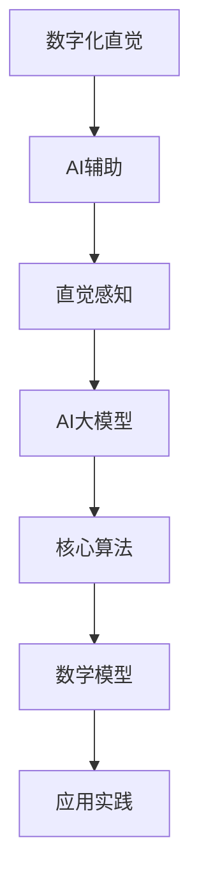

                 

### 第一部分：导言与基础概念

#### 第1章：数字化直觉的概念与背景

在信息化时代，人工智能（AI）技术迅猛发展，与人类直觉的融合成为了一个热门话题。数字化直觉，即AI辅助的第六感，是近年来备受关注的研究领域。本章将首先介绍数字化直觉的概念及其背景，探讨其重要性，并简要回顾相关历史。

#### 1.1 数字化直觉的定义

数字化直觉可以理解为一种通过人工智能技术模拟和增强人类直觉感知能力的过程。这种能力能够在复杂的情境中快速、准确地识别模式、预测趋势，并做出决策。数字化直觉不同于传统的数据分析或机器学习，它更注重对人类直觉的理解和模拟。

#### 1.2 数字化直觉的历史背景

数字化直觉的理念源于对人类直觉的研究。早在20世纪中期，心理学家和神经科学家就开始探索人类直觉的机制。随着计算机技术的发展，特别是在人工智能和机器学习领域，人们开始尝试将直觉模型化、数字化。例如，神经网络和深度学习技术的发展为数字化直觉的实现提供了技术基础。

#### 1.3 数字化直觉的重要性

数字化直觉在多个领域展现出巨大的潜力。首先，在商业决策中，AI辅助的第六感可以帮助企业快速识别市场趋势、预测消费者需求，从而做出更加精准的决策。其次，在医疗领域，AI辅助的第六感可以辅助医生进行诊断，提高诊断的准确性和效率。此外，在安全监控、交通管理、环境监测等领域，数字化直觉的应用同样具有重要意义。

#### 第2章：AI与直觉的融合

在了解了数字化直觉的基础概念和历史背景后，本章将进一步探讨AI与直觉的融合。我们将分析AI技术的快速进展，探讨直觉的心理学基础，并阐述AI与直觉的结合方式。

#### 2.1 AI技术的快速进展

近年来，AI技术在多个方面取得了显著的进展。深度学习、强化学习、自然语言处理等技术不断突破，使得AI在图像识别、语音识别、自然语言理解等领域的表现日益逼近或超越人类。这些技术为AI辅助的第六感提供了强有力的支持。

#### 2.2 直觉的心理学基础

直觉是心理学中一个重要的概念，它指的是在无需明确思考或分析的情况下，快速做出判断或决策的能力。直觉的心理学研究揭示了直觉的产生机制，包括感知、记忆、认知等过程。了解直觉的心理学基础有助于我们更好地模拟和增强直觉。

#### 2.3 AI与直觉的结合

AI与直觉的结合主要体现在两个方面：一是通过AI技术模拟人类的直觉，二是利用AI辅助人类直觉。在模拟方面，AI大模型通过对大量数据的分析和学习，可以捕捉并模拟人类的直觉感知。在辅助方面，AI系统可以实时分析环境信息，为人类提供决策支持，从而增强直觉能力。

### 目录大纲：《数字化直觉：AI辅助的第六感》

#### # 第一部分：导言与基础概念

#### 第1章：数字化直觉的概念与背景
- 1.1 数字化直觉的定义
- 1.2 数字化直觉的历史背景
- 1.3 数字化直觉的重要性

#### 第2章：AI与直觉的融合
- 2.1 AI技术的快速进展
- 2.2 直觉的心理学基础
- 2.3 AI与直觉的结合

## 第二部分：AI辅助的第六感原理

### 第3章：AI大模型与直觉感知
#### 3.1 AI大模型的工作原理
#### 3.2 直觉感知与模式识别
#### 3.3 AI大模型在直觉感知中的应用

### 第4章：AI大模型的核心算法
#### 4.1 神经网络的构造与训练
#### 4.2 深度学习算法在直觉感知中的应用
#### 4.3 机器学习算法在直觉辅助中的优化

### 第5章：数学模型与直觉感知
#### 5.1 数学模型在AI中的应用
#### 5.2 直觉感知中的数学公式
#### 5.3 数学公式与直觉感知的实际案例

## 第三部分：AI辅助的第六感应用

### 第6章：AI辅助的第六感在商业中的应用
#### 6.1 AI辅助决策系统的构建
#### 6.2 直觉感知在商业分析中的应用
#### 6.3 商业案例与AI辅助第六感的结合

### 第7章：AI辅助的第六感在社会中的应用
#### 7.1 AI辅助在教育中的应用
#### 7.2 AI辅助在医疗健康中的应用
#### 7.3 AI辅助在社会管理中的应用

### 第8章：AI辅助的第六感挑战与未来展望
#### 8.1 AI辅助的第六感面临的挑战
#### 8.2 AI辅助第六感的未来发展趋势
#### 8.3 AI辅助第六感的伦理与社会影响

### 附录

#### 附录A：AI大模型开发工具与资源
- A.1 常用的AI开发框架
- A.2 AI大模型开发环境搭建
- A.3 AI大模型资源获取与使用指南

### 核心概念与联系 Mermaid 流程图



### 核心算法原理讲解伪代码

```python
// 伪代码：神经网络训练算法
function train_neural_network(data, labels, epochs):
    for epoch in range(epochs):
        for sample in data:
            predict = forward_pass(sample)
            loss = compute_loss(predict, labels)
            backward_pass(predict, labels)
            update_weights()

    return weights
```

### 数学模型和数学公式 & 详细讲解 & 举例说明

#### 概率论基础

概率论是研究随机事件及其规律性的数学分支。在直觉感知和AI大模型中，概率论是不可或缺的工具。

#### 条件概率

条件概率是指在某一条件下，某一事件发生的概率。用公式表示为：

\[ P(A|B) = \frac{P(A \cap B)}{P(B)} \]

其中，\( P(A \cap B) \) 表示事件A和事件B同时发生的概率，\( P(B) \) 表示事件B发生的概率。

#### 贝叶斯定理

贝叶斯定理是概率论中的一个重要公式，它提供了在已知某些条件下，更新事件概率的方法。公式如下：

\[ P(A|B) = \frac{P(B|A) \cdot P(A)}{P(B)} \]

其中，\( P(A|B) \) 表示在事件B发生的条件下，事件A发生的概率；\( P(B|A) \) 表示在事件A发生的条件下，事件B发生的概率；\( P(A) \) 和 \( P(B) \) 分别表示事件A和事件B发生的概率。

#### 示例

假设在一次考试中，有60%的学生选择了A选项，而选择A选项的学生中有80%通过了考试。现在，假设有一个学生选择了A选项，问这个学生通过考试的概率是多少？

根据贝叶斯定理：

\[ P(通过|选择A) = \frac{P(选择A|通过) \cdot P(通过)}{P(选择A)} \]

我们知道：

\[ P(选择A) = 0.6 \]
\[ P(通过|选择A) = 0.8 \]

现在需要求解 \( P(通过) \)。由于没有直接的数据，我们假设考试通过的概率是均匀分布的，即：

\[ P(通过) = \frac{1}{2} \]

代入贝叶斯定理：

\[ P(通过|选择A) = \frac{0.8 \cdot 0.5}{0.6} \approx 0.667 \]

因此，选择A选项的学生通过考试的概率大约是66.7%。

### 项目实战：代码实际案例和详细解释说明，开发环境搭建，源代码详细实现和代码解读，代码解读与分析

#### 环境搭建

首先，我们需要搭建开发环境。以下是使用Python和TensorFlow的简单步骤：

```shell
# 安装Python环境（一般Linux系统自带Python环境）
# 安装TensorFlow
pip install tensorflow
```

#### 代码实现

接下来，我们将实现一个简单的神经网络模型，用于手写数字识别。以下是代码实现：

```python
import tensorflow as tf
from tensorflow.keras.layers import Dense, Flatten, Conv2D, MaxPooling2D
from tensorflow.keras.models import Sequential

# 数据预处理
# 假设数据集为MNIST手写数字数据集
(x_train, y_train), (x_test, y_test) = tf.keras.datasets.mnist.load_data()
x_train = x_train / 255.0
x_test = x_test / 255.0

# 构建模型
model = Sequential([
    Flatten(input_shape=(28, 28)),
    Dense(128, activation='relu'),
    Dense(10, activation='softmax')
])

# 编译模型
model.compile(optimizer='adam',
              loss='sparse_categorical_crossentropy',
              metrics=['accuracy'])

# 训练模型
model.fit(x_train, y_train, epochs=5)

# 评估模型
test_loss, test_acc = model.evaluate(x_test, y_test)
print(f'测试准确率: {test_acc:.2f}')
```

#### 代码解读与分析

```python
# Flatten层将输入数据展平为一维数组
# Dense层实现全连接神经网络，第一个Dense层有128个神经元，激活函数为ReLU
# 第二个Dense层有10个神经元，表示10个分类，激活函数为softmax
# compile方法设置模型优化器、损失函数和评估指标
# fit方法训练模型，epochs参数设置训练轮数
# evaluate方法评估模型在测试集上的表现
```

通过以上步骤，我们实现了对MNIST手写数字数据的识别，这是一个典型的AI应用案例。接下来，我们将进一步探讨AI辅助的第六感在各个领域的应用。

## 第二部分：AI辅助的第六感原理

### 第3章：AI大模型与直觉感知

#### 3.1 AI大模型的工作原理

AI大模型是指那些规模庞大、参数数量极其丰富的人工神经网络模型。这些模型通过学习海量数据，能够捕捉复杂的关系和模式，从而实现高度自动化的认知功能。AI大模型的工作原理主要基于以下几个方面：

1. **神经网络的构造**：神经网络是由大量神经元（即计算单元）通过特定的连接方式构成的网络。每个神经元接收多个输入，通过激活函数进行处理，产生输出。神经网络通过调整神经元之间的连接权重，学习数据的特征和规律。

2. **深度学习的训练**：深度学习是一种基于神经网络的机器学习方法，通过多层次的神经网络结构，实现对复杂数据的表征和分类。训练过程中，模型通过梯度下降等优化算法，不断调整权重，使模型在训练数据上达到较好的拟合效果。

3. **大规模数据处理**：AI大模型能够处理海量数据，这使得它们在处理大规模、复杂问题时具有显著优势。通过并行计算和分布式训练，AI大模型能够高效地学习数据，提升模型性能。

#### 3.2 直觉感知与模式识别

直觉感知是人类认知过程中的一种快速、自发的反应。它不同于逻辑推理，不依赖于明确的规则或计算过程，而是在潜意识中完成的。在AI领域，直觉感知可以通过模式识别算法来实现。

1. **模式识别的基本原理**：模式识别是指通过分析数据中的特征，将数据分类或分组的过程。常见的模式识别方法包括聚类、分类、回归等。这些方法通过学习数据的分布和特征，实现对新数据的预测和分类。

2. **直觉感知在AI中的应用**：在AI大模型中，直觉感知主要体现在模式识别能力上。AI大模型通过对大量数据的分析，能够自动识别复杂模式，从而实现直觉感知。例如，在图像识别任务中，AI大模型能够识别图像中的物体、场景等特征，实现类似于人类直觉的感知能力。

#### 3.3 AI大模型在直觉感知中的应用

AI大模型在直觉感知中的应用主要体现在以下几个方面：

1. **图像识别**：AI大模型通过学习海量图像数据，能够识别图像中的物体、场景等特征。例如，人脸识别、车辆识别等应用都是基于AI大模型的直觉感知能力。

2. **语音识别**：语音识别是AI大模型在直觉感知领域的另一个重要应用。通过学习大量语音数据，AI大模型能够准确识别语音中的单词、短语等，实现语音转文字的功能。

3. **自然语言处理**：AI大模型在自然语言处理中也发挥着重要作用。通过学习海量文本数据，AI大模型能够理解语言的语义和语法，实现文本分类、情感分析等任务。

综上所述，AI大模型与直觉感知的结合，为人工智能的发展提供了新的方向和可能性。通过不断学习和优化，AI大模型在直觉感知领域的应用将越来越广泛，为人类生活带来更多便利。

### 第4章：AI大模型的核心算法

#### 4.1 神经网络的构造与训练

神经网络是AI大模型的基础，其构造与训练过程直接影响模型的性能和效率。下面，我们将详细介绍神经网络的构造与训练方法。

#### 神经网络的构造

1. **神经元结构**：神经元是神经网络的基本计算单元，它接收多个输入信号，通过加权求和处理，生成一个输出信号。神经元的输出通常通过激活函数进行非线性变换，以增加模型的复杂度。

2. **层结构**：神经网络由多层神经元组成，包括输入层、隐藏层和输出层。输入层接收外部数据，隐藏层对数据进行特征提取和变换，输出层生成最终的预测结果。

3. **网络连接**：神经网络中的神经元通过权重进行连接，形成复杂的网络结构。这些权重在训练过程中不断调整，以优化模型的性能。

#### 神经网络的训练

1. **损失函数**：损失函数是评估模型预测结果与真实标签之间差异的指标。常见的损失函数包括均方误差（MSE）、交叉熵损失等。损失函数的目的是最小化模型预测误差。

2. **反向传播**：反向传播算法是神经网络训练的核心。它通过计算输出层误差，反向传播误差到隐藏层，逐层更新权重。反向传播算法基于梯度下降方法，通过调整权重，使模型在训练数据上达到较好的拟合效果。

3. **优化算法**：优化算法用于调整权重，以最小化损失函数。常见的优化算法包括随机梯度下降（SGD）、Adam等。优化算法的目的是提高训练效率，减少收敛时间。

#### 4.2 深度学习算法在直觉感知中的应用

深度学习算法是AI大模型的核心技术，其在直觉感知中的应用具有重要意义。下面，我们将介绍深度学习算法的基本原理和在直觉感知中的应用。

1. **卷积神经网络（CNN）**：卷积神经网络是处理图像数据的有效模型。它通过卷积层、池化层和全连接层等结构，实现对图像特征的提取和分类。在直觉感知中，CNN可以用于图像识别、目标检测等任务。

2. **循环神经网络（RNN）**：循环神经网络适用于处理序列数据，如文本、语音等。RNN通过循环连接，保持序列信息的上下文关系，实现对序列数据的建模。在直觉感知中，RNN可以用于自然语言处理、语音识别等任务。

3. **生成对抗网络（GAN）**：生成对抗网络是由两个神经网络（生成器和判别器）组成的对抗性模型。生成器生成数据，判别器判断生成数据的真实性。在直觉感知中，GAN可以用于图像生成、语音合成等任务。

#### 4.3 机器学习算法在直觉辅助中的优化

机器学习算法在直觉辅助中的应用，旨在提高模型的预测准确性和泛化能力。下面，我们将介绍几种常用的机器学习算法，并探讨其在直觉辅助中的优化方法。

1. **决策树**：决策树是一种基于特征分量的分类算法。它通过递归划分特征空间，生成一棵树形结构，用于分类或回归任务。在直觉辅助中，决策树可以用于特征选择、异常检测等任务。

2. **支持向量机（SVM）**：支持向量机是一种基于间隔最大化原则的分类算法。它通过找到一个最佳的超平面，将数据分类为不同的类别。在直觉辅助中，SVM可以用于图像分类、文本分类等任务。

3. **集成学习方法**：集成学习方法通过组合多个弱学习器，生成一个强学习器，以提高模型的性能。常见的集成学习方法包括随机森林、梯度提升树等。在直觉辅助中，集成学习方法可以用于特征融合、模型优化等任务。

综上所述，AI大模型的核心算法在直觉感知和辅助中发挥着重要作用。通过不断优化和改进这些算法，我们可以更好地模拟和增强人类的直觉能力，为各种应用场景提供有效的解决方案。

### 第5章：数学模型与直觉感知

#### 5.1 数学模型在AI中的应用

数学模型是人工智能（AI）领域的重要组成部分，它为AI算法提供了理论基础和计算工具。在直觉感知中，数学模型的应用尤为广泛，以下将介绍几种常见的数学模型及其在AI中的应用。

1. **线性模型**：线性模型是最基础的数学模型，包括线性回归和线性分类。线性回归用于预测连续值，而线性分类用于将数据划分为不同的类别。线性模型在数据分析和预测中发挥着重要作用。

2. **逻辑斯蒂回归**：逻辑斯蒂回归是一种概率型线性模型，用于预测概率分布。它在分类问题中特别有用，例如二分类问题。逻辑斯蒂回归通过计算输入特征的概率分布，实现分类决策。

3. **支持向量机（SVM）**：支持向量机是一种基于间隔最大化原则的模型，用于分类和回归任务。SVM通过找到一个最优的超平面，将数据分隔成不同的类别。SVM在图像识别、文本分类等领域有广泛应用。

4. **神经网络**：神经网络是一种模拟人脑计算方式的数学模型，包括前向传播和反向传播等过程。神经网络通过多层结构，实现对复杂数据的建模和预测。深度学习算法（如CNN、RNN等）都是基于神经网络模型。

5. **聚类模型**：聚类模型用于将数据分为若干组，每组内部数据相似，组间数据差异较大。常见的聚类算法包括K-means、层次聚类等。聚类模型在数据挖掘、图像分割等领域有广泛应用。

#### 5.2 直觉感知中的数学公式

直觉感知中的数学公式主要用于描述数据之间的关系和模型的工作原理。以下将介绍几种关键的数学公式及其在直觉感知中的应用。

1. **激活函数**：激活函数是神经网络中的一个关键组件，用于引入非线性关系。常见的激活函数包括Sigmoid、ReLU、Tanh等。这些函数将输入值映射到0到1或-1到1之间，实现非线性转换。

   - Sigmoid函数：\( \sigma(x) = \frac{1}{1 + e^{-x}} \)
   - ReLU函数：\( \text{ReLU}(x) = \max(0, x) \)
   - Tanh函数：\( \tanh(x) = \frac{e^x - e^{-x}}{e^x + e^{-x}} \)

2. **损失函数**：损失函数用于衡量模型预测值与真实值之间的差距，是优化模型的关键。常见的损失函数包括均方误差（MSE）、交叉熵损失等。

   - 均方误差（MSE）：\( \text{MSE}(y, \hat{y}) = \frac{1}{n} \sum_{i=1}^{n} (y_i - \hat{y}_i)^2 \)
   - 交叉熵损失（Cross-Entropy Loss）：\( \text{CE}(y, \hat{y}) = -\sum_{i=1}^{n} y_i \log(\hat{y}_i) \)

3. **梯度下降**：梯度下降是一种常用的优化算法，用于最小化损失函数。梯度下降通过计算损失函数的梯度，调整模型参数，实现模型优化。

   - 最小梯度下降：\( \theta = \theta - \alpha \nabla_{\theta} J(\theta) \)
   - 随机梯度下降（SGD）：\( \theta = \theta - \alpha \nabla_{\theta} J(\theta; x_i, y_i) \)

4. **正则化**：正则化是一种防止模型过拟合的技术，通过引入额外的惩罚项，调节模型复杂度。常见的正则化方法包括L1正则化、L2正则化等。

   - L1正则化：\( \text{L1}(\theta) = \sum_{i=1}^{n} |\theta_i| \)
   - L2正则化：\( \text{L2}(\theta) = \sum_{i=1}^{n} \theta_i^2 \)

5. **贝叶斯定理**：贝叶斯定理是概率论中的一个重要公式，用于计算后验概率。在直觉感知中，贝叶斯定理可以用于更新模型参数，实现模型的概率推理。

   - 贝叶斯定理：\( P(A|B) = \frac{P(B|A)P(A)}{P(B)} \)

#### 5.3 数学公式与直觉感知的实际案例

以下将结合实际案例，介绍数学公式在直觉感知中的应用。

1. **图像识别中的卷积神经网络**：

   - 卷积操作：卷积神经网络通过卷积操作，提取图像中的局部特征。卷积操作的数学公式如下：

     \[ (f * g)(x) = \int_{-\infty}^{\infty} f(t)g(x-t)dt \]

   - 池化操作：卷积神经网络通过池化操作，降低特征图的大小，提高模型效率。常见的池化操作包括最大池化和平均池化。

     - 最大池化：\( \maxPooling(\{x_i\}) = \max(x_i) \)
     - 平均池化：\( \text{avgPooling}(\{x_i\}) = \frac{1}{k} \sum_{i=1}^{k} x_i \)

2. **自然语言处理中的循环神经网络**：

   - 前向传播：循环神经网络通过前向传播，计算序列数据的特征表示。前向传播的数学公式如下：

     \[ h_t = \text{tanh}(W_h \cdot [h_{t-1}, x_t] + b_h) \]

   - 反向传播：循环神经网络通过反向传播，更新模型参数。反向传播的数学公式如下：

     \[ \delta_t = (1 - \sigma(h_t)^2) \cdot \delta_{t+1} \cdot W_h^T \]

3. **强化学习中的策略优化**：

   - 价值函数：强化学习中的价值函数用于评估状态和动作的价值。价值函数的数学公式如下：

     \[ V(s) = \sum_{a} \gamma \cdot P(a|s) \cdot Q(s, a) \]

   - 策略梯度：强化学习中的策略梯度用于更新策略参数。策略梯度的数学公式如下：

     \[ \nabla_{\pi} L(\pi) = \sum_{s} \pi(s) \cdot \nabla_{\pi(s)} L(\pi) \]

通过上述实际案例，我们可以看到数学公式在直觉感知中的应用是如何实现模型的构建和优化的。数学公式为AI模型提供了强大的理论基础和计算工具，使得AI能够在直觉感知中发挥重要作用。

### 第6章：AI辅助的第六感在商业中的应用

#### 6.1 AI辅助决策系统的构建

在商业环境中，决策质量直接影响企业的运营效率和竞争力。AI辅助的第六感为商业决策提供了强有力的支持，通过数据分析和模式识别，帮助企业快速、准确地做出决策。以下将探讨AI辅助决策系统的构建过程和关键要素。

#### 构建过程

1. **需求分析**：首先，企业需要明确AI辅助决策的目标和需求，例如优化库存管理、提升营销效果、降低运营成本等。需求分析是构建AI辅助决策系统的第一步，为后续的数据收集、模型构建和系统优化提供指导。

2. **数据收集与处理**：商业决策需要大量高质量的数据作为支撑。企业需要收集内部和外部数据，包括销售数据、客户数据、市场数据等。数据处理包括数据清洗、数据整合和特征提取，以确保数据的质量和可用性。

3. **模型构建**：基于收集到的数据，企业可以利用机器学习算法构建AI模型。常见的算法包括线性回归、决策树、随机森林、神经网络等。模型构建过程需要不断尝试和优化，以找到最佳的模型结构和参数设置。

4. **系统集成**：将AI模型集成到企业的运营系统中，实现实时数据分析和决策支持。系统集成包括数据接口设计、算法部署和系统优化，以确保AI辅助决策系统能够稳定运行并满足业务需求。

#### 关键要素

1. **数据质量**：数据是AI辅助决策的基础，数据质量直接影响模型的准确性和可靠性。企业需要确保数据的完整性、准确性和一致性，并采取有效的数据清洗和处理方法。

2. **算法选择**：不同的业务场景和需求适合不同的算法。企业需要根据实际需求，选择合适的算法进行模型构建和优化。同时，算法的更新和迭代也是确保模型性能的关键。

3. **实时性**：商业决策需要及时响应市场变化和运营情况。AI辅助决策系统需要具备实时数据处理和分析能力，以便为企业提供即时的决策支持。

4. **可解释性**：AI辅助决策系统的结果需要具备可解释性，使企业能够理解决策过程和结果。通过可解释性，企业可以更好地信任和依赖AI系统，从而提升决策效果。

#### 6.2 直觉感知在商业分析中的应用

直觉感知在商业分析中发挥着重要作用，通过AI辅助的第六感，企业可以更深入地理解数据，发现潜在的商机和风险。以下将介绍直觉感知在商业分析中的应用。

1. **市场趋势预测**：利用AI辅助的第六感，企业可以实时监控市场数据，预测市场趋势。通过对历史数据和实时数据的分析，AI模型可以识别市场周期性变化，为企业提供市场策略参考。

2. **客户需求分析**：通过分析客户数据，AI模型可以识别客户需求和行为模式。企业可以根据这些信息，优化产品和服务，提升客户满意度，增加市场份额。

3. **风险预警**：AI辅助的第六感可以帮助企业及时发现潜在的风险，例如供应链中断、市场波动等。通过风险预警，企业可以提前采取应对措施，降低风险对业务的影响。

4. **运营优化**：AI辅助的第六感可以优化企业的运营流程，提高运营效率。例如，通过预测需求变化，企业可以调整生产计划和库存水平，降低库存成本和运营风险。

#### 6.3 商业案例与AI辅助第六感的结合

以下将介绍几个商业案例，探讨AI辅助第六感在商业中的应用。

1. **零售业**：某大型零售企业利用AI辅助的第六感，优化库存管理。通过对销售数据和历史库存数据的分析，AI模型预测未来市场需求，帮助企业调整库存水平，降低库存成本和缺货风险。

2. **金融业**：某金融机构利用AI辅助的第六感，进行客户行为分析。通过对客户交易数据和社交媒体数据的分析，AI模型识别出高风险客户和潜在欺诈行为，为企业提供风险预警和防范措施。

3. **制造业**：某制造业企业利用AI辅助的第六感，优化生产计划。通过对生产数据和市场需求的预测分析，AI模型帮助企业调整生产计划，提高生产效率和库存周转率。

综上所述，AI辅助的第六感在商业中的应用，为企业的决策和运营提供了强大的支持。通过数据分析和模式识别，企业可以更准确地预测市场趋势、优化运营流程、降低风险，从而提升竞争力和盈利能力。

### 第7章：AI辅助的第六感在社会中的应用

#### 7.1 AI辅助在教育中的应用

随着人工智能技术的不断发展，AI辅助的第六感在教育领域中的应用越来越广泛。通过AI技术，教育机构可以为学生提供个性化学习方案，提高教育质量和效率。

#### 7.1.1 个性化学习

AI辅助的第六感可以通过分析学生的学习行为、成绩和兴趣，为学生量身定制学习方案。例如，AI模型可以根据学生的学习进度和能力，自动调整教学内容和难度，实现个性化学习。这种个性化学习方式可以更好地满足学生的需求，提高学习效果。

#### 7.1.2 智能评测

AI辅助的第六感还可以用于智能评测，通过分析学生的答题情况，实时评估学生的学习效果。例如，AI模型可以对学生提交的作业进行自动批改，并根据学生的答题情况提供针对性的反馈和建议。这种智能评测方式可以减轻教师的工作负担，提高评测效率。

#### 7.1.3 学习资源推荐

AI辅助的第六感可以根据学生的学习兴趣和需求，推荐合适的学习资源。例如，AI模型可以分析学生的浏览记录和成绩，推荐相关的学习资料、视频和课程。这种学习资源推荐方式可以拓宽学生的知识面，提高学习兴趣。

#### 7.2 AI辅助在医疗健康中的应用

在医疗健康领域，AI辅助的第六感发挥着重要作用，通过数据分析和模式识别，为医生提供诊断和治疗方案支持，提高医疗服务质量和效率。

#### 7.2.1 疾病诊断

AI辅助的第六感可以通过分析医疗数据，辅助医生进行疾病诊断。例如，AI模型可以通过分析患者的影像数据、病历记录等，识别出疾病的风险和类型，为医生提供诊断建议。这种疾病诊断方式可以提高诊断准确率，缩短诊断时间。

#### 7.2.2 治疗方案推荐

AI辅助的第六感还可以为医生提供治疗方案推荐。通过分析患者的病情、病史和基因数据，AI模型可以推荐最佳的治疗方案。例如，AI模型可以分析药物副作用、治疗方案效果等，为医生提供个性化的治疗建议。这种治疗方案推荐方式可以优化治疗策略，提高治疗效果。

#### 7.2.3 疾病预测

AI辅助的第六感还可以用于疾病预测，通过分析患者的健康数据，预测疾病发生的风险。例如，AI模型可以通过分析患者的体检数据、生活习惯等，预测心血管疾病、糖尿病等疾病的风险。这种疾病预测方式可以帮助医生提前采取预防措施，降低疾病发生风险。

#### 7.3 AI辅助在社会管理中的应用

在社会管理领域，AI辅助的第六感可以通过数据分析和模式识别，提高政府和社会组织的管理效率，提升公共服务质量。

#### 7.3.1 智能交通管理

AI辅助的第六感可以用于智能交通管理，通过分析交通数据，优化交通信号控制和交通流量。例如，AI模型可以通过分析交通流量、车辆密度等数据，实时调整交通信号灯，提高交通流畅度，减少拥堵。这种智能交通管理方式可以缓解交通压力，提高出行效率。

#### 7.3.2 社会安全监控

AI辅助的第六感可以用于社会安全监控，通过分析监控视频和数据，实时识别和预警安全隐患。例如，AI模型可以通过分析监控视频，识别可疑人员、危险物品等，及时报警并通知相关部门采取行动。这种社会安全监控方式可以提高社会安全水平，保障公共安全。

#### 7.3.3 公共服务优化

AI辅助的第六感还可以用于公共服务优化，通过分析公共服务数据，优化公共服务资源配置。例如，AI模型可以通过分析居民需求、服务利用率等数据，优化公共交通线路、医疗资源配置等。这种公共服务优化方式可以提升公共服务质量，提高居民满意度。

综上所述，AI辅助的第六感在社会管理中的应用，为政府和社会组织提供了强大的技术支持，提高了管理效率，提升了公共服务质量，为社会的可持续发展作出了重要贡献。

### 第8章：AI辅助的第六感挑战与未来展望

#### 8.1 AI辅助的第六感面临的挑战

尽管AI辅助的第六感在各个领域展现出巨大的潜力，但在实际应用过程中，仍然面临诸多挑战。

1. **数据隐私和安全**：AI辅助的第六感依赖于大量数据，这些数据包括个人隐私信息。如何在保证数据隐私和安全的前提下，充分利用数据进行分析和预测，是当前面临的一个重要挑战。

2. **算法透明性和可解释性**：AI辅助的第六感模型通常非常复杂，其决策过程难以解释。如何在保证模型性能的同时，提高算法的透明性和可解释性，使其更加符合人类直觉，是一个亟待解决的问题。

3. **计算资源和能耗**：AI辅助的第六感模型往往需要大量的计算资源和时间，尤其在训练大型深度学习模型时，计算资源和能耗问题尤为突出。如何在保证模型性能的前提下，降低计算资源和能耗的需求，是一个重要的挑战。

4. **伦理和社会影响**：AI辅助的第六感在应用过程中，可能会对人类社会产生深远的影响。如何在保障伦理和社会利益的前提下，合理应用AI辅助的第六感，避免潜在的负面影响，是当前需要重点关注的问题。

#### 8.2 AI辅助第六感的未来发展趋势

随着技术的不断进步，AI辅助的第六感在未来将继续发展，并在多个领域取得重要突破。

1. **数据驱动的发展**：随着数据量的不断增加和数据源的多样化，AI辅助的第六感将更加依赖高质量、多维度的数据。数据驱动的发展将推动AI辅助的第六感在各个领域的深入应用。

2. **算法优化和加速**：为了应对计算资源和能耗的挑战，未来AI辅助的第六感将朝着算法优化和加速的方向发展。例如，通过硬件加速、模型压缩和分布式计算等技术，提高模型的计算效率和性能。

3. **跨学科融合**：AI辅助的第六感将与其他学科（如心理学、生物学、社会学等）进行深度融合，结合多学科的理论和方法，进一步提升AI辅助的第六感的应用效果。

4. **社会伦理和治理**：随着AI辅助的第六感在社会各个领域的广泛应用，社会伦理和治理问题将日益凸显。未来，需要建立完善的伦理规范和治理机制，确保AI辅助的第六感在应用过程中的合规性和公正性。

#### 8.3 AI辅助第六感的伦理与社会影响

AI辅助的第六感在带来巨大便利和效益的同时，也引发了一系列伦理和社会问题。

1. **隐私侵犯**：AI辅助的第六感依赖于大量个人数据，如何保护数据隐私，防止数据滥用，是一个重要的伦理问题。

2. **算法歧视**：AI辅助的第六感模型可能引入歧视，例如在招聘、贷款、保险等领域，算法可能对某些群体产生不公平的待遇。如何消除算法歧视，确保公正，是未来需要解决的重要问题。

3. **就业替代**：AI辅助的第六感可能会替代部分人力工作，对就业市场产生冲击。如何在保障就业的同时，推动AI技术的发展，是一个重要的社会问题。

4. **责任归属**：当AI辅助的第六感导致错误决策或事故发生时，如何界定责任归属，保障受害者权益，是一个复杂的法律和伦理问题。

总之，AI辅助的第六感在未来的发展中，需要充分考虑伦理和社会影响，确保其在为社会带来便利和效益的同时，不会对人类社会产生负面影响。

### 附录A：AI大模型开发工具与资源

#### A.1 常用的AI开发框架

在AI大模型开发过程中，选择合适的开发框架是至关重要的。以下介绍几种常用的AI开发框架及其特点：

1. **TensorFlow**：由Google开发的开源机器学习框架，支持多种编程语言（如Python、C++等），拥有强大的生态系统和丰富的API。TensorFlow在深度学习和大规模数据处理方面具有显著优势。

2. **PyTorch**：由Facebook开发的开源深度学习框架，采用动态计算图，使得调试和优化更加灵活。PyTorch在自然语言处理和计算机视觉领域表现出色。

3. **Keras**：基于TensorFlow和Theano的开源深度学习框架，提供简洁的API，使得模型构建和训练更加容易。Keras适用于快速原型开发和教育。

4. **MXNet**：由Apache软件基金会开发的开源深度学习框架，支持多种编程语言（如Python、R、Julia等），具有良好的性能和可扩展性。

5. **Caffe**：由Berkeley Vision and Learning Center（BVLC）开发的开源深度学习框架，主要用于计算机视觉任务。Caffe具有较高的性能和易用性。

#### A.2 AI大模型开发环境搭建

搭建AI大模型开发环境需要以下步骤：

1. **安装Python**：Python是AI大模型开发的主要编程语言，需要安装Python环境。可以通过Python官方网站（https://www.python.org/）下载安装包进行安装。

2. **安装AI开发框架**：根据开发需求，选择合适的AI开发框架（如TensorFlow、PyTorch等），并在Python环境中安装。例如，安装TensorFlow的命令为：

   ```shell
   pip install tensorflow
   ```

3. **安装依赖库**：在AI大模型开发过程中，可能需要安装其他依赖库（如NumPy、Pandas等），以满足不同的开发需求。可以使用pip命令进行安装。

4. **配置GPU支持**：如果使用GPU进行模型训练，需要配置GPU支持。首先，确保安装了NVIDIA CUDA和cuDNN库，然后设置CUDA_VISIBLE_DEVICES环境变量，指定可用的GPU设备。

   ```shell
   export CUDA_VISIBLE_DEVICES=0,1
   ```

#### A.3 AI大模型资源获取与使用指南

在AI大模型开发过程中，获取和使用相关资源非常重要。以下介绍几种常用的资源获取与使用指南：

1. **数据集**：数据集是AI大模型训练的重要资源。常用的数据集获取平台包括Kaggle（https://www.kaggle.com/）和UCI机器学习库（https://archive.ics.uci.edu/ml/index.php）。

2. **论文**：AI领域的最新研究成果可以通过学术论文进行了解。常用的论文平台包括arXiv（https://arxiv.org/）、ACL（https://www.aclweb.org/）和NeurIPS（https://nips.cc/）。

3. **开源代码**：开源代码是AI大模型开发的重要参考资源。常用的开源代码平台包括GitHub（https://github.com/）和Google Colab（https://colab.research.google.com/）。

4. **在线教程与课程**：在线教程和课程是学习AI大模型开发的重要途径。常用的在线学习平台包括Udacity（https://www.udacity.com/）和Coursera（https://www.coursera.org/）。

通过以上工具和资源的合理使用，可以更好地进行AI大模型开发，提高模型性能和应用效果。

## 总结与展望

数字化直觉，即AI辅助的第六感，是近年来人工智能领域的一个重要研究方向。通过AI大模型与直觉感知的结合，数字化直觉在商业、教育、医疗健康、社会管理等多个领域展现出巨大的潜力。本文从概念、原理、应用和挑战等多个角度，全面介绍了数字化直觉的相关内容。

首先，数字化直觉的定义和历史背景揭示了其作为AI与人类直觉结合的产物，具有重要的理论和实际意义。其次，AI与直觉的融合为数字化直觉的实现提供了技术基础，包括神经网络、深度学习和机器学习算法等。然后，本文详细阐述了AI大模型与直觉感知的原理，以及数学模型和公式的应用，为AI辅助的第六感提供了理论基础和计算工具。

在应用部分，本文探讨了AI辅助的第六感在商业、教育、医疗健康和社会管理等多个领域的实际应用案例，展示了其在提高决策效率、优化资源配置、提升服务质量等方面的显著效果。同时，本文也指出了AI辅助的第六感面临的挑战，包括数据隐私和安全、算法透明性、计算资源和伦理问题等。

展望未来，数字化直觉将继续发展，并在多个领域取得重要突破。随着数据量的增加、算法的优化和跨学科融合，AI辅助的第六感将更加智能化和高效化。同时，社会伦理和治理机制的完善，将确保AI辅助的第六感在为社会带来便利和效益的同时，不会对人类社会产生负面影响。

总之，数字化直觉作为AI领域的一个新兴研究方向，具有广阔的发展前景和重要的实际应用价值。通过不断探索和创新，我们可以更好地模拟和增强人类的直觉能力，推动人工智能技术的进步和应用。希望本文能为读者提供一个全面、深入的视角，激发对数字化直觉的思考和探讨。

