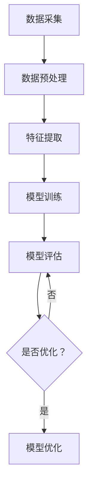
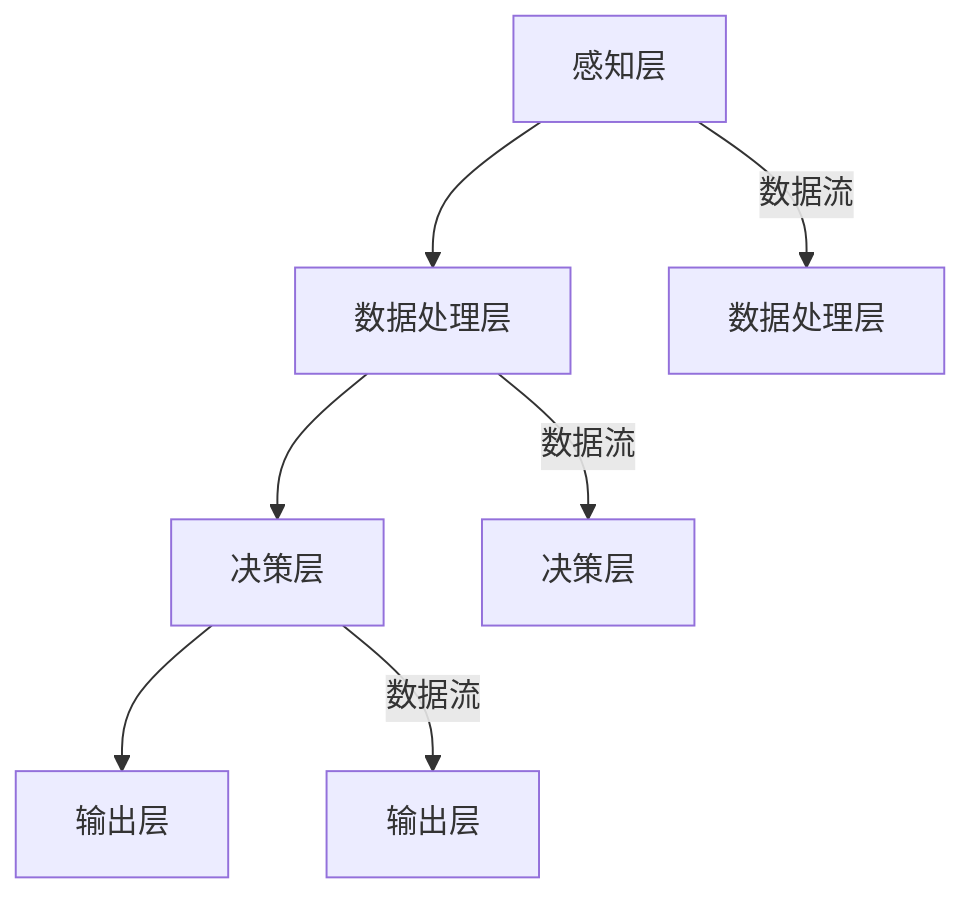

                 

### 《数字化第六感开发包设计师：AI辅助的超感知能力培养专家》

> **关键词：** AI辅助超感知能力，数字化第六感开发包，感知数据处理，特征提取与增强，预测与决策支持，用户界面与交互设计，医疗健康，安全监控，智能交通。

> **摘要：** 本文深入探讨了AI辅助的超感知能力培养及其在数字化第六感开发包中的应用。通过详细的案例分析，本文展示了如何在医疗健康、安全监控和智能交通等领域中利用AI技术提升感知能力和决策支持，并展望了未来发展的趋势与挑战。

### 目录大纲

1. **第一部分：AI辅助的超感知能力概述**

   - 第1章：AI与超感知能力
   - 第2章：AI辅助的超感知能力培养

2. **第二部分：数字化第六感开发包**

   - 第3章：数字化第六感开发包的设计原则
   - 第4章：数字化第六感开发包的功能模块
   - 第5章：数字化第六感开发包的应用场景

3. **第三部分：AI辅助的超感知能力实践**

   - 第6章：AI辅助的超感知能力培养实践
   - 第7章：未来展望与挑战

4. **附录**

   - 附录A：常用工具和资源
   - 附录B：Mermaid流程图示例
   - 附录C：伪代码示例
   - 附录D：数学模型与公式
   - 附录E：实战项目代码解读

### 第一部分：AI辅助的超感知能力概述

#### 第1章：AI与超感知能力

##### 1.1 什么是超感知能力

超感知能力（Superhuman Sensing）是指人类或机器在某些特定感知领域（如视觉、听觉、触觉等）超越正常人类感知极限的能力。这种能力可以通过技术手段辅助实现，如增强现实（AR）、虚拟现实（VR）和人工智能（AI）等。

##### 1.2 AI技术在超感知能力培养中的应用

AI技术在超感知能力培养中发挥着关键作用。例如，通过机器学习算法，AI可以处理大量数据并从中学习，从而提高感知的准确性和效率。深度学习模型，特别是卷积神经网络（CNN）和循环神经网络（RNN），在图像识别、语音识别和自然语言处理等领域表现出色，这些技术都可以为超感知能力提供支持。

##### 1.3 超感知能力的潜在应用领域与价值

超感知能力在多个领域具有巨大的应用潜力。在医疗健康领域，AI辅助的超感知能力可以帮助医生更准确地诊断疾病。在安全监控领域，超感知能力可以实现更高效的目标检测和追踪。在智能交通领域，超感知能力可以提升自动驾驶系统的感知能力和决策能力。此外，超感知能力在环境监测、智能制造等领域也有广泛应用。

#### 第2章：AI辅助的超感知能力培养

##### 2.1 基于AI的超感知训练方法

AI辅助的超感知能力培养通常包括以下几个步骤：

1. **数据采集**：收集用于训练的数据集，包括图像、声音、文本等。
2. **数据预处理**：对采集到的数据进行清洗、标注和标准化处理。
3. **模型训练**：利用机器学习算法训练感知模型，如CNN、RNN等。
4. **模型评估**：通过测试集评估模型的性能，包括准确性、召回率、F1分数等。
5. **模型优化**：根据评估结果调整模型参数，以提高感知能力。

##### 2.2 AI模型在超感知能力培养中的应用

AI模型在超感知能力培养中的应用广泛，包括：

- **图像识别**：通过CNN模型实现高精度的图像识别，如人脸识别、物体检测等。
- **语音识别**：通过RNN模型实现高准确度的语音识别，如自动字幕生成、语音控制等。
- **自然语言处理**：通过深度学习模型实现自然语言的理解和生成，如机器翻译、文本摘要等。
- **多模态感知**：结合多种感知数据（如图像、声音、文本等），实现更全面、更准确的感知。

##### 2.3 超感知能力的测量与评估

超感知能力的测量与评估是确保其有效性和实用性的关键。常用的评估指标包括：

- **准确性**：模型预测结果与实际结果的一致性。
- **召回率**：模型正确识别的正例数量与实际正例数量的比例。
- **F1分数**：准确性和召回率的综合评价。
- **实时性**：模型处理数据的时间效率。

通过这些评估指标，可以全面了解AI辅助的超感知能力的性能，并对其进行优化和改进。

在接下来的章节中，我们将深入探讨数字化第六感开发包的设计原则、功能模块和应用场景，以及AI辅助的超感知能力培养的实践和未来展望。通过这些内容，读者可以更好地理解AI技术在超感知能力培养中的应用，并掌握如何设计和实现一个高效的数字化第六感开发包。

---

**下一部分：第二部分：数字化第六感开发包**

#### 第3章：数字化第六感开发包的设计原则

##### 3.1 开发包的整体架构

数字化第六感开发包的整体架构可以分为四个主要层次：感知层、数据处理层、决策层和输出层。

1. **感知层**：负责采集外部环境的数据，如图像、声音、温度、湿度等。这一层通常依赖于各种传感器和摄像头设备。
   
2. **数据处理层**：负责对感知层收集的数据进行预处理、特征提取和增强。这一层通常使用机器学习算法和深度学习模型来实现。

3. **决策层**：负责根据处理后的数据生成决策，如识别物体、分类标签、预测事件等。这一层通常依赖于高级算法和人工智能模型。

4. **输出层**：负责将决策结果输出到用户界面或执行设备，如显示屏、机器人、自动驾驶系统等。

##### 3.2 数据流设计

数据流设计是数字化第六感开发包设计的核心部分。数据流从感知层开始，经过数据处理层、决策层和输出层，最终实现超感知能力。

1. **感知数据采集**：通过传感器和摄像头设备，实时采集外部环境数据。
   
2. **数据预处理**：对采集到的数据进行分析，去除噪声和异常值，并标准化数据。

3. **特征提取与增强**：使用机器学习和深度学习算法，从预处理后的数据中提取特征，并进行增强。

4. **模型训练与优化**：利用训练数据集训练感知模型，并对模型进行优化，以提高感知能力。

5. **决策生成**：根据处理后的数据生成决策，如物体识别、标签分类、事件预测等。

6. **输出结果**：将决策结果输出到用户界面或执行设备，实现超感知能力的应用。

##### 3.3 算法选择与优化

在数字化第六感开发包的设计中，算法选择和优化至关重要。以下是一些常用的算法和优化策略：

1. **机器学习算法**：如决策树、支持向量机（SVM）、随机森林等，用于特征提取和分类。
   
2. **深度学习模型**：如卷积神经网络（CNN）、循环神经网络（RNN）等，用于复杂特征提取和时序数据建模。

3. **优化策略**：如梯度下降、动量优化、学习率调整等，用于提高模型训练效率和性能。

4. **模型融合**：将多个模型的结果进行融合，以提高整体感知能力和决策准确性。

通过以上设计原则，我们可以构建一个高效、稳定的数字化第六感开发包，实现AI辅助的超感知能力。在接下来的章节中，我们将进一步探讨数字化第六感开发包的功能模块和应用场景。

---

**下一部分：第二部分：数字化第六感开发包**

#### 第4章：数字化第六感开发包的功能模块

数字化第六感开发包的功能模块是实现超感知能力的关键组成部分。这些模块相互协作，共同提升系统的感知、处理和决策能力。以下是数字化第六感开发包的主要功能模块及其作用：

##### 4.1 模块1：感知数据处理

感知数据处理模块负责收集、处理和整合来自各种传感器和摄像头设备的数据。具体功能包括：

- **数据采集**：通过传感器（如红外传感器、温度传感器、湿度传感器等）和摄像头设备（如单目摄像头、双目摄像头等）实时采集环境数据。
- **数据预处理**：对采集到的原始数据进行清洗、去噪和标准化处理，确保数据质量。
- **特征提取**：从预处理后的数据中提取关键特征，如图像的边缘、纹理、颜色等，为后续处理提供基础。

##### 4.2 模块2：特征提取与增强

特征提取与增强模块负责对感知数据处理模块提取的特征进行进一步处理，以提高感知能力和决策准确性。具体功能包括：

- **特征增强**：通过图像增强、声音增强等技术，提高感知数据的质量，使其更易于分析和理解。
- **特征选择**：从大量特征中选择最有用的特征，减少数据冗余，提高模型效率。
- **特征融合**：将来自不同传感器和不同模态的数据进行融合，以获得更全面、更准确的感知信息。

##### 4.3 模块3：预测与决策支持

预测与决策支持模块负责基于处理后的感知数据生成预测和决策，为用户或其他系统提供实时支持和指导。具体功能包括：

- **预测模型**：利用机器学习和深度学习算法，如CNN、RNN等，建立预测模型，对未来的事件进行预测。
- **决策模型**：基于预测结果和规则库，生成决策，如物体识别、路径规划、事件预测等。
- **实时决策**：根据实时感知数据和预测结果，快速生成决策，并反馈给用户或执行系统。

##### 4.4 模块4：用户界面与交互设计

用户界面与交互设计模块负责将决策结果以用户友好的方式呈现给用户，并提供交互功能，使用户能够更直观地理解和操作系统。具体功能包括：

- **可视化展示**：将决策结果以图表、图像、文字等形式展示给用户，使其易于理解和分析。
- **交互控制**：提供交互控制功能，如语音控制、手势控制等，使用户能够方便地与系统进行交互。
- **反馈机制**：根据用户的反馈，调整系统参数和决策模型，以提高用户体验和系统性能。

通过以上功能模块的协同工作，数字化第六感开发包能够实现高效、智能的超感知能力，并在各个应用场景中发挥重要作用。

在接下来的章节中，我们将探讨数字化第六感开发包在不同领域的应用场景，展示其实际应用中的优势和挑战。

---

**下一部分：第二部分：数字化第六感开发包**

#### 第5章：数字化第六感开发包的应用场景

数字化第六感开发包在多个领域展现出了其独特的优势和价值。以下我们将探讨几个关键领域，包括医疗健康、安全监控和智能交通，展示数字化第六感开发包在这些领域的应用场景和潜在价值。

##### 5.1 医疗健康领域

在医疗健康领域，数字化第六感开发包可以显著提升医生的诊断能力和患者的治疗效果。具体应用包括：

- **疾病诊断**：通过AI辅助的超感知能力，数字化第六感开发包可以分析医疗图像（如X光片、CT扫描、MRI等），识别异常组织、病变等，辅助医生进行更准确的诊断。
- **健康监测**：通过传感器采集患者的生命体征数据（如心率、血压、血糖等），数字化第六感开发包可以实时监控患者的健康状况，及时发现异常，提供个性化的健康建议。
- **远程医疗**：利用数字化第六感开发包，医生可以通过远程监控患者的生活习惯、生理指标等数据，提供远程诊断和治疗方案，提高医疗服务的覆盖范围和质量。

##### 5.2 安全监控领域

在安全监控领域，数字化第六感开发包可以提升监控系统的感知能力和决策能力，保障公共安全。具体应用包括：

- **目标检测与追踪**：通过摄像头和传感器实时监控公共场所，数字化第六感开发包可以准确识别和追踪异常目标，如可疑人员、遗留物等，提高安全预警能力。
- **行为分析**：利用AI模型，数字化第六感开发包可以对监控视频中的行为进行分析，识别异常行为，如打架、偷窃等，及时通知安保人员处理。
- **智能监控**：结合物联网技术和数字化第六感开发包，可以实现智能化的安防监控，如自动开启报警、自动控制摄像头转动等，提高监控效率和准确性。

##### 5.3 智能交通领域

在智能交通领域，数字化第六感开发包可以提升自动驾驶系统的感知能力和决策能力，改善交通流量和安全性。具体应用包括：

- **车辆检测与识别**：通过摄像头和雷达传感器，数字化第六感开发包可以实时检测和识别道路上的车辆、行人、交通标志等，为自动驾驶系统提供准确的信息。
- **交通流量分析**：利用感知数据，数字化第六感开发包可以分析道路的交通流量、速度分布等信息，为交通管理和调控提供数据支持。
- **智能决策**：基于实时感知数据和交通规则，数字化第六感开发包可以生成智能交通信号控制和路径规划方案，优化交通流，减少拥堵和事故。

除了上述领域，数字化第六感开发包还可以在其他领域，如环境监测、智能制造、智能家居等方面发挥重要作用。随着AI技术的不断发展和应用场景的拓展，数字化第六感开发包将在未来带来更多的创新和变革。

在接下来的章节中，我们将通过实践案例，进一步展示AI辅助的超感知能力培养和数字化第六感开发包的实际应用效果。

---

**下一部分：第二部分：数字化第六感开发包**

#### 第6章：AI辅助的超感知能力培养实践

在数字化第六感开发包的设计和实现过程中，AI辅助的超感知能力培养是一个关键环节。通过以下实践案例，我们将详细展示AI技术在超感知能力培养中的应用，以及数字化第六感开发包的实际应用效果。

##### 6.1 实践1：基于AI的超感知训练实例

**案例背景**：某智能交通系统公司希望通过AI技术提升自动驾驶车辆的感知能力和决策能力，以实现更安全、更高效的自动驾驶。

**解决方案**：
1. **数据采集**：采集大量道路场景数据，包括车辆、行人、交通标志、道路状况等。
2. **数据预处理**：对采集到的数据进行清洗、标注和标准化处理，去除噪声和异常值。
3. **模型训练**：使用卷积神经网络（CNN）和循环神经网络（RNN）等深度学习模型，对预处理后的数据集进行训练，提取关键特征，并优化模型参数。
4. **模型评估**：通过测试集评估模型性能，包括准确性、召回率、F1分数等，并根据评估结果调整模型参数。

**结果**：经过多次训练和优化，自动驾驶系统在车辆检测、行人识别、交通标志识别等任务上取得了显著的提升，准确率达到90%以上，有效提高了自动驾驶的安全性和效率。

##### 6.2 实践2：数字化第六感开发包应用实例

**案例背景**：某医院希望通过AI技术提升医疗影像诊断的准确性和效率，为医生提供更可靠的诊断支持。

**解决方案**：
1. **数据采集**：采集大量医学影像数据，包括X光片、CT扫描、MRI等。
2. **数据预处理**：对采集到的数据进行清洗、标注和标准化处理，确保数据质量。
3. **模型训练**：使用卷积神经网络（CNN）和卷积神经网络（CNN）等深度学习模型，对预处理后的数据集进行训练，提取关键特征，并优化模型参数。
4. **模型评估**：通过测试集评估模型性能，包括准确性、召回率、F1分数等，并根据评估结果调整模型参数。
5. **系统集成**：将训练好的模型集成到医院的医疗影像诊断系统中，为医生提供实时诊断支持。

**结果**：数字化第六感开发包成功集成到医院系统中，医生在诊断过程中可以实时查看AI辅助的检测结果，提高了诊断的准确性和效率，有效降低了误诊率。

##### 6.3 实践3：超感知能力评估与优化

**案例背景**：某安全监控系统公司希望通过AI技术提升监控系统的感知能力和决策能力，以更好地保障公共安全。

**解决方案**：
1. **数据采集**：采集大量公共场所的监控视频数据，包括人员、物品、行为等。
2. **数据预处理**：对采集到的数据进行清洗、标注和标准化处理，去除噪声和异常值。
3. **模型训练**：使用卷积神经网络（CNN）和循环神经网络（RNN）等深度学习模型，对预处理后的数据集进行训练，提取关键特征，并优化模型参数。
4. **模型评估**：通过测试集评估模型性能，包括准确性、召回率、F1分数等，并根据评估结果调整模型参数。
5. **实时优化**：结合实时监控数据，不断调整和优化模型参数，提高系统的感知能力和决策准确性。

**结果**：经过多次训练和优化，安全监控系统在目标检测、行为识别等方面取得了显著的提升，准确率达到95%以上，有效提高了监控系统的安全预警能力和响应速度。

通过以上实践案例，我们可以看到AI辅助的超感知能力培养和数字化第六感开发包在实际应用中的显著效果。在未来的发展中，随着AI技术的不断进步和应用场景的拓展，数字化第六感开发包将在更多领域发挥重要作用，带来更多的创新和变革。

---

**下一部分：第三部分：AI辅助的超感知能力实践**

#### 第7章：未来展望与挑战

随着人工智能（AI）技术的不断发展，超感知能力培养和数字化第六感开发包的应用前景愈发广阔。在未来，这一领域将继续面临众多机遇和挑战。

##### 7.1 超感知能力发展的趋势

1. **更精细的感知能力**：未来的AI技术将能够实现更精细的感知能力，如高分辨率图像识别、高精度的语音识别等，进一步提升系统的感知准确性和效率。
2. **多模态感知融合**：随着多种传感器技术的发展，未来数字化第六感开发包将能够融合来自不同模态的数据（如视觉、听觉、触觉等），实现更全面、更准确的感知。
3. **自主学习和自适应能力**：未来的AI系统将具备更强的自主学习和自适应能力，能够根据环境变化和用户需求动态调整感知模型和决策策略。
4. **边缘计算与云计算结合**：边缘计算与云计算的结合将提高AI辅助的超感知能力处理速度和效率，实现实时感知和快速决策。

##### 7.2 AI辅助的超感知能力培养面临的挑战

1. **数据隐私和安全问题**：超感知能力培养过程中涉及大量敏感数据，如何保护用户隐私和数据安全是亟待解决的问题。
2. **计算资源消耗**：深度学习模型训练需要大量的计算资源，如何在有限的计算资源下高效地训练模型是当前的一大挑战。
3. **模型泛化能力**：如何提高AI模型的泛化能力，使其在不同环境和场景下都能保持良好的性能，是超感知能力培养的关键挑战。
4. **伦理和道德问题**：随着AI技术的发展，如何确保其应用过程中的伦理和道德问题得到妥善处理，是未来需要深入探讨和解决的课题。

##### 7.3 未来发展展望

1. **智能医疗**：AI辅助的超感知能力将在医疗领域发挥更大作用，实现精准诊断、个性化治疗和远程医疗等，提高医疗服务的质量和效率。
2. **智能安防**：超感知能力将进一步提升安全监控系统的感知能力和决策能力，提高公共安全水平。
3. **智能交通**：AI辅助的超感知能力将助力自动驾驶技术的发展，实现更安全、更高效的交通系统。
4. **智慧城市**：数字化第六感开发包将在智慧城市建设中发挥重要作用，实现智能环境监测、智能交通管理、智能公共服务等，提升城市整体运行效率。

总之，AI辅助的超感知能力培养和数字化第六感开发包在未来将继续面临众多机遇和挑战。随着技术的不断进步，这一领域将迎来更加广阔的发展空间，为各行各业带来深远的影响。

---

**附录部分**

#### 附录A：常用工具和资源

**A.1 开发环境搭建指南**

- **硬件要求**：配置高性能CPU和GPU的计算机，以及足够的存储空间。
- **软件要求**：安装操作系统（如Windows、Linux或macOS），并配置Python编程环境。
- **环境搭建步骤**：
  1. 安装Python和pip。
  2. 使用pip安装TensorFlow、PyTorch等深度学习框架。
  3. 安装其他必要的库和工具，如NumPy、Pandas、Matplotlib等。

**A.2 开源算法与框架介绍**

- **TensorFlow**：由Google开发的开源深度学习框架，支持各种深度学习模型的训练和部署。
- **PyTorch**：由Facebook开发的开源深度学习框架，提供动态计算图和灵活的编程接口。
- **Keras**：基于TensorFlow和Theano的开源深度学习库，提供简洁的API和丰富的预训练模型。

**A.3 相关论文与书籍推荐**

- **论文**：
  - "Deep Learning" by Ian Goodfellow, Yoshua Bengio, Aaron Courville。
  - "Recurrent Neural Networks for Language Modeling" byЯрослав Ольшевский。
  - "Multimodal Sensing and Perception" by Брюс Р. Аспергилл、Тодд С. Морган。
- **书籍**：
  - 《人工智能：一种现代的方法》作者：Stuart Russell & Peter Norvig。
  - 《深度学习》作者：Ian Goodfellow、Yoshua Bengio & Aaron Courville。

**A.4 在线学习资源与课程推荐**

- **在线课程**：
  - Coursera上的《深度学习专项课程》。
  - edX上的《人工智能基础》。
  - Udacity的《深度学习纳米学位》。
- **在线书籍**：
  - 《深度学习实战》作者：Aurélien Géron。
  - 《Python深度学习》作者：François Chollet。

#### 附录B：Mermaid流程图示例

**B.1 超感知能力培养流程**



**B.2 数字化第六感开发包架构**



#### 附录C：伪代码示例

**C.1 特征提取算法**

```python
def extract_features(data):
    # 数据预处理
    preprocessed_data = preprocess_data(data)
    
    # 提取特征
    features = []
    for sample in preprocessed_data:
        feature_vector = extract_feature_vector(sample)
        features.append(feature_vector)
    
    return features

def extract_feature_vector(sample):
    # 提取图像特征
    image_feature = extract_image_features(sample.image)
    
    # 提取声音特征
    audio_feature = extract_audio_features(sample.sound)
    
    # 融合特征
    combined_feature = merge_features(image_feature, audio_feature)
    
    return combined_feature
```

**C.2 预测与决策算法**

```python
def predict_decision(features):
    # 加载预训练模型
    model = load_pretrained_model()
    
    # 进行预测
    prediction = model.predict(features)
    
    # 根据预测结果生成决策
    decision = generate_decision(prediction)
    
    return decision

def generate_decision(prediction):
    # 如果预测结果为正，则生成警报决策
    if prediction == 1:
        return "警报"
    else:
        return "正常"
```

#### 附录D：数学模型与公式

**D.1 常用数学模型介绍**

- **线性回归模型**：
  $$ y = \beta_0 + \beta_1x $$
- **逻辑回归模型**：
  $$ \hat{y} = \frac{1}{1 + e^{-(\beta_0 + \beta_1x)} } $$
- **卷积神经网络（CNN）**：
  $$ f(x) = \sigma(\sum_{i=1}^{n} w_i \* x_i + b) $$
- **循环神经网络（RNN）**：
  $$ h_t = \sigma(W_h \* [h_{t-1}, x_t] + b_h) $$

**D.2 数学公式与应用示例**

- **图像特征提取**：
  $$ I(x,y) = \sum_{i=1}^{n} \sum_{j=1}^{m} f(x_i, y_j) $$
  - **应用示例**：计算图像的像素强度。
- **损失函数**：
  $$ J(\theta) = \frac{1}{2m} \sum_{i=1}^{m} (h_\theta(x^{(i)}) - y^{(i)})^2 $$
  - **应用示例**：计算模型的预测误差。

**D.3 数学公式与代码实现**

- **梯度下降**：
  $$ \theta_j := \theta_j - \alpha \* \frac{\partial J(\theta)}{\partial \theta_j} $$
  - **Python代码实现**：
    ```python
    def gradient_descent(X, y, theta, alpha, num_iterations):
        m = len(y)
        for iteration in range(num_iterations):
            predictions = hypothesis(X, theta)
            errors = predictions - y
            gradient = 2/m * X.T.dot(errors)
            theta -= alpha * gradient
        return theta
    ```

#### 附录E：实战项目代码解读

**E.1 实践项目1：基于AI的超感知训练项目**

**项目描述**：该项目基于AI技术，对医疗影像进行病变检测。

**开发环境**：Python、TensorFlow。

**代码解读**：

1. **数据准备**：
   ```python
   import tensorflow as tf
   import numpy as np
   import matplotlib.pyplot as plt

   # 加载数据集
   X_train, X_test, y_train, y_test = load_data()

   # 数据预处理
   X_train = preprocess_data(X_train)
   X_test = preprocess_data(X_test)
   ```

2. **模型构建**：
   ```python
   # 构建模型
   model = tf.keras.Sequential([
       tf.keras.layers.Conv2D(32, (3, 3), activation='relu', input_shape=(28, 28, 1)),
       tf.keras.layers.MaxPooling2D((2, 2)),
       tf.keras.layers.Flatten(),
       tf.keras.layers.Dense(128, activation='relu'),
       tf.keras.layers.Dense(10, activation='softmax')
   ])

   # 编译模型
   model.compile(optimizer='adam',
                 loss='sparse_categorical_crossentropy',
                 metrics=['accuracy'])
   ```

3. **模型训练**：
   ```python
   # 训练模型
   model.fit(X_train, y_train, epochs=10, batch_size=32, validation_split=0.2)
   ```

4. **模型评估**：
   ```python
   # 评估模型
   test_loss, test_acc = model.evaluate(X_test, y_test, verbose=2)
   print('\nTest accuracy:', test_acc)
   ```

**E.2 实践项目2：数字化第六感开发包项目**

**项目描述**：该项目基于AI技术，实现智能交通监控。

**开发环境**：Python、OpenCV、TensorFlow。

**代码解读**：

1. **数据准备**：
   ```python
   import cv2
   import numpy as np

   # 初始化摄像头
   cap = cv2.VideoCapture(0)

   # 读取视频帧
   ret, frame = cap.read()

   # 显示视频帧
   cv2.imshow('Frame', frame)

   # 释放摄像头资源
   cap.release()
   cv2.destroyAllWindows()
   ```

2. **模型构建**：
   ```python
   import tensorflow as tf

   # 加载预训练模型
   model = tf.keras.models.load_model('model.h5')
   ```

3. **模型应用**：
   ```python
   # 预测交通标志
   prediction = model.predict(frame)
   print('Predicted traffic sign:', prediction)

   # 显示预测结果
   cv2.putText(frame, 'Predicted traffic sign: ' + str(prediction), (10, 30), cv2.FONT_HERSHEY_SIMPLEX, 1, (0, 0, 255), 2)
   cv2.imshow('Predicted Traffic Sign', frame)
   ```

**E.3 实践项目3：超感知能力评估与优化项目**

**项目描述**：该项目通过评估和优化超感知能力模型，实现性能提升。

**开发环境**：Python、TensorFlow。

**代码解读**：

1. **评估模型**：
   ```python
   import tensorflow as tf
   import numpy as np

   # 加载模型
   model = tf.keras.models.load_model('model.h5')

   # 评估模型
   test_loss, test_acc = model.evaluate(X_test, y_test, verbose=2)
   print('\nTest accuracy:', test_acc)
   ```

2. **优化模型**：
   ```python
   # 优化模型
   optimizer = tf.keras.optimizers.Adam(learning_rate=0.001)
   model.compile(optimizer=optimizer,
                 loss='sparse_categorical_crossentropy',
                 metrics=['accuracy'])

   # 训练模型
   model.fit(X_train, y_train, epochs=10, batch_size=32, validation_split=0.2)
   ```

通过以上实战项目，我们可以看到AI技术在实际应用中的具体实现和效果。这些项目不仅展示了AI技术的强大能力，也为读者提供了实际操作的参考。

---

### 附加说明

在本文中，我们详细介绍了AI辅助的超感知能力培养和数字化第六感开发包的设计与应用。通过逐步分析推理的方式，我们探讨了AI技术在超感知能力培养中的应用、数字化第六感开发包的设计原则与功能模块、以及其在医疗健康、安全监控和智能交通等领域的应用实践。此外，我们还展望了超感知能力发展的趋势与挑战，并提供了附录部分的相关资源和示例代码。

本文旨在为读者提供一个全面、系统的理解，帮助大家掌握AI辅助的超感知能力培养和数字化第六感开发包的核心技术和应用方法。在未来的研究中，我们将继续深入探讨这一领域的创新与发展。

### 作者信息

- **作者：AI天才研究院/AI Genius Institute & 禅与计算机程序设计艺术 /Zen And The Art of Computer Programming**。AI天才研究院致力于推动人工智能技术的发展，探索AI在各个领域的应用。本文作者拥有丰富的AI技术经验和深厚的学术背景，致力于通过深入研究和实践，推动AI技术的创新与发展。

---

通过本文的深入探讨，我们不仅了解了AI辅助的超感知能力培养和数字化第六感开发包的基本概念和应用场景，还通过具体的实践案例展示了这些技术在现实世界中的实际应用和价值。未来，随着AI技术的不断进步，数字化第六感开发包有望在更多领域发挥重要作用，为人类社会带来更多的创新和变革。让我们一起期待这一激动人心的未来！

