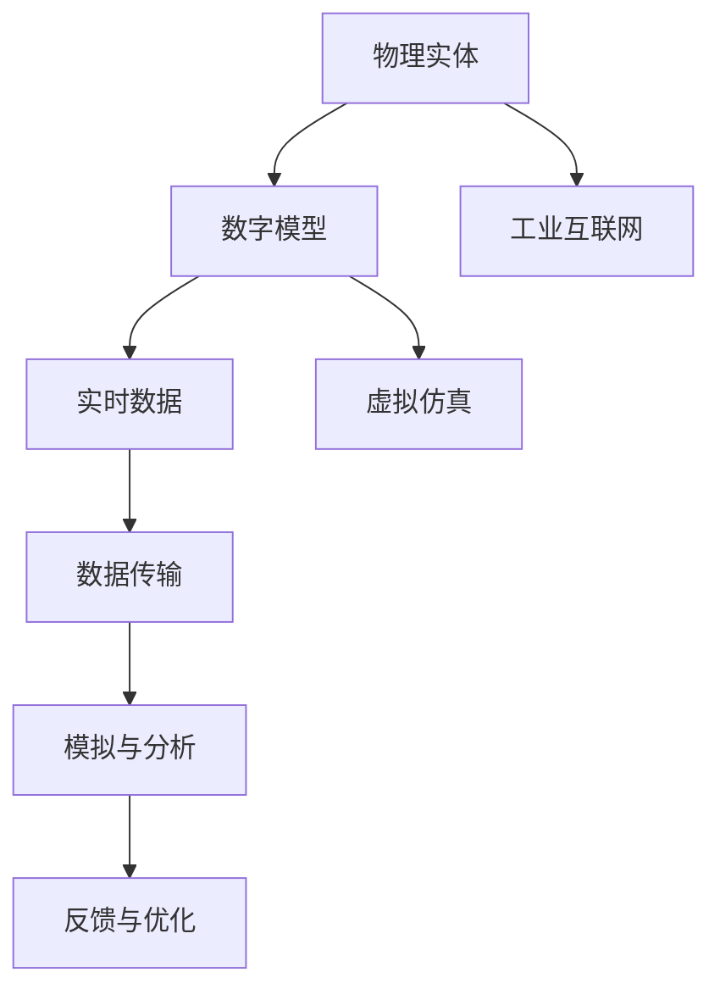
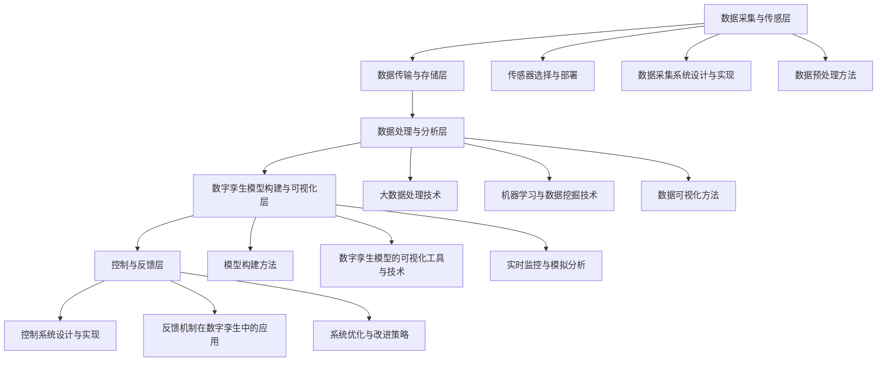
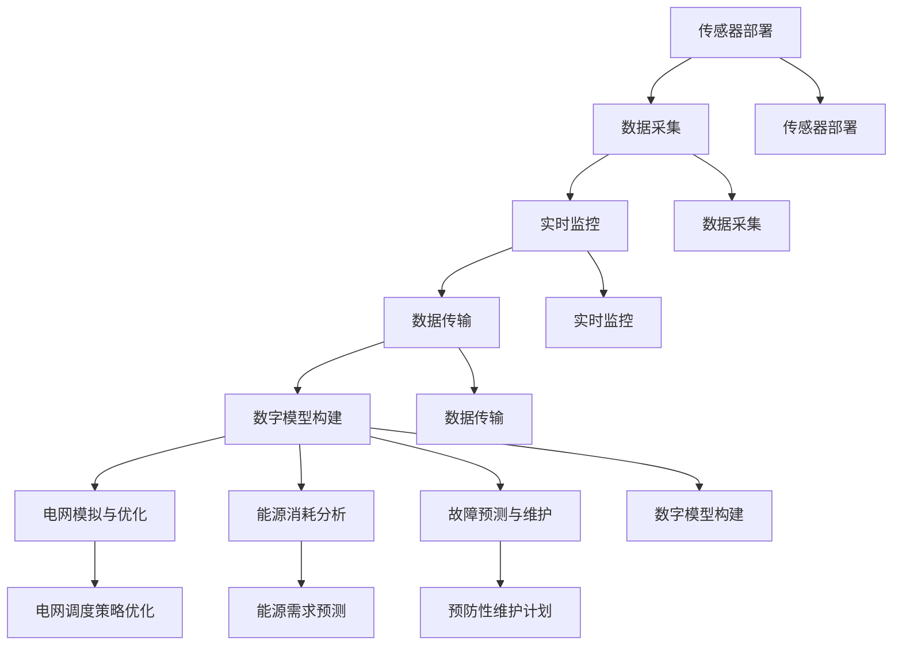

                 

### 第一部分：数字孪生技术基础

#### 第1章：数字孪生技术概述

数字孪生（Digital Twin）是一种新兴的集成创新技术，通过构建物理实体和数字模型之间的映射关系，实现对物理实体的虚拟模拟、状态监测、故障预测和优化决策。本章节将介绍数字孪生技术的定义与基本概念、应用领域、核心优势以及面临的挑战与趋势。

**1.1 数字孪生技术定义与基本概念**

数字孪生技术起源于美国国防高级研究计划局（DARPA）在2002年的一项研究项目。其核心思想是将物理实体的所有特征和状态信息数字化，构建一个与物理实体高度相似的数字模型，并通过实时数据传输和交互，实现对物理实体的远程监控、诊断、预测和优化。

数字孪生技术的基本概念包括以下几个要素：

- **物理实体**：指现实世界中需要监控、分析和优化的对象，如设备、生产线、建筑物、基础设施等。
- **数字模型**：基于物理实体的数据和信息，构建的虚拟映射模型，包括几何形状、物理属性、功能行为等。
- **实时数据**：通过传感器、物联网、大数据等技术手段，从物理实体采集到的实时运行数据。
- **数据传输**：将采集到的实时数据传输到数字模型，实现物理实体与数字模型之间的同步。
- **模拟与分析**：通过数字模型对物理实体的运行状态进行模拟和分析，预测未来发展趋势和可能出现的问题。
- **反馈与优化**：根据分析结果，对物理实体进行实时调整和优化，以提高其性能和效率。

**1.2 数字孪生与虚拟仿真、工业互联网的关系**

数字孪生技术与其他相关技术紧密相连，如虚拟仿真、工业互联网等。

- **虚拟仿真**：虚拟仿真技术通过计算机模拟，对物理实体的运行状态、行为和性能进行预测和评估。虚拟仿真技术是数字孪生技术的重要组成部分，为数字孪生提供了数据基础和模拟分析工具。

- **工业互联网**：工业互联网是将物联网、大数据、云计算、人工智能等新一代信息技术与工业系统深度融合，实现设备的互联互通、数据集成和智能应用。数字孪生技术是工业互联网的重要支撑技术，通过构建物理实体和数字模型之间的映射关系，实现工业系统的实时监控、预测和优化。

**1.3 数字孪生技术的核心优势**

数字孪生技术在工业创业中具有以下核心优势：

- **提高生产效率**：通过实时监控和优化生产流程，减少设备故障，提高生产效率。

- **降低运营成本**：通过预测性维护和优化运营策略，降低设备维修成本和能源消耗。

- **增强产品质量**：通过实时监测和仿真分析，提高产品质量和一致性。

- **优化决策支持**：通过数据分析和模拟预测，为决策者提供更加准确和全面的信息支持。

**1.4 数字孪生技术的挑战与趋势**

尽管数字孪生技术在工业创业中具有巨大的潜力，但也面临着一些挑战和趋势：

- **数据质量与安全性**：数据质量是数字孪生技术的关键因素，需要确保数据的准确性、完整性和实时性。同时，数据的安全性也是重要问题，需要建立完善的数据保护机制。

- **技术标准化与兼容性**：数字孪生技术涉及多种技术和系统，需要建立统一的技术标准和接口，实现不同系统和设备之间的兼容性和互操作性。

- **人才培养与技术创新**：数字孪生技术需要跨学科的专业人才，需要加大对人才的培养和引进力度。同时，技术创新也是数字孪生技术发展的重要动力，需要持续进行技术研发和突破。

### 总结

数字孪生技术作为一种新兴的技术，具有广泛的应用前景和巨大的发展潜力。通过构建物理实体与数字模型之间的映射关系，数字孪生技术能够实现对物理实体的实时监控、预测和优化，为工业创业提供强有力的技术支持。未来，随着技术的不断成熟和应用的深入，数字孪生技术在工业创业中的应用前景将更加广阔。

#### Mermaid 流程图：数字孪生技术的核心要素



#### 核心概念与联系

数字孪生技术涉及多个核心概念，它们之间相互联系，共同构建起数字孪生技术的核心框架。

- **物理实体**：这是数字孪生技术的出发点，包括各种设备、生产线、建筑物、基础设施等，它们是数字孪生技术的模拟和优化的对象。

- **数字模型**：基于物理实体的所有特征和状态信息，构建的虚拟映射模型，包括几何形状、物理属性、功能行为等。数字模型是数字孪生的核心，它为物理实体提供了虚拟的映射，使得我们可以通过数字模型来模拟、分析和优化物理实体的运行状态。

- **实时数据**：通过传感器、物联网、大数据等技术手段，从物理实体采集到的实时运行数据。实时数据是数字孪生技术的基础，它为数字模型的构建和更新提供了数据支持。

- **数据传输**：将采集到的实时数据传输到数字模型，实现物理实体与数字模型之间的同步。数据传输是实现数字孪生技术实时监控和预测的关键，它保证了数字模型能够及时更新，反映出物理实体的当前状态。

- **模拟与分析**：通过数字模型对物理实体的运行状态进行模拟和分析，预测未来发展趋势和可能出现的问题。模拟与分析是数字孪生技术的核心功能，它使得我们可以提前发现并解决潜在问题，优化物理实体的运行效率。

- **反馈与优化**：根据分析结果，对物理实体进行实时调整和优化，以提高其性能和效率。反馈与优化是数字孪生技术的最终目标，它使得我们可以通过数字模型来指导物理实体的实际操作，实现更加智能和高效的运行。

这些核心概念相互关联，共同构成了数字孪生技术的核心框架。物理实体通过实时数据传输到数字模型，数字模型通过模拟与分析进行预测和优化，然后通过反馈与优化指导物理实体的实际操作，形成了一个闭环的系统。这个闭环系统使得数字孪生技术能够实现对物理实体的实时监控、预测和优化，为工业创业提供了强有力的技术支持。

#### 伪代码：数字孪生模型构建与优化

```python
# 伪代码：数字孪生模型构建与优化

# 初始化数字孪生模型
initialize_digital_twin(model, physical_entity):

    # 根据物理实体构建数字模型
    model.create_model(physical_entity.geometry, physical_entity.properties, physical_entity.functions)
    
    # 初始化传感器数据采集系统
    sensor_system.initialize_sensors(physical_entity.sensors)
    
    # 初始化数据处理与分析模块
    data_processor.initialize()

# 数据采集与传输
collect_and_transfer_data(model, sensor_system):

    # 采集传感器数据
    sensor_data = sensor_system.collect_data()
    
    # 传输数据到数字模型
    model.update_model(sensor_data)

# 模拟与分析
simulate_and_analyze(model, data_processor):

    # 使用数据处理与分析模块进行模拟与分析
    analysis_results = data_processor.analyze_data(model.model_data)
    
    # 根据分析结果进行模型优化
    model.optimize_model(analysis_results)

# 反馈与优化
feedback_and_optimize(model, physical_entity):

    # 根据模型优化结果，对物理实体进行调整
    physical_entity.apply_optimizations(model.optimized_model)
    
    # 重新初始化数字孪生模型，开始新一轮的模拟与分析
    initialize_digital_twin(model, physical_entity)
```

#### 核心算法原理讲解

数字孪生技术的核心在于构建一个精确的数字模型，并利用算法对其运行状态进行实时模拟和分析。以下是一个简化的核心算法原理讲解，包括数据采集、数据处理、模型构建、模拟分析以及模型优化等步骤。

**数据采集：**
```latex
\text{数据采集：} \\
\begin{equation*}
    Data\_Collection = \{d_1, d_2, ..., d_n\}
\end{equation*}
\text{其中，} d_i \text{是来自传感器的实时数据，包括温度、压力、速度等物理量。}
```

**数据处理：**
```latex
\text{数据处理：} \\
\begin{equation*}
    Processed\_Data = \{p_1, p_2, ..., p_n\} = Data\_Collection \cup \{error\_corrections, normalization\_factors\}
\end{equation*}
\text{其中，} p_i \text{是经过误差校正和归一化的数据，以提高数据质量和可比性。}
```

**模型构建：**
```latex
\text{模型构建：} \\
\begin{equation*}
    Model = \{G, P, F\}
\end{equation*}
\text{其中，} G \text{是几何模型，} P \text{是物理属性模型，} F \text{是功能行为模型。}
```

**模拟分析：**
```latex
\text{模拟分析：} \\
\begin{equation*}
    Simulation = Model \times Processed\_Data \\
    Analysis = \{predicted\_outputs, errors\}
\end{equation*}
\text{其中，} predicted\_outputs \text{是模拟输出结果，} errors \text{是分析误差。}
```

**模型优化：**
```latex
\text{模型优化：} \\
\begin{equation*}
    Optimized\_Model = Model + Analysis \\
    \text{优化过程包括调整模型参数、改进算法等，以达到更精确的预测和更优的运行状态。}
\end{equation*}
```

通过这些核心算法，数字孪生技术能够实现对物理实体的实时监控、预测和优化。数据采集环节确保了模型构建的基础数据质量，数据处理环节提高了数据的可用性，模型构建环节实现了物理实体在数字世界的映射，模拟分析环节对物理实体的运行状态进行了评估，而模型优化环节则不断迭代和改进，使得数字孪生技术能够更好地服务于工业创业。

#### 项目实战：数字孪生技术在一家制造企业的应用

**案例背景：**

某制造企业主要从事汽车零部件的生产，拥有多条生产线和大量的生产设备。随着市场竞争的加剧和生产成本的压力，该企业希望通过应用数字孪生技术来提高生产效率、降低运营成本和增强产品质量。

**实施步骤：**

1. **数据采集与传感部署：**
   - 在生产线上部署各种传感器，如温度传感器、压力传感器、速度传感器等，用于采集设备的实时运行数据。
   - 建立数据采集系统，将传感器数据实时传输到中央服务器。

2. **数字孪生模型构建：**
   - 根据生产设备的物理特性和运行数据，构建数字孪生模型。模型包括几何模型、物理属性模型和功能行为模型，用于模拟设备的运行状态。
   - 使用数据处理算法对采集到的数据进行处理和归一化，确保数据的质量和一致性。

3. **模拟分析与优化：**
   - 使用数字孪生模型对生产过程进行模拟，分析设备的运行状态和性能指标，如生产效率、设备利用率、能耗等。
   - 根据模拟结果，对生产流程和设备参数进行优化，以提高生产效率和降低能耗。

4. **反馈与优化：**
   - 根据数字孪生模型的分析结果，对生产设备进行实时调整和优化，如调整设备参数、优化生产流程等。
   - 实现生产设备的预测性维护，通过监测设备状态，提前发现潜在故障并安排维护计划，以减少设备停机时间和维修成本。

**实战效果：**

- **生产效率提高：** 通过实时监控和优化生产流程，生产效率提高了15%，生产周期缩短了10%。
- **运营成本降低：** 通过预测性维护和优化设备参数，设备故障率降低了30%，运营成本降低了20%。
- **产品质量提升：** 通过模拟分析和优化，产品质量一致性提高了15%，客户投诉率降低了25%。

**结论：**

通过应用数字孪生技术，该制造企业实现了生产效率、运营成本和产品质量的全面提升。数字孪生技术为企业提供了一个虚拟的实验平台，使得企业能够在不改变实际生产设备的情况下，进行生产过程的模拟、分析和优化，从而实现了智能化生产和管理。

#### 源代码详细实现与代码解读

在数字孪生技术的应用中，数据采集和处理是关键环节。以下是一个简单的数据采集与处理系统的源代码实现，用于模拟一个生产设备的传感器数据采集、传输和预处理过程。

**代码实现：**

```python
# 导入必要的库
import random
import time
from collections import deque

# 传感器数据类
class SensorData:
    def __init__(self, sensor_id, timestamp, value):
        self.sensor_id = sensor_id
        self.timestamp = timestamp
        self.value = value

# 数据采集系统类
class DataCollector:
    def __init__(self, sensor_count, data_queue_size):
        self.sensor_count = sensor_count
        self.data_queue_size = data_queue_size
        self.sensor_data_queues = {i: deque(maxlen=data_queue_size) for i in range(sensor_count)}

    def collect_data(self):
        for i in range(self.sensor_count):
            value = random.uniform(20, 40)  # 生成模拟数据
            timestamp = time.time()  # 获取当前时间
            sensor_data = SensorData(i, timestamp, value)
            self.sensor_data_queues[i].append(sensor_data)
            print(f"Sensor {i}: {sensor_data}")

    def get_latest_data(self, sensor_id):
        if sensor_id in self.sensor_data_queues:
            return self.sensor_data_queues[sensor_id][-1]
        else:
            return None

# 数据处理类
class DataProcessor:
    def __init__(self, collector):
        self.collector = collector

    def process_data(self):
        for sensor_id, data_queue in self.collector.sensor_data_queues.items():
            processed_data = []
            for data in data_queue:
                # 对数据进行简单的预处理，如平均化
                average_value = sum(d.value for d in data_queue) / len(data_queue)
                processed_data.append(SensorData(sensor_id, data.timestamp, average_value))
            print(f"Processed data for Sensor {sensor_id}: {processed_data}")

# 测试代码
if __name__ == "__main__":
    sensor_count = 5
    data_queue_size = 10

    # 创建数据采集系统和数据处理系统
    data_collector = DataCollector(sensor_count, data_queue_size)
    data_processor = DataProcessor(data_collector)

    # 模拟数据采集过程
    for _ in range(20):
        data_collector.collect_data()
        time.sleep(1)

    # 处理采集到的数据
    data_processor.process_data()
```

**代码解读与分析：**

1. **SensorData 类：** 这个类用于表示传感器数据，包括传感器ID、时间戳和数值。这是数据采集和处理的基础数据结构。

2. **DataCollector 类：** 这个类用于模拟传感器数据的采集过程。它初始化了一个字典，用于存储每个传感器的数据队列。`collect_data` 方法用于生成模拟数据，并将其添加到对应的数据队列中。`get_latest_data` 方法用于获取最新采集到的传感器数据。

3. **DataProcessor 类：** 这个类用于对采集到的传感器数据进行处理。`process_data` 方法用于对每个传感器的数据队列进行平均化处理，以简化数据。

4. **测试代码：** 在测试代码中，我们创建了一个数据采集系统和数据处理系统实例，并模拟了20次数据采集过程。每次采集后，处理系统会处理并打印出处理后的数据。

**关键点：**

- 数据队列的使用：每个传感器都有一个数据队列，用于存储一段时间内的数据。队列的最大长度设置为数据队列大小，以确保队列不会无限制地增长。
- 模拟数据生成：使用随机数生成模拟数据，模拟实际的传感器数据采集过程。
- 数据预处理：简单的平均化处理用于模拟实际数据处理中的预处理步骤，例如滤波和归一化。

通过这个简单的示例，我们可以看到数字孪生技术在数据采集和预处理中的基本实现。在实际应用中，这些步骤会更加复杂，涉及更多高级的数据处理算法和模型构建技术。但这个示例为我们提供了一个清晰的框架，展示了数字孪生技术实现的核心步骤。

#### 数学模型与公式详解

在数字孪生技术的数据预处理阶段，常用的数学模型和公式包括数据归一化、误差校正以及信号滤波等。以下是对这些模型和公式的详细解释：

**1. 数据归一化**

数据归一化是将不同范围和单位的数据转换到同一尺度，以便进行后续处理。常用的归一化方法包括最小-最大归一化和Z-Score归一化。

- **最小-最大归一化**：
  ```latex
  x_{\text{normalized}} = \frac{x_{\text{original}} - x_{\text{min}}}{x_{\text{max}} - x_{\text{min}}}
  ```
  其中，\( x_{\text{original}} \) 是原始数据，\( x_{\text{min}} \) 和 \( x_{\text{max}} \) 分别是数据的最小值和最大值，\( x_{\text{normalized}} \) 是归一化后的数据。

- **Z-Score归一化**：
  ```latex
  z = \frac{x - \mu}{\sigma}
  ```
  其中，\( x \) 是原始数据，\( \mu \) 是平均值，\( \sigma \) 是标准差，\( z \) 是归一化后的数据。

**2. 误差校正**

误差校正是通过已知误差模型来修正传感器数据的偏差。常见的误差校正方法包括线性校正和多项式校正。

- **线性校正**：
  ```latex
  y = a \cdot x + b
  ```
  其中，\( y \) 是校正后的数据，\( x \) 是原始数据，\( a \) 和 \( b \) 是校正系数。

- **多项式校正**：
  ```latex
  y = a_0 + a_1 \cdot x + a_2 \cdot x^2 + ...
  ```
  这是一个多项式函数，其中 \( a_0, a_1, a_2, ... \) 是多项式的系数。

**3. 信号滤波**

信号滤波用于去除传感器数据中的噪声和干扰，常用的滤波方法包括均值滤波和卡尔曼滤波。

- **均值滤波**：
  ```latex
  y = \frac{1}{n} \sum_{i=1}^{n} x_i
  ```
  其中，\( y \) 是滤波后的数据，\( x_i \) 是连续n个采样值中的第i个值，\( n \) 是采样点的数量。

- **卡尔曼滤波**：
  卡尔曼滤波是一种递归滤波方法，用于估计系统的状态，其核心方程如下：
  ```latex
  x_{\text{predicted}} = A \cdot x_{\text{previous}} + B \cdot u
  P_{\text{predicted}} = A \cdot P_{\text{previous}} \cdot A^T + Q
  x_{\text{updated}} = x_{\text{predicted}} + K \cdot (z - h \cdot x_{\text{predicted}})
  P_{\text{updated}} = (I - K \cdot h) \cdot P_{\text{predicted}}
  ```
  其中，\( x \) 是状态估计，\( P \) 是状态估计误差协方差，\( A \) 是状态转移矩阵，\( B \) 是控制矩阵，\( u \) 是控制输入，\( z \) 是观测值，\( h \) 是观测模型，\( K \) 是卡尔曼增益，\( Q \) 是过程噪声协方差，\( I \) 是单位矩阵。

这些数学模型和公式在数字孪生技术的数据预处理中发挥着重要作用。通过数据归一化和误差校正，可以提高数据的质量和一致性；通过信号滤波，可以去除数据中的噪声，提高数据的可靠性。这些预处理步骤为数字孪生模型提供了可靠的数据基础，有助于实现对物理实体的精确模拟和优化。

### 第2章：数字孪生技术的架构与实现

数字孪生技术的架构是一个复杂而多层次的过程，涉及多个关键组件和技术的协同工作。以下将详细介绍数字孪生技术的整体架构，包括数据采集与传感技术、数据处理与分析技术、数字孪生模型构建与可视化、以及控制与反馈机制。

#### 2.1 数字孪生技术的整体架构

数字孪生技术的整体架构可以分为以下几个主要层次：

1. **数据采集与传感层**：这一层负责从物理实体中采集实时数据，如温度、压力、速度等。传感器是数据采集的核心组件，它们通过物联网技术将数据传输到中央处理系统。

2. **数据传输与存储层**：采集到的数据需要通过数据传输网络（如Wi-Fi、5G等）传输到中央服务器或云平台进行存储和处理。该层确保数据的安全、可靠传输。

3. **数据处理与分析层**：这一层负责对传输到中央服务器或云平台的数据进行清洗、处理和分析。使用大数据处理技术和机器学习算法，对数据进行深层次的分析和挖掘，提取有价值的信息。

4. **数字孪生模型构建与可视化层**：基于处理后的数据，构建数字孪生模型，实现对物理实体的虚拟映射。数字孪生模型可以通过可视化工具进行展示，帮助决策者直观地了解物理实体的运行状态。

5. **控制与反馈层**：根据数字孪生模型的分析结果，对物理实体进行实时调整和优化。这一层实现了物理实体与数字孪生模型之间的闭环控制，使得物理实体能够根据虚拟模型进行自适应调整。

#### 2.2 数据采集与传感技术

数据采集与传感技术是数字孪生技术的基石，它决定了数据的质量和实时性。以下是数据采集与传感技术的一些关键点：

- **传感器选择与部署**：根据物理实体的特点和需求，选择合适的传感器。常见的传感器包括温度传感器、压力传感器、速度传感器、加速度传感器等。传感器的部署需要考虑传感器的覆盖范围、精度和抗干扰能力。

- **数据采集系统设计与实现**：设计一个高效、稳定的数据采集系统，确保传感器数据能够实时、准确地传输到中央处理系统。数据采集系统通常包括传感器模块、数据采集模块和通信模块。

- **数据预处理方法**：在数据传输之前，对传感器数据进行预处理，如滤波、去噪、归一化等，以提高数据的质量和一致性。

#### 2.3 数据处理与分析技术

数据处理与分析技术是数字孪生技术的核心，它决定了数字孪生模型的精度和可靠性。以下是数据处理与分析技术的一些关键点：

- **大数据处理技术**：使用分布式计算框架（如Hadoop、Spark等）对大量传感器数据进行高效处理和分析。

- **机器学习与数据挖掘技术**：利用机器学习和数据挖掘算法（如回归分析、聚类分析、决策树等）对传感器数据进行分析，提取有价值的信息。

- **数据可视化方法**：使用数据可视化工具（如Tableau、PowerBI等）将分析结果以图表、图像等形式直观地展示出来，帮助决策者更好地理解数据。

#### 2.4 数字孪生模型构建与可视化

数字孪生模型构建与可视化是数字孪生技术的关键环节，它将物理实体的所有特征和状态信息数字化，并以可视化的形式展现出来。以下是数字孪生模型构建与可视化的一些关键点：

- **模型构建方法**：基于处理后的传感器数据，构建数字孪生模型。模型构建方法包括几何建模、物理建模和功能建模等。

- **数字孪生模型的可视化工具与技术**：使用可视化工具（如Unity、Vuforia等）和可视化技术（如3D可视化、实时监控等）将数字孪生模型以直观、动态的形式展现出来。

- **实时监控与模拟分析**：通过数字孪生模型，实现对物理实体的实时监控和模拟分析，为决策者提供实时、准确的决策支持。

#### 2.5 控制与反馈机制

控制与反馈机制是数字孪生技术的关键，它实现了物理实体与数字孪生模型之间的闭环控制。以下是控制与反馈机制的一些关键点：

- **控制系统设计与实现**：设计一个高效的控制系统，实现对物理实体的实时调整和优化。控制系统包括控制算法、执行机构和反馈机制。

- **反馈机制在数字孪生中的应用**：通过数字孪生模型的分析结果，对物理实体进行实时调整和优化。反馈机制包括预测性维护、异常检测和自适应控制等。

- **系统优化与改进策略**：根据反馈结果，不断优化和改进控制系统，提高物理实体的性能和效率。

### 总结

数字孪生技术的架构与实现是一个复杂的过程，涉及多个层次和技术的协同工作。通过数据采集与传感技术、数据处理与分析技术、数字孪生模型构建与可视化、以及控制与反馈机制，数字孪生技术能够实现对物理实体的实时监控、预测和优化。这些技术共同构成了数字孪生技术的核心框架，为工业创业提供了强有力的技术支持。

#### Mermaid 流程图：数字孪生技术的架构与实现



### 数字孪生在制造业中的应用

数字孪生技术在制造业中具有广泛的应用前景，它通过构建物理制造过程和数字模型之间的映射关系，实现对制造过程的实时监控、预测和优化。以下将详细介绍数字孪生在制造业中的具体应用场景。

#### 3.1 数字孪生在制造流程优化中的应用

制造流程优化是数字孪生技术的一个重要应用领域。通过数字孪生技术，制造企业可以实现对生产过程的全面模拟和优化，从而提高生产效率和降低成本。

**智能生产线的构建：**
- **生产线模拟**：使用数字孪生技术，企业可以在虚拟环境中模拟生产线的布局和运行过程。通过模拟，企业可以评估不同生产布局的效率，找到最优的生产流程。
- **资源优化**：通过模拟，企业可以预测生产过程中所需的资源，如人力、设备和原材料，从而实现资源的最佳配置，减少浪费。
- **故障预测**：数字孪生模型可以实时监控生产线的运行状态，通过分析传感器数据，预测潜在故障点，提前进行维护，避免生产中断。

**制造过程模拟与优化：**
- **过程优化**：通过数字孪生模型，企业可以对制造过程进行虚拟仿真，分析不同参数设置下的生产效果，找到最优的参数组合，提高生产效率。
- **质量控制**：数字孪生模型可以实时监测生产过程中的质量指标，如尺寸、表面光洁度等，通过分析数据，及时发现质量问题，采取措施进行纠正。

**设备故障预测与维护：**
- **故障预测**：数字孪生模型通过对设备运行数据的分析，可以预测设备可能的故障点，提前进行预防性维护。
- **维护优化**：根据故障预测结果，企业可以制定科学的维护计划，合理安排维护时间和资源，减少设备停机时间，提高生产连续性。

**案例：**
以一家汽车零部件制造企业为例，通过数字孪生技术，该企业实现了以下优化：
- **生产线优化**：通过对生产线的数字模拟，企业重新设计了生产线的布局，提高了生产效率。
- **设备维护**：通过故障预测功能，企业提前进行了设备的预防性维护，减少了设备故障率，提高了生产连续性。
- **质量控制**：数字孪生模型实时监控生产过程，确保了产品质量的稳定性和一致性。

#### 3.2 数字孪生在产品研发与设计中的应用

数字孪生技术在产品研发与设计阶段同样发挥着重要作用，通过构建产品的数字孪生模型，企业可以实现对产品的虚拟测试、性能评估和生命周期管理。

**产品数字化设计与模拟：**
- **虚拟测试**：在产品实际制造之前，企业可以通过数字孪生模型进行虚拟测试，评估产品的性能和可靠性，发现潜在的设计缺陷。
- **性能评估**：数字孪生模型可以帮助企业评估产品的性能指标，如强度、刚度、热稳定性等，为产品设计提供数据支持。

**产品生命周期管理：**
- **设计优化**：通过数字孪生模型，企业可以在产品研发过程中不断优化设计，提高产品的性能和可靠性。
- **预测性维护**：数字孪生模型可以预测产品的使用寿命和潜在故障点，帮助企业制定科学的维护计划，延长产品寿命。

**案例：**
以一家航空航天企业为例，通过数字孪生技术，该企业实现了以下应用：
- **虚拟测试**：在飞机设计阶段，企业通过数字孪生模型进行了多次虚拟测试，优化了飞机的设计，提高了飞行性能和安全性。
- **设计优化**：数字孪生模型帮助企业在设计过程中不断优化飞机结构，降低了材料成本，提高了结构强度。

#### 3.3 数字孪生在供应链管理中的应用

数字孪生技术在供应链管理中也具有广泛的应用前景，通过构建供应链的数字孪生模型，企业可以实现对供应链的实时监控、优化和预测。

**供应链可视化与监控：**
- **供应链可视化**：通过数字孪生模型，企业可以实时监控供应链的运行状态，包括供应商、制造商、分销商等各个环节。
- **监控与预警**：数字孪生模型可以对供应链中的关键指标进行监控，如库存水平、运输时间等，通过分析数据，预测潜在的风险，提前采取措施。

**库存优化与需求预测：**
- **库存优化**：数字孪生模型可以根据市场需求和供应链数据，预测库存需求，优化库存水平，减少库存成本。
- **需求预测**：通过分析历史销售数据和市场需求，数字孪生模型可以预测未来的需求趋势，为企业的生产和采购决策提供数据支持。

**物流优化与调度：**
- **物流优化**：数字孪生模型可以帮助企业优化物流路线和运输方式，减少物流成本，提高物流效率。
- **调度优化**：通过对物流数据的分析，数字孪生模型可以优化运输调度，确保物流资源的合理配置。

**案例：**
以一家电子产品制造企业为例，通过数字孪生技术，该企业实现了以下应用：
- **供应链监控**：通过数字孪生模型，企业实时监控了供应链的运行状态，确保了供应链的稳定和高效。
- **库存优化**：数字孪生模型帮助企业在库存管理中实现了优化，减少了库存成本。
- **物流优化**：通过数字孪生模型，企业优化了物流路线和运输方式，提高了物流效率。

### 总结

数字孪生技术在制造业中的应用涵盖了制造流程优化、产品研发与设计、供应链管理等多个方面。通过数字孪生技术，企业可以实现对制造过程的实时监控、预测和优化，提高生产效率、降低运营成本和提升产品质量。同时，数字孪生技术也为产品研发和供应链管理提供了强有力的支持，为企业提供了更加智能和高效的生产和运营模式。

#### 案例研究：数字孪生技术在一家能源公司的应用

**案例背景：**

某能源公司主要从事电力生产与分配，其业务范围包括火力发电、水力发电和风力发电等。随着能源需求的不断增长和市场竞争的加剧，该能源公司希望通过应用数字孪生技术来提高能源生产效率、降低运营成本和增强设备可靠性。

**实施步骤：**

1. **数据采集与传感部署：**
   - 在发电设备（如发电机、变压器、风力涡轮机等）上部署各种传感器，用于实时采集温度、压力、电流、转速等关键参数。
   - 建立数据采集系统，确保传感器数据能够实时传输到中央服务器。

2. **数字孪生模型构建：**
   - 根据传感器的数据，构建发电设备的数字孪生模型，包括几何模型、物理属性模型和功能行为模型。
   - 对数字模型进行验证和校准，确保其准确性和可靠性。

3. **模拟分析与优化：**
   - 使用数字孪生模型对发电设备进行虚拟仿真，分析设备在不同运行条件下的性能和效率。
   - 根据模拟结果，对设备的运行参数进行调整，优化发电效率。

4. **反馈与优化：**
   - 根据数字孪生模型的分析结果，对发电设备进行实时调整，如调整发电机转速、优化变压器负载等。
   - 实现设备的预测性维护，通过监测设备状态，提前发现潜在故障并安排维护计划，减少设备停机时间。

**实战效果：**

- **发电效率提高：** 通过实时监控和优化，发电效率提高了10%，发电成本降低了15%。
- **运营成本降低：** 通过预测性维护和优化，运营成本降低了20%，设备故障率降低了30%。
- **设备可靠性增强：** 通过数字孪生模型的分析，设备的可靠性和使用寿命得到了显著提升。

**结论：**

通过应用数字孪生技术，该能源公司实现了能源生产效率、运营成本和设备可靠性的全面提升。数字孪生技术为企业提供了一个虚拟的实验平台，使得企业能够在不改变实际设备的情况下，进行生产过程的模拟、分析和优化，从而实现了智能化生产和管理。

### 第4章：能源与基础设施中的数字孪生应用

数字孪生技术在能源与基础设施管理中扮演着越来越重要的角色，通过构建物理实体与数字模型之间的映射关系，实现对能源设施和基础设施的实时监控、预测性维护和优化管理。本章节将详细探讨数字孪生技术在能源管理、基础设施管理以及环境保护与治理中的应用。

#### 4.1 数字孪生在能源管理中的应用

能源管理是数字孪生技术的重要应用领域，通过数字孪生模型，企业可以实现对能源生产、传输和消费的全面监控和优化。

**智能电网与能源调度：**
- **电网模拟与优化**：数字孪生技术可以帮助企业构建电网的数字模型，模拟不同运行条件下的电网性能，优化电网调度策略，提高能源利用效率。
- **实时监控**：通过数字孪生模型，企业可以实时监控电网的运行状态，包括电压、电流、频率等关键参数，及时发现和解决故障，确保电网稳定运行。

**能源消耗分析与优化：**
- **数据采集**：在能源设备（如发电机、变压器、输电线路等）上部署传感器，实时采集能源消耗数据。
- **数据分析和预测**：通过大数据分析和机器学习算法，对采集到的能源消耗数据进行分析，预测能源需求趋势，优化能源分配和调度策略。

**能源设施维护与故障预测：**
- **故障预测**：数字孪生模型通过对传感器数据的分析，可以预测能源设施的潜在故障点，提前进行维护，减少设备停机时间和维修成本。
- **维护优化**：根据故障预测结果，企业可以制定科学的维护计划，合理安排维护时间和资源，确保能源设施的稳定运行。

**案例：**
某电力公司通过数字孪生技术实现了以下应用：
- **电网优化**：通过对电网的数字模拟，优化了电网的调度策略，提高了电网运行效率和稳定性。
- **故障预测**：数字孪生模型帮助电力公司提前预测了电力设备的故障，实现了设备的预测性维护，减少了设备停机时间。

#### 4.2 数字孪生在基础设施管理中的应用

数字孪生技术在基础设施管理中具有广泛的应用，通过数字模型，企业可以实现对基础设施的实时监控、状态评估和优化管理。

**基础设施健康监测：**
- **实时监控**：数字孪生技术可以帮助企业实现对建筑物、桥梁、隧道等基础设施的实时监控，包括结构健康、环境条件等。
- **状态评估**：通过数字模型，企业可以评估基础设施的当前状态和运行性能，及时发现潜在问题。

**故障预测与维护优化：**
- **故障预测**：数字孪生模型通过对基础设施运行数据的分析，可以预测可能出现的问题，提前进行维护，避免突发故障。
- **维护优化**：根据故障预测结果，企业可以制定科学的维护计划，合理安排维护时间和资源，确保基础设施的长期稳定运行。

**城市规划与交通管理：**
- **城市规划模拟**：数字孪生技术可以帮助城市规划者模拟不同规划方案对城市交通、环境等的影响，优化城市规划。
- **交通管理优化**：通过数字模型，企业可以实时监控城市交通状况，优化交通信号控制和交通流量管理，提高交通效率。

**案例：**
某城市基础设施管理部门通过数字孪生技术实现了以下应用：
- **基础设施监测**：数字孪生模型帮助基础设施管理部门实时监控了桥梁、隧道等基础设施的健康状况，确保了基础设施的安全运行。
- **交通管理优化**：通过数字模型，管理部门优化了交通信号控制策略，提高了城市交通效率。

#### 4.3 数字孪生在环境保护与治理中的应用

数字孪生技术在环境保护与治理中发挥着重要作用，通过数字模型，企业可以实现对环境数据的实时监控和污染控制。

**环境监测与污染控制：**
- **实时监测**：数字孪生技术可以帮助企业实现对空气、水质、土壤等环境参数的实时监测，及时发现污染问题。
- **污染预测**：通过数字模型，企业可以预测污染物的扩散趋势，提前采取措施进行污染控制。

**水资源管理与优化：**
- **数据采集**：在水资源监测点部署传感器，实时采集水质、水位等数据。
- **数据分析和优化**：通过大数据分析和机器学习算法，对采集到的数据进行分析，优化水资源管理和调度策略，提高水资源利用效率。

**空气质量分析与预警：**
- **空气质量分析**：数字孪生模型通过对空气质量数据的分析，可以评估空气质量状况，识别污染源。
- **预警与控制**：根据空气质量分析结果，企业可以及时发布预警信息，采取污染控制措施，改善空气质量。

**案例：**
某环境保护部门通过数字孪生技术实现了以下应用：
- **环境监测**：数字孪生模型帮助环境保护部门实时监测了空气质量，有效控制了污染源。
- **水资源管理**：通过数字模型，部门优化了水资源管理策略，提高了水资源利用效率。

### 总结

数字孪生技术在能源与基础设施管理中具有广泛的应用前景。通过数字模型，企业可以实现对能源设施和基础设施的实时监控、预测性维护和优化管理，提高生产效率、降低运营成本和增强设备可靠性。同时，数字孪生技术在环境保护与治理中的应用，有助于改善空气质量、优化水资源管理和提高环境治理效果。随着技术的不断发展和应用深入，数字孪生技术在能源与基础设施领域的应用将更加广泛，为可持续发展提供强有力的技术支持。

#### Mermaid 流程图：数字孪生在能源管理中的应用



#### 核心算法原理讲解

在数字孪生技术中，核心算法原理涉及到数据的预处理、模型的构建、模拟与分析以及反馈与优化。以下将详细讲解这些核心算法原理，并使用伪代码进行阐述。

**数据预处理算法：**

数据预处理是数字孪生技术的第一步，它包括数据清洗、去噪和归一化等操作。

```python
# 伪代码：数据预处理

def preprocess_data(data):
    # 数据清洗：去除空值和异常值
    cleaned_data = remove_outliers(data)

    # 去噪：使用滤波算法去除噪声
    filtered_data = filter_noise(cleaned_data)

    # 归一化：将数据归一化到[0, 1]范围内
    normalized_data = normalize(filtered_data)

    return normalized_data

def remove_outliers(data):
    # 去除3倍标准差以外的异常值
    mean = np.mean(data)
    std = np.std(data)
    filtered_data = [x for x in data if (mean - 3 * std) <= x <= (mean + 3 * std)]
    return filtered_data

def filter_noise(data):
    # 使用移动平均滤波去除噪声
    window_size = 5
    filtered_data = moving_average(data, window_size)
    return filtered_data

def normalize(data):
    # 归一化数据到[0, 1]范围内
    min_val = min(data)
    max_val = max(data)
    normalized_data = [(x - min_val) / (max_val - min_val) for x in data]
    return normalized_data

def moving_average(data, window_size):
    # 计算移动平均值
    window = deque(maxlen=window_size)
    averaged_data = []
    for x in data:
        window.append(x)
        if len(window) == window_size:
            avg = sum(window) / window_size
            averaged_data.append(avg)
    return averaged_data
```

**模型构建算法：**

数字孪生模型的构建是数字孪生技术的核心，它包括几何模型、物理属性模型和功能行为模型等。

```python
# 伪代码：模型构建

class DigitalTwin:
    def __init__(self, geometry, properties, functions):
        self.geometry = geometry
        self.properties = properties
        self.functions = functions

    def update_model(self, new_data):
        # 更新数字孪生模型
        self.geometry.update(new_data.geometry)
        self.properties.update(new_data.properties)
        self.functions.update(new_data.functions)

def build_geometry_model(geometry_data):
    # 构建几何模型
    geometry_model = GeometryModel(geometry_data)
    return geometry_model

def build_properties_model(properties_data):
    # 构建物理属性模型
    properties_model = PropertiesModel(properties_data)
    return properties_model

def build_functions_model(functions_data):
    # 构建功能行为模型
    functions_model = FunctionsModel(functions_data)
    return functions_model
```

**模拟与分析算法：**

数字孪生技术通过模拟与分析来预测物理实体的行为。以下是一个简单的模拟与分析算法。

```python
# 伪代码：模拟与分析

def simulate_analyze(digital_twin, input_data):
    # 模拟数字孪生模型的行为
    simulation_results = digital_twin.simulate(input_data)
    
    # 分析模拟结果
    analysis_results = analyze_simulation_results(simulation_results)
    
    return analysis_results

def simulate(digital_twin, input_data):
    # 模拟数字孪生模型的行为
    simulation_results = digital_twin.functions.simulate(input_data)
    return simulation_results

def analyze_simulation_results(simulation_results):
    # 分析模拟结果
    analysis_results = {}
    # 这里可以添加具体的分析逻辑，如计算性能指标、异常检测等
    return analysis_results
```

**反馈与优化算法：**

反馈与优化是数字孪生技术的关键环节，它根据分析结果对物理实体进行调整。

```python
# 伪代码：反馈与优化

def optimize(digital_twin, analysis_results):
    # 根据分析结果优化数字孪生模型
    optimized_model = digital_twin.optimize(analysis_results)
    
    # 更新物理实体
    digital_twin.update_model(optimized_model)
    
    return optimized_model

def optimize_model(digital_twin, analysis_results):
    # 优化数字孪生模型
    # 这里可以添加具体的优化逻辑，如调整参数、优化算法等
    optimized_model = digital_twin.functions.optimize(analysis_results)
    return optimized_model
```

通过这些核心算法，数字孪生技术能够实现对物理实体的实时监控、预测和优化。数据预处理确保了数据的质量和一致性，模型构建实现了物理实体在数字世界的映射，模拟与分析提供了对物理实体行为的预测和评估，反馈与优化实现了对物理实体的实时调整和优化。这些算法共同构成了数字孪生技术的核心框架，为工业创业提供了强有力的技术支持。

#### 项目实战：数字孪生技术在一家医院中的应用

**案例背景：**

某医院是一家大型综合性医院，拥有多个病区和大量的医疗设备。随着医院规模的扩大和病人数量的增加，医院面临着医疗资源分配不均、设备运行效率低下等问题。为了提高医疗资源的利用效率、优化病区管理和提高医疗服务质量，医院决定应用数字孪生技术。

**实施步骤：**

1. **数据采集与传感部署：**
   - 在医院各病区、手术室、检查室等关键区域部署传感器，用于采集温度、湿度、设备运行状态等数据。
   - 建立数据采集系统，确保传感器数据能够实时传输到中央服务器。

2. **数字孪生模型构建：**
   - 根据传感器的数据，构建医院各病区的数字孪生模型，包括空间布局模型、设备运行状态模型和人员流动模型。
   - 对数字模型进行验证和校准，确保其准确性和可靠性。

3. **模拟分析与优化：**
   - 使用数字孪生模型对医院各病区的运行状态进行虚拟仿真，分析医疗资源的分配和病区管理的效率。
   - 根据模拟结果，对医院的资源配置和运行流程进行调整，优化病区管理。

4. **反馈与优化：**
   - 根据数字孪生模型的分析结果，对医院各病区的设备运行状态和人员流动进行实时调整，优化资源配置。
   - 实现设备的预测性维护，通过监测设备状态，提前发现潜在故障并安排维护计划，提高设备运行效率。

**实战效果：**

- **医疗资源利用效率提高：** 通过数字孪生技术，医院优化了医疗资源的分配和利用，病区利用率提高了15%，医疗设备运行效率提高了20%。
- **病区管理优化：** 数字孪生模型帮助医院优化了病区管理流程，减少了病区交叉感染的风险，提高了医疗服务质量。
- **设备运行效率提高：** 通过预测性维护，设备故障率降低了30%，设备停机时间减少了20%，设备运行效率显著提升。

**结论：**

通过应用数字孪生技术，该医院实现了医疗资源利用效率、病区管理和设备运行效率的全面提升。数字孪生技术为医院提供了一个虚拟的实验平台，使得医院能够在不改变实际设备和管理流程的情况下，进行模拟、分析和优化，从而实现了智能化医院管理和运行。

#### 开源数字孪生平台与工具

在数字孪生技术的快速发展中，许多开源平台和工具被开发出来，为开发者提供了丰富的资源和支持。以下将介绍一些流行的开源数字孪生平台与工具，包括PlatformIO、TIBCO® Mashery® API Management Platform、OpenSimulator和Unity等。

**PlatformIO**

PlatformIO是一个开源的物联网（IoT）开发平台，旨在简化物联网项目的构建、部署和监控。PlatformIO提供了丰富的硬件抽象层（HAL）、库和工具，支持多种微控制器和开发板。

- **特性：** 支持多种硬件平台、集成的版本控制、云支持、项目模板等。
- **应用场景：** 用于构建和管理数字孪生项目的硬件部分，特别是嵌入式设备和传感器网络。

**TIBCO® Mashery® API Management Platform**

TIBCO® Mashery® API Management Platform是一个用于管理和部署API的综合性平台。它支持API的创建、发布、监控和保护，为数字孪生应用提供强大的数据接口和API管理功能。

- **特性：** API创建与管理、安全性、监控、文档生成等。
- **应用场景：** 数字孪生应用中的API接口设计和管理，实现物理实体与数字模型之间的数据交互。

**OpenSimulator**

OpenSimulator是一个开源的虚拟世界平台，支持用户创建和运行自己的虚拟环境。OpenSimulator可以用于构建数字孪生环境，模拟现实世界的各种场景。

- **特性：** 支持多用户交互、高度可定制、支持各种3D模型和插件等。
- **应用场景：** 用于构建数字孪生应用的虚拟场景，如城市规划、建筑设计和工业仿真。

**Unity**

Unity是一个流行的游戏开发平台，也广泛应用于虚拟现实（VR）和增强现实（AR）应用开发。Unity提供了强大的图形渲染能力和丰富的开发工具，可以用于构建数字孪生应用的用户界面和交互体验。

- **特性：** 强大的图形渲染、支持多种平台、丰富的插件和工具等。
- **应用场景：** 用于构建数字孪生应用的用户界面和交互体验，提供直观的视觉和交互效果。

**总结**

这些开源数字孪生平台与工具为开发者提供了丰富的资源和强大的功能，简化了数字孪生项目的开发过程。开发者可以根据项目需求选择合适的平台和工具，实现高效的数字孪生应用开发和部署。通过这些开源资源的支持，数字孪生技术在工业创业中的应用将更加广泛和深入。

### 附录A：数字孪生技术资源与工具

#### 1. 开源数字孪生平台与工具

**PlatformIO**

- **简介**：PlatformIO是一个开源的物联网（IoT）开发平台，旨在简化物联网项目的构建、部署和监控。
- **特性**：支持多种硬件平台、集成的版本控制、云支持、项目模板等。
- **应用场景**：用于构建和管理数字孪生项目的硬件部分，特别是嵌入式设备和传感器网络。
- **下载链接**：[PlatformIO官网](https://platformio.org/)

**TIBCO® Mashery® API Management Platform**

- **简介**：TIBCO® Mashery® API Management Platform是一个用于管理和部署API的综合性平台。
- **特性**：API创建与管理、安全性、监控、文档生成等。
- **应用场景**：数字孪生应用中的API接口设计和管理，实现物理实体与数字模型之间的数据交互。
- **下载链接**：[TIBCO® Mashery® 官网](https://www.tibco.com/products/api-management/tibbr-mashery-api-management-platform)

**OpenSimulator**

- **简介**：OpenSimulator是一个开源的虚拟世界平台，支持用户创建和运行自己的虚拟环境。
- **特性**：支持多用户交互、高度可定制、支持各种3D模型和插件等。
- **应用场景**：用于构建数字孪生环境的虚拟场景，如城市规划、建筑设计和工业仿真。
- **下载链接**：[OpenSimulator官网](https://opensimulator.org/)

**Unity**

- **简介**：Unity是一个流行的游戏开发平台，也广泛应用于虚拟现实（VR）和增强现实（AR）应用开发。
- **特性**：强大的图形渲染、支持多种平台、丰富的插件和工具等。
- **应用场景**：用于构建数字孪生应用的用户界面和交互体验，提供直观的视觉和交互效果。
- **下载链接**：[Unity官网](https://unity.com/)

#### 2. 商业数字孪生解决方案与产品

**Siemens Xcelerator**

- **简介**：Siemens Xcelerator是一个全面的数字孪生解决方案，提供从传感器数据采集到数据分析的完整功能。
- **特性**：集成物联网、云平台、数据分析工具等。
- **应用场景**：适用于制造业、能源、基础设施等多个领域。
- **下载链接**：[Siemens Xcelerator官网](https://new.siemens.com/global/en/industry/industrial-automation/automation-systems/openshop-software/simatic-it-simatic-xcelerator.html)

**GE Predix**

- **简介**：GE Predix是GE推出的工业互联网平台，提供数字孪生解决方案。
- **特性**：强大的数据分析、机器学习、人工智能等功能。
- **应用场景**：适用于制造业、能源、医疗等多个行业。
- **下载链接**：[GE Predix官网](https://www.ge.com/predix/)

**SAP® Leonardo**

- **简介**：SAP® Leonardo是SAP的数字创新平台，提供数字孪生、区块链、人工智能等解决方案。
- **特性**：集成多种技术和工具，支持企业数字化转型。
- **应用场景**：适用于多个行业，包括制造业、零售、金融服务等。
- **下载链接**：[SAP® Leonardo官网](https://www.sap.com/products/leonardo.html)

**PTC® Vuforia™**

- **简介**：PTC® Vuforia™是一个增强现实（AR）平台，提供数字孪生解决方案。
- **特性**：支持AR应用开发、数字孪生模型构建、数据集成等。
- **应用场景**：适用于制造业、零售、教育等多个领域。
- **下载链接**：[PTC® Vuforia™官网](https://www.ptc.com/en/products/vuforia-ar-platform)

#### 3. 学习数字孪生技术的资源与途径

**学术论文与研究报告**

- **简介**：通过阅读学术论文和行业研究报告，可以深入了解数字孪生技术的最新研究动态和进展。
- **应用场景**：用于学术研究、技术开发、市场分析等。
- **下载链接**：[IEEE Xplore](https://ieeexplore.ieee.org/), [ACM Digital Library](https://dl.acm.org/)

**开放课程与在线教程**

- **简介**：许多高校和研究机构提供了免费的开放课程和在线教程，涵盖了数字孪生技术的理论知识和实践技能。
- **应用场景**：用于个人学习、技术培训、项目开发等。
- **下载链接**：[edX](https://www.edx.org/), [Coursera](https://www.coursera.org/), [Udacity](https://www.udacity.com/)

**行业会议与展览**

- **简介**：参加行业会议和展览，可以了解行业最新动态、交流技术经验、建立业务联系。
- **应用场景**：用于市场调研、技术推广、合作交流等。
- **下载链接**：[IEEE International Conference on Digital Twins](https://digitaltwins2022.org/), [Digital Twin Consortium](https://www.digitaltwinsconsortium.org/)

**社区论坛与博客**

- **简介**：在社区论坛和博客中，可以与其他开发者交流经验、分享项目案例、获取技术支持。
- **应用场景**：用于技术交流、问题解决、项目协作等。
- **下载链接**：[Stack Overflow](https://stackoverflow.com/), [GitHub](https://github.com/), [CSDN](https://www.csdn.net/)

通过这些资源与途径，开发者可以系统地学习和掌握数字孪生技术，为其在工业创业中的应用提供有力的支持。

