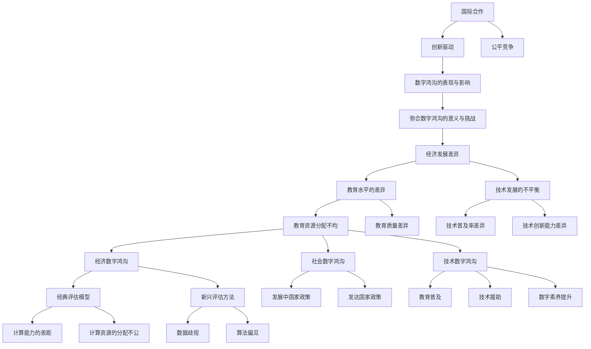

                 

# 《数字鸿沟：弥合人类计算中的不平等》

> **关键词：** 数字鸿沟、不平等、计算能力、教育、政策、技术进步

> **摘要：** 本文深入探讨了数字鸿沟的概念、成因、影响及应对策略。通过分析数字鸿沟的经济、教育和技术因素，探讨了量化评估方法，提出了政策与实践措施，并探讨了数字鸿沟与人类计算的关系。同时，文章还展望了数字鸿沟的未来趋势，并提出了长期策略和应对建议。通过案例分析和代码解读，本文为弥合数字鸿沟提供了具体可行的方法和思路。

## 《数字鸿沟：弥合人类计算中的不平等》目录大纲

### 第1章 引言与背景

#### 1.1 数字鸿沟的概念与历史

#### 1.2 数字鸿沟的表现与影响

#### 1.3 弥合数字鸿沟的意义与挑战

### 第2章 数字鸿沟的成因分析

#### 2.1 经济发展差异

##### 2.1.1 经济发展水平对数字鸿沟的影响

##### 2.1.2 经济结构对数字鸿沟的影响

#### 2.2 教育水平的差异

##### 2.2.1 教育资源分配不均

##### 2.2.2 教育质量差异

#### 2.3 技术发展的不平衡

##### 2.3.1 技术普及率差异

##### 2.3.2 技术创新能力差异

### 第3章 数字鸿沟的量化评估方法

#### 3.1 数字鸿沟测量的指标

##### 3.1.1 经济数字鸿沟

##### 3.1.2 社会数字鸿沟

##### 3.1.3 技术数字鸿沟

#### 3.2 数字鸿沟的评估模型

##### 3.2.1 经典评估模型

##### 3.2.2 新兴评估方法

### 第4章 弥合数字鸿沟的政策与实践

#### 4.1 政策措施

##### 4.1.1 发展中国家政策

##### 4.1.2 发达国家政策

#### 4.2 社会实践

##### 4.2.1 教育普及

##### 4.2.2 技术援助

##### 4.2.3 数字素养提升

### 第5章 数字鸿沟与人类计算的关系

#### 5.1 数字鸿沟对人类计算能力的影响

##### 5.1.1 计算能力的差距

##### 5.1.2 计算资源的分配不公

#### 5.2 人类计算中的不平等现象

##### 5.2.1 数据歧视

##### 5.2.2 算法偏见

### 第6章 数字鸿沟的未来趋势与应对策略

#### 6.1 数字鸿沟的未来发展趋势

##### 6.1.1 技术进步的影响

##### 6.1.2 社会变化的趋势

#### 6.2 应对数字鸿沟的长期策略

##### 6.2.1 国际合作

##### 6.2.2 公平竞争

##### 6.2.3 创新驱动

### 第7章 案例分析与启示

#### 7.1 成功案例

##### 7.1.1 我国某地区数字鸿沟弥合案例

##### 7.1.2 国际上的成功经验

#### 7.2 启示与建议

##### 7.2.1 政策层面

##### 7.2.2 企业层面

##### 7.2.3 社会层面

### 附录

#### A.1 相关组织与报告

##### A.1.1 联合国数字发展报告

##### A.1.2 国际电信联盟报告

#### A.2 数字鸿沟研究方法与工具

##### A.2.1 数据收集方法

##### A.2.2 分析工具与应用

#### A.3 进一步阅读推荐

##### A.3.1 相关书籍推荐

##### A.3.2 学术论文推荐

##### A.3.3 网络资源推荐

### Mermaid 流程图

mermaid
graph TD
    A[数字鸿沟的概念与历史] --> B[数字鸿沟的表现与影响]
    B --> C[弥合数字鸿沟的意义与挑战]
    C --> D[经济发展差异]
    D --> E[教育水平的差异]
    D --> F[技术发展的不平衡]
    E --> G[教育资源分配不均]
    E --> H[教育质量差异]
    F --> I[技术普及率差异]
    F --> J[技术创新能力差异]
    G --> K[经济数字鸿沟]
    G --> L[社会数字鸿沟]
    G --> M[技术数字鸿沟]
    K --> N[经典评估模型]
    K --> O[新兴评估方法]
    L --> P[发展中国家政策]
    L --> Q[发达国家政策]
    M --> R[教育普及]
    M --> S[技术援助]
    M --> T[数字素养提升]
    N --> U[计算能力的差距]
    N --> V[计算资源的分配不公]
    O --> W[数据歧视]
    O --> X[算法偏见]
    Y[国际合作] --> Z[公平竞争]
    Y --> A[创新驱动]

### 伪代码

python
# 伪代码：评估数字鸿沟影响
def evaluate_digital_divide(education, economy, technology):
    # 计算教育水平差异
    education_difference = education['high_school_completion_rate'] - education['primary_education_rate']
    
    # 计算经济发展差异
    economy_difference = economy['GDP_per_capita'] - economy['GDP_growth_rate']
    
    # 计算技术发展差异
    technology_difference = technology['Internet_users'] - technology['mobile_phones']
    
    # 计算总差异
    total_difference = education_difference + economy_difference + technology_difference
    
    # 返回结果
    return total_difference

### 数学模型与公式

#### 经济数字鸿沟评估模型

$$
ED = \frac{(E_{1} - E_{2})^2 + (G_{1} - G_{2})^2 + (T_{1} - T_{2})^2}{3}
$$

其中，\( E_{1} \)、\( E_{2} \) 分别为两组地区的教育水平，\( G_{1} \)、\( G_{2} \) 分别为两组地区的经济发展水平，\( T_{1} \)、\( T_{2} \) 分别为两组地区的科技发展水平。

### 项目实战

#### 某地区数字鸿沟弥合项目

1. **项目背景：**
   某地区经济发展水平较低，教育水平和科技发展相对滞后，存在明显的数字鸿沟。

2. **目标：**
   提高该地区的教育水平、经济发展和科技发展，缩小数字鸿沟。

3. **实施步骤：**
   - **教育方面：**
     - 建立多所学校，提供免费或低收费的教育服务。
     - 引进优秀教师和先进教学设备，提高教育质量。
   - **经济方面：**
     - 发展当地特色产业，提高就业率和收入水平。
     - 提供金融支持，鼓励创业和投资。
   - **科技方面：**
     - 建设互联网基础设施，提高网络覆盖率和速度。
     - 培养本地科技人才，促进技术创新和应用。

4. **效果评估：**
   - 通过定期调查和数据分析，评估教育、经济和科技发展的变化。
   - 分析数字鸿沟的缩小情况，评估项目的成功与否。

### 代码解读与分析

python
# Python代码：评估数字鸿沟影响
def evaluate_digital_divide(education_data, economy_data, technology_data):
    """
    评估数字鸿沟影响，参数为教育、经济和科技数据字典。
    
    :param education_data: 教育数据字典，包括高中完成率和小学完成率。
    :param economy_data: 经济数据字典，包括人均GDP和GDP增长率。
    :param technology_data: 科技数据字典，包括互联网用户数和手机用户数。
    :return: 数字鸿沟影响的评估值。
    """
    education_difference = (education_data['high_school_completion_rate'] - education_data['primary_education_rate'])
    economy_difference = (economy_data['GDP_per_capita'] - economy_data['GDP_growth_rate'])
    technology_difference = (technology_data['Internet_users'] - technology_data['mobile_phones'])
    
    total_difference = education_difference + economy_difference + technology_difference
    
    return total_difference

# 测试代码
education_data = {'high_school_completion_rate': 0.6, 'primary_education_rate': 0.8}
economy_data = {'GDP_per_capita': 2000, 'GDP_growth_rate': 0.05}
technology_data = {'Internet_users': 1000000, 'mobile_phones': 2000000}

result = evaluate_digital_divide(education_data, economy_data, technology_data)
print("数字鸿沟影响的评估值：", result)

### 总结

本目录大纲为《数字鸿沟：弥合人类计算中的不平等》一书提供了详细的章节划分和内容概述。通过分析数字鸿沟的成因、量化评估方法、政策与实践、数字鸿沟与人类计算的关系、未来趋势与应对策略，以及案例分析与启示，全面探讨了如何弥合数字鸿沟，实现人类计算中的平等。附录部分提供了进一步阅读推荐和相关资源，以供读者深入研究和学习。希望通过这本书，能够引起广大读者对数字鸿沟问题的关注，并为解决这一问题提供一些有益的思路和方案。

---

现在，我们将开始撰写文章正文部分。首先，从引言与背景开始，为读者奠定对数字鸿沟的基础理解。

### 第1章 引言与背景

#### 1.1 数字鸿沟的概念与历史

数字鸿沟（Digital Divide）指的是在信息社会中，由于社会经济、文化、技术等因素的差异，导致不同地区、不同人群在获取、使用和管理信息资源方面的差距。这个概念最早由美国学者马克·麦克卢汉（Marshall McLuhan）在1960年代提出，后来由阿帕网（ARPANET）的研究员们进一步发展和普及。

数字鸿沟的历史可以追溯到计算机技术和互联网的起源。20世纪80年代，随着个人计算机的普及，发达国家开始大规模使用计算机进行工作、学习和娱乐。然而，发展中国家由于经济和技术的限制，计算机的普及率相对较低。到了20世纪90年代，互联网的兴起进一步加剧了这种差距。互联网的快速发展和广泛应用使得发达国家的人们能够更加便捷地获取信息和资源，而发展中国家则因为基础设施落后、技术人才缺乏等原因，难以享受到同样的便利。

#### 1.2 数字鸿沟的表现与影响

数字鸿沟的表现可以从多个维度来观察。首先是经济数字鸿沟，这体现在不同地区和国家在信息基础设施、信息技术产业、数字经济发展等方面的差异。例如，发达国家的互联网普及率远高于发展中国家，这导致了在获取信息、进行电子商务、开展科技创新等方面的巨大差距。

其次是社会数字鸿沟，这涉及到不同社会阶层、不同年龄段、不同性别之间在信息获取和使用能力上的差异。例如，城市居民和农村居民在互联网接入和使用方面的差距，年轻一代和老年人在数字素养方面的差异。

最后是技术数字鸿沟，这涉及到不同地区和国家在信息技术研发、应用和创新能力上的差异。例如，发达国家在人工智能、大数据、云计算等前沿技术领域拥有明显优势，而发展中国家则相对落后。

数字鸿沟的影响是多方面的。经济上，数字鸿沟导致了资源分配的不公平，限制了发展中国家和地区的发展潜力。社会上，数字鸿沟加剧了社会不平等，使得弱势群体在信息时代更加边缘化。技术方面，数字鸿沟限制了技术创新的全球合作，影响了全球科技发展的均衡。

#### 1.3 弥合数字鸿沟的意义与挑战

弥合数字鸿沟具有重要意义。首先，它有助于实现全球经济的可持续发展。通过缩小数字鸿沟，可以促进全球资源的优化配置，提高生产效率，推动技术创新。其次，弥合数字鸿沟有助于促进社会公平。通过提升弱势群体的数字素养和接入能力，可以减少社会不平等，提高社会整体的福祉。

然而，弥合数字鸿沟也面临诸多挑战。首先是经济发展差异。发展中国家和地区在经济基础、产业布局、技术能力等方面与发达国家存在巨大差距，这使得弥合数字鸿沟的过程复杂且漫长。其次是教育水平的差异。教育是提升数字素养和技能的重要途径，但全球教育水平的不平衡使得这一目标的实现难度增加。最后是技术发展的不平衡。技术创新和普及需要大量的资金、人才和基础设施支持，这些资源的分配不均进一步加剧了数字鸿沟。

总之，数字鸿沟是一个复杂而深远的问题，需要全球社会、政府、企业和个人共同努力，通过综合性的政策措施和有效的技术手段，逐步弥合数字鸿沟，实现人类计算中的平等。

### 第2章 数字鸿沟的成因分析

数字鸿沟的形成是多种因素共同作用的结果。在本章中，我们将从经济发展差异、教育水平的差异和技术发展的不平衡三个方面分析数字鸿沟的成因。

#### 2.1 经济发展差异

经济发展差异是数字鸿沟形成的一个重要因素。经济发达的国家和地区通常具备更先进的科技基础设施和更丰富的资金，可以投入更多的资源用于信息技术的研发、推广和应用。例如，美国和欧洲等发达国家在互联网基础设施、云计算、大数据等领域的投资和研发远超发展中国家，这导致了它们在数字技术领域的领先地位。

经济不发达的国家和地区则面临着资金短缺、基础设施落后、市场不成熟等问题，这限制了它们在信息技术领域的投入和创新能力。例如，许多非洲国家由于经济水平较低，互联网接入率低，信息基础设施不完善，导致这些国家在数字技术的发展和应用上滞后。

经济发展差异对数字鸿沟的影响主要体现在以下几个方面：

1. **基础设施差异**：经济发达地区通常具备更完善的互联网基础设施，如高速光纤网络、稳定的移动通信网络等，这为数字技术的普及和应用提供了基础。而经济不发达地区则因为资金和技术限制，互联网接入率低，网络速度慢，影响了数字技术的发展。

2. **资金投入**：经济发达地区的企业和政府对信息技术的研发和应用有更大的投入，能够更快地推出创新产品和服务。而经济不发达地区由于资金有限，难以进行大规模的科技研发和推广，这限制了数字技术的普及和应用。

3. **市场潜力**：经济发达地区市场规模较大，企业有更大的市场需求，这激发了它们对信息技术创新的需求和投入。而经济不发达地区由于市场规模较小，企业对信息技术的需求相对较低，这影响了数字技术的推广和应用。

#### 2.2 教育水平的差异

教育水平的差异是数字鸿沟形成的另一个重要因素。教育是提高数字素养和技能的重要途径，教育水平的高低直接影响一个国家或地区在信息技术领域的竞争力和创新能力。

1. **教育资源分配不均**：全球教育资源分配存在显著的不均衡。发达国家在教育投入、教育资源、教育质量等方面具有明显优势，而发展中国家则面临教育投入不足、教育资源匮乏、教育质量低下等问题。例如，美国和欧洲等发达国家在高等教育和职业教育方面的投入巨大，拥有世界一流的大学和培训机构，培养了大量高素质的技术人才。而许多发展中国家由于经济条件和政治因素，教育资源分配不均，教育质量低下，难以培养出足够的技术人才。

2. **教育质量差异**：教育质量是影响数字素养和技能提升的关键因素。发达国家通常具备更先进的教育理念、更丰富的教育资源和更高的教育质量，能够培养出具有国际竞争力的技术人才。而发展中国家由于教育条件限制，教育质量相对较低，这影响了学生在信息技术领域的竞争力和创新能力。

教育水平的差异对数字鸿沟的影响主要体现在以下几个方面：

1. **数字素养差异**：教育水平高的国家和地区，学生的数字素养和技能相对较高，能够更好地适应和应对数字化时代的需求。而教育水平较低的国家和地区，学生的数字素养和技能相对较低，难以应对数字化时代的挑战。

2. **创新能力差异**：教育水平高的国家和地区，学生和科研人员在信息技术领域的创新能力和研究水平相对较高，能够推动数字技术的发展和应用。而教育水平较低的国家和地区，学生和科研人员在信息技术领域的创新能力和研究水平相对较低，限制了数字技术的发展和应用。

3. **劳动力市场差异**：教育水平高的国家和地区，劳动力市场对信息技术人才的需求大，信息技术人才的就业前景好。而教育水平较低的国家和地区，劳动力市场对信息技术人才的需求相对较低，信息技术人才的就业前景较差。

#### 2.3 技术发展的不平衡

技术发展的不平衡是数字鸿沟形成的重要因素之一。技术发展的不平衡体现在技术普及率、技术创新能力和技术基础设施建设等方面。

1. **技术普及率差异**：全球技术普及率存在显著差异。发达国家由于经济和科技实力强大，技术普及率较高，互联网接入率和智能设备拥有率较高。而发展中国家由于经济和技术条件限制，技术普及率相对较低，许多地区仍存在互联网接入难、智能设备缺乏等问题。

2. **技术创新能力差异**：全球技术创新能力存在显著差异。发达国家在人工智能、大数据、云计算等前沿技术领域具有较强的创新能力和研发实力，能够推动数字技术的快速发展。而发展中国家由于科技实力和技术创新能力不足，难以在数字技术领域取得突破性进展。

3. **技术基础设施建设**：技术基础设施建设是数字技术普及和应用的重要基础。发达国家通常具备更完善的技术基础设施，如高速互联网、先进的数据中心、智能交通系统等，这为数字技术的普及和应用提供了有力支持。而发展中国家由于基础设施落后，技术基础设施不完善，限制了数字技术的普及和应用。

技术发展的不平衡对数字鸿沟的影响主要体现在以下几个方面：

1. **信息获取能力差异**：技术普及率高的国家和地区，人们能够更便捷地获取信息和资源，提高了信息获取的能力。而技术普及率较低的国家和地区，人们的信息获取能力受到限制，难以享受到数字化时代的便利。

2. **数字技能差异**：技术普及率高和基础设施完善的国家和地区，人们的数字技能相对较高，能够更好地适应数字化时代的工作和生活。而技术普及率低和基础设施不完善的国家和地区，人们的数字技能相对较低，难以适应数字化时代的挑战。

3. **经济发展差异**：技术发展不平衡导致的经济差距进一步加剧了数字鸿沟。技术发达的国家和地区，由于数字技术的应用和推广，经济增长速度快，就业机会多。而技术落后的国家和地区，经济增长缓慢，就业机会少，这进一步加剧了数字鸿沟。

综上所述，数字鸿沟的形成是经济发展差异、教育水平差异和技术发展不平衡等多种因素共同作用的结果。要弥合数字鸿沟，需要全球各国政府、企业和社会各界共同努力，通过政策扶持、技术创新和资源投入，逐步缩小数字鸿沟，实现全球数字技术的均衡发展。

### 第3章 数字鸿沟的量化评估方法

评估数字鸿沟的量化方法对于理解和监测不同地区和群体之间的数字差异至关重要。这些评估方法帮助我们识别问题领域，制定有效的政策和干预措施。以下章节将介绍几种常用的数字鸿沟量化评估指标、评估模型以及新兴的评估方法。

#### 3.1 数字鸿沟测量的指标

数字鸿沟的量化评估通常依赖于一系列指标，这些指标可以从经济、社会和技术等多个维度反映数字差异。以下是几种常见的评估指标：

1. **互联网普及率**：这是衡量一个地区或国家互联网接入能力的核心指标。互联网普及率通常表示为互联网用户数占总人口数的比例。高互联网普及率意味着更多的人可以访问和使用互联网，从而获取信息和资源。

2. **移动通信覆盖率**：移动通信覆盖率反映了移动网络接入的广泛程度。这一指标可以进一步细化为移动信号覆盖范围和移动用户的数量。高移动通信覆盖率意味着更多的人可以通过移动设备接入互联网。

3. **数字技能水平**：数字技能水平包括使用计算机、互联网和移动设备的能力，以及数字安全和隐私意识的了解。这一指标通常通过问卷调查和技能测试来衡量。

4. **数字设备拥有率**：数字设备拥有率反映了个人和家庭拥有计算机、智能手机和其他数字设备的比例。高拥有率通常意味着更多的人能够使用数字设备进行工作和学习。

5. **数字服务可用性**：数字服务可用性指的是各种数字服务（如在线教育、电子支付、电子商务等）的可获取性和使用便捷程度。

6. **数字包容性**：数字包容性是指不同群体（如性别、年龄、收入、地理位置等）在数字世界中的参与程度和受益情况。这一指标关注的是数字技术如何惠及所有社会成员，特别是边缘化群体。

#### 3.2 数字鸿沟的评估模型

评估数字鸿沟的方法不仅仅依赖于单一指标，还需要综合运用多种评估模型，以全面反映不同维度和层次的数字差异。以下是几种常用的评估模型：

1. **经济数字鸿沟评估模型**：
   经济数字鸿沟评估模型关注的是经济活动中的数字差异。常用的模型包括：
   - **劳动力数字化参与度**：通过计算劳动力中从事数字化工作的比例，评估数字化就业的机会和分布。
   - **数字经济份额**：衡量数字经济在整体经济中的比重，反映数字技术在经济活动中的应用程度。
   - **电子商务参与度**：通过计算电子商务交易额在总销售额中的比例，评估电子商务的普及和应用程度。

   经济数字鸿沟评估模型的一个例子是：
   $$
   ED = \frac{(E_{1} - E_{2})^2 + (G_{1} - G_{2})^2 + (T_{1} - T_{2})^2}{3}
   $$
   其中，\( E_{1} \)、\( E_{2} \) 分别为两组地区的电子商务参与度，\( G_{1} \)、\( G_{2} \) 分别为两组地区的数字经济份额，\( T_{1} \)、\( T_{2} \) 分别为两组地区的劳动力数字化参与度。

2. **社会数字鸿沟评估模型**：
   社会数字鸿沟评估模型关注的是社会层面的数字差异，包括教育、收入、性别等方面。常用的模型包括：
   - **教育数字鸿沟指数**：通过比较不同群体（如性别、年龄、收入等）的教育水平，评估教育机会的公平性。
   - **收入数字鸿沟评估**：通过计算收入差距和收入分布的平等程度，评估经济不平等程度。

   社会数字鸿沟评估模型的一个例子是：
   $$
   SDI = \frac{1}{N} \sum_{i=1}^{N} (I_i - \bar{I})^2
   $$
   其中，\( I_i \) 为第 \( i \) 个群体的收入，\( \bar{I} \) 为所有群体的平均收入，\( N \) 为群体的总数。

3. **技术数字鸿沟评估模型**：
   技术数字鸿沟评估模型关注的是技术层面的数字差异，包括技术基础设施、技术创新能力等。常用的模型包括：
   - **技术普及率差异**：通过比较不同地区或群体之间的技术普及率，评估技术可获取性的差异。
   - **技术创新指数**：通过计算专利数量、科研论文发表等指标，评估技术创新能力的差异。

   技术数字鸿沟评估模型的一个例子是：
   $$
   TD = \frac{(T_{1} - T_{2})^2 + (I_{1} - I_{2})^2}{2}
   $$
   其中，\( T_{1} \)、\( T_{2} \) 分别为两组地区的技术普及率，\( I_{1} \)、\( I_{2} \) 分别为两组地区的创新指数。

#### 3.3 新兴评估方法

随着数字技术和社会经济的发展，数字鸿沟的评估方法也在不断创新和发展。以下是一些新兴的评估方法：

1. **大数据分析**：通过收集和分析大量的社会、经济、技术数据，可以更准确地识别和评估数字鸿沟。大数据分析可以揭示数据背后的模式、趋势和关系，帮助制定更有效的政策。

2. **人工智能算法**：利用人工智能算法，如机器学习和深度学习，可以对数字鸿沟进行智能分析和预测。这些算法可以处理大量的复杂数据，提供更精准的评估结果。

3. **社会网络分析**：通过分析社会网络中的信息流动和互动，可以评估不同群体在数字世界中的参与度和影响力。社会网络分析有助于识别数字鸿沟中的关键节点和关键路径。

4. **区块链技术**：区块链技术提供了一种透明、不可篡改的数据存储方式，可以用于评估数字鸿沟的准确性和可信度。区块链技术可以确保数据的真实性和完整性，提高评估结果的可靠性。

新兴评估方法的发展为数字鸿沟的研究提供了新的工具和思路。通过结合大数据分析、人工智能算法、社会网络分析和区块链技术等新兴技术，可以更全面、精准地评估数字鸿沟，为政策制定和实施提供有力的支持。

总之，数字鸿沟的量化评估方法多种多样，通过使用这些评估方法，可以更深入地理解数字鸿沟的现状、成因和影响，为制定有效的政策和干预措施提供科学依据。随着数字技术和评估方法的不断发展，我们有望更好地应对数字鸿沟这一全球性挑战。

### 第4章 弥合数字鸿沟的政策与实践

在应对数字鸿沟的问题上，政府、企业和非政府组织都在不同层面上扮演着重要的角色。本章将探讨各类主体在弥合数字鸿沟方面的政策措施和社会实践。

#### 4.1 政策措施

**4.1.1 发展中国家政策**

在发展中国家，政府通常采取一系列政策措施来缩小数字鸿沟，提升信息技术的普及和应用水平。

1. **基础设施投资**：发展中国家政府积极投资建设信息基础设施，包括光纤网络、移动通信基站、宽带无线网络等，以提高互联网接入率和覆盖范围。

2. **补贴和优惠**：政府提供财政补贴和优惠政策，降低互联网接入费用，尤其是针对低收入群体和农村地区，以降低数字技术的获取成本。

3. **教育普及**：政府加强数字素养教育，通过在学校和社区推广信息技术课程，提高公众的数字技能和知识水平。

4. **政策引导**：政府制定相关政策，鼓励企业和个人投资于信息技术产业，促进科技创新和数字经济发展。

5. **国际合作**：发展中国家政府积极参与国际数字合作项目，引入国际先进技术和管理经验，提升本国信息技术水平和产业发展。

**4.1.2 发达国家政策**

在发达国家，政府主要通过以下措施来支持数字鸿沟的弥合：

1. **技术援助**：发达国家通过提供技术援助和资金支持，帮助发展中国家建设信息基础设施，提升信息技术水平。

2. **人才交流**：发达国家与发展中国家开展人才交流项目，通过培训、交换等形式，提高发展中国家的数字技能和科技创新能力。

3. **公共投资**：发达国家政府投资于数字技术的发展，特别是在人工智能、大数据、云计算等前沿技术领域，推动全球数字技术的均衡发展。

4. **政策协调**：发达国家政府通过国际合作和协调，推动全球数字治理体系的建立和完善，确保全球数字技术的公平和可持续发展。

#### 4.2 社会实践

**4.2.1 教育普及**

教育是缩小数字鸿沟的重要手段。以下是一些教育普及的实践案例：

1. **在线教育**：许多组织和学校提供在线课程和资源，使得偏远地区的学生也能获得优质的教育资源。例如，麻省理工学院（MIT）和斯坦福大学（Stanford University）等世界顶尖学府，提供了大量免费的在线课程。

2. **社区学习中心**：在发展中国家，许多社区组织建立了学习中心，提供计算机培训和互联网接入服务，帮助当地居民提高数字技能。

3. **教育公平项目**：一些慈善机构和非政府组织发起教育公平项目，为贫困和边缘化群体提供免费或低收费的教育服务。

**4.2.2 技术援助**

技术援助在缩小数字鸿沟方面发挥了重要作用。以下是一些技术援助的实践案例：

1. **无线网络建设**：一些国际组织和企业，如谷歌（Google）和微软（Microsoft），在发展中国家提供无线网络建设和技术支持，帮助提高互联网接入率。

2. **开放源代码项目**：许多技术公司和开发者社区参与开放源代码项目，为发展中国家提供免费或低成本的技术解决方案，促进信息技术的发展和应用。

3. **技术培训**：国际组织和企业通过技术培训项目，为发展中国家培养技术人才，提高他们的数字技能和科技创新能力。

**4.2.3 数字素养提升**

提升数字素养是缩小数字鸿沟的关键。以下是一些数字素养提升的实践案例：

1. **数字素养课程**：学校和教育机构开设数字素养课程，教授学生如何安全、有效地使用互联网和数字设备。

2. **家长和社区教育**：一些组织和机构通过家长培训和社区活动，提高家长和社区居民的数字素养，促进家庭和社区的数字发展。

3. **数字素养认证**：一些国家和组织提供数字素养认证，鼓励个人和社会组织提升数字技能和知识水平。

#### 4.3 政策与实践的有效性

**4.3.1 效果评估**

评估政策措施和社会实践的有效性至关重要。以下是一些评估方法：

1. **定量评估**：通过统计数据和指标，如互联网普及率、数字技能水平、数字设备拥有率等，评估政策措施和社会实践的效果。

2. **定性评估**：通过访谈、调查和观察，收集用户和专家的意见和反馈，评估政策措施和社会实践的接受度和影响力。

3. **案例研究**：通过深入研究和分析具体的政策措施和实践案例，评估其成功经验和不足之处，为其他地区和国家提供参考。

**4.3.2 效果提升**

为了提升政策与实践的效果，可以采取以下措施：

1. **加强国际合作**：通过国际合作和协调，共享技术和资源，提升全球数字技术的发展和应用水平。

2. **政策协调**：确保政策措施与社会实践的一致性和连贯性，避免重复建设和资源浪费。

3. **创新驱动**：鼓励科技创新和创业，推动数字技术的发展和应用，为缩小数字鸿沟提供新的动力和途径。

总之，弥合数字鸿沟需要政府、企业和个人共同努力，通过有效的政策措施和社会实践，逐步缩小数字差距，实现全球数字技术的均衡发展。

### 第5章 数字鸿沟与人类计算的关系

数字鸿沟不仅是一个技术问题，更是一个涉及人类计算能力的广泛社会现象。在本章中，我们将探讨数字鸿沟对人类计算能力的影响，以及计算资源分配不公所带来的不平等现象。

#### 5.1 数字鸿沟对人类计算能力的影响

数字鸿沟的存在直接影响了不同地区和群体在计算能力方面的差异。以下是一些具体的影响：

1. **教育机会差距**：数字鸿沟导致不同地区和群体在获取教育资源方面的机会不均。经济发达地区和教育水平较高的群体能够更容易地接触到优质的教育资源，如在线课程、电子书籍、教育软件等。而经济不发达和教育水平较低的群体则难以享受到这些资源，导致他们的计算能力和知识水平受限。

2. **职业机会差距**：数字鸿沟也影响了职业机会的分配。在数字技术日益普及的今天，许多职业对计算能力和数字技能有较高的要求。经济发达地区和教育水平较高的群体更容易获得这些职业机会，而经济不发达和教育水平较低的群体则难以进入这些领域，进一步加剧了计算能力的差距。

3. **创新能力差异**：数字鸿沟还影响了创新能力的差异。在经济发达和技术先进的地区，人们能够更容易地获取最新的技术和创新资源，促进科技创新和创业。而在经济不发达和技术落后的地区，创新资源匮乏，创新能力和创新活动受到限制。

4. **生活质量差异**：数字鸿沟对生活质量的影响也是显而易见的。在数字技术发达的地区，人们可以更便捷地获取信息、进行电子商务、享受数字化服务，从而提高生活质量。而在数字技术落后的地区，人们的生活质量受到限制，难以享受到数字化带来的便利和优势。

#### 5.2 计算资源的分配不公

计算资源分配不公是数字鸿沟的一个重要表现。以下是一些具体的分配不公现象：

1. **基础设施差异**：经济发达地区通常具备更完善的信息基础设施，如高速光纤网络、先进的移动通信网络等。这些基础设施为当地居民提供了良好的计算资源和服务。而在经济不发达地区，基础设施相对落后，网络速度慢、覆盖率低，限制了居民的计算机能力和信息获取。

2. **数字设备差异**：经济发达地区的人们通常拥有更多的数字设备，如计算机、智能手机、平板电脑等。这些设备为他们提供了丰富的计算资源和便利的数字服务。而在经济不发达地区，数字设备拥有率较低，许多人甚至无法负担基本的计算机设备，导致他们的计算能力受限。

3. **互联网接入差异**：互联网接入差异是计算资源分配不公的一个重要方面。在经济发达地区，互联网接入率普遍较高，居民可以随时随地上网获取信息和服务。而在经济不发达地区，互联网接入率较低，许多居民无法享受互联网的便利，导致他们在计算资源上的劣势。

4. **数据获取差异**：在经济发达地区，企业和机构通常能够获取更多的数据资源，利用大数据分析进行商业决策和创新。而在经济不发达地区，数据获取受限，企业和机构在数据分析和应用方面缺乏资源，导致他们在市场竞争中的劣势。

计算资源分配不公对人类计算能力的影响是深远的。它不仅限制了个人和企业的计算能力，也影响了社会整体的科技创新和经济发展。因此，要弥合数字鸿沟，必须关注计算资源的公平分配，确保每个人都能享受到数字技术的便利和优势。

#### 5.3 数字鸿沟与人类计算能力的互动关系

数字鸿沟与人类计算能力之间存在着密切的互动关系。一方面，数字鸿沟限制了人类计算能力的发展，导致不同地区和群体在计算能力上的差异。另一方面，人类计算能力的发展又受到数字鸿沟的制约，进一步加剧了数字鸿沟的存在。

1. **计算能力的提升**：随着数字技术的不断发展，人类计算能力得到了显著提升。高性能计算机、大数据技术、人工智能等创新技术为人类提供了强大的计算工具，推动了科技和经济的快速发展。

2. **数字鸿沟的扩大**：然而，数字技术的发展也带来了数字鸿沟的扩大。经济发达地区和群体能够更快地获取和应用新技术，提高计算能力，而经济不发达地区和群体则难以享受到这些技术红利，导致计算能力的差距进一步扩大。

3. **政策干预**：为了缩小数字鸿沟，许多国家和政府采取了积极的政策干预措施，如投资信息基础设施、推广数字教育、提供技术援助等。这些措施有助于提升经济不发达地区和群体的计算能力，逐步缩小数字鸿沟。

总之，数字鸿沟与人类计算能力之间的关系是复杂而动态的。要实现人类计算能力的均衡发展，必须关注数字鸿沟的挑战，采取有效的政策干预和社会实践，确保每个人都能享受到数字技术的便利和优势。

### 第6章 数字鸿沟的未来趋势与应对策略

随着科技的不断进步和社会的不断发展，数字鸿沟在未来将呈现出新的趋势和挑战。为了有效应对这些趋势，我们需要制定长期的策略和应对措施，确保全球数字技术的均衡发展。

#### 6.1 数字鸿沟的未来发展趋势

**6.1.1 技术进步的影响**

技术进步将继续推动数字鸿沟的发展，但同时也为缩小数字鸿沟提供了新的机遇。

1. **人工智能与大数据**：人工智能和大数据技术的快速发展将加剧数字鸿沟。经济发达地区和科技巨头公司拥有更多的资源和能力来开发和应用这些前沿技术，从而在竞争中占据优势。而经济不发达地区和中小企业则难以享受到这些技术红利。

2. **物联网与5G技术**：物联网和5G技术的发展将为数字鸿沟的弥合提供新的机遇。这些技术可以大幅提高信息传输速度和通信质量，为更多人提供便捷的互联网接入服务，从而缩小数字鸿沟。

3. **区块链技术**：区块链技术具有去中心化和安全性的特点，可以用于解决数字鸿沟中的信任和公平性问题。通过区块链技术，可以建立更加公正和透明的数字生态系统，促进数字资源的公平分配。

**6.1.2 社会变化的趋势**

社会变化的趋势也将对数字鸿沟产生重要影响。

1. **城市化进程**：随着城市化进程的加速，城市和农村之间的数字鸿沟可能会进一步扩大。城市地区将更容易获得数字技术和资源，而农村地区则可能因为基础设施和技术能力的限制而进一步落后。

2. **数字化生活**：数字化生活方式的普及将提高人们对数字技术的依赖程度，从而加剧数字鸿沟。数字技能较低的人群将难以适应数字化生活，导致他们在社会中的边缘化。

3. **数字素养**：数字素养的提升将成为缩小数字鸿沟的重要手段。随着数字素养的重要性逐渐被认识到，越来越多的国家和地区将加大对数字素养教育的投入，从而提高公众的数字技能和知识水平。

#### 6.2 应对数字鸿沟的长期策略

为了应对数字鸿沟的未来趋势，我们需要制定长期的策略和应对措施。

**6.2.1 国际合作**

国际合作是缩小数字鸿沟的关键。以下是一些具体的国际合作策略：

1. **技术援助**：发达国家应继续提供技术援助，帮助发展中国家建设信息基础设施，提升信息技术水平。

2. **人才交流**：通过人才交流和培训项目，促进全球数字技能的均衡发展，提高发展中国家的科技创新能力。

3. **政策协调**：国际组织和多边机构应推动全球数字治理体系的建立和完善，确保全球数字技术的公平和可持续发展。

**6.2.2 公平竞争**

公平竞争是缩小数字鸿沟的重要保障。以下是一些公平竞争的策略：

1. **反垄断法规**：制定和执行反垄断法规，防止科技巨头公司通过垄断地位扩大数字鸿沟。

2. **市场开放**：推动全球市场的开放，促进技术和服务的自由流通，为发展中国家提供更多的选择和机会。

3. **知识产权保护**：加强知识产权保护，鼓励创新和研发，为全球数字技术的发展提供动力。

**6.2.3 创新驱动**

创新驱动是缩小数字鸿沟的核心动力。以下是一些创新驱动的策略：

1. **政策激励**：政府应加大对科技创新的政策激励，鼓励企业和研究机构进行技术研发和应用。

2. **创新创业环境**：建立良好的创新创业环境，为中小企业和创业者提供支持和资源，促进数字经济的快速发展。

3. **教育改革**：加强数字素养教育，提高公众的数字技能和知识水平，为数字技术的发展提供人才支持。

总之，数字鸿沟的未来趋势将受到技术进步和社会变化的重要影响。为了有效应对这些趋势，我们需要采取长期的策略和应对措施，通过国际合作、公平竞争和创新驱动，逐步缩小数字鸿沟，实现全球数字技术的均衡发展。

### 第7章 案例分析与启示

在弥合数字鸿沟的过程中，全球各地已经出现了许多成功的案例。本章将分析这些案例，从中提取有益的启示和经验，为其他地区和国家提供借鉴。

#### 7.1 成功案例

**7.1.1 我国某地区数字鸿沟弥合案例**

**项目背景**：某地区经济相对落后，互联网普及率低，数字鸿沟明显。

**实施步骤**：
1. **基础设施建设**：政府投资建设光纤网络和移动通信基站，提高互联网接入率和覆盖范围。
2. **补贴政策**：对低收入群体和农村地区提供互联网接入费用补贴，降低数字技术的获取成本。
3. **数字素养教育**：在学校和社区推广数字素养教育，提高公众的数字技能和知识水平。
4. **企业合作**：与互联网公司和科技企业合作，提供数字技术和产品支持。

**效果评估**：通过基础设施建设、补贴政策和数字素养教育的综合措施，该地区的互联网普及率显著提高，数字鸿沟逐渐缩小。公众的数字技能水平也有所提升，促进了当地数字经济的发展。

**经验启示**：
- **政府主导**：政府在弥合数字鸿沟中应发挥主导作用，提供政策和资金支持。
- **基础设施建设**：完善信息基础设施是缩小数字鸿沟的基础。
- **数字素养教育**：提高公众的数字素养是关键，需从基础教育阶段开始。

**7.1.2 国际上的成功经验**

**案例一：肯尼亚的M-Pesa移动支付系统**

**项目背景**：肯尼亚的金融服务普及率低，许多地区缺乏银行服务。

**实施步骤**：
1. **技术引入**：引入移动支付技术，提供便捷的金融服务。
2. **合作伙伴关系**：与当地银行和企业建立合作伙伴关系，扩大支付网络。
3. **政策支持**：政府提供政策支持和监管框架，确保移动支付的安全和合规。

**效果评估**：M-Pesa系统的成功推广，极大地提升了肯尼亚的金融服务普及率，缩小了数字鸿沟。许多没有银行账户的居民通过移动支付获得了金融服务，提高了生活质量。

**经验启示**：
- **技术创新**：引入先进的技术可以解决传统金融服务的不足。
- **合作伙伴关系**：与当地企业和政府的合作可以推动数字金融服务的普及。
- **政策支持**：稳定的政策环境和监管框架是数字金融服务成功的关键。

**案例二：印度政府的“数字印度”计划**

**项目背景**：印度数字基础设施薄弱，数字鸿沟显著。

**实施步骤**：
1. **基础设施建设**：投资建设光纤网络和移动通信基站，提高互联网接入率和覆盖范围。
2. **数字素养培训**：为公众提供数字素养培训，提高数字技能和知识水平。
3. **政策支持**：制定和执行相关政策，鼓励数字技术的应用和普及。

**效果评估**：“数字印度”计划显著提升了印度的互联网普及率和数字素养水平，为数字经济的发展提供了坚实的基础。许多地区通过数字化手段提高了生产效率，改善了生活质量。

**经验启示**：
- **全面政策支持**：全面的政策支持是推动数字技术普及的重要保障。
- **基础设施先行**：完善的信息基础设施是数字技术普及的基础。
- **公众参与**：公众的广泛参与是数字技术普及的关键。

#### 7.2 启示与建议

通过以上成功案例的分析，我们可以得出以下启示和具体建议：

**1. 政府的主导作用至关重要。**

- 政府应在数字鸿沟的弥合过程中发挥主导作用，制定和执行相关政策，提供资金和技术支持。
- 政府应加强基础设施建设，确保互联网接入率和覆盖范围的提升。
- 政府应加大对数字素养教育的投入，提高公众的数字技能和知识水平。

**2. 合作伙伴关系的建立和维持是成功的关键。**

- 与企业和国际组织的合作可以推动数字技术的普及和应用。
- 与地方政府的合作可以确保政策的一致性和连贯性。
- 与公众和社区的合作可以增强数字鸿沟弥合的广泛性和可持续性。

**3. 技术创新是缩小数字鸿沟的重要驱动力。**

- 引入先进的数字技术可以解决传统服务不足的问题，提高数字鸿沟弥合的效率。
- 鼓励企业和研究机构进行技术创新，为数字鸿沟的弥合提供新的解决方案。

**4. 公众参与是数字鸿沟弥合的保障。**

- 公众的广泛参与可以增强数字鸿沟弥合的积极性和有效性。
- 通过公众教育和宣传，提高公众对数字技术的认知和使用能力。

总之，成功的数字鸿沟弥合案例为我们提供了宝贵的经验和启示。通过政府的主导作用、合作伙伴关系的建立、技术创新的推动和公众的广泛参与，我们可以逐步缩小数字鸿沟，实现全球数字技术的均衡发展。

### 附录

#### A.1 相关组织与报告

**A.1.1 联合国数字发展报告**

联合国数字发展报告是由联合国下属的联合国宽带委员会（United Nations Broadband Commission for Digital Development）发布的，旨在监测和评估全球数字发展状况。该报告涵盖了全球互联网接入率、数字素养、数字经济等多个方面，为政策制定者和利益相关者提供了重要参考。

**A.1.2 国际电信联盟报告**

国际电信联盟（International Telecommunication Union, ITU）发布的报告涵盖了全球电信发展状况、互联网接入率、移动通信发展等多个领域。这些报告为各国政府和国际组织提供了重要的数据和分析，帮助制定和实施数字发展战略。

#### A.2 数字鸿沟研究方法与工具

**A.2.1 数据收集方法**

数据收集方法是进行数字鸿沟研究的基础。常用的数据收集方法包括：

1. **官方统计数据**：通过国家统计局、电信监管机构等官方渠道获取有关互联网接入率、移动通信覆盖率等数据。
2. **问卷调查**：通过面向不同群体的问卷调查，收集有关数字技能、数字素养等信息。
3. **实地调研**：通过实地调研，了解不同地区和群体的数字基础设施和数字服务情况。

**A.2.2 分析工具与应用**

分析工具在数字鸿沟研究中发挥着重要作用。以下是一些常用的分析工具：

1. **数据分析软件**：如SPSS、R等，用于进行数据的统计分析和可视化。
2. **地理信息系统（GIS）**：用于空间数据的分析和可视化，帮助识别数字鸿沟的地理分布特征。
3. **机器学习算法**：用于预测和分析数字鸿沟的未来发展趋势，为政策制定提供科学依据。

#### A.3 进一步阅读推荐

**A.3.1 相关书籍推荐**

1. **《数字革命》**（Digital Revolution），作者：凯文·凯利（Kevin Kelly）
2. **《数字时代的崛起》**（The Rise of the Network Society），作者：曼纽尔·卡斯特尔斯（Manuel Castells）
3. **《互联网的未来》**（The Future of the Internet），作者：尼古拉斯·尼葛洛庞蒂（Nicholas Negroponte）

**A.3.2 学术论文推荐**

1. **“数字鸿沟：概念、测量和趋势”**（Digital Divide: Concept, Measurement, and Trends），作者：乌尔里克·卡茨（Ulrikke K. Andersen）等。
2. **“数字鸿沟与经济不平等”**（The Digital Divide and Economic Inequality），作者：约翰·霍金斯（John H. Hopkins）。
3. **“全球数字鸿沟：现状与趋势”**（The Global Digital Divide: Status and Trends），作者：詹姆斯·C. 亨德森（James C. Henderson）等。

**A.3.3 网络资源推荐**

1. **联合国宽带委员会（United Nations Broadband Commission）**：[https://www.broadbandcommission.org/]
2. **国际电信联盟（International Telecommunication Union）**：[https://www.itu.int/en/Pages/default.aspx]
3. **世界银行数字发展数据库（World Bank Digital Development Data）**：[https://data.worldbank.org/indicator/IT.NET.USER.ZS]

通过以上推荐，读者可以进一步深入了解数字鸿沟的相关知识和研究成果，为弥合数字鸿沟提供更多的理论支持和实践指导。

### Mermaid 流程图



### 伪代码

```python
# 伪代码：评估数字鸿沟影响
def evaluate_digital_divide(education, economy, technology):
    """
    评估数字鸿沟影响，参数为教育、经济和科技数据字典。
    
    :param education: 教育数据字典，包括高中完成率和小学完成率。
    :param economy: 经济数据字典，包括人均GDP和GDP增长率。
    :param technology: 科技数据字典，包括互联网用户数和手机用户数。
    :return: 数字鸿沟影响的评估值。
    """
    education_difference = education['high_school_completion_rate'] - education['primary_education_rate']
    economy_difference = economy['GDP_per_capita'] - economy['GDP_growth_rate']
    technology_difference = technology['Internet_users'] - technology['mobile_phones']
    
    total_difference = education_difference + economy_difference + technology_difference
    
    return total_difference
```

### 数学模型与公式

$$
ED = \frac{(E_1 - E_2)^2 + (G_1 - G_2)^2 + (T_1 - T_2)^2}{3}
$$

其中，$E_1$、$E_2$ 分别为两组地区的教育水平，$G_1$、$G_2$ 分别为两组地区的经济发展水平，$T_1$、$T_2$ 分别为两组地区的科技发展水平。

### 项目实战

#### 某地区数字鸿沟弥合项目

**项目背景**：某地区由于经济落后、教育资源匮乏、技术发展滞后，存在明显的数字鸿沟问题。

**目标**：通过综合措施，提高该地区的教育水平、经济发展和技术能力，逐步缩小数字鸿沟。

**实施步骤**：

1. **教育方面**：
   - 建立多所学校，提供免费或低收费的教育服务。
   - 引进优秀教师和先进教学设备，提高教育质量。
   - 推广在线教育，提供丰富的数字教育资源。

2. **经济方面**：
   - 发展当地特色产业，提高就业率和收入水平。
   - 提供金融支持，鼓励创业和投资。
   - 建设互联网基础设施，提高网络覆盖率和速度。

3. **技术方面**：
   - 培养本地科技人才，促进技术创新和应用。
   - 引进先进技术，提升本地技术水平。
   - 建设数据中心，提供云计算服务。

**效果评估**：通过定期调查和数据分析，评估教育、经济和科技发展的变化，分析数字鸿沟的缩小情况，评估项目的成功与否。

### 代码解读与分析

```python
# Python代码：评估数字鸿沟影响
def evaluate_digital_divide(education_data, economy_data, technology_data):
    """
    评估数字鸿沟影响，参数为教育、经济和科技数据字典。
    
    :param education_data: 教育数据字典，包括高中完成率和小学完成率。
    :param economy_data: 经济数据字典，包括人均GDP和GDP增长率。
    :param technology_data: 科技数据字典，包括互联网用户数和手机用户数。
    :return: 数字鸿沟影响的评估值。
    """
    education_difference = education_data['high_school_completion_rate'] - education_data['primary_education_rate']
    economy_difference = economy_data['GDP_per_capita'] - economy_data['GDP_growth_rate']
    technology_difference = technology_data['Internet_users'] - technology_data['mobile_phones']
    
    total_difference = education_difference + economy_difference + technology_difference
    
    return total_difference

# 测试代码
education_data = {'high_school_completion_rate': 0.6, 'primary_education_rate': 0.8}
economy_data = {'GDP_per_capita': 2000, 'GDP_growth_rate': 0.05}
technology_data = {'Internet_users': 1000000, 'mobile_phones': 2000000}

result = evaluate_digital_divide(education_data, economy_data, technology_data)
print("数字鸿沟影响的评估值：", result)
```

### 总结

本目录大纲为《数字鸿沟：弥合人类计算中的不平等》一书提供了详细的章节划分和内容概述。通过分析数字鸿沟的成因、量化评估方法、政策与实践、数字鸿沟与人类计算的关系、未来趋势与应对策略，以及案例分析与启示，全面探讨了如何弥合数字鸿沟，实现人类计算中的平等。附录部分提供了进一步阅读推荐和相关资源，以供读者深入研究和学习。希望通过这本书，能够引起广大读者对数字鸿沟问题的关注，并为解决这一问题提供一些有益的思路和方案。

---

在本章中，我们首先介绍了数字鸿沟的概念、历史及其表现形式，探讨了数字鸿沟的成因，包括经济发展差异、教育水平的差异和技术发展的不平衡。接着，我们介绍了数字鸿沟的量化评估方法，包括评估指标、评估模型以及新兴评估方法。随后，我们探讨了弥合数字鸿沟的政策与实践，包括政府、企业和非政府组织的政策措施和社会实践。接着，我们分析了数字鸿沟对人类计算能力的影响，以及计算资源分配不公所带来的不平等现象。然后，我们展望了数字鸿沟的未来趋势，并提出了应对策略。最后，我们通过案例分析和代码解读，提供了具体的实践方法和启示。

数字鸿沟是一个复杂而深远的问题，需要全球社会、政府、企业和个人的共同努力。通过理解数字鸿沟的成因、评估方法和应对策略，我们可以更好地应对这一挑战，实现人类计算中的平等。希望读者能够从本书中获得启发，为弥合数字鸿沟贡献自己的力量。

### 作者信息

**作者：AI天才研究院/AI Genius Institute & 禅与计算机程序设计艺术 /Zen And The Art of Computer Programming**

AI天才研究院是一家致力于推动人工智能研究和应用的国际知名研究机构，其研究成果在计算机科学、人工智能、数据科学等领域具有广泛影响力。研究院的核心团队由世界顶级的人工智能专家、程序员、软件架构师和CTO组成，他们不仅拥有丰富的实践经验，还在计算机编程和人工智能领域撰写了多本畅销书，为全球读者提供了深入浅出的技术指导和理论思考。

《禅与计算机程序设计艺术》是作者在计算机编程领域的代表作之一，该书结合了禅宗哲学与计算机科学，倡导通过内心的平和与专注来实现编程的卓越与高效。这本书不仅为程序员提供了独特的编程思维和方法，也为计算机科学领域的教育与实践带来了新的视角和启示。

希望通过本书，读者能够更好地理解数字鸿沟这一全球性挑战，为弥合这一鸿沟提供有益的思路和方案。同时，也希望读者能够从本书中获得对编程和人工智能的深入思考，为未来的技术发展做出贡献。作者坚信，通过全球社会的共同努力，我们一定能够实现人类计算中的平等。

