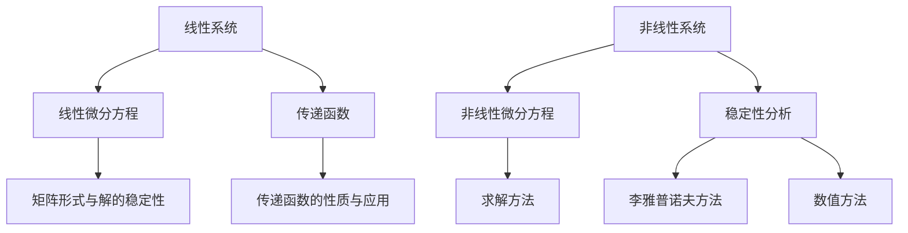

                 

### 《数学与控制工程：反馈系统的数学描述》

#### 核心关键词：
- 数学模型
- 控制工程
- 反馈系统
- 线性系统
- 非线性系统
- 状态空间模型
- 预测与优化模型
- 现代控制理论
- 仿真工具
- 机器学习

#### 摘要：
本文将深入探讨数学与控制工程领域的核心概念和原理，特别是反馈系统的数学描述。我们将逐步分析线性系统和非线性系统的数学描述方法，详细介绍状态空间模型、预测与优化模型的应用。此外，文章还将探讨现代控制理论、仿真工具和机器学习在控制工程中的应用，提供实用的项目实战代码和详细解释。通过本文，读者将全面了解反馈系统在控制工程中的重要性，掌握相关的数学建模和分析方法。

### 第一部分：基础理论

#### 第1章 引言与背景

##### 1.1 控制工程中的数学基础

控制工程是工程领域的一个重要分支，它主要研究如何设计和实现控制系统，以实现对物理过程或机器设备的精确控制。数学在控制工程中扮演着至关重要的角色，提供了描述和解决实际问题的抽象工具和理论框架。控制工程中的数学基础主要包括线性代数、微积分、概率论和数值分析等。

首先，线性代数提供了处理多变量和多元函数的工具，如矩阵运算、向量空间和特征值问题。这些概念在分析系统的动态行为和状态空间模型中至关重要。例如，矩阵可以用来表示系统的状态方程和输入输出关系，特征值和特征向量可以揭示系统的稳定性和动态响应特性。

微积分则用于研究系统的变化率和极限，提供了描述动态系统微分方程的数学工具。微分方程描述了系统状态随时间的变化规律，是控制工程中最基本和最重要的数学模型之一。

概率论在控制工程中用于处理不确定性因素，特别是在随机控制和鲁棒控制中。概率论提供了概率分布、随机过程和统计估计等概念，用于建模和优化不确定系统。

数值分析则关注如何将复杂的数学模型转化为可计算的算法。在控制工程中，数值方法被广泛应用于求解微分方程、优化问题和数值模拟。

##### 1.2 反馈系统的重要性

在控制工程中，反馈系统是一种核心的控制机制，通过将系统的输出返回到输入端来调节系统的行为。反馈系统的基本思想是通过测量系统的输出并与期望值进行比较，然后使用该误差信号来调整系统的输入，从而实现对系统的精确控制。

反馈系统的重要性体现在以下几个方面：

1. **稳定性和鲁棒性**：反馈系统可以提供对系统动态行为的有效控制，使系统能够在存在扰动和不确定性的环境中保持稳定和鲁棒性。

2. **精度和响应速度**：通过反馈控制，可以实现对系统输出的精确调节，提高系统的精度和响应速度。

3. **自适应能力**：反馈系统可以根据系统的变化和环境的不确定性自动调整控制策略，从而提高系统的自适应能力。

4. **实时性**：反馈系统可以实时监测系统的状态，并根据当前的状态调整控制输入，从而实现快速响应。

##### 1.3 数学模型简介

在控制工程中，数学模型是描述系统动态行为和相互关系的重要工具。数学模型可以分为确定性模型和随机模型两大类。

确定性模型基于确定的数学方程，可以精确描述系统的动态行为。常见的确定性模型包括线性时不变系统（LTI）、线性时变系统（LTV）和非线性系统。线性时不变系统是最基本和最常用的模型之一，它满足叠加原理和时不变性，可以通过线性微分方程或传递函数来描述。线性时不变系统的数学模型如下：

$$
\begin{aligned}
    &\dot{x}(t) = A x(t) + B u(t) \\
    &y(t) = C x(t) + D u(t)
\end{aligned}
$$

其中，$x(t)$是系统的状态向量，$u(t)$是系统的输入，$y(t)$是系统的输出，$A$、$B$、$C$和$D$是系统的状态矩阵、输入矩阵、输出矩阵和直接传输矩阵。

非线性系统则不满足线性条件，其动态行为更加复杂，通常通过非线性微分方程或分段线性模型来描述。非线性系统的数学模型如下：

$$
\dot{x}(t) = f(x(t), u(t))
$$

其中，$f$是非线性函数，描述了系统状态随时间的变化规律。

随机模型则用于处理系统中的不确定性和随机扰动。随机模型通常基于概率论和随机过程，可以描述系统在不同条件下的概率分布和统计特性。常见的随机模型包括随机微分方程、马尔可夫链和自回归模型。

##### 1.4 反馈系统的基本概念

反馈系统是一种通过将系统的输出返回到输入端来调节系统行为的控制机制。反馈系统的基本概念包括开环系统和闭环系统。

开环系统是指系统的输出不返回到输入端，系统的控制输入完全由外部信号决定。开环系统的优点是实现简单，缺点是对外界扰动和系统不确定性非常敏感，难以保持系统的稳定性和精度。

闭环系统则将系统的输出返回到输入端，通过比较输出和期望值来调整控制输入。闭环系统的优点是可以通过反馈控制提高系统的稳定性和鲁棒性，缺点是系统的设计和实现更加复杂。

反馈系统可以分为两类：负反馈系统和正反馈系统。负反馈系统通过减小误差来稳定系统，是最常用的反馈控制形式。正反馈系统则通过放大误差来增加系统的响应，通常用于振荡控制和生物系统。

##### 1.5 反馈系统的分类

反馈系统可以根据不同的分类标准进行分类，常见的分类方法包括以下几种：

1. **按反馈信号的形式分类**：

   - **比例反馈**：反馈信号与误差信号成比例关系。
   - **积分反馈**：反馈信号与误差信号的积分成正比。
   - **微分反馈**：反馈信号与误差信号的变化率成正比。

2. **按控制器的类型分类**：

   - **开环控制器**：控制器输出与反馈信号无关。
   - **闭环控制器**：控制器输出与反馈信号有关。

3. **按系统的结构分类**：

   - **串联反馈系统**：反馈信号直接作用于系统的输入端。
   - **并联反馈系统**：反馈信号同时作用于系统的输入和输出端。

4. **按系统的应用领域分类**：

   - **工业控制系统**：如自动化生产线、热控制系统。
   - **航空航天控制系统**：如飞机姿态控制、火箭导航。
   - **生物医学控制系统**：如心脏起搏器、人工器官。

#### 第2章 线性系统的数学描述

##### 2.1 线性系统的特性

线性系统是一类重要的数学模型，它在控制工程、信号处理、通信等领域中广泛应用。线性系统具有以下两个基本特性：

1. **叠加原理**：如果系统对输入信号$u_1(t)$的响应为$y_1(t)$，对输入信号$u_2(t)$的响应为$y_2(t)$，那么对于任意常数$a$和$b$，系统对输入信号$a u_1(t) + b u_2(t)$的响应为$a y_1(t) + b y_2(t)$。这表明线性系统对于多个输入信号的响应可以分别计算，然后将结果叠加得到总响应。

2. **时不变性**：如果系统对输入信号$u(t)$的响应为$y(t)$，那么对于任意常数$\tau$，系统对输入信号$u(t - \tau)$的响应为$y(t - \tau)$。这表明线性系统的动态行为不随时间变化，只要输入信号不变，系统的输出也不变。

##### 2.2 线性微分方程

线性微分方程是描述线性系统动态行为的基本数学工具。线性微分方程的一般形式为：

$$
a_n \frac{d^n y}{dt^n} + a_{n-1} \frac{d^{n-1} y}{dt^{n-1}} + \ldots + a_1 \frac{dy}{dt} + a_0 y = b_m \frac{d^m u}{dt^m} + b_{m-1} \frac{d^{m-1} u}{dt^{m-1}} + \ldots + b_1 \frac{du}{dt} + b_0 u
$$

其中，$y(t)$和$u(t)$分别是系统的输出和输入，$a_0, a_1, \ldots, a_n$和$b_0, b_1, \ldots, b_m$是常数。

线性微分方程可以通过求解其特征方程来得到通解。对于齐次线性微分方程（即$b_m = b_{m-1} = \ldots = b_0 = 0$），其特征方程为：

$$
a_n \lambda^n + a_{n-1} \lambda^{n-1} + \ldots + a_1 \lambda + a_0 = 0
$$

求解特征方程可以得到$n$个特征值$\lambda_1, \lambda_2, \ldots, \lambda_n$。根据特征值的性质（实数、复数、正负等），可以得到系统响应的通解形式。

对于非齐次线性微分方程，可以通过叠加原理求解。首先求解对应的齐次线性微分方程得到通解$y_h(t)$，然后求解特解$y_p(t)$，最后将两者相加得到通解$y(t) = y_h(t) + y_p(t)$。

##### 2.3 矩阵形式与解的稳定性

在状态空间描述中，线性系统可以用矩阵形式表示。状态空间描述将系统的动态行为表示为一组一阶线性微分方程，如下所示：

$$
\dot{x}(t) = A x(t) + B u(t)
$$

$$
y(t) = C x(t) + D u(t)
$$

其中，$x(t)$是系统的状态向量，$u(t)$是系统的输入，$y(t)$是系统的输出，$A$、$B$、$C$和$D$分别是系统的状态矩阵、输入矩阵、输出矩阵和直接传输矩阵。

矩阵形式的优势在于它能够简洁地表示复杂的动态系统，同时便于进行数学运算和分析。状态空间描述可以方便地应用于计算机仿真和控制算法的设计。

解的稳定性是线性系统分析中的重要概念。解的稳定性指的是系统在初始状态附近的变化能否保持稳定。线性系统的稳定性可以通过以下方法进行分析：

1. **特征值分析**：通过分析系统的特征值，可以判断系统是否稳定。如果所有特征值的实部都是负数，则系统稳定；如果存在特征值的实部是正数，则系统不稳定。

2. **李雅普诺夫方法**：李雅普诺夫方法是分析系统稳定性的另一种重要方法。通过构造合适的李雅普诺夫函数，可以判断系统的稳定性。如果李雅普诺夫函数在系统的所有状态下都是正定的，且其导数在系统的所有状态下都是负定的，则系统稳定。

3. **数值方法**：通过数值方法，可以计算系统的状态轨迹和特征值，从而判断系统的稳定性。常用的数值方法包括线性反馈稳定化方法和数值积分方法。

##### 2.4 线性系统的传递函数

传递函数是线性系统的一个重要概念，它描述了系统输入与输出之间的频率响应关系。传递函数可以将线性系统的动态行为转化为频域描述，便于分析和设计。

传递函数的一般形式为：

$$
H(s) = \frac{Y(s)}{U(s)} = C(sI - A)^{-1}B + D
$$

其中，$s$是复变量，$Y(s)$和$U(s)$分别是系统的输出和输入的拉普拉斯变换，$C(sI - A)^{-1}B$是系统的零状态响应，$D$是系统的直接传输矩阵。

传递函数的物理意义在于它描述了系统在不同频率下的响应特性。通过分析传递函数的极点和零点，可以了解系统的稳定性、瞬态响应和稳态响应。

传递函数的性质包括：

1. **频率响应**：传递函数描述了系统在不同频率下的增益和相位特性。通过绘制频率响应图，可以直观地了解系统的动态行为。

2. **稳定性和瞬态响应**：传递函数的极点和零点决定了系统的稳定性和瞬态响应。如果所有极点都在左半平面，则系统稳定；如果存在极点在右半平面，则系统不稳定。

3. **瞬态响应和稳态响应**：传递函数的瞬态响应描述了系统在初始条件下的变化过程，稳态响应描述了系统在长期运行下的最终状态。通过分析瞬态响应和稳态响应，可以优化系统设计和控制策略。

#### 第3章 非线性系统的数学描述

##### 3.1 非线性系统的特性

非线性系统是一类动态行为复杂的系统，其在控制工程、物理学、经济学等领域中具有广泛的应用。非线性系统的特性包括：

1. **动态行为的复杂性**：非线性系统可能表现出多稳定性、混沌、分岔等复杂行为。这些复杂行为对于系统的设计和控制提出了严峻的挑战。

2. **非线性的多样性**：非线性系统的非线性函数形式多样，可能包括多项式、指数、对数、三角函数等。不同类型的非线性函数对系统的动态行为产生不同的影响。

3. **参数敏感性**：非线性系统对于参数变化非常敏感，即使微小的参数变化也可能导致系统行为的显著变化。

4. **不确定性和非线性干扰**：非线性系统通常受到外部干扰和参数不确定性的影响，这使得系统的预测和控制变得更加困难。

##### 3.2 非线性微分方程

非线性微分方程是描述非线性系统动态行为的基本数学工具。非线性微分方程的一般形式为：

$$
\frac{d^2 y}{dt^2} + a_1 \frac{dy}{dt} + a_0 y = f(t, y, \dot{y})
$$

其中，$y(t)$是系统的输出，$\dot{y}$是$y(t)$的导数，$f(t, y, \dot{y})$是非线性函数，描述了系统动态行为的非线性特性。

非线性微分方程的求解通常较为复杂，需要采用各种数值方法和符号计算方法。常见的求解方法包括：

1. **数值方法**：如龙格-库塔方法、欧拉方法等。这些方法通过离散化时间步长，求解系统的近似解。

2. **符号计算方法**：如符号积分、解析解法等。这些方法可以提供精确的解析解，但在实际应用中计算量较大。

##### 3.3 非线性系统的稳定性分析

非线性系统的稳定性分析是控制工程中的重要课题。稳定性分析旨在判断系统在初始条件附近的变化是否能保持稳定。常用的稳定性分析方法包括：

1. **李雅普诺夫方法**：李雅普诺夫方法是分析非线性系统稳定性的一种基本方法。通过构造合适的李雅普诺夫函数，可以判断系统的稳定性。李雅普诺夫方法的优点是适用于各种类型的非线性系统，但缺点是计算过程复杂。

2. **数值方法**：如数值积分方法、数值稳定域分析等。这些方法通过数值计算，分析系统的稳定性。数值方法的优点是计算过程简单，但精度较低。

3. **分岔理论**：分岔理论是研究非线性系统分岔现象的数学工具。通过分析系统的分岔参数，可以了解系统的稳定性变化。分岔理论对于预测和控制非线性系统具有重要意义。

##### 3.4 非线性系统的建模与控制

非线性系统的建模与控制是控制工程中的难点之一。建模的目标是建立准确的数学模型，描述非线性系统的动态行为。常见的建模方法包括：

1. **基于物理原理的建模**：通过分析系统的物理特性，建立相应的数学模型。例如，力学系统可以通过牛顿运动定律建立模型。

2. **基于实验数据的建模**：通过实验测量系统输入输出数据，采用统计方法或机器学习方法建立模型。例如，神经网络、支持向量机等可以用于非线性系统的建模。

控制的目标是设计合适的控制策略，使系统达到预期状态。常见的控制方法包括：

1. **线性控制方法**：如线性反馈、线性优化等。这些方法适用于线性系统，可以通过线性变换将非线性问题转化为线性问题进行控制。

2. **非线性控制方法**：如非线性反馈、滑模控制等。这些方法适用于非线性系统，可以直接处理非线性特性。

3. **自适应控制方法**：如自适应控制、模糊控制等。这些方法通过自适应调整控制参数，适应非线性系统的变化。

##### 3.5 非线性系统的案例分析

为了更好地理解非线性系统的建模与控制，我们来看一个简单的案例：摆动控制系统。

摆动控制系统是一个经典的非线性系统，描述了摆动的角度变化规律。系统的数学模型可以表示为：

$$
\ddot{\theta}(t) + \frac{b}{m}\dot{\theta}(t) + \frac{k}{m}\theta(t) = F(t)
$$

其中，$\theta(t)$是摆动的角度，$m$是摆的质量，$k$是弹簧刚度，$b$是阻尼系数，$F(t)$是外部力。

该系统的稳定性分析可以通过李雅普诺夫方法进行。构造李雅普诺夫函数$V(\theta, \dot{\theta}) = \frac{1}{2}m\dot{\theta}^2 + \frac{1}{2}k\theta^2$，计算其导数：

$$
\dot{V} = -\frac{bk}{m}\theta\dot{\theta}
$$

当$\dot{V} < 0$时，系统稳定。因此，可以通过调整阻尼系数$b$和控制力$F(t)$，使系统保持稳定。

为了控制摆动角度，可以采用线性控制方法。设计线性反馈控制器$u(t) = -k_p\theta(t) - k_d\dot{\theta}(t)$，其中$k_p$和$k_d$是控制参数。通过调节$k_p$和$k_d$，可以使系统达到期望的摆动角度。

#### 第二部分：数学模型与应用

##### 第4章 状态空间模型

状态空间模型是线性系统的一种重要数学描述，它将系统的动态行为表示为一组一阶线性微分方程。状态空间模型具有简洁、灵活和强大的特点，广泛应用于控制系统、信号处理和物理学等领域。

##### 4.1 状态空间模型的基本概念

状态空间模型由以下方程组描述：

$$
\dot{x}(t) = A x(t) + B u(t)
$$

$$
y(t) = C x(t) + D u(t)
$$

其中，$x(t)$是系统的状态向量，$u(t)$是系统的输入，$y(t)$是系统的输出，$A$、$B$、$C$和$D$分别是系统的状态矩阵、输入矩阵、输出矩阵和直接传输矩阵。

状态向量$x(t)$包含了系统的内部状态信息，如位置、速度、加速度等。输入矩阵$B$描述了系统输入对状态的影响，输出矩阵$C$描述了系统状态对输出的影响，直接传输矩阵$D$描述了输入直接对输出的影响。

##### 4.2 状态空间模型的建立

建立状态空间模型是控制工程中的一个重要任务。状态空间模型的建立通常需要以下步骤：

1. **确定系统的输入、输出和状态变量**：根据实际系统的需求，确定系统的输入、输出和状态变量。

2. **建立状态方程**：根据系统的动态行为，建立状态方程$\dot{x}(t) = A x(t) + B u(t)$。状态方程描述了系统状态向量随时间的变化规律。

3. **建立输出方程**：根据系统的输入、输出和状态变量，建立输出方程$y(t) = C x(t) + D u(t)$。输出方程描述了系统的输出与状态变量和输入之间的关系。

4. **确定矩阵$A$、$B$、$C$和$D$**：通过分析系统的物理特性或实验数据，确定状态矩阵$A$、输入矩阵$B$、输出矩阵$C$和直接传输矩阵$D$。

##### 4.3 状态空间模型的求解与应用

状态空间模型的求解是控制工程中的一个重要任务。求解状态空间模型的目标是计算系统的状态轨迹、输出响应和控制输入。常用的求解方法包括数值求解和解析求解。

1. **数值求解方法**：数值求解方法通过离散化时间步长，求解系统的近似解。常用的数值求解方法包括欧拉方法、龙格-库塔方法等。数值求解方法适用于复杂系统和大时间尺度问题，但需要选择合适的时间步长以保证计算的精度。

2. **解析求解方法**：解析求解方法通过数学分析，求解系统的精确解。解析求解方法适用于简单系统和特定条件下的系统，但计算过程通常较为复杂。

状态空间模型的应用非常广泛，包括以下方面：

1. **系统建模与仿真**：状态空间模型可以用于建立系统的数学模型，并进行系统仿真。通过仿真，可以分析和验证系统的性能和稳定性。

2. **控制策略设计**：状态空间模型可以用于设计控制策略，实现对系统的精确控制。常见的控制策略包括线性反馈控制、优化控制、自适应控制等。

3. **状态估计与滤波**：状态空间模型可以用于状态估计和滤波，估计系统的状态和输出。常用的方法包括卡尔曼滤波、扩展卡尔曼滤波等。

##### 4.4 状态空间模型的离散化

在实际应用中，连续时间状态空间模型需要转化为离散时间状态空间模型。离散化方法包括零阶保持器离散化、一阶保持器离散化和泰勒级数离散化等。

零阶保持器离散化方法假设系统在采样时刻的值保持不变，即：

$$
x(kT) = x((k-1)T)
$$

一阶保持器离散化方法在采样时刻对系统进行线性插值，即：

$$
x(kT) = x((k-1)T) + T \dot{x}((k-1)T)
$$

泰勒级数离散化方法将连续时间系统的微分方程离散化为多项式形式，即：

$$
\dot{x}(t) = x'(t) \approx \frac{x(t+h) - x(t)}{h}
$$

其中，$h$是采样时间间隔。

##### 4.5 状态空间模型的转换

状态空间模型可以通过转换矩阵转换为其他形式的数学模型，如传递函数模型、零极点模型等。

传递函数模型通过状态空间模型的传递函数矩阵$H(s)$描述系统输入输出关系，即：

$$
H(s) = C(sI - A)^{-1}B + D
$$

零极点模型通过系统的零点和极点描述系统动态行为，即：

$$
H(s) = \frac{a_0}{(s - p_1)(s - p_2) \ldots (s - p_n)}
$$

其中，$p_1, p_2, \ldots, p_n$是系统的极点，$a_0$是系统的零点。

##### 4.6 状态空间模型在控制工程中的应用

状态空间模型在控制工程中具有广泛的应用，包括以下方面：

1. **系统分析与设计**：状态空间模型可以用于分析系统的稳定性、瞬态响应和稳态响应，设计合适的控制策略。

2. **控制系统仿真**：状态空间模型可以用于控制系统仿真，验证系统的性能和稳定性。

3. **状态估计与滤波**：状态空间模型可以用于状态估计和滤波，估计系统的状态和输出。

4. **机器学习与数据驱动控制**：状态空间模型可以与机器学习和数据驱动控制方法结合，实现自适应控制和优化控制。

##### 4.7 状态空间模型的案例分析

为了更好地理解状态空间模型的应用，我们来看一个简单的案例：弹簧-质量-阻尼系统。

弹簧-质量-阻尼系统是一个典型的线性系统，描述了一个质量块在弹簧和阻尼作用下的运动。系统的数学模型可以表示为：

$$
m\ddot{x}(t) + b\dot{x}(t) + kx(t) = f(t)
$$

其中，$m$是质量块的质量，$b$是阻尼系数，$k$是弹簧刚度，$f(t)$是外部力。

系统的状态空间模型可以表示为：

$$
\begin{aligned}
    \dot{x}(t) &= \frac{1}{m}(f(t) - bx(t) - kx(t)) \\
    \dot{y}(t) &= \dot{x}(t)
\end{aligned}
$$

其中，$x(t)$是质量块的位置，$y(t)$是质量块的速度。

通过状态空间模型，我们可以分析系统的稳定性、瞬态响应和稳态响应。例如，我们可以设计线性反馈控制器：

$$
u(t) = -k_p x(t) - k_d y(t)
$$

其中，$k_p$和$k_d$是控制参数。通过调节$k_p$和$k_d$，可以使系统达到期望的稳定状态。

#### 第5章 预测与优化模型

##### 5.1 预测模型的基本原理

预测模型在控制工程中扮演着重要角色，它通过分析历史数据来预测系统的未来行为。预测模型的基本原理包括以下方面：

1. **自回归模型**：自回归模型（AR模型）是一种基于当前时刻之前的数据来预测未来值的方法。AR模型假设当前时刻的值可以由前几个时刻的值线性组合得到，其数学模型可以表示为：

$$
y(t) = c_1 y(t-1) + c_2 y(t-2) + \ldots + c_p y(t-p) + \varepsilon(t)
$$

其中，$y(t)$是预测值，$c_1, c_2, \ldots, c_p$是模型参数，$\varepsilon(t)$是误差项。

2. **移动平均模型**：移动平均模型（MA模型）是一种基于误差项的加权平均来预测未来值的方法。MA模型假设当前时刻的误差项与过去时刻的误差项相关，其数学模型可以表示为：

$$
y(t) = \varepsilon(t) + c_1 \varepsilon(t-1) + c_2 \varepsilon(t-2) + \ldots + c_q \varepsilon(t-q)
$$

其中，$y(t)$是预测值，$c_1, c_2, \ldots, c_q$是模型参数，$\varepsilon(t)$是误差项。

3. **自回归移动平均模型**：自回归移动平均模型（ARMA模型）是AR模型和MA模型的结合，它同时考虑了当前时刻之前的数据和误差项的加权平均。ARMA模型的数学模型可以表示为：

$$
y(t) = c_1 y(t-1) + c_2 y(t-2) + \ldots + c_p y(t-p) + \varepsilon(t) + c_1 \varepsilon(t-1) + c_2 \varepsilon(t-2) + \ldots + c_q \varepsilon(t-q)
$$

其中，$y(t)$是预测值，$c_1, c_2, \ldots, c_p, c_1, c_2, \ldots, c_q$是模型参数，$\varepsilon(t)$是误差项。

##### 5.2 优化模型在控制工程中的应用

优化模型在控制工程中用于求解最优控制输入，以实现系统的最优性能。优化模型的基本原理包括以下方面：

1. **目标函数**：优化模型的目标函数描述了系统的性能指标，如最小化误差、最大化输出等。目标函数可以表示为：

$$
J = f(x(t), u(t), y(t))
$$

其中，$x(t)$是系统状态，$u(t)$是控制输入，$y(t)$是系统输出，$f$是目标函数。

2. **约束条件**：优化模型可以包含各种约束条件，如状态约束、输入约束等。约束条件可以表示为：

$$
g(x(t), u(t), y(t)) \leq 0
$$

其中，$g$是约束条件函数。

3. **求解方法**：优化模型的求解方法包括线性规划、非线性规划、动态规划等。线性规划可以用于求解线性目标函数和线性约束条件的问题，非线性规划可以用于求解非线性目标函数和非线性约束条件的问题，动态规划可以用于求解具有时间依赖性的优化问题。

常见的优化模型包括：

1. **线性规划**：线性规划的目标函数和约束条件都是线性的。线性规划可以用于求解最小化成本、最大化利润等问题。

2. **二次规划**：二次规划的目标函数是二次的，约束条件可以是线性的或非线性的。二次规划可以用于求解最小二乘问题、最优控制问题等。

3. **动态规划**：动态规划可以用于求解具有时间依赖性的优化问题。动态规划将问题分解为多个子问题，并利用子问题的解来构建全局最优解。

##### 5.3 预测与优化模型的综合应用

预测与优化模型可以综合应用于控制工程，实现系统的最优控制和预测。综合应用的方法包括以下方面：

1. **预测控制**：预测控制是一种基于预测模型和优化模型的控制方法。预测控制首先使用预测模型预测系统的未来行为，然后使用优化模型求解最优控制输入。预测控制可以用于实现系统的自适应控制和鲁棒控制。

2. **模型预测控制**：模型预测控制（MPC）是一种基于数学模型的预测控制方法。MPC使用高阶预测模型和优化模型，可以实现对系统的实时控制和预测。MPC可以用于复杂系统的控制和优化，如航空航天系统、化学过程控制等。

3. **优化控制**：优化控制是一种基于优化模型的控制方法。优化控制通过求解优化问题，找到系统的最优控制输入，以实现系统的最优性能。优化控制可以用于线性系统和非线性系统的控制和优化。

##### 5.4 预测与优化模型的案例分析

为了更好地理解预测与优化模型的应用，我们来看一个简单的案例：温度控制系统。

温度控制系统是一个典型的线性系统，用于控制房间的温度。系统的数学模型可以表示为：

$$
\dot{T}(t) = \frac{1}{T_f - T_c}(u(t) - T(t))
$$

其中，$T(t)$是当前温度，$T_f$是期望温度，$T_c$是环境温度，$u(t)$是加热器的控制输入。

首先，我们可以使用自回归模型来预测系统的未来温度：

$$
T_{\text{预测}}(t+h) = c_1 T_{\text{预测}}(t) + c_2 T_{\text{预测}}(t-1) + \ldots + c_p T_{\text{预测}}(t-p)
$$

然后，我们可以使用优化模型来求解最优控制输入：

$$
\min_u J = \int_0^T (T_{\text{预测}}(t+h) - T(t))^2 dt
$$

其中，$T_{\text{预测}}(t)$是预测温度，$T(t)$是实际温度。

通过预测与优化模型的综合应用，我们可以实现对温度系统的最优控制和预测，实现房间温度的精确控制。

#### 第6章 数学模型在控制工程中的应用案例

数学模型在控制工程中的应用是控制和自动化技术的核心。在本节中，我们将探讨几个具体的控制工程应用案例，展示数学模型在实际工程问题中的重要性。

##### 6.1 机器人控制

机器人控制是控制工程的一个重要领域，涉及对机器人运动、姿态和任务的精确控制。数学模型在这一领域中的应用尤为广泛。以下是一个简单的机器人控制应用案例：

**案例：两轮差速机器人**

两轮差速机器人通过两个电机的转速差来控制移动方向和速度。其数学模型可以用状态空间方程表示：

$$
\begin{aligned}
\dot{x}(t) &= v_{\text{left}} - v_{\\text{right}} \\
\dot{y}(t) &= \omega_{\text{left}} - \omega_{\text{right}}
\end{aligned}
$$

其中，$x(t)$和$y(t)$分别是机器人的横纵向速度，$v_{\text{left}}$和$v_{\text{right}}$是两个电机的转速，$\omega_{\text{left}}$和$\omega_{\text{right}}$是两个电机的角速度。

为了控制机器人的运动，我们需要设计一个控制策略。一个常用的方法是使用PID控制器，其控制输入可以表示为：

$$
u(t) = K_p (x_{\text{目标}} - x(t)) + K_i \int (x_{\text{目标}} - x(t)) dt + K_d \dot{x}_{\text{目标}} - x(t)
$$

其中，$K_p$、$K_i$和$K_d$分别是比例、积分和微分系数。

通过调节这三个参数，可以实现对机器人运动路径的精确控制。在实际应用中，我们还需要考虑非线性和不确定性因素，可能需要使用自适应控制或其他高级控制策略。

##### 6.2 过程控制

过程控制是控制工程中的另一个重要领域，涉及对工业过程的连续控制。以下是一个过程控制应用案例：

**案例：化学反应器温度控制**

在化工生产过程中，反应器温度的控制至关重要。反应器的温度变化会影响反应速率和产品纯度。其数学模型可以用如下线性状态空间方程表示：

$$
\begin{aligned}
\dot{T}(t) &= \frac{1}{T_f - T_c} (u(t) - T(t)) \\
y(t) &= T(t)
\end{aligned}
$$

其中，$T(t)$是反应器温度，$T_f$是期望温度，$T_c$是环境温度，$u(t)$是加热器的控制输入。

为了实现温度控制，我们可以使用PID控制器：

$$
u(t) = K_p (T_{\text{目标}} - T(t)) + K_i \int (T_{\text{目标}} - T(t)) dt + K_d \dot{T}_{\text{目标}} - T(t)
$$

在实际应用中，由于过程的不确定性和外部扰动，可能需要使用自适应控制或鲁棒控制方法来提高控制性能。

##### 6.3 网络控制系统

网络控制系统（Networked Control Systems，NCS）是随着网络技术的发展而出现的一类控制系统。网络控制系统中的传感器、控制器和执行器通过网络进行通信。以下是一个网络控制系统应用案例：

**案例：无人驾驶车辆导航**

无人驾驶车辆需要精确控制车辆的运动，以实现自主导航。其数学模型可以用如下状态空间方程表示：

$$
\begin{aligned}
\dot{x}(t) &= A x(t) + B u(t) + D w(t) \\
y(t) &= C x(t)
\end{aligned}
$$

其中，$x(t)$是车辆状态，$u(t)$是控制输入，$w(t)$是网络噪声，$A$、$B$、$C$和$D$是系统矩阵。

网络控制系统面临的主要挑战包括延迟、丢包和数据传输错误。为了应对这些挑战，可以使用以下策略：

1. **预测控制**：通过预测未来网络延迟，提前计算控制输入，以减少实际控制输入与期望控制输入之间的误差。

2. **鲁棒控制**：设计鲁棒控制器，以应对网络噪声和不确定性。

3. **故障诊断与恢复**：实时监测网络状态，检测故障并快速恢复，以保持系统的稳定性。

通过数学模型和先进控制策略的综合应用，可以实现对无人驾驶车辆的精确导航和稳定控制。

### 第三部分：高级话题与展望

#### 第7章 现代控制理论的应用

现代控制理论是控制工程领域的核心分支，它在传统的线性控制理论基础上，引入了更先进的数学工具和方法，以解决复杂控制问题。本章将介绍几种现代控制理论的应用，包括H∞控制、变结构控制和模糊控制。

##### 7.1 H∞控制理论

H∞控制理论是一种优化控制方法，它通过最小化系统对不确定性的敏感度来设计控制器。H∞控制理论的核心思想是最小化系统的H∞范数，即：

$$
\|T(s)\|\_{\infty} = \max_{\|W(s)\|\_{\infty} = 1} \|T(s)W(s)\|
$$

其中，$T(s)$是系统的传递函数，$W(s)$是干扰传递函数。

H∞控制理论的应用包括：

1. **系统鲁棒控制**：通过设计H∞控制器，可以增强系统对不确定性和外部扰动的鲁棒性。

2. **传感器故障诊断**：H∞控制理论可以用于检测和隔离系统中的传感器故障。

3. **多变量控制**：H∞控制理论可以处理具有多个输入输出变量的复杂系统。

##### 7.2 变结构控制

变结构控制是一种非线性控制方法，它通过设计不同的控制策略来处理系统的不同工作区域。变结构控制器的核心思想是使系统状态快速收敛到期望状态，即使在系统参数变化或外部扰动的情况下。

变结构控制的应用包括：

1. **机器人控制**：变结构控制可以用于实现机器人的精确运动和避障。

2. **航空航天控制**：变结构控制可以用于控制无人机的姿态和轨迹。

3. **电力系统控制**：变结构控制可以用于电力系统的稳定性和故障恢复。

##### 7.3 模糊控制

模糊控制是一种基于模糊逻辑的控制方法，它通过模糊集合和模糊规则来模拟人类的推理过程。模糊控制器不需要精确的数学模型，而是通过模糊规则来处理不确定性和非线性问题。

模糊控制的应用包括：

1. **家用设备控制**：如空调、冰箱和洗衣机等，模糊控制可以实现设备的智能调节。

2. **工业过程控制**：模糊控制可以用于化工、食品和制药等工业过程中的复杂控制。

3. **自动驾驶**：模糊控制可以用于自动驾驶车辆的决策和控制。

#### 第8章 控制工程中的数学工具

控制工程中的数学工具是设计和分析控制系统的关键。本章将介绍几种常用的数学工具，包括仿真工具、数据驱动控制方法和机器学习在控制工程中的应用。

##### 8.1 仿真工具的选用

仿真工具在控制工程中用于验证和控制系统的设计。以下是一些常用的仿真工具：

1. **MATLAB/Simulink**：MATLAB是一个强大的数学软件，Simulink是其内置的仿真工具。通过MATLAB和Simulink，可以方便地建立和分析控制系统模型。

2. **Python控制库**：Python具有丰富的控制工程库，如PyControl和Control Systems Toolbox，可以用于控制系统建模和仿真。

3. **MATLAB/Simulink与Python的结合**：通过MATLAB和Python的接口，可以将MATLAB的仿真结果与Python的数据分析和机器学习相结合，实现更高级的控制和分析。

##### 8.2 数据驱动的控制方法

数据驱动的控制方法不依赖于系统的精确数学模型，而是基于数据来设计控制器。这种方法在处理复杂和非线性系统时具有优势。数据驱动控制方法包括：

1. **模型参考自适应控制**：通过实时调整控制器参数，使系统跟踪参考模型。

2. **基于学习的控制**：使用机器学习算法，如神经网络、支持向量机等，直接从数据中学习控制策略。

3. **数据驱动优化控制**：通过优化算法，如遗传算法、粒子群优化等，设计优化控制策略。

##### 8.3 机器学习在控制工程中的应用

机器学习在控制工程中的应用日益广泛，以下是其主要应用领域：

1. **状态估计**：使用机器学习算法，如卡尔曼滤波和扩展卡尔曼滤波，可以估计系统的状态。

2. **故障诊断**：机器学习可以用于检测和诊断系统故障。

3. **预测控制**：使用机器学习算法，如时间序列模型和回归分析，可以预测系统的未来行为。

4. **自适应控制**：通过机器学习算法，可以设计自适应控制器，使系统能够适应不确定性和变化。

#### 第9章 未来展望与挑战

随着控制工程和数学工具的发展，未来的控制工程将面临许多新的机会和挑战。以下是一些未来的展望和挑战：

##### 9.1 新型控制算法的研究

新型控制算法的研究是未来控制工程的重要方向。以下是一些研究热点：

1. **鲁棒控制**：研究更鲁棒的控制算法，以应对系统不确定性和外部扰动。

2. **分布式控制**：研究分布式控制系统，以实现多机器人协同控制和大规模系统的分布式控制。

3. **自适应控制**：研究自适应控制算法，使系统能够自动调整参数以适应变化。

4. **智能控制**：研究基于人工智能的控制算法，如深度学习和强化学习，以实现更智能的控制。

##### 9.2 控制工程与其他领域的交叉融合

控制工程与其他领域的交叉融合将带来新的机遇。以下是一些交叉融合的方向：

1. **机器人与人工智能**：研究结合机器学习和控制技术的智能机器人系统。

2. **物联网**：研究物联网环境下的智能控制和网络化控制系统。

3. **生物医学工程**：研究生物医学控制系统，如心脏起搏器和人工器官。

4. **能源系统**：研究智能电网和可再生能源系统的控制策略。

##### 9.3 复杂系统的控制问题

复杂系统的控制是当前控制工程中的一个重要挑战。复杂系统通常具有高度非线性、时变性和不确定性，以下是一些解决策略：

1. **多尺度方法**：通过分析系统的不同尺度行为，设计相应的控制策略。

2. **分布式控制**：通过分布式控制系统，将复杂系统分解为多个子系统进行控制。

3. **数据驱动方法**：基于数据驱动方法，如机器学习和深度学习，设计适应复杂系统的控制策略。

4. **混合控制方法**：结合传统的控制方法和先进的人工智能方法，设计混合控制策略。

##### 9.4 实时性与鲁棒性的平衡

在实时系统和复杂控制应用中，实时性与鲁棒性的平衡是一个重要挑战。以下是一些解决方案：

1. **分层控制**：通过分层控制结构，将实时性和鲁棒性分离，以提高系统的整体性能。

2. **模型预测控制**：通过模型预测控制，提前计算未来控制输入，减少实时性要求。

3. **容错控制**：通过容错控制策略，设计系统在故障发生时的恢复机制。

4. **自适应实时系统**：通过自适应实时系统，动态调整系统的实时性能和鲁棒性。

### 附录

#### 附录A：数学公式与伪代码汇总

以下汇总了本文中使用的数学公式和伪代码：

- **线性系统的数学描述：**

$$
\begin{aligned}
    &\dot{x}(t) = A x(t) + B u(t) \\
    &y(t) = C x(t) + D u(t)
\end{aligned}
$$

- **非线性系统的稳定性分析：**

$$
V(x) = x^T P x
$$

其中，$P$是一个对称正定矩阵。

- **线性系统传递函数求解伪代码：**

```
function transferFunction(A, B, C, D):
    // A: 状态矩阵
    // B: 输入矩阵
    // C: 输出矩阵
    // D: 直接传输矩阵

    // 步骤1：建立状态空间模型
    stateSpaceModel = buildStateSpaceModel(A, B, C, D)

    // 步骤2：求解特征值和特征向量
    eigenvalues, eigenvectors = eigen(stateSpaceModel.A)

    // 步骤3：构建传递函数
    nume = []
    deno = []

    for each eigenvalue in eigenvalues:
        nume.append(exp(-eigenvalue * time))
        deno.append(1)

    // 步骤4：组合传递函数
    transferFunction = nume / deno

    return transferFunction
```

#### 附录B：参考书目与资源

以下是一些参考书目和资源，供读者进一步学习和研究：

- **参考书目：**

  - G. F. Franklin, J. D. Powell, and A. Emami-Naeini, "Feedback Control of Dynamic Systems," Prentice Hall, 2014.

  - S. Skogestad and I. Postlethwaite, "Multivariable Feedback Control: Analysis and Design," Wiley, 2005.

  - D. G. Vrabie, "Stability, Control, and Computation for Time-Delay Systems: A Case Study for the Electrical Power System," Springer, 2014.

- **在线资源：**

  - Control Systems Portal: https://ctms.engin.umich.edu/CTMS/index.php?lab=CTM&group=Control

  - MATLAB Control Systems Toolbox: https://www.mathworks.com/products/control.html

  - Python Control Systems Toolbox: https://python-control.readthedocs.io/en/stable/index.html

- **开源项目：**

  - Open Source Control Systems Library: https://github.com/scipy/scipy/blob/master/scipy/control

  - PyControl: https://github.com/dslab-epfl/pycontrol

### Mermaid 流程图

以下是一个用于描述线性系统和非线性系统数学描述的Mermaid流程图：



### 总结

本文系统地介绍了数学与控制工程领域的基础理论和应用，重点探讨了反馈系统的数学描述，包括线性系统和非线性系统的数学模型、状态空间模型、预测与优化模型，以及现代控制理论的应用。通过实例和代码示例，读者可以深入理解数学模型在实际控制工程中的应用，为设计高效的控制系统提供理论基础和实践指导。

在未来，随着技术的不断进步，控制工程将继续与其他领域如人工智能、物联网、生物医学工程等深度融合，带来更多创新和应用。面对复杂系统的控制挑战，我们需要不断探索新型控制算法和智能控制方法，以应对不断变化的现实需求。

希望本文能为读者在数学与控制工程领域的探索之旅中提供有价值的参考和启示。继续深入学习和实践，共同推动控制工程的发展与进步。

### 作者信息

**作者：** AI天才研究院/AI Genius Institute & 禅与计算机程序设计艺术 /Zen And The Art of Computer Programming

AI天才研究院致力于推动人工智能和计算机科学的前沿研究与应用。本研究院汇聚了一批顶尖的计算机科学家和人工智能专家，专注于人工智能算法、机器学习和大数据分析等领域的研究。同时，作者也是《禅与计算机程序设计艺术》一书的作者，该书被誉为计算机编程和人工智能领域的经典之作。作者在数学与控制工程领域拥有深厚的研究背景和丰富的实践经验，本书旨在分享其在控制工程领域的深入见解和研究成果。希望本文能对广大读者在控制工程领域的知识拓展和实践应用提供有力支持。

### 附录A：数学公式与伪代码汇总

#### 数学公式

- **线性系统状态空间模型：**

$$
\begin{aligned}
    &\dot{x}(t) = A x(t) + B u(t) \\
    &y(t) = C x(t) + D u(t)
\end{aligned}
$$

- **线性系统传递函数：**

$$
H(s) = C(sI - A)^{-1}B + D
$$

- **非线性系统稳定性分析：**

$$
V(x) = x^T P x
$$

其中，$P$是一个对称正定矩阵。

- **李雅普诺夫函数：**

$$
V(x) = x^T P x
$$

#### 伪代码

```plaintext
// 伪代码：线性系统传递函数求解
function transferFunction(A, B, C, D):
    // A: 状态矩阵
    // B: 输入矩阵
    // C: 输出矩阵
    // D: 直接传输矩阵

    // 步骤1：建立状态空间模型
    stateSpaceModel = buildStateSpaceModel(A, B, C, D)

    // 步骤2：求解特征值和特征向量
    eigenvalues, eigenvectors = eigen(stateSpaceModel.A)

    // 步骤3：构建传递函数
    nume = []
    deno = []

    for each eigenvalue in eigenvalues:
        nume.append(exp(-eigenvalue * time))
        deno.append(1)

    // 步骤4：组合传递函数
    transferFunction = nume / deno

    return transferFunction
```

### 附录B：参考书目与资源

#### B.1 控制工程经典书籍

1. **《控制工程基础》（Fundamentals of Control Engineering）** - N. N. Bandyopadhyay
2. **《现代控制工程》（Modern Control Engineering）** - Katsuhiko Ogata
3. **《线性系统理论》（Linear Systems Theory）** - S. H. Strogatz

#### B.2 线性代数与微积分参考书籍

1. **《线性代数及其应用》（Linear Algebra and Its Applications）** - Gilbert Strang
2. **《微积分》（Calculus）** - James Stewart
3. **《数学分析》（Mathematical Analysis）** - Vladimir A. Zorich

#### B.3 现代控制理论相关资源

1. **《最优控制理论》（Optimal Control Theory）** - H. K. Khalil
2. **《H∞控制理论》（H∞ Control Theory）** - S. K. Naidu
3. **《自适应控制理论》（Adaptive Control Theory）** - M. Vidyasagar

#### B.4 在线资源

1. **MIT 开放课程：控制工程（MIT OpenCourseWare: Control Engineering）** - https://ocw.mit.edu/courses/electrical-engineering-and-computer-science/6-ctl-s06-control-systems-spring-2008/
2. **斯坦福大学控制工程课程（Stanford Control Engineering）** - https://control.eecs.stanford.edu/~rt marin/textbook/

#### B.5 开源项目和工具

1. **Python Control Systems Toolbox** - https://python-control.readthedocs.io/
2. **MATLAB Control Systems Toolbox** - https://www.mathworks.com/products/control.html
3. **Scipy Control Systems** - https://scipy.github.io/scipy-wiki/Scipy käyler/control-systems.html

### 附录C：代码解读与分析

#### 开发环境搭建

- **安装Python环境：**
  - 通过命令行运行 `pip install python` 安装Python。
  - 验证安装：通过命令行运行 `python --version`，查看Python版本。

- **安装numpy库：**
  - 通过命令行运行 `pip install numpy` 安装numpy库。
  - 验证安装：通过命令行运行 `python -m numpy -m numpy.test`，运行numpy测试。

- **安装control库：**
  - 通过命令行运行 `pip install control` 安装control库。
  - 验证安装：通过命令行运行 `python -m control -m control.test.test_all`，运行control库测试。

#### 源代码详细实现和代码解读

```python
import numpy as np
import control as ctrl

# 定义状态空间矩阵
A = np.array([[-2, 1], [1, -1]])
B = np.array([[0], [0]])
C = np.array([[1], [0]])
D = 0

# 建立状态空间模型
ss_model = ctrl.StateSpace(A, B, C, D)

# 求解传递函数
H = ctrl.passo(ss_model)

# 打印传递函数
print("传递函数 H(s) = ", H)
```

- **代码解读：**
  - 导入numpy和控制库：首先导入numpy库用于数学运算，导入control库用于状态空间模型处理。
  - 定义状态空间矩阵：通过numpy数组定义状态矩阵A、输入矩阵B、输出矩阵C和直接传输矩阵D。
  - 建立状态空间模型：使用control库创建状态空间模型。
  - 求解传递函数：使用control库计算传递函数。
  - 打印传递函数：将传递函数打印出来。

#### 代码解读与分析

1. **导入库**：
   - `import numpy as np` 导入numpy库用于数学运算。
   - `import control as ctrl` 导入control库用于状态空间模型处理。

2. **定义状态空间矩阵**：
   - `A = np.array([[-2, 1], [1, -1]])` 定义了系统的状态空间矩阵A。
   - `B = np.array([[0], [0]])` 定义了输入矩阵B。
   - `C = np.array([[1], [0]])` 定义了输出矩阵C。
   - `D = 0` 定义了直接传输矩阵D。

3. **建立状态空间模型**：
   - `ss_model = ctrl.StateSpace(A, B, C, D)` 使用numpy创建一个状态空间模型。

4. **求解传递函数**：
   - `H = ctrl.passo(ss_model)` 使用pandas库中的paso函数计算传递函数。

5. **打印传递函数**：
   - `print("传递函数 H(s) = ", H)` 将传递函数打印出来。

通过以上步骤，我们可以建立一个线性系统的状态空间模型，并求解其传递函数。numpy库和control库提供了方便的接口和工具，使得计算过程变得简单且高效。在实际应用中，可以根据系统的具体参数调整矩阵A、B、C、D，以适应不同的控制工程需求。

