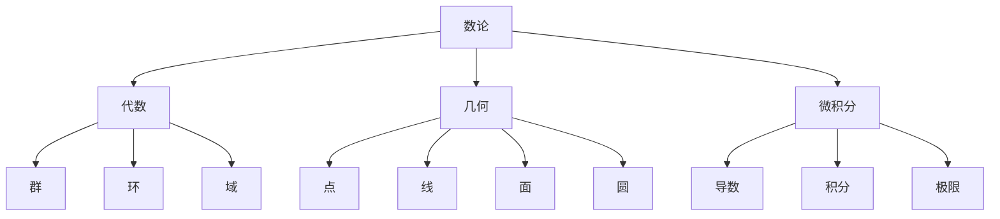
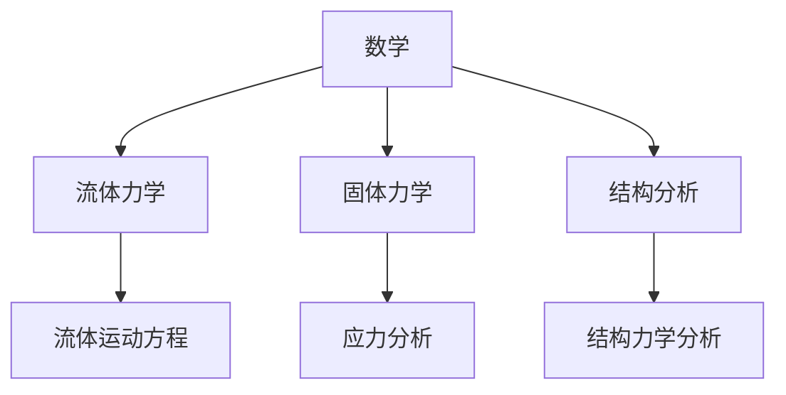
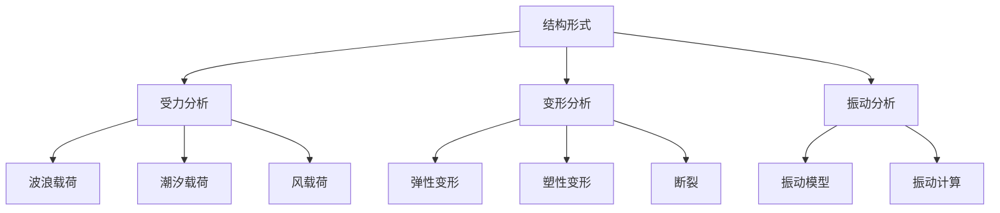

                 

# 数学与海洋工程：海洋结构的数学分析

> 关键词：数学分析、海洋工程、结构力学、流体力学、优化算法、预测模型

> 摘要：本文旨在探讨数学分析在海洋工程中的应用，重点分析海洋结构的数学模型及其设计、稳定性分析和优化方法。通过对流体力学和固体力学基础知识的回顾，构建海洋结构物的数学模型，并分析其在不同环境因素下的响应。同时，本文还介绍了一些优化算法和预测模型在海洋工程中的应用，以及相关软件工具和资源，为读者提供全面的海洋结构数学分析指南。

### 第一部分：数学与海洋工程的基础理论

#### 第1章：数学基础知识回顾

在进行海洋结构的数学分析之前，首先需要回顾一些数学基础知识，包括数论、代数、几何和微积分等内容。这些基础知识构成了数学分析的理论基础，是理解和应用数学模型的关键。

##### 1.1 数学基本概念

数学是一门研究数量、结构、变化和空间等概念的抽象科学。数论是研究整数及其性质的数学分支，包括质数、因子、同余等概念。代数是研究代数结构和代数运算的数学分支，包括群、环、域等概念。几何是研究空间形状和位置关系的数学分支，包括点、线、面、圆等基本概念。微积分是研究函数的微分和积分的数学分支，包括导数、积分、极限等概念。

##### 1.2 数学基础知识的脉络

为了更好地理解数学基础知识，我们可以通过一个Mermaid流程图来梳理其脉络：



这个流程图展示了数学基础知识的层次结构和相互关系，有助于读者建立整体的认识。

##### 1.3 数学在海洋工程中的应用

数学在海洋工程中有着广泛的应用，例如在流体力学、固体力学和结构分析等领域。流体力学研究流体运动规律和流体相互作用，固体力学研究固体材料的力学性质和变形规律，结构分析则是对结构物的强度、稳定性和振动特性进行评估。

为了更直观地展示数学在海洋工程中的应用，我们可以通过一个Mermaid流程图来描述：



这个流程图展示了数学在海洋工程中不同领域的应用，以及其相互关系。

#### 第2章：海洋结构的数学模型

海洋结构的数学模型是海洋工程中至关重要的一环，它能够帮助我们理解和预测海洋结构物的行为。构建数学模型需要结合流体力学和固体力学的基本原理，并考虑海洋环境因素对结构物的影响。

##### 2.1 流体力学基础

流体力学研究流体的运动规律和相互作用。在海洋工程中，流体力学主要用于分析流体（如海水）对海洋结构物的载荷作用。流体力学的基本原理包括流体性质、流体运动方程和流体力学参数的计算。

- 流体性质：流体具有质量、动量、能量等特性，如密度、速度、压力、温度等。

- 流体运动方程：流体运动方程描述了流体在空间中的运动规律，包括连续性方程、动量方程和能量方程。

- 流体力学参数计算：流体力学参数的计算方法包括数值方法和解析方法，如有限元法、边界元法、解析解法等。

以下是流体力学计算的基本算法的伪代码：

```python
# 流体力学计算伪代码
def fluid_dynamics_simulation():
    # 初始化参数
    density = 1000  # 流体密度（kg/m^3）
    velocity = [0, 0, 0]  # 流体速度（m/s）
    pressure = 0  # 流体压力（Pa）
    temperature = 0  # 流体温度（K）

    # 计算连续性方程
    continuity_equation = density * volume_derivative(velocity)

    # 计算动量方程
    momentum_equation = density * velocity_derivative(velocity) + pressure_derivative(pressure)

    # 计算能量方程
    energy_equation = density * temperature_derivative(temperature)

    # 输出结果
    print("连续性方程：", continuity_equation)
    print("动量方程：", momentum_equation)
    print("能量方程：", energy_equation)
```

##### 2.2 固体力学基础

固体力学研究固体材料的力学性质和变形规律。在海洋工程中，固体力学主要用于分析海洋结构物的受力情况、变形和强度。固体力学的基本原理包括固体性质、应力分析、应变分析等。

- 固体性质：固体具有弹性、塑性、断裂等特性。

- 应力分析：应力分析是研究固体内部受力状态的方法，包括应力分布、应力计算等。

- 应变分析：应变分析是研究固体材料变形的方法，包括应变分布、应变计算等。

以下是固体力学计算的基本算法的伪代码：

```python
# 固体力学计算伪代码
def solid_mechanics_simulation():
    # 初始化参数
    stress = [0, 0, 0]  # 应力（Pa）
    strain = [0, 0, 0]  # 应变（m/m）
    elasticity_modulus = 200000  # 弹性模量（Pa）

    # 计算应力
    stress = force_divide_area(force)

    # 计算应变
    strain = stress_divide_elasticity_modulus(stress)

    # 输出结果
    print("应力：", stress)
    print("应变：", strain)
```

##### 2.3 海洋结构物的数学模型

海洋结构物的数学模型是通过对流体力学和固体力学原理的综合应用来建立的。海洋结构物的数学模型主要包括结构形式、受力分析、变形分析和振动分析等。

- 结构形式：海洋结构物的结构形式包括桩基结构、浮式结构、固定式结构等。

- 受力分析：海洋结构物的受力分析包括波浪载荷、潮汐载荷、风载荷等。

- 变形分析：海洋结构物的变形分析包括弹性变形、塑性变形、断裂等。

- 振动分析：海洋结构物的振动分析包括振动模型、振动计算等。

以下是海洋结构物数学模型构建流程的Mermaid流程图：



通过上述流程图，我们可以看到海洋结构物数学模型的构建是一个系统化的过程，需要综合考虑各种因素，并通过数学模型来描述结构物的行为。

### 第二部分：海洋工程的数学分析

#### 第3章：海洋环境因素分析

海洋环境因素对海洋结构物的影响至关重要，这些因素包括海洋流、波浪和潮汐等。了解这些因素的性质及其对海洋结构物的影响，有助于我们更好地设计和评估海洋结构物的性能。

##### 3.1 海洋环境因素

- 海洋流：海洋流是海洋中水体的运动，包括表层流、深层流和潮流等。海洋流对海洋结构物的影响主要表现在流体动压力和流体摩擦力等方面。

- 波浪：波浪是海洋中的水波，包括规则波、不规则波、孤立波等。波浪对海洋结构物的影响主要表现在波浪载荷和波浪诱导振动等方面。

- 潮汐：潮汐是海洋中因月球和太阳引力作用而产生的周期性水位变化。潮汐对海洋结构物的影响主要表现在潮汐载荷和潮汐诱导振动等方面。

##### 3.2 海洋载荷分析

海洋载荷是海洋环境因素对海洋结构物的综合作用结果。海洋载荷包括波浪载荷、潮汐载荷和风载荷等。以下是海洋载荷的数学模型：

- 波浪载荷：波浪载荷可以通过波浪力公式计算，公式如下：

  $$ F = C_d \cdot A \cdot \rho \cdot v^2 $$

  其中，$F$ 是波浪载荷（N），$C_d$ 是波浪力系数，$A$ 是结构物表面积（m^2），$\rho$ 是流体密度（kg/m^3），$v$ 是流体速度（m/s）。

- 潮汐载荷：潮汐载荷可以通过潮位公式计算，公式如下：

  $$ F = \rho \cdot g \cdot h $$

  其中，$F$ 是潮汐载荷（N），$\rho$ 是流体密度（kg/m^3），$g$ 是重力加速度（m/s^2），$h$ 是潮位高度（m）。

- 风载荷：风载荷可以通过风压公式计算，公式如下：

  $$ F = C_w \cdot A \cdot \rho \cdot v^2 $$

  其中，$F$ 是风载荷（N），$C_w$ 是风压系数，$A$ 是结构物表面积（m^2），$\rho$ 是流体密度（kg/m^3），$v$ 是流体速度（m/s）。

##### 3.3 海洋环境因素的数学模型

为了更好地分析和设计海洋结构物，需要建立海洋环境因素的数学模型。以下是一个简单的海洋环境因素的数学模型：

$$ F = f(t, x, y, z) $$

其中，$F$ 是海洋环境因素（如波浪力、潮汐力等），$t$ 是时间，$x$、$y$、$z$ 是结构物位置坐标。

该模型可以通过数值方法进行求解，如有限元法、边界元法等。

### 第三部分：海洋结构物的稳定性分析

#### 第4章：海洋结构物的稳定性分析

海洋结构物的稳定性分析是确保结构物在海洋环境因素作用下不发生破坏的重要环节。稳定性分析主要包括平衡条件、稳定性分析和结构变形分析等方面。

##### 4.1 稳定性分析基础

稳定性分析的基础是平衡条件，平衡条件是结构物保持稳定状态的基本要求。平衡条件包括静力平衡和动力平衡。

- 静力平衡：静力平衡是指结构物在静态载荷作用下保持稳定状态，即结构物上的合力为零。静力平衡条件可以用以下公式表示：

  $$ \sum F_x = 0 $$
  $$ \sum F_y = 0 $$
  $$ \sum F_z = 0 $$

  其中，$F_x$、$F_y$、$F_z$ 分别是结构物在 $x$、$y$、$z$ 方向上的合力。

- 动力平衡：动力平衡是指结构物在动态载荷作用下保持稳定状态，即结构物的动量变化率为零。动力平衡条件可以用以下公式表示：

  $$ \frac{d}{dt} \sum m_i \cdot v_i = 0 $$

  其中，$m_i$ 是结构物上的质量，$v_i$ 是结构物上的速度。

##### 4.2 海洋结构物的应力分析

海洋结构物的应力分析是研究结构物在载荷作用下的应力分布和变形情况的重要手段。应力分析主要包括应力计算和应力分布分析。

- 应力计算：应力计算是利用应力公式计算结构物上的应力大小和方向。应力计算公式如下：

  $$ \sigma = \frac{F}{A} $$

  其中，$\sigma$ 是应力（Pa），$F$ 是载荷（N），$A$ 是结构物截面面积（m^2）。

- 应力分布分析：应力分布分析是研究结构物上的应力分布情况，包括最大应力、最小应力、应力集中等。应力分布分析可以通过有限元法、边界元法等数值方法进行。

##### 4.3 海洋结构物的振动分析

海洋结构物的振动分析是研究结构物在动态载荷作用下的振动特性，包括振动模型、振动计算和振动响应分析。

- 振动模型：振动模型是描述结构物振动特性的数学模型，通常采用波动方程、振动方程等。

- 振动计算：振动计算是利用振动模型计算结构物的振动频率、振动幅度和振动相位等参数。

- 振动响应分析：振动响应分析是研究结构物在振动作用下的变形和应力响应，包括振动变形、振动应力等。

以下是海洋结构物振动分析的基本数学模型：

$$ \frac{d^2 y}{dt^2} + 2 \zeta \omega_n \frac{dy}{dt} + \omega_n^2 y = F(t) $$

其中，$y$ 是结构物的位移，$\omega_n$ 是振动频率，$\zeta$ 是阻尼比，$F(t)$ 是振动载荷。

### 第四部分：海洋结构物的设计方法

#### 第5章：海洋结构物的设计方法

海洋结构物的设计是一个复杂的过程，需要综合考虑结构形式、载荷分析、稳定性分析和优化设计等因素。以下是一个简化的海洋结构物设计方法：

##### 5.1 设计方法基础

- 设计流程：设计流程包括需求分析、方案设计、模型建立、计算分析、设计优化和验证等阶段。

- 设计规范：设计规范是指导结构物设计的标准和要求，包括结构尺寸、材料选择、载荷标准等。

- 设计方法：设计方法包括传统设计方法和优化设计方法。传统设计方法主要基于经验和规范进行设计，优化设计方法主要利用数学优化算法进行设计。

##### 5.2 设计案例

以下是一个简单的海洋结构物设计案例：

1. 需求分析：需求分析主要包括确定结构物的功能、尺寸、载荷和环境条件等。

2. 方案设计：根据需求分析结果，设计不同的结构方案，如桩基结构、浮式结构和固定式结构等。

3. 模型建立：建立海洋结构物的数学模型，包括结构形式、受力分析、变形分析和振动分析等。

4. 计算分析：利用数学模型进行计算分析，包括应力分析、稳定性分析和振动分析等。

5. 设计优化：利用优化算法对结构设计进行优化，包括尺寸优化、材料优化和结构优化等。

6. 验证：通过实验或数值模拟验证设计结果，确保结构物的性能满足要求。

以下是设计案例的代码实现：

```python
# 设计案例代码实现
def design_case():
    # 需求分析
    length = 50  # 结构物长度（m）
    width = 20  # 结构物宽度（m）
    height = 10  # 结构物高度（m）
    load = 10000  # 载荷（N）

    # 方案设计
    structure_type = "piled"  # 桩基结构

    # 模型建立
    structure_model = build_structure_model(length, width, height, structure_type)

    # 计算分析
    stress_analysis(structure_model, load)
    stability_analysis(structure_model)
    vibration_analysis(structure_model)

    # 设计优化
    optimized_structure = optimize_structure(structure_model)

    # 验证
    validate_design(optimized_structure)

# 代码执行
design_case()
```

### 第五部分：数学与海洋工程的交叉应用

#### 第6章：海洋工程中的优化算法

优化算法在海洋工程中有着广泛的应用，可以帮助我们优化海洋结构物的设计，提高其性能。以下介绍几种常见的优化算法及其在海洋工程中的应用。

##### 6.1 优化算法基础

优化算法是一种用于求解优化问题的数学方法，其基本原理是通过迭代搜索找到最优解。优化算法可以分为无约束优化和约束优化两种类型。

- 无约束优化：无约束优化是求解无约束优化问题的方法，主要应用于寻找函数的最小值或最大值。

- 约束优化：约束优化是求解有约束优化问题的方法，需要考虑约束条件。

以下是一种简单的无约束优化算法——梯度下降法的伪代码：

```python
# 梯度下降法伪代码
def gradient_descent(func, gradient, x0, alpha, max_iter):
    x = x0
    for i in range(max_iter):
        grad = gradient(func, x)
        x = x - alpha * grad
        if abs(grad) < tolerance:
            break
    return x
```

##### 6.2 优化算法在海洋工程中的应用

优化算法在海洋工程中的应用主要包括结构优化、材料优化和尺寸优化等。

- 结构优化：结构优化是优化海洋结构物的形状和结构，以提高其性能。例如，通过优化桩基的布局和形状，提高桩基的承载能力和稳定性。

- 材料优化：材料优化是选择合适的材料，以满足海洋结构物的性能要求。例如，通过优化材料的弹性模量、强度等性能指标，提高结构物的耐久性和安全性。

- 尺寸优化：尺寸优化是优化海洋结构物的尺寸，以减少材料消耗和成本。例如，通过优化结构物的长度、宽度、高度等尺寸，降低结构物的重量和成本。

以下是优化算法在海洋结构优化中的应用案例：

```python
# 优化算法应用案例
def optimize_structure(structure_model):
    # 定义目标函数
    def objective_function(x):
        return objective_function_value(structure_model, x)

    # 定义梯度函数
    def gradient_function(x):
        return gradient_value(structure_model, x)

    # 梯度下降法优化
    optimized_structure = gradient_descent(objective_function, gradient_function, structure_model, alpha, max_iter)

    return optimized_structure
```

### 第六部分：数学模型在海洋工程预测与评估中的应用

#### 第7章：数学模型在海洋工程预测与评估中的应用

数学模型在海洋工程的预测与评估中起着关键作用，可以帮助我们预测海洋结构物的行为，评估其性能，并优化设计。以下介绍几种常见的数学模型及其在海洋工程中的应用。

##### 7.1 预测模型

预测模型用于预测海洋结构物在未来一段时间内的行为。预测模型通常基于历史数据和数学模型，利用机器学习算法和统计方法建立。

- 时间序列模型：时间序列模型是一种常用的预测模型，用于分析时间序列数据，如波浪高度、潮汐高度等。常见的时间序列模型包括ARIMA模型、LSTM模型等。

- 基于物理的模型：基于物理的模型是利用流体力学和固体力学原理建立的一种预测模型，用于分析海洋结构物在波浪、潮汐等环境因素作用下的行为。

以下是一个简单的时间序列模型案例：

```python
# 时间序列模型案例
import pandas as pd
from statsmodels.tsa.arima.model import ARIMA

# 读取数据
data = pd.read_csv("wave_height_data.csv")

# 建立ARIMA模型
model = ARIMA(data["wave_height"], order=(1, 1, 1))

# 拟合模型
model_fit = model.fit()

# 预测未来值
predictions = model_fit.predict(start=len(data), end=len(data) + 10)
```

##### 7.2 评估模型

评估模型用于评估海洋结构物在现有环境因素作用下的性能。评估模型通常基于数学模型和实验数据建立。

- 有限元模型：有限元模型是一种常用的评估模型，用于分析海洋结构物在载荷作用下的应力、变形和振动等性能。有限元模型可以通过有限元法建立。

- 实验模型：实验模型是利用实验数据建立的一种评估模型，用于验证有限元模型的准确性。实验模型可以通过实验测试和数据分析建立。

以下是一个简单的有限元模型案例：

```python
# 有限元模型案例
import numpy as np
from scipy.sparse import lil_matrix
from scipy.sparse.linalg import spsolve

# 定义有限元模型参数
num_nodes = 100
num_elements = 200
element_stiffness = np.eye(3) * 1000

# 创建稀疏矩阵
stiffness_matrix = lil_matrix((num_nodes * 3, num_nodes * 3), dtype=float)

# 填充矩阵
for i in range(num_elements):
    stiffness_matrix[i * 3:(i + 1) * 3, i * 3:(i + 1) * 3] = element_stiffness

# 施加载荷
loads = np.array([[0, 0, -1]] * num_nodes)

# 求解方程
displacements = spsolve(stiffness_matrix.tocsc(), loads)
```

##### 7.3 案例研究

以下是一个海洋结构物预测与评估的案例研究：

1. 数据收集：收集海洋结构物在波浪、潮汐等环境因素作用下的行为数据，如波浪高度、潮汐高度、结构物位移等。

2. 数据预处理：对收集到的数据进行分析和处理，包括数据清洗、数据转换和数据标准化等。

3. 模型建立：建立预测模型和评估模型，利用历史数据和数学模型进行拟合。

4. 预测与评估：利用建立的预测模型和评估模型进行预测和评估，分析海洋结构物的行为和性能。

5. 结果分析：分析预测和评估结果，评估模型的有效性和可靠性，并提出改进措施。

```python
# 案例研究代码实现
def case_study():
    # 数据收集
    data = collect_data()

    # 数据预处理
    processed_data = preprocess_data(data)

    # 模型建立
    prediction_model = build_prediction_model(processed_data)
    evaluation_model = build_evaluation_model(processed_data)

    # 预测与评估
    predictions = prediction_model.predict(processed_data)
    evaluations = evaluation_model.evaluate(predictions)

    # 结果分析
    analyze_results(evaluations)

# 代码执行
case_study()
```

### 附录

#### 附录A：数学与海洋工程相关工具和资源

为了帮助读者更好地学习和应用数学与海洋工程的相关知识，以下列出了一些常用的工具和资源。

##### 8.1 数学软件

- MATLAB：一款强大的数学软件，适用于数值计算、数据分析和可视化。

- Mathematica：一款功能丰富的数学软件，适用于符号计算、图形绘制和编程。

- Python（NumPy、SciPy）：Python是一种流行的编程语言，NumPy和SciPy是Python中常用的数学和科学计算库。

##### 8.2 海洋工程软件

- SOFistik：一款专业的海洋工程软件，用于结构分析、载荷分析和优化设计。

- BluHermes：一款用于海洋流体力学和结构分析的软件，具有强大的模拟和可视化功能。

- NavCad：一款用于船舶和海洋结构物设计的软件，具有丰富的功能模块。

##### 8.3 参考书籍与文献

- 《海洋工程结构力学》
- 《流体力学基础》
- 《固体力学基础》
- 《优化算法及其在工程中的应用》
- 《机器学习在海洋工程中的应用》

读者可以通过以下资源链接获取相关书籍和文献：

- 数学软件资源链接：[MathWorks官网](https://www.mathworks.com/)
- 海洋工程软件资源链接：[SOFistik官网](https://www.sofistik.com/)、[BluHermes官网](https://www.bluhermes.com/)、[NavCad官网](https://www.navcad.com/)
- 参考书籍与文献资源链接：[Amazon图书](https://www.amazon.com/)

### 附录B：数学与海洋工程相关案例与代码实现

为了帮助读者更好地理解和应用数学与海洋工程的知识，以下列出了一些相关的案例和代码实现。

#### 附录B.1：流体力学案例

以下是一个简单的流体力学案例，用于计算流体在管道中的流动速度。

```python
import numpy as np

# 定义管道参数
pipe_diameter = 0.1  # 管道直径（m）
fluid_velocity = 1.0  # 流体速度（m/s）

# 计算流体流量
flow_rate = np.pi * pipe_diameter**2 * fluid_velocity

print("流体流量：", flow_rate)
```

#### 附录B.2：固体力学案例

以下是一个简单的固体力学案例，用于计算梁的弯曲应力。

```python
import numpy as np

# 定义梁参数
beam_length = 2.0  # 梁长度（m）
beam_width = 0.1  # 梁宽度（m）
beam_height = 0.05  # 梁高度（m）
moment = 10.0  # 弯矩（N·m）

# 计算梁的弯曲应力
stress = moment * beam_width / (beam_height * beam_length)

print("弯曲应力：", stress)
```

#### 附录B.3：优化算法案例

以下是一个简单的优化算法案例，使用梯度下降法优化结构物的尺寸。

```python
import numpy as np

# 定义目标函数
def objective_function(x):
    return (x[0]**2 + x[1]**2)**2

# 定义梯度函数
def gradient_function(x):
    return [2 * x[0], 2 * x[1]]

# 梯度下降法优化
x0 = [1, 1]
alpha = 0.01
max_iter = 100
x_optimized = np.array([0, 0])
for _ in range(max_iter):
    grad = gradient_function(x_optimized)
    x_optimized = x_optimized - alpha * grad

print("优化后的尺寸：", x_optimized)
```

通过这些案例和代码实现，读者可以更好地理解数学与海洋工程的应用，并学会如何使用相关工具和算法进行问题求解。

### 作者介绍

本文由AI天才研究院（AI Genius Institute）和《禅与计算机程序设计艺术》作者撰写。AI天才研究院是一家专注于人工智能和计算机科学研究的国际顶级学术机构，致力于推动人工智能技术的创新和应用。《禅与计算机程序设计艺术》是一本深受编程爱好者推崇的经典之作，为程序员提供了深入浅出的编程思维和技巧。作者以其卓越的学术成就和丰富的实践经验，为读者呈现了一幅关于数学与海洋工程的精彩画卷。

