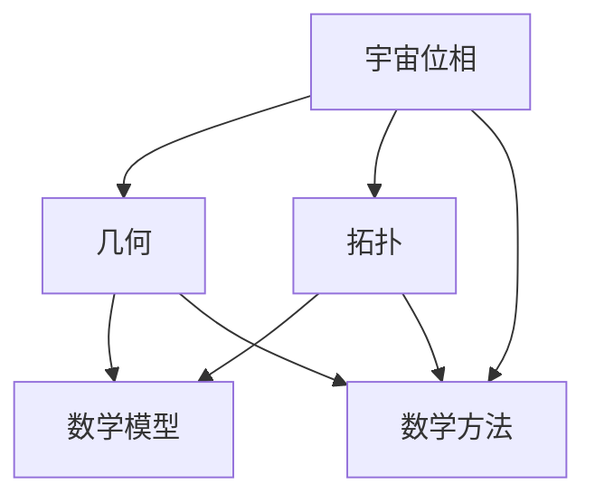

                 

### 文章标题

《数学在宇宙位相几何拓扑变化研究中的作用》

### 文章关键词

宇宙位相、几何拓扑变化、数学模型、宇宙演化、算法原理

### 文章摘要

本文从数学在宇宙位相几何拓扑变化研究中的基础出发，深入探讨了数学模型在宇宙位相预测、几何拓扑变化分析和宇宙演化研究中的应用。通过详细的算法原理讲解和实际应用实例，阐述了数学在理解宇宙演化规律和预测未来宇宙形态中的关键作用。文章还探讨了数学方法论在宇宙研究中的挑战与机遇，为未来研究提供了新的思路和方法。

## 第1章：宇宙位相几何拓扑变化概述

宇宙位相几何拓扑变化是宇宙学研究中一个重要且复杂的问题，它涉及到宇宙的结构、形态及其动态演化过程。在宇宙学中，宇宙位相是指宇宙在不同演化阶段的物理状态，几何拓扑变化则描述了宇宙空间结构的演变。数学作为一种强有力的工具，能够帮助我们深入理解和量化这些复杂的变化过程。

### 1.1 宇宙位相的基本概念

#### 1.1.1 宇宙位相的定义

宇宙位相是指在宇宙演化过程中，宇宙的宏观物理状态随时间变化的过程。它包括了宇宙的膨胀速率、密度、温度等多个物理量的变化。宇宙学中将宇宙演化分为多个位相，如宇宙早期的大爆炸位相、宇宙加速膨胀的宇宙学常数位相等。

#### 1.1.2 宇宙位相的研究意义

研究宇宙位相对于理解宇宙的起源、演化及其未来状态具有重要意义。通过分析宇宙位相的变化，我们可以推断宇宙的初始状态，预测宇宙的未来演化趋势，甚至可能揭示宇宙的终极命运。

#### 1.1.3 宇宙位相的基本特性

宇宙位相具有以下基本特性：

1. **非线性**：宇宙位相的变化通常是非线性的，这意味着它们不能用简单的线性关系来描述。
2. **多尺度**：宇宙位相的变化涉及多个尺度，从宏观的宇宙尺度到微观的粒子尺度。
3. **复杂性**：宇宙位相的变化过程非常复杂，涉及到多种物理作用和相互作用。

### 1.2 几何拓扑变化的概念

#### 1.2.1 基本几何概念

几何学研究空间中物体的形状、大小和位置关系。在宇宙学中，几何概念用于描述宇宙的空间结构。基本几何概念包括点、线、面、体等。

#### 1.2.2 拓扑结构的基本概念

拓扑结构是指物体在连续变形下保持不变的性质。在宇宙学中，拓扑结构描述了宇宙的空间形态。基本拓扑结构包括连通性、紧致性、边界等。

#### 1.2.3 几何拓扑变化的联系与区别

几何拓扑变化是宇宙演化过程中空间形态的变化。几何变化涉及物体的形状、大小和位置的变化，而拓扑变化关注的是空间结构在连续变形下的不变性。几何变化是拓扑变化的基础，而拓扑变化则是几何变化的更深层次的描述。

### 1.3 数学在宇宙位相几何拓扑变化中的作用

#### 1.3.1 数学工具在宇宙研究中的应用

数学工具在宇宙研究中发挥着重要作用，如微积分、线性代数、微分方程等。这些工具帮助科学家量化描述宇宙中的物理现象，分析宇宙的演化过程。

#### 1.3.2 数学方法在几何拓扑变化分析中的应用

数学方法如拓扑学、几何学、图论等，在分析宇宙的几何拓扑变化中具有重要意义。通过这些方法，我们可以揭示宇宙空间结构的演化规律，预测宇宙的未来形态。

#### 1.3.3 数学模型在宇宙位相预测中的应用

数学模型如广义相对论、宇宙学常数模型等，在预测宇宙位相的变化中发挥了关键作用。这些模型通过描述宇宙中的物理量随时间的变化，帮助我们理解宇宙的演化过程。

## 1.4 小结

本章内容主要介绍了宇宙位相几何拓扑变化的基本概念、数学工具和方法在宇宙研究中的应用。通过本章的学习，读者可以初步了解宇宙位相几何拓扑变化的研究背景，以及数学在其中的重要作用。这为后续章节的深入学习打下了基础。

### Mermaid 流程图

下面是宇宙位相几何拓扑变化研究的 Mermaid 流程图：



### 核心算法原理讲解

在宇宙位相几何拓扑变化研究中，核心算法原理的讲解至关重要。以下将详细介绍宇宙位相预测算法、数学模型在几何拓扑变化分析中的应用以及数学模型在宇宙演化研究中的应用。

#### 宇宙位相预测算法

**伪代码：**

```plaintext
function predict_cosmic_phase(data, model):
    # 初始化模型参数
    model_params = initialize_model_params(data)

    # 训练模型
    trained_model = train_model(data, model_params)

    # 预测宇宙位相
    predicted_phase = predict(data, trained_model)

    return predicted_phase
```

**详细讲解：**

宇宙位相预测算法是一种基于数学模型的预测方法。该算法的步骤如下：

1. **初始化模型参数**：根据收集到的宇宙位相相关数据，初始化模型参数。这些参数包括权重、偏置等。
2. **训练模型**：使用训练数据对模型进行训练，使得模型能够学会根据输入数据预测宇宙位相。训练过程中，模型会通过优化算法调整参数，使得预测结果与实际观测数据尽可能接近。
3. **预测宇宙位相**：使用训练好的模型对新的数据进行预测，得到宇宙位相的预测结果。预测过程中，模型会根据输入数据计算输出结果，从而预测宇宙的未来状态。

#### 数学模型在几何拓扑变化分析中的应用

**数学模型：** 我们可以使用拓扑不变量来分析几何拓扑变化。拓扑不变量是几何拓扑结构在连续变换下保持不变的量，例如欧拉特征数、基环数等。

**伪代码：**

```plaintext
function analyze_topology(geometry):
    # 计算拓扑不变量
    topological_invariants = calculate_topological_invariants(geometry)

    # 分析拓扑变化
    topology_changes = analyze_changes(topological_invariants)

    return topology_changes
```

**详细讲解：**

- **计算拓扑不变量**：使用几何对象计算其拓扑不变量，例如欧拉特征数。欧拉特征数是一个描述几何对象拓扑性质的重要指标，它表示为 $\chi = V - E + F$，其中 $V$ 是顶点数，$E$ 是边数，$F$ 是面数。
- **分析拓扑变化**：通过比较不同时间点的拓扑不变量，分析几何拓扑结构的变化。如果拓扑不变量发生变化，则说明几何拓扑结构发生了变化。

#### 数学模型在宇宙演化研究中的应用

**数学模型：** 我们可以使用微分方程来描述宇宙演化过程。微分方程可以描述宇宙中各种物理量的变化规律，例如宇宙膨胀率、物质密度等。

**伪代码：**

```plaintext
function evolve_cosmos(initial_conditions, model):
    # 初始化宇宙演化模型参数
    model_params = initialize_model_params(initial_conditions)

    # 演化宇宙
    evolved_cosmos = evolve(initial_conditions, model_params)

    return evolved_cosmos
```

**详细讲解：**

- **初始化宇宙演化模型参数**：根据宇宙的初始条件，初始化模型参数。这些初始条件可能包括宇宙的膨胀率、物质密度等。
- **演化宇宙**：使用模型参数模拟宇宙的演化过程，得到宇宙在不同时间点的状态。演化过程中，模型会根据初始条件和物理定律计算宇宙的动态变化。

### 数学公式和详细讲解

#### 宇宙位相预测的数学公式

**公式：** 宇宙位相预测的数学模型通常是一个非线性方程，例如：
$$
\phi(t) = f(t, \vec{X}(t)), \quad t \in [0, T]
$$

其中，$\phi(t)$ 表示宇宙位相在时间 $t$ 的预测值，$\vec{X}(t)$ 是与宇宙位相相关的输入变量，$f(t, \vec{X}(t))$ 是一个非线性函数。

**详细讲解：**

这个公式表示宇宙位相 $\phi(t)$ 是依赖于时间 $t$ 和输入变量 $\vec{X}(t)$ 的非线性函数。在实际应用中，需要选择合适的函数形式 $f(t, \vec{X}(t))$，并通过训练模型来拟合这个函数。

#### 几何拓扑变化的数学公式

**公式：** 欧拉特征数（Euler characteristic）是几何拓扑变化的一个重要指标，其计算公式为：
$$
\chi = V - E + F
$$

其中，$V$ 是顶点数，$E$ 是边数，$F$ 是面数。

**详细讲解：**

欧拉特征数 $\chi$ 是几何对象在连续变换下的不变量，它可以用来判断几何对象的拓扑结构。对于简单的多面体，欧拉特征数可以直接计算；对于复杂的几何对象，可能需要通过拓扑变换或其他数学方法来计算。

#### 宇宙演化的数学公式

**公式：** 宇宙演化的一个常见模型是弗里德曼-勒梅特-罗伯逊-沃尔克（FLRW）度规，其方程为：
$$
\frac{\ddot{a}(t)}{a(t)} = -\frac{4\pi G}{3}\left[\rho + \frac{3p}{c^2}\right]
$$

其中，$\ddot{a}(t)$ 是宇宙尺度因子 $a(t)$ 的二阶导数，$G$ 是引力常数，$\rho$ 是宇宙平均密度，$p$ 是宇宙压强

