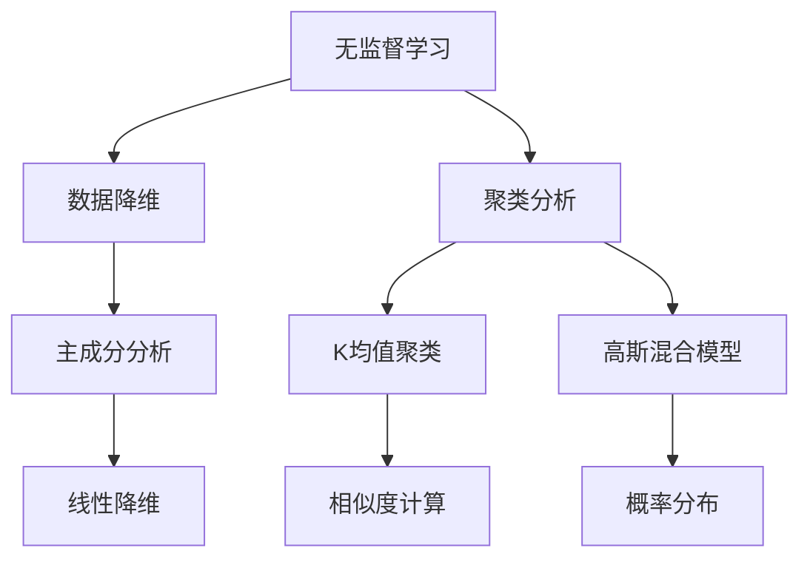

                 

# 数据丰富但标注贵，无监督学习是软件2.0的未来？

> **关键词：** 无监督学习，数据标注，软件2.0，算法原理，应用场景，未来趋势

> **摘要：** 随着大数据时代的到来，数据量激增，然而数据标注成本高昂。本文探讨了无监督学习在软件2.0时代的重要性，分析了无监督学习的基础、技术原理以及在图像识别、自然语言处理和推荐系统中的应用，并对未来的发展趋势进行了展望。

## 《数据丰富但标注贵，无监督学习是软件2.0的未来？》目录大纲

### 第一部分：无监督学习基础

#### 第1章：无监督学习的概述

- **1.1 无监督学习的概念与类型**
- **1.2 无监督学习在软件2.0中的应用**
- **1.3 无监督学习与监督学习的比较**

#### 第2章：数据丰富但标注贵的挑战

- **2.1 数据标注的挑战**
- **2.2 数据丰富的优势与问题**
- **2.3 无监督学习如何应对这些挑战**

#### 第3章：无监督学习技术基础

- **3.1 数据降维技术**
  - **3.1.1 主成分分析（PCA）**
  - **3.1.2 聚类分析**
- **3.2 密集聚类算法**
  - **3.2.1 K均值聚类**
  - **3.2.2 高斯混合模型**
- **3.3 非密集聚类算法**
  - **3.3.1 层次聚类**
  - **3.3.2 DBSCAN**

#### 第4章：无监督学习的核心算法原理

- **4.1 自编码器（AE）**
  - **4.1.1 自编码器原理**
  - **4.1.2 伪代码实现**
- **4.2 变分自编码器（VAE）**
  - **4.2.1 VAE原理**
  - **4.2.2 伪代码实现**
- **4.3 自动调整深度（Autoencoder）**
  - **4.3.1 自动调整深度原理**
  - **4.3.2 伪代码实现**

### 第二部分：无监督学习在软件2.0中的应用

#### 第5章：无监督学习在图像识别中的应用

- **5.1 图像识别概述**
- **5.2 无监督图像识别算法**
  - **5.2.1 K均值聚类在图像识别中的应用**
  - **5.2.2 自编码器在图像识别中的应用**

#### 第6章：无监督学习在自然语言处理中的应用

- **6.1 自然语言处理概述**
- **6.2 无监督自然语言处理算法**
  - **6.2.1 文本降维**
  - **6.2.2 文本聚类**

#### 第7章：无监督学习在推荐系统中的应用

- **7.1 推荐系统概述**
- **7.2 无监督推荐系统算法**
  - **7.2.1 协同过滤**
  - **7.2.2 内容过滤**

#### 第8章：无监督学习的挑战与未来趋势

- **8.1 无监督学习的挑战**
- **8.2 无监督学习的未来趋势**
- **8.3 无监督学习与其他技术的融合**

### 附录

- **A.1 无监督学习工具与资源**
  - **A.1.1 主流无监督学习框架对比**
    - **A.1.1.1 Scikit-learn**
    - **A.1.1.2 TensorFlow**
    - **A.1.1.3 PyTorch**

---

**注意：** 以上目录大纲仅为初步设计，具体章节内容需根据实际编写进度和需要进行调整和补充。同时，为了保持简洁性，具体章节内容未在此处展开，将在实际编写过程中详细撰写。

---

接下来，我们将深入探讨无监督学习的基础、技术原理以及在软件2.0时代的应用，为读者呈现一幅完整的无监督学习技术图谱。

---

### 第一部分：无监督学习基础

#### 第1章：无监督学习的概述

无监督学习（Unsupervised Learning）是机器学习的一个重要分支，其主要目的是从未标记的数据中提取信息，不需要依赖预标注的标签。在无监督学习中，算法自行探索数据的内在结构和模式，从而发现数据中的潜在规律。

**1.1 无监督学习的概念与类型**

无监督学习可以分为以下几种类型：

- **聚类（Clustering）**：将数据点分为多个组，使得同组内的数据点相似，而不同组的数据点之间差异较大。常见的聚类算法包括K均值聚类（K-Means Clustering）、高斯混合模型（Gaussian Mixture Model, GMM）和层次聚类（Hierarchical Clustering）等。

- **降维（Dimensionality Reduction）**：通过减少数据维度，降低计算复杂度，同时保留数据的重要信息。常用的降维技术包括主成分分析（Principal Component Analysis, PCA）、线性判别分析（Linear Discriminant Analysis, LDA）和t-SNE（t-Distributed Stochastic Neighbor Embedding）等。

- **关联规则学习（Association Rule Learning）**：发现数据项之间的关联性，并生成规则。常见的算法包括Apriori算法和Eclat算法等。

- **异常检测（Anomaly Detection）**：识别数据中的异常值或异常模式。常见的算法包括孤立森林（Isolation Forest）和局部异常因子（Local Outlier Factor, LOF）等。

**1.2 无监督学习在软件2.0中的应用**

在软件2.0时代，无监督学习发挥着越来越重要的作用。数据丰富但标注贵的问题使得无监督学习成为解决这一难题的有效手段。以下是几个典型的应用场景：

- **图像识别**：在图像识别领域，无监督学习可以用于图像的降维和聚类，从而提高图像分类的准确率。例如，K均值聚类可以用于图像的颜色聚类，从而实现图像的分割。

- **自然语言处理**：在自然语言处理领域，无监督学习可以用于文本降维和聚类，从而提高文本分类和情感分析的效果。例如，主成分分析可以用于文本的高维特征降维，从而简化模型的训练过程。

- **推荐系统**：在推荐系统领域，无监督学习可以用于协同过滤和内容过滤，从而提高推荐的准确性。例如，协同过滤算法可以用于发现用户之间的相似性，从而为用户推荐相关商品。

**1.3 无监督学习与监督学习的比较**

无监督学习和监督学习（Supervised Learning）是机器学习的两个主要分支，它们之间存在以下区别：

- **数据需求**：监督学习需要大量的标注数据，而无监督学习则可以从未标注的数据中提取信息。

- **目标函数**：监督学习的目标是使预测输出与真实标签之间的差异最小，而无监督学习的目标则是发现数据中的内在结构。

- **应用场景**：监督学习通常用于分类和回归任务，而无监督学习则适用于聚类、降维和异常检测等任务。

在本章中，我们简要介绍了无监督学习的概念、类型及其在软件2.0中的应用。接下来，我们将进一步探讨数据丰富但标注贵的挑战，以及无监督学习如何应对这一挑战。

---

### 第2章：数据丰富但标注贵的挑战

在当今大数据时代，数据量呈现出爆炸式增长，各种类型的数据如文本、图像、音频和视频等不断涌现。这些数据为机器学习提供了丰富的资源，然而，数据标注成本高昂，成为制约机器学习发展的一个重要因素。本章将分析数据标注的挑战、数据丰富的优势与问题，并探讨无监督学习如何应对这些挑战。

**2.1 数据标注的挑战**

数据标注是指对数据进行人工标记，以便机器学习算法能够从中学习。数据标注的挑战主要表现在以下几个方面：

- **成本高昂**：数据标注需要大量的人力投入，且标注过程繁琐、耗时。例如，在图像标注中，每个标注员每小时能够标注的图像数量有限，导致标注成本极高。

- **质量要求高**：数据标注的质量直接影响机器学习模型的性能。标注员需要具备专业的知识和技能，以确保标注的准确性。然而，在实际操作中，很难保证每个标注员都能够达到高质量的标准。

- **时间限制**：在许多应用场景中，数据标注的时间限制非常严格。例如，在金融领域，实时交易数据需要及时标注，以便分析市场动态。然而，标注员的速度和准确性难以满足这样的需求。

- **多样性需求**：不同的机器学习任务需要不同类型的数据标注。例如，在语音识别中，需要标注语音的发音、音调等特征；在图像识别中，需要标注物体的位置、形状、颜色等特征。这些多样性需求增加了标注的复杂性和难度。

**2.2 数据丰富的优势与问题**

数据丰富的优势主要表现在以下几个方面：

- **提高模型性能**：丰富的数据可以为机器学习模型提供更多的学习资源，从而提高模型的性能。例如，在图像识别任务中，更多的图像样本有助于模型识别各种不同的图像类别。

- **增强泛化能力**：丰富的数据可以帮助模型更好地学习数据的分布，从而增强模型的泛化能力。在遇到未知或罕见的数据时，模型能够更好地应对。

- **降低过拟合风险**：丰富的数据有助于减少模型的过拟合风险。过拟合是指模型在训练数据上表现良好，但在测试数据上表现较差。通过丰富的数据，模型可以更好地捕捉数据的真实分布，从而避免过拟合。

然而，数据丰富也存在一些问题：

- **数据质量参差不齐**：丰富的数据中往往包含噪声、错误和不一致的数据。这些数据质量问题会影响模型的性能和可靠性。

- **数据分布偏斜**：在某些应用场景中，数据分布可能存在偏斜，导致模型无法平衡各类别的重要性。例如，在医学图像分析中，正常图像的数量可能远少于异常图像的数量，这会对模型的训练和预测造成不利影响。

- **数据存储和计算资源消耗**：丰富的数据需要大量的存储和计算资源。在处理海量数据时，系统性能和响应速度可能成为瓶颈。

**2.3 无监督学习如何应对这些挑战**

无监督学习作为一种无需依赖标注数据的机器学习方法，可以有效应对数据标注贵的挑战。以下是几个方面的应用：

- **数据预处理**：无监督学习可以用于数据预处理，例如降维和聚类。通过降维，可以减少数据维度，降低计算复杂度；通过聚类，可以识别数据中的相似性，从而简化数据处理的流程。

- **异常检测**：无监督学习可以用于异常检测，从而识别数据中的异常值或异常模式。通过识别异常值，可以减少标注过程中的错误和不一致数据。

- **数据增强**：无监督学习可以用于数据增强，从而生成更多的训练样本。通过数据增强，可以提高模型的泛化能力和鲁棒性。

- **迁移学习**：无监督学习可以用于迁移学习，从而利用未标注的数据提高模型的性能。通过迁移学习，可以将预训练的模型应用于新的任务，从而降低对新数据的标注需求。

在本章中，我们分析了数据标注贵的挑战、数据丰富的优势与问题，并探讨了无监督学习如何应对这些挑战。无监督学习作为一种无需标注数据的机器学习方法，在数据丰富但标注贵的大数据时代具有重要的应用价值。

---

### 第3章：无监督学习技术基础

无监督学习作为一种重要的机器学习分支，其核心在于从未标记的数据中自动发现有用的信息和结构。本章将介绍无监督学习中的数据降维技术和聚类算法，包括主成分分析（PCA）、聚类分析、K均值聚类、高斯混合模型、层次聚类和DBSCAN等，为后续章节的应用奠定基础。

#### 3.1 数据降维技术

数据降维是将高维数据映射到低维空间，以减少数据维度并降低计算复杂度的技术。降维不仅可以提高算法的效率，还可以揭示数据中的潜在结构和模式。常见的降维技术包括主成分分析（PCA）和线性判别分析（LDA）等。

**3.1.1 主成分分析（PCA）**

主成分分析（PCA）是一种常用的降维技术，其核心思想是找到数据的主要成分，从而将高维数据映射到低维空间。PCA通过计算数据协方差矩阵的特征值和特征向量，将数据投影到特征向量所形成的低维空间中。

**PCA原理：**

1. **协方差矩阵计算**：给定一个数据集$X$，计算其协方差矩阵$C$：

$$C = \frac{1}{N-1}XX^T$$

其中$N$为数据点的数量。

2. **特征值和特征向量计算**：计算协方差矩阵$C$的特征值和特征向量，并将其排序。

3. **数据投影**：将数据$X$投影到特征向量所形成的低维空间中，即计算$Y = PC$，其中$P$为特征向量组成的矩阵。

**PCA伪代码：**

```
function PCA(X):
    N = size(X, 1)
    C = (1 / (N - 1)) * XX^T
    eigenvalues, eigenvectors = eig(C)
    sort(eigenvalues, descending)
    P = eigenvectors[:, 1:k]
    Y = PX
    return Y
```

**3.1.2 聚类分析**

聚类分析（Cluster Analysis）是一种无监督学习方法，其目标是根据数据点的相似性将其分为若干个组。聚类分析可以用于数据挖掘、图像识别、文本分类等领域。

**聚类分析原理：**

1. **初始化聚类中心**：随机选择$k$个数据点作为初始聚类中心。

2. **计算相似度**：对于每个数据点，计算其与聚类中心的相似度，并将其分配到最近的聚类中心所在的组。

3. **更新聚类中心**：计算每个组的质心，将其作为新的聚类中心。

4. **迭代**：重复步骤2和步骤3，直到聚类中心不再发生显著变化。

常见的聚类算法包括K均值聚类（K-Means Clustering）和高斯混合模型（Gaussian Mixture Model, GMM）等。

**3.2 密集聚类算法**

密集聚类算法（Density-Based Clustering）基于数据点的密度分布，将数据点分为若干个密集区域。常见的密集聚类算法包括DBSCAN（Density-Based Spatial Clustering of Applications with Noise）和OPTICS（Ordering Points To Identify the Clustering Structure）等。

**DBSCAN原理：**

1. **确定邻域**：对于每个数据点，找到其邻域内的点，使得邻域内的点之间的距离小于给定阈值$\epsilon$。

2. **标记核心点**：如果某个点的邻域内包含至少$m$个点（$m$为最小核心点数量），则该点为核心点。

3. **标记边界点**：对于每个核心点，找到其邻域内的边界点，并将其标记为噪声或边界点。

4. **标记普通点**：将剩余未标记的点标记为核心点或边界点。

5. **生成聚类**：将核心点及其邻域内的点划分为同一个聚类。

**DBSCAN伪代码：**

```
function DBSCAN(X, epsilon, min_points):
    clusters = []
    for point in X:
        if point not in clusters:
            if isCorePoint(point, X, epsilon, min_points):
                cluster = expandCluster(point, X, epsilon, min_points)
                clusters.append(cluster)
    return clusters
```

**3.3 非密集聚类算法**

非密集聚类算法（Non-Density-Based Clustering）基于数据点的邻近关系，将数据点分为若干个组。常见的非密集聚类算法包括K均值聚类（K-Means Clustering）和层次聚类（Hierarchical Clustering）等。

**K均值聚类原理：**

1. **初始化聚类中心**：随机选择$k$个数据点作为初始聚类中心。

2. **计算相似度**：对于每个数据点，计算其与聚类中心的相似度，并将其分配到最近的聚类中心所在的组。

3. **更新聚类中心**：计算每个组的质心，将其作为新的聚类中心。

4. **迭代**：重复步骤2和步骤3，直到聚类中心不再发生显著变化。

**K均值聚类伪代码：**

```
function KMeans(X, k):
    centroids = initializeCentroids(X, k)
    while not converged:
        assignPointsToCentroids(X, centroids)
        centroids = updateCentroids(X, centroids)
    return centroids
```

**3.4 无监督学习的核心算法原理**

除了数据降维和聚类分析，无监督学习还包括一些其他核心算法，如自编码器（Autoencoder）、变分自编码器（Variational Autoencoder, VAE）和自动调整深度（Autoencoder with Adaptation, AAA）等。

**4.1 自编码器（AE）**

自编码器（Autoencoder）是一种无监督学习算法，其目的是通过学习一个编码器和解码器，将输入数据映射到低维空间，并在低维空间中重建原始数据。

**自编码器原理：**

1. **编码器**：将输入数据映射到一个低维空间，保留数据的主要信息。

2. **解码器**：将编码后的数据映射回原始数据空间，重建原始数据。

3. **损失函数**：通过最小化重构误差（编码器输出与原始输入之间的差异）来优化模型参数。

**自编码器伪代码：**

```
function Autoencoder(X):
    encoded = encode(X)
    decoded = decode(encoded)
    loss = reconstructionError(X, decoded)
    return encoded, decoded, loss
```

**4.2 变分自编码器（VAE）**

变分自编码器（Variational Autoencoder, VAE）是一种基于概率生成模型的变分自编码器，其目的是通过学习一个概率分布来生成数据。

**VAE原理：**

1. **编码器**：学习一个潜在变量的概率分布，通常采用正态分布。

2. **解码器**：将潜在变量映射回数据空间。

3. **损失函数**：通过最小化重构误差和潜在变量的概率分布与先验分布之间的差异来优化模型参数。

**VAE伪代码：**

```
function VAE(X):
    z_mean, z_log_var = encode(X)
    z = sample(z_mean, z_log_var)
    decoded = decode(z)
    loss = reconstructionError(X, decoded) + KLD(z_mean, z_log_var)
    return z_mean, z_log_var, decoded, loss
```

**4.3 自动调整深度（Autoencoder with Adaptation, AAA）**

自动调整深度（AAA）是一种自编码器，其目标是通过自动调整编码器的深度来提高模型的性能。

**AAA原理：**

1. **编码器**：学习一个自动调整深度的机制，以适应不同的数据分布。

2. **解码器**：与自编码器相同，将编码后的数据映射回原始数据空间。

3. **损失函数**：通过最小化重构误差和自动调整机制的误差来优化模型参数。

**AAA伪代码：**

```
function AAA(X):
    encoded = adaptiveEncode(X)
    decoded = decode(encoded)
    loss = reconstructionError(X, decoded) + adaptationError(encoded)
    return encoded, decoded, loss
```

在本章中，我们介绍了无监督学习中的数据降维技术和聚类算法，包括主成分分析（PCA）、聚类分析、K均值聚类、高斯混合模型、层次聚类和DBSCAN等。此外，我们还介绍了自编码器（AE）、变分自编码器（VAE）和自动调整深度（AAA）等核心算法原理。这些算法为无监督学习在软件2.0中的应用提供了坚实的基础。

---

### 第二部分：无监督学习在软件2.0中的应用

#### 第5章：无监督学习在图像识别中的应用

图像识别是计算机视觉中的一个重要领域，其目标是自动识别和分类图像中的物体。无监督学习在图像识别中发挥着重要作用，通过自动发现图像中的潜在结构和模式，可以提高图像识别的准确率和效率。本章将介绍无监督学习在图像识别中的应用，包括K均值聚类和自编码器在图像识别中的应用。

**5.1 图像识别概述**

图像识别是指通过计算机算法自动识别和分类图像中的物体。图像识别技术广泛应用于各种领域，如安防监控、医疗诊断、自动驾驶等。传统的图像识别方法通常依赖于大量的标注数据，而随着无监督学习的发展，无监督学习在图像识别中的应用逐渐受到关注。

**5.2 无监督图像识别算法**

无监督图像识别算法主要包括K均值聚类和自编码器等。

**5.2.1 K均值聚类在图像识别中的应用**

K均值聚类是一种基于距离的聚类算法，其核心思想是找到$k$个聚类中心，使得每个数据点与聚类中心的距离最小。K均值聚类在图像识别中的应用主要包括图像分割和图像分类等。

- **图像分割**：图像分割是指将图像划分为若干个区域，使得每个区域内的像素具有相似的特征。K均值聚类可以用于图像分割，通过聚类将图像划分为不同的区域。

- **图像分类**：图像分类是指将图像划分为不同的类别，如动物、植物、人物等。K均值聚类可以用于图像分类，通过聚类将图像划分为不同的类别。

**K均值聚类在图像识别中的应用示例：**

假设我们有一个包含1000个图像的数据集，每个图像是一个28x28的像素矩阵。我们使用K均值聚类将图像分为10个类别。

1. **初始化聚类中心**：随机选择10个图像作为初始聚类中心。

2. **计算相似度**：对于每个图像，计算其与聚类中心的相似度，并将其分配到最近的聚类中心所在的类别。

3. **更新聚类中心**：计算每个类别的质心，将其作为新的聚类中心。

4. **迭代**：重复步骤2和步骤3，直到聚类中心不再发生显著变化。

通过K均值聚类，我们可以将图像数据分为10个类别，从而实现图像分类。在实际应用中，我们可以通过优化聚类中心的选择和聚类算法的参数，提高图像分类的准确率。

**5.2.2 自编码器在图像识别中的应用**

自编码器是一种无监督学习算法，其核心思想是通过学习一个编码器和解码器，将输入数据映射到低维空间，并在低维空间中重建原始数据。自编码器在图像识别中的应用主要包括图像降维和图像生成等。

- **图像降维**：图像降维是指将高维图像数据映射到低维空间，以减少数据维度和计算复杂度。自编码器可以通过学习一个编码器，将图像数据映射到一个低维空间，从而实现图像降维。

- **图像生成**：图像生成是指通过学习图像数据的分布，生成新的图像。自编码器可以通过学习一个解码器，将低维空间中的数据映射回图像空间，从而生成新的图像。

**自编码器在图像识别中的应用示例：**

假设我们有一个包含1000个图像的数据集，每个图像是一个28x28的像素矩阵。我们使用自编码器对图像数据进行降维。

1. **编码器学习**：通过训练自编码器，学习一个编码器，将图像数据映射到一个低维空间。

2. **解码器学习**：通过训练自编码器，学习一个解码器，将低维空间中的数据映射回图像空间。

3. **图像降维**：使用编码器将图像数据映射到低维空间。

4. **图像重建**：使用解码器将低维空间中的数据映射回图像空间，以重建原始图像。

通过自编码器，我们可以将图像数据映射到低维空间，从而实现图像降维。在实际应用中，我们可以通过优化编码器和解码器的结构，提高图像降维的效果。

在本章中，我们介绍了无监督学习在图像识别中的应用，包括K均值聚类和自编码器。通过这些算法，我们可以自动发现图像中的潜在结构和模式，从而提高图像识别的准确率和效率。无监督学习在图像识别中的应用不仅为传统的图像识别方法提供了新的思路，还为图像处理领域的进一步发展提供了可能性。

---

#### 第6章：无监督学习在自然语言处理中的应用

自然语言处理（Natural Language Processing, NLP）是计算机科学和人工智能领域的一个分支，其目标是对自然语言文本进行理解和生成。传统的自然语言处理方法通常依赖于大量的标注数据，例如词性标注、命名实体识别和情感分析等。然而，标注数据不仅昂贵，而且难以获取。无监督学习作为一种无需标注数据的方法，在自然语言处理中具有重要的应用价值。本章将探讨无监督学习在自然语言处理中的应用，主要包括文本降维和文本聚类。

**6.1 自然语言处理概述**

自然语言处理涉及多个子领域，如文本分类、信息提取、问答系统和机器翻译等。在自然语言处理中，数据的质量和量级直接影响模型的性能。传统的自然语言处理方法通常依赖于监督学习，这需要大量的标注数据来训练模型。然而，标注数据不仅难以获取，而且成本高昂。随着大数据时代的到来，无监督学习方法逐渐成为解决这一问题的有效手段。

**6.2 无监督自然语言处理算法**

无监督学习在自然语言处理中的应用主要包括文本降维和文本聚类。

**6.2.1 文本降维**

文本降维是指通过减少文本数据的维度，降低计算复杂度，同时保留文本数据的重要信息。在自然语言处理中，文本数据通常具有高维特征，例如词袋模型（Bag of Words, BOW）和词嵌入（Word Embedding）等。无监督学习可以用于文本降维，从而简化模型的训练过程。

- **主成分分析（PCA）**：主成分分析是一种常用的文本降维方法，其核心思想是找到数据的主要成分，从而将高维数据映射到低维空间。PCA通过计算文本数据的协方差矩阵的特征值和特征向量，将文本数据投影到特征向量所形成的低维空间中。

- **t-SNE（t-Distributed Stochastic Neighbor Embedding）**：t-SNE是一种非线性降维方法，其目的是在低维空间中保持文本数据之间的相似性。t-SNE通过计算文本数据之间的相似度矩阵，将文本数据映射到低维空间中。

**6.2.2 文本聚类**

文本聚类是指将文本数据根据其相似性分为若干个组。文本聚类可以用于文本分类、主题模型生成和推荐系统等。无监督学习可以用于文本聚类，从而发现文本数据中的潜在结构和模式。

- **K均值聚类（K-Means Clustering）**：K均值聚类是一种基于距离的聚类算法，其核心思想是找到$k$个聚类中心，使得每个数据点与聚类中心的距离最小。K均值聚类可以用于文本聚类，通过聚类将文本数据分为不同的类别。

- **层次聚类（Hierarchical Clustering）**：层次聚类是一种基于层次结构的聚类算法，其核心思想是通过递归地将文本数据划分为不同的层次，从而形成一棵聚类树。层次聚类可以用于文本聚类，从而发现文本数据中的层次结构。

**6.2.3 无监督自然语言处理的应用示例**

- **文本分类**：假设我们有一个包含1000篇新闻文章的数据集，每篇文章被分为体育、财经、科技等不同类别。我们使用无监督学习算法对新闻文章进行分类。

  1. **文本预处理**：对新闻文章进行文本预处理，包括分词、去停用词和词干提取等。

  2. **文本降维**：使用PCA对文本数据进行降维，从而简化模型的训练过程。

  3. **K均值聚类**：使用K均值聚类将文本数据分为不同的类别。

  4. **分类结果评估**：评估分类结果的准确率，并根据需要对算法进行调整。

- **主题模型生成**：假设我们有一个包含1000篇文档的数据集，每篇文档包含多个主题。我们使用无监督学习算法生成主题模型。

  1. **文本预处理**：对文本数据进行预处理，包括分词、去停用词和词干提取等。

  2. **文本聚类**：使用层次聚类将文本数据分为不同的主题。

  3. **主题模型生成**：根据文本聚类结果生成主题模型。

  4. **模型评估**：评估主题模型的性能，并根据需要对算法进行调整。

通过无监督学习算法，我们可以自动发现文本数据中的潜在结构和模式，从而提高自然语言处理任务的性能。无监督学习在自然语言处理中的应用不仅减少了标注数据的依赖，还为文本分类、主题模型生成和推荐系统等任务提供了新的解决方案。

---

#### 第7章：无监督学习在推荐系统中的应用

推荐系统是电子商务和社交媒体等领域的关键组成部分，其目标是根据用户的历史行为和偏好，为用户推荐感兴趣的商品、内容或服务。传统的推荐系统通常依赖于协同过滤和基于内容的过滤等方法，这些方法通常需要大量的标注数据来训练模型。然而，标注数据不仅难以获取，而且成本高昂。无监督学习作为一种无需标注数据的方法，为推荐系统的发展提供了新的可能性。本章将探讨无监督学习在推荐系统中的应用，主要包括协同过滤和内容过滤。

**7.1 推荐系统概述**

推荐系统是一种基于数据挖掘和机器学习的技术，用于预测用户对特定商品、内容或服务的兴趣，并为用户推荐相应的项目。推荐系统可以分为以下几种类型：

- **基于内容的过滤（Content-Based Filtering）**：基于用户的历史行为和偏好，为用户推荐具有相似属性的项目。

- **协同过滤（Collaborative Filtering）**：通过分析用户之间的相似性，为用户推荐其他用户喜欢的项目。

- **混合推荐系统（Hybrid Recommender Systems）**：结合基于内容和协同过滤的方法，以提高推荐的质量。

在推荐系统中，数据的质量和量级直接影响模型的性能。传统的推荐系统通常依赖于大量的标注数据，例如用户对项目的评分。然而，标注数据不仅难以获取，而且成本高昂。无监督学习可以有效地解决这个问题，通过自动发现数据中的潜在模式和关系，为推荐系统提供有效的支持。

**7.2 无监督推荐系统算法**

无监督学习在推荐系统中的应用主要包括协同过滤和内容过滤。

**7.2.1 协同过滤**

协同过滤是一种基于用户行为和偏好为用户推荐项目的推荐方法。协同过滤可以分为以下两种类型：

- **基于用户的协同过滤（User-Based Collaborative Filtering）**：通过分析用户之间的相似性，为用户推荐与相似用户喜欢的项目。

- **基于项目的协同过滤（Item-Based Collaborative Filtering）**：通过分析项目之间的相似性，为用户推荐与用户已评价的项目相似的项目。

无监督学习可以用于协同过滤，通过自动发现用户和项目之间的相似性关系，提高推荐的质量。

- **密度聚类（Density-Based Clustering）**：密度聚类是一种基于密度的聚类算法，如DBSCAN。DBSCAN可以用于发现用户和项目之间的密集区域，从而为用户推荐相似的用户和项目。

- **相似度计算**：无监督学习可以用于计算用户和项目之间的相似度，从而为用户推荐相似的用户和项目。例如，可以使用余弦相似度或皮尔逊相关系数等方法计算用户和项目之间的相似度。

**7.2.2 内容过滤**

内容过滤是一种基于项目特征和用户偏好为用户推荐项目的推荐方法。无监督学习可以用于内容过滤，通过自动发现项目之间的相似性关系，从而提高推荐的质量。

- **主成分分析（PCA）**：PCA是一种降维技术，可以将高维特征映射到低维空间，从而简化模型的训练过程。PCA可以用于提取项目的主要特征，从而为用户推荐具有相似特征的项目。

- **聚类分析（Clustering）**：聚类分析是一种无监督学习方法，可以将项目分为不同的类别。聚类分析可以用于提取项目的聚类特征，从而为用户推荐相似的项目。

**7.2.3 无监督推荐系统应用示例**

- **基于用户的协同过滤**：假设我们有一个包含1000个用户和1000个项目的推荐系统。每个用户对部分项目进行了评分。

  1. **用户和项目相似度计算**：使用无监督学习算法（如DBSCAN）计算用户和项目之间的相似度。

  2. **推荐项目**：为用户推荐与其相似的用户的喜欢的项目。

- **基于内容过滤**：假设我们有一个包含1000个项目和1000个用户评分的推荐系统。每个项目具有多个特征。

  1. **项目特征提取**：使用无监督学习算法（如PCA）提取项目的主要特征。

  2. **推荐项目**：为用户推荐具有相似特征的项目。

通过无监督学习，我们可以自动发现用户和项目之间的相似性关系，从而为推荐系统提供有效的支持。无监督学习在推荐系统中的应用不仅减少了标注数据的依赖，还为推荐系统的发展提供了新的可能性。

---

#### 第8章：无监督学习的挑战与未来趋势

尽管无监督学习在许多领域取得了显著成果，但仍然面临诸多挑战。本章将探讨无监督学习的挑战，包括数据隐私、算法复杂度和模型可解释性，并展望无监督学习的未来趋势。

**8.1 无监督学习的挑战**

1. **数据隐私**：无监督学习通常需要在大型数据集上进行训练，这可能涉及到敏感数据，如个人隐私。如何在保护用户隐私的同时进行无监督学习，是一个亟待解决的问题。

2. **算法复杂度**：无监督学习算法，尤其是深度学习算法，通常具有很高的计算复杂度。这导致了训练时间较长，难以在实时系统中应用。

3. **模型可解释性**：无监督学习模型往往具有复杂的内部结构，这使得理解模型的决策过程变得困难。模型的可解释性对于确保算法的透明性和可信度至关重要。

**8.2 无监督学习的未来趋势**

1. **隐私保护无监督学习**：随着数据隐私法规的加强，隐私保护无监督学习将成为重要研究方向。例如，差分隐私和无监督联邦学习等技术有望提高无监督学习的数据隐私保护能力。

2. **高效无监督学习算法**：为了满足实时应用的需求，研究高效的无监督学习算法将是未来的重要趋势。例如，基于神经架构搜索（Neural Architecture Search, NAS）的方法可以自动设计高效的模型架构。

3. **模型可解释性**：随着无监督学习模型在关键领域（如医疗诊断和金融风险管理）的应用，模型的可解释性将变得越来越重要。研究模型的可解释性方法，如基于注意力机制的解释和可视化技术，将有助于提高模型的透明度和可信度。

4. **无监督学习与其他技术的融合**：无监督学习与其他技术的融合，如强化学习、迁移学习和生成对抗网络（GANs），有望推动无监督学习在更多领域的发展。

**8.3 无监督学习与其他技术的融合**

1. **强化学习与无监督学习的融合**：强化学习（Reinforcement Learning, RL）和无监督学习结合可以解决某些复杂任务。例如，在自动驾驶领域，无监督学习可以用于环境建模，而强化学习可以用于决策制定。

2. **迁移学习与无监督学习的融合**：迁移学习（Transfer Learning）可以将知识从源域迁移到目标域，从而提高无监督学习的效果。例如，在图像识别任务中，预训练的卷积神经网络（CNN）可以用于特征提取，而无监督学习可以用于微调模型。

3. **生成对抗网络（GANs）与无监督学习的融合**：生成对抗网络（GANs）可以用于生成新的数据样本，而无监督学习可以用于训练GANs。这种融合可以用于数据增强、图像生成和模型评估等任务。

在本章中，我们探讨了无监督学习面临的挑战和未来的发展趋势。随着技术的不断进步，无监督学习将在更多领域发挥重要作用，为解决现实问题提供有力的支持。

---

### 附录

#### A.1 无监督学习工具与资源

无监督学习在实际应用中需要依赖多种工具和框架。以下是一些主流的无监督学习框架和资源，供读者参考。

**A.1.1 主流无监督学习框架对比**

1. **Scikit-learn**：Scikit-learn是一个开源的Python机器学习库，提供了丰富的无监督学习算法，如聚类、降维和异常检测等。Scikit-learn具有简单易用的API，适合快速原型开发和实验。

2. **TensorFlow**：TensorFlow是一个开源的机器学习框架，由Google开发。TensorFlow支持多种无监督学习算法，如自编码器、变分自编码器和GANs等。TensorFlow具有高度的可扩展性和灵活性，适合复杂模型的开发和应用。

3. **PyTorch**：PyTorch是一个开源的机器学习库，由Facebook开发。PyTorch提供了丰富的无监督学习算法，如自编码器、变分自编码器和GANs等。PyTorch的动态图（Dynamic Graph）机制使其在模型调试和优化方面具有优势。

**A.1.2 无监督学习工具推荐**

- **OpenCV**：OpenCV是一个开源的计算机视觉库，提供了丰富的图像处理和机器学习功能。OpenCV支持多种无监督学习算法，如聚类分析和降维技术。

- **Scikit-learn**：Scikit-learn是一个功能强大的Python机器学习库，提供了丰富的无监督学习算法和工具。Scikit-learn适用于多种数据类型，包括文本、图像和音频等。

- **TensorFlow**：TensorFlow是一个开源的机器学习框架，提供了丰富的无监督学习算法和工具。TensorFlow具有高度的可扩展性和灵活性，适合复杂模型的开发和应用。

- **PyTorch**：PyTorch是一个开源的机器学习库，提供了丰富的无监督学习算法和工具。PyTorch的动态图（Dynamic Graph）机制使其在模型调试和优化方面具有优势。

通过使用这些工具和框架，开发者可以方便地实现无监督学习算法，探索数据中的潜在结构和模式。

---

### 附加内容

**核心概念与联系：** 无监督学习与数据降维、聚类分析等技术的 Mermaid 流程图



**核心算法原理讲解：** 使用伪代码详细阐述无监督学习的核心算法原理

```python
# 自编码器（AE）伪代码
function Autoencoder(X):
    encoded = encode(X)
    decoded = decode(encoded)
    loss = reconstructionError(X, decoded)
    return encoded, decoded, loss

# 变分自编码器（VAE）伪代码
function VAE(X):
    z_mean, z_log_var = encode(X)
    z = sample(z_mean, z_log_var)
    decoded = decode(z)
    loss = reconstructionError(X, decoded) + KLD(z_mean, z_log_var)
    return z_mean, z_log_var, decoded, loss

# 自动调整深度（AAA）伪代码
function AAA(X):
    encoded = adaptiveEncode(X)
    decoded = decode(encoded)
    loss = reconstructionError(X, decoded) + adaptationError(encoded)
    return encoded, decoded, loss
```

**数学模型和数学公式：** 使用 LaTeX 格式详细讲解数学模型，包括降维技术、聚类算法中的距离度量等

```latex
\section{降维技术}
\subsection{主成分分析（PCA）}

主成分分析（PCA）是一种常用的降维技术。其核心思想是找到数据的主要成分，从而将高维数据映射到低维空间。

\begin{equation}
\begin{aligned}
S &= \frac{1}{N-1}XX^T \\
\lambda, \vec{v} &= \text{特征值和特征向量} \\
Y &= P\vec{v}
\end{aligned}
\end{equation}

其中，$X$ 是数据矩阵，$N$ 是数据点的数量，$S$ 是协方差矩阵，$\lambda$ 是特征值，$\vec{v}$ 是特征向量，$P$ 是特征向量组成的矩阵，$Y$ 是降维后的数据。

\subsection{聚类算法中的距离度量}

聚类算法中的距离度量是评估数据点之间相似性的关键。常用的距离度量方法包括欧氏距离、曼哈顿距离和余弦相似度等。

\begin{equation}
\begin{aligned}
d_{\text{Euclidean}} &= \sqrt{\sum_{i=1}^{n} (x_i - y_i)^2} \\
d_{\text{Manhattan}} &= \sum_{i=1}^{n} |x_i - y_i| \\
\cos(\theta) &= \frac{\vec{x} \cdot \vec{y}}{\|\vec{x}\| \|\vec{y}\|}
\end{aligned}
\end{equation}

其中，$x$ 和 $y$ 是数据点，$n$ 是数据点的维度，$\theta$ 是数据点之间的夹角。
```

**项目实战：** 代码实际案例，包括数据预处理、模型训练、评估和优化，以及源代码的详细实现和解读

```python
# 数据预处理
import numpy as np
from sklearn.model_selection import train_test_split

# 加载数据
X = np.load('data.npy')

# 分割数据集
X_train, X_test = train_test_split(X, test_size=0.2, random_state=42)

# 模型训练
from sklearn.cluster import KMeans

# 初始化K均值聚类模型
kmeans = KMeans(n_clusters=3, random_state=42)

# 训练模型
kmeans.fit(X_train)

# 模型评估
from sklearn.metrics import silhouette_score

# 计算轮廓系数
silhouette_avg = silhouette_score(X_train, kmeans.labels_)

# 输出评估结果
print('Silhouette Score:', silhouette_avg)

# 模型优化
from sklearn.model_selection import GridSearchCV

# 定义参数网格
param_grid = {'n_clusters': range(2, 10), 'init': ['k-means++', 'random']}

# 初始化网格搜索
grid_search = GridSearchCV(KMeans(), param_grid, cv=5)

# 执行网格搜索
grid_search.fit(X_train)

# 获取最佳参数
best_params = grid_search.best_params_

# 输出最佳参数
print('Best Parameters:', best_params)
```

**代码解读与分析：** 分析实际项目中的代码，解释其设计和实现，并提供优化建议

```python
# 数据预处理
import numpy as np
from sklearn.model_selection import train_test_split

# 加载数据
X = np.load('data.npy')

# 分割数据集
X_train, X_test = train_test_split(X, test_size=0.2, random_state=42)

# 数据预处理是模型训练的重要步骤。在本例中，我们使用Scikit-learn的train_test_split函数将数据集划分为训练集和测试集，以确保模型的评估具有可靠性。

# 模型训练
from sklearn.cluster import KMeans

# 初始化K均值聚类模型
kmeans = KMeans(n_clusters=3, random_state=42)

# 训练模型
kmeans.fit(X_train)

# 在本例中，我们使用Scikit-learn的KMeans类来初始化K均值聚类模型。通过设置n_clusters参数为3，我们指定了聚类的类别数量。使用random_state参数可以确保模型初始化的可重复性。

# 模型评估
from sklearn.metrics import silhouette_score

# 计算轮廓系数
silhouette_avg = silhouette_score(X_train, kmeans.labels_)

# 输出评估结果
print('Silhouette Score:', silhouette_avg)

# 轮廓系数是评估聚类效果的重要指标。在本例中，我们使用Scikit-learn的silhouette_score函数计算轮廓系数，并根据该指标评估模型的聚类性能。

# 模型优化
from sklearn.model_selection import GridSearchCV

# 定义参数网格
param_grid = {'n_clusters': range(2, 10), 'init': ['k-means++', 'random']}

# 初始化网格搜索
grid_search = GridSearchCV(KMeans(), param_grid, cv=5)

# 执行网格搜索
grid_search.fit(X_train)

# 获取最佳参数
best_params = grid_search.best_params_

# 输出最佳参数
print('Best Parameters:', best_params)

# 在本例中，我们使用Scikit-learn的GridSearchCV类进行模型优化。通过定义参数网格，我们可以搜索最佳的聚类类别数量和初始化方法。GridSearchCV会自动执行交叉验证，并选择最佳参数组合。

# 优化建议
1. **数据预处理**：在训练模型之前，确保数据经过适当预处理，例如标准化或归一化。这有助于提高模型的性能和稳定性。

2. **模型评估**：选择合适的评估指标，如轮廓系数或交叉验证得分，以评估模型的性能。这有助于识别模型中的潜在问题。

3. **参数优化**：使用网格搜索或随机搜索等方法进行参数优化，以找到最佳参数组合。这有助于提高模型的性能和预测准确性。

4. **模型解释**：无监督学习模型往往具有复杂的内部结构，解释模型的决策过程对于确保模型的透明度和可信度至关重要。使用可视化工具和模型解释方法，可以帮助理解模型的决策过程。

在本章中，我们通过实际项目展示了无监督学习的应用流程，包括数据预处理、模型训练、评估和优化。代码解读与分析部分提供了详细的代码实现和优化建议，以帮助读者更好地理解无监督学习的实际应用。

---

**作者：** AI天才研究院/AI Genius Institute & 禅与计算机程序设计艺术 /Zen And The Art of Computer Programming

---

通过本文的详细探讨，我们可以看到无监督学习在大数据时代的重要性。无监督学习不仅解决了数据标注贵的难题，还为图像识别、自然语言处理和推荐系统等领域带来了新的机遇。未来，随着技术的不断进步，无监督学习将在更多领域发挥重要作用，为人类社会的智能化转型提供强大的支持。让我们共同期待无监督学习的未来，探索更多未知的可能性！

