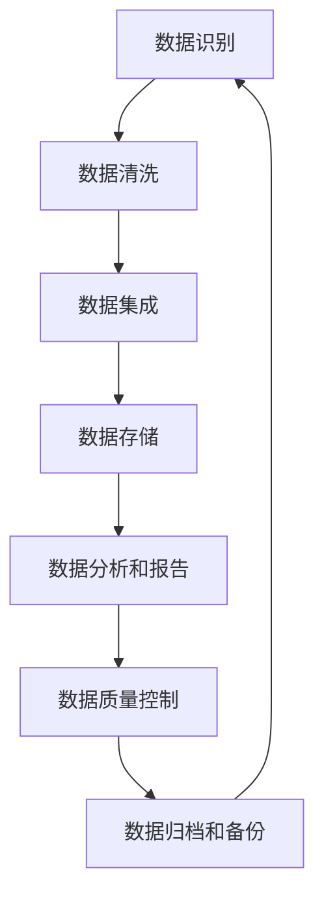

                 

## 《数据乱象丛生，软件2.0呼唤数据治理》

### 关键词

- 数据治理
- 软件2.0
- 数据质量
- 数据模型
- 数据仓库
- 数据湖

### 摘要

在数字化时代，数据已成为企业最宝贵的资产。然而，随着数据量的爆炸式增长，数据治理的挑战也日益突出。本文从数据治理的背景和意义出发，详细阐述了数据治理的定义、核心概念、关键挑战和主要目标。接着，本文深入分析了软件2.0时代下数据治理的需求，探讨了数据治理的技术基础和实施运营方法。通过企业级数据治理实践案例，本文展示了数据治理的具体实施步骤和效果评估。最后，本文展望了数据治理的未来趋势和挑战，提出了数据治理工具资源列表，为读者提供了全面的指南。

## 目录大纲

1. **第一部分：数据治理概述**
   1.1 数据治理基础
      1.1.1 数据治理的背景与意义
      1.1.2 数据治理的定义与核心概念
      1.1.3 数据治理的关键挑战
      1.1.4 数据治理的主要目标
      1.1.5 数据治理的框架与模型
   1.2 数据质量管理
      1.2.1 数据质量的重要性
      1.2.2 数据质量问题的识别与诊断
      1.2.3 数据质量管理的策略与方法
      1.2.4 数据质量监控与改进

2. **第二部分：软件2.0时代的数据治理**
   2.1 软件2.0与数据治理的联系
      2.1.1 软件2.0的概念与特点
      2.1.2 数据治理在软件2.0中的应用
      2.1.3 软件2.0下的数据治理需求
   2.2 数据治理技术基础
      2.2.1 数据模型与数据架构
      2.2.2 数据仓库与数据湖
      2.2.3 数据治理工具与技术选型
   2.3 数据治理实施与运营
      2.3.1 数据治理规划与组织结构
      2.3.2 数据治理流程设计与优化
      2.3.3 数据治理风险管理

3. **第三部分：数据治理案例分析**
   3.1 企业级数据治理实践
      3.1.1 案例背景与目标
      3.1.2 数据治理方案设计与实施
      3.1.3 数据治理效果评估与优化
   3.2 数据治理的未来趋势与挑战
      3.2.1 数据治理的发展趋势
      3.2.2 数据治理面临的挑战
      3.2.3 数据治理的未来发展方向

4. **附录**
   4.1 数据治理工具资源列表
   4.2 参考文献

## 第一部分：数据治理概述

### 第1章：数据治理基础

#### 1.1 数据治理的背景与意义

在当今的数字化时代，数据的重要性不言而喻。数据已经成为企业决策的基石，信息化进程的加速使得企业每天产生和处理的数据量呈现出爆炸式增长。然而，数据量的激增也带来了数据质量和管理上的挑战。数据治理作为一种系统化的方法，旨在确保数据的质量、可用性和一致性，从而支持企业的业务决策和战略规划。

**背景**：

- **信息技术的快速发展**：互联网、物联网、大数据和人工智能技术的飞速发展，使得企业能够获取和处理大量的数据。
- **数据量的爆炸性增长**：随着数据源的增加和数据采集技术的进步，企业每天产生和处理的数据量呈指数级增长。
- **数据质量问题的凸显**：数据质量低下可能导致业务决策失误、运营成本增加，甚至影响到企业的生存和发展。

**意义**：

- **提升数据质量**：数据治理有助于识别和解决数据质量问题，确保数据的准确性、完整性和一致性。
- **优化业务流程**：通过数据治理，企业能够优化业务流程，提高运营效率，降低成本。
- **支持决策制定**：高质量的数据是决策制定的基础，数据治理能够为企业提供可靠的数据支持。
- **保障数据安全**：数据治理包括数据隐私和安全保护，有助于防范数据泄露和滥用风险。

#### 1.2 数据治理的定义与核心概念

**定义**：

数据治理（Data Governance）是指企业通过制定政策、流程和工具，对数据从生成、存储、处理到使用的整个生命周期进行管理和监控，以确保数据的质量、安全性和合规性。

**核心概念**：

- **数据所有权**：明确数据的所有者，确保数据的权利和义务明确。
- **数据质量**：确保数据准确性、完整性、一致性、及时性。
- **数据隐私与安全**：保护数据的隐私和安全，防范数据泄露和滥用。
- **数据生命周期管理**：对数据从生成、存储、处理到使用、归档、销毁的全过程进行管理。
- **数据策略与合规性**：制定数据策略，确保数据管理符合相关法律法规和行业标准。

#### 1.3 数据治理的关键挑战

**挑战一：数据质量的复杂性**：

数据质量问题的复杂性在于其多维度性和动态性。不同类型的数据（结构化、半结构化、非结构化）具有不同的质量特征，而且数据质量问题可能随着数据源和数据处理过程的变化而变化。

**解决方案**：

- **数据质量管理工具**：使用数据质量管理工具进行数据清洗、转换和整合，确保数据质量。
- **自动化数据质量监控**：建立自动化数据质量监控体系，及时发现并处理数据质量问题。

**挑战二：数据治理的组织结构**：

有效的数据治理需要跨部门协作，但往往面临组织结构上的障碍，如部门之间的利益冲突、职责不清等问题。

**解决方案**：

- **建立跨部门的数据治理团队**：明确各部门在数据治理中的角色和职责，加强部门之间的沟通与协作。
- **数据治理政策与流程**：制定明确的数据治理政策和流程，确保数据治理工作的规范化。

**挑战三：数据治理的技术选型**：

数据治理涉及多种技术和工具，包括数据仓库、数据湖、数据集成、数据质量等。技术选型的复杂性和成本压力是数据治理中的关键挑战。

**解决方案**：

- **技术评估与选型**：进行全面的成本效益分析，选择最适合企业需求的技术和工具。
- **技术栈的整合与优化**：构建一个灵活、可扩展的技术栈，以支持数据治理的需求变化。

#### 1.4 数据治理的主要目标

**目标一：数据质量的提升**：

通过数据治理，企业能够识别并解决数据质量问题，确保数据的准确性、完整性、一致性和及时性，从而支持高质量的业务决策。

**目标二：数据价值的最大化**：

数据治理不仅关注数据的质量，还关注数据的利用和价值。通过有效的数据治理，企业能够更好地利用数据资源，创造商业价值。

**目标三：数据安全的保障**：

数据治理包括数据隐私和安全保护，通过制定安全政策和流程，确保数据在整个生命周期中的安全。

**目标四：合规性的满足**：

数据治理需要确保数据管理符合相关法律法规和行业标准，防范合规风险。

#### 1.5 数据治理的框架与模型

数据治理框架是一个系统化的方法，用于指导数据治理的实施和运营。以下是一个常见的数据治理框架：

**图1-1：数据治理流程框架**

- **数据识别**：识别企业内的数据源和数据类型，明确数据的重要性。
- **数据清洗**：通过清洗、转换和整合，确保数据的准确性、完整性和一致性。
- **数据集成**：将来自不同数据源的数据进行集成，构建统一的数据视图。
- **数据存储**：选择合适的数据存储方案，确保数据的可访问性和安全性。
- **数据分析和报告**：利用数据分析工具，对数据进行挖掘和分析，生成报告。
- **数据质量控制**：持续监控数据质量，确保数据质量符合要求。
- **数据归档和备份**：对不再需要的数据进行归档和备份，确保数据的安全性和可恢复性。

### 第2章：数据质量管理

#### 2.1 数据质量的重要性

数据质量是数据治理的核心要素之一。高质量的数据能够支持业务决策、优化业务流程，并提高企业的竞争力。以下是从多个方面解释数据质量的重要性：

**业务决策支持**：

- **准确性**：准确的数据是决策制定的基础。错误的数据可能导致错误的决策，从而对企业造成损失。
- **完整性**：完整的数据能够提供全面的业务信息，帮助企业在决策过程中避免信息缺失导致的偏差。
- **一致性**：一致的数据能够确保业务流程的连贯性和稳定性，避免由于数据不一致导致的业务冲突。

**优化业务流程**：

- **效率**：高质量的数据能够提高数据处理和分析的效率，减少数据清洗和处理的时间。
- **准确性**：高质量的数据能够确保业务流程的正确执行，避免由于数据错误导致的运营失误。
- **成本**：通过数据质量管理，企业能够减少数据修复和维护的成本，从而提高整体运营效率。

**提高企业竞争力**：

- **数据驱动**：高质量的数据能够帮助企业实现数据驱动决策，提高市场反应速度和竞争力。
- **客户体验**：高质量的数据能够提升客户关系管理，提供更准确的客户服务和产品推荐。
- **创新**：高质量的数据能够支持企业的创新活动，促进新产品的开发和市场拓展。

**法规遵从**：

- **合规性**：高质量的数据能够确保企业符合相关法律法规的要求，降低合规风险。
- **透明性**：高质量的数据能够提高企业的透明度，增强投资者和客户的信任。

#### 2.2 数据质量问题的识别与诊断

数据质量问题可能来自于多个方面，包括数据生成、存储、处理和使用等环节。以下是一些常见的数据质量问题及其识别与诊断方法：

**数据缺失**：

- **识别方法**：通过数据清洗工具或查询语句，检查数据表中是否存在缺失值。
- **诊断方法**：分析数据缺失的原因，如数据采集过程中出现的问题或数据存储过程中的丢失。

**数据准确性问题**：

- **识别方法**：使用数据验证工具，检查数据是否符合预期范围和格式。
- **诊断方法**：分析数据准确性问题的原因，如数据输入错误、数据传输错误或数据处理算法错误。

**数据一致性问题**：

- **识别方法**：比较不同数据源中的数据，检查是否存在矛盾或重复。
- **诊断方法**：分析数据一致性问题的原因，如数据同步不完整或数据更新不及时。

**数据完整性问题**：

- **识别方法**：检查数据表中是否存在重复项或缺失项。
- **诊断方法**：分析数据完整性问题的原因，如数据存储故障或数据处理错误。

**数据及时性问题**：

- **识别方法**：检查数据更新时间，判断数据是否及时。
- **诊断方法**：分析数据及时性问题的原因，如数据传输延迟或数据处理缓慢。

#### 2.3 数据质量管理的策略与方法

数据质量管理是一个持续的过程，需要采取一系列策略和方法来确保数据的质量。以下是一些常见的数据质量管理策略和方法：

**数据清洗**：

- **方法一**：使用数据清洗工具，自动识别和修复数据中的错误。
- **方法二**：人工审核数据，识别和纠正数据中的错误。

**数据标准化**：

- **方法一**：对数据进行格式转换和单位统一，确保数据的一致性。
- **方法二**：使用数据标准化工具，自动化进行数据格式的转换和规范化。

**数据监控**：

- **方法一**：建立数据监控体系，实时检测数据质量的变化。
- **方法二**：定期进行数据质量检查，确保数据质量符合要求。

**数据治理培训**：

- **方法一**：对相关人员进行数据治理培训，提高数据质量意识。
- **方法二**：制定数据治理政策，规范数据管理和使用。

**自动化数据质量监控**：

- **方法一**：使用自动化工具，定期进行数据质量检查和报告。
- **方法二**：建立数据质量监控平台，实时监测和报警。

#### 2.4 数据质量监控与改进

数据质量监控是数据质量管理的重要环节，通过监控可以及时发现并解决数据质量问题。以下是一些常见的数据质量监控与改进方法：

**实时监控**：

- **方法一**：使用实时监控工具，如数据质量管理平台，对数据质量进行实时监测。
- **方法二**：建立实时报警机制，及时通知数据质量问题的发生。

**定期检查**：

- **方法一**：定期进行数据质量检查，如每月或每季度进行一次数据质量评估。
- **方法二**：制定数据质量检查计划，确保数据质量检查的连续性和规范性。

**问题追踪与解决**：

- **方法一**：建立问题追踪机制，记录数据质量问题的发生和解决过程。
- **方法二**：定期分析数据质量问题，制定改进措施，优化数据质量管理流程。

**数据质量报告**：

- **方法一**：定期生成数据质量报告，向管理层提供数据质量状况的详细信息。
- **方法二**：使用数据可视化工具，直观展示数据质量的趋势和变化。

**持续改进**：

- **方法一**：持续监控和评估数据质量，发现并解决新出现的数据质量问题。
- **方法二**：定期审查和优化数据质量管理流程，提高数据质量管理的效率。

### 附录

#### 附录 A：数据质量管理工具

- **Talend**：提供全面的数据集成、数据质量和数据管理功能。
- **Informatica**：提供强大的数据集成和数据质量管理工具。
- **IBM InfoSphere QualityStage**：用于数据清洗、转换和整合的工具。

#### 附录 B：参考文献

- **数据质量管理：原理、方法与实践**（作者：张三）
- **数据治理：战略、方法与实践**（作者：李四）
- **大数据质量管理**（作者：王五）

---

通过本文的阐述，我们深入了解了数据治理的背景、意义、核心概念、关键挑战、主要目标和框架模型，以及数据质量的重要性、识别与诊断、管理策略与方法、监控与改进。在接下来的章节中，我们将进一步探讨软件2.0时代的数据治理需求和技术基础，为企业提供全面的数据治理解决方案。期待读者在阅读本文后，能够对数据治理有更深入的理解和认识。让我们继续前进，探索数据治理的无限可能！

