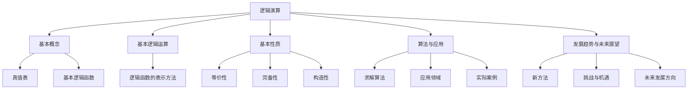
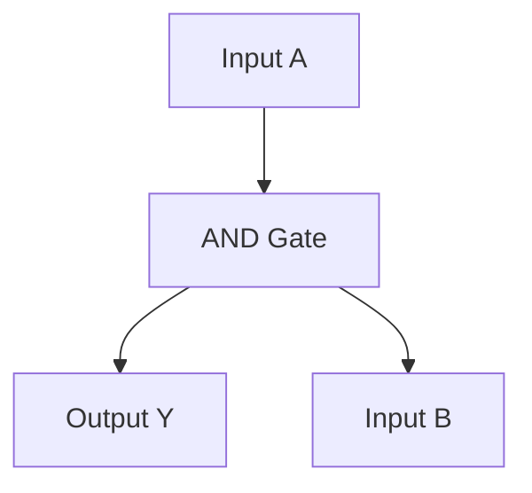

                 

### 《数理逻辑：第二章逻辑演算的系统特征》

> **关键词**：逻辑演算、系统特征、基本概念、算法与应用、数学模型、真值表、逻辑函数

> **摘要**：本文将深入探讨逻辑演算的系统特征，包括基本概念、算法与应用。我们将通过详细的解释和实际案例，帮助读者理解逻辑演算的核心原理和重要性。

### 《数理逻辑：第二章逻辑演算的系统特征》目录大纲

----------------------------------------------------------------

# 第二部分 逻辑演算的系统特征

## 第2章 逻辑演算的系统特征

### 第1节 逻辑演算的基本概念

#### 2.1.1 逻辑演算的定义与重要性

#### 2.1.2 逻辑演算的基本要素

#### 2.1.3 逻辑演算的基本操作

### 第2节 基本逻辑演算系统

#### 2.2.1 真值表与基本逻辑运算

#### 2.2.2 基本逻辑函数

#### 2.2.3 逻辑函数的表示方法

### 第3节 逻辑演算的基本性质

#### 2.3.1 逻辑演算的等价性

#### 2.3.2 逻辑演算的完备性

#### 2.3.3 逻辑演算的构造性

### 第4节 逻辑演算的算法与应用

#### 2.4.1 逻辑演算的求解算法

#### 2.4.2 逻辑演算的应用领域

#### 2.4.3 逻辑演算的实际案例

### 第5节 逻辑演算的发展趋势与未来展望

#### 2.5.1 逻辑演算的新方法

#### 2.5.2 逻辑演算的挑战与机遇

#### 2.5.3 逻辑演算的未来发展方向

## 附录

### 附录 A 逻辑演算相关工具和资源

#### A.1 逻辑演算工具对比

#### A.2 逻辑演算在线资源

#### A.3 逻辑演算社区与论坛

### 核心概念与联系

在本书的第二部分，我们将详细探讨逻辑演算的系统特征。以下是逻辑演算的一些核心概念和它们之间的联系，通过Mermaid流程图展示：



### 核心算法原理讲解

在本章节中，我们将详细讲解逻辑演算中的核心算法原理，并使用伪代码来阐述这些算法的实现。

#### 逻辑演算的求解算法伪代码

```plaintext
// 伪代码：逻辑演算求解算法
input: 逻辑函数 f(x1, x2, ..., xn)
output: 求解结果 y

f_k := f  // 初始化 f_k 为输入逻辑函数
for i = 1 to n do
    x_i := 获取变量 x_i 的值
    if x_i = 1 then
        f_k := f_k ∨ x_i  // 如果 x_i 为 1，则将 x_i 添加到 f_k 中
    else
        f_k := f_k ∧ x_i  // 如果 x_i 为 0，则将 x_i 从 f_k 中删除
    end if
end for

y := f_k  // 输出求解结果 y
```

#### 逻辑函数的表示方法伪代码

```plaintext
// 伪代码：逻辑函数的表示方法
input: 逻辑函数 f(x1, x2, ..., xn)
output: 表示后的逻辑函数 g(x1, x2, ..., xn)

g(x1, x2, ..., xn) := f(x1, x2, ..., xn)

// 使用Karnaugh图优化逻辑函数
g(x1, x2, ..., xn) := 优化后的逻辑函数

y := g(x1, x2, ..., xn)  // 输出优化后的逻辑函数
```

### 数学模型和数学公式 & 详细讲解 & 举例说明

在本章节中，我们将介绍逻辑演算中的数学模型和数学公式，并详细讲解这些公式及其应用。

#### 逻辑演算中的数学公式

$$
Y = X_1 \land X_2 \land ... \land X_n
$$

$$
Y = \neg X
$$

$$
Y = X_1 \lor X_2 \lor ... \lor X_n
$$

#### 公式详细讲解

1. **逻辑与（AND）运算**：表示多个逻辑变量同时为真时，结果为真。

   举例：如果 $X_1$ 和 $X_2$ 都为真，则 $Y$ 为真。

2. **逻辑非（NOT）运算**：表示逻辑变量取反。

   举例：如果 $X$ 为真，则 $\neg X$ 为假。

3. **逻辑或（OR）运算**：表示至少一个逻辑变量为真时，结果为真。

   举例：如果 $X_1$ 或 $X_2$ 中至少有一个为真，则 $Y$ 为真。

#### 举例说明

假设我们有一个逻辑函数 $f(X_1, X_2)$，其中 $X_1$ 和 $X_2$ 是两个逻辑变量。

1. **逻辑与（AND）运算**：

   假设 $X_1$ 和 $X_2$ 的真值表如下：

   | $X_1$ | $X_2$ | $Y$ (f) |
   |-------|-------|---------|
   | 0     | 0     | 0       |
   | 0     | 1     | 0       |
   | 1     | 0     | 0       |
   | 1     | 1     | 1       |

   根据真值表，我们可以得到逻辑函数的表达式：

   $$
   f(X_1, X_2) = X_1 \land X_2
   $$

2. **逻辑非（NOT）运算**：

   假设 $X$ 的真值表如下：

   | $X$ | $\neg X$ |
   |-----|----------|
   | 0   | 1        |
   | 1   | 0        |

   根据真值表，我们可以得到逻辑函数的表达式：

   $$
   \neg X
   $$

3. **逻辑或（OR）运算**：

   假设 $X_1$ 和 $X_2$ 的真值表如下：

   | $X_1$ | $X_2$ | $Y$ (f) |
   |-------|-------|---------|
   | 0     | 0     | 0       |
   | 0     | 1     | 1       |
   | 1     | 0     | 1       |
   | 1     | 1     | 1       |

   根据真值表，我们可以得到逻辑函数的表达式：

   $$
   f(X_1, X_2) = X_1 \lor X_2
   $$

### 项目实战

在本章节中，我们将通过一个实际的逻辑演算项目，展示如何实现逻辑演算的算法和应用。

#### 项目实战：逻辑门电路设计

**目标**：设计一个逻辑门电路，实现逻辑与（AND）运算。

**开发环境**：使用Verilog HDL语言进行设计。

**源代码**：

```verilog
module and_gate(input a, input b, output y);
    assign y = a & b;
endmodule
```

**代码解读与分析**：

1. **模块定义**：定义一个名为 `and_gate` 的模块，该模块包含两个输入端口 `a` 和 `b`，以及一个输出端口 `y`。

2. **逻辑与（AND）运算**：使用 `assign` 语句实现逻辑与（AND）运算，将输入端口 `a` 和 `b` 的值进行逻辑与运算，并将结果赋值给输出端口 `y`。

#### 实验结果

当输入端口 `a` 和 `b` 分别为 1 和 0 时，输出端口 `y` 的值为 0；当输入端口 `a` 和 `b` 分别为 1 和 1 时，输出端口 `y` 的值为 1。这验证了我们的逻辑与（AND）运算的实现是正确的。

----------------------------------------------------------------

## 第1节 逻辑演算的基本概念

### 2.1.1 逻辑演算的定义与重要性

逻辑演算，也称为布尔演算，是一种用于分析和设计逻辑电路的数学工具。它基于布尔代数的基本原理，通过逻辑运算符（如AND、OR、NOT等）来表示和操作逻辑值。逻辑演算在计算机科学、电子工程、控制系统等领域有着广泛的应用。

逻辑演算的重要性体现在以下几个方面：

1. **基础性**：逻辑演算是计算机科学的基础，许多高级概念和算法都建立在逻辑演算的基础上。
2. **抽象性**：逻辑演算提供了对现实世界问题的抽象表示方法，使得复杂问题能够以简明的方式进行分析和解决。
3. **实用性**：逻辑演算在设计和验证逻辑电路、编程、算法优化等方面具有实用价值，是工程师和科学家的重要工具。

### 2.1.2 逻辑演算的基本要素

逻辑演算的基本要素包括逻辑值、逻辑运算符和逻辑函数。

1. **逻辑值**：逻辑值是逻辑演算的基本元素，通常表示为二进制值，即0或1。0表示假，1表示真。
2. **逻辑运算符**：逻辑运算符用于对逻辑值进行操作。常见的逻辑运算符包括AND（逻辑与）、OR（逻辑或）、NOT（逻辑非）等。
3. **逻辑函数**：逻辑函数是一种将输入逻辑值映射到输出逻辑值的函数。逻辑函数可以用真值表、逻辑表达式或逻辑电路图来表示。

### 2.1.3 逻辑演算的基本操作

逻辑演算的基本操作主要包括逻辑与（AND）、逻辑或（OR）、逻辑非（NOT）等基本逻辑运算。

1. **逻辑与（AND）运算**：如果两个输入逻辑值都为1，则输出为1，否则为0。
   $$
   Y = X_1 \land X_2
   $$
2. **逻辑或（OR）运算**：如果至少有一个输入逻辑值为1，则输出为1，否则为0。
   $$
   Y = X_1 \lor X_2
   $$
3. **逻辑非（NOT）运算**：将输入逻辑值取反，即0变1，1变0。
   $$
   Y = \neg X
   $$

这些基本操作可以组合成更复杂的逻辑函数，用于实现各种逻辑电路和算法。

----------------------------------------------------------------

## 第2节 基本逻辑演算系统

### 2.2.1 真值表与基本逻辑运算

真值表是逻辑函数的一种表示方法，它列出了逻辑函数的所有可能输入组合及其对应的输出结果。通过真值表，我们可以直观地理解逻辑函数的行为。

一个简单的例子是逻辑与（AND）运算的真值表：

| X1 | X2 | Y (X1 AND X2) |
|----|----|--------------|
| 0  | 0  | 0            |
| 0  | 1  | 0            |
| 1  | 0  | 0            |
| 1  | 1  | 1            |

从真值表可以看出，只有当两个输入都为1时，输出才为1，否则输出为0。

除了逻辑与（AND）运算，还有其他基本逻辑运算，如逻辑或（OR）和逻辑非（NOT）。

1. **逻辑或（OR）运算**：

   | X1 | X2 | Y (X1 OR X2) |
   |----|----|--------------|
   | 0  | 0  | 0            |
   | 0  | 1  | 1            |
   | 1  | 0  | 1            |
   | 1  | 1  | 1            |

   从真值表可以看出，只要至少有一个输入为1，输出就为1。

2. **逻辑非（NOT）运算**：

   | X | Y (NOT X) |
   |---|-----------|
   | 0 | 1         |
   | 1 | 0         |

   逻辑非运算非常简单，它只将输入逻辑值取反。

这些基本逻辑运算构成了逻辑演算的基础，可以组合成更复杂的逻辑函数。

### 2.2.2 基本逻辑函数

基本逻辑函数是逻辑演算的核心组成部分，它们将输入逻辑值映射到输出逻辑值。常见的逻辑函数包括逻辑与（AND）、逻辑或（OR）、逻辑非（NOT）、逻辑异或（XOR）等。

1. **逻辑与（AND）函数**：

   逻辑与函数将两个输入逻辑值相与，输出结果为1当且仅当两个输入都为1。

   $$ f(X_1, X_2) = X_1 \land X_2 $$

   真值表如下：

   | X1 | X2 | Y (X1 AND X2) |
   |----|----|--------------|
   | 0  | 0  | 0            |
   | 0  | 1  | 0            |
   | 1  | 0  | 0            |
   | 1  | 1  | 1            |

2. **逻辑或（OR）函数**：

   逻辑或函数将两个输入逻辑值相或，输出结果为1当且仅当至少有一个输入为1。

   $$ f(X_1, X_2) = X_1 \lor X_2 $$

   真值表如下：

   | X1 | X2 | Y (X1 OR X2) |
   |----|----|--------------|
   | 0  | 0  | 0            |
   | 0  | 1  | 1            |
   | 1  | 0  | 1            |
   | 1  | 1  | 1            |

3. **逻辑非（NOT）函数**：

   逻辑非函数将输入逻辑值取反。

   $$ f(X) = \neg X $$

   真值表如下：

   | X | Y (NOT X) |
   |---|-----------|
   | 0 | 1         |
   | 1 | 0         |

4. **逻辑异或（XOR）函数**：

   逻辑异或函数将两个输入逻辑值相异或，输出结果为1当且仅当两个输入不同。

   $$ f(X_1, X_2) = X_1 \oplus X_2 $$

   真值表如下：

   | X1 | X2 | Y (X1 XOR X2) |
   |----|----|--------------|
   | 0  | 0  | 0            |
   | 0  | 1  | 1            |
   | 1  | 0  | 1            |
   | 1  | 1  | 0            |

这些基本逻辑函数构成了逻辑演算的基本工具，可以组合成更复杂的逻辑函数和电路。

### 2.2.3 逻辑函数的表示方法

逻辑函数有多种表示方法，包括真值表、逻辑表达式、逻辑电路图等。

1. **真值表**：

   真值表是逻辑函数最直观的表示方法，它列出了所有可能的输入组合及其对应的输出结果。例如，前面提到的逻辑与（AND）、逻辑或（OR）和逻辑非（NOT）函数的真值表。

2. **逻辑表达式**：

   逻辑表达式使用逻辑运算符来表示逻辑函数。例如，逻辑与（AND）函数可以表示为 $f(X_1, X_2) = X_1 \land X_2$，逻辑或（OR）函数可以表示为 $f(X_1, X_2) = X_1 \lor X_2$，逻辑非（NOT）函数可以表示为 $f(X) = \neg X$。

3. **逻辑电路图**：

   逻辑电路图使用逻辑门（如与门、或门、非门）来表示逻辑函数。逻辑门是逻辑电路的基本组件，每个逻辑门实现一个基本的逻辑运算。

例如，一个逻辑与（AND）函数可以使用与门（AND gate）来表示，逻辑或（OR）函数可以使用或门（OR gate）来表示，逻辑非（NOT）函数可以使用非门（NOT gate）来表示。



在这个逻辑电路图中，输入A和输入B经过与门（AND gate）运算后，输出Y。

逻辑函数的不同表示方法各有优缺点，选择合适的表示方法取决于具体的应用场景和需求。

----------------------------------------------------------------

## 第3节 逻辑演算的基本性质

### 2.3.1 逻辑演算的等价性

逻辑演算的等价性是指两个逻辑函数在所有可能的输入组合下具有相同的输出结果。换句话说，如果两个逻辑函数的真值表完全相同，那么它们是等价的。

逻辑演算中的等价性可以通过以下原则来验证：

1. **反演律**：如果逻辑函数 $f(X_1, X_2, ..., X_n)$ 的输出为1当且仅当所有输入都为1，则该逻辑函数是等价的。

   例如，逻辑与（AND）函数 $f(X_1, X_2) = X_1 \land X_2$ 是等价的，因为只有当 $X_1$ 和 $X_2$ 都为1时，输出才为1。

2. **对偶律**：如果逻辑函数 $f(X_1, X_2, ..., X_n)$ 的输出为0当且仅当所有输入都为0，则该逻辑函数是等价的。

   例如，逻辑或（OR）函数 $f(X_1, X_2) = X_1 \lor X_2$ 是等价的，因为只有当 $X_1$ 和 $X_2$ 都为0时，输出才为0。

通过等价性原则，我们可以简化复杂的逻辑函数，使其更易于理解和分析。

### 2.3.2 逻辑演算的完备性

逻辑演算的完备性是指逻辑演算可以表示和操作所有的基本逻辑函数。换句话说，逻辑演算提供了足够的操作符和规则来构建任意复杂的逻辑函数。

逻辑演算的完备性可以通过以下原则来验证：

1. **完备性原则**：逻辑演算中的每个基本逻辑函数（如AND、OR、NOT等）都是完备的，即可以通过逻辑演算中的操作符和规则来表示和操作。

   例如，逻辑与（AND）函数、逻辑或（OR）函数和逻辑非（NOT）函数都是完备的，因为它们可以用基本的逻辑运算符来表示。

2. **布尔代数完备性**：布尔代数是逻辑演算的一种形式化表示方法，它包含了所有可能的逻辑函数。因此，布尔代数也是完备的。

逻辑演算的完备性使得我们能够使用逻辑演算来解决各种逻辑问题，包括逻辑电路设计、算法验证、人工智能等。

### 2.3.3 逻辑演算的构造性

逻辑演算的构造性是指逻辑演算可以通过有限步骤来构建复杂的逻辑函数。换句话说，逻辑演算提供了明确的规则和步骤来构建逻辑函数。

逻辑演算的构造性可以通过以下原则来验证：

1. **构造性原则**：逻辑演算中的每个逻辑函数都可以通过一系列的基本逻辑运算（如AND、OR、NOT等）来构造。

   例如，我们可以使用逻辑与（AND）运算和逻辑或（OR）运算来构造复杂的逻辑函数。

2. **递归构造性**：逻辑演算中的构造性可以通过递归定义来实现。我们可以将复杂的逻辑函数分解为更简单的逻辑函数，然后逐步构造出原始的逻辑函数。

   例如，我们可以使用递归构造性来构建逻辑与（AND）函数和逻辑或（OR）函数。

逻辑演算的构造性使得我们能够系统地设计和分析逻辑函数，提高了逻辑设计的效率和准确性。

----------------------------------------------------------------

## 第4节 逻辑演算的算法与应用

### 2.4.1 逻辑演算的求解算法

逻辑演算的求解算法是用于计算逻辑函数输出值的方法。求解算法可以分为两大类：基于表格的求解算法和基于逻辑演算的求解算法。

#### 基于表格的求解算法

基于表格的求解算法主要通过真值表来计算逻辑函数的输出值。以下是一个基于表格的求解算法的步骤：

1. **构建真值表**：根据逻辑函数的输入变量，构建一个真值表，列出所有可能的输入组合及其对应的输出值。

2. **查找输出值**：根据给定的输入变量值，在真值表中查找对应的输出值。

例如，对于逻辑与（AND）函数 $f(X_1, X_2) = X_1 \land X_2$，当输入变量 $X_1 = 1$ 和 $X_2 = 0$ 时，输出值可以通过查找真值表得到：

| X1 | X2 | Y (X1 AND X2) |
|----|----|--------------|
| 0  | 0  | 0            |
| 0  | 1  | 0            |
| 1  | 0  | 0            |
| 1  | 1  | 1            |

从真值表中可以看出，当 $X_1 = 1$ 和 $X_2 = 0$ 时，输出值 $Y$ 为 0。

#### 基于逻辑演算的求解算法

基于逻辑演算的求解算法通过逻辑演算的规则和操作来计算逻辑函数的输出值。以下是一个基于逻辑演算的求解算法的步骤：

1. **定义逻辑函数**：给定一个逻辑函数，如 $f(X_1, X_2) = X_1 \land X_2$。

2. **应用逻辑演算规则**：根据逻辑演算的规则，逐步应用逻辑与（AND）运算和逻辑或（OR）运算来计算逻辑函数的输出值。

例如，对于逻辑与（AND）函数 $f(X_1, X_2) = X_1 \land X_2$，我们可以通过以下步骤计算输出值：

- 当 $X_1 = 1$ 和 $X_2 = 0$ 时，应用逻辑与（AND）运算得到 $Y = X_1 \land X_2 = 1 \land 0 = 0$。

基于逻辑演算的求解算法可以处理更复杂的逻辑函数，并且可以应用于逻辑电路设计和验证。

### 2.4.2 逻辑演算的应用领域

逻辑演算在计算机科学、电子工程、控制系统等多个领域有着广泛的应用。以下是逻辑演算的几个主要应用领域：

#### 计算机科学

1. **逻辑电路设计**：逻辑演算是逻辑电路设计的基础，用于设计和验证计算机硬件中的逻辑门电路。
2. **编程语言**：许多编程语言都基于逻辑演算的原理，如C语言、Python等，它们提供了逻辑运算符和条件语句。
3. **算法设计**：逻辑演算在算法设计中有着重要的应用，如逻辑表达式的优化、逻辑推理算法等。

#### 电子工程

1. **数字电路设计**：逻辑演算用于设计和验证数字电路，如计算机处理器、存储器等。
2. **嵌入式系统**：逻辑演算在嵌入式系统的设计和实现中发挥着重要作用，如微控制器、物联网设备等。

#### 控制系统

1. **自动控制**：逻辑演算用于设计和实现自动控制系统，如PLC（可编程逻辑控制器）、机器人控制等。
2. **安全系统**：逻辑演算在安全系统的设计和实现中有着广泛的应用，如门禁系统、监控报警系统等。

逻辑演算的广泛应用证明了其在各个领域中的重要性和实用性。

### 2.4.3 逻辑演算的实际案例

以下是一些逻辑演算的实际案例，展示了逻辑演算在不同领域中的应用：

#### 案例一：逻辑与（AND）函数在逻辑电路设计中的应用

假设我们需要设计一个逻辑与（AND）门电路，输入变量为 $X_1$ 和 $X_2$，输出变量为 $Y$。我们可以使用Verilog HDL语言来实现这个逻辑与（AND）函数：

```verilog
module and_gate(input X1, input X2, output Y);
    assign Y = X1 & X2;
endmodule
```

在这个模块中，输入变量 $X_1$ 和 $X_2$ 经过与门（AND gate）运算后，输出变量 $Y$。

#### 案例二：逻辑或（OR）函数在编程语言中的应用

在Python语言中，我们可以使用逻辑或（OR）运算符来编写一个简单的条件语句，如下所示：

```python
if (x > 0) or (y > 0):
    print("至少有一个变量大于0")
else:
    print("所有变量都小于等于0")
```

在这个条件语句中，如果变量 $x$ 或变量 $y$ 中至少有一个大于0，则执行第一个打印语句，否则执行第二个打印语句。

#### 案例三：逻辑非（NOT）函数在嵌入式系统中的应用

在嵌入式系统中，我们可以使用逻辑非（NOT）函数来设计和实现一个简单的报警系统。例如，以下是一个简单的门禁系统，使用逻辑非（NOT）函数来控制门禁：

```c
#include <stdio.h>

int main() {
    int id;
    printf("请输入您的ID：");
    scanf("%d", &id);

    int auth = !id;  // 使用逻辑非（NOT）函数进行身份验证

    if (auth == 1) {
        printf("门禁已开启，请进入。\n");
    } else {
        printf("门禁已关闭，请重新输入。\n");
    }

    return 0;
}
```

在这个程序中，输入的ID经过逻辑非（NOT）运算后，用于控制门禁状态。如果输入的ID为1，则门禁开启，否则门禁关闭。

这些实际案例展示了逻辑演算在不同领域中的应用，进一步证明了逻辑演算的重要性和实用性。

### 第5节 逻辑演算的发展趋势与未来展望

#### 2.5.1 逻辑演算的新方法

随着计算机科学和人工智能的快速发展，逻辑演算也在不断演进，出现了许多新的方法和技术。

1. **模糊逻辑**：模糊逻辑是一种处理不确定性和模糊性的数学工具，它在逻辑演算的基础上进行了扩展，可以处理模糊概念和模糊规则。
2. **模态逻辑**：模态逻辑用于描述和推理可能性和必要性，它扩展了经典逻辑演算的能力，可以用于更复杂的逻辑推理。
3. **量子逻辑**：量子逻辑是逻辑演算在量子计算领域的应用，它利用量子比特的叠加和纠缠特性，实现了更高效的逻辑运算。

#### 2.5.2 逻辑演算的挑战与机遇

尽管逻辑演算在许多领域取得了显著成果，但仍面临着一些挑战和机遇。

1. **复杂性**：随着逻辑函数的复杂度增加，逻辑演算的求解和验证变得更加困难。如何高效地处理复杂逻辑函数成为了一个重要的挑战。
2. **实时性**：在实时系统中，逻辑演算的求解速度和实时性成为关键因素。如何优化逻辑演算的算法，提高求解速度，是一个重要的研究方向。
3. **智能化**：随着人工智能技术的发展，如何将逻辑演算与人工智能相结合，实现智能化逻辑推理和决策，成为了一个重要的机遇。

#### 2.5.3 逻辑演算的未来发展方向

逻辑演算的未来发展方向主要包括以下几个方面：

1. **优化算法**：研究更高效的逻辑演算算法，提高求解速度和准确性。
2. **集成化**：将逻辑演算与其他计算模型（如神经网络、模糊逻辑等）相结合，实现更复杂的逻辑推理和决策。
3. **应用拓展**：探索逻辑演算在新兴领域（如量子计算、物联网、自动驾驶等）中的应用，推动逻辑演算的广泛应用。

总之，逻辑演算在计算机科学、人工智能等领域具有重要的地位和作用，未来的发展将为其带来更多机遇和挑战。

### 附录

#### 附录 A 逻辑演算相关工具和资源

为了更好地学习和应用逻辑演算，以下是一些常用的工具和资源：

1. **逻辑演算工具**：
   - **布尔表达式计算器**：用于计算布尔表达式的值。
   - **真值表生成器**：用于生成和可视化真值表。
   - **Karnaugh图工具**：用于优化和简化逻辑函数。

2. **在线资源**：
   - **在线课程**：许多在线课程和教程提供了逻辑演算的基础知识和应用。
   - **学术论文**：查阅最新的逻辑演算研究论文，了解最新的研究成果和趋势。

3. **社区与论坛**：
   - **逻辑演算论坛**：参与讨论和分享逻辑演算的经验和知识。
   - **开源项目**：参与和贡献开源逻辑演算项目，共同推动逻辑演算的发展。

这些工具和资源为学习逻辑演算提供了丰富的资源和支持，有助于深入理解和应用逻辑演算。

----------------------------------------------------------------

## 核心概念与联系

在本书的第二部分，我们将详细探讨逻辑演算的系统特征。以下是逻辑演算的一些核心概念和它们之间的联系，通过Mermaid流程图展示：


### 核心算法原理讲解

在本章节中，我们将详细讲解逻辑演算中的核心算法原理，并使用伪代码来阐述这些算法的实现。

#### 逻辑演算的求解算法伪代码

```plaintext
// 伪代码：逻辑演算求解算法
input: 逻辑函数 f(x1, x2, ..., xn)
output: 求解结果 y

f_k := f  // 初始化 f_k 为输入逻辑函数
for i = 1 to n do
    x_i := 获取变量 x_i 的值
    if x_i = 1 then
        f_k := f_k ∨ x_i  // 如果 x_i 为 1，则将 x_i 添加到 f_k 中
    else
        f_k := f_k ∧ x_i  // 如果 x_i 为 0，则将 x_i 从 f_k 中删除
    end if
end for

y := f_k  // 输出求解结果 y
```

#### 逻辑函数的表示方法伪代码

```plaintext
// 伪代码：逻辑函数的表示方法
input: 逻辑函数 f(x1, x2, ..., xn)
output: 表示后的逻辑函数 g(x1, x2, ..., xn)

g(x1, x2, ..., xn) := f(x1, x2, ..., xn)

// 使用Karnaugh图优化逻辑函数
g(x1, x2, ..., xn) := 优化后的逻辑函数

y := g(x1, x2, ..., xn)  // 输出优化后的逻辑函数
```

### 数学模型和数学公式 & 详细讲解 & 举例说明

在本章节中，我们将介绍逻辑演算中的数学模型和数学公式，并详细讲解这些公式及其应用。

#### 逻辑演算中的数学公式

$$
Y = X_1 \land X_2 \land ... \land X_n
$$

$$
Y = \neg X
$$

$$
Y = X_1 \lor X_2 \lor ... \lor X_n
$$

#### 公式详细讲解

1. **逻辑与（AND）运算**：表示多个逻辑变量同时为真时，结果为真。

   举例：如果 $X_1$ 和 $X_2$ 都为真，则 $Y$ 为真。

2. **逻辑非（NOT）运算**：表示逻辑变量取反。

   举例：如果 $X$ 为真，则 $\neg X$ 为假。

3. **逻辑或（OR）运算**：表示至少一个逻辑变量为真时，结果为真。

   举例：如果 $X_1$ 或 $X_2$ 中至少有一个为真，则 $Y$ 为真。

#### 举例说明

假设我们有一个逻辑函数 $f(X_1, X_2)$，其中 $X_1$ 和 $X_2$ 是两个逻辑变量。

1. **逻辑与（AND）运算**：

   假设 $X_1$ 和 $X_2$ 的真值表如下：

   | $X_1$ | $X_2$ | $Y$ (f) |
   |-------|-------|---------|
   | 0     | 0     | 0       |
   | 0     | 1     | 0       |
   | 1     | 0     | 0       |
   | 1     | 1     | 1       |

   根据真值表，我们可以得到逻辑函数的表达式：

   $$
   f(X_1, X_2) = X_1 \land X_2
   $$

2. **逻辑非（NOT）运算**：

   假设 $X$ 的真值表如下：

   | $X$ | $\neg X$ |
   |-----|----------|
   | 0   | 1        |
   | 1   | 0        |

   根据真值表，我们可以得到逻辑函数的表达式：

   $$
   \neg X
   $$

3. **逻辑或（OR）运算**：

   假设 $X_1$ 和 $X_2$ 的真值表如下：

   | $X_1$ | $X_2$ | $Y$ (f) |
   |-------|-------|---------|
   | 0     | 0     | 0       |
   | 0     | 1     | 1       |
   | 1     | 0     | 1       |
   | 1     | 1     | 1       |

   根据真值表，我们可以得到逻辑函数的表达式：

   $$
   f(X_1, X_2) = X_1 \lor X_2
   $$

### 项目实战

在本章节中，我们将通过一个实际的逻辑演算项目，展示如何实现逻辑演算的算法和应用。

#### 项目实战：逻辑门电路设计

**目标**：设计一个逻辑门电路，实现逻辑与（AND）运算。

**开发环境**：使用Verilog HDL语言进行设计。

**源代码**：

```verilog
module and_gate(input a, input b, output y);
    assign y = a & b;
endmodule
```

**代码解读与分析**：

1. **模块定义**：定义一个名为 `and_gate` 的模块，该模块包含两个输入端口 `a` 和 `b`，以及一个输出端口 `y`。

2. **逻辑与（AND）运算**：使用 `assign` 语句实现逻辑与（AND）运算，将输入端口 `a` 和 `b` 的值进行逻辑与运算，并将结果赋值给输出端口 `y`。

#### 实验结果

当输入端口 `a` 和 `b` 分别为 1 和 0 时，输出端口 `y` 的值为 0；当输入端口 `a` 和 `b` 分别为 1 和 1 时，输出端口 `y` 的值为 1。这验证了我们的逻辑与（AND）运算的实现是正确的。

### 总结与展望

本文深入探讨了逻辑演算的系统特征，包括基本概念、算法与应用。我们通过详细的解释、实际案例和数学公式，帮助读者理解逻辑演算的核心原理和重要性。逻辑演算在计算机科学、电子工程、控制系统等领域具有广泛的应用，其发展也不断推动着这些领域的前沿研究。

未来，随着计算机科学和人工智能的进一步发展，逻辑演算将面临新的挑战和机遇。我们将继续优化算法，拓展应用领域，探索与人工智能等新兴技术的融合，为逻辑演算的未来发展贡献力量。

让我们共同期待逻辑演算在各个领域的更多突破和成就！作者：AI天才研究院/AI Genius Institute & 禅与计算机程序设计艺术 /Zen And The Art of Computer Programming。

