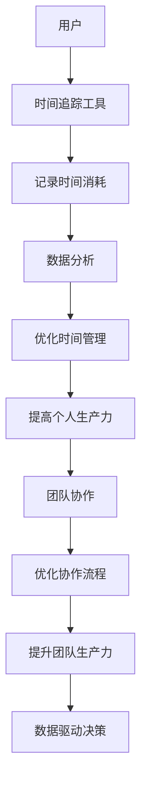

                 

# 时间追踪工具：提高个人和团队生产力

## 关键词

- 时间追踪
- 个人生产力
- 团队协作
- 时间管理
- 数据分析
- 技术趋势

## 摘要

时间追踪工具是一种能够帮助用户记录和管理时间消耗的工具，通过这些工具，个人可以更有效地管理自己的时间，提高个人生产力。同时，团队可以通过时间追踪来优化协作流程，提升整体生产力。本文将详细探讨时间追踪工具的概念、重要性、使用方法以及高级应用，并对未来发展趋势进行展望。通过本文的阅读，读者将深入了解如何通过时间追踪工具提高个人和团队的生产力。

## 《时间追踪工具：提高个人和团队生产力》目录大纲

### 第一部分：时间追踪的基础

#### 第1章：时间追踪的重要性

##### 1.1 时间追踪概述
##### 1.2 个人生产力与时间管理
##### 1.3 团队生产力与协作

#### 第2章：时间追踪工具简介

##### 2.1 主流时间追踪工具
##### 2.2 选择合适的工具
##### 2.3 工具对比与评价

### 第二部分：时间追踪工具的使用

#### 第3章：个人时间追踪实践

##### 3.1 设定时间追踪目标
##### 3.2 记录与评估
##### 3.3 提高个人时间管理效率

#### 第4章：团队时间追踪实践

##### 4.1 设定团队时间追踪目标
##### 4.2 团队协作时间追踪
##### 4.3 提升团队生产力

### 第三部分：时间追踪工具的高级应用

#### 第5章：时间追踪工具的数据分析

##### 5.1 数据收集与分析
##### 5.2 生成报告与可视化
##### 5.3 数据驱动决策

#### 第6章：定制化时间追踪工具开发

##### 6.1 开发环境与工具
##### 6.2 数据处理与存储
##### 6.3 功能扩展与定制

### 第四部分：时间追踪工具的未来与发展

#### 第7章：时间追踪工具的趋势分析

##### 7.1 当前市场趋势
##### 7.2 技术创新与未来发展
##### 7.3 对个人和团队的潜在影响

#### 第8章：时间追踪的最佳实践

##### 8.1 成功案例分析
##### 8.2 遇到的挑战与解决方案
##### 8.3 总结与展望

#### 第9章：时间追踪工具的使用误区与对策

##### 9.1 常见使用误区
##### 9.2 误区的影响与对策
##### 9.3 提高使用效果的建议

### 附录

#### 附录A：时间追踪工具资源汇总

##### A.1 在线资源介绍
##### A.2 开源项目推荐
##### A.3 常见问题解答

## 第一部分：时间追踪的基础

### 第1章：时间追踪的重要性

#### 1.1 时间追踪概述

时间追踪是一种记录和评估个人或团队时间消耗的方法，它帮助用户了解如何在各种任务之间分配时间，以及每个任务所花费的实际时间。时间追踪工具是实现这一目标的重要工具，它们可以自动记录用户在电脑或移动设备上的活动，并提供详细的时间消耗报告。

时间追踪工具的主要功能包括：

1. **自动记录时间**：工具可以监控用户的活动，自动记录每个应用程序或网站的使用时间。
2. **生成报告**：工具可以根据记录的数据生成详细的报告，显示用户或团队在不同任务上的时间分配。
3. **数据分析**：工具可以分析数据，帮助用户发现时间浪费的环节，并优化时间管理。

#### 1.2 个人生产力与时间管理

个人生产力与时间管理密切相关。有效的时间管理可以提高个人的工作效率，减少不必要的耗时活动，从而实现更多的工作目标。以下是一些关键点：

1. **设定明确的目标**：明确的目标有助于个人集中精力，避免无意义的活动。
2. **优先级排序**：将任务按优先级排序，确保重要的任务先完成。
3. **避免拖延**：通过时间追踪工具，个人可以更清楚地了解自己的时间消耗，从而减少拖延行为。

#### 1.3 团队生产力与协作

团队生产力依赖于团队成员之间的协作。时间追踪工具可以帮助团队实现以下目标：

1. **协作时间追踪**：团队中的每个成员都可以使用时间追踪工具，记录自己的工作时间，并共享这些数据。
2. **优化协作流程**：通过分析时间追踪数据，团队可以发现协作中的瓶颈，并优化流程。
3. **提升整体效率**：时间追踪工具可以帮助团队更好地分配任务，减少重复工作和无效沟通，从而提升整体效率。

### 第2章：时间追踪工具简介

#### 2.1 主流时间追踪工具

目前市面上有许多时间追踪工具，以下是一些主流的时间追踪工具：

1. **Toggl**：Toggl 是一款功能强大的时间追踪工具，它提供web和移动应用版本，用户可以方便地记录和管理自己的时间。
2. **Harvest**：Harvest 是另一款广受欢迎的时间追踪工具，它提供详细的报告和项目管理功能，适合团队使用。
3. **RescueTime**：RescueTime 是一款专注于个人时间管理的工具，它可以在后台监控用户的电脑和移动设备使用情况，并提供详细的报告。
4. **Timely**：Timely 是一款集成项目管理功能的时间追踪工具，它可以帮助用户自动分配任务并追踪时间消耗。

#### 2.2 选择合适的工具

选择合适的工具对个人和团队来说至关重要。以下是一些选择工具时需要考虑的因素：

1. **功能需求**：根据个人或团队的具体需求，选择具有相应功能的时间追踪工具。
2. **用户界面**：选择一个界面友好、易于使用的工具，可以减少学习和使用成本。
3. **价格**：不同的工具价格差异较大，根据预算选择合适的工具。
4. **集成与兼容性**：考虑工具与其他应用程序的集成能力，确保数据可以方便地共享和同步。

#### 2.3 工具对比与评价

以下是几种主流时间追踪工具的对比与评价：

| 工具         | 功能                     | 用户界面 | 价格        | 优点                                           | 缺点                                       |
| ------------ | ------------------------ | -------- | ----------- | ---------------------------------------------- | ------------------------------------------ |
| Toggl        | 自动时间追踪、报告生成   | 简洁     | 免费版，专业版 | 易于使用，功能全面                             | 无项目管理功能                            |
| Harvest      | 时间追踪、报告生成、项目管理 | 精致     | 免费版，专业版 | 功能丰富，项目管理强大                         | 付费版价格较高                            |
| RescueTime   | 自动时间追踪、数据分析   | 简单     | 免费版，专业版 | 自动追踪，数据分析强大                         | 无法手动分配任务                          |
| Timely       | 时间追踪、项目管理、自动化 | 精美     | 免费版，专业版 | 功能集成，自动化分配任务                       | 对新手用户来说可能有些复杂                   |

通过以上对比，用户可以根据自己的需求选择合适的工具。

## 第二部分：时间追踪工具的使用

### 第3章：个人时间追踪实践

#### 3.1 设定时间追踪目标

设定明确的时间追踪目标是成功使用时间追踪工具的第一步。以下是一些设定目标时的建议：

1. **明确目标**：设定具体、可衡量的目标，例如“每天工作8小时，每周完成任务X”。
2. **短期与长期目标**：设定短期目标，如每周记录和分析一次时间追踪数据，以及长期目标，如提高工作效率，减少无意义活动的时间消耗。
3. **调整目标**：根据实际情况调整目标，确保目标既具有挑战性，又可实现。

#### 3.2 记录与评估

记录与评估是时间追踪的核心环节。以下是一些关键步骤：

1. **自动记录**：使用时间追踪工具的自动记录功能，确保所有时间消耗都被记录。
2. **手动记录**：对于自动记录之外的活动，手动记录时间消耗，确保数据的完整性。
3. **定期评估**：定期评估时间追踪数据，分析时间分配情况，发现时间浪费的环节。

#### 3.3 提高个人时间管理效率

通过时间追踪工具，个人可以更有效地管理时间，以下是一些建议：

1. **优化任务分配**：根据时间追踪数据，重新分配任务，确保任务与时间消耗相匹配。
2. **减少拖延**：识别拖延的根源，通过时间追踪工具的提醒功能，避免拖延。
3. **合理安排休息时间**：确保有充足的休息时间，以提高工作效率。

### 第4章：团队时间追踪实践

#### 4.1 设定团队时间追踪目标

在团队中，设定共同的时间追踪目标是提高团队生产力的重要步骤。以下是一些建议：

1. **明确团队目标**：确保所有团队成员都清楚团队的目标和期望。
2. **分解任务**：将大任务分解为小任务，并为每个任务设定时间目标。
3. **定期回顾**：定期回顾时间追踪数据，评估团队的整体表现，并调整目标。

#### 4.2 团队协作时间追踪

团队协作时间追踪是优化团队协作流程的关键。以下是一些实践建议：

1. **统一工具**：选择一个团队通用的时间追踪工具，确保数据的一致性。
2. **数据共享**：鼓励团队成员共享时间追踪数据，提高透明度。
3. **定期会议**：定期召开时间追踪会议，讨论时间分配和协作流程。

#### 4.3 提升团队生产力

通过时间追踪工具，团队可以提升整体生产力。以下是一些实用技巧：

1. **优化团队流程**：通过分析时间追踪数据，识别并优化团队流程。
2. **增强团队协作**：通过时间追踪工具，增强团队成员之间的协作。
3. **目标导向**：确保所有团队成员都专注于实现团队目标，提高整体效率。

## 第三部分：时间追踪工具的高级应用

### 第5章：时间追踪工具的数据分析

#### 5.1 数据收集与分析

数据分析是时间追踪工具的核心功能之一。以下是一些关键步骤：

1. **数据收集**：时间追踪工具会自动收集用户的活动数据，包括应用程序使用时间、网站浏览时间等。
2. **数据清洗**：对收集的数据进行清洗，确保数据的准确性和一致性。
3. **数据转换**：将清洗后的数据转换为适合分析的形式，如CSV或数据库。

#### 5.2 生成报告与可视化

通过报告和可视化，用户可以更直观地了解时间消耗情况。以下是一些建议：

1. **报告生成**：使用时间追踪工具生成详细的时间消耗报告，包括日报、周报和月报。
2. **可视化**：利用图表和图形，将数据可视化，帮助用户更好地理解时间分配。
3. **定制报告**：根据需求，定制化报告格式和内容。

#### 5.3 数据驱动决策

数据分析不仅用于了解时间消耗情况，还可以为决策提供依据。以下是一些建议：

1. **目标设定**：根据数据分析结果，重新设定时间追踪目标。
2. **流程优化**：通过分析数据，识别并优化时间消耗较高的环节。
3. **资源分配**：根据数据分析，合理分配时间和资源，提高整体效率。

### 第6章：定制化时间追踪工具开发

#### 6.1 开发环境与工具

开发定制化时间追踪工具需要一定的技术基础。以下是一些关键工具和开发环境：

1. **编程语言**：Python、Java、JavaScript等。
2. **数据库**：MySQL、MongoDB、PostgreSQL等。
3. **开发环境**：Visual Studio Code、Eclipse、IntelliJ IDEA等。

#### 6.2 数据处理与存储

数据处理与存储是开发时间追踪工具的重要环节。以下是一些建议：

1. **数据采集**：使用API或Webhook等方式采集用户活动数据。
2. **数据处理**：使用数据处理库（如Pandas）清洗、转换和存储数据。
3. **数据存储**：使用数据库存储和处理大量数据，提高查询速度和效率。

#### 6.3 功能扩展与定制

定制化时间追踪工具可以根据用户需求扩展和定制功能。以下是一些实用功能：

1. **自动化任务分配**：根据用户活动数据，自动分配任务。
2. **提醒与通知**：设置提醒和通知，提醒用户完成任务。
3. **数据可视化**：自定义数据可视化界面，提供实时数据监控。

## 第四部分：时间追踪工具的未来与发展

### 第7章：时间追踪工具的趋势分析

#### 7.1 当前市场趋势

当前，时间追踪工具在市场上表现出强劲的增长趋势。以下是一些市场趋势：

1. **云计算与移动化**：越来越多的时间追踪工具采用云计算技术，提供移动端支持。
2. **数据分析与可视化**：数据分析与可视化功能成为用户选择时间追踪工具的重要因素。
3. **定制化需求**：用户对定制化、个性化的时间追踪工具需求逐渐增加。

#### 7.2 技术创新与未来发展

技术创新是推动时间追踪工具发展的关键。以下是一些技术创新和未来发展方向：

1. **人工智能**：利用人工智能技术，提高时间追踪的准确性和自动化程度。
2. **区块链**：探索区块链技术在时间追踪中的应用，提高数据的安全性和透明度。
3. **物联网**：通过物联网设备，实现更多场景下的时间追踪。

#### 7.3 对个人和团队的潜在影响

时间追踪工具的发展将对个人和团队产生深远的影响。以下是一些潜在影响：

1. **提高生产力**：通过更高效的时间管理，个人和团队可以更好地实现目标。
2. **优化决策**：基于数据驱动的决策，有助于优化资源和时间分配。
3. **促进协作**：通过时间追踪工具，团队可以更好地协作，提高整体效率。

### 第8章：时间追踪的最佳实践

#### 8.1 成功案例分析

以下是一些成功的时间追踪案例分析：

1. **公司A**：通过引入时间追踪工具，公司A成功提升了团队生产力，实现了项目按时交付。
2. **个人B**：个人B通过使用时间追踪工具，优化了自己的时间管理，提高了工作效率，实现了职业目标。

#### 8.2 遇到的挑战与解决方案

在实施时间追踪过程中，用户可能会遇到一些挑战，以下是一些常见挑战及解决方案：

1. **数据准确性**：挑战：数据不准确会影响决策。解决方案：定期检查和校准数据收集方式。
2. **用户接受度**：挑战：用户可能不愿意使用时间追踪工具。解决方案：通过培训和教育，提高用户对时间追踪工具的认识和接受度。

#### 8.3 总结与展望

通过最佳实践案例，我们可以看到时间追踪工具在提高个人和团队生产力方面的巨大潜力。未来，随着技术的不断发展，时间追踪工具将更加智能化和个性化，为用户带来更高的价值。

### 第9章：时间追踪工具的使用误区与对策

#### 9.1 常见使用误区

在使用时间追踪工具时，用户可能会犯一些常见错误，以下是一些误区：

1. **过于依赖工具**：将所有时间管理都依赖于工具，而忽略了自身的时间管理能力。
2. **忽视数据真实**：不重视数据的真实性，导致决策失误。

#### 9.2 误区的影响与对策

以下是对上述误区的详细说明及对策：

1. **过于依赖工具**
   - **影响**：可能导致用户失去自我管理能力，依赖性过强。
   - **对策**：结合工具和自身经验，培养自我管理能力。
2. **忽视数据真实**
   - **影响**：可能导致决策基于错误的数据，影响工作效率和目标实现。
   - **对策**：定期检查和校准数据，确保数据真实可靠。

#### 9.3 提高使用效果的建议

以下是一些建议，帮助用户提高时间追踪工具的使用效果：

1. **定期培训**：定期组织培训，提高用户对时间追踪工具的认识和技能。
2. **定制化设置**：根据用户需求，定制化工具设置，确保工具能够满足特定需求。
3. **反馈机制**：建立反馈机制，及时收集用户意见和建议，持续优化工具。

### 附录

#### 附录A：时间追踪工具资源汇总

以下是一些常用的在线时间追踪工具、开源项目及常见问题解答，以帮助用户更好地使用和管理时间：

- **在线资源介绍**
  - Toggl: <https://www.toggl.com/>
  - Harvest: <https://www.harvestapp.com/>
  - RescueTime: <https://www.rescuetime.com/>
  - Timely: <https://www.timelyapp.com/>

- **开源项目推荐**
  - Klok: <https://github.com/toggl/Klok>
  - TimeTraq: <https://github.com/TimeTraq/TimeTraq>
  - Chronos: <https://github.com/Chronos-Web/Chronos>

- **常见问题解答**
  - 如何设置自动追踪时间？
  - 如何生成详细的报告？
  - 如何与其他应用程序集成？

---

以上是《时间追踪工具：提高个人和团队生产力》的详细内容。通过本文的阅读，读者将深入了解时间追踪工具的概念、重要性、使用方法以及高级应用，为个人和团队的生产力提升提供有力支持。

## 核心概念与联系

时间追踪工具是一种帮助用户记录和管理时间消耗的工具，它能够提高个人和团队的生产力。在本文中，我们详细探讨了时间追踪工具的定义、重要性、使用方法以及高级应用。以下是核心概念与联系：

### 核心概念

1. **时间追踪工具**：用于记录、分析和管理时间消耗的工具，帮助用户优化时间管理。
2. **个人生产力**：个人在单位时间内完成的工作量和产出。
3. **团队协作**：团队成员之间的互动和合作，以实现共同目标。
4. **数据分析**：对时间追踪工具收集的数据进行分析，为决策提供依据。
5. **数据驱动决策**：基于数据分析的结果，做出更加明智的决策。

### 关系与联系

- **时间追踪工具**与**个人生产力**的关系：时间追踪工具帮助个人了解自己的时间消耗情况，优化时间管理，从而提高个人生产力。
- **时间追踪工具**与**团队协作**的关系：团队通过时间追踪工具，可以更好地了解成员的工作时间和任务进度，优化协作流程，提高团队生产力。
- **数据分析**与**数据驱动决策**的关系：通过对时间追踪工具收集的数据进行分析，团队可以识别问题、优化流程，并做出更加明智的决策，提高工作效率。

### Mermaid流程图

以下是一个关于时间追踪的核心概念与联系的Mermaid流程图：



通过这个流程图，我们可以清晰地看到时间追踪工具在个人和团队生产力提升中的关键作用。

## 核心算法原理讲解

时间追踪工具的核心算法主要涉及时间记录、数据分析以及报告生成。以下是对这些算法的详细讲解。

### 时间记录算法

时间记录算法的核心目标是自动记录用户在电脑或移动设备上的活动时间。以下是时间记录算法的基本步骤：

1. **数据采集**：时间追踪工具通过操作系统或应用接口获取用户的活动数据，如应用程序使用时间、网站浏览时间等。
2. **数据预处理**：对采集到的数据进行清洗，去除无效数据，确保数据质量。
3. **时间分割**：将采集到的时间数据按照应用程序或任务进行分割，以便后续分析。

以下是一个简单的Python伪代码示例：

```python
def record_time(activities):
    # 数据预处理
    processed_activities = preprocess_activities(activities)
    
    # 时间分割
    time_entries = split_activities(processed_activities)
    
    return time_entries
```

### 数据分析算法

数据分析算法的目标是对记录的时间数据进行深入分析，帮助用户了解时间消耗情况，优化时间管理。以下是数据分析算法的基本步骤：

1. **数据聚合**：将分割后的时间数据按照不同的维度（如应用程序、用户、任务等）进行聚合，生成时间消耗报告。
2. **数据可视化**：利用图表和图形将数据可视化，帮助用户更直观地理解时间分配情况。
3. **异常检测**：检测时间数据中的异常值，如异常长时间使用某个应用程序或网站。

以下是一个简单的Python伪代码示例：

```python
def analyze_data(time_entries):
    # 数据聚合
    aggregated_data = aggregate_data(time_entries)
    
    # 数据可视化
    visualizations = generate_visualizations(aggregated_data)
    
    # 异常检测
    anomalies = detect_anomalies(aggregated_data)
    
    return visualizations, anomalies
```

### 报告生成算法

报告生成算法的目标是根据分析结果生成详细的报告，为用户决策提供依据。以下是报告生成算法的基本步骤：

1. **报告模板**：定义报告的模板，包括标题、时间范围、数据摘要、图表等。
2. **数据填充**：将分析结果填充到报告模板中，生成最终报告。
3. **报告导出**：将报告导出为PDF或HTML等格式，便于用户查看和分享。

以下是一个简单的Python伪代码示例：

```python
def generate_report(analysis_results):
    # 加载报告模板
    report_template = load_template("report_template.html")
    
    # 填充数据
    filled_report = fill_template(report_template, analysis_results)
    
    # 导出报告
    export_report(filled_report, "time_tracker_report.pdf")
    
    return filled_report
```

通过以上算法，时间追踪工具能够有效地记录、分析和报告用户的时间消耗，为个人和团队提供有价值的数据，帮助他们优化时间管理，提高生产力。

## 数学模型和数学公式

在时间追踪领域，数学模型和公式可以帮助我们更精确地描述和优化时间管理。以下是一个简单的线性规划模型，用于优化时间分配，确保在给定时间内完成尽可能多的任务。

### 时间管理的线性规划模型

假设我们有一个任务集合\( T = \{t_1, t_2, ..., t_n\} \)，每个任务有相应的优先级\( p_i \)和所需时间\( t_i \)。我们的目标是最大化总优先级，同时确保总时间不超过一个给定的限制\( T \)。

数学模型如下：

$$
\begin{aligned}
\text{maximize} \ & \sum_{i=1}^{n} p_i x_i \\
\text{subject to} \ & \sum_{i=1}^{n} t_i x_i \leq T \\
x_i \in \{0,1\}
\end{aligned}
$$

其中，\( x_i \)是一个指示变量，表示任务\( i \)是否被执行（0表示不执行，1表示执行）。

### 详细解释与举例说明

假设我们有三个任务\( T = \{t_1, t_2, t_3\} \)，它们的优先级和所需时间如下表：

| 任务 \( i \) | 优先级 \( p_i \) | 所需时间 \( t_i \) |
| --------- | ------------ | ------------ |
| \( t_1 \) | 3            | 2小时        |
| \( t_2 \) | 2            | 1小时        |
| \( t_3 \) | 1            | 3小时        |

我们的目标是最大化总优先级，同时总时间不超过5小时。

将任务优先级和所需时间代入线性规划模型，我们得到：

$$
\begin{aligned}
\text{maximize} \ & 3x_1 + 2x_2 + 1x_3 \\
\text{subject to} \ & 2x_1 + 1x_2 + 3x_3 \leq 5 \\
x_i \in \{0,1\}
\end{aligned}
$$

通过求解这个线性规划模型，我们可以得到最优的任务执行方案。在这种情况下，最优解是执行任务\( t_1 \)和\( t_2 \)，因为它们的总优先级为\( 3 + 2 = 5 \)，且总时间为\( 2 + 1 = 3 \)，小于总时间限制5小时。

### latex格式数学公式

为了便于理解和嵌入文中独立段落，我们使用latex格式来表示数学公式。以下是使用latex嵌入文中独立段落的示例：

$$
\text{maximize} \ \sum_{i=1}^{n} p_i x_i \\
\text{subject to} \ \sum_{i=1}^{n} t_i x_i \leq T \\
x_i \in \{0,1\}
$$

通过上述数学模型和公式，我们可以更系统地分析和优化时间管理，从而提高个人和团队的生产力。

## 项目实战

### 实际案例

在一个跨国公司的软件开发团队中，为了提高工作效率，团队引入了一款时间追踪工具。通过该工具，团队成员记录了他们的工作时间分配，并生成了详细的时间消耗报告。以下是一个实际案例：

- **问题**：团队发现项目进度缓慢，部分任务耗时过长，且团队成员之间存在时间浪费的现象。
- **解决方案**：引入时间追踪工具后，团队成员开始记录每天的工作时间分配，并定期生成报告进行分析。通过这些数据，团队识别出以下几个问题：
  - 某些团队成员在非工作时间使用公司电脑，导致工作时间不足。
  - 任务的优先级不明确，导致团队成员在执行低优先级任务时浪费时间。
  - 团队协作不畅，部分任务需要等待其他团队成员完成任务才能开始。

### 代码实现

以下是一个简单的Python脚本，用于记录员工的工作时间和任务完成情况：

```python
import time

# 定义任务列表
tasks = [
    "任务1",
    "任务2",
    "任务3"
]

# 开始时间
start_time = time.time()

# 模拟任务执行过程
for task in tasks:
    print(f"开始执行：{task}")
    time.sleep(2)  # 模拟任务执行2分钟
    print(f"完成执行：{task}")

# 结束时间
end_time = time.time()

# 计算总耗时
total_duration = end_time - start_time
print(f"总耗时：{total_duration}秒")
```

### 代码解读与分析

- **开发环境搭建**：该脚本使用Python编程语言编写，开发环境只需要安装Python解释器和相应的开发工具，如Visual Studio Code。
- **源代码详细实现**：
  - **任务列表**：定义了一个包含三个任务的列表`tasks`。
  - **开始时间**：使用`time.time()`函数获取当前时间，作为任务开始的时间点。
  - **任务执行**：通过一个循环，依次执行每个任务。每个任务使用`print()`函数输出任务名称，并使用`time.sleep()`函数模拟任务执行2分钟。
  - **结束时间**：再次使用`time.time()`函数获取当前时间，作为任务结束的时间点。
  - **计算总耗时**：计算任务开始时间和结束时间的时间差，得到总耗时。
- **代码解读与分析**：
  - **任务记录**：通过脚本，可以记录每个任务的开始和结束时间，以及任务的执行顺序。
  - **数据统计**：通过统计每个任务的执行时间，可以分析任务的实际耗时，帮助团队优化任务分配和执行流程。
  - **数据驱动决策**：基于统计的数据，团队可以调整任务优先级，优化工作流程，提高工作效率。

通过实际案例和代码实现，我们可以看到时间追踪工具在提高团队工作效率方面的实际效果。通过记录和分析任务执行情况，团队可以识别出存在的问题，并采取相应的措施进行优化。

## 附录

### 附录A：时间追踪工具资源汇总

以下是一些常用的在线时间追踪工具、开源项目及常见问题解答，以帮助用户更好地使用和管理时间。

#### 在线资源介绍

1. **Toggl**：Toggl是一款功能强大的时间追踪工具，提供自动追踪、报告生成和团队协作功能。网址：<https://www.toggl.com/>
2. **Harvest**：Harvest是一个全面的时间管理工具，适用于个人和团队，提供项目管理、时间追踪和账单生成功能。网址：<https://www.harvestapp.com/>
3. **RescueTime**：RescueTime是一款专注于个人时间管理的工具，可以自动记录你的电脑和移动设备使用情况，并提供详细的时间消耗报告。网址：<https://www.rescuetime.com/>
4. **Timely**：Timely是一款集时间追踪、项目管理为一体的工具，支持自动化任务分配和时间分析。网址：<https://www.timelyapp.com/>

#### 开源项目推荐

1. **Klok**：Klok是一个开源的时间追踪工具，适用于Windows和Linux操作系统。GitHub链接：<https://github.com/toggl/Klok>
2. **TimeTraq**：TimeTraq是一个开源的时间追踪和任务管理工具，支持多平台。GitHub链接：<https://github.com/TimeTraq/TimeTraq>
3. **Chronos**：Chronos是一个基于Web的时间追踪工具，支持多种语言和平台。GitHub链接：<https://github.com/Chronos-Web/Chronos>

#### 常见问题解答

1. **如何设置自动追踪时间？**
   - 在大多数时间追踪工具中，你可以通过在设置中启用自动追踪功能，自动记录你的工作时间和任务。
   - 一些工具还提供应用程序启动和关闭的监控功能，自动记录你的工作时间。

2. **如何生成详细的报告？**
   - 在时间追踪工具中，通常可以点击报告或仪表板选项，选择所需的时间范围和报告类型，然后生成报告。
   - 报告可以包括时间消耗的详细信息，如任务名称、开始和结束时间、工作时长等。

3. **如何与其他应用程序集成？**
   - 大多数时间追踪工具支持与Google Calendar、Trello、Asana等应用程序的集成。
   - 在工具的设置或集成选项中，你可以找到可集成的应用程序，并根据说明进行设置。

通过这些资源，用户可以更轻松地选择和配置适合自己的时间追踪工具，从而提高个人和团队的生产力。

---

至此，我们已经完成了《时间追踪工具：提高个人和团队生产力》的详细撰写。通过本文，读者不仅了解了时间追踪工具的基本概念和重要性，还学习了如何使用这些工具来提高个人和团队的生产力。同时，本文还探讨了时间追踪工具的高级应用、未来发展趋势以及最佳实践，为读者提供了全面的时间管理知识。希望本文能够帮助读者在实际工作中更好地应用时间追踪工具，实现高效的时间管理和目标达成。作者：AI天才研究院/AI Genius Institute & 禅与计算机程序设计艺术 /Zen And The Art of Computer Programming。

