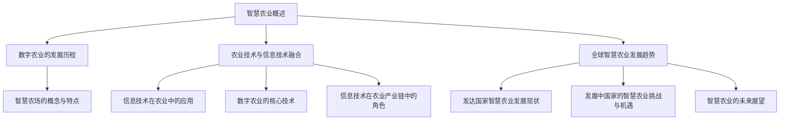
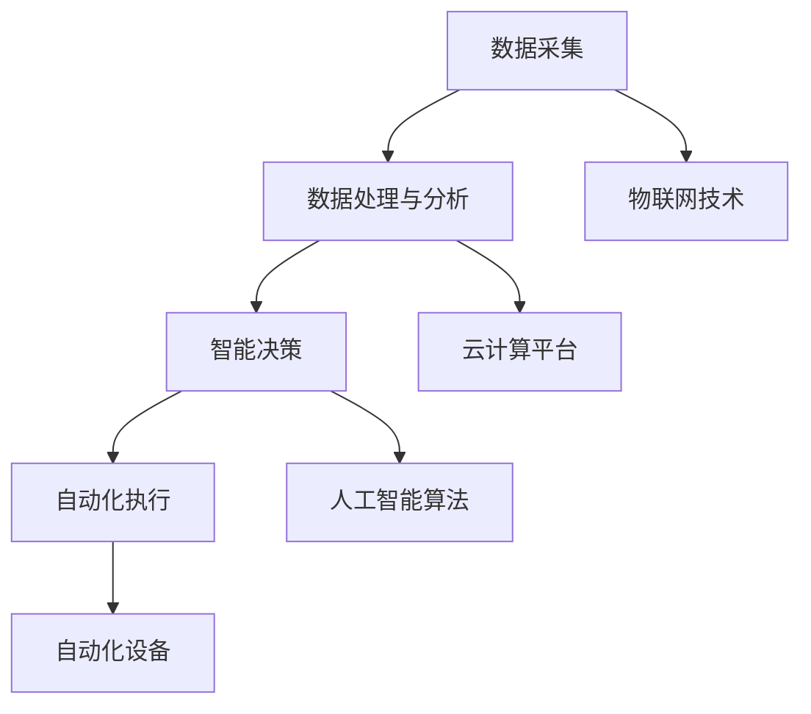
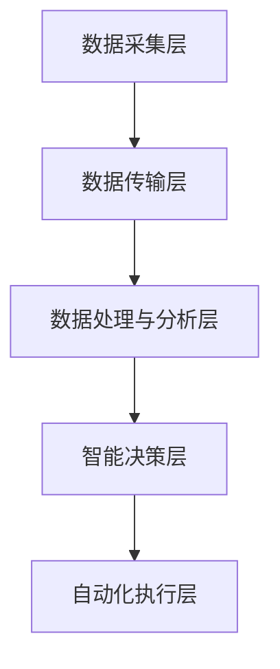
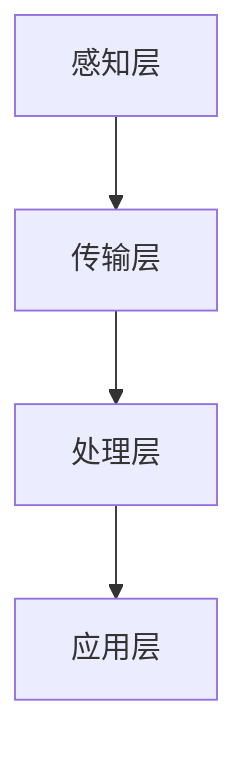
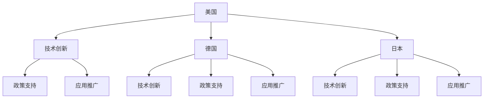
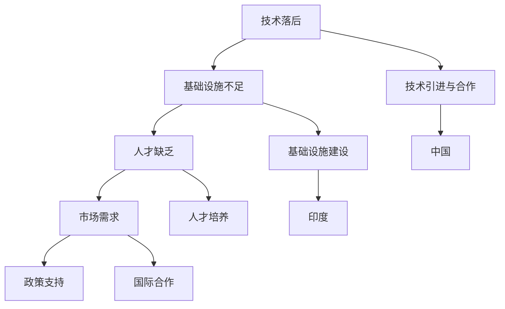
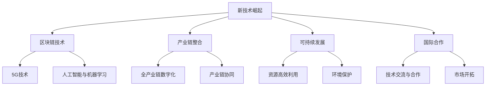

                 

### 第一部分：引言与背景知识

#### 1.1 未来的智慧农业概述

##### 1.1.1 什么是智慧农业

智慧农业，即利用先进的信息技术，如物联网、大数据、人工智能等，对农业生产过程进行精准管理、优化和自动化控制。其核心在于通过智能手段提高农业生产效率、降低成本、减少环境污染，并最终实现农业可持续发展。

智慧农业的兴起源于全球对食品安全、环境保护和资源高效利用的迫切需求。随着信息技术的快速发展，智慧农业已经成为全球农业现代化的重要方向。

##### 1.1.2 数字农业的发展历程

数字农业的概念最早可以追溯到20世纪90年代，当时信息技术开始逐步应用于农业生产中。从最初的农田信息化管理，到现在的智能农场、数字农业，数字农业经历了从简单信息化到复杂智能化的演变过程。

- **第一阶段：农田信息化管理**（1990s-2000s）
  这一阶段主要利用计算机和数据库对农田信息进行管理，包括土地利用、气象数据、土壤检测等。

- **第二阶段：精准农业**（2000s-2010s）
  精准农业通过GPS定位、遥感技术和传感器等手段，实现农田的精准施肥、灌溉和病虫害防治。

- **第三阶段：智能农场与数字农业**（2010s-至今）
  利用大数据、人工智能和物联网等技术，实现农业生产的全流程智能化管理，从种植、养殖到加工、销售，各个环节都实现了数字化和智能化。

##### 1.1.3 智慧农场的概念与特点

智慧农场是智慧农业的最高形态，它通过集成先进的物联网、大数据、人工智能等技术，实现农业生产的全面数字化和智能化。

- **概念**：智慧农场是一个高度集成的系统，通过数据采集、分析和处理，实现对农田、作物、养殖环境等的实时监控和智能管理。

- **特点**：
  - **数字化**：农业生产过程数据化，所有信息都通过传感器、物联网等技术实时采集和上传。
  - **智能化**：利用大数据分析和人工智能算法，实现农业生产的智能决策和自动化控制。
  - **高效化**：通过精确的种植和养殖管理，提高生产效率和产量，降低生产成本。

#### 1.2 农业技术与信息技术融合

##### 1.2.1 信息技术在农业中的应用

信息技术在农业中的应用非常广泛，涵盖了从农田管理、种植、养殖到加工、销售的整个农业生产过程。

- **农田管理**：利用GIS（地理信息系统）技术，实现农田的数字化管理，包括土地利用规划、水资源管理、病虫害监测等。
- **种植**：通过GPS定位、遥感技术和传感器，实现农田的精准施肥、灌溉和病虫害防治。
- **养殖**：利用传感器和物联网技术，实时监控养殖环境，如温度、湿度、空气质量等，实现养殖过程的自动化管理。
- **加工与销售**：利用大数据和人工智能技术，实现农产品的质量检测、分类、包装和销售过程的智能化管理。

##### 1.2.2 数字农业的核心技术

数字农业的核心技术包括物联网、大数据、人工智能、云计算等。

- **物联网**：通过传感器和物联网技术，实现农田、作物、养殖环境等数据的实时采集和传输。
- **大数据**：通过对农业生产数据的收集、存储、分析和处理，实现农业生产的精准管理和优化。
- **人工智能**：利用机器学习、深度学习等人工智能技术，实现农业生产的智能决策和自动化控制。
- **云计算**：通过云计算技术，实现农业数据的存储、处理和分析，为农业生产提供强大的计算能力和数据支持。

##### 1.2.3 信息技术在农业产业链中的角色

信息技术在农业产业链中扮演着至关重要的角色，贯穿于从种植、养殖到加工、销售的各个环节。

- **种植环节**：通过物联网、遥感技术和大数据分析，实现农田的精准管理，提高产量和质量。
- **养殖环节**：通过传感器和物联网技术，实现养殖环境的实时监控和自动化管理，提高养殖效率和产品质量。
- **加工环节**：利用大数据和人工智能技术，实现农产品的质量检测、分类和包装的智能化管理，提高加工效率和质量。
- **销售环节**：通过电子商务和物联网技术，实现农产品的在线销售和智能配送，提高销售效率和市场竞争力。

#### 1.3 全球智慧农业发展趋势

##### 1.3.1 发达国家智慧农业发展现状

发达国家在智慧农业领域具有领先地位，主要表现在以下几个方面：

- **技术创新**：发达国家在物联网、大数据、人工智能等核心技术领域具有明显优势，不断推动智慧农业的发展。
- **政策支持**：发达国家政府高度重视智慧农业的发展，出台了一系列政策措施，鼓励农业企业技术创新和数字化转型。
- **应用推广**：发达国家广泛推广智慧农业技术，如精准农业、智能养殖、智能灌溉等，取得了显著成效。

##### 1.3.2 发展中国家的智慧农业挑战与机遇

发展中国家在智慧农业领域面临着一系列挑战：

- **技术落后**：发展中国家在物联网、大数据、人工智能等核心技术领域相对落后，需要加大技术研发和投入。
- **基础设施不足**：发展中国家农业基础设施薄弱，如农田水利、交通运输等，限制了智慧农业的发展。
- **人才缺乏**：发展中国家农业人才短缺，特别是在信息技术和农业管理领域，需要加强人才培养和引进。

然而，发展中国家也面临着巨大的机遇：

- **市场需求**：随着全球人口增长和人们对食品安全、健康和生活品质的追求，发展中国家对智慧农业的需求日益增长。
- **政策支持**：发展中国家政府高度重视智慧农业的发展，出台了一系列政策措施，为智慧农业的发展提供了有力支持。
- **国际合作**：发展中国家可以通过国际合作，引进先进技术和管理经验，加快智慧农业的发展。

##### 1.3.3 智慧农业的未来展望

智慧农业的未来发展趋势将呈现以下几个特点：

- **核心技术突破**：随着物联网、大数据、人工智能等核心技术的不断发展，智慧农业的技术水平将不断提升。
- **全产业链整合**：智慧农业将实现从种植、养殖到加工、销售的全程数字化和智能化，形成高度整合的农业产业链。
- **可持续发展**：智慧农业将实现资源高效利用、环境保护和生态平衡，推动农业的可持续发展。
- **国际合作**：智慧农业将推动全球农业技术的交流与合作，促进全球农业的共同发展。

### 总结

智慧农业是农业现代化的重要方向，通过信息技术与农业的深度融合，可以实现农业生产的精准管理、优化和自动化控制，提高农业生产效率、降低成本、减少环境污染，实现农业的可持续发展。未来，智慧农业将在全球范围内得到广泛应用，推动农业的全面数字化转型，为人类提供更加丰富、安全、健康的农产品。



### 1.1.1 什么是智慧农业

智慧农业是一个综合性的概念，它涉及将先进的科学技术与传统的农业生产方式相结合，从而实现农业的智能化和精准化。智慧农业不仅仅是一个技术话题，更是一种全新的农业生产理念和模式。

**核心概念原理与架构：**

智慧农业的核心概念可以概括为“数据驱动、智能决策、自动化执行”。这一概念架构包括以下几个关键组成部分：

1. **数据采集**：利用各种传感器和物联网设备，实时采集农田、作物、环境等数据。
2. **数据处理与分析**：通过云计算平台，对采集到的海量数据进行处理、存储和分析，提取有价值的信息。
3. **智能决策**：利用人工智能算法，对分析结果进行智能处理，生成最优的决策方案。
4. **自动化执行**：通过自动化设备，如无人机、自动灌溉系统、智能监控设备等，执行智能决策方案。

**Mermaid 流程图：**



**伪代码示例：**

```python
# 数据采集
def collect_data(sensors):
    data = {}
    for sensor in sensors:
        data[sensor.id] = sensor.read_data()
    return data

# 数据处理与分析
def analyze_data(data):
    processed_data = {}
    for key, value in data.items():
        processed_data[key] = process_value(value)
    return processed_data

# 智能决策
def make_decision(processed_data):
    decision = {}
    for key, value in processed_data.items():
        decision[key] = intelligent_decision(value)
    return decision

# 自动化执行
def execute_decision(decision):
    for key, value in decision.items():
        action = create_action(value)
        execute_action(action)
```

### 1.1.2 数字农业的发展历程

数字农业是智慧农业的基础，它的兴起和发展经历了多个阶段，从最初的农田信息化管理，到精准农业，再到当前的智慧农业，数字农业的发展历程反映了信息技术在农业中的应用和演变。

**发展阶段：**

1. **农田信息化管理阶段（1990s-2000s）**
   - 这一阶段的主要特点是农业信息的数字化，通过计算机和数据库对农田信息进行管理，如土地利用、气象数据、土壤检测等。
   - 代表性技术：计算机技术、数据库技术、GIS（地理信息系统）。

2. **精准农业阶段（2000s-2010s）**
   - 精准农业通过使用GPS定位、遥感技术和传感器，实现农田的精准施肥、灌溉和病虫害防治。
   - 代表性技术：GPS、遥感技术、传感器、GIS。

3. **智慧农业阶段（2010s-至今）**
   - 智慧农业是数字农业的高级形态，利用大数据、人工智能、物联网等技术，实现农业生产的全流程数字化和智能化。
   - 代表性技术：物联网、大数据、人工智能、云计算。

**关键事件与里程碑：**

1. **1995年：全球农业信息化会议召开**
   - 这标志着全球农业信息化进程的正式启动，农业国家开始重视信息技术在农业中的应用。

2. **2005年：精准农业技术大规模应用**
   - 精准农业技术的广泛应用，使农业生产效率得到显著提升，为数字农业的发展奠定了基础。

3. **2010年：智慧农业概念提出**
   - 智慧农业概念的提出，标志着数字农业向更高级别的智能化发展。

4. **2020年：智慧农业技术成熟与普及**
   - 智慧农业技术的成熟和普及，使农业生产实现了从传统到智能的全面升级。

**发展趋势与未来展望：**

1. **技术持续创新**
   - 随着物联网、大数据、人工智能等技术的发展，数字农业和智慧农业的技术将持续创新，为农业提供更高效、更智能的解决方案。

2. **全产业链整合**
   - 数字农业和智慧农业将实现从种植、养殖到加工、销售的全程数字化和智能化，形成高度整合的农业产业链。

3. **可持续发展**
   - 通过精准管理和智能化控制，数字农业和智慧农业将实现资源的高效利用、环境保护和生态平衡，推动农业的可持续发展。

4. **国际合作**
   - 全球农业技术的发展将促进国际合作，各国通过技术交流与合作，共同推动智慧农业的发展。

### 1.1.3 智慧农场的概念与特点

智慧农场是智慧农业的最高形态，通过集成先进的物联网、大数据、人工智能等技术，实现对农业生产全过程的实时监控和智能管理。智慧农场的特点主要体现在以下几个方面：

**概念：**

智慧农场是一个高度集成的系统，它通过传感器、物联网设备、云计算平台和人工智能算法，实现对农田、作物、养殖环境等数据的实时采集、传输、分析和处理，从而实现农业生产的智能化和精准化。

**特点：**

1. **数字化**
   - 智慧农场通过物联网设备和传感器，实现对农田、作物、环境等数据的实时采集，所有信息数字化，便于管理和分析。

2. **智能化**
   - 利用大数据分析和人工智能算法，智慧农场能够自动生成最优的种植、灌溉、施肥、病虫害防治等方案，提高农业生产效率。

3. **自动化**
   - 智慧农场通过自动化设备，如自动灌溉系统、无人机、智能监控设备等，实现农业生产的自动化执行，降低人工成本。

4. **高效化**
   - 通过精确的种植和养殖管理，智慧农场能够提高产量和质量，降低生产成本，实现高效化生产。

**架构设计：**

智慧农场的架构设计包括以下几个关键部分：

1. **数据采集层**：利用各种传感器和物联网设备，实时采集农田、作物、环境等数据。

2. **数据传输层**：通过物联网网络，将采集到的数据传输到云计算平台。

3. **数据处理与分析层**：在云计算平台上，利用大数据技术和人工智能算法，对采集到的数据进行分析和处理。

4. **智能决策层**：根据分析结果，智能生成最优的种植、灌溉、施肥、病虫害防治等方案。

5. **自动化执行层**：通过自动化设备，执行智能决策方案。

**Mermaid 流程图：**



**伪代码示例：**

```python
# 数据采集
def collect_data(sensors):
    data = {}
    for sensor in sensors:
        data[sensor.id] = sensor.read_data()
    return data

# 数据传输
def transmit_data(data):
    for key, value in data.items():
        send_data_to_cloud(key, value)

# 数据处理与分析
def analyze_data(data):
    processed_data = {}
    for key, value in data.items():
        processed_data[key] = process_value(value)
    return processed_data

# 智能决策
def make_decision(processed_data):
    decision = {}
    for key, value in processed_data.items():
        decision[key] = intelligent_decision(value)
    return decision

# 自动化执行
def execute_decision(decision):
    for key, value in decision.items():
        action = create_action(value)
        execute_action(action)
```

### 1.2 农业技术与信息技术融合

#### 1.2.1 信息技术在农业中的应用

信息技术在农业中的应用已经成为推动农业现代化的重要力量。通过信息技术的融合，农业生产变得更加高效、精准和可持续。

**应用领域：**

1. **农田管理**：利用GIS（地理信息系统）和遥感技术，实现对农田的数字化管理，包括土地利用规划、水资源管理、病虫害监测等。

2. **种植**：通过GPS定位、传感器技术和物联网，实现精准农业，包括精准施肥、灌溉和病虫害防治。

3. **养殖**：利用传感器和物联网技术，实时监控养殖环境，如温度、湿度、空气质量等，实现养殖过程的自动化管理。

4. **加工与销售**：利用大数据和人工智能技术，实现农产品的质量检测、分类、包装和销售过程的智能化管理。

**关键技术：**

1. **物联网**：物联网技术在农业中的应用包括传感器网络、无线通信技术和数据处理平台。通过物联网，可以实现对农田、作物和环境的实时监控和数据采集。

2. **大数据**：大数据技术在农业中的应用主要体现在数据收集、存储、分析和处理。通过对大量农业数据的分析，可以提取出有价值的信息，为农业生产提供决策支持。

3. **人工智能**：人工智能技术在农业中的应用包括机器学习、深度学习和智能决策系统。通过人工智能，可以实现农业生产的自动化和智能化。

4. **云计算**：云计算技术为农业提供了强大的计算能力和数据存储能力。通过云计算，可以实现农业数据的远程访问和处理。

**案例研究：**

1. **美国精准农业项目**：美国在精准农业领域处于领先地位。通过GPS定位、传感器技术和大数据分析，实现了农田的精准管理，提高了农业生产效率。

2. **中国智慧农业示范项目**：中国多个地区开展了智慧农业示范项目，通过物联网、大数据和人工智能技术，实现了农业生产的智能化和精准化。

#### 1.2.2 数字农业的核心技术

数字农业的核心技术包括物联网、大数据、人工智能、云计算等。这些技术相互融合，共同推动农业的数字化和智能化。

**物联网技术：**

物联网技术在农业中的应用主要体现在传感器网络和无线通信技术。通过传感器，可以实时监测农田、作物和养殖环境的数据，如温度、湿度、土壤湿度、空气质量等。无线通信技术则保证了这些数据能够快速、可靠地传输到数据处理平台。

**大数据技术：**

大数据技术在农业中的应用主要体现在数据收集、存储、分析和处理。农业数据包括气象数据、土壤数据、作物生长数据、养殖数据等。通过对这些数据的分析，可以提取出有价值的信息，如作物生长状况、病虫害趋势、养殖环境优化等。

**人工智能技术：**

人工智能技术在农业中的应用包括机器学习、深度学习和智能决策系统。通过人工智能，可以实现农业生产的自动化和智能化。例如，利用机器学习算法，可以预测作物生长趋势，优化灌溉计划；利用深度学习算法，可以分析作物图像，识别病虫害。

**云计算技术：**

云计算技术为农业提供了强大的计算能力和数据存储能力。通过云计算，可以实现农业数据的远程访问和处理。同时，云计算平台还提供了丰富的数据分析工具和人工智能算法，为农业生产提供了强大的技术支持。

**关键技术架构：**

数字农业的关键技术架构通常包括以下几个层次：

1. **感知层**：通过传感器网络，实时采集农田、作物和养殖环境的数据。

2. **传输层**：通过无线通信技术，将感知层的数据传输到数据处理平台。

3. **处理层**：在数据处理平台上，利用大数据技术和人工智能算法，对传输层的数据进行分析和处理。

4. **应用层**：通过智能决策系统和自动化设备，实现对农业生产的智能管理和自动化控制。

**Mermaid 流程图：**



**伪代码示例：**

```python
# 感知层
def collect_data(sensors):
    data = {}
    for sensor in sensors:
        data[sensor.id] = sensor.read_data()
    return data

# 传输层
def transmit_data(data):
    for key, value in data.items():
        send_data_to_cloud(key, value)

# 处理层
def analyze_data(data):
    processed_data = {}
    for key, value in data.items():
        processed_data[key] = process_value(value)
    return processed_data

# 应用层
def execute_decision(decision):
    for key, value in decision.items():
        action = create_action(value)
        execute_action(action)
```

### 1.2.3 信息技术在农业产业链中的角色

信息技术在农业产业链中的应用贯穿于从种植、养殖到加工、销售的各个环节，发挥着至关重要的作用。

**种植环节：**

1. **精准农业技术**：通过GPS定位、传感器和遥感技术，实现对农田的精准施肥、灌溉和病虫害防治，提高农业生产效率和作物质量。
2. **智能监测系统**：利用传感器和物联网技术，实时监测作物生长环境，如土壤湿度、温度、光照等，为种植决策提供数据支持。
3. **智能种植方案**：基于大数据分析和人工智能算法，生成最优的种植方案，包括作物品种选择、种植密度、播种时间等。

**养殖环节：**

1. **智能养殖系统**：通过传感器和物联网技术，实时监控养殖环境，如温度、湿度、空气质量等，实现养殖过程的自动化管理。
2. **智能行为分析**：利用人工智能算法，分析动物的行为数据，如进食习惯、活动规律等，为养殖决策提供支持。
3. **智能疾病预警**：通过大数据分析，预测动物疾病的趋势，及时采取预防措施，降低疾病发生率。

**加工环节：**

1. **智能质量检测**：利用人工智能技术，对农产品进行质量检测，如颜色、形状、大小等，确保农产品质量。
2. **智能分类与包装**：利用图像识别技术和自动化设备，实现农产品的智能分类和包装，提高加工效率。
3. **智能物流管理**：通过物联网技术和大数据分析，优化物流路线和运输方式，提高物流效率。

**销售环节：**

1. **智能销售系统**：通过电子商务平台和物联网技术，实现农产品的在线销售和智能配送，提高销售效率。
2. **智能市场分析**：利用大数据分析，预测市场需求，优化产品结构和销售策略。
3. **智能售后服务**：通过物联网技术和大数据分析，提供个性化的售后服务，提高客户满意度。

**案例分析：**

1. **美国先正达（Syngenta）**：通过物联网和大数据技术，实现农业生产的精准管理，提高了作物的产量和品质。

2. **中国海泽尔（HAZEL）**：通过智能养殖系统，实现了对猪场的自动化管理，降低了养殖成本，提高了养殖效率。

3. **中国京东**：通过电子商务和物联网技术，实现了农产品的在线销售和智能配送，提高了销售效率和客户满意度。

### 1.3 全球智慧农业发展趋势

#### 1.3.1 发达国家智慧农业发展现状

发达国家在智慧农业领域处于领先地位，其发展现状体现在技术创新、政策支持、应用推广等多个方面。

**技术创新：**

1. **美国**：美国是智慧农业的先驱，拥有丰富的农业技术和数据资源。通过物联网、大数据、人工智能等技术的应用，美国实现了农业生产的全面数字化和智能化。例如，约翰·迪尔（John Deere）公司推出的智能农业解决方案，包括自动驾驶拖拉机、智能传感器等，大大提高了农业生产效率。

2. **德国**：德国在智慧农业领域也有着显著成就。德国的智慧农业项目主要集中在精准农业和智能养殖方面，如德国联邦农业部资助的“智慧农场”项目，通过物联网和大数据技术，实现了农业生产的全面数字化管理。

3. **日本**：日本智慧农业的发展主要得益于其先进的信息技术和高水平的农业生产。日本利用智能农业机器人、温室大棚、无人机等技术，实现了高效率、高质量的农业生产。

**政策支持：**

1. **美国**：美国政府高度重视智慧农业的发展，出台了一系列政策措施，如《农业改进法案》中涉及到的精准农业补贴、农业技术研究与发展项目等，为智慧农业提供了有力支持。

2. **德国**：德国政府通过资金投入和政策优惠，支持农业企业进行智慧农业技术的研发和应用。例如，德国联邦农业部提供的农业创新基金，专门用于支持智慧农业项目。

3. **日本**：日本政府通过一系列政策和项目，如“农业白皮书”、“未来农场”项目等，推动智慧农业的发展。同时，日本政府还注重人才培养，通过农业大学和科研机构，培养了一批智慧农业领域的专业人才。

**应用推广：**

1. **美国**：美国智慧农业技术在农业生产中的应用已经非常广泛，从种植、养殖到加工、销售，各个环节都实现了数字化和智能化管理。例如，美国许多农场已经实现了无人机播种、智能灌溉、自动收割等。

2. **德国**：德国智慧农业技术在农业领域的应用也在不断拓展，从大田作物到温室园艺，从畜牧业到水产养殖，都实现了智能化管理。例如，德国的智能温室项目，通过物联网和大数据技术，实现了作物的精准管理和自动化控制。

3. **日本**：日本智慧农业技术在农业生产中的应用主要集中在高效农业和精准农业方面。例如，日本的智能农场项目，通过智能温室、自动化灌溉系统、无人机等技术的应用，实现了作物的全年生产，提高了农业生产效率。

**总结：**

发达国家在智慧农业领域的发展现状表明，技术创新、政策支持和应用推广是智慧农业发展的重要推动力。通过物联网、大数据、人工智能等先进技术的应用，发达国家实现了农业生产的全面数字化和智能化，为全球智慧农业的发展提供了宝贵经验。



#### 1.3.2 发展中国家的智慧农业挑战与机遇

发展中国家的智慧农业发展面临着一系列挑战和机遇。这些挑战主要体现在技术落后、基础设施不足和人才缺乏等方面，而机遇则源于市场需求、政策支持和国际合作。

**挑战：**

1. **技术落后：** 与发达国家相比，发展中国家的信息技术和农业技术相对落后，缺乏先进的农业机械设备和智能管理系统。

2. **基础设施不足：** 发展中国家的农业基础设施薄弱，如农田水利、道路、仓储等，限制了智慧农业的发展。

3. **人才缺乏：** 农业人才短缺，特别是在信息技术和农业管理领域，缺乏具备专业技能和知识的人才。

**机遇：**

1. **市场需求：** 随着全球人口增长和人们对食品安全、健康和生活品质的追求，发展中国家对智慧农业的需求日益增长。

2. **政策支持：** 许多发展中国家政府高度重视智慧农业的发展，出台了一系列政策措施，鼓励农业企业技术创新和数字化转型。

3. **国际合作：** 通过国际合作，发展中国家可以引进先进技术和管理经验，加快智慧农业的发展。

**应对策略：**

1. **技术引进与合作：** 通过引进先进技术和国际合作，发展中国家可以快速提升智慧农业的技术水平。

2. **基础设施建设：** 加强农业基础设施建设，如农田水利、道路、仓储等，为智慧农业的发展提供基础保障。

3. **人才培养：** 加强农业人才培养，通过教育和培训，提高农业从业人员的专业技能和知识水平。

**案例分析：**

1. **中国**：中国政府在智慧农业方面投入了大量资源，推动了物联网、大数据和人工智能等技术在农业中的应用。例如，中国的“智慧农业示范区”项目，通过智能化管理，提高了农业生产效率。

2. **印度**：印度政府通过“智能农业计划”，推动智慧农业的发展。该项目通过提供技术培训、资金支持等措施，提高了农民的智慧农业技术水平。

**总结：**

发展中国家的智慧农业发展既面临挑战，也充满机遇。通过技术引进、基础设施建设、人才培养等策略，发展中国家可以逐步克服挑战，实现智慧农业的快速发展。



#### 1.3.3 智慧农业的未来展望

智慧农业的未来发展将受到新技术、新理念和新模式的影响，呈现出以下趋势：

**新技术崛起：**

1. **区块链技术：** 区块链技术将在智慧农业中发挥重要作用，通过去中心化的数据存储和透明化的交易机制，提高农业供应链的信任度和透明度。

2. **5G技术：** 5G技术的高带宽、低延迟特点将为智慧农业提供更快速、更稳定的数据传输支持，推动农业物联网的进一步发展。

3. **人工智能与机器学习：** 人工智能与机器学习技术的不断发展将使农业生产更加智能化和自动化，通过精准预测和优化决策，提高农业生产效率。

**产业链整合：**

1. **全产业链数字化：** 智慧农业将实现从种植、养殖到加工、销售的全程数字化，通过数据共享和协同管理，提高整个产业链的运作效率。

2. **产业链协同：** 智慧农业将促进农业产业链上下游企业的协同发展，通过大数据分析和智能决策，实现产业链的优化和升级。

**可持续发展：**

1. **资源高效利用：** 智慧农业将通过精准管理和自动化控制，提高资源利用效率，减少浪费，实现农业的可持续发展。

2. **环境保护：** 智慧农业将采用环保型生产方式，如有机农业、生态农业等，减少化肥和农药的使用，保护生态环境。

**国际合作：**

1. **技术交流与合作：** 全球智慧农业技术的交流与合作将促进各国农业技术的共同进步，推动智慧农业的全球发展。

2. **市场开拓：** 国际合作将帮助发展中国家开拓国际市场，提高农产品的国际竞争力。

**总结：**

智慧农业的未来发展充满机遇和挑战。通过新技术的引入、产业链的整合和可持续发展，智慧农业将迎来新的发展机遇，为全球农业的现代化和可持续发展提供强有力的支持。



### 总结

智慧农业作为现代农业发展的重要方向，其发展历程、核心技术及其在农业产业链中的应用，充分展示了信息技术与农业的深度融合所带来的变革。在全球范围内，智慧农业的发展既面临着技术、基础设施和人才等方面的挑战，也蕴含着巨大的市场机遇。通过技术创新、产业链整合和可持续发展，智慧农业将为全球农业的现代化和可持续发展提供强有力的支持。

未来的智慧农业，不仅将实现农业生产的数字化、智能化和高效化，还将通过国际合作和技术交流，推动全球农业的共同发展。让我们期待智慧农业在未来2050年的繁荣景象，一个更加智慧、高效和可持续的农业新时代即将到来。

### 附录与资源

#### 4.1 智慧农业技术资源

**技术标准与规范**

- **国际标准化组织（ISO）**：发布了多项与智慧农业相关的国际标准，如农业数据交换标准（ISO 11783）和农业传感器接口标准（ISO 16528）。
- **国际电信联盟（ITU）**：发布了关于物联网在农业中应用的相关标准和指南，如ITU-T Rec. X.1201《物联网智能农业应用框架》。

**开源框架与工具**

- **OpenAG**：一个开源的智慧农业框架，提供从传感器数据采集到数据分析的完整解决方案。
- **FAIR Data Model**：一个用于智慧农业数据管理和共享的开源数据模型，确保数据透明、可访问和互操作性。
- **Apache IoTDB**：一个开源的物联网时序数据库，适用于大规模农业数据存储和分析。

**学术资源与研究报告**

- **国际智慧农业会议（International Conference on Precision Agriculture）**：是一个专注于智慧农业研究的国际会议，每年发布大量相关研究论文。
- **联合国粮食及农业组织（FAO）**：发布了多项关于智慧农业的研究报告，如《智慧农业：为可持续发展提供解决方案》。
- **美国国家科学基金会（NSF）**：提供了关于智慧农业技术的资助项目和研究报告，推动智慧农业的发展。

#### 4.2 智慧农业相关政策与法规

**国家与地方政策解读**

- **中国**：中国政府发布了《国家智慧农业发展规划（2018-2020年）》，明确了智慧农业的发展目标和政策措施。
- **美国**：美国政府通过《农业法案》和《农业促进法案》等政策文件，支持智慧农业技术的研发和应用。
- **欧盟**：欧盟委员会发布了《数字农业战略》，旨在通过数字技术提高农业生产的可持续性和竞争力。

**国际智慧农业政策与趋势**

- **联合国**：联合国粮食及农业组织（FAO）提出了《全球农业大数据倡议》，旨在通过数据共享和技术合作，推动全球农业的发展。
- **世界银行**：世界银行通过一系列贷款和援助项目，支持发展中国家的智慧农业发展。

**法规与伦理问题探讨**

- **数据隐私与安全**：随着智慧农业技术的发展，数据隐私和安全问题日益受到关注。各国政府需要制定相关法规，保护农民和消费者的数据隐私。
- **知识产权保护**：智慧农业领域的技术创新需要有效的知识产权保护，以鼓励技术发展和创新。

#### 4.3 智慧农业研究热点与前沿

**研究领域与趋势分析**

- **精准农业**：继续深入研究和应用GPS、遥感、传感器等技术，实现农业生产的精细化管理和自动化控制。
- **智能养殖**：利用人工智能和物联网技术，实现对养殖过程的实时监控和智能管理，提高养殖效率和产品质量。
- **农业大数据**：通过对农业数据的深入挖掘和分析，实现农业生产的预测、优化和智能化管理。
- **区块链技术**：探索区块链技术在智慧农业中的应用，如供应链管理、农产品溯源等，提高农业供应链的透明度和信任度。

**智慧农业创新热点**

- **智能温室**：通过自动化控制技术，实现温室内作物生长环境的精准调控，提高作物产量和质量。
- **无人机应用**：利用无人机进行农田监测、播种、喷洒等，提高农业生产效率。
- **智能农业机器人**：研发和推广智能农业机器人，实现农业生产的自动化和智能化。

**未来研究方向**

- **多模态数据融合**：将不同类型的数据（如图像、声音、温度、湿度等）进行融合分析，提高农业生产的智能化水平。
- **农业人工智能模型**：研究更加智能和高效的农业人工智能模型，实现对农业生产的全面支持和优化。
- **智慧农业系统的可持续性**：探索智慧农业系统的可持续发展路径，如资源高效利用、环境友好型生产方式等。

### 作者信息

**作者：** AI天才研究院/AI Genius Institute & 禅与计算机程序设计艺术 /Zen And The Art of Computer Programming

**联系信息：** [ai_genius_institute@example.com](mailto:ai_genius_institute@example.com) & [zen_of_programming@example.com](mailto:zen_of_programming@example.com)

**版权声明：** 本文章版权属于AI天才研究院和禅与计算机程序设计艺术，未经授权不得转载或使用。

### 文章标题：未来的智慧农业：2050年的数字农业与智慧农场

#### 关键词：

- 智慧农业
- 数字农业
- 物联网
- 人工智能
- 精准农业
- 智能农场
- 农业现代化

#### 摘要：

本文深入探讨了未来2050年的智慧农业发展趋势，包括数字农业与智慧农场的概念、核心技术、应用场景以及全球智慧农业的发展现状与未来展望。文章详细分析了信息技术在农业中的应用，如物联网、大数据、人工智能等，以及这些技术在农业产业链中的具体应用。此外，文章还探讨了发达国家与发展中国家在智慧农业领域的挑战与机遇，并提出了未来智慧农业的发展趋势和方向。通过本文，读者可以全面了解智慧农业的发展现状和未来前景，为农业现代化提供有益的参考。

