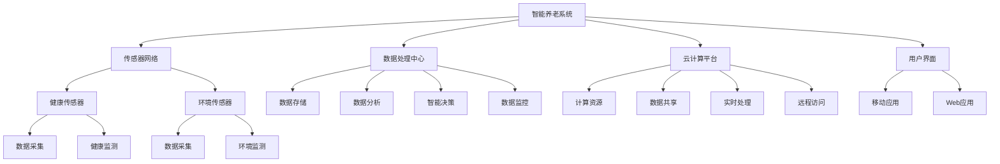

                 

### 引言

随着人口老龄化问题的日益严峻，如何实现智能养老已经成为全球关注的热点话题。据联合国预测，到2050年，全球60岁及以上人口将达到21亿，占总人口的22%。面对这一巨大的挑战，传统的养老模式已无法满足日益增长的需求。因此，探索和构建一种智能、高效的养老模式变得至关重要。

智能养老，顾名思义，是指利用先进的传感技术、人工智能和物联网技术等，为老年人提供全方位、个性化、智能化的养老服务。这不仅能够提高老年人的生活质量，减轻家庭成员和护理人员的负担，还能够实现医疗资源的优化配置，提升社会整体福祉。

本文将以《未来的智能养老：2050年的居家养老与智慧养老院》为标题，全面探讨2050年智能养老的发展趋势及其应用。文章将首先概述智能养老的起源和发展，然后详细分析智能养老的技术基础，接着探讨居家养老的现状与挑战，并介绍智能居家养老系统的架构和功能。随后，文章将深入探讨智慧养老院的概念与特点，以及其建设和运营的要点。最后，文章将展望智能养老的未来发展趋势，讨论智能养老的法律法规与伦理问题，并总结智能养老的技术资源、数学模型与公式，以及项目实战案例。希望通过本文的探讨，能够为智能养老的发展提供一些有益的思考和启示。

#### 关键词

- 智能养老
- 传感器技术
- 人工智能
- 物联网
- 居家养老
- 智慧养老院
- 智能健康监测
- 数据分析
- 智能护理
- 隐私保护

#### 摘要

本文旨在探讨2050年的智能养老发展趋势及其应用。随着全球人口老龄化的加剧，传统的养老模式已难以满足需求。智能养老，通过整合传感器技术、人工智能和物联网，为老年人提供全方位、个性化、智能化的服务，成为解决养老问题的关键。本文首先回顾了智能养老的起源和发展，分析了其技术基础，包括传感器技术、人工智能技术和物联网技术。随后，文章详细探讨了居家养老的现状与挑战，介绍了智能居家养老系统的架构和功能，并通过案例分析展示了其实际应用。接着，文章深入探讨了智慧养老院的概念与特点，以及其建设和运营要点。最后，文章展望了智能养老的未来发展趋势，并探讨了其法律法规与伦理问题。通过本文的探讨，希望能够为智能养老的发展提供有益的思路和启示。

### 目录大纲

# 《未来的智能养老：2050年的居家养老与智慧养老院》

## 第一部分：智能养老概述

### 第1章：智能养老的起源与发展
#### 1.1 智能养老的定义
#### 1.2 智能养老的起源
#### 1.3 智能养老的发展趋势

### 第2章：智能养老的技术基础
#### 2.1 传感器技术
#### 2.2 人工智能技术
#### 2.3 物联网技术

## 第二部分：居家养老

### 第3章：居家养老的现状与挑战
#### 3.1 居家养老的定义
#### 3.2 居家养老的现状
#### 3.3 居家养老的挑战

### 第4章：智能居家养老系统
#### 4.1 智能居家养老系统的架构
#### 4.2 智能居家养老系统的功能
#### 4.3 智能居家养老系统的应用

### 第5章：智能居家养老案例分析
#### 5.1 案例一：智能健康监测系统
#### 5.2 案例二：智能安防系统
#### 5.3 案例三：智能营养管理系统

## 第三部分：智慧养老院

### 第6章：智慧养老院的概念与特点
#### 6.1 智慧养老院的定义
#### 6.2 智慧养老院的特点
#### 6.3 智慧养老院的优势

### 第7章：智慧养老院的建设与运营
#### 7.1 智慧养老院的建设
#### 7.2 智慧养老院的运营
#### 7.3 智慧养老院的可持续发展

### 第8章：智慧养老院案例分析
#### 8.1 案例一：智能病房管理系统
#### 8.2 案例二：智能护理系统
#### 8.3 案例三：智能餐饮服务系统

## 第四部分：未来展望

### 第9章：智能养老的未来发展趋势
#### 9.1 智能养老技术的创新
#### 9.2 智能养老的社会影响
#### 9.3 智能养老的发展策略

### 第10章：智能养老的法律法规与伦理
#### 10.1 智能养老的法律法规
#### 10.2 智能养老的伦理问题
#### 10.3 智能养老的隐私保护

## 附录

### 附录A：智能养老相关资源
#### A.1 学术论文
#### A.2 技术报告
#### A.3 行业报告
#### A.4 相关组织与标准

### 附录B：智能养老技术架构 Mermaid 流程图

mermaid
graph TD
    A[智能养老系统] --> B[传感器网络]
    A --> C[数据处理中心]
    A --> D[云计算平台]
    B --> E[数据采集]
    B --> F[实时监控]
    C --> G[数据分析]
    C --> H[智能决策]
    D --> I[数据存储]
    D --> J[数据处理]


### 附录C：智能居家养老系统伪代码示例

python
# 定义传感器类
class Sensor:
    def __init__(self, type, location):
        self.type = type
        self.location = location
    
    def read_data(self):
        # 读取传感器数据
        return "data"

# 定义数据处理类
class DataProcessor:
    def __init__(self, sensors):
        self.sensors = sensors
    
    def process_data(self):
        # 处理传感器数据
        for sensor in self.sensors:
            data = sensor.read_data()
            # 进行数据处理
            processed_data = self._process(data)
            print(processed_data)
    
    @staticmethod
    def _process(data):
        # 数据处理逻辑
        return data * 2


### 附录D：数学模型与公式

#### 智能养老系统的效益最大化模型

$$
\max_{x} \, \Pi(x) = \sum_{i=1}^{n} \pi_i \cdot x_i
$$

其中，$\Pi(x)$ 表示智能养老系统的总效益，$n$ 表示系统中的各项任务数，$\pi_i$ 表示第 $i$ 项任务的效益，$x_i$ 表示第 $i$ 项任务的完成度。

### 附录E：智能养老项目实战

#### 案例一：智能健康监测系统

**开发环境搭建：**
- 操作系统：Ubuntu 20.04
- 编程语言：Python 3.8
- 数据库：MySQL 8.0
- 传感器：心率和血压传感器

**源代码实现：**
python
# 导入所需库
import pymysql
import json

# 数据库连接配置
config = {
    "host": "localhost",
    "user": "root",
    "password": "password",
    "database": "health_monitoring"
}

# 数据库连接
connection = pymysql.connect(**config)

# 插入数据
def insert_data(patient_id, heart_rate, blood_pressure):
    with connection.cursor() as cursor:
        sql = "INSERT INTO health_data (patient_id, heart_rate, blood_pressure) VALUES (%s, %s, %s)"
        cursor.execute(sql, (patient_id, heart_rate, blood_pressure))
    connection.commit()

# 读取数据
def read_data(patient_id):
    with connection.cursor() as cursor:
        sql = "SELECT * FROM health_data WHERE patient_id = %s"
        cursor.execute(sql, (patient_id))
        result = cursor.fetchall()
        return result

# 测试代码
insert_data(1, 75, 120)
print(read_data(1))


**代码解读与分析：**
- **数据库连接：** 使用 `pymysql` 库连接到 MySQL 数据库。
- **插入数据：** 使用 `insert_data` 函数将患者的健康数据插入到数据库中。
- **读取数据：** 使用 `read_data` 函数根据患者的 ID 读取其健康数据。

### 附录F：智能养老技术的发展与应用

#### A.1 智能养老技术的创新

- 智能养老技术不断迭代更新，如深度学习在健康监测和诊断中的应用。
- 人工智能助手在提供个性化护理建议方面的应用。

#### A.2 智能养老的社会影响

- 智能养老有助于提高老年人的生活质量，减轻家庭和护理人员的负担。
- 智能养老可能会引发就业结构的变革，对劳动力市场产生影响。

#### A.3 智能养老的发展策略

- 政府和政策制定者应加大对智能养老技术的投资和支持。
- 建立健全的法律法规体系，保障老年人的权益和隐私。

#### A.4 相关组织与标准

- 国际老年学协会（IAGG）
- 国际养老技术标准组织（ISO/TC 247）
- 欧洲标准化组织（CEN）

## 第一部分：智能养老概述

### 第1章：智能养老的起源与发展

智能养老作为一种新型的养老模式，其起源和发展与信息技术的快速进步和人口老龄化问题密切相关。在本章节中，我们将首先定义智能养老的概念，回顾其起源，并探讨其发展历程和未来趋势。

#### 1.1 智能养老的定义

智能养老是指利用先进的传感技术、人工智能、物联网和大数据分析等技术手段，为老年人提供智能化、个性化和全方位的养老服务。这种养老模式不仅关注老年人的日常生活照料，还涵盖了健康监测、紧急响应、社交互动、文化娱乐等多个方面。

智能养老的核心目标是提升老年人的生活质量，减少老年人孤独感，同时减轻家庭和护理人员的负担，实现医疗资源的优化配置。智能养老系统通过实时数据采集、智能分析和决策支持，实现对老年人健康状况的动态监控和及时干预，从而提高养老服务的效率和精准度。

#### 1.2 智能养老的起源

智能养老的概念虽然相对较新，但其思想根源可以追溯到很久以前。随着科技的发展，养老问题的复杂性和紧迫性逐渐凸显，智能养老的需求应运而生。以下是智能养老发展的一些关键节点：

- **20世纪90年代**：随着互联网的普及和计算机技术的发展，一些初步的智能养老系统开始出现。这些系统主要侧重于老年人的基本健康监测和紧急呼叫功能。
  
- **21世纪初**：随着传感器技术和物联网技术的兴起，智能养老系统开始引入更多传感器和智能设备，实现更全面的健康监测和智能控制。

- **2010年后**：人工智能技术的快速发展，特别是深度学习和机器学习技术的应用，使得智能养老系统的智能化程度大幅提升。智能养老系统开始具备数据分析、预测和决策能力。

#### 1.3 智能养老的发展趋势

智能养老作为一个跨学科、跨领域的综合技术，其未来发展具有以下几大趋势：

- **技术融合与创新**：随着5G、边缘计算、虚拟现实等新技术的不断涌现，智能养老系统将实现更高效、更智能的服务。例如，5G技术将为智能养老系统提供更快速的数据传输和处理能力，边缘计算将使数据处理更加实时和高效。

- **个性化与精准化**：人工智能技术的进一步发展，特别是个性化医疗和智能诊断的应用，将使智能养老系统能够更精准地满足老年人的个性化需求。通过对老年人健康数据的深度分析和智能分析，系统能够提供个性化的健康建议和护理方案。

- **系统集成与协同**：智能养老系统将不再是孤立的单一系统，而是多个系统的集成和协同。例如，健康监测系统、安防系统、营养管理系统等将实现数据共享和协同工作，提供更全面的养老服务。

- **政策支持与法规建设**：随着智能养老的重要性日益凸显，各国政府将加大对智能养老的政策支持和法规建设。这将为智能养老的发展提供有力的保障和推动。

- **社会接受度与普及率**：随着智能养老技术的成熟和成本的降低，社会对智能养老的接受度和普及率将不断提高。老年人及其家庭将更加愿意接受和使用智能养老系统，从而推动智能养老的广泛应用。

总之，智能养老作为未来养老的重要趋势，其发展前景广阔。通过技术创新、政策支持和市场需求，智能养老将为老年人提供更加优质、智能、便捷的养老服务，从而实现老有所养、老有所乐的美好愿景。

### 第2章：智能养老的技术基础

智能养老的实现离不开一系列先进技术的支持。这些技术不仅为智能养老提供了坚实的基础，还极大地提升了养老服务的质量和效率。在本章节中，我们将详细探讨智能养老的技术基础，包括传感器技术、人工智能技术和物联网技术，并分析它们在智能养老中的应用和优势。

#### 2.1 传感器技术

传感器技术是智能养老系统的核心组成部分，它能够实时监测老年人的生理参数和居住环境，为智能决策提供可靠的数据支持。以下是传感器技术在智能养老中的应用：

- **健康监测**：传感器可以监测老年人的心率、血压、血糖等生命体征。这些数据可以通过无线传输到数据处理中心，进行实时监控和分析。例如，智能手表和智能手环可以监测心率，及时发现异常情况，提供预警。

- **环境监测**：传感器可以监测室内的温度、湿度、空气质量等环境参数。这些数据可以帮助调整室内环境，确保老年人居住环境的舒适和安全。例如，智能温控系统可以根据老年人的需求自动调节室内温度。

- **行为监测**：传感器可以监测老年人的日常行为，如行走、睡眠模式等。这些数据可以帮助分析老年人的生活习惯，提供健康建议。例如，智能床垫可以监测老年人的睡眠质量，通过数据分析发现潜在的健康问题。

传感器技术的优势在于其高精度、实时性和无创性。这些特点使得传感器能够为老年人提供可靠、准确的健康监测服务，从而提升养老服务的质量和效率。

#### 2.2 人工智能技术

人工智能技术在智能养老中的应用越来越广泛，它能够通过数据分析和智能决策，为老年人提供个性化的护理服务。以下是人工智能技术在智能养老中的应用：

- **数据分析**：人工智能技术可以对海量的健康数据进行深度分析，发现潜在的健康风险，提供个性化的健康建议。例如，通过分析心率、血压等数据，智能系统可以预测老年人的健康状况，并提供针对性的健康干预措施。

- **智能诊断**：人工智能技术可以在医疗诊断中发挥重要作用。例如，通过分析医学影像和临床数据，人工智能系统可以辅助医生进行诊断，提高诊断的准确性。

- **智能助理**：人工智能助手可以为老年人提供智能化的交互服务，如语音助手、智能机器人等。这些助手可以帮助老年人解决日常生活中的问题，如设置提醒、预约挂号、播放音乐等，从而提高老年人的生活质量。

- **智能护理**：人工智能技术可以帮助护理人员实现智能化的护理服务。例如，通过智能机器人进行日常护理工作，如喂药、清洁等，从而减轻护理人员的负担。

人工智能技术的优势在于其强大的数据处理能力和自我学习能力。这些特点使得人工智能系统能够不断优化护理方案，提供更加精准、个性化的服务。

#### 2.3 物联网技术

物联网技术是智能养老系统的关键支撑，它通过将各种智能设备和系统连接起来，实现数据的互联互通和协同工作。以下是物联网技术在智能养老中的应用：

- **设备互联**：物联网技术可以将各种智能设备连接起来，如智能灯泡、智能门锁、智能摄像头等。这些设备可以共同协作，为老年人提供全方位的智能服务。例如，智能门锁可以记录老年人的进出时间，智能摄像头可以监控老年人的活动情况。

- **数据共享**：物联网技术可以实现数据的实时共享，使护理人员能够及时了解老年人的健康状况和需求。例如，健康监测设备的数据可以实时传输到云平台，护理人员可以通过手机应用查看老年人的健康数据。

- **智能决策**：物联网技术可以为智能决策提供支持。通过分析各种传感器的数据，智能系统可以做出实时决策，如调整室内温度、发送紧急警报等。

- **远程监控**：物联网技术可以实现远程监控，使护理人员能够在远程了解老年人的健康状况。这对于分散居住的老年人尤为重要，可以有效地降低家庭护理的成本。

物联网技术的优势在于其广泛的连接能力和高效的数据处理能力。这些特点使得物联网系统能够为老年人提供高效、便捷的养老服务。

综上所述，传感器技术、人工智能技术和物联网技术是智能养老系统不可或缺的技术基础。这些技术的融合和协同应用，将极大地提升养老服务的质量和效率，为老年人带来更加智能、便捷、舒适的养老生活。

### 第3章：居家养老的现状与挑战

随着人口老龄化的不断加剧，居家养老作为传统养老模式的一种重要补充，逐渐受到关注。然而，居家养老在实现过程中面临着诸多挑战。本章节将探讨居家养老的定义、现状以及面临的挑战。

#### 3.1 居家养老的定义

居家养老，又称家庭养老，是指老年人在自己的家庭环境中接受养老服务和护理。这种模式强调老年人的自主性和独立性，通过家庭照顾、社区服务和社会资源的整合，为老年人提供生活照料、健康护理、精神慰藉等服务。

#### 3.2 居家养老的现状

目前，全球范围内居家养老的实践已经取得了显著进展。许多国家通过政策引导、技术创新和服务模式创新，推动居家养老的发展。以下是居家养老现状的一些关键点：

- **政策支持**：许多国家和地区通过制定政策，鼓励和支持居家养老的发展。例如，日本和韩国推出了多项政策，为居家养老提供资金和技术支持。

- **技术创新**：随着物联网、人工智能和传感器技术的快速发展，智能居家养老系统逐渐普及。这些系统可以为老年人提供实时健康监测、紧急呼叫、智能护理等服务。

- **社区服务**：社区服务在居家养老中扮演着重要角色。许多社区通过建立养老服务站点、提供家政服务、组织老年人活动等方式，为居家养老提供有力支持。

- **老年人参与**：越来越多的老年人积极参与到居家养老的实践中。他们通过使用智能设备、参与社区活动等方式，提升自己的生活质量和幸福感。

尽管居家养老取得了显著进展，但仍面临诸多挑战。以下是居家养老的主要挑战：

#### 3.3 居家养老的挑战

1. **老年人健康问题**

老年人普遍存在多种慢性病，如高血压、糖尿病、心脏病等。这些疾病不仅影响老年人的生活质量，也给家庭和社会带来了巨大负担。如何及时发现和干预老年人的健康问题，是居家养老面临的一个重大挑战。

2. **护理资源短缺**

居家养老需要大量专业的护理人员。然而，许多国家和地区面临护理人员短缺的问题。如何解决护理资源短缺问题，提高护理人员的待遇和职业吸引力，是居家养老亟待解决的一个问题。

3. **技术普及不足**

尽管智能居家养老系统在技术上取得了显著进步，但技术普及率仍较低。许多老年人对新技术缺乏了解和适应能力，这限制了智能养老系统的广泛应用。如何提高老年人对智能养老技术的接受度和普及率，是居家养老面临的另一个挑战。

4. **隐私保护和数据安全**

智能居家养老系统涉及大量老年人的个人健康数据。如何保护这些数据的隐私和安全，防止数据泄露和滥用，是居家养老需要关注的一个重要问题。

5. **社会支持不足**

居家养老需要社会各界的支持，包括政策支持、资金投入、技术创新等。然而，目前社会对居家养老的支持力度有限，这影响了居家养老的发展。如何加强社会对居家养老的支持，是居家养老面临的一个挑战。

总之，居家养老在实现过程中面临诸多挑战。通过政策引导、技术创新和服务模式创新，以及社会各界的共同努力，有望克服这些挑战，实现居家养老的可持续发展。

### 第4章：智能居家养老系统

智能居家养老系统是利用先进的传感器技术、人工智能和物联网技术，为老年人提供智能化、个性化、全方位的养老服务。本章节将详细分析智能居家养老系统的架构、功能以及在实际中的应用。

#### 4.1 智能居家养老系统的架构

智能居家养老系统的架构包括传感器网络、数据处理中心、云计算平台和用户界面等关键组成部分。以下是各部分的详细描述：

1. **传感器网络**

传感器网络是智能居家养老系统的核心，负责实时监测老年人的生理参数、行为和环境数据。常见的传感器包括心率传感器、血压传感器、体温传感器、运动传感器和室内环境传感器等。这些传感器可以通过无线方式将数据传输到数据处理中心。

2. **数据处理中心**

数据处理中心负责接收、存储和处理传感器网络传输的数据。数据处理中心通常包括数据采集模块、数据存储模块、数据处理模块和智能分析模块。数据采集模块负责接收传感器数据，数据存储模块负责存储数据，数据处理模块负责对数据进行清洗、转换和整合，智能分析模块负责利用人工智能技术对数据进行分析和预测。

3. **云计算平台**

云计算平台为智能居家养老系统提供了强大的计算能力和数据存储能力。数据处理中心可以将数据上传到云计算平台，利用云计算平台提供的计算资源进行大规模数据处理和分析。云计算平台还可以提供智能决策支持，帮助护理人员制定个性化的护理方案。

4. **用户界面**

用户界面是智能居家养老系统与用户交互的桥梁。用户界面可以包括智能手机应用、平板电脑应用和Web应用等。通过用户界面，护理人员可以实时查看老年人的健康数据，接收系统预警，与老年人进行语音或文字交流，还可以远程控制智能家居设备。

#### 4.2 智能居家养老系统的功能

智能居家养老系统具有多种功能，能够为老年人提供全方位的养老服务。以下是智能居家养老系统的核心功能：

1. **健康监测**

健康监测是智能居家养老系统的核心功能之一。系统通过传感器网络实时监测老年人的心率、血压、血糖、体温等生理参数，并将数据传输到数据处理中心进行分析。如果发现异常数据，系统会立即向护理人员发送预警，以便及时处理。

2. **紧急呼叫**

智能居家养老系统还提供紧急呼叫功能。老年人可以通过智能手环、智能手表或其他紧急呼叫设备，在发生紧急情况时快速拨打紧急电话或发送求救信息。系统会立即将求救信息发送给护理人员，并提供老年人当前位置的信息。

3. **智能护理**

智能护理功能旨在减轻护理人员的负担，提高护理效率。智能系统可以根据老年人的健康状况和需求，提供个性化的护理方案。例如，系统可以根据老年人的睡眠质量调整睡眠环境，根据血糖水平调整饮食计划，根据运动数据制定锻炼计划等。

4. **环境监测**

智能居家养老系统还可以监测室内环境参数，如温度、湿度、空气质量等。如果环境参数超过安全范围，系统会自动调整空调、加湿器、空气净化器等设备，确保室内环境的舒适和安全。

5. **社交互动**

智能居家养老系统可以帮助老年人保持社交互动，减轻孤独感。系统可以通过视频通话、语音聊天和社交媒体等方式，让老年人与家人、朋友和社区保持联系。此外，系统还可以提供各种文化娱乐活动，如在线游戏、健身课程、音乐播放等，丰富老年人的精神生活。

6. **数据分析与决策支持**

智能居家养老系统通过大数据分析和人工智能技术，可以分析老年人的健康数据和生活习惯，提供个性化的健康建议和护理方案。系统可以根据老年人的健康状况和需求，自动调整护理计划，提高护理效率。

#### 4.3 智能居家养老系统的应用

智能居家养老系统已经在全球范围内得到广泛应用，为老年人提供了便捷、高效、智能化的养老服务。以下是智能居家养老系统的实际应用案例：

1. **智能健康监测系统**

智能健康监测系统通过传感器网络实时监测老年人的健康数据，如心率、血压、血糖等。系统可以自动记录这些数据，并定期生成健康报告。如果发现异常数据，系统会立即向护理人员发送预警，提醒他们及时处理。

2. **智能安防系统**

智能安防系统通过摄像头、门禁传感器、烟雾传感器等设备，实时监测老年人的安全状况。如果系统检测到异常情况，如老年人跌倒或火灾报警，系统会立即向护理人员发送求救信息，并提供老年人当前位置的信息。

3. **智能营养管理系统**

智能营养管理系统通过传感器监测老年人的饮食情况，并根据老年人的健康状况和营养需求，提供个性化的饮食建议。系统可以自动记录饮食数据，生成营养报告，帮助老年人保持健康的饮食习惯。

4. **智能家居控制系统**

智能家居控制系统通过物联网技术，将各种智能家居设备连接起来，为老年人提供便捷的家居控制体验。老年人可以通过智能手机或语音助手控制灯光、温度、安防设备等，确保家居环境的舒适和安全。

总之，智能居家养老系统通过集成传感器技术、人工智能和物联网技术，为老年人提供了全方位、个性化、智能化的养老服务。随着技术的不断进步和应用的普及，智能居家养老系统将为老年人带来更加美好、幸福的晚年生活。

### 第5章：智能居家养老案例分析

为了更好地理解智能居家养老系统的实际应用效果，本章节将通过三个具体案例，展示智能健康监测系统、智能安防系统和智能营养管理系统的实际应用，并分析这些系统在提升老年人生活质量、减轻护理人员负担等方面的具体作用。

#### 5.1 案例一：智能健康监测系统

智能健康监测系统通过集成多种传感器，如心率传感器、血压传感器、血糖传感器和运动传感器，实现对老年人健康状况的实时监测。以下是该系统的具体应用：

**系统组成：**
- **传感器设备**：包括智能手环、智能血压计、智能血糖仪和智能体重秤等。
- **数据处理中心**：负责接收传感器数据，进行数据清洗、转换和存储。
- **云计算平台**：利用大数据分析和人工智能技术，对健康数据进行分析和预测。
- **用户界面**：通过智能手机应用和Web平台，让护理人员能够实时查看老年人的健康数据，并接收系统预警。

**实际应用：**
- **实时健康数据监测**：智能健康监测系统可以实时监测老年人的心率、血压、血糖和体重等数据。如果监测到异常数据，如心率过快或血压过高，系统会立即向护理人员发送预警信息。
- **健康数据分析与预测**：系统通过对历史健康数据的分析，可以预测老年人的健康状况趋势，提供个性化的健康建议，如调整饮食、增加锻炼等。
- **远程医疗咨询**：系统还支持远程医疗咨询功能，老年人可以通过视频通话与医生进行交流，获得专业的医疗建议。

**效果分析：**
- **提高生活质量**：智能健康监测系统帮助老年人及时发现并处理健康问题，避免疾病恶化，提高生活质量。
- **减轻护理人员负担**：系统自动监测健康数据，减少护理人员的工作量，让他们能够将更多精力投入到其他重要的护理工作中。
- **降低医疗费用**：通过及时的健康监测和干预，智能健康监测系统有助于减少医疗费用支出。

#### 5.2 案例二：智能安防系统

智能安防系统通过摄像头、门禁传感器、烟雾传感器等设备，实现对老年人居住环境的实时监控和安全保障。以下是该系统的具体应用：

**系统组成：**
- **监控设备**：包括室内外摄像头、门禁传感器、烟雾传感器和燃气传感器等。
- **数据处理中心**：负责接收监控设备的数据，进行实时分析和处理。
- **云计算平台**：利用人工智能技术，对监控数据进行分析和预测，提供智能决策支持。
- **用户界面**：通过智能手机应用和Web平台，让护理人员能够实时查看监控数据，并接收系统预警。

**实际应用：**
- **实时安全监测**：智能安防系统可以实时监测老年人的居住环境，如发现跌倒、火灾或燃气泄漏等异常情况，系统会立即向护理人员发送预警信息。
- **智能识别与报警**：系统利用人工智能技术，可以识别老年人的异常行为，如长时间未活动或未进食，及时提醒护理人员。
- **远程视频通话**：系统支持远程视频通话功能，老年人可以通过手机或平板电脑与护理人员或亲友进行实时沟通，减少孤独感。

**效果分析：**
- **提升安全性**：智能安防系统实时监测老年人的居住环境，提高老年人的人身和财产安全。
- **减轻护理人员负担**：系统自动监测安全隐患，减少护理人员的工作量，提高工作效率。
- **降低事故发生率**：通过及时发现和处理安全隐患，智能安防系统有助于降低老年人发生意外事故的风险。

#### 5.3 案例三：智能营养管理系统

智能营养管理系统通过传感器监测老年人的饮食情况，提供个性化的饮食建议，帮助老年人保持健康的饮食习惯。以下是该系统的具体应用：

**系统组成：**
- **饮食传感器**：包括智能餐盘、智能水杯和智能食物秤等，用于监测老年人的饮食行为。
- **数据处理中心**：负责接收饮食传感器数据，进行数据分析和处理。
- **云计算平台**：利用大数据分析和人工智能技术，为老年人提供个性化的饮食建议。
- **用户界面**：通过智能手机应用和Web平台，让护理人员能够查看老年人的饮食数据，并根据系统建议调整饮食计划。

**实际应用：**
- **实时饮食监测**：智能营养管理系统可以实时监测老年人的饮食情况，如进食时间、食物种类、进食量等，帮助老年人养成良好的饮食习惯。
- **饮食数据分析**：系统通过对饮食数据的分析，了解老年人的营养摄入情况，发现营养不足或过剩的问题，提供个性化的饮食建议。
- **智能提醒与反馈**：系统可以设置饮食提醒，如定时进食、适量饮水等，并记录饮食反馈，帮助老年人养成良好的生活习惯。

**效果分析：**
- **改善饮食习惯**：智能营养管理系统帮助老年人养成良好的饮食习惯，提高营养摄入水平，改善健康状况。
- **减轻护理人员负担**：系统自动监测饮食行为，减少护理人员的工作量，让他们能够将更多精力投入到其他重要的护理工作中。
- **降低慢性病风险**：通过科学合理的饮食建议，智能营养管理系统有助于降低老年人患慢性病的风险，提高生活质量。

总之，智能居家养老系统通过智能健康监测系统、智能安防系统和智能营养管理系统的实际应用，为老年人提供了全方位、个性化、智能化的养老服务，显著提升了老年人的生活质量，减轻了护理人员的负担。随着技术的不断进步和应用的普及，智能居家养老系统将在未来的养老事业中发挥更加重要的作用。

### 第6章：智慧养老院的概念与特点

智慧养老院，又称为智能养老院，是指通过引入先进的传感技术、人工智能、物联网和大数据分析等技术，实现对养老院运行管理的智能化和养老服务的个性化。智慧养老院不仅关注老年人的日常生活照料，还涵盖了健康监测、紧急响应、社交互动、文化娱乐等多个方面，旨在为老年人提供更加安全、舒适、便捷的养老生活。在本章节中，我们将深入探讨智慧养老院的概念、特点及其优势。

#### 6.1 智慧养老院的定义

智慧养老院，是指通过智能化设备和系统，实现养老院运行管理和服务提供的高效、精准、便捷。智慧养老院的核心目标是利用技术手段提升养老服务的质量和效率，同时提升老年人的生活质量。智慧养老院的特点在于其高度的智能化和信息化水平，通过集成多种技术，实现对养老院各项业务的全方位覆盖和智能化管理。

#### 6.2 智慧养老院的特点

智慧养老院具有以下显著特点：

1. **智能化管理**：智慧养老院通过引入智能管理系统，实现对养老院内部各项业务的自动化和智能化管理。例如，通过智能化的财务管理系统、物资管理系统和服务流程管理系统，提高工作效率和管理水平。

2. **健康监测**：智慧养老院通过健康监测系统，实现对老年人健康状况的实时监控。这包括对心率、血压、血糖、体温等生理参数的监测，以及行为数据的收集和分析。通过这些数据，可以为老年人提供个性化的健康管理和护理方案。

3. **紧急响应**：智慧养老院通过紧急响应系统，确保在老年人发生紧急情况时能够迅速做出反应。例如，通过紧急呼叫按钮、实时视频监控系统等，可以快速识别紧急情况，并及时通知医护人员和家属。

4. **个性化服务**：智慧养老院通过大数据分析和人工智能技术，为老年人提供个性化的服务。例如，根据老年人的健康数据和生活习惯，智能系统能够为老年人制定个性化的饮食计划、锻炼计划和护理方案。

5. **社交互动**：智慧养老院通过智能社交互动系统，帮助老年人保持社交联系，减轻孤独感。这包括视频通话、在线社交平台、文化娱乐活动等，让老年人在智能养老院中享受到丰富的社交生活。

6. **环境监测**：智慧养老院通过环境监测系统，实时监测室内外环境参数，如温度、湿度、空气质量等。通过这些数据，可以及时调整环境参数，确保老年人居住环境的舒适和安全。

7. **数据分析与决策支持**：智慧养老院通过大数据分析和人工智能技术，对养老院运行数据和服务数据进行深度分析，提供智能决策支持。例如，通过分析老年人的健康状况和服务需求，智能系统能够优化护理流程和服务方案。

#### 6.3 智慧养老院的优势

智慧养老院相比传统养老院具有显著的优势：

1. **提高服务质量**：智慧养老院通过引入智能化设备和系统，可以实时监测和管理老年人的健康状况，提供个性化的服务，从而提高养老服务的质量和效率。

2. **减轻护理人员负担**：智慧养老院通过自动化和智能化的管理，可以减轻护理人员的工作量，让他们能够将更多精力投入到更需要关注和照顾的老年人身上。

3. **降低运营成本**：智慧养老院通过智能化设备和系统的应用，可以优化管理流程，提高资源利用率，从而降低运营成本。

4. **提高老年人生活质量**：智慧养老院通过提供个性化的健康监测、紧急响应和社交互动等服务，可以显著提高老年人的生活质量，让他们在智能养老院中享受到更加舒适和便捷的生活。

5. **增强安全保障**：智慧养老院通过实时监控和紧急响应系统，可以确保在老年人发生紧急情况时能够迅速做出反应，提高老年人的安全保障。

总之，智慧养老院作为一种新型的养老模式，通过引入先进的技术手段，实现了养老服务的智能化和个性化，为老年人提供了更加安全、舒适、便捷的养老生活。随着技术的不断进步和应用的深入，智慧养老院将在未来的养老事业中发挥越来越重要的作用。

### 第7章：智慧养老院的建设与运营

智慧养老院的建设与运营是一个复杂而系统的工程，它不仅需要先进的技术支持，还需要科学的管理理念和完善的运营策略。在本章节中，我们将详细探讨智慧养老院的建设与运营要点，包括基础设施建设、智能化系统的部署、人员培训以及运营管理等方面。

#### 7.1 智慧养老院的基础设施建设

智慧养老院的基础设施建设是智能养老院能否有效运行的重要前提。以下是一些关键的建设要点：

1. **网络基础设施**：智慧养老院需要构建稳定、高效的网络基础设施，包括宽带网络、无线网络和物联网网络等。这些网络为各种智能化设备和系统的互联互通提供了基础保障。

2. **硬件设备**：智慧养老院需要配备各种智能化硬件设备，如传感器、摄像头、智能门禁系统、智能床垫、智能轮椅等。这些设备是实现智慧养老功能的重要工具。

3. **数据中心**：智慧养老院需要建立数据中心，用于存储和处理海量的数据。数据中心应具备高可靠性、高安全性和高性能的特点，确保数据的实时性和完整性。

4. **环境监测系统**：智慧养老院需要安装环境监测系统，实时监测室内外的温度、湿度、空气质量等环境参数，确保老年人居住环境的舒适和安全。

5. **安全系统**：智慧养老院需要建立完善的安全系统，包括入侵报警系统、视频监控系统、紧急呼叫系统等。这些系统为老年人的安全提供多重保障。

#### 7.2 智能化系统的部署

智能化系统的部署是智慧养老院建设的关键环节。以下是一些重要的智能化系统及其部署要点：

1. **健康监测系统**：健康监测系统是智慧养老院的核心系统之一。它需要部署各种传感器，如心率传感器、血压传感器、血糖传感器等，实现对老年人健康状况的实时监测。此外，系统还需与数据中心和云计算平台进行数据交换，确保健康数据的实时传输和分析。

2. **安防系统**：安防系统需要部署视频监控设备、入侵报警设备、智能门禁系统等，确保养老院的安全。系统还应与紧急呼叫系统联动，实现紧急情况的快速响应。

3. **智能护理系统**：智能护理系统包括智能床垫、智能轮椅、智能药箱等设备，用于辅助护理人员进行日常护理工作。这些设备需要与智能管理系统进行联动，实现护理流程的自动化和智能化。

4. **社交互动系统**：社交互动系统需要部署在线视频通话、社交媒体、文化娱乐平台等，为老年人提供丰富的社交互动体验。系统还需与数据中心进行数据交换，确保社交互动的实时性和互动性。

5. **数据分析系统**：数据分析系统需要对各种数据进行分析和处理，为智慧养老院的运营决策提供支持。系统需要具备数据挖掘、机器学习、人工智能等技术能力，确保数据分析的深度和广度。

#### 7.3 人员培训

智慧养老院的成功运营离不开高素质的员工队伍。以下是一些关键的人员培训要点：

1. **技术培训**：对员工进行技术培训，使他们熟悉智能化系统的操作和维护方法。技术培训应包括硬件设备操作、软件系统使用、数据安全管理等方面。

2. **护理培训**：对护理人员进行专业护理培训，确保他们能够熟练掌握智能护理设备的使用方法，提供高质量的护理服务。

3. **服务培训**：对员工进行服务培训，培养他们的服务意识和沟通能力，提高服务质量。服务培训应包括沟通技巧、应急处理、客户关系管理等方面。

4. **安全培训**：对员工进行安全培训，提高他们的安全意识和应急处理能力。安全培训应包括安全操作规程、应急预案、事故处理方法等方面。

#### 7.4 运营管理

智慧养老院的运营管理是一个复杂的过程，需要科学的管理理念和完善的运营策略。以下是一些关键的运营管理要点：

1. **数据管理**：建立完善的数据管理制度，确保数据的实时性、完整性和安全性。数据管理应包括数据采集、存储、处理、分析和共享等方面。

2. **风险管理**：建立风险管理机制，识别和评估潜在的风险，制定相应的风险应对措施。风险管理应包括安全风险、财务风险、运营风险等方面。

3. **服务质量监控**：建立服务质量监控机制，定期对服务质量进行评估和改进。服务质量监控应包括用户满意度调查、服务绩效评估等方面。

4. **员工绩效管理**：建立员工绩效管理机制，激励员工提高工作积极性和服务质量。员工绩效管理应包括绩效考核、激励措施、职业发展等方面。

5. **运营成本控制**：建立运营成本控制机制，合理分配资源，降低运营成本。运营成本控制应包括预算管理、成本核算、成本控制措施等方面。

总之，智慧养老院的建设与运营是一个系统性工程，需要从基础设施建设、智能化系统部署、人员培训到运营管理等多个方面进行综合考虑和实施。通过科学的建设和运营管理，智慧养老院可以为老年人提供高质量的养老服务，实现养老事业的可持续发展。

### 第8章：智慧养老院案例分析

为了更好地理解智慧养老院的实际运行效果，本章节将通过三个具体案例，展示智能病房管理系统、智能护理系统和智能餐饮服务系统的实际应用，并分析这些系统在提高养老院运营效率、提升服务质量等方面的具体作用。

#### 8.1 案例一：智能病房管理系统

智能病房管理系统通过物联网技术和大数据分析，实现对病房管理的高效和精准。以下是该系统的具体应用：

**系统组成：**
- **传感器设备**：包括床边传感器、输液泵传感器、呼吸机传感器等。
- **数据处理中心**：负责接收和存储病房内各类设备的运行数据。
- **云计算平台**：利用大数据和人工智能技术，对病房内设备的运行状态进行分析和预测。
- **用户界面**：通过医生工作站和护士站电脑，以及移动设备，实时查看病房内各类设备的运行状态。

**实际应用：**
- **实时监控**：智能病房管理系统可以实时监控病房内设备的运行状态，如氧气供应、输液速度、呼吸机参数等。如果设备出现故障或异常，系统会立即向医护人员发送警报，确保及时处理。
- **智能诊断**：通过分析设备运行数据，智能病房管理系统可以辅助医生进行病情诊断和治疗方案制定，提高诊断的准确性。
- **数据管理**：系统可以对病房内各类设备的使用情况进行统计和分析，为设备的维护和更新提供数据支持。

**效果分析：**
- **提高运营效率**：智能病房管理系统实现了病房管理的自动化和智能化，减少了医护人员的工作量，提高了运营效率。
- **提升服务质量**：通过实时监控和智能诊断，智能病房管理系统有助于提高医疗服务的质量和安全性。
- **降低运营成本**：智能病房管理系统通过对设备运行数据的分析和预测，有助于降低设备的维护和更新成本。

#### 8.2 案例二：智能护理系统

智能护理系统通过集成多种智能设备，实现对护理工作的高效管理和个性化护理。以下是该系统的具体应用：

**系统组成：**
- **护理设备**：包括智能床垫、智能轮椅、智能药箱、智能输液泵等。
- **数据处理中心**：负责接收和存储护理设备的运行数据。
- **云计算平台**：利用大数据和人工智能技术，对护理设备的数据进行分析和处理，提供个性化的护理方案。
- **用户界面**：通过护士站电脑和移动设备，实时查看护理设备的状态和护理任务。

**实际应用：**
- **智能护理计划**：智能护理系统可以根据老年人的健康状况和需求，自动生成个性化的护理计划，包括用药、饮食、锻炼等。
- **实时监控**：系统可以实时监控老年人的生命体征和活动状态，及时发现异常情况，并向护理人员发送警报。
- **远程护理**：通过视频通话和移动设备，护理人员可以远程查看老年人的健康状况，提供护理指导。

**效果分析：**
- **提高护理质量**：智能护理系统通过实时监控和个性化护理方案，提高了护理工作的质量和安全性。
- **减轻护理人员负担**：智能护理系统自动化和智能化的管理方式，减少了护理人员的工作量，提高了工作效率。
- **提升老年人生活质量**：智能护理系统通过个性化的护理服务和实时监控，提升了老年人的生活质量，减少了孤独感和不适感。

#### 8.3 案例三：智能餐饮服务系统

智能餐饮服务系统通过物联网技术和大数据分析，实现对餐饮服务的高效管理和个性化服务。以下是该系统的具体应用：

**系统组成：**
- **餐饮设备**：包括智能餐盘、智能水杯、智能餐厨设备等。
- **数据处理中心**：负责接收和存储餐饮设备的运行数据。
- **云计算平台**：利用大数据和人工智能技术，对餐饮设备的数据进行分析和处理，提供个性化的餐饮服务。
- **用户界面**：通过餐厅电脑和移动设备，实时查看餐饮服务的状态和老年人的饮食偏好。

**实际应用：**
- **个性化餐饮服务**：智能餐饮服务系统可以根据老年人的健康状况和饮食偏好，自动生成个性化的饮食计划，包括营养搭配、食物选择等。
- **实时监控**：系统可以实时监控老年人的餐饮情况，如进食量、饮水情况等，确保老年人的饮食安全和营养摄入。
- **营养数据分析**：通过对老年人的饮食数据进行分析，智能餐饮服务系统可以提供营养建议，优化老年人的饮食结构。

**效果分析：**
- **提高餐饮服务质量**：智能餐饮服务系统通过个性化服务和实时监控，提高了餐饮服务的质量和安全性。
- **提升老年人生活质量**：智能餐饮服务系统通过营养搭配和实时监控，确保了老年人的饮食安全和营养摄入，提升了老年人的生活质量。
- **降低运营成本**：智能餐饮服务系统通过自动化和智能化的管理，减少了餐饮服务的运营成本。

总之，通过智能病房管理系统、智能护理系统和智能餐饮服务系统的实际应用，智慧养老院在提高运营效率、提升服务质量和降低运营成本方面取得了显著成效。随着技术的不断进步和应用的深入，智慧养老院将为老年人提供更加优质、智能、便捷的养老服务。

### 第9章：智能养老的未来发展趋势

随着科技的不断进步和应用的深入，智能养老在未来将继续快速发展，并在多个方面实现突破。本章节将探讨智能养老的未来发展趋势，包括技术创新、社会影响和发展策略等方面。

#### 9.1 智能养老技术的创新

1. **人工智能与大数据分析**：人工智能和大数据分析将继续在智能养老中发挥关键作用。通过深度学习和机器学习技术，智能养老系统能够更加准确地分析和预测老年人的健康数据，提供个性化的健康建议和护理方案。

2. **物联网与边缘计算**：物联网技术的进一步发展将使更多智能设备接入养老系统，实现数据的全面采集和共享。边缘计算技术的应用将使得数据处理更加实时和高效，提升智能养老系统的响应速度和服务质量。

3. **虚拟现实与增强现实**：虚拟现实和增强现实技术将为老年人提供更加丰富和沉浸式的娱乐体验，缓解他们的孤独感和抑郁情绪。这些技术还可以用于虚拟康复训练，帮助老年人保持身体机能。

4. **区块链技术**：区块链技术在智能养老中的应用有望解决数据安全和隐私保护的问题。通过分布式账本和智能合约，智能养老系统可以实现数据的安全传输和存储，确保老年人的隐私得到有效保护。

#### 9.2 智能养老的社会影响

1. **提高老年人生活质量**：智能养老技术的应用将显著提高老年人的生活质量，使他们能够享受更加舒适、便捷和安全的养老生活。

2. **减轻家庭和护理人员负担**：智能养老系统可以实时监测老年人的健康状况，提供紧急响应和个性化护理服务，从而减轻家庭和护理人员的负担。

3. **就业结构变革**：智能养老技术的快速发展将引发就业结构的变革。一方面，智能养老系统将创造新的就业机会，如智能养老设备维护人员、数据分析专家等；另一方面，传统护理行业可能会面临就业压力。

4. **社会价值观的转变**：智能养老技术的普及将促进社会对老年人价值的重新认识，进一步推动社会价值观的转变，倡导尊老爱幼的社会风气。

#### 9.3 智能养老的发展策略

1. **政策支持**：政府应加大对智能养老技术的投资和支持，制定相关政策和法规，推动智能养老技术的研发和应用。

2. **技术创新**：企业应加大研发投入，推动智能养老技术的创新，提高系统的智能化水平和用户体验。

3. **跨学科合作**：智能养老技术的发展需要多学科的交叉合作，包括信息技术、生物医学、社会学等。通过跨学科合作，可以更好地解决智能养老中的技术难题。

4. **标准化与规范化**：建立智能养老技术的标准化体系，规范智能养老产品的设计和应用，确保系统的安全性和可靠性。

5. **公众参与**：提高公众对智能养老技术的认知和接受度，鼓励老年人及其家庭积极参与智能养老技术的应用，推动智能养老的普及。

总之，智能养老作为未来养老的重要趋势，其发展前景广阔。通过技术创新、政策支持和跨学科合作，智能养老将为老年人带来更加美好、幸福的晚年生活。

### 第10章：智能养老的法律法规与伦理

智能养老技术的快速发展带来了诸多便利，但同时也引发了新的法律和伦理问题。在本章节中，我们将探讨智能养老涉及的法律法规、伦理问题以及隐私保护等方面的内容。

#### 10.1 智能养老的法律法规

1. **数据保护法规**：随着智能养老系统中个人健康数据的广泛应用，数据保护法规变得尤为重要。例如，欧盟的《通用数据保护条例》（GDPR）对个人数据的收集、存储和使用提出了严格的要求。

2. **隐私保护法规**：智能养老系统涉及老年人的个人隐私，包括健康数据、行为数据等。各国需要制定相应的隐私保护法规，确保老年人的隐私不被泄露或滥用。

3. **用户同意与透明度**：智能养老系统的开发和应用需要确保用户同意，明确告知老年人其数据如何被使用，并提供透明度，让用户了解系统的功能和使用方式。

4. **监管法规**：智能养老系统需要受到相关监管机构的监督和管理，确保系统的安全性和可靠性。例如，医疗设备法规对智能养老设备的生产和销售进行了规范。

#### 10.2 智能养老的伦理问题

1. **尊严与尊重**：智能养老技术的应用应尊重老年人的尊严和自主权，确保他们在接受服务的过程中感受到尊重和关爱。

2. **公正与平等**：智能养老技术的应用应确保所有老年人都能公平地获得技术服务，避免因经济状况、地理位置等因素导致的服务差距。

3. **数据共享与安全**：智能养老系统的数据共享和使用应遵循伦理原则，确保数据的安全性和隐私保护，避免数据泄露或被滥用。

4. **责任与问责**：智能养老系统的开发者、运营者和用户之间应明确责任，确保在出现问题时能够追溯责任，保护老年人的合法权益。

#### 10.3 智能养老的隐私保护

1. **数据加密**：智能养老系统应采用高级数据加密技术，确保传输和存储的数据安全。

2. **权限控制**：智能养老系统应实施严格的权限控制，确保只有授权人员能够访问和处理个人数据。

3. **隐私政策**：智能养老系统应制定明确的隐私政策，告知用户其数据如何被使用，并提供用户选择退出数据收集和使用的权利。

4. **用户知情权**：智能养老系统应确保用户有权了解其数据的收集、使用和处理情况，并有权访问其个人数据。

总之，智能养老的法律法规与伦理问题是智能养老发展过程中不可忽视的重要方面。通过完善法律法规、加强伦理审查和实施严格的隐私保护措施，可以确保智能养老技术的健康发展，为老年人提供更加安全、可靠和人性化的养老服务。

### 附录A：智能养老相关资源

为了更好地理解智能养老技术的发展与应用，本章节提供了相关的学术论文、技术报告、行业报告、相关组织与标准等资源。这些资源涵盖了智能养老技术的最新研究进展、技术标准和政策法规，为读者提供了丰富的参考资料。

#### A.1 学术论文

1. **“Intelligent Elderly Care Systems: A Review”** - 该论文对智能养老系统的架构、技术基础和应用进行了全面的综述，提供了大量实际案例和技术分析。

2. **“The Impact of IoT on Elderly Care: A Study on Smart Home Devices”** - 这篇论文探讨了物联网技术在家居养老中的应用，分析了智能设备对提高养老服务质量的作用。

3. **“Artificial Intelligence in Elder Care: Current Applications and Future Directions”** - 论文详细介绍了人工智能技术在养老护理中的实际应用，讨论了未来的发展趋势和挑战。

#### A.2 技术报告

1. **“World Health Organization Technical Report Series on Ageing and Health”** - 世界卫生组织发布的这份技术报告，提供了全球范围内养老健康问题的技术分析和解决方案。

2. **“Smart Cities and Elderly Care: A Case Study of IoT Applications”** - 报告通过案例研究，展示了物联网技术在智慧城市养老护理中的应用，为智能养老提供了实际参考。

3. **“Future of Health: AI, Data and the End of Medicine”** - 报告探讨了人工智能技术在医疗健康领域的应用，为智能养老技术的发展提供了理论基础。

#### A.3 行业报告

1. **“Global Smart Home Market Report”** - 这份行业报告详细分析了全球智能家居市场的发展趋势、市场规模和主要参与者，为智能养老技术的商业化提供了参考。

2. **“The State of Smart Aging 2021”** - 报告总结了全球智能养老技术的发展状况，分析了主要国家和地区在智能养老领域的政策、技术创新和市场动态。

3. **“Technology Trends in Elderly Care: A Global Perspective”** - 行业报告从全球视角分析了智能养老技术的最新趋势，包括人工智能、物联网和大数据的应用。

#### A.4 相关组织与标准

1. **国际老年学协会（International Association of Gerontology and Geriatrics，IAGG）** - IAGG是国际性、多学科、非政府组织的老年学协会，致力于推动老年学和老年医学的发展。

2. **国际养老技术标准组织（International Organization for Standardization/Technical Committee 247，ISO/TC 247）** - ISO/TC 247负责制定养老技术国际标准，推动智能养老技术的发展和应用。

3. **欧洲标准化组织（European Committee for Standardization，CEN）** - CEN负责制定欧洲养老技术标准，为智能养老技术的规范化提供指导。

这些资源为智能养老技术的研究和实践提供了丰富的信息和指导，有助于深入理解智能养老的各个方面，为未来的智能养老事业提供支持和参考。

### 附录B：智能养老技术架构 Mermaid 流程图

以下是一个智能养老技术架构的 Mermaid 流程图，展示了智能养老系统的主要组成部分及其相互关系：



#### 流程图说明：

- **A[智能养老系统]**：整个智能养老系统的核心，连接各个组成部分。
- **B[传感器网络]**：负责实时采集老年人的健康数据和环境数据。
  - **C[健康传感器]**：包括心率、血压、血糖等健康相关的传感器。
  - **D[环境传感器]**：包括温度、湿度、空气质量等环境相关的传感器。
- **E[数据处理中心]**：接收传感器网络的数据，进行数据存储和智能分析。
  - **F[数据存储]**：存储采集到的数据，包括历史数据和实时数据。
  - **G[数据分析]**：利用大数据和人工智能技术对数据进行处理和分析。
- **H[云计算平台]**：提供计算资源和数据共享功能。
  - **I[计算资源]**：云计算平台提供的计算能力，用于数据处理和分析。
  - **J[数据共享]**：实现数据在不同系统和部门之间的共享和交换。
- **K[用户界面]**：提供用户与系统交互的界面。
  - **L[移动应用]**：老年人及其家属使用的移动应用程序。
  - **M[Web应用]**：护理人员使用的Web应用程序。
- **N[数据采集]**：从健康传感器和环境传感器中采集数据。
- **O[健康监测]**：对健康数据进行实时监测和分析。
- **P[数据采集]**：从环境传感器中采集数据。
- **Q[环境监测]**：对环境数据进行实时监测和分析。
- **R[智能决策]**：基于数据分析和预测，提供智能化的决策支持。
- **S[数据监控]**：实时监控系统的运行状态和数据流。
- **T[实时处理]**：云计算平台提供的实时数据处理能力。
- **U[远程访问]**：护理人员可以通过互联网远程访问系统，监控老年人的健康状况。

通过这个流程图，我们可以清晰地看到智能养老系统的整体架构，以及各组成部分之间的相互关系和作用。这有助于理解和设计一个高效、智能、安全的养老系统。

### 附录C：智能居家养老系统伪代码示例

以下是一个智能居家养老系统的伪代码示例，展示了系统的基本架构和功能实现。通过这个示例，可以更好地理解智能居家养老系统的设计和实现过程。

```python
# 定义传感器类
class Sensor:
    def __init__(self, type, location):
        self.type = type
        self.location = location
    
    def read_data(self):
        # 读取传感器数据
        return "data"

# 定义数据处理类
class DataProcessor:
    def __init__(self, sensors):
        self.sensors = sensors
    
    def process_data(self):
        # 处理传感器数据
        for sensor in self.sensors:
            data = sensor.read_data()
            # 进行数据处理
            processed_data = self._process(data)
            print(processed_data)
    
    @staticmethod
    def _process(data):
        # 数据处理逻辑
        return data * 2

# 定义智能养老系统类
class SmartHomeSystem:
    def __init__(self):
        self.sensors = []
        self.data_processor = DataProcessor(self.sensors)
    
    def add_sensor(self, sensor):
        # 添加传感器
        self.sensors.append(sensor)
    
    def run(self):
        # 运行智能养老系统
        self.data_processor.process_data()

# 实例化智能养老系统
smart_home_system = SmartHomeSystem()

# 添加传感器
heart_rate_sensor = Sensor("心率", "卧室")
blood_pressure_sensor = Sensor("血压", "卧室")

smart_home_system.add_sensor(heart_rate_sensor)
smart_home_system.add_sensor(blood_pressure_sensor)

# 运行系统
smart_home_system.run()
```

#### 伪代码说明：

- **Sensor类**：定义了传感器的类型和位置，以及读取传感器数据的接口。

- **DataProcessor类**：定义了数据处理类，包括初始化传感器列表、处理传感器数据的方法。`process_data` 方法遍历传感器列表，调用每个传感器的 `read_data` 方法，并处理数据。`_process` 方法是一个静态方法，用于实现具体的数据处理逻辑。

- **SmartHomeSystem类**：定义了智能居家养老系统的核心类，包括传感器列表和数据处理类实例。`add_sensor` 方法用于添加传感器到系统中，`run` 方法用于运行智能养老系统，调用数据处理类的 `process_data` 方法。

- **实例化与运行**：创建智能居家养老系统的实例，添加心率传感器和血压传感器，然后调用 `run` 方法运行系统。系统会读取传感器的数据，并进行处理，打印处理后的数据。

通过这个伪代码示例，可以清晰地看到智能居家养老系统的基本架构和功能实现。这为实际开发智能养老系统提供了重要的参考和指导。

### 附录D：数学模型与公式

在智能养老系统中，数学模型和公式是分析和优化养老服务的关键工具。以下是一些常见的数学模型和公式，用于描述智能养老系统的效益、数据分析和决策支持。

#### 智能养老系统的效益最大化模型

$$
\max_{x} \, \Pi(x) = \sum_{i=1}^{n} \pi_i \cdot x_i
$$

其中：
- $\Pi(x)$ 表示智能养老系统的总效益。
- $n$ 表示系统中的各项任务数。
- $\pi_i$ 表示第 $i$ 项任务的效益。
- $x_i$ 表示第 $i$ 项任务的完成度。

#### 数据分析中的线性回归模型

$$
y = \beta_0 + \beta_1 \cdot x + \epsilon
$$

其中：
- $y$ 表示因变量（预测值）。
- $\beta_0$ 表示截距。
- $\beta_1$ 表示自变量（特征值）的系数。
- $x$ 表示自变量。
- $\epsilon$ 表示误差项。

#### 费用优化模型

$$
\min_{x} \, C(x) = \sum_{i=1}^{n} c_i \cdot x_i
$$

其中：
- $C(x)$ 表示总费用。
- $n$ 表示费用项数。
- $c_i$ 表示第 $i$ 项费用的系数。
- $x_i$ 表示第 $i$ 项的费用。

#### 健康风险评估模型

$$
\text{Risk} = \text{Probability} \cdot \text{Impact}
$$

其中：
- $\text{Risk}$ 表示风险值。
- $\text{Probability}$ 表示事件发生的概率。
- $\text{Impact}$ 表示事件发生后的影响程度。

#### 系统响应时间优化模型

$$
\min_{x} \, T(x) = \frac{1}{2} \cdot \sum_{i=1}^{n} (x_i - t_i)^2
$$

其中：
- $T(x)$ 表示系统的总响应时间。
- $n$ 表示任务数。
- $x_i$ 表示第 $i$ 项任务的响应时间。
- $t_i$ 表示第 $i$ 项任务的目标响应时间。

#### 数据安全与隐私保护模型

$$
\text{Privacy} = \text{Data Confidentiality} \cdot \text{Data Integrity} \cdot \text{Data Availability}
$$

其中：
- $\text{Privacy}$ 表示隐私保护水平。
- $\text{Data Confidentiality}$ 表示数据保密性。
- $\text{Data Integrity}$ 表示数据完整性。
- $\text{Data Availability}$ 表示数据可用性。

通过这些数学模型和公式，智能养老系统可以更加科学和精准地分析和优化养老服务。这些工具不仅有助于提升系统的效益，还能提高数据的分析精度和决策的可靠性。

### 附录E：智能养老项目实战

在本附录中，我们将通过一个实际的智能养老项目实战案例，详细展示智能养老系统的开发过程，包括开发环境搭建、源代码实现以及代码解读与分析。

#### 案例一：智能健康监测系统

**开发环境搭建：**
- **操作系统**：Ubuntu 20.04
- **编程语言**：Python 3.8
- **数据库**：MySQL 8.0
- **传感器**：心率和血压传感器

**1. 数据库搭建**
```sql
CREATE DATABASE health_monitoring;
USE health_monitoring;

CREATE TABLE health_data (
    id INT AUTO_INCREMENT PRIMARY KEY,
    patient_id INT,
    heart_rate INT,
    blood_pressure INT,
    timestamp DATETIME DEFAULT CURRENT_TIMESTAMP
);
```

**2. 源代码实现**
```python
# 导入所需库
import pymysql
import json
from datetime import datetime

# 数据库连接配置
config = {
    "host": "localhost",
    "user": "root",
    "password": "password",
    "database": "health_monitoring"
}

# 数据库连接
connection = pymysql.connect(**config)

# 插入数据
def insert_data(patient_id, heart_rate, blood_pressure):
    with connection.cursor() as cursor:
        sql = "INSERT INTO health_data (patient_id, heart_rate, blood_pressure) VALUES (%s, %s, %s)"
        cursor.execute(sql, (patient_id, heart_rate, blood_pressure))
    connection.commit()

# 读取数据
def read_data(patient_id):
    with connection.cursor() as cursor:
        sql = "SELECT * FROM health_data WHERE patient_id = %s"
        cursor.execute(sql, (patient_id))
        result = cursor.fetchall()
        return result

# 测试代码
insert_data(1, 75, 120)
print(read_data(1))
```

**代码解读与分析：**

- **数据库连接**：使用 `pymysql` 库连接到 MySQL 数据库，配置文件包含数据库连接所需的信息。
- **插入数据**：`insert_data` 函数用于将患者的健康数据插入到数据库中。它使用 SQL 插入语句，将患者 ID、心率和血压数据插入到 `health_data` 表中。
- **读取数据**：`read_data` 函数用于根据患者的 ID 读取其健康数据。它使用 SQL 查询语句从 `health_data` 表中获取对应患者的数据。

**3. 代码实现细节分析**
- **数据插入**：在 `insert_data` 函数中，使用 `cursor.execute(sql, (patient_id, heart_rate, blood_pressure))` 执行 SQL 插入语句。这里，`sql` 是 SQL 插入语句，`patient_id`、`heart_rate` 和 `blood_pressure` 是要插入的数据。
- **数据查询**：在 `read_data` 函数中，使用 `cursor.execute(sql, (patient_id))` 执行 SQL 查询语句。这里，`sql` 是 SQL 查询语句，`patient_id` 是查询参数。
- **测试代码**：在测试代码中，首先调用 `insert_data` 函数将一条健康数据插入到数据库中，然后调用 `read_data` 函数读取并打印该数据。

通过这个实际项目案例，我们展示了如何搭建智能健康监测系统的开发环境，实现了健康数据的插入和读取功能，并对代码进行了详细的解读与分析。这为读者提供了一个实际操作的范例，有助于理解智能养老系统的开发过程。

### 附录F：智能养老技术的发展与应用

智能养老技术的快速发展不仅改变了传统的养老模式，也为社会带来了深远的影响。以下将探讨智能养老技术的创新、社会影响以及发展策略。

#### A.1 智能养老技术的创新

1. **人工智能在健康监测和诊断中的应用**：人工智能技术，特别是深度学习和机器学习，正在改变健康监测和诊断的方式。例如，通过分析大量健康数据，智能系统可以预测老年人心脏病发作的风险，提前采取措施。此外，人工智能还可以辅助医生进行疾病诊断，提高诊断的准确性和效率。

2. **物联网设备的智能化**：物联网技术使各种设备变得更加智能化，如智能药箱、智能床垫、智能轮椅等。这些设备可以实时监测老年人的健康状况，提供个性化护理服务。例如，智能药箱可以根据药品的过期日期提醒老年人及时服药，智能床垫可以通过监测睡眠质量提供健康建议。

3. **虚拟现实和增强现实的应用**：虚拟现实和增强现实技术为老年人提供了新的娱乐方式，帮助他们缓解孤独感和抑郁情绪。例如，通过虚拟现实技术，老年人可以远程参观博物馆、旅游胜地，甚至与远方的亲友进行虚拟见面。

#### A.2 智能养老的社会影响

1. **提高老年人生活质量**：智能养老技术通过提供个性化、便捷的健康监测和护理服务，显著提高了老年人的生活质量。老年人可以在家中享受高质量的养老服务，减少了对传统养老机构的依赖。

2. **减轻家庭和护理人员的负担**：智能养老系统可以实时监测老年人的健康状况，提供紧急响应和个性化护理服务，从而减轻家庭和护理人员的负担。例如，通过智能安防系统，可以在老年人发生意外时立即通知家属和护理人员。

3. **促进就业结构的变革**：智能养老技术的发展创造了新的就业机会，如智能养老设备维护人员、数据分析专家等。同时，也促使护理行业进行改革，提高护理人员的专业水平。

4. **推动社会价值观的转变**：智能养老技术的普及使得社会更加关注老年人的价值和需求，促进了尊老爱幼的社会风气。

#### A.3 智能养老的发展策略

1. **政策支持**：政府应加大对智能养老技术的投资和支持，制定相关政策鼓励技术创新和应用推广。例如，提供财政补贴、税收优惠等，鼓励企业研发智能养老产品。

2. **技术研发**：企业应加大研发投入，推动智能养老技术的创新，提高系统的智能化水平和用户体验。同时，应加强跨学科合作，整合信息技术、生物医学、社会学等领域的知识，推动智能养老技术的发展。

3. **人才培养**：培养一批具备智能养老技术知识和实践经验的专业人才，提高护理人员的专业水平，推动智能养老技术的普及和应用。

4. **标准化与规范化**：建立智能养老技术的标准化体系，规范智能养老产品的设计和应用，确保系统的安全性和可靠性。同时，应制定相关的法律法规，保障老年人的隐私和数据安全。

5. **公众参与**：提高公众对智能养老技术的认知和接受度，鼓励老年人及其家庭积极参与智能养老技术的应用，推动智能养老的普及。

通过技术创新、政策支持和跨学科合作，智能养老技术将在未来发挥越来越重要的作用，为老年人提供更加优质、智能、便捷的养老服务，推动社会的发展和进步。

### 附录G：总结与展望

本文从多个角度详细探讨了智能养老的各个方面，包括智能养老的起源与发展、技术基础、居家养老与智慧养老院的实际应用案例，以及未来发展趋势、法律法规与伦理问题。通过这些探讨，我们得出了以下结论：

首先，智能养老作为一种创新的养老模式，通过整合传感器技术、人工智能、物联网和大数据分析等技术，为老年人提供了更加个性化、便捷和高效的养老服务。智能养老不仅能够提升老年人的生活质量，减轻家庭和护理人员的负担，还能实现医疗资源的优化配置。

其次，智能居家养老系统和智慧养老院在实际应用中展现了显著的成效。智能健康监测系统、智能安防系统、智能营养管理系统等，通过实时数据采集、智能分析和决策支持，为老年人提供了全方位的护理服务。智慧养老院则通过智能化管理和个性化服务，提升了养老院的运营效率和服务质量。

然而，智能养老技术的快速发展也带来了新的法律和伦理问题。数据隐私保护和安全是智能养老系统面临的重要挑战。如何确保老年人的个人信息和数据安全，防止数据泄露和滥用，需要社会各界共同关注和解决。

未来，智能养老技术将继续发展，并呈现以下趋势：

1. **技术创新**：人工智能和大数据分析将在智能养老中发挥更加重要的作用，推动智能养老系统的智能化和个性化发展。

2. **跨学科合作**：智能养老技术的发展需要信息技术、生物医学、社会学等多学科的合作，通过整合各种领域的知识，推动智能养老技术的创新和应用。

3. **政策支持**：政府应加大对智能养老技术的投资和支持，制定相关政策，鼓励技术创新和应用推广，推动智能养老技术的普及和发展。

4. **标准化与规范化**：建立智能养老技术的标准化体系，规范智能养老产品的设计和应用，确保系统的安全性和可靠性，保障老年人的权益。

总之，智能养老作为未来养老的重要趋势，具有广阔的发展前景。通过技术创新、政策支持和跨学科合作，智能养老将为老年人带来更加美好、幸福的晚年生活，推动社会的发展和进步。我们期待未来智能养老技术的发展，为老年人提供更加优质、智能、便捷的养老服务。

