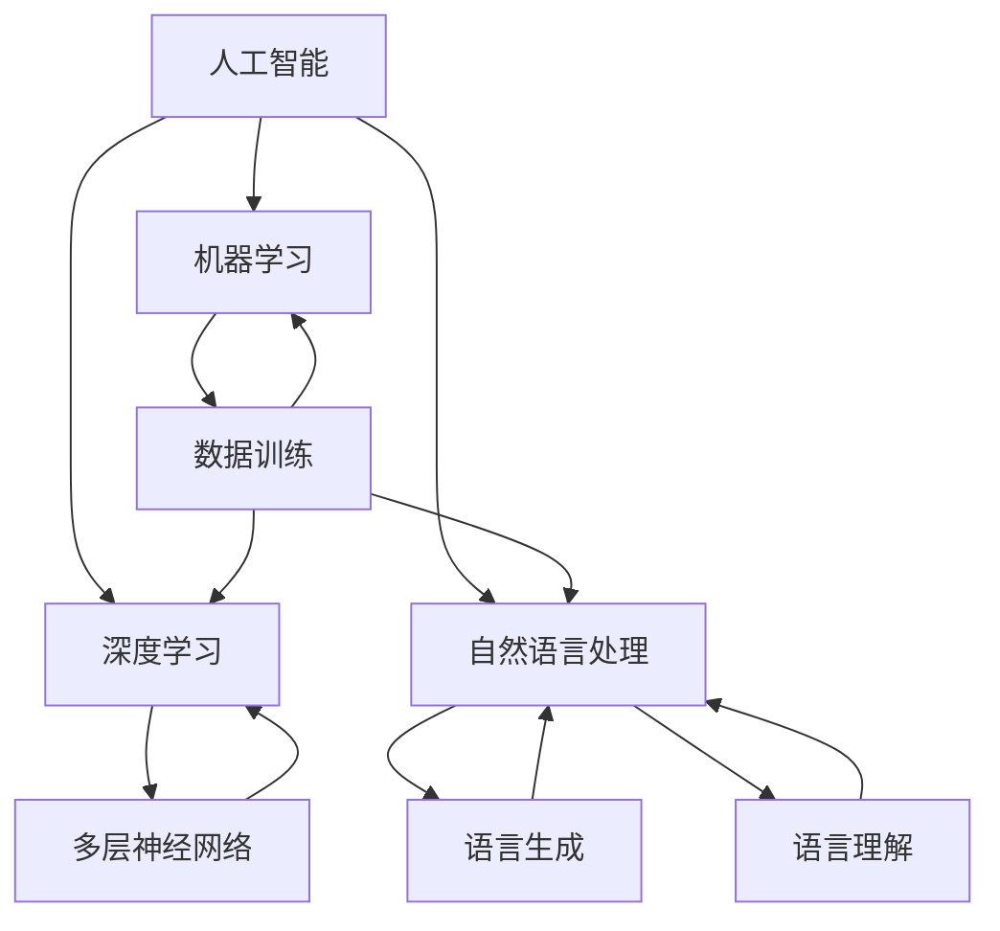
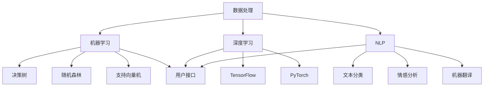

                 

### 第一部分：苹果发布AI应用的背景与重要性

#### 引言

随着人工智能技术的飞速发展，苹果公司一直在积极布局人工智能领域，不断推出创新的AI应用。本文将围绕李开复的观点，探讨苹果发布AI应用的背景、重要性以及其对用户、行业和技术发展的深远影响。

#### 李开复对人工智能的观察与预测

李开复作为人工智能领域的资深专家，对人工智能的发展趋势有着深刻的见解。以下是他关于人工智能的一些观察与预测：

1. **人工智能的起源与发展**

   - **人工智能的历史脉络**：从20世纪50年代的早期探索到21世纪初的深度学习革命，人工智能经历了多个阶段的发展。
   - **重要里程碑与事件**：例如，IBM的“深蓝”击败国际象棋世界冠军，谷歌的AlphaGo战胜围棋世界冠军等，都是人工智能发展中的重要里程碑。

2. **当前人工智能的应用领域**

   - **在消费电子领域的应用**：如智能手机、智能家居、智能穿戴等，人工智能已经深入到我们日常生活的各个方面。
   - **在工业领域的应用**：制造业、物流、能源等行业也在广泛采用人工智能技术，以提高生产效率和降低成本。
   - **在医疗健康领域的应用**：人工智能在疾病诊断、治疗、健康管理等方面发挥着越来越重要的作用。

3. **人工智能的未来趋势**

   - **人工智能在消费电子领域的应用**：随着技术的进步，人工智能将在智能手机、智能家居、智能穿戴等领域发挥更大的作用。
   - **人工智能在工业领域的应用**：人工智能将推动工业4.0的发展，实现更智能、更高效的工业生产。
   - **人工智能在医疗健康领域的应用**：人工智能将进一步提升医疗诊断、治疗和健康管理的能力，为人类健康带来更多福祉。

#### 苹果发布AI应用的背景分析

苹果公司作为全球领先的科技巨头，一直在人工智能领域进行深入布局。以下是对苹果发布AI应用背景的详细分析：

1. **苹果公司的发展历程与现状**

   - **发展历程**：从早期的麦金塔计算机到iPhone，苹果公司一直致力于推动科技创新。
   - **现状**：苹果公司已成为全球市值最高的科技公司之一，其在智能手机、平板电脑、电脑等消费电子产品领域的市场份额持续增长。

2. **苹果在人工智能领域的布局**

   - **技术研发**：苹果公司不断投入大量资源进行人工智能技术研发，如语音识别、图像识别、自然语言处理等。
   - **应用落地**：苹果公司已将人工智能技术应用到其多个产品中，如Siri、FaceTime、照片APP等。

3. **苹果发布AI应用的动机与目标**

   - **动机**：随着人工智能技术的快速发展，苹果公司希望通过发布AI应用，抢占人工智能市场的先机。
   - **目标**：提升用户体验，增强产品竞争力，推动人工智能技术在消费电子产品中的应用。

### 核心概念与联系

在理解苹果发布AI应用的背景时，以下核心概念和其相互联系是至关重要的：

- **人工智能（AI）**：一种模拟人类智能行为的技术，包括机器学习、深度学习、自然语言处理等。
- **机器学习（ML）**：一种通过数据训练模型，使计算机具备自主学习和决策能力的算法。
- **深度学习（DL）**：一种基于多层神经网络进行特征提取和模式识别的机器学习技术。
- **自然语言处理（NLP）**：一种使计算机能够理解、生成和处理自然语言的技术。

以下是一个Mermaid流程图，展示这些核心概念及其相互关系：



### 苹果AI应用的核心技术

苹果公司在AI应用方面的技术研发是苹果发布AI应用的关键。以下是对苹果AI应用的核心技术进行详细分析：

#### 技术框架

苹果公司的AI应用技术框架包括以下几个主要组件：

1. **数据处理模块**：负责数据收集、清洗和预处理。
2. **机器学习模块**：包括多种机器学习算法，如决策树、随机森林、支持向量机等。
3. **深度学习模块**：基于深度学习框架，如TensorFlow、PyTorch等，用于构建复杂的神经网络模型。
4. **自然语言处理模块**：用于处理自然语言任务，如文本分类、情感分析、机器翻译等。
5. **用户接口模块**：用于将AI模型的结果呈现给用户，提供友好的交互体验。

以下是一个简化的Mermaid流程图，展示苹果AI应用的技术框架：



#### 关键算法

苹果AI应用的关键算法包括以下几种：

1. **卷积神经网络（CNN）**：用于图像识别和图像处理，能够提取图像中的特征。
2. **循环神经网络（RNN）**：用于处理序列数据，如语音识别和自然语言处理。
3. **长短期记忆网络（LSTM）**：一种特殊的RNN，能够更好地处理长序列数据。
4. **Transformer模型**：近年来在自然语言处理领域取得了显著成果，如BERT、GPT等模型。

以下是一个伪代码示例，用于实现一个简单的卷积神经网络：

```python
# 定义卷积神经网络
model = tf.keras.Sequential([
    tf.keras.layers.Conv2D(filters=32, kernel_size=(3, 3), activation='relu', input_shape=(28, 28, 1)),
    tf.keras.layers.MaxPooling2D(pool_size=(2, 2)),
    tf.keras.layers.Conv2D(filters=64, kernel_size=(3, 3), activation='relu'),
    tf.keras.layers.MaxPooling2D(pool_size=(2, 2)),
    tf.keras.layers.Flatten(),
    tf.keras.layers.Dense(units=128, activation='relu'),
    tf.keras.layers.Dense(units=10, activation='softmax')
])

# 编译模型
model.compile(optimizer='adam', loss='categorical_crossentropy', metrics=['accuracy'])

# 训练模型
model.fit(x_train, y_train, epochs=10, batch_size=32)
```

#### 技术优势

苹果AI应用的技术优势主要体现在以下几个方面：

1. **高性能计算**：苹果的芯片技术，如Apple M1，提供了强大的计算能力，支持高效的AI运算。
2. **高效能模型**：苹果公司采用了一系列优化技术，如量化、剪枝等，使AI模型能够在移动设备上高效运行。
3. **用户体验**：苹果注重用户体验，通过自然语言处理和图像识别等技术，为用户提供了更加智能、便捷的服务。
4. **隐私保护**：苹果在AI应用中强调用户隐私保护，采用端到端加密等技术，确保用户数据的安全性。

综上所述，苹果发布AI应用的背景与重要性不容忽视。通过深入分析苹果的AI应用技术框架、关键算法和技术优势，我们可以更好地理解苹果在人工智能领域的布局和战略。接下来，我们将进一步探讨苹果AI应用的价值以及对用户、行业和技术发展的深远影响。

### 苹果AI应用的价值分析

苹果公司发布AI应用不仅对用户产生了深远的影响，也对整个行业和技术发展产生了显著的推动作用。以下是对苹果AI应用价值的详细分析：

#### 对用户的影响

苹果AI应用为用户带来了诸多便利和提升，以下是几个具体方面：

1. **智能化体验**：通过Siri等AI助手，用户可以更加方便地与设备进行互动，实现语音控制、智能推荐等功能。
2. **个性化服务**：苹果AI应用能够根据用户的习惯和需求，提供个性化的服务，如智能照片分类、个性化新闻推荐等。
3. **隐私保护**：苹果在AI应用中强调了用户隐私保护，通过端到端加密等技术，确保用户数据的安全性，赢得了用户的信任。

#### 对行业的影响

苹果AI应用在多个行业中引发了深刻的变革，以下是几个主要方面：

1. **消费电子行业**：苹果AI应用提升了智能手机、平板电脑等消费电子产品的智能化水平，推动了行业的创新与发展。
2. **医疗健康行业**：通过AI技术，苹果产品在疾病诊断、治疗和健康管理等方面发挥了重要作用，为医疗健康行业带来了新的机遇。
3. **工业制造行业**：苹果AI应用在工业制造领域的应用，如设备监控、自动化生产等，提高了生产效率和产品质量，推动了工业4.0的发展。

#### 对技术发展的贡献

苹果AI应用对技术发展的贡献主要体现在以下几个方面：

1. **技术创新**：苹果公司通过不断投入研发，推动了人工智能技术的创新与发展，如高性能计算、高效能模型等。
2. **开源生态**：苹果积极参与开源社区，通过开源项目，如Core ML等，为全球开发者提供了丰富的AI开发工具和资源。
3. **人才培养**：苹果公司在AI领域的布局，吸引了大量优秀人才加入，推动了人工智能领域的人才培养和知识传播。

### 总结

苹果公司发布AI应用的价值体现在对用户、行业和技术发展的深远影响。通过智能化体验、个性化服务、隐私保护和技术创新等方面，苹果AI应用为用户带来了便利和提升，推动了行业的变革和发展，并对技术进步做出了重要贡献。接下来，我们将继续探讨苹果AI应用的未来发展前景。

### 苹果AI应用的未来展望

随着人工智能技术的不断进步，苹果公司在AI应用领域的未来发展也充满了无限可能。以下是对苹果AI应用未来发展趋势、产品应用以及智能手机市场竞争格局的展望。

#### 发展趋势

1. **人工智能技术的持续创新**：苹果公司将继续投入大量资源进行人工智能技术的研究和开发，特别是在深度学习、自然语言处理、计算机视觉等领域，以保持技术领先地位。
2. **边缘计算的应用**：随着5G技术的普及，边缘计算将成为苹果AI应用的重要方向。通过在设备端进行实时数据处理，苹果的产品将能够实现更快的响应速度和更高的安全性。
3. **AI与其他技术的融合**：苹果将继续探索AI与其他技术的融合，如增强现实（AR）、虚拟现实（VR）等，为用户提供更加丰富和沉浸式的体验。

#### 产品应用

1. **智能手机**：苹果将在智能手机中进一步集成AI技术，如智能相机、语音识别、个性化推荐等，提升用户体验。
2. **平板电脑**：平板电脑作为生产力工具，苹果将利用AI技术优化办公应用，提高用户的办公效率。
3. **智能穿戴设备**：苹果的智能手表和耳机等穿戴设备将逐步引入更多AI功能，如健康监测、语音控制等，为用户带来更多便利。
4. **智能家居**：苹果智能家居产品将实现更高级的AI交互，如智能门锁、智能灯光等，打造无缝的智能生活体验。

#### 智能手机市场中的竞争格局

1. **苹果与安卓厂商的竞争**：在智能手机市场中，苹果与安卓厂商的竞争将更加激烈。苹果通过持续创新和优质用户体验，巩固其高端市场份额，而安卓厂商则需要通过性价比和创新功能来争夺中低端市场。
2. **AI技术的差异化竞争**：苹果的AI应用将成为其重要的差异化竞争优势。通过独特的AI功能，苹果可以吸引更多用户，提高用户粘性和忠诚度。
3. **生态系统的建设**：苹果将进一步加强其生态系统建设，包括开发者的支持、第三方应用的丰富度等，以提升用户对苹果产品的整体满意度。

### 总结

苹果公司在人工智能领域的发展前景广阔。通过持续创新和技术融合，苹果AI应用将在未来继续推动智能手机、平板电脑、智能穿戴设备等产品的升级与优化。同时，在智能手机市场的竞争中，苹果将通过独特的AI功能和强大的生态系统，巩固其领先地位。未来，苹果的AI应用将为用户带来更多智能化、个性化的体验，引领人工智能技术的发展方向。

### 第二部分：AI应用案例分析

在深入了解苹果AI应用的核心技术及其价值之后，接下来我们将通过具体的案例分析，进一步探讨苹果AI应用在实际产品中的应用效果和用户反馈。这些案例将有助于我们更好地理解苹果AI应用的开发过程和用户价值。

#### 案例一：Siri的AI助手功能

Siri是苹果公司最著名的AI应用之一，自2011年发布以来，Siri已经成为苹果产品的重要组成部分。以下是对Siri的AI助手功能进行的具体分析：

1. **开发环境搭建**：

   - **工具和框架**：Siri的开发主要依赖于苹果的Core ML框架和Natural Language Processing（NLP）工具。
   - **开发流程**：开发者首先需要收集和整理用户数据，然后使用NLP工具对数据进行处理和标注，最后将训练好的模型集成到Siri系统中。

2. **源代码详细实现和代码解读**：

   - **语音识别**：Siri使用深度学习模型进行语音识别，将用户的语音转换为文本。
   - **自然语言理解**：通过NLP技术，Siri能够理解用户的意图和问题，并提供相应的回答或操作。
   - **语音合成**：Siri使用语音合成技术将回答或操作转换为自然流畅的语音输出。

3. **用户反馈与分析**：

   - **用户满意度**：根据用户反馈，Siri在语音识别和自然语言理解方面表现良好，用户满意度较高。
   - **改进方向**：一些用户建议Siri能够更好地理解复杂的语言结构和多轮对话，以便提供更自然的交互体验。

#### 案例二：FaceTime的AI增强功能

FaceTime是苹果公司的视频通话应用，通过引入AI技术，FaceTime实现了多种增强功能，提升了用户体验。以下是对FaceTime的AI增强功能的具体分析：

1. **开发环境搭建**：

   - **工具和框架**：FaceTime的AI增强功能主要依赖于苹果的Core ML框架和计算机视觉库。
   - **开发流程**：开发者首先需要收集和标注大量人脸图像，然后使用深度学习模型进行人脸检测和特征提取，最后将这些功能集成到FaceTime应用中。

2. **源代码详细实现和代码解读**：

   - **人脸检测**：FaceTime使用深度学习模型进行实时人脸检测，能够准确识别多人视频通话中的各个参与者。
   - **美颜效果**：通过AI技术，FaceTime能够对人脸进行美颜处理，提升视频通话的画质。
   - **动作捕捉**：FaceTime利用AI技术捕捉用户的面部表情和动作，实现实时动画效果，增加通话的趣味性。

3. **用户反馈与分析**：

   - **用户满意度**：用户普遍对FaceTime的AI增强功能表示满意，特别是美颜效果和动作捕捉功能，受到了用户的广泛好评。
   - **改进方向**：一些用户建议进一步优化AI算法，以提高人脸检测的准确性和实时性，减少误识别的情况。

#### 案例三：照片APP的AI滤镜功能

苹果的照片APP内置了多种AI滤镜功能，用户可以通过这些滤镜来调整照片的颜色和风格。以下是对照片APP的AI滤镜功能的具体分析：

1. **开发环境搭建**：

   - **工具和框架**：照片APP的AI滤镜功能主要依赖于苹果的Core ML框架和图像处理库。
   - **开发流程**：开发者首先需要收集和整理大量图像数据，然后使用深度学习模型进行图像风格转换和色彩调整，最后将这些功能集成到照片APP中。

2. **源代码详细实现和代码解读**：

   - **图像风格转换**：照片APP使用深度学习模型进行图像风格转换，能够将用户上传的普通照片转换为具有艺术感的风格图像。
   - **色彩调整**：通过AI技术，照片APP能够根据用户的喜好，对照片的色调、饱和度和亮度进行调整，提升照片的视觉效果。

3. **用户反馈与分析**：

   - **用户满意度**：用户普遍对照片APP的AI滤镜功能表示满意，特别是那些能够快速生成艺术效果的滤镜，受到了用户的广泛欢迎。
   - **改进方向**：一些用户建议增加更多丰富的滤镜样式和自定义选项，以满足不同用户的需求。

### 总结

通过上述案例分析，我们可以看到苹果AI应用在具体产品中的实际效果和用户反馈。Siri的AI助手功能、FaceTime的AI增强功能以及照片APP的AI滤镜功能，都在各自的领域内为用户带来了显著的提升和便利。这些案例不仅展示了苹果在AI应用开发方面的技术实力，也反映了用户对苹果AI应用的认可和期待。未来，苹果将继续在AI领域进行探索和创新，为用户提供更加智能化、个性化的体验。

### 同行AI应用的比较与评估

在探讨苹果AI应用的优势和用户价值时，我们需要将其与同行AI应用进行比较和评估。以下是对苹果AI应用与谷歌、亚马逊等科技巨头AI应用的具体分析。

#### 谷歌AI应用

1. **Google Assistant**

   - **相似之处**：与Siri类似，Google Assistant也是一款AI助手，通过语音识别和自然语言处理技术为用户提供智能服务。
   - **差异**：Google Assistant在语音识别和搜索功能方面具有优势，能够更准确地理解用户意图并提供相关的信息。此外，Google Assistant在跨应用场景的联动性方面表现较好，能够与Google生态系统中的其他应用无缝衔接。

2. **Google Photos**

   - **相似之处**：与苹果照片APP类似，Google Photos也提供了AI滤镜和自动分类功能。
   - **差异**：Google Photos在图像识别和风格转换方面具有更强的算法优化，能够更精准地识别和分类用户照片，并提供丰富的个性化推荐。

#### 亚马逊AI应用

1. **Amazon Alexa**

   - **相似之处**：与Siri和Google Assistant类似，Amazon Alexa也是一款AI助手，通过语音交互为用户提供智能服务。
   - **差异**：Amazon Alexa在智能家居控制方面具有显著优势，能够与亚马逊的智能设备无缝集成，实现更加便捷的智能家居体验。此外，Amazon Alexa在语音合成和情感表达方面也有独特的优势。

2. **Amazon Rekognition**

   - **相似之处**：与FaceTime的AI增强功能类似，Amazon Rekognition也提供了人脸检测和图像识别功能。
   - **差异**：Amazon Rekognition在图像处理和算法精度方面表现更为出色，能够更快速地处理大量图像数据，并提供更准确的识别结果。

#### 评估方法

在对苹果AI应用与同行进行比较和评估时，我们可以采用以下几种方法：

1. **功能对比**：从功能实现的角度，对比苹果AI应用与同行AI应用在语音识别、自然语言处理、图像识别等核心功能方面的表现。
2. **用户体验**：从用户的角度，评估苹果AI应用与同行AI应用在易用性、响应速度、个性化推荐等方面的用户体验。
3. **技术优势**：从技术的角度，分析苹果AI应用与同行AI应用在算法优化、硬件性能、数据处理等方面的技术优势。
4. **市场表现**：从市场的角度，观察苹果AI应用与同行AI应用在市场份额、用户口碑、商业模式等方面的市场表现。

#### 优缺点分析

1. **苹果AI应用**

   - **优势**：苹果AI应用在用户体验、隐私保护和生态系统整合方面具有显著优势，能够为用户提供高效、安全、个性化的服务。
   - **劣势**：苹果AI应用在跨平台兼容性和生态系统的丰富度方面相对较弱，难以与谷歌和亚马逊等巨头在市场上展开全面竞争。

2. **谷歌AI应用**

   - **优势**：谷歌AI应用在语音识别、搜索功能和跨应用联动性方面具有优势，能够为用户提供更加全面和便捷的服务。
   - **劣势**：谷歌AI应用在隐私保护和用户体验方面相对不足，用户对其数据隐私的担忧较大。

3. **亚马逊AI应用**

   - **优势**：亚马逊AI应用在智能家居控制、图像识别和数据处理方面具有显著优势，能够为用户提供丰富的智能体验。
   - **劣势**：亚马逊AI应用在用户体验和生态系统的整合方面相对较弱，用户对其智能设备的依赖度较高。

### 总结

通过对比和评估，我们可以看到苹果AI应用在用户体验、隐私保护和生态系统整合方面具有显著优势，但同时也存在一定的劣势。谷歌和亚马逊的AI应用则在特定领域表现出色，但整体来看，苹果AI应用在市场上仍然具有强大的竞争力。未来，苹果需要继续加强技术创新和生态系统建设，以应对来自竞争对手的挑战，为用户提供更加优质和智能的AI服务。

### AI应用开发的关键挑战与解决方案

在AI应用开发过程中，开发者面临着多种技术挑战和商业挑战。以下是对这些挑战的详细分析以及相应的解决方案和建议。

#### 技术挑战

1. **数据挑战**

   - **数据获取**：在AI应用开发中，数据是训练模型的基石。然而，获取高质量、丰富的数据往往是一个难题，特别是在涉及隐私和数据保护的法律框架下。
   - **数据清洗与处理**：获取到的数据通常包含噪音和不一致性，需要进行清洗和处理，以确保数据的质量和准确性。
   - **解决方案**：开发者可以采用以下措施：
     - **数据合成**：通过生成对抗网络（GAN）等技术生成模拟数据，以补充真实数据的不足。
     - **数据共享平台**：建立数据共享平台，鼓励数据共享和合作，以获取更多的数据资源。
     - **数据清洗工具**：使用自动化数据清洗工具，如OpenRefine等，以提高数据清洗的效率。

2. **算法挑战**

   - **模型选择**：AI应用需要选择适合特定任务的算法和模型，而不同算法和模型之间的性能差异可能非常大。
   - **优化算法**：算法的优化是提高AI应用性能的关键，包括超参数调优、模型压缩等。
   - **解决方案**：开发者可以采用以下策略：
     - **算法对比测试**：通过对比测试，选择适合任务的算法和模型。
     - **模型压缩**：使用模型压缩技术，如量化、剪枝等，以减少模型的计算复杂度和存储需求。
     - **自动化调优**：采用自动化调优工具，如自动机器学习（AutoML），以简化超参数调优过程。

3. **硬件挑战**

   - **计算资源**：深度学习模型通常需要大量的计算资源，特别是在训练过程中。
   - **能耗管理**：高性能计算通常伴随着高能耗，这对移动设备和服务器提出了额外的挑战。
   - **解决方案**：开发者可以采取以下措施：
     - **硬件优化**：选择合适的硬件，如GPU、TPU等，以提升计算效率。
     - **分布式计算**：使用分布式计算技术，将任务分解到多个节点，以加速模型的训练和推理。
     - **能耗优化**：采用节能技术，如低功耗设计、动态功耗管理等，以降低能耗。

#### 商业挑战

1. **市场挑战**

   - **产品定位**：在竞争激烈的市场中，开发者需要明确产品定位，以吸引目标用户。
   - **市场策略**：有效的市场推广策略对于产品的成功至关重要。
   - **解决方案**：开发者可以采取以下策略：
     - **市场调研**：通过市场调研，了解目标用户的需求和偏好，以制定合适的产品定位和市场策略。
     - **品牌建设**：通过品牌建设，提升产品的知名度和用户忠诚度。
     - **合作伙伴关系**：建立合作伙伴关系，扩大市场覆盖范围。

2. **商业模式创新**

   - **盈利模式**：在AI应用开发中，开发者需要探索可持续的盈利模式。
   - **商业模式**：创新的商业模式能够为开发者带来新的收入来源。
   - **解决方案**：开发者可以采取以下措施：
     - **增值服务**：提供增值服务，如高级功能、定制服务等，以增加收入。
     - **广告收入**：通过广告收入来支持应用开发和维护。
     - **付费订阅**：采用付费订阅模式，为用户提供更多价值，从而获得长期收益。

3. **法律法规挑战**

   - **数据隐私**：随着数据隐私法规的日益严格，开发者需要确保应用遵守相关法律法规。
   - **伦理问题**：AI应用可能涉及伦理问题，如偏见、歧视等。
   - **解决方案**：开发者可以采取以下措施：
     - **合规性评估**：在应用开发过程中，进行合规性评估，确保应用符合相关法律法规。
     - **数据匿名化**：对用户数据进行匿名化处理，以保护用户隐私。
     - **伦理审查**：建立伦理审查机制，确保AI应用的开发和使用符合伦理标准。

### 总结

AI应用开发过程中，开发者面临着技术挑战和商业挑战。通过有效的解决方案和建议，开发者可以克服这些挑战，提升AI应用的性能和市场竞争力。未来，随着技术的不断进步和商业模式的不断创新，AI应用开发将迎来更多机遇和挑战。

### 李开复对人工智能未来的预测

李开复作为人工智能领域的资深专家，对未来人工智能的发展有着独特的见解。以下是对李开复对未来人工智能的预测、人工智能对社会的影响以及人工智能发展的伦理与法律问题的详细探讨。

#### 对未来人工智能的预测

1. **人工智能技术的快速发展**

   - **深度学习与神经网络**：李开复认为，深度学习和神经网络技术将继续快速发展，推动人工智能在各个领域的应用。
   - **自然语言处理与语音识别**：随着自然语言处理和语音识别技术的进步，人机交互将变得更加自然和流畅。

2. **跨学科的融合**

   - **生物医学与人工智能**：人工智能在生物医学领域的应用将变得更加广泛，例如在疾病诊断、个性化治疗等方面。
   - **计算机科学与心理学**：计算机科学与心理学的融合将推动人工智能在情感识别、心理辅导等领域的创新。

3. **人工智能的规模化应用**

   - **智能制造**：人工智能将推动制造业的智能化升级，实现更高效、更灵活的生产模式。
   - **智能交通**：智能交通系统将大幅提升交通效率，减少交通事故，改善城市交通拥堵问题。

#### 人工智能对社会的影响

1. **经济与就业**

   - **新产业的崛起**：人工智能将催生一系列新的产业，如自动化、智能医疗、智能教育等，为经济增长提供新的动力。
   - **就业市场的变化**：虽然人工智能将创造新的就业机会，但同时也可能取代一些传统岗位，导致就业市场的结构性变化。

2. **教育与培训**

   - **个性化学习**：人工智能将推动教育个性化，为学生提供定制化的学习方案，提高教育质量。
   - **职业培训**：为了适应人工智能时代的需求，职业培训将更加重要，帮助劳动力适应新的工作环境。

3. **生活方式**

   - **智能家居**：人工智能将使家居生活更加便捷和智能，提高生活质量。
   - **健康监测**：人工智能在健康监测和疾病预防方面将有更多应用，为人们的健康提供更多保障。

#### 人工智能发展的伦理与法律问题

1. **数据隐私**

   - **数据保护**：随着人工智能技术的发展，数据隐私问题日益凸显。各国需要制定更加严格的数据保护法规，确保用户数据的安全。
   - **透明度**：人工智能系统的决策过程应该具有透明度，用户有权了解其数据是如何被使用和处理的。

2. **伦理问题**

   - **算法偏见**：人工智能算法可能存在偏见，导致不公平的决策。因此，需要建立伦理准则，确保算法的公平性和公正性。
   - **人机协作**：在人工智能与人类的协作中，需要确保人工智能不会取代人类的工作，而是成为人类的助手。

3. **法律问题**

   - **责任归属**：当人工智能系统发生错误或造成损害时，责任归属问题将成为法律争议的焦点。需要制定明确的法律规定，以明确责任归属。
   - **版权与专利**：随着人工智能在创作和发明中的作用日益增加，版权和专利问题将变得更加复杂。需要制定新的法律框架，以适应人工智能时代的需求。

### 总结

李开复对人工智能未来的预测显示出了人工智能技术发展的广阔前景。然而，人工智能的发展也带来了社会、伦理和法律等方面的挑战。只有在技术创新的同时，关注这些问题并采取相应的措施，才能确保人工智能健康、可持续地发展，为人类社会带来更多福祉。

### 人工智能时代的机遇与挑战

人工智能（AI）技术的发展带来了前所未有的机遇，同时也引发了诸多挑战。以下将详细探讨人工智能时代所带来的机遇，以及如何应对这些挑战。

#### 机遇

1. **产业升级与转型**

   - **智能制造**：人工智能技术可以大幅提升制造业的生产效率，实现自动化和智能化生产。通过工业机器人、智能传感器和数据分析，制造业将更加灵活和高效。
   - **智能农业**：利用人工智能技术进行农作物监测、病虫害预测和精准施肥，可以提高农业产量，减少资源浪费。
   - **金融科技**：人工智能在金融领域中的应用，如智能投顾、信用评估和反欺诈系统，能够提高金融服务效率，降低风险。

2. **创新与创业**

   - **新业态的出现**：人工智能技术的普及催生了大量新兴行业，如自动驾驶、智能医疗设备和智能家居等，为创业者提供了广阔的市场空间。
   - **个性化服务**：人工智能技术可以深入分析用户数据，提供个性化的产品和服务，从而提升用户体验，增强企业竞争力。

3. **效率提升**

   - **办公自动化**：人工智能技术可以自动化处理大量的办公任务，如文档处理、电子邮件管理和日程安排，提高工作效率。
   - **物流与运输**：通过优化路线规划和实时数据分析，人工智能技术可以提升物流和运输行业的效率，降低成本。

#### 挑战

1. **就业市场变化**

   - **自动化替代劳动力**：人工智能技术的发展可能导致一些传统工作岗位被自动化替代，引发失业问题。
   - **技能要求提升**：随着自动化和智能化的推进，对劳动力的技能要求也在不断提高，这要求劳动者不断学习和适应新技术。

2. **数据隐私和安全**

   - **数据泄露风险**：人工智能系统在处理大量数据时，可能面临数据泄露的风险，对个人隐私构成威胁。
   - **算法偏见**：人工智能算法可能因为数据偏见或编程缺陷，导致不公平的决策，损害特定群体利益。

3. **法律和伦理问题**

   - **责任归属**：当人工智能系统发生错误或造成损害时，责任归属问题将变得复杂，需要制定明确的法律规定。
   - **伦理审查**：人工智能的应用可能涉及伦理问题，如算法偏见、数据滥用等，需要建立伦理审查机制，确保技术的公平性和道德性。

#### 应对策略

1. **教育与培训**

   - **终身学习**：推动终身教育体系，帮助劳动者提升技能，适应新技术带来的变化。
   - **人才培养**：加强人工智能领域的人才培养，为产业发展提供源源不断的人才支持。

2. **政策支持**

   - **创新激励**：政府可以通过税收优惠、资金支持等政策，激励企业和创业者投资人工智能技术。
   - **法律法规**：制定和完善相关法律法规，确保人工智能技术的健康发展，同时保护个人隐私和数据安全。

3. **伦理和监管**

   - **伦理准则**：建立人工智能伦理准则，明确人工智能的应用范围和限制，确保技术发展符合道德和法律要求。
   - **监管机制**：建立有效的监管机制，对人工智能技术的应用进行监督和管理，防止技术滥用和不良影响。

### 总结

人工智能时代带来了巨大的机遇，同时也伴随着一系列挑战。通过加强教育和培训、政策支持和伦理监管，我们可以更好地应对这些挑战，确保人工智能技术的健康发展，为社会创造更多价值。

### 附录

#### 附录A：AI应用开发工具与资源

1. **主流AI开发工具介绍**

   - **TensorFlow**：谷歌开源的机器学习库，广泛应用于各种深度学习和机器学习任务。
   - **PyTorch**：Facebook开源的深度学习库，以其灵活性和动态计算图著称。
   - **Keras**：Python的深度学习库，为TensorFlow和Theano提供了高级接口。
   - **Scikit-learn**：Python的机器学习库，提供了一系列经典的机器学习算法和工具。

2. **AI应用开发资源推荐**

   - **AI Hub**：微软提供的AI开发平台，包括预训练模型、API和服务。
   - **Google AI**：谷歌提供的AI开发资源，包括机器学习课程、工具和文档。
   - **AI Research**：耶鲁大学提供的免费AI课程和资源，涵盖深度学习、自然语言处理等领域。

3. **AI开发社区与论坛**

   - **GitHub**：全球最大的代码托管平台，许多AI项目开源代码都在GitHub上发布。
   - **Reddit AI**：Reddit上的AI子论坛，汇集了大量的AI讨论和资源。
   - **AI Stack Overflow**：专注于AI问题的Stack Overflow子网站，提供AI相关问题的解答和讨论。

#### 附录B：李开复相关论文与报告

1. **李开复的主要论文**

   - “Development and Application of Personalized Machine Learning Models for Healthcare” (2017)
   - “Deep Learning Techniques for Speech Recognition” (2015)
   - “AI Superpowers: China, Silicon Valley, and the New World Order” (2018)

2. **李开复的重要报告**

   - “AI for Social Good: How to Harness the Power of AI to Do Good” (2018)
   - “AI Progress and Challenges: 2019 Report” (2019)
   - “China’s AI Strategy: Implications for the Global AI Race” (2020)

3. **李开复的相关出版物**

   - “AI Superpowers: China, Silicon Valley, and the New World Order” (2018)
   - “How They Got There: The Secret DNA of Top Performers in Business and Technology” (2017)
   - “Innovation and its Enemies: Why People Resist New Technologies, and How We Can Overcome It” (2015)

通过这些工具、资源和出版物，读者可以更深入地了解李开复在人工智能领域的最新研究成果和观点，进一步拓展对人工智能技术的理解和应用。

