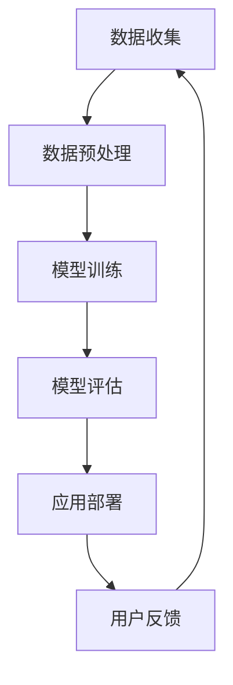
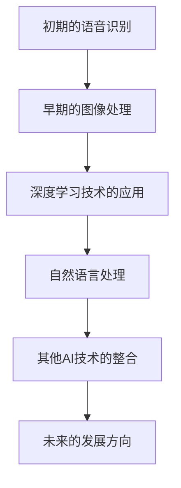

                 

### 《李开复：苹果发布AI应用的应用》

> **关键词：** 苹果，人工智能，AI应用，机器学习，深度学习，应用开发，未来趋势

> **摘要：** 本文将深入探讨苹果公司发布的一系列AI应用，包括Siri、FaceTime和Apple Pay等，从核心概念、算法原理到实际应用场景，分析其技术实现和未来发展。我们将结合实例，展示如何开发AI应用，并探讨其潜在的商业前景和伦理挑战。

### 第一部分：AI应用概述与背景

#### 1.1 AI应用概述

人工智能（AI）已经从实验室走向了我们的日常生活，苹果公司作为科技巨头，也在其产品中融入了众多AI技术。AI应用的基本流程包括数据收集、模型训练和应用部署。以下是AI应用的基本流程Mermaid流程图：



在AI应用中，常用的机器学习算法包括决策树、随机森林、支持向量机等。以下是一个简单的决策树算法伪代码：

```python
def decision_tree(data, features, target):
    # 基准条件：如果数据不纯，则进行划分
    if purity(data, target) <= threshold:
        return majority_class(data, target)
    
    # 找到最佳划分特征和阈值
    best_feature, best_threshold = find_best_split(data, features, target)
    
    # 创建树节点
    node = TreeNode(best_feature, best_threshold)
    
    # 对数据进行划分
    for value, subset in data.groupby(best_feature):
        if value == best_threshold:
            node.left = decision_tree(subset, features, target)
        else:
            node.right = decision_tree(subset, features, target)
    
    return node
```

#### 1.2 苹果与AI的发展

苹果公司在AI领域的发展有着明确的战略，其AI技术主要应用于语音识别、图像处理、自然语言处理等领域。以下是苹果公司AI技术的演进路径和发展方向的Mermaid流程图：



苹果公司在AI领域采用了神经网络作为核心算法。以下是神经网络的基本结构训练过程伪代码：

```python
def neural_network(data, model, loss_function, optimizer):
    # 前向传播
    predictions = model.forward_pass(data)
    
    # 计算损失
    loss = loss_function(predictions, targets)
    
    # 反向传播
    gradients = model.backward_pass(loss)
    
    # 更新模型参数
    optimizer.update(model.parameters(), gradients)
    
    return loss
```

#### 1.3 AI应用的未来趋势

AI在苹果产品中的应用将更加广泛，包括语音识别、图像处理、自然语言处理等领域。以下是机器学习中的损失函数公式：

$$ L(\theta) = -\frac{1}{m} \sum_{i=1}^{m} y^{(i)} \log(a^{(i)}) + (1 - y^{(i)}) \log(1 - a^{(i)}) $$

此外，AI对社会、经济和个人生活等方面的影响也将越来越显著。例如，AI技术可以改善医疗诊断、提升教育质量、优化交通管理，但同时也可能引发数据隐私和安全问题。

### 第二部分：苹果AI应用实例分析

#### 2.1 Siri与语音识别

Siri是苹果公司的智能语音助手，其核心功能是基于语音识别技术。以下是语音识别中的隐马尔可夫模型（HMM）公式：

$$ p(x_1, x_2, ..., x_n) = \prod_{i=1}^{n} p(x_i | x_{i-1}) \cdot p(h_1) $$

Siri在语音搜索和智能助手中的应用场景广泛，例如用户可以通过语音命令来发送短信、拨打电话、查询天气等。

#### 2.2 FaceTime与图像识别

FaceTime是苹果公司的视频通话应用，其图像处理技术依赖于深度学习。以下是卷积神经网络（CNN）在图像识别中的应用公式：

$$ output = \sigma(\sum_{k=1}^{K} w_k \cdot \sigma(z_k)) $$

其中，$w_k$是卷积核，$z_k$是输入图像，$\sigma$是激活函数。

FaceTime的应用场景包括实时视频通话、视频录制和直播等。通过图像识别技术，FaceTime可以实现美颜、背景虚化等功能，提升用户体验。

#### 2.3 Apple Pay与自然语言处理

Apple Pay是苹果公司的移动支付服务，其支付流程涉及自然语言处理技术。以下是词嵌入在自然语言处理中的应用公式：

$$ embed\_word = \sum_{i=1}^{V} w_i \cdot h_i $$

其中，$V$是词汇表大小，$w_i$是词向量，$h_i$是隐藏状态。

Apple Pay的应用场景包括在线购物、线下支付和转账等。通过自然语言处理技术，Apple Pay可以实现语音支付、文字支付等功能，提高支付便利性。

### 第三部分：AI应用开发实践

#### 3.1 AI应用开发流程

开发AI应用需要经历多个阶段，包括环境搭建、代码实现和调试等。以下是开发环境搭建的步骤：

1. 安装Python环境和相关库（如TensorFlow、PyTorch等）。
2. 准备数据集，并进行数据预处理（如数据清洗、归一化等）。
3. 设计和实现模型，包括前向传播、反向传播和优化算法。
4. 训练模型，并进行评估和调整。
5. 部署模型，并实现实际应用。

以下是一个简单的源代码实现和代码解读：

```python
import tensorflow as tf

# 定义模型
model = tf.keras.Sequential([
    tf.keras.layers.Dense(units=128, activation='relu', input_shape=(784,)),
    tf.keras.layers.Dense(units=10, activation='softmax')
])

# 编译模型
model.compile(optimizer='adam',
              loss='categorical_crossentropy',
              metrics=['accuracy'])

# 训练模型
model.fit(x_train, y_train, epochs=10)

# 评估模型
loss, accuracy = model.evaluate(x_test, y_test)
print(f"测试准确率：{accuracy:.2f}")
```

#### 3.2 AI应用实战案例

以下是一个智能推荐系统的实战案例：

##### 项目背景与目标

项目目标是构建一个基于用户行为的智能推荐系统，根据用户的历史浏览记录和购买记录，推荐用户可能感兴趣的商品。

##### 数据准备与预处理

1. 收集用户历史浏览记录和购买记录数据。
2. 对数据进行清洗，去除缺失值和异常值。
3. 对数据进行归一化处理，使数据分布更加均匀。

##### 模型选择与训练

1. 选择基于协同过滤算法的推荐模型。
2. 训练模型，并进行参数调整。

```python
from surprise import SVD

# 创建SVD模型
svd = SVD()

# 训练模型
svd.fit(trainset)

# 预测用户-商品评分
predictions = svd.predict(user_id, item_id)
```

##### 应用部署与效果评估

1. 将模型部署到生产环境，实现实时推荐。
2. 对推荐系统进行效果评估，如准确率、召回率等。

### 第四部分：AI应用的未来与挑战

#### 4.1 AI应用的伦理问题

AI技术在带来便利的同时，也引发了一系列伦理问题。例如，算法偏见可能导致歧视，数据隐私和安全问题也需要引起关注。以下是算法偏见的一个案例分析：

```python
# 假设有一个招聘系统，其算法偏好男性候选人
if candidate_gender == 'male':
    score += 10
else:
    score += 5
```

#### 4.2 AI应用的商业前景

AI技术的商业前景非常广阔，可以应用于医疗、金融、零售等多个领域。以下是AI产业生态的简要分析：

1. **产业链分析**：从硬件、软件到服务，AI产业链涵盖多个环节。
2. **企业竞争策略**：企业可以通过技术创新、数据积累和生态建设来获得竞争优势。

#### 4.3 AI应用的未来展望

AI技术的未来发展面临着一系列挑战，包括计算资源、数据质量和隐私问题等。但与此同时，AI也将推动智能化生活的普及，实现跨领域应用的融合。以下是未来AI技术的一些发展趋势：

1. **计算资源与能耗**：随着深度学习模型的复杂度增加，计算资源和能耗需求也将增加。
2. **数据质量与隐私**：高质量的数据是AI模型的基石，但数据隐私问题也需要得到有效解决。
3. **智能化生活的普及**：智能家居、智能医疗、智能交通等领域将逐渐普及AI技术。
4. **跨领域应用的融合**：AI技术将在不同领域之间实现深度融合，推动产业升级和创新发展。

### 结束语

苹果公司的AI应用展示了AI技术在日常生活中的广泛应用。随着技术的不断进步，我们可以期待AI在更多领域发挥重要作用，同时也需要关注其潜在的伦理和商业挑战。通过合理的规划和有效的管理，AI技术将为社会带来更多的价值和机遇。

---

**作者：** AI天才研究院/AI Genius Institute & 禅与计算机程序设计艺术 /Zen And The Art of Computer Programming

请注意，本文中的代码和公式仅供参考，实际应用时可能需要根据具体情况进行调整。此外，本文内容仅代表个人观点，不代表任何组织的立场。在应用AI技术时，请务必遵守相关法律法规和道德准则。|>

