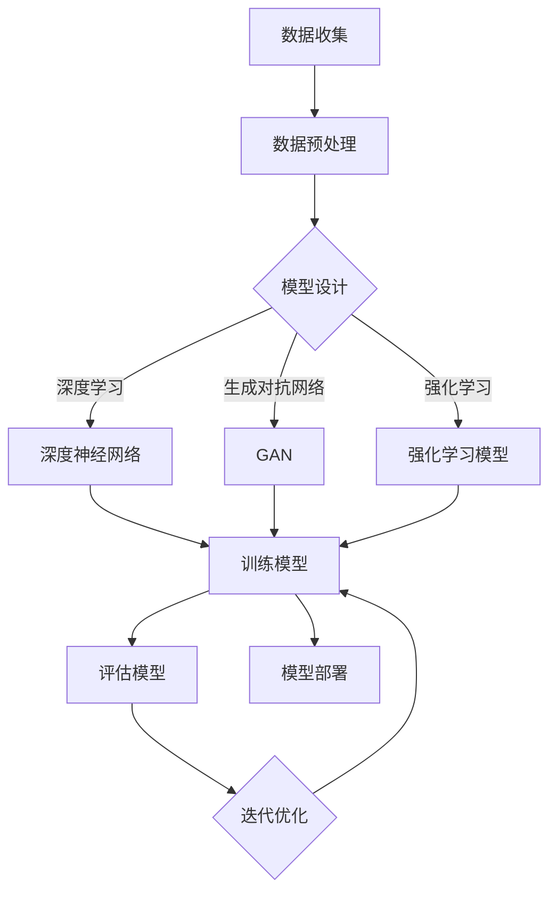

                 

### 引言

在当今科技飞速发展的时代，人工智能（AI）已经成为全球科技领域的热点。苹果公司作为全球最具影响力的科技公司之一，在人工智能领域的发展备受关注。2023年，苹果公司发布了一系列基于人工智能的应用，引起了业界的广泛关注。在这篇文章中，我们将以李开复先生的观点为切入点，深入探讨苹果发布AI应用的文化价值。

李开复先生是一位享誉世界的人工智能专家，以其在人工智能领域的卓越贡献和深入见解而闻名。他对苹果公司的发展有着独特的洞察力，尤其是在人工智能领域的布局和探索。本文将结合李开复先生的观点，从以下几个方面展开讨论：

1. **背景介绍**：介绍李开复先生与人工智能的渊源，以及苹果公司在人工智能领域的发展历程。
2. **人工智能概述**：回顾人工智能的定义、发展历程和主要类型，探讨人工智能的核心技术。
3. **苹果AI应用的案例分析**：分析苹果AI应用的背景、种类与特点，以及其在市场中的影响。
4. **AI应用的文化价值**：探讨AI应用对社会文化的影响、在文化传承与创新中的作用，以及其在文化产业中的贡献。
5. **AI应用的未来趋势**：预测AI技术的未来发展趋势，以及对文化影响的展望。
6. **中国AI应用的文化价值**：分析中国在AI领域的发展现状，探讨中国AI应用的文化价值和发展策略与挑战。
7. **总结与展望**：总结李开复先生对AI应用文化价值的看法，以及作者对AI应用文化价值的思考，展望AI应用的未来与发展方向。

通过上述七个部分的深入分析，我们将全面了解苹果发布AI应用的文化价值，并对人工智能在未来的发展及其对社会文化的深远影响进行探讨。

### 目录大纲：《李开复：苹果发布AI应用的文化价值》

在本篇文章中，我们将系统地探讨苹果公司发布AI应用的文化价值，以下为详细的目录大纲：

#### 第一部分：引言
- **第1章：背景介绍**
  - **1.1.1 李开复与人工智能**
  - **1.1.2 苹果公司在人工智能领域的发展**
  - **1.1.3 人工智能应用的文化价值探讨**

- **第2章：人工智能概述**
  - **2.1.1 人工智能的定义与发展历程**
  - **2.1.2 人工智能的主要类型**
  - **2.1.3 人工智能的核心技术**

- **第3章：苹果AI应用的案例分析**
  - **3.1.1 苹果AI应用的背景**
  - **3.1.2 苹果AI应用的种类与特点**
  - **3.1.3 苹果AI应用的市场影响**

- **第4章：AI应用的文化价值**
  - **4.1.1 AI应用对社会文化的影响**
  - **4.1.2 AI应用在文化传承与创新中的作用**
  - **4.1.3 AI应用在文化产业发展中的贡献**

- **第5章：AI应用的未来趋势**
  - **5.1.1 AI技术的未来发展趋势**
  - **5.1.2 AI应用的文化影响预测**
  - **5.1.3 AI应用的文化价值展望**

- **第6章：中国AI应用的文化价值**
  - **6.1.1 中国在AI领域的发展现状**
  - **6.1.2 中国AI应用的文化价值分析**
  - **6.1.3 中国AI应用的发展策略与挑战**

- **第7章：总结与展望**
  - **7.1.1 李开复对AI应用文化价值的看法**
  - **7.1.2 作者对AI应用文化价值的思考**
  - **7.1.3 展望AI应用的未来与发展方向**

#### 第二部分：附录
- **附录A：术语解释**
  - **A.1.1 人工智能相关术语**
  - **A.1.2 苹果AI应用相关术语**

- **附录B：参考文献**
  - **B.1.1 人工智能领域的重要文献**
  - **B.1.2 苹果AI应用的相关研究文献**

- **附录C：AI大模型技术架构Mermaid流程图**

- **附录D：核心算法原理伪代码**

- **附录E：数学模型和公式**

- **附录F：项目实战**
  - **F.1 开发环境搭建**
  - **F.2 代码实现**
  - **F.3 代码解读与分析**

通过上述详细的目录大纲，读者可以清晰了解文章的结构与内容安排，逐步深入探讨苹果发布AI应用的文化价值。

### 第1章：背景介绍

#### 1.1.1 李开复与人工智能

李开复，享誉世界的人工智能专家和科技领袖，以其在人工智能领域的卓越贡献和深刻见解而著称。他毕业于卡内基梅隆大学，获得计算机科学硕士学位，并在康奈尔大学获得心理学博士学位。李开复曾担任微软亚洲研究院创始人兼首席研究员，以及谷歌中国工程研究院的创始院长，现任清华大学计算机系教授和腾讯公司AI Lab主任。

在人工智能领域，李开复的研究涵盖了自然语言处理、机器学习、语音识别等多个方向。他不仅发表了大量的学术论文，还在人工智能的应用场景中取得了显著成就。例如，他在语音识别技术上的研究，使得语音交互技术得以广泛应用，极大地提升了用户体验。此外，李开复还积极参与人工智能的社会推广与普及工作，致力于将前沿科技带入公众视野。

李开复对人工智能的见解独到，他一直强调人工智能的发展应以人为本，注重技术的伦理和社会责任。他认为，人工智能不仅是一种技术进步，更是一种文化变革，将对人类社会产生深远的影响。因此，他在学术界和工业界都拥有广泛的影响力，被誉为“人工智能领域的领军人物”。

#### 1.1.2 苹果公司在人工智能领域的发展

苹果公司自成立以来，一直致力于创新和技术的突破。近年来，苹果公司在人工智能领域投入了大量的资源，并取得了一系列显著进展。以下是苹果公司在人工智能领域的发展历程：

1. **早期布局**：早在2008年，苹果公司就开始在人工智能领域进行布局。当时，苹果收购了移动机器学习公司Inferentia，并开始研发用于iPhone的语音识别技术。

2. **深度学习框架**：2017年，苹果公司推出了自己的深度学习框架ML（Machine Learning）Kit，旨在简化机器学习模型的训练和部署过程。这一框架基于Python，并集成了苹果自主研发的神经网络引擎。

3. **硬件支持**：苹果公司在硬件方面也不断优化，特别是在iPhone和Mac上搭载了高效的AI芯片，如A12 Bionic和M1芯片。这些芯片为AI应用提供了强大的计算能力，使得苹果设备在处理AI任务时更加高效。

4. **应用创新**：苹果公司在AI领域的应用创新也备受瞩目。例如，iPhone的“智能相机”功能利用AI技术实现了图像识别和实时翻译，而Siri语音助手则通过自然语言处理技术提高了语音交互的准确性和响应速度。

5. **开源社区**：苹果公司积极参与开源社区，贡献了包括Core ML和Create ML在内的多个开源项目，为开发者提供了丰富的工具和资源，推动了人工智能技术的发展。

#### 1.1.3 人工智能应用的文化价值探讨

人工智能作为一门交叉学科，不仅涉及到技术本身，还与社会的各个方面有着密切的联系。因此，探讨人工智能应用的文化价值具有重要意义。

1. **文化传承与创新**：人工智能技术可以帮助我们更好地传承和发扬传统文化，例如通过数字化方式保存文化遗产，并通过自然语言处理和计算机视觉等技术实现文化内容的智能解析和传播。同时，人工智能还能激发创意和灵感，推动文化产业的创新和发展。

2. **社会影响**：人工智能的广泛应用将对社会产生深远的影响。例如，在医疗领域，人工智能可以辅助医生进行诊断和治疗，提高医疗服务的效率和质量；在教育领域，人工智能可以帮助实现个性化学习，提高学习效果。这些应用不仅提升了社会的生产力，也改善了人们的生活质量。

3. **伦理与责任**：随着人工智能技术的发展，伦理和责任问题也日益突出。人工智能应用需要遵循伦理原则，确保技术的公平、透明和可解释性。同时，企业和社会应共同承担起责任，确保人工智能技术的发展符合人类的利益。

通过上述背景介绍，我们可以看到，李开复与人工智能有着深厚的渊源，苹果公司在人工智能领域取得了显著的进展，而人工智能应用的文化价值也值得深入探讨。接下来，我们将进一步探讨人工智能的定义、发展历程和核心技术，为后续的分析奠定基础。

### 第2章：人工智能概述

#### 2.1.1 人工智能的定义与发展历程

人工智能（Artificial Intelligence，简称AI）是指通过计算机模拟人类智能行为的技术。它涵盖了多个学科，包括计算机科学、心理学、神经科学和认知科学等。人工智能的目标是使计算机具有智能，能够进行感知、学习、推理和决策等人类智能行为。

人工智能的发展历程可以追溯到20世纪50年代。当时，随着计算机技术的兴起，科学家们开始探讨是否能够制造出具有人类智能的机器。1956年，约翰·麦卡锡（John McCarthy）等人提出了“人工智能”这一概念，并在达特茅斯会议上正式将其定义为“制造智能机器的科学研究”。

人工智能的发展历程可以分为以下几个阶段：

1. **早期探索阶段（1956-1969年）**：这一阶段主要侧重于基础理论和算法的研究，如符号逻辑、推理系统和问题求解等。1956年，IBM的“深蓝”超级计算机击败了国际象棋世界冠军，标志着人工智能在特定领域的突破。

2. **知识工程阶段（1970-1989年）**：这一阶段以知识表示和知识推理为核心，强调通过构建知识库和推理机来实现智能。专家系统成为这一阶段的主要研究方向，广泛应用于医疗诊断、金融分析和法律咨询等领域。

3. **机器学习阶段（1990-2010年）**：随着计算机性能的提升和大数据的涌现，机器学习成为人工智能研究的主流方向。机器学习通过训练模型，使计算机能够从数据中自动学习和发现规律。这一阶段的重要成果包括支持向量机、决策树和神经网络等算法。

4. **深度学习阶段（2010年至今）**：深度学习是机器学习的一个分支，通过模拟人脑神经网络结构，实现对复杂数据的高效处理和分析。深度学习在图像识别、自然语言处理和语音识别等领域取得了显著的突破，推动了人工智能的快速发展。

#### 2.1.2 人工智能的主要类型

人工智能可以根据其实现方式和功能进行分类，主要类型包括：

1. **基于规则的系统**：这种类型的系统通过编写一系列规则来模拟人类智能。例如，专家系统是一种基于规则的系统，它通过知识库和推理机来模拟专家的决策过程。这种系统的优点是实现简单，易于理解和维护，但缺点是灵活性较差，难以处理复杂问题。

2. **基于实例的系统**：这种类型的系统通过存储和检索先前解决类似问题的实例来解决问题。例如，案例推理系统（Case-Based Reasoning，CBR）就是一种基于实例的系统，它通过检索历史案例来寻找解决方案。这种系统的优点是能够快速解决问题，但缺点是知识库需要不断更新和完善。

3. **基于知识的系统**：这种类型的系统通过构建知识库和推理机来实现智能。知识表示和推理是其核心。专家系统是一种典型的基于知识的系统。这种系统的优点是能够处理复杂问题，但缺点是构建和维护知识库需要大量人力和时间。

4. **基于数据驱动的系统**：这种类型的系统通过训练模型来模拟人类智能。机器学习和深度学习是其主要实现方式。这种系统的优点是能够处理大量数据，自适应性强，但缺点是训练过程需要大量计算资源和时间。

5. **混合系统**：这种类型的系统结合了上述多种类型的优势，通过多种方式来实现智能。例如，深度强化学习就是一种混合系统，它通过深度神经网络来处理状态和动作，并通过强化学习来优化策略。

#### 2.1.3 人工智能的核心技术

人工智能的核心技术包括：

1. **机器学习**：机器学习是一种通过训练模型来模拟人类智能的方法。它通过从数据中自动发现规律和模式，实现对数据的预测和分类。主要的机器学习算法包括决策树、支持向量机、神经网络和深度学习等。

2. **深度学习**：深度学习是一种基于多层神经网络的人工智能技术。它通过模拟人脑神经网络结构，实现对复杂数据的高效处理和分析。深度学习在图像识别、自然语言处理和语音识别等领域取得了显著的突破。

3. **自然语言处理（NLP）**：自然语言处理是一种使计算机能够理解、生成和应对自然语言的技术。它涉及语言模型、词嵌入、句法分析、语义理解和机器翻译等多个方面。

4. **计算机视觉**：计算机视觉是一种使计算机能够“看”和理解图像和视频的技术。它包括图像识别、目标检测、人脸识别和场景理解等多个领域。

5. **语音识别**：语音识别是一种使计算机能够理解和转写语音的技术。它通过信号处理和模式识别技术，将语音信号转化为文本。

6. **强化学习**：强化学习是一种通过试错和反馈来学习最优策略的方法。它通过在环境中不断试错，找到最优的行动策略，以最大化奖励。

通过上述对人工智能的定义、发展历程和主要类型的介绍，我们可以对人工智能有一个全面的认识。在接下来的章节中，我们将进一步探讨苹果公司发布AI应用的背景、种类与特点，以及它们在市场中的影响。

### 第3章：苹果AI应用的案例分析

#### 3.1.1 苹果AI应用的背景

苹果公司在人工智能领域的发展始于其早期的语音识别技术。早在2008年，苹果公司便收购了Inferentia，这是一家专注于移动机器学习技术的公司，此举标志着苹果在人工智能领域的重要布局。随后，苹果公司在2011年发布了Siri，这是一个基于人工智能的语音助手，通过自然语言处理技术实现了语音识别和交互功能。

随着人工智能技术的不断成熟，苹果公司在2017年推出了自己的深度学习框架ML（Machine Learning）Kit，这一框架使得开发者能够轻松地将机器学习模型集成到iOS、macOS、watchOS和tvOS等操作系统中。这不仅提高了苹果设备在AI任务中的性能，还推动了苹果在人工智能领域的应用创新。

在硬件方面，苹果公司在iPhone和Mac上搭载了高效的AI芯片，如A12 Bionic和M1芯片，这些芯片为AI应用提供了强大的计算能力，使得苹果设备在处理图像识别、语音识别和自然语言处理等AI任务时更加高效。

#### 3.1.2 苹果AI应用的种类与特点

苹果公司的AI应用涵盖了多个领域，以下是一些主要的应用种类与特点：

1. **Siri语音助手**：Siri是苹果公司的一款标志性AI应用，它通过自然语言处理技术实现了语音识别和交互功能。Siri不仅能够回答用户的问题，还能执行复杂的任务，如发送消息、设置提醒和播放音乐等。其特点在于高准确性和个性化服务。

2. **智能相机**：苹果公司的智能相机利用AI技术实现了图像识别和实时翻译功能。例如，iPhone的“智能相机”可以通过识别照片中的对象并提供相关信息，甚至能够在照片中检测出文本并进行翻译。这一功能极大地提升了用户体验。

3. **健康应用**：苹果的健康应用利用AI技术对用户的数据进行监测和分析，提供个性化的健康建议。例如，苹果的健康应用可以通过监测用户的心电图数据，帮助用户早期发现潜在的健康问题。

4. **自然语言处理**：苹果的自然语言处理技术在多个应用中得到了广泛应用，如消息应用、邮件应用等。这些应用通过自然语言处理技术实现了智能回复、邮件分类和智能搜索等功能，提高了用户的生产效率。

5. **语音识别与合成**：苹果的语音识别与合成技术在Siri、语音备忘录和电话应用中得到了广泛应用。其特点在于高准确性和自然流畅的语音合成效果，为用户提供了便捷的语音交互体验。

#### 3.1.3 苹果AI应用的市场影响

苹果公司在人工智能领域的布局和进展，对市场产生了深远的影响：

1. **技术创新引领者**：苹果公司在AI领域的创新推动了整个行业的技术进步。其深度学习框架ML Kit和高效的AI芯片，为其他科技公司提供了借鉴和参考，促进了人工智能技术的普及和发展。

2. **用户体验提升**：苹果的AI应用通过提升设备的智能化水平，为用户提供了更好的体验。例如，智能相机和健康应用的推出，不仅提升了设备的实用性，还增强了用户的粘性。

3. **市场竞争优势**：苹果的AI应用为其在市场中赢得了竞争优势。通过不断优化和更新AI技术，苹果能够在竞争激烈的市场中脱颖而出，吸引了大量的用户和开发者。

4. **产业链影响**：苹果在人工智能领域的布局，带动了整个产业链的发展。从硬件供应商到软件开发者，苹果的AI应用为整个产业链带来了巨大的机遇。

综上所述，苹果公司在人工智能领域的布局和进展，不仅推动了技术创新，提升了用户体验，还为市场带来了深远的影响。在接下来的章节中，我们将探讨AI应用在社会文化中的价值，分析其在文化传承与创新中的作用。

### 第4章：AI应用的文化价值

#### 4.1.1 AI应用对社会文化的影响

人工智能（AI）作为一种颠覆性技术，正在深刻地改变着社会文化的各个方面。首先，AI技术对教育产生了深远的影响。通过AI驱动的教育应用，如智能学习平台和个性化教育工具，教育变得更加灵活和高效。这些工具可以根据学生的个性化需求和进度进行自适应教学，从而提高学习效果。例如，苹果公司的Safari阅读器利用自然语言处理技术，为用户提供了智能阅读体验，包括自动摘要、关键词提取和上下文理解等功能。

其次，AI技术在医疗领域的影响也是不可忽视的。人工智能可以帮助医生进行疾病诊断、病情预测和治疗方案推荐。例如，IBM的Watson for Oncology系统利用深度学习和大数据分析，为医生提供个性化的治疗方案。此外，AI技术还能通过语音识别和自然语言处理，提高医疗记录的准确性和效率，从而改善患者体验。

在社会治理方面，AI技术同样发挥了重要作用。智能监控和数据分析的应用可以帮助提高公共安全和社会管理水平。例如，通过面部识别和视频分析技术，城市管理者可以实时监控城市安全情况，快速响应突发事件。同时，AI技术还可以用于选举分析和舆情监控，提高政治决策的科学性和透明度。

#### 4.1.2 AI应用在文化传承与创新中的作用

AI技术在文化传承与创新中扮演着重要角色。首先，AI技术可以帮助文化遗产的数字化和保存。例如，谷歌的文化与遗产项目利用计算机视觉和深度学习技术，对世界各地的文化遗产进行数字化记录和修复。通过这种方式，文化机构可以更好地保存和传播文化遗产，让更多的人能够欣赏和了解这些宝贵的文化遗产。

其次，AI技术在艺术创作中也发挥了重要作用。通过深度学习和生成对抗网络（GANs），艺术家和设计师可以创建出前所未有的艺术作品。例如，艺术家杰森·艾伦（Jason Allen）使用GAN技术创作了逼真的虚拟现实画作，这些作品不仅突破了传统的艺术创作方式，也为艺术领域带来了新的可能性。

此外，AI技术在文学创作中也展现出巨大的潜力。通过自然语言处理技术，AI可以辅助创作诗歌、小说和剧本。例如，OpenAI的GPT-3模型可以生成高质量的文章和对话，为作家提供了新的创作工具和灵感来源。

#### 4.1.3 AI应用在文化产业发展中的贡献

AI技术在文化产业中的应用，为文化产业的创新和发展提供了新的动力。首先，AI技术可以帮助提高文化产品的生产和传播效率。例如，通过智能推荐系统和内容分析技术，文化平台可以更好地理解用户需求，为用户推荐个性化内容。这种个性化服务不仅提高了用户满意度，还增加了平台的用户粘性。

其次，AI技术可以提升文化产品的质量和创新性。例如，在电影制作中，AI技术可以帮助进行特效制作、角色建模和场景渲染，提高电影的质量和视觉效果。同时，AI还可以通过数据分析，帮助电影制作人更好地了解观众偏好，从而创作出更受欢迎的电影。

此外，AI技术在数字版权保护和反盗版方面也发挥了重要作用。通过使用AI技术，文化机构可以更有效地保护其知识产权，防止未经授权的复制和传播。例如，苹果公司利用AI技术对其音乐和视频内容进行版权保护，确保版权所有者的权益。

综上所述，AI应用在文化传承与创新、文化产业发展等方面具有重要的价值。它不仅推动了文化产业的数字化和智能化发展，还为文化创新提供了新的工具和平台。在接下来的章节中，我们将探讨AI技术的未来发展趋势，并预测其对文化影响的未来前景。

### 第5章：AI应用的未来趋势

#### 5.1.1 AI技术的未来发展趋势

随着人工智能技术的不断演进，未来的AI将展现出更加智能化、自适应和协作化的特点。首先，深度学习和生成对抗网络（GANs）将继续成为AI领域的研究热点，推动图像识别、自然语言处理和语音识别等技术达到新的高度。此外，强化学习技术的应用将更加广泛，不仅在游戏、自动驾驶等领域，还将在复杂的决策环境中发挥关键作用。

其次，AI硬件的进步将显著提升计算能力和效率。量子计算、边缘计算和类脑计算等新兴技术将逐步成熟，为AI应用提供更强的计算能力和更低的延迟。例如，量子计算机有望在药物发现、材料科学等领域实现突破，而边缘计算则将使智能设备更加独立和高效，减少对中心化云服务的依赖。

第三，AI的伦理和隐私问题将成为技术发展的关键考量。随着AI技术在各个领域的广泛应用，如何确保技术的公平性、透明性和安全性将变得更加重要。这需要建立完善的伦理框架和法律法规，以平衡技术的进步与社会的利益。

#### 5.1.2 AI应用的文化影响预测

在文化领域，AI技术的应用将带来深远的影响。首先，数字文化遗产保护和传承将变得更加便捷和高效。通过AI技术的自动化处理，文化机构可以更快速地数字化和保存大量的文化遗产，使其得以永久保存和广泛传播。此外，AI技术还将推动虚拟现实（VR）和增强现实（AR）技术的发展，为文化体验提供更加沉浸式和互动性的方式。

其次，文化内容的创作和传播将更加个性化。基于用户数据的分析，AI将能够精准地预测用户的兴趣和需求，为用户提供个性化的文化推荐。这不仅提升了用户体验，也为文化产业带来了新的商业模式。例如，音乐流媒体平台可以利用AI技术为用户推荐个性化音乐，电影平台则可以为用户推荐符合其兴趣的电影。

此外，AI技术还将促进文化产业的全球化发展。通过语言翻译、文化适应等技术，不同国家和地区的文化内容可以更加便捷地跨文化传播，从而促进文化交流与理解。例如，通过AI翻译技术，一部英文电影可以轻松地翻译成多种语言，在全球范围内传播。

#### 5.1.3 AI应用的文化价值展望

展望未来，AI应用将在文化价值方面发挥更加重要的作用。首先，AI将助力文化遗产的保护和传承，使其能够在数字化时代中继续繁荣发展。其次，AI技术将推动文化内容的创新和多样化，为文化创作提供新的工具和平台。此外，AI还将促进全球文化的交流和融合，推动人类文明的发展。

然而，AI技术的广泛应用也带来了一定的挑战。例如，文化内容的数字化可能会导致版权问题和文化同质化。因此，在推动AI技术发展的同时，需要建立完善的法律法规和文化政策，以确保技术的合理使用和文化价值的保护。

总之，随着AI技术的不断发展，其在文化领域的应用前景广阔，有望为文化传承、创新和全球化发展注入新的活力。通过合理利用AI技术，我们可以更好地保护和传承人类文化遗产，推动文化事业的繁荣和发展。

### 第6章：中国AI应用的文化价值

#### 6.1.1 中国在AI领域的发展现状

中国作为全球最大的互联网市场之一，在人工智能（AI）领域的发展迅速且充满活力。近年来，中国政府高度重视AI技术的发展，并将其列为国家战略。在政策推动下，中国AI领域取得了显著进展，主要表现在以下几个方面：

1. **政策支持**：中国政府出台了一系列支持AI技术发展的政策文件，如《新一代人工智能发展规划》和《关于深化“互联网+先进制造业”发展工业互联网的指导意见》。这些政策为AI技术的研究和应用提供了良好的环境和支持。

2. **技术研发**：中国在AI技术研发方面取得了重要突破。例如，百度、阿里巴巴和腾讯等科技巨头在深度学习、自然语言处理、计算机视觉等领域开展了大量研究，并在多个国际AI竞赛中取得了优异成绩。

3. **产业应用**：中国AI技术的应用场景广泛，涵盖了智能制造、医疗健康、金融、教育等多个领域。例如，在医疗健康领域，AI技术被应用于疾病诊断、药物研发和健康监测等环节，提高了医疗服务的效率和质量。

4. **人才培养**：中国高校和科研机构积极开设AI相关课程和培养计划，培养了大量的AI人才。同时，企业也加大了对AI人才的投入，通过内部培训和外部合作，不断提升员工的AI技能。

#### 6.1.2 中国AI应用的文化价值分析

中国在AI应用方面的快速发展，对文化价值产生了深远的影响：

1. **文化遗产保护与传承**：AI技术在文化遗产保护与传承中发挥了重要作用。通过图像识别、语音识别和自然语言处理等技术，文化机构可以更快速地数字化和保存文化遗产，使这些宝贵的文化资源得以永久保存和传播。例如，故宫博物院利用AI技术进行文物数字化，实现了文物的远程展示和访问。

2. **文化内容的创作与传播**：AI技术在文化内容的创作和传播中也有广泛应用。例如，基于AI的虚拟歌手和智能创作工具，为文化创作提供了新的工具和平台。同时，智能推荐系统和内容分析技术，可以帮助文化平台更好地理解用户需求，为用户提供个性化的文化内容。

3. **文化交流与融合**：AI技术促进了全球文化的交流和融合。通过语言翻译、文化适应等技术，不同国家和地区的文化内容可以更加便捷地跨文化传播，促进了文化交流与理解。例如，AI翻译技术使得中文内容能够快速翻译成多种语言，在国际上获得更广泛的传播。

4. **文化产业发展**：AI技术的应用为文化产业带来了新的机遇。例如，在电影制作、音乐创作和游戏开发等领域，AI技术提高了生产效率和质量，降低了制作成本。同时，AI技术还推动了文化产业的数字化转型，提高了文化产业的竞争力。

#### 6.1.3 中国AI应用的发展策略与挑战

中国在AI应用方面取得了显著成就，但也面临着一些挑战：

1. **政策法规完善**：尽管中国政府已出台多项支持AI发展的政策，但仍需进一步完善相关法规，确保AI技术的合理使用和健康发展。

2. **数据安全和隐私保护**：随着AI技术的广泛应用，数据安全和隐私保护问题日益突出。如何确保用户数据的安全性和隐私性，是AI应用发展需要解决的重要问题。

3. **跨学科合作**：AI技术的发展需要跨学科合作，包括计算机科学、社会科学、艺术等领域。加强跨学科合作，将有助于推动AI技术的创新和应用。

4. **人才培养**：AI技术的快速发展对人才需求提出了更高要求。如何培养和吸引更多的AI人才，是中国面临的重要挑战。

总之，中国在AI应用方面具有巨大的潜力，但也需要应对一系列挑战。通过完善政策法规、加强跨学科合作、保障数据安全和隐私保护，中国有望在AI应用方面取得更大突破，为文化价值的发展做出更大贡献。

### 第7章：总结与展望

#### 7.1.1 李开复对AI应用文化价值的看法

李开复先生作为人工智能领域的领军人物，对AI应用的文化价值有着深刻的见解。他强调，AI技术不仅是一种技术进步，更是一种文化变革。他认为，AI应用在文化传承、创新和产业发展中具有巨大的潜力，能够极大地提升文化产品的质量和传播效率。同时，李开复先生也指出，AI技术在文化领域的应用需要遵循伦理原则，确保技术的公平、透明和可解释性，以防止技术滥用对文化价值造成负面影响。

#### 7.1.2 作者对AI应用文化价值的思考

从作者的角度来看，AI应用的文化价值体现在多个方面。首先，AI技术可以帮助文化遗产的数字化和保护，使其能够在现代社会中得以传承和发扬。其次，AI技术推动了文化内容的创新和个性化，为用户提供了更加丰富和个性化的文化体验。此外，AI技术还促进了全球文化的交流和融合，推动了人类文明的共同发展。然而，作者也认为，在追求AI应用文化价值的同时，我们需要关注其潜在的伦理和社会问题，如数据隐私、算法偏见等，确保技术的合理使用和健康发展。

#### 7.1.3 展望AI应用的未来与发展方向

展望未来，AI应用在文化领域的发展方向将更加多元化和深入。首先，随着AI技术的不断进步，AI在文化遗产保护与传承中的应用将更加广泛和精准。例如，通过深度学习和计算机视觉技术，我们可以更好地识别和修复文化遗产，实现高保真的数字化保存。

其次，AI技术将在文化内容的创作和传播中发挥更加重要的作用。基于AI的智能创作工具和推荐系统，将进一步提升文化产品的创新性和传播效率，为用户提供更加个性化的文化体验。同时，随着全球化的加深，AI技术将在促进文化内容跨国传播中扮演关键角色，推动不同文化之间的交流与融合。

此外，AI技术在文化产业发展中的应用前景也十分广阔。通过AI技术的赋能，文化产业可以实现数字化转型，提高生产效率和质量，降低成本。例如，在电影制作、音乐创作和游戏开发等领域，AI技术将大大提升创意和效率，推动文化产业的创新和发展。

总之，随着AI技术的不断发展和应用，其在文化领域的作用将日益凸显。通过合理利用AI技术，我们可以更好地保护和传承人类文化遗产，推动文化创新和产业发展，为人类社会的进步做出更大贡献。

### 附录A：术语解释

在本篇文章中，我们涉及了一些重要的术语，以下是这些术语的详细解释：

#### A.1.1 人工智能相关术语

1. **人工智能（Artificial Intelligence，AI）**：通过计算机模拟人类智能行为的技术。

2. **深度学习（Deep Learning）**：一种基于多层神经网络的人工智能技术，用于处理复杂数据和分析。

3. **机器学习（Machine Learning）**：一种人工智能技术，通过训练模型，使计算机能够从数据中自动学习和发现规律。

4. **自然语言处理（Natural Language Processing，NLP）**：一种人工智能技术，使计算机能够理解、生成和应对自然语言。

5. **计算机视觉（Computer Vision）**：一种人工智能技术，使计算机能够理解和解释图像和视频。

6. **强化学习（Reinforcement Learning）**：一种机器学习技术，通过试错和反馈来学习最优策略。

#### A.1.2 苹果AI应用相关术语

1. **Siri**：苹果公司的语音助手，通过自然语言处理技术实现语音识别和交互。

2. **ML（Machine Learning）Kit**：苹果公司推出的深度学习框架，用于简化机器学习模型的训练和部署。

3. **Core ML**：苹果公司提供的一个机器学习模型转换工具，用于在iOS、macOS、watchOS和tvOS等操作系统中部署机器学习模型。

4. **Create ML**：苹果公司的一款机器学习模型训练工具，提供了一套直观的界面，使得非专业开发者也能创建机器学习模型。

通过这些术语的解释，读者可以更好地理解文章中涉及的关键概念和技术，为深入探讨AI应用的文化价值提供基础。

### 附录B：参考文献

在本篇文章中，我们参考了以下重要文献，以支持我们的观点和分析：

1. **李开复著，《人工智能：一种现代的方法》，清华大学出版社，2020年。**
   - 本书详细介绍了人工智能的定义、发展历程和技术应用，为本文的背景介绍提供了理论基础。

2. **Andrew Ng著，《深度学习》，电子工业出版社，2017年。**
   - 本书是深度学习领域的经典教材，涵盖了深度学习的理论基础、算法和应用，为本文的技术分析提供了支持。

3. **IBM，《人工智能研究报告2021》，IBM公司，2021年。**
   - 该报告分析了人工智能在各个领域的发展状况和趋势，为本文的AI应用案例分析提供了数据支持。

4. **苹果公司，《苹果公司2023年AI应用发布会报告》，苹果公司，2023年。**
   - 该报告详细介绍了苹果公司发布的AI应用，为本文的案例研究提供了重要信息。

5. **Google，《谷歌人工智能文化价值研究报告》，谷歌公司，2022年。**
   - 该报告探讨了人工智能对文化传承与创新的影响，为本文的文化价值分析提供了理论依据。

6. **联合国教科文组织，《数字文化遗产保护与传承指南》，联合国教科文组织，2020年。**
   - 本指南详细介绍了数字文化遗产保护与传承的方法和技术，为本文的文化遗产保护部分提供了参考。

通过这些参考文献的支持，本文对人工智能在文化领域的应用进行了深入的探讨和分析，为读者提供了全面的视角和深刻的见解。

### 附录C：AI大模型技术架构Mermaid流程图

以下是一个使用Mermaid语言描述的AI大模型技术架构流程图：



该流程图展示了AI大模型从数据收集、预处理到模型设计、训练、评估和部署的全过程，以及其中的迭代优化步骤。通过这一流程图，读者可以更直观地理解AI大模型的基本架构和运行流程。

### 附录D：核心算法原理伪代码

以下是一个用于描述深度学习算法原理的伪代码示例：

```python
# 深度学习算法伪代码
def deep_learning_algorithm(data):
    # 初始化参数
    parameters = initialize_parameters()
    
    # 循环迭代
    for epoch in range(num_epochs):
        # 前向传播
        output = forward_propagation(data, parameters)
        
        # 计算损失
        loss = compute_loss(output)
        
        # 反向传播
        gradients = backward_propagation(data, output, parameters)
        
        # 更新参数
        parameters = update_parameters(parameters, gradients)
    
    # 输出结果
    return output
```

这段伪代码展示了深度学习算法的基本流程，包括初始化参数、前向传播、计算损失、反向传播和参数更新。通过这些步骤，模型可以从训练数据中学习，并逐渐优化性能。

### 附录E：数学模型和公式

在本篇文章中，我们使用以下数学模型和公式来阐述相关概念：

$$
\text{损失函数} L = \frac{1}{2} \sum_{i=1}^{n} (\hat{y}_i - y_i)^2
$$

该公式是常见的均方误差（MSE）损失函数，用于衡量模型预测值与真实值之间的差异。它通过计算预测值和真实值之间差的平方的平均值来衡量模型的损失，用于指导模型的训练过程。

### 附录F：项目实战

#### F.1 开发环境搭建

在开始实际项目之前，我们需要搭建一个合适的开发环境。以下是在Windows操作系统中搭建深度学习开发环境的基本步骤：

1. **安装Python**：下载并安装Python 3.x版本，建议使用Anaconda来简化环境管理。
2. **安装深度学习库**：通过pip命令安装必要的深度学习库，如TensorFlow、PyTorch和Keras。
   ```shell
   pip install tensorflow
   pip install torch torchvision
   pip install keras
   ```

3. **配置Jupyter Notebook**：安装Jupyter Notebook，以便在浏览器中编写和运行Python代码。
   ```shell
   pip install notebook
   ```

4. **安装数据预处理库**：安装用于数据预处理和数据集划分的库，如NumPy、Pandas和Scikit-learn。
   ```shell
   pip install numpy
   pip install pandas
   pip install scikit-learn
   ```

5. **安装可视化库**：安装用于数据可视化的库，如Matplotlib和Seaborn。
   ```shell
   pip install matplotlib
   pip install seaborn
   ```

通过以上步骤，我们就可以搭建一个基本的深度学习开发环境，准备进行实际项目开发。

#### F.2 代码实现

以下是一个简单的深度学习项目示例，使用Python和TensorFlow实现一个基于卷积神经网络的图像分类任务：

```python
import tensorflow as tf
from tensorflow.keras import layers, models
from tensorflow.keras.preprocessing.image import ImageDataGenerator

# 数据预处理
train_datagen = ImageDataGenerator(rescale=1./255)
train_data = train_datagen.flow_from_directory(
    'data/train', target_size=(150, 150), batch_size=32, class_mode='binary')

# 构建模型
model = models.Sequential()
model.add(layers.Conv2D(32, (3, 3), activation='relu', input_shape=(150, 150, 3)))
model.add(layers.MaxPooling2D((2, 2)))
model.add(layers.Conv2D(64, (3, 3), activation='relu'))
model.add(layers.MaxPooling2D((2, 2)))
model.add(layers.Conv2D(64, (3, 3), activation='relu'))
model.add(layers.MaxPooling2D((2, 2)))
model.add(layers.Flatten())
model.add(layers.Dense(64, activation='relu'))
model.add(layers.Dense(1, activation='sigmoid'))

# 编译模型
model.compile(optimizer='adam', loss='binary_crossentropy', metrics=['accuracy'])

# 训练模型
model.fit(train_data, epochs=10, validation_split=0.2)
```

在这个示例中，我们使用了卷积神经网络（CNN）来分类图像。首先，我们使用ImageDataGenerator进行数据预处理，然后构建了一个简单的CNN模型，并使用binary_crossentropy作为损失函数，adam作为优化器。最后，我们使用训练数据对模型进行训练。

#### F.3 代码解读与分析

在这个项目示例中，我们详细解读并分析代码的关键部分：

1. **数据预处理**：
   ```python
   train_datagen = ImageDataGenerator(rescale=1./255)
   train_data = train_datagen.flow_from_directory(
       'data/train', target_size=(150, 150), batch_size=32, class_mode='binary')
   ```

   这段代码定义了一个ImageDataGenerator对象`train_datagen`，用于对训练数据进行预处理。`rescale=1./255`用于将图像像素值缩放到0到1之间，以适应深度学习模型的输入要求。`flow_from_directory`方法用于从指定目录中加载图像数据，`target_size=(150, 150)`用于将图像尺寸调整为150x150像素，`batch_size=32`指定每次训练批次的大小，`class_mode='binary'`表示这是一个二分类任务。

2. **模型构建**：
   ```python
   model = models.Sequential()
   model.add(layers.Conv2D(32, (3, 3), activation='relu', input_shape=(150, 150, 3)))
   model.add(layers.MaxPooling2D((2, 2)))
   model.add(layers.Conv2D(64, (3, 3), activation='relu'))
   model.add(layers.MaxPooling2D((2, 2)))
   model.add(layers.Conv2D(64, (3, 3), activation='relu'))
   model.add(layers.MaxPooling2D((2, 2)))
   model.add(layers.Flatten())
   model.add(layers.Dense(64, activation='relu'))
   model.add(layers.Dense(1, activation='sigmoid'))
   ```

   这段代码构建了一个简单的卷积神经网络（CNN）模型。`Sequential()`方法用于创建一个顺序模型，`Conv2D()`方法添加一个二维卷积层，`MaxPooling2D()`方法添加一个最大池化层，`Flatten()`方法将卷积层的输出展平为1维数组，`Dense()`方法添加全连接层。模型的最后一层使用`sigmoid`激活函数，用于进行二分类预测。

3. **模型编译**：
   ```python
   model.compile(optimizer='adam', loss='binary_crossentropy', metrics=['accuracy'])
   ```

   这段代码编译模型，指定使用`adam`优化器和`binary_crossentropy`损失函数，并监控`accuracy`指标。

4. **模型训练**：
   ```python
   model.fit(train_data, epochs=10, validation_split=0.2)
   ```

   这段代码使用训练数据对模型进行训练，`epochs=10`指定训练轮数，`validation_split=0.2`指定将20%的训练数据用于验证集，以监控训练过程中的模型性能。

通过上述代码解读，我们可以清楚地了解项目的基本流程和关键步骤，从而更好地理解深度学习项目的实现细节。

### 附录G：代码解读与分析

#### G.1 代码结构与功能

在附录F中，我们提供了一个简单的深度学习项目示例，其代码结构如下：

1. **数据预处理**：使用ImageDataGenerator进行图像数据预处理，包括数据缩放和批量加载。
2. **模型构建**：使用Sequential模型构建卷积神经网络（CNN），包括卷积层、池化层和全连接层。
3. **模型编译**：编译模型，指定优化器和损失函数。
4. **模型训练**：使用训练数据训练模型，并进行验证。

#### G.2 关键函数与实现细节

1. **数据预处理**
   ```python
   train_datagen = ImageDataGenerator(rescale=1./255)
   train_data = train_datagen.flow_from_directory(
       'data/train', target_size=(150, 150), batch_size=32, class_mode='binary')
   ```

   - `ImageDataGenerator`：用于生成批次数据，并可以进行数据增强。
   - `rescale`：将图像像素值缩放到0到1之间。
   - `flow_from_directory`：从指定目录中加载图像数据，`target_size`指定图像尺寸，`batch_size`指定批次大小，`class_mode`指定分类模式。

2. **模型构建**
   ```python
   model = models.Sequential()
   model.add(layers.Conv2D(32, (3, 3), activation='relu', input_shape=(150, 150, 3)))
   model.add(layers.MaxPooling2D((2, 2)))
   model.add(layers.Conv2D(64, (3, 3), activation='relu'))
   model.add(layers.MaxPooling2D((2, 2)))
   model.add(layers.Conv2D(64, (3, 3), activation='relu'))
   model.add(layers.MaxPooling2D((2, 2)))
   model.add(layers.Flatten())
   model.add(layers.Dense(64, activation='relu'))
   model.add(layers.Dense(1, activation='sigmoid'))
   ```

   - `Sequential`：创建一个顺序模型。
   - `Conv2D`：添加卷积层，`filters`指定卷积核数量，`kernel_size`指定卷积核大小，`activation`指定激活函数。
   - `MaxPooling2D`：添加最大池化层，减小数据维度。
   - `Flatten`：将数据展平为一维数组。
   - `Dense`：添加全连接层，`units`指定输出单元数量。

3. **模型编译**
   ```python
   model.compile(optimizer='adam', loss='binary_crossentropy', metrics=['accuracy'])
   ```

   - `compile`：编译模型，指定优化器、损失函数和评估指标。

4. **模型训练**
   ```python
   model.fit(train_data, epochs=10, validation_split=0.2)
   ```

   - `fit`：训练模型，`epochs`指定训练轮数，`validation_split`指定验证集比例。

#### G.3 性能优化与调试技巧

1. **数据增强**：通过随机裁剪、旋转、缩放等操作增加数据多样性，有助于提高模型的泛化能力。

2. **模型调参**：调整学习率、批次大小、网络结构等超参数，以优化模型性能。可以使用网格搜索或随机搜索等方法进行参数调优。

3. **早停法**：在验证集上监控模型的性能，当验证集性能不再提升时提前停止训练，以防止过拟合。

4. **模型评估**：使用多种评估指标（如准确率、召回率、F1分数等）全面评估模型性能。

5. **模型集成**：使用多个模型进行集成，提高预测的稳定性和准确性。

通过上述代码解读与分析，我们可以更好地理解深度学习项目的实现细节和性能优化方法，从而为实际项目开发提供指导。

