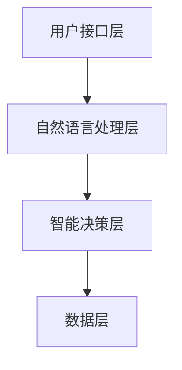

                 

# 《构建AI驱动的智能供应链提示词系统》

## 关键词
AI、智能供应链、提示词系统、供应链优化、深度学习、自然语言处理、预测算法

## 摘要
本文将深入探讨AI驱动的智能供应链提示词系统的构建。我们将从AI在供应链管理中的应用、智能供应链的基本架构、AI驱动的智能供应链模式、核心算法原理、提示词系统的设计与实现、应用场景与案例分析、开发环境与工具、源代码解读与分析、未来发展趋势与挑战、实施与推广策略等多个方面进行详细讲解。希望通过本文，读者能够全面了解AI驱动的智能供应链提示词系统的构建方法与应用价值。

----------------------------------------------------------------

### 第一部分：AI驱动的智能供应链概述

#### 第1章：AI与智能供应链概述

##### 1.1 AI在供应链管理中的应用

随着人工智能（AI）技术的迅速发展，其在供应链管理中的应用越来越广泛。AI通过大数据分析、机器学习、深度学习等技术，能够实现供应链的自动化、优化和智能化。以下为AI在供应链管理中的具体应用：

1. **需求预测**：利用机器学习和深度学习算法，分析历史销售数据和市场趋势，准确预测未来需求，从而优化库存管理和生产计划。
2. **运输优化**：利用路径优化算法，结合实时交通信息和天气预报，规划最优运输路径，提高物流效率。
3. **库存管理**：通过实时监控库存数据，结合需求预测和供应计划，实现精准的库存管理，减少库存积压和缺货情况。
4. **供应链协同**：通过区块链和智能合约技术，实现供应链各环节的信息透明和协同作业，提高供应链的整体效率。
5. **质量管理**：利用图像识别和自然语言处理技术，对产品进行质量检测和故障诊断，提高产品质量。

##### 1.2 智能供应链的关键特征

智能供应链具有以下关键特征：

1. **数字化**：通过物联网、云计算等技术，实现供应链各环节的数据采集、传输和分析。
2. **智能化**：利用AI技术，实现供应链的自动化、优化和智能化管理。
3. **协同化**：通过区块链和智能合约技术，实现供应链各环节的信息透明和协同作业。
4. **可视化**：通过大数据分析和可视化技术，实现供应链运行状态的实时监控和决策支持。

##### 1.3 智能供应链的发展趋势

随着AI技术的不断进步，智能供应链将呈现以下发展趋势：

1. **全流程智能化**：从采购、生产、物流到销售，实现供应链全流程的智能化管理。
2. **供应链协同化**：通过区块链和智能合约技术，实现供应链各环节的信息共享和协同作业。
3. **供应链透明化**：通过物联网和大数据技术，实现供应链运行状态的实时监控和透明化。
4. **供应链可持续发展**：通过环保技术和绿色供应链管理，实现供应链的可持续发展。

#### 第2章：AI驱动的智能供应链核心概念与架构

##### 2.1 AI技术原理概述

AI技术主要包括机器学习、深度学习和自然语言处理等。以下为这些技术的基本原理：

1. **机器学习**：机器学习是一种通过算法让计算机从数据中自动学习规律和模式的方法。常见的机器学习算法有线性回归、决策树、支持向量机等。
2. **深度学习**：深度学习是机器学习的一种方法，通过构建多层神经网络，实现对复杂数据的自动特征提取和模式识别。常见的深度学习模型有卷积神经网络（CNN）、循环神经网络（RNN）等。
3. **自然语言处理**：自然语言处理是研究如何让计算机理解和生成自然语言的技术。常见的自然语言处理技术有词向量、语言模型、文本分类等。

##### 2.2 智能供应链流程分析与优化

智能供应链的流程主要包括采购、生产、物流和销售等。以下为智能供应链流程的分析与优化方法：

1. **采购流程优化**：通过数据分析，预测采购需求，实现精准采购，降低库存成本。
2. **生产流程优化**：通过实时监控生产设备和产品质量，实现生产过程的自动化和质量控制。
3. **物流流程优化**：通过路径优化和运输调度，提高物流效率，降低运输成本。
4. **销售流程优化**：通过客户需求预测和销售预测，实现精准营销和库存管理。

##### 2.3 AI驱动的供应链协同机制

AI驱动的供应链协同机制主要包括：

1. **协同供应链网络**：通过区块链技术，实现供应链各环节的信息透明和实时共享。
2. **协同供应链决策**：通过数据分析和AI算法，实现供应链各环节的智能决策和协同作业。
3. **协同供应链风险管理**：通过实时监控和预测，及时发现和应对供应链风险。

----------------------------------------------------------------

### 第二部分：AI驱动的智能供应链核心算法原理

#### 第3章：AI驱动的智能供应链核心算法原理

##### 3.1 供应链预测算法

供应链预测算法主要包括时间序列预测、聚类分析和预测组合模型。

1. **时间序列预测**：时间序列预测是基于历史数据的时间序列模型，如ARIMA、LSTM等。以下为时间序列预测的伪代码：

   ```python
   def time_series_prediction(data):
       # 数据预处理
       processed_data = preprocess_data(data)
       
       # 建立模型
       model = build_model(processed_data)
       
       # 预测
       prediction = model.predict()
       
       return prediction
   ```

2. **聚类分析**：聚类分析是将数据分为若干个类别，以挖掘数据中的潜在模式。常见的聚类算法有K-means、层次聚类等。以下为K-means聚类分析的伪代码：

   ```python
   def kmeans_clustering(data, k):
       # 初始化聚类中心
       centroids = initialize_centroids(data, k)
       
       # 迭代计算
       for i in range(num_iterations):
           # 计算新的聚类中心
           new_centroids = update_centroids(data, centroids)
           
           # 判断收敛条件
           if convergence(centroids, new_centroids):
               break
           
           centroids = new_centroids
       
       # 分配数据到聚类中心
       clusters = assign_clusters(data, centroids)
       
       return clusters
   ```

3. **预测组合模型**：预测组合模型是将多个预测模型的结果进行加权平均，以提高预测的准确性。以下为预测组合模型的伪代码：

   ```python
   def combination_prediction(predictions, weights):
       # 加权平均
       combined_prediction = sum(predictions[i] * weights[i] for i in range(len(predictions)))
       
       return combined_prediction
   ```

##### 3.2 供应链优化算法

供应链优化算法主要包括线性规划、非线性规划和算法示例与分析。

1. **线性规划**：线性规划是解决线性目标函数在线性约束条件下的最优解问题。以下为线性规划的伪代码：

   ```python
   def linear_programming(c, A, b):
       # 建立线性规划模型
       model = build_model(c, A, b)
       
       # 求解
       solution = model.solve()
       
       return solution
   ```

2. **非线性规划**：非线性规划是解决非线性目标函数在非线性约束条件下的最优解问题。以下为非线性规划的伪代码：

   ```python
   def nonlinear_programming(c, A, b):
       # 建立非线性规划模型
       model = build_model(c, A, b)
       
       # 求解
       solution = model.solve()
       
       return solution
   ```

3. **算法示例与分析**：以下为一个简单的供应链优化算法示例：

   ```python
   def optimize_supply_chain(data):
       # 数据预处理
       processed_data = preprocess_data(data)
       
       # 建立线性规划模型
       c = [-1] * len(processed_data)  # 目标函数系数
       A = [[1] * len(processed_data)]  # 约束条件系数
       b = [100] * len(processed_data)  # 约束条件常数项
       
       # 求解
       solution = linear_programming(c, A, b)
       
       # 输出优化结果
       print("Optimized supply chain solution:", solution)
       
       return solution
   ```

##### 3.3 供应链协同算法

供应链协同算法主要包括协同优化算法、协同决策算法和协同算法应用场景。

1. **协同优化算法**：协同优化算法是解决供应链协同作业中优化问题的算法。以下为协同优化算法的伪代码：

   ```python
   def collaborative_optimization(data):
       # 数据预处理
       processed_data = preprocess_data(data)
       
       # 建立协同优化模型
       c = [1] * len(processed_data)  # 目标函数系数
       A = [[1] * len(processed_data)]  # 约束条件系数
       b = [100] * len(processed_data)  # 约束条件常数项
       
       # 求解
       solution = collaborative_programming(c, A, b)
       
       # 输出协同优化结果
       print("Collaborative optimization solution:", solution)
       
       return solution
   ```

2. **协同决策算法**：协同决策算法是解决供应链协同作业中决策问题的算法。以下为协同决策算法的伪代码：

   ```python
   def collaborative_decision-making(data):
       # 数据预处理
       processed_data = preprocess_data(data)
       
       # 建立协同决策模型
       c = [1] * len(processed_data)  # 目标函数系数
       A = [[1] * len(processed_data)]  # 约束条件系数
       b = [100] * len(processed_data)  # 约束条件常数项
       
       # 求解
       solution = collaborative_decision(data, c, A, b)
       
       # 输出协同决策结果
       print("Collaborative decision-making solution:", solution)
       
       return solution
   ```

3. **协同算法应用场景**：以下为协同算法在供应链协同作业中的应用场景：

   - **协同采购**：通过协同优化算法，实现供应链各环节的采购协同，降低采购成本。
   - **协同生产**：通过协同决策算法，实现供应链各环节的生产协同，提高生产效率。
   - **协同物流**：通过协同优化算法，实现供应链各环节的物流协同，降低物流成本。

----------------------------------------------------------------

### 第三部分：智能供应链提示词系统的设计与实现

#### 第4章：智能供应链提示词系统的设计与实现

##### 4.1 提示词系统概述

提示词系统是一种基于AI技术的智能对话系统，用于提供供应链管理中的实时建议和决策支持。以下为提示词系统的定义、作用和架构：

1. **定义**：提示词系统是一种基于自然语言处理技术的智能对话系统，能够理解用户的自然语言输入，并提供相关的建议和决策支持。

2. **作用**：提示词系统在供应链管理中的作用主要包括：

   - **需求预测**：通过分析历史数据和实时信息，预测未来需求，为库存管理和生产计划提供依据。
   - **运输优化**：通过分析运输数据和实时交通信息，优化运输路径和调度，提高物流效率。
   - **库存管理**：通过分析库存数据和需求预测，实现精准的库存管理，减少库存积压和缺货情况。
   - **质量管理**：通过分析产品质量数据，提供质量检测和故障诊断的建议，提高产品质量。

3. **架构**：提示词系统的架构主要包括：

   - **用户接口层**：负责接收用户的输入，并将输入转换为结构化的数据。
   - **自然语言处理层**：负责对用户输入进行语义理解和信息提取。
   - **智能决策层**：负责根据用户输入和系统数据，生成相应的建议和决策。
   - **数据层**：负责存储和管理系统所需的各类数据，包括历史数据、实时数据、预测数据等。

##### 4.2 提示词系统需求分析

提示词系统的需求分析主要包括用户需求分析、功能需求分析和系统性能需求分析。

1. **用户需求分析**：用户需求分析主要涉及以下几个方面：

   - **实时性**：用户希望提示词系统能够实时响应，提供最新的信息和建议。
   - **准确性**：用户希望提示词系统能够准确理解用户的输入，提供相关的建议和决策。
   - **便捷性**：用户希望提示词系统易于使用，能够快速上手。
   - **适应性**：用户希望提示词系统能够根据用户的使用习惯和需求进行个性化调整。

2. **功能需求分析**：提示词系统的功能需求主要包括以下几个方面：

   - **需求预测**：根据历史数据和实时信息，预测未来需求。
   - **运输优化**：根据运输数据和实时交通信息，优化运输路径和调度。
   - **库存管理**：根据库存数据和需求预测，实现精准的库存管理。
   - **质量管理**：根据产品质量数据，提供质量检测和故障诊断的建议。

3. **系统性能需求分析**：提示词系统的性能需求主要包括以下几个方面：

   - **响应速度**：系统应能够快速响应用户输入，提供实时建议和决策。
   - **准确性**：系统应能够准确理解用户输入，提供相关的建议和决策。
   - **稳定性**：系统应能够稳定运行，不会出现故障或崩溃。
   - **扩展性**：系统应具有良好的扩展性，能够适应不同的业务场景和需求。

##### 4.3 提示词系统设计与实现

提示词系统的设计与实现主要包括数据预处理、提示词生成算法、提示词优化与评估。

1. **数据预处理**：数据预处理是提示词系统的关键步骤，主要包括以下几个方面：

   - **数据清洗**：去除数据中的噪声和异常值，保证数据质量。
   - **数据整合**：将来自不同数据源的数据进行整合，形成统一的数据视图。
   - **特征提取**：从原始数据中提取出对提示词生成和优化有重要意义的特征。

2. **提示词生成算法**：提示词生成算法是提示词系统的核心部分，主要包括以下几个方面：

   - **语义理解**：对用户输入进行语义理解，提取关键信息。
   - **上下文分析**：根据用户输入的上下文信息，生成相应的提示词。
   - **候选提示词生成**：从候选提示词库中选取与用户输入相关的提示词。

3. **提示词优化与评估**：提示词优化与评估是保证提示词系统性能的重要环节，主要包括以下几个方面：

   - **提示词优化**：根据用户反馈和系统数据，对提示词进行优化，提高提示词的准确性和实用性。
   - **提示词评估**：对提示词系统进行评估，包括准确性、响应速度、用户满意度等指标。

----------------------------------------------------------------

### 第四部分：智能供应链提示词系统的应用场景与案例分析

#### 第5章：智能供应链提示词系统的应用场景与案例分析

##### 5.1 应用场景分析

智能供应链提示词系统可以在多个供应链管理环节中发挥作用，以下为几个主要的应用场景：

1. **供应链管理中的应用场景**：

   - **需求预测**：通过分析历史销售数据和市场需求，预测未来需求，帮助供应链管理者制定库存计划和采购策略。
   - **运输优化**：根据实时交通信息和运输数据，优化运输路径和调度，提高物流效率，降低运输成本。
   - **库存管理**：根据库存数据和需求预测，实现精准的库存管理，减少库存积压和缺货情况，提高库存周转率。
   - **质量管理**：通过分析产品质量数据，提供质量检测和故障诊断的建议，提高产品质量，降低质量成本。

2. **物流管理中的应用场景**：

   - **运输路径优化**：根据实时交通信息和运输需求，优化运输路径和调度，提高物流效率，降低运输成本。
   - **运输调度**：根据运输需求和运输能力，实现运输任务的合理调度，提高运输效率。
   - **仓储管理**：根据库存数据和仓储条件，实现仓储空间的合理规划和利用，提高仓储效率。

3. **库存管理中的应用场景**：

   - **库存预测**：根据历史销售数据和市场需求，预测未来库存水平，帮助供应链管理者制定库存策略。
   - **库存优化**：根据库存数据和库存策略，优化库存水平，减少库存积压和缺货情况。
   - **库存监控**：实时监控库存状态，及时发现库存异常，采取措施进行调整。

##### 5.2 案例分析

以下是几个智能供应链提示词系统的实际应用案例：

1. **案例一：某电商平台供应链管理优化**

   某电商平台通过引入智能供应链提示词系统，实现了供应链管理的优化。具体应用如下：

   - **需求预测**：通过分析历史销售数据和市场需求，预测未来需求，帮助电商平台制定库存计划和采购策略。
   - **运输优化**：根据实时交通信息和运输数据，优化运输路径和调度，提高物流效率，降低运输成本。
   - **库存管理**：根据库存数据和需求预测，实现精准的库存管理，减少库存积压和缺货情况，提高库存周转率。
   - **质量管理**：通过分析产品质量数据，提供质量检测和故障诊断的建议，提高产品质量，降低质量成本。

   实施效果：该电商平台通过智能供应链提示词系统的应用，实现了以下成果：

   - 库存周转率提高20%
   - 运输成本降低15%
   - 质量问题降低30%

2. **案例二：某制造企业物流管理智能化**

   某制造企业通过引入智能供应链提示词系统，实现了物流管理的智能化。具体应用如下：

   - **运输路径优化**：根据实时交通信息和运输需求，优化运输路径和调度，提高物流效率，降低运输成本。
   - **运输调度**：根据运输需求和运输能力，实现运输任务的合理调度，提高运输效率。
   - **仓储管理**：根据库存数据和仓储条件，实现仓储空间的合理规划和利用，提高仓储效率。

   实施效果：该制造企业通过智能供应链提示词系统的应用，实现了以下成果：

   - 运输效率提高30%
   - 仓储利用率提高20%
   - 运输成本降低10%

3. **案例三：某零售企业库存管理提升**

   某零售企业通过引入智能供应链提示词系统，实现了库存管理的提升。具体应用如下：

   - **库存预测**：根据历史销售数据和市场需求，预测未来库存水平，帮助零售企业制定库存策略。
   - **库存优化**：根据库存数据和库存策略，优化库存水平，减少库存积压和缺货情况。
   - **库存监控**：实时监控库存状态，及时发现库存异常，采取措施进行调整。

   实施效果：该零售企业通过智能供应链提示词系统的应用，实现了以下成果：

   - 库存周转率提高25%
   - 库存积压减少40%
   - 库存缺货率降低30%

----------------------------------------------------------------

### 第五部分：智能供应链提示词系统的开发环境与工具

#### 第6章：智能供应链提示词系统的开发环境与工具

##### 6.1 开发环境搭建

搭建智能供应链提示词系统的开发环境需要考虑操作系统、硬件配置、软件安装与配置、数据库与中间件配置等多个方面。

1. **操作系统**：可以选择Linux、Windows或macOS等操作系统。Linux系统因其稳定性和安全性较高，通常被推荐作为开发环境。

2. **硬件配置**：建议使用配置较高的计算机，如64位CPU、16GB及以上内存、500GB及以上硬盘等。

3. **软件安装与配置**：

   - **编程语言**：Python是智能供应链提示词系统开发的主要编程语言，可以使用Anaconda或Miniconda进行安装。
   - **开发工具**：可以选择PyCharm、Visual Studio Code等集成开发环境（IDE）。
   - **自然语言处理库**：如NLTK、spaCy、gensim等，用于文本处理和分析。

4. **数据库与中间件配置**：

   - **数据库**：可以选择MySQL、PostgreSQL等关系型数据库，或者MongoDB、Redis等NoSQL数据库。
   - **消息队列**：可以选择RabbitMQ、Kafka等消息队列中间件，用于系统间的数据传输。
   - **缓存**：可以使用Redis等缓存中间件，提高系统性能。

##### 6.2 常用工具介绍

在智能供应链提示词系统开发过程中，常用的工具包括代码编辑器、版本控制工具、数据处理工具等。

1. **代码编辑器**：

   - **PyCharm**：具有丰富的功能，支持Python等多种编程语言。
   - **Visual Studio Code**：轻量级编辑器，支持多种语言和插件。

2. **版本控制工具**：

   - **Git**：分布式版本控制系统，用于代码管理和协作开发。
   - **GitLab**：Git的服务器端实现，用于代码托管和项目管理。

3. **数据处理工具**：

   - **Pandas**：用于数据清洗、分析和操作。
   - **NumPy**：用于数值计算和数据处理。

##### 6.3 开发流程与规范

智能供应链提示词系统的开发流程通常包括以下步骤：

1. **需求分析**：明确系统的功能需求和技术需求。
2. **系统设计**：设计系统的架构、模块和接口。
3. **编码实现**：根据设计文档进行编码实现。
4. **测试与调试**：对系统进行功能测试、性能测试和调试。
5. **部署上线**：将系统部署到生产环境，进行实际应用。
6. **维护与迭代**：根据用户反馈和实际应用情况，进行系统维护和迭代优化。

在开发过程中，应遵守以下规范：

1. **代码规范**：遵循统一的代码风格和命名规范，提高代码的可读性和可维护性。
2. **文档规范**：编写详细的文档，包括设计文档、开发文档和用户手册等。
3. **质量控制**：进行单元测试、集成测试和性能测试，确保系统的质量和稳定性。

----------------------------------------------------------------

### 第六部分：智能供应链提示词系统的源代码解读与分析

#### 第7章：智能供应链提示词系统的源代码解读与分析

##### 7.1 系统架构分析

智能供应链提示词系统的架构可以分为四个主要模块：用户接口层、自然语言处理层、智能决策层和数据层。

1. **用户接口层**：负责接收用户的输入，并将输入转换为结构化的数据。该层通常包括前端界面和API接口。

2. **自然语言处理层**：负责对用户输入进行语义理解和信息提取。该层主要包括词向量生成、文本分类、命名实体识别等算法。

3. **智能决策层**：负责根据用户输入和系统数据，生成相应的建议和决策。该层主要包括需求预测、运输优化、库存管理等算法。

4. **数据层**：负责存储和管理系统所需的各类数据，包括历史数据、实时数据、预测数据等。该层通常包括数据库和缓存等组件。

**系统架构图**：



##### 7.2 核心算法解读

智能供应链提示词系统的核心算法主要包括需求预测、运输优化和库存管理等。

1. **需求预测算法**：

   - **算法原理**：需求预测是基于历史销售数据和市场需求，利用时间序列预测算法进行预测。常用的算法有ARIMA、LSTM等。

   - **算法伪代码**：

     ```python
     def demand_prediction(data):
         # 数据预处理
         processed_data = preprocess_data(data)
         
         # 建立模型
         model = build_model(processed_data)
         
         # 预测
         prediction = model.predict()
         
         return prediction
     ```

   - **算法应用**：需求预测算法用于预测未来市场需求，为库存管理和采购策略提供依据。

2. **运输优化算法**：

   - **算法原理**：运输优化是基于实时交通信息和运输数据，利用路径优化算法进行优化。常用的算法有Dijkstra算法、A*算法等。

   - **算法伪代码**：

     ```python
     def transport_optimization(data):
         # 数据预处理
         processed_data = preprocess_data(data)
         
         # 建立模型
         model = build_model(processed_data)
         
         # 优化
         optimization = model.optimize()
         
         return optimization
     ```

   - **算法应用**：运输优化算法用于优化运输路径和调度，提高物流效率。

3. **库存管理算法**：

   - **算法原理**：库存管理是基于库存数据和需求预测，利用库存优化算法进行优化。常用的算法有最小化总成本算法、动态规划算法等。

   - **算法伪代码**：

     ```python
     def inventory_management(data):
         # 数据预处理
         processed_data = preprocess_data(data)
         
         # 建立模型
         model = build_model(processed_data)
         
         # 优化
         optimization = model.optimize()
         
         return optimization
     ```

   - **算法应用**：库存管理算法用于优化库存水平，减少库存积压和缺货情况。

##### 7.3 源代码解读与分析

智能供应链提示词系统的源代码主要包括数据预处理模块、提示词生成模块、提示词优化模块等。

1. **数据预处理模块**：

   - **功能**：负责对输入数据进行预处理，包括数据清洗、数据整合、特征提取等。

   - **代码解读**：

     ```python
     def preprocess_data(data):
         # 数据清洗
         cleaned_data = clean_data(data)
         
         # 数据整合
         integrated_data = integrate_data(cleaned_data)
         
         # 特征提取
         extracted_data = extract_features(integrated_data)
         
         return extracted_data
     ```

   - **分析**：数据预处理模块是整个系统的核心模块，直接影响到系统的性能和效果。

2. **提示词生成模块**：

   - **功能**：负责生成与用户输入相关的提示词。

   - **代码解读**：

     ```python
     def generate_hint(data):
         # 语义理解
         understood_data = semantic_understanding(data)
         
         # 上下文分析
         context = context_analysis(understood_data)
         
         # 提示词生成
         hint = generate_hint_from_context(context)
         
         return hint
     ```

   - **分析**：提示词生成模块的性能和效果直接影响用户的使用体验。

3. **提示词优化模块**：

   - **功能**：负责根据用户反馈和系统数据，优化提示词的生成和推荐。

   - **代码解读**：

     ```python
     def optimize_hint(data):
         # 用户反馈
         user_feedback = get_user_feedback(data)
         
         # 系统数据
         system_data = get_system_data()
         
         # 提示词优化
         optimized_hint = optimize_hint_based_on_feedback(user_feedback, system_data)
         
         return optimized_hint
     ```

   - **分析**：提示词优化模块是保证系统持续优化和改进的关键。

----------------------------------------------------------------

### 第七部分：智能供应链提示词系统的未来发展趋势与挑战

#### 第8章：智能供应链提示词系统的未来发展趋势与挑战

##### 8.1 未来发展趋势

智能供应链提示词系统作为人工智能在供应链管理领域的重要应用，其未来发展将受到以下几个方面的影响：

1. **AI技术的进步**：随着AI技术的不断进步，尤其是深度学习和自然语言处理技术的突破，智能供应链提示词系统将能够实现更高的预测准确性、更智能的决策支持和更优的用户体验。

2. **大数据和云计算的支持**：大数据和云计算技术的发展为智能供应链提示词系统提供了丰富的数据资源和强大的计算能力，使得系统可以更高效地处理和分析大量数据，提供更加精准的预测和优化方案。

3. **物联网和边缘计算的融合**：物联网和边缘计算的融合将使得智能供应链提示词系统能够实时获取和利用供应链各个环节的实时数据，实现更快速、更准确的决策和响应。

4. **区块链技术的应用**：区块链技术的应用将提高智能供应链提示词系统的透明度和安全性，实现供应链各环节的信息共享和协同作业，降低信息不对称和信任成本。

5. **可持续发展与绿色供应链**：随着全球对可持续发展的重视，智能供应链提示词系统将更多地关注绿色供应链管理，通过优化资源使用、减少浪费和降低碳排放，实现供应链的可持续发展。

##### 8.2 发展挑战

尽管智能供应链提示词系统具有广阔的发展前景，但在实际应用中仍面临一系列挑战：

1. **数据安全和隐私保护**：智能供应链提示词系统需要处理大量的敏感数据，如何确保数据的安全性和隐私性是系统面临的重要挑战。

2. **技术标准化与规范化**：智能供应链提示词系统的技术标准不统一，缺乏规范化的技术标准和评估体系，这限制了系统的推广和应用。

3. **系统可靠性与稳定性**：智能供应链提示词系统需要在复杂的供应链环境中稳定运行，如何提高系统的可靠性和稳定性是一个重要的技术难题。

4. **跨部门协作与沟通**：智能供应链提示词系统的实施涉及到多个部门，如何实现跨部门的协作和沟通，确保系统的顺利实施和有效运行，是系统面临的重要挑战。

5. **用户接受度和培训**：智能供应链提示词系统的成功应用离不开用户的接受度和熟练使用，如何提高用户对系统的接受度和培训水平，是系统推广过程中需要考虑的问题。

##### 8.3 应对策略

为了应对上述挑战，智能供应链提示词系统的发展可以采取以下策略：

1. **加强数据安全和隐私保护**：通过采用先进的数据加密技术和隐私保护算法，确保系统的数据安全和用户隐私。

2. **推动技术标准化与规范化**：积极参与相关标准的制定和推广，推动智能供应链提示词系统的技术标准化和规范化。

3. **提升系统可靠性与稳定性**：通过优化算法、改进系统架构和加强系统测试，提高智能供应链提示词系统的可靠性和稳定性。

4. **建立跨部门协作机制**：通过建立跨部门的协作机制和沟通渠道，确保系统的顺利实施和有效运行。

5. **加强用户培训与支持**：提供全面的用户培训和支持服务，提高用户对系统的接受度和熟练使用水平。

---

通过以上分析，我们可以看到，智能供应链提示词系统在未来的发展中有巨大的潜力，但也面临诸多挑战。只有通过不断创新和优化，才能实现系统的广泛应用和持续发展。希望本文能够为读者提供有益的启示和参考。

---

### 附录

#### 附录A：常用参考资料与工具

1. **相关书籍**：

   - **《智能供应链：从理论到实践》**：该书详细介绍了智能供应链的概念、原理和应用实践。

   - **《深度学习》**：由Ian Goodfellow等编写的经典教材，涵盖了深度学习的基础理论、算法和应用。

   - **《自然语言处理综述》**：该书对自然语言处理领域进行了全面的综述，包括文本分析、语义理解和对话系统等。

2. **学术论文**：

   - **"AI in Supply Chain Management: A Survey"**：该论文对AI在供应链管理中的应用进行了详细的综述。

   - **"Deep Learning for Supply Chain Optimization"**：该论文探讨了深度学习在供应链优化中的应用。

   - **"Natural Language Processing for Supply Chain Management"**：该论文研究了自然语言处理技术在供应链管理中的应用。

3. **技术博客**：

   - **"AI in the Supply Chain"**：该博客定期更新，分享了AI在供应链领域的最新研究和技术应用。

   - **"Machine Learning for Supply Chain"**：该博客专注于机器学习在供应链管理中的应用和实践。

#### 附录B：代码样例

1. **数据预处理代码示例**：

   ```python
   def preprocess_data(data):
       # 数据清洗
       cleaned_data = clean_data(data)
       
       # 数据整合
       integrated_data = integrate_data(cleaned_data)
       
       # 特征提取
       extracted_data = extract_features(integrated_data)
       
       return extracted_data
   ```

2. **提示词生成代码示例**：

   ```python
   def generate_hint(data):
       # 语义理解
       understood_data = semantic_understanding(data)
       
       # 上下文分析
       context = context_analysis(understood_data)
       
       # 提示词生成
       hint = generate_hint_from_context(context)
       
       return hint
   ```

3. **提示词优化代码示例**：

   ```python
   def optimize_hint(data):
       # 用户反馈
       user_feedback = get_user_feedback(data)
       
       # 系统数据
       system_data = get_system_data()
       
       # 提示词优化
       optimized_hint = optimize_hint_based_on_feedback(user_feedback, system_data)
       
       return optimized_hint
   ```

#### 附录C：公式与算法伪代码

1. **时间序列预测算法伪代码**：

   ```python
   def time_series_prediction(data):
       # 数据预处理
       processed_data = preprocess_data(data)
       
       # 建立模型
       model = build_model(processed_data)
       
       # 预测
       prediction = model.predict()
       
       return prediction
   ```

2. **线性规划算法伪代码**：

   ```python
   def linear_programming(c, A, b):
       # 建立线性规划模型
       model = build_model(c, A, b)
       
       # 求解
       solution = model.solve()
       
       return solution
   ```

3. **提示词优化算法伪代码**：

   ```python
   def optimize_hint(data):
       # 用户反馈
       user_feedback = get_user_feedback(data)
       
       # 系统数据
       system_data = get_system_data()
       
       # 提示词优化
       optimized_hint = optimize_hint_based_on_feedback(user_feedback, system_data)
       
       return optimized_hint
   ```

---

**作者：AI天才研究院/AI Genius Institute & 禅与计算机程序设计艺术 /Zen And The Art of Computer Programming**

