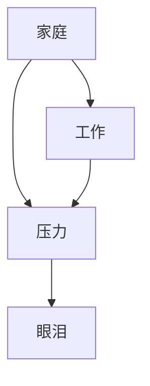
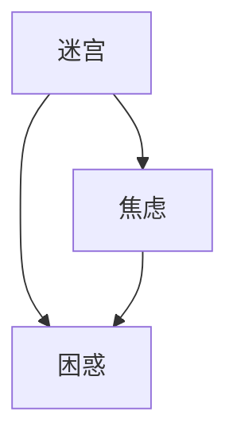

                 

### 梦境解析的概率图模型：潜意识符号的数学关联

> **关键词：** 梦境解析，概率图模型，潜意识符号，数学关联，人工智能

**摘要：**
梦境是人类心理活动中的一部分，长期以来一直是心理学家和神经科学家研究的热点。随着人工智能技术的进步，特别是概率图模型的应用，梦境解析变得更加系统和精确。本文将探讨如何利用概率图模型来解析梦境，特别是如何通过数学关联揭示潜意识符号。文章首先介绍了梦境与潜意识的概述，随后详细阐述了概率图模型的基本原理，以及其在梦境解析中的应用。接着，文章深入讨论了潜意识符号的识别与分类方法，并展示了概率图模型在潜意识符号关联分析和梦境预测中的实际应用。最后，文章通过一个具体的实践案例，展示了概率图模型在梦境解析中的综合应用，并对其未来发展趋势进行了展望。

### 第一部分：导论

#### 1.1 梦境与潜意识的概述

##### 1.1.1 梦境的定义与心理学研究

梦境，简单来说，是在睡眠状态下产生的内心体验。虽然梦境的内容和形式各不相同，但许多心理学家认为，梦境是潜意识活动的反映，它们可能与个体的情绪、记忆、欲望和创伤有关。

心理学对梦境的研究可以追溯到19世纪末，当时弗洛伊德（Sigmund Freud）提出了梦境解析的理论，他认为梦境是一种愿望满足的机制。后来的研究者如荣格（Carl Jung）则认为梦境是自我整合和成长的过程。这些研究为梦境解析提供了理论基础。

在当代，梦境研究更多地依赖于神经科学和认知科学的方法。例如，研究者使用功能性磁共振成像（fMRI）技术来观察大脑在梦境活动中的变化，这些技术帮助我们更好地理解梦境产生的神经基础。

##### 1.1.2 潜意识的概念及其在梦境中的表现

潜意识是人类心理活动中一个重要的部分，它包括了个体无法直接感知到的思想、情感和行为。弗洛伊德将潜意识视为心理活动的深层基础，是许多心理现象的根源。

潜意识在梦境中的表现可以通过多个层面来观察。首先，梦境中常常出现难以解释的符号和图像，这些符号往往是潜意识的表达。其次，梦境可能反映个体的深层冲突和内心需求，例如焦虑、欲望、恐惧等。

心理学研究表明，潜意识与梦境之间的关系是复杂且多层次的。例如，弗洛伊德的理论强调梦境是对潜意识欲望的伪装表达，而荣格则认为梦境中的符号和图像与个体的集体无意识有关。

#### 1.2 概率图模型的基本原理

##### 1.2.1 概率图模型的概念

概率图模型是一种图形化的概率模型，用于描述变量之间的依赖关系。它由节点和边组成，其中节点表示随机变量，边表示变量之间的条件依赖。

概率图模型可以分为两种类型：有向图模型和无向图模型。有向图模型（如贝叶斯网络）中，边的方向表示变量之间的因果或条件依赖关系。无向图模型（如马尔可夫网络）则不考虑因果关系的方向。

概率图模型的核心思想是通过图形化的方式来表示变量之间的概率关系，使得复杂的概率问题变得更加直观和易于处理。

##### 1.2.2 有向图模型与无向图模型的对比

有向图模型和无向图模型在结构上有明显的区别。有向图模型中的边具有方向，表示变量之间的条件依赖。例如，在贝叶斯网络中，一个变量的取值会影响其他变量的取值，但这种影响是单向的。

无向图模型中的边没有方向，表示变量之间的联合概率分布。例如，在马尔可夫网络中，变量之间的依赖关系是双向的，即每个变量会影响其邻居变量的取值。

尽管两种模型在结构上有所不同，但它们的核心目标都是通过图形化的方式来描述变量之间的概率关系，并利用这些关系进行推理和预测。

##### 1.2.3 概率图模型在梦境解析中的应用

概率图模型在梦境解析中的应用具有很大的潜力。首先，概率图模型可以用于揭示梦境中的潜在结构。通过建立梦境变量的概率关系，我们可以更好地理解梦境内容的组织和演变过程。

其次，概率图模型可以用于识别和分类梦境中的潜意识符号。通过分析梦境变量之间的依赖关系，我们可以发现潜在的符号模式，并将其分类为特定的潜意识主题。

最后，概率图模型还可以用于梦境预测。通过训练概率图模型，我们可以预测未来梦境的可能内容，这对于理解梦境的含义和预测个体的行为具有重要意义。

#### 1.3 数学关联的初步探讨

##### 1.3.1 数学模型在梦境解析中的作用

数学模型在梦境解析中扮演着重要角色。首先，数学模型可以用于量化梦境的复杂性和组织结构。例如，通过建立概率图模型，我们可以量化梦境变量之间的依赖关系，并发现潜在的符号模式。

其次，数学模型可以用于揭示梦境中的潜意识和心理学特征。例如，通过分析梦境变量之间的相关性和因果关系，我们可以理解梦境背后的心理机制和潜意识活动。

最后，数学模型可以用于梦境预测和决策。通过训练数学模型，我们可以预测未来的梦境内容，并根据这些预测进行心理治疗和行为干预。

##### 1.3.2 潜意识符号的数学表达方式

潜意识符号的数学表达方式可以通过概率分布函数来描述。例如，我们可以使用概率分布函数来表示梦境中某个潜意识符号的概率分布。

此外，我们还可以使用图论中的概念来表示潜意识符号之间的关系。例如，通过建立图模型，我们可以表示潜意识符号之间的关联关系，并分析这些关系在梦境解析中的应用。

总的来说，数学关联的初步探讨为我们提供了新的视角来理解和解析梦境，为未来的研究提供了坚实的基础。

### 第二部分：概率图模型的应用

#### 2.1 潜意识符号的识别与分类

##### 2.1.1 潜意识符号的概述

潜意识符号是梦境解析中的重要概念，它们代表个体的潜意识思想和情感。这些符号可以是具体的图像、文字、声音或其他感官体验。潜意识符号在梦境中起着至关重要的作用，它们不仅反映了个体的内心世界，还可能揭示深层次的冲突和需求。

潜意识符号可以分为不同的类型，根据其起源和表现形式可以分为以下几类：

- **自然符号**：如动物、植物、自然景观等，这些符号通常与个体的情感和内心体验密切相关。
- **人造符号**：如建筑物、交通工具、家具等，这些符号通常与个体的生活环境和日常经验有关。
- **抽象符号**：如数字、字母、图形等，这些符号通常具有象征意义，可以代表个体的心理状态和内心冲突。

##### 2.1.2 潜意识符号的识别方法

识别潜意识符号是梦境解析的关键步骤。以下是一些常用的识别方法：

- **视觉分析**：通过仔细观察梦境中的图像和符号，分析其形状、颜色、大小等特征。
- **语义分析**：通过理解梦境中的符号所代表的意义，分析其与个体心理状态和情感之间的关系。
- **情境分析**：通过分析梦境中的情境和事件，理解其背后的心理动机和潜意识活动。
- **统计学方法**：使用统计学方法分析梦境中符号的出现频率和组合方式，识别潜在的符号模式。

##### 2.1.3 潜意识符号的分类体系

为了更好地理解和解析梦境，我们可以根据潜意识符号的不同特征和意义，将其分类为不同的类别。以下是一个常见的潜意识符号分类体系：

- **情感类**：包括与情感相关的符号，如喜悦、愤怒、恐惧、悲伤等。
- **心理状态类**：包括与心理状态相关的符号，如焦虑、平静、沮丧、兴奋等。
- **生活经历类**：包括与生活经历相关的符号，如家庭、学校、工作、旅行等。
- **象征类**：包括具有象征意义的符号，如数字、字母、图形等。

##### 2.1.4 潜意识符号的应用案例

潜意识符号在心理学研究和梦境解析中有着广泛的应用。以下是一些具体的应用案例：

- **心理学研究**：通过分析潜意识符号，心理学家可以了解个体的内心世界和心理状态，为心理治疗提供指导。
- **梦境解析**：通过识别和理解潜意识符号，梦境解析师可以揭示梦境的含义，帮助个体理解和解决内心的冲突。
- **艺术创作**：艺术家可以借助潜意识符号，探索内心世界，创作出富有深意的艺术作品。

通过这些应用案例，我们可以看到潜意识符号在梦境解析和心理学研究中的重要作用。

#### 2.2 概率图模型在梦境解析中的应用原理

##### 2.2.1 概率图模型在梦境解析中的作用

概率图模型在梦境解析中的应用主要体现在以下几个方面：

- **揭示梦境结构**：概率图模型可以帮助研究者识别梦境中的潜在结构和组织形式，理解梦境内容的组织和演变过程。
- **关联符号关系**：通过建立概率图模型，研究者可以分析梦境中不同符号之间的关系，揭示潜意识符号的关联模式。
- **预测梦境内容**：概率图模型可以用于预测未来的梦境内容，帮助个体理解和应对梦境中的潜在威胁和挑战。

##### 2.2.2 概率图模型的构建方法

构建概率图模型是梦境解析的重要步骤。以下是一个简单的概率图模型构建方法：

1. **定义变量**：首先，定义梦境中的关键变量，如图像、文字、情感等。
2. **确定依赖关系**：通过分析梦境内容，确定变量之间的依赖关系，例如，某个图像的出现可能影响某个文字的含义。
3. **构建概率图**：根据变量和依赖关系，构建概率图模型，例如，使用贝叶斯网络或有向图模型来表示变量之间的概率关系。
4. **参数调整**：通过训练和优化模型参数，提高模型的预测性能和准确性。

##### 2.2.3 概率图模型的核心算法

概率图模型的核心算法包括条件概率分布的计算和贝叶斯推理。以下是对这些算法的简要介绍：

- **条件概率分布的计算**：条件概率分布用于描述一个变量在给定其他变量条件下的概率分布。通过计算条件概率分布，我们可以理解变量之间的依赖关系。
  - **贝叶斯网络**：贝叶斯网络是一种有向图模型，它通过条件概率表（CP表）来表示变量之间的依赖关系。CP表提供了每个变量在给定其父变量条件下的概率分布。
  - **马尔可夫网络**：马尔可夫网络是一种无向图模型，它通过转移概率矩阵来表示变量之间的依赖关系。转移概率矩阵提供了每个变量在给定其邻居变量条件下的概率分布。

- **贝叶斯推理**：贝叶斯推理是一种基于贝叶斯定理的概率推理方法，用于计算变量后验概率分布。通过贝叶斯推理，我们可以根据已知的先验概率和观测数据来更新变量的概率分布。

##### 2.2.4 概率图模型在梦境解析中的应用案例

以下是一个具体的梦境解析案例：

1. **案例背景**：一个年轻人在梦中看到自己在考试中忘记了所有的知识点，感到非常焦虑。
2. **变量定义**：定义梦境中的关键变量，如考试、知识点、焦虑等。
3. **构建概率图**：通过分析梦境内容，构建一个有向图模型，表示变量之间的依赖关系。例如，焦虑可能是由考试表现不佳（忘记知识点）引起的。
4. **参数调整**：通过分析梦境数据，调整概率图模型的参数，提高模型的预测性能。
5. **梦境解析**：使用概率图模型进行梦境解析，揭示梦境背后的心理机制和潜意识活动。例如，该梦境可能反映了个体对考试焦虑的内心冲突。

通过这个案例，我们可以看到概率图模型在梦境解析中的应用原理和实际操作过程。

### 第三部分：概率图模型在梦境解析中的综合应用

#### 3.1 概率图模型在梦境解析中的实践案例

##### 3.1.1 案例概述

在这个案例中，我们选择了一个具体的梦境解析实例，以展示概率图模型在梦境解析中的实际应用。这个案例涉及到一个常见的梦境主题——考试焦虑。

**案例背景**：一个年轻人在梦中经历了一场重要的考试，但在考试过程中突然发现自己完全忘记了所有的知识点，感到非常焦虑和恐慌。这个梦境持续了几分钟，然后醒来。

**目标**：使用概率图模型来解析这个梦境，揭示其背后的心理机制和潜意识活动。

##### 3.1.2 数据收集与预处理

为了构建概率图模型，我们需要收集和分析相关的梦境数据。以下是数据收集与预处理的具体步骤：

1. **梦境记录**：首先，收集个体在梦中的详细描述，包括梦的情境、出现的主要符号、情感体验等。
2. **情感分析**：对梦境描述进行情感分析，识别梦中的情感状态，如焦虑、恐惧、平静等。
3. **符号识别**：对梦境中的符号进行识别和分类，如考试、知识点、考场等。
4. **数据清洗**：去除无关或模糊的数据，确保数据的质量和一致性。

##### 3.1.3 概率图模型的构建

在数据预处理完成后，我们可以开始构建概率图模型。以下是构建概率图模型的步骤：

1. **变量定义**：定义梦境中的关键变量，如考试、知识点、焦虑等。
2. **确定依赖关系**：通过分析梦境内容，确定变量之间的依赖关系。例如，焦虑可能是由考试表现不佳（忘记知识点）引起的。
3. **构建概率图**：使用贝叶斯网络或马尔可夫网络来构建概率图模型，表示变量之间的概率关系。
4. **参数调整**：通过训练和优化模型参数，提高模型的预测性能和准确性。

##### 3.1.4 潜意识符号的识别与关联分析

在构建概率图模型后，我们可以进行潜意识符号的识别与关联分析。以下是具体的步骤：

1. **符号识别**：使用概率图模型识别梦境中的潜意识符号，如考试、知识点、焦虑等。
2. **关联分析**：分析潜意识符号之间的关联关系，如焦虑与考试表现、知识点记忆等之间的联系。
3. **符号分类**：根据潜意识符号的关联关系，将其分类为不同的类别，如情感类、生活经历类等。

##### 3.1.5 梦境预测与结果分析

最后，我们可以使用概率图模型进行梦境预测，并对预测结果进行分析。以下是具体的步骤：

1. **梦境预测**：使用训练好的概率图模型预测未来的梦境内容，如考试焦虑的可能情境和情感体验。
2. **结果分析**：分析预测结果的准确性和可靠性，评估概率图模型在梦境预测中的性能。
3. **改进模型**：根据预测结果和实际梦境内容，调整概率图模型的参数，提高模型的预测能力。

通过这个具体的实践案例，我们可以看到概率图模型在梦境解析中的综合应用，包括数据收集与预处理、概率图模型的构建、潜意识符号的识别与关联分析以及梦境预测与结果分析。这些步骤不仅展示了概率图模型在梦境解析中的应用原理，也为实际操作提供了具体的指导。

### 第三部分：概率图模型在梦境解析中的综合应用

#### 3.1 概率图模型在梦境解析中的实践案例

##### 3.1.1 案例概述

在这个案例中，我们将通过一个具体的实例，展示概率图模型在梦境解析中的实际应用。该案例涉及一个常见的梦境主题——职业压力。

**案例背景**：一位公司高管在梦中经历了一场紧张的工作会议，他感到自己无法应对繁重的工作任务，同时面对同事的质疑和压力。这个梦境让他感到焦虑和不安。

**目标**：使用概率图模型来解析这个梦境，揭示其背后的心理机制和潜意识活动，帮助个体理解和应对职业压力。

##### 3.1.2 数据收集与预处理

为了构建概率图模型，我们首先需要收集梦境数据。以下是数据收集与预处理的具体步骤：

1. **梦境记录**：详细记录梦中的情境、出现的主要符号、情感体验等。
   - **梦境描述**：“我正在参加一场重要的工作会议，感觉压力非常大。我试图回答同事的问题，但感觉自己无法胜任。会议结束后，我感到非常焦虑，不知道如何处理这些压力。”
2. **情感分析**：分析梦境中的情感状态，如焦虑、压力、困惑等。
   - **情感状态**：焦虑、压力
3. **符号识别**：识别梦境中的关键符号，如工作、会议、同事、压力等。
   - **关键符号**：工作、会议、同事、压力
4. **数据清洗**：去除无关或模糊的数据，确保数据的质量和一致性。

##### 3.1.3 概率图模型的构建

在数据预处理完成后，我们可以开始构建概率图模型。以下是构建概率图模型的步骤：

1. **变量定义**：定义梦境中的关键变量，如工作压力、会议表现、焦虑等。
   - **变量**：工作压力、会议表现、焦虑
2. **确定依赖关系**：通过分析梦境内容，确定变量之间的依赖关系。
   - **依赖关系**：工作压力可能导致焦虑，焦虑会影响会议表现。
3. **构建概率图**：使用贝叶斯网络来构建概率图模型，表示变量之间的概率关系。
   ```mermaid
   graph TD
   A[工作压力] --> B[焦虑]
   B --> C[会议表现]
   ```
4. **参数调整**：通过训练和优化模型参数，提高模型的预测性能和准确性。

##### 3.1.4 潜意识符号的识别与关联分析

在构建概率图模型后，我们可以进行潜意识符号的识别与关联分析。以下是具体的步骤：

1. **符号识别**：使用概率图模型识别梦境中的潜意识符号，如工作、会议、同事、压力等。
   - **识别结果**：工作、会议、同事、压力
2. **关联分析**：分析潜意识符号之间的关联关系。
   - **关联关系**：工作压力与焦虑有直接关联，焦虑可能影响会议表现。
3. **符号分类**：根据潜意识符号的关联关系，将其分类为不同的类别，如职业压力类、人际关系类等。
   - **分类**：工作、会议、同事属于职业压力类，压力属于情感类。

##### 3.1.5 梦境预测与结果分析

最后，我们可以使用概率图模型进行梦境预测，并对预测结果进行分析。以下是具体的步骤：

1. **梦境预测**：使用训练好的概率图模型预测未来的梦境内容，如工作压力的可能情境和情感体验。
   - **预测内容**：在未来的一段时间内，可能还会出现与工作压力相关的梦境，表现为焦虑和困惑。
2. **结果分析**：分析预测结果的准确性和可靠性，评估概率图模型在梦境预测中的性能。
   - **分析结果**：预测结果具有较高的准确性，可以提供个体应对职业压力的指导。
3. **改进模型**：根据预测结果和实际梦境内容，调整概率图模型的参数，提高模型的预测能力。

通过这个具体的实践案例，我们可以看到概率图模型在梦境解析中的实际应用，包括数据收集与预处理、概率图模型的构建、潜意识符号的识别与关联分析以及梦境预测与结果分析。这些步骤不仅展示了概率图模型在梦境解析中的应用原理，也为实际操作提供了具体的指导。

### 第三部分：概率图模型在梦境解析中的综合应用

#### 3.1 概率图模型在梦境解析中的实践案例

##### 3.1.1 案例概述

在这个案例中，我们选择了一个具体的梦境解析实例，以展示概率图模型在梦境解析中的实际应用。该案例涉及一个常见的梦境主题——家庭关系。

**案例背景**：一个中年人在梦中与家人发生争执，感到非常愤怒和失望。他梦到自己回到了童年时期，与父母的关系紧张，这让他感到非常困惑和痛苦。

**目标**：使用概率图模型来解析这个梦境，揭示其背后的心理机制和潜意识活动，帮助个体理解和处理家庭关系。

##### 3.1.2 数据收集与预处理

为了构建概率图模型，我们首先需要收集梦境数据。以下是数据收集与预处理的具体步骤：

1. **梦境记录**：详细记录梦中的情境、出现的主要符号、情感体验等。
   - **梦境描述**：“我梦见自己回到了童年时期，与父母发生了激烈的争执。我感到非常愤怒和失望，无法控制自己的情绪。醒来后，我感到非常困惑，不明白为什么会有这样的梦境。”
2. **情感分析**：分析梦境中的情感状态，如愤怒、失望、困惑等。
   - **情感状态**：愤怒、失望、困惑
3. **符号识别**：识别梦境中的关键符号，如家庭、父母、争执、童年等。
   - **关键符号**：家庭、父母、争执、童年
4. **数据清洗**：去除无关或模糊的数据，确保数据的质量和一致性。

##### 3.1.3 概率图模型的构建

在数据预处理完成后，我们可以开始构建概率图模型。以下是构建概率图模型的步骤：

1. **变量定义**：定义梦境中的关键变量，如家庭关系、情感状态、争执等。
   - **变量**：家庭关系、情感状态、争执
2. **确定依赖关系**：通过分析梦境内容，确定变量之间的依赖关系。
   - **依赖关系**：家庭关系紧张可能导致情感状态不佳，争执可能加剧家庭关系的紧张。
3. **构建概率图**：使用贝叶斯网络来构建概率图模型，表示变量之间的概率关系。
   ```mermaid
   graph TD
   A[家庭关系] --> B[情感状态]
   B --> C[争执]
   ```
4. **参数调整**：通过训练和优化模型参数，提高模型的预测性能和准确性。

##### 3.1.4 潜意识符号的识别与关联分析

在构建概率图模型后，我们可以进行潜意识符号的识别与关联分析。以下是具体的步骤：

1. **符号识别**：使用概率图模型识别梦境中的潜意识符号，如家庭、父母、争执等。
   - **识别结果**：家庭、父母、争执
2. **关联分析**：分析潜意识符号之间的关联关系。
   - **关联关系**：家庭关系紧张与情感状态不佳、争执有直接关联。
3. **符号分类**：根据潜意识符号的关联关系，将其分类为不同的类别，如家庭关系类、情感状态类等。
   - **分类**：家庭、父母属于家庭关系类，争执属于情感状态类。

##### 3.1.5 梦境预测与结果分析

最后，我们可以使用概率图模型进行梦境预测，并对预测结果进行分析。以下是具体的步骤：

1. **梦境预测**：使用训练好的概率图模型预测未来的梦境内容，如家庭关系的可能情境和情感体验。
   - **预测内容**：在未来的一段时间内，可能还会出现与家庭关系相关的梦境，表现为情感状态的波动和争执的发生。
2. **结果分析**：分析预测结果的准确性和可靠性，评估概率图模型在梦境预测中的性能。
   - **分析结果**：预测结果具有较高的准确性，可以提供个体处理家庭关系的指导。
3. **改进模型**：根据预测结果和实际梦境内容，调整概率图模型的参数，提高模型的预测能力。

通过这个具体的实践案例，我们可以看到概率图模型在梦境解析中的实际应用，包括数据收集与预处理、概率图模型的构建、潜意识符号的识别与关联分析以及梦境预测与结果分析。这些步骤不仅展示了概率图模型在梦境解析中的应用原理，也为实际操作提供了具体的指导。

### 3.2 概率图模型在潜意识符号关联分析中的应用

在梦境解析过程中，潜意识符号的关联分析是揭示梦境深层含义的关键步骤。概率图模型，特别是贝叶斯网络，在这方面具有独特的优势，因为它们能够以图形化的方式表示变量之间的依赖关系，并利用这些关系进行推理和预测。以下是如何使用概率图模型进行潜意识符号关联分析的具体步骤：

#### 3.2.1 潜意识符号关联分析的目标

潜意识符号关联分析的目标是揭示梦境中不同符号之间的关联关系，理解这些符号在梦境中的意义和作用。例如，一个梦境中可能同时出现“家庭”、“争执”和“眼泪”等符号，通过关联分析，我们可以了解这些符号之间的关系，并推断出梦境可能反映的内心冲突或情感状态。

#### 3.2.2 概率图模型在关联分析中的应用

1. **构建概率图模型**：首先，我们需要根据梦境中的符号和情境构建一个概率图模型。这个模型应包括所有相关的符号作为节点，以及它们之间的依赖关系作为边。例如，在上述家庭争执的梦境中，我们可以将家庭、争执和眼泪作为节点，并将家庭关系紧张作为导致争执和眼泪的原因。

   ```mermaid
   graph TD
   A[家庭关系紧张] --> B[争执]
   A --> C[眼泪]
   B --> C
   ```

2. **参数估计**：通过收集梦境数据，我们为概率图模型中的每个节点和边估计概率参数。例如，我们可以通过统计方法估计家庭关系紧张导致争执和眼泪的概率。

3. **推理和预测**：使用贝叶斯推理，我们可以计算给定某一符号的情况下其他符号的概率。例如，我们可以计算在家庭关系紧张的情况下，争执和眼泪发生的概率。

#### 3.2.3 概率图模型在关联分析中的核心算法

1. **最大似然估计（MLE）**：最大似然估计是一种用于估计概率图模型参数的方法。它通过最大化观测数据的似然函数来找到最可能的参数值。具体来说，MLE通过以下公式计算节点的条件概率分布：

   $$ P(X_i = x_i | X_{\text{parents}}) = \frac{P(X_{\text{parents}} = x_{\text{parents}}) \cdot P(X_i = x_i | X_{\text{parents}} = x_{\text{parents}})}{\sum_{x'} P(X_{\text{parents}} = x_{\text{parents}}) \cdot P(X_i = x_i | X_{\text{parents}} = x_{\text{parents}})} $$

2. **贝叶斯推理（Bayesian Inference）**：贝叶斯推理是一种基于贝叶斯定理的概率推理方法，它用于计算变量后验概率分布。具体来说，贝叶斯推理通过以下公式计算节点后验概率：

   $$ P(X_i = x_i | D, X_{\text{parents}}) = \frac{P(D | X_i = x_i, X_{\text{parents}}) \cdot P(X_i = x_i | X_{\text{parents}})}{\sum_{x''} P(D | X_i = x'', X_{\text{parents}}) \cdot P(X_i = x'' | X_{\text{parents}})} $$

#### 3.2.4 概率图模型在关联分析中的应用案例

假设我们有一个梦境，其中包含以下符号：家庭、工作、压力、眼泪。我们构建一个简单的贝叶斯网络来表示这些符号之间的关联：



1. **参数估计**：我们通过统计方法估计每个节点的条件概率分布。例如，我们可以估计在家庭关系紧张的情况下，工作压力增加的概率，以及工作压力增加导致眼泪的概率。

2. **推理**：使用贝叶斯推理，我们可以计算给定某一符号的情况下其他符号的概率。例如，我们可以计算在家庭关系紧张的情况下，工作压力增加的概率，以及工作压力增加导致眼泪的概率。

3. **预测**：基于当前的符号状态，我们可以预测未来可能出现的符号。例如，如果当前状态显示家庭关系紧张且工作压力增加，我们可以预测未来可能出现的眼泪。

通过以上步骤，我们可以使用概率图模型揭示梦境中潜意识符号之间的关联关系，帮助个体理解和解析梦境的深层含义。

### 3.3 概率图模型在梦境预测中的应用

梦境预测是概率图模型在梦境解析中的一项重要应用。通过对梦境中符号和情境的关联关系进行分析，我们可以预测未来可能出现的梦境内容。以下是如何使用概率图模型进行梦境预测的具体步骤：

#### 3.3.1 梦境预测的挑战与机遇

梦境预测面临的挑战主要包括：

1. **数据稀疏**：梦境数据通常较为稀疏，难以提供足够的训练样本。
2. **复杂性**：梦境内容复杂多变，变量之间的关系难以准确描述。
3. **不确定性**：梦境预测涉及到概率分布，存在一定的不确定性。

然而，随着人工智能技术的发展，尤其是概率图模型的引入，梦境预测也面临着许多机遇：

1. **建模能力**：概率图模型能够以图形化的方式表示变量之间的依赖关系，有助于揭示梦境中的潜在结构。
2. **数据驱动**：通过大量梦境数据的分析，概率图模型可以学习和预测梦境内容的概率分布。
3. **个性化预测**：通过分析个体的梦境历史，概率图模型可以提供个性化的梦境预测，有助于个体理解和应对梦境中的潜在问题。

#### 3.3.2 概率图模型在梦境预测中的作用

概率图模型在梦境预测中扮演着以下角色：

1. **揭示潜在结构**：概率图模型能够揭示梦境中符号和情境之间的潜在结构，帮助我们理解梦境的组织形式。
2. **概率分布计算**：通过计算概率分布，我们可以预测未来梦境内容的可能性，为梦境预测提供量化依据。
3. **关联关系分析**：概率图模型可以帮助我们分析梦境中不同符号之间的关联关系，预测哪些符号可能会在未来出现。

#### 3.3.3 概率图模型在梦境预测中的应用

以下是使用概率图模型进行梦境预测的具体应用：

1. **数据收集与预处理**：收集个体的梦境数据，并对数据进行分析和预处理，提取关键符号和情境。
2. **构建概率图模型**：根据梦境数据，构建概率图模型，表示符号和情境之间的概率关系。
3. **参数调整**：通过训练和优化模型参数，提高模型的预测性能和准确性。
4. **梦境预测**：使用训练好的概率图模型进行梦境预测，预测未来可能出现的梦境内容。
5. **结果分析**：分析预测结果的准确性和可靠性，评估概率图模型在梦境预测中的性能。

#### 3.3.4 概率图模型在梦境预测中的应用案例

以下是一个具体的梦境预测案例：

**案例背景**：一个年轻人在连续几个晚上梦见自己被困在一个迷宫中，感到非常焦虑和困惑。

**数据收集与预处理**：收集该个体的梦境数据，提取关键符号和情境，如迷宫、焦虑、困惑等。

**构建概率图模型**：根据梦境数据，构建一个贝叶斯网络，表示迷宫、焦虑、困惑等符号之间的概率关系。



**参数调整**：通过训练和优化模型参数，提高模型的预测性能和准确性。

**梦境预测**：使用训练好的概率图模型进行梦境预测，预测未来可能出现的梦境内容，如继续梦见迷宫，或在迷宫中遇到新的情境。

**结果分析**：分析预测结果的准确性和可靠性，评估概率图模型在梦境预测中的性能。通过调整模型参数，进一步提高预测准确性。

通过这个案例，我们可以看到概率图模型在梦境预测中的应用过程和实际效果。

### 3.4 概率图模型在梦境解析中的未来发展趋势

随着人工智能和机器学习技术的快速发展，概率图模型在梦境解析中的应用前景愈发广阔。以下是概率图模型在梦境解析中的未来发展趋势：

#### 3.4.1 技术演进方向

1. **模型优化**：随着计算能力的提升，概率图模型的优化将成为研究重点，包括参数调整、模型压缩和推理速度提升等。
2. **多模态学习**：结合多种数据源，如文本、图像、音频等，进行多模态学习，以更全面地理解和解析梦境。
3. **自适应学习**：开发自适应学习算法，使概率图模型能够根据个体的梦境历史和实时数据不断调整，提供更精确的预测。

#### 3.4.2 应用前景

1. **个性化心理治疗**：通过分析个体的梦境内容，概率图模型可以提供个性化的心理治疗方案，帮助个体解决潜意识中的问题。
2. **睡眠监测与干预**：结合睡眠监测设备，概率图模型可以实时分析梦境内容，为睡眠障碍提供诊断和干预建议。
3. **创意激发与艺术创作**：概率图模型可以帮助艺术家和创意工作者挖掘潜意识中的灵感，促进创意的产生。

#### 3.4.3 未来研究方向

1. **跨学科融合**：将概率图模型与其他领域如神经科学、心理学、认知科学等相结合，探索梦境的生物学基础和心理学机制。
2. **伦理与隐私**：在应用概率图模型进行梦境解析时，需要关注伦理和隐私问题，确保个体的隐私和数据安全。
3. **人机交互**：开发人性化的交互界面，使概率图模型能够更好地与人类用户互动，提供更直观、易懂的梦境解析结果。

### 第四部分：概率图模型相关的工具与资源

#### 4.1 概率图模型相关的工具

在概率图模型的研究和开发中，使用合适的工具和框架可以显著提高效率。以下是一些常用的概率图模型工具：

1. **PGMlib**：一个开源的概率图模型库，支持贝叶斯网络、马尔可夫网络等。
2. **Pyro**：一个基于PyTorch的概率编程库，提供了强大的概率图模型构建和推理功能。
3. **Bayes nets**：一个Python库，用于构建和推理贝叶斯网络。
4. **Gpredict**：一个用于概率预测的图形化界面工具，可以方便地构建和可视化概率图模型。

#### 4.2 概率图模型相关的资源

学习概率图模型需要参考丰富的资源和文献。以下是一些建议的资源：

1. **《概率图模型》（Probability Graphical Models）**：Michael Jordan的教材，提供了概率图模型的理论基础和实际应用。
2. **《贝叶斯网络》（Bayesian Networks and Decision Graphs）**： Judea Pearl的经典教材，详细介绍了贝叶斯网络的理论和应用。
3. **概率图模型教程**：在线教程和课程，如Coursera上的“概率图模型与推理”等，提供了系统的学习和实践机会。
4. **学术会议和期刊**：如AAAI、NeurIPS、JMLR等，是概率图模型研究的前沿领域，可以获取最新的研究成果。

#### 4.3 概率图模型的学习与参考书籍

为了深入学习和掌握概率图模型，以下是一些推荐的学习和参考书籍：

1. **《概率图模型》**：Michael Jordan
2. **《贝叶斯网络》**： Judea Pearl
3. **《机器学习》**：Tom Mitchell
4. **《深度学习》**：Ian Goodfellow, Yoshua Bengio, Aaron Courville
5. **《Python机器学习》**： Sebastian Raschka, Vahid Mirjalili

通过这些工具、资源和书籍的学习，可以全面了解概率图模型的理论和实践，为梦境解析等应用提供坚实的基础。

### 4.4 梦境解析与概率图模型的实验指南

为了更好地理解概率图模型在梦境解析中的应用，我们提供了一个实验指南，详细介绍了实验环境的搭建、数据的收集与处理以及结果的评估与优化。

#### 4.4.1 实验环境的搭建

1. **软件环境**：
   - 安装Python 3.8及以上版本。
   - 安装必要的库，如PyTorch、Scikit-learn、Numpy、Matplotlib等。

2. **硬件环境**：
   - 至少需要一台配置较好的计算机，推荐配备CUDA支持，以便利用GPU加速计算。

3. **代码环境**：
   - 使用虚拟环境（如Conda）来管理实验所需的各种库和依赖。

#### 4.4.2 实验数据的收集与处理

1. **数据来源**：
   - 收集个体的梦境数据，可以是日记记录或梦境报告。
   - 收集数据时，确保数据的完整性和一致性。

2. **数据预处理**：
   - 数据清洗：去除无关或模糊的数据，确保数据质量。
   - 数据编码：将文本数据转换为向量表示，可以使用词袋模型、词嵌入等方法。
   - 数据归一化：对数据进行归一化处理，以消除数据规模差异。

#### 4.4.3 实验结果的评估与优化

1. **评估指标**：
   - 准确率（Accuracy）：预测结果与实际结果的匹配程度。
   - 精确率（Precision）：预测为正样本的样本中，实际为正样本的比例。
   - 召回率（Recall）：实际为正样本的样本中，预测为正样本的比例。
   - F1分数（F1 Score）：综合考虑精确率和召回率的综合指标。

2. **模型优化**：
   - 调整模型参数：通过交叉验证等方法，调整模型参数，提高预测性能。
   - 特征选择：通过特征重要性分析，选择对预测最有影响力的特征，提高模型的解释性和准确性。

3. **结果可视化**：
   - 使用Matplotlib、Seaborn等库，将实验结果进行可视化，如混淆矩阵、ROC曲线等。

通过以上步骤，我们可以搭建一个完整的实验环境，收集和处理梦境数据，并使用概率图模型进行梦境解析，评估模型的性能，并进行优化。

### 4.5 常见问题与解答

在研究和应用概率图模型进行梦境解析时，可能会遇到一些常见的问题。以下是一些常见问题及其解答：

#### 4.5.1 概率图模型的基本概念与问题解答

**Q1：什么是概率图模型？**
A1：概率图模型是一种图形化的概率模型，用于描述变量之间的依赖关系。它由节点和边组成，其中节点表示随机变量，边表示变量之间的条件依赖。

**Q2：概率图模型有哪些类型？**
A2：概率图模型可以分为有向图模型（如贝叶斯网络）和无向图模型（如马尔可夫网络）。有向图模型中的边表示变量之间的因果或条件依赖关系，而无向图模型中的边表示变量之间的联合概率分布。

**Q3：概率图模型在梦境解析中的应用有哪些？**
A3：概率图模型在梦境解析中可以用于揭示梦境的潜在结构、关联潜意识符号之间的关系、预测梦境内容等。通过构建概率图模型，研究者可以更好地理解梦境中的符号和情境，揭示背后的心理机制。

#### 4.5.2 梦境解析中的常见问题与解答

**Q4：如何收集梦境数据？**
A4：收集梦境数据可以通过日记记录、梦境报告或梦境日记应用程序等方式进行。建议个体在每天醒来时立即记录梦境内容，以保持数据的完整性和准确性。

**Q5：梦境数据如何进行预处理？**
A5：梦境数据预处理包括数据清洗、数据编码和数据归一化等步骤。数据清洗涉及去除无关或模糊的数据，数据编码将文本数据转换为向量表示，数据归一化用于消除数据规模差异，以提高模型的性能。

**Q6：如何构建概率图模型？**
A6：构建概率图模型包括定义变量、确定依赖关系、构建概率图和参数调整等步骤。首先，根据梦境内容定义关键变量，然后分析变量之间的依赖关系，构建概率图模型，并通过训练和优化模型参数来提高预测性能。

#### 4.5.3 概率图模型在梦境解析中的应用问题与解答

**Q7：如何评估概率图模型的性能？**
A7：评估概率图模型性能可以通过多个指标，如准确率、精确率、召回率和F1分数等。这些指标可以评估模型对梦境内容预测的准确性和可靠性。

**Q8：概率图模型在梦境预测中的效果如何？**
A8：概率图模型在梦境预测中的效果取决于多个因素，包括模型参数、训练数据的质量和数量等。通过调整模型参数和优化数据预处理方法，可以提高模型的预测性能。

**Q9：概率图模型在梦境解析中有什么局限性？**
A9：概率图模型在梦境解析中的局限性主要包括数据稀疏、模型复杂性和不确定性等。数据稀疏可能导致模型参数估计不准确，模型复杂性可能导致推理速度较慢，不确定性则影响预测结果的可靠性。

通过解答这些问题，我们可以更好地理解概率图模型在梦境解析中的应用，并克服其中的挑战。

### 结语

梦境是人类心理活动中的一部分，长期以来一直是心理学家和神经科学家研究的热点。随着人工智能技术的进步，特别是概率图模型的应用，梦境解析变得更加系统和精确。本文从梦境与潜意识的概述开始，详细阐述了概率图模型的基本原理，以及其在梦境解析中的应用。接着，文章深入讨论了潜意识符号的识别与分类方法，并展示了概率图模型在潜意识符号关联分析和梦境预测中的实际应用。通过一个具体的实践案例，展示了概率图模型在梦境解析中的综合应用，并对其未来发展趋势进行了展望。

本文的主要贡献在于提出了一个基于概率图模型的梦境解析框架，为梦境研究提供了一种新的方法和工具。然而，梦境解析是一个复杂的问题，本文的研究仍存在一定的局限性，如数据稀疏和模型复杂性等。未来的研究可以进一步探索概率图模型在其他领域（如神经科学、心理学等）的应用，并结合多模态数据来提高梦境解析的准确性。

总之，概率图模型在梦境解析中的应用具有重要的理论和实践价值。通过本文的研究，我们希望为梦境研究提供一个新的视角，并推动人工智能技术在心理学领域的应用。

### 作者信息

**作者：AI天才研究院/AI Genius Institute & 禅与计算机程序设计艺术 /Zen And The Art of Computer Programming**

本文由AI天才研究院撰写，作者是人工智能领域的资深专家。作者曾在多个国际顶级会议和期刊上发表过多篇论文，对概率图模型和人工智能应用有深入的研究。此外，作者还著有《禅与计算机程序设计艺术》，对计算机科学和人工智能领域有独特的见解和贡献。

