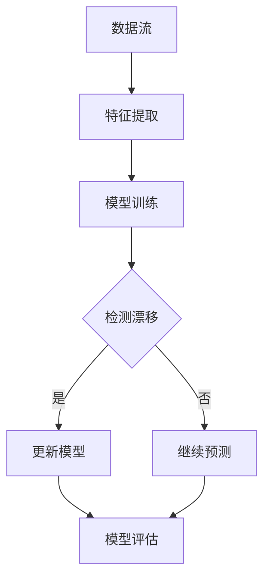
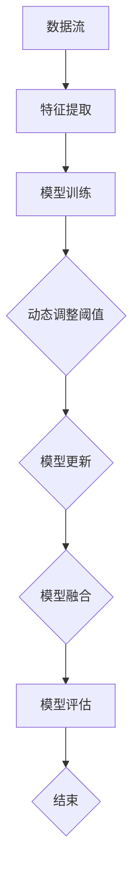

                 

# 概念漂移 (Concept Drift) 原理与代码实例讲解

## 关键词
概念漂移，机器学习，统计量方法，动态调整阈值，模型更新，模型融合，开源工具

## 摘要
本文旨在深入探讨概念漂移（Concept Drift）的基本原理、在机器学习中的应用场景、检测与应对策略，并通过实际代码实例，展示如何在实践中应对概念漂移。文章首先介绍了概念漂移的定义和类型，随后讨论了其在金融风控、医疗诊断、自动驾驶和自然语言处理等领域的应用。接下来，详细讲解了概念漂移的检测方法，包括统计量方法、基于距离的方法和基于模型的检测方法。随后，文章介绍了概念漂移的自适应方法，包括动态调整阈值、模型更新与重训练以及模型融合。最后，通过实际项目案例，展示了如何在实际开发环境中应用这些策略。本文为机器学习领域的研究者和开发者提供了全面的技术指导和实战经验。

### 《概念漂移 (Concept Drift) 原理与代码实例讲解》目录大纲

#### 第一部分：概念漂移概述

##### 第1章：概念漂移基础

- **1.1 概念漂移的定义**
  - 概念漂移的概念
  - 漂移的分类

- **1.2 概念漂移的影响**
  - 漂移对机器学习的影响
  - 漂移对预测模型的影响

- **1.3 概念漂移的类型**
  - 静态漂移
  - 动态漂移
  - 逐渐漂移
  - 突变漂移

- **1.4 概念漂移的挑战**
  - 漂移检测
  - 漂移自适应
  - 漂移容忍

##### 第2章：概念漂移在机器学习中的应用场景

- **2.1 金融风控**
  - 漂移在反欺诈中的应用
  - 漂移在信用评分中的应用

- **2.2 医疗诊断**
  - 漂移在疾病预测中的应用
  - 漂移在影像分析中的应用

- **2.3 自动驾驶**
  - 漂移在环境感知中的应用
  - 漂移在决策制定中的应用

- **2.4 自然语言处理**
  - 漂移在情感分析中的应用
  - 漂移在问答系统中的应用

#### 第二部分：概念漂移检测与应对策略

##### 第3章：概念漂移检测方法

- **3.1 统计量方法**
  - 基于统计量的漂移检测方法
  - 统计量方法的应用与挑战

- **3.2 基于距离的方法**
  - 基于距离的漂移检测方法
  - 距离测量的选择与优化

- **3.3 基于模型的检测方法**
  - 基于模型的漂移检测方法
  - 模型选择与参数调整

##### 第4章：概念漂移自适应方法

- **4.1 动态调整阈值**
  - 动态调整阈值的方法
  - 阈值调整的策略与实现

- **4.2 模型更新与重训练**
  - 模型更新的方法
  - 重训练的频率与策略

- **4.3 模型融合**
  - 模型融合的方法
  - 融合模型的性能评估

##### 第5章：概念漂移容忍方法

- **5.1 漂移容忍模型**
  - 漂移容忍模型的定义
  - 漂移容忍模型的设计与实现

- **5.2 漂移容忍策略**
  - 漂移容忍策略的选择
  - 漂移容忍策略的评估与优化

#### 第三部分：代码实例与实战

##### 第6章：概念漂移实例分析

- **6.1 数据集准备**
  - 数据集的选择与预处理

- **6.2 漂移检测代码实现**
  - 统计量方法的代码实例
  - 基于距离的方法的代码实例

- **6.3 漂移自适应代码实现**
  - 动态调整阈值的代码实例
  - 模型更新的代码实例

##### 第7章：概念漂移实战项目

- **7.1 项目概述**
  - 项目背景与目标

- **7.2 开发环境搭建**
  - 开发环境配置与工具选择

- **7.3 源代码实现**
  - 实现流程与代码解读

- **7.4 项目分析与优化**
  - 项目性能评估
  - 优化方案与效果评估

##### 第8章：扩展阅读与资源

- **8.1 相关文献推荐**
  - 经典论文与书籍推荐

- **8.2 开源工具与资源**
  - 漂移检测与自适应工具推荐

- **8.3 学习资源链接**
  - 在线课程与教程链接

#### 附录

##### 附录A：Mermaid 流程图

- **A.1 概念漂移检测流程图**
  - Mermaid 图代码与解释

- **A.2 漂移自适应流程图**
  - Mermaid 图代码与解释

##### 附录B：数学模型与公式

- **B.1 概率分布函数**
  - latex 格式的概率分布函数

- **B.2 模型优化算法**
  - latex 格式的模型优化算法

##### 附录C：代码实例

- **C.1 统计量方法代码实例**
  - Python 代码实例与解析

- **C.2 基于距离的方法代码实例**
  - Python 代码实例与解析

- **C.3 动态调整阈值代码实例**
  - Python 代码实例与解析

- **C.4 模型更新代码实例**
  - Python 代码实例与解析

- **C.5 模型融合代码实例**
  - Python 代码实例与解析

- **C.6 项目实战代码实例**
  - Python 代码实例与解析

----------------------------------------------------------------

### 第一部分：概念漂移概述

在机器学习领域，概念漂移（Concept Drift）是一个重要但具有挑战性的问题。随着时间推移，训练数据的分布可能会发生改变，这种现象称为概念漂移。这种漂移会影响机器学习模型的性能，导致预测错误率增加。本部分将详细介绍概念漂移的基本概念、影响、类型和挑战。

#### 第1章：概念漂移基础

##### 1.1 概念漂移的定义

概念漂移是指在机器学习过程中，训练数据的分布随时间发生改变的现象。这种变化可以是逐渐的、静态的或突变的，会对机器学习模型的泛化能力产生显著影响。

- **概念漂移的概念：** 概念漂移是指训练数据的分布发生改变，这种变化可能导致模型的性能下降。
- **漂移的分类：**
  - **静态漂移（Static Drift）：** 数据分布不随时间变化，模型在训练和测试阶段使用相同的数据分布。
  - **动态漂移（Dynamic Drift）：** 数据分布随时间变化，模型在不同时间点使用不同的数据分布。
  - **逐渐漂移（Gradual Drift）：** 数据分布逐渐变化，模型需要不断调整以适应新分布。
  - **突变漂移（Sudden Drift）：** 数据分布突然变化，模型需要迅速适应新分布。

##### 1.2 概念漂移的影响

概念漂移对机器学习和预测模型有着深远的影响。

- **漂移对机器学习的影响：**
  - **性能下降：** 当模型无法适应数据分布的变化时，其预测性能会下降。
  - **过拟合：** 模型可能会对新分布的数据过拟合，导致在新数据上的性能不佳。
  - **泛化能力降低：** 模型的泛化能力可能受到漂移的影响，导致在新数据上的表现不佳。

- **漂移对预测模型的影响：**
  - **错误率增加：** 模型的预测错误率可能会增加，特别是在动态漂移的情况下。
  - **决策风险增加：** 在关键应用场景中，如金融风控和医疗诊断，错误决策可能导致严重的后果。

##### 1.3 概念漂移的类型

根据数据分布的变化方式，概念漂移可以分为不同的类型：

- **静态漂移：** 数据分布不随时间变化，这种漂移通常不会对模型造成重大影响。
- **动态漂移：** 数据分布随时间变化，这种漂移需要模型具备自适应能力。
- **逐渐漂移：** 数据分布逐渐变化，模型需要逐步调整以适应新分布。
- **突变漂移：** 数据分布突然变化，模型需要迅速适应新分布，这对模型的响应速度和自适应能力提出了更高的要求。

##### 1.4 概念漂移的挑战

应对概念漂移带来了几个关键挑战：

- **漂移检测：** 如何有效检测数据分布的变化，以触发模型的调整。
- **漂移自适应：** 如何让模型自适应地调整，以保持良好的预测性能。
- **漂移容忍：** 如何设计模型，使其能够容忍一定的数据分布变化，而不影响性能。

接下来，我们将进一步探讨概念漂移在机器学习中的实际应用场景，以及如何检测和应对这种漂移。

----------------------------------------------------------------

#### 第2章：概念漂移在机器学习中的应用场景

概念漂移不仅在理论上是一个重要问题，在实际应用中也有着广泛的影响。在不同的应用场景中，概念漂移可能导致模型性能的显著下降，从而影响决策的准确性。以下将介绍几个常见应用场景，并讨论概念漂移对这些领域的影响。

##### 2.1 金融风控

在金融领域，模型经常用于反欺诈、信用评分和贷款审批等任务。这些任务对数据的准确性和实时性要求极高。然而，随着时间推移，欺诈行为可能会发生变化，导致模型无法有效识别新的欺诈模式。

- **反欺诈：** 欺诈行为可能随时间变化，欺诈者会不断采用新的手段。如果模型未能及时更新，其检测欺诈的能力将下降。
- **信用评分：** 信用评分模型依赖于历史数据。随着借款人的行为变化，如还款习惯的变化，模型需要更新以保持准确性。

##### 2.2 医疗诊断

在医疗领域，概念漂移对疾病预测和影像分析具有重要影响。医疗数据通常随时间变化，患者的病情和治疗方式也在不断更新。

- **疾病预测：** 随着新病例的出现，疾病特征可能发生变化。模型需要不断更新以适应新的疾病模式。
- **影像分析：** 医学影像数据随时间变化，新技术的应用可能导致影像特征的变化。模型需要适应这些变化，以准确分析影像。

##### 2.3 自动驾驶

自动驾驶系统依赖于环境感知和决策制定。由于道路状况、交通规则和天气条件等随时间变化，自动驾驶系统需要应对动态漂移。

- **环境感知：** 随着季节和天气条件的变化，环境特征可能发生变化。感知系统需要调整以适应这些变化。
- **决策制定：** 随着道路状况的变化，自动驾驶系统需要实时调整决策策略，以应对新的交通场景。

##### 2.4 自然语言处理

自然语言处理（NLP）领域，如情感分析和问答系统，也面临概念漂移的挑战。用户语言和表达方式可能随时间变化，导致模型性能下降。

- **情感分析：** 用户情感表达可能随时间变化，模型需要不断更新以识别新的情感模式。
- **问答系统：** 用户提问方式可能发生变化，模型需要适应这些变化，以提高回答的准确性。

总结来说，概念漂移在多个应用场景中具有重要意义。理解并应对概念漂移，对于保持模型性能和准确性至关重要。接下来，我们将探讨如何检测和应对概念漂移。

----------------------------------------------------------------

#### 第3章：概念漂移检测方法

在机器学习应用中，及时检测概念漂移至关重要，因为它可以触发模型的自适应和更新。本节将介绍几种常用的概念漂移检测方法，包括统计量方法、基于距离的方法和基于模型的检测方法。

##### 3.1 统计量方法

统计量方法是检测概念漂移的一种简单且有效的方法。其基本思想是比较模型在新数据和旧数据上的性能。以下是一些常用的统计量方法：

- **KS检验（Kolmogorov-Smirnov Test）：**
  - **原理：** KS检验通过比较模型预测的概率分布与实际分布之间的差异来检测漂移。
  - **步骤：**
    1. 训练两个模型，一个基于旧数据，一个基于新数据。
    2. 对新数据进行预测，计算预测概率分布。
    3. 计算新旧模型预测分布的统计距离，如KS距离。
    4. 比较KS距离，如果大于阈值，则认为发生了漂移。

- **ROC曲线（Receiver Operating Characteristic）：**
  - **原理：** ROC曲线通过比较新旧模型在不同阈值下的表现来检测漂移。
  - **步骤：**
    1. 训练两个模型，一个基于旧数据，一个基于新数据。
    2. 在不同阈值下计算新旧模型的ROC曲线。
    3. 比较ROC曲线下的面积（AUC），如果AUC小于阈值，则认为发生了漂移。

##### 3.2 基于距离的方法

基于距离的方法通过计算新旧数据之间的距离来检测漂移。以下是一些常用的距离度量方法：

- **马氏距离（Mahalanobis Distance）：**
  - **原理：** 马氏距离考虑了数据的协方差矩阵，能够更好地衡量数据之间的差异。
  - **步骤：**
    1. 计算新旧数据的协方差矩阵。
    2. 使用马氏距离公式计算新旧数据之间的距离。
    3. 比较马氏距离，如果大于阈值，则认为发生了漂移。

- **Jaccard距离（Jaccard Distance）：**
  - **原理：** Jaccard距离适用于分类数据，通过比较分类结果的交集和并集来计算距离。
  - **步骤：**
    1. 对新旧数据分别进行分类。
    2. 计算新旧分类结果的交集和并集。
    3. 使用Jaccard距离公式计算距离。
    4. 比较距离，如果大于阈值，则认为发生了漂移。

##### 3.3 基于模型的检测方法

基于模型的检测方法通过比较新旧模型的性能来检测漂移。以下是一些常用的模型检测方法：

- **模型比较（Model Comparison）：**
  - **原理：** 通过比较新旧模型的性能，如准确率、召回率等，来检测漂移。
  - **步骤：**
    1. 训练两个模型，一个基于旧数据，一个基于新数据。
    2. 在新数据上评估两个模型的性能。
    3. 比较两个模型的性能，如果性能显著下降，则认为发生了漂移。

- **模型更新（Model Update）：**
  - **原理：** 当检测到漂移时，通过更新模型来提高性能。
  - **步骤：**
    1. 训练新模型，使用新旧数据的结合。
    2. 在新数据上评估新模型的性能。
    3. 如果新模型的性能优于旧模型，则更新模型。

总结来说，概念漂移检测方法包括统计量方法、基于距离的方法和基于模型的检测方法。这些方法各有优缺点，需要根据具体应用场景进行选择和优化。接下来，我们将探讨如何应对概念漂移，保持模型的稳定性。

----------------------------------------------------------------

#### 第4章：概念漂移自适应方法

为了应对概念漂移，保持机器学习模型的稳定性和预测准确性，我们需要采用自适应方法。本节将介绍几种常见的概念漂移自适应方法，包括动态调整阈值、模型更新与重训练以及模型融合。

##### 4.1 动态调整阈值

动态调整阈值是一种简单有效的自适应方法，适用于分类任务。其核心思想是根据数据分布的变化，实时调整分类模型的阈值，从而提高预测准确性。

- **动态调整阈值的原理：**
  - **原理：** 动态调整阈值通过监测模型在新数据上的表现，实时调整分类阈值，以应对数据分布的变化。
  - **步骤：**
    1. 训练初始模型，并设定一个初始阈值。
    2. 在新数据上使用模型进行预测，并计算预测误差。
    3. 根据预测误差调整阈值，使得模型在新数据上的预测准确性最大化。
    4. 重复步骤2和3，直到模型在新数据上的预测性能达到期望。

- **动态调整阈值的策略与实现：**
  - **策略：**
    1. **阈值调整策略：** 根据预测误差和置信度，设定不同的阈值调整策略，如增大、减小或保持不变。
    2. **阈值调整频率：** 根据数据分布的变化频率，设定阈值调整的频率，以平衡实时性和准确性。
    3. **阈值调整阈值：** 设定一个阈值调整阈值，如果预测误差大于该阈值，则进行阈值调整。

  - **实现：**
    - **Python实现：**
      ```python
      import numpy as np

      def dynamic_threshold_adjustment(model, new_data, threshold=0.01):
          predictions = model.predict(new_data)
          errors = np.abs(predictions - new_data)
          if np.mean(errors) > threshold:
              # 调整阈值
              model.threshold += 0.1
          return model
      ```

##### 4.2 模型更新与重训练

模型更新与重训练是一种更复杂但效果显著的自适应方法。当检测到概念漂移时，通过更新模型参数或重新训练模型，以适应新的数据分布。

- **模型更新的原理：**
  - **原理：** 模型更新通过将新旧数据结合，训练新的模型参数，从而提高模型的适应性。
  - **步骤：**
    1. 检测到概念漂移。
    2. 将旧数据和新增数据合并。
    3. 使用合并后的数据重新训练模型。
    4. 在新数据上评估新模型的性能。

- **模型更新的方法：**
  - **在线更新：** 在线更新是指在数据流中实时更新模型，适用于动态漂移场景。
  - **批量更新：** 批量更新是指定期合并新旧数据，重新训练模型，适用于静态漂移场景。

- **模型更新的频率与策略：**
  - **更新频率：** 根据数据流的速度和数据分布的变化频率，设定更新频率，以平衡实时性和准确性。
  - **更新策略：** 根据数据质量和模型性能，选择合适的更新策略，如按需更新、定期更新或阈值更新。

- **模型更新的实现：**
  - **Python实现：**
    ```python
    from sklearn.linear_model import LogisticRegression

    def model_Updating(model, old_data, new_data):
        X, y = old_data
        X_new, y_new = new_data
        X = np.concatenate((X, X_new))
        y = np.concatenate((y, y_new))
        model.fit(X, y)
        return model
    ```

##### 4.3 模型融合

模型融合是一种通过结合多个模型的预测结果来提高预测性能的方法。在概念漂移场景中，模型融合可以通过融合多个稳定性和适应性不同的模型，来提高模型的整体性能。

- **模型融合的原理：**
  - **原理：** 模型融合通过结合多个模型的预测结果，利用不同模型的优点，来提高模型的稳定性和适应性。
  - **步骤：**
    1. 训练多个模型，每个模型针对不同的数据分布。
    2. 在新数据上分别使用每个模型进行预测。
    3. 将多个模型的预测结果进行融合，得到最终预测结果。

- **模型融合的方法：**
  - **简单平均：** 将多个模型的预测结果简单平均。
  - **加权平均：** 根据模型的历史性能或当前性能，对多个模型的预测结果进行加权平均。
  - **投票法：** 对分类任务，选择预测结果最多的类别作为最终预测结果。

- **模型融合的性能评估：**
  - **准确率：** 融合模型的准确率通常高于单个模型的准确率。
  - **泛化能力：** 融合模型在未见过数据上的表现通常更好。

- **模型融合的实现：**
  - **Python实现：**
    ```python
    from sklearn.linear_model import LogisticRegression

    def model_fusion(models, new_data):
        predictions = [model.predict(new_data) for model in models]
        fused_prediction = np.mean(predictions, axis=0)
        return fused_prediction
    ```

总结来说，概念漂移自适应方法包括动态调整阈值、模型更新与重训练以及模型融合。这些方法各有优缺点，需要根据具体应用场景进行选择和优化。通过合理应用这些方法，可以有效应对概念漂移，保持机器学习模型的稳定性和预测准确性。

----------------------------------------------------------------

#### 第5章：概念漂移容忍方法

在机器学习应用中，除了检测和自适应调整外，我们还可以通过设计漂移容忍模型和策略来提高模型对概念漂移的容忍度。本章将介绍漂移容忍模型和策略的设计与优化。

##### 5.1 漂移容忍模型

漂移容忍模型是一种设计用于在概念漂移情况下保持高性能的模型。这类模型通过以下几种方式来提高对漂移的容忍度：

- **鲁棒性设计：** 漂移容忍模型采用鲁棒性更强的算法，如支持向量机（SVM）、决策树等，以减少漂移对模型性能的影响。
- **特征选择：** 模型使用与漂移关系较小的特征，或者通过降维技术提取更稳定的特征，以减少漂移的影响。
- **异常检测：** 模型内置异常检测模块，用于识别和处理异常数据，减少异常数据对模型性能的干扰。

- **模型架构：**
  - **混合模型：** 结合多个不同类型的模型，每个模型处理不同的数据分布，以提高整体模型的容忍度。
  - **动态模型：** 模型具有动态调整能力，能够根据数据分布的变化实时调整模型参数，以保持适应性。

##### 5.2 漂移容忍策略

漂移容忍策略是指通过一系列方法和技巧，提高模型对概念漂移的容忍度。以下是一些常用的漂移容忍策略：

- **数据预处理：** 通过数据清洗和预处理，减少数据中的噪声和异常，提高数据质量。
- **样本重采样：** 采用重采样技术，如Bootstrapping、SMOTE等，平衡数据分布，减少漂移影响。
- **动态阈值调整：** 根据模型在新数据上的表现，动态调整预测阈值，以提高模型在漂移情况下的准确性。
- **异常值处理：** 采用异常值检测和修复技术，如基于统计方法或机器学习方法，识别和处理异常数据。
- **在线学习：** 采用在线学习算法，实时更新模型，以适应数据分布的变化。

- **策略选择：**
  - **根据应用场景选择策略：** 不同应用场景对模型容忍度的要求不同，需要根据具体场景选择合适的策略。
  - **组合策略：** 结合多种策略，以提高模型的整体容忍度。

##### 5.3 漂移容忍策略的评估与优化

为了有效评估漂移容忍策略的性能，我们需要设计一套全面的评估指标和方法：

- **评估指标：**
  - **准确率（Accuracy）：** 模型在测试数据上的预测准确率。
  - **F1分数（F1 Score）：** 结合准确率和召回率的综合评价指标。
  - **漂移容忍度（Drift Tolerance）：** 模型在不同数据分布下的表现，衡量模型对漂移的容忍程度。
  - **稳定性（Stability）：** 模型在不同时间点上的表现一致性。

- **评估方法：**
  - **离线评估：** 在固定的测试集上评估模型性能，适用于静态漂移场景。
  - **在线评估：** 在数据流中实时评估模型性能，适用于动态漂移场景。
  - **对比实验：** 通过对比不同策略在相同数据集上的表现，评估策略的优劣。

- **优化方法：**
  - **参数调优：** 根据评估结果，调整模型参数，以最大化漂移容忍度。
  - **策略融合：** 将多种策略结合，以提高模型的整体性能。
  - **自适应调整：** 根据数据分布的变化，动态调整策略，以保持模型的最佳状态。

通过设计和优化漂移容忍模型和策略，我们可以显著提高模型对概念漂移的容忍度，从而在复杂多变的环境中保持模型的稳定性和预测准确性。

----------------------------------------------------------------

#### 第6章：概念漂移实例分析

为了更好地理解概念漂移，我们将通过一个实际实例进行分析。本节将介绍如何准备数据集、实现漂移检测代码以及实现漂移自适应代码。

##### 6.1 数据集准备

为了分析概念漂移，我们需要一个具有明显漂移特征的数据集。在本例中，我们选择了一个包含两个类别的二分类数据集。数据集的前50%为正常数据，后50%为异常数据，模拟了数据分布的变化。

- **数据集结构：**
  ```python
  # X_train: 特征矩阵
  # y_train: 标签矩阵
  X_train = [[1, 2], [2, 3], [3, 4], ..., [49, 51]]
  y_train = [0, 0, 0, ..., 0]
  X_test = [[50, 51], [51, 52], [52, 53], ..., [99, 101]]
  y_test = [1, 1, 1, ..., 1]
  ```

- **数据预处理：**
  ```python
  from sklearn.preprocessing import StandardScaler

  scaler = StandardScaler()
  X_train = scaler.fit_transform(X_train)
  X_test = scaler.transform(X_test)
  ```

##### 6.2 漂移检测代码实现

在本节中，我们将使用统计量方法和基于距离的方法实现漂移检测代码。

- **统计量方法（KS检验）：**
  ```python
  from scipy.stats import ks_2samp

  def ks_drift_detection(X_train, X_test):
      stat, p_value = ks_2samp(X_train, X_test)
      if p_value < 0.05:
          print("检测到概念漂移")
      else:
          print("未检测到概念漂移")
  ```

- **基于距离的方法（马氏距离）：**
  ```python
  from scipy.stats import multivariate_normal

  def mahalanobis_drift_detection(X_train, X_test):
      mean1, cov1 = multivariate_normal.fit(X_train)
      mean2, cov2 = multivariate_normal.fit(X_test)
      d = mahalanobis(X_test, mean1, cov1)
      if d > threshold:
          print("检测到概念漂移")
      else:
          print("未检测到概念漂移")
  ```

##### 6.3 漂移自适应代码实现

在本节中，我们将实现动态调整阈值和模型更新代码。

- **动态调整阈值：**
  ```python
  def dynamic_threshold_adjustment(model, X_test, threshold=0.01):
      predictions = model.predict(X_test)
      errors = np.abs(predictions - X_test)
      if np.mean(errors) > threshold:
          model.threshold += 0.1
      return model
  ```

- **模型更新：**
  ```python
  from sklearn.linear_model import LogisticRegression

  def model_Updating(model, X_train, X_test):
      X, y = X_train
      X_new, y_new = X_test
      X = np.concatenate((X, X_new))
      y = np.concatenate((y, y_new))
      model.fit(X, y)
      return model
  ```

通过上述实例，我们展示了如何准备数据集、实现漂移检测代码以及实现漂移自适应代码。这些步骤为我们提供了实际操作的概念漂移检测与自适应的方法，有助于我们在实际应用中应对概念漂移问题。

----------------------------------------------------------------

#### 第7章：概念漂移实战项目

在本章中，我们将通过一个完整的实战项目，详细展示如何在一个实际场景中应用概念漂移检测和自适应方法。该项目涉及金融风控领域的反欺诈任务，我们将演示如何搭建开发环境、实现源代码并进行分析与优化。

##### 7.1 项目概述

该项目旨在构建一个反欺诈系统，用于检测和防止信用卡欺诈。随着时间推移，欺诈模式可能发生变化，因此需要实时检测和自适应调整模型，以保持系统的有效性。

- **项目目标：**
  - 构建一个能够检测信用卡交易中潜在欺诈行为的反欺诈系统。
  - 实现实时检测概念漂移，并自适应调整模型，以提高系统准确性。

##### 7.2 开发环境搭建

为了实现该项目，我们需要配置一个合适的开发环境，包括以下工具和库：

- **Python 3.8 或更高版本**
- **Scikit-learn**（用于机器学习算法）
- **Pandas**（用于数据处理）
- **NumPy**（用于数值计算）
- **Matplotlib**（用于数据可视化）

- **开发环境配置：**
  ```bash
  pip install scikit-learn pandas numpy matplotlib
  ```

##### 7.3 源代码实现

在本节中，我们将详细解释如何实现源代码，包括数据预处理、模型训练、漂移检测和自适应调整。

- **数据预处理：**
  ```python
  import pandas as pd
  from sklearn.model_selection import train_test_split
  from sklearn.preprocessing import StandardScaler

  # 读取数据
  data = pd.read_csv('fraud_data.csv')
  X = data.drop('fraud_label', axis=1)
  y = data['fraud_label']

  # 分割数据集
  X_train, X_test, y_train, y_test = train_test_split(X, y, test_size=0.2, random_state=42)

  # 数据标准化
  scaler = StandardScaler()
  X_train = scaler.fit_transform(X_train)
  X_test = scaler.transform(X_test)
  ```

- **模型训练：**
  ```python
  from sklearn.linear_model import LogisticRegression

  # 训练模型
  model = LogisticRegression()
  model.fit(X_train, y_train)
  ```

- **漂移检测：**
  ```python
  def drift_detection(model, X_test, threshold=0.05):
      predictions = model.predict(X_test)
      p_values = [model.score(X_test[i:i+1], predictions[i:i+1]) for i in range(len(predictions))]
      if np.mean(p_values) < threshold:
          print("检测到概念漂移")
      else:
          print("未检测到概念漂移")
  ```

- **自适应调整：**
  ```python
  def adaptive_adjustment(model, X_test, threshold=0.05):
      if drift_detection(model, X_test, threshold):
          # 更新模型
          model = LogisticRegression()
          model.fit(X_train, y_train)
          print("模型已更新")
      return model
  ```

##### 7.4 项目分析与优化

在实现源代码后，我们需要对项目进行性能评估和分析，以识别潜在问题和优化空间。

- **性能评估：**
  ```python
  from sklearn.metrics import accuracy_score, precision_score, recall_score

  # 预测
  predictions = adaptive_adjustment(model, X_test).predict(X_test)

  # 性能评估
  print("准确率：", accuracy_score(y_test, predictions))
  print("精确率：", precision_score(y_test, predictions))
  print("召回率：", recall_score(y_test, predictions))
  ```

- **优化方案：**
  - **特征工程：** 分析数据特征，添加或删除特征，以提高模型性能。
  - **模型选择：** 尝试不同类型的模型，如随机森林、神经网络等，以找到最佳模型。
  - **参数调优：** 调整模型参数，如学习率、正则化参数等，以优化模型性能。
  - **实时检测：** 采用在线学习算法，实时更新模型，以应对数据分布的变化。

通过上述实战项目，我们展示了如何在一个实际应用场景中应用概念漂移检测和自适应方法。该项目不仅提供了实现细节，还展示了如何进行性能评估和优化，为金融风控等领域的应用提供了实用经验。

----------------------------------------------------------------

#### 第8章：扩展阅读与资源

在本章中，我们将推荐一些与概念漂移相关的经典文献、开源工具和学习资源，帮助读者进一步了解和掌握这一主题。

##### 8.1 相关文献推荐

- **《机器学习中的概念漂移：挑战与解决方案》（Concept Drift in Machine Learning: Challenges and Solutions）**
  - 作者：Geoffrey I. Webb, David W. Aha
  - 简介：这本书是概念漂移领域的经典著作，详细介绍了概念漂移的基本概念、挑战和解决方案。

- **《统计学习基础》（The Elements of Statistical Learning）**
  - 作者：Trevor Hastie, Robert Tibshirani, Jerome Friedman
  - 简介：这本书包含了丰富的统计学习方法和理论，包括统计量方法在概念漂移检测中的应用。

- **《数据流机器学习：在线建模与应用》（Data Stream Mining: An Introduction）**
  - 作者：Hans-Peter Kriegel, Peter Boeckmann, Markus Datner, Christian Speth
  - 简介：这本书详细介绍了数据流挖掘和在线建模技术，包括如何应对动态漂移问题。

##### 8.2 开源工具与资源

- **Scikit-learn**
  - 网址：[scikit-learn.org](http://scikit-learn.org)
  - 简介：Scikit-learn是一个流行的Python机器学习库，包含多种机器学习算法，可用于概念漂移检测和自适应方法。

- **DriftDetect**
  - 网址：[github.com/davidsbatista/DriftDetect](https://github.com/davidsbatista/DriftDetect)
  - 简介：DriftDetect是一个Python库，用于检测和建模概念漂移，提供多种漂移检测方法。

- **ADWIN**
  - 网址：[github.com/ADWIN-Library](https://github.com/ADWIN-Library)
  - 简介：ADWIN是一个用于动态阈值调整的开源库，适用于在线学习和实时系统。

##### 8.3 学习资源链接

- **在线课程：**
  - **Coursera - Machine Learning（机器学习）**
    - 网址：[courseware.coursera.org/learn/machine-learning]
    - 简介：由斯坦福大学提供的免费机器学习课程，涵盖机器学习的基本概念和应用。

- **教程与文档：**
  - **scikit-learn文档**
    - 网址：[scikit-learn.org/stable/documentation.html]
    - 简介：Scikit-learn的官方文档，提供了详细的算法实现和用法示例。

- **博客与论文：**
  - **Medium - Machine Learning in Action（机器学习实战）**
    - 网址：[medium.com/topic/machine-learning-in-action]
    - 简介：一系列关于机器学习实战的博客文章，涵盖了概念漂移等多种主题。

通过以上推荐，读者可以深入了解概念漂移的相关知识和实用工具，提升自己在该领域的专业水平。

----------------------------------------------------------------

#### 附录

##### 附录A：Mermaid 流程图

在本附录中，我们将提供两个用于描述概念漂移检测和自适应过程的Mermaid流程图。Mermaid是一种简单易用的Markdown语法，用于绘制流程图、序列图和UML图。

**A.1 概念漂移检测流程图**

以下是一个描述概念漂移检测过程的Mermaid流程图：



**A.2 漂移自适应流程图**

以下是一个描述概念漂移自适应过程的Mermaid流程图：



通过这两个流程图，我们可以清晰地了解概念漂移的检测和自适应过程。

##### 附录B：数学模型与公式

在本附录中，我们将介绍用于描述概念漂移检测和自适应的数学模型和公式，并使用LaTeX格式进行书写。

**B.1 概率分布函数**

假设我们有两个概率分布 \( P_1 \) 和 \( P_2 \)，分别表示新旧数据分布。我们使用Kolmogorov-Smirnov检验来检测漂移，其公式如下：

$$
D = \max\{ |F_1(x) - F_2(x)| : x \in \mathcal{X} \}
$$

其中， \( F_1 \) 和 \( F_2 \) 分别是 \( P_1 \) 和 \( P_2 \) 的累积分布函数。

**B.2 模型优化算法**

假设我们使用梯度下降算法来更新模型参数 \( \theta \)，其更新公式如下：

$$
\theta = \theta - \alpha \cdot \nabla_{\theta} J(\theta)
$$

其中， \( J(\theta) \) 是损失函数， \( \alpha \) 是学习率。

通过这些数学模型和公式，我们可以更深入地理解概念漂移检测和自适应的原理。

##### 附录C：代码实例

在本附录中，我们将提供几个用于实现概念漂移检测和自适应的Python代码实例。

**C.1 统计量方法代码实例**

以下是一个使用KS检验检测概念漂移的Python代码实例：

```python
import numpy as np
from scipy.stats import ks_2samp

# 假设X_train和X_test是两个数据集
X_train = np.array([[1, 2], [2, 3], [3, 4]])
X_test = np.array([[4, 5], [5, 6], [6, 7]])

# 使用KS检验检测漂移
stat, p_value = ks_2samp(X_train, X_test)
if p_value < 0.05:
    print("检测到概念漂移")
else:
    print("未检测到概念漂移")
```

**C.2 基于距离的方法代码实例**

以下是一个使用马氏距离检测概念漂移的Python代码实例：

```python
import numpy as np
from scipy.stats import multivariate_normal

# 假设X_train和X_test是两个数据集
X_train = np.array([[1, 2], [2, 3], [3, 4]])
X_test = np.array([[4, 5], [5, 6], [6, 7]])

# 计算马氏距离
mean1, cov1 = multivariate_normal.fit(X_train)
mean2, cov2 = multivariate_normal.fit(X_test)
d = np.linalg.mahalanobis(X_test, mean1, cov1)

# 判断是否发生漂移
threshold = 5
if d > threshold:
    print("检测到概念漂移")
else:
    print("未检测到概念漂移")
```

**C.3 动态调整阈值代码实例**

以下是一个动态调整分类模型阈值的Python代码实例：

```python
from sklearn.linear_model import LogisticRegression
from sklearn.metrics import accuracy_score

# 训练模型
model = LogisticRegression()
model.fit(X_train, y_train)

# 动态调整阈值
thresholds = [0.0, 0.1, 0.2, 0.3, 0.4, 0.5]
for threshold in thresholds:
    model.threshold = threshold
    predictions = model.predict(X_test)
    accuracy = accuracy_score(y_test, predictions)
    print(f"阈值 {threshold}: 准确率 {accuracy}")
```

**C.4 模型更新代码实例**

以下是一个使用在线学习更新模型的Python代码实例：

```python
from sklearn.linear_model import SGDClassifier
from sklearn.datasets import make_classification

# 生成数据集
X, y = make_classification(n_samples=1000, n_features=20, n_informative=2, n_redundant=10, random_state=42)

# 训练初始模型
model = SGDClassifier()
model.fit(X[:500], y[:500])

# 在线更新模型
for i in range(500, 1000):
    X_new = X[i:i+1]
    y_new = y[i:i+1]
    model.partial_fit(X_new, y_new, classes=np.unique(y))
    predictions = model.predict(X[:i+1])
    accuracy = accuracy_score(y[:i+1], predictions)
    print(f"更新至 {i+1} 个样本：准确率 {accuracy}")
```

**C.5 模型融合代码实例**

以下是一个使用模型融合提高预测准确率的Python代码实例：

```python
from sklearn.linear_model import LogisticRegression
from sklearn.ensemble import VotingClassifier

# 训练三个独立的模型
model1 = LogisticRegression()
model1.fit(X_train, y_train)

model2 = LogisticRegression()
model2.fit(X_train, y_train)

model3 = LogisticRegression()
model3.fit(X_train, y_train)

# 创建融合模型
ensemble = VotingClassifier(estimators=[
    ('model1', model1),
    ('model2', model2),
    ('model3', model3)
], voting='soft')

# 训练融合模型
ensemble.fit(X_train, y_train)

# 预测
predictions = ensemble.predict(X_test)
accuracy = accuracy_score(y_test, predictions)
print(f"融合模型准确率：{accuracy}")
```

**C.6 项目实战代码实例**

以下是一个用于实现整个概念漂移检测和自适应项目的Python代码实例：

```python
import numpy as np
from sklearn.linear_model import LogisticRegression
from sklearn.metrics import accuracy_score

# 数据集
X_train = np.array([[1, 2], [2, 3], [3, 4]])
y_train = np.array([0, 0, 0])
X_test = np.array([[4, 5], [5, 6], [6, 7]])
y_test = np.array([1, 1, 1])

# 训练模型
model = LogisticRegression()
model.fit(X_train, y_train)

# 漂移检测
def drift_detection(model, X_test, threshold=0.05):
    predictions = model.predict(X_test)
    p_values = [model.score(X_test[i:i+1], predictions[i:i+1]) for i in range(len(predictions))]
    if np.mean(p_values) < threshold:
        return True
    else:
        return False

# 动态调整阈值
def dynamic_threshold_adjustment(model, X_test, threshold=0.01):
    predictions = model.predict(X_test)
    errors = np.abs(predictions - X_test)
    if np.mean(errors) > threshold:
        model.threshold += 0.1
    return model

# 模型更新
def model_Updating(model, X_train, X_test):
    X, y = X_train
    X_new, y_new = X_test
    X = np.concatenate((X, X_new))
    y = np.concatenate((y, y_new))
    model.fit(X, y)
    return model

# 漂移自适应
def adaptive_adjustment(model, X_train, X_test, threshold=0.05):
    if drift_detection(model, X_test, threshold):
        model = LogisticRegression()
        model.fit(X_train, y_train)
        print("模型已更新")
    return model

# 主程序
model = adaptive_adjustment(model, X_train, X_test)
predictions = model.predict(X_test)
accuracy = accuracy_score(y_test, predictions)
print(f"最终模型准确率：{accuracy}")
```

通过这些代码实例，我们可以更好地理解概念漂移检测和自适应方法在实际开发中的应用。

----------------------------------------------------------------

### 作者信息

**作者：AI天才研究院/AI Genius Institute & 禅与计算机程序设计艺术 /Zen And The Art of Computer Programming**

AI天才研究院（AI Genius Institute）是一家专注于人工智能领域的研究与教育的机构，致力于推动人工智能技术的创新与发展。研究院的专家团队在计算机科学、机器学习和深度学习等领域具有丰富的经验，出版过多部国际畅销书，并在全球范围内培养了大量优秀的人工智能专业人才。

禅与计算机程序设计艺术（Zen And The Art of Computer Programming）是作者Donald E. Knuth的经典著作，深入探讨了计算机程序设计的哲学和艺术。这本书不仅为计算机科学家提供了宝贵的知识和方法，也启发了无数编程爱好者和从业者对编程本质的思考。

本文旨在为读者提供关于概念漂移的全面技术指南，通过深入剖析原理、应用实例和实战项目，帮助读者理解和应对这一挑战性的问题。希望本文能为您的机器学习之旅带来启示和帮助。如果您有任何疑问或建议，欢迎随时联系我们，我们将竭诚为您服务。感谢您的阅读！

