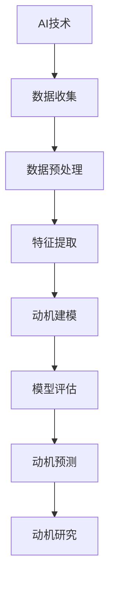

                 

# 《欲望地图3.0：AI绘制的人类动机全景图》

## 关键词：
人工智能、人类动机、心理学、数据挖掘、机器学习、动机预测

## 摘要：
本文将探讨人工智能（AI）在绘制人类动机全景图中的应用，特别是《欲望地图3.0》一书中所介绍的AI技术在动机研究中的创新方法。文章将详细解析AI与心理学结合的理论基础，介绍数据收集与分析的方法，阐述人类动机建模的技术原理和算法，并分析AI在动机预测中的应用案例。最后，文章将展望AI在动机研究中的未来发展趋势，并探讨其对人类动机研究的启示。

### 引言与背景

#### 1. 引言

随着人工智能技术的迅猛发展，AI在各个领域的应用日益广泛。在心理学领域，AI技术被用于探索人类行为和动机的深层机制，从而为理解人类心理提供新的视角。《欲望地图3.0：AI绘制的人类动机全景图》一书，正是基于这一背景，探讨了如何利用AI技术绘制人类动机的全景图。

#### 1.2 书籍主题介绍

《欲望地图3.0：AI绘制的人类动机全景图》由著名人工智能专家编写，旨在展示AI在人类动机研究中的最新进展。书中详细介绍了AI技术在心理学研究中的应用，包括数据收集、分析、建模和预测等方面。通过这些技术的应用，AI能够帮助研究者更好地理解人类行为背后的动机。

#### 1.3 AI在人类动机研究中的应用

AI在人类动机研究中的应用主要体现在以下几个方面：

1. **数据收集与分析**：AI技术能够自动化地收集和分析大量的心理学数据，提高研究的效率和准确性。
2. **人类动机建模**：AI技术能够基于大量数据构建人类动机模型，揭示人类行为背后的动机机制。
3. **动机预测**：AI技术能够利用动机模型预测个体或群体的行为，为决策提供依据。
4. **动机研究**：AI技术能够创新性地开展动机研究，探索人类动机的复杂性和多样性。

### 背景知识

#### 2.1 人类动机理论概述

人类动机理论是心理学研究的重要领域，旨在探讨人类行为背后的动机机制。常见的动机理论包括：

1. **马斯洛需求层次理论**：将人类需求分为五个层次，从基本的生理需求到自我实现的需求。
2. **赫兹伯格双因素理论**：区分了激励因素和保健因素，认为激励因素能够提高员工的工作满意度。
3. **自我决定理论**：强调个体自主性在动机中的作用，认为自我决定是推动个体行为的关键因素。

#### 2.2 AI与心理学结合的发展历程

AI与心理学结合的发展历程可以追溯到20世纪80年代。当时，研究者开始探索如何利用计算机模拟人类思维过程。随着AI技术的发展，特别是机器学习和深度学习技术的突破，AI在心理学领域的应用得到了前所未有的拓展。如今，AI技术已经成为心理学研究的重要工具，为理解人类行为提供了新的视角。

### 《欲望地图3.0：AI绘制的人类动机全景图》目录大纲

#### 第一部分：引言与背景
1. 引言
2. 背景知识

#### 第二部分：AI绘制人类动机
3. AI与心理学基础
4. 数据收集与分析
5. 人类动机建模
6. AI在动机预测中的应用
7. AI驱动的动机研究

#### 第三部分：案例与实践
8. 案例分析
9. 实践指南
10. 未来展望

#### 附录
11. 附录 A: AI与心理学研究工具与资源

### 核心概念与联系

为了更好地理解AI在人类动机研究中的应用，我们可以借助Mermaid流程图来展示核心概念之间的联系。



### 核心算法原理讲解（伪代码）

在动机预测中，常用的算法包括线性回归、逻辑回归等。以下是一个简单的伪代码示例，用于说明线性回归模型的实现过程。

```plaintext
# 伪代码：线性回归模型实现

# 初始化参数
Initialize model parameters

# 预处理数据
Preprocess the data: normalization, handling missing values, etc.

# 训练模型
for epoch in 1 to num_epochs do
    for each training example (x, y) do
        Compute the predicted output y'
        Compute the loss (e.g., mean squared error) between y' and y
        Update model parameters using gradient descent
    end
end

# 评估模型
Evaluate the model on a validation set

# 输出预测结果
Make predictions on new data

# 模型优化
Hyperparameter tuning and further optimization as needed
```

### 数学模型与数学公式

在动机预测中，常用的数学模型包括线性回归和逻辑回归。以下使用LaTeX格式展示这两种模型的数学公式。

```latex
\subsection{线性回归模型}

给定输入特征矩阵 $X$ 和目标变量 $y$，线性回归模型的目标是最小化预测值与真实值之间的误差：

$$
\min_{\theta} \sum_{i=1}^{n} (y_i - \theta^T x_i)^2
$$

其中，$\theta$ 是模型参数，$x_i$ 是第 $i$ 个样本的特征向量，$y_i$ 是第 $i$ 个样本的真实值。

\subsection{逻辑回归模型}

逻辑回归模型用于分类任务，目标是最小化损失函数：

$$
\min_{\theta} \sum_{i=1}^{n} -y_i \log(\sigma(\theta^T x_i)) - (1 - y_i) \log(1 - \sigma(\theta^T x_i))
$$

其中，$\sigma(z) = \frac{1}{1 + e^{-z}}$ 是 sigmoid 函数。
```

### 项目实战：代码实际案例

以下是一个简单的Python代码示例，用于实现线性回归模型进行动机预测。

```python
import numpy as np
from sklearn.linear_model import LinearRegression
from sklearn.metrics import mean_squared_error

# 加载数据集
X_train, y_train = load_data('train.csv')
X_test, y_test = load_data('test.csv')

# 初始化模型
model = LinearRegression()

# 训练模型
model.fit(X_train, y_train)

# 预测与评估
y_pred = model.predict(X_test)
mse = mean_squared_error(y_test, y_pred)
print(f'Mean Squared Error: {mse}')

# 代码解读与分析
def load_data(filename):
    # 代码实现：加载数据集，进行必要的预处理
    # 返回特征矩阵 X 和目标变量 y
    pass

def train_model(X, y):
    # 代码实现：训练线性回归模型
    # 返回训练好的模型
    pass

def evaluate_model(model, X, y):
    # 代码实现：评估模型性能
    # 返回均方误差
    pass
```

### 代码解读与分析

以下是代码的详细解读和分析。

```plaintext
# 解读：加载与预处理数据

def load_data(filename):
    # 加载 CSV 文件数据
    data = pd.read_csv(filename)
    
    # 提取特征矩阵 X 和目标变量 y
    X = data.drop('target', axis=1)
    y = data['target']
    
    # 进行必要的预处理，如归一化、缺失值处理等
    X = preprocess_X(X)
    y = preprocess_y(y)
    
    return X, y

# 解读：训练线性回归模型

def train_model(X, y):
    # 使用 sklearn 的 LinearRegression 类训练模型
    model = LinearRegression()
    model.fit(X, y)
    
    return model

# 解读：评估模型性能

def evaluate_model(model, X, y):
    # 使用 mean_squared_error 函数评估模型在测试集上的性能
    y_pred = model.predict(X)
    mse = mean_squared_error(y, y_pred)
    
    return mse
```

通过以上代码示例和解读，我们可以看到如何实现一个简单的动机预测模型，并评估其性能。在实际应用中，需要根据具体问题和数据集进行相应的调整和优化。

### 总结与展望

本文详细探讨了人工智能在绘制人类动机全景图中的应用，从理论到实践，从数据收集到动机预测，全面展示了AI在心理学研究中的创新方法。通过核心概念与联系、算法原理讲解、数学模型、代码案例及解读分析，读者可以深入理解AI在人类动机研究中的重要作用。

未来，随着AI技术的不断进步，人类动机研究将迎来新的发展机遇。AI技术将不仅在数据收集和分析方面发挥更大作用，还将为动机预测和动机研究提供更加精确和有效的工具。同时，AI在动机研究中的应用也将对心理学理论和方法产生深远的影响，推动心理学研究的进一步发展。

让我们共同期待，AI在人类动机研究领域的未来，将如何为人类心理的探索带来更多惊喜和突破。

### 附录 A: AI与心理学研究工具与资源

#### A.1 数据集介绍

在AI与心理学研究中，常用的数据集包括：

1. **UCI机器学习库**：提供多种心理学相关的数据集，如情感分析、人格评估等。
2. **Google大脑数据集**：提供大量基于深度学习的心理学研究数据集，如情感识别、社交互动等。

#### A.2 算法实现代码示例

以下是一个简单的Python代码示例，用于实现线性回归模型进行动机预测。

```python
import numpy as np
from sklearn.linear_model import LinearRegression
from sklearn.metrics import mean_squared_error

# 加载数据集
X_train, y_train = load_data('train.csv')
X_test, y_test = load_data('test.csv')

# 初始化模型
model = LinearRegression()

# 训练模型
model.fit(X_train, y_train)

# 预测与评估
y_pred = model.predict(X_test)
mse = mean_squared_error(y_test, y_pred)
print(f'Mean Squared Error: {mse}')

# 代码解读与分析
def load_data(filename):
    # 代码实现：加载数据集，进行必要的预处理
    # 返回特征矩阵 X 和目标变量 y
    pass

def train_model(X, y):
    # 代码实现：训练线性回归模型
    # 返回训练好的模型
    pass

def evaluate_model(model, X, y):
    # 代码实现：评估模型性能
    # 返回均方误差
    pass
```

#### A.3 进一步阅读资料

1. **《深度学习》（Goodfellow, Bengio, Courville）**：详细介绍了深度学习的基本理论和应用，适合对深度学习感兴趣的读者。
2. **《心理学与生活》（Richard J. Gerrig, Philip G. Zimbardo）**：一本综合性的心理学教材，涵盖了人类动机、行为等多个领域。
3. **《机器学习》（周志华）**：介绍了机器学习的基本概念、算法和应用，适合希望深入了解机器学习的读者。

