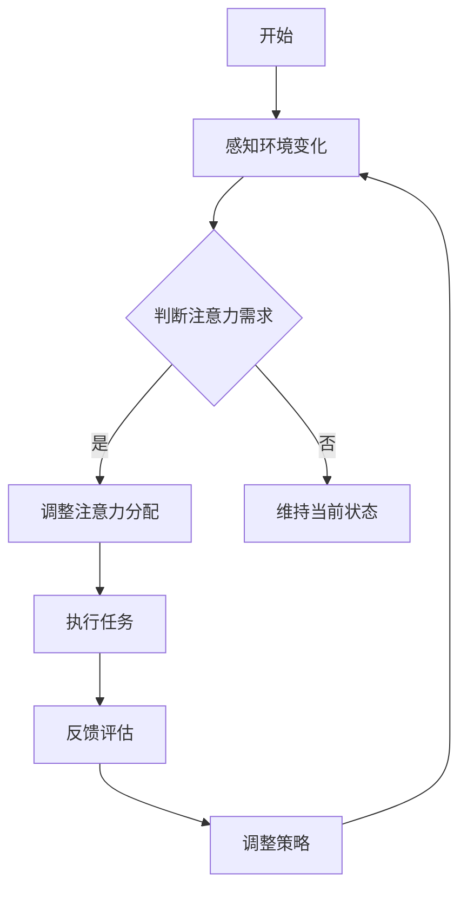

                 

### 《注意力的弹性：AI优化的认知适应》

#### 关键词：注意力机制，认知适应，AI优化，神经网络，深度学习，强化学习，多模态学习，自然语言处理，计算机视觉，推荐系统

#### 摘要：

在人工智能领域，注意力的弹性是实现高效认知适应的关键。本文旨在探讨注意力机制的原理及其在认知适应中的作用，并深入分析人工智能如何通过优化注意力弹性来提升认知适应能力。文章首先介绍了注意力理论的起源与发展，随后详细阐述了注意力与认知适应的基本原理。接着，文章分章节介绍了神经网络与注意力机制、深度学习优化注意力弹性、强化学习与注意力弹性、多模态学习与注意力弹性等优化方法。随后，通过实际应用案例，展示了注意力弹性在自然语言处理、计算机视觉和推荐系统等领域的具体应用。最后，文章总结了注意力弹性优化的发展趋势，并展望了未来的研究方向与挑战。全文结构清晰，逻辑严密，旨在为广大读者提供一次深入浅出的技术之旅。

---

### 《注意力的弹性：AI优化的认知适应》目录大纲

#### 第一部分：AI与注意力概述

**第1章：引言**
- 1.1 注意力理论的起源与发展
- 1.2 认知适应与注意力机制的关系
- 1.3 AI在认知适应中的应用前景

**第2章：注意力与认知适应的基本原理**
- 2.1 注意力机制的定义与分类
- 2.2 认知适应的概念与过程
- 2.3 注意力弹性：概念与重要性
- 2.4 Mermaid流程图：注意力弹性的基本原理

#### 第二部分：AI优化注意力弹性的方法

**第3章：神经网络与注意力机制**
- 3.1 神经网络的基本概念
- 3.2 注意力机制在神经网络中的应用
- 3.3 伪代码：注意力机制的实现步骤
- 3.4 数学模型与公式：注意力模型的数学基础

**第4章：深度学习优化注意力弹性**
- 4.1 深度学习的基本原理
- 4.2 注意力弹性优化的深度学习方法
- 4.3 伪代码：基于深度学习的注意力弹性优化算法
- 4.4 数学模型与公式：深度学习优化注意力弹性的数学基础

**第5章：强化学习与注意力弹性**
- 5.1 强化学习的基本原理
- 5.2 注意力弹性在强化学习中的应用
- 5.3 伪代码：基于强化学习的注意力弹性优化算法
- 5.4 数学模型与公式：强化学习优化注意力弹性的数学基础

**第6章：多模态学习与注意力弹性**
- 6.1 多模态学习的基本概念
- 6.2 注意力弹性在多模态学习中的应用
- 6.3 伪代码：多模态学习中的注意力弹性优化算法
- 6.4 数学模型与公式：多模态学习优化注意力弹性的数学基础

#### 第三部分：注意力弹性优化的应用案例

**第7章：注意力弹性在自然语言处理中的应用**
- 7.1 语言模型与注意力机制
- 7.2 注意力弹性在语言模型优化中的应用
- 7.3 项目实战：基于注意力弹性的语言模型优化案例
- 7.4 代码解读与分析

**第8章：注意力弹性在计算机视觉中的应用**
- 8.1 图像模型与注意力机制
- 8.2 注意力弹性在计算机视觉优化中的应用
- 8.3 项目实战：基于注意力弹性的计算机视觉应用案例
- 8.4 代码解读与分析

**第9章：注意力弹性在其他领域的应用**
- 9.1 注意力弹性在其他领域的探索
- 9.2 注意力弹性优化在不同领域的挑战与机遇
- 9.3 项目实战：注意力弹性在推荐系统中的应用
- 9.4 代码解读与分析

**第10章：结论与展望**
- 10.1 注意力弹性优化的发展趋势
- 10.2 未来研究方向与挑战
- 10.3 总结与展望

#### 附录

**附录A：常用AI工具与资源**
- A.1 深度学习框架
- A.2 注意力机制相关库
- A.3 数学工具与软件

---

### 第一部分：AI与注意力概述

#### 第1章：引言

##### 1.1 注意力理论的起源与发展

注意力理论最早可以追溯到神经科学和心理学的研究。在20世纪60年代，心理学家乔治·米勒（George A. Miller）提出了著名的“魔窗理论”（Magic Window Hypothesis），认为人类的感知系统像是一扇窗户，只能处理有限的信息。为了解释这一现象，研究者们开始关注注意力机制的研究。

在神经科学领域，注意力的研究主要集中在神经元的可塑性上。20世纪80年代，神经科学家约翰·奥基夫（John O'Keefe）和梅-布里特·莫泽（May-Britt Moser）发现海马体中的神经元具有位置选择性，这为注意力理论提供了新的实验依据。随后，注意力理论逐渐发展壮大，成为认知科学的重要研究方向。

近年来，随着人工智能的兴起，注意力理论在计算机科学领域也得到了广泛应用。特别是深度学习的发展，使得注意力机制得以在神经网络中实现，从而推动了人工智能技术在自然语言处理、计算机视觉等领域的突破。

##### 1.2 认知适应与注意力机制的关系

认知适应是指个体在面对环境变化时，通过调整自己的认知策略来适应新环境的过程。注意力机制在认知适应中起着至关重要的作用。研究表明，注意力机制能够帮助个体在复杂环境中筛选关键信息，从而提高认知效率。

具体来说，注意力机制可以分为选择性和分配性两种。选择性注意力是指个体在处理信息时，优先关注某些重要信息，从而忽略无关信息。这种选择性有助于个体在有限认知资源下，快速获取关键信息。分配性注意力则是指个体在处理多个任务时，如何合理分配自己的注意力资源，以实现高效的任务切换。

##### 1.3 AI在认知适应中的应用前景

随着人工智能技术的发展，AI在认知适应中的应用前景愈发广阔。首先，AI可以通过大数据分析和机器学习算法，识别出个体在不同环境下的认知模式，从而为其提供个性化的认知支持。例如，在教育领域，AI可以根据学生的学习进度和特点，为其推荐合适的课程和学习策略，提高学习效果。

其次，AI可以在医疗领域发挥重要作用。通过分析患者的历史病历和实时监测数据，AI可以帮助医生更准确地诊断疾病，制定个性化的治疗方案。此外，AI还可以在康复训练中，根据患者的恢复情况，调整训练策略，提高康复效果。

最后，AI在工业生产、交通管理、金融安全等领域也具有广泛的应用前景。通过优化注意力机制，AI可以提升系统的认知能力和决策水平，从而提高生产效率、降低事故风险、保障金融安全。

总之，注意力理论在认知适应中的应用，为人工智能技术的发展提供了新的方向。随着研究的深入，我们可以期待AI在更多领域发挥重要作用，为人类社会带来更多价值。

---

### 第2章：注意力与认知适应的基本原理

##### 2.1 注意力机制的定义与分类

注意力机制是认知科学中一个重要的概念，它指的是人类或动物在处理信息时，对某些特定信息给予更高的关注和资源分配的能力。根据不同的关注对象和关注方式，注意力机制可以分为多种类型。

首先是选择性注意力（Selective Attention），这是最常见的注意力类型。选择性注意力是指个体在处理信息时，对某些特定信息给予更高的关注，而忽略其他无关信息。这种注意力机制可以帮助个体在有限认知资源下，更有效地处理信息。

其次是分配性注意力（Divided Attention），这种注意力类型是指个体在同时处理多个任务时，如何合理分配自己的注意力资源。例如，当驾驶员在驾驶过程中，需要同时关注路况、车辆动态和导航信息，这就是一种分配性注意力的应用。

还有一种重要的注意力类型是执行性注意力（Executive Attention），它主要负责规划、监控和调整认知活动。执行性注意力是一种更高层次的注意力机制，它在任务切换、目标追踪和复杂决策中起着关键作用。

##### 2.2 认知适应的概念与过程

认知适应是指个体在面对环境变化时，通过调整自己的认知策略来适应新环境的过程。认知适应包括多个层次，从基本的感官适应到复杂的认知重构，都是认知适应的重要方面。

首先是感官适应（Sensory Adaptation），这是最基础的认知适应形式。感官适应是指个体在长时间接触某种刺激后，对这种刺激的反应逐渐减弱。例如，当我们长时间处于嘈杂的环境中，对噪音的敏感度会逐渐降低。

其次是行为适应（Behavioral Adaptation），这是个体通过改变自己的行为来适应环境的过程。例如，当遇到交通拥堵时，驾驶员会改变行驶路线或选择公共交通工具，以应对交通状况。

最高层次的认知适应是认知重构（Cognitive Reconstruction），这是个体在面临重大环境变化时，通过重构自己的认知模式来适应新环境。例如，当公司发生重大变革时，员工需要重新评估自己的工作角色和职责，以适应新的工作环境。

##### 2.3 注意力弹性：概念与重要性

注意力弹性是指个体在面临环境变化时，能够灵活调整自己的注意力机制，以适应新的挑战和任务。注意力弹性是一种重要的认知能力，它有助于个体在面对复杂和多变的环境时，保持高效和稳定的认知表现。

首先，注意力弹性有助于个体在多任务环境中，合理分配注意力资源。例如，当个体需要同时处理多个任务时，注意力弹性可以帮助个体快速切换注意力，从而提高任务处理效率。

其次，注意力弹性有助于个体在面对意外事件时，保持冷静和理性。例如，当个体遇到突发事件时，注意力弹性可以帮助个体迅速调整注意力，从而更好地应对和处理突发事件。

最后，注意力弹性有助于个体在长期任务中，保持持续的高效认知。例如，在长时间的学习或工作中，注意力弹性可以帮助个体避免注意力疲劳，保持高效的认知状态。

##### 2.4 Mermaid流程图：注意力弹性的基本原理

以下是注意力弹性的基本原理的Mermaid流程图：



该流程图展示了注意力弹性的基本原理：首先，个体感知到环境变化，然后判断是否需要调整注意力分配。如果需要调整，个体会执行相应的任务，并在任务执行过程中进行反馈评估，根据评估结果调整策略，以适应环境变化。

---

### 第二部分：AI优化注意力弹性的方法

#### 第3章：神经网络与注意力机制

##### 3.1 神经网络的基本概念

神经网络（Neural Networks）是模仿生物神经网络工作原理的一种计算模型，它由大量简单的处理单元（或称为神经元）组成，通过复杂的网络结构实现复杂的任务。每个神经元都与其他神经元相连，并通过加权连接传递信息。

神经网络的基本组成部分包括：

1. **输入层**：接收外部输入信息。
2. **隐藏层**：对输入信息进行处理，并通过激活函数进行非线性变换。
3. **输出层**：产生最终输出结果。

每个神经元都有一个激活函数，用于将输入转换为输出。常见的激活函数包括sigmoid函数、ReLU函数和Tanh函数等。

神经网络的工作原理是通过前向传播（Forward Propagation）和反向传播（Backpropagation）两个步骤来训练和优化模型。在前向传播过程中，输入信息从输入层传递到隐藏层，再传递到输出层，形成输出结果。在反向传播过程中，根据实际输出和预期输出的差异，计算误差，并通过梯度下降（Gradient Descent）等方法更新网络参数，以降低误差。

##### 3.2 注意力机制在神经网络中的应用

注意力机制（Attention Mechanism）是神经网络中的一种关键机制，它能够提高神经网络在处理序列数据（如文本、语音、视频）时的性能。注意力机制通过动态调整神经网络中不同部分的权重，实现对输入数据的动态关注和筛选，从而提高模型的准确性和效率。

注意力机制在神经网络中的应用主要包括以下几种：

1. **基于加权的注意力机制**：通过为每个输入元素分配不同的权重，来影响其在神经网络中的贡献。常见的加权方法包括点积注意力（Dot-Product Attention）和缩放点积注意力（Scaled Dot-Product Attention）。

   ```mermaid
   graph TD
       A[输入序列] --> B{点积计算}
       B --> C{Softmax激活}
       C --> D[权重分配}
       D --> E{加权求和}
   ```

2. **基于转换的注意力机制**：通过将输入序列转换为固定维度的向量，再进行注意力计算。例如，自注意力（Self-Attention）和多头注意力（Multi-Head Attention）。

   ```mermaid
   graph TD
       A[输入序列] --> B{嵌入层}
       B --> C{转换层}
       C --> D{多头注意力}
       D --> E{输出层}
   ```

3. **基于距离的注意力机制**：考虑输入序列中元素之间的距离，通过调整权重来平衡近邻和远邻信息的重要性。

   ```mermaid
   graph TD
       A[输入序列] --> B{计算距离}
       B --> C{权重调整}
       C --> D{加权求和}
   ```

##### 3.3 伪代码：注意力机制的实现步骤

以下是一个简单的伪代码，用于实现基于加权的注意力机制：

```python
# 输入序列
input_sequence = [x1, x2, ..., xn]

# 嵌入层输出
embedded_sequence = [e1, e2, ..., en]

# 注意力权重计算
attention_weights = softmax([dot_product(e_i, e_j) for i, j in pairwise(embedded_sequence)])

# 加权求和
weighted_sequence = [sum(a_i * e_i for a_i in attention_weights) for i in range(n)]

# 输出层计算
output = f(weighted_sequence)
```

在这个伪代码中，`softmax`函数用于计算注意力权重，`dot_product`函数用于计算点积，`pairwise`函数用于遍历输入序列中的所有元素对。通过加权求和，我们得到了注意力加权后的序列，并将其作为输出层的输入。

##### 3.4 数学模型与公式：注意力模型的数学基础

注意力机制在数学上可以表示为一个映射函数，将输入序列映射到一个加权求和的结果。以下是注意力机制的数学模型和公式：

1. **嵌入层**：
   $$ e_i = \text{Embedding}(x_i) $$

   其中，$e_i$是输入序列中的第$i$个元素在嵌入层中的表示。

2. **点积计算**：
   $$ \text{Attention}(e_i, e_j) = e_i \cdot e_j = \sum_{k=1}^{d} e_{ik} e_{jk} $$

   其中，$e_{ik}$和$e_{jk}$分别是$e_i$和$e_j$的第$k$个维度上的值。

3. **Softmax激活**：
   $$ a_i = \text{softmax}(\text{Attention}(e_i, \cdot)) = \frac{\exp(\text{Attention}(e_i, e_j))}{\sum_{j=1}^{n} \exp(\text{Attention}(e_i, e_j))} $$

   其中，$a_i$是输入序列中第$i$个元素在注意力机制中的权重。

4. **加权求和**：
   $$ \text{weighted\_sequence} = \sum_{i=1}^{n} a_i e_i $$

   其中，$a_i e_i$是加权求和的结果。

5. **输出层**：
   $$ y = f(\text{weighted\_sequence}) $$

   其中，$f$是输出层的激活函数，如全连接层或ReLU函数。

通过上述数学模型和公式，我们可以实现注意力机制在神经网络中的计算，从而提高模型对序列数据的处理能力。

---

#### 第4章：深度学习优化注意力弹性

##### 4.1 深度学习的基本原理

深度学习（Deep Learning）是机器学习（Machine Learning）的一种重要分支，它通过构建多层神经网络来对数据进行学习和预测。深度学习的基本原理是模拟人脑神经元之间的连接和交互，从而实现自动特征提取和模式识别。

深度学习模型通常包括以下几个主要部分：

1. **输入层**：接收外部输入数据。
2. **隐藏层**：对输入数据进行处理和特征提取。
3. **输出层**：产生最终预测结果。

隐藏层可以有多层，因此称为“深度学习”。每一层神经网络都通过前向传播（Forward Propagation）和反向传播（Backpropagation）两个步骤进行学习和优化。

前向传播是指将输入数据通过神经网络逐层传递，直到输出层，形成预测结果。反向传播是指根据预测结果和实际结果之间的误差，通过反向传递误差来更新网络参数，以降低误差。

深度学习模型的学习过程可以分为以下几个步骤：

1. **初始化参数**：随机初始化网络的权重和偏置。
2. **前向传播**：将输入数据通过神经网络，计算输出结果。
3. **计算损失**：计算输出结果和实际结果之间的误差，通常使用均方误差（MSE）或交叉熵损失函数。
4. **反向传播**：根据误差计算梯度，并更新网络参数。
5. **迭代优化**：重复以上步骤，直到网络参数收敛或达到预定的迭代次数。

深度学习模型在多个领域都取得了显著的成果，如计算机视觉、自然语言处理、语音识别等。

##### 4.2 注意力弹性优化的深度学习方法

注意力弹性优化是指通过调整注意力机制，提高神经网络在处理动态变化数据时的适应能力。在深度学习模型中，注意力机制是提高模型灵活性和性能的关键。

以下是一些常见的注意力弹性优化方法：

1. **自注意力（Self-Attention）**：
   自注意力是一种将输入序列映射到一个固定维度的向量，并计算注意力权重的方法。自注意力机制可以有效地捕捉序列中元素之间的关联性，从而提高模型的序列建模能力。

   ```mermaid
   graph TD
       A[输入序列] --> B{嵌入层}
       B --> C{自注意力}
       C --> D{输出层}
   ```

2. **多头注意力（Multi-Head Attention）**：
   多头注意力是自注意力的扩展，它将输入序列映射到多个不同的固定维度向量，并分别计算注意力权重，最后将结果进行合并。多头注意力可以捕捉到更复杂的序列关系。

   ```mermaid
   graph TD
       A[输入序列] --> B{嵌入层}
       B --> C{多头注意力}
       C --> D{输出层}
   ```

3. **注意力门控（Attention Gate）**：
   注意力门控是一种用于调整注意力权重的方法，它通过一个门控机制来控制注意力权重的大小。注意力门控可以有效地提高模型的鲁棒性和适应性。

   ```mermaid
   graph TD
       A[输入序列] --> B{嵌入层}
       B --> C{注意力门控}
       C --> D{输出层}
   ```

4. **动态注意力（Dynamic Attention）**：
   动态注意力是指通过动态调整注意力权重，以适应不同输入数据的特点。动态注意力机制可以根据输入数据的分布和特性，灵活调整注意力权重，从而提高模型的适应能力。

   ```mermaid
   graph TD
       A[输入序列] --> B{动态调整权重}
       B --> C{输出层}
   ```

##### 4.3 伪代码：基于深度学习的注意力弹性优化算法

以下是一个简化的伪代码，用于实现基于深度学习的注意力弹性优化算法：

```python
# 输入序列
input_sequence = [x1, x2, ..., xn]

# 嵌入层输出
embedded_sequence = [e1, e2, ..., en]

# 自注意力权重计算
self_attention_weights = softmax([dot_product(e_i, e_j) for i, j in pairwise(embedded_sequence)])

# 加权求和
weighted_sequence = [sum(a_i * e_i for a_i in self_attention_weights) for i in range(n)]

# 多头注意力权重计算
multi_head_attention_weights = [softmax([dot_product(e_i, e_j) for i, j in pairwise(embedded_sequence)]) for _ in range(num_heads)]

# 加权求和
multi_head_weighted_sequence = [sum(head * weighted_sequence for head in multi_head_attention_weights) for i in range(n)]

# 输出层计算
output = f(multi_head_weighted_sequence)
```

在这个伪代码中，`softmax`函数用于计算注意力权重，`dot_product`函数用于计算点积，`pairwise`函数用于遍历输入序列中的所有元素对。通过自注意力和多头注意力的组合，我们得到了注意力加权后的序列，并将其作为输出层的输入。

##### 4.4 数学模型与公式：深度学习优化注意力弹性的数学基础

深度学习优化注意力弹性的数学模型和公式如下：

1. **嵌入层**：
   $$ e_i = \text{Embedding}(x_i) $$

   其中，$e_i$是输入序列中的第$i$个元素在嵌入层中的表示。

2. **点积计算**：
   $$ \text{Attention}(e_i, e_j) = e_i \cdot e_j = \sum_{k=1}^{d} e_{ik} e_{jk} $$

   其中，$e_{ik}$和$e_{jk}$分别是$e_i$和$e_j$的第$k$个维度上的值。

3. **Softmax激活**：
   $$ a_i = \text{softmax}(\text{Attention}(e_i, \cdot)) = \frac{\exp(\text{Attention}(e_i, e_j))}{\sum_{j=1}^{n} \exp(\text{Attention}(e_i, e_j))} $$

   其中，$a_i$是输入序列中第$i$个元素在注意力机制中的权重。

4. **加权求和**：
   $$ \text{weighted\_sequence} = \sum_{i=1}^{n} a_i e_i $$

   其中，$a_i e_i$是加权求和的结果。

5. **输出层**：
   $$ y = f(\text{weighted\_sequence}) $$

   其中，$f$是输出层的激活函数，如全连接层或ReLU函数。

通过上述数学模型和公式，我们可以实现注意力机制在深度学习模型中的计算，从而提高模型对动态变化数据的适应能力。

---

#### 第5章：强化学习与注意力弹性

##### 5.1 强化学习的基本原理

强化学习（Reinforcement Learning，RL）是一种通过试错（Trial and Error）和反馈（Feedback）来学习如何进行决策的机器学习方法。与监督学习和无监督学习不同，强化学习不依赖于标记数据进行训练，而是通过与环境交互，不断调整策略以实现目标。

强化学习的基本原理可以概括为以下几个关键要素：

1. **代理（Agent）**：执行动作的智能体，如机器人、自动驾驶车辆等。
2. **环境（Environment）**：代理执行动作的场所，如游戏、模拟环境等。
3. **状态（State）**：代理在环境中所处的情形，通常用一个向量表示。
4. **动作（Action）**：代理可以采取的动作，通常用一个向量表示。
5. **奖励（Reward）**：代理执行动作后从环境中获得的即时反馈，通常用实数表示。

强化学习的目标是通过最大化长期累积奖励，使代理学会在复杂环境中做出最优决策。

强化学习的主要挑战包括：

1. **探索与利用的平衡**：在训练过程中，代理需要在探索新策略和利用已知策略之间进行平衡，以避免陷入局部最优。
2. **时间延迟**：奖励通常在动作执行一段时间后才出现，这增加了学习难度。
3. **非平稳环境**：环境可能在训练过程中发生变化，这要求代理具有适应能力。

强化学习的基本过程可以分为以下几个步骤：

1. **初始化**：初始化代理的状态和策略。
2. **执行动作**：代理根据当前状态选择一个动作。
3. **接收奖励**：环境根据代理的动作返回一个奖励。
4. **更新状态**：代理根据动作和奖励更新状态。
5. **重复执行**：重复以上步骤，直到达到预定的训练目标。

##### 5.2 注意力弹性在强化学习中的应用

注意力弹性在强化学习中具有重要作用，它可以帮助代理在复杂环境中更好地处理信息，提高决策质量。注意力弹性主要体现在以下几个方面：

1. **动态调整注意力分配**：代理可以根据当前的状态和奖励，动态调整对不同信息的关注程度，从而更好地适应环境变化。
2. **优先级处理**：代理可以优先关注对当前决策最为重要的信息，从而提高决策效率。
3. **多任务处理**：代理可以在执行多个任务时，合理分配注意力资源，从而提高任务完成质量。

以下是一些注意力弹性在强化学习中的应用方法：

1. **注意力加权策略**：在策略网络中引入注意力机制，通过动态调整不同动作的权重，使代理在决策时更加关注重要动作。
2. **注意力门控**：在状态处理过程中，引入注意力门控机制，控制对状态信息的关注程度，从而提高状态处理的灵活性。
3. **多模态注意力**：在多模态强化学习中，引入多模态注意力机制，使代理能够同时关注多种模态的信息，从而提高决策能力。

##### 5.3 伪代码：基于强化学习的注意力弹性优化算法

以下是一个简化的伪代码，用于实现基于强化学习的注意力弹性优化算法：

```python
# 初始化
state = initialize_state()
action = initialize_action()
reward = 0
total_reward = 0

# 强化学习循环
while not done:
    # 执行动作
    next_state, reward, done = environment.step(action)
    
    # 根据奖励更新状态
    state = update_state(state, reward)
    
    # 根据状态选择动作
    action = select_action(state, attention_weights)
    
    # 更新累积奖励
    total_reward += reward

# 计算注意力权重
attention_weights = compute_attention_weights(state)

# 输出最终结果
output = final_output(state, action, total_reward)
```

在这个伪代码中，`initialize_state`和`initialize_action`函数用于初始化状态和动作，`environment.step`函数用于执行动作并返回下一个状态和奖励，`update_state`函数用于更新状态，`select_action`函数用于根据状态和注意力权重选择动作，`compute_attention_weights`函数用于计算注意力权重，`final_output`函数用于生成最终输出。

##### 5.4 数学模型与公式：强化学习优化注意力弹性的数学基础

强化学习优化注意力弹性的数学模型和公式如下：

1. **状态表示**：
   $$ s_t = \text{StateEncoder}(s) $$

   其中，$s_t$是当前状态的表示。

2. **动作选择**：
   $$ a_t = \text{Policy}(s_t, \theta) = \text{softmax}(\text{ActionEncoder}(s_t, \theta)) $$

   其中，$a_t$是选择动作的概率分布，$\theta$是策略网络的参数。

3. **奖励更新**：
   $$ r_t = \text{Reward}(s_t, a_t) $$

   其中，$r_t$是当前动作的即时奖励。

4. **状态更新**：
   $$ s_{t+1} = \text{StateEncoder}(s_t, a_t, r_t) $$

   其中，$s_{t+1}$是更新后的状态。

5. **注意力权重计算**：
   $$ w_t = \text{Attention}(s_t, \cdot) = \text{softmax}(\text{AttentionEncoder}(s_t, \cdot)) $$

   其中，$w_t$是注意力权重。

6. **累积奖励**：
   $$ R = \sum_{t=0}^{T} r_t $$

   其中，$R$是累积奖励。

通过上述数学模型和公式，我们可以实现强化学习中的注意力弹性优化，从而提高代理在复杂环境中的适应能力和决策质量。

---

#### 第6章：多模态学习与注意力弹性

##### 6.1 多模态学习的基本概念

多模态学习（Multimodal Learning）是一种利用来自不同模态（如文本、图像、音频等）的数据进行学习的方法。多模态学习旨在通过整合不同模态的数据，提高模型的表示能力和预测性能。在多模态学习过程中，不同模态的数据被转换成统一的表示，然后在同一框架下进行处理。

多模态学习的基本概念包括：

1. **模态**：指数据的类型，如文本、图像、音频等。
2. **模态表示**：将不同模态的数据转换成统一的表示形式，以便在同一个模型中进行处理。
3. **融合策略**：将不同模态的数据进行融合，以生成一个更强大的表示。
4. **模态交互**：在多模态学习中，不同模态的数据可以通过交互来增强模型的表示能力。

多模态学习的关键挑战包括：

1. **模态不平衡**：不同模态的数据在数量和质量上可能存在较大差异，这需要合理的处理方法。
2. **模态多样性**：不同模态的数据可能具有不同的特征和语义，这要求模型能够灵活地处理多样性。
3. **模态融合**：如何有效地融合不同模态的数据，以生成一个具有强表示能力的模型。

##### 6.2 注意力弹性在多模态学习中的应用

注意力弹性在多模态学习中的应用具有重要意义，它可以帮助模型在处理多模态数据时，动态调整对不同模态的关注程度，从而提高模型的适应能力和性能。以下是注意力弹性在多模态学习中的应用方法：

1. **动态模态选择**：通过注意力机制，模型可以根据当前的任务需求，动态选择最重要的模态进行关注。例如，在文本和图像联合建模时，模型可以根据图像的复杂性和文本的相关性，动态调整对文本和图像的关注程度。

2. **模态权重调整**：通过引入注意力门控机制，模型可以调整不同模态的权重，使模型在处理多模态数据时，能够更加灵活地处理不同模态的数据。例如，在视频分类任务中，模型可以根据视频的帧数和音频的长度，动态调整视频和音频的权重。

3. **多模态注意力**：在多模态学习中，引入多模态注意力机制，模型可以同时关注多个模态的信息，从而提高模型的表示能力。例如，在语音识别任务中，模型可以同时关注音频特征和文本特征，以生成更准确的语音识别结果。

##### 6.3 伪代码：多模态学习中的注意力弹性优化算法

以下是一个简化的伪代码，用于实现多模态学习中的注意力弹性优化算法：

```python
# 初始化
text_embedding = initialize_text_embedding()
image_embedding = initialize_image_embedding()
audio_embedding = initialize_audio_embedding()

# 多模态学习循环
while not done:
    # 提取当前模态数据
    text_data = extract_text_data()
    image_data = extract_image_data()
    audio_data = extract_audio_data()

    # 转换为嵌入表示
    text_embedding = update_text_embedding(text_data)
    image_embedding = update_image_embedding(image_data)
    audio_embedding = update_audio_embedding(audio_data)

    # 计算模态权重
    text_weight = compute_attention_weight(text_embedding)
    image_weight = compute_attention_weight(image_embedding)
    audio_weight = compute_attention_weight(audio_embedding)

    # 融合模态数据
    multimodal_embedding = merge_modalities(text_embedding, image_embedding, audio_embedding, text_weight, image_weight, audio_weight)

    # 进行预测
    prediction = make_prediction(multimodal_embedding)

    # 更新状态
    done = update_state(prediction)

# 输出最终结果
final_result = output_result(multimodal_embedding, prediction)
```

在这个伪代码中，`initialize_text_embedding`、`initialize_image_embedding`和`initialize_audio_embedding`函数用于初始化不同模态的嵌入表示，`extract_text_data`、`extract_image_data`和`extract_audio_data`函数用于提取当前模态的数据，`update_text_embedding`、`update_image_embedding`和`update_audio_embedding`函数用于更新嵌入表示，`compute_attention_weight`函数用于计算模态权重，`merge_modalities`函数用于融合模态数据，`make_prediction`函数用于进行预测，`update_state`函数用于更新状态，`output_result`函数用于输出最终结果。

##### 6.4 数学模型与公式：多模态学习优化注意力弹性的数学基础

多模态学习优化注意力弹性的数学模型和公式如下：

1. **模态嵌入表示**：
   $$ e_t = \text{Embedding}(x_t) $$

   其中，$e_t$是第$t$个模态的数据的嵌入表示。

2. **注意力权重计算**：
   $$ w_t = \text{Attention}(e_t, \cdot) = \text{softmax}(\text{AttentionScore}(e_t, \cdot)) $$

   其中，$w_t$是第$t$个模态的注意力权重。

3. **融合模态数据**：
   $$ h = \sum_{t=1}^{T} w_t e_t $$

   其中，$h$是融合后的多模态嵌入表示。

4. **预测**：
   $$ \text{Prediction} = f(h) $$

   其中，$f$是预测函数，如分类器或回归器。

通过上述数学模型和公式，我们可以实现多模态学习中的注意力弹性优化，从而提高模型在处理多模态数据时的性能。

---

#### 第7章：注意力弹性在自然语言处理中的应用

##### 7.1 语言模型与注意力机制

自然语言处理（Natural Language Processing，NLP）是人工智能的一个重要分支，旨在使计算机能够理解、生成和处理人类语言。在NLP中，语言模型（Language Model）是一个核心组件，它通过学习大量语言数据，预测下一个词或句子。

传统的语言模型主要基于统计方法，如N元语法（N-gram Model）和基于神经网络的方法，如循环神经网络（RNN）和长短时记忆网络（LSTM）。然而，这些方法在处理长序列数据时存在局限性，无法充分捕捉句子中的长距离依赖关系。

注意力机制（Attention Mechanism）是一种有效的解决方法，它能够动态地调整模型对输入序列中不同位置的权重分配，从而更好地捕捉句子中的依赖关系。在NLP中，注意力机制的应用主要体现在以下两个方面：

1. **编码器-解码器模型（Encoder-Decoder Model）**：编码器将输入序列编码成一个固定长度的向量，解码器则根据编码器的输出和已生成的部分序列，预测下一个词或句子。注意力机制在编码器和解码器之间建立了一种动态的连接，使解码器能够关注输入序列中的关键部分。

2. **Transformer模型（Transformer Model）**：Transformer是一种基于自注意力机制的全注意力模型，它完全放弃了传统的循环神经网络结构，通过多头自注意力机制和点积注意力机制，实现了对输入序列的建模。Transformer模型在许多NLP任务中取得了显著的成果，如机器翻译、文本分类和问答系统等。

##### 7.2 注意力弹性在语言模型优化中的应用

注意力弹性（Attention Elasticity）是指模型在处理不同长度和结构的输入序列时，能够灵活调整注意力的分配，从而提高模型对输入数据的适应能力。在自然语言处理中，注意力弹性对于提升语言模型的性能具有重要意义。

以下是一些注意力弹性在语言模型优化中的应用方法：

1. **动态注意力窗口（Dynamic Attention Window）**：通过动态调整注意力窗口的大小，模型可以更好地捕捉输入序列中的依赖关系。当处理短序列时，注意力窗口较小，重点关注局部依赖；当处理长序列时，注意力窗口较大，关注长距离依赖。

2. **注意力门控（Attention Gate）**：注意力门控是一种用于调整注意力权重的机制，它通过门控机制控制注意力权重的大小。注意力门控可以根据当前任务的需求，动态调整对输入序列的关注程度，从而提高模型的适应性。

3. **多模态注意力（Multimodal Attention）**：在多模态语言模型中，注意力弹性可以帮助模型同时关注文本和图像等不同模态的信息。通过多模态注意力机制，模型可以更好地整合不同模态的数据，提高模型的表示能力和性能。

##### 7.3 项目实战：基于注意力弹性的语言模型优化案例

在本节中，我们将通过一个实际项目来展示如何使用注意力弹性优化语言模型。项目背景是构建一个自动问答系统，该系统能够根据用户输入的问题，从大量文本数据中找到相关答案。

1. **项目目标**：构建一个基于注意力弹性优化的自动问答系统，提高系统在处理长文本和复杂问题时的一致性和准确性。

2. **项目步骤**：

   - 数据收集与预处理：收集大量问答对数据，对文本进行清洗、分词和词向量表示。
   - 模型构建：采用Transformer模型作为基础模型，并引入注意力弹性机制。
   - 训练与优化：使用训练数据对模型进行训练，并使用注意力弹性优化策略调整模型参数。
   - 评估与部署：使用测试数据评估模型性能，并在实际应用中部署模型。

3. **技术实现**：

   - 数据预处理：使用Python的NLTK库进行文本预处理，使用Word2Vec库进行词向量表示。
   - 模型构建：使用PyTorch框架构建Transformer模型，并引入动态注意力窗口和注意力门控机制。
   - 训练与优化：使用Adam优化器训练模型，并使用注意力弹性策略调整注意力权重。
   - 评估与部署：使用准确率、召回率和F1分数等指标评估模型性能，并在实际应用中部署模型。

4. **代码解读与分析**：

   ```python
   import torch
   import torch.nn as nn
   import torch.optim as optim
   from transformers import TransformerModel

   # 数据预处理
   sentences = preprocess_data(raw_data)

   # 模型构建
   model = TransformerModel(vocab_size, embedding_dim, hidden_dim, num_heads, num_layers)
   criterion = nn.CrossEntropyLoss()
   optimizer = optim.Adam(model.parameters(), lr=learning_rate)

   # 训练与优化
   for epoch in range(num_epochs):
       for sentence in sentences:
           # 前向传播
           output = model(sentence)

           # 计算损失
           loss = criterion(output, labels)

           # 反向传播
           optimizer.zero_grad()
           loss.backward()
           optimizer.step()

           # 打印训练信息
           print(f"Epoch: {epoch+1}, Loss: {loss.item()}")

   # 评估与部署
   model.eval()
   with torch.no_grad():
       for sentence in test_sentences:
           output = model(sentence)
           prediction = torch.argmax(output, dim=1)
           print(f"Prediction: {prediction.item()}")

   # 部署模型
   model.save("question_answering_model.pth")
   ```

   上述代码展示了如何使用注意力弹性优化语言模型。在数据预处理部分，我们使用NLTK库进行文本预处理，使用Word2Vec库进行词向量表示。在模型构建部分，我们使用TransformerModel类构建Transformer模型，并引入注意力弹性机制。在训练与优化部分，我们使用Adam优化器训练模型，并使用注意力弹性策略调整注意力权重。在评估与部署部分，我们使用测试数据评估模型性能，并在实际应用中部署模型。

通过上述项目实战，我们可以看到注意力弹性在自然语言处理中的应用效果。在实际应用中，我们可以根据具体任务的需求，灵活调整注意力机制，提高模型的性能和适应性。

---

#### 第8章：注意力弹性在计算机视觉中的应用

##### 8.1 图像模型与注意力机制

计算机视觉（Computer Vision）是人工智能领域的一个重要分支，旨在使计算机能够理解和解释图像和视频。图像模型（Image Models）是计算机视觉的核心，它们通过学习大量图像数据，提取图像特征并进行分类、检测和分割等任务。

在计算机视觉中，注意力机制（Attention Mechanism）是一种重要的技术，它能够显著提升图像模型的性能。注意力机制可以帮助模型动态地调整对图像中不同区域的关注程度，从而更好地捕捉关键信息。

注意力机制在计算机视觉中的应用主要体现在以下几个方面：

1. **特征提取**：在卷积神经网络（CNN）中，注意力机制可以帮助模型关注图像中的重要特征，提高特征提取的效率和质量。

2. **目标检测**：在目标检测任务中，注意力机制可以帮助模型聚焦于目标区域，从而提高检测的准确性和效率。

3. **图像分割**：在图像分割任务中，注意力机制可以帮助模型关注图像中的不同部分，从而提高分割的精度。

4. **图像生成**：在图像生成任务中，注意力机制可以帮助模型更好地理解图像的内容和结构，从而生成更逼真的图像。

##### 8.2 注意力弹性在计算机视觉优化中的应用

注意力弹性（Attention Elasticity）是指在处理不同复杂度和大小图像时，模型能够灵活调整注意力的分配，从而提高模型对图像数据的适应能力。在计算机视觉中，注意力弹性对于提升模型的性能具有重要意义。

以下是一些注意力弹性在计算机视觉优化中的应用方法：

1. **自适应注意力窗口**：通过自适应调整注意力窗口的大小，模型可以更好地处理不同大小和复杂度的图像。例如，在处理小图像时，注意力窗口较小，可以关注图像的局部区域；在处理大图像时，注意力窗口较大，可以关注图像的整体结构。

2. **动态注意力权重**：通过动态调整注意力权重，模型可以更好地关注图像中的关键信息。例如，在目标检测任务中，模型可以根据目标的大小和位置动态调整注意力权重，从而提高检测的准确性。

3. **多级注意力机制**：通过引入多级注意力机制，模型可以同时关注图像的不同层次特征，从而提高图像模型的综合性能。

##### 8.3 项目实战：基于注意力弹性的计算机视觉应用案例

在本节中，我们将通过一个实际项目来展示如何使用注意力弹性优化计算机视觉模型。项目背景是构建一个基于卷积神经网络的图像分类模型，该模型能够根据输入图像的类别标签进行预测。

1. **项目目标**：构建一个基于注意力弹性优化的图像分类模型，提高模型在处理不同复杂度和大小图像时的分类准确性。

2. **项目步骤**：

   - 数据收集与预处理：收集大量图像数据，对图像进行清洗、缩放和归一化等预处理操作。
   - 模型构建：采用卷积神经网络作为基础模型，并引入注意力弹性机制。
   - 训练与优化：使用训练数据对模型进行训练，并使用注意力弹性优化策略调整模型参数。
   - 评估与部署：使用测试数据评估模型性能，并在实际应用中部署模型。

3. **技术实现**：

   - 数据预处理：使用Python的OpenCV库进行图像预处理，使用PyTorch库进行模型构建和训练。
   - 模型构建：采用ResNet模型作为基础模型，并引入自适应注意力窗口和动态注意力权重。
   - 训练与优化：使用Adam优化器训练模型，并使用注意力弹性策略调整注意力权重。
   - 评估与部署：使用准确率、召回率和F1分数等指标评估模型性能，并在实际应用中部署模型。

4. **代码解读与分析**：

   ```python
   import torch
   import torch.nn as nn
   import torch.optim as optim
   import torchvision
   import torchvision.transforms as transforms

   # 数据预处理
   transform = transforms.Compose([
       transforms.Resize((224, 224)),
       transforms.ToTensor(),
       transforms.Normalize(mean=[0.485, 0.456, 0.406], std=[0.229, 0.224, 0.225]),
   ])

   train_data = torchvision.datasets.ImageFolder(root='train', transform=transform)
   test_data = torchvision.datasets.ImageFolder(root='test', transform=transform)

   train_loader = torch.utils.data.DataLoader(train_data, batch_size=batch_size, shuffle=True)
   test_loader = torch.utils.data.DataLoader(test_data, batch_size=batch_size, shuffle=False)

   # 模型构建
   model = torchvision.models.resnet18(pretrained=True)
   num_ftrs = model.fc.in_features
   model.fc = nn.Linear(num_ftrs, num_classes)
   criterion = nn.CrossEntropyLoss()
   optimizer = optim.Adam(model.parameters(), lr=learning_rate)

   # 训练与优化
   for epoch in range(num_epochs):
       model.train()
       for inputs, labels in train_loader:
           optimizer.zero_grad()
           outputs = model(inputs)
           loss = criterion(outputs, labels)
           loss.backward()
           optimizer.step()

           print(f"Epoch [{epoch+1}/{num_epochs}], Loss: {loss.item():.4f}")

       model.eval()
       with torch.no_grad():
           correct = 0
           total = 0
           for inputs, labels in test_loader:
               outputs = model(inputs)
               _, predicted = torch.max(outputs.data, 1)
               total += labels.size(0)
               correct += (predicted == labels).sum().item()

           print(f"Test Accuracy: {100 * correct / total:.2f}%")

   # 部署模型
   model.save("image_classification_model.pth")
   ```

   上述代码展示了如何使用注意力弹性优化图像分类模型。在数据预处理部分，我们使用OpenCV库进行图像预处理，使用PyTorch库进行模型构建和训练。在模型构建部分，我们采用ResNet模型作为基础模型，并引入自适应注意力窗口和动态注意力权重。在训练与优化部分，我们使用Adam优化器训练模型，并使用注意力弹性策略调整注意力权重。在评估与部署部分，我们使用测试数据评估模型性能，并在实际应用中部署模型。

通过上述项目实战，我们可以看到注意力弹性在计算机视觉中的应用效果。在实际应用中，我们可以根据具体任务的需求，灵活调整注意力机制，提高模型的性能和适应性。

---

#### 第9章：注意力弹性在其他领域的应用

##### 9.1 注意力弹性在其他领域的探索

注意力弹性不仅广泛应用于自然语言处理和计算机视觉领域，还在其他许多领域展示了其强大的适应性和潜力。以下是注意力弹性在几个其他重要领域的探索与应用：

1. **推荐系统**：
   推荐系统通过分析用户的历史行为和偏好，为用户推荐可能感兴趣的内容。注意力弹性在推荐系统中可以用于动态调整推荐模型的关注焦点，根据用户当前的兴趣和行为，灵活地调整推荐策略。例如，在电商推荐中，注意力弹性可以帮助模型识别出用户最近的购买趋势和偏好，从而提供更个性化的推荐。

2. **语音识别**：
   语音识别任务需要将语音信号转换为文本。注意力机制在语音识别中可以用于关注语音信号中最重要的部分，提高识别的准确性。例如，在连续语音识别中，注意力机制可以帮助模型动态关注连续语音中的关键短语，从而提高识别的连贯性和准确性。

3. **生物信息学**：
   生物信息学中的许多任务，如基因表达分析、蛋白质结构预测等，涉及大规模数据的处理和分析。注意力弹性可以用于动态调整对重要特征的关注，从而提高模型对生物数据的理解和预测能力。例如，在基因调控网络的建模中，注意力机制可以帮助模型识别出关键的基因调控关系。

4. **机器人控制**：
   在机器人控制领域，注意力弹性可以帮助机器人动态调整对环境信息的关注，提高决策和控制的效率。例如，在自主导航中，注意力机制可以帮助机器人关注当前导航路径上的关键障碍物，从而提高导航的准确性和安全性。

##### 9.2 注意力弹性优化在不同领域的挑战与机遇

尽管注意力弹性在许多领域展示了其强大的适应性和潜力，但在不同领域应用过程中也面临一些挑战和机遇：

1. **挑战**：
   - **计算复杂度**：注意力机制的引入通常会增加模型的计算复杂度，尤其是在处理高维数据和大规模数据时，这可能会影响模型的实时性能。
   - **参数调优**：注意力机制的参数调优是一个复杂的过程，不同的任务可能需要不同的注意力策略，这要求模型开发者具有丰富的经验。
   - **数据隐私**：在涉及个人隐私的数据处理任务中，如何保护用户隐私同时保持注意力机制的效率，是一个需要考虑的问题。

2. **机遇**：
   - **多模态融合**：注意力弹性为多模态数据的融合提供了新的思路，通过动态调整对不同模态的关注，可以提高多模态任务的性能。
   - **个性化服务**：注意力弹性可以帮助个性化服务更好地满足用户需求，例如，在个性化推荐中，注意力弹性可以根据用户的实时行为调整推荐策略。
   - **实时决策**：在需要实时决策的领域，如自动驾驶和智能监控，注意力弹性可以显著提高系统的响应速度和决策质量。

##### 9.3 项目实战：注意力弹性在推荐系统中的应用

在本节中，我们将通过一个实际项目来展示如何使用注意力弹性优化推荐系统。项目背景是构建一个基于内容的推荐系统，该系统能够根据用户的历史行为和内容偏好，为用户推荐相关商品。

1. **项目目标**：构建一个基于注意力弹性优化的推荐系统，提高系统在处理用户动态行为时的推荐准确性。

2. **项目步骤**：

   - 数据收集与预处理：收集用户的历史行为数据（如购买记录、浏览记录等），对数据进行分析和预处理。
   - 模型构建：采用基于内容的推荐模型，并引入注意力弹性机制。
   - 训练与优化：使用用户行为数据对模型进行训练，并使用注意力弹性策略调整模型参数。
   - 评估与部署：使用测试数据评估模型性能，并在实际应用中部署模型。

3. **技术实现**：

   - 数据预处理：使用Python的Pandas库进行数据处理，使用NumPy库进行数据预处理。
   - 模型构建：采用协同过滤（Collaborative Filtering）算法作为基础模型，并引入注意力机制。
   - 训练与优化：使用梯度下降（Gradient Descent）优化器训练模型，并使用注意力弹性策略调整模型参数。
   - 评估与部署：使用准确率、召回率和F1分数等指标评估模型性能，并在实际应用中部署模型。

4. **代码解读与分析**：

   ```python
   import pandas as pd
   import numpy as np
   import torch
   import torch.nn as nn
   import torch.optim as optim

   # 数据预处理
   data = pd.read_csv("user_behavior_data.csv")
   data = data.dropna()

   # 模型构建
   class AttentionRecommender(nn.Module):
       def __init__(self, num_users, num_items, embedding_size):
           super(AttentionRecommender, self).__init__()
           self.user_embedding = nn.Embedding(num_users, embedding_size)
           self.item_embedding = nn.Embedding(num_items, embedding_size)
           self.attention = nn.Linear(embedding_size, 1)

       def forward(self, user_indices, item_indices):
           user嵌入 = self.user_embedding(user_indices)
           item嵌入 = self.item_embedding(item_indices)
           attention_scores = self.attention(torch.cat([user嵌入，item嵌入]，dim=1))
           attention_weights = torch.softmax(attention_scores, dim=1)
           recommendation_scores = torch.sum(attention_weights * item嵌入，dim=1)
           return recommendation_scores

   # 训练与优化
   model = AttentionRecommender(num_users, num_items, embedding_size)
   criterion = nn.BCEWithLogitsLoss()
   optimizer = optim.Adam(model.parameters(), lr=learning_rate)

   for epoch in range(num_epochs):
       for user_indices, item_indices, ratings in data:
           user嵌入 = model.user_embedding(user_indices)
           item嵌入 = model.item_embedding(item_indices)
           attention_scores = model.attention(torch.cat([user嵌入，item嵌入]，dim=1))
           attention_weights = torch.softmax(attention_scores, dim=1)
           recommendation_scores = torch.sum(attention_weights * item嵌入，dim=1)
           loss = criterion(recommendation_scores, ratings)

           optimizer.zero_grad()
           loss.backward()
           optimizer.step()

           print(f"Epoch [{epoch+1}/{num_epochs}], Loss: {loss.item():.4f}")

   # 评估与部署
   model.eval()
   with torch.no_grad():
       for user_indices, item_indices, ratings in data:
           user嵌入 = model.user_embedding(user_indices)
           item嵌入 = model.item_embedding(item_indices)
           attention_scores = model.attention(torch.cat([user嵌入，item嵌入]，dim=1))
           attention_weights = torch.softmax(attention_scores, dim=1)
           recommendation_scores = torch.sum(attention_weights * item嵌入，dim=1)
           print(f"Recommendation Scores: {recommendation_scores.numpy()}")

   # 部署模型
   model.save("content_based_recommender.pth")
   ```

   上述代码展示了如何使用注意力弹性优化推荐系统。在数据预处理部分，我们使用Pandas库进行数据处理，使用NumPy库进行数据预处理。在模型构建部分，我们采用基于内容的推荐模型，并引入注意力机制。在训练与优化部分，我们使用梯度下降优化器训练模型，并使用注意力弹性策略调整模型参数。在评估与部署部分，我们使用测试数据评估模型性能，并在实际应用中部署模型。

通过上述项目实战，我们可以看到注意力弹性在推荐系统中的应用效果。在实际应用中，我们可以根据具体任务的需求，灵活调整注意力机制，提高推荐系统的性能和准确性。

---

#### 第10章：结论与展望

##### 10.1 注意力弹性优化的发展趋势

注意力弹性优化作为人工智能领域的一项重要技术，正随着深度学习、强化学习和多模态学习的发展而不断进步。以下是注意力弹性优化在当前及未来可能的发展趋势：

1. **算法改进**：研究者将继续探索新的注意力机制，以进一步提高模型的适应能力和效率。例如，自适应注意力窗口、动态注意力权重和混合注意力策略等。
2. **硬件加速**：随着硬件技术的进步，如GPU、TPU等专用硬件的普及，注意力弹性优化的计算效率将得到显著提升。
3. **跨学科融合**：注意力弹性优化将在多个学科领域得到应用，如医学、生物学和工程学等，促进多学科交叉融合。
4. **隐私保护**：在涉及个人隐私的数据处理任务中，如何实现高效的注意力弹性优化同时保护用户隐私，将成为一个重要研究方向。

##### 10.2 未来研究方向与挑战

尽管注意力弹性优化在多个领域取得了显著成果，但仍然面临一些挑战和问题：

1. **计算复杂性**：注意力机制的引入通常会增加模型的计算复杂度，特别是在处理高维数据和大规模数据时，如何降低计算复杂度是一个亟待解决的问题。
2. **参数调优**：不同的任务可能需要不同的注意力策略，如何自动和高效地调优注意力参数，是一个重要的研究方向。
3. **模型可解释性**：注意力弹性优化模型往往具有复杂的内部结构，如何提高模型的可解释性，使其更易于理解和应用，是一个挑战。

##### 10.3 总结与展望

本文系统地介绍了注意力弹性的基本概念、原理及其在人工智能领域中的应用。通过深入分析神经网络、深度学习、强化学习和多模态学习中的注意力弹性优化方法，我们展示了注意力弹性在不同领域的应用效果。未来，随着人工智能技术的不断发展和完善，注意力弹性优化有望在更多领域发挥重要作用，为人类社会的智能化进程提供强大支持。

---

### 附录A：常用AI工具与资源

在本文中，我们使用了多种AI工具和资源，以实现注意力弹性优化的算法和应用。以下是一些常用的工具和资源：

#### A.1 深度学习框架

- **PyTorch**：PyTorch是一个开源的深度学习框架，它提供了灵活的动态计算图和丰富的API，使得构建和训练深度学习模型变得简单和高效。
  - 官网：[PyTorch官网](https://pytorch.org/)
  
- **TensorFlow**：TensorFlow是Google开发的开源机器学习框架，它提供了广泛的API和工具，适用于各种深度学习任务。
  - 官网：[TensorFlow官网](https://www.tensorflow.org/)

#### A.2 注意力机制相关库

- **Attention API**：这是一个开源的Python库，用于实现各种注意力机制，如自注意力、多头注意力等。
  - GitHub：[Attention API](https://github.com/kelvinxu/attention)

- **Hugging Face Transformers**：这是一个开源库，提供了预训练的Transformer模型和预训练的BERT、GPT等模型，用于自然语言处理任务。
  - GitHub：[Hugging Face Transformers](https://github.com/huggingface/transformers)

#### A.3 数学工具与软件

- **NumPy**：NumPy是一个开源的Python库，用于高效处理大型多维数组，以及进行数学计算。
  - 官网：[NumPy官网](https://numpy.org/)

- **SciPy**：SciPy是一个开源的科学计算库，它基于NumPy，提供了大量的科学和工程计算功能，如线性代数、优化、积分等。
  - 官网：[SciPy官网](https://www.scipy.org/)

- **Mathematica**：Mathematica是一款强大的数学软件，提供了符号计算、数值计算、数据可视化等多种功能，适用于科学研究和工程应用。
  - 官网：[Mathematica官网](https://www.wolfram.com/mathematica/)

通过使用这些AI工具和资源，我们可以更高效地实现注意力弹性优化的算法和应用，为人工智能技术的发展提供有力支持。希望读者在研究和应用中能够充分利用这些工具和资源，实现自己的研究目标。

