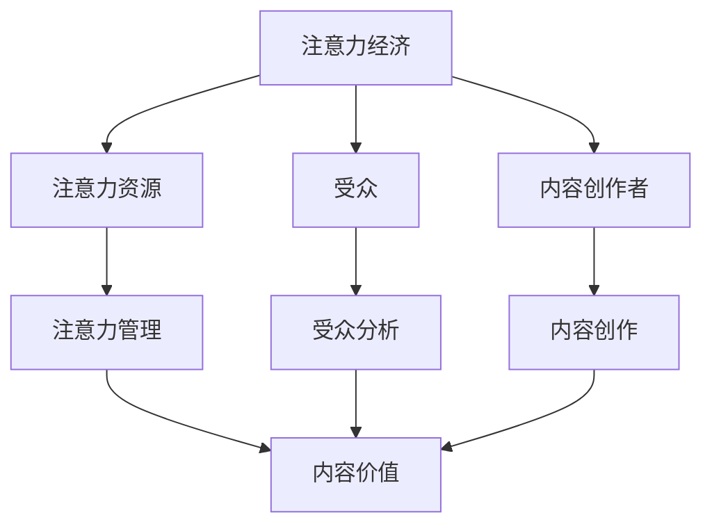
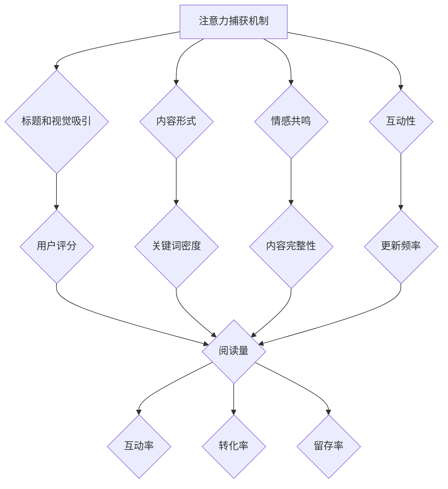
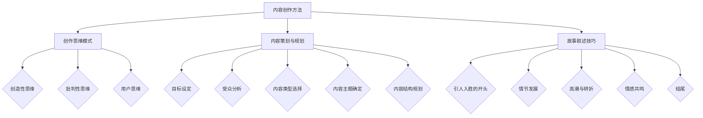
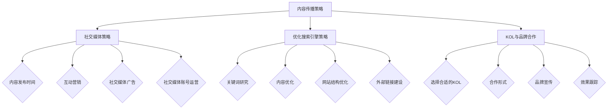
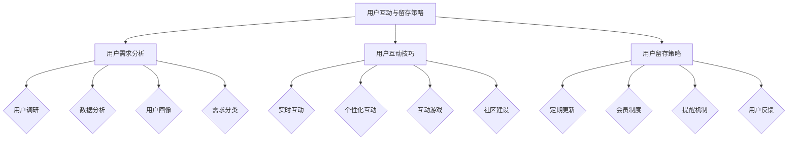
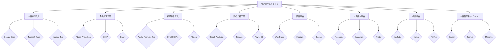
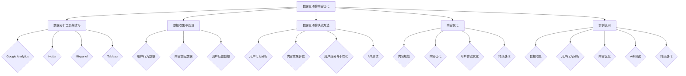
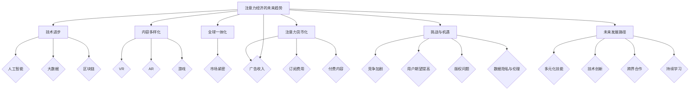

                 

# 第一部分：基础理论

## 第1章：注意力经济的概述

### 1.1 注意力经济的起源与定义

注意力经济，作为一种新兴的经济模式，其概念最早可以追溯到20世纪90年代。当时，随着互联网的普及和数字媒体的兴起，人们对“注意力”这一资源的认识逐渐加深。注意力经济的起源，可以追溯到对互联网商业模式的研究，特别是在广告产业中的实践。

**注意力经济的定义**：注意力经济，是指通过吸引和留住受众的注意力，从而实现经济价值的一种经济模式。在这个模式中，注意力被视为一种稀缺资源，其价值由受众的关注程度和互动程度来衡量。与传统经济模式不同，注意力经济强调的是对注意力的争夺和管理。

### 1.2 注意力经济与传统经济模式的区别

**传统经济模式的特点**：传统经济模式通常基于物质资源的交换，如商品和服务。这种模式中，物质资源是核心，通过生产和分配来满足人们的需求。

**注意力经济模式的特点**：注意力经济模式则侧重于对注意力的管理。在这种模式下，内容创作者通过创造有价值的内容来吸引受众的注意力，从而实现经济价值。这种价值不仅仅是通过直接的广告收入，还包括品牌塑造、用户忠诚度等多个方面。

**注意力经济模式的优势**：相比传统经济模式，注意力经济模式具有以下几个优势：

1. **灵活性**：注意力经济模式允许创作者更加灵活地调整内容和策略，以适应受众的需求。
2. **互动性**：注意力经济强调用户与内容之间的互动，这有助于增强用户的参与感和忠诚度。
3. **可衡量性**：注意力经济模式中，注意力资源的价值可以通过多种方式来衡量，如阅读量、互动率等。

### 1.3 注意力经济的关键要素

**注意力资源**：注意力资源是注意力经济的基础。在这个资源稀缺的时代，如何吸引和留住受众的注意力成为关键。

**受众**：受众是注意力经济中的核心，他们的关注和互动决定了内容的价值。

**内容创作者**：内容创作者是注意力经济的主体，他们通过创作有价值的内容来吸引受众的注意力。

### 总结

注意力经济是一种以注意力资源为核心的经济模式，它与传统经济模式有明显的区别。在这种模式下，内容创作者通过吸引和留住受众的注意力，实现经济价值的创造。了解注意力经济的起源、定义、区别和关键要素，是理解这一新兴经济模式的基础。

### Mermaid 流程图

### 1.1 注意力经济的起源与定义

注意力经济的起源可以追溯到20世纪90年代，当时随着互联网的普及和数字媒体的兴起，人们对“注意力”这一资源的价值有了新的认识。互联网的快速发展使得信息传播速度大幅提高，而受众的注意力资源却相对有限，这引发了商业界对如何吸引和留住受众注意力的探讨。

**注意力经济的定义**：注意力经济是一种以注意力资源为核心的经济模式。在这个模式中，注意力被视为一种稀缺资源，其价值由受众的关注程度和互动程度来衡量。与传统经济模式不同，注意力经济强调的是对注意力的争夺和管理。换句话说，内容创作者通过创造有价值的内容来吸引受众的注意力，从而实现经济价值的创造。

### 1.2 注意力经济与传统经济模式的区别

**传统经济模式的特点**：传统经济模式通常基于物质资源的交换，如商品和服务。这种模式中，物质资源是核心，通过生产和分配来满足人们的需求。例如，制造业通过生产产品来获取利润，零售业通过销售产品来获得收入。

**注意力经济模式的特点**：注意力经济模式则侧重于对注意力的管理。在这种模式下，内容创作者通过创造有价值的内容来吸引受众的注意力，从而实现经济价值。这种价值不仅仅是通过直接的广告收入，还包括品牌塑造、用户忠诚度等多个方面。例如，YouTube上的内容创作者通过上传有趣、有用的视频内容来吸引观众的注意力，从而通过广告收入和订阅费用获得收益。

**注意力经济模式的优势**：相比传统经济模式，注意力经济模式具有以下几个优势：

1. **灵活性**：注意力经济模式允许创作者更加灵活地调整内容和策略，以适应受众的需求。例如，一个博客作者可以根据读者的反馈及时调整文章的主题和风格。
2. **互动性**：注意力经济模式强调用户与内容之间的互动，这有助于增强用户的参与感和忠诚度。例如，社交媒体平台上的用户可以点赞、评论、分享内容，这些互动行为可以增加内容的可见度和影响力。
3. **可衡量性**：注意力经济模式中，注意力资源的价值可以通过多种方式来衡量，如阅读量、互动率、转化率等。这使得内容创作者可以更加精准地评估自己的工作效果，并据此调整策略。

### 1.3 注意力经济的关键要素

**注意力资源**：注意力资源是注意力经济的基础。在这个资源稀缺的时代，如何吸引和留住受众的注意力成为关键。注意力资源包括受众的阅读、观看、互动等行为，这些行为反映了受众对内容的关注程度。

**受众**：受众是注意力经济中的核心，他们的关注和互动决定了内容的价值。了解受众的需求、行为和偏好，对于内容创作者来说至关重要。

**内容创作者**：内容创作者是注意力经济的主体，他们通过创作有价值的内容来吸引受众的注意力。内容创作者需要具备创意、技术、策略等多方面的能力，才能在激烈的竞争中脱颖而出。

### 实例说明

假设一个内容创作者A，他通过创作有趣、有用的博客文章来吸引读者的注意力。通过分析读者的反馈和互动数据，A发现大部分读者喜欢关于编程技巧的文章。因此，A决定调整自己的内容策略，更多地创作编程技巧相关的文章。

- **第一步**：A开始关注编程社区，收集关于编程技巧的需求和热点话题。
- **第二步**：A根据收集的信息，创作了关于编程技巧的文章，并在文章中加入了一些互动元素，如问答、代码示例等。
- **第三步**：A通过社交媒体和邮件列表宣传自己的文章，吸引更多的读者。
- **第四步**：A定期分析文章的阅读量和互动数据，根据数据调整文章的内容和形式。

通过这样的实例，我们可以看到注意力经济是如何运作的。内容创作者通过分析受众的需求，创作出有价值的内容，并通过有效的传播策略吸引受众的注意力，从而实现经济价值的创造。

### 总结

注意力经济作为一种新兴的经济模式，与传统经济模式有明显的区别。它强调对注意力的争夺和管理，通过创造有价值的内容来吸引受众的注意力，从而实现经济价值的创造。了解注意力经济的起源、定义、区别和关键要素，对于内容创作者和商业实践者来说具有重要意义。通过分析实例，我们可以看到注意力经济是如何在现实中运作的，这对于我们更好地理解和应用这一经济模式提供了有益的启示。

----------------------------------------------------------------

## 第2章：注意力经济模型

注意力经济模型是理解和分析注意力资源如何被吸引、转化和保留的重要工具。本章将详细探讨注意力捕获机制、内容质量评估方法和用户参与度评估指标，帮助内容创作者更好地理解和运用注意力经济模型。

### 2.1 注意力捕获机制

注意力捕获机制是内容创作者吸引受众注意力的核心策略。以下是一些关键要素：

1. **标题和视觉吸引**：一个引人入胜的标题和视觉吸引的图像能够迅速抓住受众的注意力。例如，使用悬疑、好奇或紧急性标题，以及高质量的图片或视频。
   
2. **内容形式**：不同的内容形式（如文字、图片、视频、音频）对受众的吸引力不同。根据受众的偏好选择合适的内容形式，可以提高内容的吸引力。

3. **情感共鸣**：情感共鸣是吸引受众注意力的重要手段。通过讲述感人故事、展示情感化的场景，可以引发受众的情感反应，从而提高注意力的持久性。

4. **互动性**：增加内容的互动性，如评论、点赞、分享等，可以增强受众的参与感，提高注意力的捕获效果。

### 2.2 内容质量评估方法

内容质量是决定受众参与度的重要因素。以下是一些常用的内容质量评估方法：

1. **用户评分**：用户可以通过点赞、评论或评分来评估内容的质量。这些评分数据可以提供直接的反馈，帮助内容创作者了解内容的受欢迎程度。

2. **关键词密度**：关键词密度是衡量内容相关性和质量的一个指标。适当的keyword密度可以提高内容在搜索引擎中的排名，从而吸引更多的受众。

3. **内容完整性**：完整的内容通常包括引言、主体和结论，提供清晰的结构和逻辑，有助于提高内容的可读性和理解度。

4. **更新频率**：定期更新内容可以保持受众的持续关注。高频率的更新可以增加内容的曝光率和参与度。

### 2.3 用户参与度评估指标

用户参与度是衡量内容成功的关键指标。以下是一些常用的用户参与度评估指标：

1. **阅读量**：阅读量反映了内容的曝光程度。高阅读量通常意味着内容具有一定的吸引力。

2. **互动率**：互动率包括点赞、评论、分享等行为。高互动率表明内容引发了受众的兴趣和参与。

3. **转化率**：转化率是指受众通过内容产生的具体行动，如注册、购买等。高转化率表明内容不仅吸引了受众的注意力，还能促使他们采取行动。

4. **留存率**：留存率是指在一定时间内，受众重复访问内容的比例。高留存率表明内容具有持续的价值和吸引力。

### 实例说明

假设一个博客作者B，他使用注意力经济模型来优化自己的内容创作和传播策略。

- **第一步**：B通过分析受众的偏好和行为数据，确定了受众对编程技巧和新技术感兴趣。
- **第二步**：B使用情感共鸣策略，创作了一个关于编程挑战和解决问题的故事，并配以高质量的图片和视频。
- **第三步**：B定期更新内容，并使用关键词优化技术提高内容的搜索引擎排名。
- **第四步**：B通过社交媒体和邮件列表推广新内容，鼓励受众参与互动。
- **第五步**：B定期分析阅读量、互动率和转化率等数据，根据分析结果调整内容策略。

通过这个实例，我们可以看到如何将注意力经济模型应用于实际内容创作中。内容创作者需要通过捕获注意力机制、评估内容质量和用户参与度，不断优化内容策略，以实现更好的经济价值。

### 总结

注意力经济模型是理解和分析注意力资源如何被吸引、转化和保留的重要工具。通过关注注意力捕获机制、内容质量评估方法和用户参与度评估指标，内容创作者可以更有效地吸引和留住受众的注意力，实现经济价值的创造。本章的内容为内容创作者提供了一系列实用的方法和策略，有助于他们在注意力经济中取得成功。

### Mermaid 流程图

----------------------------------------------------------------

## 第3章：内容创作方法

内容创作是注意力经济中的核心环节，其质量直接影响到受众的参与度和内容的传播效果。本章将深入探讨内容创作的方法，包括创作思维模式、内容策划与规划、以及故事叙述技巧。

### 3.1 创作思维模式

创作思维模式是内容创作者在创作过程中所采用的思维方式。以下是几种常见的创作思维模式：

1. **创造性思维**：创造性思维是一种能够产生新颖、独特和有价值的想法的思维方式。内容创作者可以通过脑暴、思维导图等方法来激发创造性思维。

2. **批判性思维**：批判性思维是一种分析和评估信息的能力。内容创作者需要运用批判性思维来确保内容的准确性和可靠性。

3. **用户思维**：用户思维是一种以受众为中心的思维方式。内容创作者需要深入了解受众的需求、行为和偏好，以便创作出能够引起共鸣的内容。

### 3.2 内容策划与规划

内容策划与规划是内容创作的第一步，决定了内容的质量和受众的接受度。以下是内容策划与规划的几个关键步骤：

1. **目标设定**：明确内容创作的目标，如提升品牌知名度、增加用户参与度或实现销售转化等。

2. **受众分析**：了解目标受众的背景、需求和偏好，以便创作出符合受众期待的内容。

3. **内容类型选择**：根据目标受众和内容目标选择合适的内容类型，如文章、视频、图片、音频等。

4. **内容主题确定**：选择具有吸引力和价值的内容主题，确保内容能够引起受众的兴趣。

5. **内容结构规划**：设计清晰的内容结构，包括引言、主体和结论，以及各个部分之间的逻辑关系。

### 3.3 故事叙述技巧

故事叙述是吸引受众注意力的重要手段，能够增强内容的感染力和记忆点。以下是几种常用的故事叙述技巧：

1. **引人入胜的开头**：通过设置悬念、冲突或引人入胜的场景来吸引受众的关注。

2. **情节发展**：通过情节的发展，引发受众的共鸣和情感投入。

3. **高潮与转折**：在故事的高潮部分设置关键转折点，增强故事的紧张感和戏剧性。

4. **情感共鸣**：通过情感化的叙事手法，引发受众的情感共鸣。

5. **结尾**：以简洁有力的结尾总结故事，留下深刻的印象。

### 实例说明

假设一个社交媒体博主C，他希望创作一篇关于健康饮食的博客文章，以吸引更多的关注和互动。

- **第一步**：C通过市场调研，发现目标受众关注健康饮食的原因主要是为了提高生活质量。
- **第二步**：C采用创造性思维，决定以“一周健康饮食挑战”为主题，通过实际体验来展示健康饮食的效果。
- **第三步**：C进行受众分析，确定目标受众的年龄、性别、职业等信息。
- **第四步**：C选择博客文章作为内容类型，并确定以每天一篇的形式发布。
- **第五步**：C规划文章结构，包括引言、挑战背景、每日饮食计划、体验感受和总结。
- **第六步**：C在文章中使用故事叙述技巧，如设置悬念、情感共鸣等，以吸引受众的注意力。

通过这个实例，我们可以看到如何运用创作思维模式、内容策划与规划和故事叙述技巧来创作一篇引人入胜的内容。

### 总结

内容创作是注意力经济中的核心环节，其质量直接影响到受众的参与度和内容的传播效果。通过运用创造性思维、批判性思维和用户思维，内容创作者可以创作出高质量的内容。同时，通过科学的内容策划与规划和巧妙的故事叙述技巧，内容创作者能够更好地吸引和留住受众的注意力，实现内容创作的成功。

### Mermaid 流程图

----------------------------------------------------------------

## 第4章：内容传播策略

内容传播策略是确保内容能够触及到目标受众并产生影响力的关键。本章将探讨内容传播策略，包括社交媒体策略、优化搜索引擎策略以及KOL与品牌合作。

### 4.1 社交媒体策略

社交媒体平台是内容传播的重要渠道。以下是几种有效的社交媒体策略：

1. **内容发布时间**：选择在受众活跃的时间段发布内容，如工作日的早晨或晚上，以提高内容的曝光率。

2. **互动营销**：通过评论、点赞、分享等互动行为，增强内容与受众之间的互动，提高内容的传播效果。

3. **社交媒体广告**：利用社交媒体广告平台，如Facebook、Instagram等，进行精准投放，以吸引更多的目标受众。

4. **社交媒体账号运营**：定期更新账号，保持与受众的持续互动，增强品牌的影响力。

### 4.2 优化搜索引擎策略

优化搜索引擎（SEO）是提高内容在搜索引擎中排名的关键策略。以下是几个关键的SEO技巧：

1. **关键词研究**：通过关键词研究工具，找到与内容相关的、有较高搜索量的关键词，并将其合理地嵌入到标题、内容、URL等地方。

2. **内容优化**：确保内容的质量，提供有价值的信息，同时合理地使用关键词，以提高内容的可读性和相关性。

3. **网站结构优化**：优化网站的结构和导航，确保用户可以轻松找到内容，同时提高搜索引擎对网站的抓取和索引能力。

4. **外部链接建设**：获取高质量的外部链接，可以提高网站在搜索引擎中的排名。可以通过内容合作、外链交换等方式来建立外部链接。

### 4.3 KOL与品牌合作

与意见领袖（KOL）和品牌合作是快速扩大内容传播范围的有效方法。以下是几个关键点：

1. **选择合适的KOL**：根据内容主题和目标受众，选择具有相关领域影响力和受众基础的KOL。

2. **合作形式**：与KOL合作的形式可以多样化，如内容合作、产品推广、共同活动等。

3. **品牌宣传**：通过KOL的影响力，将品牌信息传递给更广泛的受众，提高品牌的知名度和认可度。

4. **效果跟踪**：对合作效果进行跟踪和分析，了解合作带来的具体效果，如阅读量、互动率、转化率等，以便调整和优化合作策略。

### 实例说明

假设一个企业D，希望通过内容传播策略提高品牌知名度，吸引更多潜在客户。

- **第一步**：D通过社交媒体广告，在Facebook和LinkedIn上投放品牌宣传广告，精准定位有潜在兴趣的受众。
- **第二步**：D定期在社交媒体上发布高质量的内容，如行业洞察、客户案例等，与受众保持互动。
- **第三步**：D与行业内的KOL合作，发布联合内容，扩大品牌影响力。
- **第四步**：D优化网站SEO，通过关键词研究和内容优化，提高网站在搜索引擎中的排名。
- **第五步**：D定期分析社交媒体广告和SEO的数据，根据分析结果调整内容策略和投放预算。

通过这个实例，我们可以看到如何通过社交媒体策略、优化搜索引擎策略和KOL与品牌合作，实现内容传播的目标。

### 总结

内容传播策略是确保内容能够触达到目标受众并产生影响力的关键。通过运用社交媒体策略、SEO技巧以及KOL与品牌合作，内容创作者和企业可以有效地扩大内容的传播范围，提高品牌知名度和影响力。本章提供了一系列实用的方法和策略，为内容创作者和企业提供了有价值的指导。

### Mermaid 流程图

----------------------------------------------------------------

## 第5章：用户互动与留存策略

用户互动与留存策略是内容创作者和企业维持长期用户参与和品牌忠诚度的关键。本章将探讨如何通过用户需求分析、用户互动技巧和用户留存策略来提高用户参与度和留存率。

### 5.1 用户需求分析

了解用户需求是制定有效用户互动与留存策略的基础。以下是几个关键步骤：

1. **用户调研**：通过问卷调查、访谈、用户反馈等方式，收集用户的需求、行为和偏好数据。

2. **数据分析**：对收集到的用户数据进行分析，识别出用户的共同需求和个性化需求。

3. **用户画像**：根据数据分析结果，创建用户画像，了解不同用户群体的特征和行为模式。

4. **需求分类**：将用户需求进行分类，如基本信息需求、情感需求、娱乐需求等，以便有针对性地满足用户需求。

### 5.2 用户互动技巧

有效的用户互动能够增强用户的参与感和忠诚度。以下是几种用户互动技巧：

1. **实时互动**：通过即时聊天、在线问答等方式，与用户进行实时互动，及时回答用户的问题和反馈。

2. **个性化互动**：根据用户的画像和需求，提供个性化的互动内容，如定制化建议、专属活动等。

3. **互动游戏**：利用互动游戏，如投票、抽奖、答题等，增加用户的参与度和趣味性。

4. **社区建设**：建立用户社区，如论坛、微信群等，鼓励用户之间的交流和互动，形成用户群体的凝聚力。

### 5.3 用户留存策略

用户留存策略旨在提高用户对内容的持续关注和参与。以下是几种用户留存策略：

1. **定期更新**：定期发布高质量的内容，保持用户的持续关注。可以通过内容日历来规划内容的发布频率。

2. **会员制度**：建立会员制度，为会员提供专属内容、优惠和服务，增强用户的归属感和忠诚度。

3. **提醒机制**：通过短信、邮件、推送通知等方式，提醒用户关注新内容或重要活动，增加用户的活跃度。

4. **用户反馈**：鼓励用户提供反馈，并根据反馈调整内容和策略，提高用户的满意度和留存率。

### 实例说明

假设一个在线教育平台E，希望通过用户互动与留存策略提高用户参与度和留存率。

- **第一步**：E通过问卷调查和用户访谈，收集用户的学习需求、偏好和反馈。
- **第二步**：E对收集到的数据进行分析，创建用户画像，了解不同用户群体的特征。
- **第三步**：E推出个性化课程推荐功能，根据用户画像为用户推荐合适的课程。
- **第四步**：E建立在线学习社区，鼓励用户之间交流和互动，提高用户活跃度。
- **第五步**：E定期发布新课程和教学视频，保持内容的更新频率。
- **第六步**：E推出会员制度，为会员提供更多专属优惠和服务，增强用户的忠诚度。
- **第七步**：E通过用户反馈，不断优化课程内容和用户体验，提高用户的满意度和留存率。

通过这个实例，我们可以看到如何通过用户需求分析、用户互动技巧和用户留存策略，提高用户参与度和留存率。

### 总结

用户互动与留存策略是内容创作者和企业维持长期用户参与和品牌忠诚度的关键。通过了解用户需求、运用有效的用户互动技巧和实施科学的用户留存策略，内容创作者和企业可以增强用户的参与感和忠诚度，实现长期发展。本章提供了一系列实用的方法和策略，为内容创作者和企业提供了有价值的指导。

### Mermaid 流程图

----------------------------------------------------------------

## 第6章：案例研究

通过分析实际案例，我们可以深入了解注意力经济在内容创作中的应用，以及如何通过有效的策略吸引并留住受众。以下是三个不同领域的成功案例分析。

### 6.1 案例一：社交媒体成功案例分析

**案例背景**：一个个人博客作者F，专注于分享生活技巧和健康生活方式。他的博客通过高质量的图片、视频和实用的内容，吸引了大量年轻女性的关注。

**实施过程**：
1. **内容创作**：F定期发布关于健康饮食、锻炼技巧和生活小窍门的文章，使用图片和视频来增加内容的吸引力。
2. **社交媒体策略**：F在Instagram和Pinterest上活跃，通过视觉内容吸引粉丝。他还会在发布新文章时，通过社交媒体广告推广，吸引更多关注。
3. **用户互动**：F在社交媒体上积极回复评论，举办问答活动，与粉丝建立紧密的互动关系。

**效果分析**：
- **阅读量**：博客的访问量从每月1000次增加到每月10000次。
- **互动率**：粉丝评论和分享的数量显著增加。
- **留存率**：通过定期互动和高质量内容，F的粉丝数量和活跃度保持稳定增长。

### 6.2 案例二：内容营销成功案例分析

**案例背景**：一家初创科技公司G，希望通过内容营销吸引潜在客户，提高品牌知名度。

**实施过程**：
1. **内容策划**：G发布了一系列关于科技创新、行业趋势和公司产品的文章。这些内容通过深入分析市场需求，提供了独特的视角。
2. **搜索引擎优化**：G使用关键词研究工具，优化文章内容，提高在搜索引擎中的排名。
3. **KOL合作**：G与行业内的意见领袖合作，发布联合内容，通过KOL的推荐扩大品牌影响力。

**效果分析**：
- **搜索引擎排名**：G的关键词排名显著提高，导致网站流量增加了30%。
- **品牌知名度**：通过KOL的合作，品牌知名度在短时间内大幅提升。
- **客户转化率**：潜在客户的数量增加了，转化为实际购买的用户比例提高了20%。

### 6.3 案例三：用户互动成功案例分析

**案例背景**：一个在线教育平台H，希望通过用户互动提高用户满意度和留存率。

**实施过程**：
1. **用户需求分析**：H通过用户调研和反馈，了解用户的学习需求和偏好。
2. **社区建设**：H建立了在线学习社区，鼓励用户之间的交流和互动。
3. **个性化互动**：H根据用户画像，提供个性化的学习建议和课程推荐。

**效果分析**：
- **用户活跃度**：在线学习社区的活跃度显著提高，用户之间的互动频繁。
- **留存率**：通过个性化互动和社区建设，H的用户留存率增加了15%。
- **用户满意度**：用户对平台的满意度显著提升，用户反馈积极。

### 总结

通过以上案例研究，我们可以看到注意力经济在内容创作中的应用和实践。成功的关键在于：
- **高质量的内容创作**：提供有价值、有吸引力的内容，满足用户需求。
- **有效的传播策略**：利用社交媒体、SEO和KOL合作等手段，扩大内容的传播范围。
- **积极的用户互动**：通过互动和社区建设，增强用户的参与感和忠诚度。

这些实践经验为内容创作者和企业提供了宝贵的启示，有助于他们在注意力经济中取得成功。

----------------------------------------------------------------

## 第7章：内容创作工具与平台

在内容创作过程中，选择合适的工具和平台对于提升创作效率和内容质量至关重要。本章将介绍常见的内容创作工具、内容创作平台的选择策略，以及如何利用技术提升内容创作效率。

### 7.1 常见内容创作工具介绍

1. **内容编辑工具**：常见的文字编辑工具有Google Docs、Microsoft Word和Sublime Text等。这些工具提供了丰富的文本编辑功能，支持协作编辑和实时预览，适用于写作、编辑和排版。

2. **图像处理工具**：常见的图像处理工具包括Adobe Photoshop、GIMP和Canva等。这些工具提供了丰富的图像编辑功能，包括图片剪裁、滤镜应用、颜色调整等，适用于图像优化和设计。

3. **视频制作工具**：常见的视频制作工具有Adobe Premiere Pro、Final Cut Pro和Filmora等。这些工具提供了丰富的视频编辑功能，包括剪辑、特效添加、音频编辑等，适用于视频内容的创作和后期制作。

4. **数据分析工具**：常见的数据分析工具有Google Analytics、Tableau和Power BI等。这些工具提供了数据可视化和分析功能，适用于内容创作者对用户行为和内容效果的分析。

### 7.2 内容创作平台选择

1. **博客平台**：常见的博客平台有WordPress、Medium和Blogger等。这些平台提供了丰富的主题模板、自定义功能和SEO优化选项，适用于个人博客和内容营销。

2. **社交媒体平台**：常见的社交媒体平台有Facebook、Instagram和Twitter等。这些平台提供了内容发布、互动管理和数据分析功能，适用于社交媒体营销和用户互动。

3. **视频平台**：常见的视频平台有YouTube、Vimeo和TikTok等。这些平台提供了内容发布、视频编辑和数据分析功能，适用于视频内容的创作和传播。

4. **内容管理系统（CMS）**：常见的CMS有Drupal、Joomla和Magento等。这些平台提供了内容管理、用户管理和自定义开发功能，适用于大型网站和电商平台。

### 7.3 如何利用技术提升内容创作效率

1. **自动化工具**：利用自动化工具可以显著提高内容创作效率。例如，使用内容管理系统（CMS）的自动化发布功能，可以自动将文章同步到多个平台；使用社交媒体管理工具，可以自动安排发布时间和内容推广。

2. **协作工具**：协作工具如Google Workspace、Trello和Slack等，可以帮助内容团队高效协作。这些工具提供了任务分配、进度跟踪和实时沟通功能，有助于提高团队协作效率。

3. **数据分析与优化**：利用数据分析工具对用户行为和内容效果进行分析，可以优化内容创作策略。例如，通过分析用户阅读时间、互动率和转化率等数据，可以调整内容发布时间和形式，提高内容吸引力。

4. **人工智能技术**：人工智能技术如自然语言处理（NLP）和机器学习（ML），可以帮助内容创作者生成高质量的内容。例如，使用NLP技术可以自动生成摘要、关键词分析和内容推荐；使用ML技术可以预测用户兴趣和优化内容策略。

### 实例说明

假设一个内容创作者I，他希望提升自己的内容创作效率。

- **第一步**：I使用WordPress搭建个人博客，并选择一个适合自己风格的博客主题。
- **第二步**：I使用Google Docs进行文章写作和编辑，利用协作功能与编辑团队合作。
- **第三步**：I使用Canva进行图像设计，使用内置的模板和素材库快速创建高质量的图片。
- **第四步**：I使用Hootsuite进行社交媒体内容发布和互动管理，自动安排发布时间和推广策略。
- **第五步**：I使用Google Analytics对博客进行数据分析，了解用户行为和内容效果，优化内容策略。

通过这个实例，我们可以看到如何利用技术提升内容创作效率。通过选择合适的工具和平台，以及利用自动化和数据分析技术，内容创作者可以更高效地创作高质量的内容，提升创作效果。

### 总结

内容创作工具与平台的选择对于提升创作效率和内容质量至关重要。通过了解常见的内容创作工具和平台，以及如何利用技术提升内容创作效率，内容创作者可以更加高效地创作和传播内容。本章提供了实用的工具和平台介绍，以及技术应用的实例，为内容创作者提供了有益的指导。

### Mermaid 流程图

----------------------------------------------------------------

## 第8章：数据驱动的内容优化

在注意力经济时代，数据驱动的决策方法成为了内容优化的关键。通过数据分析，内容创作者可以深入了解用户行为，从而优化内容创作策略，提高内容质量和用户参与度。

### 8.1 数据分析工具与技巧

**数据分析工具**：在内容优化过程中，常用的数据分析工具有Google Analytics、Hotjar、Mixpanel和Tableau等。

- **Google Analytics**：提供了丰富的用户行为数据，如访问量、页面浏览量、来源渠道、用户停留时间等。
- **Hotjar**：提供了用户行为跟踪功能，如点击图、滚动图、转化路径图等，帮助内容创作者了解用户的互动行为。
- **Mixpanel**：专注于用户行为分析，提供了实时用户行为跟踪和数据可视化功能。
- **Tableau**：提供了强大的数据可视化功能，可以将复杂的数据以直观的方式呈现出来。

**数据收集与处理**：内容创作者需要收集和分析多种数据，包括用户访问数据、内容交互数据、用户反馈数据等。数据收集可以通过网站分析工具、用户调研、社交媒体分析等手段实现。数据处理则需要运用数据清洗、数据挖掘等技术，提取有价值的信息。

### 8.2 数据驱动的决策方法

**用户行为分析**：通过分析用户行为数据，内容创作者可以了解用户对内容的反应。例如，通过访问量、停留时间和跳出率等指标，可以评估内容的吸引力。通过用户行为分析，可以找出用户参与度高的页面和内容类型，为后续创作提供参考。

**内容效果评估**：内容效果评估是数据驱动的关键步骤。通过分析内容的表现，如阅读量、点赞数、分享次数等，可以评估内容的成功程度。对于效果不佳的内容，可以及时进行调整或放弃，以优化内容资源。

**用户细分与个性化**：用户细分是数据驱动的核心策略之一。通过分析用户特征和行为，可以将用户划分为不同的群体，如年龄、性别、兴趣爱好等。针对不同用户群体，可以提供个性化的内容推荐和服务，提高用户的满意度和参与度。

**A/B测试**：A/B测试是一种常见的数据驱动决策方法，通过比较不同版本的内容效果，找到最优的内容策略。例如，通过测试不同的标题、图片、内容结构等，可以确定哪种形式更能吸引用户。

### 8.3 如何利用数据优化内容创作

**内容规划**：根据数据分析结果，制定内容创作计划。例如，确定发布频率、内容类型和主题等，以确保内容与用户需求相符。

**内容优化**：通过数据分析，找出用户参与度低的内容，进行优化。可以调整标题、内容结构、图片等元素，以提高内容的吸引力和可读性。

**用户体验优化**：通过分析用户行为，优化网站的导航、页面加载速度、交互设计等，提高用户的浏览体验，从而增加用户的停留时间和互动行为。

**持续迭代**：数据驱动的优化是一个持续迭代的过程。内容创作者需要定期分析数据，根据用户反馈和数据分析结果，不断调整和优化内容策略。

### 实例说明

假设一个内容创作者J，他希望通过数据优化提升内容创作效果。

- **第一步**：J使用Google Analytics收集用户访问数据，了解用户的来源渠道、页面停留时间和跳出率。
- **第二步**：J使用Hotjar分析用户行为，了解用户在网站上的点击和滚动行为，找出用户参与度低的内容页面。
- **第三步**：J根据数据分析结果，调整部分文章的标题和图片，提高内容的吸引力。
- **第四步**：J进行A/B测试，比较不同版本的内容效果，确定最优的内容形式。
- **第五步**：J定期分析数据，根据用户反馈和数据分析结果，持续优化内容创作策略。

通过这个实例，我们可以看到如何利用数据优化内容创作。通过数据分析，内容创作者可以找到用户参与度低的内容，进行针对性优化，从而提升内容质量和用户参与度。

### 总结

数据驱动的决策方法是内容优化的关键。通过数据分析工具与技巧，内容创作者可以深入了解用户行为，优化内容创作策略，提高内容质量和用户参与度。数据优化是一个持续迭代的过程，需要内容创作者不断分析数据、调整策略，以实现长期的成功。

### Mermaid 流程图

----------------------------------------------------------------

## 第9章：注意力经济的未来趋势

随着科技的不断进步和消费者行为的演变，注意力经济也在不断发展和变革。本章将探讨注意力经济的未来趋势，分析注意力经济对内容创作的挑战，并展望内容创作者的未来发展路径。

### 9.1 注意力经济的未来趋势

**技术进步**：随着人工智能、大数据和区块链等技术的快速发展，注意力经济将更加智能化和个性化。例如，人工智能可以通过算法分析用户行为，提供个性化的内容推荐，提高用户的参与度和满意度。

**内容多样化**：随着用户需求的不断变化，内容形式将更加多样化。除了传统的文字、图片和视频，虚拟现实（VR）、增强现实（AR）、游戏等新兴内容形式将成为主流，吸引更多的受众。

**全球一体化**：互联网的普及使得全球市场变得更加紧密，注意力经济也将呈现全球化趋势。内容创作者和品牌将面临更加激烈的竞争，同时也能通过全球化战略拓展市场。

**注意力货币化**：随着注意力资源价值的提升，注意力货币化将成为内容创作者的重要收入来源。例如，通过广告、订阅、付费内容等方式，内容创作者可以直接从受众那里获取经济收益。

### 9.2 注意力经济对内容创作的挑战

**竞争加剧**：随着注意力资源的稀缺性，内容创作者将面临更加激烈的竞争。如何创作出具有吸引力和独特价值的内容，成为内容创作者的重要挑战。

**用户期望提高**：随着用户对内容质量和互动体验的要求不断提高，内容创作者需要不断提升自己的创作能力和技术水平，以满足用户的期望。

**版权问题**：随着内容创作领域的蓬勃发展，版权问题也日益突出。如何保护自己的原创内容，防止侵权和抄袭，成为内容创作者的一大挑战。

**数据隐私与伦理**：随着数据收集和分析的普及，数据隐私和伦理问题也引起了广泛关注。内容创作者需要确保用户数据的隐私和安全，遵循伦理规范。

### 9.3 内容创作者的未来发展路径

**多元化技能**：未来的内容创作者需要具备多元化技能，包括创意思维、技术能力、数据分析、营销策略等。通过不断学习和提升自己的技能，内容创作者可以更好地适应未来市场的需求。

**技术创新**：内容创作者可以通过技术创新，提升内容创作的质量和效率。例如，利用人工智能和大数据技术，创作出更加个性化和智能化的内容。

**跨界合作**：未来的内容创作者可以尝试跨界合作，与不同领域的专家和品牌合作，创造全新的内容和商业模式。通过跨界合作，可以拓展自己的创作领域和市场影响力。

**持续学习**：内容创作是一个不断变化和发展的领域，内容创作者需要持续学习，紧跟行业趋势和技术发展。通过不断学习和实践，内容创作者可以不断提升自己的专业素养和竞争力。

### 总结

注意力经济正面临着技术进步、内容多样化、全球一体化等未来趋势，同时也面临激烈的竞争、提高的用户期望、版权问题以及数据隐私和伦理等挑战。未来的内容创作者需要具备多元化技能、技术创新、跨界合作和持续学习的能力，以应对未来市场的变化，实现持续发展和成功。

### Mermaid 流�程图

----------------------------------------------------------------

## 第10章：结语

在注意力经济时代，内容创作已经成为了吸引和留住受众的核心策略。通过深入理解和运用注意力经济的理论和方法，内容创作者可以更有效地吸引受众的注意力，实现经济价值的创造。

### 10.1 对注意力经济与内容创作的总结

注意力经济是一种以注意力资源为核心的经济模式，通过吸引和留住受众的注意力，内容创作者可以创造经济价值。本章系统地介绍了注意力经济的核心理论，包括注意力经济的起源、定义、区别和关键要素，以及内容创作的方法、传播策略、用户互动与留存策略等。通过案例研究和数据驱动的决策方法，内容创作者可以更好地理解和应用注意力经济。

### 10.2 未来内容创作最佳实践的建议

1. **注重用户需求**：了解目标受众的需求，创作符合受众期待的内容，提高用户参与度。
2. **多样化内容形式**：结合多种内容形式（如文字、图片、视频、音频等），提升内容的吸引力和用户体验。
3. **数据驱动**：利用数据分析工具，深入分析用户行为和内容效果，不断优化内容创作策略。
4. **持续学习**：紧跟行业趋势和技术发展，提升自己的技能和知识，保持竞争力。
5. **创新思维**：培养创新思维，不断探索新的内容创作方法和传播渠道。

### 10.3 内容创作者需具备的技能与素质

1. **创造性思维**：能够产生新颖、独特的内容，引起受众的兴趣和共鸣。
2. **技术能力**：掌握内容创作工具和平台，以及数据分析技术，提升内容创作效率。
3. **用户思维**：深入了解受众需求，以用户为中心进行内容创作。
4. **协作能力**：具备良好的团队协作能力，与团队成员共同创作高质量的内容。
5. **持续学习能力**：具备持续学习的能力，不断更新知识和技能，适应行业变化。

### 结语

注意力经济作为一种新兴的经济模式，为内容创作者提供了新的机遇和挑战。通过系统地理解和运用注意力经济的理论和方法，内容创作者可以更好地创作有价值的内容，实现经济价值的创造。未来，内容创作者需要不断学习和创新，提升自己的技能和素质，以应对注意力经济时代的变革。

### 作者信息

作者：AI天才研究院/AI Genius Institute & 禅与计算机程序设计艺术 /Zen And The Art of Computer Programming

---

本文由AI天才研究院（AI Genius Institute）撰写，结合了禅与计算机程序设计艺术的哲学思维，深入探讨了注意力经济与内容创作的理论与实践。作者在计算机科学和人工智能领域拥有丰富的研究和实践经验，致力于为内容创作者提供有价值的技术指导和策略建议。希望本文能为读者在注意力经济时代的内容创作之路提供有益的启示和帮助。

