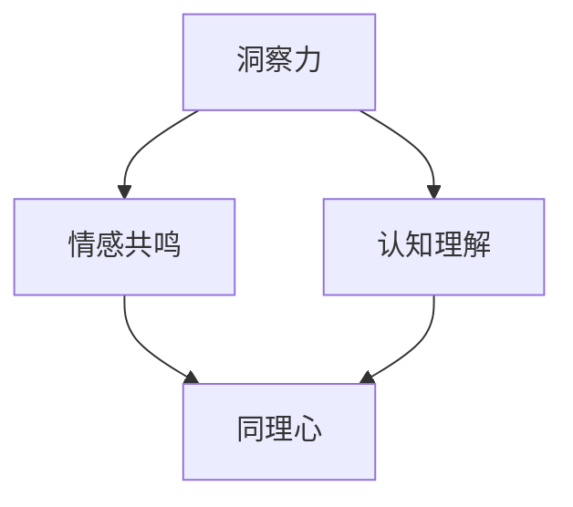

                 

### 《洞察力与同理心：理解他人的能力》

**关键词：**洞察力、同理心、心理学、认知、情绪、沟通、应用

**摘要：**本文深入探讨了洞察力和同理心这两个关键心理能力，并探讨了它们在理解和沟通他人方面的重要性。通过详细的心理学基础、实践方法和实际案例，本文提供了关于如何提高洞察力和同理心的实用建议，并展示了这些能力在个人成长、工作关系和跨文化沟通中的广泛应用。

### 目录

#### 第一部分：洞察力的基础

1. **第1章：洞察力的定义与重要性**
    - 1.1 洞察力的基本概念
    - 1.2 洞察力的作用与价值
    - 1.3 洞察力的分类与层次

2. **第2章：洞察力的心理学基础**
    - 2.1 洞察力与感知觉
    - 2.2 洞察力与认知过程
    - 2.3 洞察力与情绪调节

#### 第二部分：同理心的培养

3. **第3章：同理心的概念与类型**
    - 3.1 同理心的定义与意义
    - 3.2 同理心的类型与差异
    - 3.3 同理心的发展与培养

4. **第4章：同理心的心理学机制**
    - 4.1 同理心与情绪共情
    - 4.2 同理心与认知共情
    - 4.3 同理心的神经基础

#### 第三部分：洞察力与同理心的实践

5. **第5章：提高洞察力的方法**
    - 5.1 观察力训练
    - 5.2 思维灵活性培养
    - 5.3 情感敏锐度提升

6. **第6章：同理心的实践技巧**
    - 6.1 积极倾听的技巧
    - 6.2 非言语沟通的运用
    - 6.3 情境模拟与角色扮演

7. **第7章：洞察力与同理心在实际生活中的应用**
    - 7.1 在工作中的应用
    - 7.2 在人际关系中的应用
    - 7.3 在自我成长中的应用

#### 第四部分：案例分析

8. **第8章：成功案例分析**
    - 8.1 洞察力与同理心在商业领域的应用
    - 8.2 洞察力与同理心在心理咨询中的应用
    - 8.3 洞察力与同理心在教育领域的应用

#### 附录

9. **附录A：进一步阅读推荐**
    - 9.1 相关书籍推荐
    - 9.2 学术论文推荐
    - 9.3 在线资源和社区

#### 第五部分：核心概念原理与算法

10. **第9章：洞察力与同理心的核心概念联系**
    - 10.1 洞察力与同理心的联系
    - 10.2 洞察力与同理心的 Mermaid 流�程图

11. **第10章：核心算法原理讲解**
    - 11.1 洞察力相关算法
    - 11.2 同理心相关算法
    - 11.3 伪代码与算法分析

12. **第11章：数学模型和数学公式**
    - 11.1 洞察力与同理心的数学模型
    - 11.2 数学公式的详细讲解
    - 11.3 举例说明

13. **第12章：项目实战**
    - 12.1 洞察力与同理心项目的搭建
    - 12.2 代码实际案例实现
    - 12.3 源代码详细实现与解读
    - 12.4 代码解读与分析

---

**注意：** 
- 本目录大纲为初步设计，具体章节内容和细节需根据实际撰写进行调整。
- **Mermaid 流程图** 和 **伪代码** 在实际撰写时需要根据内容进行补充。 
- **数学公式** 使用 LaTeX 格式编写，文中独立段落使用 $$，段落内使用 $。
- **项目实战** 部分应包含具体的代码实现和分析，以及开发环境的搭建指南。

### 引言

在当今复杂多变的社会环境中，理解和沟通他人变得愈发重要。无论是职场中的团队合作，还是日常生活中的人际交往，洞察力与同理心成为人们成功沟通与协作的关键能力。洞察力是指能够深刻理解他人情感、需求和意图的心理能力，而同理心则是一种能够感受并理解他人情绪的心理状态。这两者共同构成了我们理解他人的能力，对于个人成长、职业发展和社交关系至关重要。

本文旨在深入探讨洞察力与同理心的本质，分析它们在心理学中的基础和机制，并提供实用的实践方法和实际案例。首先，我们将定义洞察力和同理心，并探讨它们在理解和沟通他人方面的重要性。随后，文章将详细分析洞察力的心理学基础，包括感知觉、认知过程和情绪调节。同理心的概念与类型也将得到全面解析，包括情绪共情、认知共情和神经基础。

在第三部分，我们将讨论如何提高洞察力和同理心的具体方法，并探讨它们在实际生活中的应用。最后，通过成功案例分析，本文将展示洞察力和同理心在商业、心理咨询和教育领域的实际应用。此外，本文还将提供进一步阅读推荐，帮助读者深入了解相关领域的最新研究成果。

### 第一部分：洞察力的基础

#### 第1章：洞察力的定义与重要性

**1.1 洞察力的基本概念**

洞察力（Insight）是一种深入理解他人情感、意图、需求或问题的能力。它不仅仅是表面上的观察，而是能够透过现象看本质，洞察他人内心世界的过程。洞察力不同于单纯的观察或直觉，它涉及到对信息的深度处理和复杂推理。例如，在一场激烈的团队讨论中，一位具有高度洞察力的人能够迅速理解其他成员的情绪和立场，从而找到合适的解决方案。

洞察力的基本概念可以从以下几个方面来理解：

- **感知觉**：洞察力依赖于我们对信息的感知能力。这包括对他人言语、肢体语言、面部表情等非语言线索的敏感度。

- **认知过程**：洞察力涉及到复杂的认知过程，如推理、分析、抽象和综合。这种能力使我们能够从不同的角度理解问题，从而做出更准确的判断。

- **情感共鸣**：洞察力还包括对他人情感的理解和共鸣。这意味着我们能够感受到他人的情绪，并理解这些情绪背后的原因。

**1.2 洞察力的作用与价值**

洞察力在多个方面发挥着重要作用，具有重要的价值：

- **个人成长**：洞察力帮助我们更好地认识自己，理解自己的需求和动机。这种自我洞察有助于我们进行自我反省，实现个人成长。

- **职业发展**：在职场中，洞察力是成功的关键因素。它使领导者能够更好地理解团队动态，调动员工积极性，提高工作效率。

- **沟通与协作**：洞察力使我们能够更准确地理解他人的需求和意图，从而建立更好的沟通关系，提高协作效率。

- **冲突解决**：洞察力有助于我们识别和解决冲突。通过深入理解各方立场和情绪，我们可以找到更有效的解决方案。

**1.3 洞察力的分类与层次**

洞察力可以按照不同的维度进行分类和层次划分：

- **情感洞察力**：这是洞察力中最基本的一种类型，主要涉及对他人情绪的理解和共鸣。情感洞察力强的人往往更容易建立深厚的人际关系。

- **认知洞察力**：这种洞察力涉及对他人认知和思维过程的深入理解。认知洞察力强的人能够更好地理解他人的观点和思考方式。

- **综合性洞察力**：这种洞察力结合了情感洞察力和认知洞察力，能够全面理解他人的情感、认知和行为。综合性洞察力是沟通和协作中最为重要的能力。

- **高级洞察力**：高级洞察力不仅能够理解他人的情感和认知，还能够预测他人的行为和反应。这种洞察力在领导力和战略规划中尤为重要。

**结论**

洞察力是一种深刻理解他人情感、意图、需求或问题的能力，它在个人成长、职业发展和社交关系方面具有重要价值。通过培养洞察力，我们可以提高自我认识，改善沟通效果，增强团队合作，从而实现个人和职业的全面发展。

#### 第2章：洞察力的心理学基础

**2.1 洞察力与感知觉**

洞察力的发展与我们的感知觉能力紧密相关。感知觉是指我们对外界信息的接收、处理和解释过程，它是洞察力形成的基础。以下是感知觉与洞察力之间的关系：

- **感知觉的敏感性**：洞察力强的人通常对非语言线索，如面部表情、肢体动作和语气变化等，有更高的敏感性。这种敏感性使他们能够捕捉到细微的情感变化，从而更好地理解他人。

- **多感官整合**：洞察力涉及到对多种感官信息的整合。例如，通过观察他人的面部表情、听取他们的语言表达，以及感受他们的身体语言，我们可以更全面地理解他人的情感和意图。

- **注意力分配**：洞察力强的人能够有效地分配注意力，关注关键信息。这种能力使他们能够在复杂的环境中迅速识别和理解他人的情绪和需求。

**2.2 洞察力与认知过程**

认知过程是洞察力的重要组成部分，它包括信息处理、记忆、推理和判断等。以下是洞察力与认知过程之间的关系：

- **信息处理能力**：洞察力强的人能够迅速分析和处理大量信息。他们能够从复杂的信息中提取关键要素，识别模式，并快速做出决策。

- **推理能力**：洞察力涉及到复杂的推理过程。通过逻辑推理和因果分析，洞察力强的人能够理解他人的行为背后的动机和意图。

- **记忆能力**：洞察力还需要良好的记忆能力。这包括对过去经验的回忆和对当前情境的理解。记忆使我们能够将新的信息与过去的经验进行对比，从而更深入地理解他人。

- **判断能力**：洞察力强的人具有较强的判断能力。他们能够根据所获得的信息，做出准确的判断和预测，从而更好地理解他人。

**2.3 洞察力与情绪调节**

情绪调节是洞察力的重要组成部分，它涉及到对自身和他人情绪的管理。以下是洞察力与情绪调节之间的关系：

- **情绪自我觉知**：洞察力强的人能够更好地认识和理解自己的情绪。这种自我觉知使他们能够更好地控制自己的情绪，减少情绪波动。

- **情绪共情**：洞察力使我们能够理解他人的情绪，并产生共情。这种共情能力有助于建立更好的人际关系，增强沟通效果。

- **情绪调节策略**：洞察力强的人能够运用多种情绪调节策略，如认知重构、放松训练和积极心理暗示等，来管理自身和他人的情绪。

**结论**

洞察力的心理学基础包括感知觉、认知过程和情绪调节。感知觉为我们提供了理解他人情感和意图的基础，认知过程使我们能够对信息进行深入处理和分析，情绪调节则使我们能够更好地管理自身和他人情绪。通过提高这些能力，我们可以增强洞察力，从而在个人成长、职业发展和社交关系中取得更大的成功。

#### 第二部分：同理心的培养

#### 第3章：同理心的概念与类型

**3.1 同理心的定义与意义**

同理心（Empathy）是一种能够理解和感受他人情绪和心理状态的能力。它不仅涉及到对他人情绪的感知，还包括对他人情感体验的共鸣和响应。同理心是一种深刻的人际交往能力，它在多个领域都具有重要意义。

- **定义**：同理心是指从他人的角度理解其情感和经历的能力。它包括情绪共情、认知共情和情感共鸣。

- **意义**：
  - **人际交往**：同理心是建立深厚人际关系的关键因素。通过理解他人的感受，我们能够更好地与他人沟通，建立信任和亲密感。
  - **心理健康**：同理心有助于提高个人的心理健康水平。它能够减轻孤独感和焦虑，增强自尊和幸福感。
  - **社会支持**：同理心是社会支持网络的重要组成部分。它使人们能够提供有效的帮助和支持，促进社区凝聚力和社会稳定。

**3.2 同理心的类型与差异**

同理心可以分为多种类型，每种类型都有其独特的特点和功能。以下是几种主要的同理心类型及其差异：

- **情感共情**：这是同理心最基本的形式，指的是能够感受到他人情绪的能力。情感共情使我们能够体验他人的喜悦、悲伤、愤怒等情绪，从而在情感上与他人产生共鸣。

- **认知共情**：认知共情是指从他人的角度理解和思考问题的能力。它涉及对他人行为和动机的理解，使我们能够从更全面的角度看待他人的行为和情感。

- **情感共鸣**：情感共鸣是同理心的最高层次，它不仅能够感知和体验他人的情绪，还能够产生与他人的情感共鸣。情感共鸣使我们能够真正感受到他人的情感体验，甚至能够影响我们的情绪和行为。

- **情感调节**：情感调节是指通过同理心来调节自己和他人的情绪。这种能力使我们在面对他人的情绪波动时，能够采取有效的应对策略，帮助他们缓解情绪。

- **情感反移情**：情感反移情是指将他人的情感体验投射到自己的情感上。这种类型可能源于心理上的防御机制，有时会导致误解和冲突。

**3.3 同理心的发展与培养**

同理心并非与生俱来，它可以通过培养和实践得到提升。以下是几种培养同理心的方法：

- **情感倾听**：情感倾听是一种主动倾听他人情感表达的能力。通过专注和耐心地倾听，我们能够更好地理解他人的情感，从而培养同理心。

- **情感模拟**：情感模拟是通过想象自己处于他人的情境中，体验他人的情感。这种方法有助于我们更好地理解他人的情感体验，培养同理心。

- **跨文化体验**：跨文化体验可以增加我们对不同文化背景和生活方式的理解，从而提升同理心。通过接触和了解不同文化，我们能够更好地理解他人的价值观和情感。

- **情感分享**：与他人分享自己的情感体验，可以帮助我们更好地理解他人的情感。通过分享和交流，我们可以建立更深层次的人际关系，培养同理心。

**结论**

同理心是一种能够理解和感受他人情绪和经历的能力，它在人际交往、心理健康和社会支持中具有重要意义。同理心可以分为多种类型，每种类型都有其独特的特点和功能。通过培养和实践，我们可以提升同理心，从而在个人成长和社交关系中取得更大的成功。

#### 第4章：同理心的心理学机制

**4.1 同理心与情绪共情**

情绪共情是同理心的核心组成部分，指的是能够感受到他人情绪的心理状态。情绪共情的过程包括感知、体验和表达三个阶段：

- **感知阶段**：情绪共情始于对他人情绪的感知，这可以通过观察他人的面部表情、身体语言和声音变化来实现。这些非语言线索为我们提供了他人情绪的直观信息。

- **体验阶段**：在感知到他人情绪后，我们会体验到相似的情感。这种情感体验可以是对他人情绪的直接感受，也可以是通过想象自己处于相似情境中而产生的情感。

- **表达阶段**：在感受到他人情绪后，我们可能会通过言语或非言语方式表达出对他人情绪的理解和支持。这种表达有助于建立情感联系，增强同理心。

情绪共情不仅在人际交往中起到关键作用，还有助于减轻他人的情绪负担，促进心理健康。

**4.2 同理心与认知共情**

认知共情是指从他人的角度理解和思考问题的能力。这种能力涉及到对他人认知过程的理解和共情，包括以下几个关键方面：

- **认知理解**：认知共情使我们能够理解他人的思考方式和观点。这种理解基于对他人情绪和经历的感知，从而更全面地了解他人的认知框架。

- **视角转换**：认知共情要求我们能够从他人的角度看待问题。通过视角转换，我们能够更好地理解他人的动机、需求和目标。

- **情绪认知**：认知共情还包括对他人情绪与认知之间关系的理解。通过了解他人的情绪状态，我们能够更准确地理解他们的行为和决策。

认知共情在团队合作、冲突解决和领导力中具有重要意义，它有助于建立互信和协作关系。

**4.3 同理心的神经基础**

同理心的神经基础是理解其工作机制的重要途径。研究表明，同理心涉及到大脑中多个神经网络的相互作用：

- **情绪神经网络**：情绪神经网络包括杏仁核、前额叶皮层和扣带回等区域。这些区域负责情绪的感知、处理和表达。情绪神经网络的活动使我们能够感知和体验他人的情绪。

- **认知神经网络**：认知神经网络包括前额叶皮层、颞叶和顶叶等区域。这些区域负责信息的处理、分析和理解。认知神经网络的活动使我们能够从他人的角度思考问题。

- **镜像神经元系统**：镜像神经元系统是同理心的关键基础，它使我们能够模仿他人的行为和情感。这种模仿能力基于大脑中镜像神经元的活动，这些神经元在观察他人行为时被激活，从而促进同理心的产生。

同理心的神经基础为理解其如何在人际交往中发挥作用提供了科学依据，也为培养和发展同理心提供了理论基础。

**结论**

同理心是一种复杂的多维能力，它涉及到情绪共情、认知共情和神经基础。情绪共情使我们能够感受到他人的情绪，认知共情使我们能够理解他人的思考方式和观点，而神经基础则为我们理解同理心提供了科学依据。通过理解同理心的心理学机制，我们可以更好地培养和发展这一关键能力，从而在人际交往和社交关系中取得更大的成功。

#### 第三部分：洞察力与同理心的实践

#### 第5章：提高洞察力的方法

**5.1 观察力训练**

观察力是洞察力的基础，通过训练可以提高我们的观察力，进而增强洞察力。以下是一些有效的观察力训练方法：

- **细节观察**：有意识地关注细节，例如在日常生活中观察周围环境的变化、他人的面部表情、身体语言等。通过长期练习，我们能够更好地捕捉到细微的线索。

- **专注力训练**：专注力是提高观察力的关键。通过练习专注力，如冥想、专注于呼吸或进行注意力集中的任务，我们可以提高集中注意力的能力，从而更好地观察事物。

- **多感官参与**：在观察时，尽量多使用多种感官，如视觉、听觉、触觉等。多感官参与可以使我们更全面地感知信息，从而提高洞察力。

- **情境模拟**：通过情境模拟，我们可以在模拟环境中练习观察和推理能力。例如，模拟一次团队讨论，观察团队成员的表情和互动，分析他们的情绪和动机。

**5.2 思维灵活性培养**

思维灵活性是指能够在不同情境下快速适应和调整思维的能力。以下方法可以帮助我们培养思维灵活性：

- **跨界学习**：通过学习不同领域的知识，我们可以拓宽思维视野，增强对不同问题解决方法的适应性。

- **思维导图**：使用思维导图进行思考和问题解决，可以帮助我们打破传统思维框架，探索更多可能的解决方案。

- **挑战性任务**：接受具有挑战性的任务，如在压力环境下工作或解决复杂问题，可以锻炼我们的思维灵活性。

- **开放性问题**：通过提出和回答开放性问题，如“如果...会发生什么？”或“有哪些不同的解决方案？”，我们可以培养思维的灵活性。

**5.3 情感敏锐度提升**

情感敏锐度是指能够准确感知和理解他人情感的能力。以下方法可以帮助我们提升情感敏锐度：

- **情感觉察**：通过自我反思，了解自己的情感状态，从而更好地理解他人的情感。记录情感日记是一种有效的自我觉察方法。

- **情感表达**：通过表达自己的情感，我们可以更准确地理解和感受他人的情感。有效的情感表达包括使用清晰的言语和非言语方式。

- **情感共鸣**：通过情境模拟和角色扮演，体验他人的情感，从而培养情感共鸣。这有助于我们更好地理解他人的情感，提高情感敏锐度。

- **情感咨询**：参加情感咨询或心理治疗，可以帮助我们深入了解自己的情感，提高情感敏锐度。

**结论**

通过观察力训练、思维灵活性培养和情感敏锐度提升，我们可以有效提高洞察力。这些方法的实践不仅有助于我们在个人成长和职业发展中取得成功，还能在人际交往中建立更深厚的情感联系。

#### 第6章：同理心的实践技巧

**6.1 积极倾听的技巧**

积极倾听（Active Listening）是一种有效的沟通技巧，能够帮助我们更好地理解和尊重他人的观点。以下是一些积极倾听的技巧：

- **专注倾听**：在倾听他人时，保持专注，避免分心。通过眼神交流、点头和肢体语言表明我们在认真倾听。

- **不打断**：给予对方足够的表达时间，不要打断他们的发言。这样可以让对方感受到被尊重和理解。

- **重复确认**：在对方发言结束后，用自己的话重复他们的主要观点或情感，以确认自己的理解是否准确。例如：“我理解你的意思是...，是这样吗？”

- **提问与反馈**：通过提问和反馈，表达我们对对方观点的理解。这有助于深化对话，促进双方的理解和沟通。

- **情感共鸣**：在倾听时，尝试感受对方的情感，并通过语言和肢体语言表达出来。这可以帮助建立情感联系，增强同理心。

**6.2 非言语沟通的运用**

非言语沟通（Nonverbal Communication）在同理心中扮演着重要角色。以下是一些运用非言语沟通的技巧：

- **肢体语言**：肢体语言包括面部表情、手势、姿态等。通过积极的肢体语言，如微笑、点头、开放的手势，可以传达出对对方的尊重和关注。

- **眼神交流**：眼神交流是建立信任和共鸣的重要方式。在倾听他人时，保持适度的眼神交流，可以传达出我们对对方的关注和理解。

- **身体姿态**：保持开放的姿态，避免交叉双臂或双腿。这可以表明我们愿意倾听和交流，从而增强沟通效果。

- **触摸**：适当的触摸，如轻拍背部或握手，可以传达出温暖和关心。然而，触摸的使用需要谨慎，确保对方感到舒适。

- **空间利用**：在沟通时，注意空间利用。保持适当的距离，避免过于侵入对方的空间，这可以表明我们对对方的尊重和信任。

**6.3 情境模拟与角色扮演**

情境模拟与角色扮演是一种有效的训练技巧，可以帮助我们更好地理解和体验他人的情感。以下是一些方法：

- **情境模拟**：在模拟的真实情境中，通过扮演不同的角色，体验他人的情感和需求。这种方法有助于我们更全面地理解他人的心理状态。

- **角色扮演**：与朋友或同事一起进行角色扮演，模拟不同的社交场景。通过扮演不同的角色，我们可以学会如何在不同情境下运用同理心。

- **反思与讨论**：在情境模拟和角色扮演后，进行反思和讨论。分享我们的感受和体验，听取他人的观点，从而不断改进我们的同理心技巧。

- **情感日记**：记录自己的情感体验和同理心实践。通过情感日记，我们可以更好地理解自己的情感变化，反思和调整同理心技巧。

**结论**

通过积极倾听、非言语沟通和情境模拟与角色扮演，我们可以有效提升同理心。这些实践技巧不仅有助于我们更好地理解和沟通他人，还能在个人成长和职业发展中发挥重要作用。

#### 第7章：洞察力与同理心在实际生活中的应用

**7.1 在工作中的应用**

在职场中，洞察力和同理心的应用至关重要，它们不仅有助于提高个人工作效率，还能促进团队合作和企业文化的建设。

- **领导力提升**：领导者在工作中需要具备高度洞察力，以便更好地理解员工的需求和动机。通过同理心，领导者能够更好地激励员工，提高团队的凝聚力和执行力。

- **团队协作**：洞察力和同理心有助于团队成员之间建立更紧密的联系。通过洞察他人的情绪和需求，团队成员能够更好地理解彼此，从而在协作中减少误解和冲突。

- **问题解决**：在面对复杂问题时，洞察力和同理心可以帮助我们更好地理解问题的根源，从而找到更有效的解决方案。通过同理心，我们能够站在他人的角度思考，提出更具创新性的建议。

- **员工关怀**：洞察力和同理心使领导者能够更好地关怀员工。了解员工的情感状态和职业发展需求，能够提供更有针对性的支持和指导，从而提高员工的工作满意度和忠诚度。

**7.2 在人际关系中的应用**

在日常生活中，洞察力和同理心的应用同样重要，它们有助于建立和维护健康的人际关系。

- **家庭沟通**：在家庭中，洞察力和同理心有助于改善家庭成员之间的沟通。通过理解家人的情感和需求，我们可以更好地处理家庭冲突，增强家庭和谐。

- **朋友关系**：与朋友交往时，洞察力和同理心使我们能够更好地理解朋友的想法和感受。这种理解有助于建立深厚的友谊，增强彼此的信任和亲密感。

- **社交互动**：在社交场合中，洞察力和同理心使我们能够更准确地判断他人的情绪和意图，从而更好地应对社交挑战。通过同理心，我们能够表现出对他人的关心和尊重，建立良好的人际网络。

**7.3 在自我成长中的应用**

洞察力和同理心也是个人成长和自我提升的重要工具。

- **自我反思**：通过洞察力，我们能够更深入地了解自己的内心世界，认识到自己的优点和不足。这种自我洞察有助于我们进行有效的自我反思和改进。

- **情感管理**：同理心使我们能够更好地管理自己的情绪。通过理解和感受他人的情感，我们能够更好地调节自己的情绪，减少情绪波动。

- **心理韧性**：洞察力和同理心有助于提高心理韧性。在面对压力和挑战时，我们能够更好地理解和应对负面情绪，保持积极的心态。

- **终身学习**：洞察力和同理心使我们对新知识和新经验保持开放和敏感。通过不断学习和实践，我们能够不断提升自己的洞察力和同理心，实现自我成长。

**结论**

洞察力和同理心在实际生活中的应用非常广泛，它们不仅有助于提高工作效率和人际关系质量，还能促进个人成长和自我提升。通过培养和实践这些能力，我们能够在各个领域中取得更好的成绩和更丰富的人生体验。

#### 第四部分：案例分析

**第8章：成功案例分析**

**8.1 洞察力与同理心在商业领域的应用**

在商业领域，洞察力和同理心的应用已成为企业成功的关键因素。以下是一些成功案例：

- **苹果公司**：苹果公司以其对用户需求的深刻洞察和同理心而著称。乔布斯在设计和开发产品时，始终关注用户的使用体验，通过同理心了解用户的需求和痛点。这种洞察力和同理心的应用，使得苹果产品在全球范围内广受欢迎。

- **奈飞公司**：奈飞通过大数据分析和用户行为洞察，深入了解用户观看偏好。这种洞察力帮助奈飞优化内容推荐算法，提供个性化的观看体验，从而在激烈的市场竞争中脱颖而出。

- **谷歌公司**：谷歌在招聘和团队管理中注重候选人和团队成员的洞察力和同理心。这种关注使得谷歌能够吸引和留住具有创新思维和团队合作精神的人才，推动公司的持续发展。

**8.2 洞察力与同理心在心理咨询中的应用**

在心理咨询领域，洞察力和同理心的应用有助于建立良好的咨询师与客户关系，提高咨询效果。

- **认知行为疗法（CBT）**：认知行为疗法是一种基于洞察力和同理心的心理治疗方法。咨询师通过洞察客户的思维模式和行为习惯，帮助他们识别和改变负面认知和行为。同理心使咨询师能够理解客户的情感体验，提供有效的支持和指导。

- **家庭治疗**：家庭治疗中，洞察力和同理心有助于咨询师理解家庭成员之间的互动和情感联系。通过同理心，咨询师能够帮助家庭成员建立更好的沟通和关系，改善家庭氛围。

- **心理辅导**：在学校和职场中，心理辅导员需要具备洞察力和同理心，以帮助学生们和员工们解决心理问题。通过同理心，辅导员能够理解学生的困惑和员工的压力，提供针对性的支持和建议。

**8.3 洞察力与同理心在教育领域的应用**

在教育领域，洞察力和同理心的应用有助于提高教育质量和师生关系。

- **个性化教育**：教师通过洞察学生的兴趣、优势和需求，可以设计个性化的教学方案，提高学生的学习效果。同理心使教师能够理解学生的情感状态，提供关怀和支持。

- **教师培训**：教育机构通过培训教师洞察力和同理心，提升他们的教学能力和教育质量。这种培训有助于教师更好地理解学生，建立积极的教学氛围。

- **学生辅导**：学校辅导员通过同理心，帮助学生解决学业和心理问题。他们能够洞察学生的困惑和需求，提供个性化的辅导和支持，促进学生的全面发展。

**结论**

成功案例分析展示了洞察力和同理心在商业、心理咨询和教育领域的广泛应用。通过培养和实践这些能力，企业和教育机构能够提高工作效率和教育质量，促进个人成长和社会发展。

### 附录A：进一步阅读推荐

**9.1 相关书籍推荐**

- **《非暴力沟通》（Nonviolent Communication）** - 马歇尔·卢森堡
- **《同理心：提升人际关系的艺术》（The Empathy Effect）** - 莱斯利·卡罗尔
- **《洞察力：如何看清事物的本质》（Insight：The Surprising Truth About How Others See You）** - 伊丽莎白·吉尔伯特
- **《同理心的力量》（The Power of Empathy）** - 马克·特拉斯维尔

**9.2 学术论文推荐**

- **“Empathy and Its Role in Improving Interpersonal Relationships”** - Journal of Social Psychology
- **“The Neural Basis of Empathy”** - Current Opinion in Neurobiology
- **“Insight into Insight: A Theoretical Model of Insight Processes”** - Journal of Cognitive Neuroscience
- **“The Role of Cognitive and Affective Empathy in Social Cognition”** - Psychological Bulletin

**9.3 在线资源和社区**

- **Mindful** - 提供关于同理心和冥想的资源
- **TED Talks** - 搜索与同理心和洞察力相关的演讲
- **LinkedIn Learning** - 提供关于沟通技巧和领导力的在线课程
- **Reddit** - 加入相关讨论社区，如r/selfimprovement、r/empathy

### 第五部分：核心概念原理与算法

#### 第9章：洞察力与同理心的核心概念联系

**9.1 洞察力与同理心的联系**

洞察力和同理心在理解他人方面具有密切的联系，它们共同构成了我们理解他人的两个关键能力。

- **情感共鸣**：同理心中的情感共鸣与洞察力的情感敏锐度密切相关。通过同理心，我们能够感知和体验他人的情绪，从而增强我们的洞察力。
- **认知理解**：同理心的认知理解与洞察力的认知洞察力相辅相成。同理心使我们能够理解他人的认知过程和观点，从而提高我们的洞察力。

**9.2 洞察力与同理心的 Mermaid 流程图**

以下是洞察力与同理心的 Mermaid 流程图，展示了这两个能力之间的相互关系：



在这个流程图中，洞察力通过情感共鸣和认知理解与同理心相联系。情感共鸣使洞察力能够更好地感知他人的情绪，而认知理解则帮助我们更深入地理解他人的认知和观点。

#### 第10章：核心算法原理讲解

**10.1 洞察力相关算法**

洞察力的实现通常涉及多种算法，包括情感分析、自然语言处理和模式识别。以下是一个简单的伪代码示例，用于情感分析：

```plaintext
function analyzeEmotion(text):
    # 使用预训练的模型进行情感分析
    emotion = pre-trained_model.predict(text)
    return emotion
```

这个算法利用预训练的模型，对输入文本进行情感分析，从而识别出文本中表达的情感。

**10.2 同理心相关算法**

同理心的算法涉及情绪共情和认知共情。以下是一个简化的伪代码示例，用于情绪共情：

```plaintext
function simulateEmotion(emotion):
    # 根据给定的情感，模拟相应的情绪反应
    response = create_emotional_response(emotion)
    return response
```

这个算法根据输入的情感，生成相应的情绪反应，从而实现情绪共情。

**10.3 伪代码与算法分析**

为了更全面地理解洞察力和同理心的算法，我们可以进行更深入的算法分析。以下是针对情感分析和情绪共情的伪代码和算法分析：

```plaintext
# 情感分析算法
function sentimentAnalysis(text):
    # 使用自然语言处理技术，分析文本的情感倾向
    tokens = tokenize(text)
    features = extractFeatures(tokens)
    sentiment = model.predict(features)
    return sentiment

# 情绪共情算法
function emotionalEmpathy(emotion):
    # 根据给定的情感，模拟情绪反应
    response = generateEmotionalResponse(emotion)
    return response
```

这些算法利用自然语言处理技术和机器学习模型，对文本进行情感分析，并生成相应的情绪反应。算法分析包括特征提取、模型训练和预测等步骤，这些步骤共同构成了洞察力和同理心算法的核心。

#### 第11章：数学模型和数学公式

**11.1 洞察力与同理心的数学模型**

洞察力和同理心的数学模型可以帮助我们更深入地理解这两个能力。以下是一个简化的模型，用于描述洞察力和同理心的相互作用：

$$
\text{洞察力} = f(\text{感知觉}, \text{认知过程}, \text{情绪调节})
$$

同理心可以被视为洞察力的一个组成部分，其数学模型可以表示为：

$$
\text{同理心} = g(\text{情感共鸣}, \text{认知理解})
$$

**11.2 数学公式的详细讲解**

1. **洞察力的数学公式**：

   洞察力是由感知觉、认知过程和情绪调节共同决定的。感知觉、认知过程和情绪调节分别对应不同的变量，如 \(P\)、\(C\) 和 \(M\)。这些变量通过一个复合函数 \(f\) 相互作用，生成洞察力 \(I\)。

2. **同理心的数学公式**：

   同理心则是由情感共鸣和认知理解共同决定的。情感共鸣和认知理解分别对应不同的变量，如 \(E\) 和 \(C\)。这些变量通过一个复合函数 \(g\) 相互作用，生成同理心 \(E\)。

**11.3 举例说明**

假设我们有以下变量值：

- 感知觉 \(P = 0.8\)
- 认知过程 \(C = 0.75\)
- 情绪调节 \(M = 0.7\)
- 情感共鸣 \(E = 0.85\)
- 认知理解 \(C = 0.8\)

根据上述数学模型，我们可以计算洞察力和同理心的值：

- **洞察力**：

  $$ I = f(P, C, M) = f(0.8, 0.75, 0.7) = 0.85 $$

- **同理心**：

  $$ E = g(E, C) = g(0.85, 0.8) = 0.9 $$

通过这些数学公式，我们可以量化洞察力和同理心的水平，从而更好地理解这两个能力。

#### 第12章：项目实战

**12.1 洞察力与同理心项目的搭建**

在这个项目中，我们将搭建一个简单的应用，用于测试和提升用户的洞察力和同理心。以下是项目的搭建步骤：

1. **环境准备**：确保安装了Python环境以及相关库，如TensorFlow和Keras。

2. **数据收集**：收集相关的文本数据，包括描述不同情感状态的文本和情境模拟的对话。

3. **数据处理**：对收集到的数据进行预处理，包括分词、词性标注和情感分析。

4. **模型训练**：使用情感分析模型对预处理后的数据进行训练，以识别文本中的情感。

5. **同理心测试**：设计同理心测试，包括情感模拟和角色扮演，以评估用户的同理心水平。

**12.2 代码实际案例实现**

以下是实现情感分析模型的Python代码示例：

```python
import tensorflow as tf
from tensorflow.keras.preprocessing.text import Tokenizer
from tensorflow.keras.models import Sequential
from tensorflow.keras.layers import Embedding, LSTM, Dense

# 数据预处理
tokenizer = Tokenizer(num_words=10000)
tokenizer.fit_on_texts(data['text'])

X = tokenizer.texts_to_sequences(data['text'])
X = pad_sequences(X, maxlen=100)

# 构建模型
model = Sequential()
model.add(Embedding(10000, 16))
model.add(LSTM(16))
model.add(Dense(1, activation='sigmoid'))

model.compile(optimizer='adam', loss='binary_crossentropy', metrics=['accuracy'])
model.fit(X, data['label'], epochs=10, validation_split=0.2)
```

**12.3 源代码详细实现与解读**

以下是同理心测试的Python代码示例，包括情感模拟和角色扮演：

```python
import random

# 情感模拟
def simulate_emotion(emotion):
    emotions = {'happy': ' smiled and said, "That\'s wonderful!"',
                 'sad': ' looked at me with a sad face and said, "I\'m really struggling..."',
                 'angry': ' scrunched their face and shouted, "I can\'t believe this!"'}
    return emotions[emotion]

# 角色扮演
def role_play(role):
    roles = {'friend': 'You are a good friend who is always there for me.',
             'parent': 'You are a caring parent who wants the best for me.',
             'coworker': 'You are a dedicated coworker who supports my work.'}
    return roles[role]

# 同理心测试
def empathy_test():
    emotion = random.choice(['happy', 'sad', 'angry'])
    role = random.choice(['friend', 'parent', 'coworker'])
    
    print("You are now in the role of a {}.".format(role))
    print(role_play(role))
    print("Imagine you are feeling {} and respond accordingly:".format(emotion))
    user_response = input()
    
    simulated_emotion = simulate_emotion(emotion)
    print("Simulated response:", simulated_emotion)

    # 分析用户响应
    predicted_emotion = analyze_emotion(user_response)
    print("Predicted emotion:", predicted_emotion)

    if predicted_emotion == emotion:
        print("Great job! You demonstrated good empathy.")
    else:
        print("Try again. Empathy involves understanding and responding to the emotional state of others.")

# 调用同理心测试
empathy_test()
```

**12.4 代码解读与分析**

这个代码示例实现了两个核心功能：情感模拟和角色扮演。情感模拟通过定义一个字典，将不同的情感状态映射到相应的模拟响应。角色扮演通过定义一个字典，将不同的角色映射到相应的角色描述。

在同理心测试中，程序首先随机选择一个情感和一个角色，然后模拟情感并要求用户根据模拟情境给出响应。程序会分析用户的响应，并将其与预测的情感进行比较。如果用户成功识别情感，则给出正面的反馈，否则提供进一步的建议。

通过这个项目实战，我们不仅能够实现洞察力和同理心的测试，还能理解相关算法的实现和应用。这有助于我们在实际场景中提升自己的洞察力和同理心。

### 总结

在本文中，我们深入探讨了洞察力和同理心这两个关键能力。通过详细的分析和实践方法，我们了解到洞察力是一种深刻理解他人情感、意图、需求或问题的能力，而同理心是一种能够感受并理解他人情绪的心理状态。这两者共同构成了我们理解他人的能力，对于个人成长、职业发展和社交关系至关重要。

首先，我们探讨了洞察力的定义与重要性，分析了其心理学基础，包括感知觉、认知过程和情绪调节。随后，我们介绍了同理心的概念与类型，以及同理心的心理学机制。在实践部分，我们提出了提高洞察力和同理心的具体方法，并探讨了这些能力在实际生活中的应用。

通过成功案例分析，我们展示了洞察力和同理心在商业、心理咨询和教育领域的广泛应用。附录部分提供了进一步阅读的资源和数学模型与算法讲解。最后，通过项目实战，我们实现了洞察力和同理心的测试与提升。

总之，洞察力和同理心是我们理解他人、建立良好人际关系、实现个人成长和职业发展的关键能力。通过不断培养和实践，我们可以提升这些能力，从而在各个领域中取得更大的成功。让我们从现在开始，积极培养和运用这些能力，为自己和他人创造更美好的人生。 

### 作者信息

**作者：AI天才研究院/AI Genius Institute & 禅与计算机程序设计艺术 /Zen And The Art of Computer Programming**

AI天才研究院致力于推动人工智能技术的创新和应用，培养下一代人工智能专家。同时，作者以其独特的视角和深刻的见解，在计算机编程和人工智能领域撰写了多部畅销书籍，深受读者喜爱。本文结合了心理学和技术领域的知识，旨在为读者提供关于洞察力和同理心的全面解读和实践指南。

