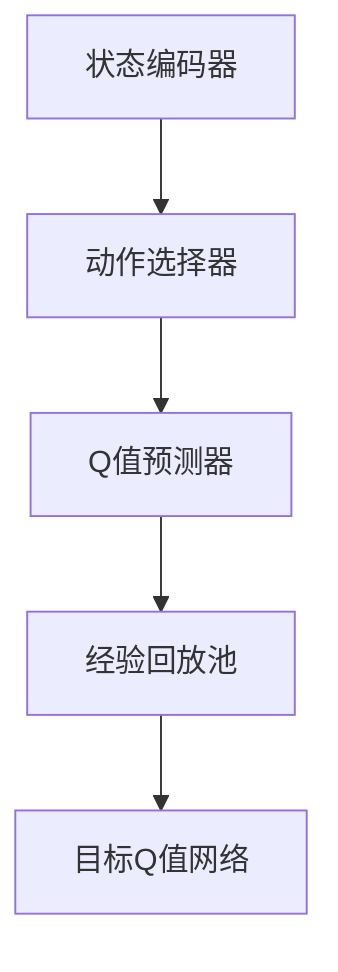

                 

# 深度Q-learning：在人脸识别技术中的应用

> **关键词**：深度Q-learning、人脸识别、强化学习、深度学习、人工智能

> **摘要**：本文深入探讨了深度Q-learning算法在人脸识别技术中的应用。首先，介绍了深度Q-learning的基础知识，包括其原理、架构和优势。接着，详细解释了深度Q-learning的各个关键步骤，并通过伪代码和数学公式进行了详细阐述。然后，文章转向深度Q-learning在人脸识别技术中的实际应用，包括模型设计、实现和优化策略。最后，通过一个实际项目案例展示了深度Q-learning在人脸识别中的应用效果，并探讨了该技术在未来人脸识别领域的潜力。本文旨在为读者提供一个全面的理解，帮助其掌握深度Q-learning算法在人脸识别领域的应用。

### 第一部分: 深度Q-learning概述

#### 第1章: 深度Q-learning基础

##### 1.1 什么是深度Q-learning

深度Q-learning（DQN）是一种结合了深度学习和强化学习的算法，其核心思想是利用深度神经网络来近似Q值函数，从而实现智能体的自主决策。与传统Q-learning相比，DQN能够处理高维状态空间和连续动作空间，使得其在复杂任务中的应用成为可能。

- **定义**：深度Q-learning是一种基于深度神经网络的Q-learning算法，它利用深度神经网络来近似Q值函数，从而实现智能体的自主决策。

- **与传统Q-learning的区别**：传统Q-learning是基于表格的学习算法，它将状态和动作映射到一个有限的状态空间和动作空间中，并通过更新Q值表来学习最优策略。而深度Q-learning则通过深度神经网络来近似Q值函数，可以处理高维状态空间和连续动作空间。

##### 1.2 深度Q-learning的核心概念

深度Q-learning的核心概念包括状态（State）、动作（Action）、奖励（Reward）和Q值函数（Q-Function）。

- **状态（State）**：状态是智能体当前所处的环境描述。在人脸识别任务中，状态可以是人脸图像的特征表示。

- **动作（Action）**：动作是智能体可以选择的操作。在人脸识别任务中，动作可以是人脸识别系统选择的人脸识别算法。

- **奖励（Reward）**：奖励是智能体在执行动作后获得的回报。在人脸识别任务中，奖励可以是识别成功的概率。

- **Q值函数（Q-Function）**：Q值函数是智能体在当前状态下执行某个动作的预期回报。在人脸识别任务中，Q值函数可以用来评估人脸识别算法的性能。

##### 1.3 深度Q-learning的架构

深度Q-learning的架构主要包括以下几个部分：

- **状态编码器（State Encoder）**：将状态编码成神经网络可以处理的格式。

- **动作选择器（Action Selector）**：根据当前状态选择最佳动作。

- **Q值预测器（Q-Value Predictor）**：使用深度神经网络预测当前状态的Q值。

- **经验回放（Experience Replay）**：将智能体在环境中的经验存储到经验回放池中，用于训练深度神经网络。

- **目标Q值网络（Target Q-Value Network）**：用于计算目标Q值，用于更新Q值预测器。

##### 1.4 深度Q-learning的优势与局限性

深度Q-learning具有以下优势：

- **处理高维状态空间和连续动作空间**：深度Q-learning通过使用深度神经网络来近似Q值函数，可以处理高维状态空间和连续动作空间，这使得它在复杂任务中的应用成为可能。

- **无需先验知识**：深度Q-learning不需要对状态空间和动作空间进行显式建模，因此无需先验知识。

深度Q-learning也存在以下局限性：

- **需要大量的训练数据**：由于深度Q-learning使用经验回放池来训练深度神经网络，因此需要大量的训练数据。

- **收敛速度慢**：深度Q-learning的收敛速度较慢，需要较长的训练时间。

#### 第2章: 深度Q-learning原理详解

##### 2.1 离散动作空间的深度Q-learning

在离散动作空间中，智能体需要选择一个具体的动作。以下是深度Q-learning在离散动作空间中的基本流程：

1. **初始化Q值函数**：使用随机值初始化Q值函数。

2. **选择动作**：根据当前状态选择最佳动作。

3. **执行动作**：在环境中执行所选动作。

4. **获取奖励**：根据执行的动作获取奖励。

5. **更新Q值函数**：使用获取的奖励和目标Q值更新Q值函数。

以下是深度Q-learning在离散动作空间中的伪代码：

```python
Initialize Q(s, a) with random values
for each episode:
    s = environment.reset()
    done = False
    while not done:
        a = select_action(s, Q(s, a))
        s', r = environment.step(a)
        Q(s, a) = Q(s, a) + alpha * (r + gamma * max(Q(s', a')) - Q(s, a))
        s = s'
        if done:
            break
```

##### 2.2 连续动作空间的深度Q-learning

在连续动作空间中，智能体需要选择一个连续的值作为动作。以下是深度Q-learning在连续动作空间中的基本流程：

1. **初始化Q值函数**：使用随机值初始化Q值函数。

2. **选择动作**：使用神经网络输出选择最佳动作。

3. **执行动作**：在环境中执行所选动作。

4. **获取奖励**：根据执行的动作获取奖励。

5. **更新Q值函数**：使用获取的奖励和目标Q值更新Q值函数。

以下是深度Q-learning在连续动作空间中的伪代码：

```python
Initialize Q(s, a) with random values
for each episode:
    s = environment.reset()
    done = False
    while not done:
        a = select_action(s, Q(s, a))
        s', r = environment.step(a)
        Q(s, a) = Q(s, a) + alpha * (r + gamma * max(Q(s', a')) - Q(s, a))
        s = s'
        if done:
            break
```

##### 2.3 带经验回放的深度Q-learning

经验回放（Experience Replay）是一种在深度Q-learning中常用的技术，它通过将智能体在环境中的经验存储到经验回放池中，从而提高学习效率和稳定性。

- **经验回放的概念**：经验回放是指将智能体在环境中的经验（状态、动作、奖励、下一个状态）存储到一个经验回放池中，然后从经验回放池中随机抽取经验进行学习。

- **经验回放的作用**：经验回放可以减少学习过程中的样本偏差，提高模型的泛化能力。

以下是带经验回放的深度Q-learning的伪代码：

```python
Initialize Q(s, a) with random values
Initialize replay memory D
for each episode:
    s = environment.reset()
    done = False
    while not done:
        a = select_action(s, Q(s, a))
        s', r = environment.step(a)
        D.append((s, a, r, s'))
        if len(D) > batch_size:
            sample = random.sample(D, batch_size)
            s_batch, a_batch, r_batch, s_batch' = zip(*sample)
            Q(s_batch, a_batch) = Q(s_batch, a_batch) + alpha * (r_batch + gamma * max(Q(s_batch', a_batch')) - Q(s_batch, a_batch))
        s = s'
        if done:
            break
```

##### 2.4 Double Q-learning

Double Q-learning是一种改进的深度Q-learning算法，它通过使用两个独立的Q值预测器来提高学习效率和稳定性。

- **Double Q-learning的原理**：Double Q-learning通过将当前状态的Q值预测和下一个状态的Q值预测分开，从而避免了目标Q值估计中的偏差。

- **Double Q-learning的优势**：Double Q-learning可以减少学习过程中的样本偏差，提高模型的泛化能力。

以下是Double Q-learning的伪代码：

```python
Initialize Q(s, a) with random values
Initialize target Q-network target_Q
for each episode:
    s = environment.reset()
    done = False
    while not done:
        a = select_action(s, Q(s, a))
        s', r = environment.step(a)
        target_Q(s', a') = r + gamma * max(target_Q(s', a'))
        Q(s, a) = Q(s, a) + alpha * (r + gamma * target_Q(s', a') - Q(s, a))
        update target_Q using Q values
        s = s'
        if done:
            break
```

##### 2.5 Deep Q-Network（DQN）

Deep Q-Network（DQN）是一种基于深度神经网络的Q-learning算法，它使用深度神经网络来近似Q值函数。

- **DQN的基本结构**：DQN由状态编码器、动作选择器、Q值预测器和经验回放池组成。

- **DQN的学习策略**：DQN使用经验回放池来训练深度神经网络，并通过目标Q值网络来稳定学习过程。

以下是DQN的基本结构的Mermaid流程图：



以下是DQN的伪代码：

```python
Initialize Q-network with random weights
Initialize target Q-network with same weights
Initialize replay memory D
for each episode:
    s = environment.reset()
    done = False
    while not done:
        a = select_action(s, Q(s, a))
        s', r = environment.step(a)
        D.append((s, a, r, s'))
        if len(D) > batch_size:
            sample = random.sample(D, batch_size)
            s_batch, a_batch, r_batch, s_batch' = zip(*sample)
            Q(s_batch, a_batch) = Q(s_batch, a_batch) + alpha * (r_batch + gamma * max(target_Q(s_batch', a_batch')) - Q(s_batch, a_batch))
        update target Q-network using Q-network weights
        s = s'
        if done:
            break
```

### 第二部分: 深度Q-learning在人脸识别中的应用

#### 第3章: 人脸识别技术概述

##### 3.1 人脸识别的基本概念

- **人脸识别的定义**：人脸识别是一种通过计算机技术和生物统计学原理，利用面部特征对个人进行识别的技术。
- **人脸识别的技术分类**：人脸识别技术主要分为基于特征的方法、基于模型的方法和基于深度学习的方法。其中，基于深度学习的方法是目前应用最广泛的。

##### 3.2 人脸识别的流程

- **数据采集**：通过摄像头或图像采集设备收集人脸图像。
- **特征提取**：对人脸图像进行处理，提取出人脸特征，如面部轮廓、眼睛位置、鼻子高度等。
- **人脸匹配与识别**：将提取到的人脸特征与数据库中的人脸特征进行匹配，从而识别出具体的人。

##### 3.3 人脸识别的挑战

- **光照变化**：不同光照条件下，人脸图像的特征会有所不同，这会给识别带来困难。
- **姿态变化**：人脸的姿态变化，如正面、侧面、抬头、低头等，也会影响识别的准确性。
- **年龄变化**：随着年龄的增长，人脸特征会发生变化，这需要人脸识别算法能够适应不同年龄段的人脸。

#### 第4章: 深度Q-learning在人脸识别中的应用

##### 4.1 深度Q-learning在人脸识别中的模型设计

- **状态表示**：状态可以是人脸图像的特征向量。
- **动作表示**：动作可以是人脸识别系统选择的人脸识别算法，如特征匹配、神经网络分类等。
- **奖励设计**：奖励可以是识别成功的概率。如果识别成功，则奖励为1；否则，奖励为0。

##### 4.2 深度Q-learning在人脸识别中的实现

- **数据预处理**：对采集到的人脸图像进行预处理，如归一化、灰度化等。
- **模型训练**：使用预处理后的人脸图像和对应的奖励进行模型训练。
- **模型评估**：在验证集上评估模型性能，调整模型参数。

##### 4.3 深度Q-learning在人脸识别中的优化策略

- **Experience Replay**：将智能体在环境中的经验存储到经验回放池中，提高学习效率和稳定性。
- **Double Q-learning**：通过使用两个独立的Q值预测器来提高学习效率和稳定性。
- **Prioritized Experience Replay**：对经验回放池中的经验进行优先级排序，提高重要的经验的学习效率。

##### 4.4 深度Q-learning在人脸识别中的应用案例

- **案例介绍**：以一个智能门禁系统为例，展示深度Q-learning在人脸识别中的应用。
- **模型实现**：使用深度Q-learning算法训练人脸识别模型，实现智能门禁系统的门禁功能。
- **

