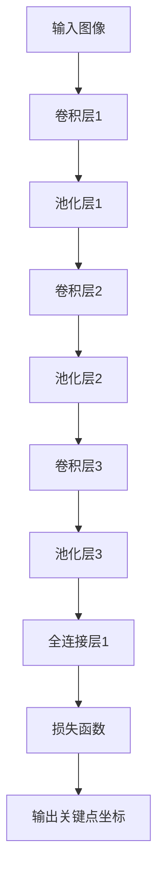
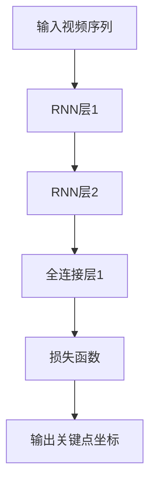

                 

# 深度学习在实时人体姿态估计中的应用

> **关键词**：深度学习、实时人体姿态估计、计算机视觉、卷积神经网络、循环神经网络、数据预处理、模型训练、系统实现

> **摘要**：本文旨在探讨深度学习技术在实时人体姿态估计中的应用。首先，我们将回顾深度学习的核心概念和架构，以及实时人体姿态估计的基本概念和应用场景。接着，本文将深入探讨深度学习模型在实时人体姿态估计中的应用，包括数据预处理、模型设计和训练优化。此外，本文还将详细介绍一个具体的项目实战，展示如何实现一个实时人体姿态估计系统。最后，我们将对未来的发展趋势和应用领域进行展望。

## 第一部分：深度学习与实时人体姿态估计基础

### 第1章：深度学习概述

#### 1.1 深度学习的概念与历史

**深度学习的定义**：深度学习是一种人工智能技术，其基础是多层神经网络，用于从数据中自动提取特征，进行模式识别和预测。与传统的机器学习方法不同，深度学习能够自动从大量数据中学习到复杂的特征表示，从而提高了模型的准确性和泛化能力。

**深度学习的历史**：深度学习起源于20世纪40年代，当时神经网络的概念被提出。然而，由于计算能力和数据资源的限制，深度学习在很长一段时间内并没有得到广泛的应用。直到最近几十年，随着计算能力的提升和数据量的爆炸性增长，深度学习才迎来了快速发展的契机。

#### 1.2 深度学习的基本架构

**神经网络的基本结构**：神经网络是由多个层次组成的，包括输入层、隐藏层和输出层。每个层次由多个神经元组成，神经元之间通过权重连接。输入层接收外部数据，隐藏层对输入数据进行处理和变换，输出层产生最终的输出结果。

**常见的深度学习架构**：深度学习架构种类繁多，其中卷积神经网络（CNN）、循环神经网络（RNN）和长短时记忆网络（LSTM）是最为常见的几种。

- **卷积神经网络（CNN）**：CNN是一种专门用于处理图像数据的神经网络，其核心思想是通过卷积操作提取图像的特征。CNN在计算机视觉领域取得了巨大的成功，广泛应用于图像分类、目标检测和图像生成等任务。

- **循环神经网络（RNN）**：RNN是一种能够处理序列数据的神经网络，其核心思想是通过循环单元来保留历史信息。RNN在自然语言处理和语音识别等领域有广泛的应用。

- **长短时记忆网络（LSTM）**：LSTM是一种特殊的RNN结构，用于解决传统RNN在处理长序列数据时容易出现的梯度消失和梯度爆炸问题。LSTM在序列建模任务中表现出了优越的性能。

### 第2章：实时人体姿态估计

#### 2.1 实时人体姿态估计的基本概念

**实时人体姿态估计的定义**：实时人体姿态估计是指通过计算机视觉技术，实时地估计人体各个部位的姿态。实时性要求系统能够在短时间内完成姿态估计，以满足实时交互和应用的需求。

**实时人体姿态估计的应用场景**：实时人体姿态估计在多个领域有着广泛的应用，如运动分析、虚拟现实、人机交互等。例如，在运动分析中，实时人体姿态估计可以用于运动员动作分析、运动康复等；在虚拟现实中，实时人体姿态估计可以实现更加自然和沉浸式的用户交互；在人机交互中，实时人体姿态估计可以用于手势识别、面部表情分析等。

#### 2.2 深度学习在实时人体姿态估计中的应用

**深度学习模型的应用**：在实时人体姿态估计中，深度学习模型被广泛应用于姿态估计任务的实现。其中，基于卷积神经网络（CNN）和循环神经网络（RNN）的模型是最为常见的两种。

- **基于CNN的姿态估计模型**：CNN可以有效地提取图像特征，因此在姿态估计任务中，通过CNN提取关键点特征，可以实现较高精度的姿态估计。常用的CNN架构包括VGG、ResNet等。

- **基于RNN的姿态估计模型**：RNN可以有效地处理序列数据，因此在姿态估计任务中，通过RNN处理视频序列，可以实现连续的姿态估计。常用的RNN架构包括LSTM、GRU等。

**模型训练与优化**：在实时人体姿态估计中，模型的训练与优化至关重要。通常，需要通过大量的姿态数据进行模型训练，并使用优化算法提升模型的性能。常见的优化算法包括随机梯度下降（SGD）、Adam等。

## 第二部分：深度学习在实时人体姿态估计中的应用

### 第3章：数据预处理

**数据收集与标注**：实时人体姿态估计的数据集通常包括视频数据和相应的姿态标注。数据收集可以通过采集运动员动作、舞蹈表演等场景的视频数据来实现。姿态标注需要准确标记出视频中的关键点坐标，通常使用手工标注或半自动标注工具来完成。

**数据预处理技术**：数据预处理是深度学习模型训练的重要步骤，可以有效地提高模型的泛化能力。常见的数据预处理技术包括数据清洗、数据增强等。

- **数据清洗**：去除数据集中的噪声和异常值，提高数据质量。

- **数据增强**：通过数据增强技术，如随机裁剪、旋转、缩放等，增加数据多样性，提高模型的泛化能力。

### 第4章：深度学习模型设计

#### 4.1 卷积神经网络在姿态估计中的应用

**CNN的基本原理**：CNN通过卷积操作、池化操作等，提取图像特征，实现对图像的识别和分类。在姿态估计任务中，CNN可以提取关键点的特征，用于姿态估计。

**姿态估计的CNN模型设计**：一个典型的姿态估计CNN模型通常包括多个卷积层和池化层，用于提取图像特征，最后通过全连接层输出关键点坐标。例如，可以利用ResNet作为主干网络，结合全连接层和损失函数，实现姿态估计任务。

#### 4.2 循环神经网络在姿态估计中的应用

**RNN的基本原理**：RNN通过循环单元和记忆机制，处理序列数据，保留历史信息。在姿态估计任务中，RNN可以处理视频序列，实现对连续姿态的估计。

**姿态估计的RNN模型设计**：一个典型的姿态估计RNN模型通常包括RNN层和全连接层，用于处理视频序列和输出关键点坐标。例如，可以利用LSTM作为RNN单元，结合全连接层和损失函数，实现姿态估计任务。

### 第5章：模型训练与优化

**训练过程**：模型训练是深度学习中的核心步骤，通过反向传播算法，不断调整模型参数，优化模型性能。

- **前向传播**：将输入数据传递到模型中，通过模型计算得到输出结果。

- **反向传播**：计算输出结果与真实值之间的差异，通过反向传播算法，调整模型参数。

**优化算法**：优化算法用于调整模型参数，常见的优化算法包括随机梯度下降（SGD）、Adam等。

- **随机梯度下降（SGD）**：通过计算整个训练数据的梯度，更新模型参数。

- **Adam**：结合SGD的优点，自适应调整学习率。

### 第6章：实时人体姿态估计系统实现

**系统架构设计**：实时人体姿态估计系统通常包括前端采集、后端处理和结果输出三个部分。

- **前端采集**：采集人体姿态视频数据，通常使用摄像头或其他传感器。

- **后端处理**：利用深度学习模型进行姿态估计，处理过程通常包括数据预处理、模型推理和后处理。

- **结果输出**：将姿态估计结果输出到用户界面或其他系统，用于进一步处理和应用。

**系统部署与优化**：系统部署是将训练好的模型部署到实际应用环境中，并进行性能优化。

- **部署方式**：可以选择在云端部署，也可以在本地计算机或嵌入式设备上部署。

- **性能优化**：通过调整模型参数、优化算法和硬件加速等手段，提高系统性能。

### 第7章：项目实战

**实战案例介绍**：本节将介绍一个实时人体姿态估计的项目实战，包括数据收集、模型设计、训练与优化、系统实现等步骤。

**实战步骤解析**：

1. **数据收集**：收集含有人体姿态信息的视频数据，并进行姿态标注。

2. **模型设计**：设计基于卷积神经网络的姿态估计模型，并使用ResNet作为主干网络。

3. **训练与优化**：使用训练数据和优化算法对模型进行训练和优化。

4. **系统实现**：实现实时人体姿态估计系统，包括前端采集、后端处理和结果输出。

5. **系统部署与优化**：将模型部署到实际应用环境中，并进行性能优化。

### 第8章：未来展望

**技术发展趋势**：未来，实时人体姿态估计技术将继续发展，出现以下趋势：

- **多模态学习**：结合多种传感器数据，提高姿态估计的准确性和鲁棒性。

- **实时性提升**：通过优化算法和硬件加速，提高系统的实时性能。

**应用领域拓展**：实时人体姿态估计技术将在更多领域得到应用，如智能监控、健康护理等。

- **智能监控**：通过实时姿态估计，实现智能安防、异常行为检测等。

- **健康护理**：通过实时姿态估计，辅助康复治疗、运动监控等。

## 附录

### 附录A：深度学习框架与工具

- **TensorFlow**：TensorFlow是一个开源的深度学习框架，提供丰富的API和工具，支持多种深度学习模型的训练和部署。

- **PyTorch**：PyTorch是一个开源的深度学习框架，具有灵活的动态计算图和强大的GPU支持，适用于研究和应用开发。

- **其他深度学习框架**：其他常见的深度学习框架还包括Keras、TensorFlow.js等，适用于不同的应用场景和开发需求。

### 附录B：深度学习相关资料

- **论文与书籍推荐**：《深度学习》（Goodfellow et al.）、《神经网络与深度学习》（邱锡鹏）等经典著作。

- **在线资源和社区**：包括GitHub、arXiv、Reddit等，提供丰富的深度学习研究资源和交流平台。

### 作者信息

**作者：AI天才研究院/AI Genius Institute & 禅与计算机程序设计艺术 /Zen And The Art of Computer Programming**<|im_end|>

