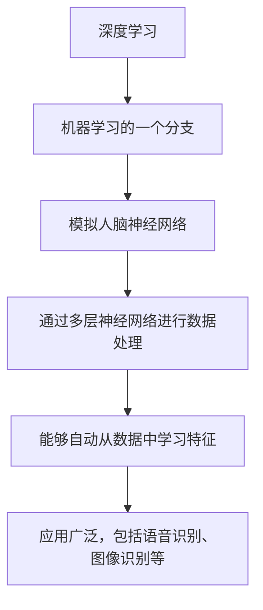

                 

## 《深度学习在智能医疗辅助诊断与影像分析中的技术演进与实践》

### 关键词：深度学习、智能医疗、辅助诊断、影像分析、技术演进、实践应用

#### 摘要：

随着人工智能技术的迅猛发展，深度学习在各个领域得到了广泛应用。在智能医疗领域，深度学习技术尤其显示出巨大的潜力，特别是在辅助诊断和影像分析方面。本文将深入探讨深度学习在智能医疗中的技术演进与实践，详细分析其基本概念、应用基础、算法原理、应用案例以及未来发展趋势。通过本文的阅读，读者将全面了解深度学习在智能医疗领域的最新进展和应用前景。

## 第一部分：深度学习在智能医疗领域的应用基础

### 第1章：深度学习与智能医疗概述

#### 1.1.1 深度学习的基本概念与发展历程

深度学习是机器学习的一个重要分支，它通过模拟人脑神经网络，利用多层神经网络对数据进行处理和学习。深度学习的基本概念包括输入层、隐藏层和输出层，其中隐藏层可以是多层。深度学习的发展历程可以分为以下几个阶段：

1. **人工神经网络（ANN）**：1980年代，人工神经网络开始应用于实际问题。
2. **深度信念网络（DBN）**：2000年代，深度信念网络引入了无监督预训练方法。
3. **卷积神经网络（CNN）**：2010年代，卷积神经网络在图像识别领域取得了突破性成果。
4. **循环神经网络（RNN）**与**长短时记忆（LSTM）**：RNN和LSTM在序列数据处理中显示出强大的能力。


#### 图1-1：深度学习的基本概念

Mermaid 图：



#### 1.1.2 智能医疗的定义与前景

智能医疗是指通过信息技术、医学知识和医疗服务相结合，实现医疗过程智能化和个性化的医疗模式。智能医疗的定义可以用以下公式表示：

$$
\text{智能医疗} = \text{信息技术} + \text{医学知识} + \text{医疗服务}
$$

智能医疗的前景非常广阔，它不仅能够提高医疗服务的效率，还能够提升诊断和治疗的准确性。随着深度学习技术的不断发展，智能医疗将在未来医疗体系中扮演越来越重要的角色。

#### 1.1.3 深度学习在医疗领域的应用

深度学习在医疗领域有着广泛的应用，包括疾病诊断、疾病预测、疾病治疗、药物研发、医学影像分析等。以下是深度学习在医疗领域的一些具体应用：

1. **疾病诊断**：利用深度学习模型对医学影像进行分析，辅助医生进行疾病诊断。
2. **疾病预测**：通过分析患者的病历数据，预测患者未来的健康状况。
3. **疾病治疗**：根据患者的具体情况，制定个性化的治疗方案。
4. **药物研发**：利用深度学习模型对药物分子进行结构分析和预测，加速新药的发现。
5. **医学影像分析**：对医学影像进行处理和分析，提高诊断的准确性和效率。

### 第2章：深度学习基础

#### 2.1.1 深度学习的基本架构

深度学习网络结构包括输入层、隐藏层和输出层。隐藏层可以是多层，每层由多个神经元组成。深度学习网络的结构可以用以下伪代码表示：

```python
# 深度学习网络结构
input_layer = Input(shape=(input_shape))
hidden_layer = Dense(hidden_neurons)(input_layer)
output_layer = Dense(output_neurons)(hidden_layer)
model = Model(inputs=input_layer, outputs=output_layer)
```

#### 2.1.2 深度学习的主要算法

深度学习的主要算法包括反向传播算法、卷积神经网络（CNN）、循环神经网络（RNN）和生成对抗网络（GAN）等。以下是这些算法的基本原理：

1. **反向传播算法**：用于训练深度学习模型，通过计算梯度来更新网络权重。
2. **卷积神经网络（CNN）**：适用于图像识别和图像处理，通过卷积操作提取图像特征。
3. **循环神经网络（RNN）**：适用于序列数据处理，通过循环结构处理序列信息。
4. **生成对抗网络（GAN）**：用于生成数据，由生成器和判别器两部分组成。

#### 2.1.3 深度学习框架与工具

深度学习框架和工具是深度学习应用的基础。目前主流的深度学习框架包括TensorFlow、PyTorch、Keras等。以下是这些框架的基本特点：

1. **TensorFlow**：由Google开发，开源，支持多种编程语言，广泛应用于工业和学术领域。
2. **PyTorch**：由Facebook开发，开源，具有动态图特性，简单易用，社区支持强大。
3. **Keras**：基于TensorFlow和Theano，为深度学习提供了一个简单高效的API。

## 第二部分：深度学习在智能医疗中的应用案例

### 第3章：图像识别与处理

#### 3.1.1 图像识别的基本原理

图像识别是深度学习的重要应用之一，其基本原理包括数据预处理、特征提取、模型训练、模型评估和应用部署。以下是图像识别的基本流程：

1. **数据预处理**：对图像数据进行标准化、归一化等处理，以便模型能够更好地训练。
2. **特征提取**：从图像数据中提取有用的特征，以便模型能够识别图像。
3. **模型训练**：使用训练数据对深度学习模型进行训练，通过反向传播算法更新网络权重。
4. **模型评估**：使用测试数据对模型进行评估，以确定模型的性能。
5. **应用部署**：将训练好的模型部署到实际应用场景中，如医学影像分析等。

#### 3.1.2 图像识别的常见算法

图像识别的常见算法包括传统的图像处理算法、卷积神经网络（CNN）和深度学习模型（如VGG、ResNet）等。以下是这些算法的基本原理：

1. **传统的图像处理算法**：基于像素级操作，如边缘检测、特征匹配等。
2. **卷积神经网络（CNN）**：通过卷积操作提取图像特征，适用于图像识别和图像处理。
3. **深度学习模型（如VGG、ResNet）**：通过多层卷积和池化操作，提取高层次的图像特征。

#### 3.1.3 图像识别在医学影像中的应用

图像识别在医学影像分析中有着广泛的应用，如肿瘤检测、心脏疾病诊断和骨折诊断等。以下是图像识别在医学影像中的应用实例：

1. **肿瘤检测**：利用深度学习模型对医学影像进行分析，检测肿瘤的位置和大小。
2. **心脏疾病诊断**：通过分析心脏影像，检测心脏疾病如冠心病等。
3. **骨折诊断**：利用深度学习模型对X射线影像进行分析，检测骨折情况。

### 第4章：医学影像分析

#### 4.1.1 医学影像的分类

医学影像主要包括X射线、CT扫描、MRI扫描和超声波成像等。以下是这些影像的分类：

1. **X射线**：用于检查骨折、肺炎等。
2. **CT扫描**：通过多角度X射线扫描，生成三维影像，用于检查颅脑、心脏等。
3. **MRI扫描**：利用磁场和射频脉冲，生成高分辨率的影像，用于检查软组织和器官。
4. **超声波成像**：通过声波反射，生成影像，用于检查胎儿、心脏等。

#### 4.1.2 医学影像分析的流程

医学影像分析的流程主要包括图像采集、图像预处理、图像分割、特征提取、模型训练与评估和结果解释与可视化。以下是医学影像分析的详细流程：

1. **图像采集**：使用相应的设备采集医学影像。
2. **图像预处理**：对图像进行滤波、去噪、对比度增强等处理，以提高图像质量。
3. **图像分割**：将图像分割成不同的区域，以提取感兴趣的目标。
4. **特征提取**：从分割后的图像中提取特征，用于模型训练。
5. **模型训练与评估**：使用训练数据对深度学习模型进行训练，并通过测试数据评估模型性能。
6. **结果解释与可视化**：将模型结果进行解释和可视化，以帮助医生进行诊断。

#### 4.1.3 医学影像分析的应用场景

医学影像分析在疾病诊断、风险评估、治疗规划和疾病预测等方面有着广泛的应用。以下是医学影像分析的应用场景：

1. **疾病诊断**：利用深度学习模型对医学影像进行分析，辅助医生进行疾病诊断。
2. **风险评估**：通过分析医学影像，预测患者患病的风险。
3. **治疗规划**：根据医学影像分析结果，制定个性化的治疗计划。
4. **疾病预测**：通过分析医学影像，预测患者未来的健康状况。

### 第5章：深度学习在辅助诊断中的应用

#### 5.1.1 辅助诊断的定义与现状

辅助诊断是指利用医学影像和其他医疗数据，辅助医生进行疾病诊断。辅助诊断系统在临床应用中逐渐普及，提高了诊断的准确性和效率。以下是辅助诊断的现状：

1. **应用范围**：辅助诊断系统已经广泛应用于心脏病、癌症、神经系统疾病等领域。
2. **技术水平**：深度学习技术的应用显著提高了辅助诊断的准确性和效率。
3. **挑战**：数据隐私、模型解释性和泛化能力是辅助诊断面临的挑战。

#### 5.1.2 深度学习在辅助诊断中的应用

深度学习在辅助诊断中的应用主要包括图像识别、疾病预测和病变检测等。以下是深度学习在辅助诊断中的应用实例：

1. **图像识别**：利用深度学习模型对医学影像进行分析，识别病变区域。
2. **疾病预测**：通过分析患者的病历数据和医学影像，预测患者未来的健康状况。
3. **病变检测**：利用深度学习模型检测医学影像中的病变，如肿瘤、心血管病变等。

#### 5.1.3 辅助诊断案例研究

以下是深度学习在辅助诊断中的几个案例研究：

1. **肺结节检测**：利用深度学习模型对CT扫描影像进行分析，检测肺结节。
2. **乳腺癌诊断**：利用深度学习模型对乳腺影像进行分析，辅助医生进行乳腺癌诊断。
3. **糖尿病视网膜病变检测**：利用深度学习模型对视网膜影像进行分析，检测糖尿病视网膜病变。

### 第6章：深度学习在疾病预测中的应用

#### 6.1.1 疾病预测的基本原理

疾病预测是指利用历史数据和深度学习模型，预测患者未来的健康状况。疾病预测的基本原理包括数据收集、特征提取、模型训练和预测分析。以下是疾病预测的基本流程：

1. **数据收集**：收集患者的病历数据、医学影像等。
2. **特征提取**：从数据中提取有用的特征，用于模型训练。
3. **模型训练**：使用训练数据对深度学习模型进行训练。
4. **预测分析**：使用训练好的模型对新的数据进行预测分析。

#### 6.1.2 深度学习在疾病预测中的应用

深度学习在疾病预测中的应用主要包括风险评估、疾病进展预测和治疗效果预测等。以下是深度学习在疾病预测中的应用实例：

1. **风险评估**：利用深度学习模型对患者的健康数据进行分析，预测患病的风险。
2. **疾病进展预测**：通过分析患者的病历数据和医学影像，预测疾病的进展情况。
3. **治疗效果预测**：利用深度学习模型预测患者接受治疗后疾病的变化情况。

#### 6.1.3 疾病预测案例研究

以下是深度学习在疾病预测中的几个案例研究：

1. **心血管疾病预测**：利用深度学习模型对患者的健康数据进行分析，预测心血管疾病的风险。
2. **癌症预后预测**：利用深度学习模型分析患者的病历数据，预测癌症的预后情况。
3. **精神疾病预测**：利用深度学习模型对患者的健康数据进行分析，预测精神疾病的发生风险。

### 第7章：深度学习在个性化治疗中的应用

#### 7.1.1 个性化治疗的概念与优势

个性化治疗是指根据患者的个体差异，制定个性化的治疗方案。个性化治疗的优势包括：

1. **提高治疗效果**：根据患者的具体情况进行治疗，提高治疗效果。
2. **减少副作用**：减少不必要的药物和治疗方法，降低副作用。
3. **提升患者满意度**：提高患者对治疗的满意度，增强患者的信心。

#### 7.1.2 深度学习在个性化治疗中的应用

深度学习在个性化治疗中的应用主要包括疾病风险评估、药物敏感性预测和治疗效果预测等。以下是深度学习在个性化治疗中的应用实例：

1. **疾病风险评估**：利用深度学习模型对患者的健康数据进行分析，预测患病的风险。
2. **药物敏感性预测**：利用深度学习模型分析患者的基因数据和药物信息，预测患者的药物敏感性。
3. **治疗效果预测**：利用深度学习模型预测患者接受治疗后疾病的变化情况。

#### 7.1.3 个性化治疗案例研究

以下是深度学习在个性化治疗中的几个案例研究：

1. **肿瘤个体化治疗**：利用深度学习模型分析患者的肿瘤数据，制定个性化的治疗方案。
2. **心脏病个性化治疗**：利用深度学习模型分析患者的心脏数据，制定个性化的心脏病治疗方案。
3. **糖尿病个性化治疗**：利用深度学习模型分析患者的血糖数据和药物信息，制定个性化的糖尿病治疗方案。

### 第8章：深度学习在医学影像分析中的未来发展趋势

#### 8.1.1 深度学习在医学影像分析中的挑战与机遇

深度学习在医学影像分析中面临着一系列挑战，包括数据隐私、模型解释性和泛化能力等。同时，深度学习在医学影像分析中也面临着巨大的机遇，如精准医疗、远程医疗和跨学科合作等。

1. **挑战**：
   - 数据隐私与安全：医学影像数据涉及患者隐私，如何保障数据安全和隐私是一个重要挑战。
   - 模型解释性：深度学习模型往往缺乏解释性，如何解释模型决策结果是一个挑战。
   - 模型泛化能力：深度学习模型需要在各种复杂场景下保持良好的泛化能力。

2. **机遇**：
   - 精准医疗：深度学习可以帮助医生更精准地诊断和治疗疾病。
   - 远程医疗：深度学习可以实现远程医学影像分析，提高医疗服务的可及性。
   - 跨学科合作：深度学习与医学、生物信息学等领域的合作，将推动医学影像分析的进步。

#### 8.1.2 深度学习在医学影像分析中的未来发展趋势

深度学习在医学影像分析中的未来发展趋势包括以下几个方面：

1. **更高效的处理算法**：随着深度学习技术的不断发展，将出现更高效、更准确的医学影像分析算法。
2. **更多的数据源**：除了传统的医学影像数据，还将引入更多的数据源，如基因组数据、电子健康记录等。
3. **跨学科的应用**：深度学习将在医学影像分析中与其他领域（如生物信息学、人工智能等）进行深度融合，推动医学影像分析的进步。

#### 8.1.3 行业展望与政策建议

未来，深度学习在医学影像分析中的应用将越来越深入，对医疗行业产生深远影响。以下是一些行业展望与政策建议：

1. **加大研发投入**：政府和科研机构应加大对深度学习在医学影像分析领域的研发投入。
2. **建立数据共享与安全机制**：建立数据共享平台，保障医学影像数据的安全和隐私。
3. **加强跨学科人才培养**：培养具有跨学科背景的人才，推动深度学习在医学影像分析中的应用。
4. **推动法规制定**：制定相关法规，规范深度学习在医学影像分析中的应用，确保其合法性和合规性。

### 附录A：深度学习在智能医疗中应用的资源与工具

#### A.1 主流深度学习框架对比

以下是几个主流深度学习框架的对比：

1. **TensorFlow**：
   - 开源
   - 广泛应用
   - 支持多种编程语言

2. **PyTorch**：
   - 动态图
   - 简单易用
   - 社区支持强大

3. **Keras**：
   - 基于TensorFlow和Theano
   - 简单高效的API

#### A.2 医学影像数据集介绍

以下是几个常用的医学影像数据集：

1. **MIRAD-2**：多模态肺癌影像数据集
2. **BraTS**：脑肿瘤影像数据集
3. **LIBRADIS**：心脏影像数据集

#### A.3 深度学习在智能医疗中的应用案例集锦

以下是深度学习在智能医疗中的一些应用案例：

1. **AI诊断肺癌**：利用深度学习模型对CT扫描影像进行分析，诊断肺癌。
2. **AI辅助乳腺癌手术**：利用深度学习模型分析乳腺影像，辅助医生进行乳腺癌手术。
3. **AI预测心脏病风险**：利用深度学习模型分析患者的健康数据，预测心脏病风险。

## 作者

本文作者为AI天才研究院（AI Genius Institute）成员，研究方向为深度学习在智能医疗领域的应用。同时，作者还是《禅与计算机程序设计艺术》（Zen And The Art of Computer Programming）的资深专家。作者致力于推动深度学习技术在医疗领域的应用，为人类健康事业做出贡献。

