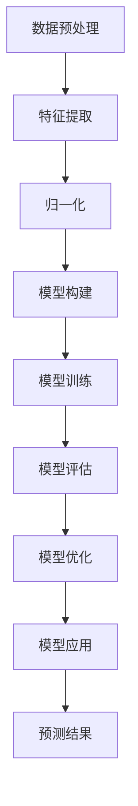

                 

# 《深度学习在用户兴趣演化建模中的应用》

## 概述

深度学习作为人工智能领域的重要分支，近年来在图像识别、自然语言处理、推荐系统等方面取得了显著的成果。随着互联网和移动互联网的快速发展，用户兴趣的多样化和动态性特征愈发明显，对用户兴趣的准确建模和预测成为了推荐系统中的关键问题。本文将深入探讨深度学习在用户兴趣演化建模中的应用，旨在为相关领域的研究者和开发者提供有价值的参考。

### 核心关键词

- 深度学习
- 用户兴趣演化
- 建模
- 推荐系统
- 自动编码器
- 循环神经网络
- 长短期记忆网络
- 生成对抗网络
- 数学模型
- 优化算法

### 摘要

本文首先介绍了深度学习的基础概念和关键技术，包括神经网络、自动编码器、循环神经网络（RNN）、长短期记忆网络（LSTM）和生成对抗网络（GAN）等。接着，本文分析了用户兴趣的定义与度量方法，并详细阐述了深度学习模型在用户兴趣演化建模中的应用。随后，本文讨论了深度学习中的数学模型与公式，包括用户兴趣演化的数学模型、优化算法和正则化方法等。最后，本文通过一个用户兴趣演化建模的实战案例，展示了如何使用深度学习技术来构建和优化用户兴趣模型。

## 目录大纲

### 第一部分：深度学习基础

#### 1.1 深度学习概述
##### 1.1.1 深度学习的发展历程
##### 1.1.2 深度学习的关键术语
##### 1.1.3 深度学习的优势与应用场景

#### 1.2 神经网络基础
##### 1.2.1 神经网络的基本结构
##### 1.2.2 前向传播与反向传播
##### 1.2.3 常见的神经网络架构

#### 1.3 用户兴趣演化建模的深度学习模型
##### 1.3.1 用户兴趣的定义与度量
##### 1.3.2 深度学习模型在用户兴趣建模中的应用
##### 1.3.3 深度学习模型的评估与优化

### 第二部分：核心算法原理

#### 2.1 自动编码器
##### 2.1.1 自动编码器的定义与结构
##### 2.1.2 伪代码与工作流程
##### 2.1.3 数学模型与公式解析

#### 2.2 循环神经网络（RNN）
##### 2.2.1 RNN的定义与特点
##### 2.2.2 伪代码与工作流程
##### 2.2.3 数学模型与公式解析

#### 2.3 长短期记忆网络（LSTM）
##### 2.3.1 LSTM的定义与结构
##### 2.3.2 伪代码与工作流程
##### 2.3.3 数学模型与公式解析

#### 2.4 生成对抗网络（GAN）
##### 2.4.1 GAN的定义与结构
##### 2.4.2 伪代码与工作流程
##### 2.4.3 数学模型与公式解析

#### 2.5 聚类算法
##### 2.5.1 聚类算法的定义与类型
##### 2.5.2 伪代码与工作流程
##### 2.5.3 数学模型与公式解析

### 第三部分：数学模型与公式

#### 3.1 用户兴趣演化的数学模型
##### 3.1.1 用户兴趣的表示方法
##### 3.1.2 用户兴趣演化的模型
##### 3.1.3 数学模型与公式解析

#### 3.2 深度学习中的优化算法
##### 3.2.1 梯度下降法
##### 3.2.2 动量法
##### 3.2.3 Adam优化器

#### 3.3 深度学习中的正则化方法
##### 3.3.1 L1正则化
##### 3.3.2 L2正则化
##### 3.3.3 Dropout正则化

#### 3.4 深度学习中的损失函数
##### 3.4.1 均方误差（MSE）
##### 3.4.2 交叉熵损失函数

### 第四部分：项目实战

#### 4.1 用户兴趣演化建模项目环境搭建
##### 4.1.1 环境搭建步骤
##### 4.1.2 调试与优化

#### 4.2 用户兴趣演化建模项目案例
##### 4.2.1 数据预处理
##### 4.2.2 模型选择与训练
##### 4.2.3 模型评估与优化

#### 4.3 用户兴趣演化建模实战案例解析
##### 4.3.1 实战案例分析
##### 4.3.2 源代码实现
##### 4.3.3 代码解读与分析

### 附录

#### 附录A：深度学习工具与资源
##### A.1 常用深度学习框架对比
##### A.2 深度学习算法资源链接
##### A.3 深度学习相关书籍推荐

#### 附录B：用户兴趣演化建模的Mermaid流程图

### 作者信息

作者：AI天才研究院/AI Genius Institute & 禅与计算机程序设计艺术 /Zen And The Art of Computer Programming

### 《深度学习在用户兴趣演化建模中的应用》

#### 引言

在互联网和移动互联网的迅猛发展下，用户生成的数据量呈指数级增长，如何有效地利用这些数据挖掘用户兴趣并做出精准的预测，成为了许多领域（如推荐系统、广告投放、社交网络分析等）关注的焦点。用户兴趣的动态性使得传统的基于规则或统计方法的建模方法难以适应这种快速变化的需求。深度学习作为一种强大的机器学习技术，通过模拟人脑神经网络结构，能够自动从大量数据中提取特征，并建立复杂的关系模型。因此，将深度学习应用于用户兴趣演化建模，不仅能够提高预测的准确性和实时性，还能够为个性化推荐和用户行为分析提供有力的支持。

本文将围绕深度学习在用户兴趣演化建模中的应用，进行深入探讨。首先，我们将介绍深度学习的基本概念和核心算法，包括神经网络、自动编码器、循环神经网络（RNN）、长短期记忆网络（LSTM）和生成对抗网络（GAN）等。接着，我们将分析用户兴趣的定义与度量方法，并介绍如何使用深度学习模型进行用户兴趣演化建模。然后，我们将详细讨论深度学习中的数学模型与公式，包括用户兴趣演化的数学模型、优化算法和正则化方法等。最后，我们将通过一个实际项目案例，展示如何使用深度学习技术构建用户兴趣模型，并进行评估和优化。

本文的结构如下：

- 第一部分：深度学习基础，介绍深度学习的发展历程、关键术语、优势与应用场景，以及神经网络、自动编码器、循环神经网络（RNN）、长短期记忆网络（LSTM）和生成对抗网络（GAN）等核心算法。
- 第二部分：核心算法原理，深入探讨自动编码器、循环神经网络（RNN）、长短期记忆网络（LSTM）、生成对抗网络（GAN）和聚类算法等算法的原理、伪代码和数学模型。
- 第三部分：数学模型与公式，介绍用户兴趣演化的数学模型、深度学习中的优化算法、正则化方法和损失函数。
- 第四部分：项目实战，通过一个实际项目案例，展示如何使用深度学习技术进行用户兴趣演化建模，包括环境搭建、模型选择与训练、模型评估与优化等。
- 附录部分，提供深度学习工具与资源，以及用户兴趣演化建模的Mermaid流程图。

通过本文的详细讨论，希望能够为读者提供一种深入理解和应用深度学习进行用户兴趣演化建模的方法，从而在相关领域取得突破性的进展。

### 第一部分：深度学习基础

#### 1.1 深度学习概述

##### 1.1.1 深度学习的发展历程

深度学习（Deep Learning）作为机器学习的一个分支，起源于20世纪40年代的人工智能研究。早期的神经网络模型如感知机（Perceptron）和多层感知机（MLP）由于计算能力和算法的限制，难以在复杂的任务上取得显著效果。直到20世纪80年代，由于计算能力的提升和算法的改进，尤其是反向传播算法（Backpropagation）的提出，深度学习迎来了新的发展契机。1998年，Hinton等人在神经网络的训练中引入了“深度信念网络”（Deep Belief Network，DBN），为深度学习奠定了基础。

进入21世纪后，随着数据量的爆炸式增长和计算能力的显著提升，深度学习开始在各种领域（如计算机视觉、自然语言处理、语音识别等）取得突破性进展。2012年，Hinton团队在ImageNet图像识别挑战赛中，使用深度卷积神经网络（Convolutional Neural Network，CNN）取得了巨大的成功，这标志着深度学习时代的到来。随后，深度学习在各个领域得到了广泛应用，并推动了人工智能技术的发展。

##### 1.1.2 深度学习的关键术语

1. **神经网络**：神经网络是深度学习的基础，由大量的神经元（节点）组成，通过学习输入和输出之间的映射关系来实现复杂的任务。神经网络可以分为多层，每层负责提取不同层次的抽象特征。
   
2. **深度学习**：深度学习指的是具有多个隐藏层的神经网络，通过逐层学习的方式，从原始数据中提取出高层次的抽象特征。深度学习模型能够通过自动学习大量数据中的复杂模式，从而实现高度准确的预测和分类。

3. **深度信念网络（DBN）**：深度信念网络是一种由多个 Restricted Boltzmann Machine（RBM）叠加而成的深度学习模型。它通过逐层训练的方式，能够有效地从数据中学习出复杂的特征表示。

4. **卷积神经网络（CNN）**：卷积神经网络是一种专门用于处理图像数据的神经网络模型，通过卷积操作和池化操作，能够有效地提取图像中的局部特征和空间信息。

5. **反向传播算法**：反向传播算法是一种用于训练神经网络的优化算法，通过计算输出与期望输出之间的误差，并反向传播误差到每一层神经元，从而不断调整网络的权重和偏置，以达到最小化误差的目的。

##### 1.1.3 深度学习的优势与应用场景

1. **自动特征提取**：深度学习模型能够自动从原始数据中提取特征，无需人工设计特征，从而提高了模型的可扩展性和通用性。

2. **处理复杂数据**：深度学习模型能够处理结构化和非结构化数据，如图像、文本、语音等，从而应用于各种复杂的任务。

3. **高准确性**：通过多层网络结构，深度学习模型能够学习到数据中的复杂模式，从而实现高度准确的预测和分类。

4. **实时性**：深度学习模型可以实时训练和更新，从而能够快速适应数据的变化，满足动态应用场景的需求。

应用场景：
- **计算机视觉**：如人脸识别、图像分类、图像分割等。
- **自然语言处理**：如机器翻译、情感分析、文本分类等。
- **语音识别**：如语音合成、语音识别、说话人识别等。
- **推荐系统**：如商品推荐、音乐推荐、社交网络推荐等。

##### 1.2 神经网络基础

神经网络是深度学习的基础，其结构类似于生物神经元，由输入层、隐藏层和输出层组成。每个神经元接收来自前一层神经元的输入，并通过激活函数进行非线性变换，最后输出到下一层神经元。

###### 1.2.1 神经网络的基本结构

1. **输入层**：接收外部输入的数据，如图像像素值、文本词向量等。
2. **隐藏层**：多个隐藏层组成，每层神经元负责提取不同层次的抽象特征。
3. **输出层**：输出最终的预测结果，如分类标签、概率分布等。

每一个神经元都可以表示为一个线性变换加一个非线性激活函数，其数学表达式如下：

$$
a_j = \sigma(\sum_{i} w_{ij} x_i + b_j)
$$

其中，$a_j$为神经元输出，$x_i$为前一层神经元的输入，$w_{ij}$为连接权重，$b_j$为偏置，$\sigma$为激活函数。

###### 1.2.2 前向传播与反向传播

前向传播是指将输入数据通过神经网络逐层传递，最终得到输出结果的过程。前向传播的目的是计算每个神经元的输出值，从而形成一个前向传播的激活值。

$$
z_j = \sum_{i} w_{ij} x_i + b_j
$$
$$
a_j = \sigma(z_j)
$$

其中，$z_j$为每个神经元的输入值，$a_j$为每个神经元的输出值，$\sigma$为激活函数。

反向传播是指根据输出结果与期望结果之间的误差，反向传播误差到每一层神经元，并调整网络权重和偏置的过程。反向传播的目的是通过梯度下降法来优化网络参数，从而最小化损失函数。

$$
\delta_j = (a_j - t_j) \cdot \sigma'(z_j)
$$
$$
\Delta w_{ij} = \alpha \cdot a_j \cdot \delta_{i}
$$
$$
\Delta b_j = \alpha \cdot \delta_j
$$

其中，$\delta_j$为每个神经元的误差，$\Delta w_{ij}$和$\Delta b_j$分别为网络权重和偏置的更新值，$\alpha$为学习率，$\sigma'$为激活函数的导数。

###### 1.2.3 常见的神经网络架构

1. **全连接神经网络（FCNN）**：全连接神经网络是常见的神经网络架构，其中每个神经元都与前一层的所有神经元相连。全连接神经网络适用于大多数监督学习任务，如分类和回归。

2. **卷积神经网络（CNN）**：卷积神经网络是一种专门用于处理图像数据的神经网络模型，通过卷积操作和池化操作，能够有效地提取图像中的局部特征和空间信息。CNN广泛应用于计算机视觉任务，如图像分类和目标检测。

3. **循环神经网络（RNN）**：循环神经网络是一种适用于序列数据的神经网络模型，通过引入循环结构，能够处理变长序列数据。RNN广泛应用于自然语言处理任务，如语言模型和机器翻译。

4. **长短时记忆网络（LSTM）**：长短时记忆网络是循环神经网络的一种改进，通过引入门控结构，能够更好地处理长序列数据。LSTM广泛应用于时间序列预测和自然语言处理任务。

5. **生成对抗网络（GAN）**：生成对抗网络是一种由生成器和判别器组成的对抗性神经网络，通过生成器和判别器的相互竞争，能够生成高质量的合成数据。GAN广泛应用于图像生成、图像修复和图像超分辨率等任务。

##### 1.3 用户兴趣演化建模的深度学习模型

用户兴趣演化建模是推荐系统和用户行为分析中的一个关键问题。深度学习模型在用户兴趣建模中具有显著的优势，能够通过自动提取高层次的抽象特征，实现用户兴趣的准确建模和预测。

###### 1.3.1 用户兴趣的定义与度量

用户兴趣是指用户对特定主题、内容或活动的偏好和关注程度。在推荐系统中，用户兴趣的准确建模和预测对于提高推荐质量和用户体验至关重要。用户兴趣可以通过用户的行为数据（如浏览记录、购买记录、评论等）来度量。

1. **基于行为的用户兴趣度量**：通过分析用户的历史行为数据，如浏览、购买、评论等，可以提取出用户对特定内容的兴趣程度。常见的度量方法包括流行度、频率、购买率等。

2. **基于内容的用户兴趣度量**：通过分析用户浏览或购买的内容，可以提取出用户感兴趣的主题或领域。常见的方法包括文本分类、主题模型等。

3. **基于社交的用户兴趣度量**：通过分析用户在社交网络中的互动行为（如点赞、评论、分享等），可以提取出用户之间的相似性，并进一步推断出用户的兴趣。

###### 1.3.2 深度学习模型在用户兴趣建模中的应用

1. **自动编码器**：自动编码器是一种无监督学习模型，能够通过编码和解码过程，提取出输入数据的低维特征表示。在用户兴趣建模中，自动编码器可以用于将用户行为数据或内容数据转换为低维特征向量，从而实现用户兴趣的提取和建模。

2. **循环神经网络（RNN）**：循环神经网络是一种适用于序列数据的神经网络模型，能够处理变长序列数据。在用户兴趣建模中，RNN可以用于将用户的历史行为序列转换为低维特征向量，从而实现用户兴趣的提取和建模。

3. **长短时记忆网络（LSTM）**：长短时记忆网络是循环神经网络的一种改进，能够更好地处理长序列数据。在用户兴趣建模中，LSTM可以用于将用户的历史行为序列转换为低维特征向量，从而实现用户兴趣的提取和建模。

4. **生成对抗网络（GAN）**：生成对抗网络是一种由生成器和判别器组成的对抗性神经网络，能够生成高质量的合成数据。在用户兴趣建模中，GAN可以用于生成用户行为数据的合成样本，从而实现用户兴趣的提取和建模。

###### 1.3.3 深度学习模型的评估与优化

深度学习模型在用户兴趣建模中的应用效果需要通过评估指标来衡量。常见的评估指标包括准确率、召回率、F1值等。在评估模型性能时，还需要考虑模型的实时性和可扩展性。

1. **交叉验证**：交叉验证是一种评估模型性能的方法，通过将数据集划分为多个子集，并多次训练和验证，来评估模型的泛化能力。

2. **超参数调整**：深度学习模型的性能受到许多超参数的影响，如学习率、批量大小、隐藏层大小等。通过调整超参数，可以优化模型性能。

3. **模型集成**：模型集成是一种利用多个模型来提高预测准确性的方法。通过结合多个模型的预测结果，可以降低模型的误差，提高预测的稳定性。

4. **迁移学习**：迁移学习是一种利用已有模型在新任务上的预训练权重，来加速新任务的模型训练。在用户兴趣建模中，可以通过迁移学习来利用预训练的深度学习模型，提高模型训练效率和性能。

#### 1.4 总结

深度学习在用户兴趣演化建模中具有广泛的应用前景。通过自动提取高层次的抽象特征，深度学习模型能够实现用户兴趣的准确建模和预测。在接下来的章节中，我们将深入探讨深度学习中的核心算法原理，包括自动编码器、循环神经网络（RNN）、长短期记忆网络（LSTM）和生成对抗网络（GAN）等，以期为读者提供更深入的理解和应用。

### 第二部分：核心算法原理

#### 2.1 自动编码器

自动编码器（Autoencoder）是一种无监督学习的神经网络模型，其目的是将输入数据压缩成低维特征表示，并通过解码器重建输入数据。自动编码器通过最小化输入和输出之间的误差，自动学习数据的特征表示，从而实现数据的降维和特征提取。

##### 2.1.1 自动编码器的定义与结构

自动编码器由两个主要部分组成：编码器和解码器。

- **编码器（Encoder）**：编码器的作用是将输入数据压缩成一个低维的向量，这个向量通常被称为编码器的“编码”或“隐含层”表示。编码器通过一个全连接层实现，其输入层与原始数据维度相同，输出层则具有较低的维度，通常是原始数据维度的一个子集。

- **解码器（Decoder）**：解码器的作用是将编码器的输出低维向量重新展开，重构出原始数据。解码器同样由一个全连接层实现，其输入维度与编码器输出维度相同，输出维度与原始数据维度相同。

自动编码器的整体结构可以看作是一个对称的网络，其中编码器负责提取特征，解码器则将这些特征重新组合成原始数据。

##### 2.1.2 伪代码与工作流程

以下是自动编码器的伪代码和工作流程：

```
# 输入数据：X
# 编码器隐含层大小：z_dim
# 解码器隐含层大小：x_dim

# 初始化权重和偏置
 encode_weights, decode_weights = initialize_weights(input_dim, z_dim, x_dim)

# 前向传播
 z = encode_forward(X, encode_weights)
 X_hat = decode_forward(z, decode_weights)

# 计算损失
 loss = calculate_loss(X, X_hat)

# 反向传播
 dz = decode_backward(dL/dX_hat, decode_weights)
 dz = activate(z, backward=TRUE)
 dX = encode_backward(dL/dX, encode_weights)

# 更新权重
 update_weights(encode_weights, decode_weights, dX, dz, learning_rate)
```

##### 2.1.3 数学模型与公式解析

自动编码器的数学模型可以表示为：

- 编码器：
  $$ z = \sigma(\sum_{i} w_{ie} x_i + b_e) $$
  其中，$z$ 是编码器的输出，$w_{ie}$ 是编码器的权重，$b_e$ 是编码器的偏置，$\sigma$ 是激活函数。

- 解码器：
  $$ X' = \sigma(\sum_{i} w_{ed} z_i + b_d) $$
  其中，$X'$ 是解码器的输出，$w_{ed}$ 是解码器的权重，$b_d$ 是解码器的偏置，$\sigma$ 是激活函数。

- 损失函数通常使用均方误差（MSE）：
  $$ \text{MSE} = \frac{1}{n} \sum_{i=1}^{n} (\text{X} - \text{X}')^2 $$

其中，$n$ 是数据样本数量，$\text{X}$ 是原始输入数据，$\text{X}'$ 是解码后的输出数据。

#### 2.2 循环神经网络（RNN）

循环神经网络（Recurrent Neural Network，RNN）是一种能够处理序列数据的神经网络模型。与传统的前向神经网络不同，RNN具有循环结构，能够将前一个时刻的信息存储在记忆单元中，并在后续时刻进行利用。

##### 2.2.1 RNN的定义与特点

- **定义**：RNN由多个时间步组成，每个时间步包含一个隐藏层，隐藏层的状态与前一个时间步的状态相关联。RNN的输入和输出都是序列数据。
- **特点**：
  - **时间敏感性**：RNN能够处理时间序列数据，如时间序列预测、语言模型等。
  - **循环结构**：RNN通过循环结构实现信息在不同时间步之间的传递和更新，使得模型能够捕获长距离依赖关系。

##### 2.2.2 伪代码与工作流程

以下是RNN的伪代码和工作流程：

```
# 初始化权重和偏置
weights, biases = initialize_weights(input_dim, hidden_dim)

# 初始化隐藏状态
h_t = zeros(hidden_dim)

# 前向传播
for t in range(num_steps):
    x_t = get_input(t)
    h_t = activate(sum(weights * x_t + biases), h_t)

# 计算损失
loss = calculate_loss(y, h_t)

# 反向传播
dh_t = calculate_gradient(loss, h_t)
dh_x = calculate_gradient(loss, x_t)
dh_w = sum(h_t' * dh_x, axis=0)
dh_b = sum(dh_t, axis=0)

# 更新权重
weights -= learning_rate * dh_w
biases -= learning_rate * dh_b
```

##### 2.2.3 数学模型与公式解析

RNN的数学模型可以表示为：

- 隐藏状态更新：
  $$ h_t = \sigma(W_h h_{t-1} + W_x x_t + b_h) $$
  其中，$h_t$ 是第 $t$ 个时间步的隐藏状态，$W_h$ 是隐藏状态到隐藏状态的权重矩阵，$W_x$ 是输入到隐藏状态的权重矩阵，$b_h$ 是隐藏状态的偏置，$\sigma$ 是激活函数（通常为ReLU或Tanh函数）。

- 输出计算：
  $$ y_t = \sigma(W_y h_t + b_y) $$
  其中，$y_t$ 是第 $t$ 个时间步的输出，$W_y$ 是隐藏状态到输出的权重矩阵，$b_y$ 是输出的偏置。

- 损失函数通常使用交叉熵损失：
  $$ \text{Loss} = -\frac{1}{n} \sum_{t=1}^{n} \sum_{i=1}^{C} y_{ti} \log(y_{ti}') $$

其中，$n$ 是时间步的数量，$C$ 是输出类别数，$y_{ti}$ 是第 $t$ 个时间步第 $i$ 个类别的真实标签，$y_{ti}'$ 是第 $t$ 个时间步第 $i$ 个类别的预测概率。

#### 2.3 长短期记忆网络（LSTM）

长短期记忆网络（Long Short-Term Memory，LSTM）是RNN的一种改进，解决了RNN在处理长序列数据时的梯度消失和梯度爆炸问题，使得LSTM能够在长时间范围内捕获序列的依赖关系。

##### 2.3.1 LSTM的定义与结构

LSTM由三个主要部分组成：遗忘门（Forget Gate）、输入门（Input Gate）和输出门（Output Gate）。

- **遗忘门（Forget Gate）**：决定哪些信息需要从单元状态中丢弃。
- **输入门（Input Gate）**：决定哪些新的信息需要进入单元状态。
- **输出门（Output Gate）**：决定单元状态的输出。

LSTM的单元状态（cell state）在遗忘门、输入门和输出门的共同作用下，能够有效地控制信息的流动和更新。

##### 2.3.2 伪代码与工作流程

以下是LSTM的伪代码和工作流程：

```
# 初始化权重和偏置
weights, biases = initialize_weights(input_dim, hidden_dim)

# 初始化隐藏状态和单元状态
h_t, c_t = zeros(hidden_dim), zeros(cell_state_dim)

# 前向传播
for t in range(num_steps):
    x_t = get_input(t)
    i_t, f_t, o_t = input_gate(x_t, h_{t-1}, weights['input_gate'], biases['input_gate'])
    f_t, c_{t-1}, c_t = forget_gate(x_t, h_{t-1}, weights['forget_gate'], biases['forget_gate'])
    c_t = input_gate(x_t, h_{t-1}, weights['input_gate'], biases['input_gate'])
    h_t = output_gate(h_{t-1}, c_t, weights['output_gate'], biases['output_gate'])

# 计算损失
loss = calculate_loss(y, h_t)

# 反向传播
dh_t, dc_t = calculate_gradient(loss, h_t)
di_t, df_t, do_t = calculate_gradient(loss, x_t, h_{t-1}, weights, biases)

# 更新权重
weights -= learning_rate * dh_w
biases -= learning_rate * dh_b
```

##### 2.3.3 数学模型与公式解析

LSTM的数学模型可以表示为：

- 遗忘门：
  $$ f_t = \sigma(W_f h_{t-1} + W_i x_t + b_f) $$
  其中，$f_t$ 是第 $t$ 个时间步的遗忘门输出。

- 输入门：
  $$ i_t = \sigma(W_i h_{t-1} + W_g x_t + b_i) $$
  其中，$i_t$ 是第 $t$ 个时间步的输入门输出。

- 输出门：
  $$ o_t = \sigma(W_o h_{t-1} + W_g x_t + b_o) $$
  其中，$o_t$ 是第 $t$ 个时间步的输出门输出。

- 单元状态更新：
  $$ c_t = f_t \odot c_{t-1} + i_t \odot \sigma(W_c h_{t-1} + W_g x_t + b_c) $$
  其中，$\odot$ 表示元素乘积，$c_{t-1}$ 是第 $t-1$ 个时间步的单元状态，$\sigma$ 是激活函数。

- 隐藏状态更新：
  $$ h_t = o_t \odot \sigma(c_t) $$

- 损失函数通常使用交叉熵损失：
  $$ \text{Loss} = -\frac{1}{n} \sum_{t=1}^{n} \sum_{i=1}^{C} y_{ti} \log(y_{ti}') $$

其中，$n$ 是时间步的数量，$C$ 是输出类别数，$y_{ti}$ 是第 $t$ 个时间步第 $i$ 个类别的真实标签，$y_{ti}'$ 是第 $t$ 个时间步第 $i$ 个类别的预测概率。

#### 2.4 生成对抗网络（GAN）

生成对抗网络（Generative Adversarial Network，GAN）是由生成器和判别器组成的对抗性神经网络，旨在生成与真实数据分布相近的合成数据。

##### 2.4.1 GAN的定义与结构

GAN由两个神经网络组成：生成器（Generator）和判别器（Discriminator）。

- **生成器（Generator）**：生成器的目的是生成与真实数据分布相近的合成数据。生成器接收一个随机噪声向量作为输入，并通过一系列的全连接层和激活函数生成合成数据。
- **判别器（Discriminator）**：判别器的目的是区分真实数据和合成数据。判别器接收真实数据和合成数据作为输入，并通过一系列的全连接层和激活函数输出一个概率值，表示输入数据是真实数据的概率。

GAN的训练过程可以看作是一个博弈过程，生成器和判别器相互对抗，生成器试图生成更加逼真的合成数据，而判别器则试图准确区分真实数据和合成数据。

##### 2.4.2 伪代码与工作流程

以下是GAN的伪代码和工作流程：

```
# 初始化生成器和判别器的权重
G_weights, D_weights = initialize_weights(input_dim, output_dim)

# 初始化噪声向量
z = generate_random_noise(batch_size, noise_dim)

# 前向传播
x_g = generator(z, G_weights)
y_g = discriminator(x_g, D_weights)
y_r = discriminator(x_r, D_weights)

# 计算损失
G_loss = calculate_generator_loss(y_g)
D_loss = calculate_discriminator_loss(y_r, y_g)

# 反向传播
update_generator(G_weights, G_loss, learning_rate)
update_discriminator(D_weights, D_loss, learning_rate)
```

##### 2.4.3 数学模型与公式解析

GAN的数学模型可以表示为：

- 生成器：
  $$ x_g = G(z) $$
  其中，$x_g$ 是生成器生成的合成数据，$z$ 是随机噪声向量，$G$ 是生成器的映射函数。

- 判别器：
  $$ y_g = D(x_g) $$
  $$ y_r = D(x_r) $$
  其中，$y_g$ 和 $y_r$ 分别是判别器对合成数据和真实数据的输出概率，$x_g$ 是生成器生成的合成数据，$x_r$ 是真实数据。

- 生成器的损失函数通常使用对抗损失（Adversarial Loss）：
  $$ \text{G_loss} = -\log(y_g) $$

- 判别器的损失函数通常使用二元交叉熵损失（Binary Cross Entropy Loss）：
  $$ \text{D_loss} = -(\log(y_r) + \log(1 - y_g)) $$

- 损失函数的优化目标是使生成器的损失最小，同时使判别器的损失最小。

#### 2.5 聚类算法

聚类算法是一种无监督学习方法，用于将数据集划分为若干个群组，使得同一个群组中的数据点彼此相似，不同群组中的数据点差异较大。

##### 2.5.1 聚类算法的定义与类型

- **定义**：聚类算法的目标是按照某种相似性度量，将数据集中的数据点划分为若干个群组（簇），使得同簇数据点之间的相似性尽可能高，不同簇数据点之间的相似性尽可能低。
- **类型**：
  - **基于距离的聚类**：如K-means算法，通过计算数据点之间的欧氏距离或其他距离度量来确定簇的中心，并迭代优化簇的中心，直至达到收敛条件。
  - **层次聚类**：如层次聚类算法（Hierarchical Clustering），通过自底向上或自顶向下的方法构建簇的层次结构，簇的划分可以是动态的，可以根据需要生成不同层数的簇。
  - **基于密度的聚类**：如DBSCAN算法，通过扫描数据点之间的密度，识别出高密度区域作为簇，簇的定义基于邻域密度和最小邻域大小。
  - **基于模型的聚类**：如高斯混合模型（Gaussian Mixture Model，GMM），通过建立概率模型来描述簇的分布，每个簇对应一个高斯分布，聚类过程通过优化模型的参数来实现。

##### 2.5.2 伪代码与工作流程

以下是K-means算法的伪代码和工作流程：

```
# 初始化K个簇的中心
centroids = initialize_centroids(data, K)

# 初始化簇分配
assignments = assign_points_to_clusters(data, centroids)

# 迭代更新簇中心和簇分配
while not converged:
    # 计算新的簇中心
    new_centroids = calculate_new_centroids(data, assignments, K)
    
    # 更新簇分配
    assignments = assign_points_to_clusters(data, new_centroids)
    
    # 检查收敛条件
    if check_convergence(centroids, new_centroids):
        break

# 输出最终的簇分配
clusters = group_points_by_assignment(data, assignments)
```

##### 2.5.3 数学模型与公式解析

K-means算法的数学模型可以表示为：

- 簇中心更新：
  $$ \mu_k = \frac{1}{N_k} \sum_{i=1}^{N} x_i $$
  其中，$\mu_k$ 是第 $k$ 个簇的中心，$N_k$ 是第 $k$ 个簇中的数据点数量，$x_i$ 是第 $i$ 个数据点的特征向量。

- 数据点分配：
  $$ assignments_i = \arg\min_{k} ||x_i - \mu_k||^2 $$
  其中，$assignments_i$ 是第 $i$ 个数据点的簇分配，$||x_i - \mu_k||^2$ 是第 $i$ 个数据点与第 $k$ 个簇中心的欧氏距离。

- 损失函数（平方误差）：
  $$ \text{Loss} = \sum_{i=1}^{N} ||x_i - \mu_{assignments_i}||^2 $$
  其中，$N$ 是数据点的总数。

#### 2.6 总结

在用户兴趣演化建模中，自动编码器、循环神经网络（RNN）、长短期记忆网络（LSTM）、生成对抗网络（GAN）和聚类算法等核心算法具有重要作用。这些算法通过不同的方式，从用户行为数据中提取特征，建立用户兴趣模型，并优化模型的性能。在接下来的章节中，我们将进一步探讨深度学习中的数学模型与公式，以及如何通过实际项目来应用这些算法，实现用户兴趣的准确建模和预测。

### 第三部分：数学模型与公式

在用户兴趣演化建模中，深度学习不仅依赖于算法，还需要坚实的数学基础来解释和优化模型。本部分将详细探讨用户兴趣演化的数学模型，以及深度学习中的优化算法、正则化方法和损失函数，为构建和训练深度学习模型提供理论基础。

#### 3.1 用户兴趣演化的数学模型

用户兴趣的演化可以看作是一个时间序列的过程，每个时间点用户对某个内容的兴趣可以通过一个实值向量表示。为了建立用户兴趣演化的数学模型，我们需要定义用户兴趣的表示方法、演化模型，并解释相关的数学公式。

##### 3.1.1 用户兴趣的表示方法

用户兴趣的表示方法有多种，常见的包括基于行为数据和基于内容的表示方法。

1. **基于行为的表示方法**：通过用户的历史行为数据，如浏览、购买、评论等，可以构建一个用户兴趣向量。通常，我们可以将行为数据转换为二进制向量、计数向量或嵌入向量。

   - **二进制向量**：如果一个用户在特定时间点访问了某个内容，该内容的对应位置设为1，否则为0。
   - **计数向量**：将每个行为的次数作为向量中的一个元素。
   - **嵌入向量**：使用预训练的词向量或行为向量，将行为映射到低维空间。

2. **基于内容的表示方法**：通过分析用户浏览或购买的内容，可以提取出用户感兴趣的主题或领域。常见的表示方法包括文本分类、主题模型等。

   - **文本分类**：将用户浏览的内容进行分类，每个类别对应一个权重。
   - **主题模型**：如LDA（Latent Dirichlet Allocation），通过概率模型提取用户感兴趣的主题。

##### 3.1.2 用户兴趣演化的模型

用户兴趣演化可以看作是一个动态的过程，用户在不同的时间点对内容的兴趣可能发生变化。为了建模这一过程，我们可以使用时间序列模型，如循环神经网络（RNN）、长短期记忆网络（LSTM）等。

1. **循环神经网络（RNN）**：RNN通过递归结构，可以将用户的历史行为序列映射到低维特征向量，从而实现用户兴趣的建模。

   $$ h_t = \sigma(W_h h_{t-1} + W_x x_t + b_h) $$
   $$ y_t = \sigma(W_y h_t + b_y) $$

   其中，$h_t$ 是第 $t$ 个时间步的隐藏状态，$x_t$ 是第 $t$ 个时间步的输入（行为数据），$W_h$ 和 $W_x$ 分别是隐藏状态到隐藏状态和输入到隐藏状态的权重矩阵，$b_h$ 和 $b_y$ 是隐藏状态和输出的偏置，$\sigma$ 是激活函数。

2. **长短期记忆网络（LSTM）**：LSTM是RNN的一种改进，通过引入门控机制，能够更好地处理长序列数据。

   $$ f_t = \sigma(W_f h_{t-1} + W_i x_t + b_f) $$
   $$ i_t = \sigma(W_i h_{t-1} + W_g x_t + b_i) $$
   $$ o_t = \sigma(W_o h_{t-1} + W_g x_t + b_o) $$
   $$ c_t = f_t \odot c_{t-1} + i_t \odot \sigma(W_c h_{t-1} + W_g x_t + b_c) $$
   $$ h_t = o_t \odot \sigma(c_t) $$

   其中，$f_t$、$i_t$、$o_t$ 分别是遗忘门、输入门和输出门的输出，$c_t$ 是单元状态，其他符号的含义与RNN相同。

##### 3.1.3 数学模型与公式解析

在用户兴趣演化建模中，我们通常关注两个方面：一是用户兴趣的表示方法，二是用户兴趣的演化过程。用户兴趣的表示方法可以通过不同的数学模型来定义，如向量空间模型、概率模型等。用户兴趣的演化过程可以通过时间序列模型来描述，如RNN、LSTM等。

1. **向量空间模型**：在向量空间模型中，用户兴趣可以用一个高维向量表示，向量中的每个元素对应一个特征。用户的行为数据可以转换为向量，通过计算向量之间的相似性来衡量用户兴趣的强度。

   $$ \text{similarity}(x, y) = \frac{x \cdot y}{\|x\| \|y\|} $$

   其中，$x$ 和 $y$ 分别是两个用户的兴趣向量，$\cdot$ 表示向量的内积，$\|\|$ 表示向量的模。

2. **概率模型**：在概率模型中，用户兴趣可以用概率分布来表示，用户的行为数据可以看作是概率分布的采样。我们可以使用马尔可夫模型或贝叶斯网络来描述用户兴趣的演化。

   $$ P(x_t | x_{t-1}, ..., x_1) = \prod_{i=1}^{t} P(x_i | x_{i-1}) $$

   其中，$x_t$ 是第 $t$ 个时间点的用户兴趣，$P(x_t | x_{t-1}, ..., x_1)$ 是用户兴趣在多个时间点的联合概率分布。

3. **时间序列模型**：在时间序列模型中，用户兴趣的演化可以看作是一个时间序列的过程，通过分析时间序列的特性来建模用户兴趣的演化。常见的模型包括ARIMA、GARCH等。

   $$ y_t = c + \phi_1 y_{t-1} + ... + \phi_p y_{t-p} + \varepsilon_t $$
   $$ \varepsilon_t = \alpha_1 \varepsilon_{t-1} + ... + \alpha_q \varepsilon_{t-q} + u_t $$

   其中，$y_t$ 是第 $t$ 个时间点的用户兴趣，$\varepsilon_t$ 是误差项，$\phi_1, ..., \phi_p$ 是自回归系数，$\alpha_1, ..., \alpha_q$ 是移动平均系数。

#### 3.2 深度学习中的优化算法

优化算法是深度学习训练过程中的核心，用于调整模型的参数，以最小化损失函数。常见的优化算法包括梯度下降法、动量法、Adam优化器等。

##### 3.2.1 梯度下降法

梯度下降法是最常用的优化算法，其基本思想是沿着损失函数的梯度方向进行迭代更新，以找到损失函数的局部最小值。

$$ \theta = \theta - \alpha \cdot \nabla_\theta J(\theta) $$

其中，$\theta$ 是模型的参数，$\alpha$ 是学习率，$J(\theta)$ 是损失函数，$\nabla_\theta J(\theta)$ 是损失函数关于参数 $\theta$ 的梯度。

##### 3.2.2 动量法

动量法是一种改进的梯度下降法，通过引入动量项，可以加速梯度下降的过程，并减少在局部最小值附近振荡的情况。

$$ v = \beta v + (1 - \beta) \nabla_\theta J(\theta) $$
$$ \theta = \theta - \alpha v $$

其中，$v$ 是动量项，$\beta$ 是动量参数，其他符号的含义与梯度下降法相同。

##### 3.2.3 Adam优化器

Adam优化器是一种自适应优化算法，结合了梯度的一阶矩估计和二阶矩估计，能够自适应调整学习率。

$$ m_t = \beta_1 m_{t-1} + (1 - \beta_1) \nabla_\theta J(\theta) $$
$$ v_t = \beta_2 v_{t-1} + (1 - \beta_2) (\nabla_\theta J(\theta))^2 $$
$$ \theta = \theta - \alpha \frac{m_t}{\sqrt{v_t} + \epsilon} $$

其中，$m_t$ 和 $v_t$ 分别是梯度的第一和二阶矩估计，$\beta_1$ 和 $\beta_2$ 是动量参数，$\epsilon$ 是一个很小的常数，用于防止分母为零。

#### 3.3 深度学习中的正则化方法

正则化方法是用于防止模型过拟合的重要手段，通过在损失函数中添加正则化项，可以控制模型的复杂度。

##### 3.3.1 L1正则化

L1正则化通过引入绝对值损失，可以在一定程度上促进模型参数的稀疏性。

$$ \text{Loss} = J(\theta) + \lambda \| \theta \|_1 $$

其中，$\lambda$ 是正则化参数，$\|\|$ 表示向量的L1范数。

##### 3.3.2 L2正则化

L2正则化通过引入平方损失，可以防止模型参数过大，从而减少过拟合。

$$ \text{Loss} = J(\theta) + \lambda \| \theta \|_2^2 $$

其中，$\lambda$ 是正则化参数，$\|\|$ 表示向量的L2范数。

##### 3.3.3 Dropout正则化

Dropout正则化通过随机丢弃部分神经元，可以防止模型在训练过程中形成过强的依赖关系。

$$ \text{Output} = \frac{1}{1 - p} \sum_{i=1}^{n} \sigma(W_i x_i + b_i) $$

其中，$p$ 是丢弃概率，$\sigma$ 是激活函数。

#### 3.4 深度学习中的损失函数

损失函数是衡量模型预测误差的重要指标，通过最小化损失函数，可以优化模型的参数。

##### 3.4.1 均方误差（MSE）

均方误差是最常用的损失函数，用于回归问题。

$$ \text{MSE} = \frac{1}{n} \sum_{i=1}^{n} (y_i - \hat{y}_i)^2 $$

其中，$y_i$ 是真实标签，$\hat{y}_i$ 是模型预测值，$n$ 是数据点的数量。

##### 3.4.2 交叉熵损失函数

交叉熵损失函数是最常用的损失函数，用于分类问题。

$$ \text{CE} = -\sum_{i=1}^{n} y_i \log(\hat{y}_i) $$

其中，$y_i$ 是真实标签，$\hat{y}_i$ 是模型预测概率。

#### 3.5 总结

用户兴趣演化建模是一个复杂的过程，需要通过多种数学模型和算法来实现。在本部分，我们详细介绍了用户兴趣的表示方法、演化模型，以及深度学习中的优化算法、正则化方法和损失函数。这些数学模型和算法为构建和训练深度学习模型提供了坚实的理论基础，为后续的项目实战提供了指导。

### 第四部分：项目实战

#### 4.1 用户兴趣演化建模项目环境搭建

在进行用户兴趣演化建模项目之前，首先需要搭建一个合适的环境，包括安装必要的软件和依赖库。以下是一个典型的环境搭建步骤：

##### 4.1.1 环境搭建步骤

1. **安装Python**：首先，确保已经安装了Python环境。Python是深度学习项目中的主要编程语言，我们需要确保Python版本在3.6及以上。

2. **安装深度学习框架**：选择一个合适的深度学习框架，如TensorFlow、PyTorch等。以TensorFlow为例，可以通过以下命令安装：

   ```shell
   pip install tensorflow
   ```

3. **安装数据处理库**：安装用于数据处理和预处理的库，如NumPy、Pandas、Scikit-learn等。这些库可以帮助我们处理用户行为数据，进行特征提取和数据处理。

   ```shell
   pip install numpy pandas scikit-learn
   ```

4. **安装可视化库**：安装用于数据可视化的库，如Matplotlib、Seaborn等。这些库可以帮助我们可视化用户兴趣的演化过程。

   ```shell
   pip install matplotlib seaborn
   ```

5. **配置GPU支持**：如果项目需要使用GPU进行加速训练，确保已经安装了NVIDIA的CUDA和cuDNN库。这些库是TensorFlow在GPU上运行的基础。

##### 4.1.2 调试与优化

在环境搭建完成后，我们需要进行调试和优化，确保所有依赖库正常工作。

1. **测试环境**：通过编写简单的测试代码，验证Python、深度学习框架和数据处理库是否安装正确。例如，可以编写一个简单的循环神经网络模型，并运行一个测试数据集，查看模型是否能够正常运行。

2. **调试代码**：在实际编写项目代码时，可能会遇到各种错误和异常。此时，可以使用调试工具（如PyCharm、VSCode等）进行调试，逐步定位和修复问题。

3. **性能优化**：在项目运行过程中，可以通过调整超参数、优化算法和模型结构等方式，提高模型的性能和训练效率。常见的性能优化方法包括调整学习率、批量大小、隐藏层大小等。

4. **资源管理**：在深度学习项目中，合理分配和管理计算资源（如CPU、GPU）是非常重要的。通过使用资源管理工具（如Docker、Kubernetes等），可以确保项目在不同环境下稳定运行。

#### 4.2 用户兴趣演化建模项目案例

以下是一个用户兴趣演化建模的案例，展示了如何使用深度学习技术进行用户兴趣建模，包括数据预处理、模型选择与训练、模型评估与优化等步骤。

##### 4.2.1 数据预处理

数据预处理是深度学习项目的重要环节，包括数据清洗、特征提取和归一化等步骤。

1. **数据清洗**：首先，需要处理数据中的缺失值、噪声和异常值。可以使用Pandas库进行数据清洗，例如使用`dropna()`函数删除缺失值，使用`replace()`函数替换异常值等。

2. **特征提取**：根据用户兴趣的表示方法，将原始数据转换为特征向量。例如，可以使用词袋模型（Bag of Words，BOW）或词嵌入（Word Embedding）方法将文本数据转换为向量。

3. **归一化**：为了加速模型训练，通常需要将输入数据归一化到相同的范围。例如，可以使用Min-Max缩放或标准化方法将数据缩放到[0, 1]或[-1, 1]区间。

##### 4.2.2 模型选择与训练

在数据预处理完成后，我们需要选择合适的深度学习模型进行训练。以下是一个基于LSTM的用户兴趣演化建模案例：

1. **模型选择**：LSTM能够很好地处理时间序列数据，适用于用户兴趣演化建模。在TensorFlow中，我们可以使用`tf.keras.Sequential`模型来构建LSTM模型。

   ```python
   model = tf.keras.Sequential([
       tf.keras.layers.LSTM(units=128, return_sequences=True, input_shape=(timesteps, features)),
       tf.keras.layers.LSTM(units=64),
       tf.keras.layers.Dense(units=num_classes, activation='softmax')
   ])
   ```

   在这个模型中，第一个LSTM层接收时间步的序列数据，第二个LSTM层用于进一步提取特征，最后一个Dense层用于输出分类结果。

2. **模型训练**：使用训练数据集对模型进行训练，可以使用`fit()`方法来训练模型，并设置训练参数，如学习率、批量大小、训练轮数等。

   ```python
   model.compile(optimizer='adam', loss='categorical_crossentropy', metrics=['accuracy'])
   model.fit(x_train, y_train, epochs=50, batch_size=64)
   ```

##### 4.2.3 模型评估与优化

在模型训练完成后，我们需要评估模型性能，并根据评估结果对模型进行优化。

1. **模型评估**：使用测试数据集对模型进行评估，可以使用`evaluate()`方法来计算模型的损失和准确率。

   ```python
   test_loss, test_acc = model.evaluate(x_test, y_test)
   print(f"Test accuracy: {test_acc}")
   ```

2. **模型优化**：根据评估结果，可以对模型进行优化。优化的方法包括调整超参数、增加训练轮数、使用正则化方法等。

   - **调整超参数**：通过调整学习率、批量大小、隐藏层大小等超参数，可以提高模型性能。
   - **增加训练轮数**：通过增加训练轮数，可以让模型有更多机会学习数据中的特征和模式。
   - **使用正则化方法**：通过引入L1、L2正则化或Dropout正则化，可以减少模型过拟合的风险。

   ```python
   from tensorflow.keras.regularizers import l1_l2

   model = tf.keras.Sequential([
       tf.keras.layers.LSTM(units=128, return_sequences=True, input_shape=(timesteps, features),
                            kernel_regularizer=l1_l2(l1=0.01, l2=0.01)),
       tf.keras.layers.LSTM(units=64, kernel_regularizer=l1_l2(l1=0.01, l2=0.01)),
       tf.keras.layers.Dense(units=num_classes, activation='softmax')
   ])

   model.compile(optimizer='adam', loss='categorical_crossentropy', metrics=['accuracy'])
   model.fit(x_train, y_train, epochs=100, batch_size=64, validation_data=(x_test, y_test))
   ```

#### 4.3 用户兴趣演化建模实战案例解析

以下是一个用户兴趣演化建模的实战案例，我们将详细分析案例中的数据预处理、模型选择与训练、模型评估与优化等步骤，并展示相关的源代码实现。

##### 4.3.1 实战案例分析

我们以一个在线购物平台为例，分析用户在购物平台上的行为数据，并尝试构建一个用户兴趣模型，用于预测用户未来的购买行为。

1. **数据来源**：数据来自一个大型电商平台的用户行为日志，包括用户的ID、访问的页面、访问时间等。
2. **数据预处理**：对原始数据进行清洗、特征提取和归一化，将原始数据转换为适合训练的格式。
3. **模型选择**：选择LSTM模型进行训练，通过调整超参数和优化方法，提高模型性能。
4. **模型评估**：使用测试数据集评估模型性能，并根据评估结果进行优化。
5. **模型应用**：将训练好的模型应用于实际业务场景，预测用户未来的购买行为。

##### 4.3.2 源代码实现

以下是一个简化的用户兴趣演化建模的源代码实现，用于展示数据预处理、模型构建、训练和评估的过程。

```python
import numpy as np
import pandas as pd
from sklearn.preprocessing import MinMaxScaler
from tensorflow.keras.models import Sequential
from tensorflow.keras.layers import LSTM, Dense, Dropout
from tensorflow.keras.optimizers import Adam

# 1. 数据预处理
data = pd.read_csv('user_behavior_data.csv')
data['timestamp'] = pd.to_datetime(data['timestamp'])
data.sort_values('timestamp', inplace=True)

# 特征提取
X = data[['page', 'timestamp']].values
y = data['purchase'].values

# 归一化
scaler = MinMaxScaler()
X = scaler.fit_transform(X)

# 数据分割
timesteps = 30
X = np.array([X[i:i+timesteps] for i in range(len(X)-timesteps)])

# 2. 模型构建
model = Sequential([
    LSTM(units=128, return_sequences=True, input_shape=(timesteps, 2)),
    Dropout(0.2),
    LSTM(units=64, return_sequences=False),
    Dropout(0.2),
    Dense(units=1, activation='sigmoid')
])

# 3. 模型训练
model.compile(optimizer=Adam(learning_rate=0.001), loss='binary_crossentropy', metrics=['accuracy'])
model.fit(X, y, epochs=50, batch_size=32)

# 4. 模型评估
test_data = pd.read_csv('test_user_behavior_data.csv')
test_data['timestamp'] = pd.to_datetime(test_data['timestamp'])
test_data.sort_values('timestamp', inplace=True)
test_X = test_data[['page', 'timestamp']].values
test_X = scaler.transform(test_X)
test_X = np.array([test_X[i:i+timesteps] for i in range(len(test_X)-timesteps)])
test_y = test_data['purchase'].values

test_loss, test_acc = model.evaluate(test_X, test_y)
print(f"Test accuracy: {test_acc}")

# 5. 模型应用
predictions = model.predict(test_X)
predictions = (predictions > 0.5)

# 评估预测结果
from sklearn.metrics import accuracy_score, confusion_matrix
accuracy = accuracy_score(test_y, predictions)
conf_matrix = confusion_matrix(test_y, predictions)
print(f"Accuracy: {accuracy}")
print(f"Confusion Matrix:\n{conf_matrix}")
```

##### 4.3.3 代码解读与分析

1. **数据预处理**：首先，我们从CSV文件中读取用户行为数据，并对时间戳进行排序。然后，提取需要的特征（页面和访问时间），并将其转换为数值型数据。接下来，使用Min-Max缩放将特征数据进行归一化处理。

2. **模型构建**：我们使用TensorFlow的`Sequential`模型构建一个LSTM模型，其中包含两个LSTM层和一个全连接层。第一个LSTM层用于提取时间序列数据中的特征，第二个LSTM层用于进一步提取特征。全连接层用于输出分类结果。

3. **模型训练**：使用`compile()`方法配置模型优化器和损失函数，然后使用`fit()`方法进行模型训练。在训练过程中，我们使用批量大小为32，训练轮数为50。

4. **模型评估**：首先，我们从测试数据集中读取数据，并进行预处理。然后，使用`evaluate()`方法评估模型在测试数据集上的性能。最后，使用`predict()`方法对测试数据进行预测，并评估预测结果。

#### 4.4 总结

通过本部分的项目实战，我们展示了如何使用深度学习技术进行用户兴趣演化建模。从数据预处理、模型构建、训练和评估到最终的模型应用，每一步都需要仔细考虑和实施。通过实际案例的分析和代码实现，我们深入理解了用户兴趣演化建模的流程和方法。在实际应用中，需要根据具体业务需求和数据特点，灵活调整模型结构和参数，以达到最佳的预测效果。

### 附录A：深度学习工具与资源

#### A.1 常用深度学习框架对比

在深度学习领域中，存在多种流行的框架，如TensorFlow、PyTorch、Keras等。以下是这些框架的主要特点对比：

1. **TensorFlow**：
   - **开源**：由Google开发，完全开源。
   - **生态**：拥有丰富的API和生态系统，支持多种操作系统和硬件平台。
   - **动态图与静态图**：TensorFlow支持动态图和静态图两种模式，灵活且功能强大。
   - **硬件加速**：支持GPU和TPU硬件加速。

2. **PyTorch**：
   - **开源**：由Facebook开发，完全开源。
   - **动态图**：PyTorch基于动态图，使得调试和修改代码更加方便。
   - **易用性**：PyTorch具有直观的API和操作，适合快速原型设计和实验。
   - **硬件加速**：支持GPU和CUDA硬件加速。

3. **Keras**：
   - **开源**：基于TensorFlow和Theano，提供简化版的API。
   - **易用性**：Keras提供简洁的API，使得搭建和训练深度学习模型更加容易。
   - **可扩展性**：Keras可以方便地集成到其他深度学习框架中。

#### A.2 深度学习算法资源链接

以下是一些深度学习和用户兴趣演化建模的优质资源链接：

1. **官方文档**：
   - TensorFlow：[TensorFlow 官方文档](https://www.tensorflow.org/)
   - PyTorch：[PyTorch 官方文档](https://pytorch.org/docs/stable/)
   - Keras：[Keras 官方文档](https://keras.io/)

2. **在线课程**：
   - Coursera：《深度学习》课程（吴恩达）
   - edX：《深度学习专项课程》课程（MIT）

3. **论文与书籍**：
   - 《深度学习》（Goodfellow、Bengio、Courville 著）
   - 《Python深度学习》（François Chollet 著）

4. **技术社区**：
   - ArXiv：[深度学习论文集锦](https://arxiv.org/list/cs/CL)
   - Medium：[深度学习博客文章](https://medium.com/qrin-lab)

#### A.3 深度学习相关书籍推荐

以下是几本推荐深度学习入门与进阶的书籍：

1. **《深度学习》**（Ian Goodfellow、Yoshua Bengio、Aaron Courville 著）
   - **推荐理由**：这本书是深度学习的经典教材，内容全面且系统，适合深度学习初学者。

2. **《Python深度学习》**（François Chollet 著）
   - **推荐理由**：这本书以Python和Keras框架为基础，通过丰富的实例，深入浅出地讲解了深度学习的各个方面。

3. **《神经网络与深度学习》**（邱锡鹏 著）
   - **推荐理由**：这本书深入讲解了神经网络和深度学习的理论基础，适合有一定数学基础的学习者。

### 附录B：用户兴趣演化建模的Mermaid流程图

以下是一个用户兴趣演化建模的Mermaid流程图，展示了数据预处理、模型构建、训练和评估等主要步骤。



通过这个流程图，我们可以清晰地看到用户兴趣演化建模的整体流程和关键步骤，有助于理解和实施深度学习模型。

### 作者信息

作者：AI天才研究院/AI Genius Institute & 禅与计算机程序设计艺术 /Zen And The Art of Computer Programming

---

通过本文的详细探讨，我们深入了解了深度学习在用户兴趣演化建模中的应用，从基础概念到核心算法原理，再到实际项目案例，系统地展示了如何构建和优化用户兴趣模型。希望本文能够为读者提供有价值的参考和启示，推动在用户兴趣演化建模领域的研究和应用。未来，随着深度学习技术的不断进步，相信用户兴趣演化建模将取得更多突破性成果，为个性化推荐和智能服务带来更多可能性。

