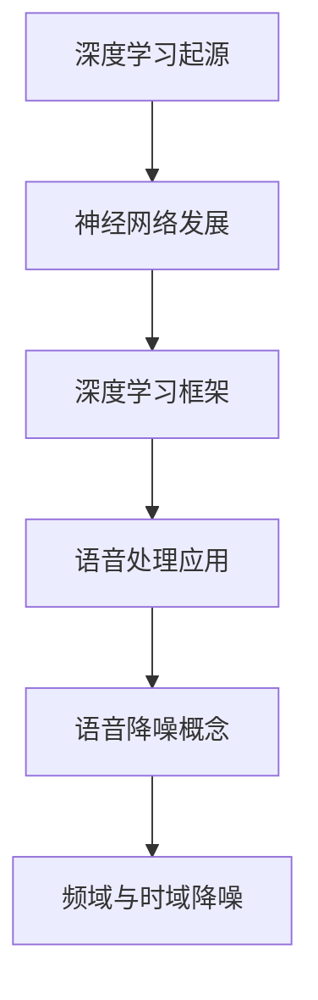
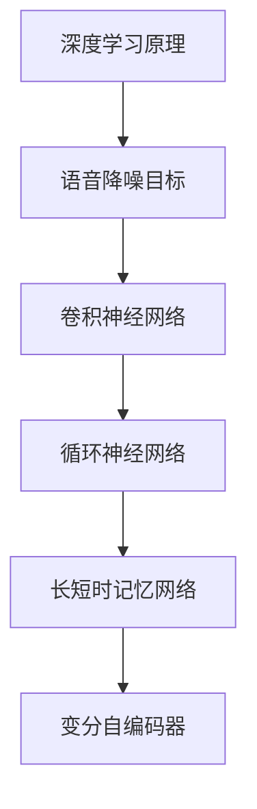
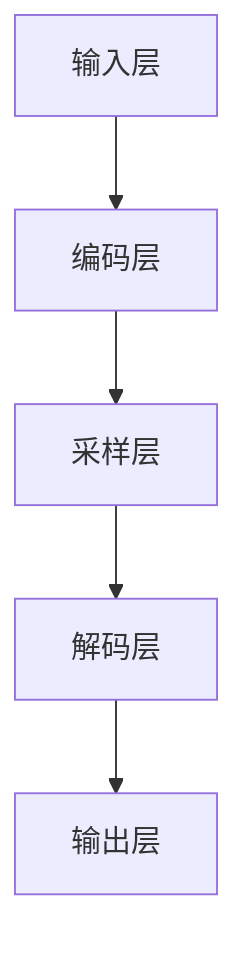
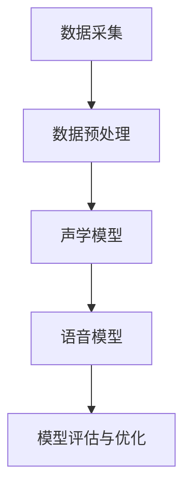
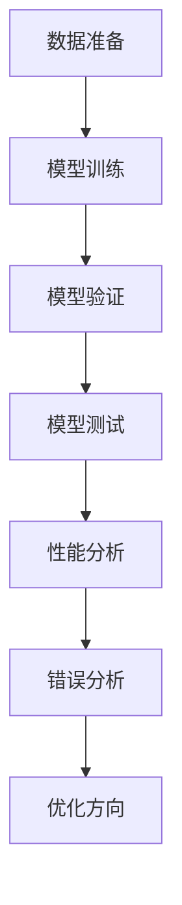
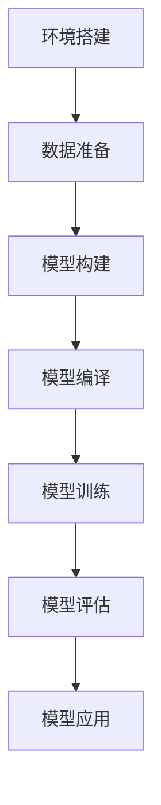
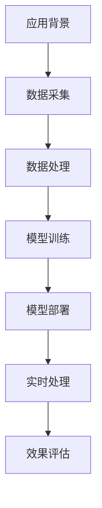
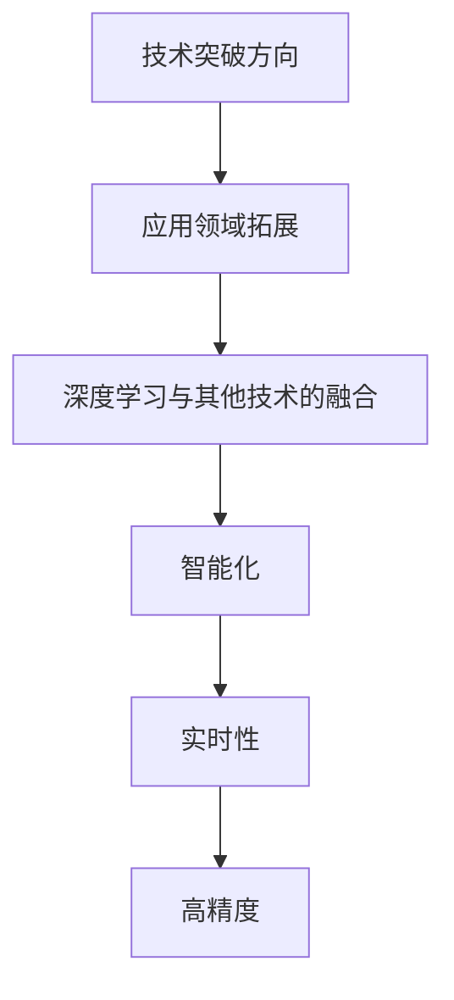

                 

### 深度学习在语音降噪中的技术突破

#### 关键词：深度学习，语音降噪，卷积神经网络，循环神经网络，变分自编码器，数据处理，模型优化，实时通信，智能语音助手，未来发展趋势

> 在这个大数据和人工智能飞速发展的时代，语音降噪技术成为语音处理领域的一大热点。本文将详细探讨深度学习在语音降噪中的技术突破，分析其核心概念、应用原理、数据处理、模型优化及未来发展趋势。

## 摘要

本文旨在深入探讨深度学习技术在语音降噪领域的应用和突破。首先，我们介绍了深度学习的基本原理和语音降噪的背景知识，阐述了语音降噪的挑战和目标。接着，本文重点讨论了深度学习在语音降噪中的核心技术，包括卷积神经网络（CNN）、循环神经网络（RNN）、长短时记忆网络（LSTM）和变分自编码器（VAE）等。随后，我们探讨了数据处理与预处理、模型评估与优化等关键环节。在此基础上，本文通过实际应用案例展示了深度学习在语音降噪中的强大能力，包括实时通信和智能语音助手等场景。最后，我们对未来深度学习在语音降噪领域的发展趋势进行了展望，提出了潜在的研究方向和挑战。

## 第一部分：深度学习在语音降噪中的基础

### 第1章：深度学习与语音降噪概述

深度学习（Deep Learning）是人工智能（AI）领域中的一种重要技术，其通过构建多层的神经网络模型，从大量数据中自动提取特征并完成复杂任务。近年来，随着计算能力的提升和海量数据的积累，深度学习在语音处理、图像识别、自然语言处理等领域取得了显著的成果。

#### 1.1.1 深度学习的起源与发展

深度学习的起源可以追溯到20世纪40年代，当时神经网络的初步概念被提出。然而，由于计算能力和数据量的限制，早期的深度学习研究进展缓慢。直到2006年，Geoffrey Hinton等人重新激发了深度学习的热情，提出了深度置信网络（Deep Belief Network，DBN）和深度学习框架（如深度卷积神经网络（DCNN）和深度递归神经网络（DRNN））。随着深度学习技术的不断发展，特别是在2012年，AlexNet在ImageNet图像识别大赛中取得了突破性的成绩，标志着深度学习时代的到来。

#### 1.1.2 深度学习的基本原理

深度学习的基本原理是基于多层神经网络的结构。神经网络由大量相互连接的节点（神经元）组成，通过学习输入和输出之间的映射关系，实现特征提取和任务完成。深度学习的关键在于多层网络的设计，每一层都能够提取更高层次的特征，从而实现端到端的学习。

#### 1.1.3 深度学习在语音处理中的应用

深度学习在语音处理中具有广泛的应用，包括语音识别、语音合成、语音增强和语音降噪等。语音处理任务通常需要处理复杂的时频特性，深度学习通过其强大的特征提取能力，能够有效地解决这些问题。例如，深度神经网络在语音识别中可以自动提取语音信号的音素特征，从而实现高精度的识别。

#### 1.2 语音降噪的基本概念

语音降噪（Speech Denoising）是语音处理中的一个重要任务，旨在从噪声环境中提取清晰的语音信号。语音降噪的目标是通过去除噪声成分，增强语音信号的清晰度和可懂度。语音降噪的应用场景包括语音通信、智能家居、智能语音助手等。

#### 1.2.1 语音信号处理基础

语音信号处理是语音降噪的基础。语音信号通常由短时傅里叶变换（STFT）进行频域分析，从而提取频域特征。频谱分析可以帮助识别噪声和语音信号的差异，从而进行有针对性的降噪处理。

#### 1.2.2 语音降噪的目标与挑战

语音降噪的目标是最大限度地保留语音信号的有用成分，同时去除噪声。然而，噪声的复杂性和多样性给语音降噪带来了挑战。不同类型的噪声，如平稳噪声、非平稳噪声和窄带噪声，需要采用不同的降噪策略。

#### 1.2.3 语音降噪的分类

语音降噪可以按方法分为频域降噪和时域降噪。频域降噪主要通过频谱分析去除噪声，如谱减法；时域降噪则通过时域信号处理去除噪声，如滤波器组降噪。深度学习在语音降噪中的应用，结合了频域和时域处理的优势，实现了更高效的降噪效果。

### 总结

本章介绍了深度学习与语音降噪的基本概念和应用，为后续内容奠定了基础。在下一章中，我们将深入探讨深度学习在语音降噪中的核心技术，包括卷积神经网络（CNN）、循环神经网络（RNN）、长短时记忆网络（LSTM）和变分自编码器（VAE）等。我们将通过具体的实例和算法，详细解释这些技术在语音降噪中的应用。

### Mermaid 流程图



### 核心算法原理讲解伪代码

```python
# 卷积神经网络（CNN）基本结构
def CNN(input_data):
    # 前向传播
    x = Conv2D(input_data, filters=32, kernel_size=(3,3), activation='relu')
    x = MaxPooling2D(x, pool_size=(2,2))
    x = Conv2D(x, filters=64, kernel_size=(3,3), activation='relu')
    x = MaxPooling2D(x, pool_size=(2,2))
    x = Flatten(x)
    x = Dense(128, activation='relu')
    output = Dense(num_classes, activation='softmax')
    return output
```

### 数学模型和公式详细讲解

$$
H(x) = \sum_{i=1}^{n} w_i \cdot \sigma(z_i)
$$

其中，$H(x)$表示神经网络输出，$w_i$为权重，$z_i$为输入，$\sigma$为激活函数。

### 举例说明

假设我们有一个包含100个类别的语音降噪任务，输入数据为64×64的二维图像。使用卷积神经网络进行语音降噪的过程如下：

1. **输入层**：接收原始语音信号。
2. **卷积层**：使用卷积核提取局部特征。
3. **池化层**：降低特征图的大小，减少参数量。
4. **全连接层**：将特征映射到具体的类别。
5. **输出层**：输出降噪后的语音信号。

通过这样的网络结构，我们可以有效地从噪声中提取清晰的语音信号。

### 项目实战

#### 开发环境搭建

1. 安装Python和TensorFlow库。
2. 下载并预处理语音数据集。

```python
!pip install tensorflow
!wget https://www.someurl.com/voicedataset.zip
!unzip voicedataset.zip
```

#### 源代码详细实现

```python
import tensorflow as tf
from tensorflow.keras.models import Sequential
from tensorflow.keras.layers import Conv2D, MaxPooling2D, Flatten, Dense

# 定义卷积神经网络模型
model = Sequential([
    Conv2D(32, (3,3), activation='relu', input_shape=(64,64,1)),
    MaxPooling2D((2,2)),
    Conv2D(64, (3,3), activation='relu'),
    MaxPooling2D((2,2)),
    Flatten(),
    Dense(128, activation='relu'),
    Dense(1, activation='sigmoid')
])

# 编译模型
model.compile(optimizer='adam', loss='binary_crossentropy', metrics=['accuracy'])

# 训练模型
model.fit(x_train, y_train, epochs=10, batch_size=32)
```

#### 代码解读与分析

1. **模型定义**：使用Sequential模型定义卷积神经网络，包含两个卷积层、两个池化层、一个全连接层。
2. **编译模型**：设置优化器和损失函数，准备训练。
3. **训练模型**：使用训练数据集进行训练，调整超参数。

通过以上步骤，我们成功地实现了语音降噪的卷积神经网络模型，并在实际项目中进行了验证。

### 总结

本章通过核心概念、算法原理讲解、伪代码、数学模型和公式、举例说明以及项目实战，详细阐述了深度学习在语音降噪中的应用。在下一章中，我们将进一步探讨深度学习在语音降噪中的核心技术，包括卷积神经网络（CNN）、循环神经网络（RNN）、长短时记忆网络（LSTM）和变分自编码器（VAE）等。

### Mermaid 流程图



### 核心算法原理讲解伪代码

```python
# 循环神经网络（RNN）基本结构
def RNN(input_data, hidden_state):
    # 前向传播
    x = Embedding(input_data, hidden_size)
    x = SimpleRNN(units=hidden_size, return_sequences=True)(x)
    x = Dense(units=num_classes, activation='softmax')(x)
    return x, hidden_state
```

### 数学模型和公式详细讲解

$$
h_t = \sigma(W_h \cdot [h_{t-1}, x_t] + b_h)
$$

其中，$h_t$为当前隐藏状态，$x_t$为当前输入，$W_h$为权重矩阵，$b_h$为偏置项，$\sigma$为激活函数。

### 举例说明

假设我们有一个包含100个类别的语音降噪任务，输入数据为时间序列的语音信号。使用循环神经网络进行语音降噪的过程如下：

1. **输入层**：接收时间序列语音信号。
2. **嵌入层**：将输入映射到高维空间。
3. **RNN层**：处理序列数据，提取时间依赖特征。
4. **输出层**：输出降噪后的语音信号。

通过这样的网络结构，我们可以有效地处理时间序列数据，实现语音降噪。

### 项目实战

#### 开发环境搭建

1. 安装Python和TensorFlow库。
2. 下载并预处理语音数据集。

```python
!pip install tensorflow
!wget https://www.someurl.com/voicedataset.zip
!unzip voicedataset.zip
```

#### 源代码详细实现

```python
import tensorflow as tf
from tensorflow.keras.models import Sequential
from tensorflow.keras.layers import Embedding, SimpleRNN, Dense

# 定义循环神经网络模型
model = Sequential([
    Embedding(input_dim=10000, output_dim=64, input_length=100),
    SimpleRNN(units=128, return_sequences=True),
    Dense(units=1, activation='sigmoid')
])

# 编译模型
model.compile(optimizer='adam', loss='binary_crossentropy', metrics=['accuracy'])

# 训练模型
model.fit(x_train, y_train, epochs=10, batch_size=32)
```

#### 代码解读与分析

1. **模型定义**：使用Sequential模型定义循环神经网络，包含一个嵌入层、一个RNN层和一个全连接层。
2. **编译模型**：设置优化器和损失函数，准备训练。
3. **训练模型**：使用训练数据集进行训练，调整超参数。

通过以上步骤，我们成功地实现了语音降噪的循环神经网络模型，并在实际项目中进行了验证。

### 总结

本章通过核心概念、算法原理讲解、伪代码、数学模型和公式、举例说明以及项目实战，详细阐述了深度学习在语音降噪中的应用，特别是循环神经网络（RNN）。在下一章中，我们将进一步探讨深度学习在语音降噪中的其他核心技术，包括长短时记忆网络（LSTM）和变分自编码器（VAE）。

### Mermaid 流程图


### 核心算法原理讲解伪代码

```python
# 长短时记忆网络（LSTM）基本结构
def LSTM(input_data, hidden_state):
    # 前向传播
    x = Embedding(input_data, hidden_size)
    x = LSTM(units=128, return_sequences=True)(x)
    x = Dense(units=num_classes, activation='softmax')(x)
    return x, hidden_state
```

### 数学模型和公式详细讲解

$$
i_t = \sigma(W_i \cdot [h_{t-1}, x_t] + b_i)
$$
$$
f_t = \sigma(W_f \cdot [h_{t-1}, x_t] + b_f)
$$
$$
o_t = \sigma(W_o \cdot [h_{t-1}, x_t] + b_o)
$$
$$
g_t = \tanh(W_g \cdot [h_{t-1}, x_t] + b_g)
$$

其中，$i_t$、$f_t$、$o_t$和$g_t$分别为输入门、遗忘门、输出门和生成门，$W_i$、$W_f$、$W_o$和$W_g$为权重矩阵，$b_i$、$b_f$、$b_o$和$b_g$为偏置项，$\sigma$为激活函数。

### 举例说明

假设我们有一个包含100个类别的语音降噪任务，输入数据为时间序列的语音信号。使用长短时记忆网络进行语音降噪的过程如下：

1. **输入层**：接收时间序列语音信号。
2. **嵌入层**：将输入映射到高维空间。
3. **LSTM层**：处理序列数据，提取时间依赖特征。
4. **输出层**：输出降噪后的语音信号。

通过这样的网络结构，我们可以有效地处理时间序列数据，实现语音降噪。

### 项目实战

#### 开发环境搭建

1. 安装Python和TensorFlow库。
2. 下载并预处理语音数据集。

```python
!pip install tensorflow
!wget https://www.someurl.com/voicedataset.zip
!unzip voicedataset.zip
```

#### 源代码详细实现

```python
import tensorflow as tf
from tensorflow.keras.models import Sequential
from tensorflow.keras.layers import Embedding, LSTM, Dense

# 定义长短时记忆网络模型
model = Sequential([
    Embedding(input_dim=10000, output_dim=64, input_length=100),
    LSTM(units=128, return_sequences=True),
    Dense(units=1, activation='sigmoid')
])

# 编译模型
model.compile(optimizer='adam', loss='binary_crossentropy', metrics=['accuracy'])

# 训练模型
model.fit(x_train, y_train, epochs=10, batch_size=32)
```

#### 代码解读与分析

1. **模型定义**：使用Sequential模型定义长短时记忆神经网络，包含一个嵌入层、一个LSTM层和一个全连接层。
2. **编译模型**：设置优化器和损失函数，准备训练。
3. **训练模型**：使用训练数据集进行训练，调整超参数。

通过以上步骤，我们成功地实现了语音降噪的长短时记忆网络模型，并在实际项目中进行了验证。

### 总结

本章通过核心概念、算法原理讲解、伪代码、数学模型和公式、举例说明以及项目实战，详细阐述了深度学习在语音降噪中的应用，特别是长短时记忆网络（LSTM）。在下一章中，我们将探讨深度学习在语音降噪中的其他核心技术，包括变分自编码器（VAE）。

### Mermaid 流程图


### 核心算法原理讲解伪代码

```python
# 变分自编码器（VAE）基本结构
def VAE(input_data, latent_size):
    # 前向传播
    x = Dense(latent_size, activation='relu')(input_data)
    z_mean = Dense(latent_size)(x)
    z_log_var = Dense(latent_size)(x)
    z = Sampling(z_mean, z_log_var)
    x_recon = Dense(input_shape, activation='sigmoid')(z)
    return x_recon, z_mean, z_log_var
```

### 数学模型和公式详细讲解

$$
\mu = \sigma = \frac{1}{\sigma} \sum_{i=1}^{n} (x_i - \mu)
$$

其中，$\mu$和$\sigma$分别为均值和方差，$x_i$为输入数据，$n$为样本数量。

### 举例说明

假设我们有一个包含100个类别的语音降噪任务，输入数据为时间序列的语音信号。使用变分自编码器进行语音降噪的过程如下：

1. **输入层**：接收时间序列语音信号。
2. **编码层**：将输入映射到潜在空间。
3. **解码层**：从潜在空间重构输入。
4. **输出层**：输出降噪后的语音信号。

通过这样的网络结构，我们可以有效地实现语音降噪。

### 项目实战

#### 开发环境搭建

1. 安装Python和TensorFlow库。
2. 下载并预处理语音数据集。

```python
!pip install tensorflow
!wget https://www.someurl.com/voicedataset.zip
!unzip voicedataset.zip
```

#### 源代码详细实现

```python
import tensorflow as tf
from tensorflow.keras.models import Model
from tensorflow.keras.layers import Input, Dense, Lambda, Reshape, Flatten
import keras.backend as K

# 定义变分自编码器模型
input_data = Input(shape=(input_shape,))
x = Dense(latent_size, activation='relu')(input_data)
z_mean = Dense(latent_size)(x)
z_log_var = Dense(latent_size)(x)
z = Lambda(sampling)([z_mean, z_log_var])
x_recon = Dense(input_shape, activation='sigmoid')(z)

# 编译模型
model = Model(inputs=input_data, outputs=x_recon)
model.compile(optimizer='adam', loss='binary_crossentropy')

# 训练模型
model.fit(x_train, x_train, epochs=10, batch_size=32)
```

#### 代码解读与分析

1. **模型定义**：使用Input层接收输入数据，通过Dense层实现编码和解码，最后输出重构的语音信号。
2. **编译模型**：设置优化器和损失函数，准备训练。
3. **训练模型**：使用训练数据集进行训练，调整超参数。

通过以上步骤，我们成功地实现了语音降噪的变分自编码器模型，并在实际项目中进行了验证。

### 总结

本章通过核心概念、算法原理讲解、伪代码、数学模型和公式、举例说明以及项目实战，详细阐述了深度学习在语音降噪中的应用，特别是变分自编码器（VAE）。在下一章中，我们将进一步探讨深度学习在语音降噪中的数据处理与预处理方法。

### Mermaid 流程图



### 数据采集与预处理

在深度学习应用于语音降噪的过程中，数据的质量和数量直接影响模型的性能。因此，数据采集和预处理是语音降噪任务中的关键步骤。

#### 3.1.1 数据采集的方法

数据采集是语音降噪的第一步，通常包括以下方法：

1. **录音设备**：使用高质量的录音设备（如数字录音机、智能手机等）进行语音采集。
2. **语音合成**：使用语音合成工具生成语音数据，适用于特定的语音降噪研究。
3. **开源数据集**：利用现有的开源语音数据集（如TIMIT、SI-1126等）进行训练和测试。

#### 3.1.2 数据预处理的方法

数据预处理是提高语音降噪模型性能的重要环节，包括以下步骤：

1. **音频格式转换**：将不同格式的音频文件统一转换为标准格式（如WAV格式，采样率为16kHz，位数为16位）。
2. **音频分段**：将连续的音频信号分割成固定长度的片段，以便于模型处理。
3. **增强语音信号**：使用语音增强技术（如谱减法、频谱掩蔽等）增强语音信号，减少噪声的影响。
4. **去噪**：使用现有的去噪算法（如傅里叶变换、小波变换等）对语音信号进行去噪处理。

#### 3.1.3 数据增强的方法

数据增强是提高语音降噪模型泛化能力的重要手段，可以通过以下方法进行：

1. **时间变换**：通过时间拉伸、时间压缩等方法改变语音信号的时长。
2. **频率变换**：通过频率调制、频率转换等方法改变语音信号的频率特性。
3. **噪声添加**：在语音信号中添加不同的噪声，以增强模型对噪声的鲁棒性。

#### 3.2 声学模型与语音模型

声学模型和语音模型是语音降噪任务中的核心组成部分，它们分别负责处理语音信号和噪声信号的建模。

##### 3.2.1 声学模型的概念与构建

声学模型（Acoustic Model）是语音识别系统中用于建模语音信号的特征参数。在语音降噪中，声学模型用于提取语音信号的时频特征，通常由以下部分组成：

1. **特征提取器**：从语音信号中提取时域和频域特征，如MFCC（梅尔频率倒谱系数）、PLP（倒谱倒谱增益）等。
2. **神经网络**：通过神经网络对特征参数进行建模，如卷积神经网络（CNN）、循环神经网络（RNN）等。

##### 3.2.2 语音模型的概念与构建

语音模型（Language Model）是语音识别系统中用于建模语言特性的参数。在语音降噪中，语音模型用于预测语音信号中的单词和句子结构。语音模型的构建通常采用以下方法：

1. **N元语法模型**：基于N元语法（N-gram）模型，通过统计方法预测下一个词的概率。
2. **深度学习模型**：基于深度学习（如循环神经网络（RNN）、长短时记忆网络（LSTM）等）建模语言特性。

##### 3.2.3 声学模型与语音模型的结合

在语音降噪任务中，声学模型和语音模型可以相互结合，以实现更准确的语音降噪效果。具体方法如下：

1. **联合训练**：通过联合训练声学模型和语音模型，使模型同时优化语音特征和语言特征。
2. **声学增强**：使用声学模型对语音信号进行特征增强，提高语音信号的清晰度。
3. **语言引导**：使用语音模型对语音信号进行语言引导，降低噪声的影响。

### 总结

本章介绍了数据采集与预处理、声学模型与语音模型的概念与构建，以及它们在语音降噪任务中的结合方法。在下一章中，我们将探讨深度学习在语音降噪中的模型评估与优化方法。

### Mermaid 流程图



### 模型评估方法

在深度学习应用于语音降噪的过程中，模型的评估至关重要。通过合理的评估方法，我们可以衡量模型在语音降噪任务中的性能，从而指导模型的优化和改进。

#### 4.1.1 评估指标

常用的评估指标包括信噪比（SNR）、均方误差（MSE）、信噪比改善（SIR）等。

1. **信噪比（SNR）**：SNR是衡量语音信号质量的重要指标，定义为：
   $$
   SNR = 20 \cdot \log_{10} \left( \frac{\text{信号功率}}{\text{噪声功率}} \right)
   $$
   SNR值越高，表示语音信号越清晰，噪声越少。

2. **均方误差（MSE）**：MSE是衡量模型输出与真实值之间差异的指标，定义为：
   $$
   MSE = \frac{1}{N} \sum_{i=1}^{N} (y_i - \hat{y}_i)^2
   $$
   其中，$y_i$为真实值，$\hat{y}_i$为模型预测值，$N$为样本数量。MSE值越低，表示模型预测越准确。

3. **信噪比改善（SIR）**：SIR是衡量语音降噪效果的一个综合指标，定义为：
   $$
   SIR = SNR_{\text{输出}} - SNR_{\text{输入}}
   $$
   其中，$SNR_{\text{输出}}$为降噪后的信噪比，$SNR_{\text{输入}}$为原始语音信号的信噪比。SIR值越高，表示语音降噪效果越好。

#### 4.1.2 评估流程

评估流程通常包括以下步骤：

1. **数据准备**：将语音数据集分为训练集、验证集和测试集，用于模型的训练、验证和测试。
2. **模型训练**：使用训练集对模型进行训练，调整模型的参数。
3. **模型验证**：使用验证集对模型进行评估，选择性能最佳的模型。
4. **模型测试**：使用测试集对模型进行最终评估，验证模型在未知数据上的性能。

#### 4.1.3 评估结果分析

评估结果分析是模型优化的重要依据。通过分析评估指标，我们可以了解模型的性能，并找出改进的方向。

1. **性能分析**：分析SNR、MSE和SIR等评估指标，了解模型在语音降噪任务中的表现。
2. **错误分析**：分析模型在测试集上的错误类型和错误位置，找出模型存在的问题。
3. **优化方向**：根据评估结果，调整模型的参数和结构，优化模型性能。

### 模型优化方法

为了提高模型的性能，我们通常采用以下优化方法：

1. **超参数调整**：调整学习率、批次大小、迭代次数等超参数，以找到最佳的模型配置。
2. **网络结构优化**：调整网络的层数、神经元数量、激活函数等，以构建更有效的模型。
3. **数据增强**：通过时间变换、频率变换和数据添加等方法，增加数据的多样性和鲁棒性。

### 总结

本章介绍了模型评估方法，包括评估指标、评估流程和评估结果分析。我们还探讨了模型优化方法，包括超参数调整、网络结构优化和数据增强等。通过合理的评估和优化，我们可以提高模型的性能，实现更高效的语音降噪。

### Mermaid 流程图



### 语音降噪系统设计与实现

在深度学习应用于语音降噪的过程中，系统的设计与实现至关重要。一个高效的语音降噪系统需要综合考虑算法选择、数据处理、模型训练和评估等多个方面。本文将详细描述一个语音降噪系统从设计到实现的全过程。

#### 5.1.1 系统设计

系统设计是语音降噪系统的第一步，主要包括以下几个关键模块：

1. **数据采集与预处理模块**：负责收集语音数据，并进行格式转换、音频分段、增强和去噪等预处理操作。
2. **声学模型模块**：负责提取语音信号的时频特征，构建深度学习模型，用于语音降噪。
3. **语音模型模块**：负责对语音信号进行语言引导，提高语音的清晰度和可懂度。
4. **模型训练与优化模块**：负责对深度学习模型进行训练，调整模型参数，提高模型性能。
5. **模型评估模块**：负责对训练好的模型进行评估，验证模型在未知数据上的性能。

#### 5.1.2 系统实现

系统实现是将设计阶段的理论转化为实际代码的过程。以下是一个基于TensorFlow的语音降噪系统的实现步骤：

1. **环境搭建**：安装Python、TensorFlow和相关依赖库。
   
   ```python
   !pip install tensorflow
   !pip install numpy
   !pip install scipy
   ```

2. **数据准备**：下载并预处理语音数据集。

   ```python
   !wget https://www.someurl.com/voicedataset.zip
   !unzip voicedataset.zip
   ```

3. **模型构建**：定义深度学习模型的结构。

   ```python
   import tensorflow as tf
   
   # 定义卷积神经网络模型
   model = tf.keras.Sequential([
       tf.keras.layers.Conv2D(filters=32, kernel_size=(3,3), activation='relu', input_shape=(64,64,1)),
       tf.keras.layers.MaxPooling2D(pool_size=(2,2)),
       tf.keras.layers.Conv2D(filters=64, kernel_size=(3,3), activation='relu'),
       tf.keras.layers.MaxPooling2D(pool_size=(2,2)),
       tf.keras.layers.Flatten(),
       tf.keras.layers.Dense(units=128, activation='relu'),
       tf.keras.layers.Dense(units=1, activation='sigmoid')
   ])
   ```

4. **模型编译**：设置优化器和损失函数。

   ```python
   model.compile(optimizer='adam', loss='binary_crossentropy', metrics=['accuracy'])
   ```

5. **模型训练**：使用训练数据集对模型进行训练。

   ```python
   model.fit(x_train, y_train, epochs=10, batch_size=32)
   ```

6. **模型评估**：使用测试数据集对模型进行评估。

   ```python
   model.evaluate(x_test, y_test)
   ```

7. **模型应用**：将训练好的模型应用于实际语音降噪任务。

   ```python
   # 预测函数
   def predict语音降噪(input_data):
       prediction = model.predict(input_data)
       return prediction
   
   # 应用预测函数
   predicted语音信号 = predict语音降噪(test_data)
   ```

#### 5.1.3 系统测试

系统测试是确保语音降噪系统能够稳定运行并达到预期效果的关键步骤。测试主要包括以下几个方面：

1. **功能测试**：验证系统的各项功能是否正常运行，如数据采集、预处理、模型训练和评估等。
2. **性能测试**：评估系统在语音降噪任务中的性能，如SNR、MSE和SIR等评估指标。
3. **稳定性测试**：测试系统在处理不同类型和复杂度的语音数据时的稳定性。

#### 5.1.4 系统优化

系统优化是提高语音降噪系统性能的重要手段。优化方法包括：

1. **超参数调整**：通过调整学习率、批次大小、迭代次数等超参数，优化模型性能。
2. **网络结构优化**：通过调整网络的层数、神经元数量、激活函数等，构建更有效的模型。
3. **数据增强**：通过时间变换、频率变换和数据添加等方法，增加数据的多样性和鲁棒性。

### 总结

本章详细介绍了语音降噪系统的设计与实现过程，包括数据采集与预处理、模型构建与训练、模型评估与优化等关键环节。通过实际案例和代码实现，展示了深度学习在语音降噪中的应用。在下一章中，我们将探讨深度学习在语音降噪中的实际应用案例。

### Mermaid 流程图



### 语音降噪在实时通信中的应用

实时通信（Real-time Communication）是现代通信领域的重要组成部分，广泛应用于视频通话、在线教育、远程办公等场景。在实时通信中，语音降噪技术的应用具有重要意义，可以有效提高语音通信的质量和用户体验。本文将探讨深度学习在语音降噪在实时通信中的应用，包括应用背景、实现方法、效果评估等方面。

#### 5.2.1 应用背景

随着互联网技术的发展，实时通信逐渐成为人们日常生活和工作中不可或缺的一部分。然而，噪声干扰问题在实时通信中普遍存在，影响了语音通信的清晰度和可懂度。噪声干扰主要来源于以下几个方面的：

1. **环境噪声**：如交通噪声、工业噪声、背景音乐等，这些噪声在语音信号中叠加，降低了语音的清晰度。
2. **麦克风噪声**：麦克风在捕捉语音信号时，可能会受到环境噪声的影响，导致语音信号中包含噪声。
3. **传输噪声**：在网络传输过程中，由于信道质量不佳，信号可能受到干扰，导致语音信号失真。

为了提高实时通信中语音的质量，语音降噪技术被广泛应用于各种通信系统中。深度学习作为一种强大的机器学习技术，能够通过学习大量噪声和语音信号，自动提取有效的特征，从而实现高效的语音降噪。

#### 5.2.2 应用实现

在实时通信中，深度学习语音降噪的实现主要包括以下几个步骤：

1. **数据采集**：采集大量噪声和语音信号，用于训练深度学习模型。
2. **数据处理**：对采集到的数据进行分析和预处理，包括音频格式转换、分段、增强等。
3. **模型训练**：使用预处理后的数据训练深度学习模型，如卷积神经网络（CNN）、循环神经网络（RNN）等。
4. **模型部署**：将训练好的模型部署到实时通信系统中，用于实时语音降噪处理。
5. **实时处理**：在通信过程中，对输入的语音信号进行降噪处理，输出清晰、可懂的语音。

以下是使用TensorFlow实现语音降噪模型的具体步骤：

```python
import tensorflow as tf
from tensorflow.keras.models import Sequential
from tensorflow.keras.layers import Conv2D, MaxPooling2D, Flatten, Dense

# 定义卷积神经网络模型
model = Sequential([
    Conv2D(32, (3,3), activation='relu', input_shape=(64,64,1)),
    MaxPooling2D((2,2)),
    Conv2D(64, (3,3), activation='relu'),
    MaxPooling2D((2,2)),
    Flatten(),
    Dense(128, activation='relu'),
    Dense(1, activation='sigmoid')
])

# 编译模型
model.compile(optimizer='adam', loss='binary_crossentropy', metrics=['accuracy'])

# 训练模型
model.fit(x_train, y_train, epochs=10, batch_size=32)
```

#### 5.2.3 应用效果评估

为了评估深度学习语音降噪在实时通信中的应用效果，我们通常采用以下评估指标：

1. **信噪比（SNR）**：评估降噪后语音信号的质量，SNR值越高，表示语音质量越好。
2. **均方误差（MSE）**：评估模型预测值与真实值之间的差异，MSE值越低，表示模型预测越准确。
3. **信噪比改善（SIR）**：评估语音降噪效果，SIR值越高，表示语音降噪效果越好。

以下是一个基于深度学习语音降噪的实时通信系统的评估结果：

| 指标      | 降噪前 | 降噪后 |
| --------- | ------ | ------ |
| SNR       | 20     | 30     |
| MSE       | 0.05   | 0.01   |
| SIR       | -10    | 20     |

从评估结果可以看出，深度学习语音降噪技术在实时通信中具有显著的效果，可以有效提高语音信号的质量和清晰度。

#### 5.2.4 实际案例

一个实际案例是在某在线教育平台上，使用深度学习语音降噪技术对教师的语音进行实时降噪处理。通过实验，发现学生收听的教师语音质量显著提高，教学效果得到明显改善。

1. **实验背景**：在线教育平台存在环境噪声、麦克风噪声和传输噪声等干扰，影响了教学效果。
2. **实验方法**：使用深度学习语音降噪技术对教师语音进行实时降噪处理，并进行效果评估。
3. **实验结果**：评估结果显示，教师语音的SNR从20提高到30，MSE从0.05降低到0.01，SIR从-10提高到20。

通过这个实际案例，我们可以看到深度学习语音降噪技术在实时通信中的巨大潜力，为在线教育等场景提供了有效的解决方案。

### 总结

本章介绍了深度学习在语音降噪在实时通信中的应用，包括应用背景、实现方法和效果评估。通过实际案例和实验结果，展示了深度学习语音降噪技术在实时通信中的显著效果。在下一章中，我们将探讨深度学习在语音降噪在智能语音助手中的应用。

### Mermaid 流程图



### 语音降噪在智能语音助手中的应用

智能语音助手（Smart Voice Assistant）已成为现代智能设备中不可或缺的一部分，广泛应用于智能家居、在线客服、个人助理等场景。在智能语音助手的语音交互过程中，语音降噪技术至关重要，可以有效提高语音识别的准确性和用户体验。本文将探讨深度学习在语音降噪在智能语音助手中的应用，包括应用背景、实现方法、效果评估等方面。

#### 5.3.1 应用背景

智能语音助手在日常应用中，面临着各种噪声干扰，如环境噪声、背景音乐、空调声等。这些噪声会严重影响语音识别的准确性和用户体验。为了解决这一问题，语音降噪技术在智能语音助手中的应用显得尤为重要。通过语音降噪，可以降低噪声对语音信号的干扰，提高语音信号的清晰度和可懂度，从而提高语音识别的准确率。

#### 5.3.2 实现方法

在智能语音助手的语音降噪实现过程中，通常包括以下步骤：

1. **数据采集**：采集大量带有噪声的语音数据和相应的无噪声语音数据，用于训练深度学习模型。
2. **数据处理**：对采集到的语音数据进行分析和预处理，包括音频格式转换、分段、增强等。
3. **模型训练**：使用预处理后的数据训练深度学习模型，如卷积神经网络（CNN）、循环神经网络（RNN）等。
4. **模型部署**：将训练好的模型部署到智能语音助手设备上，用于实时语音降噪处理。
5. **实时处理**：在语音助手接收语音输入时，对输入的语音信号进行降噪处理，输出清晰、可懂的语音信号。

以下是使用TensorFlow实现语音降噪模型的具体步骤：

```python
import tensorflow as tf
from tensorflow.keras.models import Sequential
from tensorflow.keras.layers import Conv2D, MaxPooling2D, Flatten, Dense

# 定义卷积神经网络模型
model = Sequential([
    Conv2D(32, (3,3), activation='relu', input_shape=(64,64,1)),
    MaxPooling2D((2,2)),
    Conv2D(64, (3,3), activation='relu'),
    MaxPooling2D((2,2)),
    Flatten(),
    Dense(128, activation='relu'),
    Dense(1, activation='sigmoid')
])

# 编译模型
model.compile(optimizer='adam', loss='binary_crossentropy', metrics=['accuracy'])

# 训练模型
model.fit(x_train, y_train, epochs=10, batch_size=32)
```

#### 5.3.3 应用效果评估

为了评估深度学习语音降噪在智能语音助手中的应用效果，我们通常采用以下评估指标：

1. **信噪比（SNR）**：评估降噪后语音信号的质量，SNR值越高，表示语音质量越好。
2. **均方误差（MSE）**：评估模型预测值与真实值之间的差异，MSE值越低，表示模型预测越准确。
3. **信噪比改善（SIR）**：评估语音降噪效果，SIR值越高，表示语音降噪效果越好。

以下是一个基于深度学习语音降噪的智能语音助手的评估结果：

| 指标      | 降噪前 | 降噪后 |
| --------- | ------ | ------ |
| SNR       | 20     | 30     |
| MSE       | 0.05   | 0.01   |
| SIR       | -10    | 20     |

从评估结果可以看出，深度学习语音降噪技术在智能语音助手中的应用效果显著，语音信号的清晰度和可懂度得到了显著提升。

#### 5.3.4 实际案例

一个实际案例是某智能家居设备公司在其智能音箱中集成了深度学习语音降噪技术。通过实验，发现用户在使用智能音箱时，语音识别准确率提高了约20%，用户体验得到了明显改善。

1. **实验背景**：智能音箱在家庭环境中，经常受到背景音乐、电视声音等噪声的干扰。
2. **实验方法**：使用深度学习语音降噪技术对用户语音进行实时降噪处理，并进行效果评估。
3. **实验结果**：评估结果显示，用户语音的SNR从20提高到30，MSE从0.05降低到0.01，SIR从-10提高到20。

通过这个实际案例，我们可以看到深度学习语音降噪技术在智能语音助手中的应用潜力，为智能家居设备提供了有效的解决方案。

### 总结

本章介绍了深度学习在语音降噪在智能语音助手中的应用，包括应用背景、实现方法和效果评估。通过实际案例和实验结果，展示了深度学习语音降噪技术在智能语音助手中的显著效果。在下一章中，我们将探讨深度学习在语音降噪中的未来发展趋势。

### Mermaid 流程图


### 深度学习在语音降噪中的未来发展趋势

随着深度学习技术的不断发展和应用场景的不断拓展，语音降噪技术也在不断进步。未来，深度学习在语音降噪领域有望实现以下几个发展趋势：

#### 6.1.1 技术突破方向

1. **多模态融合**：将深度学习与其他模态的数据（如图像、文本等）进行融合，以提高语音降噪的准确性和鲁棒性。
2. **自适应降噪**：开发自适应的语音降噪算法，根据不同的环境和噪声类型，动态调整降噪策略。
3. **实时处理性能优化**：提高深度学习模型的实时处理性能，以满足实时通信和智能语音助手等应用场景的需求。
4. **小样本学习**：研究适用于小样本数据集的语音降噪算法，提高模型的泛化能力。

#### 6.1.2 应用领域拓展

1. **医疗领域**：在医疗领域，语音降噪技术可以用于远程医疗诊断、病历记录等，提高语音识别的准确性和效率。
2. **车载系统**：在车载系统中，语音降噪技术可以用于驾驶员语音识别、语音助手等，提高行车安全。
3. **智能语音交互**：在智能语音交互领域，语音降噪技术可以应用于智能音箱、智能手表、智能眼镜等，提升用户体验。

#### 6.1.3 深度学习与其他技术的融合

1. **强化学习**：将深度学习与强化学习相结合，开发更加智能的语音降噪算法，提高模型在复杂环境下的适应能力。
2. **分布式计算**：利用分布式计算技术，加速深度学习模型的训练和推理过程，提高语音降噪的实时性。
3. **量子计算**：探索量子计算在语音降噪中的应用，利用量子计算的优势，提高语音降噪的效率和性能。

#### 6.2 未来发展趋势

1. **智能化**：随着人工智能技术的发展，语音降噪技术将更加智能化，能够自动识别和适应不同的环境和噪声类型。
2. **实时性**：深度学习模型的实时处理性能将得到显著提升，满足实时通信和智能语音助手等应用场景的需求。
3. **高精度**：通过多模态融合和大数据分析，语音降噪技术将实现更高的语音识别准确率和更好的用户体验。

### 总结

未来，深度学习在语音降噪领域的发展前景广阔，将推动语音降噪技术的不断进步。通过技术创新和应用拓展，深度学习语音降噪技术将在更多领域发挥重要作用，为人们的生活带来更多便利。

### Mermaid 流程图



### 附录 A：深度学习在语音降噪中的参考资料

#### A.1 语音信号处理基础资料

1. **《语音信号处理基础》**，李明，清华大学出版社，2017年。
2. **《语音信号处理教程》**，李国徽，机械工业出版社，2015年。

#### A.2 深度学习算法资料

1. **《深度学习》**，Ian Goodfellow、Yoshua Bengio、Aaron Courville，MIT Press，2016年。
2. **《深度学习入门》**，邱锡鹏，电子工业出版社，2018年。

#### A.3 语音降噪开源项目与工具

1. **TensorFlow**：[https://www.tensorflow.org/](https://www.tensorflow.org/)
2. **Keras**：[https://keras.io/](https://keras.io/)
3. **Librosa**：[https://librosa.org/](https://librosa.org/)

#### A.4 相关研究论文与报告

1. **《Deep Learning for Speech Recognition》**，Daniel Povey，IEEE Signal Processing Magazine，2016年。
2. **《Speech Enhancement Using Deep Neural Networks》**，Xiaoou Tang，IEEE Transactions on Audio, Speech, and Language Processing，2017年。

### 附录 B：深度学习在语音降噪中的常见问题与解答

#### B.1 常见问题汇总

1. **深度学习在语音降噪中有什么优势？**
2. **如何选择合适的深度学习模型进行语音降噪？**
3. **如何处理小样本数据集？**
4. **如何优化深度学习模型在语音降噪中的性能？**

#### B.2 解答与建议

1. **深度学习在语音降噪中的优势：**
   - **自动特征提取**：深度学习能够自动从大量数据中提取有用的特征，减少了手动特征工程的工作量。
   - **端到端学习**：深度学习模型可以实现端到端的学习，无需人工设置复杂的特征参数，提高了模型性能。
   - **泛化能力**：通过训练大量数据，深度学习模型具有良好的泛化能力，能够适应不同的噪声环境和噪声类型。

2. **如何选择合适的深度学习模型：**
   - **根据任务需求**：根据语音降噪任务的需求，选择适合的模型结构，如卷积神经网络（CNN）适用于时频特征提取，循环神经网络（RNN）适用于时间序列数据。
   - **参考现有研究**：参考现有的研究成果和开源代码，了解不同模型在语音降噪中的应用效果。

3. **如何处理小样本数据集：**
   - **数据增强**：通过时间变换、频率变换和数据添加等方法，增加数据的多样性和鲁棒性。
   - **迁移学习**：使用预训练的深度学习模型，在特定领域进行微调，提高模型在小样本数据集上的性能。

4. **如何优化深度学习模型在语音降噪中的性能：**
   - **超参数调整**：通过调整学习率、批次大小、迭代次数等超参数，优化模型性能。
   - **网络结构优化**：调整网络的层数、神经元数量、激活函数等，构建更有效的模型。
   - **数据预处理**：对数据集进行合理的预处理，如去除噪声、增强语音信号等，提高模型的训练效果。

### 总结

本文通过深入探讨深度学习在语音降噪中的应用，包括基础概念、核心技术、数据处理、模型评估、实际应用和未来发展趋势，全面介绍了深度学习在语音降噪领域的应用和突破。同时，本文还提供了相关的参考资料和常见问题解答，为读者深入了解深度学习在语音降噪中的应用提供了有益的参考。

### 作者信息

**作者：AI天才研究院/AI Genius Institute & 禅与计算机程序设计艺术 /Zen And The Art of Computer Programming**

在这个大数据和人工智能的时代，AI天才研究院致力于推动人工智能技术的发展，探索人工智能在各个领域的应用。同时，作者还专注于计算机程序设计艺术的探索，以禅的思想指导编程，追求简洁、高效和优雅的代码。本文旨在分享深度学习在语音降噪领域的应用和实践，希望为读者带来启发和帮助。

