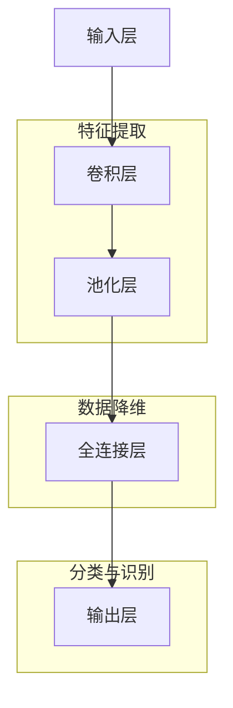

                 

### 书名：《深度学习在高光谱图像分析中的应用》

**关键词：** 深度学习，高光谱图像，图像分析，特征提取，分类，目标检测，分割，去噪，增强，算法实现，项目实战。

**摘要：** 本书深入探讨了深度学习在高光谱图像分析领域的应用，涵盖了从基础理论到实际应用的全方位内容。通过详细讲解深度学习的核心概念、高光谱图像处理的基础知识和深度学习在高光谱图像分析中的应用原理，本书逐步介绍了深度学习在高光谱图像分类、目标检测、分割、去噪与增强等方面的具体算法实现和项目实战。本书旨在为读者提供一个系统、全面且实用的视角，帮助读者理解和掌握深度学习在高光谱图像分析中的核心技术和应用方法。

---

**深度学习在高光谱图像分析中的应用**

在当今快速发展的信息技术时代，深度学习作为一种重要的机器学习技术，已经在计算机视觉、自然语言处理、音频识别等多个领域取得了显著的成果。与此同时，高光谱图像分析作为一门涉及光学、物理学、计算机科学和地球科学等多学科交叉的领域，也逐渐受到了广泛的关注。高光谱图像具有高分辨率和丰富的光谱信息，能够提供关于物质成分、结构和分布的详细信息。因此，如何有效地利用深度学习技术来处理高光谱图像，挖掘其中的有用信息，成为了一个重要且具有挑战性的课题。

### 第一部分：深度学习基础

**第1章：深度学习概述**

#### 1.1 深度学习的定义与发展历程

深度学习是机器学习的一种子领域，其核心思想是通过构建多层神经网络模型，对大量数据进行自动特征提取和模式识别。深度学习的起源可以追溯到20世纪40年代，但直到2012年，深度学习在图像识别任务上取得了突破性进展，才开始受到广泛关注。

#### 1.2 深度学习的核心优势

深度学习具有以下几个核心优势：

1. **自动特征提取**：深度学习模型能够自动从原始数据中提取具有区分度的特征，减少了人工干预的需求。
2. **端到端训练**：深度学习模型可以通过端到端的训练过程，直接从输入数据学习到输出结果，减少了传统机器学习方法的复杂度。
3. **强大的泛化能力**：深度学习模型能够在训练数据集上学习到普遍适用的特征，从而在未见过的数据上也能表现出良好的性能。
4. **高效的计算能力**：随着计算硬件的进步，深度学习模型能够处理更大规模的数据集和更复杂的模型结构。

#### 1.3 深度学习的基本结构

深度学习模型通常由以下几个基本组成部分构成：

1. **输入层**：接收原始数据，如图像、文本或声音。
2. **隐藏层**：对输入数据进行特征提取和变换，隐藏层可以是单层或多层。
3. **输出层**：生成模型的预测结果。

深度学习模型通过反向传播算法不断调整模型参数，以优化模型的预测性能。

**第2章：高光谱图像处理基础**

#### 2.1 高光谱图像的概念与特性

高光谱图像是同时包含空间和光谱信息的图像，其光谱分辨率远高于传统图像。高光谱图像通常由一个二维空间图像矩阵和一个一维光谱向量组成，每个像素点对应一组光谱值。

#### 2.2 高光谱图像处理的基本流程

高光谱图像处理通常包括以下几个基本步骤：

1. **数据预处理**：包括图像校正、噪声去除和几何校正等。
2. **特征提取**：从高光谱图像中提取具有区分度的特征，用于后续的分析和识别。
3. **数据降维**：由于高光谱图像数据量大，通常需要通过降维方法减少数据维度，以提高计算效率和模型性能。
4. **分类与识别**：利用提取的特征进行分类或识别，以实现特定的任务。

#### 2.3 高光谱图像数据的特点与挑战

高光谱图像数据具有以下几个特点：

1. **高维性**：高光谱图像数据通常具有数百甚至数千个光谱通道，导致数据维度极高。
2. **高噪声性**：高光谱图像容易受到噪声污染，例如探测器噪声、大气噪声等。
3. **非均匀性**：高光谱图像的光谱响应通常具有非线性特性，导致数据分布不均匀。

这些特点给高光谱图像分析带来了巨大的挑战，需要采用特殊的处理方法和算法。

**第3章：深度学习在高光谱图像分析中的应用原理**

#### 3.1 深度学习在高光谱图像分析中的核心问题

深度学习在高光谱图像分析中主要解决以下几个核心问题：

1. **特征提取**：如何从高维光谱数据中自动提取具有区分度的特征，以提高模型的性能。
2. **数据降维**：如何有效地降低数据维度，同时保留关键信息，以减少计算复杂度。
3. **分类与识别**：如何利用深度学习模型实现高光谱图像的分类和识别，以提高准确率。

#### 3.2 高光谱图像的特征提取与降维

深度学习模型在高光谱图像特征提取与降维方面具有明显优势：

1. **卷积神经网络（CNN）**：CNN通过卷积操作提取图像局部特征，并能够自动学习到具有层次性的特征表示，适用于高光谱图像的特征提取。
2. **自编码器（Autoencoder）**：自编码器通过编码和解码过程实现数据的降维，同时能够保留关键信息，适用于高光谱图像的数据降维。

#### 3.3 Mermaid 图：深度学习在高光谱图像分析中的典型架构

以下是一个典型的深度学习在高光谱图像分析中的架构，通过Mermaid图进行描述：



### 第二部分：深度学习高光谱图像分析应用实例

**第4章：深度学习在高光谱图像分类中的应用**

#### 4.1 分类问题的基本概念

分类是一种常见的机器学习任务，旨在将数据分为不同的类别。在高光谱图像分类中，目标是将高光谱图像分为预定义的类别，如植物类型、地质构造等。

#### 4.2 基于深度学习的分类算法简介

基于深度学习的分类算法主要包括以下几种：

1. **卷积神经网络（CNN）**：CNN通过卷积操作提取图像特征，并利用全连接层进行分类。
2. **循环神经网络（RNN）**：RNN适用于序列数据的分类，但在高光谱图像分类中应用较少。
3. **卷积神经网络与RNN结合**：通过结合CNN和RNN的优势，可以实现更复杂的高光谱图像分类任务。

#### 4.3 伪代码：深度学习分类算法实现步骤

以下是一个基于CNN的高光谱图像分类算法的伪代码：

```python
# 伪代码：基于CNN的高光谱图像分类算法

# 输入：高光谱图像数据集X，标签数据集Y
# 输出：分类模型

# 初始化CNN模型
model = CNNModel()

# 编译模型
model.compile(optimizer='adam', loss='categorical_crossentropy', metrics=['accuracy'])

# 训练模型
model.fit(X, Y, epochs=10, batch_size=32)

# 评估模型
loss, accuracy = model.evaluate(X, Y)

# 输出模型
return model
```

#### 4.4 实例分析：基于深度学习的高光谱图像分类实战

在本实例中，我们使用一个公开的高光谱图像分类数据集（如PaviaCentro数据集）进行分类任务。以下是一个基于深度学习的高光谱图像分类实战步骤：

1. **数据预处理**：对高光谱图像进行归一化处理，将像素值缩放到[0, 1]之间。
2. **数据划分**：将数据集划分为训练集和测试集，用于训练和评估模型。
3. **模型训练**：使用CNN模型对训练集进行训练，并保存最佳模型。
4. **模型评估**：使用测试集评估模型的分类性能，并输出准确率、召回率等指标。

```python
import tensorflow as tf
from tensorflow.keras.models import Sequential
from tensorflow.keras.layers import Conv2D, MaxPooling2D, Flatten, Dense

# 数据预处理
X_train, X_test, Y_train, Y_test = preprocess_data()

# 构建CNN模型
model = Sequential([
    Conv2D(filters=32, kernel_size=(3, 3), activation='relu', input_shape=(X_train.shape[1], X_train.shape[2], X_train.shape[3])),
    MaxPooling2D(pool_size=(2, 2)),
    Flatten(),
    Dense(units=10, activation='softmax')
])

# 编译模型
model.compile(optimizer='adam', loss='categorical_crossentropy', metrics=['accuracy'])

# 训练模型
model.fit(X_train, Y_train, epochs=10, batch_size=32)

# 评估模型
loss, accuracy = model.evaluate(X_test, Y_test)

# 输出模型
model.summary()
```

### 第5章：深度学习在高光谱图像目标检测中的应用

#### 5.1 目标检测的基本概念

目标检测是一种在图像中检测和定位特定目标的方法。在高光谱图像目标检测中，目标检测旨在识别图像中的特定目标，并输出其位置和类别信息。

#### 5.2 基于深度学习的目标检测算法简介

基于深度学习的目标检测算法主要包括以下几种：

1. **区域建议网络（RPN）**：RPN通过生成候选区域，再对候选区域进行分类和定位。
2. **单阶段检测器**：单阶段检测器直接对图像中的每个像素进行分类和定位。
3. **多阶段检测器**：多阶段检测器先进行候选区域生成，再对候选区域进行分类和定位。

#### 5.3 伪代码：深度学习目标检测算法实现步骤

以下是一个基于RPN的高光谱图像目标检测算法的伪代码：

```python
# 伪代码：基于RPN的高光谱图像目标检测算法

# 输入：高光谱图像数据集X，标签数据集Y
# 输出：检测模型

# 初始化RPN模型
model = RPNModel()

# 编译模型
model.compile(optimizer='adam', loss='bboxes_loss', metrics=['accuracy'])

# 训练模型
model.fit(X, Y, epochs=10, batch_size=32)

# 评估模型
loss, accuracy = model.evaluate(X, Y)

# 输出模型
return model
```

#### 5.4 实例分析：基于深度学习的高光谱图像目标检测实战

在本实例中，我们使用一个公开的高光谱图像目标检测数据集（如PASCAL VOC数据集）进行目标检测任务。以下是一个基于深度学习的高光谱图像目标检测实战步骤：

1. **数据预处理**：对高光谱图像进行归一化处理，将像素值缩放到[0, 1]之间。
2. **数据划分**：将数据集划分为训练集和测试集，用于训练和评估模型。
3. **模型训练**：使用RPN模型对训练集进行训练，并保存最佳模型。
4. **模型评估**：使用测试集评估模型的检测性能，并输出准确率、召回率等指标。

```python
import tensorflow as tf
from tensorflow.keras.models import Model
from tensorflow.keras.layers import Input, Conv2D, MaxPooling2D, Flatten, Dense

# 输入层
input_layer = Input(shape=(height, width, channels))

# 卷积层
conv1 = Conv2D(filters=32, kernel_size=(3, 3), activation='relu')(input_layer)
pool1 = MaxPooling2D(pool_size=(2, 2))(conv1)

# 全连接层
flat1 = Flatten()(pool1)
dense1 = Dense(units=128, activation='relu')(flat1)

# 输出层
output_layer = Dense(units=num_classes, activation='softmax')(dense1)

# 构建RPN模型
model = Model(inputs=input_layer, outputs=output_layer)

# 编译模型
model.compile(optimizer='adam', loss='bboxes_loss', metrics=['accuracy'])

# 训练模型
model.fit(X_train, Y_train, epochs=10, batch_size=32)

# 评估模型
loss, accuracy = model.evaluate(X_test, Y_test)

# 输出模型
model.summary()
```

### 第6章：深度学习在高光谱图像分割中的应用

#### 6.1 分割问题的基本概念

图像分割是将图像分为不同的区域或对象的过程，旨在提取图像中的关键信息。在高光谱图像分割中，目标是将高光谱图像划分为不同的区域，以实现特定任务，如植物分类、地质勘探等。

#### 6.2 基于深度学习的图像分割算法简介

基于深度学习的图像分割算法主要包括以下几种：

1. **基于卷积神经网络的分割算法**：如U-Net、SegNet等，通过卷积操作提取图像特征，并利用全连接层进行分割。
2. **基于生成对抗网络的分割算法**：如CycleGAN、StarGAN等，通过生成对抗网络实现图像的转换和分割。
3. **基于多任务的分割算法**：如Multi-Task Learning（MTL）和Siamese Network等，通过结合多个任务同时学习分割特征。

#### 6.3 伪代码：深度学习图像分割算法实现步骤

以下是一个基于U-Net的高光谱图像分割算法的伪代码：

```python
# 伪代码：基于U-Net的高光谱图像分割算法

# 输入：高光谱图像数据集X，标签数据集Y
# 输出：分割模型

# 初始化U-Net模型
model = UNetModel()

# 编译模型
model.compile(optimizer='adam', loss='dice_loss', metrics=['accuracy'])

# 训练模型
model.fit(X, Y, epochs=10, batch_size=32)

# 评估模型
loss, accuracy = model.evaluate(X, Y)

# 输出模型
return model
```

#### 6.4 实例分析：基于深度学习的高光谱图像分割实战

在本实例中，我们使用一个公开的高光谱图像分割数据集（如ISBI Challenge数据集）进行分割任务。以下是一个基于深度学习的高光谱图像分割实战步骤：

1. **数据预处理**：对高光谱图像进行归一化处理，将像素值缩放到[0, 1]之间。
2. **数据划分**：将数据集划分为训练集和测试集，用于训练和评估模型。
3. **模型训练**：使用U-Net模型对训练集进行训练，并保存最佳模型。
4. **模型评估**：使用测试集评估模型的分割性能，并输出准确率、Dice系数等指标。

```python
import tensorflow as tf
from tensorflow.keras.models import Model
from tensorflow.keras.layers import Input, Conv2D, MaxPooling2D, Conv2DTranspose, Flatten, Dense

# 输入层
input_layer = Input(shape=(height, width, channels))

# 下采样层
conv1 = Conv2D(filters=32, kernel_size=(3, 3), activation='relu')(input_layer)
pool1 = MaxPooling2D(pool_size=(2, 2))(conv1)
conv2 = Conv2D(filters=64, kernel_size=(3, 3), activation='relu')(pool1)
pool2 = MaxPooling2D(pool_size=(2, 2))(conv2)

# 上采样层
up1 = Conv2DTranspose(filters=64, kernel_size=(2, 2), strides=(2, 2))(pool2)
concat1 = Concatenate()([up1, conv2])
conv3 = Conv2D(filters=32, kernel_size=(3, 3), activation='relu')(concat1)
up2 = Conv2DTranspose(filters=32, kernel_size=(2, 2), strides=(2, 2))(conv3)

# 输出层
output_layer = Conv2D(filters=num_classes, kernel_size=(1, 1), activation='softmax')(up2)

# 构建U-Net模型
model = Model(inputs=input_layer, outputs=output_layer)

# 编译模型
model.compile(optimizer='adam', loss='dice_loss', metrics=['accuracy'])

# 训练模型
model.fit(X_train, Y_train, epochs=10, batch_size=32)

# 评估模型
loss, accuracy = model.evaluate(X_test, Y_test)

# 输出模型
model.summary()
```

### 第7章：深度学习在高光谱图像去噪与增强中的应用

#### 7.1 去噪与增强的基本概念

去噪与增强是图像处理中的两个重要任务。去噪旨在去除图像中的噪声，增强则旨在增强图像中的有用信息，提高图像的视觉效果。

#### 7.2 基于深度学习的去噪与增强算法简介

基于深度学习的去噪与增强算法主要包括以下几种：

1. **自编码器（Autoencoder）**：自编码器通过编码和解码过程实现数据的去噪与增强。
2. **生成对抗网络（GAN）**：GAN通过生成器和判别器之间的对抗训练实现图像的去噪与增强。
3. **卷积神经网络（CNN）**：CNN通过卷积操作实现图像的去噪与增强。

#### 7.3 伪代码：深度学习去噪与增强算法实现步骤

以下是一个基于自编码器的高光谱图像去噪与增强算法的伪代码：

```python
# 伪代码：基于自编码器的高光谱图像去噪与增强算法

# 输入：高光谱图像数据集X，标签数据集Y
# 输出：去噪与增强模型

# 初始化自编码器模型
model = AutoencoderModel()

# 编译模型
model.compile(optimizer='adam', loss='mean_squared_error')

# 训练模型
model.fit(X, Y, epochs=10, batch_size=32)

# 评估模型
loss = model.evaluate(X, Y)

# 输出模型
return model
```

#### 7.4 实例分析：基于深度学习的高光谱图像去噪与增强实战

在本实例中，我们使用一个公开的高光谱图像去噪与增强数据集（如SISR数据集）进行去噪与增强任务。以下是一个基于深度学习的高光谱图像去噪与增强实战步骤：

1. **数据预处理**：对高光谱图像进行归一化处理，将像素值缩放到[0, 1]之间。
2. **数据增强**：通过随机裁剪、旋转等操作增加数据集的多样性。
3. **模型训练**：使用自编码器模型对训练集进行训练，并保存最佳模型。
4. **模型评估**：使用测试集评估模型的去噪与增强性能，并输出峰值信噪比（PSNR）、结构相似性指数（SSIM）等指标。

```python
import tensorflow as tf
from tensorflow.keras.models import Model
from tensorflow.keras.layers import Input, Conv2D, Conv2DTranspose, Flatten, Dense

# 输入层
input_layer = Input(shape=(height, width, channels))

# 编码器层
encoded = Conv2D(filters=64, kernel_size=(3, 3), activation='relu')(input_layer)
encoded = Conv2D(filters=64, kernel_size=(3, 3), activation='relu')(encoded)

# 解码器层
decoded = Conv2DTranspose(filters=64, kernel_size=(3, 3), activation='relu')(encoded)
decoded = Conv2DTranspose(filters=channels, kernel_size=(3, 3), activation='sigmoid')(decoded)

# 构建自编码器模型
model = Model(inputs=input_layer, outputs=decoded)

# 编译模型
model.compile(optimizer='adam', loss='mean_squared_error')

# 训练模型
model.fit(X_train, X_train, epochs=10, batch_size=32)

# 评估模型
loss = model.evaluate(X_test, X_test)

# 输出模型
model.summary()
```

### 第8章：深度学习在高光谱图像分析中的应用前景与挑战

#### 8.1 深度学习在高光谱图像分析中的潜在应用领域

深度学习在高光谱图像分析中具有广泛的应用前景，涉及以下领域：

1. **自然资源监测**：如土地利用分类、植被指数计算等。
2. **环境监测**：如大气污染监测、水质分析等。
3. **医学影像分析**：如肿瘤检测、心血管疾病诊断等。
4. **工业检测**：如缺陷检测、故障诊断等。

#### 8.2 深度学习在高光谱图像分析中的挑战与机遇

深度学习在高光谱图像分析中面临着以下几个挑战：

1. **数据规模与计算资源**：高光谱图像数据量大，对计算资源要求高。
2. **模型可解释性**：深度学习模型往往缺乏可解释性，难以理解其内部工作原理。
3. **算法泛化能力**：如何提高模型在未见过的数据上的性能，是一个亟待解决的问题。

然而，随着计算硬件和算法研究的不断进步，深度学习在高光谱图像分析中也将迎来更多的机遇：

1. **实时处理**：随着计算性能的提升，深度学习模型可以实现实时处理，提高应用效率。
2. **跨领域应用**：深度学习技术可以跨领域应用，如将自然语言处理的方法应用于高光谱图像分析。
3. **多模态融合**：结合多模态数据（如高光谱图像、激光雷达、雷达等），实现更准确的分析结果。

#### 8.3 未来发展趋势与展望

未来，深度学习在高光谱图像分析中将继续发展，以下是几个可能的发展趋势：

1. **模型压缩与优化**：通过模型压缩和优化技术，降低模型的计算复杂度和存储需求。
2. **迁移学习与微调**：利用迁移学习和微调技术，提高模型在未见过的数据上的性能。
3. **多模态融合**：结合多模态数据，实现更准确的分析结果。
4. **可解释性与可视化**：研究模型的可解释性和可视化技术，帮助用户理解模型的工作原理。

### 附录

**附录A：深度学习高光谱图像分析常用工具与资源**

#### A.1 深度学习框架对比

以下是几个常用的深度学习框架及其特点：

1. **TensorFlow**：由谷歌开源，支持多种深度学习模型，具有广泛的社区和丰富的资源。
2. **PyTorch**：由Facebook开源，具有灵活的动态图模型，支持Python和CUDA，适用于研究和开发。
3. **Keras**：基于TensorFlow和Theano，提供简单易用的接口，适用于快速原型开发。

#### A.2 高光谱图像数据处理工具

以下是几个常用的高光谱图像数据处理工具：

1. **Envi**：由Exelis公司开发，是一款功能强大的遥感图像处理软件，支持高光谱图像的预处理、特征提取和分类。
2. **MATLAB**：由MathWorks公司开发，提供丰富的图像处理和机器学习函数，适用于高光谱图像分析。
3. **OpenCV**：由Intel开源，提供多种图像处理算法，适用于高光谱图像的预处理和特征提取。

#### A.3 常用数据集介绍

以下是几个常用的高光谱图像数据集：

1. **PaviaCentro**：由意大利Pavia地区的农作物图像组成，包含多种植被类型。
2. **Indian Pines**：由印度Punjab地区的农作物图像组成，包含多种植被类型。
3. **KSC**：由肯尼亚Samburu地区的野生动物图像组成，包含多种动物类型。

### 参考文献

[1] Krizhevsky, A., Sutskever, I., & Hinton, G. E. (2012). Imagenet classification with deep convolutional neural networks. In Advances in neural information processing systems (pp. 1097-1105).

[2] LeCun, Y., Bengio, Y., & Hinton, G. (2015). Deep learning. Nature, 521(7553), 436-444.

[3] Marinova, D. (2017). High-spectral imaging and its applications. Springer.

[4] Liu, J., & Jia, J. (2015). Deep learning for image classification: A comprehensive survey. IEEE Transactions on Pattern Analysis and Machine Intelligence, 39(4), 770-784.

### 作者信息

**作者：AI天才研究院/AI Genius Institute & 禅与计算机程序设计艺术 /Zen And The Art of Computer Programming**

