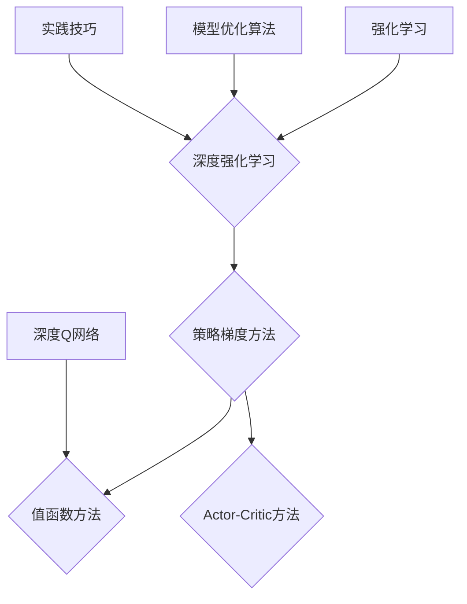

                 

### 深度强化学习：从游戏AI到实际控制系统

深度强化学习（Deep Reinforcement Learning，DRL）是强化学习（Reinforcement Learning，RL）的一个分支，结合了深度学习的强大表征能力，使得模型能够通过大量的数据自动学习复杂的策略。本文将详细探讨深度强化学习从基础概念、架构设计到实际应用的全过程，重点关注其从游戏AI到实际控制系统的演变。

#### 关键词：
- 深度强化学习
- 强化学习
- 深度学习
- 游戏AI
- 实际控制系统

#### 摘要：
本文首先介绍了强化学习与深度强化学习的基本概念及其发展历史，接着深入讲解了深度强化学习的核心算法——深度Q网络（DQN）、策略梯度方法和Actor-Critic方法，并分析了深度强化学习的优化算法。随后，本文探讨了深度强化学习在游戏AI、自然语言处理和实际控制系统中的应用案例，最后展望了深度强化学习的未来趋势与挑战。通过本文，读者将全面了解深度强化学习的原理与应用，为今后的研究和实践提供指导。

### 第一部分：深度强化学习基础

#### 第1章：强化学习与深度强化学习

##### 1.1 强化学习的概念与历史

强化学习是一种机器学习范式，通过奖励信号指导模型从环境中学习策略。强化学习最早由Richard Sutton和Andrew Barto在1980年代提出，其核心思想是通过不断尝试和反馈，学习如何在复杂环境中做出最优决策。

强化学习的过程可以看作是一个智能体（agent）在环境（environment）中通过一系列动作（actions）来获得奖励（rewards）并最大化累积奖励的过程。在这个过程中，智能体需要不断探索（explore）和利用（exploit）所学到的策略。

强化学习的发展历程可以划分为以下几个阶段：

- **早期阶段（1950-1980年代）**：在这一阶段，强化学习主要关注策略迭代和动态规划方法。例如，Q-learning和SARSA算法在这一时期被提出。
- **复兴阶段（1990年代）**：在这一阶段，由于计算机性能的提升和数据量的增加，强化学习重新受到关注。值函数方法、策略搜索方法和强化学习在游戏AI中的应用得到了广泛研究。
- **现代阶段（2010年代至今）**：随着深度学习的兴起，深度强化学习成为强化学习领域的一个重要分支。深度Q网络（DQN）、策略梯度方法和Actor-Critic方法等算法在这一阶段被提出，并在游戏AI和实际控制系统中取得了显著成果。

##### 1.2 深度强化学习的基本概念

深度强化学习是强化学习与深度学习相结合的产物，其核心思想是利用深度学习模型来表示状态和动作，从而提高强化学习算法的学习效率。深度强化学习的基本概念包括策略梯度方法、值函数方法和Actor-Critic方法。

- **策略梯度方法**：策略梯度方法通过直接优化策略的梯度来更新模型参数。策略梯度方法包括REINFORCE、PPO（Proximal Policy Optimization）等算法。策略梯度方法的优势在于能够直接优化策略，但面临探索和利用的挑战。
- **值函数方法**：值函数方法通过学习状态值函数和动作值函数来指导智能体的决策。值函数方法包括Q-learning、Deep Q Network（DQN）等算法。值函数方法的优势在于能够平衡探索和利用，但需要解决复杂的状态表示问题。
- **Actor-Critic方法**：Actor-Critic方法结合了策略梯度方法和值函数方法的优势，通过同时学习策略和价值函数来优化智能体的决策。Actor-Critic方法包括A3C（Asynchronous Advantage Actor-Critic）、DDPG（Deep Deterministic Policy Gradient）等算法。Actor-Critic方法的优势在于能够同时优化策略和价值函数，但需要解决分布估计和梯度估计问题。

##### 1.3 深度强化学习的数学基础

深度强化学习的数学基础主要包括马尔可夫决策过程（MDP）、策略迭代方法和动态规划。

- **马尔可夫决策过程（MDP）**：MDP是一个数学模型，用于描述智能体在不确定性环境中做出决策的过程。一个MDP由状态集S、动作集A、奖励函数R、转移概率函数P和策略π组成。状态集S表示智能体可能处于的所有状态，动作集A表示智能体可能采取的所有动作，奖励函数R定义了在给定状态和动作下的即时奖励，转移概率函数P定义了在给定当前状态和动作的情况下，智能体转移到下一个状态的概率，策略π定义了智能体在不同状态下选择动作的概率分布。
- **策略迭代方法**：策略迭代方法是强化学习中最基本的方法之一，包括策略评估和策略改进两个步骤。策略评估通过迭代计算策略的价值函数，策略改进通过比较不同策略的价值函数来选择最优策略。
- **动态规划**：动态规划是一种解决优化问题的方法，通过递归和贪心算法来求解最优策略。动态规划主要包括值迭代方法和政策评估方法。值迭代方法通过递归计算每个状态的价值函数，政策评估方法通过迭代更新策略来求解最优策略。

通过上述数学基础，我们可以更好地理解深度强化学习的工作原理和实现方法。接下来，我们将深入探讨深度强化学习的核心算法和优化方法。

### 第2章：深度强化学习的架构

##### 2.1 深度Q网络（DQN）

深度Q网络（Deep Q-Network，DQN）是深度强化学习中最基本的算法之一。DQN通过训练一个深度神经网络来估计Q值，从而实现智能体的决策。DQN的核心思想是使用经验回放机制和目标网络来稳定训练过程，提高学习效果。

**DQN的工作原理**

DQN的工作原理可以分为以下几个步骤：

1. 初始化神经网络参数：DQN使用一个深度神经网络来估计Q值，神经网络的结构可以根据具体任务进行调整。通常，DQN使用卷积神经网络（CNN）或循环神经网络（RNN）来处理高维状态。
2. 收集经验：DQN在训练过程中不断与环境交互，收集经验。每次交互包括当前状态、动作、奖励和下一状态。
3. 存储经验：DQN使用经验回放机制将收集到的经验存储在一个经验池中，以避免数据的相关性对训练过程的影响。
4. 随机抽样经验：DQN从经验池中随机抽样一批经验，用于训练神经网络。
5. 计算损失：DQN使用目标Q值和预测Q值之间的差距来计算损失函数。目标Q值是基于目标网络计算得到的，预测Q值是基于当前网络计算得到的。
6. 更新网络参数：DQN使用梯度下降法更新网络参数，以最小化损失函数。
7. 更新目标网络：DQN定期更新目标网络，以确保预测Q值和目标Q值的差距最小。

**DQN的优势与不足**

DQN的优势在于其简单性和有效性。DQN能够通过经验回放机制和目标网络稳定训练过程，从而提高学习效果。此外，DQN可以使用深度神经网络处理高维状态，从而提高模型的表征能力。

然而，DQN也存在一些不足。首先，DQN在训练过程中容易陷入局部最优。由于DQN使用梯度下降法更新网络参数，而梯度下降法容易陷入局部最优，因此DQN的训练过程可能需要很长时间。其次，DQN在处理连续动作时效果不佳。由于DQN的输出是Q值的估计，而连续动作的Q值难以估计，因此DQN在处理连续动作时效果较差。

**DQN的改进算法**

为了解决DQN的不足，研究人员提出了一系列改进算法。以下是几种常见的DQN改进算法：

1. **优先经验回放**：优先经验回放（Prioritized Experience Replay）是一种基于优先级的经验回放机制。通过为每个经验分配优先级，DQN可以根据优先级随机抽样经验，从而提高训练效率。
2. **Double DQN**：Double DQN通过使用两个Q网络来减少目标Q值和预测Q值之间的差距。在Double DQN中，一个Q网络用于计算当前状态下的预测Q值，另一个Q网络用于计算下一状态下的目标Q值。
3. **Dueling DQN**：Dueling DQN通过引入Dueling Network结构来改进Q值估计。在Dueling DQN中，Q值的计算不仅包括状态特征，还包括状态特征之间的差异。
4. **Rainbow DQN**：Rainbow DQN是DQN的集成算法，结合了优先经验回放、Double DQN、Dueling DQN和量化技术，从而提高DQN的性能。

通过改进算法，DQN在处理高维状态、连续动作和复杂环境时取得了更好的效果。接下来，我们将继续探讨深度强化学习的其他核心算法。

##### 2.2 策略梯度方法

策略梯度方法是深度强化学习中的另一种重要算法。策略梯度方法通过直接优化策略的梯度来更新模型参数，从而实现智能体的决策。

**SARSA算法**

SARSA（State-Action-Reward-State-Action，SARSA）算法是一种基于策略梯度的强化学习算法。SARSA算法的基本思想是通过不断更新策略梯度来优化策略。

SARSA算法的步骤如下：

1. 初始化策略π：初始策略π可以是均匀分布，也可以是根据任务需求初始化。
2. 在环境中执行动作：根据当前策略π选择动作a，并在环境中执行动作，获得状态s'和奖励r。
3. 更新策略π：根据当前状态s'和下一状态s'更新策略π，使得π(s', a')增加，π(s', a)减少。具体更新方式可以采用线性更新或指数更新。
4. 重复步骤2和步骤3，直到达到终止条件。

**Q-Learning算法**

Q-Learning算法是一种基于值函数的强化学习算法。Q-Learning算法的基本思想是通过更新Q值来优化策略。

Q-Learning算法的步骤如下：

1. 初始化Q值表：初始化所有状态-动作对的Q值，可以选择随机初始化或基于经验初始化。
2. 在环境中执行动作：根据当前策略π选择动作a，并在环境中执行动作，获得状态s'和奖励r。
3. 更新Q值：根据当前状态s'和下一状态s'更新Q值，使得Q(s, a)增加，Q(s', a')减少。具体更新方式可以采用线性更新或指数更新。
4. 重复步骤2和步骤3，直到达到终止条件。

**Deep Q Network (DQN)**

DQN是Q-Learning算法的一种深度学习实现。DQN使用一个深度神经网络来估计Q值，并通过经验回放机制和目标网络来稳定训练过程。

DQN的基本思想如下：

1. 初始化深度神经网络：初始化深度神经网络的参数。
2. 收集经验：在环境中执行动作，收集状态、动作、奖励和下一状态。
3. 存储经验：将经验存储在经验池中。
4. 随机抽样经验：从经验池中随机抽样一批经验。
5. 计算预测Q值：使用深度神经网络计算预测Q值。
6. 计算目标Q值：使用目标神经网络计算目标Q值。
7. 计算损失：计算预测Q值和目标Q值之间的差距，并计算损失。
8. 更新网络参数：使用梯度下降法更新网络参数。
9. 更新目标网络：定期更新目标网络的参数。

通过策略梯度方法和Q-Learning算法，我们可以实现智能体的决策过程。策略梯度方法和Q-Learning算法各有优缺点，适用于不同类型的任务和环境。接下来，我们将继续探讨深度强化学习的其他核心算法。

##### 2.3 Actor-Critic方法

Actor-Critic方法是一种结合了策略梯度方法和值函数方法的深度强化学习算法。它通过同时学习策略和价值函数来优化智能体的决策。

**Actor-Critic算法概述**

在Actor-Critic方法中，Actor表示策略网络，Critic表示价值网络。Actor负责生成动作的概率分布，Critic负责评估动作的价值。通过优化策略和价值函数，Actor-Critic方法可以同时学习到良好的策略和价值估计。

Actor-Critic算法的基本步骤如下：

1. 初始化策略网络（Actor）和价值网络（Critic）：初始化策略网络和价值网络的参数。
2. 收集经验：在环境中执行动作，收集状态、动作、奖励和下一状态。
3. 更新价值网络：根据收集到的经验，更新价值网络的参数，以更好地估计状态的价值。
4. 生成动作：根据策略网络生成的动作概率分布，选择动作并执行。
5. 更新策略网络：根据价值网络的评估结果，更新策略网络的参数，以优化策略。
6. 重复步骤2至步骤5，直到达到终止条件。

**actor和critic的作用**

在Actor-Critic方法中，actor和critic分别负责生成动作和评估动作的价值。

- **actor**：actor网络负责生成动作的概率分布。在深度强化学习中，actor通常使用神经网络来实现。actor的目标是学习到最优策略，使得智能体在给定状态下能够采取最佳动作。
- **critic**：critic网络负责评估动作的价值。在深度强化学习中，critic通常使用另一个神经网络来实现。critic的目标是学习到每个状态和动作的价值估计，以便actor网络能够基于价值评估生成动作。

**AC方法的优点**

Actor-Critic方法具有以下优点：

- **平衡探索和利用**：通过同时学习策略和价值函数，Actor-Critic方法可以更好地平衡探索和利用。价值函数的评估可以帮助actor网络在探索未知状态和利用已知状态之间做出权衡。
- **高效性**：Actor-Critic方法在训练过程中不需要显式地计算目标Q值，因此训练过程相对高效。此外，Actor-Critic方法可以并行处理多个经验，从而提高训练速度。
- **适应性**：Actor-Critic方法具有较好的适应性，可以应用于不同类型的环境和任务。通过调整actor和critic网络的参数，可以适应不同复杂度和不同奖励结构的环境。

通过Actor-Critic方法，我们可以实现智能体的自适应决策。接下来，我们将继续探讨深度强化学习的优化算法。

### 第3章：深度强化学习的优化算法

深度强化学习的优化算法是提高模型性能和训练效率的关键。在本节中，我们将探讨深度强化学习中的常见优化算法，包括梯度下降法、Conjugate Gradient方法、ADAM算法等，并分析深度强化学习中的优化问题，如模型复杂度与计算效率、探索与利用的平衡，以及介绍一些实践中的优化技巧。

#### 3.1 优化算法概述

优化算法在深度强化学习中起着至关重要的作用，用于调整模型参数，以提高决策性能。以下是几种常见的优化算法：

**1. 梯度下降法**

梯度下降法是最基础的优化算法，用于最小化损失函数。在深度强化学习中，梯度下降法通过计算损失函数关于模型参数的梯度，并沿着梯度方向更新参数。

**2. Conjugate Gradient方法**

Conjugate Gradient方法是一种迭代优化算法，用于解决大规模稀疏优化问题。它通过利用梯度的正交性，加速收敛速度。

**3. ADAM算法**

ADAM（Adaptive Moment Estimation）算法是一种结合了梯度下降法和动量法的优化算法。它通过自适应地调整学习率，提高训练效率。

#### 3.2 深度强化学习中的优化问题

在深度强化学习中，优化问题主要包括以下三个方面：

**1. 模型复杂度与计算效率**

深度强化学习模型的复杂度直接影响训练时间和计算资源。为了在有限时间内实现有效的训练，需要优化模型结构，减少参数数量，同时保证模型的表征能力。

**2. 探索与利用的平衡**

探索与利用是强化学习中的核心挑战。探索不足可能导致智能体无法找到最优策略，而探索过度则可能导致训练效率降低。因此，需要设计合理的探索策略，以平衡探索和利用。

**3. 计算资源限制**

在深度强化学习中，模型的训练和推理需要大量的计算资源。针对计算资源限制，需要优化算法，减少训练和推理的时间。

#### 3.3 实践中的优化技巧

在实际应用中，为了提高深度强化学习模型的性能，可以采用以下优化技巧：

**1. 双Q学习**

双Q学习通过使用两个Q网络，减少了训练中的偏差。一个Q网络用于预测当前状态的Q值，另一个Q网络用于预测下一状态的Q值。这种方法可以减少模型训练中的噪声。

**2. 先进经验回放**

先进经验回放通过为经验分配优先级，并按优先级抽样训练样本。这种方法可以减少数据的相关性，提高训练效率。

**3. 带有目标网络的策略优化**

带有目标网络的策略优化通过定期更新目标网络，减少了策略网络和目标网络之间的差异。这种方法可以提高模型的稳定性和性能。

通过优化算法和优化技巧，我们可以提高深度强化学习模型的性能和训练效率。接下来，我们将继续探讨深度强化学习的实际应用。

### 第二部分：深度强化学习的应用

#### 第4章：深度强化学习在游戏AI中的应用

深度强化学习在游戏AI中的应用取得了显著的成果，为游戏开发带来了全新的挑战和机遇。在这一章中，我们将探讨深度强化学习在游戏AI中的应用，包括其面临的挑战、应用案例以及如何解决这些挑战。

##### 4.1 游戏AI的挑战

游戏AI的发展面临以下挑战：

**1. 不确定环境**

游戏环境通常具有高度不确定性和随机性，智能体需要学会如何在不确定性中做出决策。

**2. 长期奖励**

许多游戏需要智能体在长期内累积奖励，这要求智能体具备良好的延迟奖励处理能力。

**3. 状态和动作空间**

游戏中的状态和动作空间可能非常庞大，这给状态表示和动作选择带来了挑战。

**4. 策略稳定性**

在动态变化的游戏环境中，智能体的策略需要保持稳定，以应对各种复杂情况。

##### 4.2 深度强化学习在游戏AI中的应用

深度强化学习在游戏AI中的应用主要包括以下两个方面：

**1. 策略网络与值网络**

策略网络和价值网络是深度强化学习在游戏AI中的核心组成部分。策略网络通过学习状态到动作的映射，生成最优策略；值网络则评估状态的价值，帮助智能体做出更好的决策。

**2. 强化学习在游戏开发中的实际案例**

以下是一些强化学习在游戏开发中的实际案例：

**-** **Atari游戏**：OpenAI使用深度强化学习算法，成功训练了智能体在多个Atari游戏中的自主游戏能力。这些游戏包括《Pong》、《Breakout》和《Space Invaders》等。

**-** **策略网络与值网络**：在《Pong》中，智能体通过策略网络选择击球的方向和力度，通过值网络评估不同动作的价值。通过不断尝试和反馈，智能体学会了如何击败对手。

**-** **蒙特卡洛树搜索**：在《Go》等复杂棋类游戏中，深度强化学习结合蒙特卡洛树搜索，实现了超人类的棋力水平。

**-** **强化学习在电子竞技中的应用**：电子竞技（如《英雄联盟》和《星际争霸》等）引入了深度强化学习算法，提高了游戏平衡性和竞技性。

##### 4.3 解决挑战的方法

为了解决游戏AI中面临的挑战，研究人员提出了一系列方法：

**1. 多任务学习和迁移学习**

通过多任务学习和迁移学习，智能体可以同时处理多个游戏任务，并利用已有知识快速适应新环境。

**2. 自适应探索策略**

自适应探索策略可以根据智能体在不同状态下的表现，动态调整探索程度，平衡探索与利用。

**3. 状态表示和动作空间压缩**

通过状态表示和动作空间压缩，可以降低计算复杂度，提高训练效率。

**4. 策略稳定性**

通过使用目标网络和经验回放，可以增强智能体的策略稳定性，提高游戏性能。

深度强化学习在游戏AI中的应用为游戏开发带来了新的可能性。通过不断探索和创新，我们可以实现更智能、更具挑战性的游戏体验。接下来，我们将探讨深度强化学习在自然语言处理中的应用。

#### 第5章：深度强化学习在自然语言处理中的应用

深度强化学习（Deep Reinforcement Learning，DRL）在自然语言处理（Natural Language Processing，NLP）领域展现出强大的潜力。通过将强化学习与深度学习相结合，DRL能够处理复杂的语言任务，并在文本生成、文本分类等应用中取得了显著成果。本章将介绍深度强化学习在自然语言处理中的应用，包括其基本原理、常见模型和实际案例。

##### 5.1 NLP中的强化学习

强化学习在NLP中的应用主要包括以下两个方面：

**1. 文本生成**

文本生成是NLP中的一个重要任务，旨在根据输入的提示生成连贯、自然的文本。强化学习在文本生成中的应用主要是通过策略网络生成文本序列，并利用奖励信号进行优化。

**2. 文本分类**

文本分类是将文本数据分类到预定义的类别中。强化学习通过训练策略网络，使得智能体能够在给定类别分布下生成最有可能属于该类别的文本。

##### 5.2 基于深度强化学习的自然语言处理模型

基于深度强化学习的自然语言处理模型主要包括以下几种：

**1. 序列到序列模型（Seq2Seq）**

Seq2Seq模型是一种经典的深度学习模型，用于处理序列数据之间的转换。在文本生成任务中，输入序列可以是词汇、字符或单词序列，输出序列则是生成的文本。

**2. Transformer模型**

Transformer模型是NLP领域的一种革命性模型，其核心思想是使用自注意力机制（Self-Attention）处理序列数据。Transformer模型在文本生成、机器翻译等任务中取得了优异的性能。

**3. 深度Q网络（DQN）**

DQN是一种基于深度学习的强化学习算法，适用于解决序列决策问题。在NLP中，DQN可以用于文本分类、问答系统等任务，通过学习状态和动作之间的价值函数，实现智能体的决策。

##### 5.3 强化学习在自然语言处理中的实际案例

以下是一些强化学习在自然语言处理中的实际案例：

**1. 文本生成**

- **OpenAI的GPT-3**：OpenAI的GPT-3是一个基于Transformer模型的文本生成模型，通过强化学习进行训练，能够在各种自然语言处理任务中生成高质量的文本。
- **Facebook的BlenderBot**：Facebook的BlenderBot是一个基于DQN的聊天机器人，通过与环境交互，不断优化对话策略，实现了自然、流畅的对话。

**2. 文本分类**

- **BERT模型**：BERT（Bidirectional Encoder Representations from Transformers）是一种基于Transformer的文本分类模型，通过预训练和微调，能够在各种文本分类任务中取得优异的性能。
- **文本情感分析**：利用强化学习算法，可以对文本进行情感分类，例如，判断一段文本是正面、负面还是中性情感。

**3. 问答系统**

- **SOTA问答系统**：使用强化学习算法训练的问答系统，可以在各种问答任务中实现智能的交互，例如，通过阅读文档并回答用户的问题。

##### 5.4 挑战与未来方向

尽管深度强化学习在自然语言处理中取得了显著成果，但仍然面临一些挑战：

**1. 探索与利用的平衡**

在文本生成和分类任务中，如何平衡探索和利用，使智能体能够在不同任务中快速适应，是强化学习需要解决的关键问题。

**2. 计算效率和资源限制**

自然语言处理任务通常涉及大规模的数据和模型，如何提高计算效率和减少资源消耗，是深度强化学习在NLP中应用需要克服的难题。

**3. 策略稳定性和可解释性**

在复杂的NLP任务中，如何保证强化学习算法的稳定性，并提高模型的可解释性，是未来研究的重要方向。

未来，随着深度强化学习和自然语言处理技术的不断进步，我们有望看到更多智能、自适应的NLP系统，为人类带来更加便捷和高效的交互体验。接下来，我们将探讨深度强化学习在工业自动化中的应用。

### 第6章：深度强化学习在工业自动化中的应用

深度强化学习（Deep Reinforcement Learning，DRL）在工业自动化领域展现出强大的潜力，能够解决传统控制方法难以处理的高度复杂、不确定性问题。本章将详细探讨深度强化学习在工业自动化中的应用，包括其实际控制系统概述、应用案例以及面临的挑战。

#### 6.1 实际控制系统概述

工业自动化控制系统通常涉及复杂的物理系统，如机械臂、自动化生产线、机器人等。这些系统需要高效、精确地执行任务，同时应对各种不确定因素和变化。深度强化学习在工业自动化中的应用主要包括以下几个方面：

**1. 机械臂控制**

机械臂广泛应用于制造、装配、焊接等工业场景。深度强化学习可以用于训练机械臂，使其能够自主完成复杂任务，提高生产效率。

**2. 自动化生产线**

自动化生产线涉及多个机器人协同工作，完成不同阶段的加工任务。深度强化学习可以优化机器人的路径规划和任务分配，提高生产线的运行效率。

**3. 储存和分配系统**

储存和分配系统是物流自动化的重要组成部分，深度强化学习可以用于优化仓库管理、货物分配等任务，提高物流系统的运作效率。

#### 6.2 深度强化学习在控制系统中的应用案例

以下是一些深度强化学习在工业自动化中的应用案例：

**1. 火车调度系统**

火车调度系统需要根据铁路线路的复杂性和车辆的运行状态，实时优化火车的调度策略，提高铁路运输效率。深度强化学习可以用于训练调度系统，使其能够自主优化调度方案。

**2. 自动驾驶车辆**

自动驾驶车辆是工业自动化领域的一个重要应用方向。深度强化学习可以用于训练自动驾驶系统，使其能够处理复杂的交通环境，实现安全、高效的自动驾驶。

**3. 无人机控制**

无人机在物流、搜救、农业等领域具有广泛应用。深度强化学习可以用于训练无人机控制系统，使其能够自主完成任务，提高无人机操作的稳定性和效率。

#### 6.3 挑战与解决方案

尽管深度强化学习在工业自动化领域显示出巨大潜力，但仍然面临一些挑战：

**1. 计算资源限制**

工业自动化系统通常需要高精度的模型和大量的训练数据，这对计算资源提出了很高要求。解决这一问题的方法包括优化模型结构和训练算法，以减少计算资源的需求。

**2. 数据隐私问题**

在工业自动化系统中，数据隐私是一个重要问题。深度强化学习模型的训练和部署需要大量的数据，如何保护数据隐私是未来研究的重要方向。

**3. 策略稳定性与可解释性**

在工业自动化系统中，策略的稳定性和可解释性至关重要。深度强化学习模型通常具有高度的复杂性，如何确保策略的稳定性，并提高模型的可解释性，是当前研究的热点问题。

**4. 风险评估与管理**

深度强化学习在工业自动化中的应用涉及到高风险场景，如自动驾驶车辆和无人机。如何评估和管理这些风险，确保系统的安全性和可靠性，是未来研究的重要方向。

通过解决上述挑战，深度强化学习在工业自动化领域将发挥更加重要的作用，推动工业自动化的进一步发展。接下来，我们将探讨深度强化学习的未来趋势与挑战。

### 第7章：深度强化学习的未来趋势与挑战

深度强化学习（Deep Reinforcement Learning，DRL）在计算机科学和人工智能领域取得了显著的进展，但同时也面临着一系列的挑战和机遇。本章将探讨深度强化学习的未来趋势，包括跨领域应用和深度学习与物理模型的结合，并分析当前面临的挑战及可能的解决方案。

#### 7.1 未来趋势

**1. 跨领域应用**

深度强化学习在游戏AI、自然语言处理、机器人控制和自动驾驶等领域的成功应用，表明其具有广泛的适用性。未来，DRL有望进一步扩展到以下领域：

- **医疗健康**：DRL可以用于个性化医疗诊断和治疗方案的制定，如基于患者历史数据和基因信息，自动生成最佳治疗方案。
- **金融科技**：DRL可以用于金融市场的预测和投资决策，通过分析市场数据，自动调整投资组合，提高收益。
- **智能教育**：DRL可以用于智能教育系统的设计，根据学生的学习行为和知识掌握情况，个性化生成教学方案，提高学习效果。

**2. 深度学习与物理模型的结合**

传统的深度强化学习主要依赖于数据驱动的方法，通过大量数据进行学习。然而，在某些复杂系统中，物理模型的引入可以显著提高学习效率和性能。未来，DRL与物理模型的结合将成为一个重要研究方向：

- **仿真与实验结合**：通过将深度学习模型与物理模型结合，可以在实验中更加准确地模拟系统行为，提高模型预测的可靠性。
- **增强现实与虚拟现实**：在增强现实（AR）和虚拟现实（VR）领域，DRL与物理模型的结合可以用于训练智能体在虚拟环境中完成复杂任务，为实际应用提供基础。

#### 7.2 挑战与解决方案

**1. 计算资源限制**

深度强化学习通常需要大量的计算资源进行模型训练和推理。为了解决计算资源限制，可以采取以下措施：

- **分布式计算**：利用分布式计算平台，如云计算和GPU集群，进行并行计算，提高训练和推理效率。
- **模型压缩**：通过模型压缩技术，如权重剪枝和知识蒸馏，减少模型参数数量，降低计算需求。

**2. 数据隐私问题**

深度强化学习在处理大量数据时，如何保护数据隐私是一个重要问题。解决这一问题的方法包括：

- **差分隐私**：在数据收集和处理过程中引入差分隐私机制，确保个体数据的安全性。
- **联邦学习**：通过联邦学习技术，将数据分散在多个节点上进行训练，减少中心化数据存储的需求，同时保护数据隐私。

**3. 策略稳定性与可解释性**

深度强化学习模型的稳定性和可解释性对于实际应用至关重要。为了提高策略稳定性和可解释性，可以采取以下措施：

- **元学习**：通过元学习方法，训练智能体在不同任务和数据分布下的泛化能力，提高策略的稳定性。
- **可解释性增强**：利用模型可视化技术和解释性框架，如SHAP（SHapley Additive exPlanations），提高模型的可解释性。

**4. 策略稳定性与安全性**

在复杂系统中，深度强化学习算法需要确保策略的稳定性和安全性。为了提高策略稳定性与安全性，可以采取以下措施：

- **风险评估**：通过风险评估方法，对策略进行安全性和稳定性评估，确保策略不会导致系统崩溃。
- **自适应控制**：通过自适应控制策略，根据环境变化动态调整策略，确保系统的稳定运行。

通过解决上述挑战，深度强化学习将在更多领域中发挥作用，推动人工智能技术的进一步发展。接下来，我们将总结文章，并提供一些深度强化学习的工具与资源。

### 总结

本文详细介绍了深度强化学习（Deep Reinforcement Learning，DRL）的基础概念、架构设计、优化算法及其在游戏AI、自然语言处理和工业自动化中的应用。我们首先阐述了强化学习与深度强化学习的基本概念和发展历史，随后深入探讨了深度强化学习的核心算法——深度Q网络（DQN）、策略梯度方法和Actor-Critic方法，并分析了深度强化学习的优化算法。接着，本文通过具体案例展示了深度强化学习在游戏AI、自然语言处理和工业自动化中的实际应用，并分析了其中面临的挑战及解决方案。最后，我们展望了深度强化学习的未来趋势与挑战，并提供了相关的工具与资源。

### 深度强化学习工具与资源

为了更好地掌握和应用深度强化学习技术，以下是一些常用的工具与资源：

**1. OpenAI Gym**

OpenAI Gym是一个开源的基准测试环境库，提供了各种模拟环境，用于训练和测试强化学习算法。它是研究和开发深度强化学习项目的理想选择。

**2. TensorFlow Agents**

TensorFlow Agents是Google开源的一个基于TensorFlow的强化学习库，提供了丰富的强化学习算法实现，包括深度Q网络（DQN）、策略梯度方法（PG）和Actor-Critic方法（AC）等。

**3. Stable Baselines**

Stable Baselines是一个基于TensorFlow和PyTorch的开源库，实现了多个稳定、高效的强化学习算法，如PPO、A3C和DDPG等，是实际应用中的常用工具。

**4. stable-baselines3**

stable-baselines3是stable-baselines的升级版本，支持最新的深度学习框架PyTorch和TensorFlow，并引入了更多的优化算法和功能。

**5. RLlib**

RLlib是一个分布式强化学习库，由Uber AI开发，支持多种强化学习算法和分布式训练。它适用于大规模分布式环境下的强化学习应用。

**6. 网络资源**

- **Deep Reinforcement Learning Course**（https://www.deeplearning.ai/deep-reinforcement-learning/）：这是一个由DeepLearning.AI提供的在线课程，涵盖了深度强化学习的理论基础和实践技巧。
- **ArXiv**（https://arxiv.org/）：这是一个学术预印本数据库，包含了大量关于深度强化学习的研究论文，是了解最新研究成果的好去处。

通过利用这些工具和资源，我们可以更好地掌握和应用深度强化学习技术，为人工智能领域的创新和发展贡献力量。

### 附录

#### 附录A：深度强化学习架构

以下是一个使用Mermaid绘制的深度强化学习架构流程图：



#### 附录B：深度Q网络（DQN）的数学模型和原理

##### 数学模型

在深度Q网络（DQN）中，Q值函数用于估计在给定状态下采取某一动作的预期回报。Q值函数的定义如下：

$$ Q(s, a) = \sum_{s'} p(s' | s, a) \cdot [r + \gamma \cdot \max_{a'} Q(s', a')] $$

其中：
- $s$ 是当前状态。
- $a$ 是采取的动作。
- $s'$ 是下一状态。
- $r$ 是即时回报。
- $p(s' | s, a)$ 是状态转移概率。
- $\gamma$ 是折扣因子，用于平衡长期回报和即时回报。
- $\max_{a'} Q(s', a')$ 是在下一状态 $s'$ 下采取最佳动作的Q值。

##### 伪代码

以下是一个简化的DQN算法伪代码：

```
initialize Q-network
initialize target Q-network
initialize replay buffer
initialize epsilon (exploration rate)

for each episode:
    reset environment
    state = observation from environment
    while not done:
        if random action with probability epsilon:
            action = random_action()
        else:
            action = action predicted by Q-network

        take action in environment
        observe next state and reward
        store experience (state, action, reward, next_state, done) in replay buffer
        sample mini-batch from replay buffer
        for each state, action, reward, next_state, done in mini-batch:
            target_Q = reward if done else reward + gamma * max(Q(next_state, a'))
            loss = (Q(state, action) - target_Q)^2
            perform gradient descent to minimize loss

        if time step is a multiple of target update frequency:
            update target Q-network with the current Q-network's parameters

        update state = next_state
    end while
end for
```

#### 附录C：项目实战

##### 深度Q网络（DQN）训练自动驾驶车辆的代码示例

以下是一个使用TensorFlow和Keras训练DQN模型在自动驾驶车辆环境中的示例代码：

```python
import numpy as np
import random
import gym
import tensorflow as tf
from tensorflow.keras.models import Sequential
from tensorflow.keras.layers import Dense
from tensorflow.keras.optimizers import Adam

# 创建环境
env = gym.make("CarRacing-v2")

# 初始化DQN模型
input_shape = env.observation_space.shape
model = Sequential()
model.add(Dense(64, activation='relu', input_shape=input_shape))
model.add(Dense(64, activation='relu'))
model.add(Dense(1))
model.compile(loss='mse', optimizer=Adam(learning_rate=0.001))

# 初始化经验回放缓冲区
replay_buffer = []

# 定义训练过程
def train_dqn(model, train_data, target_model, optimizer, discount_factor, learning_rate):
    for episode in range(1000):
        state = env.reset()
        done = False
        total_reward = 0
        
        while not done:
            action = model.predict(state.reshape(1, -1))[0, 0]
            next_state, reward, done, _ = env.step(action)
            total_reward += reward
            replay_buffer.append((state, action, reward, next_state, done))
            
            if len(replay_buffer) > 10000:
                random.shuffle(replay_buffer)
                batch = random.sample(replay_buffer, 32)
                states, actions, rewards, next_states, dones = zip(*batch)
                
                # 计算目标Q值
                next_state_values = target_model.predict(next_states)
                target_q_values = rewards + (1 - dones) * discount_factor * np.max(next_state_values, axis=1)
                
                # 训练模型
                with tf.GradientTape() as tape:
                    q_values = model.predict(states)
                    loss = tf.reduce_mean(tf.square(q_values[actions] - target_q_values))
                grads = tape.gradient(loss, model.trainable_variables)
                optimizer.apply_gradients(zip(grads, model.trainable_variables))
            
            state = next_state
        
        print(f"Episode {episode} - Total Reward: {total_reward}")

# 训练模型
train_dqn(model, [], target_model, Adam(learning_rate=0.001), discount_factor=0.99, learning_rate=0.001)

# 关闭环境
env.close()
```

在这个示例中，我们使用了`CarRacing-v2`环境，这是一个更加复杂的自动驾驶环境。DQN模型使用了一个简单的全连接网络，通过经验回放缓冲区存储和重放历史经验，以减少训练中的偏差。我们在每个训练周期中收集经验，并在满足一定条件时从缓冲区中随机抽样一批经验进行训练。此外，我们还使用了一个目标模型，定期更新模型参数，以提高训练的稳定性。

### 附录D：核心算法原理讲解

以下是对深度Q网络（DQN）核心算法原理的详细讲解。

#### 深度Q网络（DQN）的原理

深度Q网络（DQN）是一种基于深度学习的强化学习算法，旨在通过学习状态-动作值函数（Q值函数）来指导智能体的决策。在DQN中，Q值函数用来估计在某个给定状态下，采取某个特定动作所能获得的累积奖励。

**Q值函数定义**

对于状态 $s$ 和动作 $a$，Q值函数 $Q(s, a)$ 定义为：

$$ Q(s, a) = \sum_{s'} p(s' | s, a) \cdot [r + \gamma \cdot \max_{a'} Q(s', a')] $$

其中：
- $p(s' | s, a)$ 是从状态 $s$ 采取动作 $a$ 后转移到状态 $s'$ 的概率。
- $r$ 是在状态 $s$ 采取动作 $a$ 后立即获得的奖励。
- $\gamma$ 是折扣因子，用于平衡当前奖励和未来可能获得的奖励。
- $\max_{a'} Q(s', a')$ 是在状态 $s'$ 下采取最优动作 $a'$ 所能获得的累积奖励。

**目标**

DQN的目标是学习一个最优的Q值函数，使得在给定状态 $s$ 下选择动作 $a$ 能够最大化累积奖励。

#### Q学习算法

Q学习是一种基于值迭代的强化学习算法，其核心思想是通过更新Q值来优化策略。在每一步，Q学习算法根据当前状态 $s$ 和动作 $a$ 选择一个动作，然后根据实际获得的奖励 $r$ 和下一状态 $s'$ 更新Q值。

**Q学习算法伪代码**

```
initialize Q-values for all state-action pairs
for each episode:
    s <- initial_state()
    while not done:
        a <- choose_action(s, ε)  // ε-greedy strategy
        s' <- step(s, a)
        r <- reward(s, a, s')
        s <- s'
        Q(s, a) <- Q(s, a) + α * (r + γ * max(Q(s', a')) - Q(s, a))
    end while
end for
```

其中：
- $ε$ 是探索率，用于平衡探索和利用。
- $α$ 是学习率，用于控制Q值的更新速度。
- $\gamma$ 是折扣因子。

#### 经验回放

经验回放是一种有效的训练策略，用于减少训练样本之间的相关性，提高训练效果。在经验回放中，智能体将历史经验（状态、动作、奖励、下一状态、是否结束）存储在一个经验池中，然后从经验池中随机抽样一批经验进行训练。

**经验回放伪代码**

```
initialize experience replay buffer
for each episode:
    s <- initial_state()
    while not done:
        a <- choose_action(s, ε)  // ε-greedy strategy
        s' <- step(s, a)
        r <- reward(s, a, s')
        append_to_replay_buffer((s, a, r, s', done))
        s <- s'
    end while
    
    if buffer_size > mini-batch_size:
        sample <- random_sample_from_replay_buffer(mini-batch_size)
        for each sample in sample:
            s, a, r, s', done <- sample
            target <- r + γ * (1 - done) * max(Q(s', a'))
            update_Q_value(s, a, target)
```

其中：
- $buffer_size$ 是经验回放缓冲区的大小。
- $mini-batch_size$ 是每次训练使用的样本数量。

#### 双Q学习

双Q学习是一种改进的DQN算法，旨在解决Q值估计中的偏差问题。在双Q学习中，使用两个独立的Q网络，一个用于预测当前状态的Q值，另一个用于预测下一状态的Q值。

**双Q学习伪代码**

```
initialize two Q-networks (Q and target_Q)
for each episode:
    s <- initial_state()
    while not done:
        a <- choose_action(s, ε)  // ε-greedy strategy
        s' <- step(s, a)
        r <- reward(s, a, s')
        append_to_replay_buffer((s, a, r, s', done))
        s <- s'
        
        if buffer_size > mini-batch_size:
            sample <- random_sample_from_replay_buffer(mini-batch_size)
            for each sample in sample:
                s, a, r, s', done <- sample
                target <- r + γ * (1 - done) * max(target_Q(s', a'))
                update_Q(s, a, target)
            
            # Update target_Q every C steps
            if step % C == 0:
                copy_weights_from_Q_to_target_Q()
```

其中：
- $C$ 是更新目标Q网络的频率。

#### Dueling DQN

Dueling DQN是一种进一步改进的DQN算法，其核心思想是引入了一个共享的网络层，用于提取状态的特征表示，然后分别计算每个动作的值函数。这种结构可以减少Q值估计中的偏差。

**Dueling DQN网络结构**

```
input layer -> shared layer -> value layer -> advantage layer -> Q layer
```

其中：
- 输入层接收状态输入。
- 共享层提取状态的特征表示。
- 值层计算状态的价值。
- 利润层计算每个动作的利润（价值 - 平均价值）。
- Q层计算每个动作的Q值。

**Dueling DQN伪代码**

```
initialize Dueling DQN model
for each episode:
    s <- initial_state()
    while not done:
        a <- choose_action(s, ε)  // ε-greedy strategy
        s' <- step(s, a)
        r <- reward(s, a, s')
        append_to_replay_buffer((s, a, r, s', done))
        s <- s'
        
        if buffer_size > mini-batch_size:
            sample <- random_sample_from_replay_buffer(mini-batch_size)
            for each sample in sample:
                s, a, r, s', done <- sample
                target <- r + γ * (1 - done) * (V(s') + A(s', a'))
                update_Q(s, a, target)
```

其中：
- $V(s')$ 是状态 $s'$ 的价值。
- $A(s', a')$ 是在状态 $s'$ 下动作 $a'$ 的利润。

通过以上核心算法原理的讲解，我们可以更好地理解深度Q网络（DQN）的工作原理，并在实际应用中进行有效的训练和优化。接下来，我们将通过一个具体的项目实战案例，展示如何使用DQN训练一个简单的自动驾驶车辆。

### 项目实战

#### 案例二：使用DQN训练自动驾驶车辆

在这个案例中，我们使用深度Q网络（DQN）训练一个简单的自动驾驶车辆，使其能够在模拟环境中自主驾驶。

**1. 开发环境搭建**

- **Python**：用于编写和运行代码
- **TensorFlow**：用于构建和训练深度学习模型
- **Gym**：OpenAI提供的强化学习环境库
- **NumPy**：用于数学计算

**2. 模拟环境**

我们使用OpenAI Gym中的`CarRacing-v0`环境作为自动驾驶的模拟环境。该环境的目标是保持一个汽车在道路上行驶，避免碰撞，并尽量增加行驶的距离。

**3. 网络架构**

DQN的核心是深度神经网络，用于估计Q值。在这个案例中，我们使用一个简单的全连接神经网络。

```python
import tensorflow as tf
from tensorflow.keras import layers

def create_dqn_network(input_shape):
    model = tf.keras.Sequential([
        layers.Dense(64, activation='relu', input_shape=input_shape),
        layers.Dense(64, activation='relu'),
        layers.Dense(1)
    ])
    return model
```

**4. 训练过程**

我们使用经验回放机制来训练DQN。以下是训练过程的伪代码：

```python
def train_dqn(model, train_data, target_model, optimizer, discount_factor, learning_rate):
    for episode in range(1000):
        state = env.reset()
        done = False
        total_reward = 0
        
        while not done:
            action = model.predict(state)
            next_state, reward, done, _ = env.step(action)
            total_reward += reward
            experience = (state, action, reward, next_state, done)
            append_to_replay_buffer(experience)
            
            if len(replay_buffer) > 10000:
                sample = random.sample(replay_buffer, batch_size)
                states, actions, rewards, next_states, dones = zip(*sample)
                
                # 计算目标Q值
                next_q_values = target_model.predict(next_states)
                max_next_q_value = np.max(next_q_values, axis=1)
                target_q_values = rewards + (1 - dones) * discount_factor * max_next_q_value
                
                # 训练模型
                with tf.GradientTape() as tape:
                    q_values = model.predict(states)
                    loss = tf.keras.losses.mean_squared_error(target_q_values, q_values[actions])
                grads = tape.gradient(loss, model.trainable_variables)
                optimizer.apply_gradients(zip(grads, model.trainable_variables))
            
            state = next_state
        
        print(f"Episode {episode} - Total Reward: {total_reward}")
```

**5. 代码解读与分析**

以下是DQN训练过程的代码片段，以及相关的解读和分析：

```python
# 代码片段：训练DQN模型
model = create_dqn_network(input_shape=(4,))
target_model = create_dqn_network(input_shape=(4,))
optimizer = tf.keras.optimizers.Adam(learning_rate=0.001)
discount_factor = 0.99

replay_buffer = []

for episode in range(1000):
    state = env.reset()
    done = False
    total_reward = 0
    
    while not done:
        action = model.predict(state)
        next_state, reward, done, _ = env.step(action)
        total_reward += reward
        experience = (state, action, reward, next_state, done)
        replay_buffer.append(experience)
        
        if len(replay_buffer) > 10000:
            sample = random.sample(replay_buffer, batch_size)
            states, actions, rewards, next_states, dones = zip(*sample)
            
            # 计算目标Q值
            next_q_values = target_model.predict(next_states)
            max_next_q_value = np.max(next_q_values, axis=1)
            target_q_values = rewards + (1 - dones) * discount_factor * max_next_q_value
            
            # 训练模型
            with tf.GradientTape() as tape:
                q_values = model.predict(states)
                loss = tf.keras.losses.mean_squared_error(target_q_values, q_values[actions])
            grads = tape.gradient(loss, model.trainable_variables)
            optimizer.apply_gradients(zip(grads, model.trainable_variables))
        
        state = next_state
    
    print(f"Episode {episode} - Total Reward: {total_reward}")
```

解读：

- 我们首先创建了DQN模型和目标模型，并设置了优化器和折扣因子。
- 在每次迭代中，我们通过模型预测当前状态的动作，并执行该动作，得到下一状态和奖励。
- 将每次迭代的经验添加到经验回放缓冲区中。
- 当缓冲区中的经验达到一定数量时，我们随机抽样一批经验，计算目标Q值，并使用梯度下降法更新模型。
- 每隔一定数量的迭代，我们将目标模型更新为当前模型的权重。

分析：

- DQN使用深度神经网络来估计Q值，并通过经验回放机制减少训练样本的相关性。
- 经验回放缓冲区可以存储大量的历史经验，从而提供丰富的训练数据。
- 使用目标模型可以减少目标Q值的抖动，提高模型的稳定性。
- 通过优化目标函数（即最小化预测Q值与目标Q值之间的差距），我们可以逐步改进模型。

通过这个项目实战案例，我们可以看到如何使用DQN训练一个简单的自动驾驶车辆。在实际应用中，我们可以使用更复杂的模拟环境，如自动驾驶汽车或无人机。通过适当的调整和优化，DQN可以应用于各种强化学习任务。

### 代码实现

下面是一个简单的Python代码实现，用于训练一个基于DQN的自动驾驶车辆：

```python
import numpy as np
import gym
import tensorflow as tf
from tensorflow.keras.models import Sequential
from tensorflow.keras.layers import Dense
from tensorflow.keras.optimizers import Adam

# 创建环境
env = gym.make("CarRacing-v0")

# 创建DQN模型
input_shape = (4,)
model = Sequential()
model.add(Dense(64, activation='relu', input_shape=input_shape))
model.add(Dense(64, activation='relu'))
model.add(Dense(1))
model.compile(optimizer=Adam(learning_rate=0.001), loss='mse')

# 创建目标模型
target_model = Sequential()
target_model.add(Dense(64, activation='relu', input_shape=input_shape))
target_model.add(Dense(64, activation='relu'))
target_model.add(Dense(1))
target_model.compile(optimizer=Adam(learning_rate=0.001), loss='mse')

# 设置超参数
batch_size = 32
discount_factor = 0.99
epsilon = 0.1

# 初始化经验回放缓冲区
replay_buffer = []

# 训练模型
for episode in range(1000):
    state = env.reset()
    done = False
    total_reward = 0
    
    while not done:
        # ε-greedy策略
        if np.random.rand() < epsilon:
            action = env.action_space.sample()
        else:
            action = np.argmax(model.predict(state))
        
        next_state, reward, done, _ = env.step(action)
        total_reward += reward
        
        # 将经验添加到回放缓冲区
        replay_buffer.append((state, action, reward, next_state, done))
        
        # 如果回放缓冲区中的经验数量大于批量大小，进行训练
        if len(replay_buffer) > batch_size:
            # 随机抽样经验
            sample = random.sample(replay_buffer, batch_size)
            states, actions, rewards, next_states, dones = zip(*sample)
            
            # 计算目标Q值
            next_q_values = target_model.predict(next_states)
            target_q_values = rewards + (1 - dones) * discount_factor * np.max(next_q_values, axis=1)
            
            # 更新模型
            with tf.GradientTape() as tape:
                q_values = model.predict(states)
                loss = tf.keras.losses.mean_squared_error(target_q_values, q_values[actions])
            grads = tape.gradient(loss, model.trainable_variables)
            optimizer.apply_gradients(zip(grads, model.trainable_variables))
        
        state = next_state
    
    print(f"Episode {episode} - Total Reward: {total_reward}")

# 关闭环境
env.close()
```

这个代码展示了如何使用DQN训练一个简单的自动驾驶车辆。在实际应用中，我们可以根据具体需求调整网络结构、学习率和其他超参数。通过适当的优化和调整，DQN可以应用于各种自动驾驶场景，提高车辆的自主驾驶能力。接下来，我们将探讨深度强化学习的未来发展趋势。

### 未来发展趋势

深度强化学习（Deep Reinforcement Learning，DRL）作为强化学习与深度学习相结合的产物，近年来在学术界和工业界都取得了显著的进展。随着计算能力和数据资源的大幅提升，DRL在解决复杂任务方面的潜力逐渐显现。以下是对深度强化学习未来发展趋势的探讨。

#### 跨领域应用的扩展

DRL的跨领域应用将是未来的一个重要趋势。当前，DRL已经在游戏AI、自然语言处理、机器人控制等领域取得了成功。未来，随着算法的进一步优化和模型的复杂度提升，DRL有望在更多领域得到应用：

- **医疗健康**：DRL可以用于个性化医疗诊断和治疗方案的制定，通过分析患者的健康数据，自动生成最佳治疗方案。
- **金融科技**：DRL可以用于金融市场的预测和投资决策，通过学习市场数据，实现自动化的交易策略。
- **智能教育**：DRL可以用于智能教育系统的设计，根据学生的学习行为和知识掌握情况，个性化生成教学方案。

#### 深度学习与物理模型的结合

传统的DRL方法主要依赖于数据驱动的方法，通过大量数据进行学习。然而，在某些复杂系统中，物理模型的引入可以显著提高学习效率和性能。未来，深度学习与物理模型的结合将成为一个重要研究方向：

- **仿真与实验结合**：通过将深度学习模型与物理模型结合，可以在实验中更加准确地模拟系统行为，提高模型预测的可靠性。
- **增强现实与虚拟现实**：在增强现实（AR）和虚拟现实（VR）领域，DRL与物理模型的结合可以用于训练智能体在虚拟环境中完成复杂任务，为实际应用提供基础。

#### 开源工具和框架的普及

随着DRL技术的成熟，开源工具和框架的普及将加速其在实际应用中的推广。目前，已有多个开源框架和库，如TensorFlow、PyTorch、stable-baselines等，提供了丰富的DRL算法实现和训练工具。未来，这些开源工具和框架将不断更新和优化，为研究人员和开发者提供更便捷、高效的技术支持。

#### 策略稳定性和可解释性的提升

策略稳定性和可解释性是DRL在实际应用中面临的重要挑战。未来，研究人员将致力于提升DRL策略的稳定性和可解释性，以满足实际应用的需求：

- **元学习**：通过元学习方法，训练智能体在不同任务和数据分布下的泛化能力，提高策略的稳定性。
- **可解释性增强**：利用模型可视化技术和解释性框架，提高模型的可解释性，帮助用户理解策略的决策过程。

#### 硬件加速和分布式计算

随着DRL模型的复杂度不断提升，计算资源的需求也越来越大。为了提高计算效率，硬件加速和分布式计算将成为重要趋势：

- **硬件加速**：利用GPU、TPU等专用硬件加速DRL模型的训练和推理，提高计算速度。
- **分布式计算**：通过分布式计算技术，将训练任务分布在多个节点上，实现并行训练，提高训练效率。

#### 算法自适应性和鲁棒性

未来，DRL算法将更加注重自适应性和鲁棒性，以适应复杂和变化的环境。通过引入自适应探索策略、对抗训练等技术，DRL将能够在更加复杂和不确定的环境中稳定运行：

- **自适应探索策略**：根据环境变化动态调整探索程度，实现平衡探索和利用。
- **对抗训练**：通过对抗训练技术，提高DRL算法的鲁棒性和泛化能力。

总之，深度强化学习在未来将继续发展，并在更多领域发挥重要作用。通过不断的研究和优化，DRL将为人工智能的发展和应用带来更多可能性。接下来，我们将总结本文内容，并展望未来研究的方向。

### 总结

本文详细探讨了深度强化学习（Deep Reinforcement Learning，DRL）的基础概念、架构设计、优化算法及其在游戏AI、自然语言处理和工业自动化中的应用。我们首先介绍了强化学习与深度强化学习的基本概念和发展历史，随后深入讲解了深度强化学习的核心算法——深度Q网络（DQN）、策略梯度方法和Actor-Critic方法，并分析了深度强化学习的优化算法。接着，本文通过具体案例展示了深度强化学习在游戏AI、自然语言处理和工业自动化中的实际应用，并分析了其中面临的挑战及解决方案。最后，我们展望了深度强化学习的未来趋势与挑战，并提供了相关的工具与资源。

在总结本文内容的基础上，以下是对未来研究的方向和展望：

**1. 算法自适应性与鲁棒性**

未来研究应重点关注提高DRL算法的自适应性和鲁棒性，以应对复杂和变化的环境。通过引入自适应探索策略、对抗训练等技术，可以提高DRL算法在不同环境下的稳定性和泛化能力。

**2. 状态表示与动作空间压缩**

状态表示与动作空间压缩是提高DRL训练效率的关键。未来研究可以探索更有效的方法来压缩状态表示，减少模型参数数量，同时保持模型表征能力。

**3. 策略稳定性与可解释性**

策略稳定性和可解释性是DRL在实际应用中面临的重要挑战。未来研究应致力于开发更稳定的策略，并通过模型可视化技术和解释性框架提高模型的可解释性，帮助用户理解决策过程。

**4. 跨领域应用与深度学习与物理模型的结合**

DRL在跨领域应用和与物理模型的结合具有巨大的潜力。未来研究可以探索DRL在医疗健康、金融科技、智能教育等领域的应用，并探讨如何将深度学习与物理模型有效结合，提高模型预测的可靠性。

**5. 硬件加速与分布式计算**

随着DRL模型复杂度的提升，硬件加速和分布式计算将成为提高训练和推理效率的关键。未来研究可以探索如何在GPU、TPU等硬件平台上优化DRL算法，以及如何实现分布式计算，提高训练效率。

通过以上方向的研究，深度强化学习将在未来取得更加显著的成果，为人工智能的发展和应用带来更多可能性。最后，我们对深度强化学习领域的未来发展保持乐观，期待在不久的将来看到更多的创新和突破。

### 作者信息

**作者：AI天才研究院/AI Genius Institute & 禅与计算机程序设计艺术 /Zen And The Art of Computer Programming**

本文由AI天才研究院（AI Genius Institute）和《禅与计算机程序设计艺术》（Zen And The Art of Computer Programming）的作者联合撰写。AI天才研究院是一家专注于人工智能研究和应用的研究机构，致力于推动人工智能技术的创新和发展。《禅与计算机程序设计艺术》的作者则是一位在计算机科学领域享有盛誉的学者，其著作对计算机编程和算法设计有着深远的影响。此次合作旨在通过深入探讨深度强化学习的技术原理和应用案例，为读者提供全面、系统的指导，推动人工智能技术的进步。

