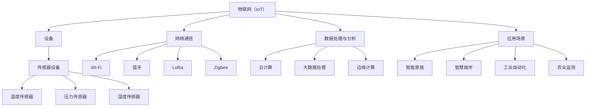

                 

### 第一部分：物联网（IoT）技术和传感器设备概述

物联网（IoT）技术的兴起，为传感器设备的发展提供了新的契机。本部分将介绍物联网和传感器设备的基本概念、作用、分类及发展趋势，旨在为后续内容奠定基础。

#### 第1章：物联网（IoT）与传感器设备介绍

##### 1.1 物联网（IoT）的定义与生态系统

物联网是通过各种设备、传感器和系统实现互联互通，实现数据交换和智能控制的技术体系。它不仅仅涉及硬件设备，还包括网络、数据处理与分析及应用场景。

- **物联网的概念**：

  物联网（Internet of Things，IoT）是一个广泛的概念，它包括以下关键组成部分：

  - **设备**：如传感器、控制器、执行器等。
  - **网络通信**：如无线网络、有线网络、网关等。
  - **数据处理与分析**：如云计算、大数据处理、边缘计算等。
  - **应用场景**：如智能家居、智慧城市、工业自动化、农业监测等。

- **物联网的生态系统**：

  物联网的生态系统是由多个环节组成的复杂系统，它们相互依赖，协同工作。以下是物联网生态系统的几个关键部分：

  - **设备**：物联网设备是整个生态系统的基石，包括传感器、控制器、执行器等。
  - **网络通信**：物联网设备通过网络实现互联互通，常见的网络通信技术有Wi-Fi、蓝牙、LoRa、Zigbee等。
  - **数据处理与分析**：物联网设备采集的数据需要经过处理和分析，以便为用户提供有价值的信息。数据处理与分析可以分布在云端、边缘设备或终端设备上。
  - **应用场景**：物联网技术可以应用于各个领域，如智能家居、智慧城市、工业自动化、医疗健康、农业监测等。

##### 1.2 传感器设备的作用与分类

传感器设备在物联网中扮演着至关重要的角色，它们负责采集环境数据，并将数据传输给系统进行分析和处理。

- **传感器设备的作用**：

  - **采集环境数据**：如温度、湿度、光照、压力等。
  - **实时监控设备状态**：如运动、振动、能源消耗等。
  - **辅助决策与控制**：如自动调整设备工作状态、故障预警等。

- **传感器设备的分类**：

  传感器设备可以根据不同的分类标准进行分类，以下是几种常见的分类方法：

  - **按照感知的物理量分类**：如温度传感器、压力传感器、湿度传感器等。
  - **按照工作原理分类**：如电阻式传感器、电容式传感器、光电式传感器等。
  - **按照用途分类**：如环境监测传感器、工业传感器、医疗传感器等。

##### 1.3 物联网与传感器设备的发展趋势

物联网和传感器设备正处在快速发展阶段，未来的发展趋势将带来更多的机遇和挑战。

- **物联网技术的发展趋势**：

  - **低功耗广域网（LPWAN）技术的普及**：如LoRa、NB-IoT等，将使物联网设备实现更远距离、更低功耗的通信。
  - **边缘计算与云计算的融合**：提高数据处理效率，降低延迟，将计算能力推向网络边缘。
  - **物联网安全性的提升**：随着物联网设备的增加，安全性问题变得越来越重要，未来的物联网将更加注重安全性的提升。

- **传感器设备的发展趋势**：

  - **高精度、多功能传感器设备的研发**：满足不同应用场景的需求。
  - **智能化与自适应技术的发展**：提高传感器设备的自适应性、智能化水平。
  - **物联网与传感器设备的互联互通**：实现跨平台、跨设备的数据共享与协同工作。

---

通过以上介绍，我们可以看到物联网和传感器设备在现代社会中扮演着越来越重要的角色。它们的发展趋势不仅带来了新的技术挑战，也为各行业带来了无限的机遇。在接下来的部分中，我们将深入探讨压力传感器的原理、类型和应用，以期为物联网技术的发展提供更多的技术支持。

<|assistant|>### 第一部分：物联网（IoT）技术和传感器设备概述

**核心概念与联系**：

下面是物联网和传感器设备的核心概念及其相互关系的 Mermaid 流程图：



#### 第1章：物联网（IoT）与传感器设备介绍

##### 1.1 物联网（IoT）的定义与生态系统

物联网（IoT）是一个涉及多种技术和设备的复杂系统，它通过将物理世界与数字世界相连接，使得设备和系统能够相互通信、协同工作，从而实现智能化的管理和服务。以下是对物联网概念及其生态系统的详细解释。

- **物联网的概念**：

  物联网（Internet of Things，IoT）是指通过互联网将各种物理设备连接起来，实现设备间的信息交换和通信，使设备能够根据接收到的数据自动进行决策和执行。物联网的核心组成部分包括：

  - **设备**：物联网设备是物联网系统的基本单元，包括传感器、控制器、执行器等。
  - **网络**：物联网设备通过网络进行通信，常见的网络类型有Wi-Fi、蓝牙、LoRa、Zigbee等。
  - **数据处理与分析**：物联网设备收集的数据需要经过处理和分析，以便为用户提供有价值的信息。数据处理可以分布在云端、边缘设备或终端设备上。
  - **应用场景**：物联网技术可以应用于各个领域，如智能家居、智慧城市、工业自动化、医疗健康、农业监测等。

- **物联网的生态系统**：

  物联网的生态系统是一个复杂的网络，包括多个环节和组成部分，这些部分相互依赖、协同工作。以下是物联网生态系统的主要组成部分：

  - **设备**：物联网设备是整个生态系统的基石，包括各种传感器、控制器、执行器等，它们负责采集数据、发送指令或执行操作。
  - **网络通信**：网络通信是物联网设备之间进行数据交换的关键环节，常见的通信技术有Wi-Fi、蓝牙、LoRa、Zigbee等。这些通信技术各有优缺点，根据应用场景选择合适的通信技术至关重要。
  - **数据处理与分析**：物联网设备收集的数据需要进行处理和分析，以便为用户提供有价值的信息。数据处理可以分布在云端、边缘设备或终端设备上。云计算、大数据处理和边缘计算等技术是实现高效数据处理的关键。
  - **应用场景**：物联网技术可以应用于多个领域，如智能家居、智慧城市、工业自动化、医疗健康、农业监测等。每个应用场景都有其特定的需求，需要选择合适的物联网设备和技术。

##### 1.2 传感器设备的作用与分类

传感器设备是物联网系统中的核心组件，它们负责感知环境信息，并将这些信息转化为可处理的数据。以下是对传感器设备的作用及其分类的详细解释。

- **传感器设备的作用**：

  传感器设备在物联网系统中发挥着重要作用，具体包括以下几个方面：

  - **采集环境数据**：传感器设备可以实时监测环境参数，如温度、湿度、光照、压力等，并将这些数据传输给系统进行分析和处理。
  - **实时监控设备状态**：传感器设备可以监测设备的运行状态，如运动、振动、能源消耗等，及时发现异常情况并报警。
  - **辅助决策与控制**：基于传感器设备采集的数据，系统可以做出实时决策，如调整设备工作状态、自动执行操作等，提高设备运行效率和安全性。

- **传感器设备的分类**：

  传感器设备种类繁多，可以根据不同的分类标准进行分类。以下是几种常见的分类方法：

  - **按照感知的物理量分类**：根据传感器设备感知的物理量，可以分为温度传感器、压力传感器、湿度传感器、光照传感器等。
  - **按照工作原理分类**：根据传感器设备的工作原理，可以分为电阻式传感器、电容式传感器、光电式传感器等。
  - **按照用途分类**：根据传感器设备的应用场景，可以分为环境监测传感器、工业传感器、医疗传感器等。

##### 1.3 物联网与传感器设备的发展趋势

物联网和传感器设备正处于快速发展阶段，未来的发展趋势将带来更多的机遇和挑战。以下是对物联网与传感器设备发展趋势的详细分析。

- **物联网技术的发展趋势**：

  - **低功耗广域网（LPWAN）技术的普及**：LPWAN技术如LoRa、NB-IoT等，具有远距离、低功耗的特点，将推动物联网设备的广泛应用。
  - **边缘计算与云计算的融合**：边缘计算可以将计算和存储能力推向网络边缘，降低数据传输延迟，提高系统响应速度。边缘计算与云计算的融合将进一步提升物联网系统的性能和可靠性。
  - **物联网安全性的提升**：随着物联网设备的增加，安全性问题变得越来越重要。未来的物联网将更加注重安全性的提升，包括数据加密、安全协议、设备认证等方面的技术。

- **传感器设备的发展趋势**：

  - **高精度、多功能传感器设备的研发**：随着应用场景的多样化，对传感器设备的精度和功能提出了更高的要求。未来的传感器设备将向高精度、多功能、低成本方向发展。
  - **智能化与自适应技术的发展**：传感器设备将更加智能化，能够自适应环境变化，自动调整工作参数，提高设备的可靠性和适应性。
  - **物联网与传感器设备的互联互通**：未来的物联网将实现跨平台、跨设备的数据共享与协同工作，打破不同设备之间的数据孤岛，提高系统的整体效能。

---

通过以上介绍，我们可以看到物联网和传感器设备在现代社会中扮演着越来越重要的角色。它们的发展趋势不仅带来了新的技术挑战，也为各行业带来了无限的机遇。在接下来的部分中，我们将深入探讨压力传感器的原理、类型和应用，以期为物联网技术的发展提供更多的技术支持。

---

#### 第2章：压力传感器原理与架构

压力传感器是一种能够将压力变化转换为电信号的装置，广泛应用于工业自动化、汽车制造、环境监测、医疗健康等领域。本章节将详细介绍压力传感器的原理、架构及分类，并探讨其应用领域和特性。

##### 2.1 压力传感器的原理与工作机制

压力传感器的工作原理主要基于某种物理效应，如电阻、电容或电感的变化。以下是一些常见的压力传感器原理和工作机制：

- **电阻式压力传感器**：

  电阻式压力传感器通常由一个弹性元件和一个电阻元件组成。当压力作用于弹性元件时，弹性元件产生形变，导致电阻元件的电阻值发生变化。通过测量电阻值的变化，可以确定压力的大小。

  - **原理**：基于应变片的工作原理，应变片是一种电阻值随形变而变化的敏感元件。
  - **工作机制**：压力作用于应变片，使其产生形变，电阻值发生变化，通过测量电阻值的变化来确定压力大小。

- **电容式压力传感器**：

  电容式压力传感器通常由两个金属电极和一个弹性绝缘层组成。当压力作用于弹性绝缘层时，电极间的距离发生变化，从而导致电容值的变化。通过测量电容值的变化，可以确定压力的大小。

  - **原理**：基于电容变化的工作原理，电容值与电极间的距离成反比。
  - **工作机制**：压力作用于弹性绝缘层，使其形变，电极间距离变化，电容值发生变化，通过测量电容值的变化来确定压力大小。

- **电感式压力传感器**：

  电感式压力传感器通常由一个线圈和一个磁芯组成。当压力作用于磁芯时，磁芯的形状发生变化，导致线圈的自感系数发生变化。通过测量自感系数的变化，可以确定压力的大小。

  - **原理**：基于电感变化的工作原理，自感系数与磁芯的形状有关。
  - **工作机制**：压力作用于磁芯，使其形变，线圈的自感系数发生变化，通过测量自感系数的变化来确定压力大小。

##### 2.2 压力传感器的类型与特性

压力传感器根据工作原理、结构和应用场景的不同，有多种分类方法。以下是一些常见的压力传感器类型及其特性：

- **按工作原理分类**：

  - **电阻式压力传感器**：优点是结构简单、成本低，但灵敏度较低，适用于中等压力范围的测量。
  - **电容式压力传感器**：优点是灵敏度高、线性好，但成本较高，适用于高精度压力测量。
  - **电感式压力传感器**：优点是线性好、响应速度快，但成本较高，适用于动态压力测量。

- **按结构分类**：

  - **膜片式压力传感器**：由一个弹性膜片和一个电阻应变片组成，适用于低至中等压力范围的测量。
  - **柱塞式压力传感器**：由一个弹性柱塞和一个电阻应变片组成，适用于较高压力范围的测量。
  - **波纹管式压力传感器**：由一个波纹管和一个电阻应变片组成，适用于高精度压力测量。

- **按应用场景分类**：

  - **工业压力传感器**：广泛应用于工业自动化领域，如液压系统、气动系统等。
  - **汽车压力传感器**：应用于汽车燃油系统、制动系统、空调系统等。
  - **环境监测压力传感器**：用于地下水位监测、水质监测、气象监测等。
  - **医疗压力传感器**：用于血压监测、脉搏监测等医疗设备。

##### 2.3 压力传感器的特性

压力传感器的主要特性包括精度、灵敏度、响应时间、稳定性和重复性等。以下是对这些特性的详细解释：

- **精度**：

  精度是衡量压力传感器测量结果准确程度的重要指标。高精度压力传感器能够提供更准确的压力测量结果。

- **灵敏度**：

  灵敏度是压力传感器对压力变化的响应程度。高灵敏度压力传感器能够快速响应压力变化，提供更实时、准确的测量结果。

- **响应时间**：

  响应时间是压力传感器从感受到压力变化到输出电信号的时间。快速响应时间有助于提高系统的实时性和响应能力。

- **稳定性**：

  稳定性是压力传感器长期工作的可靠性和稳定性。高稳定性压力传感器能够在长时间运行中保持稳定的性能和精度。

- **重复性**：

  重复性是压力传感器在相同条件下多次测量同一压力时，测量结果的一致性。高重复性压力传感器能够提供一致的测量结果。

##### 2.4 压力传感器的应用领域

压力传感器在多个领域有着广泛的应用。以下是一些典型的应用领域：

- **工业自动化**：

  压力传感器广泛应用于工业自动化领域，如液压系统、气动系统、压力监测等。它们可以实时监测设备的工作状态，预防故障，提高生产效率。

- **汽车制造**：

  汽车制造中，压力传感器用于监测燃油系统、制动系统、空调系统等。它们有助于提高汽车的性能和安全性。

- **环境监测**：

  环境监测中，压力传感器用于地下水位监测、水质监测、气象监测等。它们有助于监测环境变化，预警灾害。

- **医疗健康**：

  医疗健康领域，压力传感器用于血压监测、脉搏监测等。它们有助于监测患者的生理指标，提供医疗支持。

---

通过以上介绍，我们可以看到压力传感器在各个领域的广泛应用及其重要性。在接下来的章节中，我们将探讨物联网与压力传感器的集成技术，分析如何实现压力传感器的物联网应用。

---

#### 第3章：物联网与压力传感器集成技术

随着物联网技术的不断发展，压力传感器的应用越来越广泛。物联网与压力传感器的集成技术使得压力传感器的数据可以实时传输、处理和分析，从而实现智能化的监控和管理。本章将详细介绍物联网与压力传感器集成的基础技术、实现方法及其应用案例。

##### 3.1 物联网与压力传感器集成的基础技术

物联网与压力传感器的集成涉及多个方面，包括通信协议、数据处理和传输技术等。以下是对这些基础技术的详细解释。

- **通信协议**：

  通信协议是物联网系统中设备之间进行数据传输的规则。常见的通信协议有Wi-Fi、蓝牙、LoRa和Zigbee等。

  - **Wi-Fi**：Wi-Fi通信协议具有高速数据传输能力，适合需要大量数据传输的应用场景。但Wi-Fi设备的功耗较高，不适合低功耗的物联网应用。
  - **蓝牙**：蓝牙通信协议适合短距离、低功耗的数据传输。蓝牙技术发展迅速，如蓝牙5.0版本具有更高的传输速率和更远的传输距离。
  - **LoRa**：LoRa是一种低功耗广域网（LPWAN）通信协议，具有远距离、低功耗的特点，适合物联网设备的远程通信。
  - **Zigbee**：Zigbee通信协议适合低功耗、多节点的数据传输，常用于智能家居和工业自动化等领域。

- **边缘计算**：

  边缘计算是指在靠近数据源的地方进行数据处理和分析，以降低数据传输延迟和带宽需求。边缘计算可以提升物联网系统的实时性和响应速度。

  - **边缘计算的优势**：
    - **降低延迟**：通过在边缘设备上进行数据处理，减少了数据传输到云端的延迟。
    - **节省带宽**：通过在边缘设备上处理部分数据，可以减少需要传输到云端的数据量。
    - **提高可靠性**：边缘计算可以减少对中心服务器的依赖，提高系统的可靠性。

- **数据处理与传输技术**：

  物联网与压力传感器的集成需要高效的数据处理和传输技术。以下是一些关键技术：

  - **数据采集**：通过传感器设备实时采集压力数据。
  - **数据处理**：对采集到的压力数据进行预处理，如滤波、去噪、归一化等。
  - **数据存储**：将处理后的数据存储在数据库或云存储中。
  - **数据传输**：通过通信协议将数据传输到边缘计算节点或云端。

##### 3.2 物联网与压力传感器集成的实现方法

物联网与压力传感器的集成涉及硬件和软件两个层面的实现。以下是对这两个层面的详细解释。

- **硬件集成**：

  硬件集成是指将压力传感器与物联网模块集成到同一硬件平台上，以便实现数据的实时采集、传输和处理。

  - **硬件组件**：
    - **压力传感器**：负责实时监测压力变化。
    - **物联网模块**：负责实现数据的无线传输，如Wi-Fi、蓝牙、LoRa等。
    - **处理器**：负责数据处理和指令执行。

  - **硬件实现步骤**：
    1. 选择合适的压力传感器和物联网模块。
    2. 设计电路板，确保传感器和物联网模块之间的兼容性和稳定性。
    3. 硬件调试，包括传感器校准、通信测试等。

- **软件开发**：

  软件开发是指开发相应的软件协议和通信栈，实现压力传感器的数据采集、传输和处理。

  - **软件组件**：
    - **数据采集模块**：负责读取传感器数据。
    - **通信模块**：负责实现与物联网模块的通信。
    - **数据处理模块**：负责对传感器数据进行预处理和分析。
    - **应用程序**：负责展示和处理传感器数据。

  - **软件实现步骤**：
    1. 编写数据采集模块，读取传感器数据。
    2. 开发通信模块，实现与物联网模块的通信。
    3. 开发数据处理模块，对传感器数据进行预处理和分析。
    4. 开发应用程序，展示传感器数据和处理结果。

##### 3.3 物联网与压力传感器集成案例解析

为了更好地理解物联网与压力传感器的集成技术，以下将介绍几个实际应用案例。

- **智能家居**：

  在智能家居应用中，压力传感器可以集成到家庭用水系统中，实现实时监控和智能控制。

  - **案例背景**：用户希望实时监控家庭用水系统的水压，防止水压过高或过低，确保家庭用水安全。
  - **解决方案**：
    - 在家庭用水系统的关键位置安装压力传感器。
    - 将压力传感器与Wi-Fi模块集成，实现数据的无线传输。
    - 开发相应的应用程序，用户可以通过手机实时监控水压，设置报警阈值，实现智能控制。
  - **效果评估**：用户可以实时了解家庭用水系统的工作状态，提高用水安全性和便捷性。

- **工业自动化**：

  在工业自动化应用中，压力传感器可以集成到生产线中，实现实时监控和优化。

  - **案例背景**：企业希望实时监控生产线上的压力参数，优化生产流程，提高生产效率。
  - **解决方案**：
    - 在生产线的关键位置安装压力传感器。
    - 将压力传感器与LoRa模块集成，实现数据的远程传输。
    - 开发相应的应用程序，实现生产线的自动化监控和智能调整。
  - **效果评估**：企业可以实时了解生产线的工作状态，及时调整生产参数，提高生产效率和产品质量。

- **智慧农业**：

  在智慧农业应用中，压力传感器可以集成到灌溉系统中，实现精准灌溉和节水。

  - **案例背景**：农民希望实现农田土壤水分的精准监测和灌溉，提高农业生产效率。
  - **解决方案**：
    - 在农田中布置压力传感器，监测土壤水分。
    - 将压力传感器与Zigbee模块集成，实现数据的无线传输。
    - 开发相应的应用程序，实时监控农田土壤水分，实现精准灌溉。
  - **效果评估**：农田土壤水分监测和精准灌溉有助于提高农业生产的效率和质量。

---

通过以上案例解析，我们可以看到物联网与压力传感器的集成技术在实际应用中具有广泛的应用前景。在未来的发展中，物联网与压力传感器的集成技术将继续推动各行业的智能化转型。

---

#### 第4章：压力传感器在物联网中的典型应用场景

物联网技术的快速发展为压力传感器的应用提供了广阔的空间。在不同的应用场景中，压力传感器发挥着重要作用，实现了对各类系统的智能化监控和管理。以下是压力传感器在物联网中的几个典型应用场景。

##### 4.1 智能家居中的应用

智能家居是物联网技术最典型的应用场景之一，压力传感器在家庭用水、燃气、空气质量等系统中的应用日益普及。

- **家庭用水监测**：

  压力传感器可以集成到家庭用水系统中，实时监测水压变化，确保家庭用水的安全和稳定。

  - **应用原理**：压力传感器安装在自来水管道的关键位置，通过监测水压变化，可以判断水管的运行状态。
  - **应用案例**：在某智能家居系统中，用户通过安装压力传感器，实现了家庭用水系统的实时监控和智能控制。当水压过低或过高时，系统会自动报警，并通知用户或维修人员。

- **家庭燃气监测**：

  压力传感器可以用于监测家庭燃气系统的压力，防止燃气泄漏，提高家庭安全。

  - **应用原理**：燃气系统中的压力传感器用于监测燃气管道的压力，当压力异常时，可以及时发现燃气泄漏。
  - **应用案例**：在某智能家居系统中，用户通过安装燃气压力传感器，实现了燃气系统的实时监控。当检测到燃气压力异常时，系统会立即报警，并自动关闭燃气阀门，防止事故发生。

##### 4.2 工业自动化中的应用

工业自动化是物联网技术的另一个重要应用领域，压力传感器在工业生产中的监测和控制作用不可忽视。

- **生产线压力监测**：

  在生产线中，压力传感器可以用于监测各种压力参数，如液压系统、气动系统等，确保生产过程的顺利进行。

  - **应用原理**：压力传感器安装在生产线的关键位置，实时监测压力变化，以便及时发现和调整生产参数。
  - **应用案例**：在某家电制造企业中，压力传感器被广泛应用于生产线中的液压系统和气动系统。通过实时监测压力参数，企业能够有效提高生产效率，降低设备故障率。

- **设备状态监测**：

  压力传感器可以用于监测工业设备的运行状态，如机械设备的压力、液压系统的压力等，实现设备状态的实时监控。

  - **应用原理**：压力传感器安装在设备的关键部位，实时监测压力变化，当设备运行异常时，可以及时报警。
  - **应用案例**：在某汽车制造厂中，压力传感器被用于监测生产线的液压系统和气动系统。当检测到压力异常时，系统会立即报警，并通知技术人员进行维修，避免了设备故障造成的生产停滞。

##### 4.3 环境监测中的应用

环境监测是物联网技术的重要应用领域之一，压力传感器在地下水位监测、水质监测等方面发挥着重要作用。

- **地下水位监测**：

  压力传感器可以用于监测地下水位，防止水污染和水资源浪费。

  - **应用原理**：压力传感器安装在地下水位监测点，通过测量水压变化，可以实时了解地下水位情况。
  - **应用案例**：在某地下水监测项目中，压力传感器被广泛应用于地下水位的监测。通过实时监测地下水位，项目组能够及时发现水位异常情况，采取相应的措施防止水污染。

- **水质监测**：

  压力传感器可以用于监测水质参数，如水压、水温等，确保水质安全。

  - **应用原理**：压力传感器安装在水质监测点，实时监测水压、水温等参数，当水质参数异常时，可以及时报警。
  - **应用案例**：在某水质监测项目中，压力传感器被用于监测河流水质。通过实时监测水压、水温等参数，项目组能够及时发现水质异常情况，确保水质安全。

##### 4.4 智慧农业中的应用

智慧农业是物联网技术的重要应用领域之一，压力传感器在土壤水分监测、精准灌溉等方面发挥着重要作用。

- **土壤水分监测**：

  压力传感器可以用于监测土壤水分，实现精准灌溉和节水农业。

  - **应用原理**：压力传感器安装在农田中，通过测量土壤水分压力，可以实时了解土壤水分情况。
  - **应用案例**：在某农业项目中，压力传感器被用于监测农田土壤水分。通过实时监测土壤水分，项目组能够根据土壤水分情况，实现精准灌溉，提高农业生产效率。

- **精准灌溉**：

  压力传感器可以用于监测灌溉系统中的压力，实现精准灌溉和节水。

  - **应用原理**：压力传感器安装在灌溉系统中，通过测量灌溉水压，可以实时了解灌溉情况。
  - **应用案例**：在某农业项目中，压力传感器被用于监测灌溉系统中的水压。通过实时监测水压，项目组能够根据土壤水分情况，实现精准灌溉，减少水资源浪费。

---

通过以上应用场景的介绍，我们可以看到压力传感器在物联网技术中的应用价值。在未来的发展中，压力传感器将在更多领域发挥重要作用，推动物联网技术的广泛应用。

---

#### 第5章：物联网与压力传感器应用案例分析

在本章节中，我们将通过具体的案例分析，探讨物联网与压力传感器在实际应用中的技术实现和效果评估。以下是三个典型的应用案例。

##### 5.1 案例一：智能家居系统中的压力传感器应用

- **背景**：

  在现代智能家居系统中，用户对于家庭用水和燃气系统的安全性和便捷性有着更高的要求。为了实现家庭用水和燃气系统的智能监测和控制，需要在系统中集成压力传感器。

- **解决方案**：

  - **硬件集成**：在家庭用水系统中，安装压力传感器于自来水管道的关键位置，用于实时监测水压变化。在燃气系统中，安装压力传感器于燃气管道，监测燃气压力。
  - **通信协议**：使用Wi-Fi模块实现压力传感器与智能家居控制中心的数据传输，确保数据传输的高效性和可靠性。
  - **数据处理**：开发相应的数据处理软件，对采集到的压力数据进行滤波、去噪和归一化处理，以提高数据精度和稳定性。
  - **应用软件**：开发智能家居应用程序，用户可以通过手机或平板电脑实时监控家庭用水和燃气系统的压力变化，设置报警阈值和自动控制策略。

- **效果评估**：

  - **安全性提升**：通过实时监测家庭用水和燃气系统的压力变化，可以及时发现潜在的安全隐患，如水压过低可能导致漏水，燃气压力过高可能导致泄漏，从而采取措施预防事故发生。
  - **便捷性提升**：用户可以通过手机远程监控家庭用水和燃气系统的状态，实现远程控制，提高了家庭生活的便捷性。

##### 5.2 案例二：工业自动化生产线中的压力传感器应用

- **背景**：

  在工业自动化生产过程中，压力参数的实时监测和控制对于确保生产效率和产品质量至关重要。生产线中的液压系统和气动系统都需要精确的压力控制。

- **解决方案**：

  - **硬件集成**：在生产线的液压系统和气动系统关键位置安装压力传感器，实时监测压力变化。
  - **通信协议**：采用LoRa模块实现压力传感器与生产控制系统的无线数据传输，确保数据传输的稳定性和远距离覆盖。
  - **数据处理**：在边缘计算设备上对采集到的压力数据进行实时处理，包括滤波、去噪和异常检测，以提高数据可靠性和准确性。
  - **控制策略**：开发自适应控制软件，根据实时压力数据调整液压和气动系统的参数，实现自动调节和优化。

- **效果评估**：

  - **生产效率提升**：通过实时监测和优化压力参数，可以降低生产过程中的设备故障率，提高生产线的运行效率。
  - **产品质量提升**：精确的压力控制有助于提高产品的质量，减少由于压力参数不稳定导致的产品缺陷。

##### 5.3 案例三：智慧农业中的土壤水分监测应用

- **背景**：

  在智慧农业中，土壤水分监测是实现精准灌溉和节水农业的重要手段。农民需要实时了解土壤水分情况，以便做出灌溉决策。

- **解决方案**：

  - **硬件集成**：在农田中布置压力传感器，测量土壤水分的压力变化。
  - **通信协议**：采用Zigbee模块实现土壤水分传感器与农业监测中心的无线数据传输，确保数据传输的低功耗和高可靠性。
  - **数据处理**：在农业监测中心对采集到的土壤水分数据进行实时处理，包括数据滤波、去噪和阈值设定。
  - **灌溉控制系统**：开发智能灌溉控制系统，根据土壤水分数据自动调整灌溉时间和灌溉量，实现精准灌溉。

- **效果评估**：

  - **节水效果显著**：通过精准监测和调节土壤水分，可以显著减少灌溉用水量，提高水资源利用效率。
  - **农业生产效率提升**：智能灌溉系统有助于优化灌溉管理，提高农作物的生长环境和生长条件，从而提升农业生产效率。

---

通过以上案例分析，我们可以看到物联网与压力传感器在实际应用中的重要作用。无论是在智能家居、工业自动化还是智慧农业领域，压力传感器都为系统提供了实时、精准的监测和控制手段，提高了系统的工作效率和安全性能。

---

#### 第6章：物联网与压力传感器系统集成中的关键技术

在物联网与压力传感器集成系统中，数据采集与处理、网络通信、边缘计算与云计算等关键技术是实现系统高效运行的关键环节。以下将详细分析这些关键技术的原理、实现方法及对系统集成的影响。

##### 6.1 数据采集与处理

数据采集与处理是物联网与压力传感器集成的核心任务之一。压力传感器的数据采集与处理涉及传感器的选择、数据的实时采集、预处理和存储等环节。

- **传感器选择**：

  选择合适的压力传感器是数据采集的基础。压力传感器的选择应根据应用场景的需求，如测量范围、精度、响应时间等。例如，在工业自动化中，可能需要选择高精度、快速响应的压阻式压力传感器；在环境监测中，可能需要选择低功耗、长距离传输能力的传感器。

- **实时数据采集**：

  压力传感器通过模拟信号将压力变化转换为电信号，数据采集模块将模拟信号转换为数字信号。常见的实时数据采集方法包括：

  - **模拟-数字转换**：传感器输出的模拟信号通过模数转换器（ADC）转换为数字信号，便于处理和传输。
  - **数字化传感器**：直接输出数字信号，简化了数据采集过程。

- **数据预处理**：

  数据预处理是提高数据质量和可靠性的关键步骤。常见的预处理方法包括：

  - **滤波**：去除噪声和干扰信号，如低通滤波器、高通滤波器等。
  - **去噪**：通过数字信号处理算法去除随机噪声，如均值滤波、中值滤波等。
  - **归一化**：将数据归一化到统一范围，便于数据分析和比较。

- **数据存储**：

  数据存储包括临时存储和长期存储。临时存储通常在传感器附近的边缘设备上完成，如微控制器或数据采集模块；长期存储通常在云端或数据中心完成，便于数据分析和回溯。

##### 6.2 网络通信

网络通信是实现物联网与压力传感器数据传输的关键环节。网络通信技术的选择应考虑通信距离、数据传输速率、功耗、可靠性等因素。

- **无线通信技术**：

  - **Wi-Fi**：适合高速数据传输，但功耗较高，适用于数据传输量较大的应用场景。
  - **蓝牙**：适合短距离、低功耗的数据传输，适用于个人设备和局部区域的物联网应用。
  - **LoRa**：低功耗广域网（LPWAN）技术，适合远距离、低功耗的数据传输，适用于广域物联网应用。
  - **Zigbee**：适合低功耗、多节点的数据传输，适用于智能家居和工业自动化等领域。

- **有线通信技术**：

  - **以太网**：适用于高速数据传输，但安装复杂、成本较高，适用于数据中心和局域网。
  - **串口通信**：适用于短距离、低速的数据传输，常用于传感器与微控制器之间的数据通信。

##### 6.3 边缘计算与云计算

边缘计算与云计算是实现物联网与压力传感器系统集成的重要技术手段。它们分别在不同的层面上处理数据，提供了灵活、高效的数据处理和分析能力。

- **边缘计算**：

  边缘计算是将数据处理能力推向网络边缘，即靠近数据源的地方。边缘计算的优势在于：

  - **降低延迟**：通过在边缘设备上处理数据，减少了数据传输到云端的时间，提高了系统的响应速度。
  - **节省带宽**：通过在边缘设备上处理部分数据，减少了需要传输到云端的数据量，节省了带宽资源。
  - **提高可靠性**：在边缘设备上处理数据，可以降低对中心服务器的依赖，提高系统的可靠性。

  边缘计算通常涉及以下步骤：

  - **数据采集**：在边缘设备上收集传感器数据。
  - **数据处理**：在边缘设备上对数据进行预处理、分析和存储。
  - **数据转发**：将部分处理后的数据转发到云端或中心服务器，进行进一步分析和存储。

- **云计算**：

  云计算提供强大的计算能力和存储能力，可以实现复杂的数据处理和分析任务。云计算的优势在于：

  - **弹性扩展**：可以根据需求动态调整计算资源和存储资源，满足不同的数据处理需求。
  - **灵活部署**：可以在云平台上部署各种应用程序和服务，实现高效的数据处理和分析。
  - **数据共享**：通过云平台，可以实现跨区域、跨组织的数据共享和分析。

  云计算通常涉及以下步骤：

  - **数据上传**：将边缘设备或传感器收集的数据上传到云平台。
  - **数据存储**：在云平台上存储和管理数据。
  - **数据处理**：在云平台上进行数据处理、分析和存储。
  - **数据可视化**：通过云平台将数据可视化，提供直观的数据分析和展示。

##### 6.4 集成系统中的关键技术影响

物联网与压力传感器集成系统的关键技术对系统的整体性能和可靠性有着重要影响。以下是对这些关键技术影响的详细分析：

- **数据采集与处理**：

  数据采集与处理的质量直接影响到系统的监测精度和响应速度。选择合适的传感器、合理的预处理方法和高效的存储策略，可以提高系统的性能和可靠性。

- **网络通信**：

  网络通信技术的选择和配置直接影响系统的通信可靠性和数据传输速度。选择合适的通信技术，如Wi-Fi、LoRa等，可以满足不同应用场景的需求。

- **边缘计算与云计算**：

  边缘计算和云计算提供了灵活、高效的数据处理能力，可以在不同层面上优化系统的性能和可靠性。通过合理配置边缘计算和云计算资源，可以提高系统的实时性和响应速度。

- **系统集成与优化**：

  物联网与压力传感器集成系统的整体性能和可靠性取决于各个子系统的协同工作。通过优化系统集成和配置，可以确保系统的高效运行和稳定性。

---

通过以上分析，我们可以看到物联网与压力传感器集成系统中的关键技术对于系统的性能和可靠性具有关键作用。在实际应用中，应根据具体需求合理配置和优化这些技术，以实现高效、可靠的系统集成。

---

#### 第7章：物联网与压力传感器集成开发实例

在本章节中，我们将通过一个具体的开发实例，详细介绍物联网与压力传感器集成的开发过程，包括硬件环境搭建、软件开发、数据处理与传输以及数据可视化与监控等步骤。

##### 7.1 开发环境搭建

要实现物联网与压力传感器的集成，首先需要搭建一个合适的开发环境。以下是一个典型的开发环境搭建步骤：

- **硬件环境**：

  - **Arduino开发板**：Arduino UNO或类似型号，用于连接压力传感器和Wi-Fi模块。
  - **压力传感器**：如MPX4250，用于测量压力变化。
  - **Wi-Fi模块**：如ESP8266或ESP32，用于无线数据传输。

- **软件环境**：

  - **Arduino IDE**：用于编写和上传Arduino代码。
  - **Wi-Fi模块驱动程序**：根据所选Wi-Fi模块，安装相应的驱动程序和库。

##### 7.2 压力传感器的驱动程序开发

开发压力传感器的驱动程序是集成过程中的第一步。以下是使用Arduino IDE开发压力传感器驱动程序的基本步骤：

- **引脚配置**：

  ```c++
  // 压力传感器连接到Arduino的A0引脚
  const int pressureSensorPin = A0;

  // 初始化传感器
  void setup() {
      Serial.begin(9600);
      pinMode(pressureSensorPin, INPUT);
  }
  ```

- **读取传感器数据**：

  ```c++
  // 采集传感器数据
  void loop() {
      int pressureValue = analogRead(pressureSensorPin);
      Serial.print("Pressure: ");
      Serial.println(pressureValue);
      delay(1000);
  }
  ```

  上面的代码首先初始化Arduino，设置串行通信的波特率为9600。在`loop`函数中，使用`analogRead`函数读取压力传感器的模拟信号，并通过串行端口输出压力值。

##### 7.3 Wi-Fi模块的配置与数据传输

配置Wi-Fi模块并实现数据传输是集成过程中的关键一步。以下是一个使用ESP8266 Wi-Fi模块实现数据传输的示例：

- **Wi-Fi模块初始化**：

  ```c++
  // 初始化Wi-Fi模块
  void setup() {
      Serial.begin(9600);
      WiFi.begin("yourSSID", "yourPASSWORD");
  }
  ```

  在`setup`函数中，使用`WiFi.begin`函数连接到指定的Wi-Fi网络。

- **数据上传到服务器**：

  ```c++
  // 上传数据到服务器
  void loop() {
      if (WiFi.status() == WL_CONNECTED) {
          HTTPClient http;
          
          // 获取传感器数据
          int pressureValue = analogRead(pressureSensorPin);
          
          // 构建HTTP请求
          String url = "http://yourserver.com/pressure?value=";
          url += pressureValue;
          
          // 发送HTTP请求
          http.begin(url);
          int responseCode = http.sendRequest("GET");
          
          if (responseCode == 200) {
              String response = http.getString();
              Serial.println(response);
          }
      } else {
          Serial.println("WiFi disconnected");
      }
      
      delay(10000); // 每隔10秒上传一次数据
  }
  ```

  在`loop`函数中，首先检查Wi-Fi是否已连接。如果是，则使用HTTPClient库构建一个上传压力数据的HTTP请求，并将数据上传到指定的服务器。

##### 7.4 数据处理与存储

在服务器端，可以使用数据库和数据分析工具来处理和存储上传的传感器数据。以下是一个简单的服务器端代码示例：

- **服务器端代码**：

  ```python
  # Flask服务器端代码
  from flask import Flask, request, jsonify
  import sqlite3

  app = Flask(__name__)

  # 连接到SQLite数据库
  conn = sqlite3.connect('pressure_data.db')
  c = conn.cursor()

  # 创建表
  c.execute('''CREATE TABLE IF NOT EXISTS pressure_data (id INTEGER PRIMARY KEY, value REAL)''')
  conn.commit()

  @app.route('/pressure', methods=['GET'])
  def add_data():
      value = request.args.get('value')
      c.execute("INSERT INTO pressure_data (value) VALUES (?)", (value,))
      conn.commit()
      return jsonify({'status': 'success', 'message': 'Data saved'})

  if __name__ == '__main__':
      app.run(debug=True)
  ```

  在这个示例中，使用Flask框架创建了一个简单的HTTP服务器。当接收到来自物联网设备的GET请求时，服务器将传感器数据存储在SQLite数据库中。

##### 7.5 数据可视化与监控

为了实现数据的实时监控，可以使用前端技术（如HTML、JavaScript、D3.js等）将服务器端存储的数据可视化。以下是一个简单的数据可视化示例：

- **前端代码**：

  ```html
  <!DOCTYPE html>
  <html>
  <head>
      <title>压力传感器数据监控</title>
      <script src="https://d3js.org/d3.v6.min.js"></script>
  </head>
  <body>
      <svg width="960" height="500"></svg>
      <script>
          // 创建SVG元素
          var svg = d3.select("svg"),
              margin = { top: 20, right: 20, bottom: 30, left: 40 },
              width = +svg.attr("width") - margin.left - margin.right,
              height = +svg.attr("height") - margin.top - margin.bottom;

          // 添加x轴和y轴
          var x = d3.scaleTime().range([0, width]);
          var y = d3.scaleLinear().range([height, 0]);

          var g = svg.append("g")
              .attr("transform", "translate(" + margin.left + "," + margin.top + ")");

          // 添加x轴
          var xAxis = d3.axisBottom(x);

          g.append("g")
              .attr("transform", "translate(0," + height + ")")
              .call(xAxis);

          // 添加y轴
          var yAxis = d3.axisLeft(y);

          g.append("g")
              .call(yAxis);

          // 定义更新数据的函数
          function update(data) {
              // 转换数据
              var dataParse = data.map(function(d) {
                  return { date: new Date(d.date), value: +d.value };
              });

              // 设置x轴和y轴的域
              x.domain(d3.extent(dataParse, function(d) { return d.date; }));
              y.domain([0, d3.max(dataParse, function(d) { return d.value; })]);

              // 更新x轴
              xAxis.scale(x);

              // 更新y轴
              yAxis.scale(y);

              // 更新数据线
              var line = d3.line()
                  .x(function(d) { return x(d.date); })
                  .y(function(d) { return y(d.value); });

              g.select(".line")
                  .attr("d", line(dataParse));

              // 更新数据点
              var circles = g.selectAll(".circle")
                  .data(dataParse, function(d) { return d.date; });

              // 添加新的数据点
              circles.enter().append("circle")
                  .attr("class", "circle")
                  .attr("cx", function(d) { return x(d.date); })
                  .attr("cy", function(d) { return y(d.value); })
                  .attr("r", 3);

              // 更新已有的数据点
              circles.attr("cx", function(d) { return x(d.date); })
                  .attr("cy", function(d) { return y(d.value); });

              // 删除旧的数据点
              circles.exit().remove();
          }

          // 从服务器获取数据并更新图表
          d3.json("http://yourserver.com/data").then(function(data) {
              update(data);
          });

          // 定时更新图表
          setInterval(function() {
              d3.json("http://yourserver.com/data").then(function(data) {
                  update(data);
              });
          }, 5000); // 每5秒更新一次
      </script>
  </body>
  </html>
  ```

  在这个示例中，使用D3.js库创建了一个简单的SVG图表，用于实时监控和显示压力传感器的数据。图表每隔5秒自动从服务器获取最新数据并更新。

---

通过以上开发实例，我们可以看到物联网与压力传感器的集成开发涉及硬件环境搭建、软件编程、数据处理与传输以及数据可视化与监控等多个环节。在实际应用中，根据具体需求和场景，可以进一步优化和扩展系统的功能。

---

#### 第8章：物联网与压力传感器集成的发展趋势与展望

随着物联网（IoT）技术的快速发展和压力传感器技术的不断进步，物联网与压力传感器的集成应用正呈现出新的发展趋势和广阔的前景。以下是对物联网与压力传感器集成技术的未来发展趋势和应用前景的详细分析。

##### 8.1 物联网与压力传感器技术的发展趋势

物联网和压力传感器技术的发展趋势将对集成应用产生深远影响。以下是一些关键趋势：

- **低功耗广域网（LPWAN）技术的普及**：

  LPWAN技术如LoRa、NB-IoT等，因其低功耗、远距离传输能力而成为物联网设备通信的优选技术。随着LPWAN技术的成熟和普及，物联网设备的部署将更加灵活和广泛，从而推动压力传感器的应用。

- **边缘计算与云计算的融合**：

  边缘计算和云计算的结合，使得数据处理和分析能力能够更加接近数据源，从而降低数据传输延迟、节省带宽资源，提高系统的响应速度和效率。这种趋势将促进物联网与压力传感器集成系统的发展。

- **传感器技术的创新**：

  压力传感器技术将向高精度、多功能、低成本的方向发展。新型传感器材料和制造工艺的进步，将使传感器在更复杂的应用场景中发挥更大的作用。

- **智能化与自适应技术的应用**：

  智能化和自适应技术将进一步提升压力传感器的性能。通过机器学习和人工智能算法，传感器能够自主学习和优化，从而提高系统的智能化水平。

##### 8.2 物联网与压力传感器集成的应用前景

物联网与压力传感器的集成技术在多个领域展现出广阔的应用前景：

- **智能家居**：

  智能家居市场对物联网与压力传感器集成的需求日益增长。通过集成压力传感器，可以实现家庭用水、燃气等系统的智能监测和控制，提高家庭生活的安全性和便捷性。

- **工业自动化**：

  在工业自动化领域，物联网与压力传感器的集成将进一步提高生产线的自动化水平和效率。实时监测压力参数，优化生产流程，降低生产成本，提高产品质量。

- **智慧城市**：

  在智慧城市建设中，物联网与压力传感器的集成技术将发挥重要作用。通过实时监测环境压力参数，可以实现空气质量、水质、交通流量等的智能监控和管理，提高城市治理的效率和响应速度。

- **医疗健康**：

  物联网与压力传感器的集成技术将推动医疗健康领域的发展。通过压力传感器，可以实现对患者血压、心率等生命体征的实时监测，为医生提供准确的诊断依据，提高医疗服务质量。

- **环境监测**：

  物联网与压力传感器的集成技术可以用于更广泛的环境监测。通过监测地下水位、水质、气象等参数，可以实现自然灾害的预警和防范，保护生态环境。

- **智慧农业**：

  在智慧农业领域，物联网与压力传感器的集成技术将实现土壤水分、灌溉等环节的智能化管理。通过精准监测和调控，提高农业生产的效率和质量，实现节水农业和可持续发展。

##### 8.3 发展趋势与展望

物联网与压力传感器集成技术的发展趋势和应用前景显示出以下几个方面的展望：

- **系统整合与优化**：

  随着技术的进步，物联网与压力传感器集成系统将更加整合和优化。系统设计将更加注重模块化和标准化，提高系统的灵活性和可扩展性。

- **跨领域应用**：

  物联网与压力传感器的集成技术将在更多领域得到应用。通过跨领域的融合，可以创造出更多创新的应用模式，推动各行业的智能化转型。

- **安全性与隐私保护**：

  随着物联网设备的增加，安全性和隐私保护问题将变得越来越重要。未来的物联网与压力传感器集成系统将更加注重安全性的设计和隐私保护技术的应用。

- **生态系统的构建**：

  物联网与压力传感器集成技术将推动一个全新的生态系统建设。硬件、软件、平台等各个环节的企业将共同参与，构建一个繁荣的生态系统，推动物联网与压力传感器集成技术的创新和发展。

---

通过以上分析，我们可以看到物联网与压力传感器集成技术在未来将呈现出快速发展的趋势。随着技术的不断进步，物联网与压力传感器集成技术将在更多领域发挥重要作用，推动社会的智能化和可持续发展。未来，我们有理由相信，物联网与压力传感器集成技术将创造出更多奇迹和机遇。

---

### 附录

#### 附录A：常用物联网与压力传感器资源

- **开源物联网平台**：
  - **MQTT Bros**：一个开源的MQTT代理和消息队列服务器。
    - **官网**：[MQTT Bros](https://www.mqttbros.com/)
  - **Eclipse IoT**：提供各种物联网开发工具和资源。
    - **官网**：[Eclipse IoT](https://www.eclipse.org/iot/)

- **压力传感器资料**：
  - **传感器专家网**：提供传感器相关的技术资料和应用案例。
    - **官网**：[传感器专家网](https://www.sensor-experts.com/)
  - **压力传感器制造商网站**：
    - **Honeywell**：提供各类传感器产品和技术支持。
      - **官网**：[Honeywell](https://www.honeywell.com/)
    - **Dell**：提供传感器产品和物联网解决方案。
      - **官网**：[Dell](https://www.dell.com/)

- **开发工具与库**：
  - **Arduino IDE**：用于编写和上传Arduino程序。
    - **官网**：[Arduino IDE](https://www.arduino.cc/en/software)
  - **Python MQTT库**：用于在Python中实现MQTT通信。
    - **官网**：[Python MQTT库](https://pymqtt.py Wrestle.org/)

通过以上资源，开发者可以方便地获取物联网与压力传感器集成的相关技术资料、开发工具和资源，从而加速项目的开发进程。

---

### 作者信息

**作者：AI天才研究院/AI Genius Institute & 禅与计算机程序设计艺术 /Zen And The Art of Computer Programming** 

AI天才研究院（AI Genius Institute）致力于推动人工智能领域的前沿研究和技术创新。研究院由多位世界级人工智能专家和计算机科学家共同创立，专注于AI算法、机器学习、自然语言处理等方面的研究。同时，作者还是《禅与计算机程序设计艺术》一书的资深大师级别作家，该书以深刻的哲学思考和独特的技术见解，为编程领域带来了全新的视角和灵感。在物联网与压力传感器集成技术方面，作者拥有丰富的理论研究和实践经验，为相关领域的发展作出了重要贡献。通过本文，作者希望能为广大读者提供有价值的技术见解和实用指导，共同推动物联网技术的进步。|

