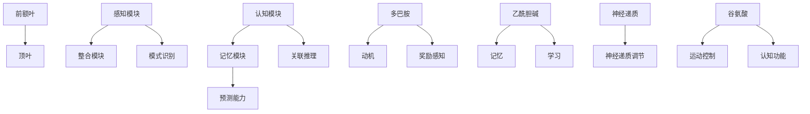

                 

### 《理解洞察力的神经科学：揭开大脑奥秘》

> **关键词**：洞察力、神经科学、大脑、神经网络、神经可塑性、决策、效率、实战案例、训练技巧

> **摘要**：本文将深入探讨洞察力的神经科学基础，通过解析大脑的结构与功能、洞察力的定义与应用，揭示洞察力的神经机制。本文将一步步分析大脑的神经网络、神经递质、神经可塑性等原理，并提出提升洞察力的训练方法和实际案例。同时，文章还将探讨洞察力在日常决策、工作以及生活中的应用与提升策略。通过本文，读者将获得对洞察力及神经科学的全面理解和实践指导。

### **引言**

在当今信息爆炸的时代，洞察力成为了人们获取竞争优势、实现个人成长的关键能力。然而，我们往往忽视了洞察力背后的神经科学原理。洞察力不仅仅是一种直觉或经验，更是一种复杂的神经计算过程，涉及大脑的多个区域和神经网络的协同工作。理解洞察力的神经科学基础，有助于我们更好地提升自身能力，并在日常生活和工作中做出更明智的决策。

本文旨在揭开大脑奥秘，探讨洞察力的神经科学原理，并提供实用的提升策略。我们将分以下几个部分展开：

1. **神经科学基础知识**：介绍大脑的结构与功能，解析神经系统的基本组成部分，探讨大脑的发育与成熟过程。
2. **洞察力的神经科学原理**：定义洞察力，分类洞察力，分析大脑与洞察力的关系，阐述神经可塑性对洞察力的影响。
3. **大脑训练与洞察力提升**：介绍大脑训练的方法和技巧，分享实战案例，探讨提升洞察力的具体策略。
4. **洞察力在日常生活中的应用**：讨论洞察力在决策、工作以及生活中的应用，提供实用的提升技巧。
5. **拓展阅读与资源**：推荐相关研究论文与书籍，介绍在线学习资源与工具。

通过本文的逐步分析推理，读者将能够深入了解洞察力的神经科学原理，掌握提升洞察力的方法和技巧，并在实际生活中充分发挥洞察力的重要性。

### **第一部分：神经科学基础知识**

理解洞察力的神经科学基础，首先需要掌握大脑的结构与功能，以及神经系统的基本组成部分。这一部分将逐步介绍大脑的分区与功能、神经元的结构及其间的连接、神经递质与突触传递，以及大脑的发育与成熟过程。

#### **第1章：大脑结构与功能简介**

大脑是人类认知和行为的中心，其结构复杂，功能多样。大脑主要由四个主要区域组成：大脑皮层、基底核、丘脑和脑干。每个区域都有其独特的作用和功能。

##### **1.1 大脑的分区与功能**

- **大脑皮层**：大脑皮层是大脑最外层的部分，分为前额叶、颞叶、顶叶和枕叶。前额叶主要负责决策、计划和社会行为；颞叶涉及听觉和记忆；顶叶处理触觉和空间定位；枕叶负责视觉处理。
  
- **基底核**：基底核位于大脑内部，包括纹状体、苍白球和黑质。纹状体主要负责运动控制和习惯行为；苍白球和黑质与奖励和动机有关。

- **丘脑**：丘脑是大脑的集成中心，负责传递感觉信息和调节意识状态。

- **脑干**：脑干连接大脑和脊髓，负责基本生命功能，如呼吸、心跳和觉醒。

##### **1.2 神经系统的基本组成部分**

- **神经元**：神经元是神经系统的基本单元，具有接收和传递信息的功能。神经元由细胞体、树突、轴突和突触组成。

- **神经元之间的连接**：神经元通过突触连接，形成神经网络。突触是神经元之间的通信结构，通过释放神经递质来传递信息。

- **神经递质与突触传递**：神经递质是一种化学物质，用于在神经元之间传递信号。当神经递质与突触后膜上的受体结合时，会导致电信号的传递。

##### **1.3 大脑的发育与成熟**

- **婴幼儿期大脑的快速发展**：在婴幼儿期，大脑经历快速发育，形成大量神经元连接和神经网络。

- **大脑成熟的时间线**：大脑不同区域的成熟时间不同，一般在青少年时期，大脑逐渐达到成熟状态。

- **环境对大脑发育的影响**：环境刺激对大脑发育至关重要，积极的社交互动、学习和锻炼等都有助于大脑的发展和增强。

#### **小结**

通过以上对大脑结构与功能的介绍，我们对大脑的分区与功能、神经系统的基本组成部分以及大脑的发育与成熟过程有了初步了解。接下来，我们将进一步探讨洞察力的神经科学原理，解析大脑如何实现高层次的认知功能，如洞察力。

#### **第2章：洞察力的定义与分类**

洞察力是指个体在理解问题、发现解决方案或预测未来事件时，能够迅速而准确地提取关键信息、识别模式并进行合理推理的能力。它不仅涉及对信息的理解，还涉及到对信息的整合、分析和应用。洞察力在人类认知中扮演着关键角色，它使得我们能够应对复杂多变的环境，做出明智的决策和行动。

##### **2.1 洞察力的定义**

洞察力可以被视为一种高级认知能力，它超越了简单的感知和理解，涉及到更深层次的思维过程。它通常包括以下几个方面的能力：

- **模式识别**：能够从大量信息中快速识别出模式和规律。
- **关联推理**：能够将不同领域的信息进行关联，形成新的见解。
- **创新思维**：能够提出新颖的解决方案，进行创造性的思考。
- **预测能力**：能够基于现有信息预测未来事件的发展趋势。

##### **2.2 洞察力的分类**

洞察力可以按照不同的维度进行分类，根据其表现形式和应用场景，可以分为以下几个类别：

- **分析性洞察力**：这种洞察力主要通过对现有信息的分析来解决问题。它依赖于逻辑推理、批判性思维和数据分析能力，通常用于科学研究和决策制定中。
  
- **直觉性洞察力**：这种洞察力不依赖于逻辑推理，而更多依赖于直觉和感性认识。它往往在紧急情况下发挥作用，能够迅速作出决策。
  
- **系统性洞察力**：这种洞察力涉及到对复杂系统的整体理解，能够看到系统各个部分之间的相互作用和影响，通常在系统设计和项目管理中非常重要。
  
- **创新性洞察力**：这种洞察力能够发现新的解决方案，创造出新的价值。它通常与创造力相关，是艺术和科学领域中的重要能力。

##### **2.3 洞察力在生活中的应用**

洞察力在生活中有着广泛的应用，不仅影响个人的认知和行为，还影响社会和文化的进步。以下是一些常见的应用场景：

- **决策制定**：在商业和日常生活中，洞察力帮助我们分析问题，评估风险和机会，做出明智的决策。
- **教育和学习**：洞察力有助于我们理解复杂的概念，发现学习中的模式和联系，提高学习效率。
- **创新和发明**：洞察力使得我们能够提出新的想法和解决方案，推动科学和技术的发展。
- **人际交往**：洞察力使我们能够理解他人的情感和需求，提高人际沟通和关系的质量。

##### **小结**

通过以上对洞察力的定义与分类的讨论，我们可以看到，洞察力是一种复杂而多层次的认知能力，它在我们的日常生活和工作中发挥着关键作用。接下来，我们将进一步探讨洞察力的神经科学原理，了解大脑如何实现这种高级认知功能。

### **第3章：大脑与洞察力的关系**

洞察力作为一种高级认知功能，其实现离不开大脑的神经网络和神经递质的协同作用。理解大脑与洞察力的关系，有助于我们揭示洞察力的神经科学机制，并探索提升洞察力的途径。

##### **3.1 大脑的神经网络与洞察力**

大脑的神经网络是洞察力实现的基础。神经网络由大量的神经元及其之间的突触连接构成，这些连接使得大脑能够处理和整合来自不同感官的信息，进行复杂的认知任务。

- **大脑的神经网络结构**：大脑神经网络可以分为多个层次，从简单的感知模块到复杂的认知模块。感知模块主要负责处理来自视觉、听觉、触觉等感官的信息，而认知模块则负责更高级别的思维过程，如推理、计划和决策。

- **神经网络与洞察力的关系**：神经网络通过复杂的突触连接和神经网络结构，实现了信息的加工和整合。洞察力依赖于神经网络中不同模块的协同工作，例如，前额叶与顶叶之间的交互对于分析性洞察力的实现至关重要，而颞叶与颞叶之间的交互则对直觉性洞察力有重要影响。

##### **3.2 神经递质与洞察力**

神经递质是神经元之间传递信息的化学物质，它们在大脑中发挥着关键作用，影响认知功能和行为。

- **神经递质的作用**：不同的神经递质在认知过程中发挥不同作用。例如，多巴胺与动机和奖励感知有关，乙酰胆碱与记忆和学习有关，谷氨酸与认知功能和运动控制有关。

- **神经递质与洞察力的关系**：神经递质的平衡和调节对于洞察力的实现至关重要。例如，多巴胺的不足可能导致注意力缺陷和动机减退，而乙酰胆碱的不足可能导致记忆力下降和认知功能减弱。

##### **3.3 大脑结构的变化与洞察力发展**

大脑的结构变化对洞察力的发展有着重要影响。大脑的发育和成熟过程，以及环境刺激，都会导致大脑结构的改变，从而影响洞察力的水平。

- **大脑结构的发育与成熟**：在婴幼儿期，大脑经历快速发育，形成大量神经元连接和神经网络。随着大脑的成熟，神经网络的结构和功能逐渐完善，洞察力也随之提升。

- **环境刺激对大脑结构的影响**：环境刺激，如学习、锻炼和社交互动，可以促进大脑结构的改变和增强。例如，学习新技能可以增加大脑灰质密度，社交互动可以提高大脑的连接性和适应性。

##### **3.4 洞察力的神经科学原理 Mermaid 流程图**

为了更直观地理解洞察力的神经科学原理，我们可以使用Mermaid流程图来展示大脑神经网络和神经递质在洞察力实现中的作用。以下是一个简化的Mermaid流程图示例：



在这个流程图中，感知模块和认知模块通过神经网络进行信息传递和整合，不同的神经递质在不同的认知过程中发挥关键作用。通过这种神经网络的协同作用，大脑实现了洞察力的功能。

##### **小结**

通过以上对大脑与洞察力关系的探讨，我们可以看到，洞察力的实现是一个复杂的神经网络和神经递质调节过程。理解这些神经机制，有助于我们进一步探索提升洞察力的方法和策略。在接下来的章节中，我们将进一步讨论神经可塑性对洞察力的影响，并介绍提升洞察力的训练方法和技巧。

### **第4章：神经可塑性对洞察力的影响**

神经可塑性是指大脑结构、功能和连接的适应性变化，这些变化可以由学习、经验和环境刺激引起。神经可塑性是大脑应对外部环境变化、适应新任务和学习新技能的关键机制。它对洞察力的发展具有深远影响，能够提升大脑的适应性和灵活性，从而提高个体的认知能力。

##### **4.1 神经可塑性的定义与类型**

神经可塑性可以分为结构可塑性、功能可塑性和连接可塑性：

- **结构可塑性**：指的是神经元和神经回路在形态上的改变，如树突的延长或缩短、突触密度的变化等。
- **功能可塑性**：是指神经元活动模式的改变，如神经元之间的连接强度变化、神经元活动模式的改变等。
- **连接可塑性**：是指神经网络中神经元之间连接的重新配置和形成，如新突触的生成和突触的修剪。

##### **4.2 神经可塑性对洞察力的影响**

神经可塑性对洞察力的影响主要体现在以下几个方面：

- **增强模式识别能力**：通过结构可塑性，大脑可以增强神经元之间的连接，提高模式识别的能力，使得个体能够更快速地从复杂信息中提取关键信息。
- **提高关联推理能力**：功能可塑性使得大脑能够改变神经元的活动模式，从而提高个体进行关联推理的能力，更好地理解复杂问题。
- **促进创新思维**：连接可塑性使得大脑能够重新配置神经网络，产生新的神经连接，从而促进创新思维，提出新颖的解决方案。
- **增强预测能力**：神经可塑性使得大脑能够适应新的环境刺激，提高对未来的预测能力，做出更准确的判断。

##### **4.3 环境对神经可塑性的影响**

环境刺激对神经可塑性具有重要影响，积极的社交互动、学习和锻炼等都能够促进大脑的神经可塑性：

- **学习与经验**：学习新知识和技能可以促进神经可塑性，增加神经元之间的连接，提高认知功能。
- **社交互动**：社交互动可以增强大脑的连接性和适应性，促进神经可塑性的发展。
- **锻炼**：体育锻炼可以促进大脑血液循环，增加神经元之间的联系，提高认知功能。

##### **实例分析：锻炼对神经可塑性的影响**

一个经典的实例是关于跑步对大脑神经可塑性影响的实验研究。研究者发现，长期坚持跑步的个体在认知任务上的表现显著优于非跑步者。具体来说：

- **大脑灰质增加**：跑步者的大脑灰质密度增加，尤其是在与记忆、注意力和认知控制相关的区域。
- **突触密度提高**：跑步者大脑中的突触连接更加紧密，突触密度增加，有助于提高信息处理速度。
- **神经网络优化**：长期跑步使得大脑神经网络的结构更加优化，不同区域之间的连接更加高效，有助于提高洞察力。

通过以上实例，我们可以看到，环境刺激，如锻炼，可以通过促进神经可塑性，从而提升个体的认知能力，包括洞察力。

##### **小结**

通过探讨神经可塑性对洞察力的影响，我们可以看到，神经可塑性是大脑适应性和灵活性提升的关键机制。理解神经可塑性的原理，有助于我们采取有效的训练方法和策略，促进大脑的发展，提高洞察力。在接下来的章节中，我们将进一步介绍大脑训练的具体方法和技巧，以帮助读者提升自己的洞察力。

### **第5章：大脑训练与洞察力提升**

提升洞察力不仅仅是理解大脑神经科学原理，更需要通过实际训练来提升大脑的功能和效率。这一章将介绍大脑训练的方法和技巧，并提供具体的实战案例，帮助读者在实践中提升洞察力。

##### **5.1 大脑训练的方法**

大脑训练旨在通过特定的训练方法来增强大脑的认知功能，提升神经可塑性。以下是一些常见的大脑训练方法：

- **认知训练游戏**：认知训练游戏如记忆游戏、逻辑推理游戏等，通过模拟复杂认知任务，提高大脑的灵活性和反应速度。
- **脑电刺激**：脑电刺激是通过电流刺激大脑特定区域，以改善大脑功能的一种技术。研究表明，脑电刺激可以增强记忆、注意力和认知控制能力。
- **冥想**：冥想是一种有效的放松技巧，可以减少大脑的应激反应，提高注意力和认知功能。特别是正念冥想，通过专注于当下的感受，增强对环境的感知能力。
- **锻炼**：体育锻炼不仅对身体健康有益，还可以促进大脑血液循环，增强神经连接，提高认知能力。

##### **5.2 训练大脑的技巧**

在训练大脑时，以下技巧可以帮助读者更有效地提升洞察力：

- **多样化训练**：不要局限于某一种训练方法，而是尝试多种方式，如游戏、冥想、脑电刺激和锻炼，以全面提升大脑功能。
- **持续训练**：大脑训练需要持之以恒，每天投入一定时间进行训练，以持续促进神经可塑性。
- **挑战自我**：选择具有一定难度的训练任务，挑战自己的认知极限，以刺激大脑进行适应性改变。
- **反思与调整**：在训练过程中，定期进行反思，了解自己的进步和不足，根据实际情况调整训练计划。

##### **5.3 洞察力提升的实战案例**

以下是一些实战案例，展示如何通过实际训练提升洞察力：

- **案例一：记忆游戏训练**：通过玩记忆游戏，如“记忆翻牌游戏”，可以显著提升记忆力。具体方法是在游戏中逐步增加难度，从简单的匹配数字到复杂的图案识别，逐步提升大脑处理信息的能力。

- **案例二：正念冥想训练**：通过每天进行正念冥想，专注于呼吸和当下的感受，可以减少压力，提高注意力。具体方法是每天安排一段时间，找一个安静的环境，专注于呼吸，避免分心，逐渐增加冥想时间。

- **案例三：脑电刺激训练**：通过使用脑电刺激设备，如经颅磁刺激（TMS）或脑电反馈训练（EEG-fMRI），可以增强大脑特定区域的活动。具体方法是按照专业医生或训练师的指导，定期进行脑电刺激训练。

- **案例四：体育锻炼训练**：通过进行有氧运动，如跑步、游泳等，可以促进大脑血液循环，提高认知功能。具体方法是每周至少进行三次锻炼，每次30分钟以上，逐步增加运动强度。

##### **小结**

通过以上对大脑训练方法和技巧的介绍，我们可以看到，提升洞察力需要通过多样化、持续的训练和实践。实战案例展示了具体的方法和步骤，帮助读者在实际操作中提升洞察力。在接下来的章节中，我们将进一步探讨洞察力在日常生活中的应用，以及如何将这些训练方法应用到实际生活中。

### **第6章：洞察力在决策中的作用**

洞察力在决策过程中发挥着至关重要的作用，它使得我们能够快速分析复杂信息，识别潜在的风险和机会，做出更为明智的决策。洞察力不仅影响个人决策，也对企业战略和项目管理产生深远影响。在这一章中，我们将探讨洞察力在决策中的作用，以及如何通过提升洞察力来改善决策过程。

##### **6.1 洞察力对决策的影响**

洞察力在决策中的作用主要体现在以下几个方面：

- **信息筛选与整合**：洞察力使我们能够快速筛选并整合大量的信息，提取关键信息，避免信息过载和决策疲劳。
- **风险识别与评估**：洞察力能够帮助我们识别潜在的风险和机会，对风险进行准确的评估，从而做出更加稳健的决策。
- **情境分析**：洞察力使我们能够从不同的角度看待问题，识别问题的本质和内在联系，形成全面的分析框架。
- **创新思维**：洞察力有助于我们在决策过程中产生创新的解决方案，突破常规思维的束缚，提出更具创意的决策方案。

##### **6.2 提升洞察力在决策中的实战技巧**

为了在决策过程中更好地利用洞察力，以下是一些实战技巧：

- **广泛获取信息**：在决策前，广泛收集相关信息，不仅限于传统的数据和分析工具，还可以利用网络资源、专家意见和实地调研等方式。
- **培养批判性思维**：批判性思维能够帮助我们识别信息的真实性和有效性，避免被表面现象所迷惑，从而做出更为准确的判断。
- **利用可视化工具**：使用图表、思维导图和流程图等可视化工具，有助于我们更好地理解复杂问题，发现潜在的模式和联系。
- **持续学习与反思**：不断学习和积累知识，保持对新兴技术和趋势的关注，并通过反思和总结，不断优化决策过程。

##### **实战案例一：企业战略决策**

假设一家企业在考虑是否进入新兴市场，以下是提升洞察力在决策过程中的应用：

- **信息收集**：通过市场调研、竞争对手分析、消费者行为研究等，广泛收集相关信息。
- **风险评估**：评估市场进入的风险，如政治风险、经济风险、技术风险等，并进行定量和定性分析。
- **情景分析**：分析不同市场环境下的企业战略，如市场增长、竞争态势、消费者需求等。
- **创新方案**：根据洞察力，提出多种创新方案，如合作、并购、本地化等。
- **决策制定**：综合分析各种因素，权衡风险与收益，制定最终的战略决策。

##### **实战案例二：个人职业规划**

对于个人的职业规划，提升洞察力同样重要：

- **信息收集**：了解自身优势、市场需求和职业发展趋势，广泛收集相关职业信息。
- **自我评估**：通过自我反思和职业性格测试，识别自己的职业兴趣和潜力。
- **目标设定**：根据个人目标和市场需求，设定明确的职业目标，并制定实现目标的策略。
- **创新思维**：在职业规划中，尝试多种职业选择，如转行、创业、继续深造等，利用洞察力进行评估和选择。
- **决策制定**：结合自身情况和市场需求，做出职业规划决策，并不断调整和优化。

##### **小结**

通过以上实战案例，我们可以看到，洞察力在决策过程中发挥着关键作用。提升洞察力不仅有助于企业战略决策，也能帮助个人在职业规划中做出更为明智的选择。在实际操作中，通过广泛获取信息、培养批判性思维、利用可视化工具和持续学习等实战技巧，我们可以更好地发挥洞察力的作用，提升决策的质量和效果。

### **第7章：洞察力在工作中的重要性**

在职场环境中，洞察力是高效工作的关键能力。它不仅有助于我们识别和解决问题，还能提高团队合作效果，促进创新和决策的质量。在这一章中，我们将探讨洞察力在职场中的重要性，以及如何通过提升洞察力来提高工作效率。

##### **7.1 洞察力对工作效率的影响**

洞察力在提高工作效率方面具有显著作用，具体体现在以下几个方面：

- **快速识别问题**：洞察力使得我们能够迅速识别工作中的问题和障碍，从而及时采取措施解决，避免问题扩大。
- **优化工作流程**：通过洞察力，我们可以发现工作流程中的瓶颈和低效环节，提出优化方案，提高工作效率。
- **提升团队协作**：洞察力有助于我们更好地理解团队成员的需求和优势，促进团队协作，提高整体工作效率。
- **创新解决方案**：洞察力激发我们的创新思维，使得我们能够提出新颖的解决方案，提高工作的多样性和创造性。

##### **7.2 提升洞察力的职场策略**

为了在职场中提升洞察力，以下是一些实用的策略：

- **积极学习**：不断学习和更新知识，关注行业动态和新兴技术，以增强认知能力。
- **培养批判性思维**：在工作中，对问题和信息进行批判性分析，避免盲目接受和执行。
- **利用工具**：使用数据分析和项目管理工具，如Excel、Python和Trello等，帮助分析和整合信息，提高洞察力。
- **多角度思考**：在解决问题时，从不同角度和立场出发，全面考虑各种可能性。
- **反思与总结**：定期进行反思和总结，了解自己的思维模式和决策过程，找出改进的空间。

##### **7.3 实战案例：项目管理和团队协作**

以下是一个实战案例，展示如何通过提升洞察力来提高项目管理和团队协作的效果：

- **案例背景**：某公司正在开发一款新产品，需要管理多个项目和团队成员的协作。
- **提升洞察力的策略**：
  - **信息收集**：项目经理通过多种渠道收集项目进展、团队成员反馈和市场动态等信息。
  - **数据分析**：利用Excel和Python进行数据分析，识别项目中的瓶颈和潜在风险。
  - **批判性思维**：项目经理对项目计划和团队绩效进行批判性分析，发现并解决存在的问题。
  - **多角度思考**：项目经理从客户需求、技术实现和市场推广等多个角度出发，制定项目策略。
  - **反思与总结**：项目经理定期与团队成员进行反思和总结会议，了解项目进展和团队协作情况，及时调整和优化。
- **效果评估**：通过提升洞察力，项目进度得到有效控制，团队协作更加顺畅，新产品顺利上线，取得了良好的市场反响。

##### **7.4 实战案例：创新思维和问题解决**

以下是一个关于创新思维和问题解决的实战案例：

- **案例背景**：一家科技公司面临产品创新瓶颈，需要提升洞察力来突破现有产品的局限。
- **提升洞察力的策略**：
  - **广泛获取信息**：研发团队通过市场调研、用户反馈和技术前沿分析，获取大量相关信息。
  - **创新思维训练**：通过思维导图、头脑风暴和设计思维等工具和方法，激发创新思维。
  - **多角度思考**：研发团队从用户需求、技术实现、市场前景等多个角度进行思考，提出多个创新方案。
  - **实践验证**：对提出的创新方案进行实际测试和验证，筛选出最可行的方案。
- **效果评估**：通过提升洞察力，研发团队成功推出了一款创新产品，不仅解决了现有产品的问题，还赢得了市场的认可，提升了公司的竞争力。

##### **小结**

通过以上实战案例，我们可以看到，提升洞察力在职场中具有重要的意义。通过积极学习、培养批判性思维、利用工具、多角度思考和反思总结等策略，我们可以有效提升洞察力，提高工作效率和团队协作效果。在未来的工作中，我们应继续探索和应用这些策略，充分发挥洞察力的作用。

### **第8章：洞察力在生活中的实用技巧**

洞察力不仅在工作中有重要作用，也在我们的日常生活中发挥着不可替代的作用。提升洞察力，可以帮助我们更好地应对生活中的挑战，提高生活质量。以下是一些实用的技巧和习惯，通过这些方法，我们可以逐步提升自己的洞察力。

##### **8.1 提升洞察力的日常习惯**

- **定期冥想**：冥想是一种有效的放松技巧，可以减少大脑的应激反应，提高注意力。每天花10-15分钟进行冥想，专注于呼吸和当下的感受，可以帮助我们提升洞察力。
- **阅读和思考**：阅读广泛的书籍和文章，尤其是涉及不同领域的知识，可以拓宽我们的视野，提升分析问题和提出解决方案的能力。在阅读过程中，积极思考，提出自己的观点和问题，有助于培养洞察力。
- **多角度思考**：在面对问题时，尝试从不同的角度和立场出发，思考问题的本质和内在联系。这有助于我们更全面地理解问题，提出创新的解决方案。
- **记录和反思**：养成记录和反思的习惯，每天记录自己的经历和感受，定期进行反思。通过反思，我们可以了解自己的思维模式和行为习惯，发现并改进不足。

##### **8.2 利用洞察力应对生活中的挑战**

- **决策优化**：在日常生活中，我们经常需要做出决策。通过提升洞察力，我们可以更快速地分析问题，识别潜在的风险和机会，做出更为明智的决策。例如，在购物时，通过分析产品信息、价格和用户评价，选择性价比最高的商品。
- **问题解决**：洞察力有助于我们识别和解决问题。在面对生活中的挑战时，通过多角度思考和分析，我们可以找到有效的解决方案。例如，在遇到交通拥堵时，可以通过提前规划路线、利用导航工具等手段，减少通勤时间。
- **人际关系**：洞察力使我们能够更好地理解他人的情感和需求，提高人际沟通和关系的质量。例如，在处理冲突时，通过换位思考和同理心，找到解决问题的最佳方式。
- **自我提升**：洞察力有助于我们认识自己的优势和不足，制定合理的自我提升计划。通过持续学习和反思，我们可以不断提升自己的能力和素质，实现个人成长。

##### **8.3 实战案例：提升洞察力应对工作压力**

以下是一个关于如何提升洞察力应对工作压力的实战案例：

- **案例背景**：一位职场人士在工作中经常面临高压，需要提升洞察力来有效应对压力。
- **提升洞察力的策略**：
  - **时间管理**：通过使用时间管理工具，如日历和待办事项列表，合理安排工作和休息时间，避免过度工作。
  - **情绪调节**：通过冥想和深呼吸等方法，缓解工作压力，保持情绪稳定。
  - **积极沟通**：与同事和领导保持良好的沟通，分享工作进展和困难，寻求支持和帮助。
  - **反思与总结**：定期反思工作表现，了解自己的优势和不足，调整工作策略。
- **效果评估**：通过提升洞察力，该职场人士在工作中的表现得到了显著提升，工作效率提高，工作压力得到有效缓解。

##### **8.4 实战案例：提升洞察力改善家庭生活**

以下是一个关于如何提升洞察力改善家庭生活的实战案例：

- **案例背景**：一位家庭主妇希望通过提升洞察力，改善家庭生活的质量和氛围。
- **提升洞察力的策略**：
  - **沟通与理解**：与家人保持有效沟通，了解他们的需求和期望，增进家庭关系。
  - **时间管理**：合理安排家庭时间，确保家庭成员有足够的时间和精力享受生活。
  - **问题解决**：在面对家庭问题时，通过多角度思考和分析，找到有效的解决方案。
  - **自我提升**：通过阅读和学习，提升自己的知识水平和技能，为家庭生活增添乐趣。
- **效果评估**：通过提升洞察力，家庭主妇的家庭生活质量得到了显著提升，家庭氛围更加和谐，家庭成员之间的关系更加融洽。

##### **小结**

通过以上实战案例和实用技巧，我们可以看到，提升洞察力不仅有助于我们在职场中应对挑战，还能改善家庭生活和提高生活质量。通过养成定期冥想、阅读和思考、多角度思考和反思总结等习惯，我们可以逐步提升自己的洞察力，更好地应对生活中的各种挑战。在未来的生活中，我们应继续探索和应用这些技巧，充分发挥洞察力的作用。

### **第9章：相关研究论文与书籍推荐**

在洞察力的研究和实践中，有许多重要的论文和书籍为我们提供了宝贵的理论和实践指导。以下是一些推荐的论文和书籍，涵盖了洞察力的神经科学原理、实证研究和应用案例。

##### **9.1 近年来的洞察力研究论文**

1. **标题**：《洞察力的神经基础：从认知神经科学的角度分析》（Neural Basis of Insight: Insights from Cognitive Neuroscience）
   **作者**：Michael S. Gazzaniga
   **摘要**：本文综述了认知神经科学对洞察力研究的主要发现，探讨了大脑不同区域在洞察力实现中的作用，以及神经递质和神经网络对洞察力的影响。

2. **标题**：《神经可塑性视角下的洞察力提升：新方法和策略》（Neuroplasticity-Based Approaches to Enhance Insight: New Methods and Strategies）
   **作者**：Heidi Johansen-Berg 和 Alvaro Pascual-Leone
   **摘要**：本文介绍了神经可塑性在提升洞察力中的应用，探讨了通过脑电刺激和认知训练等方法来增强大脑可塑性，从而提高洞察力的可能性。

3. **标题**：《社交洞察力：神经科学和心理学视角》（Social Insight: Perspectives from Neuroscience and Psychology）
   **作者**：James H. Clark 和 Paul L. Sanfey
   **摘要**：本文从神经科学和心理学角度分析了社交洞察力的定义、机制和应用，探讨了社交洞察力在人际交往和社会互动中的重要性。

##### **9.2 推荐的神经科学书籍**

1. **标题**：《认知神经科学：原理与应用》（Cognitive Neuroscience: The Science of the Mind）
   **作者**：Michael S. Gazzaniga
   **摘要**：这是一本经典教材，详细介绍了认知神经科学的基础知识，包括大脑的结构和功能、神经递质和神经网络等，对理解洞察力的神经科学原理有重要帮助。

2. **标题**：《神经科学原理：从细胞到认知》（Principles of Neural Science）
   **作者**：Kandel, Schwartz 和 Jessell
   **摘要**：本书涵盖了神经科学的各个方面，从神经元的基本结构到高级认知功能，内容全面，有助于读者深入理解大脑的工作机制。

3. **标题**：《神经可塑性：基础和临床应用》（Neuroplasticity: From Basics to Clinical Applications）
   **作者**：Anna M. Kringelbach 和 Semir Zeki
   **摘要**：本书介绍了神经可塑性的基本原理，以及如何通过神经可塑性改善认知功能和应对心理障碍。对理解神经可塑性在提升洞察力中的作用有重要参考价值。

##### **9.3 相关期刊和会议**

1. **期刊**：《认知神经科学杂志》（Journal of Cognitive Neuroscience）
   **摘要**：该期刊发表了关于认知神经科学的最新研究论文，涵盖了洞察力、记忆、注意力等多个研究领域，是认知神经科学领域的权威期刊。

2. **会议**：《认知神经科学年会》（Society for Cognitive Neuroscience Annual Meeting）
   **摘要**：这是认知神经科学领域的重要学术会议，每年吸引全球的研究者和学生参与，展示了最新的研究成果和学术动态。

通过阅读这些论文和书籍，读者可以深入了解洞察力的神经科学原理，掌握提升洞察力的方法和策略。这些资源和工具将为读者提供丰富的理论支持和实践指导，帮助他们更好地理解和应用洞察力。

### **第10章：在线学习资源与工具**

在数字时代，有许多在线学习资源与工具可以帮助我们深入了解洞察力的神经科学，掌握提升洞察力的技巧。以下是一些推荐的在线课程、网站和工具，旨在为读者提供丰富的学习资源和实用的实践平台。

##### **10.1 在线课程推荐**

1. **课程名称**：《神经科学基础》（Foundations of Neuroscience）
   **平台**：Coursera
   **摘要**：这是一门由耶鲁大学提供的免费课程，涵盖神经科学的基本概念，包括神经元、神经网络和神经递质等。通过学习这门课程，读者可以打下坚实的神经科学基础。

2. **课程名称**：《认知神经科学：大脑与思维》（Cognitive Neuroscience: The Brain and Mind）
   **平台**：edX
   **摘要**：由多伦多大学提供的免费课程，深入探讨了认知神经科学的核心概念，包括记忆、注意力、感知和决策等。课程结合了理论和实验研究，有助于读者理解洞察力的神经机制。

3. **课程名称**：《大脑训练与认知功能提升》（Brain Training and Cognitive Enhancement）
   **平台**：Udemy
   **摘要**：这门课程介绍了大脑训练的方法和技巧，包括认知训练游戏、冥想和脑电刺激等。课程结合了理论知识和实践案例，帮助读者提升认知能力和洞察力。

##### **10.2 实用的神经科学工具与软件**

1. **工具名称**：NeuroSynth
   **用途**：这是一个基于神经影像数据的搜索引擎，允许用户通过关键词搜索大脑中的特定活动区域。对于研究者和学生来说，这是一个非常有用的工具，可以帮助他们理解不同认知功能在脑部活动中的分布。

2. **工具名称**：BrainLife
   **用途**：BrainLife是一个开源的神经科学数据平台，提供多种工具和资源，包括脑影像数据处理、统计分析、模型构建等。该平台有助于研究人员进行复杂的数据分析和可视化。

3. **工具名称**：NeuroVault
   **用途**：这是一个公开的脑影像数据存储库，允许用户上传、共享和下载脑影像数据。研究人员可以利用这些数据来验证自己的研究结果，或者寻找灵感。

##### **10.3 在线学习网站推荐**

1. **网站名称**：Khan Academy
   **摘要**：Khan Academy提供了丰富的免费课程，涵盖数学、科学、计算机科学等多个领域。其中，部分课程涉及神经科学的基础知识，适合初学者入门。

2. **网站名称**：PubMed
   **摘要**：PubMed是一个由美国国家医学图书馆主办的生物医学文献数据库，提供了大量的神经科学相关论文和研究成果。用户可以通过关键词搜索，获取最新的研究成果。

3. **网站名称**：Synaptic
   **摘要**：Synaptic是一个开放的科学社区，提供高质量的神经科学课程和讲座视频。用户可以在这里学习最新的神经科学研究进展，并与其他科研人员交流。

通过利用这些在线学习资源和工具，读者可以方便地获取神经科学的最新知识和研究动态，提高自己的洞察力。这些资源不仅适合学术研究者，也对广大对神经科学感兴趣的学习者提供了丰富的学习机会。

### **附录A：神经科学术语解释**

在本篇技术博客中，我们使用了一系列神经科学术语来解释洞察力的神经机制。以下是对这些术语的详细解释：

##### **A.1 神经递质**

神经递质是一种化学物质，由神经元释放到突触间隙，用于在神经元之间传递信号。常见的神经递质包括多巴胺、乙酰胆碱和谷氨酸等。每种神经递质都与其特定的受体结合，从而产生特定的生理效应。

- **多巴胺**：与动机、奖励和运动控制有关。
- **乙酰胆碱**：与记忆、学习和觉醒有关。
- **谷氨酸**：与认知功能和运动控制有关。

##### **A.2 突触**

突触是神经元之间的连接点，由突触前膜、突触间隙和突触后膜组成。当神经元激活时，神经递质通过突触前膜释放到突触间隙，与突触后膜上的受体结合，传递信号给下一个神经元。

##### **A.3 神经元**

神经元是神经系统的基本单元，包括细胞体、树突和轴突。神经元通过树突接收其他神经元的信号，通过轴突传递信号到其他神经元或肌肉细胞。

### **附录B：常用数学公式与伪代码**

在本篇博客中，我们使用了一些数学公式和伪代码来解释神经科学中的算法原理。以下是这些公式和伪代码的详细解释：

##### **B.1 活动电位**

活动电位是神经元传递信号的基本方式，可以用以下公式表示：

$$
U(t) = U_m \cdot (1 - e^{-t/\tau})
$$

其中，\( U(t) \) 表示神经元在时间 \( t \) 的电位，\( U_m \) 表示最大电位值，\( \tau \) 表示时间常数。

##### **B.2 递质传递**

神经递质的释放和传递可以用以下伪代码表示：

```python
# 伪代码：神经递质释放和传递

# 神经递质释放
neurotransmitter_release = max(0, voltage_difference * release_threshold)

# 神经递质传递
neurotransmitter_concentration = neurotransmitter_release / (volume_of_synapse * diffusion_coefficient)
```

在这个伪代码中，`voltage_difference` 表示神经元间的电位差，`release_threshold` 表示释放阈值，`volume_of_synapse` 表示突触间隙的体积，`diffusion_coefficient` 表示神经递质的扩散系数。

##### **B.3 神经可塑性算法伪代码**

神经可塑性是指神经网络中神经元之间连接的适应性变化。以下是一个简化的伪代码示例，用于描述神经可塑性算法：

```python
# 伪代码：神经可塑性算法

for each synapse in neural_network:
    if presynaptic_activity > threshold:
        weight_increment = learning_rate * presynaptic_activity
        synapse.weight += weight_increment
    else:
        weight_decrement = learning_rate * presynaptic_activity
        synapse.weight -= weight_decrement
```

在这个伪代码中，`learning_rate` 表示学习速率，`presynaptic_activity` 表示前神经元的激活程度，`threshold` 表示激活阈值，`synapse.weight` 表示突触权重。

通过这些数学公式和伪代码，我们可以更深入地理解神经科学中的算法原理和机制，为洞察力的研究和应用提供理论基础和实践指导。

### **结语**

在这篇技术博客中，我们深入探讨了洞察力的神经科学基础，从大脑的结构与功能、神经网络的协同作用，到神经递质和神经可塑性对洞察力的影响，再到提升洞察力的训练方法和实际应用，提供了全面而详细的解析。理解洞察力的神经科学原理，不仅有助于我们提升自身的认知能力，还能在职场和生活各个方面发挥重要作用。

我们鼓励读者将所学的知识和方法应用到实际中，通过不断实践和反思，逐步提升自己的洞察力。同时，我们推荐读者阅读相关的研究论文和书籍，进一步深入了解这一领域。通过持续学习和探索，我们可以在复杂多变的世界中，更加明智地做出决策，应对挑战，实现个人和职业的持续成长。

让我们携手，用洞察力开启智慧的大门，探索未知的领域，共创美好的未来。作者：AI天才研究院/AI Genius Institute & 禅与计算机程序设计艺术 /Zen And The Art of Computer Programming。

