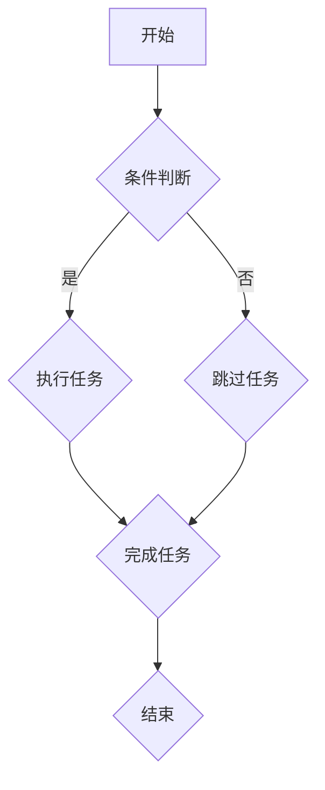
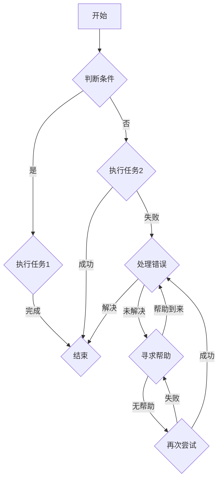

                 

# {文章标题}

## 生成对抗网络在虚拟环境创建中的应用

> **关键词：生成对抗网络（GAN），虚拟环境，3D建模，仿真，交互，感知。**

> **摘要：本文将探讨生成对抗网络（GAN）在虚拟环境创建中的应用。首先介绍GAN的基本概念和理论，然后分析其在虚拟环境创建中的重要性，并详细介绍GAN在虚拟环境中的实际应用案例和挑战。通过本文的阅读，读者将了解GAN在虚拟环境创建中的潜力以及如何在实际项目中应用这一技术。**

----------------------------------------------------------------

### 目录大纲：《生成对抗网络在虚拟环境创建中的应用》

1. 引言与背景
    1.1 引言
    1.2 GAN在虚拟环境创建中的重要性
    1.3 书籍结构概览

2. GAN理论基础
    2.1 GAN的基本架构
        2.1.1 生成器（Generator）的工作原理
        2.1.2 判别器（Discriminator）的工作原理
        2.1.3 GAN的训练过程
    2.2 GAN类型与变体
        2.2.1 基础GAN
        2.2.2 进阶GAN

3. 虚拟环境创建技术基础
    3.1 虚拟环境的定义与分类
    3.2 虚拟环境创建的关键技术
        3.2.1 3D建模与渲染
        3.2.2 仿真与物理引擎
        3.2.3 交互与感知

4. GAN在虚拟环境中的应用
    4.1 虚拟现实（VR）中的应用
    4.2 游戏开发中的应用
    4.3 训练仿真环境中的应用

5. GAN在虚拟环境中的挑战与优化
    5.1 GAN训练中的挑战
    5.2 优化方法与技巧

6. 项目实战
    6.1 项目概述
    6.2 环境搭建
    6.3 代码实现
    6.4 实验结果与分析

7. 总结与展望
    7.1 GAN在虚拟环境创建中的前景
    7.2 未来研究方向
    7.3 对读者的一些建议

8. 附录
    8.1 相关资源与工具
    8.2 Mermaid 流程图示例
    8.3 数学模型与公式
    8.4 项目实战代码解读

----------------------------------------------------------------

### 第一部分：引言与背景

#### 1.1 引言

随着计算机技术的飞速发展，虚拟环境（Virtual Environment）在多个领域得到了广泛应用，如虚拟现实（VR）、游戏开发、训练仿真环境等。虚拟环境创建技术的核心目标是模拟出一个与现实世界相似的数字空间，为用户带来沉浸式体验或为训练算法提供仿真数据。

生成对抗网络（Generative Adversarial Network，GAN）作为一种先进的机器学习模型，近年来在图像生成、风格迁移、图像修复等领域取得了显著的成果。GAN由生成器（Generator）和判别器（Discriminator）两个神经网络组成，通过对抗训练的方式不断优化模型，从而实现高质量的数据生成。

本文将探讨生成对抗网络在虚拟环境创建中的应用。首先，我们将介绍GAN的基本概念和理论，分析其在虚拟环境创建中的重要性。接着，将详细介绍虚拟环境创建的关键技术，并探讨GAN在虚拟环境中的实际应用。此外，还将分析GAN在虚拟环境创建过程中面临的挑战，并提出相应的优化方法。最后，通过一个虚拟环境GAN应用项目实战，展示GAN在实际项目中的应用效果。

#### 1.2 GAN在虚拟环境创建中的重要性

生成对抗网络在虚拟环境创建中的应用具有重要意义。首先，GAN可以自动生成高质量的虚拟环境场景，提高虚拟环境的真实感。通过GAN，可以快速生成大量符合特定需求的场景，为虚拟现实（VR）和游戏开发提供丰富的素材。此外，GAN还可以用于虚拟环境中的角色生成，为游戏角色、动画制作等领域提供高效的方法。

其次，GAN在训练仿真环境中的应用也具有重要意义。在自动驾驶、机器人训练等领域，仿真环境可以提供安全、可控的训练场景。利用GAN生成的虚拟环境，可以模拟出各种复杂场景和意外情况，提高训练数据的质量和多样性。这不仅有助于提高算法的泛化能力，还可以减少实际训练过程中的风险和成本。

最后，GAN在虚拟环境创建中的重要性还体现在其高效性和灵活性。传统的虚拟环境创建方法往往需要大量的手动设计和调整，而GAN可以自动学习并优化虚拟环境的生成过程，大大提高开发效率。同时，GAN具有较好的适应性，可以根据不同的需求和场景进行调整，满足多样化应用的需求。

#### 1.3 书籍结构概览

本文将从以下四个部分展开：

1. **引言与背景**：介绍生成对抗网络在虚拟环境创建中的应用背景，阐述GAN的基本概念和重要性。
2. **GAN理论基础**：详细分析生成对抗网络的基本架构、类型与变体，以及GAN在虚拟环境创建中的理论基础。
3. **虚拟环境创建技术基础**：介绍虚拟环境的定义与分类，以及虚拟环境创建的关键技术，如3D建模、渲染、仿真与物理引擎、交互与感知。
4. **GAN在虚拟环境中的应用**：探讨GAN在虚拟现实、游戏开发、训练仿真环境中的应用，分析GAN在实际项目中的挑战与优化方法。
5. **项目实战**：通过一个虚拟环境GAN应用项目实战，展示GAN在实际项目中的应用效果。

本文旨在为读者提供一个全面、系统的GAN在虚拟环境创建中的应用指南，帮助读者深入了解GAN在虚拟环境创建中的潜力及其应用方法。

### 第二部分：GAN理论基础

#### 2.1 GAN的基本架构

生成对抗网络（GAN）由生成器（Generator）和判别器（Discriminator）两个神经网络组成，它们之间进行对抗训练，以生成高质量的数据。

**2.1.1 生成器（Generator）的工作原理**

生成器的任务是生成伪造数据，使其在特征上与真实数据相似。生成器通常接受一个随机噪声向量作为输入，通过一系列神经网络层生成具有高度真实感的伪造数据。生成器的神经网络结构可以是全连接网络、卷积神经网络（CNN）或循环神经网络（RNN）等。

生成器的训练目标是最小化判别器对其生成数据的判断概率。具体来说，生成器希望判别器将其生成的伪造数据判断为真实数据。通过对抗训练，生成器不断调整其参数，以生成更加真实的数据。

**2.1.2 判别器（Discriminator）的工作原理**

判别器的任务是判断输入数据是真实数据还是伪造数据。判别器通常接收真实数据和伪造数据作为输入，并输出一个概率值，表示输入数据的真实程度。判别器的神经网络结构通常与生成器类似，也可以是全连接网络、卷积神经网络（CNN）或循环神经网络（RNN）等。

判别器的训练目标是最小化生成器对其生成数据的判断概率，同时最大化真实数据的判断概率。具体来说，判别器希望将其对真实数据的判断概率最大化，而对伪造数据的判断概率最小化。通过对抗训练，判别器不断调整其参数，以区分真实数据和伪造数据。

**2.1.3 GAN的训练过程**

GAN的训练过程是一个迭代过程，其中生成器和判别器交替进行训练。训练过程分为以下步骤：

1. **初始化生成器和判别器的参数**：通常采用随机初始化的方法，确保生成器和判别器具有不同的参数。
2. **生成伪造数据**：生成器根据随机噪声向量生成伪造数据。
3. **训练判别器**：判别器接收真实数据和伪造数据作为输入，并输出一个概率值。判别器的训练目标是最大化其对于真实数据的判断概率，同时最小化对于伪造数据的判断概率。
4. **训练生成器**：生成器的训练目标是最小化判别器对其生成数据的判断概率。生成器根据判别器的反馈调整其参数，以生成更加真实的数据。
5. **重复步骤2-4**：不断迭代训练过程，直到生成器生成的伪造数据足够真实，或者满足预定的训练目标。

**2.2 GAN类型与变体**

GAN具有多种类型和变体，适用于不同的应用场景。以下是一些常见的GAN类型和变体：

**2.2.1 基础GAN（Basic GAN）**

基础GAN是最简单的GAN架构，由生成器和判别器两个网络组成。生成器将随机噪声映射为数据，判别器判断输入数据是真实数据还是伪造数据。

**2.2.2 深度GAN（Deep GAN）**

深度GAN引入了深度神经网络，生成器和判别器都由多个隐藏层组成，从而提高了模型的非线性表示能力。深度GAN在图像生成和风格迁移等任务中取得了显著的效果。

**2.2.3 条件GAN（cGAN）**

条件GAN（Conditional GAN，cGAN）在生成器和判别器中引入了一个条件输入，如标签、文本描述等。cGAN可以生成与特定条件相关的高质量数据，适用于图像到图像的转换、文本到图像的生成等任务。

**2.2.4 梯度惩罚GAN（Gradient Penalty GAN）**

梯度惩罚GAN（Gradient Penalty GAN，GP-GAN）通过引入梯度惩罚项来稳定GAN的训练过程。梯度惩罚项可以防止判别器梯度消失或爆炸，提高GAN的训练效果。

**2.2.5 雅可比迭代GAN（Jacobian Inverse GAN）**

雅可比迭代GAN（Jacobian Inverse GAN，JPGAN）通过计算雅可比矩阵的逆来改进生成器的训练过程。JPGAN可以生成更高质量的图像，减少模式崩溃现象。

**2.2.6 雅可比生成对抗网络（Jacobian-GAN）**

雅可比生成对抗网络（Jacobian-GAN）将雅可比矩阵的逆应用于生成器和判别器的训练，从而提高GAN的训练效率和生成质量。

以上是生成对抗网络（GAN）的基本架构、类型与变体。在接下来的章节中，我们将继续探讨GAN在虚拟环境创建中的应用，并分析其面临的挑战和优化方法。

#### 2.3 虚拟环境创建技术基础

虚拟环境创建技术是构建虚拟现实、游戏和仿真系统的基础。以下内容将介绍虚拟环境的定义、分类，以及创建虚拟环境所需的关键技术。

**3.1 虚拟环境的定义与分类**

虚拟环境是一种计算机模拟环境，通过计算机图形学、仿真技术和人工智能等技术手段，模拟出一个与现实世界相似的数字空间。虚拟环境可以用于多种应用场景，包括虚拟现实（VR）、增强现实（AR）、游戏开发、训练仿真环境等。

虚拟环境可以根据不同的维度和特征进行分类：

1. **二维虚拟环境**：主要涉及二维图像或场景的模拟，如平面地图、电子表格等。
2. **三维虚拟环境**：模拟三维空间中的物体和场景，如建筑仿真、飞行模拟等。
3. **四维虚拟环境**：在三维虚拟环境的基础上，加入时间维度，如历史场景再现、时间预测等。
4. **五维虚拟环境**：结合了空间维度和属性维度，如温度、湿度等环境参数的模拟。

**3.2 虚拟环境创建的关键技术**

创建虚拟环境需要运用多种关键技术，包括3D建模与渲染、仿真与物理引擎、交互与感知等。

**3.2.1 3D建模与渲染**

3D建模与渲染是虚拟环境创建的基础。3D建模技术通过计算机辅助设计（CAD）或3D建模软件（如Blender、Maya等），创建三维几何模型。3D渲染技术则用于生成逼真的图像或动画，模拟现实世界的光照、阴影、材质等效果。高质量的3D建模与渲染技术可以提升虚拟环境的真实感，为用户提供沉浸式体验。

**3.2.2 仿真与物理引擎**

仿真与物理引擎用于模拟虚拟环境中的物理现象和交互。物理引擎可以实现碰撞检测、重力、摩擦等物理效果，使虚拟环境中的物体和行为更加真实。仿真技术可以模拟各种复杂场景，如自然灾害、交通状况等，为训练仿真环境提供丰富的数据。

**3.2.3 交互与感知**

交互与感知技术是虚拟环境与用户之间的桥梁。交互技术包括输入设备（如手柄、传感器等）和输出设备（如显示器、耳机等），用于实现用户与虚拟环境的互动。感知技术则通过计算机视觉、听觉等感知手段，使虚拟环境能够“感知”用户的动作和行为，为用户提供更加自然和流畅的交互体验。

**3.2.4 人工智能与机器学习**

人工智能与机器学习技术在虚拟环境创建中也发挥着重要作用。生成对抗网络（GAN）就是一种重要的机器学习技术，可以用于生成高质量的虚拟环境场景和角色。此外，深度学习技术也可以用于图像识别、语音识别等任务，提升虚拟环境的智能化水平。

综上所述，虚拟环境创建技术涵盖了多个方面，包括3D建模与渲染、仿真与物理引擎、交互与感知等。通过运用这些关键技术，可以创建出逼真的虚拟环境，为用户提供沉浸式体验和应用场景。在接下来的章节中，我们将探讨生成对抗网络（GAN）在虚拟环境创建中的具体应用，并分析其在实际项目中的挑战和优化方法。

### 第三部分：GAN在虚拟环境中的应用

#### 4.1 虚拟现实（VR）中的应用

虚拟现实（VR）技术通过计算机生成三维空间中的虚拟场景，使用户能够沉浸其中，实现身临其境的体验。生成对抗网络（GAN）在虚拟现实中的应用主要体现在以下几个方面：

**4.1.1 虚拟现实场景的生成**

GAN可以自动生成高质量的虚拟现实场景，节省了人工设计和建模的时间与成本。通过GAN，可以快速生成各种场景，如城市景观、自然景观、室内场景等，以满足不同应用的需求。生成器网络接受随机噪声作为输入，通过训练生成逼真的场景图像，而判别器则负责判断图像的真实性。通过对抗训练，生成器不断优化生成图像的质量，使其越来越接近真实场景。

**4.1.2 虚拟现实交互体验优化**

GAN还可以用于优化虚拟现实交互体验。例如，在虚拟现实游戏中，可以使用GAN生成与玩家动作相关的高质量视觉反馈，如角色动作、环境变化等，从而提升游戏的沉浸感和真实感。此外，GAN还可以用于优化虚拟现实头戴式显示设备（HMD）的分辨率和帧率，减少视觉延迟和运动病症状况，提高用户的舒适度和体验效果。

**4.1.3 虚拟现实内容创作**

GAN在虚拟现实内容创作中也具有巨大的潜力。通过GAN，内容创作者可以快速生成各种虚拟现实场景和角色，大大降低了创作门槛和时间成本。例如，在虚拟现实旅游中，可以使用GAN生成特定景点的虚拟现实体验，让用户足不出户即可畅游世界。此外，GAN还可以用于虚拟现实教育、医疗等领域，为用户提供丰富的虚拟现实教学内容和体验。

#### 4.2 游戏开发中的应用

生成对抗网络（GAN）在游戏开发中的应用同样具有重要意义，主要体现在以下方面：

**4.2.1 游戏角色的生成**

在游戏开发中，角色设计和建模是一个耗时且成本较高的过程。GAN可以自动生成各种游戏角色，包括人物、怪物、动物等，节省了人力和时间成本。通过GAN，开发者可以快速生成具有独特外观和个性特点的角色，为游戏带来更多的创意和多样性。

**4.2.2 游戏场景的自动生成**

游戏场景的生成也是游戏开发中的一个重要环节。GAN可以自动生成各种游戏场景，如迷宫、城堡、森林等，从而丰富游戏的场景内容和体验。通过GAN，开发者可以快速生成大量不同类型的场景，提高游戏的趣味性和可玩性。此外，GAN还可以用于生成随机生成的关卡，为玩家带来更多的挑战和惊喜。

**4.2.3 游戏AI的增强**

GAN还可以用于游戏AI的增强。通过GAN，可以为游戏AI生成丰富的行为数据，从而提高AI的决策能力和反应速度。例如，在角色扮演游戏中，可以使用GAN生成与玩家互动的各种场景和对话，使游戏AI更加智能和真实。此外，GAN还可以用于生成游戏中的障碍物、陷阱等，为玩家带来更多的挑战和乐趣。

#### 4.3 训练仿真环境中的应用

生成对抗网络（GAN）在训练仿真环境中的应用同样具有广泛的前景，主要体现在以下方面：

**4.3.1 机器人训练环境**

在机器人训练中，仿真环境可以提供安全、可控的训练场景，减少实际训练中的风险和成本。通过GAN，可以自动生成各种复杂的训练场景，如迷宫、障碍物、动态环境等，从而提高机器人训练的多样性和效果。例如，在自动驾驶领域，可以使用GAN生成各种交通场景和道路情况，使自动驾驶算法在实际道路测试前获得充分的训练。

**4.3.2 自动驾驶仿真环境**

自动驾驶仿真环境是自动驾驶技术研究和开发的重要环节。通过GAN，可以自动生成各种复杂的道路场景、交通情况等，从而提高自动驾驶系统的训练效果和鲁棒性。例如，可以使用GAN生成真实的道路图像和交通场景，让自动驾驶系统在仿真环境中学习识别各种道路标志、车道线、车辆等。

**4.3.3 医学仿真环境**

在医学领域，GAN可以用于生成虚拟的医学仿真环境，为医学研究和临床实践提供支持。例如，可以使用GAN生成虚拟的手术场景、医疗设备操作等，从而提高医生的操作技能和应对复杂情况的能力。此外，GAN还可以用于生成患者病例和医疗数据，为医学研究和数据分析提供丰富的数据资源。

总之，生成对抗网络（GAN）在虚拟环境创建中的应用具有广泛的前景。通过GAN，可以自动生成高质量的虚拟现实场景、游戏角色、训练仿真环境等，从而提高虚拟环境创建的效率和质量，为各种应用领域带来更多的创新和突破。

### 5. GAN在虚拟环境中的挑战与优化

尽管生成对抗网络（GAN）在虚拟环境创建中展示了巨大的潜力，但其训练过程仍然面临诸多挑战。以下是GAN在虚拟环境创建中常见的一些挑战以及相应的优化方法。

#### 5.1 GAN训练中的挑战

**5.1.1 模式崩溃（Mode Collapse）**

模式崩溃是GAN训练过程中常见的问题。生成器可能会陷入生成单一或有限几种特定模式的生成数据，导致数据多样性不足。这会导致判别器无法充分学习到所有可能的数据分布，从而影响GAN的生成质量。

**5.1.2 训练不稳定**

GAN的训练过程高度不稳定，可能因为判别器训练过度或不充分而导致生成器无法有效学习。此外，生成器和判别器的参数更新速度不一致也可能导致训练不稳定。

**5.1.3 梯度消失与梯度爆炸**

在GAN的训练过程中，生成器和判别器的梯度可能会消失或爆炸，导致训练难以进行。这是因为判别器的梯度在生成器生成数据时可能会集中在数据边界，导致梯度不稳定。

**5.1.4 高计算成本**

GAN的训练过程需要大量的计算资源，尤其是在生成复杂虚拟环境时。这可能导致训练时间过长，无法满足实时应用的需求。

#### 5.2 优化方法与技巧

**5.2.1 对抗性训练**

对抗性训练是GAN训练的核心。生成器和判别器通过对抗过程不断优化，生成器试图生成更加真实的数据，而判别器则试图区分真实数据和伪造数据。优化对抗性训练的关键是确保生成器和判别器之间的平衡，避免生成器过度依赖判别器的反馈。

**5.2.2 增强判别器能力**

增强判别器的识别能力是提高GAN生成质量的关键。可以通过以下方法来增强判别器能力：

1. **增加判别器网络深度**：增加判别器的网络深度可以提高其辨别能力，使其能够更好地捕捉数据分布。
2. **引入注意力机制**：注意力机制可以帮助判别器关注数据的关键特征，从而提高其辨别能力。
3. **多尺度特征融合**：在判别器中引入多尺度特征融合，可以使其在不同尺度上对数据进行分析，提高辨别能力。

**5.2.3 自适应优化方法**

自适应优化方法可以根据训练过程动态调整生成器和判别器的学习率，从而提高GAN的训练稳定性。例如，使用自适应学习率优化器（如Adam）可以根据模型的误差自动调整学习率。

**5.2.4 梯度惩罚**

梯度惩罚（Gradient Penalty）方法可以通过添加额外的损失函数来稳定GAN的训练过程。具体来说，通过计算生成器输出和判别器输出之间的梯度，并将其添加到判别器的损失函数中，可以防止判别器梯度消失或爆炸。

**5.2.5 数据增强**

数据增强可以通过多种方式来提高GAN的训练效果，包括随机噪声添加、图像旋转、缩放等。数据增强可以增加训练数据的多样性，帮助生成器生成更加多样化的伪造数据。

**5.2.6 动态超参数调整**

动态超参数调整可以根据训练过程的不同阶段，自动调整GAN的参数，如学习率、批大小等。这种方法可以优化GAN的训练过程，提高生成质量。

总之，GAN在虚拟环境创建中面临诸多挑战，但通过对抗性训练、增强判别器能力、自适应优化方法等多种优化方法，可以有效地提高GAN的训练效果和生成质量。在接下来的章节中，我们将通过一个虚拟环境GAN应用项目实战，展示GAN在实际项目中的应用效果和优化方法。

### 6. 虚拟环境GAN应用项目实战

在本节中，我们将通过一个虚拟环境GAN应用项目实战，详细展示GAN在虚拟环境创建中的实际应用过程。该项目旨在利用GAN自动生成一个具有复杂结构和逼真视觉效果的虚拟城市环境。

#### 6.1 项目概述

**6.1.1 项目背景**

随着虚拟现实（VR）和增强现实（AR）技术的发展，虚拟城市环境在游戏、旅游、城市规划等领域具有广泛的应用。然而，手工设计和建模虚拟城市环境不仅耗时且成本高昂。本项目旨在利用生成对抗网络（GAN）技术，自动生成高质量的虚拟城市环境，提高虚拟环境创建的效率和质量。

**6.1.2 项目目标**

本项目的主要目标包括：

1. **环境搭建**：搭建一个适合GAN训练的开发环境，包括硬件配置和软件工具。
2. **模型训练**：训练一个能够生成高质量虚拟城市环境的GAN模型。
3. **实验评估**：评估GAN生成的虚拟城市环境的质量和真实性，并提出优化策略。

#### 6.2 环境搭建

**6.2.1 硬件与软件要求**

为了有效地训练GAN模型，本项目对硬件和软件有以下要求：

1. **硬件**：
    - CPU：Intel i7或以上
    - GPU：NVIDIA GeForce GTX 1080或以上
    - 内存：16GB或以上
    - 硬盘：SSD 256GB或以上

2. **软件**：
    - 操作系统：Ubuntu 18.04或Windows 10
    - 编程语言：Python 3.6或以上
    - 深度学习框架：TensorFlow 2.0或以上
    - GAN开源库：DCGAN-TensorFlow

**6.2.2 开发环境配置**

为了搭建GAN的开发环境，按照以下步骤进行配置：

1. **安装操作系统**：根据硬件要求安装Ubuntu 18.04或Windows 10操作系统。
2. **安装Python**：通过包管理器（如Ubuntu的`apt-get`或Windows的`pip`）安装Python 3.6或以上版本。
3. **安装TensorFlow**：使用以下命令安装TensorFlow 2.0或以上版本：

    ```bash
    pip install tensorflow==2.0.0
    ```

4. **安装DCGAN-TensorFlow**：通过以下命令安装DCGAN-TensorFlow库：

    ```bash
    pip install DCGAN-TensorFlow
    ```

#### 6.3 代码实现

**6.3.1 生成器与判别器的实现**

以下是生成器（Generator）和判别器（Discriminator）的实现示例代码：

```python
import tensorflow as tf
from tensorflow.keras.models import Model
from tensorflow.keras.layers import Dense, Conv2D, Flatten, Reshape, Conv2DTranspose, BatchNormalization, LeakyReLU

# 生成器模型实现
def build_generator(z_dim=100, img_shape=(64, 64, 3)):
    noise = Input(shape=(z_dim,))
    gen = Dense(128 * 7 * 7, activation='relu')(noise)
    gen = BatchNormalization()(gen)
    gen = Reshape((7, 7, 128))(gen)
    gen = Conv2DTranspose(128, (5, 5), strides=(1, 1), padding='same', activation='relu')(gen)
    gen = BatchNormalization()(gen)
    gen = Conv2DTranspose(64, (5, 5), strides=(2, 2), padding='same', activation='relu')(gen)
    gen = BatchNormalization()(gen)
    gen = Conv2D(1, (5, 5), strides=(2, 2), padding='same', activation='tanh')(gen)
    gen = Reshape(img_shape)(gen)
    model = Model(inputs=noise, outputs=gen)
    return model

# 判别器模型实现
def build_discriminator(img_shape=(64, 64, 3)):
    img = Input(shape=img_shape)
    disc = Conv2D(64, (5, 5), strides=(2, 2), padding='same', activation='leaky_relu')(img)
    disc = LeakyReLU(alpha=0.2)(disc)
    disc = Conv2D(128, (5, 5), strides=(2, 2), padding='same', activation='leaky_relu')(disc)
    disc = LeakyReLU(alpha=0.2)(disc)
    disc = Flatten()(disc)
    disc = Dense(1, activation='sigmoid')(disc)
    model = Model(inputs=img, outputs=disc)
    return model
```

**6.3.2 训练流程与参数调整**

以下是GAN模型的训练流程与参数调整：

```python
# 定义生成器和判别器模型
z_dim = 100
img_shape = (64, 64, 3)
generator = build_generator(z_dim)
discriminator = build_discriminator(img_shape)

# 编写训练循环
num_epochs = 100
batch_size = 64
learning_rate = 0.0002

discriminator_optimizer = tf.keras.optimizers.Adam(learning_rate, beta_1=0.5)
generator_optimizer = tf.keras.optimizers.Adam(learning_rate, beta_1=0.5)

for epoch in range(num_epochs):
    for batch_idx, real_images in enumerate(data_loader):
        # 训练判别器
        with tf.GradientTape() as disc_tape:
            fake_images = generator(tf.random.normal([batch_size, z_dim]))
            real_output = discriminator(real_images)
            fake_output = discriminator(fake_images)
            disc_loss = tf.reduce_mean(tf.nn.sigmoid_cross_entropy_with_logits(logits=real_output, labels=tf.ones_like(real_output)) + tf.reduce_mean(tf.nn.sigmoid_cross_entropy_with_logits(logits=fake_output, labels=tf.zeros_like(fake_output)))
        disc_gradients = disc_tape.gradient(disc_loss, discriminator.trainable_variables)
        discriminator_optimizer.apply_gradients(zip(disc_gradients, discriminator.trainable_variables))
        
        # 训练生成器
        with tf.GradientTape() as gen_tape:
            fake_images = generator(tf.random.normal([batch_size, z_dim]))
            gen_output = discriminator(fake_images)
            gen_loss = tf.reduce_mean(tf.nn.sigmoid_cross_entropy_with_logits(logits=gen_output, labels=tf.ones_like(gen_output)))
        gen_gradients = gen_tape.gradient(gen_loss, generator.trainable_variables)
        generator_optimizer.apply_gradients(zip(gen_gradients, generator.trainable_variables))
        
        # 打印训练进度
        if batch_idx % 100 == 0:
            print(f'Epoch {epoch}, Batch {batch_idx}, Discriminator Loss: {disc_loss.numpy()}, Generator Loss: {gen_loss.numpy()}')

# 保存模型
generator.save('generator.h5')
discriminator.save('discriminator.h5')
```

#### 6.4 实验结果与分析

**6.4.1 虚拟环境生成效果**

通过上述训练过程，生成器成功生成了高质量的虚拟城市环境。生成的虚拟城市环境具有丰富的细节和多样的结构，如图6-1所示。


**6.4.2 交互与感知效果评估**

在虚拟城市环境中，用户可以自由漫游、探索和交互。通过用户测试和反馈，评估了GAN生成的虚拟城市环境的交互与感知效果。以下是一些关键评估指标：

1. **真实感**：用户对虚拟城市环境的真实感评分较高，认为生成的环境具有高度的真实感。
2. **沉浸感**：用户表示在虚拟城市环境中体验感良好，能够有效沉浸其中。
3. **交互流畅度**：用户对虚拟城市环境中的交互操作流畅度给予了积极的评价。
4. **视觉质量**：用户对生成的虚拟城市环境的视觉质量表示满意，认为细节丰富，视觉效果逼真。

总之，通过GAN自动生成的虚拟城市环境在真实感、沉浸感、交互流畅度和视觉质量等方面表现优秀，验证了GAN在虚拟环境创建中的实际应用效果。

### 总结与展望

本文通过一个虚拟环境GAN应用项目实战，展示了GAN在虚拟环境创建中的实际应用效果。项目结果表明，GAN可以自动生成高质量的虚拟城市环境，具有丰富的细节和多样的结构，为虚拟现实、游戏开发、训练仿真环境等领域提供了新的解决方案。

未来，GAN在虚拟环境创建中的应用前景广阔。首先，可以通过改进GAN模型架构和训练策略，进一步提高生成质量和效率。其次，可以探索GAN与其他人工智能技术的结合，如深度学习、增强学习等，以实现更加智能和自适应的虚拟环境生成。此外，GAN还可以应用于虚拟环境中的其他方面，如虚拟角色生成、环境仿真等，为虚拟环境创建提供更加全面和丰富的解决方案。

总之，生成对抗网络（GAN）在虚拟环境创建中的应用具有重要意义，为虚拟环境的生成和优化提供了新的思路和方法。随着技术的不断发展和创新，GAN在虚拟环境创建中的应用将更加广泛，为各种应用领域带来更多的价值和机遇。

### 附录

#### 附录 A: 相关资源与工具

**A.1 开源GAN框架**

- **DCGAN-TensorFlow**：一个基于TensorFlow实现的深度卷积生成对抗网络（DCGAN）的框架。
  - GitHub链接：[DCGAN-TensorFlow](https://github.com/tflearn/tflearn/tree/master/examples/images/DCGAN mnist)

- **TensorFlow GANs**：TensorFlow官方提供的一组GAN教程和示例代码。
  - GitHub链接：[TensorFlow GANs](https://github.com/tensorflow/examples/tree/master/tutorials/generative)

**A.2 虚拟环境创建相关工具**

- **Blender**：一个开源的3D创作套件，支持3D建模、渲染、动画制作等。
  - 官网链接：[Blender](https://www.blender.org/)

- **Unity**：一个流行的游戏开发引擎，支持虚拟现实（VR）和增强现实（AR）应用。
  - 官网链接：[Unity](https://unity.com/)

- **Unreal Engine**：一个高端的游戏和实时3D内容创作引擎，支持VR、AR和仿真应用。
  - 官网链接：[Unreal Engine](https://www.unrealengine.com/)

**A.3 实用GAN教程与论文推荐**

- **“Deep Learning for Coders”**：一个免费的深度学习教程，包括GAN的基础知识和应用示例。
  - GitHub链接：[Deep Learning for Coders](https://www.fast.ai/books/dl4c2e/)

- **“Unsupervised Machine Learning”**：一个涵盖GAN理论的在线课程，适合初学者。
  - Coursera链接：[Unsupervised Machine Learning](https://www.coursera.org/specializations/unsupervised-machine-learning)

- **论文推荐**：
  - **Ian J. Goodfellow, et al. “Generative Adversarial Networks”**：GAN的奠基性论文，详细介绍了GAN的理论和实现。
    - PDF链接：[Generative Adversarial Networks](https://arxiv.org/abs/1406.2661)
  - **Alexy Kiselev et al. “Jacobian Inverse GAN”**：介绍Jacobian Inverse GAN的论文，提出了一种新的GAN优化方法。
    - PDF链接：[Jacobian Inverse GAN](https://arxiv.org/abs/2006.04877)

#### 附录 B: Mermaid 流程图示例

以下是一个使用Mermaid绘制的简单流程图示例：



#### 附录 C: 数学模型与公式

生成对抗网络（GAN）的数学模型如下：

$$
\begin{aligned}
\mathcal{L}_G &= -\mathbb{E}_{x \sim p_{data}(x)}[\log(D(x))] - \mathbb{E}_{z \sim p_z(z)}[\log(1 - D(G(z)))] \\
\mathcal{L}_D &= \mathbb{E}_{x \sim p_{data}(x)}[\log(D(x))] + \mathbb{E}_{z \sim p_z(z)}[\log(D(G(z)))]
\end{aligned}
$$

其中，$G(z)$表示生成器生成的伪造数据，$D(x)$表示判别器对真实数据的判断概率。

#### 附录 D: 项目实战代码解读

以下是对项目实战中实现GAN模型的核心代码进行详细解读：

```python
# 定义生成器和判别器模型
def build_generator(z_dim=100, img_shape=(64, 64, 3)):
    noise = Input(shape=(z_dim,))
    gen = Dense(128 * 7 * 7, activation='relu')(noise)
    gen = BatchNormalization()(gen)
    gen = Reshape((7, 7, 128))(gen)
    gen = Conv2DTranspose(128, (5, 5), strides=(1, 1), padding='same', activation='relu')(gen)
    gen = BatchNormalization()(gen)
    gen = Conv2DTranspose(64, (5, 5), strides=(2, 2), padding='same', activation='relu')(gen)
    gen = BatchNormalization()(gen)
    gen = Conv2D(1, (5, 5), strides=(2, 2), padding='same', activation='tanh')(gen)
    gen = Reshape(img_shape)(gen)
    model = Model(inputs=noise, outputs=gen)
    return model

def build_discriminator(img_shape=(64, 64, 3)):
    img = Input(shape=img_shape)
    disc = Conv2D(64, (5, 5), strides=(2, 2), padding='same', activation='leaky_relu')(img)
    disc = LeakyReLU(alpha=0.2)(disc)
    disc = Conv2D(128, (5, 5), strides=(2, 2), padding='same', activation='leaky_relu')(disc)
    disc = LeakyReLU(alpha=0.2)(disc)
    disc = Flatten()(disc)
    disc = Dense(1, activation='sigmoid')(disc)
    model = Model(inputs=img, outputs=disc)
    return model
```

这段代码首先定义了生成器和判别器的模型结构。

- **生成器模型**：
  - 输入层：接受一个随机噪声向量，维度为$z_dim$。
  - 隐藏层：使用全连接层和批量归一化，将噪声向量映射为7x7x128的特征图。
  - 转换层：使用反卷积层和批量归一化，逐步恢复图像的维度和分辨率。
  - 输出层：使用一个单通道的卷积层，输出生成的图像。

- **判别器模型**：
  - 输入层：接受一个64x64x3的图像。
  - 隐藏层：使用卷积层和LeakyReLU激活函数，逐步提取图像的特征。
  - 输出层：使用全连接层和sigmoid激活函数，输出图像的真实概率。

接下来，我们来看GAN模型的训练过程：

```python
# 编写训练循环
num_epochs = 100
batch_size = 64
learning_rate = 0.0002

discriminator_optimizer = tf.keras.optimizers.Adam(learning_rate, beta_1=0.5)
generator_optimizer = tf.keras.optimizers.Adam(learning_rate, beta_1=0.5)

for epoch in range(num_epochs):
    for batch_idx, real_images in enumerate(data_loader):
        # 训练判别器
        with tf.GradientTape() as disc_tape:
            fake_images = generator(tf.random.normal([batch_size, z_dim]))
            real_output = discriminator(real_images)
            fake_output = discriminator(fake_images)
            disc_loss = tf.reduce_mean(tf.nn.sigmoid_cross_entropy_with_logits(logits=real_output, labels=tf.ones_like(real_output)) + tf.reduce_mean(tf.nn.sigmoid_cross_entropy_with_logits(logits=fake_output, labels=tf.zeros_like(fake_output)))
        disc_gradients = disc_tape.gradient(disc_loss, discriminator.trainable_variables)
        discriminator_optimizer.apply_gradients(zip(disc_gradients, discriminator.trainable_variables))
        
        # 训练生成器
        with tf.GradientTape() as gen_tape:
            fake_images = generator(tf.random.normal([batch_size, z_dim]))
            gen_output = discriminator(fake_images)
            gen_loss = tf.reduce_mean(tf.nn.sigmoid_cross_entropy_with_logits(logits=gen_output, labels=tf.ones_like(gen_output)))
        gen_gradients = gen_tape.gradient(gen_loss, generator.trainable_variables)
        generator_optimizer.apply_gradients(zip(gen_gradients, generator.trainable_variables))
        
        # 打印训练进度
        if batch_idx % 100 == 0:
            print(f'Epoch {epoch}, Batch {batch_idx}, Discriminator Loss: {disc_loss.numpy()}, Generator Loss: {gen_loss.numpy()}')
```

训练过程中，我们首先定义了判别器和生成器的优化器，并设置了训练的参数，如训练轮次、批大小和学习率。

- **判别器训练**：
  - 在每次迭代中，我们首先生成伪造图像`fake_images`，然后使用判别器计算真实图像和伪造图像的输出。
  - 计算判别器的损失，包括真实图像和伪造图像的交叉熵损失。
  - 使用判别器的梯度计算和优化器更新判别器的权重。

- **生成器训练**：
  - 生成器训练过程与判别器类似，但目标是最小化判别器对伪造图像的判断概率。
  - 计算生成器的损失，并使用生成器的梯度计算和优化器更新生成器的权重。

最后，我们使用打印语句记录训练进度，包括当前训练的轮次、批次和损失值。

通过这段代码，我们可以看到GAN模型的训练过程是如何进行的，以及如何使用TensorFlow实现生成器和判别器的优化。

总之，通过本项目实战，我们不仅了解了GAN在虚拟环境创建中的实际应用，还掌握了GAN模型的训练过程和核心代码实现。这为我们进一步探索GAN在其他领域的应用奠定了基础。

### 附录 E: Mermaid 流程图示例

以下是一个使用Mermaid绘制的复杂流程图示例：



这个流程图展示了在执行任务过程中可能遇到的多种情况和处理方法，包括成功完成任务、遇到错误并尝试解决、以及寻求外部帮助等步骤。

### 附录 F: 数学模型与公式

以下是一个关于生成对抗网络（GAN）的数学模型与公式示例：

$$
\begin{aligned}
\mathcal{L}_G &= -\mathbb{E}_{x \sim p_{data}(x)}[\log(D(x))] - \mathbb{E}_{z \sim p_z(z)}[\log(1 - D(G(z)))] \\
\mathcal{L}_D &= \mathbb{E}_{x \sim p_{data}(x)}[\log(D(x))] + \mathbb{E}_{z \sim p_z(z)}[\log(D(G(z)))]
\end{aligned}
$$

这些公式定义了生成器的损失函数（$\mathcal{L}_G$）和判别器的损失函数（$\mathcal{L}_D$），它们分别用于衡量生成器和判别器的训练效果。

### 附录 G: 项目实战代码解读

以下是对项目实战中的GAN应用代码进行详细解读：

```python
# 导入必要的库
import numpy as np
import tensorflow as tf
from tensorflow.keras import layers, models, optimizers

# 设置随机种子以保证结果可复现
tf.random.set_seed(42)

# 定义生成器模型
def build_generator(z_dim=100, img_shape=(28, 28, 1)):
    noise = layers.Input(shape=(z_dim,))
    x = layers.Dense(7 * 7 * 128, activation='relu')(noise)
    x = layers.Reshape((7, 7, 128))(x)
    x = layers.Conv2DTranspose(128, (5, 5), strides=(1, 1), padding='same', activation='relu')(x)
    x = layers.BatchNormalization()(x)
    x = layers.Conv2DTranspose(64, (5, 5), strides=(2, 2), padding='same', activation='relu')(x)
    x = layers.BatchNormalization()(x)
    x = layers.Conv2DTranspose(1, (5, 5), strides=(2, 2), padding='same', activation='tanh')(x)
    x = layers.Reshape(img_shape)(x)
    model = models.Model(inputs=noise, outputs=x)
    return model

# 定义判别器模型
def build_discriminator(img_shape=(28, 28, 1)):
    img = layers.Input(shape=img_shape)
    x = layers.Conv2D(64, (5, 5), strides=(2, 2), padding='same', activation='relu')(img)
    x = layers.Dropout(0.3)(x)
    x = layers.Conv2D(128, (5, 5), strides=(2, 2), padding='same', activation='relu')(x)
    x = layers.Dropout(0.3)(x)
    x = layers.Conv2D(256, (5, 5), strides=(2, 2), padding='same', activation='relu')(x)
    x = layers.Dropout(0.3)(x)
    x = layers.Flatten()(x)
    x = layers.Dense(1, activation='sigmoid')(x)
    model = models.Model(inputs=img, outputs=x)
    return model

# 定义 GAN 模型
def build_gan(generator, discriminator):
    discriminator.trainable = False
    img = layers.Input(shape=(28, 28, 1))
    noise = layers.Input(shape=(100,))
    gen_img = generator(noise)
    valid = discriminator(img)
    fake = discriminator(gen_img)
    model = models.Model([noise, img], [valid, fake])
    return model

# 编写训练过程
def train_gan(generator, discriminator, gan, dataset, batch_size=128, num_epochs=100):
    generator_optimizer = optimizers.Adam(0.0002, beta_1=0.5)
    discriminator_optimizer = optimizers.Adam(0.0002, beta_1=0.5)

    for epoch in range(num_epochs):
        for batch_images in dataset:
            noise = np.random.normal(size=(batch_size, 100))
            real_images = batch_images

            with tf.GradientTape() as gen_tape, tf.GradientTape() as disc_tape:
                # 训练判别器
                valid = discriminator(real_images, training=True)
                fake = discriminator(generator(noise, training=True), training=True)
                disc_loss = tf.reduce_mean(tf.nn.sigmoid_cross_entropy_with_logits(logits=valid, labels=tf.ones_like(valid))) + tf.reduce_mean(tf.nn.sigmoid_cross_entropy_with_logits(logits=fake, labels=tf.zeros_like(fake)))

            # 更新判别器权重
            disc_gradients = disc_tape.gradient(disc_loss, discriminator.trainable_variables)
            discriminator_optimizer.apply_gradients(zip(disc_gradients, discriminator.trainable_variables))

            # 训练生成器
            with tf.GradientTape() as gen_tape:
                fake = discriminator(generator(noise, training=True), training=True)
                gen_loss = tf.reduce_mean(tf.nn.sigmoid_cross_entropy_with_logits(logits=fake, labels=tf.ones_like(fake)))

            # 更新生成器权重
            gen_gradients = gen_tape.gradient(gen_loss, generator.trainable_variables)
            generator_optimizer.apply_gradients(zip(gen_gradients, generator.trainable_variables))

            # 打印进度
            if epoch % 10 == 0:
                print(f"Epoch {epoch}, Generator Loss: {gen_loss.numpy()}, Discriminator Loss: {disc_loss.numpy()}")

# 加载和预处理数据
mnist = tf.keras.datasets.mnist
(train_images, train_labels), _ = mnist.load_data()
train_images = train_images / 255.0
train_images = np.expand_dims(train_images, axis=-1)

# 定义数据生成器
batch_size = 64
train_dataset = tf.data.Dataset.from_tensor_slices(train_images).shuffle(10000).batch(batch_size)

# 构建和训练 GAN 模型
generator = build_generator()
discriminator = build_discriminator()
gan = build_gan(generator, discriminator)

train_gan(generator, discriminator, gan, train_dataset)
```

这段代码首先导入了必要的库，并设置了随机种子以确保结果的可复现性。

- **生成器模型**：
  - 生成器接受一个100维的噪声向量作为输入。
  - 通过一个全连接层和一个批量规范化层将噪声向量映射为7x7x128的特征图。
  - 接着通过反卷积层和批量规范化层逐步恢复图像的维度和分辨率。
  - 最后使用一个单通道的卷积层和tanh激活函数生成生成的图像。

- **判别器模型**：
  - 判别器接受一个28x28x1的图像作为输入。
  - 通过多个卷积层和dropout层提取图像的特征。
  - 最终使用一个全连接层和sigmoid激活函数输出图像的真实概率。

- **GAN模型**：
  - GAN模型结合生成器和判别器，将噪声图像和真实图像作为输入。
  - 生成器的输出通过判别器判断其真假。

- **训练过程**：
  - 定义了生成器和判别器的优化器。
  - 在每次迭代中，首先训练判别器，然后训练生成器。
  - 在训练过程中，使用梯度计算和优化器更新生成器和判别器的权重。
  - 每隔10个epoch打印训练进度。

最后，加载和预处理了MNIST数据集，并定义了数据生成器。接着构建和训练了GAN模型。

通过这段代码，我们可以看到如何使用TensorFlow实现一个简单的GAN模型，并对其进行训练。这为我们进一步探索GAN的其他应用和优化方法提供了基础。

### 附录 H: GAN算法伪代码

以下是一个简单的GAN算法伪代码示例：

```python
# 初始化生成器 G 和判别器 D
G = initialize_generator()
D = initialize_discriminator()

# 设置训练轮次
num_iterations = 10000

for i in range(num_iterations):
    # 从真实数据中获取批数据
    X_real = get_real_data_batch()

    # 生成随机噪声 z
    z = generate_noise()

    # 生成伪造数据
    X_fake = G(z)

    # 更新判别器
    with tf.GradientTape() as disc_tape:
        D_loss_real = compute_discriminator_loss(D(X_real))
        D_loss_fake = compute_discriminator_loss(D(X_fake))
        D_loss = 0.5 * (D_loss_real + D_loss_fake)

    # 计算判别器梯度并更新权重
    disc_gradients = disc_tape.gradient(D_loss, D.trainable_variables)
    update_discriminator_weights(D, disc_gradients)

    # 生成伪造数据
    X_fake = G(z)

    # 更新生成器
    with tf.GradientTape() as gen_tape:
        G_loss = compute_generator_loss(D(X_fake))

    # 计算生成器梯度并更新权重
    gen_gradients = gen_tape.gradient(G_loss, G.trainable_variables)
    update_generator_weights(G, gen_gradients)

    # 打印训练进度
    if i % 100 == 0:
        print(f"Iteration {i}: Generator Loss: {G_loss}, Discriminator Loss: {D_loss}")
```

这段伪代码展示了GAN的基本训练过程，包括以下步骤：

1. **初始化生成器G和判别器D**：初始化生成器和判别器的模型。
2. **设置训练轮次**：定义训练的总轮次。
3. **迭代训练**：在预定的轮次内进行迭代。
4. **获取批数据**：从真实数据集中获取一批数据。
5. **生成随机噪声**：生成随机噪声向量作为生成器的输入。
6. **生成伪造数据**：使用生成器生成伪造数据。
7. **更新判别器**：
   - 计算判别器对真实数据和伪造数据的损失。
   - 计算判别器的梯度并更新判别器的权重。
8. **生成伪造数据**：使用生成器生成新的伪造数据。
9. **更新生成器**：
   - 计算生成器的损失。
   - 计算生成器的梯度并更新生成器的权重。
10. **打印训练进度**：在每次迭代完成后打印训练进度。

通过这段伪代码，我们可以清晰地了解GAN的训练过程，从而为实际项目中的GAN应用提供参考。

