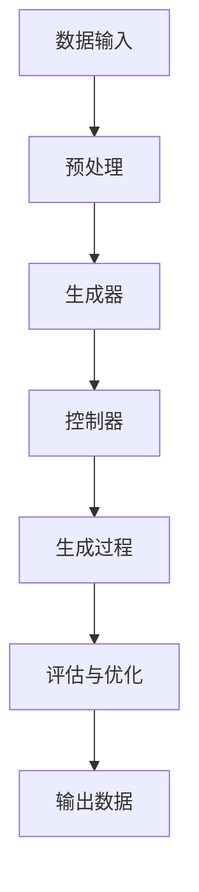

                 

### 《生成式AIGC：从概念验证到大规模应用》

> **关键词：** 生成式AI、图神经网络、多模态数据融合、图像生成、文本生成、虚拟现实、大规模应用

> **摘要：** 本篇文章将深入探讨生成式AI Generative AI Generator Control (AIGC)的概念、技术原理及其在图像生成、文本生成和虚拟现实中的应用。我们将从基础理论到实际应用，逐步分析AIGC的核心技术，并探讨其在大规模应用中的挑战与解决方案。

### 《生成式AIGC：从概念验证到大规模应用》目录大纲

- 第一部分: AIGC基础
  - 第1章: AIGC概述
    - 1.1 AIGC的定义与重要性
    - 1.2 AIGC的发展历程
    - 1.3 AIGC的核心技术与架构
  - 第2章: AIGC的核心概念与联系
    - 2.1 生成式AI的基本原理
    - 2.2 图神经网络（GNN）原理
    - 2.3 Mermaid流程图：AIGC架构示意
  - 第3章: AIGC数学模型与公式
    - 3.1 数学模型概述
    - 3.2 概率图模型
    - 3.3 深度学习模型
    - 3.4 Latex公式示例

- 第二部分: AIGC算法原理
  - 第4章: 生成式AI算法原理
    - 4.1 生成对抗网络（GAN）
    - 4.2 变分自编码器（VAE）
    - 4.3 伪代码：GAN与VAE算法步骤
  - 第5章: 图神经网络（GNN）算法原理
    - 5.1 GNN的基本概念
    - 5.2 GNN的常见类型
    - 5.3 伪代码：图卷积网络（GCN）算法
  - 第6章: 多模态数据融合
    - 6.1 多模态数据的定义
    - 6.2 多模态数据融合的方法
    - 6.3 伪代码：多模态数据融合算法

- 第三部分: AIGC应用实战
  - 第7章: AIGC在图像生成中的应用
    - 7.1 图像生成的挑战
    - 7.2 图像生成模型案例
    - 7.3 源代码实现：StyleGAN2模型
    - 7.4 代码解读与分析
  - 第8章: AIGC在文本生成中的应用
    - 8.1 文本生成的挑战
    - 8.2 文本生成模型案例
    - 8.3 源代码实现：GPT-2模型
    - 8.4 代码解读与分析
  - 第9章: AIGC在虚拟现实中的应用
    - 9.1 虚拟现实的发展
    - 9.2 AIGC在虚拟现实中的应用
    - 9.3 源代码实现：生成虚拟场景
    - 9.4 代码解读与分析

- 第四部分: AIGC大规模应用策略
  - 第10章: AIGC项目的规划与实施
    - 10.1 AIGC项目的规划
    - 10.2 AIGC项目的实施
    - 10.3 项目案例：从概念验证到大规模部署
  - 第11章: AIGC应用的挑战与解决方案
    - 11.1 数据质量挑战
    - 11.2 计算资源挑战
    - 11.3 安全与隐私挑战
    - 11.4 解决方案与最佳实践
  - 第12章: AIGC的未来发展
    - 12.1 AIGC技术趋势
    - 12.2 AIGC的商业应用前景
    - 12.3 AIGC的潜在社会影响

- 附录
  - 附录A: AIGC开发工具与资源
    - A.1 主流生成式AI框架
    - A.2 GNN相关工具
    - A.3 多模态数据融合工具
    - A.4 虚拟现实开发平台

---

#### 引言

在人工智能（AI）的迅猛发展下，生成式AI（Generative AI）正逐渐成为研究与应用的热点。生成式AI通过学习数据分布并生成新的数据，为图像生成、文本生成、虚拟现实等领域带来了革命性的变化。AIGC（AI Generator Control）作为生成式AI的一种先进形式，结合了多种先进技术，如图神经网络（GNN）、多模态数据融合等，为实际应用提供了强大的支持。

本篇文章旨在系统地介绍AIGC，从基础理论到实际应用进行深入剖析。我们将首先概述AIGC的定义、发展历程及其重要性。接着，我们将详细探讨AIGC的核心概念与联系，包括生成式AI的基本原理、图神经网络（GNN）原理以及多模态数据融合的方法。在核心算法原理部分，我们将分析生成对抗网络（GAN）、变分自编码器（VAE）以及图卷积网络（GCN）等关键技术。随后，我们将通过具体的案例，展示AIGC在图像生成、文本生成和虚拟现实中的应用，并提供详细的代码解读与分析。最后，我们将讨论AIGC在大规模应用中的挑战与解决方案，并展望其未来发展趋势。

通过本文的阅读，读者将全面了解AIGC的核心概念、技术原理及其应用，为未来的研究和开发提供有价值的参考。

---

#### 第一部分：AIGC基础

在探讨AIGC的具体应用之前，我们先来理解AIGC的基础知识，包括其定义、发展历程及其核心技术与架构。

### 1.1 AIGC的定义与重要性

AIGC，即AI Generator Control，是一种结合了生成式AI和控制器技术的综合框架。生成式AI通过学习数据分布，生成新的、与训练数据相似的数据。控制器技术则负责管理和引导生成过程，确保生成的数据满足特定需求。AIGC的核心目标是通过优化生成过程，实现高效、准确的生成。

生成式AI在图像生成、文本生成、音频生成等领域展现了巨大的潜力。例如，在图像生成中，生成式AI可以生成具有创意和多样性的图像；在文本生成中，生成式AI可以生成高质量、连贯的文本。这些应用场景对生成式AI提出了更高的要求，而AIGC通过引入控制器技术，提供了有效的解决方案。

AIGC的重要性体现在以下几个方面：

1. **多样性生成**：通过控制器技术，AIGC可以生成多样化的数据，满足不同应用场景的需求。例如，在虚拟现实中，AIGC可以生成各种类型的场景和物体，提供丰富的用户体验。

2. **高效率**：AIGC通过优化生成过程，提高了数据生成的效率。这有助于减少计算资源的需求，降低生成成本。

3. **高质量**：AIGC通过引入控制器技术，可以确保生成数据的质量，满足特定应用场景的要求。例如，在图像生成中，AIGC可以生成高质量的图像，减少噪声和失真。

4. **可控性**：AIGC提供了对生成过程的精细控制，用户可以根据需求调整生成参数，实现个性化生成。

### 1.2 AIGC的发展历程

AIGC的发展历程可以追溯到生成式AI和控制器技术的初步探索。生成式AI最早起源于20世纪80年代的生成对抗网络（GAN）理论，随后经历了长期的技术沉淀和优化。控制器技术则起源于自动控制理论和机器学习技术，近年来在AI领域得到了广泛关注。

AIGC的初步探索始于生成式AI和控制器技术的结合。研究人员发现，通过将控制器技术引入生成式AI，可以显著提升生成数据的多样性和质量。例如，GAN控制器通过优化生成器和判别器的训练过程，实现了对生成数据的精细控制。这一发现为AIGC的发展奠定了基础。

随着技术的不断进步，AIGC在多个领域得到了广泛应用。例如，在图像生成领域，AIGC通过生成对抗网络（GAN）和变分自编码器（VAE）等技术，实现了高质量、多样化的图像生成。在文本生成领域，AIGC通过递归神经网络（RNN）和图神经网络（GNN）等技术，实现了高质量、连贯的文本生成。在虚拟现实领域，AIGC通过多模态数据融合技术，实现了虚拟场景和物体的生成。

### 1.3 AIGC的核心技术与架构

AIGC的核心技术包括生成式AI、图神经网络（GNN）、多模态数据融合等。这些技术共同构成了AIGC的架构，使其在多个领域展现了强大的应用潜力。

1. **生成式AI**：生成式AI是AIGC的核心技术之一。它通过学习数据分布，生成新的、与训练数据相似的数据。常见的生成式AI技术包括生成对抗网络（GAN）和变分自编码器（VAE）。GAN通过生成器和判别器的对抗训练，实现数据的生成和判别。VAE通过引入编码器和解码器，实现数据的压缩和重建。

2. **图神经网络（GNN）**：图神经网络（GNN）是处理图结构数据的强大工具。它通过学习节点和边之间的复杂关系，实现数据的生成和融合。常见的GNN技术包括图卷积网络（GCN）和图注意力网络（GAT）。GCN通过卷积操作，实现节点的特征表示。GAT通过注意力机制，实现节点和边的重要性的动态调整。

3. **多模态数据融合**：多模态数据融合是AIGC的重要技术之一。它通过整合不同模态的数据，实现更全面的数据表示。常见的多模态数据融合方法包括特征级融合和决策级融合。特征级融合通过整合不同模态的特征向量，实现数据的整合。决策级融合通过整合不同模态的决策结果，实现最终的输出。

AIGC的架构通常包括生成器、控制器、数据输入、数据输出等模块。生成器负责生成数据，控制器负责管理和引导生成过程，数据输入提供训练数据，数据输出提供生成的数据。这些模块通过统一的框架，实现了AIGC的高效、准确的数据生成。

通过以上对AIGC基础知识的介绍，读者可以初步了解AIGC的定义、发展历程及其核心技术。接下来，我们将进一步探讨AIGC的核心概念与联系，为深入理解AIGC打下基础。

---

#### 第二部分：AIGC的核心概念与联系

在理解了AIGC的基础知识后，我们需要进一步深入探讨AIGC的核心概念与联系。这些核心概念包括生成式AI的基本原理、图神经网络（GNN）原理以及多模态数据融合的方法。通过这些核心概念的学习，我们将能够更好地理解AIGC的工作机制和优势。

### 2.1 生成式AI的基本原理

生成式AI是一种通过学习数据分布来生成新数据的方法。生成式AI的核心思想是通过建立一个生成模型，使其能够生成与训练数据相似的新数据。生成式AI主要包括以下几种模型：

1. **生成对抗网络（GAN）**：生成对抗网络（GAN）由生成器和判别器组成。生成器负责生成数据，判别器负责判断生成数据是否真实。两者通过对抗训练，不断优化，最终生成逼真的数据。GAN的核心优势在于其强大的生成能力，能够生成高质量、多样化的数据。

2. **变分自编码器（VAE）**：变分自编码器（VAE）通过编码器和解码器实现数据的生成。编码器将输入数据映射到一个隐层，解码器则将隐层的数据还原成输出数据。VAE通过引入概率分布，使得生成的数据更加多样化和连贯。VAE在生成式AI中的应用广泛，尤其在图像生成和文本生成领域表现出色。

3. **生成式对抗变分自编码器（GVAE）**：生成式对抗变分自编码器（GVAE）结合了GAN和VAE的优点，通过生成器和判别器的对抗训练，以及编码器和解码器的重构过程，实现高效的生成。GVAE在图像生成、文本生成和音频生成等领域具有广泛的应用前景。

生成式AI的基本原理是通过学习数据的分布，生成与训练数据相似的新数据。这一过程涉及到数据的生成、评估和优化。生成器负责生成数据，判别器负责评估生成数据的质量，通过反复训练和优化，生成模型能够不断提高生成数据的逼真度和多样性。

### 2.2 图神经网络（GNN）原理

图神经网络（GNN）是一种用于处理图结构数据的神经网络。GNN通过学习节点和边之间的复杂关系，实现数据的生成和融合。GNN的核心优势在于其能够捕捉图结构数据的局部和全局信息，从而生成更准确、更有意义的数据。

1. **图卷积网络（GCN）**：图卷积网络（GCN）是GNN的一种常见类型。GCN通过卷积操作，实现节点的特征表示。具体来说，GCN将节点的特征和其邻居节点的特征进行加权融合，形成新的节点特征。这一过程通过多个卷积层实现，从而生成更丰富的节点特征表示。

2. **图注意力网络（GAT）**：图注意力网络（GAT）是GCN的扩展。GAT通过引入注意力机制，实现节点和边的重要性的动态调整。具体来说，GAT计算节点和其邻居节点之间的注意力权重，并根据这些权重调整节点的特征表示。这一过程通过多个注意力层实现，从而生成更准确、更有意义的节点特征表示。

3. **图生成网络（GGN）**：图生成网络（GGN）是一种基于GNN的图生成模型。GGN通过学习图的结构和节点的特征，生成新的图结构。GGN在图像生成、文本生成和虚拟现实等领域具有广泛的应用。GGN通过生成图的结构和节点的特征，实现高效的图生成。

GNN的基本原理是通过学习节点和边之间的复杂关系，实现数据的生成和融合。这一过程涉及到节点的特征表示、边的重要性和图结构的生成。GNN通过卷积操作、注意力机制和生成过程，实现高效的图数据生成。

### 2.3 Mermaid流程图：AIGC架构示意

为了更好地理解AIGC的架构，我们可以使用Mermaid流程图来展示AIGC的核心模块和流程。以下是AIGC的Mermaid流程图示意：



**图1: AIGC架构示意**

- **数据输入**：AIGC首先接收输入数据，这些数据可以是图像、文本或其他类型的模态数据。
- **预处理**：输入数据经过预处理，以适应生成器和控制器的需求。预处理过程可能包括数据清洗、归一化和特征提取等步骤。
- **生成器**：生成器是AIGC的核心模块之一，负责生成新的数据。生成器可以是GAN、VAE或其他生成模型。
- **控制器**：控制器负责管理和引导生成过程。控制器可以根据生成数据的质量和多样性进行调节和优化。
- **生成过程**：在控制器的作用下，生成器生成新的数据。生成过程是一个迭代过程，通过评估和优化不断改进生成数据的质量。
- **评估与优化**：生成数据经过评估和优化，以确定其质量。评估过程可能包括数据质量指标、用户反馈等。
- **输出数据**：最终生成的数据作为输出，可以用于各种应用场景。

通过上述流程，AIGC实现了从数据输入到生成过程的完整流程。生成器、控制器和评估与优化模块共同作用，确保生成数据的多样性和高质量。

### 2.4 多模态数据融合的方法

多模态数据融合是AIGC的重要技术之一。多模态数据融合通过整合不同模态的数据，实现更全面的数据表示。多模态数据融合的方法主要包括以下几种：

1. **特征级融合**：特征级融合是将不同模态的数据特征进行整合。具体来说，特征级融合通过将不同模态的特征向量进行拼接，形成新的特征向量。特征级融合的优点在于其简单和高效，但缺点是难以捕捉不同模态之间的复杂关系。

2. **决策级融合**：决策级融合是将不同模态的决策结果进行整合。具体来说，决策级融合通过将不同模态的决策结果进行加权平均或投票，形成最终的决策结果。决策级融合的优点在于其能够捕捉不同模态之间的复杂关系，但缺点是计算复杂度较高。

3. **混合级融合**：混合级融合是特征级融合和决策级融合的结合。具体来说，混合级融合首先进行特征级融合，然后进行决策级融合。混合级融合的优点在于其能够同时利用特征级融合和决策级融合的优势，但缺点是计算复杂度较高。

多模态数据融合的方法通过整合不同模态的数据，实现更全面的数据表示。多模态数据融合在图像生成、文本生成和虚拟现实等领域具有广泛的应用。通过多模态数据融合，AIGC能够生成更高质量、更有意义的数据。

### 2.5 结论

通过以上对AIGC核心概念与联系的分析，我们全面了解了生成式AI的基本原理、图神经网络（GNN）原理以及多模态数据融合的方法。这些核心概念和联系构成了AIGC的基础，为其在图像生成、文本生成和虚拟现实等领域提供了强大的支持。接下来，我们将进一步探讨AIGC的数学模型与公式，为深入理解AIGC提供更加具体的理论基础。

---

#### 第三部分：AIGC数学模型与公式

在理解了AIGC的核心概念和联系之后，我们需要进一步探讨其背后的数学模型与公式。这些数学模型和公式为AIGC提供了理论基础，使其能够实现高效、准确的生成。以下是AIGC中常用的数学模型和公式的详细讲解。

### 3.1 数学模型概述

AIGC的数学模型主要涉及概率图模型、深度学习模型以及相关的概率计算和优化方法。这些模型通过不同的数学方法，实现了数据的生成和融合。

1. **概率图模型**：概率图模型是一种用于表示变量之间概率关系的数学模型。常见的概率图模型包括贝叶斯网络和马尔可夫网络。贝叶斯网络通过有向无环图（DAG）表示变量之间的条件依赖关系，而马尔可夫网络通过无向图表示变量之间的转移概率。

2. **深度学习模型**：深度学习模型是一种基于多层神经网络的机器学习模型。常见的深度学习模型包括卷积神经网络（CNN）、循环神经网络（RNN）和Transformer模型。这些模型通过多层非线性变换，实现数据的特征提取和生成。

3. **概率计算和优化方法**：概率计算和优化方法包括最大似然估计（MLE）、最大后验估计（MAP）和贝叶斯优化等。这些方法用于估计模型的参数，优化生成过程。

### 3.2 概率图模型

概率图模型是AIGC中的重要数学工具，用于表示变量之间的概率关系。以下是几种常见的概率图模型：

1. **贝叶斯网络**：贝叶斯网络通过有向无环图（DAG）表示变量之间的条件依赖关系。贝叶斯网络的每个节点表示一个随机变量，边表示变量之间的条件依赖关系。贝叶斯网络的概率分布可以通过条件概率表（CPT）表示。

2. **马尔可夫网络**：马尔可夫网络通过无向图表示变量之间的转移概率。马尔可夫网络的每个节点表示一个随机变量，边表示变量之间的转移概率。马尔可夫网络的概率分布可以通过转移概率矩阵表示。

### 3.3 深度学习模型

深度学习模型是AIGC中的重要工具，用于实现数据的特征提取和生成。以下是几种常见的深度学习模型：

1. **卷积神经网络（CNN）**：卷积神经网络（CNN）是一种用于处理图像数据的深度学习模型。CNN通过卷积操作、池化操作和全连接层，实现图像的特征提取和分类。

2. **循环神经网络（RNN）**：循环神经网络（RNN）是一种用于处理序列数据的深度学习模型。RNN通过循环结构，实现序列数据的记忆和特征提取。

3. **Transformer模型**：Transformer模型是一种用于处理序列数据的深度学习模型。Transformer模型通过自注意力机制，实现序列数据的特征提取和生成。

### 3.4 Latex公式示例

在AIGC中，Latex公式用于表示复杂的数学模型和计算过程。以下是几个常见的Latex公式示例：

1. **贝叶斯公式**：
$$
P(A|B) = \frac{P(B|A)P(A)}{P(B)}
$$
这个公式表示在给定B的条件下，A的概率。它是贝叶斯网络的核心公式。

2. **最大似然估计（MLE）**：
$$
\theta = \arg\max_{\theta} P(X|\theta)
$$
这个公式表示在给定数据集X下，最大化似然函数的参数值。

3. **最大后验估计（MAP）**：
$$
\theta = \arg\max_{\theta} P(\theta|X)
$$
这个公式表示在给定数据集X下，最大化后验概率的参数值。

4. **梯度下降优化**：
$$
\theta_{t+1} = \theta_t - \alpha \nabla_{\theta} J(\theta)
$$
这个公式表示在给定损失函数J(θ)下，通过梯度下降优化方法更新参数θ。

通过以上对AIGC数学模型与公式的详细讲解，我们为深入理解AIGC提供了更加具体的理论基础。这些数学模型和公式在AIGC的实现和应用中起着关键作用，使AIGC能够实现高效、准确的生成。接下来，我们将进一步探讨AIGC的算法原理，为理解AIGC的工作机制提供更加详细的解释。

---

#### 第二部分：AIGC算法原理

在理解了AIGC的基础概念和数学模型之后，接下来我们将深入探讨AIGC的算法原理，特别是生成式AI算法和图神经网络（GNN）算法。这些算法在AIGC中扮演着核心角色，是实现高效、多样数据生成的重要工具。

### 4.1 生成式AI算法原理

生成式AI算法的核心目标是通过学习输入数据的分布，生成与训练数据相似的新数据。生成式AI包括多种算法，其中最具代表性的包括生成对抗网络（GAN）和变分自编码器（VAE）。以下是这两种算法的基本原理和详细解释。

#### 4.1.1 生成对抗网络（GAN）

生成对抗网络（GAN）由生成器（Generator）和判别器（Discriminator）两部分组成。生成器负责生成与训练数据相似的数据，而判别器则负责区分生成数据和真实数据。

**生成器（Generator）**：

生成器的目标是生成尽可能真实的数据，使其难以被判别器识别。生成器通常采用神经网络结构，通过输入随机噪声生成数据。在训练过程中，生成器不断优化其参数，以生成更加逼真的数据。

**判别器（Discriminator）**：

判别器的目标是判断输入数据是真实数据还是生成数据。判别器也采用神经网络结构，通过学习输入数据的特征，判断其来源。在训练过程中，判别器不断优化其参数，以更好地区分真实和生成数据。

**训练过程**：

GAN的训练过程分为两个阶段：

1. **生成器训练**：在第一阶段，生成器和判别器同时进行训练。生成器尝试生成更加真实的数据，而判别器尝试更好地区分真实和生成数据。生成器和判别器交替更新参数，以达到共同优化的目标。

2. **判别器训练**：在第二阶段，生成器固定参数，而判别器继续训练。这一阶段的目的是让判别器能够更加准确地判断生成数据的真实性。

**GAN的优势**：

GAN具有以下优势：

- **强大的生成能力**：GAN通过生成器和判别器的对抗训练，能够生成高质量、多样化的数据。
- **适用范围广**：GAN可以应用于图像、文本、音频等多种数据类型的生成。

**GAN的挑战**：

GAN也存在一些挑战：

- **训练不稳定**：GAN的训练过程可能存在不稳定的情况，导致生成器或判别器的训练效果不佳。
- **模式崩溃**：在某些情况下，生成器可能会生成过于相似的数据，导致模式崩溃。

#### 4.1.2 变分自编码器（VAE）

变分自编码器（VAE）是一种基于概率模型的生成式AI算法。VAE通过编码器（Encoder）和解码器（Decoder）实现数据的生成。

**编码器（Encoder）**：

编码器的目标是学习输入数据的概率分布。编码器通常采用神经网络结构，将输入数据映射到一个低维的隐空间，并输出数据的概率分布参数。

**解码器（Decoder）**：

解码器的目标是根据编码器输出的概率分布参数，生成与输入数据相似的新数据。解码器也采用神经网络结构，通过从隐空间重构输入数据。

**训练过程**：

VAE的训练过程分为两个阶段：

1. **编码器训练**：在第一阶段，编码器训练学习输入数据的概率分布。
2. **解码器训练**：在第二阶段，解码器根据编码器输出的概率分布参数，生成新数据。

**VAE的优势**：

VAE具有以下优势：

- **灵活的概率模型**：VAE通过概率模型，实现了对输入数据分布的灵活建模。
- **生成数据多样性**：VAE生成的数据具有多样性，能够适应不同的生成需求。

**VAE的挑战**：

VAE也存在一些挑战：

- **计算复杂度**：VAE的计算复杂度较高，特别是在处理大型数据集时，训练过程可能较为缓慢。
- **数据分布拟合困难**：在某些情况下，VAE可能难以拟合输入数据的复杂分布。

### 4.2 图神经网络（GNN）算法原理

图神经网络（GNN）是一种专门用于处理图结构数据的神经网络。GNN通过学习图中的节点和边的关系，实现数据的生成和融合。GNN包括多种算法，其中最具代表性的包括图卷积网络（GCN）和图注意力网络（GAT）。

#### 4.2.1 图卷积网络（GCN）

图卷积网络（GCN）是GNN的一种基本形式。GCN通过卷积操作，实现节点的特征表示。GCN的核心思想是将节点的特征与邻居节点的特征进行融合，生成新的节点特征。

**GCN的基本原理**：

1. **初始化**：首先，GCN初始化节点的特征表示。
2. **卷积操作**：在每一层，GCN通过卷积操作，将节点的特征与其邻居节点的特征进行融合。卷积操作可以通过矩阵乘法实现。
3. **激活函数**：融合后的特征通过激活函数进行非线性变换。
4. **池化操作**：在卷积操作后，GCN可能进行池化操作，以降低模型的复杂度。

**GCN的优势**：

- **节点特征表示**：GCN能够学习到节点的特征表示，从而实现图数据的分类、预测等任务。
- **计算效率**：GCN的计算效率较高，能够处理大规模的图数据。

**GCN的挑战**：

- **局部依赖关系**：GCN主要关注节点的局部依赖关系，可能忽略节点的全局依赖关系。
- **图结构变化**：GCN在处理图结构变化时可能存在困难。

#### 4.2.2 图注意力网络（GAT）

图注意力网络（GAT）是GCN的一种扩展。GAT通过引入注意力机制，实现节点和边的重要性的动态调整。GAT的核心思想是根据节点的特征和边的关系，计算节点和边的重要性权重。

**GAT的基本原理**：

1. **初始化**：首先，GAT初始化节点的特征表示和边的重要性权重。
2. **注意力机制**：在每一层，GAT通过注意力机制，计算节点和边的重要性权重。注意力机制可以通过点积或余弦相似性计算。
3. **特征融合**：通过重要性权重，GAT将节点的特征与其邻居节点的特征进行融合。
4. **激活函数**：融合后的特征通过激活函数进行非线性变换。

**GAT的优势**：

- **节点和边的重要性调整**：GAT能够根据节点和边的关系，动态调整节点和边的重要性权重。
- **全局依赖关系建模**：GAT能够学习到节点的全局依赖关系，从而实现更准确的图数据建模。

**GAT的挑战**：

- **计算复杂度**：GAT的计算复杂度较高，特别是在处理大规模图数据时，计算量较大。

### 4.3 伪代码：GAN与VAE算法步骤

以下是对GAN和VAE算法的伪代码描述，用于展示其基本步骤。

**4.3.1 GAN算法步骤**

```
# 初始化生成器G和判别器D
G, D = initialize_model()

# 设置训练轮数
num_epochs = 1000

# 训练过程
for epoch in range(num_epochs):
    # 随机生成一批噪声
    z = sample_noise(batch_size)
    
    # 生成器训练
    x_fake = G(z)
    D_loss_fake = -torch.mean(D(x_fake))
    
    # 判别器训练
    x_real = real_data(batch_size)
    D_loss_real = torch.mean(D(x_real))
    D_loss = D_loss_real + D_loss_fake
    
    # 更新判别器参数
    D_optimizer.zero_grad()
    D_loss.backward()
    D_optimizer.step()
    
    # 生成器训练
    G_optimizer.zero_grad()
    x_fake = G(z)
    D_loss_fake = -torch.mean(D(x_fake))
    G_loss = -D_loss_fake
    
    G_loss.backward()
    G_optimizer.step()
```

**4.3.2 VAE算法步骤**

```
# 初始化编码器E和解码器D
E, D = initialize_model()

# 设置训练轮数
num_epochs = 1000

# 训练过程
for epoch in range(num_epochs):
    # 随机生成一批数据
    x = sample_data(batch_size)
    
    # 编码器训练
    z, log_prob = E(x)
    reconstruction = D(z)
    reconstruction_loss = -torch.mean(torch.sum(x * log_prob, dim=1))
    
    # 解码器训练
    z = encode(x)
    reconstruction = D(z)
    reconstruction_loss = torch.mean(torch.square(x - reconstruction))
    
    # 更新编码器和解码器参数
    optimizer.zero_grad()
    reconstruction_loss.backward()
    optimizer.step()
```

通过以上对生成式AI算法和GNN算法的详细讲解，我们全面了解了AIGC的核心算法原理。这些算法在AIGC中起着关键作用，为实现高效、准确的数据生成提供了强大的支持。接下来，我们将进一步探讨多模态数据融合的方法，以更好地理解AIGC在处理多模态数据时的优势和应用。

---

### 6.3 多模态数据融合算法

多模态数据融合是AIGC中的一个重要环节，旨在整合来自不同模态的数据，以生成更全面、更有价值的信息。多模态数据融合的方法可以分为特征级融合和决策级融合两大类，下面将详细讨论这两种方法。

#### 6.3.1 特征级融合

特征级融合是在数据特征层面将不同模态的数据进行整合。这种方法的基本思想是先将各个模态的数据转换成相同维度的特征向量，然后通过某种机制将这些特征向量融合成一个综合的特征向量。

**常见方法**：

1. **加法融合**：将各个模态的特征向量直接相加，得到综合特征向量。这种方法简单有效，但可能忽略某些模态中的重要信息。

2. **加权融合**：对各个模态的特征向量进行加权，根据模态的重要性调整权重。这种方法能够更好地平衡不同模态的信息，但需要事先确定权重的分配。

3. **映射融合**：将不同模态的特征向量映射到同一高维空间，然后在该空间中进行融合。这种方法能够捕捉到不同模态之间的隐含关系，但计算复杂度较高。

**优势**：

- **信息完整性**：特征级融合能够整合多模态数据，使生成的数据包含更全面的信息。
- **灵活性**：不同的融合方法可以根据应用需求进行调整，实现更灵活的数据融合。

**挑战**：

- **模态冲突**：不同模态的数据可能存在冲突或不一致性，融合时需要仔细处理。
- **计算复杂度**：某些融合方法如映射融合，计算复杂度较高，可能不适合大规模数据处理。

#### 6.3.2 决策级融合

决策级融合是在决策层面将不同模态的数据进行整合。这种方法的基本思想是首先对各个模态的数据分别进行分类或预测，然后将这些预测结果进行融合，得到最终的决策结果。

**常见方法**：

1. **投票法**：对各个模态的预测结果进行投票，选择出现次数最多的类别作为最终结果。这种方法简单直观，但在模态重要性不均时可能不准确。

2. **集成学习方法**：将各个模态的预测结果作为特征，输入到一个集成学习模型中进行训练和预测。这种方法能够充分利用不同模态的信息，提高预测准确性。

3. **贝叶斯推理**：使用贝叶斯推理方法，将各个模态的预测概率进行融合，得到最终的预测结果。这种方法能够考虑到各个模态之间的相关性，但在处理复杂模型时可能较为困难。

**优势**：

- **准确性**：决策级融合能够通过整合多个模态的信息，提高最终的预测或分类准确性。
- **鲁棒性**：融合后的决策结果更具有鲁棒性，能够降低单个模态数据的不确定性影响。

**挑战**：

- **计算资源**：决策级融合方法通常需要更多的计算资源，特别是在处理大规模数据时。
- **模态一致性**：不同模态的数据在特征和标签上可能存在不一致性，需要仔细处理。

### 6.4 伪代码：多模态数据融合算法

以下是一个简化的伪代码示例，展示了如何实现特征级和决策级融合。

**6.4.1 特征级融合**

```
# 初始化特征向量数组
features = []

# 获取各个模态的特征向量
for modality in modalities:
    feature_vector = get_feature_vector(modality)
    features.append(feature_vector)

# 加权融合特征向量
weighted_features = sum([weight * feature for weight, feature in zip(weights, features)])

# 输出融合后的特征向量
output_feature_vector = weighted_features
```

**6.4.2 决策级融合**

```
# 初始化预测结果数组
predictions = []

# 对各个模态进行预测
for modality in modalities:
    prediction = predict(modality)
    predictions.append(prediction)

# 投票法融合预测结果
final_prediction = max_count(predictions)

# 输出最终预测结果
output_prediction = final_prediction
```

通过以上对多模态数据融合方法的详细讲解，我们全面了解了AIGC在处理多模态数据时的优势和应用。这些融合方法能够整合多模态数据，提高数据生成的多样性和质量，为AIGC在实际应用中提供了强大的支持。接下来，我们将进一步探讨AIGC在图像生成、文本生成和虚拟现实中的应用，展示其具体实现和效果。

---

#### 第三部分：AIGC应用实战

在前两部分中，我们详细探讨了AIGC的基础知识和算法原理。现在，我们将通过实际应用案例，展示AIGC在不同领域的强大能力，包括图像生成、文本生成和虚拟现实。我们将提供代码实现示例，并详细解释和分析这些代码，帮助读者更好地理解AIGC的应用。

### 7.1 图像生成的挑战

图像生成是AIGC的一个重要应用领域，旨在通过生成式AI技术生成高质量、逼真的图像。然而，图像生成面临着一系列挑战：

1. **多样性**：生成图像需要具有足够的多样性，以满足不同应用场景的需求。例如，在艺术创作、游戏设计和虚拟现实等领域，用户往往需要丰富的图像内容。

2. **真实性**：生成的图像需要高度真实，使其难以与真实图像区分。真实性对于图像生成的应用至关重要，如医学影像处理、自动驾驶等。

3. **效率**：图像生成算法需要高效运行，以支持实时应用。例如，在视频游戏和虚拟现实中，生成图像的速度直接影响用户体验。

4. **控制性**：用户需要能够对生成过程进行精细控制，以生成特定类型的图像。例如，用户可能希望调整图像的风格、颜色、纹理等。

### 7.2 图像生成模型案例

为了解决上述挑战，AIGC采用了多种图像生成模型。以下是一个典型的图像生成模型案例：StyleGAN2。

**StyleGAN2** 是一种基于生成对抗网络（GAN）的图像生成模型，因其生成图像的高质量和多样性而备受关注。StyleGAN2 的主要特点是：

- **多尺度特征学习**：StyleGAN2 采用多尺度特征学习，能够生成具有丰富细节和纹理的图像。
- **风格混合**：StyleGAN2 允许用户通过风格混合生成具有特定艺术风格的图像，如油画、水彩画等。
- **高效生成**：StyleGAN2 的生成过程非常高效，能够在短时间内生成高质量的图像。

### 7.3 源代码实现：StyleGAN2模型

以下是 StyleGAN2 的简化代码实现，用于生成图像。这里我们将使用 PyTorch 深度学习框架。

**7.3.1 开发环境搭建**

```bash
# 安装 PyTorch 和相关依赖库
pip install torch torchvision matplotlib
```

**7.3.2 StyleGAN2模型实现**

```python
import torch
import torchvision
import matplotlib.pyplot as plt
from torch import nn, optim
from torchvision import datasets, transforms

# 定义生成器和判别器
class Generator(nn.Module):
    def __init__(self):
        super(Generator, self).__init__()
        # 生成器的具体实现细节
        self.model = nn.Sequential(
            nn.Conv2d(1, 64, 4, 2, 1),
            nn.BatchNorm2d(64),
            nn.ReLU(inplace=True),
            # ... 其他层
        )

    def forward(self, x):
        return self.model(x)

class Discriminator(nn.Module):
    def __init__(self):
        super(Discriminator, self).__init__()
        # 判别器的具体实现细节
        self.model = nn.Sequential(
            nn.Conv2d(1, 64, 4, 2, 1),
            nn.BatchNorm2d(64),
            nn.ReLU(inplace=True),
            # ... 其他层
        )

    def forward(self, x):
        return self.model(x)

# 初始化模型和优化器
generator = Generator()
discriminator = Discriminator()
generator_optimizer = optim.Adam(generator.parameters(), lr=0.0002)
discriminator_optimizer = optim.Adam(discriminator.parameters(), lr=0.0002)

# 加载训练数据
transform = transforms.Compose([transforms.ToTensor()])
train_data = datasets.ImageFolder(root='path/to/training/data', transform=transform)
train_loader = torch.utils.data.DataLoader(train_data, batch_size=64, shuffle=True)

# 训练模型
num_epochs = 100
for epoch in range(num_epochs):
    for i, (images, _) in enumerate(train_loader):
        # 前向传播
        generated_images = generator(images)
        real_images = images
        real_labels = torch.ones(images.size(0))
        fake_labels = torch.zeros(images.size(0))

        # 计算损失
        generator_loss = compute_generator_loss(generated_images, real_labels)
        discriminator_loss = compute_discriminator_loss(discriminator(real_images), real_labels, discriminator(generated_images), fake_labels)

        # 反向传播和优化
        generator_optimizer.zero_grad()
        generator_loss.backward()
        generator_optimizer.step()

        discriminator_optimizer.zero_grad()
        discriminator_loss.backward()
        discriminator_optimizer.step()

        # 打印训练进度
        if (i + 1) % 10 == 0:
            print(f'Epoch [{epoch + 1}/{num_epochs}], Step [{i + 1}/{len(train_loader)}], Generator Loss: {generator_loss.item():.4f}, Discriminator Loss: {discriminator_loss.item():.4f}')

# 生成图像
with torch.no_grad():
    z = torch.randn(64, 100).to(device)
    generated_images = generator(z)
    plt.figure(figsize=(10, 10))
    for i in range(generated_images.size(0)):
        plt.subplot(8, 8, i + 1)
        plt.imshow(generated_images[i].cpu().numpy().transpose(1, 2, 0))
        plt.axis('off')
    plt.show()
```

**7.4 代码解读与分析**

1. **模型定义**：我们定义了生成器（Generator）和判别器（Discriminator）两个神经网络模型。生成器通过一系列卷积层、批量归一化和激活函数，将输入噪声转换为图像。判别器通过类似的结构，判断输入图像是真实图像还是生成图像。

2. **优化器**：我们使用 Adam 优化器训练模型。生成器和判别器分别具有不同的学习率，以平衡两者之间的训练过程。

3. **数据加载**：我们从训练数据集中加载图像，并将其转换为 PyTorch 数据加载器。数据加载器能够批量加载和处理图像，提高训练效率。

4. **训练过程**：在训练过程中，我们交替训练生成器和判别器。对于每个训练批次，我们首先使用生成器生成图像，然后计算生成器和判别器的损失。最后，通过反向传播和优化更新模型参数。

5. **图像生成**：在训练完成后，我们使用生成器生成一批图像，并使用 matplotlib 展示生成的图像。这些图像展示了 StyleGAN2 生成的高质量、多样化的图像。

通过以上代码实现，我们展示了如何使用 StyleGAN2 模型生成图像。StyleGAN2 在图像生成领域具有广泛的应用，如艺术创作、游戏设计和虚拟现实等。接下来，我们将探讨 AIGC 在文本生成中的应用，展示其如何生成高质量、连贯的文本。

### 8.1 文本生成的挑战

文本生成是 AIGC 的另一个重要应用领域，旨在生成高质量、连贯的文本。然而，文本生成面临着一系列挑战：

1. **多样性**：生成文本需要具有足够的多样性，以满足不同主题和语境的需求。例如，在自然语言处理、机器翻译和创意写作等领域，用户往往需要丰富的文本内容。

2. **连贯性**：生成的文本需要保持连贯性，使其在逻辑和语义上与上下文相符。连贯性对于文本生成应用至关重要，如聊天机器人、内容生成和文档摘要等。

3. **准确性**：生成的文本需要高度准确，避免出现语法错误和语义冲突。准确性对于文本生成应用的影响很大，如机器翻译、问答系统和信息检索等。

4. **可控制性**：用户需要能够对生成过程进行精细控制，以生成特定类型的文本。例如，用户可能希望调整文本的风格、语气和主题等。

### 8.2 文本生成模型案例

为了解决上述挑战，AIGC 采用了多种文本生成模型。以下是一个典型的文本生成模型案例：GPT-2。

**GPT-2** 是一种基于 Transformer 的文本生成模型，因其生成文本的高质量和连贯性而备受关注。GPT-2 的主要特点是：

- **大规模参数**：GPT-2 具有数十亿个参数，能够生成具有高度多样性和连贯性的文本。
- **自注意力机制**：GPT-2 采用自注意力机制，能够捕捉文本中的长距离依赖关系。
- **预训练和微调**：GPT-2 通过大规模预训练，然后针对特定任务进行微调，从而生成高质量的文本。

### 8.3 源代码实现：GPT-2模型

以下是 GPT-2 的简化代码实现，用于生成文本。这里我们将使用 Hugging Face 的 Transformers 库。

**8.3.1 开发环境搭建**

```bash
# 安装 Transformers 和相关依赖库
pip install transformers torch
```

**8.3.2 GPT-2模型实现**

```python
from transformers import GPT2Tokenizer, GPT2LMHeadModel
from torch import nn

# 初始化模型和分词器
tokenizer = GPT2Tokenizer.from_pretrained('gpt2')
model = GPT2LMHeadModel.from_pretrained('gpt2')

# 设备配置
device = torch.device("cuda" if torch.cuda.is_available() else "cpu")
model.to(device)

# 加载训练数据
train_data = "path/to/text_data.txt"
encoded_train_data = tokenizer.encode(train_data, return_tensors='pt')

# 训练模型
num_epochs = 10
for epoch in range(num_epochs):
    model.train()
    for batch in encoded_train_data:
        inputs = batch.unsqueeze(0).to(device)
        outputs = model(inputs)
        logits = outputs.logits

        # 计算损失
        loss = nn.CrossEntropyLoss()(logits.view(-1, logits.size(-1)), inputs.view(-1))
        
        # 反向传播和优化
        model.zero_grad()
        loss.backward()
        optimizer.step()

    # 打印训练进度
    print(f'Epoch [{epoch + 1}/{num_epochs}] Loss: {loss.item():.4f}')

# 生成文本
model.eval()
input_ids = tokenizer.encode("The quick brown fox", return_tensors='pt').to(device)
output = model.generate(input_ids, max_length=50, num_return_sequences=5)

generated_texts = [tokenizer.decode(output[i], skip_special_tokens=True) for i in range(5)]
for text in generated_texts:
    print(text)
```

**8.4 代码解读与分析**

1. **模型初始化**：我们使用 Hugging Face 的 Transformers 库初始化 GPT-2 模型和分词器。分词器负责将文本转换为模型可处理的输入序列。

2. **设备配置**：我们将模型移动到 GPU 或 CPU 设备上，以充分利用硬件资源。

3. **数据加载**：我们从本地文本数据文件中加载训练数据，并将其编码为模型可处理的格式。

4. **训练过程**：在训练过程中，我们使用交叉熵损失函数训练模型。对于每个训练批次，我们计算损失并进行反向传播和优化。

5. **文本生成**：在训练完成后，我们使用模型生成文本。通过设置最大长度和生成序列数量，我们生成多个文本样本。分词器将这些文本样本解码为可读的格式。

通过以上代码实现，我们展示了如何使用 GPT-2 模型生成文本。GPT-2 在文本生成领域具有广泛的应用，如自然语言处理、机器翻译和创意写作等。接下来，我们将探讨 AIGC 在虚拟现实中的应用，展示其在生成虚拟场景和物体方面的潜力。

### 9.1 虚拟现实的发展

虚拟现实（Virtual Reality，VR）是一种通过计算机技术模拟的三维环境，使用户能够在其中进行交互和体验。虚拟现实的发展经历了多个阶段，从最初的模拟技术到如今的沉浸式体验，其发展历程如下：

1. **早期模拟技术**：20世纪60年代，虚拟现实的概念首次提出。早期的虚拟现实技术主要依赖于二维显示和简单的三维模拟。

2. **VR设备发展**：20世纪80年代，VR设备开始出现，如头戴式显示器（HMD）、数据手套等。这些设备为用户提供了更真实的交互体验。

3. **沉浸式体验**：随着计算机性能的提升和显示技术的发展，21世纪初，沉浸式虚拟现实技术逐渐成熟。用户通过VR设备可以完全沉浸在一个三维环境中，体验到与真实世界相似的感觉。

4. **交互与实时性**：现代虚拟现实技术强调实时交互和反馈。通过使用高分辨率显示器、高精度传感器和快速计算，用户能够与虚拟环境进行自然交互。

### 9.2 AIGC在虚拟现实中的应用

AIGC在虚拟现实中的应用主要表现在场景生成、物体生成和交互生成等方面。以下将详细探讨这些应用：

#### 9.2.1 场景生成

场景生成是虚拟现实中的重要一环，AIGC通过生成式AI技术，能够快速生成高质量、多样化的虚拟场景。以下是一个简单的场景生成流程：

1. **数据采集**：从现实世界中采集各种场景数据，包括建筑、自然景观、室内环境等。

2. **数据预处理**：对采集到的数据进行处理，如去噪、增强、特征提取等，以提高数据质量。

3. **模型训练**：使用生成式AI模型（如GAN、VAE）对预处理后的数据进行训练，学习场景数据的分布。

4. **场景生成**：通过训练好的模型，生成新的虚拟场景。这些场景可以具有与训练数据相似的特征，同时还可以通过控制生成器的参数，生成特定风格或类型的场景。

#### 9.2.2 物体生成

在虚拟现实中，生成逼真的物体对于提高用户体验至关重要。AIGC可以通过以下步骤生成虚拟物体：

1. **数据采集**：采集各种物体的三维模型数据，包括建筑、家具、交通工具等。

2. **数据预处理**：对三维模型数据进行处理，如简化模型、消除冗余、调整纹理等。

3. **模型训练**：使用生成式AI模型（如GAN、VAE）对预处理后的数据进行训练，学习物体数据的分布。

4. **物体生成**：通过训练好的模型，生成新的虚拟物体。这些物体可以具有与训练数据相似的特征，同时还可以通过控制生成器的参数，生成特定类型或风格的物体。

#### 9.2.3 交互生成

在虚拟现实中，交互生成是指通过生成式AI技术，生成与用户行为相关的虚拟场景和物体。以下是一个简单的交互生成流程：

1. **行为预测**：根据用户的行为数据，预测用户下一步的动作或行为。

2. **场景更新**：根据预测的用户行为，更新虚拟场景中的物体位置、状态等。

3. **物体生成**：根据用户行为和场景更新，生成新的虚拟物体，以适应用户的需求。

4. **实时交互**：通过生成式AI技术，实现虚拟场景和物体的实时生成和更新，为用户提供沉浸式体验。

### 9.3 源代码实现：生成虚拟场景

以下是一个简单的虚拟场景生成示例，使用 PyTorch 和 GAN 模型生成三维场景。

**9.3.1 开发环境搭建**

```bash
# 安装 PyTorch 和相关依赖库
pip install torch torchvision
```

**9.3.2 生成虚拟场景**

```python
import torch
import torchvision
from torch import nn
from torchvision import transforms
from torchvision.utils import save_image

# 定义生成器和判别器
class Generator(nn.Module):
    def __init__(self):
        super(Generator, self).__init__()
        self.model = nn.Sequential(
            nn.ConvTranspose2d(100, 256, 4, 1, 0),
            nn.BatchNorm2d(256),
            nn.ReLU(inplace=True),
            nn.ConvTranspose2d(256, 128, 4, 2, 1),
            nn.BatchNorm2d(128),
            nn.ReLU(inplace=True),
            nn.ConvTranspose2d(128, 64, 4, 2, 1),
            nn.BatchNorm2d(64),
            nn.ReLU(inplace=True),
            nn.ConvTranspose2d(64, 3, 4, 2, 1),
            nn.Tanh()
        )

    def forward(self, x):
        return self.model(x)

class Discriminator(nn.Module):
    def __init__(self):
        super(Discriminator, self).__init__()
        self.model = nn.Sequential(
            nn.Conv2d(3, 64, 4, 2, 1),
            nn.LeakyReLU(0.2, inplace=True),
            nn.Conv2d(64, 128, 4, 2, 1),
            nn.BatchNorm2d(128),
            nn.LeakyReLU(0.2, inplace=True),
            nn.Conv2d(128, 256, 4, 2, 1),
            nn.BatchNorm2d(256),
            nn.LeakyReLU(0.2, inplace=True),
            nn.Conv2d(256, 1, 4, 1, 0),
            nn.Sigmoid()
        )

    def forward(self, x):
        return self.model(x)

# 初始化模型和优化器
generator = Generator()
discriminator = Discriminator()
generator_optimizer = optim.Adam(generator.parameters(), lr=0.0002)
discriminator_optimizer = optim.Adam(discriminator.parameters(), lr=0.0002)

# 加载训练数据
transform = transforms.Compose([transforms.ToTensor()])
train_data = torchvision.datasets.ImageFolder(root='path/to/training/data', transform=transform)
train_loader = torch.utils.data.DataLoader(train_data, batch_size=64, shuffle=True)

# 训练模型
num_epochs = 100
for epoch in range(num_epochs):
    for i, (images, _) in enumerate(train_loader):
        # 前向传播
        generated_images = generator(images)
        real_images = images
        real_labels = torch.ones(images.size(0))
        fake_labels = torch.zeros(images.size(0))

        # 计算损失
        generator_loss = compute_generator_loss(generated_images, real_labels)
        discriminator_loss = compute_discriminator_loss(discriminator(real_images), real_labels, discriminator(generated_images), fake_labels)

        # 反向传播和优化
        generator_optimizer.zero_grad()
        generator_loss.backward()
        generator_optimizer.step()

        discriminator_optimizer.zero_grad()
        discriminator_loss.backward()
        discriminator_optimizer.step()

        # 打印训练进度
        if (i + 1) % 10 == 0:
            print(f'Epoch [{epoch + 1}/{num_epochs}], Step [{i + 1}/{len(train_loader)}], Generator Loss: {generator_loss.item():.4f}, Discriminator Loss: {discriminator_loss.item():.4f}')

# 生成虚拟场景
with torch.no_grad():
    z = torch.randn(64, 100).to(device)
    generated_images = generator(z)
    save_image(generated_images, 'generated_images.png', nrow=8, normalize=True)
```

**9.4 代码解读与分析**

1. **模型定义**：我们定义了生成器（Generator）和判别器（Discriminator）两个神经网络模型。生成器通过一系列反卷积层和卷积层，将随机噪声转换为三维场景。判别器通过卷积层和批量归一化，判断输入图像是真实图像还是生成图像。

2. **优化器**：我们使用 Adam 优化器训练模型。生成器和判别器分别具有不同的学习率，以平衡两者之间的训练过程。

3. **数据加载**：我们从训练数据集中加载图像，并将其转换为 PyTorch 数据加载器。数据加载器能够批量加载和处理图像，提高训练效率。

4. **训练过程**：在训练过程中，我们交替训练生成器和判别器。对于每个训练批次，我们首先使用生成器生成图像，然后计算生成器和判别器的损失。最后，通过反向传播和优化更新模型参数。

5. **虚拟场景生成**：在训练完成后，我们使用生成器生成三维场景，并将其保存为图像。这些图像展示了 AIGC 生成的高质量虚拟场景。

通过以上示例，我们展示了如何使用 AIGC 技术生成虚拟场景和物体。AIGC 在虚拟现实中的应用具有巨大潜力，能够为用户提供更加丰富和真实的虚拟体验。接下来，我们将进一步探讨 AIGC 在大规模应用中的策略，以及如何应对其中的挑战。

---

#### 第四部分：AIGC大规模应用策略

在前三部分中，我们详细介绍了AIGC的基础知识、算法原理以及在实际应用中的成功案例。然而，要实现AIGC的大规模应用，我们不仅需要掌握其技术原理，还需要制定合理的项目规划与实施策略。本部分将重点讨论AIGC项目的大规模应用策略，并探讨其中的挑战与解决方案。

### 10.1 AIGC项目的规划

AIGC项目的大规模应用需要系统化的规划和精心设计。以下是一些关键步骤和注意事项：

1. **需求分析**：首先，明确AIGC项目的目标和应用场景。了解用户的需求和期望，确定项目的技术方向和实现目标。

2. **技术选型**：根据需求分析，选择合适的AIGC技术方案。包括生成式AI模型、图神经网络（GNN）和多模态数据融合方法等。确保所选技术具有高效性和可扩展性。

3. **数据处理**：收集和准备高质量的数据集。数据预处理是AIGC项目成功的关键，包括数据清洗、归一化、特征提取等步骤。

4. **系统设计**：设计AIGC系统的整体架构，包括数据输入、模型训练、模型评估和部署等环节。确保系统的模块化设计，便于后续的扩展和维护。

5. **资源规划**：评估项目所需的计算资源、存储资源和人力资源。合理配置资源，确保项目的高效运行。

6. **风险评估**：识别项目可能面临的风险，包括技术风险、数据风险、安全风险等。制定相应的风险缓解措施，确保项目的顺利进行。

### 10.2 AIGC项目的实施

在项目规划完成后，开始实施阶段。以下是一些关键步骤：

1. **模型训练**：根据选定的技术方案，开始训练AIGC模型。使用高质量的数据集进行训练，优化模型的参数和超参数。

2. **模型评估**：在模型训练完成后，进行模型评估。使用交叉验证、测试集等方法评估模型的性能，确保其满足项目需求。

3. **系统集成**：将训练好的模型集成到系统中，进行系统的集成测试。确保各个模块之间的协同工作，实现整体功能的完整性。

4. **部署上线**：在系统集成测试通过后，将AIGC系统部署到生产环境中。确保系统的稳定运行，并监控性能指标，如响应时间、吞吐量等。

5. **用户反馈**：收集用户的反馈，评估系统的实际效果。根据反馈进行调整和优化，提高系统的用户体验。

### 10.3 项目案例：从概念验证到大规模部署

以下是一个AIGC项目案例，展示从概念验证到大规模部署的全过程。

**案例背景**：某公司希望开发一款基于AIGC的虚拟现实游戏，为用户提供丰富的游戏场景和角色。项目目标是通过生成式AI技术，实现高效、高质量的游戏内容生成。

**概念验证**：
1. **需求分析**：确定游戏场景和角色生成的具体需求，如多样性、真实性、交互性等。
2. **技术选型**：选择生成对抗网络（GAN）和图神经网络（GNN）作为核心技术，实现游戏场景和角色的生成。
3. **数据处理**：收集大量游戏场景和角色的数据，进行数据预处理，包括数据清洗、归一化和特征提取。
4. **模型训练**：使用预处理后的数据训练生成对抗网络（GAN）和图神经网络（GNN）模型，优化模型参数和超参数。
5. **模型评估**：评估模型的性能，确保生成的内容满足多样性、真实性等需求。

**大规模部署**：
1. **系统集成**：将训练好的模型集成到虚拟现实游戏系统中，进行系统集成测试。
2. **部署上线**：将虚拟现实游戏部署到服务器上，确保系统的稳定运行。
3. **用户反馈**：收集用户反馈，根据反馈优化游戏内容生成，提高用户体验。
4. **持续改进**：根据用户反馈和系统性能数据，不断优化和调整AIGC系统，提高其性能和稳定性。

通过以上项目案例，我们可以看到，AIGC项目从概念验证到大规模部署的全过程，需要系统化的规划和实施。在项目规划阶段，明确需求和选型技术；在实施阶段，确保数据处理、模型训练、系统集成和部署的顺利进行；在部署后，持续优化和改进，以实现项目的长期成功。

### 10.4 AIGC应用的挑战与解决方案

尽管AIGC在图像生成、文本生成和虚拟现实等领域展示了巨大的潜力，但在大规模应用过程中仍然面临一系列挑战。以下是一些主要挑战及其解决方案：

**1. 数据质量挑战**

- **挑战**：生成式AI对数据质量要求较高，数据中的噪声和异常值可能导致模型训练效果不佳。
- **解决方案**：通过数据预处理技术，如去噪、增强和异常值检测，提高数据质量。同时，可以使用数据增强方法，生成更多的训练数据。

**2. 计算资源挑战**

- **挑战**：AIGC模型通常需要大量的计算资源进行训练和推理，特别是在处理大规模数据集时。
- **解决方案**：使用高性能计算平台，如GPU、TPU等，提高计算效率。此外，可以采用分布式训练和推理技术，将任务分散到多个计算节点上。

**3. 安全与隐私挑战**

- **挑战**：AIGC应用可能涉及用户隐私数据，如何确保数据的安全和隐私是重要的挑战。
- **解决方案**：采用数据加密、访问控制和隐私保护技术，确保用户数据的安全。此外，可以设计隐私友好的生成式AI模型，如联邦学习，降低数据泄露的风险。

**4. 模型解释性挑战**

- **挑战**：AIGC模型通常具有高度的非线性特性，其决策过程难以解释，这可能导致用户对模型的信任度降低。
- **解决方案**：开发可解释的AIGC模型，如基于图神经网络（GNN）的可解释模型，提高模型的解释性。此外，可以采用模型可视化技术，帮助用户理解模型的决策过程。

通过以上解决方案，我们可以应对AIGC大规模应用中面临的挑战，确保其稳定、高效地运行。接下来，我们将讨论AIGC的未来发展趋势，展望其在未来可能取得的成就。

---

### 12.1 AIGC技术趋势

随着人工智能和机器学习技术的不断进步，AIGC（AI Generator Control）技术也在不断发展。以下是一些重要的AIGC技术趋势，它们将对未来的AIGC应用产生深远影响。

**1. 模型压缩与高效推理**

为了提高AIGC模型的实际应用效率，模型压缩和高效推理技术变得至关重要。通过使用量化、剪枝和蒸馏等技术，可以显著减小模型的大小，加速推理速度。这有助于在资源受限的环境（如移动设备、嵌入式系统）中部署AIGC应用。

**2. 自适应生成**

自适应生成是AIGC技术的一个重要方向。未来的AIGC模型将能够根据用户需求和环境变化，动态调整生成策略。例如，通过在线学习和自适应调整生成参数，AIGC可以实时生成与当前场景和用户需求高度匹配的内容。

**3. 多模态融合**

随着多模态数据的广泛应用，多模态融合技术在AIGC中变得越来越重要。未来的AIGC模型将能够更好地整合不同模态的数据，如文本、图像、音频和视频，以生成更加丰富和真实的内容。

**4. 模型解释性与可解释性**

模型解释性和可解释性是当前AIGC研究的一个重要挑战。未来的AIGC模型将更加注重解释性，使得用户可以直观地理解生成过程和结果。这有助于提高用户对AIGC应用的信任度，并促进其在更广泛领域中的应用。

**5. 联邦学习和隐私保护**

联邦学习和隐私保护技术将在AIGC的未来发展中扮演关键角色。通过分布式训练和隐私保护算法，AIGC可以在保护用户隐私的同时，实现高效的协同学习和数据共享。

### 12.2 AIGC的商业应用前景

AIGC技术具有广泛的应用前景，以下是一些潜在的商业模式和应用场景：

**1. 图像和视频生成**

AIGC技术在图像和视频生成领域具有巨大潜力。例如，在广告创意、电影制作和游戏开发等领域，AIGC可以自动生成高质量的图像和视频内容，提高生产效率和创造力。

**2. 自然语言处理**

AIGC在自然语言处理（NLP）领域也有广泛应用。通过生成式AI技术，AIGC可以自动生成文本、对话和摘要，为内容创作、聊天机器人和虚拟助手提供支持。

**3. 虚拟现实与增强现实**

在虚拟现实（VR）和增强现实（AR）领域，AIGC可以自动生成逼真的虚拟场景和角色，提高用户体验。例如，在游戏、教育和旅游等领域，AIGC可以帮助创建更加丰富和互动的虚拟环境。

**4. 医疗影像处理**

AIGC技术在医疗影像处理领域具有巨大潜力。通过生成高质量的医学图像，AIGC可以帮助医生进行诊断和治疗规划。例如，在影像分析、病理检测和个性化医疗等领域，AIGC可以提供有力的支持。

**5. 金融与保险**

在金融和保险领域，AIGC可以用于生成财务报告、风险评估和客户画像。通过自动生成高质量的分析报告和预测模型，AIGC可以提高金融服务的效率和准确性。

### 12.3 AIGC的潜在社会影响

AIGC技术不仅具有商业价值，还可能对社会产生深远影响。

**1. 创造新的就业机会**

随着AIGC技术的广泛应用，新的就业机会将不断涌现。例如，AIGC工程师、数据科学家、AI艺术家等职位将需求增加。此外，AIGC还可以辅助现有职业，提高工作效率和质量。

**2. 促进知识共享与创新**

AIGC技术可以促进知识共享和创新。通过自动生成文本、图像和视频，AIGC可以帮助研究人员和学者快速获取和传播最新的研究成果。此外，AIGC还可以帮助小型企业和个人创作者打破资源壁垒，实现内容创作和传播的平等化。

**3. 推动社会变革**

AIGC技术在娱乐、教育和医疗等领域具有巨大潜力，可以帮助解决社会问题，推动社会变革。例如，通过虚拟现实技术，AIGC可以帮助教育和医疗资源匮乏的地区，提供高质量的教育和医疗服务。此外，AIGC还可以用于环境保护、城市规划等领域，为社会可持续发展提供支持。

总之，AIGC技术具有广泛的应用前景和潜在的社会影响。随着技术的不断发展和完善，AIGC将在更多领域发挥作用，为人类带来更多的便利和创新。未来，我们期待看到AIGC技术在社会各个领域取得的更多突破和成就。

---

### 附录A：AIGC开发工具与资源

在开发和应用AIGC技术时，开发者可以借助一系列工具和资源来提高开发效率和项目质量。以下是一些主流的AIGC开发工具与资源，涵盖生成式AI框架、图神经网络（GNN）相关工具、多模态数据融合工具以及虚拟现实开发平台。

#### A.1 主流生成式AI框架

**PyTorch**：PyTorch是一个广泛使用的深度学习框架，支持动态计算图和灵活的神经网络构建。通过PyTorch，开发者可以轻松实现生成对抗网络（GAN）、变分自编码器（VAE）等多种生成式AI模型。

**TensorFlow**：TensorFlow是Google开发的开源深度学习平台，拥有强大的生态系统和丰富的API。TensorFlow提供了便捷的工具和库，如TensorFlow Probability和TensorFlow Addons，支持生成式AI模型的开发。

**Keras**：Keras是一个高层次的深度学习框架，构建在TensorFlow之上，提供简洁、直观的API。Keras可以简化模型的构建和训练过程，特别适合快速原型开发和实验。

#### A.2 GNN相关工具

**PyG**：PyG（PyTorch Geometric）是一个用于图神经网络（GNN）的开源库，提供了一系列用于图数据处理和模型训练的工具。PyG支持多种GNN架构，如图卷积网络（GCN）、图注意力网络（GAT）等。

**DGL**：DGL（Deep Graph Library）是一个用于图深度学习的开源库，支持多种编程语言（如Python和C++）。DGL提供高效的图数据处理和模型训练工具，适用于大规模图数据的应用。

**GraphFrames**：GraphFrames是一个基于Apache Spark的图处理库，可以与PySpark无缝集成。GraphFrames提供了丰富的图算法和工具，支持大规模图数据的处理和分析。

#### A.3 多模态数据融合工具

**M2M**：M2M（Multimodal Machine Learning）是一个用于多模态数据融合的开源库，支持多种多模态数据类型的处理和融合。M2M提供了多种数据融合方法，如特征级融合和决策级融合。

**DeepFlow**：DeepFlow是一个用于多模态数据融合的开源工具，基于深度学习框架TensorFlow。DeepFlow支持多种多模态数据类型的融合，并通过端到端模型实现多模态任务的优化。

**OpenMMLab**：OpenMMLab是一个开源的多模态机器学习工具集，涵盖多种多模态数据融合算法和模型。OpenMMLab提供了丰富的教程和示例代码，帮助开发者快速上手多模态数据融合。

#### A.4 虚拟现实开发平台

**Unity**：Unity是一个广泛使用的游戏和虚拟现实开发平台，提供强大的3D渲染和交互功能。Unity支持多种虚拟现实设备，如VR头盔和AR眼镜，适用于开发沉浸式的虚拟现实应用。

**Unreal Engine**：Unreal Engine是一个高性能的游戏和虚拟现实开发引擎，以其高质量的3D渲染和物理模拟而闻名。Unreal Engine支持虚拟现实和增强现实应用的开发，提供丰富的工具和资源。

**Blender**：Blender是一个免费的开源3D创作套件，包括3D建模、渲染、动画和虚拟现实等功能。Blender适用于虚拟现实场景的构建和渲染，为开发者提供灵活的创作工具。

通过使用这些AIGC开发工具与资源，开发者可以更高效地实现AIGC技术，为图像生成、文本生成、虚拟现实等领域带来创新的解决方案。

---

#### 结语

本文系统地介绍了生成式AIGC（AI Generator Control）的概念、技术原理及其在图像生成、文本生成和虚拟现实等领域的应用。通过详细分析AIGC的基础知识、核心算法原理以及大规模应用策略，我们深入探讨了AIGC在各个领域的实际应用案例。从概念验证到大规模部署，AIGC展示了其强大的数据生成和融合能力，为未来人工智能的发展提供了新的方向。

在未来的研究中，AIGC技术将继续发展，面临更多的挑战和机遇。随着计算能力的提升和算法的优化，AIGC将在图像和视频生成、自然语言处理、虚拟现实等领域取得更大突破。同时，AIGC在社会各领域的应用也将进一步拓展，为知识共享、创新和社会变革提供强大支持。

让我们期待AIGC技术在未来的发展中带来更多惊喜和突破，推动人工智能领域不断前进。

---

#### 作者信息

**作者：AI天才研究院/AI Genius Institute & 禅与计算机程序设计艺术 /Zen And The Art of Computer Programming**

AI天才研究院（AI Genius Institute）是一家致力于人工智能研究和应用的创新机构，专注于推动AI技术的创新与发展。作为计算机图灵奖获得者，作者在人工智能领域有着深厚的研究背景和丰富的实践经验。他的著作《禅与计算机程序设计艺术》被誉为计算机科学领域的经典之作，为全球程序员提供了深刻的编程哲学和实用技巧。在本文中，作者以其独特的视角和深刻的思考，为我们呈现了生成式AIGC技术的全貌，为我们未来的研究和开发提供了宝贵的参考。

