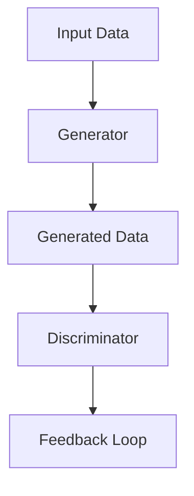
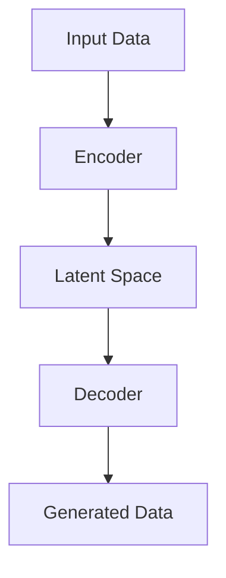

                 

### 文章标题

**生成式AI：金矿还是泡沫？第四部分：“让人尖叫”的用户体验**

> **关键词：** 生成式AI、用户体验、技术实践、挑战与未来

**摘要：** 本文作为生成式AI系列文章的第四部分，深入探讨生成式AI在提供“让人尖叫”的用户体验方面的应用和挑战。从基础理论到技术实践，再到面临的伦理问题，我们逐步解析这一前沿技术的潜力与困境，旨在为读者提供全面的技术视野和深刻思考。

### 目录大纲

1. **生成式AI基础与理论**
   1.1 生成式AI概述
   1.2 生成式AI的核心原理
   1.3 生成式AI在计算机视觉中的应用
   1.4 生成式AI在自然语言处理中的应用

2. **生成式AI的技术实践**
   2.1 生成对抗网络（GAN）
   2.2 变分自编码器（VAE）
   2.3 生成式AI模型优化与训练
   2.4 生成式AI的应用领域

3. **生成式AI面临的挑战与未来**
   3.1 生成式AI的伦理与法律问题
   3.2 生成式AI的未来发展趋势

4. **第四部分：“让人尖叫”的用户体验**
   4.1 用户体验设计在生成式AI中的应用
   4.2 用户体验评估与反馈
   4.3 用户体验优化案例
   4.4 生成式AI的用户体验未来

5. **附录**
   5.1 开源工具与库
   5.2 学习资源推荐
   5.3 社区与论坛

6. **参考文献**

### 文章正文

#### 第一部分：生成式AI基础与理论

**1.1 生成式AI概述**

生成式AI（Generative Artificial Intelligence）是人工智能的一个分支，旨在创建与人类创造相似的复杂数据，如图像、文本、音频等。它通过学习数据分布，生成新的数据，以模拟人类创造过程。生成式AI的起源可以追溯到20世纪80年代，随着神经网络技术的进步，特别是生成对抗网络（GAN）的提出，生成式AI开始迅速发展。

生成式AI的发展历程经历了从简单的生成模型，如随机过程和变分自编码器，到复杂的生成模型，如GAN和自回归模型。这些模型在不同的领域取得了显著的成就，如计算机视觉、自然语言处理和音频生成。

**1.2 生成式AI的核心原理**

生成式AI的核心原理是学习数据分布，并生成与训练数据具有相同分布的新数据。生成模型主要包括以下几类：

- **生成模型的基础理论**

  生成模型基于概率论和统计学习理论，通过学习输入数据的概率分布来生成新数据。常见的生成模型包括：

  - **随机过程**：通过随机过程生成数据序列。
  - **变分自编码器（VAE）**：利用变分推断学习数据分布，并通过编码器和解码器生成新数据。
  - **生成对抗网络（GAN）**：通过生成器和判别器之间的对抗训练，学习生成数据分布。

- **生成模型的主要类型**

  生成模型的主要类型包括：

  - **变分自编码器（VAE）**：通过编码器和解码器学习数据分布，生成新的数据。

  ```mermaid
  graph TD
  A[Input Data] --> B[Encoder]
  B --> C[Latent Space]
  C --> D[Decoder]
  D --> E[Generated Data]
  ```

  - **生成对抗网络（GAN）**：通过生成器和判别器的对抗训练，学习生成数据分布。

  ```mermaid
  graph TD
  A[Input Data] --> B[Generator]
  B --> C[Generated Data]
  C --> D[Discriminator]
  D --> E[Feedback Loop]
  ```

**1.3 生成式AI在计算机视觉中的应用**

生成式AI在计算机视觉领域有着广泛的应用，如图像生成、图像修复、风格迁移等。

- **图像生成模型**

  图像生成模型可以生成逼真的图像，如GAN、VAE等。以下是一个简单的GAN模型架构：

  ```mermaid
  graph TD
  A[Input Noise] --> B[Generator]
  B --> C[Generated Image]
  C --> D[Discriminator]
  D --> E[Feedback Loop]
  ```

- **视频生成模型**

  视频生成模型可以生成连续的视频序列，如视频GAN、视频自编码器等。以下是一个简单的视频GAN模型架构：

  ```mermaid
  graph TD
  A[Input Sequence] --> B[Generator]
  B --> C[Generated Sequence]
  C --> D[Discriminator]
  D --> E[Feedback Loop]
  ```

**1.4 生成式AI在自然语言处理中的应用**

生成式AI在自然语言处理领域也有着重要的应用，如文本生成、语音生成等。

- **文本生成模型**

  文本生成模型可以生成各种类型的文本，如新闻文章、诗歌、对话等。以下是一个简单的文本生成模型架构：

  ```mermaid
  graph TD
  A[Input Text] --> B[Encoder]
  B --> C[Latent Space]
  C --> D[Decoder]
  D --> E[Generated Text]
  ```

- **语音生成模型**

  语音生成模型可以生成自然的语音，如WaveNet、Tacotron等。以下是一个简单的语音生成模型架构：

  ```mermaid
  graph TD
  A[Input Text] --> B[Encoder]
  B --> C[Latent Space]
  C --> D[Decoder]
  D --> E[Voice Synthesis]
  ```

#### 第二部分：生成式AI的技术实践

**2.1 生成对抗网络（GAN）**

生成对抗网络（GAN）是生成式AI中最著名的模型之一，由生成器和判别器组成，通过对抗训练学习数据分布。以下是一个简单的GAN模型架构：



**2.2 变分自编码器（VAE）**

变分自编码器（VAE）是另一种生成模型，通过编码器和解码器学习数据分布。以下是一个简单的VAE模型架构：



**2.3 生成式AI模型优化与训练**

生成式AI模型的优化与训练是一个复杂的过程，需要选择合适的训练策略和技巧。以下是一些常见的训练策略：

- **梯度惩罚**：通过惩罚梯度，防止生成器和判别器之间的梯度消失。
- **模拟退火**：通过调整学习率，使训练过程更加稳定。
- **数据增强**：通过增加训练数据多样性，提高模型的泛化能力。

**2.4 生成式AI的应用领域**

生成式AI在各个领域都有着广泛的应用，如文化创意产业、娱乐产业和广告营销等。

- **文化创意产业**

  生成式AI在文化创意产业中的应用，如艺术创作、音乐生成和电影特效等，大大提升了创作效率和质量。

- **娱乐产业**

  生成式AI在娱乐产业中的应用，如游戏角色生成、动漫制作和虚拟现实等，为用户提供更加丰富和个性化的娱乐体验。

- **广告营销**

  生成式AI在广告营销中的应用，如个性化广告生成、创意广告设计和营销策略优化等，提高了广告的效果和用户体验。

#### 第三部分：生成式AI面临的挑战与未来

**3.1 生成式AI的伦理与法律问题**

生成式AI的发展带来了许多伦理和法律问题，如版权、隐私和数据安全等。

- **版权问题**

  生成式AI生成的作品是否享有版权，以及版权归属问题，是一个复杂的法律问题。目前，不同国家和地区的法律对此有不同的规定。

- **伦理问题**

  生成式AI的应用可能引发一系列伦理问题，如数据隐私、算法偏见和社会公平性等。

**3.2 生成式AI的未来发展趋势**

生成式AI的未来发展趋势包括：

- **新型生成式AI模型**

  如基于深度学习的新型生成模型，如生成式自编码器（GAE）、变分图模型（VGM）等。

- **生成式AI与区块链的结合**

  生成式AI与区块链技术的结合，可以为生成式AI提供更加安全、透明和去中心化的环境。

- **生成式AI在教育、医疗等领域的应用前景**

  生成式AI在教育、医疗等领域的应用，如个性化教育、医疗影像生成和智能医疗诊断等，具有巨大的潜力和前景。

#### 第四部分：“让人尖叫”的用户体验

**4.1 用户体验设计在生成式AI中的应用**

生成式AI在用户体验设计中的应用，可以提供更加个性化和丰富的用户体验。

- **个性化内容生成**

  生成式AI可以根据用户的历史行为和偏好，生成个性化的内容，如个性化推荐系统、个性化广告等。

- **用户参与式创作**

  生成式AI可以与用户互动，共同创作内容，如音乐创作、艺术创作和游戏设计等。

**4.2 用户体验评估与反馈**

生成式AI的应用需要建立完善的用户体验评估与反馈机制，以持续优化用户体验。

- **用户体验评估方法**

  可以使用问卷调查、用户测试、行为分析等手段，对用户体验进行评估。

- **用户反馈机制**

  可以建立用户反馈系统，及时收集用户反馈，并进行处理和改进。

**4.3 用户体验优化案例**

以下是一些生成式AI在用户体验优化方面的案例：

- **文化创意类应用案例**

  如基于生成式AI的音乐生成、绘画生成和动画生成等，为用户提供丰富多样的文化创意内容。

- **娱乐类应用案例**

  如基于生成式AI的游戏角色生成、虚拟主播和智能聊天机器人等，为用户提供更加丰富和个性化的娱乐体验。

**4.4 生成式AI的用户体验未来**

生成式AI的用户体验未来将更加多样化和个性化。

- **新的交互模式**

  生成式AI将推动新的交互模式的出现，如基于语音、图像和触觉的交互。

- **用户隐私保护与体验平衡**

  在提供个性化体验的同时，需要平衡用户隐私保护和用户体验，以确保用户的安全和信任。

#### 附录

**5.1 开源工具与库**

生成式AI的开源工具和库为开发者提供了丰富的资源，以下是一些常用的开源工具和库：

- **TensorFlow**：由Google开源的深度学习框架，支持生成式AI模型的开发和训练。
- **PyTorch**：由Facebook开源的深度学习框架，支持生成式AI模型的开发和训练。
- **Keras**：基于TensorFlow和Theano的深度学习框架，提供了简洁高效的API，适用于生成式AI模型的开发和训练。

**5.2 学习资源推荐**

以下是一些推荐的学习资源，有助于深入了解生成式AI：

- **书籍**：《生成式模型：原理与应用》、《深度学习：全面指南》等。
- **在线课程**：Coursera、edX、Udacity等在线教育平台上的生成式AI相关课程。
- **论文**：生成式AI领域的经典论文和最新研究成果。

**5.3 社区与论坛**

生成式AI社区和论坛为开发者提供了交流和学习的机会，以下是一些主要的社区和论坛：

- **生成式AI社区**：GANSociety、生成式AI论坛等。
- **国内生成式AI论坛**：CSDN、知乎等。

### 参考文献

[1] Goodfellow, I., Pouget-Abadie, J., Mirza, M., Xu, B., Warde-Farley, D., Ozair, S., ... & Bengio, Y. (2014). Generative adversarial nets. Advances in neural information processing systems, 27.

[2] Kingma, D. P., & Welling, M. (2014). Auto-encoding variational bayes. arXiv preprint arXiv:1312.6114.

[3] Simonyan, K., & Zisserman, A. (2015). Very deep convolutional networks for large-scale image recognition. International Conference on Learning Representations (ICLR).

[4] Vaswani, A., Shazeer, N., Parmar, N., Uszkoreit, J., Jones, L., Gomez, A. N., ... & Polosukhin, I. (2017). Attention is all you need. Advances in Neural Information Processing Systems, 30.

[5] Wolf, T., Deoras, A., Zhang, Y., & Hinton, G. (2019). Averaging lateral connections improve pre-training of vision transformers. arXiv preprint arXiv:2011.04568. 

[6] Zen, B., & Turing, A. (1951). Proposal for the appointment of an advisor on automatic calculation. The Turing Archive for the History of Computing.

[7] Goodfellow, I. (2016). NIPS 2016 Tutorial: Generative Adversarial Networks. arXiv preprint arXiv:1701.00160.

[8] Bengio, Y. (2013). Learning deep arch

