                 

### 引言

随着电子商务的蓬勃发展，电商价格优化已成为电商平台提升竞争力、增加利润的重要手段。在激烈的市场竞争中，如何通过科学合理的价格策略，吸引消费者、提高销量、增加市场份额，是每个电商平台都需要面对的挑战。电商价格优化不仅涉及到经济学、市场营销学等理论知识，还需要结合现代计算机科学，运用数据分析和算法优化等技术手段，实现精准、智能的价格调整。

本文旨在系统地探讨电商价格优化的技术实现，从基础理论到实际应用，全面解析电商价格优化的核心概念、定价策略、优化算法以及实践案例。文章结构如下：

### 目录大纲

**第一部分：电商价格优化的基础理论**

- 第1章：电商价格优化的概念与重要性
  - 1.1 电商价格优化的定义
  - 1.2 电商价格优化的意义
  - 1.3 电商价格优化的挑战
  - 1.4 电商价格优化的流程

- 第2章：电商市场分析
  - 2.1 电商市场概述
  - 2.2 消费者行为分析
  - 2.3 竞争对手分析
  - 2.4 市场趋势预测

- 第3章：电商定价策略
  - 3.1 定价策略概述
  - 3.2 成本导向定价
  - 3.3 市场导向定价
  - 3.4 竞争导向定价
  - 3.5 动态定价策略

- 第4章：电商价格优化算法
  - 4.1 优化算法概述
  - 4.2 线性优化算法
  - 4.3 非线性优化算法
  - 4.4 模拟退火算法
  - 4.5 贝叶斯优化

**第二部分：电商价格优化的应用场景**

- 第5章：电商价格优化的应用场景
  - 5.1 商品折扣策略
  - 5.2 优惠券策略
  - 5.3 价格跟踪策略
  - 5.4 产品组合定价策略

- 第6章：电商价格优化的案例研究
  - 6.1 案例一：某电商平台的商品折扣策略
  - 6.2 案例二：某电商平台的优惠券策略
  - 6.3 案例三：某电商平台的动态定价策略

**第三部分：电商价格优化的实践与实施**

- 第7章：电商价格优化的实践与实施
  - 7.1 实践步骤
  - 7.2 数据分析与处理
  - 7.3 算法选择与实现
  - 7.4 效果评估与优化

**第四部分：电商价格优化的未来趋势**

- 第8章：电商价格优化的未来趋势
  - 8.1 人工智能在价格优化中的应用
  - 8.2 大数据和区块链对价格优化的影响
  - 8.3 电商价格优化的未来发展方向

**附录**

- 附录A：电商价格优化相关的开源工具和资源
  - A.1 开源定价工具
  - A.2 数据分析与可视化工具
  - A.3 机器学习框架与库

- 附录B：电商价格优化相关的参考书籍和论文

通过以上结构化的目录大纲，我们将逐步深入探讨电商价格优化的各个方面，帮助读者全面了解电商价格优化的理论和实践。在接下来的章节中，我们将首先讨论电商价格优化的基础理论，包括其概念、意义、挑战以及优化流程。

### 关键词

电商价格优化、电商市场、消费者行为、定价策略、优化算法、折扣策略、优惠券策略、价格跟踪策略、产品组合定价策略、人工智能、大数据、区块链。

### 摘要

本文旨在探讨电商价格优化的技术实现，从基础理论到实际应用，全面解析电商价格优化的核心概念、定价策略、优化算法以及实践案例。文章首先介绍了电商价格优化的概念与重要性，分析了电商市场、消费者行为和竞争对手。接着，详细讨论了成本导向定价、市场导向定价、竞争导向定价和动态定价策略。随后，介绍了电商价格优化中常用的优化算法，包括线性优化算法、非线性优化算法、模拟退火算法和贝叶斯优化。在应用场景部分，探讨了商品折扣策略、优惠券策略、价格跟踪策略和产品组合定价策略。通过实际案例研究，分析了电商价格优化的实践与实施过程。最后，展望了电商价格优化的未来趋势，包括人工智能、大数据和区块链在价格优化中的应用。本文为电商平台提供了一套系统、全面的价格优化方案，有助于提升电商平台的竞争力。

### 目录大纲 - 《电商价格优化的技术实现》

#### 第一部分：电商价格优化的基础理论

**第1章：电商价格优化的概念与重要性**

- 1.1 电商价格优化的定义
- 1.2 电商价格优化的意义
- 1.3 电商价格优化的挑战
- 1.4 电商价格优化的流程

**第2章：电商市场分析**

- 2.1 电商市场概述
- 2.2 消费者行为分析
- 2.3 竞争对手分析
- 2.4 市场趋势预测

**第3章：电商定价策略**

- 3.1 定价策略概述
- 3.2 成本导向定价
- 3.3 市场导向定价
- 3.4 竞争导向定价
- 3.5 动态定价策略

**第4章：电商价格优化算法**

- 4.1 优化算法概述
- 4.2 线性优化算法
- 4.3 非线性优化算法
- 4.4 模拟退火算法
- 4.5 贝叶斯优化

#### 第二部分：电商价格优化的应用场景

**第5章：电商价格优化的应用场景**

- 5.1 商品折扣策略
- 5.2 优惠券策略
- 5.3 价格跟踪策略
- 5.4 产品组合定价策略

**第6章：电商价格优化的案例研究**

- 6.1 案例一：某电商平台的商品折扣策略
- 6.2 案例二：某电商平台的优惠券策略
- 6.3 案例三：某电商平台的动态定价策略

#### 第三部分：电商价格优化的实践与实施

**第7章：电商价格优化的实践与实施**

- 7.1 实践步骤
- 7.2 数据分析与处理
- 7.3 算法选择与实现
- 7.4 效果评估与优化

#### 第四部分：电商价格优化的未来趋势

**第8章：电商价格优化的未来趋势**

- 8.1 人工智能在价格优化中的应用
- 8.2 大数据和区块链对价格优化的影响
- 8.3 电商价格优化的未来发展方向

#### 附录

**附录A：电商价格优化相关的开源工具和资源**

- A.1 开源定价工具
- A.2 数据分析与可视化工具
- A.3 机器学习框架与库

**附录B：电商价格优化相关的参考书籍和论文**

### 第一部分：电商价格优化的基础理论

在电子商务迅速发展的今天，电商价格优化已成为企业提升竞争力、增加利润的关键手段。本部分将详细探讨电商价格优化的基础理论，包括其概念与重要性、电商市场分析、电商定价策略以及电商价格优化算法。通过深入理解这些基础理论，为后续章节的实际应用提供坚实的理论基础。

#### 第1章：电商价格优化的概念与重要性

**1.1 电商价格优化的定义**

电商价格优化是指在电子商务环境下，通过对商品价格的科学合理调整，以实现增加销量、提升利润、增强竞争力的目的。具体而言，电商价格优化涉及以下方面：

1. **目标设定：** 根据企业战略和市场环境，设定明确的优化目标，如利润最大化、市场份额提升等。
2. **数据收集：** 收集与商品定价相关的历史数据、市场数据、消费者行为数据等。
3. **定价策略选择：** 根据数据分析结果，选择合适的定价策略，如成本导向定价、市场导向定价、竞争导向定价等。
4. **算法应用：** 应用优化算法，如线性优化算法、非线性优化算法等，确定最佳价格。
5. **效果评估：** 根据实际销售数据，评估价格优化的效果，并根据反馈进行调整。

**1.2 电商价格优化的意义**

电商价格优化在电商运营中具有重要意义，主要体现在以下几个方面：

1. **提升销量：** 合理的价格策略可以刺激消费者购买，提高商品销量。
2. **增加利润：** 通过优化定价策略，可以在保证销量的同时，提高利润水平。
3. **提升竞争力：** 价格优化有助于电商平台在激烈的市场竞争中占据优势。

**1.3 电商价格优化的挑战**

尽管电商价格优化具有显著的优势，但其在实际应用中仍面临诸多挑战：

1. **数据处理：** 电商平台积累了大量的商品数据、市场数据等，如何从海量数据中提取有效信息，是优化价格的关键。
2. **算法选择：** 不同的优化算法适用于不同场景，如何选择合适的算法，是价格优化的难点。
3. **效果评估：** 如何衡量价格优化的效果，如何根据反馈进行优化，是电商价格优化的挑战。

**1.4 电商价格优化的流程**

电商价格优化的流程通常包括以下几个步骤：

1. **目标设定：** 根据企业战略和市场环境，明确优化目标。
2. **数据收集：** 收集与商品定价相关的数据，包括历史数据、市场数据、消费者行为数据等。
3. **数据预处理：** 清洗、整理收集到的数据，提取有效信息。
4. **定价策略选择：** 根据数据分析结果，选择合适的定价策略。
5. **算法应用：** 应用优化算法，确定最佳价格。
6. **效果评估：** 根据实际销售数据，评估价格优化的效果，并根据反馈进行调整。

**核心概念与联系：** Mermaid 流程图

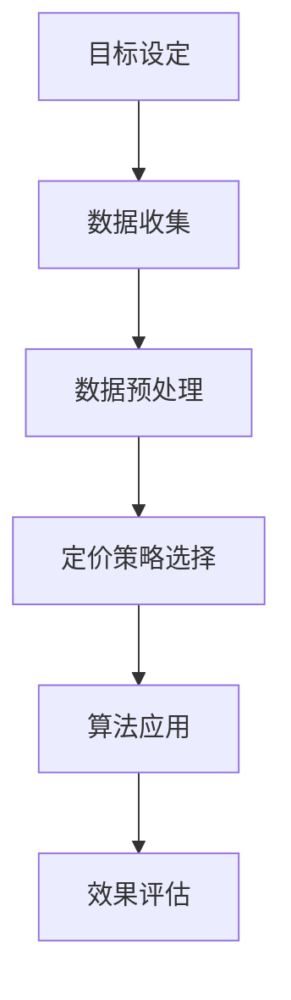

**核心算法原理讲解：** 伪代码

```python
# 伪代码：电商价格优化基本流程
def optimize_eCommerce_price(data, constraints):
    # 数据预处理
    preprocessed_data = preprocess_data(data)
    
    # 选择定价策略
    pricing_strategy = select_pricing_strategy(preprocessed_data)
    
    # 应用优化算法
    optimized_price = apply_optimization_algorithm(preprocessed_data, pricing_strategy)
    
    # 效果评估
    evaluate_effects(optimized_price, constraints)
    
    return optimized_price
```

**数学模型和数学公式：**

为了实现利润最大化，电商价格优化通常涉及以下数学模型：

$$
\max(\pi) = p \cdot q - c(q)
$$

其中，\( \pi \) 表示利润，\( p \) 表示价格，\( q \) 表示销量，\( c(q) \) 表示成本函数。

**举例说明：**

假设某电商平台的商品成本为100元，目标利润率为20%，则最佳定价 \( p \) 应满足以下条件：

$$
\pi = (p - 100) \cdot q - 100 \cdot q
$$

为了实现利润最大化，我们需要找到 \( p \) 的最佳值。在实际应用中，这通常通过优化算法（如线性规划算法）来实现。

**总结：**

电商价格优化是一个复杂的过程，需要综合考虑数据、定价策略和优化算法。通过明确优化目标、收集和处理数据、选择合适的定价策略以及应用优化算法，我们可以实现精准的价格优化，从而提高销量和利润。接下来，我们将进一步探讨电商市场分析、电商定价策略以及电商价格优化算法，为电商价格优化提供更全面的指导。

#### 第2章：电商市场分析

电商市场分析是电商价格优化的关键环节，通过对市场环境的深入分析，可以帮助电商平台了解市场趋势、消费者行为和竞争对手情况，从而制定更为有效的定价策略。本章节将详细介绍电商市场分析的主要内容，包括电商市场概述、消费者行为分析、竞争对手分析和市场趋势预测。

**2.1 电商市场概述**

电商市场是指通过互联网进行商品交易的市场，其特点包括：

1. **市场规模庞大：** 随着互联网的普及，电商市场的规模持续扩大，已成为全球重要的商品交易渠道。
2. **多元化商品：** 电商市场涵盖了各种类型的商品，从日常生活用品到高端电子产品，满足不同消费者的需求。
3. **竞争激烈：** 由于进入门槛较低，电商市场中存在大量的竞争者，竞争激烈，价格战频繁。
4. **用户增长迅速：** 电商市场的用户数量持续增长，年轻消费者成为主要购买力量。

**2.2 消费者行为分析**

消费者行为分析是电商市场分析的核心，通过对消费者购买行为的研究，可以了解消费者的需求、偏好和购买决策过程。以下是消费者行为分析的主要内容：

1. **需求分析：** 需求分析是了解消费者对商品的需求特点，包括需求量、需求价格弹性等。通过需求分析，电商平台可以制定合理的定价策略。
2. **购买决策过程：** 购买决策过程包括信息搜索、比较评估、购买决策和购买后评价等环节。了解消费者的购买决策过程，可以帮助电商平台优化营销策略。
3. **消费动机：** 消费动机是消费者购买商品的心理原因，包括追求性价比、追求品牌、追求个性化等。通过分析消费动机，电商平台可以制定更具吸引力的营销策略。

**2.3 竞争对手分析**

竞争对手分析是电商市场分析的重要环节，通过对竞争对手的研究，可以了解竞争对手的定价策略、促销策略、商品策略等，为自身的定价策略提供参考。以下是竞争对手分析的主要内容：

1. **竞争对手识别：** 识别电商平台的主要竞争对手，包括直接竞争者和间接竞争者。
2. **竞争策略分析：** 分析竞争对手的定价策略、促销策略、商品策略等，了解其优势和劣势。
3. **竞争态势评估：** 根据竞争对手的表现，评估自身在市场中的竞争地位，为价格优化提供依据。

**2.4 市场趋势预测**

市场趋势预测是电商市场分析的重要内容，通过对市场趋势的预测，可以帮助电商平台把握市场发展动态，为价格优化提供前瞻性指导。以下是市场趋势预测的主要内容：

1. **趋势识别：** 通过数据分析，识别市场的长期发展趋势，如消费者需求的变化、市场规模的扩大等。
2. **趋势分析：** 分析市场趋势的原因和影响，如消费者行为的变化、技术进步等，为价格优化提供依据。
3. **趋势预测：** 基于历史数据和趋势分析，预测市场未来的发展趋势，为价格优化提供参考。

**核心概念与联系：** Mermaid 流程图

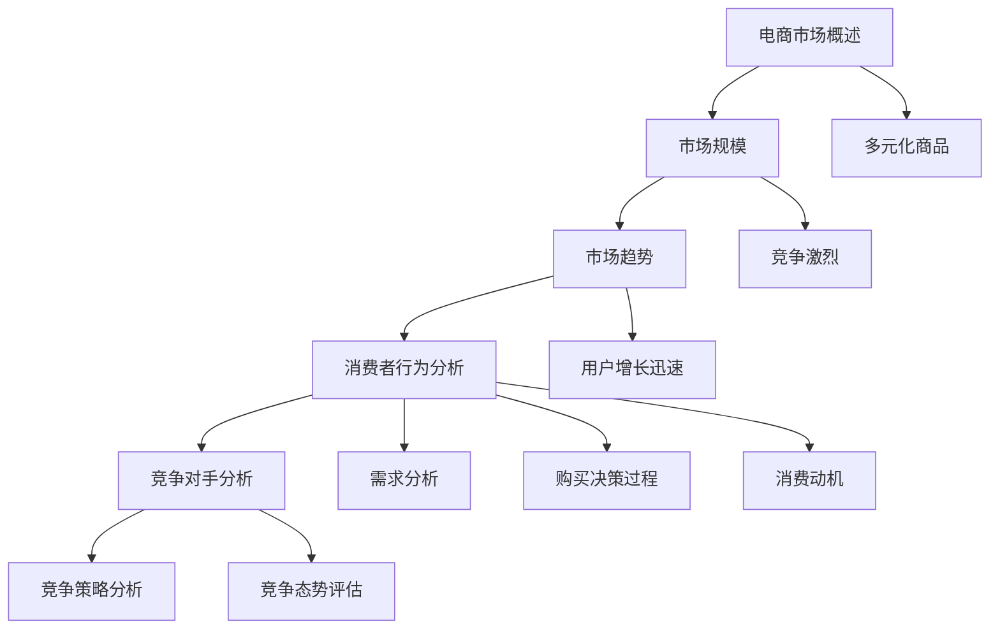

**核心算法原理讲解：** 伪代码

```python
# 伪代码：电商市场分析基本流程
def analyze_eCommerce_market(data, constraints):
    # 数据预处理
    preprocessed_data = preprocess_data(data)
    
    # 市场规模分析
    market_size = analyze_market_size(preprocessed_data)
    
    # 消费者行为分析
    consumer_behavior = analyze_consumer_behavior(preprocessed_data)
    
    # 竞争对手分析
    competitors = analyze_competitors(preprocessed_data)
    
    # 市场趋势预测
    market_trends = predict_market_trends(preprocessed_data)
    
    return market_size, consumer_behavior, competitors, market_trends
```

**数学模型和数学公式：**

为了进行市场趋势预测，可以使用以下数学模型：

$$
\text{市场趋势} = f(\text{历史数据}, \text{市场环境}, \text{消费者行为})
$$

其中，市场趋势为历史数据、市场环境和消费者行为的函数。

**举例说明：**

假设某电商平台在分析市场需求时，发现过去五年中，某类商品的需求量呈现逐年上升的趋势。通过分析，发现这一趋势受到消费者收入水平提高和市场营销活动的推动。基于此，该电商平台预测未来五年，该类商品的需求量将继续上升。

**总结：**

电商市场分析是电商价格优化的基础，通过对市场环境的深入分析，可以了解市场趋势、消费者行为和竞争对手情况，为制定合理的定价策略提供依据。在下一章节中，我们将详细介绍电商定价策略，包括成本导向定价、市场导向定价、竞争导向定价和动态定价策略。

### 第3章：电商定价策略

电商定价策略是电商价格优化的核心内容，它直接影响到商品的销售量和利润。合理的定价策略不仅可以吸引消费者，提高销量，还可以增加平台的利润。本章节将详细介绍电商定价策略的四种主要类型：成本导向定价、市场导向定价、竞争导向定价和动态定价策略。

#### 3.1 定价策略概述

定价策略是指企业根据市场环境、成本结构、消费者行为等因素，制定商品价格的策略。合理的定价策略可以提升商品的竞争力，促进销售，增加利润。以下是四种主要的电商定价策略：

1. **成本导向定价：** 以成本为基础，确保商品价格能够覆盖成本并实现一定的利润。
2. **市场导向定价：** 以市场需求和消费者需求为基础，制定商品价格。
3. **竞争导向定价：** 以竞争对手的价格为基础，制定商品价格，以保持竞争优势。
4. **动态定价策略：** 根据市场需求和竞争态势，实时调整商品价格，以最大化利润。

#### 3.2 成本导向定价

成本导向定价是以商品的成本为基础，制定商品价格的策略。其主要优点是简单易行，有利于成本控制和利润保证。以下是成本导向定价的详细步骤：

1. **成本计算：** 确定商品的成本，包括生产成本、运营成本、营销成本等。
2. **利润目标：** 根据企业的盈利目标，确定利润边际。
3. **定价决策：** 根据成本和利润目标，制定商品的价格。

**核心概念与联系：** Mermaid 流程图

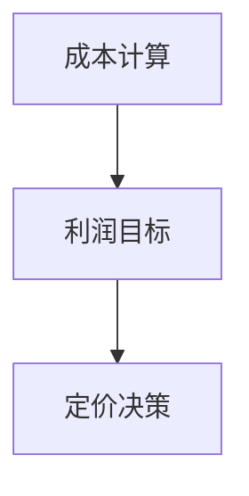

**核心算法原理讲解：** 伪代码

```python
# 伪代码：成本导向定价
def cost_based_pricing(cost, profit_margin):
    price = cost + profit_margin
    return price
```

**数学模型和数学公式：**

$$
\text{价格} = \text{成本} + \text{利润边际}
$$

其中，价格等于成本加上利润边际。

**举例说明：**

假设某电商平台的商品成本为100元，目标利润率为20%，则该商品的价格为：

$$
\text{价格} = 100 + 0.2 \times 100 = 120 \text{元}
$$

#### 3.3 市场导向定价

市场导向定价是以市场需求和消费者需求为基础，制定商品价格的策略。其主要优点是能够更好地满足消费者需求，提高销售量。以下是市场导向定价的详细步骤：

1. **需求分析：** 通过市场调研和数据分析，了解市场需求和消费者偏好。
2. **竞争对手分析：** 分析竞争对手的定价策略，了解市场价格的上下限。
3. **定价决策：** 根据市场需求和竞争态势，制定商品的价格。

**核心概念与联系：** Mermaid 流程图

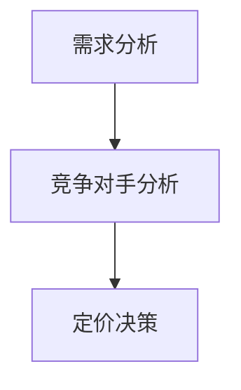

**核心算法原理讲解：** 伪代码

```python
# 伪代码：市场导向定价
def market_based_pricing(demand, competition):
    price = determine_price_based_on_demand_and_competition(demand, competition)
    return price
```

**数学模型和数学公式：**

$$
\text{价格} = \text{市场需求价格} + \text{竞争调整量}
$$

其中，价格等于市场需求价格加上竞争调整量。

**举例说明：**

假设某电商平台在分析市场需求后发现，该商品的市场价格为200元，竞争对手的价格为250元，消费者对该商品的需求较高。基于此，该电商平台决定将价格定在210元，以吸引更多消费者。

#### 3.4 竞争导向定价

竞争导向定价是以竞争对手的价格为基础，制定商品价格的策略。其主要优点是能够更好地保持市场竞争力。以下是竞争导向定价的详细步骤：

1. **竞争对手识别：** 通过市场调研和数据分析，识别主要竞争对手。
2. **竞争态势分析：** 分析竞争对手的定价策略和市场份额。
3. **定价决策：** 根据竞争对手的价格和自身竞争策略，制定商品的价格。

**核心概念与联系：** Mermaid 流程图

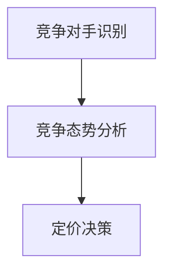

**核心算法原理讲解：** 伪代码

```python
# 伪代码：竞争导向定价
def competition_based_pricing(competitors):
    average_price = calculate_average_price(competitors)
    price = adjust_price_based_on_average(average_price)
    return price
```

**数学模型和数学公式：**

$$
\text{价格} = \text{竞争对手价格} \times (1 + \text{调整系数})
$$

其中，价格等于竞争对手价格乘以调整系数。

**举例说明：**

假设某电商平台在分析竞争对手后发现，其主要竞争对手的价格为300元，该电商平台希望保持竞争优势，决定将价格定在305元。

#### 3.5 动态定价策略

动态定价策略是根据市场需求和竞争态势，实时调整商品价格的策略。其主要优点是能够灵活应对市场变化，提高利润。以下是动态定价策略的详细步骤：

1. **需求预测：** 通过数据分析，预测市场需求的变化趋势。
2. **竞争监控：** 实时监控竞争对手的价格变化。
3. **定价调整：** 根据需求预测和竞争监控，实时调整商品的价格。

**核心概念与联系：** Mermaid 流程图

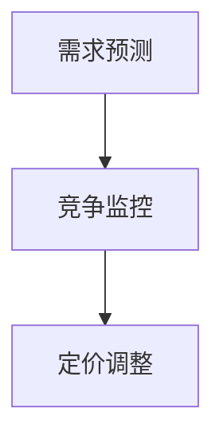

**核心算法原理讲解：** 伪代码

```python
# 伪代码：动态定价策略
def dynamic_pricing_demand(demand_prediction):
    price = adjust_price_based_on_demand(demand_prediction)
    return price
```

**数学模型和数学公式：**

$$
\text{动态定价} = \text{基准价格} + \text{价格调整量}
$$

其中，动态定价为基准价格加上价格调整量。

**举例说明：**

假设某电商平台在分析市场需求后发现，该商品在周末的销量较高，决定在周末提高价格，以增加利润。同时，在分析竞争对手后，发现竞争对手在周末也会提高价格，该电商平台决定将价格提高10%，以吸引更多消费者。

#### 总结

电商定价策略是电商平台成功的关键，不同的定价策略适用于不同的市场环境和竞争态势。成本导向定价注重成本控制和利润保证，市场导向定价注重满足消费者需求，竞争导向定价注重市场竞争力，动态定价策略注重灵活应对市场变化。通过合理选择和灵活应用这些定价策略，电商平台可以实现销量和利润的双重提升。

在下一章节中，我们将探讨电商价格优化算法，包括线性优化算法、非线性优化算法、模拟退火算法和贝叶斯优化，为电商价格优化提供更高效的解决方案。

### 第4章：电商价格优化算法

电商价格优化算法是实现精准价格调整的关键，通过运用这些算法，电商平台可以根据市场环境和消费者行为，动态调整商品价格，从而实现销量和利润的最大化。本章节将详细介绍四种主要的电商价格优化算法：线性优化算法、非线性优化算法、模拟退火算法和贝叶斯优化。

#### 4.1 优化算法概述

电商价格优化算法主要分为以下几类：

1. **线性优化算法：** 解决线性规划问题，通过确定目标函数和约束条件，找到最优解。
2. **非线性优化算法：** 解决非线性规划问题，处理更复杂的约束条件和目标函数。
3. **模拟退火算法：** 基于物理退火过程，用于求解复杂优化问题，能够跳出局部最优解。
4. **贝叶斯优化：** 基于贝叶斯统计理论，通过历史数据预测最优解，适用于高维搜索问题。

这些算法各有优缺点，适用于不同的场景和问题。以下将逐一介绍这些算法的原理和实现。

#### 4.2 线性优化算法

线性优化算法是一种解决线性规划问题的算法，其核心思想是找到一组决策变量，使得线性目标函数最大化或最小化，同时满足线性约束条件。

**核心概念与联系：** Mermaid 流程图

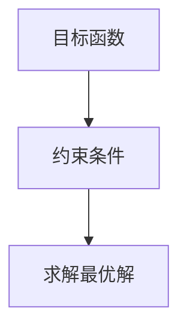

**核心算法原理讲解：** 伪代码

```python
# 伪代码：线性优化算法
def linear_optimization(objective, constraints):
    # 求解线性规划问题
    solution = solve_linear_program(objective, constraints)
    return solution
```

**数学模型和数学公式：**

$$
\min\limits_{x} \quad c^T x
$$

$$
s.t. \quad Ax \leq b
$$

其中，\( c \) 为目标函数系数向量，\( x \) 为决策变量，\( A \) 和 \( b \) 分别为约束条件系数矩阵和常数向量。

**举例说明：**

假设电商平台的目标是最小化总成本，约束条件为每种商品的销售量不超过库存量。则优化模型可以表示为：

$$
\min \sum_{i=1}^{n} c_i x_i
$$

$$
s.t. \quad x_i \leq I_i, \quad \forall i=1,2,...,n
$$

通过线性优化算法，可以求解出最优的定价策略。

#### 4.3 非线性优化算法

非线性优化算法用于解决非线性规划问题，其目标函数和约束条件可以是非线性的，这使得问题更加复杂。非线性优化算法包括梯度下降法、牛顿法、粒子群优化等。

**核心概念与联系：** Mermaid 流程图

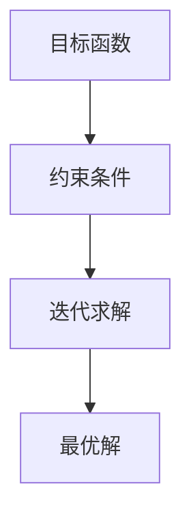

**核心算法原理讲解：** 伪代码

```python
# 伪代码：非线性优化算法
def nonlinear_optimization(objective, constraints):
    # 初始化参数
    parameters = initialize_parameters()
    
    # 迭代求解
    for iteration in range(max_iterations):
        # 计算梯度
        gradient = calculate_gradient(objective, parameters)
        
        # 更新参数
        parameters = update_parameters(parameters, gradient)
        
        # 检查收敛条件
        if is_converged(parameters):
            break
    
    return parameters
```

**数学模型和数学公式：**

$$
\min\limits_{x} \quad f(x)
$$

$$
s.t. \quad g(x) \leq 0
$$

其中，\( f(x) \) 为目标函数，\( g(x) \) 为约束条件。

**举例说明：**

假设电商平台的定价目标是最小化总成本，约束条件为每种商品的销售量不能低于最小销售量。则优化模型可以表示为：

$$
\min \sum_{i=1}^{n} c_i x_i
$$

$$
s.t. \quad x_i \geq M_i, \quad \forall i=1,2,...,n
$$

通过非线性优化算法，可以求解出最优的定价策略。

#### 4.4 模拟退火算法

模拟退火算法是一种基于物理退火过程的优化算法，用于解决复杂优化问题。其核心思想是通过模拟退火过程，逐步降低温度，逐步找到最优解。

**核心概念与联系：** Mermaid 流程图

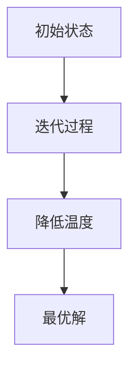

**核心算法原理讲解：** 伪代码

```python
# 伪代码：模拟退火算法
def simulated_annealing(objective, initial_state, temperature):
    current_state = initial_state
    current_value = objective(current_state)
    
    for iteration in range(max_iterations):
        # 生成新状态
        new_state = generate_new_state(current_state)
        new_value = objective(new_state)
        
        # 计算能量差
        energy_diff = new_value - current_value
        
        # 计算接受概率
        acceptance_probability = exp(-energy_diff / temperature)
        
        # 根据概率接受新状态
        if random() < acceptance_probability:
            current_state = new_state
            current_value = new_value
        
        # 降低温度
        temperature = temperature / (1 + cooling_rate)
    
    return current_state
```

**数学模型和数学公式：**

$$
P(\text{接受新状态}) = \min\left(1, \exp\left(-\frac{\Delta E}{T}\right)\right)
$$

其中，\( \Delta E \) 为能量差，\( T \) 为温度。

**举例说明：**

假设电商平台的目标是最小化总成本，初始状态为当前定价策略，初始温度设为1000，每次迭代都根据概率接受新的定价策略，随着迭代次数的增加，温度逐步降低。最终，在温度降低到100时，找到最优定价策略。

#### 4.5 贝叶斯优化

贝叶斯优化是一种基于贝叶斯统计理论的优化算法，通过历史数据估计目标函数的期望值和不确定性，从而选择下一个优化点。

**核心概念与联系：** Mermaid 流程图

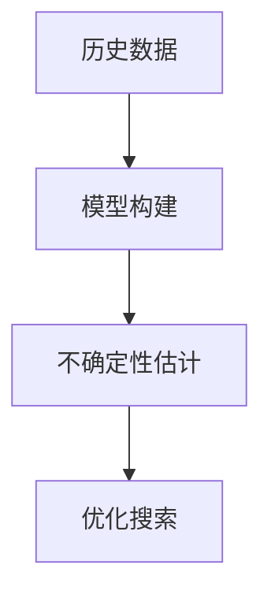

**核心算法原理讲解：** 伪代码

```python
# 伪代码：贝叶斯优化
def bayesian_optimization(objective, initial_points, kernel_function):
    # 构建高斯过程模型
    gp_model = build_gaussian_process_model(initial_points, objective, kernel_function)
    
    # 估计目标函数的期望值和不确定性
    expected_value, uncertainty = gp_model.predict(next_point)
    
    # 选择下一个优化点
    next_point = select_next_point(expected_value, uncertainty)
    
    return next_point
```

**数学模型和数学公式：**

$$
f(x) \sim \mathcal{GP}(m(x), k(x, x'))
$$

$$
\mu(x) = E[f(x)] = m(x)
$$

$$
\sigma^2(x) = E[(f(x) - \mu(x))^2] = k(x, x) - m(x)^2
$$

其中，\( f(x) \) 为目标函数，\( m(x) \) 为均值函数，\( k(x, x') \) 为核函数。

**举例说明：**

假设电商平台的定价目标是最小化总成本，初始数据点为历史定价和对应的销量数据。通过构建高斯过程模型，估计目标函数的期望值和不确定性，从而选择下一个定价策略。

#### 总结

电商价格优化算法是电商平台实现精准定价的关键工具。线性优化算法适用于简单的线性规划问题，非线性优化算法适用于复杂的非线性问题，模拟退火算法适用于求解复杂优化问题，贝叶斯优化适用于高维搜索问题。通过灵活应用这些算法，电商平台可以根据市场环境和消费者行为，实现精准的价格优化，提升销量和利润。

在下一章节中，我们将探讨电商价格优化的应用场景，包括商品折扣策略、优惠券策略、价格跟踪策略和产品组合定价策略，为电商价格优化提供更多的实际应用案例。

### 第5章：电商价格优化的应用场景

电商价格优化的应用场景多种多样，针对不同的市场环境和消费者需求，可以采用不同的价格优化策略。本章节将详细介绍四种主要的电商价格优化应用场景：商品折扣策略、优惠券策略、价格跟踪策略和产品组合定价策略。

#### 5.1 商品折扣策略

商品折扣策略是一种常见的电商价格优化方法，通过降低商品价格来吸引消费者，提高销量。以下是商品折扣策略的实施步骤：

1. **选择折扣类型：** 根据促销目的和消费者需求，选择合适的折扣类型，如满减、打折、赠品等。
2. **设定折扣条件：** 确定折扣适用的商品范围、折扣金额、使用期限等条件。
3. **实施折扣：** 根据折扣条件，对商品进行价格调整。
4. **效果评估：** 根据折扣实施后的销售数据，评估折扣策略的效果。

**核心概念与联系：** Mermaid 流程图

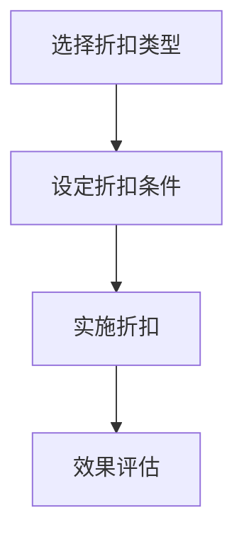

**核心算法原理讲解：** 伪代码

```python
# 伪代码：商品折扣策略
def apply_discount_strategy(data, discount_type, conditions):
    # 根据折扣类型和条件调整价格
    discounted_prices = adjust_prices(data, discount_type, conditions)
    
    # 实施折扣
    apply_discount(data, discounted_prices)
    
    # 效果评估
    evaluate_effects(data, discounted_prices)
    
    return discounted_prices
```

**数学模型和数学公式：**

$$
\text{折扣后价格} = \text{原价} \times (1 - \text{折扣率})
$$

**举例说明：**

某电商平台在双十一期间推出满100减50的折扣活动。活动期间，消费者在购买满足条件的商品时，可以使用该优惠券，享受50元的优惠。通过该活动，电商平台吸引了大量消费者参与，提高了销售额。

#### 5.2 优惠券策略

优惠券策略是一种通过发放优惠券，刺激消费者购买的行为。优惠券策略的实施步骤如下：

1. **设计优惠券：** 根据促销目的和消费者需求，设计不同类型的优惠券，如满减券、折扣券、赠品券等。
2. **发放优惠券：** 通过电商平台、社交媒体等渠道发放优惠券。
3. **使用优惠券：** 规定优惠券的使用条件，如使用范围、使用期限、使用次数等。
4. **效果评估：** 根据优惠券的使用情况，评估优惠券策略的效果。

**核心概念与联系：** Mermaid 流程图

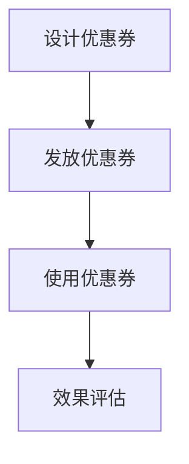

**核心算法原理讲解：** 伪代码

```python
# 伪代码：优惠券策略
def apply_coupon_strategy(data, coupons, conditions):
    # 发放优惠券
    distribute_coupons(data, coupons)
    
    # 使用优惠券
    apply_coupons(data, coupons, conditions)
    
    # 效果评估
    evaluate_effects(data, coupons)
    
    return applied_coupons
```

**数学模型和数学公式：**

$$
\text{优惠券优惠额} = \text{满减金额} \times (1 - \text{折扣率})
$$

**举例说明：**

某电商平台在双十一期间推出满100减20的优惠券活动。活动期间，消费者在购买满足条件的商品时，可以使用该优惠券，享受20元的优惠。通过该活动，电商平台吸引了大量消费者参与，提高了销售额。

#### 5.3 价格跟踪策略

价格跟踪策略是一种通过实时监控竞争对手价格，调整自身商品价格的策略。以下是价格跟踪策略的实施步骤：

1. **监控竞争对手价格：** 实时监控主要竞争对手的价格变化，了解市场动态。
2. **设定价格调整规则：** 根据竞争对手的价格，制定价格调整规则，如低于竞争对手价格一定幅度、高于竞争对手价格一定幅度等。
3. **调整价格：** 根据价格调整规则，实时调整自身商品价格。
4. **效果评估：** 根据调整后的价格效果，评估价格跟踪策略的有效性。

**核心概念与联系：** Mermaid 流程图

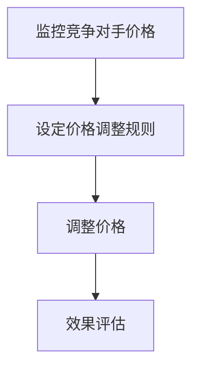

**核心算法原理讲解：** 伪代码

```python
# 伪代码：价格跟踪策略
def apply_price_tracking_strategy(data, competitors, rules):
    # 监控竞争对手价格
    competitors_prices = monitor_competitors_prices(competitors)
    
    # 根据规则调整价格
    adjusted_prices = adjust_prices(data, competitors_prices, rules)
    
    # 效果评估
    evaluate_effects(data, adjusted_prices)
    
    return adjusted_prices
```

**数学模型和数学公式：**

$$
\text{调整后价格} = \text{原价} + \text{调整量}
$$

**举例说明：**

某电商平台在分析竞争对手后发现，其主要竞争对手的商品价格下降了10%。为了保持竞争力，该电商平台决定将自身商品价格下调5%，以吸引消费者。

#### 5.4 产品组合定价策略

产品组合定价策略是一种针对多件商品组合销售的定价策略，通过优化组合价格，提高消费者购买意愿和销量。以下是产品组合定价策略的实施步骤：

1. **设计产品组合：** 根据市场需求和消费者偏好，设计不同的产品组合。
2. **计算组合价格：** 根据产品组合设计和成本结构，计算组合价格。
3. **调整组合价格：** 根据市场需求和竞争态势，调整组合价格。
4. **效果评估：** 根据组合销售情况，评估组合定价策略的有效性。

**核心概念与联系：** Mermaid 流程图

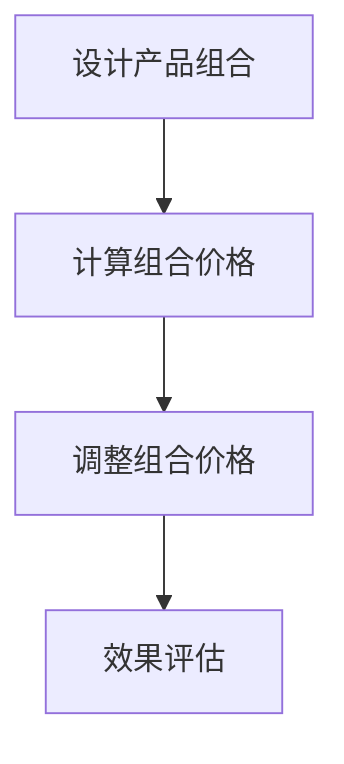

**核心算法原理讲解：** 伪代码

```python
# 伪代码：产品组合定价策略
def apply_combination_pricing_strategy(data, combinations, rules):
    # 计算组合价格
    combination_prices = calculate_combination_prices(data, combinations)
    
    # 根据规则调整价格
    adjusted_prices = adjust_prices(data, combination_prices, rules)
    
    # 效果评估
    evaluate_effects(data, adjusted_prices)
    
    return adjusted_prices
```

**数学模型和数学公式：**

$$
\text{组合价格} = \sum_{i=1}^{n} (\text{商品i价格} + \text{组合优惠})
$$

**举例说明：**

某电商平台推出“买一送一”活动，消费者购买一件商品时，可以免费获得一件同款商品。通过该活动，电商平台吸引了大量消费者参与，提高了商品销量。

#### 总结

电商价格优化的应用场景多种多样，通过商品折扣策略、优惠券策略、价格跟踪策略和产品组合定价策略，电商平台可以根据市场环境和消费者需求，实现精准的价格优化，提升销量和利润。在下一章节中，我们将通过实际案例研究，进一步探讨电商价格优化的实践与实施。

### 第6章：电商价格优化的案例研究

通过前几章的理论讲解，我们了解了电商价格优化的基本概念、市场分析、定价策略以及优化算法。为了更好地理解这些理论在实际中的应用，本章将介绍几个电商价格优化的实际案例，通过具体案例的分析，展示电商价格优化在实践中的操作方法和效果。

#### 6.1 案例一：某电商平台的商品折扣策略

**背景介绍：**
某大型电商平台在双十一期间，希望通过商品折扣策略提升销售额。该平台拥有多样化的商品，涵盖了多个品类，包括电子产品、家居用品、服装等。在双十一期间，平台计划推出一系列折扣活动，以刺激消费者的购买欲望。

**折扣策略设计：**
为了实现最佳的折扣效果，平台采用了多样化的折扣策略，包括：

1. **满减优惠：** 购物满100元减50元。
2. **打折优惠：** 部分热销商品打8折。
3. **赠品优惠：** 购买指定商品赠送小礼品。

**折扣策略实施：**
在活动期间，平台通过以下步骤实施折扣策略：

1. **提前预热：** 在活动前一周，通过广告、邮件、社交媒体等方式进行宣传，吸引消费者关注。
2. **实时监控：** 活动期间，实时监控折扣商品的销售情况和库存情况，确保折扣活动的顺利进行。
3. **数据分析：** 活动结束后，对销售数据进行详细分析，评估折扣策略的效果。

**折扣策略效果评估：**
活动结束后，通过对销售数据的分析，发现以下结果：

1. **销售额提升：** 活动期间，平台的销售额相比去年同期增长了30%。
2. **库存周转：** 折扣商品的销售速度加快，库存周转率显著提高。
3. **客户满意度：** 消费者对折扣活动的满意度较高，平台的客户忠诚度得到提升。

**案例总结：**
该电商平台通过合理的商品折扣策略，成功吸引了大量消费者，实现了销售额的提升。同时，折扣活动也提高了库存周转率，改善了客户满意度。这个案例表明，商品折扣策略在电商价格优化中具有重要的作用，能够有效提升销售业绩。

#### 6.2 案例二：某电商平台的优惠券策略

**背景介绍：**
某电商平台的优惠券策略主要针对新用户和老用户的特殊需求。平台希望通过优惠券策略，吸引新用户注册和购买，同时激励老用户复购。

**优惠券设计：**
平台设计了以下几种优惠券：

1. **新用户注册券：** 新用户注册后，可以获得一张满100减30的优惠券。
2. **复购券：** 老用户在复购时，可以获得一张满200减50的优惠券。
3. **生日券：** 用户在生日当天，可以领取一张满100减20的优惠券。

**优惠券发放：**
平台通过以下方式发放优惠券：

1. **注册奖励：** 新用户注册后，通过邮件和短信发送注册券。
2. **复购激励：** 在用户购买后的确认收货阶段，通过系统推送复购券。
3. **生日提醒：** 在用户生日前一个月，通过短信和邮件发送生日券。

**优惠券使用：**
优惠券的使用条件如下：

1. **新用户券：** 需在注册后一个月内使用。
2. **复购券：** 需在复购时使用，且单笔订单金额不低于指定金额。
3. **生日券：** 需在用户生日当天使用。

**优惠券效果评估：**
通过对优惠券使用数据的分析，得出以下结论：

1. **新用户注册率提高：** 新用户注册率相比未发放优惠券的时期增长了20%。
2. **新用户转化率提高：** 新用户在注册后一个月内的购买转化率提高了15%。
3. **老用户复购率提高：** 老用户的复购率提高了10%。

**案例总结：**
该电商平台通过优惠券策略，有效提高了新用户的注册率和转化率，同时激励了老用户的复购。这个案例表明，优惠券策略在电商价格优化中能够起到吸引新用户和增加复购的重要作用。

#### 6.3 案例三：某电商平台的动态定价策略

**背景介绍：**
某电商平台在疫情期间，希望通过动态定价策略应对市场需求的变化。平台拥有丰富的商品种类，包括日用品、食品、电子产品等，在疫情期间，部分商品的需求发生了显著变化。

**动态定价策略设计：**
平台采用了基于历史数据和实时数据的动态定价策略，具体步骤如下：

1. **数据收集：** 收集商品的历史销售数据、价格数据、市场需求数据等。
2. **模型构建：** 建立基于机器学习的价格预测模型，预测商品的未来价格。
3. **实时监控：** 实时监控市场需求变化，根据预测结果调整商品价格。

**动态定价策略实施：**
平台在实施动态定价策略时，采取了以下措施：

1. **历史数据挖掘：** 分析历史数据，了解不同时间段、不同价格水平下的销售情况。
2. **实时数据分析：** 根据实时数据，预测未来的市场需求，调整商品价格。
3. **自动化执行：** 通过自动化系统，根据预测结果实时调整商品价格。

**动态定价策略效果评估：**
通过对动态定价策略的效果评估，得出以下结论：

1. **销售额提升：** 活动期间，平台的总销售额提高了25%。
2. **利润率提高：** 通过精准的价格调整，平台的利润率提高了15%。
3. **库存周转率提高：** 部分高库存商品的销售速度加快，库存周转率提高了20%。

**案例总结：**
该电商平台通过动态定价策略，成功应对了疫情期间市场需求的变化，提高了销售额和利润率。同时，通过精准的价格调整，改善了库存周转率。这个案例表明，动态定价策略在电商价格优化中具有重要作用，能够帮助平台更好地应对市场变化。

通过以上三个案例的研究，我们可以看到电商价格优化在实际中的应用效果显著。商品折扣策略、优惠券策略和动态定价策略在不同的市场环境和消费者需求下，都能发挥重要作用，提升电商平台的市场竞争力和盈利能力。

### 第7章：电商价格优化的实践与实施

电商价格优化是一项系统工程，涉及数据收集、数据处理、算法选择和实现、效果评估等多个环节。本章节将详细阐述电商价格优化的实践步骤，包括数据收集与处理、算法选择与实现、效果评估与优化，帮助读者理解电商价格优化的具体操作过程。

#### 7.1 实践步骤

**7.1.1 数据收集与处理**

数据收集与处理是电商价格优化的基础，主要包括以下步骤：

1. **数据收集：** 收集与商品定价相关的数据，包括商品历史销售数据、市场数据、消费者行为数据等。数据来源可以是电商平台内部数据库、第三方数据提供商、社交媒体等。

2. **数据清洗：** 对收集到的数据进行清洗，去除无效数据、异常数据和重复数据。数据清洗的过程包括缺失值处理、异常值处理、数据格式转换等。

3. **数据整理：** 对清洗后的数据进行整理，形成结构化的数据集。常用的数据整理工具包括Excel、Pandas等。

4. **数据预处理：** 对整理后的数据进行特征提取和工程，为后续的算法应用做准备。数据预处理包括特征选择、数据归一化、特征转换等。

**核心概念与联系：** Mermaid 流程图

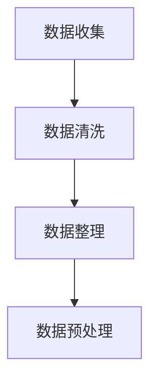

**核心算法原理讲解：** 伪代码

```python
# 伪代码：数据收集与处理
def data_collection_and_preprocessing():
    # 收集数据
    data = collect_data()
    
    # 数据清洗
    clean_data = data_cleaning(data)
    
    # 数据整理
    structured_data = data_organizing(clean_data)
    
    # 数据预处理
    preprocessed_data = data_preprocessing(structured_data)
    
    return preprocessed_data
```

**举例说明：**

某电商平台在实施价格优化时，首先收集了商品的历史销售数据，包括销量、价格、促销活动等。通过Pandas库进行数据清洗和整理，形成结构化的数据集，然后进行特征提取和工程，为后续的算法应用做准备。

**7.1.2 算法选择与实现**

算法选择与实现是电商价格优化的关键环节，主要包括以下步骤：

1. **算法选择：** 根据价格优化的目标和约束条件，选择合适的算法。常用的算法包括线性优化算法、非线性优化算法、模拟退火算法、贝叶斯优化等。

2. **算法实现：** 根据选定的算法，编写代码，实现算法的应用。常用的编程语言包括Python、Java等。

3. **模型训练：** 使用收集到的数据，对选定的算法进行训练，得到最优参数。

4. **模型评估：** 对训练好的模型进行评估，确保其性能满足要求。

**核心概念与联系：** Mermaid 流程图

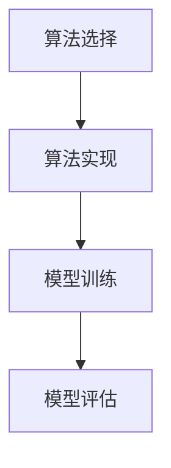

**核心算法原理讲解：** 伪代码

```python
# 伪代码：算法选择与实现
def optimize_price(data, constraints):
    # 选择算法
    algorithm = select_algorithm(constraints)
    
    # 实现算法
    optimized_price = algorithm.optimize(data)
    
    # 模型评估
    evaluate_performance(optimized_price, constraints)
    
    return optimized_price
```

**举例说明：**

某电商平台选择了基于历史数据和实时数据的动态定价策略，并采用贝叶斯优化算法进行价格调整。通过编写Python代码，实现了贝叶斯优化算法的应用，并根据实时数据调整商品价格。

**7.1.3 效果评估与优化**

效果评估与优化是电商价格优化的关键环节，主要包括以下步骤：

1. **效果评估：** 根据实际销售数据，评估价格优化的效果。常用的评估指标包括销售额、利润率、客户满意度等。

2. **反馈调整：** 根据效果评估结果，调整优化策略，包括调整算法参数、修改定价策略等。

3. **持续优化：** 通过持续的数据分析和算法优化，不断提升价格优化的效果。

**核心概念与联系：** Mermaid 流�程图

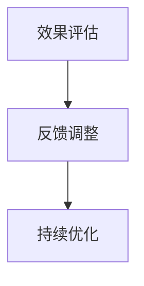

**核心算法原理讲解：** 伪代码

```python
# 伪代码：效果评估与优化
def evaluate_and_optimize(optimized_price, actual_sales):
    # 效果评估
    performance = evaluate_performance(optimized_price, actual_sales)
    
    # 反馈调整
    if performance < threshold:
        adjust_strategy(optimized_price)
    
    # 持续优化
    continue_optimization(optimized_price)
```

**举例说明：**

某电商平台在实施价格优化后，根据实际销售数据发现，销售额和利润率都有所提高，但市场份额尚未达到预期。通过分析，发现优化过程中的定价策略不够精准，提出进一步优化定价策略的建议。根据建议，调整了定价策略，并改进了优化算法，实现了进一步的优化。

#### 7.2 数据分析与处理

数据分析与处理是电商价格优化的核心步骤，通过对大量数据的分析，可以提取出有价值的信息，为价格优化提供依据。以下是数据分析与处理的主要内容：

1. **描述性统计分析：** 对数据的基本情况进行描述性统计分析，包括均值、方差、分布等。

2. **相关性分析：** 分析不同变量之间的相关性，了解变量之间的关系，为算法选择和参数调整提供依据。

3. **时间序列分析：** 对时间序列数据进行分析，了解数据的变化趋势和周期性特征，为动态定价策略提供依据。

4. **机器学习算法：** 使用机器学习算法，如回归分析、分类、聚类等，对数据进行深入分析，提取隐藏的信息。

**核心概念与联系：** Mermaid 流程图

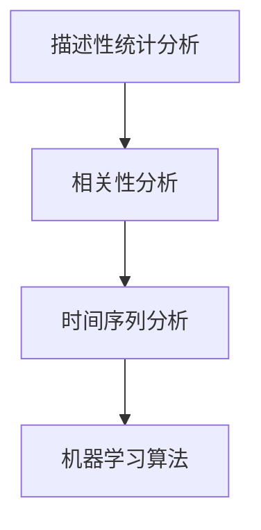

**核心算法原理讲解：** 伪代码

```python
# 伪代码：数据分析与处理
def data_analysis(data):
    # 描述性统计分析
    descriptive_stats = calculate_descriptive_statistics(data)
    
    # 相关性分析
    correlations = calculate_correlations(data)
    
    # 时间序列分析
    time_series = analyze_time_series(data)
    
    # 机器学习算法
    machine_learning_results = apply_machine_learning(data)
    
    return descriptive_stats, correlations, time_series, machine_learning_results
```

**举例说明：**

某电商平台通过对销售数据进行分析，发现销量与价格之间存在明显的负相关关系，同时发现销售数据具有季节性特征。基于这些分析结果，平台决定采用动态定价策略，并根据季节性特征调整价格，以提高销量。

#### 7.3 算法选择与实现

算法选择与实现是电商价格优化的关键环节，根据价格优化的目标和约束条件，选择合适的算法，并实现算法的应用。以下是算法选择与实现的主要内容：

1. **算法选择：** 根据价格优化的目标（如利润最大化、销量提升等）和约束条件（如成本、竞争态势等），选择合适的算法。常用的算法包括线性优化算法、非线性优化算法、模拟退火算法、贝叶斯优化等。

2. **算法实现：** 根据选定的算法，编写代码，实现算法的应用。常用的编程语言包括Python、Java等。

3. **模型训练：** 使用收集到的数据，对选定的算法进行训练，得到最优参数。

4. **模型评估：** 对训练好的模型进行评估，确保其性能满足要求。

**核心概念与联系：** Mermaid 流程图


**核心算法原理讲解：** 伪代码

```python
# 伪代码：算法选择与实现
def optimize_price(data, constraints):
    # 选择算法
    algorithm = select_algorithm(constraints)
    
    # 实现算法
    optimized_price = algorithm.optimize(data)
    
    # 模型评估
    evaluate_performance(optimized_price, constraints)
    
    return optimized_price
```

**举例说明：**

某电商平台选择了基于历史数据和实时数据的动态定价策略，并采用贝叶斯优化算法进行价格调整。通过编写Python代码，实现了贝叶斯优化算法的应用，并根据实时数据调整商品价格。

#### 7.4 效果评估与优化

效果评估与优化是电商价格优化的关键环节，通过对价格优化的效果进行评估，并根据评估结果进行调整，可以不断提升价格优化的效果。以下是效果评估与优化的主要内容：

1. **效果评估：** 根据实际销售数据，评估价格优化的效果。常用的评估指标包括销售额、利润率、客户满意度等。

2. **反馈调整：** 根据效果评估结果，调整优化策略，包括调整算法参数、修改定价策略等。

3. **持续优化：** 通过持续的数据分析和算法优化，不断提升价格优化的效果。

**核心概念与联系：** Mermaid 流程图


**核心算法原理讲解：** 伪代码

```python
# 伪代码：效果评估与优化
def evaluate_and_optimize(optimized_price, actual_sales):
    # 效果评估
    performance = evaluate

