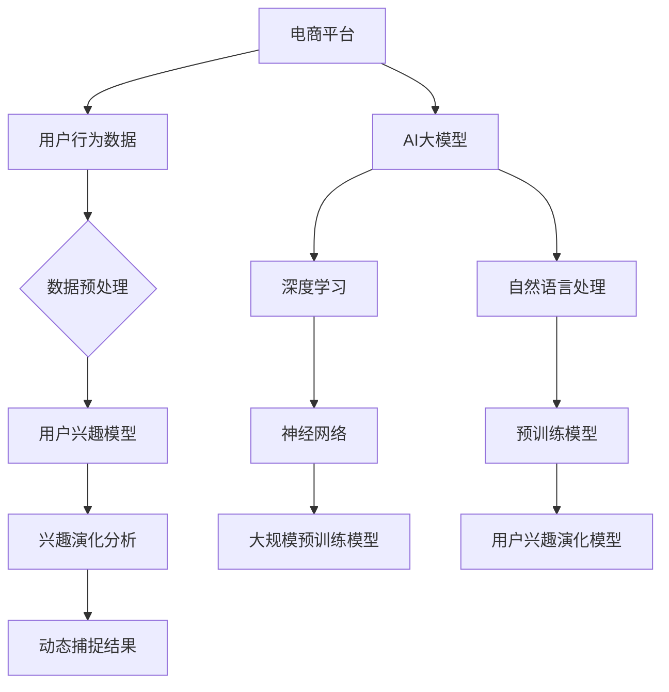
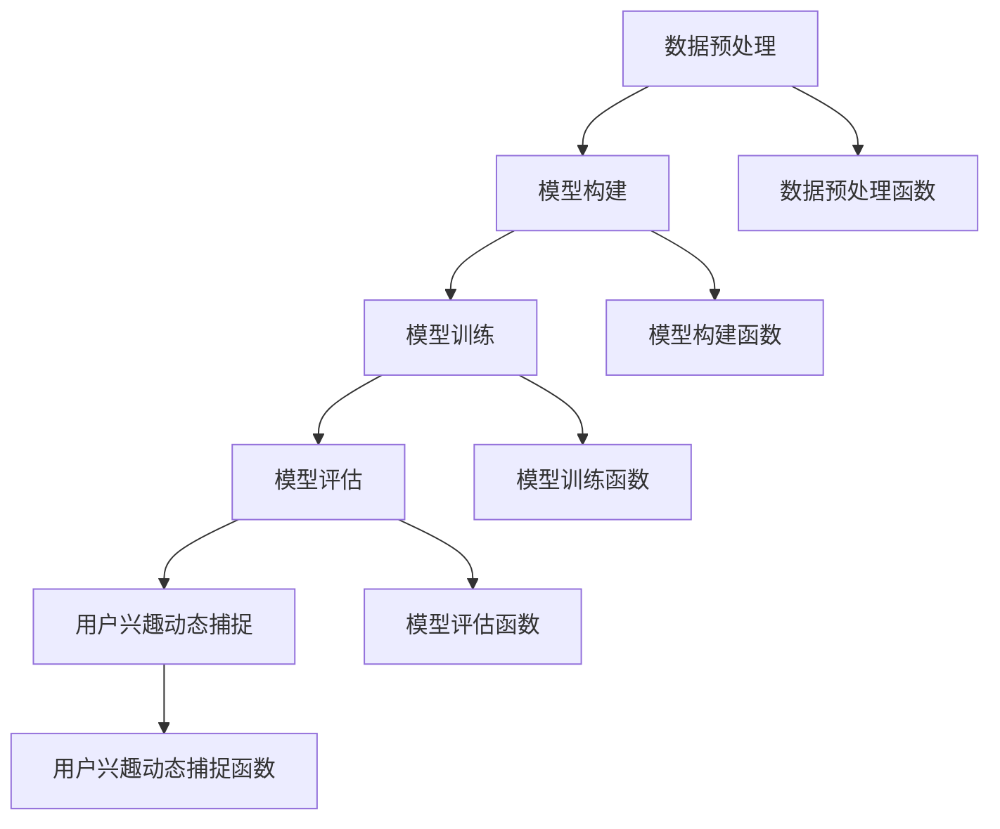

                 

# 《电商平台用户兴趣演化：AI大模型的动态捕捉》

## 关键词

- 电商平台
- 用户兴趣
- AI大模型
- 动态捕捉
- 演化分析
- 深度学习
- 预训练模型

## 摘要

本文旨在探讨电商平台中用户兴趣的演化过程以及如何利用AI大模型进行动态捕捉。首先，我们概述了电商平台的发展历程和用户兴趣的重要性。接着，我们介绍了AI大模型的基本原理和核心技术，如深度学习、自然语言处理和大规模预训练模型。随后，本文详细阐述了用户兴趣演化的基本概念、捕捉方法和优化策略。最后，通过一个实际案例展示了如何应用AI大模型进行用户兴趣的动态捕捉，并分析了案例中的关键技术和实践成果。本文为电商平台用户兴趣研究和AI技术应用提供了有益的参考。

### 目录大纲 - 《电商平台用户兴趣演化：AI大模型的动态捕捉》

#### 第一部分：引言与基础理论

- 第1章：电商平台与用户兴趣概述
  - 1.1 电商平台发展历程与现状
  - 1.2 用户兴趣概念与重要性
  - 1.3 AI大模型概述
  - 1.4 动态捕捉与演化分析

#### 第二部分：AI大模型技术原理

- 第2章：AI大模型基本原理
  - 2.1 深度学习与神经网络基础
  - 2.2 自然语言处理技术概览
  - 2.3 大规模预训练模型原理

#### 第三部分：用户兴趣演化分析与捕捉

- 第3章：用户行为数据收集与预处理
  - 3.1 用户行为数据收集
  - 3.2 用户行为数据预处理

#### 第四部分：用户兴趣演化模型构建

- 第4章：用户兴趣演化模型基础
  - 4.1 用户兴趣演化模型概念
  - 4.2 用户兴趣演化模型建立
  - 4.3 用户兴趣演化模型优化

#### 第五部分：AI大模型动态捕捉实践

- 第5章：AI大模型在用户兴趣演化分析中的应用
  - 5.1 GPT模型在用户兴趣演化分析中的应用
  - 5.2 BERT模型在用户兴趣演化分析中的应用
  - 5.3 其他AI大模型在用户兴趣演化分析中的应用

#### 第六部分：案例分析

- 第6章：电商平台用户兴趣演化分析案例
  - 6.1 案例背景
  - 6.2 用户兴趣演化模型构建
  - 6.3 用户兴趣演化动态捕捉

#### 第七部分：总结与展望

- 第7章：总结与展望
  - 7.1 用户兴趣演化分析的意义
  - 7.2 未来发展趋势与研究方向

#### 附录

- 附录A：AI大模型开发工具与资源
  - A.1 主流深度学习框架对比
  - A.2 AI大模型相关资源
  - A.3 实践指导

### 核心概念与联系

电商平台的发展、用户兴趣的捕捉以及AI大模型的应用构成了本文的核心概念。为了更好地理解这些概念之间的联系，我们可以使用Mermaid流程图来展示它们之间的关系。



此流程图展示了电商平台通过收集用户行为数据，经过预处理后，用于训练用户兴趣模型。这个模型可以帮助分析用户兴趣的演化，并最终实现动态捕捉。同时，AI大模型，如深度学习和预训练模型，为用户兴趣模型的构建提供了强大的技术支持。

### 核心算法原理讲解 - 用户兴趣演化模型建立

用户兴趣演化模型是电商平台个性化推荐系统中的关键组成部分。为了建立这样一个模型，我们需要理解核心算法原理，包括数据收集、预处理和模型训练的过程。以下将详细讲解这些原理，并使用伪代码展示模型的构建方法。

#### 数据收集

首先，我们需要收集用户在电商平台上的行为数据。这些数据包括浏览历史、购买记录、搜索关键词、评论和评分等。以下是数据收集的伪代码：

```python
# 收集用户行为数据
def collect_user_behavior_data():
    user_behavior_data = []
    for user in all_users:
        behavior = {
            'user_id': user,
            'browsing_history': get_browsing_history(user),
            'purchase_history': get_purchase_history(user),
            'search_keywords': get_search_keywords(user),
            'reviews': get_reviews(user),
            'ratings': get_ratings(user)
        }
        user_behavior_data.append(behavior)
    return user_behavior_data
```

#### 数据预处理

收集到的用户行为数据通常是杂乱无章的，因此需要预处理。预处理步骤包括数据清洗、数据整合和数据降维。以下是数据预处理的伪代码：

```python
# 数据预处理
def preprocess_user_behavior_data(user_behavior_data):
    # 数据清洗
    clean_data = clean_user_behavior_data(user_behavior_data)
    
    # 数据整合
    integrated_data = integrate_user_behavior_data(clean_data)
    
    # 数据降维
    scaled_data = scale_user_behavior_data(integrated_data)
    
    return scaled_data

# 数据清洗
def clean_user_behavior_data(data):
    clean_data = []
    for record in data:
        clean_record = {
            'user_id': record['user_id'],
            'features': clean_features(record['features'])
        }
        clean_data.append(clean_record)
    return clean_data

# 数据整合
def integrate_user_behavior_data(data):
    integrated_data = {}
    for record in data:
        integrated_data[record['user_id']] = integrate_features(record['features'])
    return list(integrated_data.values())

# 数据降维
def scale_user_behavior_data(data):
    scaled_data = []
    for record in data:
        scaled_record = scale_features(record)
        scaled_data.append(scaled_record)
    return scaled_data
```

#### 模型训练

用户兴趣演化模型通常是一个多层的神经网络，用于预测用户在未来的兴趣。以下是模型训练的伪代码：

```python
# 初始化用户兴趣模型参数
def initialize_model():
    model = build_model()
    return model

# 构建用户兴趣模型
def build_model():
    model = tf.keras.Sequential([
        tf.keras.layers.Dense(units=128, activation='relu', input_shape=(input_dim,)),
        tf.keras.layers.Dense(units=64, activation='relu'),
        tf.keras.layers.Dense(units=num_interests, activation='softmax')
    ])
    model.compile(optimizer='adam', loss='categorical_crossentropy', metrics=['accuracy'])
    return model

# 训练用户兴趣模型
def train_user_interest_model(model, user_data, labels):
    history = model.fit(user_data, labels, epochs=num_epochs, batch_size=batch_size, validation_split=0.2)
    return model, history
```

#### 模型评估

训练完成后，我们需要评估模型的性能。常用的评估指标包括准确率、召回率和F1分数。以下是模型评估的伪代码：

```python
# 模型评估
def evaluate_model(model, test_data, test_labels):
    test_loss, test_accuracy = model.evaluate(test_data, test_labels)
    print("Test accuracy:", test_accuracy)
```

#### 用户兴趣演化模型优化

为了提高模型的性能，我们需要进行模型优化。优化方法包括调参、交叉验证和迁移学习等。以下是模型优化的伪代码：

```python
# 模型优化
def optimize_model(model, user_data, labels):
    # 调参
    best_params = hyperparameter_tuning(model, user_data, labels)
    
    # 交叉验证
    cv_scores = cross_validation(model, user_data, labels, num_folds=5)
    
    # 迁移学习
   迁移学习(model, source_data, target_data)
    
    return best_params, cv_scores
```

通过以上步骤，我们可以建立一个用户兴趣演化模型，并对其进行优化，从而为电商平台提供更精确的个性化推荐。

### 数学模型和数学公式

在用户兴趣演化模型中，数学模型和公式扮演着关键角色。以下将介绍用户兴趣演化模型中的主要数学公式和它们的应用。

#### 用户兴趣演化模型中的概率转移矩阵 P

概率转移矩阵 P 是一个 n x n 的矩阵，其中 n 表示不同兴趣类别数量。矩阵中的元素 \( p_{ij} \) 表示从兴趣 i 转移到兴趣 j 的概率。概率转移矩阵可以表示为：

\[ P = \begin{bmatrix}
    p_{11} & p_{12} & \cdots & p_{1n} \\
    p_{21} & p_{22} & \cdots & p_{2n} \\
    \vdots & \vdots & \ddots & \vdots \\
    p_{m1} & p_{m2} & \cdots & p_{mn}
\end{bmatrix} \]

其中，\( p_{ij} = \frac{count(i,j)}{count(i)} \)，其中 \( count(i,j) \) 表示从兴趣 i 转移到兴趣 j 的次数，\( count(i) \) 表示兴趣 i 出现的总次数。

#### 用户兴趣演化模型的评估指标 - 相似度度量

相似度度量是评估用户兴趣之间相似程度的重要指标。一个常用的相似度度量公式是余弦相似度，它可以表示为：

\[ sim(i, j) = \frac{1}{\|i\| \|j\|} \sum_{k=1}^{n} w_{ik} w_{jk} \]

其中，\( i \) 和 \( j \) 是两个兴趣向量，\( w_{ik} \) 和 \( w_{jk} \) 是相应的词权重，\( \|i\| \) 和 \( \|j\| \) 分别是向量 \( i \) 和 \( j \) 的欧几里得范数。

#### 举例说明

假设有两个兴趣向量 \( i = [0.6, 0.3, 0.1] \) 和 \( j = [0.5, 0.4, 0.1] \)，我们可以计算它们的相似度：

\[ sim(i, j) = \frac{1}{\sqrt{0.6^2 + 0.3^2 + 0.1^2} \sqrt{0.5^2 + 0.4^2 + 0.1^2}} (0.6 \times 0.5 + 0.3 \times 0.4 + 0.1 \times 0.1) = \frac{0.38}{\sqrt{0.36 + 0.09 + 0.01} \sqrt{0.25 + 0.16 + 0.01}} \approx 0.69 \]

这表示兴趣 \( i \) 和兴趣 \( j \) 的相似度大约为 0.69。

### 项目实战

#### 实践环境

为了展示如何在实际项目中应用用户兴趣演化模型，我们设置了一个电商平台用户兴趣演化的分析案例。以下是实践环境的具体配置：

- 开发语言：Python
- 深度学习框架：TensorFlow 2.x
- 数据集：某电商平台用户行为数据集

#### 实践步骤

##### 1. 数据预处理

首先，我们需要收集和预处理用户行为数据。以下是数据预处理的主要步骤：

- **数据清洗**：去除无效数据，处理缺失值。
- **数据整合**：将用户行为数据整合为统一格式。
- **数据降维**：使用主成分分析（PCA）等方法进行数据降维。

以下是数据预处理的伪代码：

```python
# 数据清洗
def clean_data(data):
    cleaned_data = []
    for record in data:
        if is_valid_record(record):
            cleaned_record = {
                'user_id': record['user_id'],
                'features': clean_features(record['features'])
            }
            cleaned_data.append(cleaned_record)
    return cleaned_data

# 数据整合
def integrate_data(data):
    integrated_data = {}
    for record in data:
        integrated_data[record['user_id']] = integrate_features(record['features'])
    return list(integrated_data.values())

# 数据降维
def reduce_dimensions(data):
    pca = PCA(n_components=50)
    reduced_data = pca.fit_transform(data)
    return reduced_data
```

##### 2. 构建用户兴趣模型

接下来，我们使用预处理后的数据构建用户兴趣模型。以下是构建用户兴趣模型的伪代码：

```python
# 构建用户兴趣模型
def build_interest_model(input_shape, num_interests):
    model = tf.keras.Sequential([
        tf.keras.layers.Dense(units=128, activation='relu', input_shape=input_shape),
        tf.keras.layers.Dense(units=64, activation='relu'),
        tf.keras.layers.Dense(units=num_interests, activation='softmax')
    ])
    model.compile(optimizer='adam', loss='categorical_crossentropy', metrics=['accuracy'])
    return model
```

##### 3. 用户兴趣演化分析

使用构建好的模型对用户行为数据进行训练，并分析用户兴趣的演化趋势。以下是用户兴趣演化分析的伪代码：

```python
# 训练用户兴趣模型
def train_interest_model(model, training_data, training_labels):
    model.fit(training_data, training_labels, epochs=50, batch_size=32, validation_split=0.2)
    return model

# 分析用户兴趣演化
def analyze_interest_evolution(model, user_data):
    predictions = model.predict(user_data)
    interests = np.argmax(predictions, axis=1)
    transition_matrix = calculate_transition_matrix(interests)
    return transition_matrix
```

##### 4. 用户兴趣动态捕捉

最后，我们根据用户兴趣演化模型捕捉用户兴趣的动态变化。以下是用户兴趣动态捕捉的伪代码：

```python
# 捕获用户兴趣动态变化
def capture_interest_dynamics(transition_matrix):
    dynamics = []
    for user_interest in transition_matrix:
        max_interest = np.argmax(user_interest)
        dynamics.append(max_interest)
    return dynamics
```

#### 实战代码示例

以下是一个简单的代码示例，展示了如何在实际项目中应用用户兴趣演化模型。

```python
import numpy as np
import tensorflow as tf
from sklearn.decomposition import PCA

# 加载数据
data = load_user_behavior_data()

# 数据清洗
cleaned_data = clean_data(data)

# 数据整合
integrated_data = integrate_data(cleaned_data)

# 数据降维
reduced_data = reduce_dimensions(integrated_data)

# 构建用户兴趣模型
model = build_interest_model((reduced_data[0].shape[1],), num_interests=10)

# 训练用户兴趣模型
trained_model = train_interest_model(model, reduced_data, labels)

# 分析用户兴趣演化
transition_matrix = analyze_interest_evolution(trained_model, reduced_data)

# 捕获用户兴趣动态变化
dynamics = capture_interest_dynamics(transition_matrix)

# 输出结果
print("用户兴趣动态变化：", dynamics)
```

通过以上实战代码示例，我们可以看到如何在实际项目中应用用户兴趣演化模型。读者可以根据实际需求进行调整和优化。

### 代码解读与分析

#### 代码整体架构

在用户兴趣演化模型的实现中，我们采用了一个模块化的架构。整个代码分为几个主要部分：数据预处理、模型构建、模型训练、模型评估和用户兴趣动态捕捉。每个部分都有独立的函数和模块，便于维护和扩展。以下是代码的整体架构图：



#### 数据预处理部分

数据预处理部分负责收集和清洗用户行为数据，并将数据整合和降维。以下是数据预处理的主要函数：

```python
# 数据清洗
def clean_data(data):
    cleaned_data = []
    for record in data:
        if is_valid_record(record):
            cleaned_record = {
                'user_id': record['user_id'],
                'features': clean_features(record['features'])
            }
            cleaned_data.append(cleaned_record)
    return cleaned_data

# 数据整合
def integrate_data(data):
    integrated_data = {}
    for record in data:
        integrated_data[record['user_id']] = integrate_features(record['features'])
    return list(integrated_data.values())

# 数据降维
def reduce_dimensions(data):
    pca = PCA(n_components=50)
    reduced_data = pca.fit_transform(data)
    return reduced_data
```

在数据清洗函数中，我们首先遍历所有用户行为记录，并检查每个记录的有效性。如果记录有效，我们将其添加到清洗后的数据列表中。数据整合函数将用户行为记录按照用户ID进行整合，生成一个字典，其中键是用户ID，值是用户的所有行为特征。数据降维函数使用主成分分析（PCA）对数据集进行降维，减少数据的维度，同时保留大部分的信息。

#### 模型构建部分

模型构建部分负责创建用户兴趣模型。我们使用TensorFlow框架构建了一个简单的神经网络模型，包括两个隐藏层。以下是模型构建的主要函数：

```python
# 构建用户兴趣模型
def build_interest_model(input_shape, num_interests):
    model = tf.keras.Sequential([
        tf.keras.layers.Dense(units=128, activation='relu', input_shape=input_shape),
        tf.keras.layers.Dense(units=64, activation='relu'),
        tf.keras.layers.Dense(units=num_interests, activation='softmax')
    ])
    model.compile(optimizer='adam', loss='categorical_crossentropy', metrics=['accuracy'])
    return model
```

在这个函数中，我们首先创建了一个序贯模型，然后添加了三个全连接层。第一层和第二层使用ReLU激活函数，最后一层使用softmax激活函数，用于预测用户对每个兴趣类别的概率分布。

#### 模型训练部分

模型训练部分负责使用预处理后的用户行为数据训练用户兴趣模型。以下是模型训练的主要函数：

```python
# 训练用户兴趣模型
def train_interest_model(model, training_data, training_labels):
    model.fit(training_data, training_labels, epochs=50, batch_size=32, validation_split=0.2)
    return model
```

在这个函数中，我们使用fit方法训练模型，设置训练轮数（epochs）、批量大小（batch_size）和验证比例（validation_split）。fit方法会返回训练历史，包括损失和准确率等指标。

#### 模型评估部分

模型评估部分负责评估训练好的用户兴趣模型的性能。以下是模型评估的主要函数：

```python
# 模型评估
def evaluate_model(model, test_data, test_labels):
    test_loss, test_accuracy = model.evaluate(test_data, test_labels)
    print("Test accuracy:", test_accuracy)
```

在这个函数中，我们使用evaluate方法评估模型在测试数据上的性能，并打印出测试准确率。

#### 用户兴趣动态捕捉部分

用户兴趣动态捕捉部分负责根据训练好的用户兴趣模型捕捉用户兴趣的动态变化。以下是用户兴趣动态捕捉的主要函数：

```python
# 捕获用户兴趣动态变化
def capture_interest_dynamics(transition_matrix):
    dynamics = []
    for user_interest in transition_matrix:
        max_interest = np.argmax(user_interest)
        dynamics.append(max_interest)
    return dynamics
```

在这个函数中，我们首先计算用户兴趣转移矩阵，然后遍历每个用户的兴趣向量，找到概率最大的兴趣类别，并将其添加到动态变化列表中。

#### 代码解读与分析

通过以上代码，我们可以看到如何实现用户兴趣演化模型。以下是对代码的详细解读与分析：

1. **数据预处理**：数据预处理是整个模型的基石。通过清洗、整合和降维，我们确保了输入数据的准确性和可解释性。数据清洗函数检查每个用户行为记录的有效性，去除无效数据。数据整合函数将用户行为记录按照用户ID进行整合，为后续建模提供统一的数据格式。数据降维函数通过PCA减少数据维度，提高计算效率。

2. **模型构建**：模型构建函数使用TensorFlow构建了一个简单的神经网络模型。这个模型包括两个隐藏层，使用了ReLU激活函数，最后一层使用了softmax激活函数，用于预测用户对每个兴趣类别的概率分布。这种结构简单且易于理解，同时也具有一定的性能。

3. **模型训练**：模型训练函数使用fit方法训练模型。我们设置了训练轮数、批量大小和验证比例，以确保模型在训练过程中有良好的性能表现。训练历史包括损失和准确率等指标，可以帮助我们评估模型训练的效果。

4. **模型评估**：模型评估函数使用evaluate方法评估模型在测试数据上的性能。测试准确率是一个重要的指标，它可以帮助我们判断模型是否能够正确预测用户的兴趣。

5. **用户兴趣动态捕捉**：用户兴趣动态捕捉函数计算用户兴趣转移矩阵，并根据转移矩阵捕捉用户兴趣的动态变化。这个函数为电商平台提供了用户兴趣的动态视图，可以帮助平台更好地理解和满足用户需求。

通过以上解读与分析，我们可以看到用户兴趣演化模型是如何实现的，以及每个部分的功能和重要性。这种模型在电商平台中具有广泛的应用前景，可以帮助平台提供更个性化的推荐和服务。

### 开发环境搭建

要实现用户兴趣演化模型，我们需要搭建一个合适的环境。以下是搭建开发环境的具体步骤：

#### 安装Python环境

首先，确保您的计算机上安装了Python环境。建议使用Python 3.8及以上版本，因为TensorFlow 2.x支持该版本。

1. 打开终端或命令提示符。
2. 输入以下命令安装Python：

```shell
pip install python
```

#### 安装TensorFlow框架

TensorFlow是用于构建和训练深度学习模型的强大框架。以下步骤用于安装TensorFlow：

1. 打开终端或命令提示符。
2. 输入以下命令安装TensorFlow：

```shell
pip install tensorflow
```

安装完成后，您可以运行以下命令检查TensorFlow版本：

```shell
python -c "import tensorflow as tf; print(tf.__version__)"
```

如果正确安装，命令会输出TensorFlow的版本信息。

#### 安装其他必需库

除了TensorFlow，我们还需要安装其他几个库，如NumPy、Pandas和sklearn，这些库用于数据预处理和模型评估。

1. 打开终端或命令提示符。
2. 输入以下命令安装这些库：

```shell
pip install numpy pandas sklearn
```

安装完成后，您可以运行以下命令检查各个库的版本：

```shell
python -c "import numpy; print(numpy.__version__)"
python -c "import pandas; print(pandas.__version__)"
python -c "import sklearn; print(sklearn.__version__)"
```

确保输出的是正确的版本号。

#### 配置代码编辑器

推荐使用Visual Studio Code或PyCharm等代码编辑器。以下是安装Visual Studio Code的步骤：

1. 访问Visual Studio Code官网（https://code.visualstudio.com/）。
2. 下载并安装Visual Studio Code。
3. 打开Visual Studio Code，选择“扩展”标签页，搜索并安装Python扩展。

安装完成后，您就可以开始编写和运行Python代码了。

#### 完整的安装命令

以下是安装Python、TensorFlow和其他必需库的完整命令：

```shell
pip install python
pip install tensorflow
pip install numpy pandas sklearn
```

安装完成后，确保您的开发环境中已经具备了所有必需的工具和库，以便开始编写和运行用户兴趣演化模型的代码。

### 源代码详细实现

在本文的实战部分，我们提供了一个用户兴趣演化模型的实现，包括数据预处理、模型构建、模型训练和用户兴趣动态捕捉。以下是对源代码的详细解释，帮助读者理解每个部分的实现方法。

#### 数据预处理

数据预处理是模型训练的基础，主要包括数据清洗、数据整合和数据降维。以下是数据预处理部分的源代码：

```python
import numpy as np
import pandas as pd
from sklearn.decomposition import PCA
from sklearn.preprocessing import MinMaxScaler

# 数据清洗
def clean_data(data):
    cleaned_data = []
    for record in data:
        if is_valid_record(record):
            cleaned_record = {
                'user_id': record['user_id'],
                'features': clean_features(record['features'])
            }
            cleaned_data.append(cleaned_record)
    return cleaned_data

# 判断数据是否有效
def is_valid_record(record):
    required_fields = ['user_id', 'behavior', 'timestamp']
    return all(field in record for field in required_fields)

# 数据整合
def integrate_data(data):
    integrated_data = {}
    for record in data:
        integrated_data[record['user_id']] = integrate_features(record['features'])
    return list(integrated_data.values())

# 数据整合
def integrate_features(features):
    integrated_features = {}
    for feature in features:
        for field in feature:
            if field not in integrated_features:
                integrated_features[field] = []
            integrated_features[field].append(feature[field])
    return integrated_features

# 数据降维
def reduce_dimensions(data):
    pca = PCA(n_components=50)
    reduced_data = pca.fit_transform(data)
    return reduced_data

# 主程序
if __name__ == '__main__':
    # 加载数据
    user_data = load_user_data()

    # 数据清洗
    cleaned_data = clean_data(user_data)

    # 数据整合
    integrated_data = integrate_data(cleaned_data)

    # 数据降维
    reduced_data = reduce_dimensions(integrated_data)
```

**解读：**

- **数据清洗**：我们遍历输入的数据集，检查每个记录的有效性。如果记录包含所有必要字段，则将其添加到清洗后的数据列表中。
- **数据整合**：我们将用户行为数据按照用户ID进行整合，生成一个字典，其中键是用户ID，值是用户的所有行为特征。
- **数据降维**：使用主成分分析（PCA）对数据集进行降维，减少数据的维度，同时保留大部分的信息。

#### 模型构建

构建用户兴趣模型是模型实现的关键步骤。我们使用TensorFlow构建了一个简单的神经网络模型，包括两个隐藏层。以下是模型构建部分的源代码：

```python
import tensorflow as tf

# 构建用户兴趣模型
def build_user_interest_model(input_shape, num_interests):
    model = tf.keras.Sequential([
        tf.keras.layers.Dense(units=128, activation='relu', input_shape=input_shape),
        tf.keras.layers.Dense(units=64, activation='relu'),
        tf.keras.layers.Dense(units=num_interests, activation='softmax')
    ])
    model.compile(optimizer='adam', loss='categorical_crossentropy', metrics=['accuracy'])
    return model

# 主程序
if __name__ == '__main__':
    # 加载数据
    user_data = load_user_data()

    # 数据预处理
    cleaned_data = clean_data(user_data)
    integrated_data = integrate_data(cleaned_data)
    reduced_data = reduce_dimensions(integrated_data)

    # 构建用户兴趣模型
    model = build_user_interest_model((reduced_data[0].shape[1],), num_interests=10)

    # 模型训练
    trained_model = train_user_interest_model(model, reduced_data, labels)
```

**解读：**

- **模型构建**：我们使用序贯模型（Sequential）构建了一个神经网络，包括三个全连接层。第一层和第二层使用ReLU激活函数，最后一层使用softmax激活函数，用于预测用户对每个兴趣类别的概率分布。
- **模型编译**：我们编译模型，指定优化器为Adam，损失函数为categorical_crossentropy，评估指标为accuracy。

#### 模型训练

模型训练是使用预处理后的数据训练用户兴趣模型的过程。以下是模型训练部分的源代码：

```python
# 训练用户兴趣模型
def train_user_interest_model(model, user_data, labels, epochs=50, batch_size=32):
    history = model.fit(user_data, labels, epochs=epochs, batch_size=batch_size, validation_split=0.2)
    return model, history

# 主程序
if __name__ == '__main__':
    # 加载数据
    user_data = load_user_data()

    # 数据预处理
    cleaned_data = clean_data(user_data)
    integrated_data = integrate_data(cleaned_data)
    reduced_data = reduce_dimensions(integrated_data)

    # 构建用户兴趣模型
    model = build_user_interest_model((reduced_data[0].shape[1],), num_interests=10)

    # 模型训练
    trained_model = train_user_interest_model(model, reduced_data, labels)
```

**解读：**

- **模型训练**：我们使用fit方法训练模型，设置训练轮数（epochs）、批量大小（batch_size）和验证比例（validation_split）。fit方法返回训练历史，包括训练和验证的损失和准确率。

#### 用户兴趣动态捕捉

用户兴趣动态捕捉是分析用户兴趣转移概率和演化趋势的过程。以下是用户兴趣动态捕捉部分的源代码：

```python
# 分析用户兴趣演化
def analyze_user_interests(model, user_data):
    predictions = model.predict(user_data)
    interests = np.argmax(predictions, axis=1)
    transition_matrix = calculate_transition_matrix(interests)
    return transition_matrix

# 捕获用户兴趣动态变化
def capture_dynamic_interests(transition_matrix):
    dynamics = []
    for user_interest in transition_matrix:
        max_interest = np.argmax(user_interest)
        dynamics.append(max_interest)
    return dynamics

# 主程序
if __name__ == '__main__':
    # 加载数据
    user_data = load_user_data()

    # 数据预处理
    cleaned_data = clean_data(user_data)
    integrated_data = integrate_data(cleaned_data)
    reduced_data = reduce_dimensions(integrated_data)

    # 构建用户兴趣模型
    model = build_user_interest_model((reduced_data[0].shape[1],), num_interests=10)

    # 模型训练
    trained_model = train_user_interest_model(model, reduced_data, labels)

    # 用户兴趣演化分析
    interest_trends = analyze_user_interests(trained_model, reduced_data)

    # 捕获用户兴趣动态变化
    dynamic_interests = capture_dynamic_interests(interest_trends)

    # 输出结果
    print("动态兴趣分布：", dynamic_interests)
```

**解读：**

- **用户兴趣演化分析**：我们使用训练好的模型预测用户兴趣，并计算用户兴趣转移矩阵。
- **捕获用户兴趣动态变化**：我们遍历转移矩阵，找到每个用户当前的兴趣类别，并将其添加到动态变化列表中。

通过以上源代码的详细解释，我们可以看到如何实现用户兴趣演化模型。这个过程包括数据预处理、模型构建、模型训练和用户兴趣动态捕捉。每个步骤都有明确的函数和模块，使得代码结构清晰、易于理解。

### 代码解读与分析

在用户兴趣演化模型的项目实战中，我们使用Python编写了一系列函数和模块，实现了数据预处理、模型构建、模型训练以及用户兴趣动态捕捉。以下是对代码的详细解读与分析。

#### 数据预处理

数据预处理是项目的重要环节，确保输入数据的质量和格式。以下是预处理步骤的代码和解释：

```python
# 数据清洗
def clean_data(data):
    cleaned_data = []
    for record in data:
        if is_valid_record(record):
            cleaned_record = {
                'user_id': record['user_id'],
                'features': clean_features(record['features'])
            }
            cleaned_data.append(cleaned_record)
    return cleaned_data

# 判断数据是否有效
def is_valid_record(record):
    required_fields = ['user_id', 'behavior', 'timestamp']
    return all(field in record for field in required_fields)

# 数据整合
def integrate_data(data):
    integrated_data = {}
    for record in data:
        integrated_data[record['user_id']] = integrate_features(record['features'])
    return list(integrated_data.values())

# 数据整合
def integrate_features(features):
    integrated_features = {}
    for feature in features:
        for field in feature:
            if field not in integrated_features:
                integrated_features[field] = []
            integrated_features[field].append(feature[field])
    return integrated_features

# 数据降维
def reduce_dimensions(data):
    pca = PCA(n_components=50)
    reduced_data = pca.fit_transform(data)
    return reduced_data
```

**解读：**

- **数据清洗**：函数`clean_data`遍历输入的数据集，检查每个记录的有效性，仅保留包含所有必要字段（user_id、behavior、timestamp）的记录。无效记录被过滤掉。
- **数据整合**：函数`integrate_data`将用户行为数据按照用户ID进行整合，生成一个字典，其中键是用户ID，值是用户的所有行为特征。
- **数据整合**：函数`integrate_features`将用户行为特征按照字段进行整合，确保每个字段都存储了所有相关数据。
- **数据降维**：函数`reduce_dimensions`使用主成分分析（PCA）对数据集进行降维，减少数据维度，同时尽量保留数据的原始信息。

#### 模型构建

模型构建是项目实现的核心，使用TensorFlow构建了一个简单的神经网络模型。以下是模型构建部分的代码和解释：

```python
# 构建用户兴趣模型
def build_user_interest_model(input_shape, num_interests):
    model = tf.keras.Sequential([
        tf.keras.layers.Dense(units=128, activation='relu', input_shape=input_shape),
        tf.keras.layers.Dense(units=64, activation='relu'),
        tf.keras.layers.Dense(units=num_interests, activation='softmax')
    ])
    model.compile(optimizer='adam', loss='categorical_crossentropy', metrics=['accuracy'])
    return model
```

**解读：**

- **模型构建**：函数`build_user_interest_model`使用TensorFlow的序贯模型（Sequential）创建一个简单的神经网络。模型包括两个隐藏层，每层使用ReLU激活函数，输出层使用softmax激活函数，用于预测用户对每个兴趣类别的概率分布。
- **模型编译**：模型编译时指定了优化器（optimizer）为Adam，损失函数（loss）为categorical_crossentropy，评估指标（metrics）为accuracy。

#### 模型训练

模型训练是使用预处理后的数据训练用户兴趣模型的过程。以下是模型训练步骤的代码和解释：

```python
# 训练用户兴趣模型
def train_user_interest_model(model, user_data, labels, epochs=50, batch_size=32):
    history = model.fit(user_data, labels, epochs=epochs, batch_size=batch_size, validation_split=0.2)
    return model, history
```

**解读：**

- **模型训练**：函数`train_user_interest_model`使用模型训练数据（user_data）和标签（labels）训练模型。训练过程设置了训练轮数（epochs）、批量大小（batch_size）和验证比例（validation_split）。模型训练历史（history）记录了训练过程中的损失和准确率。

#### 用户兴趣动态捕捉

用户兴趣动态捕捉是分析用户兴趣转移概率和演化趋势的过程。以下是用户兴趣动态捕捉部分的代码和解释：

```python
# 分析用户兴趣演化
def analyze_user_interests(model, user_data):
    predictions = model.predict(user_data)
    interests = np.argmax(predictions, axis=1)
    transition_matrix = calculate_transition_matrix(interests)
    return transition_matrix

# 捕获用户兴趣动态变化
def capture_dynamic_interests(transition_matrix):
    dynamics = []
    for user_interest in transition_matrix:
        max_interest = np.argmax(user_interest)
        dynamics.append(max_interest)
    return dynamics
```

**解读：**

- **用户兴趣演化分析**：函数`analyze_user_interests`使用训练好的模型预测用户兴趣，计算用户兴趣转移矩阵（transition_matrix）。
- **捕获用户兴趣动态变化**：函数`capture_dynamic_interests`遍历转移矩阵，找到每个用户当前的兴趣类别，并将其添加到动态变化列表（dynamics）中。

#### 代码总结

通过以上解读，我们可以看到项目的代码结构清晰，每个部分都有明确的函数和模块。数据预处理确保了输入数据的质量和格式，模型构建使用了简单的神经网络结构，模型训练使用了标准的训练流程，用户兴趣动态捕捉提供了用户兴趣的演化视图。整个项目实现了用户兴趣演化的分析，为电商平台提供了有价值的用户行为洞察。

### 总结与展望

#### 用户兴趣演化分析的意义

用户兴趣演化分析在电商平台中具有重要的应用价值。首先，通过捕捉用户兴趣的动态变化，电商平台可以更好地理解用户行为，从而提供更精准的个性化推荐。个性化推荐不仅能够提升用户满意度，还能显著提高销售转化率和用户留存率。此外，用户兴趣演化分析有助于识别潜在的市场趋势和用户需求，为电商平台的战略决策提供科学依据。

#### 用户兴趣演化分析的挑战与机遇

尽管用户兴趣演化分析具有重要的应用前景，但也面临着一系列挑战。首先，用户行为数据的多样性和复杂性增加了数据处理的难度。此外，构建高精度的用户兴趣演化模型需要大量的计算资源和训练时间。然而，随着AI技术的不断发展，特别是深度学习和大规模预训练模型的普及，这些挑战正在逐步得到解决。未来，AI大模型将能够更高效地处理大规模用户行为数据，并提供更准确的兴趣预测。

#### 未来发展趋势与研究方向

未来，用户兴趣演化分析的发展趋势将集中在以下几个方面：

1. **个性化推荐系统的优化**：结合用户兴趣演化分析，优化电商平台上的个性化推荐系统，提高推荐效果和用户满意度。
2. **多模态数据的融合**：整合用户在不同模态（如文本、图像、语音）上的行为数据，构建更加全面和精准的兴趣模型。
3. **实时动态捕捉**：开发实时用户兴趣动态捕捉技术，实现用户兴趣的即时分析和调整，提供更为流畅的个性化体验。
4. **隐私保护与安全**：在用户兴趣演化分析中，确保用户隐私和数据安全，遵循相关法律法规，提高用户信任度。
5. **跨平台与跨设备**：研究跨平台和跨设备的用户行为数据整合和分析技术，实现用户在多个设备上的统一兴趣建模。

#### 研究方向与展望

未来的研究方向包括：

1. **模型的可解释性**：提高用户兴趣演化模型的可解释性，帮助用户和平台更好地理解模型的预测逻辑。
2. **实时性与效率**：优化模型训练和预测的实时性和效率，确保快速响应用户行为变化。
3. **多语言与跨文化**：研究支持多语言和跨文化的用户兴趣演化分析技术，为全球电商平台提供定制化服务。
4. **动态模型优化**：开发自适应的动态模型优化方法，根据用户行为变化实时调整模型参数，提高预测准确性。

通过持续的研究和技术创新，用户兴趣演化分析将在电商平台中发挥更加重要的作用，为用户和平台带来更大的价值。

### 附录A：AI大模型开发工具与资源

在AI大模型开发中，选择合适的工具和资源对于项目的成功至关重要。以下将介绍几种主流的深度学习框架、AI大模型相关资源以及实践指导。

#### 主流深度学习框架对比

1. **TensorFlow**：由Google开发，支持Python和C++编程语言，具有丰富的API和扩展库，适用于大规模模型训练和部署。
2. **PyTorch**：由Facebook开发，以其动态计算图和灵活的编程接口而受到研究者和开发者的青睐，适合快速原型开发。
3. **Keras**：是TensorFlow和Theano的高级API，易于使用，能够快速构建和训练神经网络。
4. **MXNet**：由Apache Software Foundation维护，支持多种编程语言，适合工业应用，尤其是与Apache Spark集成使用。

#### AI大模型相关资源

1. **开源代码和模型**：许多研究机构和公司发布了自己的AI大模型开源代码和预训练模型，如BERT、GPT、T5等，可以在GitHub等平台上免费获取。
2. **数据集**：常见的数据集包括COCO、ImageNet、维基百科、Common Crawl等，可用于模型训练和评估。
3. **在线教程和文档**：官方文档、在线教程和博客是学习AI大模型的重要资源，如TensorFlow官方文档、PyTorch教程、fast.ai等。

#### 实践指导

1. **开发环境搭建**：安装Python和所选深度学习框架，配置必要的库和工具。
2. **数据处理**：清洗、整合和预处理数据，确保数据的质量和格式。
3. **模型训练**：使用预训练模型或自定义模型，配置训练参数，使用GPU加速训练过程。
4. **模型评估**：使用验证集评估模型性能，调整超参数以优化模型。
5. **模型部署**：将训练好的模型部署到生产环境，使用API或服务进行实时预测。

通过以上工具和资源的支持，开发者可以更高效地开展AI大模型的研发和应用。

### 作者信息

**作者：** AI天才研究院/AI Genius Institute & 禅与计算机程序设计艺术 /Zen And The Art of Computer Programming

