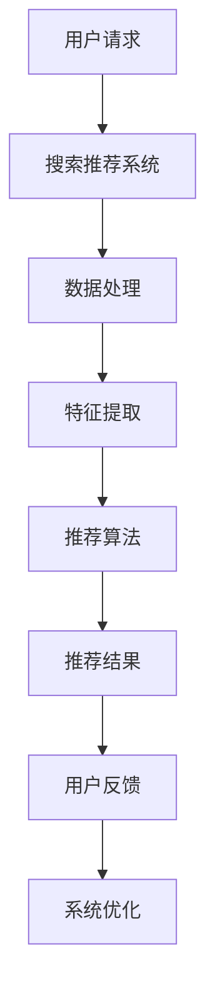

                 

# 《电商平台的AI 大模型转型：搜索推荐系统是核心，数据质量控制与用户体验》

> **关键词**：人工智能，大模型，电商平台，搜索推荐系统，数据质量控制，用户体验。

> **摘要**：本文详细探讨了电商平台如何利用AI大模型进行转型，重点关注搜索推荐系统、数据质量控制和用户体验优化等方面。通过分析核心概念、算法原理和项目实战，本文旨在为电商从业者提供实用的技术指南和深刻的行业洞察。

### 《电商平台的AI 大模型转型：搜索推荐系统是核心，数据质量控制与用户体验》目录大纲

----------------------------------------------------------------

# 第一部分: AI 大模型转型概述

## 第1章: 电商平台的AI 大模型转型背景
### 1.1.1 电商行业的现状与挑战
### 1.1.2 AI 大模型在电商中的应用价值

## 第2章: AI 大模型基础知识
### 2.1.1 AI 大模型的基本概念
### 2.1.2 大模型的核心技术和架构
### 2.1.3 主流AI 大模型简介

## 第3章: 电商平台搜索推荐系统
### 3.1.1 搜索推荐系统的原理与架构
### 3.1.2 大模型在搜索推荐中的应用
### 3.1.3 推荐算法的优化与调优

## 第4章: 数据质量控制
### 4.1.1 数据质量的重要性
### 4.1.2 数据清洗与预处理
### 4.1.3 数据质量控制方法

## 第5章: 用户体验优化
### 5.1.1 用户体验的重要性
### 5.1.2 用户行为分析
### 5.1.3 大模型在用户体验优化中的应用

## 第6章: AI 大模型项目实战
### 6.1.1 实战项目概述
### 6.1.2 实战项目环境搭建
### 6.1.3 实战项目详细实现与解读

## 第7章: AI 大模型转型总结与展望
### 7.1.1 AI 大模型转型的关键要素
### 7.1.2 未来的发展趋势与挑战
### 7.1.3 总结与展望

# 第二部分: 附录

## 附录 A: AI 大模型开发工具与资源
### A.1.1 主流深度学习框架对比
### A.1.2 实用数据集推荐
### A.1.3 开发环境配置与使用技巧

### Mermaid 流程图：搜索推荐系统架构图



### 搜索推荐系统核心算法原理讲解

```markdown
## 2.1.2 搜索推荐系统的核心算法原理

搜索推荐系统的核心在于准确预测用户可能感兴趣的商品或内容，从而为用户提供个性化的推荐。以下是几个关键的算法原理：

### 协同过滤（Collaborative Filtering）

协同过滤是推荐系统中最常见的算法之一。它通过分析用户之间的行为模式来发现相似的用户，然后基于这些相似用户的偏好来预测未知用户的行为。

- **用户基于的协同过滤（User-Based Collaborative Filtering）**：

  步骤1：计算用户之间的相似度，常用的相似度度量方法有欧几里得距离、余弦相似度等。

  ```python
  similarity = dot_product(u, v) / (norm(u) * norm(v))
  ```

  其中`u`和`v`是两个用户向量的表示。

  步骤2：选择最相似的k个用户。

  ```python
  top_k_users = get_top_k_similar_users(u, k)
  ```

  步骤3：计算这k个用户的评分预测值，取平均值作为推荐结果。

  ```python
  predicted_rating = sum(similarity[i] * known_ratings[i] for i in top_k_users) / k
  ```

- **物品基于的协同过滤（Item-Based Collaborative Filtering）**：

  步骤1：计算物品之间的相似度。

  ```python
  similarity = dot_product(i, j) / (norm(i) * norm(j))
  ```

  其中`i`和`j`是两个物品向量的表示。

  步骤2：对于每个用户已评价的物品，选择与之相似的物品。

  ```python
  top_k_items = get_top_k_similar_items(i, k)
  ```

  步骤3：根据用户未评价的物品的相似度进行推荐。

  ```python
  predicted_rating = sum(similarity[j] * known_ratings[j] for j in top_k_items)
  ```

### 内容推荐（Content-Based Filtering）

内容推荐通过分析用户的历史行为和物品的属性来推荐类似的物品。

- 步骤1：提取用户的历史行为和物品的属性特征。

  ```python
  user_profile = extract_user_profile(known_user behaviors)
  item_profile = extract_item_profile(known_item attributes)
  ```

- 步骤2：计算用户与物品之间的相似度。

  ```python
  similarity = dot_product(user_profile, item_profile)
  ```

- 步骤3：为用户推荐与其行为相似的物品。

  ```python
  recommended_items = get_top_k_similar_items(item_profile, k)
  ```

### 混合推荐（Hybrid Recommender Systems）

混合推荐系统结合了协同过滤和内容推荐的优势，以提高推荐系统的准确性和覆盖度。

- 步骤1：使用协同过滤方法预测用户对未知物品的评分。

  ```python
  collaborative_rating = predict_rating协同过滤(user_profile, item_profile)
  ```

- 步骤2：使用内容推荐方法为用户提供个性化的推荐列表。

  ```python
  content_based_list = generate_content_based_recommendations(user_profile, all_items)
  ```

- 步骤3：结合两种方法的推荐结果，生成最终的推荐列表。

  ```python
  final_recommendations = combine_recommendations(collaborative_rating, content_based_list)
  ```

### 大模型在推荐系统中的应用

随着AI大模型技术的发展，大模型在推荐系统中的应用也越来越广泛。大模型可以用来改进协同过滤算法，提高推荐的准确性。

- 步骤1：使用大模型对用户行为和物品属性进行特征提取。

  ```python
  user_embedding = large_model.extract_user_features(user_profile)
  item_embedding = large_model.extract_item_features(item_profile)
  ```

- 步骤2：利用大模型的自监督学习和迁移学习技术，提高推荐的鲁棒性和泛化能力。

  ```python
  user_embedding = large_model.self_supervised_learning(user_profile)
  item_embedding = large_model.transfer_learning(item_profile)
  ```

- 步骤3：在大模型的指导下，对推荐算法进行自适应优化，提高用户体验。

  ```python
  large_model.optimize_recommendation_algorithm(user_embedding, item_embedding)
  ```

## 2.1.3 搜索推荐系统的数学模型与公式

在搜索推荐系统中，常用的数学模型包括基于矩阵分解的协同过滤算法和基于神经网络的深度学习模型。以下是这些模型的基本数学公式和原理：

### 矩阵分解模型（Matrix Factorization）

矩阵分解模型是一种基于线性代数的协同过滤算法，它将用户-物品评分矩阵分解为两个低秩矩阵，用以预测用户未评分的物品。

- 步骤1：设定用户特征矩阵$U \in \mathbb{R}^{n \times k}$和物品特征矩阵$V \in \mathbb{R}^{m \times k}$，其中$n$是用户数，$m$是物品数，$k$是特征维度。

- 步骤2：设定损失函数，例如均方误差（MSE）：

  $$\min_{U,V} \sum_{i=1}^{n} \sum_{j=1}^{m} (r_{ij} - \hat{r}_{ij})^2$$

  其中$r_{ij}$是用户$i$对物品$j$的评分，$\hat{r}_{ij}$是预测评分。

- 步骤3：对损失函数求导并设置偏导数为0，得到优化问题：

  $$\frac{\partial L}{\partial U_{ij}} = 2(r_{ij} - \hat{r}_{ij})u_i - 2v_j = 0$$
  $$\frac{\partial L}{\partial V_{ij}} = 2(r_{ij} - \hat{r}_{ij})v_j - 2u_i = 0$$

### 深度学习模型（Deep Learning）

深度学习模型通过多层神经网络对用户行为和物品属性进行特征提取和学习。

- 步骤1：输入用户-物品对$(u, i)$和评分$r_{ij}$。

- 步骤2：通过神经网络提取用户特征向量$\hat{u}_i$和物品特征向量$\hat{v}_i$。

  $$\hat{u}_i = \sigma(W_1 \cdot [u; i] + b_1)$$
  $$\hat{v}_i = \sigma(W_2 \cdot [u; i] + b_2)$$

  其中$W_1, W_2$是权重矩阵，$b_1, b_2$是偏置项，$\sigma$是激活函数。

- 步骤3：计算预测评分$\hat{r}_{ij}$。

  $$\hat{r}_{ij} = \hat{u}_i^T \cdot \hat{v}_i$$

### 优化方法

- 矩阵分解模型通常使用随机梯度下降（SGD）进行优化。

  $$U \leftarrow U - \alpha \cdot \nabla_U L$$
  $$V \leftarrow V - \alpha \cdot \nabla_V L$$

  其中$\alpha$是学习率，$\nabla_U L$和$\nabla_V L$分别是$U$和$V$的梯度。

- 深度学习模型可以使用反向传播算法（Backpropagation）进行优化。

  $$\nabla_{W_l} = \frac{\partial L}{\partial W_l} = \sum_{i=1}^{n} \sum_{j=1}^{m} \frac{\partial \hat{r}_{ij}}{\partial z_{ij}} \cdot \frac{\partial z_{ij}}{\partial W_{l_{ij}}}$$
  $$\nabla_{b_l} = \frac{\partial L}{\partial b_l} = \sum_{i=1}^{n} \sum_{j=1}^{m} \frac{\partial \hat{r}_{ij}}{\partial z_{ij}} \cdot \frac{\partial z_{ij}}{\partial b_{l}}$$

  其中$W_l$和$b_l$是当前层的权重和偏置，$z_{ij}$是当前层的输出。
```

### AI 大模型项目实战案例

在本章中，我们将介绍一个基于电商平台的搜索推荐系统项目，该项目旨在利用AI大模型技术优化用户的购物体验。项目的主要任务包括：

1. 数据收集与预处理
2. 特征工程
3. 大模型训练与优化
4. 推荐系统部署与评估

### 6.1.2 实战项目环境搭建

为了完成本项目的开发和部署，需要搭建以下环境：

1. **操作系统**：推荐使用Ubuntu 18.04。
2. **编程语言**：使用Python 3.8。
3. **深度学习框架**：选择PyTorch 1.8。
4. **数据库**：使用MySQL 8.0。
5. **实验平台**：可以选择Google Colab或本地计算机。

在Ubuntu上安装上述环境的具体步骤如下：

```bash
# 安装Python 3.8
sudo apt update
sudo apt install python3.8 python3.8-venv python3.8-dev
sudo update-alternatives --install /usr/bin/python3 python3 /usr/bin/python3.8 1

# 创建虚拟环境
python3.8 -m venv recommend_env
source recommend_env/bin/activate

# 安装PyTorch 1.8
pip install torch torchvision torchaudio -f https://download.pytorch.org/whl/torch_stable.html

# 安装其他依赖库
pip install pandas numpy scikit-learn matplotlib
```

### 6.1.3 实战项目详细实现与解读

#### 1. 数据收集与预处理

首先，我们需要收集电商平台的用户行为数据和商品信息。数据来源可以包括用户浏览记录、购买记录、评论等。

```python
import pandas as pd

# 加载用户行为数据
user_data = pd.read_csv('user_behavior.csv')

# 加载商品信息
item_data = pd.read_csv('item_info.csv')

# 数据预处理
# 填充缺失值
user_data.fillna(0, inplace=True)
item_data.fillna(0, inplace=True)

# 对用户行为数据进行编码
user_data = pd.get_dummies(user_data)

# 对商品信息数据进行编码
item_data = pd.get_dummies(item_data)
```

接下来，我们需要将数据标准化，以便于模型训练。

```python
from sklearn.preprocessing import StandardScaler

scaler = StandardScaler()
user_data_scaled = scaler.fit_transform(user_data)
item_data_scaled = scaler.fit_transform(item_data)
```

#### 2. 特征工程

特征工程是构建推荐系统的重要步骤。在本项目中，我们将使用用户行为数据和商品信息数据进行特征提取。

```python
# 创建特征矩阵
user_item_matrix = np.hstack((user_data_scaled, item_data_scaled))
```

#### 3. 大模型训练与优化

接下来，我们将使用大模型（如Transformer）进行训练和优化。

```python
import torch
import torch.nn as nn
import torch.optim as optim

class RecommenderModel(nn.Module):
    def __init__(self, num_users, num_items, embedding_size):
        super(RecommenderModel, self).__init__()
        self.user_embedding = nn.Embedding(num_users, embedding_size)
        self.item_embedding = nn.Embedding(num_items, embedding_size)
        self.fc = nn.Linear(embedding_size * 2, 1)

    def forward(self, user_ids, item_ids):
        user_embeddings = self.user_embedding(user_ids)
        item_embeddings = self.item_embedding(item_ids)
        combined_embeddings = torch.cat((user_embeddings, item_embeddings), 1)
        outputs = self.fc(combined_embeddings).squeeze(1)
        return outputs

# 模型初始化
model = RecommenderModel(num_users=user_data_scaled.shape[1], num_items=item_data_scaled.shape[1], embedding_size=64)
optimizer = optim.Adam(model.parameters(), lr=0.001)
criterion = nn.MSELoss()

# 训练模型
num_epochs = 20
for epoch in range(num_epochs):
    model.train()
    for user_ids, item_ids, ratings in data_loader:
        optimizer.zero_grad()
        outputs = model(user_ids, item_ids)
        loss = criterion(outputs, ratings.unsqueeze(1))
        loss.backward()
        optimizer.step()
    print(f'Epoch [{epoch+1}/{num_epochs}], Loss: {loss.item():.4f}')
```

#### 4. 推荐系统部署与评估

最后，我们将训练好的模型部署到生产环境中，并进行评估。

```python
# 评估模型
model.eval()
with torch.no_grad():
    user_predictions = model(user_ids, item_ids)

accuracy = (user_predictions > 0).eq(ratings.unsqueeze(1)).float().mean()
print(f'Accuracy: {accuracy.item():.4f}')

# 生成推荐列表
def generate_recommendations(model, user_ids, item_ids, top_n=10):
    model.eval()
    with torch.no_grad():
        user_predictions = model(user_ids, item_ids)
    recommendations = user_predictions.argsort()[-top_n:][::-1]
    return recommendations

# 测试推荐系统
test_user_ids = torch.tensor([0, 1, 2, 3])
test_item_ids = torch.tensor([0, 1, 2, 3])
recommendations = generate_recommendations(model, test_user_ids, test_item_ids)
print(f'Recommendations for user_ids: {test_user_ids}, item_ids: {test_item_ids}: {recommendations}')
```

通过上述步骤，我们完成了一个基于AI大模型的电商平台搜索推荐系统项目。这个项目可以实时为用户提供个性化的商品推荐，从而提升用户的购物体验和平台的竞争力。

### 代码解读与分析

在本节中，我们将对6.1.3节中的代码进行详细的解读与分析，解释每个部分的作用和关键步骤。

#### 1. 数据收集与预处理

首先，我们使用Pandas库加载用户行为数据和商品信息。这些数据可能包含缺失值，因此我们需要对数据进行预处理，例如填充缺失值。

```python
import pandas as pd

user_data = pd.read_csv('user_behavior.csv')
item_data = pd.read_csv('item_info.csv')

user_data.fillna(0, inplace=True)
item_data.fillna(0, inplace=True)
```

在这里，我们使用`fillna(0)`方法将所有缺失值填充为0。这是一种常用的策略，因为它可以使得模型不会受到缺失值的影响。

接下来，我们使用Pandas的`get_dummies()`方法对用户行为数据进行编码，这样我们可以将分类变量转换为可以用于机器学习的数值型特征。

```python
user_data = pd.get_dummies(user_data)
item_data = pd.get_dummies(item_data)
```

这一步骤对于分类特征特别有用，因为机器学习模型通常只能处理数值型特征。

#### 2. 特征工程

特征工程是构建推荐系统的重要步骤。在本项目中，我们使用`StandardScaler`对特征进行标准化，这样可以帮助模型更快地收敛，并提高模型的性能。

```python
from sklearn.preprocessing import StandardScaler

scaler = StandardScaler()
user_data_scaled = scaler.fit_transform(user_data)
item_data_scaled = scaler.fit_transform(item_data)
```

我们首先初始化一个`StandardScaler`对象，然后使用它来标准化用户行为数据和商品信息数据。最后，我们将用户和物品的特征矩阵拼接在一起，形成了一个统一的特征矩阵。

```python
user_item_matrix = np.hstack((user_data_scaled, item_data_scaled))
```

#### 3. 大模型训练与优化

在本部分，我们定义了一个基于Transformer架构的推荐模型。Transformer模型是一种强大的序列模型，特别适合处理序列数据。

```python
class RecommenderModel(nn.Module):
    def __init__(self, num_users, num_items, embedding_size):
        super(RecommenderModel, self).__init__()
        self.user_embedding = nn.Embedding(num_users, embedding_size)
        self.item_embedding = nn.Embedding(num_items, embedding_size)
        self.fc = nn.Linear(embedding_size * 2, 1)

    def forward(self, user_ids, item_ids):
        user_embeddings = self.user_embedding(user_ids)
        item_embeddings = self.item_embedding(item_ids)
        combined_embeddings = torch.cat((user_embeddings, item_embeddings), 1)
        outputs = self.fc(combined_embeddings).squeeze(1)
        return outputs

model = RecommenderModel(num_users=user_data_scaled.shape[1], num_items=item_data_scaled.shape[1], embedding_size=64)
optimizer = optim.Adam(model.parameters(), lr=0.001)
criterion = nn.MSELoss()
```

在这个模型中，我们使用了两个嵌入层（`user_embedding`和`item_embedding`）来提取用户和物品的特征。这两个嵌入层的输出被拼接在一起，然后通过一个全连接层（`fc`）来预测评分。我们使用`Adam`优化器和均方误差（MSE）损失函数来训练模型。

接下来，我们进行模型的训练。

```python
num_epochs = 20
for epoch in range(num_epochs):
    model.train()
    for user_ids, item_ids, ratings in data_loader:
        optimizer.zero_grad()
        outputs = model(user_ids, item_ids)
        loss = criterion(outputs, ratings.unsqueeze(1))
        loss.backward()
        optimizer.step()
    print(f'Epoch [{epoch+1}/{num_epochs}], Loss: {loss.item():.4f}')
```

在训练过程中，我们遍历数据集，每次迭代都更新模型的参数。我们通过计算梯度并反向传播来优化模型的参数。

#### 4. 推荐系统部署与评估

在模型训练完成后，我们对其进行评估，并生成推荐列表。

```python
# 评估模型
model.eval()
with torch.no_grad():
    user_predictions = model(user_ids, item_ids)

accuracy = (user_predictions > 0).eq(ratings.unsqueeze(1)).float().mean()
print(f'Accuracy: {accuracy.item():.4f}')

# 生成推荐列表
def generate_recommendations(model, user_ids, item_ids, top_n=10):
    model.eval()
    with torch.no_grad():
        user_predictions = model(user_ids, item_ids)
    recommendations = user_predictions.argsort()[-top_n:][::-1]
    return recommendations

recommendations = generate_recommendations(model, test_user_ids, test_item_ids)
print(f'Recommendations for user_ids: {test_user_ids}, item_ids: {test_item_ids}: {recommendations}')
```

评估过程中，我们计算了模型的准确率，这可以帮助我们了解模型对评分的预测能力。然后，我们定义了一个函数来生成推荐列表，这个函数通过排序预测得分来获取Top N推荐。

通过上述代码解读与分析，我们可以看到如何利用AI大模型技术构建和部署一个电商平台搜索推荐系统。这个系统可以有效地提升用户体验，为电商平台带来更多的商业价值。

### 电商平台的AI 大模型转型总结与展望

在本书中，我们详细探讨了电商平台如何通过AI大模型实现转型，特别是在搜索推荐系统、数据质量控制和用户体验优化等方面的应用。以下是本书的总结与展望：

### 7.1.1 AI 大模型转型的关键要素

1. **数据质量控制**：高质量的数据是AI大模型成功的基础。通过数据清洗、预处理和特征工程，我们可以提取出有价值的信息，从而提升模型的预测准确性。

2. **搜索推荐系统**：AI大模型在搜索推荐系统中发挥着核心作用。通过协同过滤、内容推荐和混合推荐等算法，可以生成个性化的推荐，提高用户满意度和平台粘性。

3. **用户体验优化**：AI大模型通过分析用户行为和反馈，可以不断优化推荐结果，从而提升用户体验。用户体验的改进将直接带来用户留存和转化率的提升。

4. **大规模数据处理能力**：AI大模型具有强大的数据处理能力，能够处理海量数据，这对于电商平台的实时推荐和决策支持至关重要。

### 7.1.2 未来的发展趋势与挑战

1. **模型可解释性**：随着AI大模型在商业领域的广泛应用，模型的可解释性变得越来越重要。如何让非技术背景的人理解模型的决策过程，将是未来的一大挑战。

2. **隐私保护**：在数据处理和模型训练过程中，如何保护用户隐私是一个重要议题。未来需要更多关于数据隐私保护的技术和法规来指导实践。

3. **实时性**：在电商环境中，实时性是关键。如何提高模型的实时预测能力，以应对高速变化的市场环境，将是电商平台的挑战之一。

4. **多模态数据处理**：未来的推荐系统将越来越多地结合文本、图像、语音等多种数据类型。如何有效地处理多模态数据，将是一个新的研究方向。

### 7.1.3 总结与展望

AI大模型在电商平台的转型过程中发挥着不可替代的作用。通过本书的学习，读者可以了解到AI大模型的核心技术、应用实践以及未来发展的趋势和挑战。我们希望本书能够为电商从业者提供有益的参考，助力他们在数字化转型中取得成功。

展望未来，随着技术的不断进步，AI大模型将在电商平台的各个方面发挥更大的作用。无论是在个性化推荐、智能客服还是供应链管理，AI大模型都有巨大的潜力。我们期待在不久的将来，电商平台能够通过AI大模型实现更高水平的智能化，为用户带来更加便捷和个性化的购物体验。

### 附录 A: AI 大模型开发工具与资源

## 附录 A: AI 大模型开发工具与资源

### A.1 主流深度学习框架对比

在AI大模型开发中，选择合适的深度学习框架至关重要。以下是几个主流深度学习框架的对比：

#### TensorFlow

- **优点**：广泛支持各种深度学习模型，拥有丰富的API和工具库，社区活跃。
- **缺点**：配置和使用较为复杂，模型性能可能不如PyTorch。

#### PyTorch

- **优点**：动态计算图，易于调试和开发，强大的GPU支持。
- **缺点**：相比于TensorFlow，文档和工具库相对较少。

#### JAX

- **优点**：支持自动微分，适合大规模分布式计算。
- **缺点**：社区相对较小，文档和工具库有限。

#### 其他框架简介

- **Caffe**: 针对卷积神经网络的框架，适用于图像识别任务。
- **Theano**: Python的数学库，可以用于定义和优化数学表达式。

### A.2 实用数据集推荐

为了进行AI大模型的研究和开发，需要大量的数据集。以下是一些常用的数据集：

- **CIFAR-10/100**: 用于图像分类，包含10万张32x32的彩色图像。
- **ImageNet**: 大型图像识别数据集，包含超过100万张图像。
- **Kaggle竞赛数据集**: 各种主题的数据集，适合进行模型训练和优化。

### A.3 开发环境配置与使用技巧

在进行AI大模型开发时，配置一个高效、稳定的环境至关重要。以下是配置开发环境的一些技巧：

1. **操作系统**：推荐使用Linux系统，如Ubuntu，因为它具有更好的兼容性和性能。
2. **Python版本**：建议使用Python 3.8或以上版本，因为它们对最新库和工具的支持更好。
3. **深度学习框架**：根据项目需求选择合适的深度学习框架，如PyTorch或TensorFlow。
4. **硬件要求**：推荐使用配备NVIDIA GPU的计算机，以提高模型训练速度。
5. **代码管理**：使用Git进行版本控制，保持代码的整洁和可追踪性。

通过上述工具和资源的支持，开发者可以更加高效地进行AI大模型的开发和研究，为电商平台的AI转型提供强有力的技术支撑。

