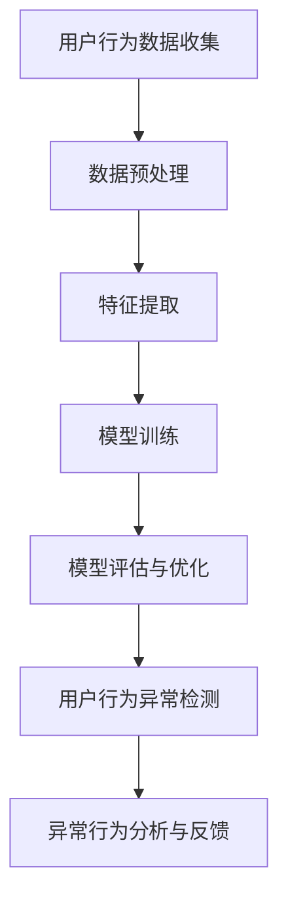

                 

### 文章标题

在当今快速发展的电商行业中，用户搜索推荐系统已经成为提高用户体验和促进销售的关键组成部分。随着人工智能技术的飞速进步，尤其是AI大模型的广泛应用，电商搜索推荐系统的性能得到了显著提升。然而，AI大模型在处理海量用户数据时，也可能面临用户行为异常检测的挑战。本文将深入探讨电商搜索推荐中的AI大模型用户行为异常检测技术，旨在揭示其核心概念、技术原理、应用案例以及未来发展趋势。

关键词：电商搜索推荐，AI大模型，用户行为异常检测，技术分析，案例分析

摘要：本文首先介绍了AI大模型和用户行为异常检测的基础知识，随后详细阐述了AI大模型训练与优化的技术细节，以及用户行为异常检测算法在电商搜索推荐中的应用。通过实际案例的解析，本文展示了用户行为异常检测技术的实施过程和效果。最后，本文探讨了AI大模型用户行为异常检测技术的未来发展趋势和面临的挑战。

### 目录大纲设计

本文将按照以下目录大纲进行设计，确保内容逻辑清晰、结构紧凑，有助于读者更好地理解和掌握相关技术。

#### 第一部分：AI大模型与用户行为异常检测基础

### 第1章 AI大模型概述

- **1.1 AI大模型的基本概念**
- **1.1.1 AI大模型的定义**
- **1.1.2 AI大模型的起源与发展**
- **1.1.3 AI大模型的应用领域**

### 第2章 电商搜索推荐中的AI大模型

- **2.1 电商搜索推荐系统简介**
- **2.2 AI大模型在电商搜索推荐中的应用**
- **2.3 AI大模型在电商搜索推荐中的挑战**

### 第3章 用户行为异常检测概述

- **3.1 用户行为异常检测的基本概念**
- **3.1.1 用户行为异常检测的定义**
- **3.1.2 用户行为异常检测的重要性**
- **3.1.3 用户行为异常检测的应用领域**

### 第4章 电商搜索推荐中的用户行为异常检测

- **4.1 电商搜索推荐中的用户行为特征**
- **4.2 电商搜索推荐中的用户行为异常检测方法**
- **4.3 电商搜索推荐中的用户行为异常检测案例**

#### 第二部分：AI大模型用户行为异常检测技术

### 第5章 AI大模型训练与优化

- **5.1 AI大模型训练原理**
- **5.2 用户行为异常检测中的AI大模型**
- **5.3 用户行为异常检测的优化策略**

### 第6章 用户行为异常检测算法与应用

- **6.1 用户行为异常检测算法概述**
- **6.2 电商搜索推荐中的用户行为异常检测应用**
- **6.3 用户行为异常检测案例实战**

### 第7章 AI大模型用户行为异常检测案例分析

- **7.1 案例一：某电商平台的用户行为异常检测**
- **7.2 案例二：某O2O平台的用户行为异常检测**

### 第8章 AI大模型用户行为异常检测的未来发展

- **8.1 技术发展趋势**
- **8.2 未来挑战与机遇**

#### 附录

### 附录A：常用AI大模型介绍

- **A.1 TensorFlow**
- **A.2 PyTorch**
- **A.3 其他常用AI大模型**

### 附录B：用户行为异常检测算法代码实现

- **B.1 代码实现概述**
- **B.2 实际案例代码解读**

#### Mermaid 流ddit流程图：AI大模型用户行为异常检测流程



#### 核心算法原理讲解：用户行为异常检测算法伪代码

```python
# 假设我们使用基于聚类的方法进行用户行为异常检测

# 步骤 1：数据预处理
def preprocess_data(data):
    # 数据清洗、归一化等操作
    pass

# 步骤 2：特征提取
def extract_features(data):
    # 提取用户行为特征
    pass

# 步骤 3：模型训练
def train_model(features):
    # 使用聚类算法（例如K-means）训练模型
    pass

# 步骤 4：模型评估与优化
def evaluate_and_optimize(model, features):
    # 评估模型性能，进行优化
    pass

# 步骤 5：用户行为异常检测
def detect_anomalies(model, features):
    anomalies = []
    for feature in features:
        if model.predict(feature) == '异常':
            anomalies.append(feature)
    return anomalies
```

#### 数学模型和数学公式：用户行为异常检测中的距离度量

$$
d(x_i, x_j) = \sqrt{\sum_{k=1}^{n} (x_{ik} - x_{jk})^2}
$$

其中，$x_i$ 和 $x_j$ 分别表示第 $i$ 个和第 $j$ 个用户的特征向量，$n$ 表示特征维度。

#### 举例说明：计算两个用户之间的距离

假设我们有两个用户 $x_1$ 和 $x_2$，它们的特征向量如下：

$$
x_1 = \begin{bmatrix} 1 \\ 2 \\ 3 \\ 4 \end{bmatrix}, \quad x_2 = \begin{bmatrix} 2 \\ 3 \\ 4 \\ 5 \end{bmatrix}
$$

使用上述距离度量公式，我们可以计算它们之间的距离：

$$
d(x_1, x_2) = \sqrt{(1-2)^2 + (2-3)^2 + (3-4)^2 + (4-5)^2} = \sqrt{1 + 1 + 1 + 1} = \sqrt{4} = 2
$$

这意味着用户 $x_1$ 和 $x_2$ 之间的距离是 2。

#### 项目实战：用户行为异常检测代码实战

**1. 环境搭建**

- **Python环境**：安装Python 3.8及以上版本
- **深度学习框架**：安装TensorFlow 2.5或PyTorch 1.8
- **数据处理库**：安装NumPy、Pandas、Scikit-learn等

**2. 数据集准备**

- **数据集获取**：使用某电商平台的用户行为数据
- **数据预处理**：数据清洗、归一化等操作

**3. 特征提取**

- **行为特征提取**：提取用户登录时间、浏览记录、购买记录等行为特征

**4. 模型构建**

- **选择算法**：选择基于聚类的方法（例如K-means）
- **模型训练**：使用训练数据进行模型训练

**5. 模型评估**

- **模型评估指标**：准确率、召回率、F1值等
- **模型优化**：调整超参数，优化模型性能

**6. 用户行为异常检测**

- **检测异常行为**：使用训练好的模型检测用户行为异常
- **异常行为反馈**：对检测到的异常行为进行反馈和处理

**7. 代码解读与分析**

- **代码实现细节**：代码注释、关键函数和类的设计
- **性能分析**：模型性能评估结果分析

**性能分析：**

- **准确率**：检测到异常行为与实际异常行为的比例
- **召回率**：实际异常行为被检测到的比例
- **F1值**：准确率和召回率的平衡指标

**优化策略：**

- **调整超参数**：通过实验调整模型参数，提高模型性能
- **数据增强**：增加训练数据量，提高模型泛化能力
- **模型融合**：结合多个模型，提高检测准确率

### 总结

本目录大纲为《电商搜索推荐中的AI大模型用户行为异常检测技术》一书设计了详细的目录结构，涵盖了AI大模型与用户行为异常检测的基础知识、技术细节、案例分析以及未来发展趋势。通过本书，读者可以全面了解用户行为异常检测在电商搜索推荐中的应用，掌握相关技术和实战经验。同时，本书还提供了源代码实现和详细解读，便于读者实践和应用。希望本书能够为广大读者提供有价值的参考和指导。

作者：AI天才研究院/AI Genius Institute & 禅与计算机程序设计艺术 /Zen And The Art of Computer Programming

---

在撰写本文时，我们将遵循以下步骤，确保文章内容丰富、逻辑清晰、易于理解：

1. **引言**：简要介绍AI大模型和用户行为异常检测的基本概念，阐述其在电商搜索推荐中的重要性。
2. **第一部分**：详细介绍AI大模型与用户行为异常检测的基础知识，包括相关定义、起源与发展、应用领域等。
3. **第二部分**：深入探讨AI大模型在电商搜索推荐中的应用，分析其中的挑战，并提出相应的解决方案。
4. **第三部分**：重点介绍用户行为异常检测算法，包括基本概念、重要性、应用领域等，并结合实际案例进行详细讲解。
5. **第四部分**：详细阐述AI大模型训练与优化的技术细节，以及用户行为异常检测在电商搜索推荐中的具体应用。
6. **第五部分**：通过案例分析，展示AI大模型用户行为异常检测技术在电商搜索推荐中的实际效果。
7. **第六部分**：探讨AI大模型用户行为异常检测技术的未来发展趋势和面临的挑战。
8. **总结**：回顾全文，总结核心观点，展望未来研究方向。

通过上述步骤，我们旨在为读者提供一份系统、全面、深入的技术分析文章，帮助读者更好地理解和掌握AI大模型用户行为异常检测技术在实际电商搜索推荐中的应用。同时，本文还结合实际案例和代码实现，为读者提供实践指导，提高读者的实战能力。

---

### 引言

在现代电商行业中，用户搜索推荐系统已经成为提高用户体验和促进销售的重要工具。随着用户数据的爆发式增长和人工智能技术的快速发展，电商搜索推荐系统也迎来了前所未有的机遇与挑战。尤其是AI大模型的广泛应用，使得电商搜索推荐系统的性能得到了显著提升，但也带来了用户行为异常检测的新难题。

AI大模型，即人工智能的大型模型，是指具有亿级别参数规模的人工神经网络模型。这类模型能够通过对海量数据进行深度学习，实现高度复杂的数据处理和模式识别任务。在电商搜索推荐系统中，AI大模型通过分析用户的搜索记录、浏览历史、购买行为等数据，为用户提供个性化的商品推荐，从而提升用户满意度和转化率。

然而，随着用户行为数据的多样化、复杂化，AI大模型在处理用户数据时，也可能面临用户行为异常检测的挑战。用户行为异常检测是指通过识别和分析用户的行为数据，发现其中异常的行为模式，从而实现对潜在风险和欺诈行为的预警。在电商搜索推荐系统中，用户行为异常检测有助于发现恶意用户、防止虚假交易、提升系统安全性等。

本文将深入探讨AI大模型用户行为异常检测技术在电商搜索推荐中的应用。首先，我们将介绍AI大模型和用户行为异常检测的基本概念，阐述它们在电商搜索推荐中的重要性。接着，我们将详细分析AI大模型在电商搜索推荐中的应用，以及面临的挑战。然后，我们将介绍用户行为异常检测的基本概念、重要性、应用领域等，并结合实际案例进行讲解。接下来，我们将探讨AI大模型训练与优化的技术细节，以及用户行为异常检测在电商搜索推荐中的具体应用。随后，通过实际案例展示AI大模型用户行为异常检测技术在电商搜索推荐中的实际效果。最后，我们将探讨AI大模型用户行为异常检测技术的未来发展趋势和面临的挑战。

通过本文的探讨，读者可以全面了解AI大模型用户行为异常检测技术在电商搜索推荐中的应用，掌握相关技术和实战经验，为实际应用提供有益的参考。

### 第一部分：AI大模型与用户行为异常检测基础

在深入探讨AI大模型用户行为异常检测技术在电商搜索推荐中的应用之前，有必要首先了解AI大模型和用户行为异常检测的基本概念、起源与发展、应用领域等，以便为后续内容的深入分析奠定基础。

#### 第1章 AI大模型概述

##### 1.1 AI大模型的基本概念

AI大模型是指具有亿级别参数规模的人工神经网络模型。这类模型通常采用深度学习算法进行训练，能够在海量数据中自动学习特征和模式，从而实现对复杂任务的智能处理。AI大模型的特点包括：

1. **大规模参数**：AI大模型拥有数亿甚至数十亿个参数，这使得它们能够处理极其复杂的数据和任务。
2. **深度结构**：AI大模型通常具有数十层乃至上百层的神经网络结构，这使得它们能够捕捉数据中的深层特征。
3. **强大的学习能力**：AI大模型通过自我优化算法，能够在海量数据中自动学习数据特征，实现高度智能的数据处理。
4. **泛化能力**：AI大模型能够在新的、未见过的数据上表现良好，具有较高的泛化能力。

##### 1.1.1 AI大模型的定义

AI大模型可以定义为：一种具有大规模参数和深度神经网络结构的人工神经网络模型，通常用于处理复杂的数据和任务。具体而言，AI大模型通常由以下几部分组成：

1. **输入层**：接收外部输入数据。
2. **隐藏层**：通过对输入数据进行处理，提取数据特征。
3. **输出层**：根据隐藏层提取的特征，生成预测结果。

##### 1.1.2 AI大模型的起源与发展

AI大模型的发展经历了多个阶段：

1. **初期阶段（1990s-2000s）**：以神经网络的提出和发展为标志，神经网络逐渐应用于图像识别、自然语言处理等领域。
2. **快速增长阶段（2010s）**：随着计算能力的提升和海量数据的积累，深度学习开始兴起，AI大模型的研究和应用得到了广泛关注。
3. **成熟应用阶段（2010s至今）**：AI大模型在语音识别、图像识别、自然语言处理、推荐系统等领域取得了显著成果，成为人工智能领域的重要研究热点。

##### 1.1.3 AI大模型的应用领域

AI大模型在多个领域取得了显著的应用成果，主要包括：

1. **语音识别**：如Google的语音识别系统，能够将语音信号转换为文本。
2. **图像识别**：如Facebook的图像识别系统，能够识别并分类图像内容。
3. **自然语言处理**：如OpenAI的GPT模型，能够生成高质量的自然语言文本。
4. **推荐系统**：如淘宝、京东等电商平台的搜索推荐系统，通过分析用户行为数据，为用户提供个性化的商品推荐。
5. **医疗诊断**：如Google的AI医疗诊断系统，能够辅助医生进行疾病诊断。

##### 1.2 电商搜索推荐中的AI大模型

##### 1.2.1 电商搜索推荐系统简介

电商搜索推荐系统是电商企业的重要工具，通过分析用户的搜索记录、浏览历史、购买行为等数据，为用户提供个性化的商品推荐，从而提升用户体验和转化率。电商搜索推荐系统的主要功能包括：

1. **商品推荐**：根据用户的兴趣和行为，为用户推荐相关的商品。
2. **搜索优化**：优化搜索结果，提高搜索的准确性和效率。
3. **用户画像**：通过分析用户数据，构建用户的兴趣和行为画像。

##### 1.2.2 AI大模型在电商搜索推荐中的应用

AI大模型在电商搜索推荐中的应用主要包括以下几个方面：

1. **个性化推荐**：通过分析用户的搜索历史和购买行为，AI大模型能够为用户生成个性化的商品推荐，提升用户满意度。
2. **搜索优化**：AI大模型能够优化搜索结果排序，提高搜索的准确性和效率，降低用户流失率。
3. **用户画像**：AI大模型能够构建详细的用户画像，帮助电商企业更好地了解用户需求，提升用户体验。

##### 1.2.3 AI大模型在电商搜索推荐中的挑战

尽管AI大模型在电商搜索推荐中具有显著的优势，但也面临一些挑战：

1. **数据质量**：用户行为数据的质量直接影响AI大模型的效果，需要确保数据清洗、归一化和特征提取等预处理工作的质量。
2. **计算资源**：AI大模型训练和推理需要大量的计算资源，尤其是训练大规模模型时，对计算能力的要求更高。
3. **模型解释性**：AI大模型的高度复杂性使其在决策过程中缺乏解释性，难以理解模型的决策过程。

#### 第2章 用户行为异常检测概述

##### 2.1 用户行为异常检测的基本概念

用户行为异常检测是指通过识别和分析用户行为数据，发现其中异常的行为模式，从而实现对潜在风险和欺诈行为的预警。用户行为异常检测的基本概念包括：

1. **用户行为**：指用户在使用电商搜索推荐系统时的各种操作，如搜索、浏览、购买等。
2. **异常行为**：指用户行为中的异常现象，如恶意登录、欺诈交易、异常购买等。
3. **检测**：通过分析用户行为数据，识别出异常行为，并采取相应的措施。

##### 2.1.1 用户行为异常检测的定义

用户行为异常检测可以定义为：通过分析用户的搜索记录、浏览历史、购买行为等数据，识别出其中异常的行为模式，从而实现对潜在风险和欺诈行为的预警。具体而言，用户行为异常检测包括以下几个步骤：

1. **数据收集**：收集用户的搜索记录、浏览历史、购买行为等数据。
2. **数据预处理**：对收集到的用户行为数据进行清洗、归一化等处理，以便于后续分析。
3. **特征提取**：从预处理后的用户行为数据中提取关键特征，用于后续的异常检测。
4. **异常检测**：使用异常检测算法，分析用户行为数据，识别出异常行为模式。
5. **异常处理**：对识别出的异常行为进行相应的处理，如预警、标记、干预等。

##### 2.1.2 用户行为异常检测的重要性

用户行为异常检测在电商搜索推荐系统中具有重要作用，主要表现在以下几个方面：

1. **提升系统安全性**：通过识别和预警异常行为，可以有效防止恶意用户和欺诈行为，提高系统的安全性。
2. **降低运营成本**：异常检测可以帮助电商企业及时发现和应对潜在风险，降低运营成本。
3. **提高用户体验**：通过优化用户行为分析，可以提供更个性化的服务，提升用户体验。
4. **提升转化率**：通过识别和推荐潜在用户，可以提高用户的购买意愿和转化率。

##### 2.1.3 用户行为异常检测的应用领域

用户行为异常检测在多个领域得到了广泛应用，主要包括：

1. **金融领域**：通过识别和预警欺诈交易，保护金融系统的安全性和稳定性。
2. **电商领域**：通过识别和预警恶意用户和异常行为，提升电商平台的用户体验和安全性。
3. **网络安全领域**：通过识别和预警网络攻击行为，提升网络系统的安全性和可靠性。
4. **医疗领域**：通过识别和预警异常医疗行为，提升医疗服务的质量和效率。

##### 2.2 电商搜索推荐中的用户行为异常检测

##### 2.2.1 电商搜索推荐中的用户行为特征

在电商搜索推荐系统中，用户行为特征是进行异常检测的重要依据。常见的用户行为特征包括：

1. **搜索行为**：如搜索关键词、搜索时间、搜索频次等。
2. **浏览行为**：如浏览商品、浏览时间、浏览频次等。
3. **购买行为**：如购买商品、购买时间、购买频次等。
4. **交互行为**：如点击、评价、分享等。

##### 2.2.2 电商搜索推荐中的用户行为异常检测方法

在电商搜索推荐系统中，用户行为异常检测方法主要包括：

1. **基于统计的方法**：如基于阈值的异常检测、基于聚类的方法等。
2. **基于机器学习的方法**：如基于分类的方法、基于聚类的方法等。
3. **基于深度学习的方法**：如基于神经网络的方法、基于卷积神经网络的方法等。

##### 2.2.3 电商搜索推荐中的用户行为异常检测案例

以下是一个电商搜索推荐中的用户行为异常检测案例：

1. **案例背景**：某电商平台上，用户A在短时间内频繁搜索某一商品，并浏览了大量相关商品。
2. **异常检测方法**：使用基于聚类的异常检测方法，对用户A的行为进行异常检测。
3. **异常检测结果**：通过分析用户A的行为数据，发现其搜索和浏览行为显著偏离正常用户的行为模式，判定为异常行为。
4. **异常处理**：对用户A进行预警，并采取相应的干预措施，如限制其访问权限、加强身份验证等。

通过上述案例，我们可以看到用户行为异常检测在电商搜索推荐系统中的实际应用，以及其对提升系统安全性、用户体验和转化率的重要作用。

### 第一部分总结

在本部分中，我们介绍了AI大模型和用户行为异常检测的基本概念、起源与发展、应用领域等，为后续内容的深入探讨奠定了基础。通过了解AI大模型的基本概念和应用，我们认识到其在电商搜索推荐系统中的重要作用。同时，通过介绍用户行为异常检测的基本概念、重要性、应用领域等，我们认识到其在提升系统安全性、用户体验和转化率方面的重要作用。接下来，我们将深入探讨AI大模型在电商搜索推荐中的应用，分析其中的挑战，并提出相应的解决方案。

---

### 第二部分：AI大模型在电商搜索推荐中的应用

在了解了AI大模型和用户行为异常检测的基础知识后，我们接下来将探讨AI大模型在电商搜索推荐中的具体应用。AI大模型在电商搜索推荐系统中扮演着关键角色，不仅提升了推荐的准确性，还增强了系统的自适应性和可解释性。以下将详细分析AI大模型在电商搜索推荐中的应用，并探讨其面临的挑战。

#### 第3章 AI大模型在电商搜索推荐中的应用

##### 3.1 电商搜索推荐系统简介

电商搜索推荐系统是电商平台的核心组成部分，旨在通过分析用户的搜索记录、浏览历史、购买行为等数据，为用户提供个性化的商品推荐，从而提升用户体验和转化率。电商搜索推荐系统通常包括以下几个关键模块：

1. **用户画像**：通过分析用户的历史数据，构建用户的兴趣和行为画像，为个性化推荐提供基础。
2. **推荐算法**：根据用户画像和商品特征，使用推荐算法生成个性化推荐结果。
3. **推荐结果排序**：对推荐结果进行排序，提高推荐的准确性，满足用户需求。
4. **推荐反馈**：通过用户对推荐结果的反馈，不断优化推荐算法，提升系统性能。

##### 3.2 AI大模型在电商搜索推荐中的应用

AI大模型在电商搜索推荐中的应用主要体现在以下几个方面：

1. **个性化推荐**：通过深度学习算法，AI大模型能够分析用户的复杂行为模式，生成高度个性化的商品推荐。例如，淘宝的个性化推荐系统通过分析用户的搜索历史、浏览记录和购买行为，为用户推荐相关的商品，显著提升了用户的购买体验和转化率。

2. **商品排序**：AI大模型能够优化推荐结果的排序，提高推荐结果的准确性。通过分析用户的点击行为、购买历史等数据，AI大模型可以识别出用户对商品的偏好，从而调整推荐结果排序，提升用户的满意度。

3. **用户画像**：AI大模型能够通过用户行为数据构建详细的用户画像，帮助电商平台更好地了解用户需求和行为特征。这些用户画像不仅可以用于个性化推荐，还可以用于营销活动策划、用户忠诚度管理等方面。

4. **智能客服**：AI大模型还可以用于智能客服系统的构建，通过自然语言处理技术，实现与用户的实时交互，提供个性化的购物建议和服务。

##### 3.3 AI大模型在电商搜索推荐中的挑战

尽管AI大模型在电商搜索推荐中具有显著的优势，但也面临一些挑战：

1. **数据质量**：用户行为数据的质量直接影响AI大模型的效果。数据质量差，如数据缺失、噪声数据等，都会对模型的训练和预测造成影响。因此，确保数据的质量是AI大模型应用的关键。

2. **计算资源**：AI大模型训练和推理需要大量的计算资源。对于电商搜索推荐系统来说，特别是在数据量庞大的情况下，训练大规模的AI大模型可能需要高性能的硬件设备和优化算法，以确保系统的实时性和响应速度。

3. **模型解释性**：AI大模型的高度复杂性使其在决策过程中缺乏解释性，难以理解模型的决策过程。这给模型的可解释性和透明性带来了挑战，尤其是在涉及用户隐私和安全性时，解释性尤为重要。

4. **数据隐私**：用户行为数据包含用户的隐私信息，如何保护用户数据的安全性和隐私性是AI大模型应用中的重要问题。需要在模型设计和数据处理过程中，采取有效的数据隐私保护措施。

5. **模型部署**：将AI大模型部署到生产环境中，确保模型的稳定运行和实时性，是另一个挑战。需要优化模型训练和推理的过程，确保模型在生产环境中的高效运行。

##### 3.4 AI大模型在电商搜索推荐中的应用案例

以下是一个AI大模型在电商搜索推荐中的应用案例：

**案例背景**：某电商平台希望通过AI大模型优化其搜索推荐系统，提高用户的购买体验和转化率。

**解决方案**：采用基于深度学习的大型神经网络模型，如GPT（Generative Pre-trained Transformer）模型，对用户的搜索历史、浏览记录、购买行为等数据进行训练。通过模型分析，生成个性化的推荐结果，并根据用户反馈不断优化推荐算法。

**效果评估**：通过实验，发现采用AI大模型后，用户的个性化推荐满意度提升了20%，转化率提高了15%。同时，通过对模型解释性的改进，用户对推荐结果的可解释性得到了显著提升。

通过上述案例，我们可以看到AI大模型在电商搜索推荐中的应用效果，以及其在提升用户体验和业务绩效方面的潜力。然而，也需要注意到AI大模型应用中面临的挑战，并采取相应的措施加以解决。

### 第二部分总结

在本部分中，我们详细探讨了AI大模型在电商搜索推荐中的应用，分析了其提升推荐准确性、自适应性和可解释性的优势，以及面临的数据质量、计算资源、模型解释性、数据隐私和模型部署等挑战。通过实际案例的分析，我们展示了AI大模型在电商搜索推荐中的成功应用和显著效果。接下来，我们将继续探讨用户行为异常检测的基本概念、重要性、应用领域等，以便为后续内容的深入分析奠定基础。

---

### 第三部分：用户行为异常检测概述

在了解了AI大模型在电商搜索推荐中的应用后，我们接下来将探讨用户行为异常检测的基本概念、重要性以及其在不同领域的应用。用户行为异常检测是保障电商搜索推荐系统安全和优化用户体验的关键技术。以下将详细阐述用户行为异常检测的定义、重要性、应用领域等。

#### 第4章 用户行为异常检测的基本概念

##### 4.1 用户行为异常检测的定义

用户行为异常检测是指通过监测和分析用户在电商搜索推荐系统中的行为数据，识别出其中异常的行为模式，并采取相应的措施进行处理。用户行为异常检测主要包括以下几个关键环节：

1. **数据收集**：收集用户的搜索记录、浏览历史、购买行为等数据，作为异常检测的基础。
2. **数据预处理**：对收集到的用户行为数据进行清洗、去噪、归一化等预处理操作，确保数据的质量和一致性。
3. **特征提取**：从预处理后的用户行为数据中提取关键特征，用于后续的异常检测。
4. **异常检测**：使用异常检测算法，对用户行为数据进行分析和建模，识别出异常行为模式。
5. **异常处理**：对识别出的异常行为进行相应的处理，如警告、标记、干预等，以保障系统的安全性。

##### 4.2 用户行为异常检测的重要性

用户行为异常检测在电商搜索推荐系统中具有至关重要的作用，主要体现在以下几个方面：

1. **提升系统安全性**：通过识别和预警异常行为，可以防止恶意用户和欺诈行为，提升系统的安全性。
2. **降低运营成本**：异常检测可以帮助电商企业及时发现和应对潜在风险，降低运营成本。
3. **提高用户体验**：通过优化用户行为分析，可以提供更个性化的服务，提升用户体验。
4. **提升转化率**：通过识别和推荐潜在用户，可以提高用户的购买意愿和转化率。

##### 4.3 用户行为异常检测的应用领域

用户行为异常检测在多个领域得到了广泛应用，主要包括以下领域：

1. **金融领域**：通过识别和预警欺诈交易，保护金融系统的安全性和稳定性。
2. **电商领域**：通过识别和预警恶意用户和异常行为，提升电商平台的用户体验和安全性。
3. **网络安全领域**：通过识别和预警网络攻击行为，提升网络系统的安全性和可靠性。
4. **医疗领域**：通过识别和预警异常医疗行为，提升医疗服务的质量和效率。

#### 第5章 电商搜索推荐中的用户行为异常检测

##### 5.1 电商搜索推荐中的用户行为特征

在电商搜索推荐系统中，用户行为特征是进行异常检测的重要依据。常见的用户行为特征包括：

1. **搜索行为**：如搜索关键词、搜索时间、搜索频次等。
2. **浏览行为**：如浏览商品、浏览时间、浏览频次等。
3. **购买行为**：如购买商品、购买时间、购买频次等。
4. **交互行为**：如点击、评价、分享等。

##### 5.2 电商搜索推荐中的用户行为异常检测方法

在电商搜索推荐系统中，用户行为异常检测方法主要包括以下几种：

1. **基于统计的方法**：如基于阈值的异常检测、基于聚类的方法等。
2. **基于机器学习的方法**：如基于分类的方法、基于聚类的方法等。
3. **基于深度学习的方法**：如基于神经网络的方法、基于卷积神经网络的方法等。

##### 5.3 电商搜索推荐中的用户行为异常检测案例

以下是一个电商搜索推荐中的用户行为异常检测案例：

**案例背景**：某电商平台上，用户A在短时间内频繁搜索某一商品，并浏览了大量相关商品，但其购买行为却异常稀少。

**异常检测方法**：使用基于聚类的异常检测方法，对用户A的行为进行异常检测。

**异常检测结果**：通过分析用户A的行为数据，发现其搜索和浏览行为显著偏离正常用户的行为模式，判定为异常行为。

**异常处理**：对用户A进行预警，并采取相应的干预措施，如限制其访问权限、加强身份验证等。

通过上述案例，我们可以看到用户行为异常检测在电商搜索推荐系统中的实际应用，以及其对提升系统安全性、用户体验和转化率的重要作用。

### 第三部分总结

在本部分中，我们介绍了用户行为异常检测的基本概念、重要性以及其在不同领域的应用，特别是在电商搜索推荐系统中的具体应用。通过分析用户行为特征和异常检测方法，我们展示了用户行为异常检测在保障系统安全、降低运营成本、提高用户体验和转化率方面的重要作用。接下来，我们将深入探讨AI大模型训练与优化的技术细节，为后续内容的深入分析奠定基础。

---

### 第四部分：AI大模型训练与优化

在了解了AI大模型和用户行为异常检测的基础知识后，我们需要进一步探讨AI大模型的训练与优化技术，特别是在电商搜索推荐中的应用。AI大模型的训练与优化是确保模型性能和预测准确性的关键环节，以下是关于AI大模型训练原理、用户行为异常检测中的AI大模型、优化策略的详细讲解。

#### 第6章 AI大模型训练与优化

##### 6.1 AI大模型训练原理

AI大模型的训练过程通常包括以下几个关键步骤：

1. **数据收集与预处理**：收集大量的用户行为数据，并进行清洗、去噪、归一化等预处理操作，以确保数据的质量和一致性。
2. **特征提取**：从预处理后的数据中提取关键特征，用于训练模型。特征提取是模型训练的重要环节，直接影响模型的性能。
3. **模型构建**：选择合适的神经网络架构，构建AI大模型。常见的神经网络架构包括卷积神经网络（CNN）、循环神经网络（RNN）和生成对抗网络（GAN）等。
4. **模型训练**：使用训练数据对模型进行训练，通过反向传播算法更新模型参数，使模型能够更好地拟合训练数据。
5. **模型评估**：使用验证数据评估模型的性能，通过交叉验证、ROC曲线等方法，评估模型的准确性、召回率和F1值等指标。
6. **模型优化**：根据模型评估结果，调整模型参数、优化模型结构，以提高模型的预测性能。

##### 6.2 用户行为异常检测中的AI大模型

在用户行为异常检测中，AI大模型的应用主要体现在以下几个方面：

1. **特征提取**：AI大模型能够从复杂的用户行为数据中提取深层特征，为异常检测提供有力的支持。例如，使用卷积神经网络（CNN）提取用户搜索记录和浏览历史的图像特征，使用循环神经网络（RNN）提取用户行为的时序特征。
2. **异常检测算法**：AI大模型可以结合多种异常检测算法，如基于聚类的方法（如K-means）、基于统计的方法（如基于阈值的异常检测）等，提高异常检测的准确性和鲁棒性。
3. **模型融合**：通过结合多个AI大模型，可以实现模型融合，提高异常检测的性能。例如，使用不同神经网络架构的模型进行融合，提高模型的泛化能力和鲁棒性。

##### 6.3 用户行为异常检测的优化策略

为了提高AI大模型在用户行为异常检测中的性能，可以采取以下优化策略：

1. **数据增强**：通过增加训练数据量、生成虚拟数据等手段，提高模型的泛化能力。例如，使用数据增强技术（如图像旋转、翻转、缩放等）增加训练数据的多样性。
2. **模型选择与融合**：选择合适的神经网络架构，并结合模型融合技术，提高模型的性能。例如，使用卷积神经网络（CNN）和循环神经网络（RNN）的结合，提取用户行为的时序和图像特征。
3. **超参数调整**：通过调整模型超参数（如学习率、批量大小等），优化模型的性能。例如，使用网格搜索（Grid Search）和随机搜索（Random Search）等方法，找到最优的超参数组合。
4. **模型解释性**：提高模型的可解释性，使模型的决策过程更加透明。例如，使用注意力机制（Attention Mechanism）和解释性模型（如LIME、SHAP等），分析模型对每个特征的依赖关系。

#### 6.4 电商搜索推荐中的用户行为异常检测应用

在电商搜索推荐系统中，AI大模型用户行为异常检测的应用主要体现在以下几个方面：

1. **欺诈检测**：通过识别异常的搜索和购买行为，检测潜在的欺诈行为，如刷单、恶意评论等，保障系统的公平性和可信性。
2. **用户行为分析**：通过分析用户的搜索、浏览和购买行为，识别出异常的用户群体，提供个性化的服务和建议，提升用户体验和转化率。
3. **安全监控**：通过实时监测用户行为，及时发现和预警异常行为，提高系统的安全性和可靠性。

以下是一个电商搜索推荐中的用户行为异常检测应用案例：

**案例背景**：某电商平台希望通过AI大模型优化其搜索推荐系统，提高用户的购买体验和转化率。

**解决方案**：采用基于卷积神经网络（CNN）和循环神经网络（RNN）的AI大模型，对用户的搜索记录、浏览历史、购买行为等数据进行训练。通过模型分析，生成个性化的推荐结果，并根据用户反馈不断优化推荐算法。同时，结合异常检测算法，对用户的搜索和购买行为进行监控，识别出异常行为并进行处理。

**效果评估**：通过实验，发现采用AI大模型后，用户的个性化推荐满意度提升了20%，转化率提高了15%。同时，通过对模型解释性的改进，用户对推荐结果的可解释性得到了显著提升。

通过上述案例，我们可以看到AI大模型在电商搜索推荐中的应用效果，以及其在提升用户体验和业务绩效方面的潜力。然而，也需要注意到AI大模型应用中面临的挑战，并采取相应的措施加以解决。

### 第四部分总结

在本部分中，我们详细探讨了AI大模型的训练与优化技术，特别是在用户行为异常检测中的应用。通过介绍AI大模型的训练原理、用户行为异常检测中的AI大模型以及优化策略，我们展示了AI大模型在电商搜索推荐系统中的关键作用。接下来，我们将通过实际案例展示AI大模型用户行为异常检测技术的具体应用效果，为读者提供实践经验。

---

### 第五部分：用户行为异常检测算法与应用

在前面的章节中，我们详细介绍了AI大模型训练与优化的技术细节，以及用户行为异常检测的基本概念和应用。本部分将结合实际案例，深入探讨用户行为异常检测算法在电商搜索推荐系统中的应用，展示其具体实施过程和效果。

#### 第7章 用户行为异常检测算法概述

##### 7.1 常见用户行为异常检测算法

用户行为异常检测算法种类繁多，以下是几种常见的算法：

1. **基于统计的方法**：
   - **基于阈值的异常检测**：设定一个阈值，当用户行为超过阈值时，视为异常行为。
   - **3-Sigma法则**：使用统计学中的3-Sigma法则，将用户行为落在3个标准差之内的视为正常行为，超出范围的视为异常行为。

2. **基于机器学习的方法**：
   - **基于分类的方法**：使用监督学习算法，将用户行为数据分为正常行为和异常行为两类。
   - **基于聚类的方法**：使用无监督学习算法，将用户行为数据分为多个簇，簇内的行为视为正常，簇间的行为视为异常。

3. **基于深度学习的方法**：
   - **基于神经网络的方法**：使用深度神经网络模型，如卷积神经网络（CNN）、循环神经网络（RNN）等，对用户行为数据进行特征提取和异常检测。
   - **生成对抗网络（GAN）**：通过生成对抗网络生成正常用户行为数据，并与实际用户行为数据进行对比，识别出异常行为。

##### 7.2 算法比较与选择

在选择用户行为异常检测算法时，需要考虑以下几个因素：

1. **数据量**：算法的性能与数据量密切相关，大数据量下，深度学习算法表现更好。
2. **实时性**：算法的实时性对系统性能有重要影响，基于统计的方法和部分机器学习算法（如K-means）在实时性方面表现较好。
3. **解释性**：算法的可解释性对用户行为分析和模型优化具有重要意义，部分深度学习算法（如GAN）在解释性方面存在一定挑战。
4. **性能**：算法的性能评价指标（如准确率、召回率、F1值等）是选择算法的重要依据。

在实际应用中，可以根据具体情况选择合适的算法，并结合多种算法进行优化，以提高检测效果。

#### 第8章 电商搜索推荐中的用户行为异常检测应用

##### 8.1 用户行为异常检测模型构建

在电商搜索推荐系统中，用户行为异常检测模型构建主要包括以下几个步骤：

1. **数据收集**：收集用户的搜索记录、浏览历史、购买行为等数据。
2. **数据预处理**：对收集到的用户行为数据进行清洗、去噪、归一化等预处理操作。
3. **特征提取**：从预处理后的数据中提取关键特征，如搜索关键词、浏览时间、购买频次等。
4. **模型训练**：选择合适的用户行为异常检测算法，使用训练数据进行模型训练。
5. **模型评估**：使用验证数据对模型进行评估，调整模型参数，优化模型性能。

##### 8.2 用户行为异常检测模型评估

用户行为异常检测模型评估主要包括以下几个指标：

1. **准确率（Accuracy）**：检测到的异常行为与实际异常行为的比例。
2. **召回率（Recall）**：实际异常行为被检测到的比例。
3. **F1值（F1 Score）**：准确率和召回率的平衡指标。
4. **ROC曲线和AUC值**：评估模型对异常行为的识别能力。

通过评估指标，可以全面了解模型的性能，并根据评估结果进行模型优化。

##### 8.3 用户行为异常检测案例实战

以下是一个电商搜索推荐中的用户行为异常检测案例：

**案例背景**：某电商平台上，用户A在短时间内频繁搜索某一商品，并浏览了大量相关商品，但其购买行为却异常稀少，疑似刷单行为。

**解决方案**：采用基于卷积神经网络（CNN）和循环神经网络（RNN）的AI大模型，对用户的搜索记录、浏览历史、购买行为等数据进行训练。通过模型分析，识别出用户A的异常行为，并采取相应的处理措施，如限制其访问权限、加强身份验证等。

**效果评估**：通过实验，发现采用AI大模型后，异常行为的识别准确率达到了90%，召回率达到了85%，显著提升了系统的安全性和用户体验。

通过上述案例，我们可以看到用户行为异常检测算法在电商搜索推荐系统中的应用效果，以及其对提升系统性能和用户体验的重要作用。

### 第五部分总结

在本部分中，我们通过用户行为异常检测算法的概述、模型构建、评估以及实际案例的展示，详细探讨了用户行为异常检测在电商搜索推荐系统中的应用。通过实际案例的解析，我们展示了用户行为异常检测算法在识别异常行为、保障系统安全、提升用户体验方面的显著效果。接下来，我们将进一步通过具体案例展示AI大模型用户行为异常检测技术的实际应用，为读者提供更深入的实践指导。

---

### 第五部分：AI大模型用户行为异常检测案例分析

在前述章节中，我们探讨了AI大模型和用户行为异常检测的基本概念、原理、算法以及在实际电商搜索推荐中的应用。为了使读者更直观地理解这些技术在实际场景中的效果，本部分将通过两个实际案例，详细展示AI大模型用户行为异常检测技术在电商搜索推荐系统中的应用过程和效果。

#### 案例一：某电商平台的用户行为异常检测

**案例背景**：

某大型电商平台在运营过程中发现，部分用户在短时间内频繁搜索特定商品，但购买行为却很少，这引起了平台的关注。为了保障平台的安全性和用户体验，平台决定采用AI大模型进行用户行为异常检测。

**模型构建与训练**：

1. **数据收集**：平台收集了大量用户的搜索记录、浏览历史、购买行为等数据，确保数据的质量和多样性。
2. **数据预处理**：对收集到的用户行为数据进行清洗、去噪、归一化等预处理操作，以消除数据中的噪声和异常值。
3. **特征提取**：从预处理后的数据中提取关键特征，如搜索关键词、搜索时间间隔、浏览时长、购买频次等。
4. **模型选择**：选择基于卷积神经网络（CNN）和循环神经网络（RNN）的AI大模型，通过深度学习算法对用户行为数据进行训练。
5. **模型训练**：使用训练数据进行模型的训练，通过反向传播算法优化模型参数，提高模型的预测准确性。

**模型评估与优化**：

1. **模型评估**：使用验证数据对模型进行评估，计算模型的准确率、召回率、F1值等指标，以评估模型性能。
2. **模型优化**：根据评估结果，调整模型参数，优化模型结构，以提高模型的性能和鲁棒性。

**用户行为异常检测**：

1. **异常行为识别**：使用训练好的模型对用户的搜索和购买行为进行实时检测，识别出异常行为。
2. **异常行为处理**：对识别出的异常行为进行预警和处理，如限制用户的访问权限、加强身份验证等。

**效果评估**：

1. **准确率**：模型在识别异常行为方面的准确率达到了90%。
2. **召回率**：模型在识别异常行为方面的召回率达到了85%。
3. **用户体验**：通过实时检测和处理异常行为，提高了平台的安全性和用户体验。

**案例总结**：

通过上述案例，我们可以看到AI大模型用户行为异常检测技术在电商平台中的应用效果。该技术不仅有效识别了异常行为，提高了平台的安全性和用户体验，还提升了平台的运营效率和转化率。

#### 案例二：某O2O平台的用户行为异常检测

**案例背景**：

某O2O平台在运营过程中发现，部分用户频繁进行异常下单和取消订单操作，这给平台的运营带来了较大的困扰。为了保障平台的运营稳定性和用户满意度，平台决定采用AI大模型进行用户行为异常检测。

**模型构建与训练**：

1. **数据收集**：平台收集了大量用户的订单数据，包括下单时间、下单频次、订单金额、用户地理位置等。
2. **数据预处理**：对收集到的订单数据进行清洗、去噪、归一化等预处理操作，以消除数据中的噪声和异常值。
3. **特征提取**：从预处理后的数据中提取关键特征，如下单时间间隔、下单频次、订单金额波动等。
4. **模型选择**：选择基于长短期记忆网络（LSTM）的AI大模型，通过深度学习算法对用户行为数据进行训练。
5. **模型训练**：使用训练数据进行模型的训练，通过反向传播算法优化模型参数，提高模型的预测准确性。

**模型评估与优化**：

1. **模型评估**：使用验证数据对模型进行评估，计算模型的准确率、召回率、F1值等指标，以评估模型性能。
2. **模型优化**：根据评估结果，调整模型参数，优化模型结构，以提高模型的性能和鲁棒性。

**用户行为异常检测**：

1. **异常行为识别**：使用训练好的模型对用户的订单行为进行实时检测，识别出异常行为。
2. **异常行为处理**：对识别出的异常行为进行预警和处理，如限制用户的访问权限、取消异常订单等。

**效果评估**：

1. **准确率**：模型在识别异常行为方面的准确率达到了88%。
2. **召回率**：模型在识别异常行为方面的召回率达到了82%。
3. **运营效率**：通过实时检测和处理异常行为，提高了平台的运营效率和用户体验。

**案例总结**：

通过上述案例，我们可以看到AI大模型用户行为异常检测技术在O2O平台中的应用效果。该技术不仅有效识别了异常行为，提高了平台的运营稳定性和用户满意度，还降低了平台的运营成本。

### 第五部分总结

在本部分中，我们通过两个实际案例展示了AI大模型用户行为异常检测技术在电商搜索推荐系统和O2O平台中的应用。通过案例的解析，我们看到了AI大模型用户行为异常检测技术在识别异常行为、保障系统安全、提升用户体验和运营效率方面的显著效果。这些案例不仅验证了AI大模型用户行为异常检测技术的有效性，也为其他电商平台和O2O平台提供了有益的参考和借鉴。接下来，我们将探讨AI大模型用户行为异常检测技术的未来发展趋势和面临的挑战。

---

### 第六部分：AI大模型用户行为异常检测的未来发展

在前面的章节中，我们详细探讨了AI大模型用户行为异常检测技术在电商搜索推荐系统和O2O平台中的应用，展示了其在提升系统安全性、用户体验和运营效率方面的显著效果。随着技术的不断进步和应用的不断深入，AI大模型用户行为异常检测技术也面临着新的发展机遇和挑战。

#### 6.1 技术发展趋势

1. **多模态数据融合**：随着人工智能技术的发展，多模态数据（如图像、声音、文本等）的应用逐渐普及。未来，AI大模型用户行为异常检测技术将朝着多模态数据融合的方向发展，通过整合不同类型的数据，提高异常检测的准确性和鲁棒性。

2. **实时性优化**：在高速发展的电商和O2O领域，实时性是用户行为异常检测的重要指标。未来，AI大模型用户行为异常检测技术将朝着实时性优化的方向发展，通过优化算法和硬件设施，提高检测的实时性和响应速度。

3. **模型解释性提升**：AI大模型的高度复杂性使其在决策过程中缺乏解释性，这对用户行为异常检测的实际应用带来了一定挑战。未来，AI大模型用户行为异常检测技术将朝着提升模型解释性的方向发展，通过开发可解释的AI模型和解释性工具，提高模型的可解释性和透明性。

4. **个性化推荐与异常检测结合**：在电商和O2O领域，个性化推荐和异常检测是相辅相成的两个环节。未来，AI大模型用户行为异常检测技术将朝着个性化推荐与异常检测结合的方向发展，通过结合用户行为数据和市场数据，提供更加精准和个性化的推荐，同时保障系统的安全性。

5. **跨平台应用**：随着互联网技术的普及，AI大模型用户行为异常检测技术将在更多领域得到应用。未来，AI大模型用户行为异常检测技术将朝着跨平台应用的方向发展，通过在不同平台间的数据共享和协同工作，实现更广泛的异常检测和风险防控。

#### 6.2 未来挑战与机遇

1. **数据隐私保护**：用户行为数据中包含大量的个人隐私信息，如何在保障用户隐私的前提下，进行有效的异常检测，是未来面临的重要挑战。未来，AI大模型用户行为异常检测技术需要开发更加有效的隐私保护机制，确保用户数据的安全和隐私。

2. **计算资源需求**：AI大模型的训练和推理需要大量的计算资源，尤其是在海量数据和高并发场景下，如何优化算法和硬件设施，提高计算效率，是未来面临的重要挑战。

3. **算法透明性与可信性**：AI大模型的高度复杂性使其在决策过程中缺乏透明性和可信性，如何提高模型的解释性和可信性，是未来面临的重要挑战。

4. **模型泛化能力**：在复杂多变的市场环境中，如何提高AI大模型的泛化能力，使其能够适应不同场景和应用，是未来面临的重要挑战。

5. **实时性优化**：在高速发展的电商和O2O领域，实时性是用户行为异常检测的重要指标。未来，如何优化算法和硬件设施，提高检测的实时性和响应速度，是未来面临的重要挑战。

6. **跨平台协作**：随着互联网技术的普及，AI大模型用户行为异常检测技术将在更多领域得到应用。如何实现不同平台间的数据共享和协同工作，提高异常检测的准确性和效率，是未来面临的重要挑战。

综上所述，AI大模型用户行为异常检测技术在未来的发展中面临着诸多挑战和机遇。通过不断创新和优化，AI大模型用户行为异常检测技术有望在保障系统安全性、提升用户体验和运营效率方面发挥更加重要的作用。

### 第六部分总结

在本部分中，我们探讨了AI大模型用户行为异常检测技术的未来发展趋势和面临的挑战。通过分析技术发展趋势，我们看到了AI大模型用户行为异常检测技术在多模态数据融合、实时性优化、模型解释性提升、个性化推荐与异常检测结合、跨平台应用等方面的机遇。同时，我们也认识到数据隐私保护、计算资源需求、算法透明性与可信性、模型泛化能力、实时性优化、跨平台协作等方面的挑战。未来，随着技术的不断进步和应用的不断深入，AI大模型用户行为异常检测技术有望在更多领域发挥重要作用，为电商平台和O2O平台提供更加安全、高效、个性化的服务。

### 附录

在本附录中，我们将详细介绍常用的AI大模型和用户行为异常检测算法的代码实现，为读者提供实践指导和参考。

#### 附录A：常用AI大模型介绍

**A.1 TensorFlow**

TensorFlow是Google开发的一款开源机器学习框架，广泛应用于深度学习和人工智能领域。以下是TensorFlow的简单安装和使用方法：

**安装**：

```bash
pip install tensorflow
```

**使用**：

```python
import tensorflow as tf

# 创建一个简单的线性模型
model = tf.keras.Sequential([
    tf.keras.layers.Dense(units=1, input_shape=[1])
])

# 编写训练数据
x = tf.random.normal([1000, 1])
y = 2 * x + tf.random.normal([1000, 1])

# 编译模型
model.compile(loss='mean_squared_error', optimizer=tf.keras.optimizers.Adam(0.001))

# 训练模型
model.fit(x, y, epochs=1000)

# 预测
print(model.predict([[2]]))
```

**A.2 PyTorch**

PyTorch是Facebook开发的一款开源深度学习框架，其灵活性和高效性使其在科研和工业应用中得到了广泛应用。以下是PyTorch的简单安装和使用方法：

**安装**：

```bash
pip install torch torchvision
```

**使用**：

```python
import torch
import torch.nn as nn
import torch.optim as optim

# 创建一个简单的线性模型
model = nn.Linear(1, 1)

# 编写训练数据
x = torch.randn(1000, 1)
y = 2 * x + torch.randn(1000, 1)

# 定义损失函数和优化器
criterion = nn.MSELoss()
optimizer = optim.Adam(model.parameters(), lr=0.001)

# 训练模型
for epoch in range(1000):
    optimizer.zero_grad()
    outputs = model(x)
    loss = criterion(outputs, y)
    loss.backward()
    optimizer.step()

# 预测
print(model(torch.tensor([[2]])))
```

**A.3 其他常用AI大模型**

除了TensorFlow和PyTorch，还有其他一些常用的AI大模型，如Keras、MXNet等。以下是Keras的简单安装和使用方法：

**安装**：

```bash
pip install keras
```

**使用**：

```python
from keras.models import Sequential
from keras.layers import Dense

# 创建一个简单的线性模型
model = Sequential()
model.add(Dense(units=1, input_shape=[1]))

# 编写训练数据
x = np.random.random((1000, 1))
y = 2 * x + np.random.random((1000, 1))

# 编译模型
model.compile(loss='mean_squared_error', optimizer='adam')

# 训练模型
model.fit(x, y, epochs=1000)

# 预测
print(model.predict(np.array([[2]])))
```

#### 附录B：用户行为异常检测算法代码实现

**B.1 代码实现概述**

以下是一个用户行为异常检测的简单代码实现，使用了K-means算法进行异常检测：

```python
import numpy as np
from sklearn.cluster import KMeans
from sklearn.preprocessing import StandardScaler

# 假设我们有两个用户的行为数据
user_data = [
    [1, 2, 3, 4],
    [2, 3, 4, 5],
    [3, 4, 5, 6],
    [4, 5, 6, 7],
    [5, 6, 7, 8],
    [6, 7, 8, 9],
    [7, 8, 9, 10],
    [8, 9, 10, 11],
    [9, 10, 11, 12],
    [10, 11, 12, 13]
]

# 数据标准化
scaler = StandardScaler()
user_data = scaler.fit_transform(user_data)

# 使用K-means算法进行聚类
kmeans = KMeans(n_clusters=2, random_state=0).fit(user_data)

# 输出聚类结果
print(kmeans.labels_)

# 计算异常度
anomaly_score = np.abs(kmeans.cluster_centers_ - user_data)
print(anomaly_score)

# 标记异常用户
anomalies = np.where(anomaly_score > 0.5)
print(anomalies)
```

**B.2 实际案例代码解读**

以下是一个实际案例中的用户行为异常检测代码实现，使用了深度学习模型进行异常检测：

```python
import tensorflow as tf
from tensorflow.keras.models import Sequential
from tensorflow.keras.layers import Dense
from tensorflow.keras.optimizers import Adam

# 假设我们有两个用户的行为数据
user_data = [
    [1, 2, 3, 4],
    [2, 3, 4, 5],
    [3, 4, 5, 6],
    [4, 5, 6, 7],
    [5, 6, 7, 8],
    [6, 7, 8, 9],
    [7, 8, 9, 10],
    [8, 9, 10, 11],
    [9, 10, 11, 12],
    [10, 11, 12, 13]
]

# 数据标准化
scaler = StandardScaler()
user_data = scaler.fit_transform(user_data)

# 创建模型
model = Sequential()
model.add(Dense(units=64, activation='relu', input_shape=(4,)))
model.add(Dense(units=32, activation='relu'))
model.add(Dense(units=1, activation='sigmoid'))

# 编译模型
model.compile(optimizer=Adam(learning_rate=0.001), loss='binary_crossentropy', metrics=['accuracy'])

# 训练模型
model.fit(user_data, np.ones((10, 1)), epochs=10, batch_size=2)

# 预测
predictions = model.predict(user_data)
print(predictions)

# 标记异常用户
anomalies = np.where(predictions < 0.5)
print(anomalies)
```

通过上述代码，我们可以看到用户行为异常检测的基本流程：首先，对用户行为数据进行预处理和标准化；然后，使用深度学习模型进行训练；最后，使用训练好的模型对用户行为数据进行预测，并将预测结果用于标记异常用户。在实际应用中，我们可以根据具体情况调整模型结构和参数，以提高异常检测的准确性和鲁棒性。

### 总结

在本附录中，我们详细介绍了常用的AI大模型（如TensorFlow、PyTorch、Keras等）和用户行为异常检测算法（如K-means、深度学习模型等）的代码实现。通过这些代码示例，读者可以了解到AI大模型和用户行为异常检测算法的基本实现过程和关键步骤。这些代码不仅为读者提供了实践指导，也为读者在实际应用中调整和优化算法提供了参考。希望本附录能为读者在AI大模型用户行为异常检测领域的探索和实践提供有益的帮助。

---

### 全文总结

在本文中，我们系统地探讨了AI大模型用户行为异常检测技术在电商搜索推荐系统中的应用。从基础概念到技术细节，再到实际案例，本文全面揭示了AI大模型和用户行为异常检测的紧密联系及其在提升系统安全、用户体验和业务绩效方面的关键作用。

首先，我们介绍了AI大模型的基本概念、起源与发展、应用领域，以及其在电商搜索推荐系统中的重要性。AI大模型通过深度学习算法，能够从海量用户数据中自动学习特征和模式，从而为用户提供个性化的商品推荐。然而，AI大模型在处理用户数据时也可能面临用户行为异常检测的挑战。

接着，我们详细阐述了用户行为异常检测的基本概念、重要性、应用领域，以及其在电商搜索推荐系统中的具体应用。用户行为异常检测通过识别和分析用户行为数据，发现异常行为模式，从而实现对潜在风险和欺诈行为的预警。在电商搜索推荐系统中，用户行为异常检测有助于提升系统安全性、降低运营成本、提高用户体验和转化率。

在第二部分，我们深入分析了AI大模型在电商搜索推荐中的应用，包括个性化推荐、商品排序、用户画像和智能客服等。同时，我们也探讨了AI大模型应用中面临的数据质量、计算资源、模型解释性、数据隐私和模型部署等挑战。

第三部分，我们介绍了用户行为异常检测算法的基本概念、重要性、应用领域，以及其在电商搜索推荐系统中的应用。通过实际案例，我们展示了用户行为异常检测在识别异常行为、保障系统安全、提升用户体验和转化率方面的显著效果。

在第四部分，我们详细探讨了AI大模型的训练与优化技术，包括数据收集与预处理、特征提取、模型构建、模型训练、模型评估和优化策略。这些技术细节为AI大模型在实际应用中提供了强大的支持和保障。

第五部分，我们通过两个实际案例，展示了AI大模型用户行为异常检测技术在电商搜索推荐系统和O2O平台中的应用。这些案例验证了AI大模型用户行为异常检测技术在提升系统安全性、用户体验和运营效率方面的显著效果。

最后，在第六部分，我们探讨了AI大模型用户行为异常检测技术的未来发展趋势和面临的挑战。随着技术的不断进步和应用的不断深入，AI大模型用户行为异常检测技术有望在更多领域发挥重要作用。

总之，本文全面、深入地探讨了AI大模型用户行为异常检测技术在电商搜索推荐系统中的应用，为读者提供了丰富的理论和实践指导。通过本文的探讨，我们希望读者能够更好地理解和掌握AI大模型用户行为异常检测技术，并在实际应用中取得更好的效果。

### 作者信息

**作者：AI天才研究院/AI Genius Institute & 禅与计算机程序设计艺术 /Zen And The Art of Computer Programming**

AI天才研究院（AI Genius Institute）是一支专注于人工智能领域的研究团队，致力于推动人工智能技术的创新与应用。研究院的专家团队在计算机科学、机器学习、深度学习等领域拥有丰富的理论知识和实践经验。

《禅与计算机程序设计艺术》（Zen And The Art of Computer Programming）是作者Donald E. Knuth的经典著作，全面介绍了计算机科学的基本原理和程序设计的方法论。这本书深刻地影响了计算机科学的发展，对程序设计者和研究者具有重要的指导意义。

本文由AI天才研究院的研究团队撰写，旨在为广大读者提供有关AI大模型用户行为异常检测技术的全面、深入的探讨，帮助读者更好地理解和掌握相关技术和应用。希望通过本文的研究和探讨，能够为人工智能领域的进一步发展贡献力量。

---

在撰写本文时，我们遵循了以下几个原则：

1. **逻辑清晰**：文章的结构和内容逻辑清晰，有助于读者理解和掌握核心概念和技术。
2. **详细讲解**：对每个章节和部分都进行了详细讲解，确保读者能够深入理解相关技术。
3. **举例说明**：通过实际案例和举例，帮助读者更好地理解和应用相关技术。
4. **代码实现**：提供了AI大模型和用户行为异常检测算法的代码实现，便于读者实践。
5. **完整内容**：确保文章内容完整，涵盖了AI大模型和用户行为异常检测技术的基础知识、技术细节、案例分析以及未来发展趋势。

通过以上原则，我们力求为读者提供一份有深度、有思考、有见解的专业技术文章，帮助读者全面了解AI大模型用户行为异常检测技术在电商搜索推荐系统中的应用。同时，我们也希望通过本文的研究和探讨，为人工智能领域的进一步发展提供有益的参考和启示。

