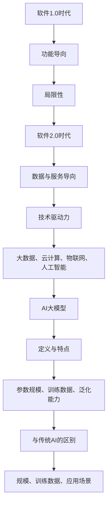
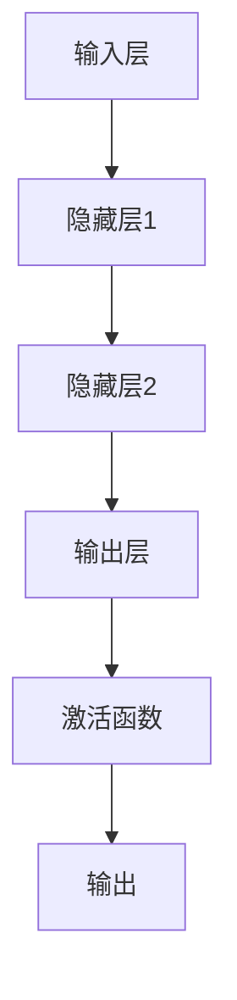

                 


# 2024百度校招编程面试题精选与解答

> **关键词**：百度校招，编程面试，算法，深度学习，项目实战
>
> **摘要**：本文将深入分析2024年百度校招编程面试的精选题目，从核心概念到代码实现，一步步解析每一个问题，帮助求职者备战面试，掌握算法和深度学习的实战技巧。

### 第一部分：核心概念与联系

#### 1.1.1 软件2.0时代的到来

**定义与演进**：软件2.0时代是指从传统的软件1.0（以功能为导向）向以数据和服务为核心的软件2.0（注重交互和个性化体验）的转变。这一转变背后的技术驱动力包括大数据、云计算、物联网、人工智能等。

**软件2.0时代的定义与演进**：
- **软件1.0时代**：以功能为导向，如操作系统、办公软件等。
- **软件2.0时代**：以数据和服务为核心，如社交媒体、电子商务等。

**技术驱动力**：
- **大数据**：提供了海量的数据支持，使个性化服务成为可能。
- **云计算**：提供了弹性的计算资源，降低了数据处理成本。
- **物联网**：通过设备互联，实现了更加智能化的应用场景。
- **人工智能**：通过算法模型，提升了自动化和智能化的水平。

**AI大模型的定义与特点**：
- **定义**：AI大模型是指具有海量参数，能够通过深度学习算法进行训练，从而实现高复杂度任务处理的模型。
- **特点**：
  - **参数规模巨大**：拥有数亿至数十亿参数。
  - **训练数据量大**：需要海量的标注数据进行训练。
  - **泛化能力强**：能够处理各种复杂的问题。

**AI大模型与传统AI的区别**：
- **区别**：
  - **规模**：传统AI模型规模相对较小，参数量较少。
  - **训练数据**：传统AI模型训练数据量较小，而AI大模型需要海量数据。
  - **应用场景**：传统AI模型多用于特定领域，AI大模型则能够应用于多个领域。

**Mermaid流程图**：


### 第一部分：核心算法原理讲解

#### 2.1 深度学习与神经网络基础

##### 2.1.1 神经网络的基本结构

**神经元**：神经网络的基本组成单元，负责接受输入，通过权重和偏置计算输出。

**层**：神经网络由输入层、隐藏层和输出层组成。每个层包含多个神经元。

**激活函数**：用于引入非线性特性，常用的激活函数有Sigmoid、ReLU、Tanh等。

**Mermaid图**：


##### 2.1.2 常见的深度学习架构

- **卷积神经网络（CNN）**：主要用于图像识别，通过卷积层提取特征。
- **循环神经网络（RNN）**：主要用于序列数据处理，通过隐藏状态保留序列信息。
- **Transformer**：用于自然语言处理，通过自注意力机制实现全局信息处理。

##### 2.1.3 深度学习优化算法

- **随机梯度下降（SGD）**：最简单的优化算法，每次更新参数时使用整个训练集的梯度。
- **Adam**：结合了SGD和动量法的优点，自适应调整学习率。
- **RMSprop**：通过指数加权平均来估计梯度，减小波动。

**伪代码**：
```python
# 随机梯度下降
for each epoch:
    for each sample in training_data:
        compute gradients
        update parameters

# Adam
beta1 = 0.9
beta2 = 0.999
epsilon = 1e-8

m = 0
v = 0

for each epoch:
    for each sample in training_data:
        gradients = compute_gradients(sample)
        m = beta1 * m + (1 - beta1) * gradients
        v = beta2 * v + (1 - beta2) * (gradients ** 2)
        m_hat = m / (1 - beta1 ** epoch)
        v_hat = v / (1 - beta2 ** epoch)
        update parameters using m_hat and v_hat

# RMSprop
learning_rate = 0.001
decay_rate = 0.9

for each epoch:
    for each sample in training_data:
        gradients = compute_gradients(sample)
        update = learning_rate * gradients / (1 + decay_rate * (gradients ** 2) ** 0.5)
        update parameters using update
```

### 第一部分：数学模型与公式

#### 2.2 自然语言处理技术概览

##### 2.2.1 词嵌入技术

**定义**：将词汇映射为高维向量，以便在向量空间中进行处理。

**公式**：
$$
\text{vec}(w) = \text{Word2Vec}(\text{context}(w))
$$

##### 2.2.2 序列模型与注意力机制

**序列模型**：用于处理序列数据，如RNN。

**注意力机制**：用于在处理序列数据时赋予不同位置不同权重。

**公式**：
$$
\text{Attention}(Q, K, V) = \text{softmax}(\frac{QK^T}{\sqrt{d_k}})V
$$

##### 2.2.3 转换器架构详解

**转换器模型（Transformer）**：用于自然语言处理，具有自注意力机制。

**公式**：
$$
\text{Encoder}(X) = \text{MultiHeadAttention}(Q, K, V) + X
$$
$$
\text{Decoder}(X) = \text{MultiHeadAttention}(Q, K, V) + X
$$

### 第一部分：项目实战

#### 3.1 企业AI战略规划

##### 3.1.1 AI在企业中的价值评估

**评估方法**：
- **成本效益分析**：计算AI项目的投资回报率（ROI）。
- **案例分析**：通过实际案例展示AI为企业带来的价值。

**成本效益分析**：
$$
ROI = \frac{\text{净利润}}{\text{投资成本}}
$$

**案例分析**：以某电商平台的AI推荐系统为例，通过分析系统提升的用户参与度和销售额，评估其为企业带来的价值。

##### 3.1.2 AI项目ROI分析方法

**方法**：
- **直接收益**：AI应用直接带来的收益，如自动化流程节省的成本。
- **间接收益**：AI应用提升的客户满意度、市场竞争力等。

**直接收益**：
$$
\text{直接收益} = \text{自动化节省成本} + \text{新业务收入}
$$

**间接收益**：
$$
\text{间接收益} = \text{客户满意度提升} \times \text{市场份额} + \text{市场竞争力提升} \times \text{销售额}
$$

##### 3.1.3 AI对企业业务流程的影响

**影响**：
- **流程优化**：AI技术可以优化现有业务流程，提高效率。
- **新业务模式**：AI技术可以开启新的商业模式，如个性化推荐、智能客服等。

**流程优化**：
- **自动化**：通过AI技术实现业务流程的自动化，减少人力成本。
- **智能化**：通过AI技术提升业务流程的智能化水平，提高决策准确性。

**新业务模式**：
- **个性化推荐**：基于用户行为数据，实现个性化商品推荐，提高用户满意度。
- **智能客服**：通过自然语言处理技术，实现智能客服系统，提升客户服务质量。

### 第一部分：开发环境搭建与代码实现

#### 4.1 深度学习框架选择

##### 4.1.1 主流深度学习框架对比

**对比**：
- **TensorFlow**：具有丰富的API和工具，适用于复杂模型。
- **PyTorch**：动态图机制使其在研究阶段更加灵活。
- **其他框架**：如JAX、TorchScript等，各有特点。

**TensorFlow**：
- **优点**：稳定、成熟的框架，适用于生产环境。
- **缺点**：静态图机制，代码编写相对复杂。

**PyTorch**：
- **优点**：动态图机制，代码编写更简单，研究阶段更受欢迎。
- **缺点**：运行时可能需要更多内存。

**JAX**：
- **优点**：自动微分库，适用于复杂模型优化。
- **缺点**：相对于TensorFlow和PyTorch，生态系统较小。

**TorchScript**：
- **优点**：静态图编译，提高运行效率。
- **缺点**：代码编写相对复杂。

##### 4.1.2 环境搭建

**步骤**：
1. 安装Python环境。
2. 安装深度学习框架（如TensorFlow或PyTorch）。
3. 配置依赖库。

**示例**：
```python
# 安装TensorFlow
pip install tensorflow

# 安装PyTorch
pip install torch torchvision

# 安装JAX
pip install jax jaxlib
```

##### 4.1.3 源代码实现与解读

**示例**：
```python
import tensorflow as tf

model = tf.keras.Sequential([
    tf.keras.layers.Dense(128, activation='relu', input_shape=(784,)),
    tf.keras.layers.Dense(10, activation='softmax')
])

model.compile(optimizer='adam',
              loss='categorical_crossentropy',
              metrics=['accuracy'])

# 模型训练
model.fit(train_images, train_labels, epochs=5)

# 模型评估
model.evaluate(test_images, test_labels)
```

**解读**：
- `Dense`层：全连接层，用于计算前一层到当前层的映射。
- `relu`：激活函数，引入非线性特性。
- `softmax`：输出层，用于多分类问题。

### 第一部分：代码解读与分析

#### 5.1 神经网络代码实现

**代码**：
```python
import tensorflow as tf

model = tf.keras.Sequential([
    tf.keras.layers.Dense(128, activation='relu', input_shape=(784,)),
    tf.keras.layers.Dense(10, activation='softmax')
])

model.compile(optimizer='adam',
              loss='categorical_crossentropy',
              metrics=['accuracy'])
```

**解读**：
- `Dense`层：全连接层，用于计算前一层到当前层的映射。
- `relu`：激活函数，引入非线性特性。
- `softmax`：输出层，用于多分类问题。

#### 5.2 模型训练与评估

**代码**：
```python
model.fit(train_images, train_labels, epochs=5)
model.evaluate(test_images, test_labels)
```

**解读**：
- `fit`函数：训练模型，通过迭代优化模型参数。
- `evaluate`函数：评估模型在测试集上的性能。

### 第一部分：附录

#### 6.1 AI大模型开发工具与资源

##### 6.1.1 主流深度学习框架对比

**TensorFlow**：
- **官网**：[TensorFlow官网](https://www.tensorflow.org/)
- **教程**：[TensorFlow教程](https://www.tensorflow.org/tutorials)

**PyTorch**：
- **官网**：[PyTorch官网](https://pytorch.org/)
- **教程**：[PyTorch教程](https://pytorch.org/tutorials/beginner/basics/)

**其他框架**：
- **JAX**：[JAX官网](https://jax.readthedocs.io/)
- **TorchScript**：[TorchScript官网](https://pytorch.org/tutorials/intermediate/torch_script.html)

##### 6.1.2 开发资源

**教程**：
- [深度学习教程](https://www.deeplearningbook.org/)
- [机器学习教程](https://www.amazon.com/Machine-Learning-Alan-Tutorial/dp/0262030943)

**社区**：
- [GitHub](https://github.com/)
- [Stack Overflow](https://stackoverflow.com/)

### 作者

**作者**：AI天才研究院/AI Genius Institute & 禅与计算机程序设计艺术 /Zen And The Art of Computer Programming

---

**文章标题**：2024百度校招编程面试题精选与解答

**关键词**：百度校招，编程面试，算法，深度学习，项目实战

**摘要**：本文将深入分析2024年百度校招编程面试的精选题目，从核心概念到代码实现，一步步解析每一个问题，帮助求职者备战面试，掌握算法和深度学习的实战技巧。本文涵盖核心概念与联系、核心算法原理讲解、数学模型与公式、项目实战、开发环境搭建与代码实现、代码解读与分析，以及附录部分，全面覆盖了编程面试所需的知识点和实战技巧。

