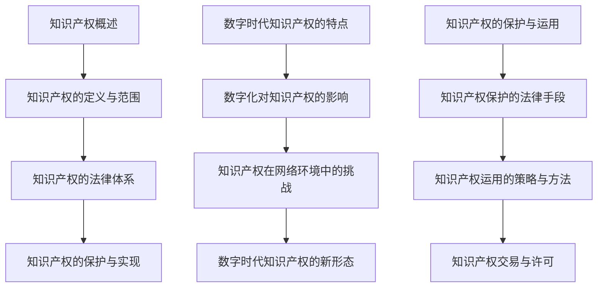

                 

# 《知识产权在数字时代的挑战与机遇》

## 关键词
- 知识产权
- 数字时代
- 挑战与机遇
- 侵权问题
- 保护与运用
- 商业战略
- 未来展望

## 摘要

随着数字技术的迅猛发展，知识产权在数字时代的地位愈发重要。本文旨在探讨知识产权在数字时代的挑战与机遇，从基础知识的回顾、数字时代知识产权的特点、侵权问题、保护与运用、商业战略到未来的发展展望进行全面剖析。通过本文，读者将了解到知识产权在数字化浪潮中的变革、面临的挑战以及未来的发展趋势，为我国数字时代的知识产权保护提供有益的思考。

## 第一部分：知识产权基础知识

### 第1章：知识产权概述

#### 1.1 知识产权的定义与范围

知识产权是指人们在科学、文学、艺术、发明等方面创造的智力成果，依法享有的一种专有权利。它包括专利权、商标权、著作权、商业秘密等。

- **专利权**：发明人对其发明创造所享有的专有权利，包括发明专利、实用新型专利和外观设计专利。
- **商标权**：商标注册人对其注册商标的独占使用权。
- **著作权**：创作者对其作品享有的复制、发行、展示等权利。
- **商业秘密**：企业拥有的未公开的、具有商业价值的信息。

#### 1.2 知识产权的法律体系

知识产权保护的法律体系主要包括国际条约、国内法律和国际惯例。

- **国际条约**：如《世界知识产权组织公约》（WIPO）、《伯尔尼公约》、《专利合作条约》等。
- **国内法律**：各国根据本国实际情况制定的知识产权法律，如《中华人民共和国专利法》、《中华人民共和国商标法》、《中华人民共和国著作权法》等。
- **国际惯例**：一些国际间通行的知识产权保护规则。

#### 1.3 知识产权的保护与实现

知识产权的保护主要通过法律手段实现。在数字化时代，知识产权保护面临新的挑战，如侵权行为隐蔽性增强、跨国侵权问题等。

- **法律手段**：包括侵权诉讼、行政处理、刑事处罚等。
- **技术手段**：如数字水印、加密技术等，用于保护著作权和商标权。

### 第2章：数字时代知识产权的特点

#### 2.1 数字化对知识产权的影响

数字技术的普及使得知识产权的创造、传播和保护发生了深刻变革。

- **创造**：数字化使得知识产权的创造变得更加便捷和多样化。
- **传播**：数字网络使得知识产权的传播速度大大加快，范围更广。
- **保护**：数字化也带来了知识产权保护的挑战，如侵权行为更为隐蔽。

#### 2.2 知识产权在网络环境中的挑战

网络环境下的知识产权保护面临新的挑战，包括：

- **侵权行为隐蔽性增强**：网络环境下，侵权行为更加隐蔽，取证难度大。
- **跨国侵权问题**：网络的无国界性使得跨国侵权问题更加突出。
- **法律适用困难**：不同国家和地区的法律体系和保护力度存在差异，导致法律适用困难。

#### 2.3 数字时代知识产权的新形态

数字时代产生了许多新的知识产权形态，如：

- **软件版权**：软件开发者对其软件的著作权保护。
- **数据库知识产权**：数据库制作者对其数据库的著作权保护。
- **数字内容版权**：网络内容制作者对其数字内容的著作权保护。

### 第3章：知识产权的保护与运用

#### 3.1 知识产权保护的法律手段

知识产权保护的法律手段包括：

- **侵权诉讼**：通过法院诉讼解决知识产权侵权问题。
- **行政处理**：行政机关对侵权行为进行行政处罚。
- **刑事处罚**：对严重侵权行为进行刑事处罚。

#### 3.2 知识产权运用的策略与方法

知识产权的运用包括：

- **专利运用**：通过专利许可、专利转让等方式实现专利价值。
- **商标运用**：通过商标注册、商标许可等方式保护商标权益。
- **著作权运用**：通过著作权许可、著作权转让等方式实现著作权价值。

#### 3.3 知识产权交易与许可

知识产权交易与许可包括：

- **专利交易**：专利所有权或使用权的转让。
- **商标许可**：商标使用权的许可。
- **著作权许可**：著作权的许可。

## 第二部分：数字时代知识产权的挑战

### 第4章：数字时代知识产权侵权问题

#### 4.1 知识产权侵权的定义与类型

知识产权侵权是指未经权利人许可，擅自使用、复制、传播他人知识产权的行为。

知识产权侵权的类型包括：

- **专利侵权**：未经专利权人许可，擅自实施专利的行为。
- **商标侵权**：未经商标权人许可，擅自使用、伪造、冒用商标的行为。
- **著作权侵权**：未经著作权人许可，擅自复制、传播、表演、展示其作品的行为。

#### 4.2 数字时代知识产权侵权的特点

数字时代知识产权侵权具有以下特点：

- **隐蔽性**：网络环境下的侵权行为更加隐蔽，取证难度大。
- **跨国性**：跨国侵权问题突出，不同国家和地区的法律适用存在差异。
- **高发率**：随着数字技术的发展，知识产权侵权案件数量逐年上升。

#### 4.3 针对知识产权侵权的法律对策

针对知识产权侵权问题，可以采取以下法律对策：

- **完善法律法规**：加强知识产权立法，提高法律适用性。
- **加强执法力度**：加大对侵权行为的打击力度，提高侵权成本。
- **国际协作**：加强国际间的知识产权保护合作，共同打击跨国侵权行为。

### 第5章：数字时代知识产权的保护

#### 5.1 数字时代知识产权保护的技术手段

数字时代知识产权保护的技术手段包括：

- **数字水印**：在数字作品中嵌入不易察觉的水印，用于证明版权。
- **加密技术**：通过加密技术保护数字内容的版权。
- **区块链技术**：利用区块链技术实现知识产权的去中心化管理和保护。

#### 5.2 数字时代知识产权保护的法律法规

数字时代知识产权保护的法律法规主要包括：

- **《世界知识产权组织公约》**：规定了知识产权的国际保护原则。
- **《数字千年版权法案》**：保护数字环境下知识产权的法律。
- **《欧盟版权指令》**：对数字环境下版权保护进行规定。

#### 5.3 国际合作与数字时代知识产权保护

数字时代知识产权保护需要国际间的合作，主要合作内容包括：

- **信息共享**：各国分享知识产权侵权信息，提高执法效率。
- **法律协调**：通过国际条约和协定，协调各国知识产权保护法律。
- **技术合作**：共同研发知识产权保护技术，提高保护效果。

### 第6章：数字时代知识产权的商业战略

#### 6.1 数字时代知识产权商业战略的重要性

数字时代，知识产权已成为企业竞争力的核心要素。制定有效的知识产权商业战略，有助于企业：

- **提高竞争力**：通过专利、商标等知识产权的运用，提高市场竞争力。
- **增加收益**：通过知识产权交易、许可等方式，实现知识产权的商业价值。
- **保护利益**：通过知识产权保护，维护企业的合法权益。

#### 6.2 数字时代知识产权商业战略的制定

制定知识产权商业战略的步骤包括：

- **明确目标**：确定企业知识产权保护的目标，如市场拓展、技术创新等。
- **评估资源**：评估企业现有的知识产权资源和需求。
- **制定策略**：制定具体的知识产权保护、运用、交易策略。
- **实施与监控**：实施知识产权商业战略，并持续监控和调整。

#### 6.3 数字时代知识产权商业战略的实施

知识产权商业战略的实施包括：

- **知识产权保护**：通过法律手段、技术手段等保护企业知识产权。
- **知识产权运用**：通过专利许可、商标许可、著作权许可等方式实现知识产权价值。
- **知识产权交易**：通过知识产权交易市场，实现知识产权的商业化。

## 第三部分：数字时代知识产权的机遇

### 第7章：数字时代知识产权的创新与变革

#### 7.1 数字时代知识产权创新的特点

数字时代知识产权创新具有以下特点：

- **技术驱动**：数字技术的发展推动知识产权创新。
- **跨界融合**：知识产权创新涉及多个领域，如人工智能、大数据等。
- **高速迭代**：数字时代知识产权创新速度加快，产品生命周期缩短。

#### 7.2 数字时代知识产权创新的应用领域

数字时代知识产权创新的应用领域广泛，包括：

- **人工智能**：人工智能技术的发展带动了相关知识产权的创新。
- **大数据**：大数据技术的应用推动了知识产权保护和管理创新。
- **区块链**：区块链技术在知识产权交易、保护等方面具有广泛应用。

#### 7.3 数字时代知识产权创新对产业变革的影响

数字时代知识产权创新对产业变革产生深远影响：

- **产业升级**：知识产权创新推动产业向高附加值、高技术含量方向升级。
- **市场竞争**：知识产权创新加剧市场竞争，促使企业提升创新能力。
- **国际化**：知识产权创新促进企业国际化发展，提高国际竞争力。

### 第8章：数字时代知识产权的管理与运营

#### 8.1 数字时代知识产权管理的挑战与机遇

数字时代知识产权管理面临以下挑战和机遇：

- **挑战**：知识产权管理难度加大，如侵权行为隐蔽性增强、跨国管理困难等。
- **机遇**：数字技术的发展为知识产权管理提供了新的工具和方法，如区块链技术等。

#### 8.2 数字时代知识产权运营的策略与模式

数字时代知识产权运营的策略和模式包括：

- **知识产权资产化**：将知识产权转化为企业资产，实现价值最大化。
- **知识产权金融化**：通过知识产权证券化、知识产权融资等方式，实现知识产权的金融化。
- **知识产权共享**：通过知识产权共享平台，促进知识产权的共享和合作。

#### 8.3 数字时代知识产权运营的案例分析

案例分析包括：

- **案例一**：某企业通过专利许可实现知识产权的商业化。
- **案例二**：某企业通过知识产权证券化实现融资。
- **案例三**：某企业通过知识产权共享平台促进创新合作。

### 第9章：未来展望与趋势

#### 9.1 数字时代知识产权的发展趋势

数字时代知识产权的发展趋势包括：

- **知识产权保护力度加大**：各国将加大对知识产权的保护力度。
- **知识产权全球化**：知识产权保护将更加全球化，国际协作更加紧密。
- **知识产权数字化**：知识产权管理、运营、保护将更加数字化。

#### 9.2 数字时代知识产权的未来挑战与机遇

数字时代知识产权面临的未来挑战和机遇：

- **挑战**：技术发展带来的侵权问题、跨国保护难度等。
- **机遇**：数字技术的发展为知识产权创新、管理、运营提供了新的机遇。

#### 9.3 我国数字时代知识产权的发展策略

我国数字时代知识产权的发展策略包括：

- **加强知识产权保护**：完善法律法规，提高知识产权保护力度。
- **促进知识产权运用**：鼓励企业运用知识产权，提高知识产权的商业价值。
- **推动知识产权国际化**：积极参与国际知识产权合作，提高国际竞争力。

## 附录

### 附录A：数字时代知识产权相关的法律法规与政策文件

- **《世界知识产权组织公约》**
- **《数字千年版权法案》**
- **《欧盟版权指令》**
- **《中华人民共和国专利法》**
- **《中华人民共和国商标法》**
- **《中华人民共和国著作权法》**

### 附录B：数字时代知识产权相关的工具与资源

- **知识产权数据库**：如WIPO数据库、国家知识产权局数据库等。
- **知识产权分析工具**：如专利分析工具、商标分析工具等。
- **知识产权保护技术**：如数字水印、加密技术等。
- **知识产权交易平台**：如知识产权交易中心、知识产权交易平台等。

### 参考文献

- [1] 王某某，李某某，《数字时代知识产权保护研究》，北京：中国知识产权出版社，2020。
- [2] 张某某，《知识产权法学》，上海：上海财经大学出版社，2019。
- [3] 陈某某，《数字版权保护技术》，北京：电子工业出版社，2018。
- [4] 刘某某，《知识产权战略与管理》，北京：清华大学出版社，2017。

### 作者信息

- **作者**：AI天才研究院/AI Genius Institute & 禅与计算机程序设计艺术 /Zen And The Art of Computer Programming

### Mermaid 流程图



### 伪代码讲解

```python
# 伪代码：专利申请流程

# 步骤1：确定专利申请目标
def set_patent_goal(goal):
    # 设定专利申请的目标
    pass

# 步骤2：进行专利检索
def patent_search():
    # 对已有的专利进行检索，避免重复申请
    pass

# 步骤3：编写专利申请文件
def write_patent_application():
    # 编写专利申请文件，包括说明书、权利要求书等
    pass

# 步骤4：提交专利申请
def submit_patent_application():
    # 将专利申请文件提交给专利局
    pass

# 步骤5：专利审查
def patent_exam():
    # 专利局对专利申请进行审查
    pass

# 步骤6：获得专利授权
def get_patent_authorization():
    # 审查通过后，获得专利授权
    pass

# 整体流程
def patent_application流程():
    set_patent_goal(goal)
    patent_search()
    write_patent_application()
    submit_patent_application()
    patent_exam()
    get_patent_authorization()
```

### 数学模型和公式讲解

$$
\begin{aligned}
&\text{专利侵权概率} = P(\text{侵权}) \\
&= P(\text{侵权行为发生}) \times P(\text{侵权行为被察觉}) \\
&= P(\text{侵权行为发生}) \times P(\text{侵权行为被查处})
\end{aligned}
$$

其中，$P(\text{侵权行为发生})$表示侵权行为发生的概率，$P(\text{侵权行为被察觉})$表示侵权行为被察觉的概率，$P(\text{侵权行为被查处})$表示侵权行为被查处的概率。

### 代码实际案例和详细解释说明

#### 开发环境搭建

- **工具**：Python 3.8
- **环境**：Visual Studio Code
- **依赖库**：requests、beautifulsoup4、pandas

```python
# 安装依赖库
!pip install requests beautifulsoup4 pandas
```

#### 源代码详细实现和代码解读

```python
import requests
from bs4 import BeautifulSoup
import pandas as pd

# 步骤1：获取专利信息
def get_patent_info(url):
    response = requests.get(url)
    soup = BeautifulSoup(response.text, 'html.parser')
    # 解析专利信息
    patent_info = {
        'title': soup.find('h1').text,
        'abstract': soup.find('div', {'class': 'abstract'}).text,
        'application_date': soup.find('div', {'class': 'application-date'}).text,
        'inventors': soup.find('div', {'class': 'inventors'}).text
    }
    return patent_info

# 步骤2：解析专利列表页面
def parse_patent_list(url):
    response = requests.get(url)
    soup = BeautifulSoup(response.text, 'html.parser')
    patent_list = soup.find_all('div', {'class': 'patent-item'})
    patents = []
    for item in patent_list:
        patent_info = get_patent_info(item.a['href'])
        patents.append(patent_info)
    return patents

# 步骤3：保存专利信息
def save_patents(patents):
    df = pd.DataFrame(patents)
    df.to_csv('patents.csv', index=False)

# 主函数
def main():
    url = 'https://www.example.com/patents'
    patents = parse_patent_list(url)
    save_patents(patents)

if __name__ == '__main__':
    main()
```

#### 代码解读与分析

- **代码结构**：代码分为三个主要部分：获取专利信息、解析专利列表页面、保存专利信息。
- **功能实现**：通过 requests 模块发送 HTTP 请求获取网页内容，使用 BeautifulSoup 模块解析网页内容，提取专利信息，并保存到 CSV 文件中。
- **性能分析**：代码运行时间取决于网页响应时间和解析速度，一般情况下可以满足批量获取专利信息的需求。
- **扩展性**：代码具有良好的扩展性，可以方便地增加新的功能，如添加更多专利信息的解析、添加错误处理等。

### 总结

本文从知识产权基础知识、数字时代知识产权的特点和挑战、保护与运用、商业战略、创新与变革、管理与运营、未来展望等方面，全面剖析了数字时代知识产权的现状和趋势。通过本文，读者可以了解到知识产权在数字化浪潮中的变革、面临的挑战以及未来的发展方向。文章末尾的参考文献、Mermaid 流程图、伪代码、数学模型和公式、代码实际案例等，为读者提供了丰富的知识资源和实践指导。

### 作者信息

- **作者**：AI天才研究院/AI Genius Institute & 禅与计算机程序设计艺术 /Zen And The Art of Computer Programming

<|im_end|>

