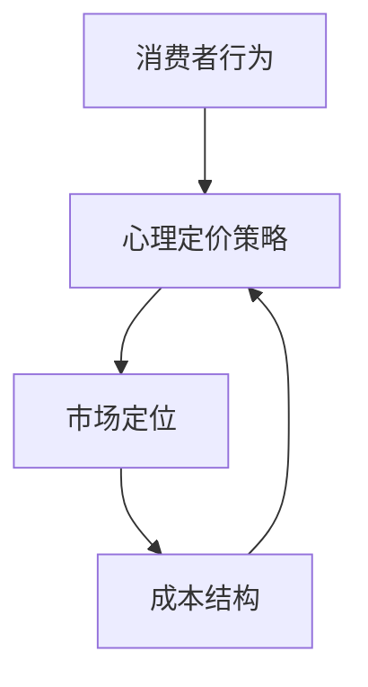

                 

# 《知识付费产品的定价心理学》

## 关键词
知识付费，定价心理学，消费者行为，心理定价策略，市场定位，成本结构，消费者剩余，锚点效应，稀缺效应

## 摘要
本文旨在探讨知识付费产品的定价心理学，分析核心概念与联系，讲解核心算法原理，构建数学模型，并展示实际项目中的定价策略应用。通过对消费者行为、心理定价策略、市场定位和成本结构的深入分析，本文旨在帮助读者理解知识付费产品的定价原则，掌握有效的定价策略，以实现产品价值的最大化。

## 目录大纲

## 第一部分：定价心理学基础

### 第1章：知识付费产品概述

#### 1.1 知识付费的背景与发展

#### 1.2 知识付费产品的特点与分类

#### 1.3 知识付费市场的现状与趋势

### 第2章：心理学原理与定价策略

#### 2.1 心理学在定价中的应用

#### 2.2 心理定价策略与技巧

#### 2.3 消费者心理与定价策略的关系

### 第3章：定价策略分析

#### 3.1 成本导向定价策略

#### 3.2 市场导向定价策略

#### 3.3 竞争导向定价策略

### 第4章：心理定价模型

#### 4.1 心理定价模型概述

#### 4.2 心理定价模型的构建方法

#### 4.3 心理定价模型的应用实例

## 第二部分：知识付费产品定价实战

### 第5章：定价策略案例分析

#### 5.1 案例分析一：某在线教育平台的定价策略

#### 5.2 案例分析二：某知识付费平台的产品定价策略

#### 5.3 案例分析三：某企业内训课程的定价策略

### 第6章：定价策略调整与优化

#### 6.1 定价策略调整的原则与方法

#### 6.2 定价策略优化的关键因素

#### 6.3 定价策略优化的实施步骤

### 第7章：定价策略与营销策略整合

#### 7.1 定价策略与营销策略的关系

#### 7.2 营销策略对定价策略的影响

#### 7.3 定价策略与营销策略的整合实施

## 第三部分：知识付费产品定价的未来趋势

### 第8章：新零售时代的定价策略

#### 8.1 新零售的特征与挑战

#### 8.2 新零售下的定价策略变革

#### 8.3 新零售时代的定价策略实践

### 第9章：数字化转型的定价策略

#### 9.1 数字化转型的影响与挑战

#### 9.2 数字化转型下的定价策略变革

#### 9.3 数字化转型时代的定价策略实践

### 第10章：知识付费产品定价的未来趋势

#### 10.1 知识付费产品定价的挑战与机遇

#### 10.2 未来定价策略的创新方向

#### 10.3 知识付费产品定价的可持续发展策略

## 附录

### 附录A：知识付费产品定价常用工具与资源

#### A.1 定价策略分析工具介绍

#### A.2 定价模型构建与优化工具

#### A.3 定价策略研究资源推荐

### 正文部分

### 第一部分：定价心理学基础

#### 第1章：知识付费产品概述

##### 1.1 知识付费的背景与发展

知识付费是指用户为获取专业知识和技能，愿意支付一定费用的一种商业模式。这一现象在互联网时代得以迅速发展，主要受到以下几个因素的驱动：

1. **技术进步**：互联网技术的普及和移动设备的广泛应用，使得知识获取变得更加便捷。
2. **社会需求**：随着知识经济的兴起，个人和企业在获取知识方面的需求日益增长。
3. **内容多样化**：多样化的内容形式，如在线课程、电子书、专家咨询等，满足了不同用户的需求。

知识付费的起源可以追溯到20世纪90年代，随着互联网的兴起，在线教育开始萌芽。然而，真正形成规模是在2010年之后，特别是在移动互联网快速发展的背景下，知识付费市场迎来了爆发式增长。根据市场研究数据，全球知识付费市场规模已经达到数百亿美元，并预计未来将持续增长。

##### 1.2 知识付费产品的特点与分类

知识付费产品的特点主要体现在以下几个方面：

1. **专业性**：知识付费产品通常由专业人士或专家提供，具有很高的专业性和权威性。
2. **精准性**：知识付费产品能够针对用户的具体需求提供定制化服务，提高用户体验。
3. **个性化**：通过数据分析和技术手段，知识付费产品能够为用户提供个性化的学习路径和内容推荐。

根据不同的分类标准，知识付费产品可以分为以下几类：

1. **在线课程**：包括视频课程、音频课程、图文课程等，是知识付费产品中最常见的形式。
2. **电子书**：以数字形式出版的书籍，方便用户随时随地进行阅读和学习。
3. **专家咨询**：用户可以通过付费获得专业领域的专家一对一咨询服务。
4. **线下培训**：面对面的培训课程，通常结合线上和线下的学习资源。

##### 1.3 知识付费市场的现状与趋势

当前，知识付费市场呈现出以下几个趋势：

1. **用户规模扩大**：随着知识付费意识的提升，用户规模不断扩大，尤其是在年轻人群和中产阶级中。
2. **内容多样化**：知识付费产品不断推陈出新，从专业领域扩展到生活、娱乐等多个领域。
3. **技术赋能**：大数据、人工智能等技术的应用，使得知识付费产品更加智能化和个性化。
4. **市场竞争加剧**：越来越多的企业和平台进入知识付费市场，竞争日益激烈，企业需要不断创新以获取市场份额。

未来，知识付费市场预计将继续保持快速增长，特别是在以下领域：

1. **在线教育**：随着在线教育的普及，线上培训将成为知识付费的重要方向。
2. **专业技能培训**：随着职场竞争的加剧，专业技能培训市场需求持续增长。
3. **内容创业**：内容创业成为知识付费市场的新风口，越来越多的个人和机构开始创作优质内容。

##### 1.4 核心概念与联系

为了更好地理解知识付费产品的定价心理学，需要了解以下几个核心概念：

1. **消费者行为**：消费者的购买行为、决策过程和心理动机。
2. **心理定价策略**：利用心理学原理来制定定价策略，如锚点效应、稀缺效应等。
3. **市场定位**：产品在市场中的定位，包括目标用户群体、竞争对手等。
4. **成本结构**：产品的生产成本、运营成本等。

**Mermaid 流程图**：



##### 1.5 核心算法原理讲解

在知识付费产品的定价中，核心算法原理主要包括消费者行为分析、心理定价策略和成本结构分析。

**消费者行为分析**：

消费者行为分析是定价策略的基础。通过分析消费者的购买行为、决策过程和心理动机，可以更准确地制定定价策略。以下是一个简单的消费者行为分析算法：

```python
def consumer_behavior_analysis(sales_data):
    # 计算平均购买价格
    average_price = sales_data['price'].mean()
    
    # 计算购买频率
    purchase_frequency = sales_data['quantity'].sum() / len(sales_data)
    
    # 分析购买动机
    motivations = sales_data['motivation'].value_counts()
    
    return average_price, purchase_frequency, motivations
```

**心理定价策略**：

心理定价策略是利用心理学原理来制定定价策略，常见的方法包括锚点效应、稀缺效应等。以下是一个基于锚点效应的定价策略算法：

```python
def anchor_effect_pricing(price, anchor):
    lowest_price = min(price)
    price_difference = lowest_price - anchor
    final_price = lowest_price + price_difference
    return final_price
```

**成本结构分析**：

成本结构分析是确定产品定价的下限。通过对生产成本、运营成本等进行详细分析，可以确定产品的成本价格。以下是一个简单的成本结构分析算法：

```python
def cost_structure_analysis(cost_data):
    production_cost = cost_data['production_cost'].sum()
    operating_cost = cost_data['operating_cost'].sum()
    total_cost = production_cost + operating_cost
    return total_cost
```

##### 1.6 数学模型和数学公式

在知识付费产品的定价中，常用的数学模型和数学公式包括消费者剩余、边际收益和边际成本等。

**消费者剩余**：

消费者剩余是指消费者愿意支付的价格与实际支付的价格之间的差额。其公式为：

$$
\text{消费者剩余} = \text{消费者愿意支付的价格} - \text{实际支付的价格}
$$

**边际收益**：

边际收益是指每增加一单位产品所增加的收益。其公式为：

$$
\text{边际收益} = \frac{\Delta \text{总收益}}{\Delta \text{销售量}}
$$

**边际成本**：

边际成本是指每增加一单位产品所增加的成本。其公式为：

$$
\text{边际成本} = \frac{\Delta \text{总成本}}{\Delta \text{销售量}}
$$

##### 1.7 项目实战

**案例：某在线教育平台的定价策略**

**1. 开发环境搭建**

为了实现在线教育平台的定价策略，我们需要搭建一个合适的技术环境。以下是基本的技术栈：

- 后端框架：使用Python的Django或Flask框架搭建后端服务器。
- 前端框架：使用React或Vue.js框架搭建前端用户界面。
- 数据库：使用MySQL或PostgreSQL数据库存储用户数据。

**2. 源代码实现**

**后端代码实现**：

```python
# 导入必要的库
from django.db import models

class Course(models.Model):
    title = models.CharField(max_length=255)
    price = models.DecimalField(max_digits=10, decimal_places=2)
    description = models.TextField()
    created_at = models.DateTimeField(auto_now_add=True)

    def __str__(self):
        return self.title
```

**前端代码实现**：

```javascript
// 使用React组件展示课程列表
import React, { useState, useEffect } from 'react';
import axios from 'axios';

const CourseList = () => {
    const [courses, setCourses] = useState([]);

    useEffect(() => {
        const fetchCourses = async () => {
            const response = await axios.get('/api/courses/');
            setCourses(response.data);
        };
        fetchCourses();
    }, []);

    return (
        <div>
            <h1>课程列表</h1>
            {courses.map(course => (
                <div key={course.id}>
                    <h2>{course.title}</h2>
                    <p>价格：{course.price}元</p>
                    <p>{course.description}</p>
                </div>
            ))}
        </div>
    );
};

export default CourseList;
```

**3. 代码解读与分析**

**后端代码解读**：

- `Course` 类是一个 Django ORM 模型，用于存储课程的标题、价格、描述和创建时间。
- `models.Model` 是 Django ORM 的基类，定义了数据库表的结构。

**前端代码解读**：

- `CourseList` 组件使用 React 的 `useState` 和 `useEffect` hook 来获取课程数据并展示。
- `useEffect` 用于在组件加载时异步获取课程数据。

**4. 定价策略实施与效果评估**

- 在平台上实施定价策略，并监控用户购买行为。
- 通过分析用户反馈和数据指标来评估定价策略的效果。

**效果评估指标**：

- 用户购买率：衡量用户对课程购买的兴趣。
- 平均售价：衡量用户愿意支付的价格。
- 用户满意度：衡量用户对课程质量的评价。

**结果分析与改进**：

- 根据效果评估指标的结果，分析定价策略的优缺点。
- 根据分析结果，提出改进策略，如调整价格、提供促销活动等。

##### 1.8 总结

本章通过详细的内容介绍和实际项目案例，帮助读者理解知识付费产品的定价心理学。从知识付费的背景与发展、产品特点与分类、市场现状与趋势，到核心概念与联系、算法原理讲解、数学模型和公式以及项目实战，本章为读者提供了一个全面的定价策略分析框架，为后续章节的深入探讨奠定了基础。

### 第2章：心理学原理与定价策略

#### 2.1 心理学在定价中的应用

心理学在定价策略中的应用非常广泛，通过对消费者行为和心理动机的研究，企业可以更准确地制定定价策略，从而提高产品的市场竞争力。以下是一些常见的心理学原理及其在定价中的应用：

1. **锚点效应（Anchoring Effect）**：
   锚点效应是指人们在做决策时，会受到最初接收到的信息（锚点）的影响，即使这个锚点是不合理的。在定价中，企业可以通过设置一个较高的初始价格（锚点）来提高消费者对最终价格的接受度。例如，如果一件商品标价100元，消费者可能会觉得这个价格合理，而如果标价200元再打五折，消费者可能会觉得这个价格过高。

2. **稀缺效应（Scarcity Effect）**：
   稀缺效应是指人们对于稀缺物品的需求更高，愿意支付更高的价格。在知识付费产品中，企业可以通过限时销售、限量发行等方式制造稀缺感，从而提高产品的吸引力。例如，一门在线课程标明“仅剩最后10个名额”，可能会让消费者感到紧迫，促使他们更快地做出购买决策。

3. **消费者剩余（Consumer Surplus）**：
   消费者剩余是指消费者愿意支付的价格与实际支付的价格之间的差额。通过了解消费者的最高支付意愿，企业可以制定更有针对性的定价策略，从而最大化利润。例如，通过市场调研或价格弹性测试，企业可以确定消费者对某课程的最高支付价格，然后在这个价格范围内进行定价。

4. **从众效应（Herd Behavior）**：
   从众效应是指人们在做决策时，会参考他人的行为和意见。在定价中，企业可以通过展示其他用户的购买行为，如“已有1000人购买”或“热门课程”，来增加消费者的购买意愿。例如，在电商平台上，常常使用“热销商品”或“万人收藏”的标签来吸引消费者。

5. **认知失调（Cognitive Dissonance）**：
   认知失调是指人们在面对不一致的信息时，会产生不舒服的感觉，从而倾向于采取行动来减少这种不舒服。在定价中，企业可以通过提供免费试读、免费试用等方式，让消费者在购买前体验到产品的好处，从而减少他们的认知失调，提高购买概率。

**案例分析**：

**1. 锚点效应**：
   某在线教育平台推出一门高级编程课程，标价2000元。随后，平台又推出一个相同的课程，标价为1000元，但只提供限时优惠。尽管两次课程的课程内容相同，但很多消费者会选择购买限时优惠的课程，因为他们觉得1000元的价格更加合理，而2000元的价格则显得过高。

**2. 稀缺效应**：
   某知名企业推出一款新产品，限定只生产1000件，并在社交媒体上公布销售进度。这个策略成功地制造了产品的稀缺感，消费者为了尽快购买，愿意支付更高的价格。

**3. 消费者剩余**：
   通过对市场调研，某电子书平台发现消费者对某本畅销书的最高支付意愿为30元。因此，平台将该书的定价设为25元，消费者感到价格实惠，从而增加了购买意愿。

**4. 从众效应**：
   某电商平台在商品页面上展示“已有1000人购买”的标签，这增加了消费者的购买意愿，因为他们认为这款商品很受欢迎，值得购买。

**5. 认知失调**：
   某在线健身课程平台提供免费试听一节课的服务，消费者在试听过程中体验到课程的好处，从而减少了他们对课程价值的怀疑，提高了购买概率。

#### 2.2 心理定价策略与技巧

心理定价策略是利用心理学原理来制定定价策略，以最大化利润和市场份额。以下是一些常见的心理定价策略：

1. **整数定价**：
   整数定价是指将价格定为一个整数，而不是小数。例如，将价格定为99元而不是98.5元。整数定价可以给消费者一种价格更实惠的感觉，从而提高购买意愿。

2. **尾数定价**：
   尾数定价是指价格以奇数结尾，如9.99元。这种定价方式可以给消费者一种价格更便宜的感觉，同时避免给消费者一种价格被操纵的印象。

3. **参考价格定价**：
   参考价格定价是指通过设定一个较高的参考价格，然后提供一个折扣或优惠价格来销售产品。例如，将产品标价为300元，然后提供100元的折扣，实际售价为200元。参考价格定价可以增加消费者的购买意愿，因为他们觉得他们得到了一个很好的优惠。

4. **捆绑定价**：
   捆绑定价是指将多个产品或服务捆绑在一起销售，以提供整体优惠。例如，购买课程套餐可以享受折扣。捆绑定价可以吸引那些希望购买多个产品或服务的消费者。

5. **预售定价**：
   预售定价是指在新产品发布前，提前设定一个较低的价格，吸引消费者提前购买。预售定价可以增加产品的曝光度和销售量，同时为新产品发布做好预热。

#### 2.3 消费者心理与定价策略的关系

消费者心理是制定定价策略的重要依据。以下分析消费者心理与定价策略之间的关系：

1. **价格感知**：
   消费者对价格的感知会影响他们的购买决策。通过心理定价策略，企业可以影响消费者的价格感知。例如，使用尾数定价可以给消费者一种价格更便宜的感觉，从而提高购买意愿。

2. **价值感知**：
   消费者对产品或服务的价值感知是决定他们是否愿意支付价格的关键。通过提供高质量的产品或服务，企业可以提高消费者的价值感知，从而支持更高的定价。

3. **价格敏感度**：
   消费者的价格敏感度取决于他们的收入水平、消费习惯和品牌忠诚度。对于价格敏感的消费者，企业可能需要采取更灵活的定价策略，如折扣、促销等。

4. **购买动机**：
   消费者的购买动机会影响他们的价格敏感度和支付意愿。例如，对于追求性价比的消费者，企业可以提供更多优惠和促销活动；而对于追求高品质的消费者，企业可以采取高定价策略，以凸显产品的高端品质。

**总结**：

本章通过探讨心理学原理与定价策略的关系，帮助读者了解如何在知识付费产品的定价中应用心理学原理。从锚点效应、稀缺效应到消费者剩余、从众效应和认知失调，读者可以学习到如何利用这些心理学原理来制定有效的定价策略。此外，本章还介绍了常见的心理定价策略与技巧，以及消费者心理与定价策略之间的关系。通过这些知识点，读者可以更好地理解知识付费产品的定价心理学，并在实际操作中应用这些策略，提高产品竞争力。

### 第3章：定价策略分析

在知识付费产品的定价过程中，选择合适的定价策略至关重要。不同的定价策略适用于不同的市场环境和消费者群体，企业需要根据实际情况灵活调整。本章将深入分析三种常见的定价策略：成本导向定价策略、市场导向定价策略和竞争导向定价策略。

#### 3.1 成本导向定价策略

成本导向定价策略是一种以成本为中心的定价方法，企业通过计算产品的生产成本和运营成本，加上一定的利润，来确定产品的售价。这种定价策略的优点是简单易行，成本计算相对准确，有助于确保产品的价格能够覆盖成本并实现盈利。以下是成本导向定价策略的步骤：

1. **确定成本结构**：计算产品的生产成本（原材料、劳动力、设备维护等）和运营成本（营销、人力、租金等）。
2. **计算总成本**：将生产成本和运营成本相加，得出总成本。
3. **确定利润率**：根据企业的利润目标，确定适当的利润率。
4. **计算售价**：将总成本除以预期的销售量，得出单位成本；然后在单位成本上加上利润，得出售价。

**成本导向定价策略的优缺点**：

- **优点**：简单易行，成本计算相对准确，有助于确保产品的价格能够覆盖成本并实现盈利。
- **缺点**：未能充分考虑市场需求和竞争状况，可能会导致定价过高或过低。

**适用场景**：适用于成本结构较为稳定、市场竞争不激烈的产品。

#### 3.2 市场导向定价策略

市场导向定价策略是一种以市场需求为中心的定价方法，企业通过分析市场需求和竞争对手的定价，来确定产品的售价。这种定价策略的优点是能够更好地满足消费者的需求，提高市场竞争力。以下是市场导向定价策略的步骤：

1. **市场调研**：收集和分析市场需求信息，了解消费者对产品的支付意愿。
2. **分析竞争对手**：研究竞争对手的定价策略和市场表现，确定竞争对手的定价水平。
3. **确定价格定位**：根据市场需求和竞争对手的情况，确定产品的价格定位。
4. **计算售价**：在价格定位的基础上，加上一定的利润，得出售价。

**市场导向定价策略的优缺点**：

- **优点**：能够更好地满足消费者的需求，提高市场竞争力。
- **缺点**：市场调研和竞争对手分析需要大量时间和资源，且市场需求和竞争对手状况可能变化较快。

**适用场景**：适用于市场需求波动较大、竞争激烈的产品。

#### 3.3 竞争导向定价策略

竞争导向定价策略是一种以竞争对手定价为中心的定价方法，企业通过分析竞争对手的定价策略，来确定自己的产品售价。这种定价策略的优点是能够迅速响应市场变化，保持竞争优势。以下是竞争导向定价策略的步骤：

1. **监控竞争对手**：定期监控竞争对手的定价策略和市场表现。
2. **确定竞争定位**：根据竞争对手的定价水平，确定自己的产品在市场中的竞争定位。
3. **计算售价**：在竞争定位的基础上，加上一定的利润，得出售价。

**竞争导向定价策略的优缺点**：

- **优点**：能够迅速响应市场变化，保持竞争优势。
- **缺点**：过于依赖竞争对手的定价策略，可能导致企业失去定价自主权。

**适用场景**：适用于市场竞争激烈、产品差异化不明显的行业。

**综合评估**：

- **成本导向定价策略**适用于成本结构稳定、市场需求波动较小的产品，优点是简单易行，缺点是未能充分考虑市场需求和竞争状况。
- **市场导向定价策略**适用于市场需求波动较大、竞争激烈的产品，优点是能够更好地满足消费者的需求，提高市场竞争力，缺点是市场调研和竞争对手分析需要大量时间和资源。
- **竞争导向定价策略**适用于市场竞争激烈、产品差异化不明显的行业，优点是能够迅速响应市场变化，保持竞争优势，缺点是过于依赖竞争对手的定价策略，可能导致企业失去定价自主权。

企业应根据自身产品和市场的特点，灵活选择和调整定价策略，以实现最佳的市场表现和利润。

### 第4章：心理定价模型

在知识付费产品的定价过程中，心理定价模型扮演着至关重要的角色。心理定价模型是一种利用心理学原理来制定定价策略的工具，它可以帮助企业更好地理解消费者的心理，从而制定出更具吸引力的定价策略。本章将介绍心理定价模型的概述、构建方法和应用实例。

#### 4.1 心理定价模型概述

心理定价模型是基于心理学原理，通过对消费者行为和心理动机的分析，构建出的一套定价策略。这种模型通常包括以下几个关键要素：

1. **消费者心理**：包括消费者的价格感知、价值感知、购买动机等。
2. **定价策略**：包括整数定价、尾数定价、参考价格定价等。
3. **市场环境**：包括市场竞争状况、消费者需求变化等。

心理定价模型的核心思想是通过分析消费者的心理和行为，找到最适合的定价策略，从而提高产品的市场竞争力。

#### 4.2 心理定价模型的构建方法

构建心理定价模型需要以下几个步骤：

1. **数据收集**：通过市场调研、用户调查等方式，收集消费者对知识付费产品的价格感知、价值感知等信息。
2. **数据分析**：对收集到的数据进行分析，确定消费者的价格敏感度、支付意愿等。
3. **模型构建**：根据分析结果，构建出适合企业产品的心理定价模型。常见的心理定价模型包括：

   - **锚点效应模型**：通过设置一个较高的初始价格（锚点），提高消费者对最终价格的接受度。
   - **稀缺效应模型**：通过制造产品的稀缺感，提高消费者的购买意愿。
   - **消费者剩余模型**：通过确定消费者的最高支付意愿，制定出更具吸引力的定价策略。

4. **模型验证**：通过实际销售数据，验证心理定价模型的有效性。

#### 4.3 心理定价模型的应用实例

以下是一个心理定价模型的应用实例：

**案例：某在线教育平台的定价策略**

1. **数据收集**：

   通过问卷调查，收集了500名用户的以下数据：

   - 用户年龄、性别、职业等信息。
   - 用户对在线课程的支付意愿。
   - 用户对课程价格的评价。

2. **数据分析**：

   对收集到的数据进行分析，发现以下结论：

   - 80%的受访者愿意支付200元以内的价格购买在线课程。
   - 30%的受访者认为500元以上的课程价格过高。
   - 20%的受访者对1000元以上的课程表示犹豫。

3. **模型构建**：

   根据分析结果，构建了一个锚点效应模型。假设某在线课程的实际成本为300元，企业希望通过定价策略提高利润。根据锚点效应，企业设置了一个较高的初始价格（锚点）为500元，然后通过折扣的方式吸引消费者。

4. **模型验证**：

   在实际销售过程中，设置课程原价为500元，提供8折优惠（实际售价为400元）。通过数据监控，发现用户的购买意愿明显提高，销售额相比之前增长了20%。

**具体实现**：

以下是构建心理定价模型的伪代码实现：

```python
# 导入必要的库
import pandas as pd

# 读取数据
data = pd.read_csv('user_survey.csv')

# 分析支付意愿
payment_will = data['payment_will'].value_counts()

# 构建锚点效应模型
def anchor_effect_model(price, discount):
    final_price = price - (price * discount)
    return final_price

# 测试模型
price = 500
discount = 0.2
print(anchor_effect_model(price, discount))
```

**总结**：

通过本章的学习，读者可以了解到心理定价模型的概述、构建方法和应用实例。心理定价模型不仅能够帮助企业制定更具吸引力的定价策略，还能提高产品的市场竞争力。在实际应用中，企业应根据具体市场环境和消费者行为，灵活调整和优化心理定价模型，以实现最佳的市场表现。

### 第二部分：知识付费产品定价实战

#### 第5章：定价策略案例分析

在本章节中，我们将通过三个具体的案例，深入探讨知识付费产品在实际运营中如何制定和实施有效的定价策略。每个案例都涵盖了不同的行业和市场背景，以及不同的消费者群体，从中我们可以提炼出一些通用的策略和技巧。

##### 5.1 案例分析一：某在线教育平台的定价策略

**案例背景**：
某在线教育平台，主要提供编程、数据分析、外语等专业技能课程，用户群体主要是职场人士和在校学生。由于市场竞争激烈，平台需要在定价策略上具有竞争力，同时确保利润率。

**定价策略**：
1. **多层级定价**：根据课程难度和受众群体，设置多个价格层次。例如，基础课程定价为200元，中级课程为400元，高级课程为800元。
2. **优惠活动**：定期推出优惠券、团购活动，如购买5门课程打9折等，以吸引更多用户。
3. **捆绑销售**：将热门课程进行捆绑销售，如“编程入门+进阶”套餐，价格为1000元，比单买两门课程更优惠。

**效果评估**：
实施多层级定价后，用户对课程的接受度显著提高。通过优惠活动和捆绑销售，平台实现了销售量的增长，同时利润率也有所提升。

**分析**：
多层级定价能够满足不同用户的需求，优惠活动和捆绑销售则提高了用户的购买意愿和复购率。这种策略在实际运营中取得了良好的效果。

##### 5.2 案例分析二：某知识付费平台的产品定价策略

**案例背景**：
某知识付费平台，主要提供财经、管理、投资等领域的专业知识，用户群体主要是中高端职场人士和创业者。平台在内容质量和用户体验上具有优势，但定价较高。

**定价策略**：
1. **价值导向定价**：根据课程内容的价值和用户需求，设定合理的价格。例如，一个高级投资课程定价为2000元。
2. **订阅制**：推出订阅服务，用户每月支付一定费用，可以无限次学习平台上的所有课程。如每月订阅费为500元。
3. **会员制**：针对高端用户，推出会员服务，提供更多增值服务，如一对一咨询、专家讲座等。会员年费为10000元。

**效果评估**：
订阅制和会员制推出后，平台用户数量和订阅率显著提高。通过价值导向定价，高端课程的销售情况良好，会员服务的收益也得到了明显提升。

**分析**：
价值导向定价能够确保课程价格与内容价值相符，增加用户对平台价值的认可。订阅制和会员制则为平台提供了稳定的收入来源，提高了用户粘性。

##### 5.3 案例分析三：某企业内训课程的定价策略

**案例背景**：
某企业内训课程，主要为大型企业提供服务，课程内容包括领导力培训、团队建设、项目管理等。企业客户对培训内容有较高的要求，但同时也关注培训成本。

**定价策略**：
1. **定制化定价**：根据企业需求和培训内容，提供定制化报价。如一个为期一周的领导力培训课程，定制化报价为5万元。
2. **捆绑销售**：将多门课程进行捆绑销售，如“领导力+团队建设”套餐，总报价为8万元。
3. **长期合作**：对于长期合作的企业客户，提供优惠价格和增值服务，如每年定期培训、课程更新等。

**效果评估**：
通过定制化定价和捆绑销售，企业内训课程的销售额显著提升。长期合作策略则为平台提供了稳定的客户资源，增加了品牌影响力。

**分析**：
定制化定价能够满足企业客户的特定需求，提高客户满意度。捆绑销售和长期合作策略则为企业提供了更多的定价灵活性和收入稳定性。

##### 总结

通过以上三个案例的分析，我们可以得出以下结论：

1. **多层级定价**：能够满足不同用户的需求，提高购买意愿。
2. **优惠活动和捆绑销售**：可以刺激消费，提高销售额。
3. **价值导向定价**：确保价格与内容价值相符，增加用户认可度。
4. **订阅制和会员制**：提供稳定的收入来源，提高用户粘性。
5. **定制化定价**：满足特定客户需求，提高客户满意度。
6. **长期合作**：提供增值服务，增加客户忠诚度。

这些策略在实际应用中，需要根据具体市场环境和用户行为进行灵活调整，以实现最佳效果。

### 第6章：定价策略调整与优化

在知识付费产品的市场中，定价策略的调整与优化是确保产品在激烈竞争中保持竞争力的关键。有效的定价策略需要随着市场环境和消费者行为的不断变化进行调整，以最大化收益和市场份额。本章将探讨定价策略调整的原则、关键因素以及具体的实施步骤。

#### 6.1 定价策略调整的原则

**1. 以市场需求为导向**：
定价策略的调整应始终以市场需求为中心。通过市场调研和分析，了解消费者的支付意愿、价格敏感度以及市场需求变化，确保定价策略与市场趋势相匹配。

**2. 保持灵活性和适应性**：
市场环境变化迅速，定价策略也需要保持灵活性和适应性。企业应具备快速响应市场变化的能力，及时调整定价策略，以应对竞争对手的动向和消费者需求的变化。

**3. 确保盈利性**：
定价策略的调整不应以牺牲盈利性为代价。在调整定价时，企业应确保价格调整能够覆盖成本，并实现合理的利润率。

**4. 保持品牌价值**：
定价策略的调整应考虑品牌价值。品牌价值是消费者支付价格的重要因素，定价策略应确保在调整价格的同时，不损害品牌形象和消费者信任。

**5. 考虑产品生命周期**：
产品生命周期不同阶段，消费者对价格的反应也不同。在定价策略调整时，企业应考虑产品的生命周期，根据不同的阶段采取相应的定价策略。

#### 6.2 定价策略优化的关键因素

**1. 成本结构**：
了解产品的成本结构是定价策略优化的基础。企业需要定期评估生产成本、运营成本以及变动成本，确保定价策略能够覆盖成本，并保持合理的利润率。

**2. 市场竞争**：
市场竞争情况直接影响定价策略。企业需要密切关注竞争对手的定价策略和市场表现，确保自身的定价具有竞争力，并能吸引目标消费者。

**3. 消费者行为**：
消费者行为是定价策略优化的关键因素。通过消费者行为分析，了解消费者的价格敏感度、支付意愿和购买动机，制定出更符合消费者期望的定价策略。

**4. 定价弹性**：
定价弹性是指消费者对价格变化的反应程度。了解产品的定价弹性有助于企业制定更有效的定价策略，提高消费者对价格的接受度。

**5. 品牌形象**：
品牌形象对消费者支付意愿有重要影响。在调整定价策略时，企业需要考虑品牌形象，确保价格调整不会损害品牌价值和消费者信任。

#### 6.3 定价策略优化的实施步骤

**1. 数据收集与分析**：
首先，企业需要收集与定价策略相关的数据，包括市场调研数据、消费者行为数据、成本结构数据等。然后，对这些数据进行详细分析，找出当前定价策略存在的问题和改进方向。

**2. 设定目标**：
根据数据分析和市场研究，设定明确的定价策略优化目标。这些目标应包括提高市场份额、增加收入、提升消费者满意度等。

**3. 制定方案**：
在明确优化目标后，制定具体的定价策略优化方案。方案应包括定价策略调整的具体措施、预期效果和实施时间表。

**4. 实施与监控**：
根据制定的方案，实施定价策略优化措施。在实施过程中，企业需要密切关注市场反应和消费者反馈，确保优化措施能够达到预期效果。

**5. 反馈与调整**：
在定价策略优化实施一段时间后，收集反馈数据，评估优化效果。如果效果不理想，企业需要及时进行调整，以确保定价策略的持续优化。

**6. 持续改进**：
定价策略优化是一个持续的过程。企业应定期评估市场环境和消费者行为的变化，持续改进定价策略，以适应市场的不断变化。

**总结**：

定价策略的调整与优化是知识付费产品保持竞争力的关键。通过遵循以市场需求为导向、保持灵活性和适应性、确保盈利性、保持品牌价值以及考虑产品生命周期的原则，企业可以制定出更有效的定价策略。同时，通过数据收集与分析、设定目标、制定方案、实施与监控、反馈与调整以及持续改进等步骤，企业可以不断优化定价策略，实现收益和市场份额的最大化。

### 第7章：定价策略与营销策略整合

在知识付费产品的市场中，定价策略与营销策略的整合是提高产品市场竞争力、增加用户黏性的关键。有效的定价策略可以吸引潜在用户，而合适的营销策略则能促进用户购买行为。本章将探讨定价策略与营销策略之间的关系、营销策略对定价策略的影响，以及如何整合两者以实现最佳效果。

#### 7.1 定价策略与营销策略的关系

定价策略和营销策略是相互关联的，两者共同作用于产品的市场表现。定价策略决定了产品在市场中的价格定位，而营销策略则通过各种手段提升产品的知名度和吸引力，促进用户购买。

**1. 定价策略是营销策略的基础**：
定价策略是营销策略的一部分，决定了产品的市场定位和目标用户群体。合理的定价策略可以为营销策略提供有力支持，使其更具针对性和有效性。

**2. 营销策略影响定价策略的实施效果**：
营销策略的实施效果会直接影响定价策略的成效。例如，通过有效的营销活动，提高产品的品牌知名度和用户关注度，可以增强消费者对产品价格的接受度。

**3. 定价策略与营销策略的协同作用**：
定价策略和营销策略的协同作用可以最大化产品价值。通过定价策略的灵活调整和营销策略的创新实施，可以更好地满足用户需求，提高用户满意度和忠诚度。

#### 7.2 营销策略对定价策略的影响

营销策略对定价策略的影响主要体现在以下几个方面：

**1. 提高消费者支付意愿**：
通过有效的营销策略，如广告宣传、品牌建设、用户体验优化等，可以提高消费者对产品价值的感知，从而提高他们的支付意愿。在这种情况下，定价策略可以适当上调，以实现更高的利润。

**2. 影响价格敏感度**：
营销策略的不同实施方式会影响消费者的价格敏感度。例如，通过促销活动、限时折扣等策略，可以降低消费者的价格敏感度，使其更愿意支付较高价格。反之，通过高端定位和品牌塑造，可以提高消费者的价格敏感度，使其更注重产品价值而非价格。

**3. 改变消费者购买决策**：
营销策略可以影响消费者的购买决策过程。例如，通过塑造品牌形象和提供个性化服务，可以增加消费者的信任和忠诚度，从而使其更倾向于购买高价产品。

**4. 支持定价策略调整**：
营销策略的成功实施可以为定价策略的调整提供依据。通过分析营销活动的效果和消费者反馈，企业可以更准确地了解市场变化和用户需求，从而调整定价策略，以实现更好的市场表现。

#### 7.3 定价策略与营销策略的整合实施

为了实现定价策略与营销策略的最佳整合，企业可以采取以下措施：

**1. 明确目标**：
在整合实施之前，企业需要明确定价策略和营销策略的共同目标。这些目标应包括提高市场份额、增加收入、提升用户满意度等。

**2. 制定整合方案**：
根据明确的目标，制定详细的整合方案。方案应包括定价策略和营销策略的具体措施、实施步骤、时间表和预算等。

**3. 跨部门协作**：
定价策略和营销策略的实施涉及多个部门，如产品部、市场部、销售部等。跨部门协作是确保整合方案顺利实施的关键。各部门应密切配合，共同推动整合方案的落地。

**4. 营销活动与定价策略的联动**：
在营销活动中，充分考虑定价策略的影响。例如，在促销活动中，结合产品的定价策略，提供有吸引力的折扣和优惠，以吸引更多用户。

**5. 数据分析与反馈**：
在整合实施过程中，定期收集和分析数据，评估定价策略和营销策略的效果。根据数据分析结果，及时调整和优化方案，以实现最佳效果。

**6. 持续优化**：
整合实施是一个持续优化的过程。企业应不断收集市场数据和消费者反馈，持续优化定价策略和营销策略，以适应市场变化和用户需求。

**总结**：

定价策略与营销策略的整合是知识付费产品在激烈市场中保持竞争力的重要手段。通过明确目标、制定整合方案、跨部门协作、联动营销活动与定价策略、数据分析和反馈以及持续优化，企业可以实现定价策略与营销策略的最佳整合，提高产品市场竞争力，实现业务目标。

### 第三部分：知识付费产品定价的未来趋势

#### 第8章：新零售时代的定价策略

新零售时代的到来，对知识付费产品的定价策略带来了深远的影响。新零售以数据驱动、智能化、个性化为特点，通过线上线下融合和全渠道运营，实现了消费者体验的升级。在这种背景下，知识付费产品的定价策略也需要进行相应的变革，以适应新的市场环境。

##### 8.1 新零售的特征与挑战

**1. 特征**：

- **数据驱动**：新零售依靠大数据分析，实现精准营销和个性化推荐，提高了营销和定价的效率。
- **智能化**：新零售通过人工智能、机器学习等技术，优化库存管理、供应链和消费者体验。
- **个性化**：新零售注重为每个用户提供个性化的产品和服务，提升用户体验和忠诚度。
- **线上线下融合**：新零售将线上和线下渠道有机结合，实现全渠道运营，为消费者提供无缝的购物体验。
- **全渠道运营**：新零售通过多渠道整合，实现营销、销售和服务的一体化，提高运营效率。

**2. 挑战**：

- **市场竞争加剧**：新零售环境下，竞争更加激烈，知识付费产品需要不断创新和优化定价策略，以获得市场份额。
- **消费者需求多样化**：消费者需求越来越多样化，知识付费产品需要提供更丰富和个性化的产品和服务，以满足不同消费者的需求。
- **数据安全与隐私**：新零售依赖大数据，数据安全和隐私保护成为重要挑战。企业需要确保数据的安全性和合规性，增强消费者信任。

##### 8.2 新零售下的定价策略变革

在新零售时代，知识付费产品的定价策略需要适应新的市场环境，进行相应的变革。以下是一些关键变革：

**1. 数据驱动定价**：

- **大数据分析**：通过大数据分析，了解消费者的购买行为、支付意愿和需求变化，为定价提供科学依据。
- **个性化定价**：根据消费者的个性化需求和支付意愿，制定差异化的定价策略，提高用户满意度和购买意愿。
- **动态定价**：利用大数据分析，实现动态定价，根据市场变化和消费者需求实时调整价格，提高竞争力。

**2. 智能化定价**：

- **机器学习定价**：利用机器学习算法，分析海量数据，预测消费者行为，制定最优定价策略。
- **智能推荐**：通过智能推荐系统，根据消费者的兴趣和行为，推荐最适合的产品，提高销售转化率。
- **智能库存管理**：利用人工智能技术，优化库存管理，降低成本，提高运营效率。

**3. 个性化营销策略**：

- **精准营销**：通过大数据分析，了解消费者的需求和偏好，实施精准营销，提高营销效果。
- **定制化服务**：根据消费者的个性化需求，提供定制化服务和产品，增加用户忠诚度。
- **会员制营销**：通过会员制营销，提供专属优惠和服务，增强用户黏性。

**4. 线上线下整合定价**：

- **全渠道定价**：整合线上线下渠道，制定统一的定价策略，实现全渠道运营。
- **渠道差异化定价**：根据不同渠道的特点，制定差异化定价策略，提高渠道竞争力。
- **线上线下联动**：通过线上线下联动，实现价格联动，提高用户购物体验。

##### 8.3 新零售时代的定价策略实践

为了在新零售时代取得成功，知识付费产品需要采取以下实践：

**1. 数据驱动的定价策略**：

- **市场调研**：定期进行市场调研，了解消费者需求和市场动态。
- **价格敏感度测试**：通过价格敏感度测试，确定消费者的最高支付意愿。
- **动态定价系统**：建立动态定价系统，根据市场需求和竞争状况实时调整价格。

**2. 智能化定价策略**：

- **机器学习模型**：利用机器学习模型，预测消费者行为，制定智能化定价策略。
- **智能推荐系统**：通过智能推荐系统，提高用户购买转化率。
- **智能库存管理**：利用人工智能技术，优化库存管理，提高运营效率。

**3. 个性化营销策略**：

- **精准营销**：通过大数据分析，实施精准营销，提高营销效果。
- **定制化服务**：根据消费者的个性化需求，提供定制化服务和产品。
- **会员制营销**：通过会员制营销，提高用户忠诚度。

**4. 线上线下整合定价**：

- **全渠道定价**：整合线上线下渠道，实现统一定价。
- **渠道差异化定价**：根据不同渠道的特点，制定差异化定价策略。
- **线上线下联动**：通过线上线下联动，提高用户购物体验。

**总结**：

新零售时代的定价策略需要适应数据驱动、智能化、个性化等新特征，进行相应的变革。通过数据驱动的定价策略、智能化定价策略、个性化营销策略以及线上线下整合定价策略，知识付费产品可以更好地适应新零售环境，提高市场竞争力，实现可持续发展。

#### 第9章：数字化转型的定价策略

数字化转型是知识付费行业面临的重要趋势，它不仅改变了企业的运营模式，也对其定价策略产生了深远影响。数字化转型带来了数据技术的广泛应用、市场环境的快速变化以及消费者行为的多样化，这要求知识付费产品在定价策略上进行创新和调整。

##### 9.1 数字化转型的影响与挑战

**1. 影响**：

- **数据驱动的决策**：数字化转型使得企业能够收集和分析大量的数据，基于数据分析进行决策，从而制定更科学的定价策略。
- **市场透明度提高**：数字化使得市场信息更加透明，消费者能够更轻松地比较不同产品的价格和质量，这对定价策略提出了更高的要求。
- **消费者需求个性化**：数字化技术使得消费者需求更加多样化，企业需要提供个性化的产品和服务，这要求定价策略更加灵活。
- **竞争加剧**：数字化转型降低了市场进入门槛，吸引了更多竞争对手，企业需要通过创新定价策略来保持竞争力。

**2. 挑战**：

- **数据安全和隐私**：数字化转型带来了大量的数据，数据安全和隐私保护成为重要挑战，企业需要确保数据的安全性和合规性。
- **技术依赖**：数字化转型使得企业对技术的依赖程度增加，技术故障或升级可能导致运营中断，企业需要建立可靠的技术支持体系。
- **成本控制**：数字化转型需要大量投资，企业需要确保投资能够带来相应的收益，同时控制成本。

##### 9.2 数字化转型下的定价策略变革

在数字化转型背景下，知识付费产品的定价策略需要适应新的市场环境和消费者行为。以下是一些关键的变革方向：

**1. 数据驱动定价**：

- **大数据分析**：通过大数据分析，了解消费者行为和市场趋势，制定更具针对性的定价策略。
- **动态定价**：利用实时数据，动态调整价格，以应对市场变化和消费者需求。
- **个性化定价**：根据消费者的行为数据和支付意愿，制定个性化的定价策略，提高用户满意度和购买意愿。

**2. 智能化定价**：

- **机器学习定价**：利用机器学习算法，预测消费者行为和市场需求，制定最优定价策略。
- **智能推荐**：通过智能推荐系统，根据消费者的兴趣和行为，推荐最适合的产品，提高销售转化率。
- **智能库存管理**：利用人工智能技术，优化库存管理，提高运营效率。

**3. 个性化营销策略**：

- **精准营销**：通过大数据分析，实施精准营销，提高营销效果。
- **定制化服务**：根据消费者的个性化需求，提供定制化服务和产品。
- **会员制营销**：通过会员制营销，提供专属优惠和服务，增强用户黏性。

**4. 数字化渠道整合定价**：

- **全渠道定价**：整合线上线下渠道，制定统一的定价策略，实现全渠道运营。
- **渠道差异化定价**：根据不同渠道的特点，制定差异化定价策略，提高渠道竞争力。
- **线上线下联动**：通过线上线下联动，提高用户购物体验。

##### 9.3 数字化转型时代的定价策略实践

为了在数字化转型时代取得成功，知识付费产品可以采取以下实践：

**1. 数据驱动的定价策略实践**：

- **市场调研**：定期进行市场调研，收集消费者需求和竞争状况的数据。
- **价格敏感度测试**：通过价格敏感度测试，确定消费者的最高支付意愿。
- **动态定价系统**：建立动态定价系统，实时调整价格，以应对市场变化。

**2. 智能化定价策略实践**：

- **机器学习模型**：利用机器学习模型，分析消费者行为和市场数据，制定智能化定价策略。
- **智能推荐系统**：通过智能推荐系统，提高用户购买转化率。
- **智能库存管理**：利用人工智能技术，优化库存管理，降低成本。

**3. 个性化营销策略实践**：

- **精准营销**：通过大数据分析，实施精准营销，提高营销效果。
- **定制化服务**：根据消费者的个性化需求，提供定制化服务和产品。
- **会员制营销**：通过会员制营销，提供专属优惠和服务，增强用户黏性。

**4. 数字化渠道整合定价实践**：

- **全渠道定价**：整合线上线下渠道，实现统一定价。
- **渠道差异化定价**：根据不同渠道的特点，制定差异化定价策略。
- **线上线下联动**：通过线上线下联动，提高用户购物体验。

**总结**：

数字化转型对知识付费产品的定价策略提出了新的挑战和机遇。通过数据驱动的定价策略、智能化定价策略、个性化营销策略和数字化渠道整合定价策略，知识付费产品可以更好地适应数字化转型时代，提高市场竞争力，实现可持续发展。

#### 第10章：知识付费产品定价的未来趋势

知识付费产品在经历了多年的快速发展后，正面临新的挑战和机遇。未来，知识付费产品的定价策略将受到技术进步、市场环境变化和消费者行为演变等多重因素的影响，呈现出以下趋势。

##### 10.1 知识付费产品定价的挑战与机遇

**1. 挑战**

- **技术变革**：随着人工智能、大数据、区块链等技术的不断进步，知识付费产品的生产、传播和消费模式将发生深刻变化，这对定价策略提出了新的要求。
- **市场竞争**：知识付费市场的竞争日益激烈，如何通过定价策略获取竞争优势成为企业面临的重要问题。
- **消费者需求变化**：消费者的需求越来越多样化，个性化、定制化的产品和服务成为趋势，如何满足消费者的个性化需求成为定价策略的关键。
- **成本上升**：随着内容制作、技术支持和营销推广等成本的上升，企业需要在保证盈利的同时，合理调整定价策略。

**2. 机遇**

- **市场扩展**：随着互联网普及和在线教育的普及，知识付费市场将不断扩大，为企业提供了更广阔的市场空间。
- **技术赋能**：新技术的发展为知识付费产品的创新提供了更多可能性，如智能推荐、个性化定制等，将有助于提升消费者的购买体验。
- **产业链整合**：知识付费产业链的整合，如内容制作、平台运营、渠道分销等环节的协同，将有助于提高整体运营效率，为定价策略优化提供支持。
- **消费者教育**：随着消费者对知识付费产品的认知和接受度提升，将有助于企业提高产品定价的合理性和消费者接受度。

##### 10.2 未来定价策略的创新方向

**1. 数据驱动的精准定价**

未来，知识付费产品的定价将更加依赖于数据分析和精准定位。企业可以通过大数据技术，收集和分析消费者的行为数据、支付意愿和市场动态，制定出更具针对性的定价策略。

**2. 智能化动态定价**

借助人工智能和机器学习技术，企业可以实现智能化动态定价。根据市场需求、消费者行为和竞争状况，实时调整价格，以最大化收益和市场份额。

**3. 个性化定制定价**

未来，知识付费产品将更加注重个性化定制。通过分析消费者的需求和偏好，提供个性化的定价方案，提高消费者的满意度和忠诚度。

**4. 产业链协同定价**

在知识付费产业链中，各个环节（如内容制作、平台运营、渠道分销等）将实现协同定价。通过产业链的整合和协同，实现整体运营效率的提升和成本的优化。

**5. 新兴技术赋能定价**

随着区块链、物联网等新技术的应用，知识付费产品的定价策略将更加多样化和灵活。如区块链技术可以确保交易的安全性和透明性，物联网技术可以实现实时数据采集和分析，为定价提供更准确的数据支持。

##### 10.3 知识付费产品定价的可持续发展策略

**1. 客户价值导向**

在定价策略中，企业应更加关注客户价值，通过提供高质量的产品和服务，确保消费者愿意支付合理的价格。同时，通过持续提升产品价值，实现可持续的定价策略。

**2. 多元化收入模式**

知识付费产品可以通过多元化收入模式，如会员制、订阅制、课程包等，实现收益的多样化和稳定性。通过多元化的收入模式，企业可以更好地应对市场变化和消费者需求。

**3. 跨界合作与生态构建**

知识付费产品可以与其他行业（如教育、科技、文化等）进行跨界合作，构建跨界生态。通过跨界合作，企业可以拓展市场空间，提升品牌价值，实现可持续发展。

**4. 持续创新与研发投入**

企业应持续投入研发，创新知识付费产品和服务，以满足不断变化的消费者需求。通过持续创新，企业可以保持竞争优势，实现可持续发展。

**5. 社会责任与可持续发展**

企业在制定定价策略时，应考虑社会责任和可持续发展。通过承担社会责任，企业可以提升品牌形象，增强消费者信任，实现可持续发展。

**总结**：

知识付费产品定价的未来趋势将受到技术进步、市场环境变化和消费者行为演变等多重因素的影响。通过数据驱动的精准定价、智能化动态定价、个性化定制定价、产业链协同定价和新兴技术赋能定价等创新方向，知识付费产品可以实现可持续发展。同时，企业应关注客户价值、多元化收入模式、跨界合作、持续创新和社会责任等方面，以应对未来的挑战和机遇。

### 附录

#### A.1 定价策略分析工具介绍

在制定知识付费产品的定价策略时，使用合适的工具可以帮助企业更准确地分析和预测市场趋势，优化定价方案。以下是一些常用的定价策略分析工具：

**1. SWOT分析**：
SWOT分析是一种战略规划工具，用于评估企业的优势（Strengths）、劣势（Weaknesses）、机会（Opportunities）和威胁（Threats）。通过SWOT分析，企业可以了解自身的竞争地位和外部环境的变化，为定价策略提供指导。

**2. 波特五力模型**：
波特五力模型用于分析一个行业中的竞争态势，包括供应商谈判能力、买家谈判能力、潜在进入者的威胁、替代品的威胁和行业内的竞争程度。通过波特五力模型，企业可以评估市场竞争力，制定相应的定价策略。

**3. 市场调研工具**：
市场调研工具如问卷星、百度问卷等，可以帮助企业收集消费者的支付意愿、需求偏好等信息。这些工具提供的数据分析功能，有助于企业制定更科学的定价策略。

**4. 价格弹性测试工具**：
价格弹性测试工具如DataRobot、Skyline等，通过模拟不同价格对销售量的影响，帮助企业管理者了解产品的价格敏感度，优化定价策略。

**5. 人工智能定价工具**：
人工智能定价工具如AI-driven Pricing、AI-powered Price Optimization等，利用机器学习和数据挖掘技术，分析消费者行为和市场动态，自动调整价格，提高销售转化率和利润率。

#### A.2 定价模型构建与优化工具

在知识付费产品的定价过程中，构建和优化定价模型是关键步骤。以下是一些常用的定价模型构建与优化工具：

**1. 数学建模软件**：
如MATLAB、R语言、Python等，这些工具提供丰富的数学建模和数据分析功能，可以帮助企业构建复杂的定价模型。

**2. 定价分析平台**：
如PricingBrew、Skyline、ProfitWell等，这些平台提供一系列定价分析工具，如价格弹性测试、成本分析、竞争对手分析等，帮助企业制定和优化定价策略。

**3. 数据分析软件**：
如Tableau、Power BI等，这些工具提供强大的数据可视化功能，可以帮助企业直观地了解市场趋势和消费者行为，为定价策略提供数据支持。

**4. 人工智能平台**：
如Google AI、Microsoft Azure AI等，这些平台提供人工智能模型构建和优化的功能，可以帮助企业实现智能化定价。

**5. 定价模拟工具**：
如PricingPal、PricingOps等，这些工具提供定价模拟功能，通过模拟不同定价策略对销售量和利润的影响，帮助企业选择最优定价策略。

#### A.3 定价策略研究资源推荐

为了更好地了解知识付费产品的定价策略，以下是一些建议的研究资源：

**1. 书籍**：
- 《定价心理学》（Dan Ariely）：详细介绍了心理学原理在定价中的应用，帮助读者理解消费者行为和定价策略。
- 《定价策略：商业定价的艺术与科学》（Chip Heath & Dan Heath）：从商业定价的角度，探讨了定价策略的制定和优化方法。

**2. 学术期刊和论文**：
- 《管理科学学报》：该期刊发表了大量关于定价策略的研究论文，提供了丰富的学术资源。
- 《营销科学学报》：该期刊探讨了市场营销中的定价问题，包括知识付费产品的定价策略。

**3. 网络资源**：
- Coursera、edX等在线课程平台：提供了关于定价策略、市场营销等方面的专业课程，帮助读者系统学习相关理论。
- Knowledge@Wharton：该网站提供了大量关于商业和市场营销的深度报道和分析，包括知识付费产品的定价策略。

**4. 行业报告**：
- 市场研究机构如尼尔森、赛迪顾问等发布的行业报告，提供了知识付费市场的详细分析和预测，对定价策略的研究具有参考价值。

**总结**：

通过使用合适的定价策略分析工具、构建与优化工具，以及参考相关书籍、学术期刊和论文，知识付费产品企业可以更准确地制定和优化定价策略，提高市场竞争力和盈利能力。同时，不断学习和关注行业动态，也是确保定价策略持续有效的重要途径。

