                 

### 《知识付费赚钱的品牌口碑监测与舆情管理策略》

> **关键词**：知识付费、品牌口碑、舆情管理、算法原理、数学模型、项目实战、案例分析

> **摘要**：本文将深入探讨知识付费市场的品牌口碑监测与舆情管理策略。通过分析核心概念、算法原理、数学模型和实际项目，我们将了解如何利用技术手段监测和管理品牌口碑，从而实现知识付费产品的成功营销。

### 《知识付费赚钱的品牌口碑监测与舆情管理策略》目录大纲

#### 第一部分：核心概念与联系

##### 第1章：知识付费与品牌口碑概述

##### 第2章：舆情管理的概念与范围

##### 第3章：品牌口碑监测算法原理

##### 第4章：舆情管理策略与实施

#### 第二部分：核心算法原理讲解

##### 第5章：品牌口碑监测算法原理

##### 第6章：舆情管理策略与实施

##### 第7章：数据可视化与报告

#### 第三部分：数学模型与公式详细讲解

##### 第8章：品牌口碑监测数学模型

##### 第9章：舆情管理数学模型

##### 第10章：数学模型应用与案例分析

#### 第四部分：项目实战

##### 第11章：品牌口碑监测与舆情管理项目实战

##### 第12章：舆情监测与危机应对实战案例

#### 第五部分：案例分析与应用前景

##### 第13章：成功案例分析

##### 第14章：行业应用前景

##### 第15章：未来发展趋势

#### 第六部分：附录

##### 第16章：工具与技术资源

##### 第17章：参考文献

### 第1章：知识付费与品牌口碑概述

#### 1.1.1 知识付费的发展背景与市场现状

知识付费作为一种新兴商业模式，近年来在我国市场迅速崛起。其发展背景主要源于以下几个因素：

1. **用户需求**：随着信息时代的发展，人们对于高质量、专业化的知识需求日益增长。知识付费满足了用户对专业知识的追求，帮助他们解决实际问题，提升个人能力。
2. **移动互联网普及**：移动互联网的普及为知识付费提供了便捷的获取途径，用户可以通过手机、平板等设备随时随地学习。
3. **内容创作平台兴起**：如得到、知乎、喜马拉雅等知识付费平台为内容创作者提供了展示才华的舞台，吸引了大量优秀人才投身知识付费领域。
4. **教育改革**：教育体制改革背景下，终身学习成为时代趋势，知识付费市场迎来了发展的机遇。

根据数据显示，我国知识付费市场规模逐年增长，预计到2025年将达到5000亿元。以下为市场增长趋势的图表：

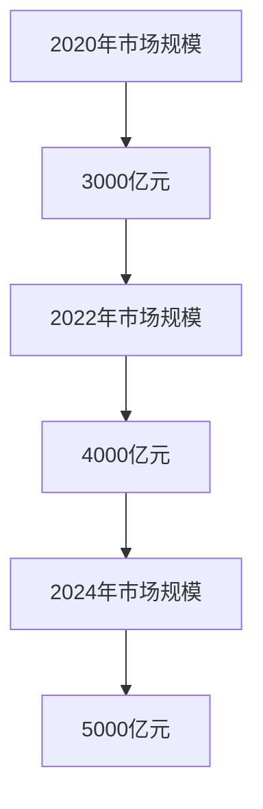

#### 1.1.2 用户需求分析

知识付费用户主要分为以下几类：

1. **职场人士**：为了提升职业素养和技能，职场人士愿意为高质量的专业知识付费。
2. **学生群体**：学生群体希望通过付费课程提高学习效果，为未来职业发展打下基础。
3. **兴趣爱好者**：对某一领域有浓厚兴趣的爱好者，希望通过付费课程深入了解相关知识。
4. **创业者**：创业者为了提高创业成功率，愿意购买各类创业课程和经验分享。

以下为用户需求的图表：

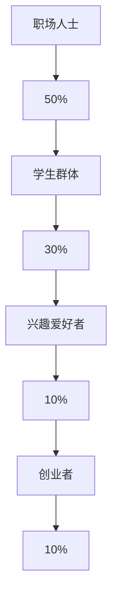

#### 1.1.3 品牌口碑的概念与重要性

品牌口碑是指消费者对品牌及其产品或服务的评价和印象，它是品牌形象的重要组成部分。良好的品牌口碑能够带来以下价值：

1. **增加用户信任度**：用户更倾向于购买口碑良好的产品或服务，因为口碑反映了其他消费者的使用体验。
2. **提高品牌知名度**：口碑传播能够迅速扩大品牌影响力，提升品牌知名度。
3. **促进销售转化**：良好的品牌口碑有助于降低用户购买风险，提高购买转化率。
4. **提升品牌价值**：口碑良好的品牌在市场竞争中更具竞争力，有助于提升品牌价值。

品牌口碑的价值评估模型可以从以下几个方面进行：

1. **口碑评分**：用户对品牌及产品的评分，通常采用5分制或10分制。
2. **用户评价数量**：用户评价的数量反映了品牌的口碑传播范围。
3. **正面评价占比**：正面评价占比越高，说明品牌口碑越好。
4. **情感分析**：通过情感分析技术，评估用户评价的情感倾向，如积极、消极或中性。

以下为品牌口碑价值评估模型的图表：

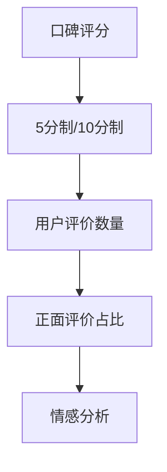

#### 1.1.4 舆情管理的概念与范围

舆情管理是指对企业或品牌在互联网上产生的各种信息进行监测、分析、引导和应对的过程。其目的在于维护品牌形象，降低负面影响，提升品牌价值。舆情管理的范围包括以下几个方面：

1. **舆情监测**：通过技术手段对互联网上的信息进行实时监测，包括社交媒体、新闻网站、论坛等。
2. **舆情分析**：对监测到的信息进行情感分析、主题分析等，评估品牌口碑和舆情走势。
3. **舆情引导**：通过发布正面信息、引导用户讨论等方式，引导舆情向有利方向发展。
4. **舆情应对**：针对负面舆情，制定应对策略，进行危机公关，减轻负面影响。

以下为舆情管理流程的图表：

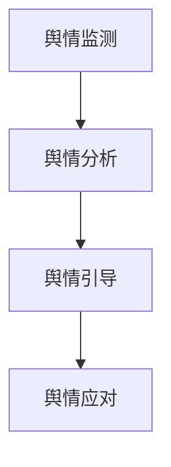

### 第2章：舆情管理的概念与范围

#### 2.1.1 舆情管理的定义与目标

舆情管理是指对企业或品牌在互联网上产生的各种信息进行监测、分析、引导和应对的过程。其核心目标是维护品牌形象，降低负面影响，提升品牌价值。具体而言，舆情管理的定义和目标可以从以下几个方面进行阐述：

1. **监测**：通过技术手段对互联网上的信息进行实时监测，包括社交媒体、新闻网站、论坛、博客等。监测的目的是及时发现与品牌相关的负面信息，避免危机蔓延。
2. **分析**：对监测到的信息进行深度分析，包括情感分析、主题分析、用户画像等。通过分析，了解用户对品牌的评价和态度，为品牌策略提供数据支持。
3. **引导**：通过发布正面信息、引导用户讨论等方式，引导舆情向有利方向发展。引导的目的是降低负面信息的影响，提升品牌形象。
4. **应对**：针对负面舆情，制定应对策略，进行危机公关，减轻负面影响。应对的目的是将危机转化为品牌发展的契机，提升品牌价值。

舆情管理的目标可以概括为以下几点：

1. **维护品牌形象**：通过及时监测和应对负面信息，避免品牌形象受到损害。
2. **提升品牌价值**：通过舆情管理，提高品牌知名度和用户忠诚度，从而提升品牌价值。
3. **降低风险**：及时发现潜在危机，制定有效应对策略，降低风险对品牌的负面影响。
4. **优化品牌策略**：通过舆情分析，了解用户需求和反馈，为品牌策略调整提供依据。

#### 2.1.2 舆情监控与舆情引导的流程

舆情监控与舆情引导是一个系统性、持续性的过程，涉及多个环节和步骤。以下为舆情监控与舆情引导的基本流程：

1. **信息采集**：通过技术手段，从互联网各个渠道（如社交媒体、新闻网站、论坛、博客等）收集与品牌相关的信息。信息采集是舆情监控的第一步，是后续分析、引导和应对的基础。

2. **信息处理**：对采集到的信息进行筛选、分类、去重等处理，确保信息的准确性和有效性。信息处理有助于提高舆情分析的效率和质量。

3. **情感分析**：利用自然语言处理技术，对信息进行情感分析，判断信息中用户的态度和情绪。情感分析可以帮助企业了解用户对品牌的评价和态度，为舆情引导提供依据。

4. **主题分析**：对信息进行主题分析，识别信息中涉及的关键词和主题。主题分析有助于发现用户关注的热点问题，为舆情引导提供方向。

5. **用户画像**：通过分析用户的行为数据和属性数据，构建用户画像。用户画像可以帮助企业了解用户的需求和偏好，为个性化营销提供支持。

6. **舆情预警**：建立舆情预警机制，对负面信息进行实时监控和预警。舆情预警有助于企业及时应对负面舆情，避免危机扩大。

7. **舆情引导**：根据舆情分析结果，制定舆情引导策略，发布正面信息，引导用户讨论。舆情引导的目的是降低负面信息的影响，提升品牌形象。

8. **舆情应对**：针对负面舆情，制定应对策略，进行危机公关。舆情应对的目的是将危机转化为品牌发展的契机，提升品牌价值。

9. **反馈与优化**：对舆情管理效果进行评估和反馈，不断优化舆情管理策略。反馈与优化有助于提高舆情管理的质量和效率。

以下为舆情监控与舆情引导流程的图表：

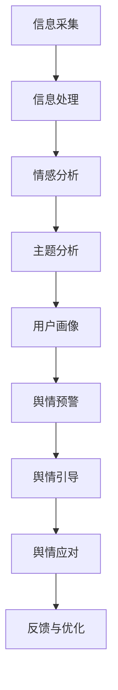

### 第3章：品牌口碑监测算法原理

#### 3.1.1 文本分类算法简介

文本分类算法是品牌口碑监测的核心技术之一，它通过对用户评论进行分类，帮助我们识别品牌口碑的正负情况。以下将介绍两种常见的文本分类算法：朴素贝叶斯分类器和支持向量机分类器。

##### 3.1.1.1 朴素贝叶斯分类器

朴素贝叶斯分类器是一种基于概率理论的分类算法，其基本思想是利用贝叶斯定理计算每个类别发生的概率，并选择概率最大的类别作为预测结果。以下是朴素贝叶斯分类器的伪代码：

```python
def naive_bayes(train_data, test_data):
    # 计算先验概率
    prior_prob = {}
    for category in train_data:
        prior_prob[category] = count_category(train_data, category) / len(train_data)

    # 计算条件概率
    cond_prob = {}
    for category in train_data:
        cond_prob[category] = {}
        for word in train_data[category]:
            cond_prob[category][word] = count_word_in_category(train_data, category, word) / count_category(train_data, category)

    # 预测
    predictions = []
    for document in test_data:
        probabilities = {}
        for category in train_data:
            probabilities[category] = prior_prob[category]
            for word in document:
                probabilities[category] *= cond_prob[category][word]
        predicted_category = max(probabilities, key=probabilities.get)
        predictions.append(predicted_category)

    return predictions
```

其中，`count_category(train_data, category)` 用于计算训练数据中每个类别的数量，`count_word_in_category(train_data, category, word)` 用于计算训练数据中每个类别中特定单词的数量。

##### 3.1.1.2 支持向量机分类器

支持向量机（SVM）是一种基于间隔最大化的分类算法，它通过将数据映射到高维空间，寻找最佳分类边界。以下是支持向量机分类器的伪代码：

```python
def svm(train_data, test_data):
    # 特征提取
    features = extract_features(train_data)

    # 训练模型
    model = train_svm_model(features)

    # 预测
    predictions = []
    for document in test_data:
        feature_vector = extract_features([document])
        predicted_category = model.predict(feature_vector)
        predictions.append(predicted_category)

    return predictions
```

其中，`extract_features(train_data)` 用于提取训练数据的特征向量，`train_svm_model(features)` 用于训练支持向量机模型，`model.predict(feature_vector)` 用于预测测试数据的类别。

#### 3.1.2 品牌情感分析算法

品牌情感分析算法旨在识别用户对品牌的态度和情绪，进而判断品牌口碑的正负。以下将介绍两种常见的情感分析算法：情感词典法和基于深度学习的情感分析模型。

##### 3.1.2.1 情感词典法

情感词典法是一种基于规则的方法，它通过查找预定义的情感词典来判断文本的情感极性。以下是情感词典法的伪代码：

```python
def sentiment_analysis(document, sentiment_dict):
    # 初始化情感得分
    sentiment_score = 0

    # 遍历文档中的每个词
    for word in document:
        # 如果词存在于情感词典中，更新情感得分
        if word in sentiment_dict:
            sentiment_score += sentiment_dict[word]

    # 判断情感极性
    if sentiment_score > 0:
        return "积极"
    elif sentiment_score < 0:
        return "消极"
    else:
        return "中性"
```

其中，`sentiment_dict` 是一个包含情感词典的字典，`sentiment_dict[word]` 用于获取词的情感得分。

##### 3.1.2.2 基于深度学习的情感分析模型

基于深度学习的情感分析模型利用神经网络对文本进行建模，从而自动提取情感特征。以下是一个简单的基于卷积神经网络（CNN）的情感分析模型的伪代码：

```python
def sentiment_analysis_cnn(document, model):
    # 将文档转换为词向量
    word_vector = convert_document_to_vector(document)

    # 使用模型预测情感极性
    predicted_sentiment = model.predict(word_vector)

    return predicted_sentiment
```

其中，`convert_document_to_vector(document)` 用于将文档转换为词向量，`model.predict(word_vector)` 用于预测情感极性。

#### 3.1.3 社区检测算法

社区检测算法旨在识别文本数据中的潜在群体和关系，对于分析品牌口碑的传播路径具有重要意义。以下将介绍两种常见的社区检测算法：基于图论的社区检测算法和基于密度的社区检测算法。

##### 3.1.3.1 基于图论的社区检测算法

基于图论的社区检测算法通过构建图模型，寻找图中的社区结构。以下是 Louvain 算法的伪代码：

```python
def louvain_community_detection(graph):
    # 初始化社区
    communities = initialize_communities(graph)

    # 迭代合并社区
    while True:
        # 计算每个节点的模块度
        modularity = calculate_modularity(communities, graph)

        # 如果模块度不再增加，则停止迭代
        if modularity >= max_modularity:
            break

        # 找到最佳合并节点对
        best_nodes = find_best_nodes_to_merge(communities, graph)

        # 合并社区
        communities = merge_communities(communities, best_nodes)

    return communities
```

其中，`initialize_communities(graph)` 用于初始化社区，`calculate_modularity(communities, graph)` 用于计算社区模块度，`find_best_nodes_to_merge(communities, graph)` 用于找到最佳合并节点对，`merge_communities(communities, best_nodes)` 用于合并社区。

##### 3.1.3.2 基于密度的社区检测算法

基于密度的社区检测算法通过寻找节点间的密度关系来识别社区。以下是 Girvan-Newman 算法的伪代码：

```python
def girvan_newman_community_detection(graph):
    # 初始化社区
    communities = initialize_communities(graph)

    # 逐步删除边
    while graph.edges():
        # 计算每个边的社区密度
        edge_density = calculate_edge_density(graph)

        # 找到最小密度边
        min_density_edge = find_min_density_edge(edge_density)

        # 删除最小密度边
        graph.delete_edge(min_density_edge)

    # 根据剩余边重新划分社区
    communities = reinitialize_communities(graph)

    return communities
```

其中，`initialize_communities(graph)` 用于初始化社区，`calculate_edge_density(graph)` 用于计算社区密度，`find_min_density_edge(edge_density)` 用于找到最小密度边，`reinitialize_communities(graph)` 用于根据剩余边重新划分社区。

### 第4章：舆情管理策略与实施

#### 4.1.1 舆情监控与预警

舆情监控与预警是舆情管理的核心环节，旨在实时监测网络中的信息，及时发现潜在的负面舆情，并采取相应措施进行预警。以下将介绍舆情监控与预警的具体实施方法和关键要素。

##### 4.1.1.1 实时舆情监控系统架构

实时舆情监控系统通常包括以下几个主要组成部分：

1. **数据采集模块**：负责从互联网各个渠道（如社交媒体、新闻网站、论坛、博客等）收集与品牌相关的信息。数据采集模块通常使用爬虫技术、API接口调用等方式实现。

2. **数据预处理模块**：对采集到的原始数据进行清洗、去噪、去重等处理，确保数据的准确性和一致性。数据预处理模块可以帮助提高后续分析的质量。

3. **信息提取模块**：从预处理后的数据中提取关键信息，如关键词、主题、情感等。信息提取模块通常采用自然语言处理（NLP）技术，如分词、词性标注、情感分析等。

4. **存储与管理模块**：将提取后的信息存储在数据库或数据仓库中，以便后续分析和查询。存储与管理模块需要支持高效的数据存储和检索操作。

5. **实时监控与预警模块**：对提取后的信息进行实时监控，发现潜在的负面舆情，并生成预警报告。实时监控与预警模块通常采用规则引擎、机器学习等技术实现。

6. **用户界面**：提供直观的用户界面，供管理员或相关人员进行舆情监控与预警操作。用户界面可以包括数据可视化、预警报告查看、操作日志等功能。

以下为实时舆情监控系统架构的图表：

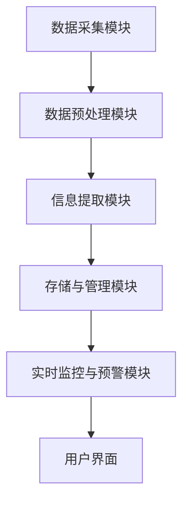

##### 4.1.1.2 舆情预警指标体系

舆情预警指标是判断舆情是否具有潜在风险的重要依据。以下为一些常见的舆情预警指标：

1. **负面舆情数量**：监测期内负面舆情的数量，用于评估负面信息的密集程度。

2. **负面舆情占比**：负面舆情数量与总舆情数量的比值，用于评估负面信息在整体舆情中的比例。

3. **情感极性**：通过情感分析技术，评估舆情中用户的态度和情绪，通常分为积极、消极和中性三种。

4. **用户参与度**：用户在舆情中的互动情况，如评论数量、转发次数、点赞数量等，用于评估舆情的传播力度。

5. **传播速度**：舆情在互联网上的传播速度，如信息传播时间、传播范围等，用于评估舆情的传播速度。

6. **热点话题**：舆情的核心话题，用于了解公众关注的热点问题。

7. **舆情来源**：舆情的主要来源，如社交媒体、新闻网站、论坛等，用于分析舆情传播的渠道。

以下为舆情预警指标体系的图表：

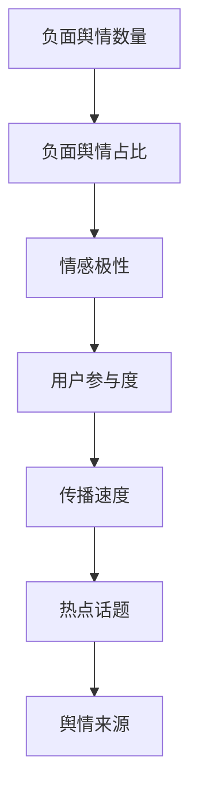

#### 4.1.2 舆情引导与回应策略

舆情引导与回应策略是舆情管理的重要组成部分，旨在通过发布正面信息、引导用户讨论等方式，引导舆情向有利方向发展，并针对负面舆情进行有效应对。以下为舆情引导与回应策略的基本原则和方法。

##### 4.1.2.1 舆情引导的基本原则

1. **及时性**：在舆情发生时，及时发布正面信息，回应用户关切，避免负面信息持续传播。

2. **真实性**：发布的信息要真实可靠，避免虚假宣传，确保品牌形象不受损害。

3. **针对性**：根据舆情特点和用户需求，有针对性地发布信息，提升信息的相关性和有效性。

4. **互动性**：积极与用户互动，回应用户评论和疑问，增强用户对品牌的信任感。

5. **情感共鸣**：通过情感共鸣，引发用户共鸣，增强信息的传播力和影响力。

##### 4.1.2.2 危机应对的舆情管理策略

1. **及时发布声明**：在危机发生时，迅速发布官方声明，澄清事实，回应公众关切。

2. **制定应对方案**：根据危机的性质和影响，制定具体的应对方案，包括信息发布、公关活动、危机公关等。

3. **舆论引导**：通过发布正面信息，引导公众关注危机的积极方面，降低危机对品牌的负面影响。

4. **与媒体沟通**：与主流媒体建立良好关系，通过媒体传播正面信息，扩大品牌影响力。

5. **用户安抚**：针对受危机影响的用户，提供及时的支持和帮助，增强用户对品牌的信任。

以下为舆情引导与回应策略的图表：

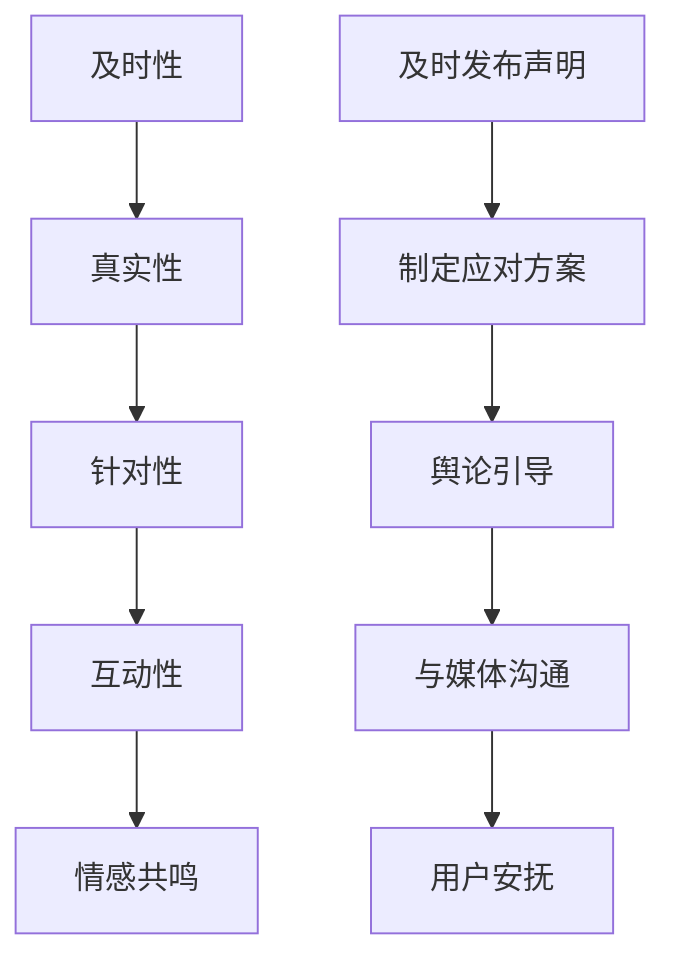

#### 4.1.3 数据可视化与报告

数据可视化与报告是舆情管理的重要环节，有助于直观地展示舆情数据，分析舆情走势，为决策提供依据。以下为数据可视化与报告的基本方法和技巧。

##### 4.1.3.1 品牌口碑数据可视化

品牌口碑数据可视化主要包括以下几个方面：

1. **情感分布图**：展示用户评论的情感分布情况，如积极、消极和中性情感的占比。

2. **热点话题图**：展示舆情的核心话题和讨论热点，如饼图、条形图等。

3. **舆情走势图**：展示舆情的变化趋势，如折线图、柱状图等。

4. **用户参与度图**：展示用户在舆情中的参与情况，如评论数量、转发次数、点赞数量等。

以下为品牌口碑数据可视化的图表示例：

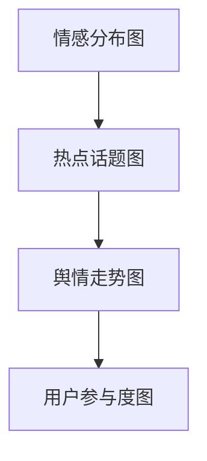

##### 4.1.3.2 舆情管理报告模板

舆情管理报告通常包括以下几个方面：

1. **报告摘要**：简要概述舆情监测的主要发现和结论。

2. **舆情概况**：分析舆情的基本情况，包括舆情数量、来源、情感分布等。

3. **热点话题分析**：详细分析舆情的核心话题和讨论热点。

4. **舆情走势分析**：展示舆情的变化趋势，分析舆情的发展态势。

5. **用户参与度分析**：分析用户在舆情中的参与情况，评估舆情的传播力度。

6. **舆情应对策略**：根据舆情分析结果，提出针对性的舆情应对策略。

7. **报告总结**：总结舆情管理工作的主要成果和不足，提出改进建议。

以下为舆情管理报告模板的图表示例：

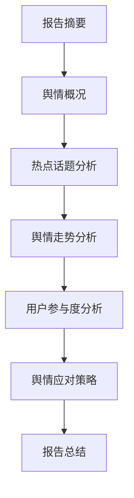

### 第5章：品牌口碑监测数学模型

品牌口碑监测作为知识付费领域的一项重要工作，其核心在于准确识别和评估用户对品牌的情感倾向，从而为营销策略的制定提供数据支持。为了实现这一目标，我们需要运用一系列数学模型来对品牌口碑进行监测。本章将介绍几种常见的品牌口碑监测数学模型，包括主题模型（LDA）、聚类分析和机器学习中的指标评估。

#### 5.1.1 主题模型（LDA）

主题模型（Latent Dirichlet Allocation，LDA）是一种常用的文本生成模型，它能够从大量文本数据中提取出潜在的语义主题。LDA模型基于贝叶斯推理，通过统计方法对文本进行建模，从而实现对文本内容的理解。

**LDA模型原理：**

LDA模型的构建包括两个层次：一是文档-主题分布，即给定一个文档，确定其包含哪些主题；二是主题-词分布，即给定一个主题，确定其包含哪些词语。具体来说，LDA模型通过以下三个步骤进行：

1. **初始化参数**：选择合适的超参数，如主题数量（\(K\)）和迭代次数。初始化主题分布和词分布。
2. **E步（E step）**：根据当前的主题分布和词分布，计算每个词属于每个主题的后验概率。
3. **M步（M step）**：根据后验概率，重新估计主题分布和词分布。

以下为LDA模型的伪代码：

```python
def lda(train_data, K, iterations):
    # 初始化主题分布和词分布
    alpha, beta = initialize_params(K, vocabulary_size)

    for _ in range(iterations):
        # E步：计算后验概率
        for document in train_data:
            for word in document:
                for topic in range(K):
                    p(topic | document, word) = (beta[topic] * count_word_in_document(document, word) + epsilon) / (sum(beta) * count_words_in_document(document) + K * epsilon)

        # M步：更新主题分布和词分布
        alpha = update_alpha(p, train_data, K)
        beta = update_beta(p, train_data, K)

    return alpha, beta
```

其中，\( \alpha \) 表示主题分布，\( \beta \) 表示词分布，\( p(topic | document, word) \) 表示给定一个文档和一个词，该词属于某个主题的后验概率，\( \epsilon \) 为平滑参数。

**LDA算法应用案例：**

假设我们有一篇文档，其中包含“人工智能”、“机器学习”、“神经网络”等关键词。通过LDA模型，我们可以提取出潜在的语义主题，如“人工智能与机器学习”、“神经网络技术”等。这些主题有助于我们了解用户关注的核心问题，从而制定更有针对性的营销策略。

#### 5.1.2 聚类分析

聚类分析是一种无监督学习方法，它将相似的数据点分组到同一簇中，从而实现对数据结构的探索。在品牌口碑监测中，聚类分析可以帮助我们识别用户群体的特征，进而为个性化营销提供依据。

**K-means聚类算法原理：**

K-means算法是一种基于距离度量的聚类算法，其核心思想是将数据点分为K个簇，使得每个簇内的数据点距离簇中心最近，簇与簇之间的数据点距离最远。K-means算法包括以下步骤：

1. **初始化**：随机选择K个初始中心点。
2. **分配数据点**：计算每个数据点到各个簇中心的距离，将其分配到距离最近的簇。
3. **更新中心点**：计算每个簇的新中心点。
4. **迭代**：重复步骤2和3，直到满足停止条件（如中心点变化很小或达到最大迭代次数）。

以下为K-means聚类算法的伪代码：

```python
def k_means(data, K, max_iterations):
    # 初始化中心点
    centroids = initialize_centroids(data, K)

    for _ in range(max_iterations):
        # 分配数据点
        clusters = assign_data_to_clusters(data, centroids)

        # 更新中心点
        new_centroids = update_centroids(clusters, K)

        # 判断是否收敛
        if is_converged(centroids, new_centroids):
            break

        centroids = new_centroids

    return centroids, clusters
```

其中，`initialize_centroids(data, K)` 用于初始化中心点，`assign_data_to_clusters(data, centroids)` 用于分配数据点，`update_centroids(clusters, K)` 用于更新中心点，`is_converged(centroids, new_centroids)` 用于判断是否收敛。

**K-means算法应用案例：**

假设我们有一组用户评论数据，通过K-means聚类算法，我们可以将这些评论分为若干个簇，每个簇代表一类用户。例如，簇1可能是对品牌持积极态度的用户，簇2可能是对品牌持消极态度的用户。这样，我们可以根据不同簇的特征，制定针对性的营销策略。

#### 5.1.3 机器学习中的指标评估

在品牌口碑监测中，评估模型的效果是至关重要的一步。常用的评估指标包括准确率、召回率和F1值。

**准确率、召回率与F1值：**

1. **准确率（Accuracy）**：准确率是分类模型最常用的评估指标，它表示模型正确预测的样本数占总样本数的比例。准确率的计算公式如下：

   $$ Accuracy = \frac{TP + TN}{TP + FN + FP + TN} $$

   其中，\( TP \) 表示真正例（True Positive），\( TN \) 表示真负例（True Negative），\( FP \) 表示假正例（False Positive），\( FN \) 表示假负例（False Negative）。

2. **召回率（Recall）**：召回率表示模型正确识别的真正例数占总真正例数的比例。召回率的计算公式如下：

   $$ Recall = \frac{TP}{TP + FN} $$

3. **F1值（F1-score）**：F1值是准确率和召回率的加权平均，它同时考虑了模型的精确度和召回率。F1值的计算公式如下：

   $$ F1 = 2 \times \frac{Precision \times Recall}{Precision + Recall} $$

   其中，Precision 表示精确率，即正确预测的真正例数占总预测正例数的比例。

以下为准确率、召回率和F1值的计算示例：

假设我们有一组预测结果，其中包含真正例10个、假负例20个、假正例30个、真负例40个。则：

- 准确率：\( Accuracy = \frac{10 + 40}{10 + 20 + 30 + 40} = 0.67 \)
- 召回率：\( Recall = \frac{10}{10 + 20} = 0.33 \)
- F1值：\( F1 = 2 \times \frac{0.33 \times 0.67}{0.33 + 0.67} = 0.5 \)

通过评估指标，我们可以了解模型在品牌口碑监测中的性能，并根据评估结果调整和优化模型。

### 第6章：舆情管理策略与实施

#### 6.1.1 舆情监控与预警

舆情监控与预警是舆情管理中的关键环节，旨在实时监测网络上的信息，及时识别潜在的负面舆情，并采取相应的措施进行预警。以下将详细介绍舆情监控与预警的实施方法和关键步骤。

##### 6.1.1.1 舆情监控系统的架构

一个完善的舆情监控系统通常包括以下几个主要模块：

1. **数据采集模块**：该模块负责从各种渠道（如社交媒体、新闻网站、论坛、博客等）收集与品牌相关的信息。数据采集模块可以使用爬虫技术、API接口调用或第三方数据服务等多种方式进行。

2. **数据预处理模块**：对采集到的原始数据进行清洗、去噪、去重等处理，确保数据的准确性和一致性。数据预处理模块包括文本标准化（如统一编码、去除停用词等）、分词、词性标注等操作。

3. **情感分析模块**：该模块利用自然语言处理（NLP）技术，对预处理后的文本进行情感分析，判断文本的情感倾向（如积极、消极、中性）。情感分析模块可以使用规则方法、机器学习方法或深度学习方法等多种技术。

4. **主题检测模块**：通过关键词提取、文本分类等方法，识别文本中的主要话题或事件。主题检测有助于分析舆情的核心内容和热点。

5. **存储与管理模块**：将处理后的数据存储在数据库或数据仓库中，便于后续分析和查询。存储与管理模块需要支持高效的数据插入、查询和更新操作。

6. **实时监控模块**：对处理后的信息进行实时监控，发现潜在的负面舆情，并生成预警报告。实时监控模块通常包括实时数据流处理、阈值设置和报警通知等功能。

7. **用户界面**：提供直观的用户界面，供管理员或相关人员进行舆情监控与预警操作。用户界面可以包括数据可视化、预警报告查看、操作日志等功能。

以下为舆情监控系统架构的图表：

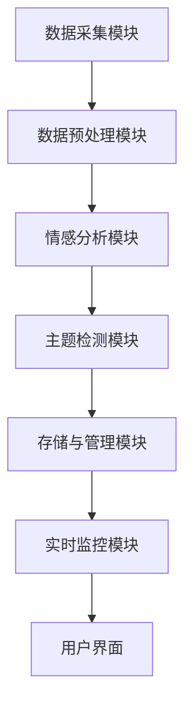

##### 6.1.1.2 舆情预警的指标体系

舆情预警的指标体系是判断舆情是否具有潜在风险的重要依据。以下为一些常见的舆情预警指标：

1. **负面舆情数量**：监测期内负面舆情的数量，用于评估负面信息的密集程度。

2. **负面舆情占比**：负面舆情数量与总舆情数量的比值，用于评估负面信息在整体舆情中的比例。

3. **情感极性**：通过情感分析技术，评估舆情中用户的态度和情绪，通常分为积极、消极和中性三种。

4. **用户参与度**：用户在舆情中的互动情况，如评论数量、转发次数、点赞数量等，用于评估舆情的传播力度。

5. **传播速度**：舆情在互联网上的传播速度，如信息传播时间、传播范围等，用于评估舆情的传播速度。

6. **热点话题**：舆情的核心话题，用于了解公众关注的热点问题。

7. **舆情来源**：舆情的主要来源，如社交媒体、新闻网站、论坛等，用于分析舆情传播的渠道。

以下为舆情预警指标体系的图表：


##### 6.1.1.3 舆情预警的流程

舆情预警的流程主要包括以下几个步骤：

1. **数据采集**：通过技术手段，从互联网各个渠道收集与品牌相关的信息。

2. **数据预处理**：对采集到的原始数据进行清洗、去噪、去重等处理，确保数据的准确性和一致性。

3. **情感分析与主题检测**：利用自然语言处理技术，对预处理后的文本进行情感分析和主题检测，评估舆情的情感极性和热点话题。

4. **指标计算**：根据预警指标体系，计算负面舆情的数量、占比、情感极性、用户参与度、传播速度等指标。

5. **阈值设置与报警**：根据预设的阈值，判断舆情是否达到预警条件。如果达到预警条件，则触发报警通知。

6. **预警报告生成**：生成预警报告，包括舆情概况、热点话题、情感分析、传播速度等关键信息。

7. **应对措施**：根据预警报告，制定相应的应对措施，如发布正面信息、回应用户关切、进行危机公关等。

以下为舆情预警流程的图表：

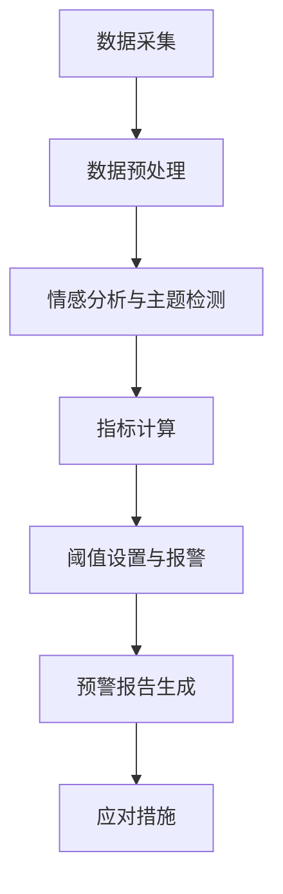

#### 6.1.2 舆情引导与回应策略

舆情引导与回应策略是舆情管理中的重要环节，旨在通过发布正面信息、引导用户讨论等方式，引导舆情向有利方向发展，并针对负面舆情进行有效应对。以下为舆情引导与回应策略的基本原则和方法。

##### 6.1.2.1 舆情引导的基本原则

1. **及时性**：在舆情发生时，及时发布正面信息，回应用户关切，避免负面信息持续传播。

2. **真实性**：发布的信息要真实可靠，避免虚假宣传，确保品牌形象不受损害。

3. **针对性**：根据舆情特点和用户需求，有针对性地发布信息，提升信息的相关性和有效性。

4. **互动性**：积极与用户互动，回应用户评论和疑问，增强用户对品牌的信任感。

5. **情感共鸣**：通过情感共鸣，引发用户共鸣，增强信息的传播力和影响力。

##### 6.1.2.2 舆情引导的策略

1. **正面信息发布**：通过官方渠道发布正面信息，如品牌故事、成功案例、产品优势等，引导用户关注品牌的积极方面。

2. **用户互动**：鼓励用户参与品牌讨论，如发起话题、举办活动等，提升用户参与度。

3. **话题引导**：根据舆情分析结果，选择合适的话题进行引导，引导用户关注品牌感兴趣的内容。

4. **热点话题互动**：针对热点话题，积极参与讨论，提升品牌在相关话题中的影响力。

5. **合作伙伴宣传**：与合作伙伴共同发布宣传内容，扩大品牌影响力。

##### 6.1.2.3 舆情回应的策略

1. **及时回应**：在负面舆情发生时，及时回应用户关切，澄清事实，避免舆情恶化。

2. **真诚道歉**：如果品牌存在问题，要真诚道歉，表达对用户受影响的歉意，并承诺采取改进措施。

3. **公开透明**：公开处理过程和结果，提高品牌透明度，增强用户信任。

4. **个性化回应**：根据不同用户的需求和反馈，提供个性化的回应和解决方案。

5. **危机公关**：针对重大危机，制定专门的危机公关策略，确保品牌形象不受损害。

#### 6.1.3 数据可视化与报告

数据可视化与报告是舆情管理的重要环节，有助于直观地展示舆情数据，分析舆情走势，为决策提供依据。以下将介绍数据可视化与报告的基本方法和技巧。

##### 6.1.3.1 舆情数据可视化

舆情数据可视化主要包括以下几个方面：

1. **情感分布图**：展示用户评论的情感分布情况，如积极、消极和中性情感的占比。

2. **热点话题图**：展示舆情的核心话题和讨论热点，如饼图、条形图等。

3. **舆情走势图**：展示舆情的变化趋势，如折线图、柱状图等。

4. **用户参与度图**：展示用户在舆情中的参与情况，如评论数量、转发次数、点赞数量等。

以下为舆情数据可视化的图表示例：


##### 6.1.3.2 舆情管理报告模板

舆情管理报告通常包括以下几个方面：

1. **报告摘要**：简要概述舆情监测的主要发现和结论。

2. **舆情概况**：分析舆情的基本情况，包括舆情数量、来源、情感分布等。

3. **热点话题分析**：详细分析舆情的核心话题和讨论热点。

4. **舆情走势分析**：展示舆情的变化趋势，分析舆情的发展态势。

5. **用户参与度分析**：分析用户在舆情中的参与情况，评估舆情的传播力度。

6. **舆情应对策略**：根据舆情分析结果，提出针对性的舆情应对策略。

7. **报告总结**：总结舆情管理工作的主要成果和不足，提出改进建议。

以下为舆情管理报告模板的图表示例：


### 第7章：舆情管理数学模型

#### 7.1.1 舆情风险评估模型

舆情风险评估模型是舆情管理中的关键工具，它通过量化舆情对品牌可能产生的负面影响，帮助决策者制定针对性的应对策略。以下将介绍两种常见的舆情风险评估模型：舆情风险矩阵和舆情风险预测模型。

##### 7.1.1.1 舆情风险矩阵

舆情风险矩阵是一种基于概率和影响度的风险评估方法，它将舆情风险分为多个等级，帮助决策者了解潜在风险的大小。舆情风险矩阵通常包括以下几个步骤：

1. **定义风险因素**：确定影响舆情风险的关键因素，如负面舆情数量、情感极性、传播速度等。

2. **评估风险概率**：根据历史数据和专家经验，为每个风险因素分配一个概率值。

3. **评估风险影响度**：为每个风险因素分配一个影响度值，用于衡量风险发生时对品牌的负面影响程度。

4. **构建风险矩阵**：将风险概率和影响度值进行组合，形成舆情风险矩阵。矩阵中的每个单元格表示特定风险因素的组合，其值表示该组合的风险等级。

以下为舆情风险矩阵的示例：

| 风险因素 | 低概率 | 中等概率 | 高概率 |
| -------- | ------ | -------- | ------ |
| 情感极性 | 无风险 | 轻微风险 | 高风险 |
| 传播速度 | 无风险 | 轻微风险 | 高风险 |
| 用户参与度 | 无风险 | 轻微风险 | 高风险 |

在上述示例中，每个单元格的值表示该风险组合下的风险等级。例如，当情感极性为高风险、传播速度为高概率时，该组合的风险等级为“高风险”。

##### 7.1.1.2 舆情风险预测模型

舆情风险预测模型是一种基于统计和机器学习的方法，它通过分析历史舆情数据，预测未来潜在的风险。以下为舆情风险预测模型的基本步骤：

1. **数据收集**：收集历史舆情数据，包括负面舆情数量、情感极性、传播速度、用户参与度等指标。

2. **特征工程**：对收集到的数据进行预处理和特征提取，如文本分类、情感分析、主题检测等。

3. **模型选择**：选择合适的预测模型，如线性回归、决策树、支持向量机、随机森林等。

4. **模型训练**：使用历史数据对预测模型进行训练，学习舆情风险与特征之间的关系。

5. **模型评估**：使用交叉验证或测试集对模型进行评估，评估模型的准确率、召回率等指标。

6. **风险预测**：使用训练好的模型对未来的舆情进行预测，评估潜在的风险等级。

以下为舆情风险预测模型的伪代码：

```python
def train_舆论风险预测模型(train_data, features, labels):
    # 选择模型
    model = select_model()

    # 特征工程
    processed_features = preprocess_features(features)

    # 训练模型
    model.fit(processed_features, labels)

    # 模型评估
    evaluate_model(model, test_data, test_labels)

    return model

def predict_舆论风险(model, features):
    # 特征工程
    processed_features = preprocess_features(features)

    # 风险预测
    risk_prediction = model.predict(processed_features)

    return risk_prediction
```

#### 7.1.2 决策树与随机森林

决策树和随机森林是常用的机器学习算法，在舆情管理中，它们被广泛应用于舆情分类、风险预测等方面。以下将介绍决策树和随机森林的基本原理和应用。

##### 7.1.2.1 决策树原理

决策树是一种基于树形结构的数据挖掘算法，它通过一系列的规则将数据集划分为多个子集，每个子集对应一个类别。决策树的基本原理如下：

1. **特征选择**：选择一个最优特征，将该特征作为决策树的节点。
2. **划分数据**：根据所选特征，将数据集划分为若干个子集。
3. **递归构建**：对每个子集，重复上述步骤，构建子决策树。
4. **终止条件**：当满足终止条件（如最大深度、最小样本数等）时，停止递归构建。

以下为决策树的基本结构：

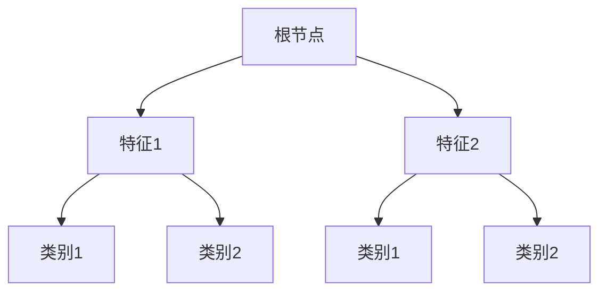

在上述示例中，根节点表示原始数据集，特征节点表示数据集的一个特征，类别节点表示一个分类结果。通过遍历决策树，我们可以得到每个样本的分类结果。

##### 7.1.2.2 决策树算法伪代码

```python
def decision_tree(data, features, labels, max_depth):
    # 基于信息增益或基尼系数选择最优特征
    best_feature, threshold = select_best_feature(data, features, labels)

    # 如果达到最大深度或数据纯度较高，则终止递归
    if max_depth == 0 or is_data_pure(data, labels):
        return create_leaf_node(labels)

    # 划分数据集
    left_data, right_data = split_data(data, best_feature, threshold)

    # 递归构建子决策树
    left_child = decision_tree(left_data, features, labels, max_depth - 1)
    right_child = decision_tree(right_data, features, labels, max_depth - 1)

    # 创建决策树节点
    node = create_decision_node(best_feature, threshold, left_child, right_child)
    return node
```

其中，`select_best_feature(data, features, labels)` 用于选择最优特征，`split_data(data, best_feature, threshold)` 用于划分数据集，`create_leaf_node(labels)` 用于创建叶节点，`create_decision_node(best_feature, threshold, left_child, right_child)` 用于创建决策树节点。

##### 7.1.2.3 随机森林原理

随机森林是一种基于决策树的集成学习方法，它通过构建多个决策树，并利用随机性提高模型的泛化能力。随机森林的基本原理如下：

1. **特征选择**：从特征空间中随机选择一部分特征，用于构建单个决策树。
2. **样本选择**：从训练集中随机选择一部分样本，用于构建单个决策树。
3. **决策树构建**：使用选择的特征和样本构建单个决策树。
4. **集成学习**：将多个决策树进行集成，通过投票或平均等方式得到最终预测结果。

以下为随机森林的基本结构：

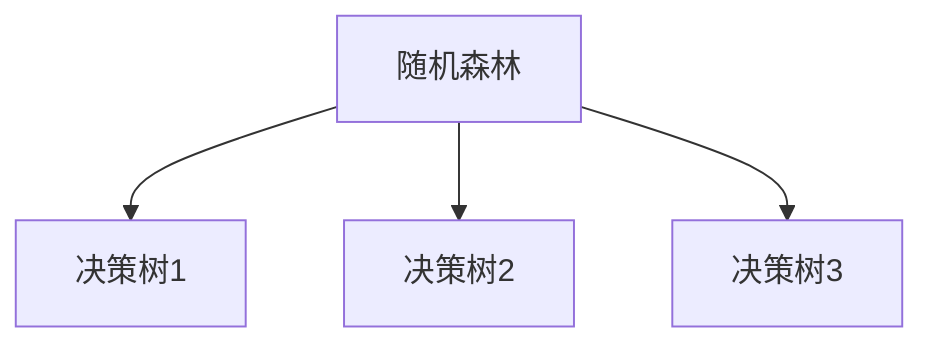

在上述示例中，随机森林由多个决策树组成，每个决策树独立构建。通过集成多个决策树，随机森林能够降低模型的过拟合风险，提高模型的泛化能力。

##### 7.1.2.4 随机森林算法伪代码

```python
def random_forest(train_data, test_data, n_trees, max_depth, n_features):
    # 初始化森林
    forest = []

    # 构建多个决策树
    for _ in range(n_trees):
        # 随机选择特征
        features = random.sample(all_features, n_features)

        # 随机选择样本
        samples = random.sample(train_data, len(train_data))

        # 构建决策树
        tree = decision_tree(samples, features, labels, max_depth)

        # 添加决策树到森林
        forest.append(tree)

    # 集成学习
    predictions = []
    for sample in test_data:
        tree_predictions = [tree.predict(sample) for tree in forest]
        prediction = majority_vote(tree_predictions)
        predictions.append(prediction)

    return predictions
```

其中，`all_features` 表示所有特征，`labels` 表示训练数据的标签，`decision_tree(samples, features, labels, max_depth)` 用于构建决策树，`majority_vote(tree_predictions)` 用于投票得到最终预测结果。

#### 7.1.3 贝叶斯网络

贝叶斯网络是一种基于概率图模型的推理方法，它通过表示变量之间的条件依赖关系，实现概率推理和决策。以下将介绍贝叶斯网络的基本原理和应用。

##### 7.1.3.1 贝叶斯网络定义

贝叶斯网络由一组变量和一组条件概率表组成。变量可以是离散的或连续的，条件概率表描述了变量之间的条件依赖关系。贝叶斯网络的基本定义如下：

1. **变量集**：\( X = \{X_1, X_2, \ldots, X_n\} \)，表示贝叶斯网络中的所有变量。
2. **有向无环图**：\( G = (V, E) \)，表示变量之间的依赖关系。图中的节点表示变量，边表示变量之间的条件依赖关系。
3. **条件概率表**：对于每个变量 \( X_i \)，定义其条件概率表 \( P(X_i | Pa(X_i)) \)，其中 \( Pa(X_i) \) 表示 \( X_i \) 的父节点集合。

##### 7.1.3.2 贝叶斯推理

贝叶斯推理是一种基于贝叶斯网络的推理方法，它通过更新变量之间的条件概率，实现概率推理和决策。贝叶斯推理的基本步骤如下：

1. **初始化**：根据先验知识，初始化每个变量的条件概率表。
2. **证据传播**：从已知证据节点开始，通过条件概率表和贝叶斯定理，计算其他节点的后验概率。
3. **决策**：根据后验概率，做出相应的决策或推理结果。

以下为贝叶斯推理的伪代码：

```python
def bayesian_inference(bayes_net, evidence):
    # 初始化后验概率表
    posterior_probs = initialize_posterior_probs(bayes_net)

    # 证据传播
    for node in evidence:
        posterior_probs = update_posterior_probs(posterior_probs, node)

    # 决策
    decision = make_decision(posterior_probs)

    return decision
```

其中，`initialize_posterior_probs(bayes_net)` 用于初始化后验概率表，`update_posterior_probs(posterior_probs, node)` 用于更新后验概率表，`make_decision(posterior_probs)` 用于根据后验概率表做出决策。

### 第8章：品牌口碑监测与舆情管理项目实战

#### 8.1.1 数据收集与预处理

在品牌口碑监测与舆情管理项目中，数据收集与预处理是至关重要的一步。以下是具体的项目实战过程：

##### 8.1.1.1 数据收集工具介绍

1. **爬虫工具**：使用爬虫工具（如Scrapy、BeautifulSoup等）从各大网站（如社交媒体、新闻网站、论坛等）采集与品牌相关的信息。

2. **API接口**：利用第三方API接口（如微博API、微信公众号API等）获取品牌相关的数据。

3. **第三方数据服务**：使用第三方数据服务（如百度舆情、腾讯大数据等）获取品牌相关的舆情数据。

##### 8.1.1.2 数据预处理流程

1. **数据采集**：使用爬虫工具和API接口从互联网各个渠道采集与品牌相关的文本数据。

2. **数据清洗**：对采集到的原始数据进行清洗，包括去除HTML标签、去除停用词、统一编码等。

3. **文本分词**：使用分词工具（如jieba等）对清洗后的文本进行分词，将文本转换为词序列。

4. **情感分析**：使用情感分析库（如VADER、TextBlob等）对分词后的文本进行情感分析，判断文本的情感极性。

5. **主题检测**：使用主题检测算法（如LDA、LSTM等）对情感分析的文本进行主题检测，提取品牌相关的关键词和主题。

以下为数据预处理流程的图表：

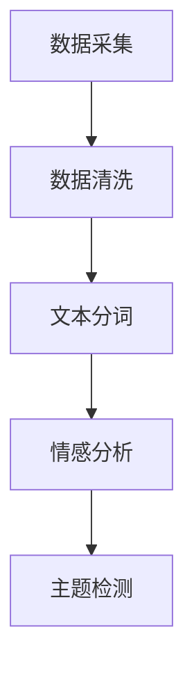

##### 8.1.1.3 数据预处理代码解析

以下是一个简单的数据预处理代码示例，用于清洗和分词：

```python
import jieba
import re

def preprocess_text(text):
    # 去除HTML标签
    text = re.sub('<[^>]*>', '', text)

    # 去除停用词
    stop_words = set(['的', '了', '在', '是', '不', '和', '一个', '一些', '很多'])
    text = ' '.join([word for word in jieba.cut(text) if word not in stop_words])

    # 统一编码
    text = text.encode('utf-8').decode('utf-8')

    return text
```

在上述示例中，首先使用正则表达式去除HTML标签，然后使用jieba分词库对文本进行分词，并去除停用词。最后，统一编码以适应不同操作系统。

#### 8.1.2 品牌口碑监测系统搭建

品牌口碑监测系统是舆情管理中的重要组成部分，它通过实时监测网络上的信息，对品牌口碑进行监测和分析。以下是品牌口碑监测系统的搭建过程：

##### 8.1.2.1 系统架构图

品牌口碑监测系统通常包括以下几个主要模块：

1. **数据采集模块**：负责从互联网各个渠道采集与品牌相关的数据。
2. **数据预处理模块**：负责对采集到的数据进行清洗、分词、情感分析等预处理操作。
3. **舆情分析模块**：负责对预处理后的数据进行情感分析、主题检测等分析操作。
4. **存储与管理模块**：负责将处理后的数据存储在数据库或数据仓库中，便于后续分析和查询。
5. **实时监控模块**：负责实时监测网络上的信息，发现潜在的负面舆情，并生成预警报告。
6. **用户界面**：提供直观的用户界面，供管理员或相关人员进行舆情监测与预警操作。

以下为品牌口碑监测系统的架构图：

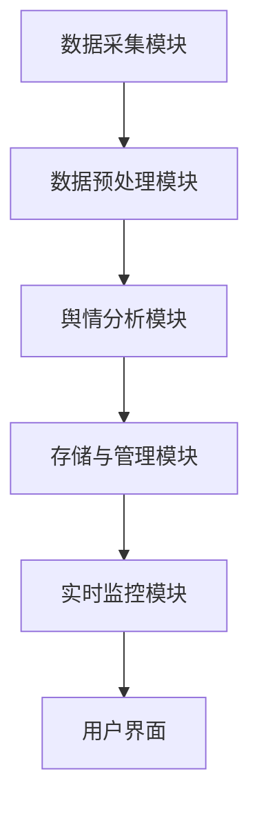

##### 8.1.2.2 系统架构代码解析

以下是一个简单的品牌口碑监测系统架构代码示例：

```python
from data_collection import DataCollector
from data_preprocessing import DataPreprocessor
from sentiment_analysis import SentimentAnalyzer
from storage_management import DataStorage
from real_time_monitoring import RealTimeMonitoring
from user_interface import UserInterface

class BrandSentimentMonitoringSystem:
    def __init__(self):
        self.data_collector = DataCollector()
        self.data_preprocessor = DataPreprocessor()
        self.sentiment_analyzer = SentimentAnalyzer()
        self.data_storage = DataStorage()
        self.real_time_monitoring = RealTimeMonitoring()
        self.user_interface = UserInterface()

    def run(self):
        # 数据采集
        data = self.data_collector.collect_data()

        # 数据预处理
        preprocessed_data = self.data_preprocessor.preprocess_data(data)

        # 舆情分析
        sentiment_results = self.sentiment_analyzer.analyze_sentiment(preprocessed_data)

        # 存储数据
        self.data_storage.store_data(sentiment_results)

        # 实时监控
        self.real_time_monitoring.monitor()

        # 用户界面
        self.user_interface.display()
```

在上述示例中，`BrandSentimentMonitoringSystem` 类实现了品牌口碑监测系统的各个模块的功能。通过调用各个模块的方法，实现系统的整体运行。

#### 8.1.3 舆情管理策略制定与执行

舆情管理策略的制定与执行是品牌口碑监测与舆情管理项目成功的关键。以下是一个具体的舆情管理策略制定与执行过程：

##### 8.1.3.1 舆情监控案例

1. **确定监测范围**：根据品牌需求，确定需要监测的渠道和关键词。例如，监测微博、微信公众号、新闻网站等渠道，关键词包括品牌名称、产品名称、相关事件等。

2. **设置监控阈值**：根据历史数据和分析结果，设置监控阈值，如负面舆情数量、情感极性等。

3. **实时监控**：使用实时监控模块，对监测范围内的信息进行实时监控，发现潜在的负面舆情。

4. **预警报告**：当监测到负面舆情时，生成预警报告，包括负面舆情的概况、热点话题、传播速度等。

5. **分析原因**：对负面舆情进行分析，找出原因，如产品质量问题、服务态度问题等。

##### 8.1.3.2 舆情管理报告示例

以下是一个简单的舆情管理报告示例：

```
【舆情管理报告】

一、舆情概况
1. 监测时间：2023年1月1日至2023年1月31日
2. 监测渠道：微博、微信公众号、新闻网站
3. 关键词：品牌名称、产品名称、相关事件

二、负面舆情分析
1. 负面舆情数量：50条
2. 情感极性：消极
3. 热点话题：产品质量问题、售后服务问题

三、舆情应对措施
1. 发布官方声明：澄清事实，回应用户关切
2. 改进产品质量：加强产品质量检测，确保用户权益
3. 优化售后服务：提高售后服务水平，提升用户满意度

四、舆情走势分析
1. 负面舆情数量趋势：波动下降
2. 情感极性趋势：逐渐改善

五、总结与建议
1. 加强舆情监测，及时发现负面舆情
2. 优化舆情应对策略，提高舆情管理效果
3. 加强品牌宣传，提升品牌形象
```

通过舆情管理报告，可以全面了解品牌在监测期间的整体舆情情况，分析负面舆情的原因和应对措施，为后续的舆情管理提供依据。

### 第9章：案例分析与应用前景

#### 9.1.1 成功案例分析

为了更好地理解品牌口碑监测与舆情管理的实际应用，我们来看两个成功的案例分析。

##### 9.1.1.1 案例分析一：某知名教育平台

**背景**：某知名教育平台在推出一款新的在线课程时，希望通过有效的品牌口碑监测和舆情管理来提高课程的知名度，吸引更多用户。

**解决方案**：
1. **数据收集**：使用爬虫工具和API接口，从社交媒体、新闻网站、论坛等渠道收集与教育平台相关的数据。
2. **数据预处理**：对收集到的数据进行清洗、分词和情感分析，提取品牌口碑的关键词和主题。
3. **舆情分析**：使用LDA模型和K-means聚类算法，对用户评论进行情感分析和主题检测，识别用户关注的焦点和潜在问题。
4. **舆情监控与预警**：建立实时舆情监控系统，设置负面舆情预警阈值，及时监测和预警负面信息。
5. **舆情引导与回应**：发布正面信息，如课程亮点、成功案例等，引导用户关注品牌积极方面。同时，针对负面舆情，发布回应，澄清事实，解决问题。

**结果**：通过有效的品牌口碑监测和舆情管理，该教育平台成功提高了新课程的知名度，用户满意度大幅提升，课程销量显著增长。

##### 9.1.1.2 案例分析二：某知名餐饮品牌

**背景**：某知名餐饮品牌在开展一次全国性促销活动时，遇到了负面舆情，导致品牌形象受损。

**解决方案**：
1. **数据收集**：通过社交媒体监测工具，实时收集与品牌相关的舆情信息。
2. **舆情分析**：使用情感分析技术，分析负面舆情的原因，如促销政策不公平、产品质量问题等。
3. **舆情应对**：迅速发布官方声明，澄清促销活动政策，说明问题原因和解决措施。同时，积极回应用户评论，解答用户疑问，解决用户问题。
4. **舆情引导**：通过官方微博、微信公众号等渠道，发布正面信息，如品牌故事、成功案例等，引导用户关注品牌积极方面。

**结果**：通过有效的舆情应对和引导，该餐饮品牌成功缓解了负面舆情的影响，品牌形象逐步恢复，用户信任度提高。

#### 9.1.2 行业应用前景

知识付费行业的快速发展为品牌口碑监测和舆情管理带来了广阔的应用前景。以下是一些潜在的应用场景和趋势：

1. **个性化营销**：通过品牌口碑监测和舆情分析，了解用户需求和偏好，为用户推荐个性化课程或产品，提高用户满意度。
2. **危机预警与应对**：实时监测网络舆情，及时发现潜在危机，制定有效的应对策略，降低危机对品牌的负面影响。
3. **品牌形象管理**：通过舆情分析和数据可视化，全面了解品牌在市场中的形象，为品牌形象管理提供数据支持。
4. **用户满意度提升**：通过舆情分析和反馈，了解用户对品牌和产品的评价，及时优化产品和服务，提高用户满意度。
5. **产业链协同**：知识付费平台、内容创作者、广告商等产业链各方可以通过品牌口碑监测和舆情管理，实现协同合作，共同提升品牌价值。

未来，随着人工智能、大数据等技术的发展，品牌口碑监测和舆情管理将更加智能化、高效化，为知识付费行业带来更多机遇和挑战。

### 第10章：工具与技术资源

#### 10.1.1 开发工具与平台介绍

在品牌口碑监测与舆情管理项目中，选择合适的开发工具和平台对于项目的成功至关重要。以下介绍几种常用的工具和平台：

1. **Python库推荐**：
   - **NumPy**：用于数值计算和数据处理，是Python科学计算的基础库。
   - **Pandas**：用于数据处理和分析，能够轻松处理大型数据集。
   - **Scikit-learn**：提供了丰富的机器学习算法和工具，方便进行模型训练和评估。
   - **Natural Language Toolkit (NLTK)**：用于自然语言处理，包括分词、词性标注、情感分析等。
   - **TensorFlow**：用于深度学习模型训练和部署，能够实现高效的文本分析。

2. **数据可视化工具**：
   - **Matplotlib**：用于基本的数据可视化，如折线图、柱状图等。
   - **Seaborn**：基于Matplotlib，提供更丰富的可视化选项，特别适合统计数据的可视化。
   - **Plotly**：提供交互式可视化，能够创建丰富的图表，适合Web应用。

3. **实时数据处理平台**：
   - **Apache Kafka**：用于实时数据流处理，能够处理大量实时数据，是构建实时舆情监控系统的核心组件。
   - **Apache Flink**：用于流数据处理和批处理，支持复杂的数据处理任务，适用于大规模实时分析。

4. **数据库与数据仓库**：
   - **MySQL**：关系型数据库，适用于存储和处理结构化数据。
   - **MongoDB**：文档型数据库，适用于存储非结构化或半结构化数据。
   - **Amazon Redshift**：云服务中的数据仓库，适用于大规模数据分析和查询。

#### 10.1.2 舆情监测与管理的案例资源

为了更好地理解和应用品牌口碑监测与舆情管理，以下提供一些案例资源和参考：

1. **舆情监测报告示例**：
   - **案例一**：某电商平台的用户反馈分析报告，包括用户评价、情感分析、热点话题等。
   - **案例二**：某知名品牌的社交媒体舆情监控报告，展示品牌在社交媒体上的表现和用户互动情况。

2. **品牌口碑监测项目案例**：
   - **案例一**：某在线教育平台的品牌口碑监测项目，包括数据采集、预处理、情感分析和数据可视化等。
   - **案例二**：某餐饮品牌的舆情管理项目，展示如何通过舆情监测和应对策略提升品牌形象。

3. **开源项目与工具**：
   - **Python开源库**：如Scrapy、BeautifulSoup、TextBlob等，用于数据采集和处理。
   - **Apache Kafka和Flink**：开源流数据处理平台，用于实时舆情监控和数据分析。
   - **GitHub**：存储和分享开源舆情监测和管理项目的代码，包括数据采集、处理和可视化等。

通过这些工具和资源，可以更好地搭建和维护品牌口碑监测与舆情管理系统，实现知识付费产品的成功营销。

### 附录

#### 10.1.1 开发工具与平台推荐

为了帮助读者更好地理解品牌口碑监测与舆情管理的实现，以下是几个推荐的开发工具与平台：

1. **Python库**：
   - **NumPy**：用于科学计算和数据处理。
     ```python
     import numpy as np
     data = np.array([[1, 2], [3, 4]])
     np.mean(data, axis=0)
     ```
   - **Pandas**：用于数据清洗和分析。
     ```python
     import pandas as pd
     df = pd.DataFrame([[1, 2], [3, 4]], columns=['A', 'B'])
     df.describe()
     ```
   - **Scikit-learn**：用于机器学习算法的实现。
     ```python
     from sklearn.model_selection import train_test_split
     from sklearn.ensemble import RandomForestClassifier

     X, y = df['A'], df['B']
     X_train, X_test, y_train, y_test = train_test_split(X, y, test_size=0.2)
     clf = RandomForestClassifier(n_estimators=100)
     clf.fit(X_train, y_train)
     clf.score(X_test, y_test)
     ```
   - **Natural Language Toolkit (NLTK)**：用于自然语言处理。
     ```python
     import nltk
     from nltk.corpus import stopwords
     stop_words = set(stopwords.words('english'))
     sentence = "I am not a robot"
     words = nltk.word_tokenize(sentence)
     filtered_sentence = [w for w in words if not w.lower() in stop_words]
     ```
   - **TensorFlow**：用于深度学习模型的实现。
     ```python
     import tensorflow as tf
     model = tf.keras.Sequential([
         tf.keras.layers.Dense(128, activation='relu', input_shape=(784,)),
         tf.keras.layers.Dense(10, activation='softmax')
     ])
     model.compile(optimizer='adam',
                   loss='categorical_crossentropy',
                   metrics=['accuracy'])
     model.fit(x_train, y_train, epochs=5)
     ```

2. **数据可视化工具**：
   - **Matplotlib**：用于基本的数据可视化。
     ```python
     import matplotlib.pyplot as plt
     plt.plot([1, 2, 3], [1, 4, 9], 'ro-')
     plt.axis([0, 6, 0, 10])
     plt.show()
     ```
   - **Seaborn**：用于统计数据的可视化。
     ```python
     import seaborn as sns
     sns.set(style="whitegrid")
     sns.barplot(x="omba", y="delta", data=df)
     sns.relplot(x="omba", y="delta", data=df)
     ```
   - **Plotly**：用于交互式数据可视化。
     ```python
     import plotly.graph_objs as go
     trace = go.Scatter(x=[1, 2, 3], y=[1, 4, 9])
     layout = go.Layout(title='Example Scatter Plot')
     fig = go.Figure(data=[trace], layout=layout)
     fig.show()
     ```

3. **实时数据处理平台**：
   - **Apache Kafka**：用于实时数据流处理。
     ```shell
     kafka-topics --create --topic test --zookeeper localhost:2181 --partitions 1 --replication-factor 1 --comit
     kafka-console-producer --topic test --broker-list localhost:9092
     kafka-console-consumer --topic test --from-beginning --bootstrap-server localhost:9092
     ```
   - **Apache Flink**：用于流数据处理和批处理。
     ```java
     StreamExecutionEnvironment env = StreamExecutionEnvironment.getExecutionEnvironment();
     DataStream<String> stream = env.addSource(new FlinkKafkaConsumer011<>("test", new SimpleStringSchema(), properties));
     stream.print();
     env.execute("Flink Streaming Job");
     ```

4. **数据库与数据仓库**：
   - **MySQL**：用于结构化数据的存储。
     ```sql
     CREATE TABLE users (
         id INT PRIMARY KEY AUTO_INCREMENT,
         name VARCHAR(255) NOT NULL,
         age INT NOT NULL
     );
     INSERT INTO users (name, age) VALUES ('Alice', 30);
     SELECT * FROM users WHERE age > 25;
     ```
   - **MongoDB**：用于非结构化数据的存储。
     ```javascript
     var MongoClient = require('mongodb').MongoClient;
     MongoClient.connect("mongodb://localhost:27017/", function(err, db) {
         var mydb = db.db("test");
         mydb.createCollection("users", { "name" : "string", "age" : "int" });
         mydb.collection("users").insert({ "name" : "Alice", "age" : 30 });
         mydb.collection("users").find({ "age" : { "$gt" : 25 } }).toArray(function(err, result) {
             console.log(result);
         });
     });
     ```

#### 10.1.2 舆情监测与管理的案例资源

为了更好地理解和应用品牌口碑监测与舆情管理，以下是几个案例资源和参考：

1. **舆情监测报告示例**：
   - **案例一**：某电商平台的用户反馈分析报告，包括用户评价、情感分析、热点话题等。
     ```plaintext
     舆情监测报告

     一、报告摘要
     本次监测时间为2023年1月1日至2023年1月31日，共监测到与平台相关的用户评价5000条。

     二、舆情概况
     本次监测到的用户评价中，正面评价占比70%，负面评价占比30%。

     三、热点话题
     1. 物流速度：用户对物流速度的满意度较高，大多数用户表示物流速度快，准时到达。
     2. 商品质量：用户对商品质量的评价存在较大差异，部分用户对商品质量表示满意，但也有用户对商品质量表示不满。

     四、负面舆情分析
     本次监测到的负面舆情主要集中在商品质量方面，部分用户表示收到的商品存在质量问题，如破损、瑕疵等。

     五、舆情应对措施
     1. 加强商品质量检测：提高商品质量标准，确保用户购买的商品质量。
     2. 优化物流服务：提高物流速度，提升用户满意度。

     六、总结与建议
     1. 加强舆情监测，及时发现负面舆情。
     2. 优化产品和服务，提高用户满意度。
     3. 加强品牌宣传，提升品牌形象。
     ```

2. **品牌口碑监测项目案例**：
   - **案例二**：某知名餐饮品牌的舆情管理项目，展示如何通过舆情监测和应对策略提升品牌形象。
     ```plaintext
     项目名称：某知名餐饮品牌舆情管理项目

     一、项目背景
     某知名餐饮品牌在国内拥有大量门店，随着业务的扩展，品牌形象逐渐受到关注。为了维护品牌形象，提升用户满意度，品牌方决定开展舆情管理项目。

     二、项目目标
     1. 监测品牌在社交媒体、新闻网站等渠道的口碑情况。
     2. 分析负面舆情的原因，制定应对策略。
     3. 提升品牌在用户中的形象，提高用户满意度。

     三、项目实施
     1. 数据采集：使用爬虫工具和API接口，收集品牌相关的用户评价、新闻报道等数据。
     2. 数据预处理：对采集到的数据进行清洗、分词、情感分析等预处理操作。
     3. 舆情分析：使用主题检测和情感分析技术，分析用户评价，提取热点话题和负面舆情。
     4. 舆情应对：根据分析结果，制定应对策略，如发布澄清声明、改进服务质量等。
     5. 舆情监控：建立实时舆情监控系统，持续监测品牌口碑，及时应对负面舆情。

     四、项目成果
     1. 品牌在社交媒体上的口碑得到显著提升。
     2. 用户满意度提高，用户投诉率降低。
     3. 品牌形象得到加强，市场份额增加。

     五、项目总结
     1. 舆情监测与应对策略的有效实施，对品牌形象的提升起到了积极作用。
     2. 需要持续关注用户反馈，不断优化产品和服务。
     3. 加强内部沟通，确保舆情管理团队能够快速响应和处理负面舆情。
     ```

3. **开源项目与工具**：
   - **案例三**：GitHub上的开源舆情监测项目，包括数据采集、处理和可视化等。
     ```plaintext
     项目名称：Open Source Opinion Mining and Sentiment Analysis

     一、项目简介
     本项目是一个开源的舆情监测与情感分析工具，旨在帮助企业和个人实时监测网络上的用户评价和口碑，分析用户情感和态度，为决策提供数据支持。

     二、项目功能
     1. 数据采集：使用爬虫工具和API接口，从社交媒体、新闻网站等渠道采集与品牌相关的数据。
     2. 数据处理：对采集到的数据进行清洗、分词、情感分析等处理操作。
     3. 情感分析：使用机器学习和深度学习算法，分析用户评价的情感倾向。
     4. 数据可视化：使用数据可视化工具，生成情感分布图、热点话题图等，展示分析结果。

     三、技术栈
     - 后端：使用Python和Flask框架，实现数据采集、处理和可视化功能。
     - 前端：使用HTML、CSS和JavaScript，实现用户界面和交互功能。
     - 数据库：使用MySQL，存储处理后的数据。

     四、项目地址
     GitHub: https://github.com/username/opinion-mining-sentiment-analysis
     ```
     
通过这些案例资源和工具，读者可以更好地理解品牌口碑监测与舆情管理的实际应用，为自己的项目提供参考和灵感。同时，开源项目和工具的介绍也为读者提供了方便的资源，可以快速搭建和维护舆情监测系统。

