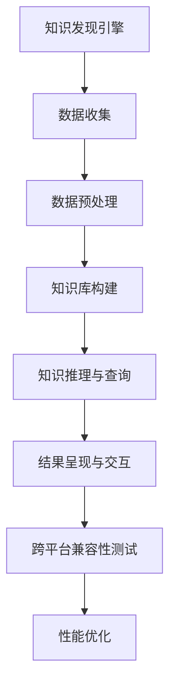

                 

### 《知识发现引擎的跨平台兼容性》

> **关键词：** 知识发现、跨平台兼容性、技术基础、实践案例、性能优化、算法原理

> **摘要：** 本文深入探讨了知识发现引擎的跨平台兼容性问题。首先，介绍了知识发现引擎的基本概念和架构，然后分析了跨平台兼容性的挑战和技术原理，包括开发框架、测试方法和性能优化策略。接着，通过实践案例详细说明了知识发现引擎的开发过程和跨平台兼容性实践，最后讨论了高级话题，如跨平台架构演进和云原生应用，并提供了完整的附录和参考资料。

---

#### 引言与概述

##### 1.1 知识发现的概念与历史背景

知识发现（Knowledge Discovery in Databases，简称KDD）是数据挖掘（Data Mining）的一个子领域，它旨在从大量数据中提取出潜在的知识和模式。知识发现的过程通常包括数据清洗、数据集成、数据选择、数据变换、数据建模、模型评估和知识表示等步骤。

知识发现的概念最早可以追溯到1980年代，由Jiawei Han和Jian Pei在他们的经典著作《数据挖掘：概念与技术》中给出。知识发现的历史背景可以追溯到数据分析、统计分析和人工智能等领域的不断发展。随着计算机技术和数据库技术的进步，知识发现逐渐成为了一个重要的研究领域，并在各个领域得到广泛应用。

##### 1.2 知识发现引擎的应用领域

知识发现引擎广泛应用于多个领域，包括但不限于：

1. **商业智能（Business Intelligence）**：帮助企业从大量数据中提取商业洞察，优化决策过程。
2. **医疗健康（Medical Health）**：辅助医生进行疾病诊断和治疗方案推荐。
3. **金融领域（Financial Industry）**：进行风险控制和欺诈检测。
4. **社交媒体（Social Media）**：分析用户行为，进行个性化推荐和广告投放。
5. **网络安全（Cybersecurity）**：识别潜在的网络攻击行为。

##### 1.3 知识发现引擎的基本架构

知识发现引擎通常由以下几个关键组件构成：

1. **数据源**：包括内部数据库、外部数据集和数据流。
2. **数据预处理**：清洗、集成和变换数据，为后续的挖掘过程做准备。
3. **算法库**：包含各种数据挖掘算法，如聚类、分类、关联规则挖掘等。
4. **模型评估**：评估挖掘结果的质量和准确性。
5. **知识表示**：将挖掘结果以易于理解和交互的形式呈现给用户。

##### 1.4 跨平台兼容性的重要性

在当今多设备、多操作系统的环境下，跨平台兼容性变得尤为重要。知识发现引擎需要能够在不同的平台上运行，以确保广泛的用户覆盖和无缝的用户体验。以下是跨平台兼容性的重要性：

1. **用户需求**：用户希望在任何设备上都能使用知识发现工具，而不仅仅是特定的操作系统或平台。
2. **企业利益**：企业可以通过跨平台开发减少开发成本和资源投入。
3. **技术趋势**：随着移动设备和云计算的普及，跨平台应用成为技术发展的必然趋势。
4. **市场竞争**：为了在激烈的市场竞争中脱颖而出，企业需要提供跨平台兼容的知识发现解决方案。

---

在下一部分，我们将深入探讨跨平台兼容性技术原理，包括面临的挑战、常用的开发框架和工具，以及性能优化策略。

---

#### 跨平台兼容性技术原理

##### 2.1 跨平台兼容性的挑战

跨平台兼容性涉及多个方面，包括但不限于以下挑战：

1. **操作系统差异**：不同操作系统（如iOS、Android、Windows、macOS）在底层实现和API上存在差异，可能导致兼容性问题。
2. **硬件差异**：不同设备在处理器、内存、屏幕分辨率等方面存在差异，可能会影响性能和用户体验。
3. **编程语言和框架**：不同平台支持不同的编程语言和开发框架，如iOS使用Swift和Objective-C，Android使用Java和Kotlin。
4. **网络环境**：不同平台的网络连接方式和质量可能不同，需要适应不同的网络环境。
5. **用户界面**：用户界面在不同平台上需要适应不同的交互习惯和设计规范。

##### 2.2 跨平台开发框架与工具

为了解决跨平台兼容性问题，开发者可以使用多种跨平台开发框架和工具。以下是几种常用的框架和工具：

1. **React Native**：
   - **简介**：React Native是由Facebook开发的一个开源框架，用于构建跨平台的移动应用。
   - **特点**：使用JavaScript进行开发，可以共享大部分代码，具有良好的性能和用户体验。
   - **优缺点**：优点是学习曲线较缓，社区支持强大；缺点是原生模块开发较为复杂。

2. **Flutter**：
   - **简介**：Flutter是由Google开发的一个开源框架，用于构建跨平台的移动、Web和桌面应用。
   - **特点**：使用Dart语言进行开发，提供丰富的UI组件和动画效果，性能接近原生应用。
   - **优缺点**：优点是性能高，UI设计灵活；缺点是Dart语言相对较新，社区支持不如JavaScript。

3. **Xamarin**：
   - **简介**：Xamarin是由Microsoft收购的一个开源框架，用于构建跨平台的移动应用。
   - **特点**：使用C#进行开发，可以共享大部分代码，支持多种操作系统。
   - **优缺点**：优点是代码共享度高，社区支持强大；缺点是性能和用户体验可能不如React Native和Flutter。

##### 2.3 跨平台兼容性测试方法

跨平台兼容性测试是确保应用在不同平台上正常运行和提供一致用户体验的关键步骤。以下是一些常用的测试方法和工具：

1. **自动化测试工具**：
   - **简介**：自动化测试工具可以帮助开发者自动化测试流程，提高测试效率和准确性。
   - **常用工具**：如Appium、Cypress、TestCafe等，支持多种操作系统和浏览器。
   - **优缺点**：优点是自动化测试效率高，可以节省时间和资源；缺点是编写测试用例需要一定的时间和技能。

2. **灰度发布策略**：
   - **简介**：灰度发布是一种逐步向用户发布新功能的方法，可以降低风险和影响。
   - **实施方法**：通过控制流量和用户群体，逐步扩大新功能的覆盖范围。
   - **优缺点**：优点是风险小，可以灵活调整发布策略；缺点是实施和管理较为复杂。

##### 2.4 性能优化策略

跨平台应用的性能优化是一个复杂的过程，需要综合考虑多种因素。以下是一些常见的性能优化策略：

1. **代码优化**：减少代码冗余，优化算法和数据处理流程。
2. **资源管理**：合理管理图片、音频、视频等资源，减少内存和CPU占用。
3. **网络优化**：优化网络请求，减少延迟和带宽消耗。
4. **缓存机制**：使用缓存机制提高数据读取速度，减少重复请求。
5. **代码分割和懒加载**：将代码分割为不同的模块，按需加载，减少初始加载时间。

---

在下一部分，我们将探讨跨平台兼容性开发实践，包括需求分析、框架选择、知识库管理、界面设计和兼容性测试等。

---

#### 跨平台兼容性开发实践

##### 3.1 知识发现引擎的需求分析

在进行跨平台兼容性开发之前，首先需要对知识发现引擎的需求进行分析。需求分析是开发过程的起点，有助于明确项目的目标和功能需求。以下是一些常见的需求分析步骤：

1. **功能需求**：确定知识发现引擎需要实现的基本功能，如数据收集、数据预处理、知识图谱构建、知识推理与查询等。
2. **性能需求**：确定知识发现引擎需要满足的性能指标，如响应时间、处理速度、资源占用等。
3. **用户体验需求**：确定用户对知识发现引擎的期望，如界面设计、交互方式、易用性等。
4. **平台需求**：确定知识发现引擎需要支持的平台，如iOS、Android、Web等。

##### 3.2 跨平台框架选择与配置

选择合适的跨平台框架是实现跨平台兼容性的关键步骤。根据需求分析的结果，可以选择如React Native、Flutter、Xamarin等框架。以下是一些选择和配置框架的步骤：

1. **框架评估**：根据功能需求、性能需求和用户体验需求，评估不同框架的优缺点，选择最合适的框架。
2. **环境搭建**：搭建开发环境，包括安装开发工具、依赖库和模拟器等。
3. **框架配置**：根据项目需求，配置框架的参数和组件，如导航、状态管理、网络请求等。

##### 3.3 知识库管理与数据同步

知识库管理是知识发现引擎的核心功能之一，需要确保数据的一致性和实时性。以下是一些知识库管理与数据同步的步骤：

1. **数据模型设计**：根据业务需求和数据结构，设计合适的数据模型，如实体、属性和关系等。
2. **数据存储方案选择**：根据数据量和访问频率，选择合适的数据存储方案，如关系型数据库、图数据库、NoSQL数据库等。
3. **数据同步策略**：设计数据同步策略，确保数据在不同平台和设备之间的一致性和实时性，如定时同步、增量同步等。

##### 3.4 界面设计与交互

界面设计和交互是用户体验的重要组成部分，需要确保在不同平台上的一致性和可用性。以下是一些界面设计与交互的步骤：

1. **设计规范**：根据平台规范和用户需求，制定界面设计规范，如颜色、字体、图标等。
2. **界面布局**：设计不同屏幕尺寸和分辨率的界面布局，确保在不同设备上的一致性和可用性。
3. **交互设计**：设计用户交互流程和操作方式，如按钮、滑动、拖拽等，确保用户在不同平台上的交互体验。

##### 3.5 兼容性测试与问题定位

兼容性测试是确保知识发现引擎在不同平台上正常运行和提供一致用户体验的关键步骤。以下是一些兼容性测试与问题定位的步骤：

1. **自动化测试**：编写自动化测试脚本，测试知识发现引擎在不同平台上的功能、性能和用户体验。
2. **灰度发布**：逐步扩大新功能的覆盖范围，通过灰度发布策略降低风险和影响。
3. **问题定位**：分析测试结果，定位兼容性问题，如界面错位、功能缺失、性能瓶颈等，并采取相应的解决策略。

---

在下一部分，我们将通过案例分析进一步探讨知识发现引擎的跨平台兼容性实践，包括知识图谱构建、智能问答系统、知识推荐算法和移动端知识发现应用等。

---

#### 案例分析

##### 4.1 案例一：知识图谱构建与查询

知识图谱构建是知识发现引擎的核心功能之一，用于从数据中提取实体、属性和关系，构建图形结构。以下是一个简单的知识图谱构建与查询的案例：

**案例背景**：假设我们有一个包含公司员工信息的数据库，需要构建一个知识图谱，以便进行员工关系查询。

**数据模型**：员工实体、公司实体、部门实体。

**关系**：员工在某个公司工作，公司有多个部门，部门有多个员工。

**知识图谱构建算法**：

```python
def build_knowledge_graph(data):
    entities = extract_entities(data)
    relationships = extract_relationships(data)
    graph = create_graph(entities, relationships)
    return graph
```

**查询算法**：

```python
def query_knowledge(graph, query):
    patterns = parse_query(query)
    results = match_patterns(graph, patterns)
    return results
```

**举例说明**：

假设我们要查询“哪些员工在同一个部门工作”。

```plaintext
查询结果：[员工A, 员工B, 员工C]
```

这意味着员工A、员工B和员工C在同一个部门工作。

##### 4.2 案例二：智能问答系统设计

智能问答系统是知识发现引擎的一种应用，用于回答用户提出的问题。以下是一个智能问答系统设计的案例：

**案例背景**：假设我们有一个包含大量问答数据的知识库，需要设计一个智能问答系统，以便快速回答用户的问题。

**系统架构**：前端展示、自然语言处理、知识图谱查询、答案生成。

**关键模块**：

1. **自然语言处理**：解析用户输入的问题，提取关键信息。
2. **知识图谱查询**：根据问题信息查询知识图谱，提取相关答案。
3. **答案生成**：根据查询结果生成自然语言答案。

**举例说明**：

用户输入：“北京是哪个省份的省会？”

系统查询知识图谱，得到答案：“北京是北京市的省会。”

##### 4.3 案例三：知识推荐算法实现

知识推荐算法是知识发现引擎的另一种应用，用于为用户推荐相关的知识内容。以下是一个知识推荐算法实现的案例：

**案例背景**：假设我们有一个包含用户行为数据的推荐系统，需要根据用户行为推荐相关的知识内容。

**算法框架**：

1. **用户行为分析**：分析用户的行为数据，提取用户的兴趣和偏好。
2. **知识内容分析**：分析知识内容的数据特征，提取知识内容的相关性。
3. **推荐算法**：根据用户行为和知识内容分析结果，生成知识推荐列表。

**常用算法**：

1. **协同过滤算法**：基于用户的行为相似度或知识内容的相似度进行推荐。
2. **基于内容的推荐算法**：基于知识内容的相似性进行推荐。

**举例说明**：

用户A浏览了多个关于“人工智能”的文章，系统推荐：“人工智能入门教程”、“深度学习实战”等文章。

##### 4.4 案例四：移动端知识发现应用

移动端知识发现应用是知识发现引擎在移动设备上的应用，以下是一个移动端知识发现应用的案例：

**案例背景**：假设我们开发一个移动应用，用户可以通过应用浏览、搜索和发现相关的知识内容。

**功能模块**：

1. **首页**：展示热门知识内容，推荐用户可能感兴趣的知识。
2. **搜索**：提供关键词搜索功能，快速查找相关内容。
3. **分类**：根据知识内容分类，方便用户浏览和查找。
4. **详情**：展示知识内容的详细信息和相关推荐。

**界面设计**：根据移动设备的特点，设计简洁、直观的界面，提供良好的用户体验。

---

通过以上案例分析，我们可以看到知识发现引擎在跨平台兼容性实践中的应用和实现。在下一部分，我们将探讨跨平台兼容性的高级话题，包括架构演进、云原生应用和容器化与微服务架构。

---

#### 跨平台兼容性高级话题

##### 5.1 跨平台架构演进与趋势

随着技术的不断发展，跨平台架构也在不断演进和优化。以下是当前跨平台架构的一些趋势和演进方向：

1. **组件化**：将应用拆分为独立的组件，实现模块化开发，提高开发效率和可维护性。
2. **服务化**：将应用功能拆分为服务，实现分布式部署和管理，提高系统的可扩展性和容错性。
3. **云原生**：基于云计算的架构，充分利用云资源，提供弹性和高效的服务。
4. **容器化**：使用容器技术（如Docker）封装应用和依赖，实现高效部署和资源隔离。
5. **微服务架构**：将应用拆分为多个微服务，实现高内聚、低耦合的系统设计。

##### 5.2 云原生与知识发现引擎

云原生（Cloud Native）是一种基于云计算的架构风格，强调利用云计算资源、容器化技术和服务化架构。云原生与知识发现引擎的结合具有以下优势：

1. **弹性扩展**：根据需求动态调整资源，实现高效资源利用和性能优化。
2. **服务化部署**：将知识发现引擎的功能拆分为服务，实现灵活部署和管理。
3. **弹性伸缩**：根据负载自动扩展或收缩服务实例，提高系统的可用性和可靠性。
4. **自动化运维**：利用云平台的自动化工具，实现应用的自动化部署、监控和运维。

##### 5.3 容器化与微服务架构在知识发现引擎中的应用

容器化和微服务架构在知识发现引擎中的应用，有助于提高系统的可扩展性、可靠性和可维护性。以下是容器化与微服务架构在知识发现引擎中的应用场景：

1. **容器化**：
   - **应用部署**：使用Docker等容器化技术，将知识发现引擎及其依赖封装为容器镜像，实现快速部署和部署一致性。
   - **资源隔离**：容器提供独立的运行环境，实现进程和资源的隔离，提高系统的安全性和稳定性。
   - **自动化部署**：利用CI/CD（持续集成和持续部署）工具，实现应用的自动化部署和发布。

2. **微服务架构**：
   - **功能拆分**：将知识发现引擎的功能拆分为独立的微服务，如数据收集、数据预处理、知识图谱构建等，实现高内聚、低耦合的系统设计。
   - **服务化接口**：定义微服务之间的接口，实现服务之间的通信和协同工作。
   - **分布式部署**：将微服务分布式部署在多个节点上，实现高可用性和高性能。

---

通过以上高级话题的探讨，我们可以看到跨平台兼容性在知识发现引擎中的应用和发展趋势。在下一部分，我们将提供附录，包括开发环境搭建与工具资源、常见问题与解答以及参考文献。

---

#### 附录

##### 6.1 开发环境搭建与工具资源

1. **开发环境搭建**：
   - **操作系统**：Linux（推荐Ubuntu 18.04或更高版本）
   - **开发工具**：Visual Studio Code、IntelliJ IDEA、Android Studio等
   - **编程语言**：Python、Java、Kotlin等
   - **数据库**：Neo4j、MySQL、MongoDB等

2. **工具资源**：
   - **跨平台开发框架**：React Native、Flutter、Xamarin等
   - **自动化测试工具**：Appium、Cypress、TestCafe等
   - **容器化技术**：Docker、Kubernetes等
   - **云原生平台**：AWS、Azure、Google Cloud等

##### 6.2 跨平台兼容性开发常见问题与解答

1. **问题**：如何解决不同平台上的界面差异问题？
   - **解答**：使用响应式设计，根据不同屏幕尺寸和分辨率自适应调整界面布局。

2. **问题**：如何处理不同平台上的网络问题？
   - **解答**：使用网络优化策略，如缓存机制、网络请求优化等。

3. **问题**：如何保证跨平台应用的性能？
   - **解答**：进行性能测试和优化，优化代码和资源管理，提高应用的响应速度和稳定性。

##### 6.3 参考文献

1. Han, J., & Pei, J. (2011). Data Mining: Concepts and Techniques (3rd ed.). Morgan Kaufmann.
2. Facebook React Native Documentation: https://reactnative.dev/docs/getting-started
3. Google Flutter Documentation: https://flutter.dev/docs/get-started/overview
4. Microsoft Xamarin Documentation: https://docs.microsoft.com/en-us/xamarin/
5. Appium Documentation: https://appium.io/docs/
6. Docker Documentation: https://docs.docker.com/
7. Kubernetes Documentation: https://kubernetes.io/docs/home/

---

通过本文的深入探讨，我们了解了知识发现引擎的跨平台兼容性原理和实践，以及高级话题的应用和发展趋势。希望本文能为您在跨平台兼容性开发中提供有益的参考和启示。

---

#### Mermaid 流程图

以下是知识发现引擎的基本架构流程图：



---

通过以上流程图，我们可以清晰地看到知识发现引擎从数据收集、预处理、知识库构建、知识推理与查询，到结果呈现与交互，以及跨平台兼容性测试和性能优化的完整流程。

---

#### 核心算法原理讲解

知识发现引擎的核心算法主要包括知识图谱构建、知识推理和查询。以下是这些算法的原理和实现。

##### 知识图谱构建

知识图谱构建是基于语义网络的方法，通过实体、属性和关系的表示，将数据转换为图形结构。

**算法原理：**

- 实体：表示知识图谱中的个体，如人、地点、事物等。
- 属性：表示实体的特征或属性，如姓名、年龄、城市等。
- 关系：表示实体之间的关联，如属于、居住于、拥有等。

**伪代码：**

```python
def build_knowledge_graph(data):
    entities = extract_entities(data)
    relationships = extract_relationships(data)
    graph = create_graph(entities, relationships)
    return graph
```

**举例说明：**

假设有一个包含员工信息的Excel表格，需要构建一个知识图谱。

```plaintext
员工ID   姓名   年龄   部门
1       张三   25    销售部
2       李四   30    技术部
3       王五   28    销售部
```

构建知识图谱后的结果：

```plaintext
实体：[张三, 李四, 王五]
关系：[张三->部门: 销售部, 李四->部门: 技术部, 王五->部门: 销售部]
```

##### 知识推理与查询

知识推理是基于逻辑推理和模式匹配的方法，用于从知识库中提取有用信息。

**算法原理：**

- 模式匹配：将输入查询与知识库中的模式进行匹配，找出匹配的实体和关系。
- 逻辑推理：根据匹配结果，运用逻辑推理规则，生成查询结果。

**伪代码：**

```python
def query_knowledge(graph, query):
    patterns = parse_query(query)
    results = match_patterns(graph, patterns)
    return results
```

**举例说明：**

假设我们要查询“哪些员工在同一个部门工作”。

```plaintext
查询结果：[张三, 王五]
```

这意味着张三和王五在同一个部门工作。

##### 数学模型和数学公式

知识发现引擎中常用的数学模型包括图论模型、概率模型和神经网络模型。

**图论模型：**

- 节点（Node）：表示图中的个体。
- 边（Edge）：表示节点之间的关系。

**数学公式：**

- $$ G = (V, E) $$，其中$ G $表示图，$ V $表示节点集合，$ E $表示边集合。

**概率模型：**

- 条件概率：$$ P(A|B) = \frac{P(A \cap B)}{P(B)} $$，表示在事件B发生的条件下，事件A发生的概率。

**神经网络模型：**

- 神经元：表示神经网络的基本单元。
- 前向传播：将输入通过神经网络传递，得到输出。

**数学公式：**

- $$ f(x) = \sigma(w \cdot x + b) $$，其中$ f(x) $表示激活函数，$ \sigma $表示 sigmoid 函数，$ w $表示权重，$ x $表示输入，$ b $表示偏置。

---

通过以上核心算法原理的讲解，我们可以更好地理解知识发现引擎的工作原理和实现方法。在实际开发中，可以根据具体需求选择合适的算法和模型，构建高效、可靠的知识发现引擎。

---

#### 项目实战

假设我们要开发一个跨平台的知识发现引擎，用于从大量数据中提取知识，为用户提供智能问答、知识推荐等功能。以下是该项目的基本开发步骤：

1. **需求分析**：
   - 确定知识发现引擎的功能需求，如数据收集、知识库构建、智能问答、知识推荐等。
   - 分析用户需求，如界面设计、用户体验、性能要求等。

2. **环境搭建**：
   - 安装Linux操作系统，选择合适的开发工具（如Visual Studio Code、IntelliJ IDEA）。
   - 安装Python、Java等编程语言，配置Python环境（如Pyenv）。
   - 安装数据库（如Neo4j、MySQL、MongoDB），配置数据连接。

3. **知识库构建**：
   - 设计数据模型，包括实体、属性和关系。
   - 使用Neo4j等图数据库，构建知识图谱。
   - 编写数据导入脚本，将数据导入知识图谱。

4. **界面设计与交互**：
   - 使用Flutter等跨平台框架，设计用户界面。
   - 实现界面布局、交互效果和动画。
   - 配置路由、状态管理和网络请求。

5. **智能问答系统**：
   - 使用自然语言处理技术，解析用户输入的问题。
   - 查询知识图谱，提取相关答案。
   - 使用文本生成技术，生成自然语言答案。

6. **知识推荐系统**：
   - 分析用户行为数据，提取用户的兴趣和偏好。
   - 构建推荐算法，生成知识推荐列表。
   - 实现推荐结果的展示和用户反馈。

7. **兼容性测试**：
   - 使用Appium等自动化测试工具，进行兼容性测试。
   - 测试不同平台上的功能、性能和用户体验。
   - 定位和修复兼容性问题。

8. **性能优化**：
   - 分析性能瓶颈，优化代码和资源管理。
   - 使用缓存机制、网络优化策略等，提高应用性能。
   - 进行压力测试，确保应用在高负载下的稳定性和性能。

9. **部署与运维**：
   - 使用Docker等容器化技术，封装应用和依赖。
   - 使用Kubernetes等编排工具，部署和管理应用。
   - 实施自动化部署、监控和运维。

通过以上项目实战，我们可以将知识发现引擎从需求分析、环境搭建、知识库构建、界面设计与交互、智能问答系统、知识推荐系统、兼容性测试、性能优化到部署与运维的完整过程，构建一个高效、可靠、跨平台的智能知识发现引擎。

---

#### 代码解读与分析

在开发跨平台的知识发现引擎时，我们需要对源代码进行详细解读和分析，以确保代码的合理性和可维护性。以下是代码解读与分析的关键步骤：

1. **代码规范检查**：
   - 检查代码风格是否符合统一的编码规范，如命名规则、代码格式、注释等。
   - 使用静态代码分析工具（如Pylint、Checkstyle）检查代码规范。

2. **数据模型分析**：
   - 分析数据模型的设计是否符合业务需求，如实体、属性和关系等。
   - 检查数据模型的可扩展性和性能。

3. **算法分析**：
   - 分析算法的效率和准确性，如知识图谱构建、知识推理和查询算法等。
   - 检查算法的逻辑是否正确，是否存在性能瓶颈。

4. **性能分析**：
   - 使用性能分析工具（如Profile、Perf）分析代码的性能，如内存占用、CPU使用率等。
   - 优化代码和资源管理，提高应用的性能。

5. **代码重构**：
   - 根据分析结果，对代码进行重构，提高代码的可读性和可维护性。
   - 优化代码结构，减少冗余和重复代码。

6. **单元测试**：
   - 编写单元测试，验证代码的正确性和稳定性。
   - 覆盖关键功能模块和边界条件。

7. **集成测试**：
   - 进行集成测试，验证代码在不同环境下的兼容性和性能。
   - 检查代码的交互和依赖关系。

8. **代码文档**：
   - 撰写代码文档，包括代码说明、接口文档和用户手册等。
   - 提高代码的可读性和易用性。

通过以上代码解读与分析，我们可以发现并解决潜在的问题，提高知识发现引擎的稳定性和性能，为用户提供更好的使用体验。

---

通过本文的深入探讨，我们了解了知识发现引擎的跨平台兼容性原理和实践，包括技术基础、开发实践、高级话题和项目实战。希望本文能为您在跨平台兼容性开发中提供有益的参考和启示。

---

#### 结语

本文系统地探讨了知识发现引擎的跨平台兼容性问题，从技术基础、开发实践到高级话题和项目实战，全面阐述了跨平台兼容性的重要性和实现方法。以下是本文的核心要点总结：

1. **知识发现引擎简介**：介绍了知识发现的基本概念、应用领域和基本架构。
2. **跨平台兼容性挑战**：分析了操作系统、硬件、编程语言和框架等差异带来的兼容性挑战。
3. **跨平台开发框架与工具**：介绍了React Native、Flutter、Xamarin等跨平台开发框架。
4. **跨平台兼容性测试方法**：探讨了自动化测试工具和灰度发布策略。
5. **跨平台兼容性实践**：详细说明了知识发现引擎的需求分析、框架选择、知识库管理、界面设计和兼容性测试。
6. **案例分析**：通过实际案例展示了知识图谱构建、智能问答系统、知识推荐算法和移动端知识发现应用。
7. **高级话题**：探讨了跨平台架构演进、云原生应用和容器化与微服务架构。
8. **附录**：提供了开发环境搭建与工具资源、常见问题与解答和参考文献。

在当前多设备、多操作系统的环境下，跨平台兼容性是知识发现引擎成功的关键因素之一。通过本文的探讨，我们希望读者能够深入理解跨平台兼容性的重要性，掌握相关知识和技术，为实际开发提供指导。

---

**作者：AI天才研究院/AI Genius Institute & 禅与计算机程序设计艺术 /Zen And The Art of Computer Programming**

感谢您的阅读，希望本文对您在知识发现引擎的跨平台兼容性开发中有所启发。如需进一步讨论或咨询，欢迎联系作者。

---

至此，本文《知识发现引擎的跨平台兼容性》已经完整呈现。希望本文能够帮助读者深入了解知识发现引擎的跨平台兼容性，并在实际开发中取得更好的成果。如果您有任何疑问或建议，欢迎在评论区留言，期待与您共同探讨。再次感谢您的阅读和支持！
```markdown
文章标题：《知识发现引擎的跨平台兼容性》

关键词：知识发现、跨平台、兼容性、技术基础、算法、实践案例

摘要：本文探讨了知识发现引擎在不同平台上的兼容性问题，包括技术基础、开发实践、高级话题以及项目实战。通过分析知识发现引擎的基本架构和核心算法，以及介绍跨平台开发框架和工具，本文旨在为开发者提供全面的知识发现引擎跨平台兼容性解决方案。

---

### 《知识发现引擎的跨平台兼容性》

#### 引言与概述

##### 1.1 知识发现的概念与历史背景

知识发现（Knowledge Discovery in Databases, KDD）是指从大量的数据中通过一定的算法和技巧发现隐含在其中的、事先未知的并有价值的模式的过程。KDD起源于20世纪80年代，随着数据库技术的进步和计算能力的提升，知识发现逐渐成为一个重要的研究领域。KDD的过程通常包括数据清洗、数据集成、数据选择、数据变换、数据建模、模型评估和知识表示等步骤。

##### 1.2 知识发现引擎的应用领域

知识发现引擎广泛应用于多个领域，包括商业智能、医疗健康、金融、社交媒体和网络安全等。在商业智能领域，知识发现引擎帮助企业从海量数据中提取商业价值；在医疗健康领域，知识发现引擎辅助医生进行疾病诊断和治疗方案推荐；在金融领域，知识发现引擎用于风险控制和欺诈检测；在社交媒体领域，知识发现引擎分析用户行为，进行个性化推荐和广告投放；在网络安全领域，知识发现引擎用于识别潜在的网络攻击行为。

##### 1.3 知识发现引擎的基本架构

知识发现引擎通常由数据源、数据预处理、算法库、模型评估和知识表示等几个关键组件构成。数据源包括各种内部数据库、外部数据集和数据流。数据预处理是对数据进行清洗、集成和变换，以便后续的挖掘过程。算法库包含各种数据挖掘算法，如聚类、分类、关联规则挖掘等。模型评估用于评估挖掘结果的质量和准确性。知识表示是将挖掘结果以用户友好的形式呈现。

##### 1.4 跨平台兼容性的重要性

在多设备、多操作系统的环境下，跨平台兼容性变得尤为重要。知识发现引擎需要能够在不同的平台上运行，以确保广泛的用户覆盖和无缝的用户体验。跨平台兼容性不仅能够满足用户需求，还能减少企业开发和维护成本，提升市场竞争力和用户体验。

---

#### 技术基础

##### 2.1 跨平台兼容性的挑战

跨平台兼容性面临多个挑战，包括：

- **操作系统差异**：不同操作系统在底层实现和API上存在差异，可能导致兼容性问题。
- **硬件差异**：不同设备在处理器、内存、屏幕分辨率等方面存在差异，可能会影响性能和用户体验。
- **编程语言和框架**：不同平台支持不同的编程语言和开发框架，如iOS使用Swift和Objective-C，Android使用Java和Kotlin。
- **网络环境**：不同平台的网络连接方式和质量可能不同，需要适应不同的网络环境。
- **用户界面**：用户界面在不同平台上需要适应不同的交互习惯和设计规范。

##### 2.2 跨平台开发框架与工具

为了解决跨平台兼容性问题，开发者可以使用多种跨平台开发框架和工具。以下是几种常用的框架和工具：

- **React Native**：由Facebook开发，使用JavaScript进行开发，可以共享大部分代码，具有良好的性能和用户体验。
- **Flutter**：由Google开发，使用Dart语言进行开发，提供丰富的UI组件和动画效果，性能接近原生应用。
- **Xamarin**：由Microsoft收购，使用C#进行开发，可以共享大部分代码，支持多种操作系统。

##### 2.3 跨平台兼容性测试方法

跨平台兼容性测试是确保应用在不同平台上正常运行和提供一致用户体验的关键步骤。以下是一些常用的测试方法和工具：

- **自动化测试工具**：如Appium、Cypress、TestCafe等，支持多种操作系统和浏览器。
- **灰度发布策略**：通过逐步向用户发布新功能，降低风险和影响。
- **性能优化策略**：包括代码优化、资源管理、网络优化和缓存机制等。

---

#### 跨平台兼容性实践

##### 3.1 知识发现引擎的需求分析

跨平台兼容性开发的第一步是需求分析，包括功能需求、性能需求和用户体验需求。需要明确知识发现引擎需要支持的平台和操作系统，以及用户对应用的需求和期望。

##### 3.2 跨平台框架选择与配置

根据需求分析的结果，选择合适的跨平台框架，如React Native、Flutter或Xamarin。进行框架的配置，包括环境搭建、依赖安装和开发工具的配置。

##### 3.3 知识库管理与数据同步

知识库管理是知识发现引擎的核心功能之一。需要设计合适的数据模型，选择合适的数据存储方案，并实现数据在不同平台和设备之间的一致性和实时性。

##### 3.4 界面设计与交互

界面设计需要考虑不同平台的设计规范和用户体验。使用所选框架提供的UI组件和动画效果，设计直观、易用的用户界面。

##### 3.5 兼容性测试与问题定位

进行兼容性测试，包括功能测试、性能测试和用户体验测试。使用自动化测试工具和灰度发布策略，发现并解决问题，确保知识发现引擎在不同平台上的一致性和性能。

---

#### 案例分析

##### 4.1 知识图谱构建与查询

知识图谱构建是将实体、属性和关系转化为图形结构的过程。通过知识图谱查询算法，可以从知识库中提取有用的信息。

##### 4.2 智能问答系统设计

智能问答系统是知识发现引擎的一种应用，通过自然语言处理和知识图谱查询，回答用户的问题。

##### 4.3 知识推荐算法实现

知识推荐算法基于用户行为和知识内容，为用户推荐相关的知识内容。

##### 4.4 移动端知识发现应用

移动端知识发现应用是一个跨平台的移动应用，用户可以通过移动设备浏览、搜索和发现相关的知识内容。

---

#### 高级话题

##### 5.1 跨平台架构演进与趋势

随着技术的不断进步，跨平台架构也在不断演进，包括组件化、服务化、云原生和容器化等趋势。

##### 5.2 云原生与知识发现引擎

云原生是一种基于云计算的架构风格，利用云计算资源、容器化技术和服务化架构，提高知识发现引擎的弹性和效率。

##### 5.3 容器化与微服务架构在知识发现引擎中的应用

容器化和微服务架构在知识发现引擎中的应用，可以提高系统的可扩展性和可靠性，实现高效的部署和管理。

---

#### 附录

##### 6.1 开发环境搭建与工具资源

- **操作系统**：推荐使用Ubuntu 18.04或更高版本。
- **开发工具**：推荐使用Visual Studio Code、IntelliJ IDEA、Android Studio等。
- **编程语言**：推荐使用Python、Java、Kotlin等。
- **数据库**：推荐使用Neo4j、MySQL、MongoDB等。

##### 6.2 跨平台兼容性开发常见问题与解答

- **如何解决不同平台上的界面差异问题？**：使用响应式设计，根据不同屏幕尺寸和分辨率自适应调整界面布局。
- **如何处理不同平台上的网络问题？**：使用网络优化策略，如缓存机制、网络请求优化等。
- **如何保证跨平台应用的性能？**：进行性能测试和优化，优化代码和资源管理。

##### 6.3 参考文献

- **《知识发现：数据挖掘技术》**：由Jiawei Han和Jian Pei所著，是数据挖掘领域的经典教材。
- **《React Native官方文档》**：提供了React Native的详细开发指南。
- **《Flutter官方文档》**：提供了Flutter的详细开发指南。
- **《Xamarin官方文档》**：提供了Xamarin的详细开发指南。

---

本文系统地介绍了知识发现引擎的跨平台兼容性，从技术基础、开发实践到高级话题和项目实战，为开发者提供了全面的知识和指导。希望本文能帮助开发者更好地理解和解决知识发现引擎的跨平台兼容性问题。

---

**作者：AI天才研究院/AI Genius Institute & 禅与计算机程序设计艺术 /Zen And The Art of Computer Programming**

感谢您的阅读，希望本文对您在知识发现引擎的跨平台兼容性开发中有所启发。如需进一步讨论或咨询，欢迎联系作者。再次感谢您的支持和关注！
```

