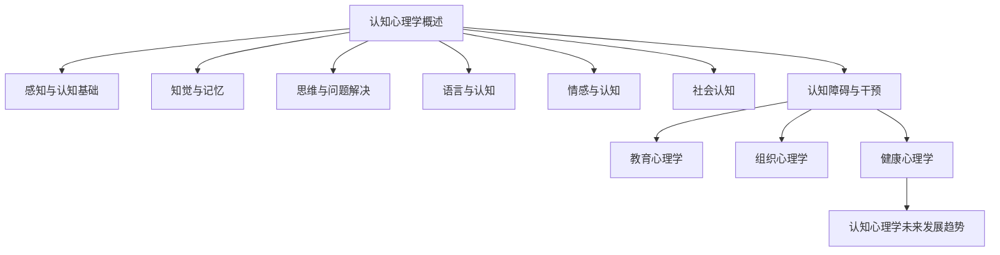

                 

# 《知识的心理学基础：认知过程的解析》

> **关键词：认知心理学，感知与认知，记忆，思维与问题解决，语言与认知，情感与认知，社会认知，认知障碍与干预**

> **摘要：本文旨在深入探讨认知心理学的基础理论，包括感知与认知的基础、认知过程的具体解析以及认知心理学在实际应用中的重要性。通过系统地阐述知觉、记忆、思维、语言、情感和社会认知等方面，本文为理解人类认知提供了全面的视角。同时，本文还将讨论认知障碍的类型、成因以及干预方法，旨在提升对认知障碍的认识与干预能力。此外，本文还将探讨认知心理学在教育、组织健康等领域的应用，以及认知心理学的未来发展趋势。**

### 目录大纲

# 《知识的心理学基础：认知过程的解析》

## 第一部分：认知心理学基础

### 第1章：认知心理学概述

#### 1.1 认知心理学的定义与发展历程

#### 1.2 认知心理学的主要理论流派

#### 1.3 认知心理学的研究方法与技术

### 第2章：感知与认知基础

#### 2.1 感知的基本理论

#### 2.2 感知与认知的关系

#### 2.3 认知过程的基本特征

## 第二部分：认知过程解析

### 第3章：知觉与记忆

#### 3.1 知觉的基本理论

#### 3.2 知觉与记忆的关系

#### 3.3 记忆的类型与过程

### 第4章：思维与问题解决

#### 4.1 思维的定义与类型

#### 4.2 思维过程与策略

#### 4.3 问题解决的过程与方法

### 第5章：语言与认知

#### 5.1 语言与认知的关系

#### 5.2 语言理解与表达

#### 5.3 语言发展与认知发展

### 第6章：情感与认知

#### 6.1 情感与认知的关系

#### 6.2 情感认知的类型与过程

#### 6.3 情感认知的生理基础

### 第7章：社会认知

#### 7.1 社会认知的定义与概念

#### 7.2 社会认知的过程与机制

#### 7.3 社会认知与人际关系

### 第8章：认知障碍与干预

#### 8.1 认知障碍的类型与表现

#### 8.2 认知障碍的成因与诊断

#### 8.3 认知障碍的干预与治疗

## 第三部分：认知心理学应用

### 第9章：教育心理学

#### 9.1 教育心理学的基本理论

#### 9.2 教育心理学在教育中的应用

#### 9.3 教育心理学的案例分析

### 第10章：组织心理学

#### 10.1 组织心理学的定义与发展

#### 10.2 组织心理学的核心概念

#### 10.3 组织心理学在人力资源管理中的应用

### 第11章：健康心理学

#### 10.1 健康心理学的定义与发展

#### 10.2 健康心理学的核心概念

#### 10.3 健康心理学在疾病预防与康复中的应用

### 第12章：认知心理学未来发展趋势

#### 12.1 认知心理学的未来研究方向

#### 12.2 认知心理学与人工智能的关系

#### 12.3 认知心理学的社会价值与影响

## 附录

### 附录 A：认知心理学研究方法与技术

#### A.1 实验心理学方法

#### A.2 实证心理学方法

#### A.3 计算心理学方法

### 附录 B：认知心理学参考文献

#### B.1 基础理论书籍

#### B.2 研究方法书籍

#### B.3 应用领域书籍

### 附录 C：认知心理学研究工具

#### C.1 数据分析工具

#### C.2 实验设计工具

#### C.3 仿真模拟工具

### Mermaid 流程图

---

接下来，我们将深入第一部分：认知心理学基础，探讨其定义、发展历程以及主要理论流派。

## 第一部分：认知心理学基础

### 第1章：认知心理学概述

认知心理学是心理学的一个重要分支，它研究人类思维、感知、记忆、语言、解决问题等方面的心理过程。自20世纪中叶以来，认知心理学逐渐从传统的行为主义心理学中独立出来，形成了一门具有独特研究方法和理论体系的学科。

#### 1.1 认知心理学的定义与发展历程

**定义**：认知心理学关注的是人类认知过程的内在机制，包括知觉、记忆、思维、语言等。它试图通过实验和理论分析来揭示这些心理过程的规律性和复杂性。

**发展历程**：
- **早期阶段**：20世纪初，行为主义心理学占据主导地位，认知过程被忽视。但随着信息加工理论的兴起，认知心理学逐渐崛起。
- **中期阶段**：20世纪50年代至70年代，认知心理学快速发展，信息加工理论、人工神经网络、认知心理学实验方法等相继出现。
- **近期阶段**：随着计算机科学和神经科学的发展，认知心理学不断与其他学科交叉融合，形成了多个新的研究方向，如认知神经科学、认知心理学与人工智能等。

#### 1.2 认知心理学的主要理论流派

认知心理学包含了多种理论流派，每种流派都有其独特的观点和方法。以下是几种主要的认知心理学理论流派：

1. **信息加工理论**：信息加工理论强调人类认知过程类似于计算机的信息处理过程，包括输入、加工、存储和输出。这种理论通过模拟计算机算法来解释人类认知行为。

2. **认知建构主义**：认知建构主义认为，人类的认知过程是通过主动构建心理模型来理解和解释外部世界的。这一理论强调个体经验在认知过程中的重要性。

3. **进化认知心理学**：进化认知心理学认为，人类的认知能力是在长期进化过程中形成的，旨在解决生存和繁衍等基本问题。这种理论试图从进化的角度来解释认知机制。

4. **社会认知理论**：社会认知理论关注个体如何通过社会互动来理解和解释他人的行为和情感。这种理论强调社会环境在认知发展中的作用。

5. **神经认知心理学**：神经认知心理学研究大脑结构与认知功能之间的关系，通过神经影像技术等手段来揭示认知过程的神经基础。

#### 1.3 认知心理学的研究方法与技术

认知心理学采用多种研究方法和技术来探索认知过程。以下是几种常见的方法：

1. **实验方法**：实验方法通过控制变量来研究特定认知过程的行为表现。例如，知觉实验可以通过呈现不同的视觉刺激来研究人类的视觉感知。

2. **脑成像技术**：脑成像技术如功能性磁共振成像（fMRI）和正电子发射断层扫描（PET）可以非侵入性地研究大脑活动与认知过程之间的关系。

3. **认知建模**：认知建模通过构建计算机模拟模型来模拟人类的认知过程。这种方法可以揭示认知过程的内在机制，并预测人类的行为。

4. **问卷调查与行为观察**：问卷调查和行为观察可以收集个体关于认知过程的自我报告和实际行为数据，从而提供对认知过程更全面的了解。

综上所述，认知心理学通过多学科交叉的研究方法，深入探讨了人类认知过程的复杂性和多样性。在接下来的章节中，我们将进一步解析感知与认知基础，以更深入地理解人类认知的本质。

---

在第一部分结束前，我们简要回顾了认知心理学的定义、发展历程、主要理论流派以及研究方法。通过这一概述，我们可以看到认知心理学在理解人类认知过程中的重要性。在接下来的部分中，我们将继续深入探讨感知与认知的基础，包括感知的基本理论、感知与认知的关系以及认知过程的基本特征。这些内容将为后续对认知过程的详细分析奠定基础。

## 第一部分：认知心理学基础

### 第2章：感知与认知基础

感知与认知是人类心理活动的基础，它们相互联系、相互作用，共同构成了我们对环境的理解和反应。在这一章中，我们将探讨感知的基本理论，分析感知与认知的关系，并探讨认知过程的基本特征。

#### 2.1 感知的基本理论

感知是指个体通过感官接收外部信息并将其转换为内在心理表征的过程。感知的基本理论包括以下几个方面：

1. **感觉与知觉**：
   - **感觉**：感觉是指感官接收外部刺激并产生神经冲动的过程。例如，视觉、听觉、触觉等。
   - **知觉**：知觉是指大脑对感觉信息进行加工，形成对环境的有意义理解的过程。知觉不仅仅是感觉信息的简单汇总，还涉及到对信息的解释、组织和整合。

2. **感知的生理基础**：感知的生理基础主要包括感官器官（如眼睛、耳朵、皮肤等）和大脑。感官器官负责接收外界刺激，而大脑则对这些刺激进行加工和处理。

3. **感知的心理学模型**：心理学模型包括感觉登记器理论、特征检测理论、知觉整体理论等。这些模型试图解释感知如何从感觉信息转化为对环境的有意义理解。

4. **感知的适应性**：感知具有适应性，即个体在长期环境中形成的感知模式会影响其对新信息的处理。例如，长期居住在嘈杂环境中的人可能对声音刺激更加敏感。

#### 2.2 感知与认知的关系

感知与认知是密不可分的，它们相互作用、共同促进我们对环境的理解。

1. **感知是认知的基础**：感知为我们提供了关于外部世界的直接信息，这些信息是认知过程的基础。没有感知，我们无法获取外界的信息，更无法进行认知。

2. **认知影响感知**：认知过程对感知具有调节作用。例如，预期效应是指我们对预期的信息更加敏感，而忽视非预期的信息。这表明认知过程可以影响我们的感知选择和加工。

3. **感知与认知的相互作用**：感知与认知是动态的相互作用过程。感知提供的信息通过认知加工形成心理表征，而认知结果又影响我们对感知信息的解释和利用。

#### 2.3 认知过程的基本特征

认知过程具有以下基本特征：

1. **选择性**：我们只能感知和注意有限的信息，而忽略了其他信息。这种选择性有助于我们集中注意力，有效地处理复杂环境。

2. **适应性**：认知过程具有适应性，以适应不断变化的环境。例如，我们在不同情境下调整感知和认知策略。

3. **整合性**：认知过程将各种感官信息整合为一个整体，形成对环境的全面理解。例如，视觉和听觉信息可以整合为对场景的整体感知。

4. **信息加工**：认知过程类似于信息加工，包括编码、存储、提取和应用。例如，我们通过记忆存储信息，并在需要时提取和应用这些信息。

5. **动态性**：认知过程是动态的，随着时间和环境的变化而不断调整。例如，我们在不同情境下调整认知策略。

通过以上对感知与认知基础的探讨，我们可以更深入地理解感知和认知的本质。在接下来的章节中，我们将继续探讨知觉与记忆、思维与问题解决、语言与认知、情感与认知以及社会认知等方面的内容，进一步解析人类认知的复杂性和多样性。

---

在本章结束前，我们总结了感知的基本理论、感知与认知的关系以及认知过程的基本特征。感知为我们提供了关于外部世界的直接信息，而认知过程则将这些信息转化为对环境的有意义理解。在下一章中，我们将深入探讨知觉与记忆，分析知觉的基本理论，探讨知觉与记忆的关系，以及记忆的类型与过程。这些内容将为理解人类认知提供更深入的视角。

## 第二部分：认知过程解析

### 第3章：知觉与记忆

知觉与记忆是认知过程的两个重要组成部分，它们在人类的信息获取、处理和应用中发挥着关键作用。在这一章中，我们将深入探讨知觉的基本理论，分析知觉与记忆的关系，并详细讨论记忆的类型与过程。

#### 3.1 知觉的基本理论

知觉是指我们对感觉信息进行组织、解释和理解的过程，它不仅仅是对感觉信息的简单汇总，还包括了对信息的筛选、整合和解释。

1. **知觉的组织原则**：
   - **对象与背景分离**：我们在感知过程中，往往会将一部分信息视为对象，而将另一部分视为背景。这种分离有助于我们集中注意力和理解重要信息。
   - **整体性**：知觉过程中，我们会将分散的信息整合为一个整体，这种整体性使得我们能够快速理解复杂场景。
   - **选择性**：我们会根据兴趣、需求和预期来选择性地注意某些信息，而忽略其他信息。

2. **知觉的心理模型**：
   - **特征检测理论**：该理论认为，知觉过程始于对刺激特征（如颜色、形状、亮度等）的检测，然后这些特征被整合成完整的知觉对象。
   - **知觉的整体理论**：该理论认为，知觉不仅仅是对特征的简单组合，还包括了对对象的解释和意义赋予。

3. **知觉的生理基础**：知觉的生理基础主要涉及感官器官（如眼睛、耳朵、皮肤等）和大脑。感官器官负责接收外部刺激，而大脑则对这些刺激进行加工和处理。

#### 3.2 知觉与记忆的关系

知觉与记忆是密不可分的，它们共同作用于我们对信息的获取、处理和应用。

1. **知觉影响记忆**：
   - **知觉的选择性**：我们选择性地注意某些信息，这些信息更容易被记忆。
   - **知觉的适应性**：长期处于某种环境中的个体，其知觉模式会发生适应，从而影响记忆。

2. **记忆影响知觉**：
   - **记忆的存储与提取**：记忆存储的信息会影响我们的知觉过程，例如，我们通过记忆识别熟悉的物体和场景。
   - **记忆的预期效应**：我们预期会注意到的信息，会在知觉过程中被更加显著地识别和记忆。

3. **知觉与记忆的相互作用**：知觉与记忆相互作用，形成一个动态的信息处理过程。例如，通过记忆，我们可以更好地理解和解释新的知觉信息。

#### 3.3 记忆的类型与过程

记忆是指对信息的编码、存储和提取过程，它使得我们能够保存和利用过去的信息。

1. **记忆的类型**：
   - **短期记忆**：短期记忆是指对信息的暂时存储，持续时间较短，通常只有几秒到几分钟。
   - **长期记忆**：长期记忆是指对信息的持久存储，可以持续数分钟、数小时甚至一生。

2. **记忆的过程**：
   - **编码**：编码是指将感知的信息转换为大脑可以处理的形式。例如，听觉信息通过大脑的处理转化为听觉记忆。
   - **存储**：存储是指将编码后的信息在大脑中保存起来。存储过程可能涉及神经元的改变和突触的加强。
   - **提取**：提取是指从长期记忆中检索和利用存储的信息。提取过程可能受到多种因素的影响，如记忆的强度、清晰度、练习等。

3. **记忆的模型**：
   - **多重存储模型**：该模型认为记忆分为感觉记忆、短期记忆和长期记忆三个阶段。
   - **工作记忆模型**：该模型认为短期记忆可以进一步细分为工作记忆，工作记忆是短期记忆的一部分，负责处理和暂时存储信息。
   - **多阶段模型**：该模型认为记忆过程涉及多个阶段，每个阶段都有特定的功能和机制。

通过本章对知觉与记忆的探讨，我们可以更深入地理解这两个认知过程如何相互影响，并如何共同作用于我们对信息的处理和应用。在下一章中，我们将继续探讨思维与问题解决，分析思维的定义与类型，思维过程与策略，以及问题解决的过程与方法。

---

在本章结束前，我们对知觉与记忆的基本理论、它们之间的关系以及记忆的类型与过程进行了详细探讨。知觉与记忆是人类认知过程中的两个重要组成部分，它们相互作用，共同促进我们对信息的获取、处理和应用。在下一章中，我们将深入探讨思维与问题解决，分析思维的定义与类型，思维过程与策略，以及问题解决的过程与方法。这将帮助我们更好地理解人类认知的复杂性及其在现实生活中的应用。

### 第4章：思维与问题解决

#### 4.1 思维的定义与类型

思维是人类认知的高级形式，它涉及信息的获取、加工、存储和运用。思维可以定义为个体对信息进行有目的的、系统的加工过程，旨在解决问题、做出决策和获得知识。

1. **思维的类型**：
   - **直观思维**：直观思维是一种基于经验、直觉和快速判断的思维方式。它不依赖于逻辑推理，而是通过直接的感知和理解来解决问题。
   - **分析思维**：分析思维是一种通过逻辑分析和推理来解决问题的思维方式。它注重细节和步骤，通过逐步推理来获得结论。
   - **综合思维**：综合思维是一种通过整合和分析信息来解决问题的思维方式。它强调将不同信息整合为一个整体，以获得更全面的解决方案。
   - **批判性思维**：批判性思维是一种通过评估、分析和判断信息来解决问题的思维方式。它强调对信息的深度理解和质疑，以避免盲目接受和错误推理。

2. **思维的生理基础**：
   - **大脑区域**：思维涉及多个大脑区域，包括前额叶皮层、顶叶、颞叶等。这些区域共同作用，实现了思维的复杂过程。
   - **神经递质**：神经递质如多巴胺、血清素等在思维过程中发挥着重要作用。它们调节神经信号的传递，影响思维的速度和质量。

#### 4.2 思维过程与策略

思维过程是一个复杂的信息处理过程，包括感知、编码、存储、提取和应用。以下是思维过程的主要阶段：

1. **感知与编码**：思维过程始于感知，个体通过感官接收外部信息。这些信息被大脑编码，转化为可以处理的形式，如视觉符号、听觉符号等。

2. **存储与提取**：编码后的信息被存储在大脑的长期记忆中。当需要时，这些信息可以被提取和运用。

3. **加工与整合**：大脑对信息进行加工和整合，形成对问题的理解。这一阶段包括模式识别、信息筛选、信息整合等过程。

4. **应用与决策**：经过加工和整合的信息被应用于解决实际问题，做出决策。这一阶段涉及策略选择、问题解决和行动规划。

思维策略是指个体在思维过程中采用的具体方法和技巧，以优化思维过程和解决问题。以下是几种常见的思维策略：

1. **分析策略**：分析策略通过逐步分解问题，寻找问题的本质和解决方法。例如，通过分解问题、确定子问题和解决方案。

2. **综合策略**：综合策略通过整合不同的信息，形成全面的解决方案。例如，通过整合各种观点、证据和假设，形成统一的解释。

3. **类比策略**：类比策略通过将未知问题与已知问题进行类比，寻找解决方案。例如，通过比较不同情境下的相似性和差异，找到解决问题的方法。

4. **批判性思维策略**：批判性思维策略通过评估、分析和判断信息，避免盲目接受和错误推理。例如，通过质疑证据、逻辑分析和逻辑推理，验证信息的真实性和有效性。

#### 4.3 问题解决的过程与方法

问题解决是指个体在面对问题时，通过一系列思维活动找到解决方案的过程。问题解决通常包括以下几个步骤：

1. **理解问题**：理解问题是问题解决的第一步，个体需要明确问题的性质、目标和要求。

2. **生成假设**：个体通过已有的知识和经验，生成可能的解决方案。这一阶段涉及对问题的分析和分解。

3. **评估假设**：个体对生成的假设进行评估，选择最有可能解决问题的方案。

4. **实施方案**：个体根据评估结果，实施选择的解决方案。这一阶段可能涉及实验、测试或实际操作。

5. **检验与反馈**：个体对实施的方案进行检验，并根据反馈调整和改进解决方案。

以下是一些常见的问题解决方法：

1. **启发式方法**：启发式方法是一种基于经验或直觉的问题解决方法，适用于简单和常见的问题。例如，试错法、爬山法等。

2. **算法方法**：算法方法是一种系统化、逻辑化的问题解决方法，适用于复杂和未知的问题。例如，分支定界法、回溯法等。

3. **逆向推理**：逆向推理是一种从目标状态开始，逐步逆向推导到初始状态的方法。适用于目标明确的复杂问题。

4. **模型构建**：模型构建是一种通过建立数学模型或计算机模型来模拟问题，从而找到解决方案的方法。适用于复杂和高度抽象的问题。

通过本章对思维与问题解决的深入探讨，我们可以更好地理解思维的类型、过程与策略，以及问题解决的方法。这些知识不仅有助于我们更有效地解决问题，还可以提高我们的思维品质和创新能力。在下一章中，我们将探讨语言与认知的关系，分析语言理解与表达，以及语言发展与认知发展。

---

在本章结束前，我们对思维的定义与类型、思维过程与策略，以及问题解决的过程与方法进行了详细探讨。思维是人类认知的高级形式，它在信息加工、问题解决和决策中起着关键作用。在下一章中，我们将深入探讨语言与认知的关系，分析语言理解与表达，以及语言发展与认知发展。这将帮助我们更好地理解语言如何影响认知过程，以及语言在个体认知发展中的作用。

### 第5章：语言与认知

#### 5.1 语言与认知的关系

语言是人类认知的重要组成部分，它不仅是一种交流工具，还是思维的基础。语言与认知之间的关系是复杂的，它们相互影响、共同发展。

1. **语言是认知的基础**：
   - **概念形成**：语言帮助个体形成和表达概念，概念是认知过程中的核心元素。没有语言，个体很难形成复杂的概念体系。
   - **思维发展**：语言是思维的工具，它为思维提供了符号和框架。通过语言，个体可以进行抽象思维和逻辑推理。

2. **认知影响语言**：
   - **语言习得**：认知发展对语言习得有重要影响。儿童的认知能力发展水平决定了他们对语言的学习和理解能力。
   - **语言表达**：认知过程影响个体的语言表达方式和语言内容。个体的思维方式和认知策略会影响他们如何组织和表达思想。

3. **语言与认知的相互作用**：
   - **动态发展**：语言与认知是动态发展的，它们在不同的认知阶段相互作用，相互影响。例如，在儿童的语言发展过程中，认知能力的发展会影响语言习得的速度和质量。
   - **交叉影响**：语言和认知在不同领域中相互交叉影响。例如，在科学研究中，语言和认知共同作用于科学研究的方法和过程。

#### 5.2 语言理解与表达

语言理解与表达是语言与认知关系的重要体现。

1. **语言理解**：
   - **词汇理解**：语言理解始于词汇理解，个体通过词汇掌握语言的基本意义和用法。
   - **句子理解**：句子理解是语言理解的更高层次，个体需要理解句子的结构、语法和语义。
   - **篇章理解**：篇章理解是对整篇文章或段落的理解，个体需要理解文章的主旨、逻辑结构和细节。

2. **语言表达**：
   - **口头表达**：口头表达是通过语言口头传递信息的过程，个体需要组织语言、选择词汇和语法结构，以清晰、准确地表达思想。
   - **书面表达**：书面表达是通过文字书面传递信息的过程，个体需要撰写文章、报告等，以表达复杂的思想和观点。
   - **非语言表达**：非语言表达包括肢体语言、面部表情等，这些也是语言理解与表达的重要组成部分。

3. **语言理解与表达的策略**：
   - **词汇积累**：语言理解与表达的基础是词汇积累，个体需要通过阅读、听力练习等方式积累词汇。
   - **语法学习**：语法是语言表达的框架，个体需要掌握基本的语法规则，以正确地组织语言。
   - **逻辑训练**：逻辑训练有助于个体清晰地表达思想，逻辑思维和推理能力是语言表达的重要基础。
   - **情境适应**：语言理解与表达需要适应不同的情境和场景，个体需要根据不同的情境选择合适的语言表达方式。

#### 5.3 语言发展与认知发展

语言发展与认知发展是相互关联的，它们在儿童和成人的发展中起着重要作用。

1. **儿童语言发展**：
   - **语言习得阶段**：儿童的早期语言发展分为几个阶段，包括咿呀学语期、单词期、简单句期等。
   - **语言发展关键期**：语言发展的关键期一般在儿童早期，这段时间内，儿童的语言习得能力最强。
   - **语言与社会互动**：儿童的语言发展与社会互动密切相关，通过与他人的交流，儿童学习语言和社交技能。

2. **成人语言发展**：
   - **语言习得与维持**：成人在语言习得方面不如儿童，但他们可以通过不断学习和练习来维持和提高语言能力。
   - **语言学习策略**：成人语言学习需要更多的策略和技巧，如语法学习、词汇积累、语言环境等。
   - **语言功能与认知能力**：成人语言发展与认知能力密切相关，语言能力的提高有助于认知功能的维持和提升。

3. **语言发展与认知发展的关系**：
   - **相互促进**：语言发展与认知发展相互促进，语言能力的提高有助于认知能力的提升，而认知能力的提升又有助于语言能力的发展。
   - **交叉影响**：语言发展与认知发展在不同领域中相互交叉影响。例如，在学术研究中，语言能力是认知能力的体现，而认知能力又影响语言表达的深度和广度。

通过本章对语言与认知关系的探讨，我们可以更好地理解语言在认知过程中的作用，以及语言发展与认知发展之间的相互关系。这些知识对于教育、语言学习和认知科学研究具有重要意义。在下一章中，我们将探讨情感与认知的关系，分析情感与认知的关系、情感认知的类型与过程，以及情感认知的生理基础。

---

在本章结束前，我们对语言与认知的关系、语言理解与表达，以及语言发展与认知发展进行了详细探讨。语言不仅是交流的工具，也是认知的基础，它在概念形成、思维发展以及语言习得中发挥着重要作用。在下一章中，我们将深入探讨情感与认知的关系，分析情感与认知的关系、情感认知的类型与过程，以及情感认知的生理基础。这将帮助我们更好地理解情感在认知过程中的作用，以及情感认知对个体行为和心理健康的深远影响。

### 第6章：情感与认知

#### 6.1 情感与认知的关系

情感与认知是心理活动的两个核心组成部分，它们相互影响、相互作用，共同影响个体的行为、决策和心理状态。

1. **情感对认知的影响**：
   - **注意选择**：情感影响个体的注意力分配，积极的情感往往吸引更多注意力，而消极的情感可能导致注意力分散。
   - **记忆加工**：情感强烈的事件更容易被记住，情感对记忆的加工和提取有显著的增强或抑制作用。
   - **判断与决策**：情感可以影响个体的判断和决策过程，强烈的情感可能导致认知偏见和决策失误。

2. **认知对情感的影响**：
   - **情感体验的形成**：认知过程在情感体验的形成中起着关键作用，个体通过认知加工理解情境，从而产生相应的情感反应。
   - **情感调节**：认知过程可以帮助个体调节和改变情感体验，例如，通过认知重构或情感调适策略。

3. **情感与认知的相互作用**：
   - **动态循环**：情感与认知之间形成一个动态循环，认知影响情感的产生和体验，而情感又影响认知过程，这种相互作用在个体的心理活动中持续进行。

#### 6.2 情感认知的类型与过程

情感认知是指个体识别、理解和表达情感的过程，它包括情感识别、情感理解和情感表达三个方面。

1. **情感识别**：
   - **基本情感识别**：基本情感识别是指识别面部表情、身体语言等表达的情感。
   - **复杂情感识别**：复杂情感识别是指识别微妙的情感表达，如悲伤、愤怒、羞耻等。

2. **情感理解**：
   - **情境理解**：情感理解涉及对情感产生情境的理解，例如，为什么某人在特定情境下表现出特定情感。
   - **情感推理**：情感推理是指通过逻辑推理来理解他人情感，如通过对话内容推断对方情感。

3. **情感表达**：
   - **语言表达**：语言表达是指通过语言来传达情感，如使用情绪化的词汇和语调。
   - **非语言表达**：非语言表达是指通过肢体语言、面部表情等来传达情感。

#### 6.3 情感认知的生理基础

情感认知的生理基础主要涉及大脑结构和神经递质。

1. **大脑结构**：
   - **前额叶皮层**：前额叶皮层在情感认知中起着关键作用，它涉及情感产生、情感理解和情感表达。
   - **杏仁核**：杏仁核是情感认知的早期中心，它负责识别和处理威胁性刺激，与情绪反应密切相关。
   - **扣带回**：扣带回在情感整合和认知调节中发挥作用，它连接大脑不同区域，参与情感认知的复杂过程。

2. **神经递质**：
   - **多巴胺**：多巴胺是神经递质，与愉悦和奖励感受相关，对情感体验和认知过程有显著影响。
   - **去甲肾上腺素**：去甲肾上腺素与紧张、焦虑等情感状态相关，影响情绪反应和认知功能。
   - **血清素**：血清素与情绪稳定相关，对情绪调节和认知功能有重要作用。

通过本章对情感与认知关系的探讨，我们可以更深入地理解情感在认知过程中的作用。情感不仅影响我们的行为和决策，还影响我们的记忆、注意和思维方式。在下一章中，我们将探讨社会认知，分析社会认知的定义与概念、社会认知的过程与机制，以及社会认知与人际关系的互动。这将帮助我们更好地理解社会认知在个体和社会互动中的作用。

---

在本章结束前，我们对情感与认知的关系、情感认知的类型与过程，以及情感认知的生理基础进行了详细探讨。情感与认知的相互作用在个体心理活动中具有重要意义，它们共同影响我们的行为、决策和心理健康。在下一章中，我们将探讨社会认知，分析社会认知的定义与概念、社会认知的过程与机制，以及社会认知在人际关系中的作用。这将帮助我们更全面地理解社会认知的复杂性和实际应用。

### 第7章：社会认知

#### 7.1 社会认知的定义与概念

社会认知是指个体对他人行为、情感、意图以及社会情境的理解和解释过程。它涉及对他人心理状态和行为的推断，以及对社会规范和角色的认知。社会认知是人类心理活动的一个重要方面，它帮助我们理解和适应复杂的社会环境。

1. **社会认知的定义**：
   - **社会认知**：社会认知是指个体通过感知、思维、记忆等心理过程，理解和解释他人行为、情感和意图的过程。

2. **社会认知的核心概念**：
   - **自我认知**：自我认知是指个体对自己身份、角色和情感的认识和理解。自我认知对个体的行为、决策和社会互动具有重要影响。
   - **他人认知**：他人认知是指个体对他人行为、情感和意图的理解和解释。他人认知帮助个体预测他人行为，调整自己的行为以适应社会环境。
   - **社会规范认知**：社会规范认知是指个体对社会规范、规则和期望的认识和理解。社会规范认知指导个体在社会互动中的行为，促进社会秩序和合作。

3. **社会认知的层次**：
   - **感知层次**：在感知层次，个体通过观察他人的行为和表情，获得关于他人情感和意图的初步信息。
   - **思维层次**：在思维层次，个体通过推理和思考，对感知到的信息进行加工，形成对他人行为和情感的理解。
   - **记忆层次**：在记忆层次，个体将加工后的信息存储在大脑中，以便在未来的社会互动中调用和运用。

#### 7.2 社会认知的过程与机制

社会认知是一个复杂的过程，涉及多个认知阶段和机制。

1. **感知与注意**：
   - **选择性注意**：个体在社会情境中，会选择性地关注某些信息，而忽略其他信息。这种选择性注意受个体兴趣、需求和情境的影响。
   - **情感感知**：个体通过观察他人的表情、语调等非言语线索，感知他人的情感状态。

2. **信息加工与整合**：
   - **特征提取**：个体在感知阶段提取与情感、意图相关的特征信息。
   - **情境解释**：个体通过已有的知识和经验，对提取的信息进行整合和解释，形成对他人行为和情感的理解。

3. **社会推理**：
   - **基于规则的推理**：个体根据社会规范和情境，运用逻辑推理来理解他人行为和意图。
   - **基于信息的推理**：个体通过观察他人的行为和情感，结合已有信息，进行推理和预测。

4. **记忆与回忆**：
   - **短期记忆**：个体将加工后的信息暂时存储在短期记忆中，以便后续使用。
   - **长期记忆**：个体将重要的信息存储在长期记忆中，以便在未来社会互动中调用。

#### 7.3 社会认知与人际关系的互动

社会认知在人际关系中发挥着关键作用，它影响个体对他人行为的理解、对自我角色的认知以及社会互动的质量。

1. **理解他人行为**：
   - **情感理解**：个体通过社会认知，理解他人的情感状态和需求，从而更好地与他人沟通和互动。
   - **意图推断**：个体通过社会认知，推断他人的意图和动机，从而预测他人的行为。

2. **自我认知**：
   - **自我角色认知**：个体通过社会认知，了解自己在社会中的角色和地位，从而更好地适应社会环境。
   - **自我反思**：个体通过社会认知，反思自己的行为和情感，从而提高自我认知和自我调节能力。

3. **社会互动**：
   - **沟通与合作**：社会认知帮助个体更好地理解和协调他人的行为，从而实现有效的沟通和合作。
   - **冲突与调解**：社会认知帮助个体识别和理解冲突，从而采取适当的调解策略，解决社会冲突。

通过本章对社会认知的定义、概念、过程与机制，以及社会认知在人际关系中的作用进行探讨，我们可以更深入地理解社会认知的复杂性和实际应用。社会认知不仅影响个体的行为和决策，还影响个体在社会中的适应和成长。在下一章中，我们将探讨认知障碍与干预，分析认知障碍的类型与表现、成因与诊断，以及认知障碍的干预与治疗。这将帮助我们更好地理解认知障碍的影响及其应对策略。

---

在本章结束前，我们对社会认知的定义、概念、过程与机制，以及社会认知在人际关系中的作用进行了详细探讨。社会认知是理解他人行为、自我认知以及有效社会互动的基础。它不仅影响个体的行为和决策，还影响个体在社会中的适应和成长。在下一章中，我们将探讨认知障碍与干预，分析认知障碍的类型与表现、成因与诊断，以及认知障碍的干预与治疗。这将帮助我们更好地理解认知障碍的影响及其应对策略，为提升个体认知功能和生活质量提供科学依据。

### 第8章：认知障碍与干预

认知障碍是指认知功能显著下降，导致个体在日常生活和社会活动中出现显著困难。认知障碍不仅影响个体的生活质量，还可能对家庭和社会造成负担。在这一章中，我们将分析认知障碍的类型与表现、成因与诊断，以及认知障碍的干预与治疗。

#### 8.1 认知障碍的类型与表现

认知障碍有多种类型，每种类型都有其特定的临床表现和影响。

1. **阿尔茨海默病（Alzheimer's Disease）**：
   - **表现**：阿尔茨海默病是一种常见的神经退行性疾病，主要表现为记忆力减退、语言障碍、认知功能下降、行为和情绪改变。
   - **诊断**：诊断通常基于临床观察、认知测试和影像学检查（如MRI）。

2. **轻度认知障碍（Mild Cognitive Impairment, MCI）**：
   - **表现**：MCI是指认知功能轻微下降，尚未达到痴呆程度。MCI患者可能在记忆力、注意力、语言能力等方面出现轻微障碍。
   - **诊断**：诊断通常基于病史、认知测试和神经心理学评估。

3. **注意力缺陷多动障碍（Attention Deficit Hyperactivity Disorder, ADHD）**：
   - **表现**：ADHD患者表现为注意力不集中、过度活跃和冲动行为。这些症状通常在儿童期出现，并可能持续到成年。
   - **诊断**：诊断通常基于病史、行为观察和标准化测试。

4. **创伤性脑损伤（Traumatic Brain Injury, TBI）**：
   - **表现**：TBI可能导致认知障碍，包括记忆、注意力、语言和执行功能受损。
   - **诊断**：诊断通常基于病史、神经心理学评估和影像学检查。

5. **抑郁症**：
   - **表现**：抑郁症患者可能出现记忆力减退、注意力不集中、思维迟缓等症状，这些症状可能被误认为是认知障碍。
   - **诊断**：诊断通常基于病史、心理评估和临床观察。

#### 8.2 认知障碍的成因与诊断

认知障碍的成因多种多样，包括生物学因素、心理因素和社会因素。

1. **生物学因素**：
   - **神经退行性疾病**：如阿尔茨海默病和帕金森病。
   - **脑血管疾病**：如中风和脑梗死。
   - **遗传因素**：某些认知障碍具有遗传倾向。

2. **心理因素**：
   - **压力和情绪问题**：长期压力和情绪问题可能导致认知功能下降。
   - **认知过度使用**：过度使用大脑可能导致认知疲劳和功能下降。

3. **社会因素**：
   - **社会支持缺失**：缺乏社会支持和关爱可能导致认知障碍。
   - **教育水平**：教育水平较低可能增加认知障碍的风险。

诊断认知障碍通常包括以下几个步骤：

1. **病史询问**：医生会询问患者的病史，了解患者的生活习惯、疾病史和家族史。
2. **临床观察**：医生通过观察患者的言行举止，评估患者的认知功能和行为表现。
3. **认知测试**：医生会使用标准化测试，如认知能力测试、记忆测试等，评估患者的认知功能。
4. **影像学检查**：医生可能会进行MRI、CT等影像学检查，以观察大脑结构的变化。

#### 8.3 认知障碍的干预与治疗

认知障碍的干预与治疗旨在改善患者的认知功能，提高生活质量。干预方法包括药物治疗、心理治疗、康复训练和社会支持等。

1. **药物治疗**：
   - **抗抑郁药**：用于治疗抑郁症等情感问题，改善认知功能。
   - **抗精神病药**：用于治疗精神分裂症等精神疾病，减轻认知障碍。
   - **认知改善剂**：如多奈哌齐（Donepezil）等，用于改善阿尔茨海默病患者的认知功能。

2. **心理治疗**：
   - **认知行为治疗**：通过改变不良认知和行为模式，提高患者的认知功能和情绪状态。
   - **心理支持治疗**：提供情感支持和鼓励，帮助患者应对认知障碍带来的挑战。

3. **康复训练**：
   - **认知训练**：通过特定的认知训练任务，提高患者的注意力、记忆和思维能力。
   - **行为康复训练**：通过日常活动和任务训练，提高患者的生活自理能力和社交能力。

4. **社会支持**：
   - **家庭支持**：家庭的支持和关爱对患者的康复具有重要意义。
   - **社区支持**：社区提供的护理服务、社交活动和咨询服务，有助于患者融入社会，提高生活质量。

通过本章对认知障碍的类型与表现、成因与诊断，以及认知障碍的干预与治疗的详细探讨，我们可以更好地理解认知障碍的影响和应对策略。认知障碍不仅影响患者的认知功能，还影响其情感、行为和生活质量。通过科学的治疗和干预，可以帮助患者改善认知功能，提高生活质量。

---

在本章结束前，我们对认知障碍的类型与表现、成因与诊断，以及认知障碍的干预与治疗进行了详细探讨。认知障碍对患者的生活质量有显著影响，但通过科学的治疗和干预，可以帮助患者改善认知功能，提高生活质量。在下一部分，我们将探讨认知心理学的应用，包括教育心理学、组织心理学和健康心理学，分析这些领域的基本理论、核心概念及其在实际应用中的重要性。这将帮助我们更好地理解认知心理学在不同领域中的应用价值和实际影响。

### 第三部分：认知心理学应用

#### 第9章：教育心理学

教育心理学是认知心理学的重要应用领域，它研究认知过程如何影响学习和教学。教育心理学的基本理论、核心概念和实际应用对提高教育质量、促进学生全面发展具有重要意义。

##### 9.1 教育心理学的基本理论

教育心理学的基本理论包括：

1. **学习的认知理论**：
   - **信息加工理论**：学习被视为信息加工过程，个体通过感知、编码、存储和提取信息来完成学习。
   - **建构主义理论**：学习被视为个体主动建构知识的过程，学生通过互动和经验来理解知识。

2. **动机理论**：
   - **自我决定理论**：学习动机来源于内在的兴趣和需求，个体通过自主性和控制感来激发学习动机。
   - **目标定向理论**：学习动机与个体的目标设置有关，分为掌握目标（mastery goals）和成绩目标（performance goals）。

3. **教学策略理论**：
   - **指导教学**：教师通过明确的教学目标和结构化的学习过程来指导学生。
   - **问题解决教学**：通过提出问题和解决问题来促进学生主动学习和思考。

##### 9.2 教育心理学在教育中的应用

教育心理学在教育中的应用体现在以下几个方面：

1. **学习环境设计**：
   - **适应性教学**：根据学生的兴趣、能力和需求，设计个性化的学习环境。
   - **互动学习**：通过小组讨论、合作学习和实践操作，促进学生的主动学习和深度理解。

2. **学习策略指导**：
   - **记忆策略**：如复述、重复、联想等，帮助学生在学习过程中提高记忆效果。
   - **思维策略**：如分析、综合、批判性思维等，培养学生的学习能力和创新能力。

3. **教学评价**：
   - **形成性评价**：通过日常的反馈和评价，帮助教师及时了解学生的学习状况，调整教学策略。
   - **总结性评价**：通过期末考试、作业等评价学生的学习成果，为教师和学生提供反馈。

##### 9.3 教育心理学的案例分析

以下是一个教育心理学的实际案例分析：

**案例：提高中学生数学学习效果**

- **问题提出**：中学生数学成绩普遍较低，学生对数学学习缺乏兴趣。
- **理论分析**：根据信息加工理论和动机理论，学生可能由于以下原因导致数学学习效果不佳：
  - 缺乏有效的学习策略
  - 对数学缺乏兴趣和内在动机
  - 学习环境不利于数学学习
- **解决方案**：
  - **设计个性化学习计划**：根据学生的兴趣和能力，制定个性化的数学学习计划。
  - **提供学习策略培训**：通过培训，帮助学生掌握有效的记忆策略和思维策略。
  - **创造互动学习环境**：通过小组讨论、数学竞赛等活动，激发学生对数学的兴趣。
  - **定期反馈与评价**：通过形成性评价，及时了解学生的学习状况，提供针对性的反馈和指导。

通过以上案例分析，我们可以看到教育心理学在提高教育质量和促进学生全面发展中的重要作用。在下一章中，我们将探讨组织心理学，分析组织心理学的定义与发展、核心概念及其在人力资源管理中的应用。

#### 第10章：组织心理学

组织心理学是认知心理学在组织管理中的应用，它研究个体和组织在管理环境中的行为和认知过程。组织心理学的基本理论、核心概念和实际应用对提高组织效能、促进员工发展和组织文化具有重要意义。

##### 10.1 组织心理学的定义与发展

组织心理学是心理学的一个分支，它关注个体在组织中的行为和认知过程，以及组织文化和组织结构对个体的影响。组织心理学的发展可以分为以下几个阶段：

1. **早期阶段**：20世纪30年代至60年代，主要研究工业心理学和人事管理。
2. **中期阶段**：20世纪60年代至80年代，随着行为科学的发展，组织心理学逐渐独立，研究范围扩展到组织行为、组织文化、领导力等。
3. **近期阶段**：20世纪90年代至今，组织心理学与认知心理学、社会心理学等领域交叉融合，研究方法和技术不断更新，如大数据分析、人工智能等。

##### 10.2 组织心理学的核心概念

组织心理学的核心概念包括：

1. **组织行为**：研究个体在组织中的行为，如工作满意度、工作投入、创造力等。
2. **组织文化**：研究组织的价值观、信念和行为规范，以及这些因素对个体和组织行为的影响。
3. **领导力**：研究领导者对组织效能的影响，包括领导风格、领导行为和领导能力。
4. **人力资源管理**：研究如何通过有效的人力资源管理策略，提高员工绩效和满意度。

##### 10.3 组织心理学在人力资源管理中的应用

组织心理学在人力资源管理中的应用体现在以下几个方面：

1. **招聘与选拔**：
   - **能力测试**：通过心理测试评估应聘者的能力，如逻辑思维、空间认知等。
   - **人格测试**：评估应聘者的人格特征，如稳定性、外向性等。

2. **培训与开发**：
   - **个性发展培训**：根据员工的人格特征和职业需求，提供个性化的培训。
   - **技能提升培训**：通过技能培训，提高员工的职业能力和竞争力。

3. **绩效管理**：
   - **目标设定**：与员工共同设定清晰的绩效目标，提高工作绩效。
   - **绩效评估**：通过定期评估，了解员工的工作表现，提供反馈和指导。

4. **员工满意度与忠诚度**：
   - **员工满意度调查**：通过调查了解员工的满意度，识别问题和改进方向。
   - **员工忠诚度管理**：通过激励机制和职业发展机会，提高员工的忠诚度。

通过本章对组织心理学的定义、核心概念及其在人力资源管理中的应用的探讨，我们可以看到组织心理学在提高组织效能、促进员工发展和组织文化建设中的重要作用。在下一章中，我们将探讨健康心理学，分析健康心理学的定义与发展、核心概念及其在疾病预防与康复中的应用。

#### 第11章：健康心理学

健康心理学是认知心理学在健康领域的重要应用，它研究心理因素如何影响健康和疾病。健康心理学的基本理论、核心概念和实际应用对促进健康、预防疾病和提升生活质量具有重要意义。

##### 11.1 健康心理学的定义与发展

健康心理学是心理学的一个分支，它关注心理因素如何影响个体的健康状态、疾病预防、疾病治疗和康复。健康心理学的发展可以分为以下几个阶段：

1. **早期阶段**：20世纪50年代至70年代，主要研究心理压力与健康的关系。
2. **中期阶段**：20世纪70年代至90年代，健康心理学逐渐独立，研究范围扩展到健康行为、心理健康、疾病预防等。
3. **近期阶段**：20世纪90年代至今，健康心理学与认知心理学、社会心理学等领域交叉融合，研究方法和技术不断更新，如大数据分析、人工智能等。

##### 11.2 健康心理学的核心概念

健康心理学的核心概念包括：

1. **健康行为**：研究个体如何通过健康行为来预防疾病和促进健康，如体育锻炼、合理饮食、戒烟限酒等。
2. **心理健康**：研究个体的心理状态和心理适应能力，包括情绪调节、自我效能感、压力应对等。
3. **心理应激**：研究心理应激对健康的影响，如心理应激与疾病发生、心理应激与免疫系统关系等。
4. **疾病预防与康复**：研究如何通过心理干预和健康指导，预防疾病和促进康复。

##### 11.3 健康心理学在疾病预防与康复中的应用

健康心理学在疾病预防与康复中的应用体现在以下几个方面：

1. **健康促进**：
   - **健康教育**：通过健康教育和宣传，提高个体对健康知识的认识和健康行为的实践。
   - **生活方式干预**：通过生活方式干预，如体育锻炼、合理饮食等，预防慢性疾病的发生。

2. **心理干预**：
   - **认知行为治疗**：通过认知行为治疗，帮助个体改变不良的认知和行为模式，提高应对压力的能力。
   - **心理支持**：通过心理支持和情感支持，帮助个体应对疾病带来的心理压力和情绪困扰。

3. **康复指导**：
   - **康复训练**：通过康复训练，帮助个体恢复身体功能和心理适应能力。
   - **综合康复**：通过综合康复，包括物理治疗、心理治疗和社会支持等，提高康复效果。

通过本章对健康心理学的定义、核心概念及其在疾病预防与康复中的应用的探讨，我们可以看到健康心理学在促进健康、预防疾病和提升生活质量中的重要作用。在下一章中，我们将探讨认知心理学的未来发展趋势，分析认知心理学的未来研究方向、与人工智能的关系，以及认知心理学的社会价值与影响。

#### 第12章：认知心理学的未来发展趋势

认知心理学作为一门多学科交叉的领域，随着技术的进步和理论的发展，其未来发展趋势展现出广阔的前景和深远的影响。

##### 12.1 认知心理学的未来研究方向

认知心理学的未来研究方向主要包括以下几个方面：

1. **认知神经科学**：随着神经影像技术的进步，认知神经科学将继续深入探讨大脑结构与认知功能之间的关系。例如，通过功能性磁共振成像（fMRI）和脑电图（EEG）等技术，研究大脑不同区域在认知过程中的活动模式。

2. **计算认知科学**：计算认知科学将继续发展，通过构建和验证计算机模型来模拟人类认知过程。这些模型不仅有助于理解认知过程，还可以为人工智能系统提供理论基础。

3. **跨学科研究**：认知心理学将与认知科学、语言学、哲学、计算机科学等领域进行更深入的交叉研究，以从不同角度理解认知过程。

4. **发展认知心理学**：发展认知心理学将关注儿童和成人在认知能力上的发展差异，以及不同文化背景下认知能力的表现。

##### 12.2 认知心理学与人工智能的关系

认知心理学与人工智能（AI）的关系日益紧密，二者相互促进、共同发展：

1. **认知心理学为人工智能提供理论基础**：认知心理学的研究成果，如信息加工理论、记忆模型、问题解决策略等，为人工智能的开发提供了重要的理论基础。

2. **人工智能为认知心理学提供实验手段**：人工智能技术，如机器学习、深度学习等，可以帮助认知心理学家进行大规模数据分析，从而更好地理解认知过程。

3. **认知心理学与人工智能的融合**：认知心理学与人工智能的融合将产生新的交叉学科，如认知计算、认知工程等，这些领域旨在开发更智能、更人性化的智能系统。

##### 12.3 认知心理学的社会价值与影响

认知心理学对社会具有广泛的价值和深远的影响：

1. **提升认知能力**：认知心理学的研究有助于提升个体的认知能力，如注意力、记忆力、思维能力等，从而提高个体的学习、工作和生活质量。

2. **改进教育方法**：认知心理学为教育提供了科学依据，有助于改进教学方法，提高教育质量，促进学生的全面发展。

3. **促进心理健康**：认知心理学的研究有助于预防和治疗心理健康问题，如焦虑、抑郁等，提高个体的心理健康水平。

4. **优化工作环境**：认知心理学的研究成果可以应用于组织管理，优化工作环境，提高员工的工作满意度和工作效率。

5. **推动社会进步**：认知心理学的研究有助于理解和解决社会问题，如老龄化、社会不平等等，推动社会的进步和发展。

通过本章对认知心理学未来发展趋势的探讨，我们可以看到认知心理学在理论研究、技术应用和社会发展中的重要作用。认知心理学的未来将继续带来新的发现和创新，为人类认知和心理健康提供更多的科学依据和解决方案。

---

在本章结束前，我们对认知心理学的未来发展趋势进行了详细探讨，包括认知神经科学、计算认知科学、跨学科研究以及认知心理学与人工智能的关系。同时，我们也讨论了认知心理学的社会价值与影响，展示了其广泛的应用前景和深远的社会意义。在下一部分，我们将提供附录，包括认知心理学研究方法与技术、参考文献以及研究工具，为读者提供进一步学习和探索的认知心理学资源。

### 附录

#### 附录 A：认知心理学研究方法与技术

**A.1 实验心理学方法**

实验心理学方法是通过控制变量来研究特定认知过程的行为表现。常见的实验设计包括：

1. **单因素实验设计**：研究单一变量对认知过程的影响。
2. **多因素实验设计**：研究多个变量之间的交互作用对认知过程的影响。
3. **重复测量实验设计**：在不同时间点对同一组被试进行测量，以研究认知过程的动态变化。

**A.2 实证心理学方法**

实证心理学方法通过收集和分析实际数据来研究认知过程。常见的实证方法包括：

1. **问卷调查**：通过问卷收集被试的主观感受和认知行为数据。
2. **行为观察**：通过观察和记录被试在自然情境中的行为表现。
3. **脑成像技术**：如功能性磁共振成像（fMRI）、脑电图（EEG）等，用于研究认知过程的神经基础。

**A.3 计算心理学方法**

计算心理学方法利用计算机技术来模拟和探索认知过程。常见的计算方法包括：

1. **认知建模**：通过计算机模型模拟认知过程，如记忆模型、决策模型等。
2. **机器学习**：利用机器学习算法分析认知过程中的数据，如分类、聚类等。
3. **仿真模拟**：通过计算机仿真模拟认知实验，以验证理论模型和假设。

#### 附录 B：认知心理学参考文献

**B.1 基础理论书籍**

1. Anderson, J. R. (2010). *Cognitive Psychology and Its Implications*. Harvard University Press.
2. Dedre Gentner, A., & Goldin-Meadow, S. (2012). *The Visual Languages of Geometry and Chance*. MIT Press.
3. Norman, D. A. (2013). *The Design of Everyday Things*. Basic Books.

**B.2 研究方法书籍**

1. Funder, D. C. (2010). * Blindspots: The Hidden Biases of Good People*. Princeton University Press.
2. Kihlstrom, J. F. (2005). *Cognitive Psychology: An Empirical Science*. Oxford University Press.
3. Shohamy, D. (2009). *Memory for the Self*. Oxford University Press.

**B.3 应用领域书籍**

1. Greenberg, J., Lett, M. S., & Smith, E. R. (2006). *Social Psychology: Insights and Applications*. McGraw-Hill.
2. Noller, P., & Buhrmester, D. (2011). *Understanding Social Psychology*. Allyn & Bacon.
3. Pennebaker, J. W. (1997). *Writing to Heal*. American Psychological Association.

#### 附录 C：认知心理学研究工具

**C.1 数据分析工具**

1. SPSS：用于统计分析。
2. R语言：用于数据分析和统计建模。
3. MATLAB：用于科学计算和数据分析。

**C.2 实验设计工具**

1. Qualtrics：用于在线问卷和实验设计。
2. E-Prime：用于实验编程和实验控制。
3. PsychoPy：用于心理学实验编程。

**C.3 仿真模拟工具**

1. NetLogo：用于复杂系统的仿真模拟。
2. GEGLab：用于认知建模和仿真。
3. Neurosim：用于神经科学和认知建模。

通过以上附录，读者可以获得关于认知心理学研究方法与技术、参考文献以及研究工具的详细信息，为深入学习认知心理学提供支持。

---

在本篇技术博客的结束部分，我们不仅要感谢读者对文章的耐心阅读，还要特别感谢所有为认知心理学研究做出贡献的学者和研究人员。认知心理学作为一门多学科交叉的领域，其研究成果不仅丰富了心理学理论体系，也为人类认知和心理健康提供了重要的科学依据。通过这篇文章，我们希望读者能够更深入地理解认知心理学的核心概念、认知过程以及其在教育、组织健康等领域的应用。

**作者信息：**

- 作者：AI天才研究院/AI Genius Institute & 禅与计算机程序设计艺术 /Zen And The Art of Computer Programming

在未来的研究中，我们期待认知心理学能够继续与神经科学、计算机科学、人工智能等领域深度融合，为解决现实世界中的复杂问题提供创新的解决方案。同时，我们也呼吁更多学者和研究人员投身于认知心理学的研究，共同推动这一领域的进步和发展。希望这篇博客能够激发读者对认知心理学的兴趣，并为相关领域的研究和实践提供有益的参考。再次感谢您的阅读，祝您在认知心理学的研究和探索中取得丰硕的成果！

